# 5G CPE02 User Manual

## Front Matter

### Declaration

Thank you for choosing our product. Before use, please carefully read this user manual. By complying with the following statements, intellectual property rights and legal compliance will be maintained, ensuring that the user experience aligns with the latest product information. If there are any questions or if written permission is needed, please contact the technical support team.

- Copyright Statement

This user manual contains copyrighted content. The copyright belongs to InHand Networks Technology Co., Ltd. and its licensors. Without written permission, no organization or individual may excerpt, copy any part or all of the content of this manual, or distribute it in any form.

- Disclaimer

Due to ongoing updates in product technology and specifications, the company cannot guarantee that the information in the user manual is entirely consistent with the actual product. Therefore, no disputes arising from discrepancies between actual technical parameters and the user manual are accepted. Any changes to the product will not be notified in advance. The company reserves the right to make final changes and interpretations.

- Copyright Information

The content of this user manual is protected by copyright laws. The copyright belongs to InHand Networks Technology Co., Ltd. and its licensors, reserving all rights. Without written permission, the content of this manual may not be used, copied, or distributed without authorization.

### Graphical Interface Conventions

| Symbol | Meaning | Example |
|--------|---------|---------|
| `< >` | Indicates a variable or parameter to be replaced with an actual value | `<IP Address>` indicates a specific IP address needs to be entered |
| `" "` | Indicates text labels on the interface | Click the "Save" button |
| `→` | Indicates menu hierarchy or operation sequence | 【Network】→【Cellular】 |
| `【 】` | Indicates a menu or page name | Enter the 【System Settings】page |
| **Cautions** | Points to be mindful of during operation; improper actions may result in data loss or device damage | - |
| **Note** | Supplementary and necessary explanations for the operation description | - |

### Technical Support

**InHand Networks Technology Co., Ltd. (Headquarters)**

Phone: 010-8417 0010

Address: 5th Floor, Building 3, No. 18 Ziyue Road, Chaoyang District, Beijing

**Chengdu Office**

Phone: 028-8679 8244

Address: 14th Floor, China Taiping Financial Tower, No. 1777 North Tianfu Avenue, Wuhou District, Chengdu, Sichuan

**Guangzhou Office**

Phone: 020-8562 9571

Address: Unit B-130, Yuanyang New Third Board Creative Park, No. 5 Tangdong East Road, Tianhe District, Guangzhou

**Wuhan Office**

Phone: 027-8716 3566

Address: Room 2001, Building 11, Paris Haoting, No. 2 Luoyu East Road, Hongshan District, Wuhan, Hubei

**Shanghai Office**

Phone: 021-5480 8501

Address: Room 1103, No. 18 Shunyi Road, Putuo District, Shanghai

### How to Use This Manual

**Match Your Role**

- First-time users: It is recommended to read in sequence: "Getting to Know the Device" → "Installation and First Use" → "Common Scenario Configuration" → "Feature Description and Parameter Reference"
- Existing device users: Directly refer to "Feature Description and Parameter Reference" or "Appendix: Troubleshooting"
- Cloud platform management users: Refer to "Common Scenario Configuration" for device remote management platform content (if applicable)

**Quick Navigation by Task**

| Task | Corresponding Chapter | Estimated Time |
|------|----------------------|----------------|
| Understand device hardware and indicators | [Getting to Know the Device](#chapter-1-getting-to-know-the-device) | About 5 minutes |
| Complete device installation and first login | [Installation and First Use](#chapter-2-installation-and-first-use) | About 10 minutes |
| Configure cellular network access | [Scenario: Cellular Internet Access](#scenario-1-cellular-internet-access) | About 5 minutes |
| Configure wired broadband access | [Scenario: Wired Broadband Access](#scenario-2-wired-broadband-access) | About 5 minutes |
| Configure Wi-Fi | [Scenario: Wi-Fi Configuration](#scenario-3-wi-fi-configuration) | About 5 minutes |
| Configure VPN | [Scenario: VPN Configuration](#scenario-4-vpn-configuration) | About 10 minutes |
| Manage device via cloud platform | [Scenario: Cloud Platform Management](#scenario-5-cloud-platform-management) | About 10 minutes |
| Diagnose network faults | [Appendix: Troubleshooting](#appendix-troubleshooting) | As needed |

---

# Chapter 1 Getting to Know the Device

## 1.1 Overview

The 5G CPE02 series leverages the high-speed connectivity of 5G cellular networks to significantly enhance network flexibility and convenience, empowering businesses to rapidly build next-generation digital networks. Combined with the InCloud Manager platform, this product offers a cloud-managed solution that integrates high-speed transmission, security protection, and ease of use, driving business growth. The device supports 5G cellular network downlink speeds of up to 3.4Gbps, Wi-Fi 6 wireless speeds of 5400Mbps, and 2.5Gbps wired access, enabling full-gigabit network construction. The product is suitable for small and medium-sized stores, enterprise branches, and mobile office scenarios.

## 1.2 Package Contents

| Item | Quantity | Description |
|------|----------|-------------|
| 5G CPE02 Host | 1 | Main device unit |
| Power Adapter | 1 | Original power adapter |
| Ethernet Cable | 1 | For wired connection |
| Cellular Antennas | 4 | For 5G/4G cellular signal reception |
| Wi-Fi Antennas | 4 | For 2.4GHz/5GHz wireless signal |
| Quick Start Guide | 1 | Printed quick reference document |

(Original manuscript not detailed for additional accessories, to be supplemented)

## 1.3 Appearance and Interfaces

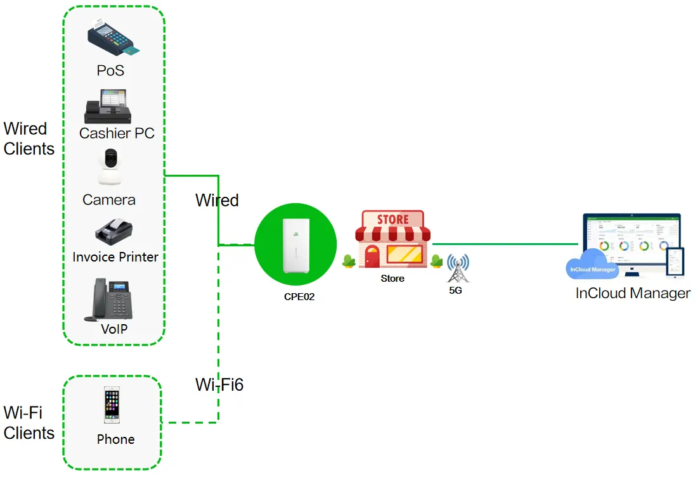

<strong>Figure 1-1 Application Case</strong>

(Original manuscript does not contain detailed appearance and interface diagrams, to be supplemented)

| Interface | Position | Function Description |
|-----------|----------|---------------------|
| WAN/LAN Port | Rear | Ethernet port for wired network access or local device connection |
| LAN Port | Rear | Ethernet port for local device connection |
| SIM Card Slot | Side | For inserting external SIM card |
| Power Interface | Rear | DC power input |
| Reset Button | Front/Side | Restore factory settings |
| WPS Button | Front | One-touch Wi-Fi connection |
| Cellular Antenna Interfaces | Rear | 4x cellular antenna connectors |
| Wi-Fi Antenna Interfaces | Rear | 4x Wi-Fi antenna connectors |

(Original manuscript not detailed for complete interface specifications, to be supplemented)

## 1.4 Indicator Description

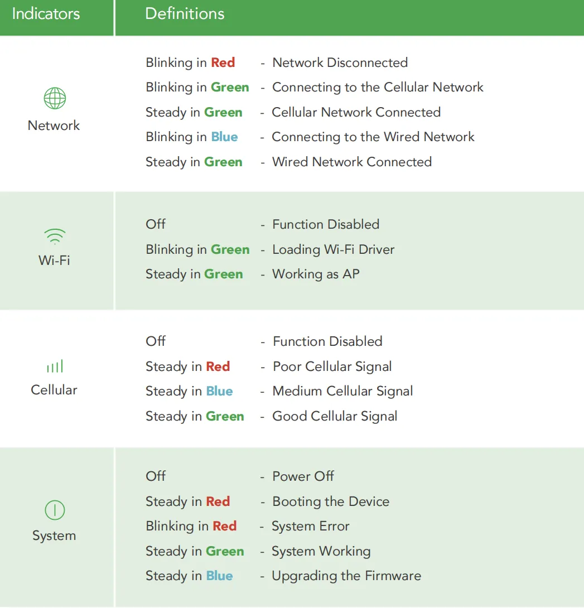

<strong>Figure 1-2 Indicator Description</strong>

| Indicator | Status | Meaning |
|-----------|--------|---------|
| Network | Off | Device not powered on |
| | Red flashing | Network connection disconnected |
| | Green flashing | Cellular network connecting |
| | Blue flashing | Wired network connecting |
| | Solid green | Cellular network connected / Wired network connected successfully |
| Wi-Fi | Off | Function disabled |
| | Green flashing | Wi-Fi driver loading |
| | Solid green | AP mode active |
| Cellular | Off | Function disabled |
| | Solid red | Poor cellular signal |
| | Solid blue | Moderate cellular signal |
| | Solid green | Strong cellular signal |
| SYS (System Status) | Off | Device not powered on |
| | Solid red | System booting |
| | Red flashing | System error |
| | Solid green | System running normally |
| | Solid blue | Software upgrading |

## 1.5 Restoring Factory Settings

1. Power on the device. When the SYS indicator is solid red, press and hold the Reset button (approximately 50 seconds) until the SYS indicator turns solid blue.
2. Release the Reset button. The SYS indicator will flash blue. Press and hold the Reset button again. Once the SYS indicator turns solid blue, release it to start the factory reset process.

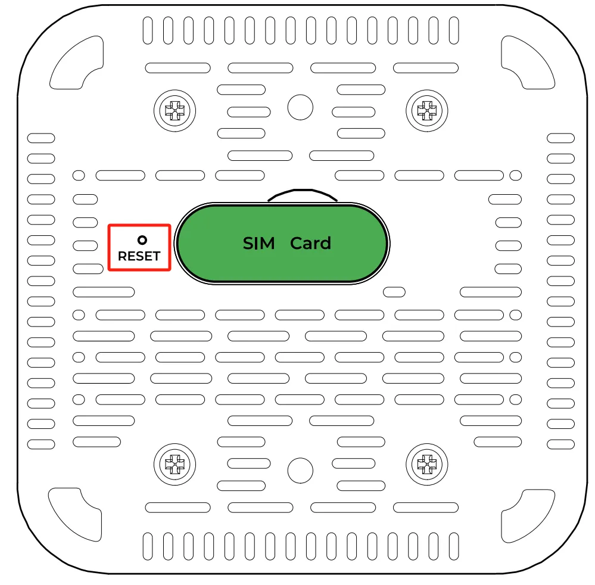

<strong>Figure 1-3 Reset Button</strong>

## 1.6 Default Settings

| No. | Function | Default Settings |
|-----|----------|------------------|
| 1 | Cellular | Dual SIM cards enabled, using SIM1 by default |
| 2 | Wi-Fi | Wi-Fi 2.4G access point enabled, SSID: Prefixed with "CPE02-", followed by the last 6 digits of the wireless MAC address. Wi-Fi 5G access point enabled, SSID: Prefixed with "CPE02-5G-", followed by the last 6 digits of the wireless MAC address. Authentication method is WPA2-PSK. Password for both is the last 8 digits of the serial number. |
| 3 | Ethernet | 1 WAN port and 1 LAN port enabled. IP Address: 192.168.2.1, Subnet Mask: 255.255.255.0. DHCP server enabled, address pool from 192.168.2.2 to 192.168.2.100 |
| 4 | Management Services | Local HTTP and HTTPS enabled, ports 80 and 443 respectively. Access from cellular network disabled |
| 5 | Username and Password | Check the device's nameplate for login credentials |

---

# Chapter 2 Installation and First Use

## 2.1 Pre-Installation Preparation

Before installing the device, confirm the following items are prepared:

| Item | Requirement |
|------|-------------|
| SIM Card | Valid SIM card with data plan activated (for cellular access) |
| Antennas | All cellular and Wi-Fi antennas must be properly installed |
| Power Adapter | Use the original power adapter included in the package |
| Ethernet Cable | For wired connection to PC or upstream network device |
| PC or Terminal Device | For accessing the Web management interface |
| Web Browser | Chrome, Firefox, Edge, or other modern browsers |

> **Caution**: Use only the provided original power adapter to prevent potential device damage resulting from using incompatible power adapters.

> **Caution**: During installation, ensure the device is positioned away from areas with strong electromagnetic interference and maintains a safe distance from high-power equipment.

> **Caution**: Make certain that the device operates within the temperature and humidity specifications outlined in the product specifications.

## 2.2 Installation Guide

### 2.2.1 Installing Antennas

Install all cellular antennas and Wi-Fi antennas onto the corresponding antenna interfaces on the rear panel of the device. Ensure the antennas are tightened securely.

### 2.2.2 Installing the SIM Card

1. Insert the SIM card into the SIM card slot and securely close the SIM card cover.
2. Ensure the SIM card is properly seated and the cover is fully closed.

### 2.2.3 Connecting Power

1. Check the power cable to ensure there are no damaged or exposed wires.
2. Connect the power adapter to the device's power interface.
3. Plug the power adapter into a reliable power source.
4. Wait for the device to boot up (SYS indicator changes from solid red to solid green).

> **Caution**: After installation, verify that the device is securely mounted to prevent accidental falls and potential damage.

### 2.2.4 Connecting via Ethernet Cable

1. Connect the PC to the device's LAN port using an Ethernet cable.
2. The device's LAN port has DHCP Server functionality enabled by default. The PC will automatically obtain an IP address.
3. Ensure the PC and 5G CPE02 are in the same address range (192.168.2.x).

If the PC fails to obtain an IP address automatically, configure it with a static IP address:

| Parameter | Value |
|-----------|-------|
| IP Address | 192.168.2.x (Choose an available address within 192.168.2.2 to 192.168.2.254) |
| Subnet Mask | 255.255.255.0 |
| Default Gateway | 192.168.2.1 |
| DNS Servers | 8.8.8.8 (or ISP's DNS server address) |

### 2.2.5 Logging In to the Web Interface

1. Open a web browser and enter the default device address `192.168.2.1` in the address bar.
2. Enter the username and password (check the product nameplate to obtain the credentials).
3. Access the device's web management interface. If the page shows a security warning, click "Hide" or "Advanced" and select "Proceed" to continue.

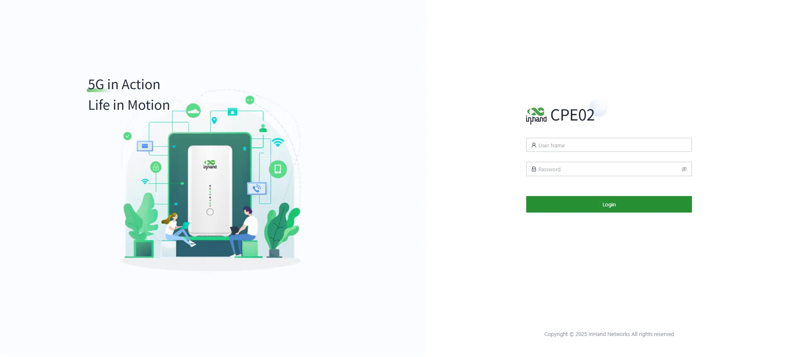

<strong>Figure 2-1 Web Login Interface</strong>

4. After successful login, check the network status in 【Dashboard】→【Interface Status】. The device connects to the Internet successfully if the "Cellular" or "WAN" icon turns green.

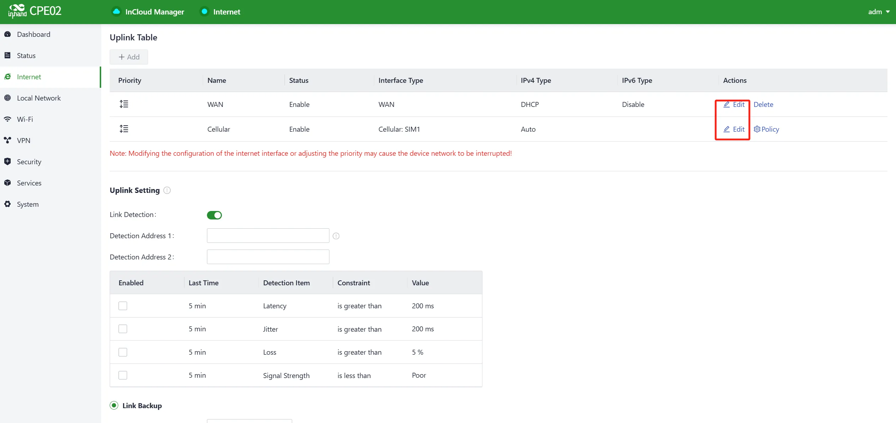

<strong>Figure 2-2 Edit the Uplink Interface</strong>

### 2.2.6 WPS Button Connection

If the terminal device supports the WPS function, password-free connection to the Wi-Fi SSID can be achieved by using the WPS button. Terminal devices with iOS/macOS operating system currently do not support this feature.

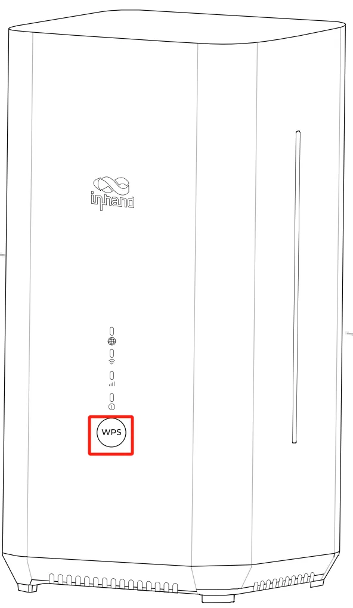

<strong>Figure 2-3 WPS Button</strong>

1. Locate the WPS button on the front of the CPE02 and press it for 5 seconds to enable the 2.4G Wi-Fi function.
2. Turn on the WPS switch in the WLAN settings of the terminal device, and select the SSID of CPE02.

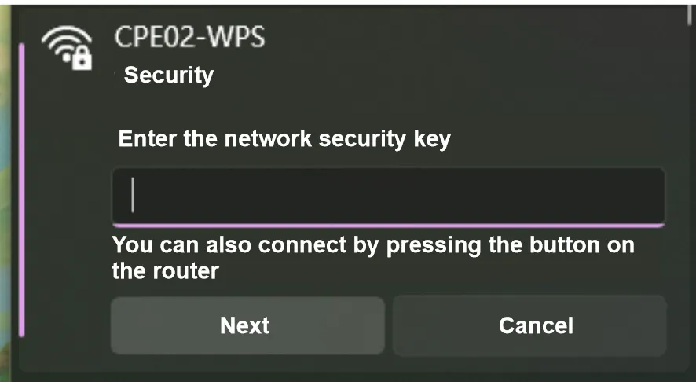

<strong>Figure 2-4 Select a CPE02 SSID</strong>

3. Press the WPS button on the front of the CPE02.

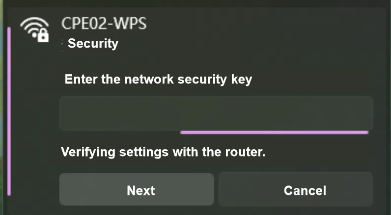

<strong>Figure 2-5 Password-free Connection</strong>

4. Wait for the terminal to connect to the CPE02. The WPS function on the CPE02 will automatically deactivate after 120 seconds.

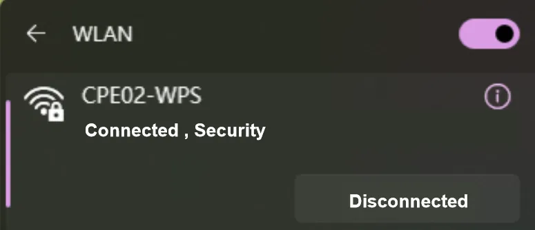

<strong>Figure 2-6 Connection Successful</strong>

## 2.3 Quick Check

After completing installation, verify the following items:

- [ ] All antennas are properly installed and tightened
- [ ] SIM card is inserted correctly and the cover is closed
- [ ] Power adapter is connected securely and the device is powered on
- [ ] SYS indicator shows solid green (system running normally)
- [ ] Cellular/WAN indicator shows connection status (green or blue)
- [ ] PC can obtain an IP address via DHCP or static configuration
- [ ] Web management interface is accessible at 192.168.2.1
- [ ] Internet connection is confirmed via Dashboard interface status

---

# Chapter 3 Common Scenario Configuration

## Scenario 1: Cellular Internet Access

**Objective**: Access the Internet via 4G/5G cellular network.

**Prerequisites**: SIM card inserted and antennas installed, device powered on.

**Estimated Time**: About 5 minutes.

**Operation Steps**:
1. Insert the SIM card and install all cellular antennas.
2. Power on the device and wait for the system to boot (SYS indicator solid green).
3. Log in to the Web management interface at `192.168.2.1`.
4. Navigate to 【Internet】→【Uplink Table】, click the "Edit" button on the Cellular interface.
5. Configure the SIM card working mode (Only SIM1 / Only eSIM / Dual Mode).
6. Configure APN parameters if required (obtain APN parameters from the carrier).
7. Click "Save" and wait for the cellular connection to establish.

**Verification**:
1. Check the indicator status: Cellular indicator solid green indicates strong signal and connection.
2. In the Dashboard, verify the Cellular icon is green.
3. Access any Internet website to confirm connectivity.

**Common Issues**:
- Network connection failure: Check SIM card insertion, verify APN parameters, check signal strength.
- Data transmission/reception abnormal: Check signal strength and data plan balance.

## Scenario 2: Wired Broadband Access

**Objective**: Access the Internet via wired broadband (WAN port).

**Prerequisites**: Upstream network device or broadband modem available, Ethernet cable connected to WAN port.

**Estimated Time**: About 5 minutes.

**Operation Steps**:
1. Connect the upstream network device to the CPE02 WAN port using an Ethernet cable.
2. Log in to the Web management interface at `192.168.2.1`.
3. Navigate to 【Internet】→【Uplink Table】, click "Edit" on the WAN1 interface.
4. Select the Internet connection mode:
   - DHCP Client: Obtain IP automatically from upstream device (default).
   - Static IP: Manually assign a static IP address obtained from the ISP.
   - PPPoE: Configure PPPoE username and password for broadband dial-up.
5. Click "Save" and wait for the connection to establish.

**Verification**:
1. In the Dashboard, verify the WAN icon is green.
2. Access any Internet website to confirm connectivity.

**Common Issues**:
- WAN connection failure: Check Ethernet cable connection, verify upstream device DHCP server status, check PPPoE credentials.
- IP address conflict: Ensure the WAN IP and LAN IP are in different subnets.

## Scenario 3: Wi-Fi Configuration

**Objective**: Configure Wi-Fi access points for wireless device connectivity.

**Prerequisites**: Device powered on, Wi-Fi antennas installed.

**Estimated Time**: About 5 minutes.

**Operation Steps**:
1. Log in to the Web management interface at `192.168.2.1`.
2. Navigate to 【Wi-Fi】, select the SSID to configure and click "Edit".
3. Configure the following parameters:
   - SSID name
   - Frequency band (2.4GHz / 5GHz)
   - Authentication method (WPA2-PSK, etc.)
   - Password
   - Maximum number of clients
4. Click "Save" to apply the configuration.

**Notes**:
1. The device comes with two default main SSIDs for 2.4GHz and 5GHz. These main SSIDs cannot have their frequency bands modified or deleted.
2. Once an SSID is added, its frequency band cannot be modified, and the channel will automatically align with the channel of the corresponding main SSID.
3. The CPE02 series products only support AP mode and do not support Wi-Fi STA.
4. The SSID's network can be assigned to a previously created subnet within the local network.

**Verification**:
1. Search for the configured SSID on a wireless terminal device.
2. Connect using the configured password.
3. Access the Internet to confirm connectivity.

## Scenario 4: VPN Configuration

**Objective**: Establish a secure VPN tunnel for remote access or site-to-site connectivity.

**Prerequisites**: Device connected to the Internet, VPN server or peer device parameters available.

**Estimated Time**: About 10 minutes.

**Operation Steps**:
1. Log in to the Web management interface at `192.168.2.1`.
2. For IPSec VPN, navigate to 【VPN】→【IPSec VPN】, click "Add".
3. Configure IPSec VPN parameters: Name, IKE Version, Negotiation Mode, Pre-Shared Key, Uplink Interface, Peer Address, Tunnel Mode, Local Subnet, Peer Subnet, IKE Policy, and IPSec Policy.
4. For L2TP VPN Server, navigate to 【VPN】→【L2TP VPN】→【Server】, enable and configure: Uplink Interface, VPN Connection Address, IP Pool, Username/Password, Authentication Mode.
5. For L2TP VPN Client, navigate to 【VPN】→【L2TP VPN】→【Clients】, click "Add" and configure: Server Address, Username/Password, Authentication Mode.
6. Click "Save" to apply the configuration.

**Verification**:
1. Navigate to 【Status】→【VPN】 to check VPN status and traffic.
2. Verify remote devices can access resources through the VPN tunnel.

**Common Issues**:
- Tunnel not established: Check Pre-Shared Key consistency, verify peer address reachability, check IKE policy compatibility.
- No traffic through tunnel: Verify local and peer subnet configuration, check firewall rules.

## Scenario 5: Cloud Platform Management

**Objective**: Manage the device remotely via the InCloud Manager platform.

**Prerequisites**: Device connected to the Internet, InCloud Manager account registered.

**Estimated Time**: About 10 minutes.

**Operation Steps**:
1. Register for an InCloud Manager account at https://star.inhandcloud.com/.
2. Log in to the cloud platform and navigate to the Devices menu.
3. Click "Add" and enter the device's serial number and MAC address.
4. The device automatically connects to the InCloud Service after establishing an Internet connection by default.
5. If cloud management needs to be disabled, navigate to 【System】→【Cloud Management】 on the local Web interface and disable it.
6. On the platform, click the device name to access the device details page for remote monitoring and configuration.

**Notes**:
1. When a device is added for the first time, it comes with a complimentary 3-year free Basic Edition license.
2. Users can renew licenses as needed in the future.
3. For features like bulk configuration deployment, firmware upgrades, and Connector, cloud platform access is required.

**Verification**:
1. The device appears online in the InCloud Manager device list.
2. Real-time device status, traffic statistics, and signal strength are visible on the platform.
3. Remote access to the device local interface is available via the platform.

---

# Chapter 4 Feature Description and Parameter Reference

## 4.1 Monitoring

Once the device is added to the platform, the network can be managed and monitored from the platform, supporting viewing real-time status information on the device local interface remotely.

### 4.1.1 Platform Monitoring Overview

In the "Devices" section, click on the "Device Name" to access the device's details page.

**Overview**

Click 【Dashboard】 in the left menu to access the dashboard interface. Device information, interface status, traffic statistics, cellular signal strength, and the number of connected Wi-Fi devices can be viewed here.

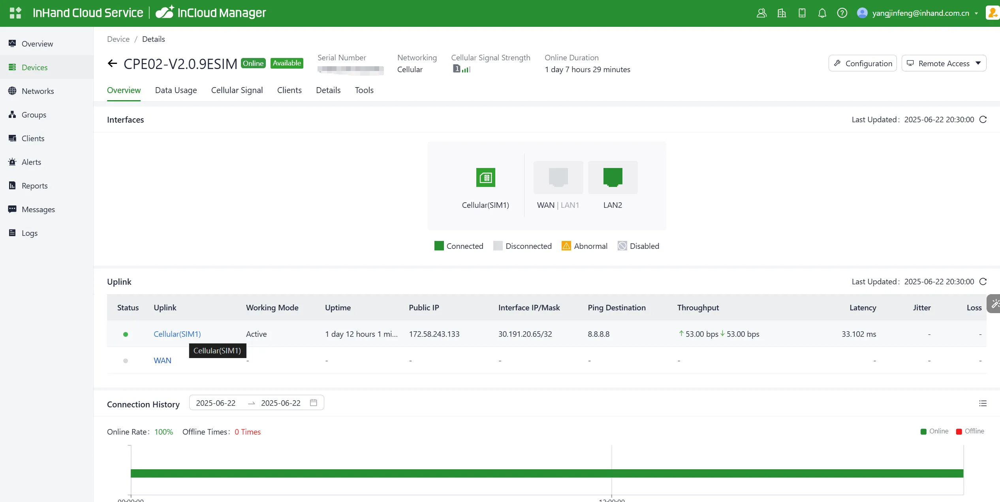

<strong>Figure 4-1 View the Device Dashboard</strong>

Click the interface name under 【Uplink】 to view the interface details.

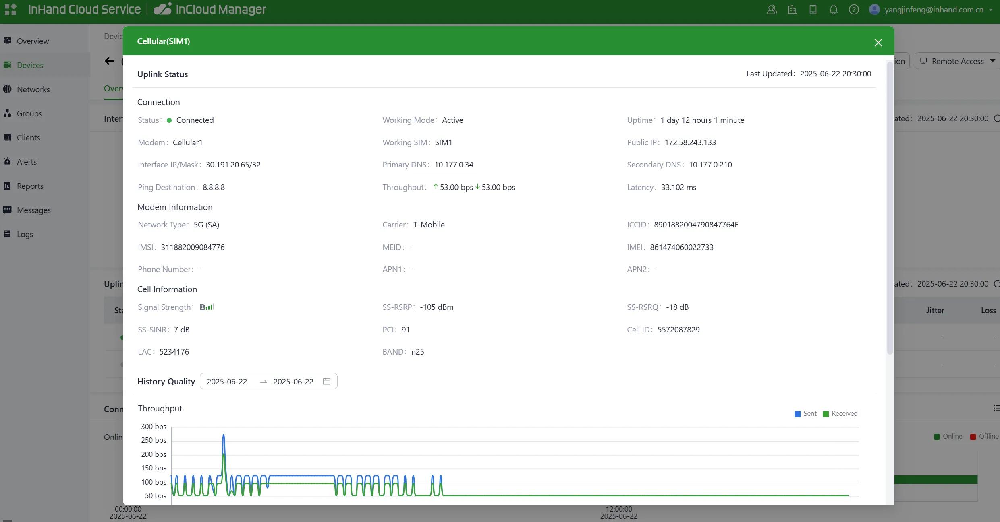

<strong>Figure 4-2 View Interface Details</strong>

**Data Usage**

In this function, traffic usage and historical data of various uplink links can be viewed, including a breakdown by year, month, and day.

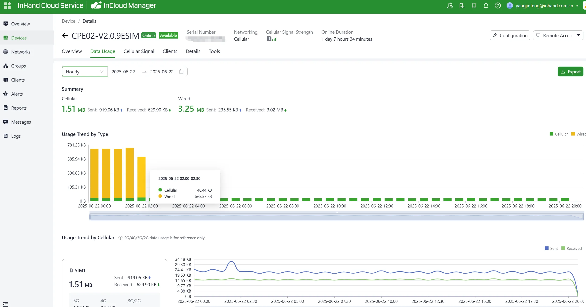

<strong>Figure 4-3 Check Traffic Data Usage Record</strong>

**Cellular Signal**

In this function, cellular signal curves such as RSSI, RSRP, RSRQ, and SINR can be viewed.

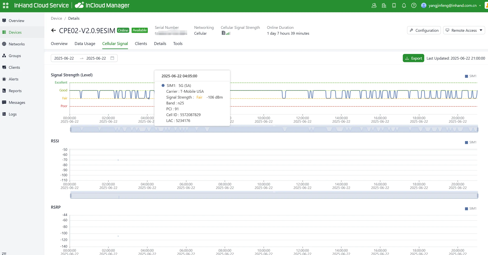

<strong>Figure 4-4 Cellular Signal</strong>

**Clients**

Through this feature, recently connected wired and wireless terminals to the CPE02 can be viewed.

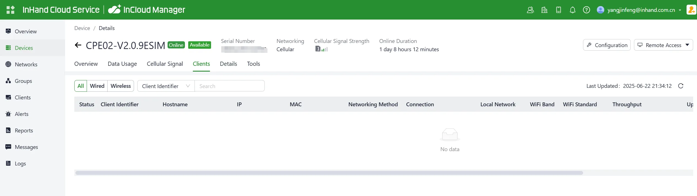

<strong>Figure 4-5 Clients</strong>

**Details**

Through 【Details】, basic device information such as model, IP, MAC, group, and configuration status; license details including current status and expiration date; the latest available software version; and device location information can be viewed.

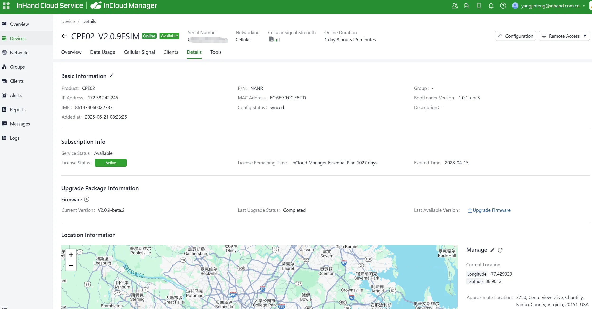

<strong>Figure 4-6 Details</strong>

**Tools**

The Tools menu offers three commonly used features to help diagnose and troubleshoot network issues.

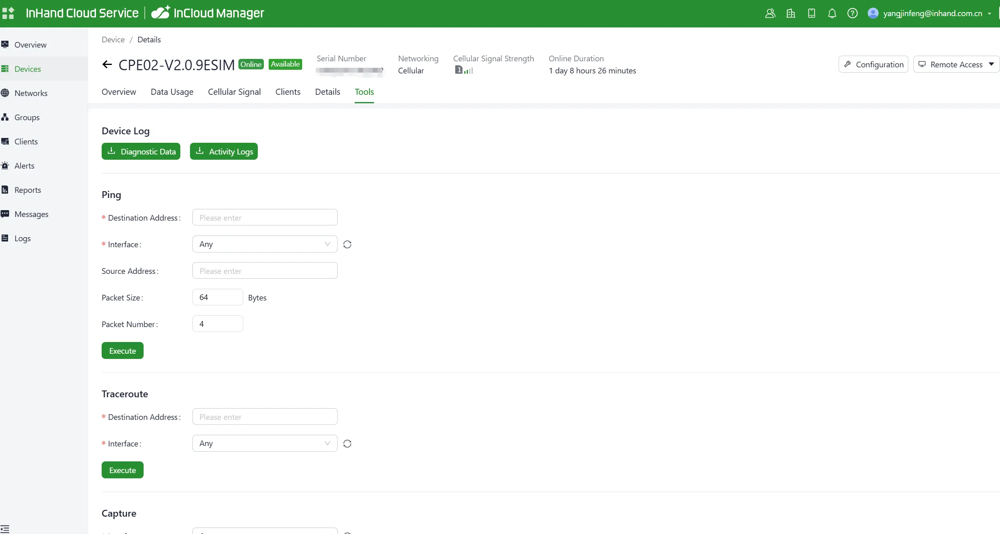

<strong>Figure 4-7 Tools</strong>

1. **Ping**: Check the network connectivity between the device and the target address, with customizable ping parameters.
2. **Traceroute**: Trace the number of hops required for the device to reach the target address.
3. **Capture**: Capture data packets on a specified interface.

### 4.1.2 Local Device Information

Through the platform's "Remote Access" feature, real-time viewing and configuring of devices can be assisted. Select the target device, click "Remote Access," and the device's local login interface will open.

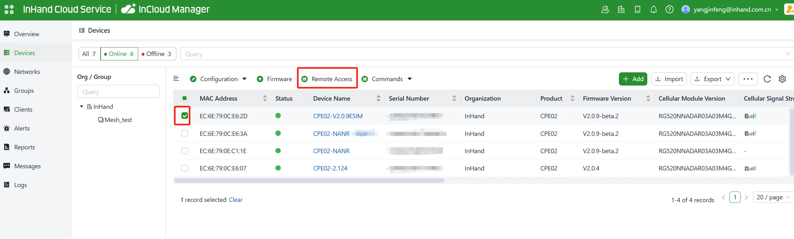

<strong>Figure 4-8 Remote Access Entry</strong>

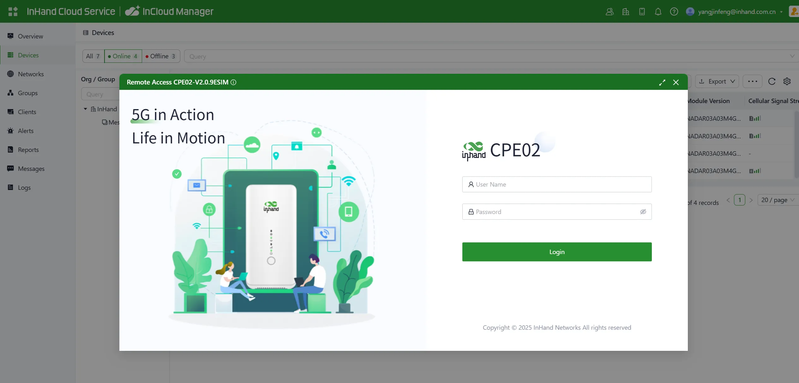

<strong>Figure 4-9 Access Local Device Login Page</strong>

**Device Information**

In the 【Dashboard】→【Device Information】 interface, details about the device name, model, S/N, firmware version, and so on can be checked.

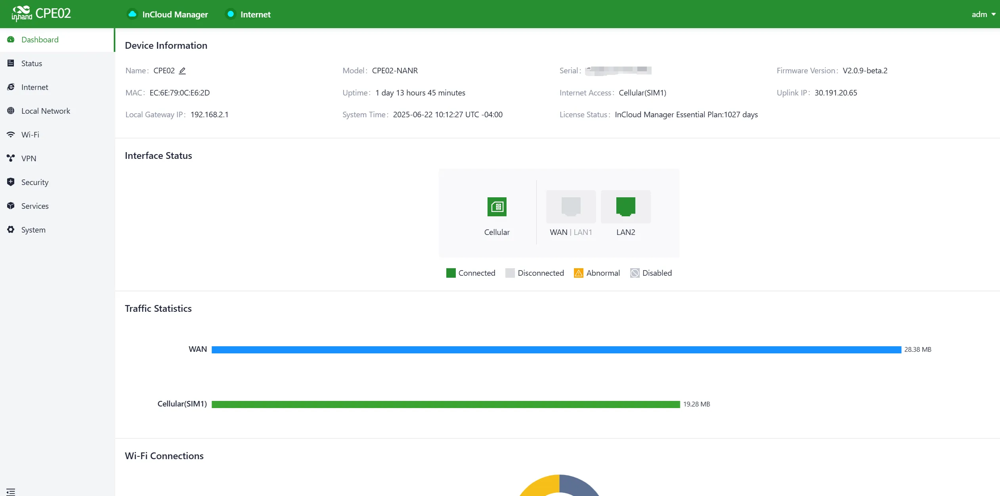

<strong>Figure 4-10 Device Information Panel</strong>

| Parameter | Description |
|-----------|-------------|
| Name | Identifies the device's name, default is "CPE02", modifiable |
| MAC Address | Identifies the device's physical MAC address |
| Local Gateway IP | The default subnet gateway address for the device |
| Model | The specific model of the device, determines cellular and WLAN feature support |
| Uptime | The device's running time since power-up |
| System Time | Displays the device's time zone and system time |
| Serial | A unique code identifying the device, used for indexing or adding to a platform account |
| Internet Access | The upstream interface used for device connectivity |
| License Status | Information about the license applied to the device (InCloud Manager Basic or Professional) |
| Firmware Version | The current software version used by the device |
| Uplink IP | The IP address of the upstream interface used for device connectivity |

 **Interface Status**

In the 【Dashboard】→【Interface Status】 feature, the operational status of each interface can be visually checked. Click on the interface name to view details.

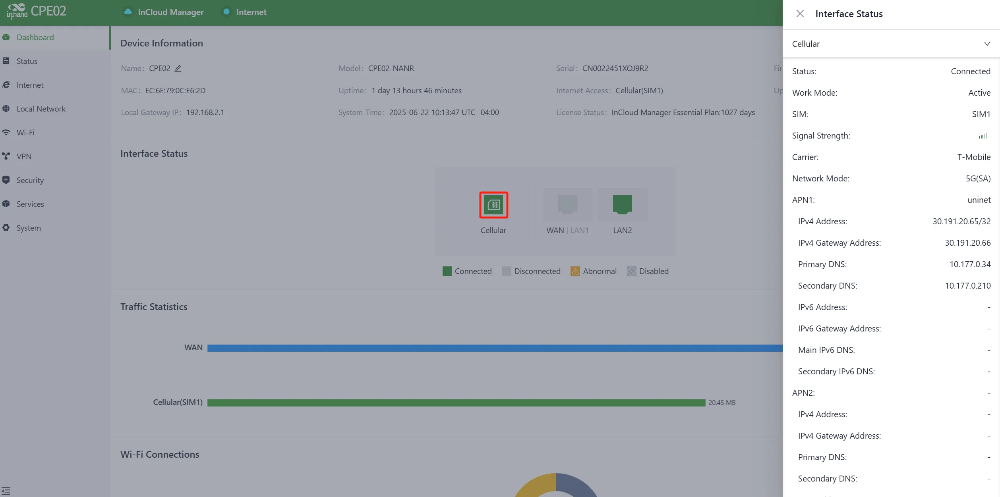

<strong>Figure 4-11 Cellular Information</strong>

**Traffic Statistics**

The 【Dashboard】→【Traffic Statistics】 feature monitors traffic usage on each upstream interface since the router was powered on. Traffic statistics data will reset after a device reboot. Historical traffic records can be viewed on the device's details page in the InCloud Manager Platform.

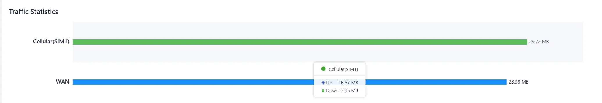

<strong>Figure 4-12 Traffic Statistics</strong>

**Wi-Fi Connections**

In the 【Dashboard】→【Wi-Fi Connections】 feature, the number of currently enabled SSIDs on the 5G CPE02 and the number of clients connected per SSID can be viewed.

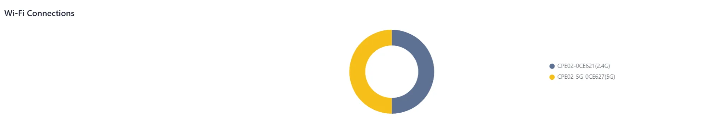

<strong>Figure 4-13 Wi-Fi Connections Panel</strong>

**Link Monitor**

The 【Status】→【Link Monitoring】 feature monitors the health status of upstream links and provides information such as throughput, latency, packet loss, and signal strength for each interface.

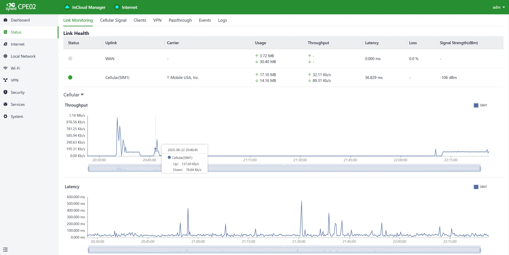

<strong>Figure 4-14 Link Monitor Panel</strong>

 **Cellular Signal**

The 【Status】→【Cellular Signal】 feature displays signal strength as well as parameters like RSSI, SINR, RSRP, and RSRQ of the cellular dial-up.

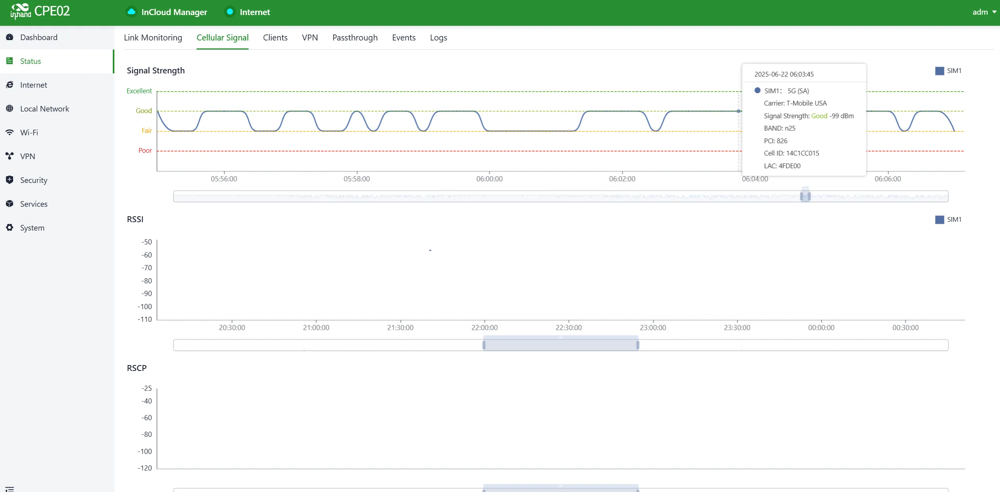

<strong>Figure 4-15 Cellular Signal Panel</strong>

**Clients**

The 【Status】→【Clients】 feature provides detailed information about wired/wireless clients connected to the router, including name, IP address, MAC address, VLAN, connected subnet, traffic usage, and online duration.

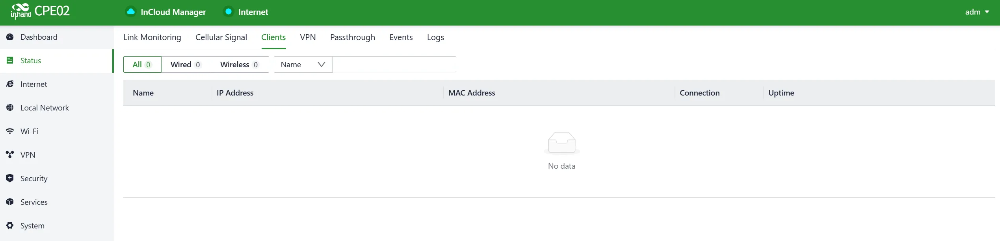

<strong>Figure 4-16 Clients Panel</strong>

 **VPN**

The 【Status】→【VPN】 feature displays information about IPSec VPN and L2TP VPN, including status, traffic, and the duration of the most recent connection.

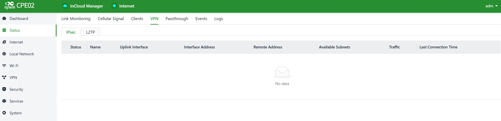

<strong>Figure 4-17 VPN Status Panel</strong>

**Passthrough**

Through the IP Passthrough function, terminal devices can directly obtain a public IP address assigned by the carrier, rather than using a private IP address with NAT mapping to the public network. The status page displays the working status of Passthrough.

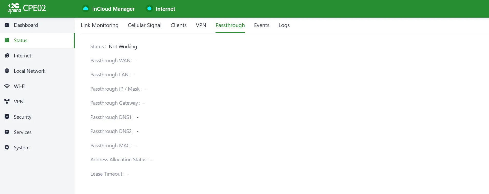

<strong>Figure 4-18 Passthrough Status</strong>

| Parameter | Description |
|-----------|-------------|
| Status | Working status of Passthrough |
| Passthrough WAN | The uplink of Passthrough transmission |
| Passthrough LAN | The LAN interface to which Passthrough is transmitted |
| Passthrough IP/Mask | The IP address and subnet mask of the Passthrough |
| Passthrough Gateway | The gateway address of the Passthrough |
| Passthrough DNS1/2 | The DNS resolution address when Passthrough is active |
| Passthrough MAC | The MAC address obtained by Passthrough |
| Address Allocation Status | The status of Passthrough address allocation |
| Lease Timeout | The lease time of Passthrough |

 **Events**

The device records event logs, including user login, configuration changes, link changes, reboot, and other events. This information can be checked in the 【Status】→【Events】 interface. Specific events on a particular date can be viewed by setting the start and end dates or choosing the event type.

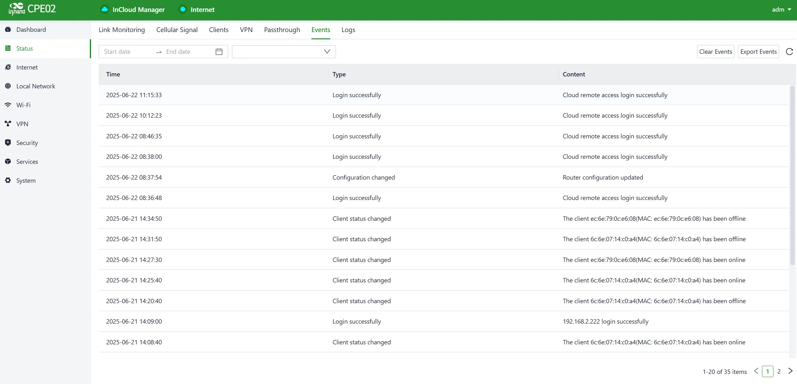

<strong>Figure 4-19 Events Records</strong>

**Logs**

The device records logs generated during operation to facilitate fault localization and diagnosis. The recorded logs can be checked in the 【Status】→【Logs】 interface. Specific logs on a particular date can be viewed by setting the start and end dates or setting keywords.

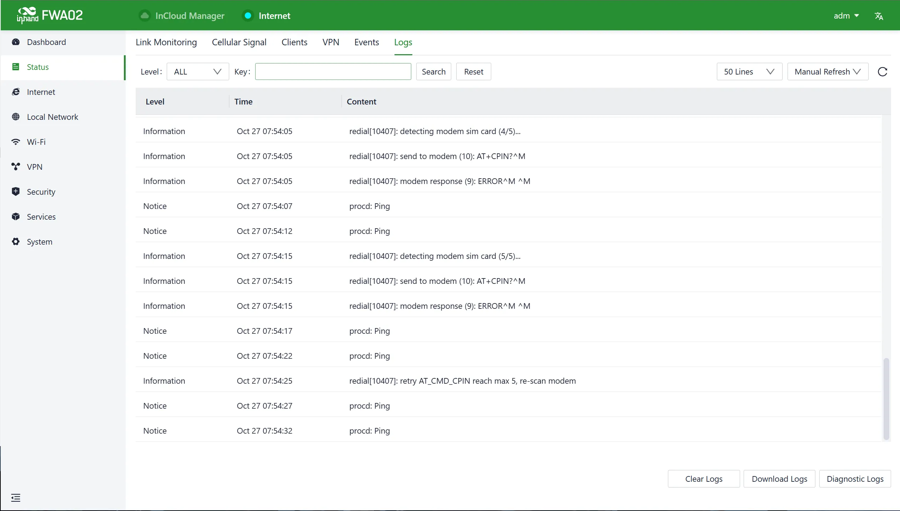

<strong>Figure 4-20 Logs Interface</strong>

| Function | Description |
|----------|-------------|
| Download Logs | Download the device's operational logs |
| Download Diagnostic Logs | Download diagnostic logs including system operation logs, device information, and device configurations |
| Clear Logs | Clear the device's operational logs; diagnostic logs are not cleared |

## 4.2 Internet

Click 【Internet】 in the left menu to check and configure the uplink interfaces and multi-link work mode of this device.

> **Caution**: Exercise caution when modifying the upstream link settings as it may result in network interruption.

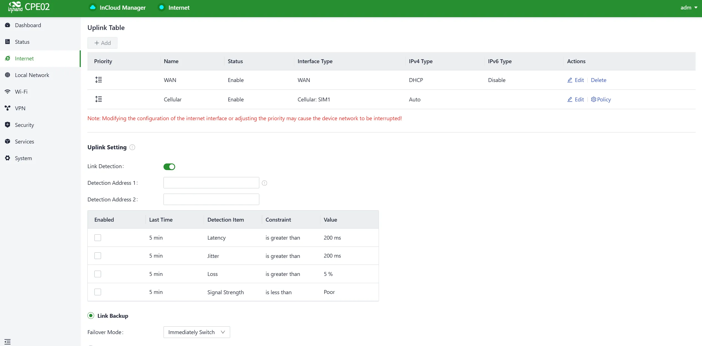

<strong>Figure 4-21 Internet Page</strong>

### 4.2.1 Uplink Table

Users can edit the cellular interface and WAN1 interface in the 【Internet】→【Uplink Table】 section. By deleting the WAN1 interface, WAN1 will switch to LAN1. When WAN1 needs to be used again, click "Add" on this page. Drag the "Priority" icon to adjust the priority of each interface. The priorities are arranged from top to bottom, determining the uplink interface the device currently uses.

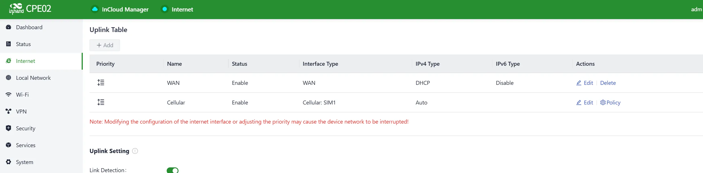

<strong>Figure 4-22 Uplink Table</strong>

> **Cautions**:
> 1. When the WAN1 interface is deleted, it will be switched to the LAN1 interface. Routing, policy routing, inbound/outbound rules, port forwarding, DDNS, and VPN related to the WAN interface will be deleted.
> 2. The WAN port of the device supports three different Internet connection modes.

#### DHCP Client

The DHCP service is enabled on the WAN1 port by default. This means the device cannot connect to the Internet immediately if the upstream device connected to the WAN port does not have the DHCP server enabled.

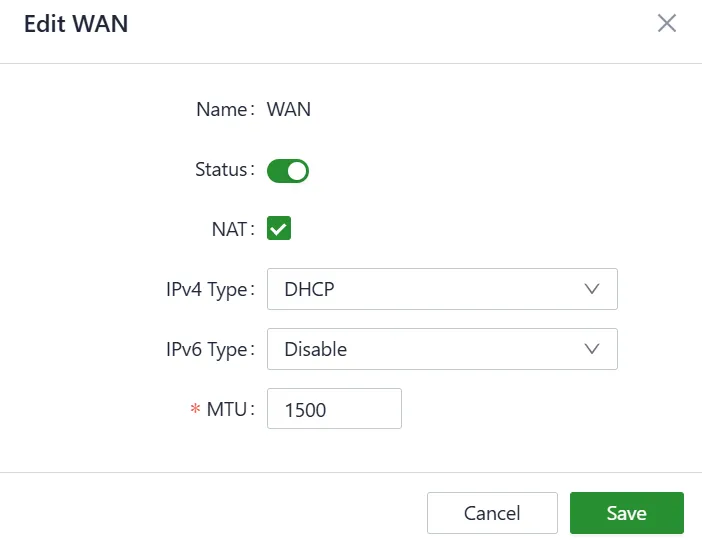

<strong>Figure 4-23 DHCP Client</strong>

#### Static IP

A static IP address obtained from the ISP or upstream network device can be manually assigned.

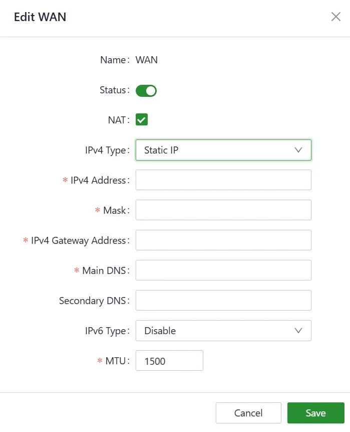

<strong>Figure 4-24 Set the Static IP</strong>

#### PPPoE

Users can set the PPPoE service on the WAN port. The device can then dial up to the Internet through the broadband service.

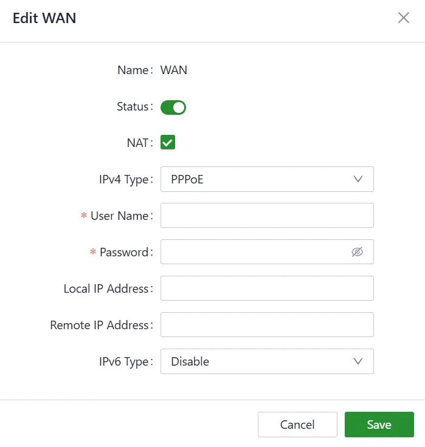

<strong>Figure 4-25 Set the PPPoE Service</strong>

#### Cellular Interface Configuration

The Cellular interface supports three working modes of SIM cards. The SIM card working mode and other cellular parameters can be configured in 【Internet】→【Uplink Table】→【Cellular】.

1. **Only SIM1**: The CPE02 uses only the external SIM card for dialing, which is the default working mode for cellular dialing on the CPE02.
2. **Only eSIM**: The CPE02 only supports built-in SIM card dialing. When using eSIM, confirm the APN username and password with the local carrier or service provider.
3. **Dual Mode**: The CPE02 can operate in both external SIM card and eSIM modes, prioritizing the primary card for dialing.

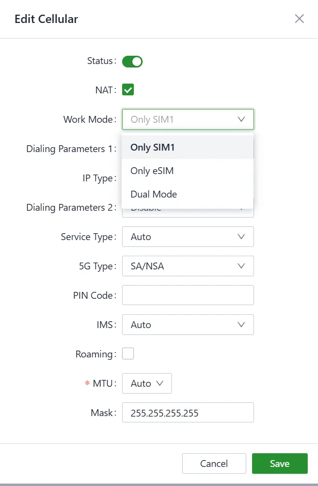

<strong>Figure 4-26 Configure the Cellular Interface</strong>

### 4.2.2 Uplink Settings

Users can configure link detection-related settings in the 【Internet】→【Uplink Setting】 feature and configure the collaboration mode between various uplink interfaces.

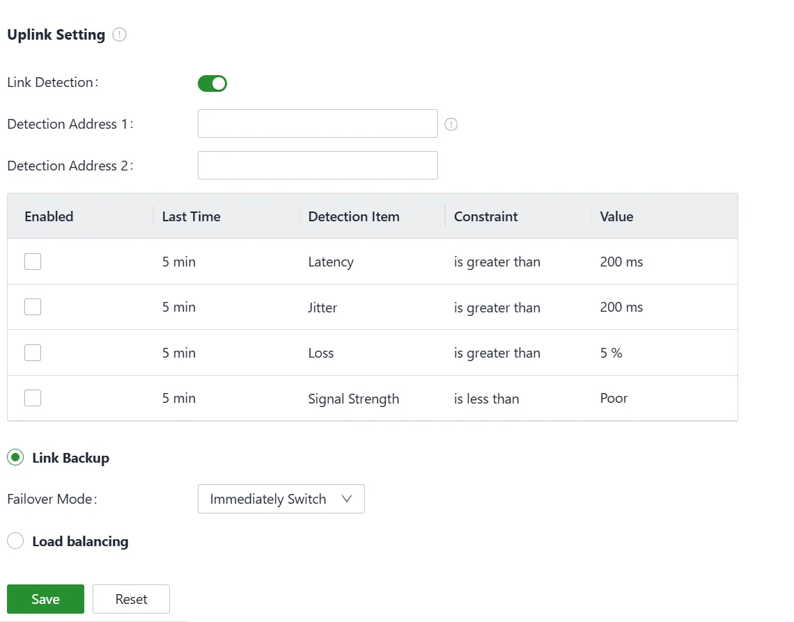

<strong>Figure 4-27 Uplink Settings</strong>

"Link detection" is enabled by default. In a private network environment, manually configure the address in "Detection Address" or disable the link detection function to prevent the cellular interface from malfunctioning.

> **Cautions**:
> **Link detection switch**: When enabled, it detects the connectivity of all uplink interfaces and is enabled by default.
> **Detection address**: Fill in the specified probe address.
> 1. After filling in, all uplink links will only detect this address. When the address cannot be detected, the equipment networking will be affected.
> 2. If it is not filled in, the device will detect the DNS address and alternative detection address of the uplink interface, and select the available detection address from them.

> **Link switching based on detection items**: In the link backup mode, users can set detection items to trigger the switching between links and SIM cards.
> The following conditions need to be met simultaneously:
> 1. Link detection switch on
> 2. Enable detection item
> 3. It works in the link backup mode and is not the "do not switch" option

## 4.3 Local Network

The LAN network of the device can be configured in 【Local Network】→【Local Network List】. The newly created local subnet can be applied to a specific physical LAN port in interface management or to a designated SSID in Wi-Fi settings.

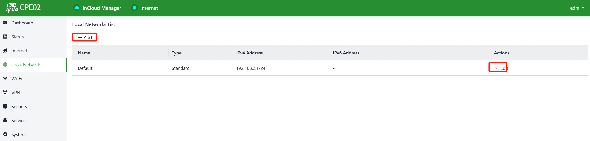

<strong>Figure 4-28 Local Network Interface</strong>

When a new subnet needs to be added or edited, it can be created or modified on this page.

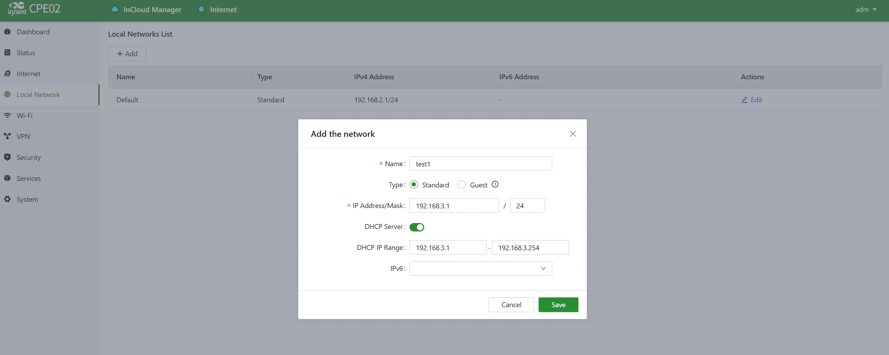

<strong>Figure 4-29 Configure the LAN Network Parameters</strong>

## 4.4 Wi-Fi

Wi-Fi is an important feature in small and medium-sized stores and home networks. The CPE02-NANR supports a maximum Wi-Fi 6 speed of 5400Mbps, offering dual-frequency bands of 2.4GHz and 5GHz to meet most Wi-Fi connectivity needs.

The 5G CPE02 can function as an access point (AP) and provide multiple SSIDs for wireless network access, allowing users to customize different SSIDs for various purposes and configuration.

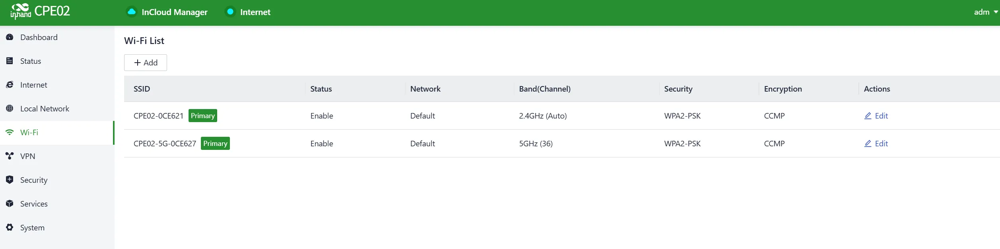

<strong>Figure 4-30 Wi-Fi Interface</strong>

Parameters can be configured by clicking the "Edit" button.

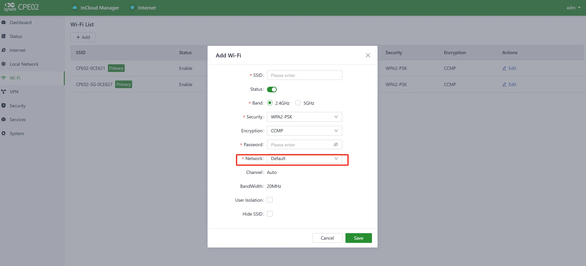

<strong>Figure 4-31 Set the SSID Parameters</strong>

> **Notes**:
> 1. The device comes with two default main SSIDs for 2.4GHz and 5GHz. These main SSIDs cannot have their frequency bands modified or deleted.
> 2. Once an SSID is added, its frequency band cannot be modified, and the channel will automatically align with the channel of the corresponding main SSID.
> 3. The CPE02 series products only support AP mode and do not support Wi-Fi STA.
> 4. The SSID's network can be assigned to a previously created subnet within the local network.

## 4.5 VPN

A VPN (Virtual Private Network) is designed to create a secure and private network within a public network, enabling encrypted communication. With a VPN router, remote access is made possible by encrypting data packets and modifying their destination addresses. VPN can be implemented using server-based, hardware-based, or software-based solutions. In comparison to traditional DDN private lines or frame relays, VPN offers a more secure and convenient remote access solution.

### 4.5.1 IPSec VPN

IPsec (Internet Protocol Security) VPN is a protocol suite designed to enhance network communication security. Its primary purpose is to protect the transmission of data through encryption and authentication. It is widely used for establishing secure remote access, site-to-site connections, and virtual private networks (VPNs).

A new IPSec VPN item can be created by 【VPN】→【IPSec VPN】→【Add】. The following parameters must be set correctly.

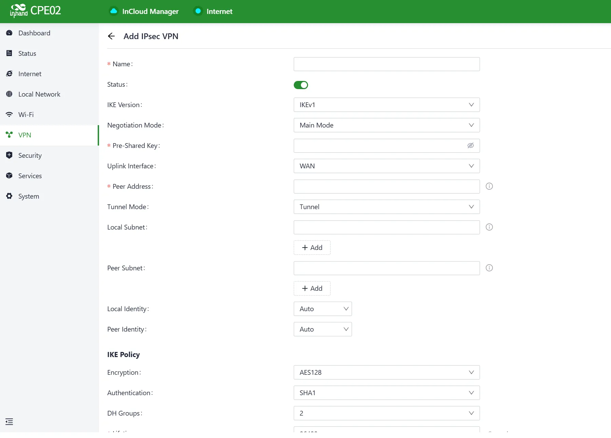

<strong>Figure 4-32 Set the IPSec VPN Parameters</strong>

| Parameter | Description |
|-----------|-------------|
| Name | Specify the name of the IPSec VPN created on the device, used for local VPN management |
| Status | Configure the enable status of the IPsec function |
| IKE Version | Specify the version of the IKE protocol used on this device, IKEv1 and IKEv2 are optional |
| Negotiation Mode | Based on the configuration parameters of the peer device, choose between Main Mode and Aggressive Mode |
| Pre-Shared Key | Specify the authentication key for IKE negotiation, which must be consistent on both sides |
| Uplink Interface | Specify the local uplink interface used to establish the tunnel |
| Peer Address | Specify the IP address of the peer device. The peer address must be set to 0.0.0.0 if the device works as an IPSec VPN server |
| Tunnel Mode | Specify the IP packet encapsulation mode on the IPSec VPN tunnel. Tunnel mode and transmission mode are optional |
| Local Subnet | Specify the IP address segment of the traffic to be sent out by the device through the IPSec VPN tunnel |
| Peer Subnet | Specify the IP address segment used for communication on the remote client |
| IKE Policy - Encryption | Specify the encryption algorithm for IKE |
| IKE Policy - Authentication | Authentication parameters during the IKE negotiation process |
| IKE Policy - DH Groups | Specify the DH key exchange mode |
| IKE Policy - Lifetime | Specify the lifetime of the IKE SA, 86400 is set by default |
| IPSec Policy - Security Protocol | Specify the security protocol used for ESP |
| IPSec Policy - Encryption | Specify the encryption algorithm of the ESP protocol |
| IPSec Policy - Authentication | Specify the authentication algorithm for ESP |
| IPSec Policy - PFS Groups | Specify the Perfect Forward Secrecy (PFS) mode, which improves communication security through an additional key exchange in Phase 2 negotiation |
| IPSec Policy - Lifetime | Specify the lifetime of the IPSec SA, 86400 is set by default |

### 4.5.2 L2TP VPN

The Layer 2 Tunneling Protocol (L2TP) is a Layer 2 VPN protocol designed to provide secure point-to-point or site-to-site virtual private network (VPN) connections. It is commonly used for remote access and branch office connectivity, establishing secure communication channels for users or networks, thus ensuring the privacy and integrity of data transmission.

A new L2TP VPN can be added or the existing one can be configured in 【VPN】→【L2TP VPN】.

**Server**

Typically, the L2TP server is strategically deployed at the enterprise's headquarters to facilitate remote access for employees. The server can be configured in 【VPN】→【L2TP VPN】→【Server】.

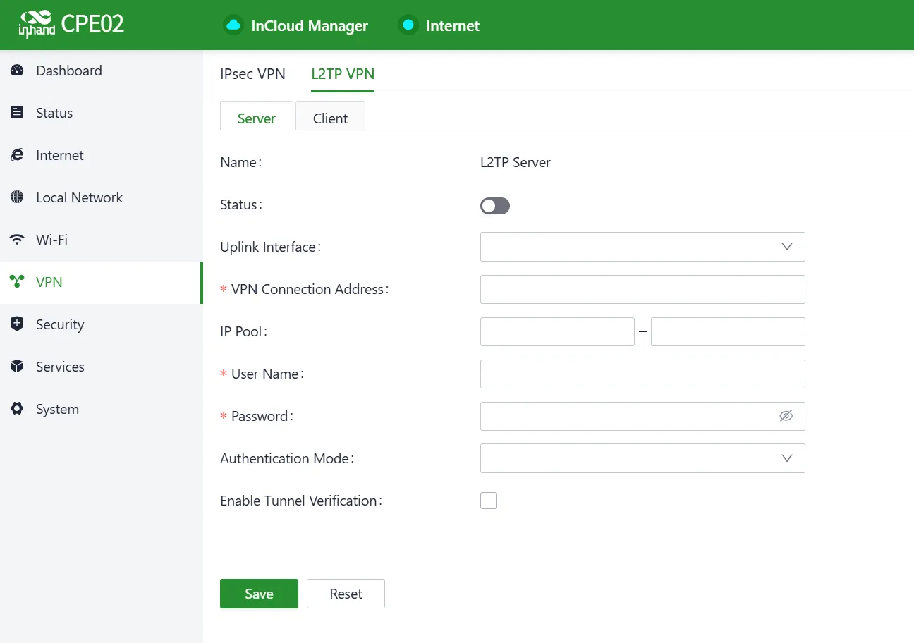

<strong>Figure 4-33 L2TP VPN Server</strong>

Please configure the following parameters based on the actual network requirements.

| Parameter | Description |
|-----------|-------------|
| Name | The name of the L2TP server, which cannot be changed |
| Status | Enable or disable this L2TP server by clicking the switch |
| Uplink Interface | Specify the uplink interface to establish a tunnel from the L2TP server |
| VPN Connection Address | Specify the gateway address for the L2TP VPN client |
| IP Pool | The system will assign an IP address to the L2TP client from the specified IP address pool |
| Username/Password | Specify the username and password for L2TP negotiation, which must be consistent on both ends of the tunnel |
| Authentication Mode | Specify the authentication mode for the L2TP tunnel |
| Enable Tunnel Authentication | Both ends of the tunnel must be configured with the same username and password for this option |

**Client**

The L2TP client parameters can be configured to establish a tunnel with a remote L2TP server in 【VPN】→【L2TP VPN】→【Clients】.

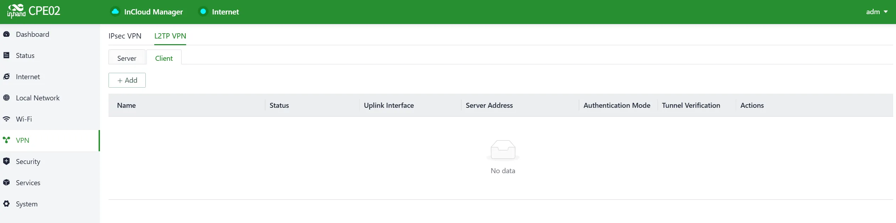

<strong>Figure 4-34 L2TP VPN Client</strong>

Please configure the following parameters based on the actual network requirements.

| Parameter | Description |
|-----------|-------------|
| Name | Specify the local name of the L2TP client tunnel |
| Status | Enable or disable this L2TP client by clicking the switch |
| Uplink Interface | Specify the uplink interface to establish a tunnel with a remote L2TP server |
| Server Address | Specify the IP address set by the remote L2TP server |
| Username/Password | Specify the username and password for L2TP negotiation, which must be consistent on both ends of the tunnel |
| Authentication Mode | Specify the authentication mode for the L2TP tunnel |
| Enable Tunnel Verification | Both ends of the tunnel must be configured with the same server's name and verification key as this option is enabled |

## 4.6 Security

In the 【Security】 menu, the firewall currently includes functions such as inbound rules, outbound rules, port forwarding, MAC address filtering, and more.

### 4.6.1 Inbound/Outbound Rules

**Inbound Rules**: Traffic accessing the internal network from the outside will be restricted by configured inbound rules, which forbid all through by default.

**Outbound Rules**: Traffic accessing the external network from the inside will be restricted by configured outbound rules, which allow all through by default.

Traffic entering and leaving can be controlled based on interfaces using the 【Security】→【Inbound Rules/Outbound Rules】 feature. For example, if a user is experiencing a large volume of attack traffic from a specific source IP address, inbound firewall rules can be used to limit the traffic data from that IP address.

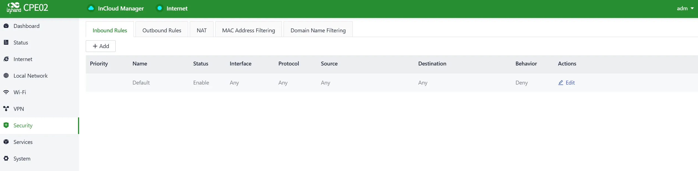

<strong>Figure 4-35 Set the Inbound/Outbound Rules</strong>

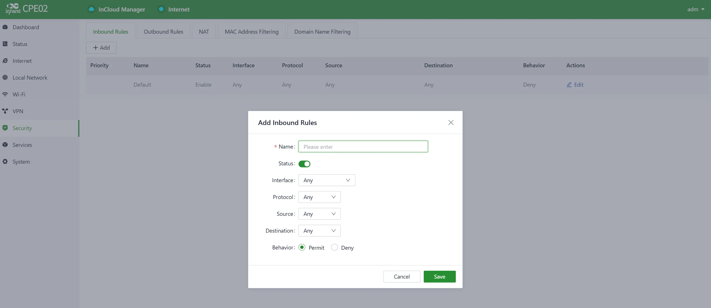

<strong>Figure 4-36 Add an Inbound Rule</strong>

The following parameters must be configured properly.

| Parameter | Description |
|-----------|-------------|
| Name | Set the local identifier of the inbound rule |
| Status | Enable or disable this rule by clicking the switch |
| Interface | Set the forwarding interface for traffic. In the inbound direction, the outbound interface is generally the upstream interface of the device |
| Protocol | Configure the protocol type of packets to be matched. Optional: Any, UDP, TCP, ICMP, Custom |
| Source | Set the source IP address of packets to be matched, supporting IP address or retain the default option Any |
| Destination | Set the destination IP address of the packets to be matched, supporting entering an IP address or retaining the default option Any |
| Behaviour | Set the behaviour if the traffic matches the configured rules |

### 4.6.2 NAT

**Source NAT (SNAT)**: Converts private IP addresses used by devices in a private network (e.g., 192.168.x.x) to a public IP address, enabling devices within the LAN to access the Internet.

**Destination NAT (DNAT)**: Maps data traffic from specific public ports to internal devices (i.e., port forwarding), allowing external access to LAN devices, such as for remote desktop or accessing an internal server.

For example, after setting port forwarding rules as shown below, when users from the public network try to access the device's port 2000 on WAN, the system will transfer the request to 192.168.1.23:8080 in LAN.

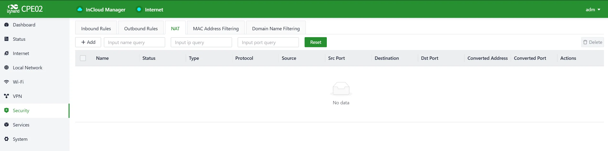

<strong>Figure 4-37 Set the NAT Rules</strong>

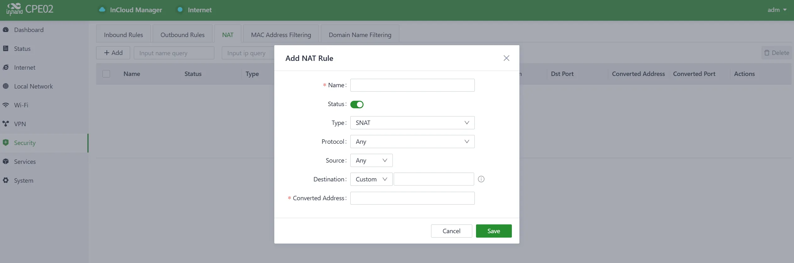

<strong>Figure 4-38 Add a Port Forwarding Rule</strong>

The following parameters must be set properly.

| Parameter | Description |
|-----------|-------------|
| Name | Set the local identifier of the port forwarding rule |
| Status | Enable or disable this rule by clicking the switch |
| Interface | Set the uplink interface that provides port mapping for internal clients. This interface must be configured with a public IP address |
| Protocol | Set the protocol of the port on which port mapping takes effect. Supports TCP, UDP, and TCP&UDP |
| Public Port | Set the protocol port on the uplink interface to be mapped |
| Local Address | Set the IP address of the target client that external users need to access |
| Local Port | Set the protocol port that external users need to access on the target client |

### 4.6.3 MAC Address Filtering

MAC address filtering refers to the practice of blocking or allowing devices to access the Internet based on a list of MAC addresses. Internet access requests from devices within the local network can be controlled using the MAC address filtering feature on the router. MAC address filtering rules can be configured in 【Security】→【MAC Address Filtering】.

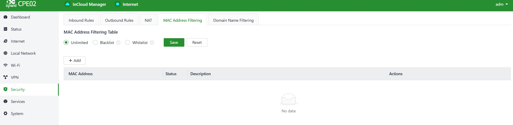

<strong>Figure 4-39 Set the MAC Address Filter Rule</strong>

> **Notes**:
> **Blacklist**: Devices with MAC addresses listed in the blacklist cannot access the Internet.
> **Whitelist**: Only devices with MAC addresses in the whitelist can access the Internet. Before saving the configuration, ensure that the MAC address of the configured device is included in the whitelist.

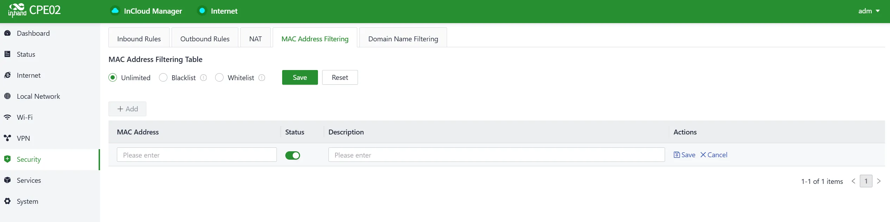

<strong>Figure 4-40 Add a MAC Address Filter Rule</strong>

### 4.6.4 Domain Name Filtering

Which domain names are allowed and which domain names are blocked can be configured based on business requirements.

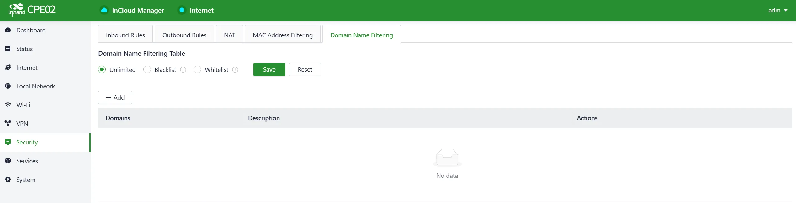

<strong>Figure 4-41 Domain Name Filtering</strong>

The following parameters must be set properly.

| Parameter | Description |
|-----------|-------------|
| Name | Set the local identifier of the rule |
| Status | Enable or disable this rule by clicking the switch |
| Protocol | Set the protocol of the port. Supports TCP, UDP, and TCP&UDP |
| Source | Set the source IP address of packets to be matched, supporting IP address or retain the default option Any |
| Destination | Set the destination IP address of the packets to be matched, supporting entering an IP address or retaining the default option Any |
| Output | Set the traffic egress interface, optional WAN port and cellular |

## 4.7 Service

### 4.7.1 Interface Management

The allowed local networks through a specified interface can be configured, and the interface's network can be set in the 【Services】→【Interface Management】 function.

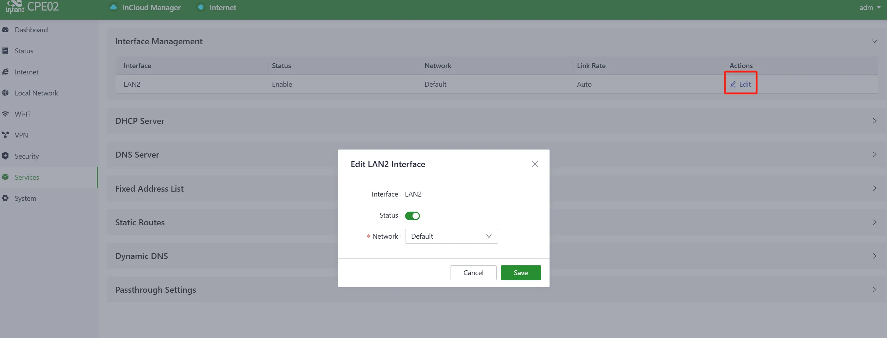

<strong>Figure 4-42 Edit the Interface Management</strong>

### 4.7.2 DHCP Server

The DHCP (Dynamic Host Configuration Protocol) service operates in a client/server communication mode, where clients request IP addresses from servers, and servers respond to these requests by assigning IP addresses dynamically to clients.

The DHCP server's IP address pool can be configured using the 【Services】→【DHCP Server】 feature.

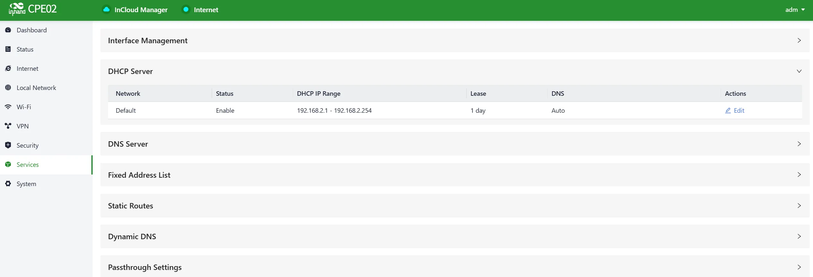

<strong>Figure 4-43 DHCP Server</strong>

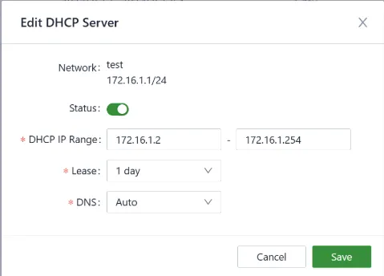

<strong>Figure 4-44 Edit the DHCP Server</strong>

### 4.7.3 DNS Server

DNS (Domain Name System) servers are a critical component of the network. They are responsible for translating human-readable domain names (e.g., www.example.com) into IP addresses that computers can understand (e.g., 192.168.1.1). DNS servers act as the Internet's address book, helping computers and devices locate the whereabouts of other devices and ensuring that information can be correctly transmitted on the network.

When no DNS server address is set in 【Services】→【DNS Server】, the device will use the DNS addresses obtained from the upstream interface for address resolution. Once DNS server addresses are configured, the specified DNS addresses will be used for address resolution.

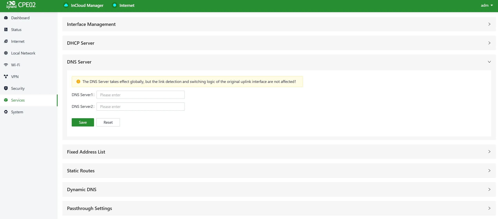

<strong>Figure 4-45 DNS Server</strong>

### 4.7.4 Fixed Address List

A fixed IP address can be allocated to a device based on its MAC address using the 【Services】→【Fixed Address List】 feature. This ensures that the device receives the same IP address every time it connects to the 5G CPE02.

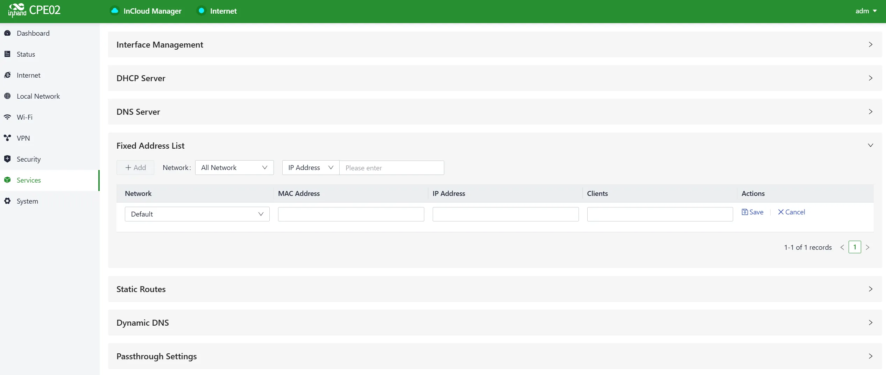

<strong>Figure 4-46 Fixed Address</strong>

> **Cautions**:
> 1. The addresses available for allocation must fall within the address range of the IP-mode local network, or else the configuration will not take effect.
> 2. When a local network is deleted, all fixed address allocation rules within the address range of that local network will also be deleted.

### 4.7.5 Static Routes

Static routing entries can be configured using the 【Services】→【Static Routes】 feature to manually define routes for data to be forwarded through specific paths and interfaces. The contents of the static routing table are created manually by users, and routes generated by other services, such as VPN functionality, will not appear in this table.

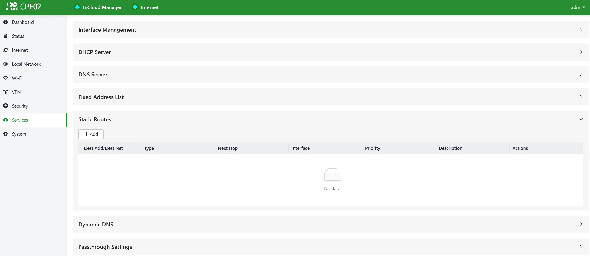

<strong>Figure 4-47 Static Routes</strong>

> **Cautions**:
> 1. Static routes with the same destination address/network cannot have the same next-hop address, interface, or priority. Otherwise, it may lead to routing failures.
> 2. When WAN1 is deleted, the corresponding static routes using those interfaces will also be removed.

### 4.7.6 Dynamic DNS

Dynamic DNS (Dynamic Domain Name System) is used to automatically update the content of name servers in the Domain Name System. According to the rules of the Internet, domain names are usually associated with fixed IP addresses. Dynamic DNS technology provides fixed name servers for users with dynamic IP addresses, allowing external users to connect to users with dynamic IP addresses through regular updates of their URLs.

The Dynamic DNS server address can be manually configured under the 【Services】→【Dynamic DNS】 feature.

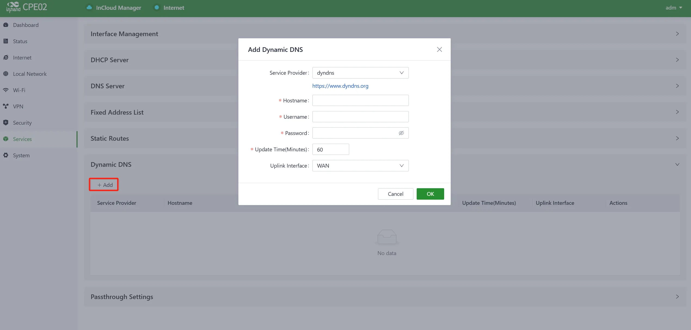

<strong>Figure 4-48 Set the Dynamic DNS Address</strong>

| Parameter | Description |
|-----------|-------------|
| Service Provider | Provided by the dynamic DNS service provider. Choose from dyndns, 3322, oray, no-IP, or customize (requires a URL) |
| Hostname | Click on the URL below the service provider to register and obtain the hostname |
| Username | Click on the URL below the service provider to register and obtain the username |
| Password | The password set by the user during registration |

### 4.7.7 Passthrough Settings

The IP Passthrough feature can be enabled in 【Services】→【Passthrough Settings】. Once enabled, client devices can obtain the upstream interface address of the 5G CPE02.

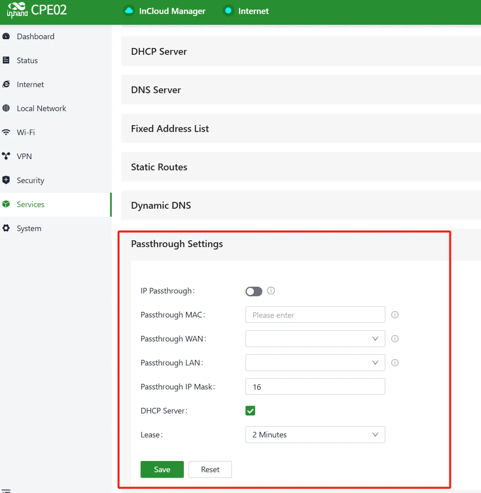

<strong>Figure 4-49 Set the IP Passthrough Mode</strong>

| Parameter | Description |
|-----------|-------------|
| IP Passthrough Switch | The enable switch for the IP Passthrough (IPPT) status |
| Passthrough MAC | Only clients bound to this MAC can obtain the upstream interface address of the device |
| Passthrough WAN | The uplink for IP Passthrough |
| Passthrough LAN | The LAN port for IP Passthrough |
| Passthrough IP Mask | The subnet mask transmitted through the uplink interface for IP Passthrough |
| DHCP Server | The DHCP function switch for IP Passthrough |
| Lease | The lease time for the DHCP service |

## 4.8 System

### 4.8.1 Account Management

Check the device's nameplate for the username and password. To ensure device security, it is recommended to change the password. This can be done by clicking on "adm" in the top navigation bar and selecting "Change Password" from the dropdown menu.

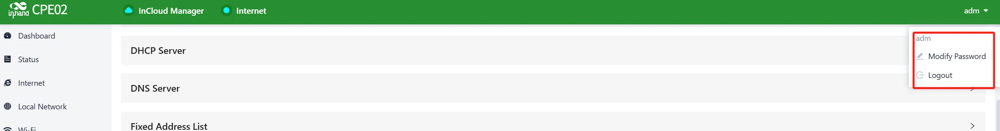

<strong>Figure 4-50 Change the Login Password</strong>

### 4.8.2 Cloud Management

The InCloud Service (star.inhandcloud.com) is a cloud platform developed by InHand Networks to address the challenges faced by enterprise networks, such as slow deployment, complex operations, and poor user experiences. This platform is designed with a focus on user needs and integrates features like zero-touch deployment, intelligent operations and maintenance, security protection, and excellent user experience capabilities. Once devices are connected to the cloud platform, remote management, batch configuration, traffic monitoring, and other operations can be performed through the platform, making network device management more convenient and efficient.

5G CPE02 automatically connects to the InCloud Service after establishing an Internet connection by default. If the cloud management function is not needed, it can be disabled manually in the 【System】→【Cloud Management】 function.

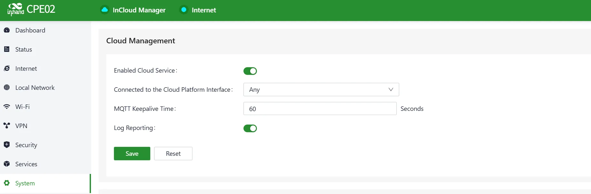

<strong>Figure 4-51 Configure the Cloud Management Service</strong>

### 4.8.3 Remote Access Control

Whether external access to the router's Web configuration interface from the Internet is allowed can be controlled by configuring the 【System】→【Remote Access Control】 function. This feature also allows setting the service port for remote access.

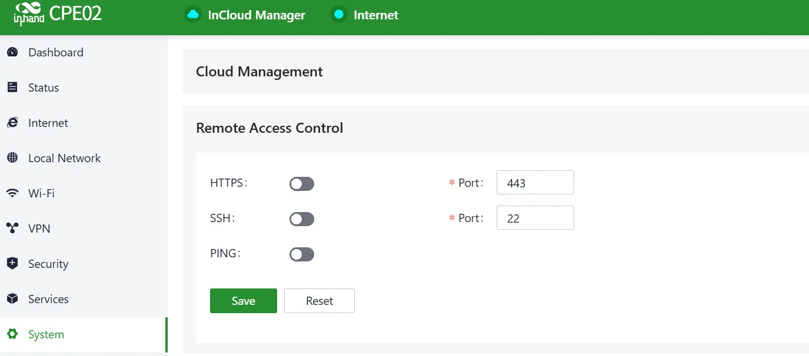

<strong>Figure 4-52 Configure the Remote Access Control</strong>

| Parameter | Description |
|-----------|-------------|
| HTTPS | When enabled, users can access the router's Web interface remotely by entering the public IP address and port of the upstream interface in a Web browser |
| SSH | When enabled, users can remotely log in to the router's backend by using remote tools like CRT, entering the public IP address and port of the device's upstream interface, along with a username and password |
| Ping | When enabled, the upstream interface address allows external networks to initiate Ping requests |

### 4.8.4 System Clock

In network functionality, the clock function refers to the capability used to coordinate and synchronize the time between network devices. Clock functionality within a network is crucial for data transmission, log recording, security, coordination, and troubleshooting. It ensures that various devices in the network are operating with synchronized times, which is essential for efficient and secure network operations.

The 【System】→【Clock】 function can be used to select the current time zone and configure NTP (Network Time Protocol) server addresses to synchronize the device's system time with an NTP server.

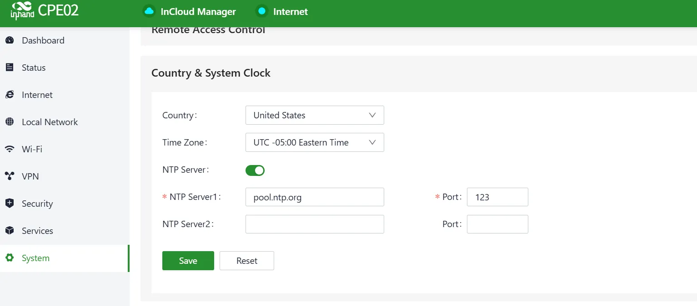

<strong>Figure 4-53 Set the System Clock and NTP Server</strong>

### 4.8.5 Device Option

In the 【System】→【Device Options】 section, various device operations can be performed such as rebooting, upgrading firmware, and restoring factory settings.

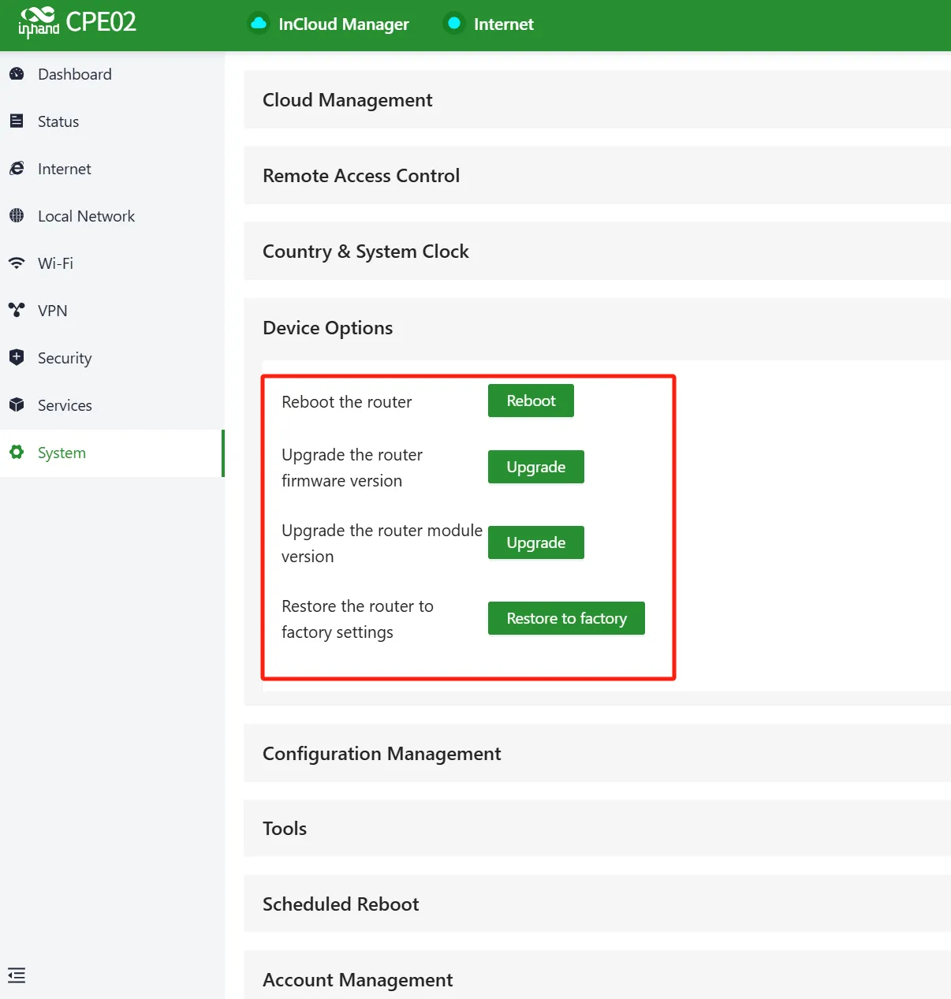

<strong>Figure 4-54 Device Option</strong>

| Function | Description |
|----------|-------------|
| Reboot Device | Click the "Reboot" button to reboot the device |
| Upgrade Software | Click the "Upgrade" button to upload the software version locally and complete the upgrade |
| Upgrade Module Version | The CPE02 provides a module upgrade option for updating the cellular module. Non-professionals are advised not to perform this operation |
| Restore to Factory | Click "Restore Factory Settings" to reset the device to its initial configuration state |

### 4.8.6 Configuration Management

Configuring backups and backup recovery are critical tasks in network management and maintenance. They involve the process of preserving configuration information for network devices so that they can be quickly restored or migrated when needed. This practice ensures the resilience and reliability of network operations and simplifies the recovery process in case of system failures or configuration changes.

The device configuration can be exported to local storage in 【System】→【Configuration Management】. This backup can be useful in cases where device configuration is lost or needs to be restored.

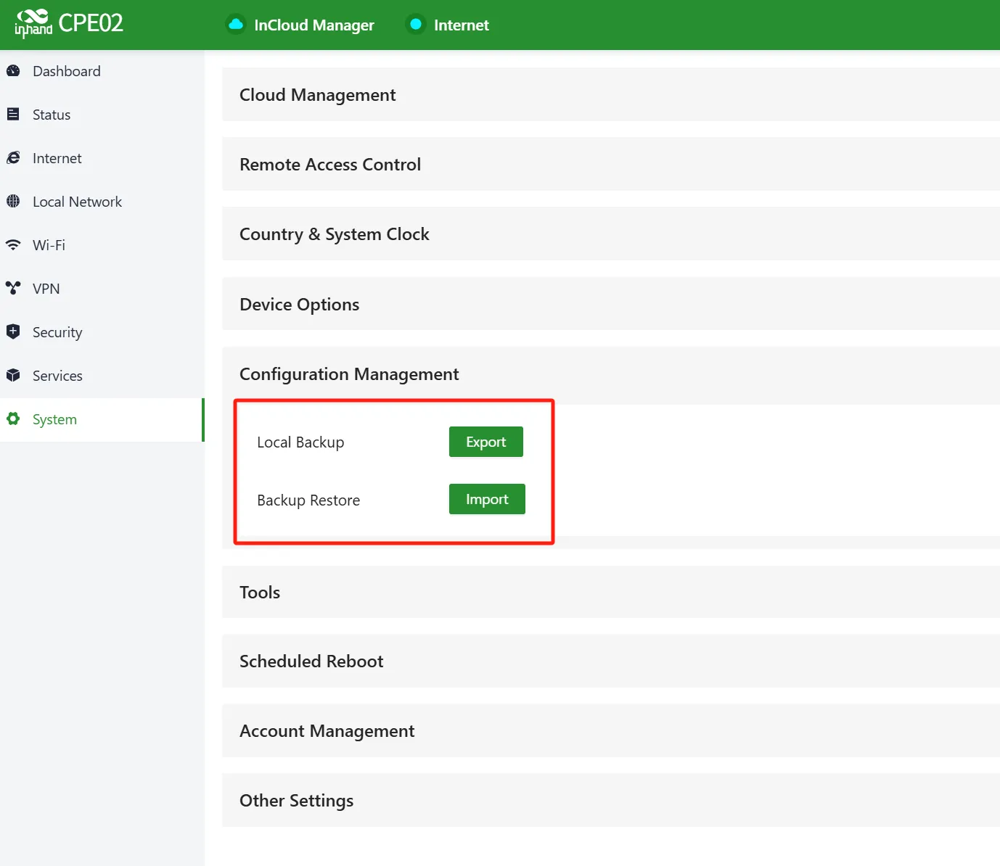

<strong>Figure 4-55 Configuration Management</strong>

> **Note**: Configuration files cannot be imported between different models.

### 4.8.7 Tools

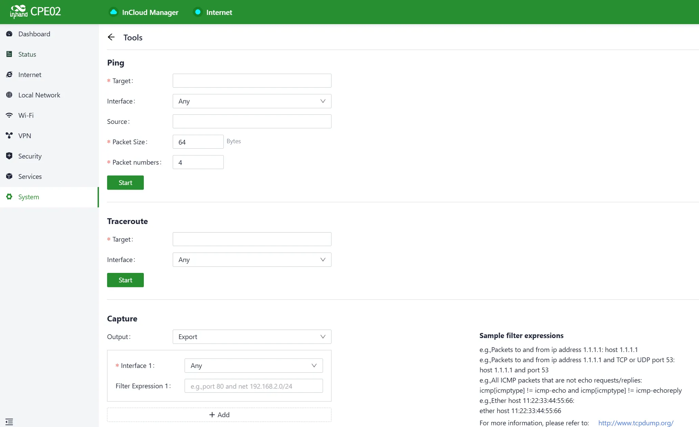

<strong>Figure 4-56 Tools</strong>

**Ping**

ICMP (Internet Control Message Protocol) can be used to check the device's external network connectivity. In the "Target" field, enter any domain name or IP address to test the device's connectivity to, and then click "Start" to check the connectivity status between the device and the specified target. This helps determine whether the device can reach the target over the Internet.

A network ping test can be performed on a target by going to 【System】→【Tools】→【Ping】. This sends ICMP echo requests to the specified target IP address or domain name and receives ICMP echo replies to check network connectivity and latency to that target.

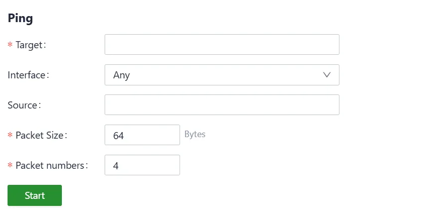

<strong>Figure 4-57 Ping</strong>

**Traceroute**

The 【System】→【Tools】→【Traceroute】 function can be used to check the routing connectivity from the device to a target host. Input the target host's IP address or domain name, select the outbound interface for traffic, and click "Start" to trace the route from the device to the target IP, displaying each hop along the way. This helps diagnose network routing issues and identify the path taken by data packets to reach the destination.

<strong>Figure 4-58 Traceroute</strong>

**Capture**

The 【System】→【Tools】→【Capture】 function can be used to capture packets passing through a specific interface. By selecting the "Output" option, users can choose to either display the captured data in the interface or export it locally for further analysis. This feature is useful for network troubleshooting and analyzing network traffic.

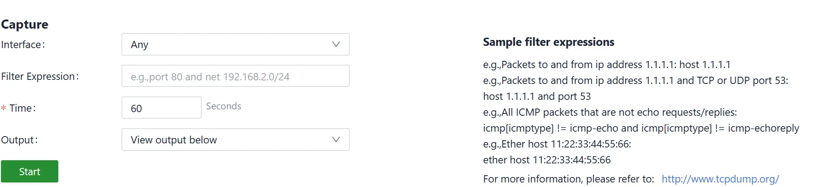

<strong>Figure 4-59 Capture</strong>

### 4.8.8 Scheduled Reboot

Scheduled reboot is a strategy in network device management that allows administrators to automatically restart devices at specific times or under certain conditions to ensure their normal operation and performance.

Device scheduled restart times can be set up in the 【System】→【Scheduled Reboot】 function based on business needs. The device supports scheduled reboots at fixed times on a daily, weekly, or monthly basis.

For monthly reboots, when the selected reboot day is greater than the actual number of days in that month, the device will reboot on the last day of that month. For example, if the 31st is chosen in a month with only 30 days, the device will reboot on the 30th.

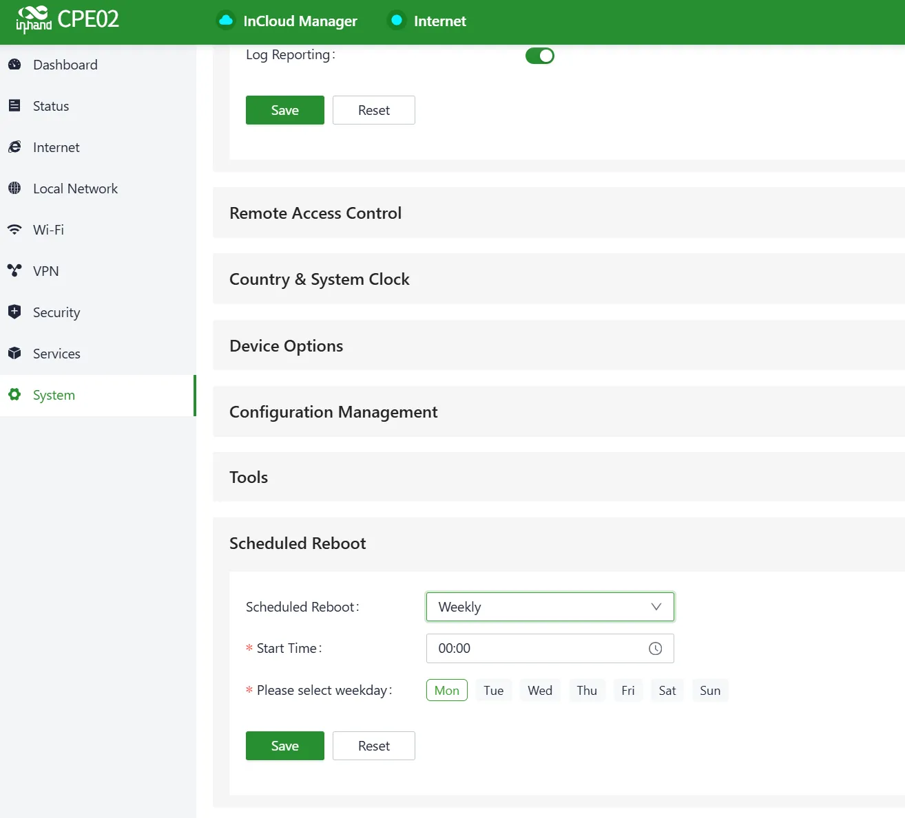

<strong>Figure 4-60 Set the Scheduled Reboot Time</strong>

### 4.8.9 Account Management (Services Menu)

The device password can be modified or reset in the account management settings under the Services menu.

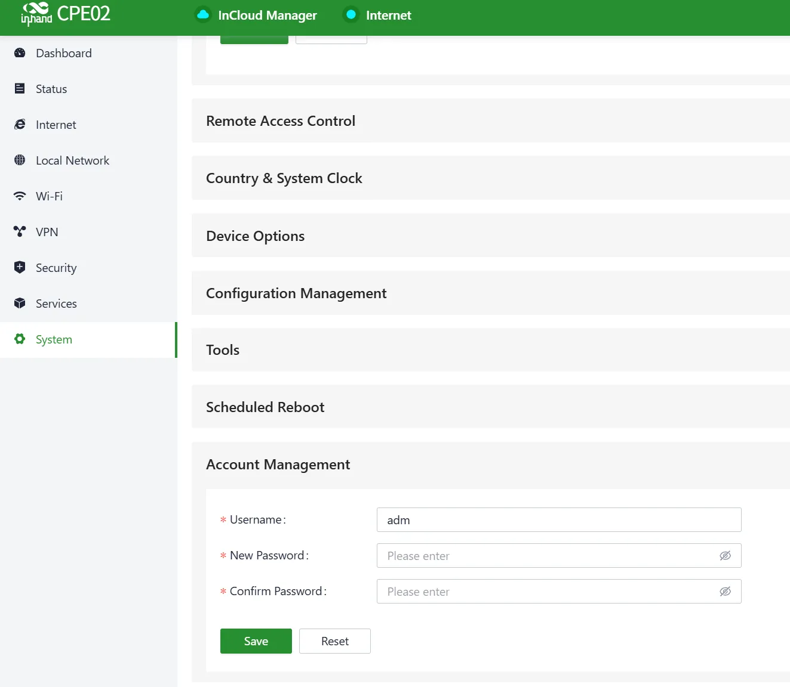

<strong>Figure 4-61 Set the Account Setting</strong>

### 4.8.10 Other Settings

**Web Login Management**

After a certain period of inactivity, when a user logs into the local interface of a device through a Web interface, the system will automatically log them out or disconnect to ensure user privacy and security.

The logout time can be set in 【System】→【Other Settings】→【Web Login Management】. Once the online time for a single login session on the device's Web page exceeds the configured time, the system will automatically log out the user, and they will need to log in again to continue their operations.

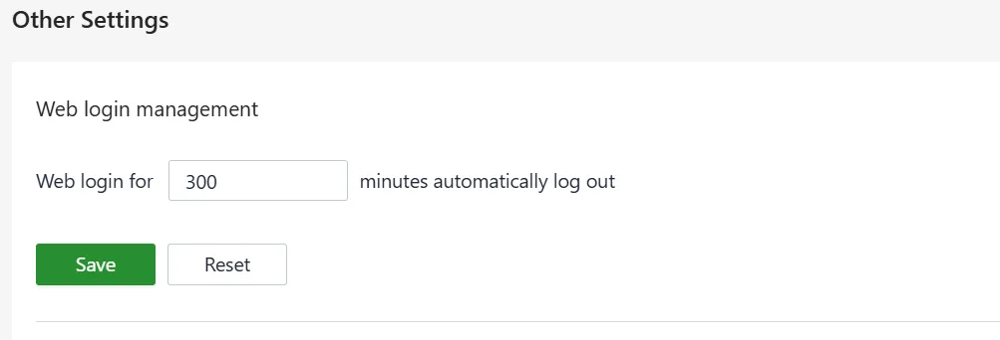

<strong>Figure 4-62 Set the Web Page Logout Time</strong>

 **Automatically Restarts**

To enable automatic network recovery, the device will automatically reboot if it cannot connect to the Internet for 1 hour. Enabled by default. If the device should not reboot automatically, click the button to disable it.

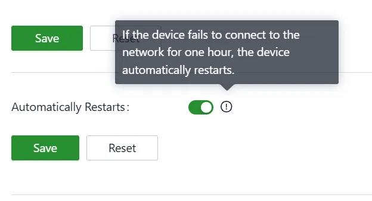

<strong>Figure 4-63 Automatically Restarts</strong>

**SIP ALG**

SIP ALG is typically used as a firewall and consists of two technologies: Session Initiation Protocol (SIP) and Application Layer Gateway (ALG). This protocol is typically used to assist in the management and processing of SIP communications, which is used to establish and manage real-time communication sessions, such as voice and video calls.

This feature can be enabled in 【System】→【Other Settings】→【SIP ALG】. Enabling this feature may impact VoIP telephone communication.

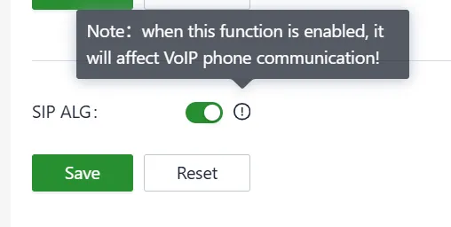

<strong>Figure 4-64 SIP ALG</strong>

> **Note**: If the connected device needs to engage in VoIP (Voice over Internet Protocol) phone communication, it is recommended to disable this function.

**Blocking the Reset Button**

To prevent accidental factory resets, the Reset button can be disabled in the software.

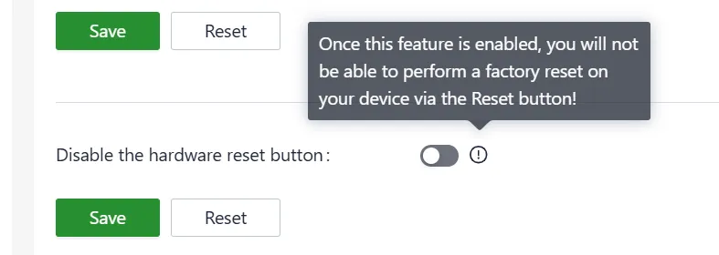

<strong>Figure 4-65 Blocking the Reset Button</strong>

---

# Chapter 5 Typical Applications

## Case 1: Small and Medium-Sized Store Network Deployment

**Scenario Description**: A retail chain store requires a high-speed, stable Internet connection to support POS systems, surveillance cameras, and customer Wi-Fi access. The 5G CPE02 provides 5G cellular connectivity as the primary uplink, with wired WAN as backup, ensuring business continuity.

**Network Topology**:

<strong>Figure 5-1 Store Network Topology</strong>

**Device Role**: The 5G CPE02 serves as the central gateway router, providing Internet access via 5G cellular network, Wi-Fi coverage for customers and staff, and LAN ports for wired devices such as POS terminals and IP cameras.

**Configuration Steps**:
1. Install the SIM card and all antennas on the 5G CPE02.
2. Power on the device and confirm cellular network connection (SYS solid green, Cellular indicator solid green).
3. Log in to the Web management interface at 192.168.2.1.
4. Navigate to 【Internet】→【Uplink Table】, confirm the Cellular interface is enabled and has priority.
5. Configure Wi-Fi SSIDs in 【Wi-Fi】: set 2.4GHz for IoT devices and 5GHz for customer access.
6. Connect POS terminals and cameras to the LAN ports.
7. (Optional) Enable cloud management in 【System】→【Cloud Management】 for remote monitoring across multiple stores.

**Reference Chapters**:
- [Cellular Internet Access](#scenario-1-cellular-internet-access)
- [Wi-Fi Configuration](#scenario-3-wi-fi-configuration)
- [Cloud Platform Management](#scenario-5-cloud-platform-management)
- [Internet Configuration](#42-internet)
- [Security Configuration](#46-security)

---

# Appendix: Troubleshooting

## 1 Network Connection Issues

| Phenomenon | Possible Cause | Troubleshooting Steps | Reference Chapter |
|------------|---------------|----------------------|-------------------|
| Cannot connect to cellular network | SIM card not inserted or poor contact | 1. Check SIM card insertion 2. Re-insert the SIM card | [Installing the SIM Card](#222-installing-the-sim-card) |
| Cannot connect to cellular network | APN parameter configuration error | 1. Verify APN parameters 2. Contact carrier for correct APN | [Cellular Interface Configuration](#421-cellular-interface-configuration) |
| Cannot connect to cellular network | Weak or no signal | 1. Check antenna connections 2. Adjust device position | [Installing Antennas](#221-installing-antennas) |
| Cannot connect to cellular network | Data plan expired or limit exceeded | 1. Check data plan status with carrier 2. Renew or upgrade the data plan | [Cellular Internet Access](#scenario-1-cellular-internet-access) |
| Cannot connect to WAN | Ethernet cable not connected properly | 1. Check cable connection 2. Replace the cable if damaged | [Connecting via Ethernet Cable](#224-connecting-via-ethernet-cable) |
| Cannot connect to WAN | Upstream DHCP server disabled | 1. Verify upstream device status 2. Configure static IP or enable DHCP | [DHCP Client](#dhcp-client) |
| Cannot connect to WAN | PPPoE credentials incorrect | 1. Verify PPPoE username and password 2. Re-enter credentials | [PPPoE](#pppoe) |
| No Internet access after connection | Link detection misconfigured | 1. Check detection address settings 2. Disable link detection in private network | [Uplink Settings](#422-uplink-settings) |

## 2 Web Interface Access Issues

| Phenomenon | Possible Cause | Troubleshooting Steps | Reference Chapter |
|------------|---------------|----------------------|-------------------|
| Cannot open Web interface | IP address incorrect | 1. Confirm PC and device are in the same subnet 2. Check device default IP 192.168.2.1 | [Logging In to the Web Interface](#225-logging-in-to-the-web-interface) |
| Cannot open Web interface | Browser compatibility issue | 1. Change browser (Chrome recommended) 2. Clear browser cache | [Logging In to the Web Interface](#225-logging-in-to-the-web-interface) |
| Cannot open Web interface | PC IP configuration incorrect | 1. Set PC to obtain IP automatically 2. Or configure static IP in 192.168.2.x range | [Connecting via Ethernet Cable](#224-connecting-via-ethernet-cable) |

## 3 Wi-Fi Issues

| Phenomenon | Possible Cause | Troubleshooting Steps | Reference Chapter |
|------------|---------------|----------------------|-------------------|
| Cannot find Wi-Fi SSID | Wi-Fi function disabled | 1. Check Wi-Fi settings in Web interface 2. Enable the corresponding SSID | [Wi-Fi Configuration](#scenario-3-wi-fi-configuration) |
| Cannot connect to Wi-Fi | Password incorrect | 1. Verify password 2. Check device nameplate for default password | [Default Settings](#16-default-settings) |
| Slow Wi-Fi speed | Connected to 2.4GHz band | 1. Connect to 5GHz SSID for higher speed 2. Reduce distance from device | [Wi-Fi Configuration](#scenario-3-wi-fi-configuration) |
| Slow Wi-Fi speed | Signal interference | 1. Adjust device position 2. Change Wi-Fi channel | [Wi-Fi Configuration](#scenario-3-wi-fi-configuration) |

## 4 VPN Issues

| Phenomenon | Possible Cause | Troubleshooting Steps | Reference Chapter |
|------------|---------------|----------------------|-------------------|
| VPN tunnel not established | Pre-Shared Key mismatch | 1. Verify Pre-Shared Key consistency on both ends 2. Re-enter the key | [IPSec VPN](#451-ipsec-vpn) |
| VPN tunnel not established | Peer address unreachable | 1. Check peer IP address correctness 2. Verify network connectivity to peer | [IPSec VPN](#451-ipsec-vpn) |
| VPN tunnel not established | IKE policy incompatible | 1. Match encryption and authentication algorithms 2. Verify DH group settings | [IPSec VPN](#451-ipsec-vpn) |
| L2TP connection failed | Username/password incorrect | 1. Verify credentials on both ends 2. Re-enter username and password | [L2TP VPN Server](#4521-server) |

## 5 Cloud Platform Issues

| Phenomenon | Possible Cause | Troubleshooting Steps | Reference Chapter |
|------------|---------------|----------------------|-------------------|
| Device offline on platform | Cloud management disabled | 1. Check 【System】→【Cloud Management】 2. Enable cloud management if disabled | [Cloud Management](#482-cloud-management) |
| Device offline on platform | No Internet connection | 1. Verify device Internet connectivity 2. Check cellular or WAN connection | [Cellular Internet Access](#scenario-1-cellular-internet-access) |
| Cannot add device to platform | Serial number or MAC incorrect | 1. Verify serial number and MAC address 2. Check device nameplate | [Cloud Platform Management](#scenario-5-cloud-platform-management) |

---

# Appendix: Safety Precautions

1. Use only the provided original power adapter to prevent potential device damage resulting from using incompatible power adapters.
2. During installation, ensure the device is positioned away from areas with strong electromagnetic interference and maintains a safe distance from high-power equipment.
3. Make certain that the device operates within the temperature and humidity specifications outlined in the product specifications.
4. After installation, verify that the device is securely mounted to prevent accidental falls and potential damage.
5. Conduct regular inspections of device cables, including Ethernet cables and power adapter connections. Keep the cables clean and promptly replace any cables showing damage.
6. When cleaning the device, refrain from directly spraying chemical agents onto the device's surface to avoid potential harm to the housing or internal components. Utilize a soft cloth for cleaning purposes.
7. Do not attempt to disassemble, repair, or modify the device on your own, as this may lead to safety risks and void warranty coverage.
8. Regularly update the device's software version to access the latest security patches and feature upgrades. Always acquire firmware versions from official and reputable sources to prevent potential data loss or device damage. Utilizing unofficial or unauthorized firmware can result in compatibility issues, instability, and security vulnerabilities.
9. Securely store the device's login password and avoid disclosing it to unauthorized individuals to mitigate security risks.

> **Warning**: Non-professionals should not open the device enclosure. Risk of electric shock.

---

# FAQ

## Question 1: What is the difference between the 5G CPE02 and a regular router?

1. The 5G CPE02 supports multiple Internet access methods (5G cellular and wired WAN), providing flexibility in network deployment. It features Wi-Fi 6 with dual-band support, SD-WAN capabilities, out-of-band management, and cloud management through InCloud Manager.
2. Regular routers typically rely on fixed broadband connections (DSL, fiber) and lack unified management platforms, advanced firewall features, SD-WAN, and cloud-based management capabilities.

## Question 2: Unable to connect to 4G/5G network?

1. **Physical Environment**: Check if the SIM card is inserted into the correct slot and ensure all cellular antennas are properly installed.
2. **APN Settings**: Ensure the APN configuration matches the information provided by the service provider.
3. **Check Device Connectivity**: Log in to the device's local interface and use the built-in ICMP tool to ping 8.8.8.8 to test connectivity. If it can connect, check the connectivity between the terminal device (e.g., computer or smartphone) and the router.
4. **Check SIM Card**: Remove the SIM card and insert it into a phone to verify it can connect to the Internet.
5. **Restart**: Power off the router, wait a few seconds, then reconnect the power and retry the network connection.
6. **Factory Reset**: Perform a factory reset on the router and then attempt to connect again.

## Question 3: Is the cloud platform free of charge?

InHand Networks provides cloud platform services for small and medium-sized chain organizations. When utilizing the cloud platform services, licenses are required for each device to access the extensive cloud-based features. A complimentary 3-year Basic Edition license is provided when a device is added for the first time.

## Question 4: How to add devices to the cloud platform?

1. Register for an InCloud Manager login account at https://star.inhandcloud.com/.
2. Log in to the cloud platform using the registered account. Under the device menu, click "Add," and follow the prompts to enter the device's serial number and MAC address. This completes the device addition process. A complimentary 3-year free Basic Edition license is included when a device is added for the first time.

## Question 5: Is it possible to use the device without the cloud platform?

Yes, the majority of configuration tasks can be completed locally. However, for features like bulk configuration deployment, firmware upgrades, and Connector, cloud platform access is required.

## Question 6: Slow or unstable speeds?

1. Check the cellular network signal strength and ensure the router is positioned in an area with strong signal reception.
2. Connect the device to the 5GHz band for higher speeds.
3. Update the router firmware to access the latest performance and stability improvements.

