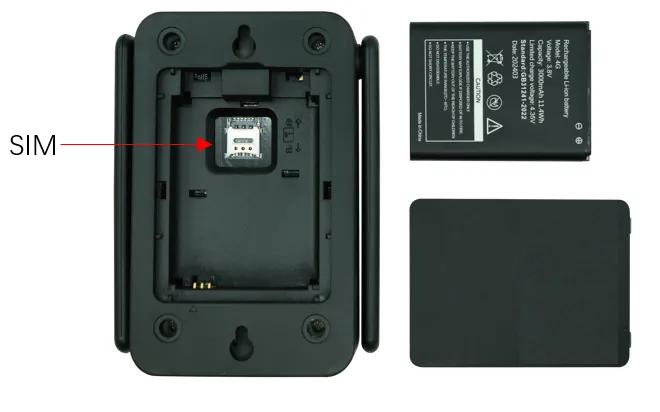
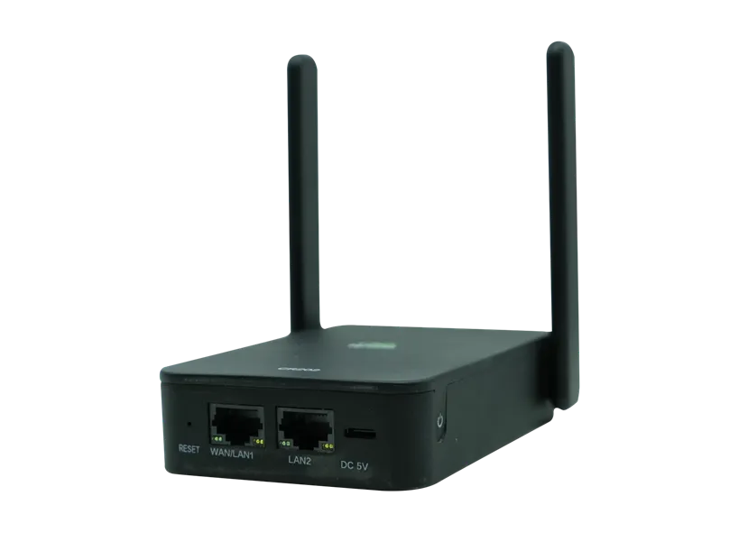
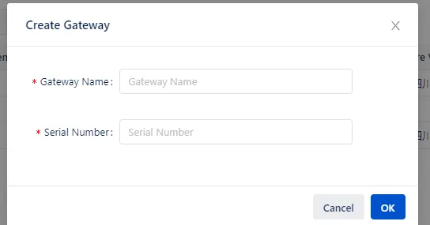
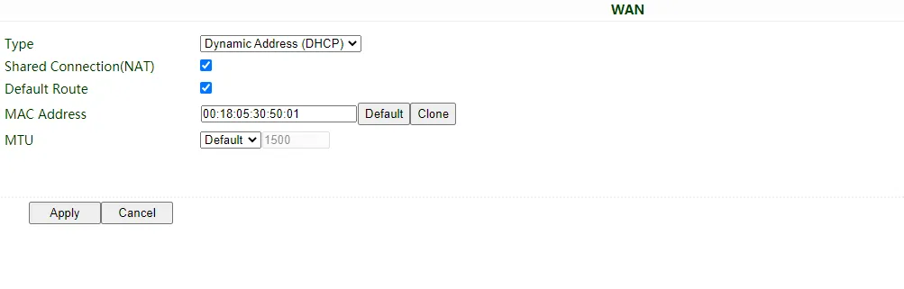
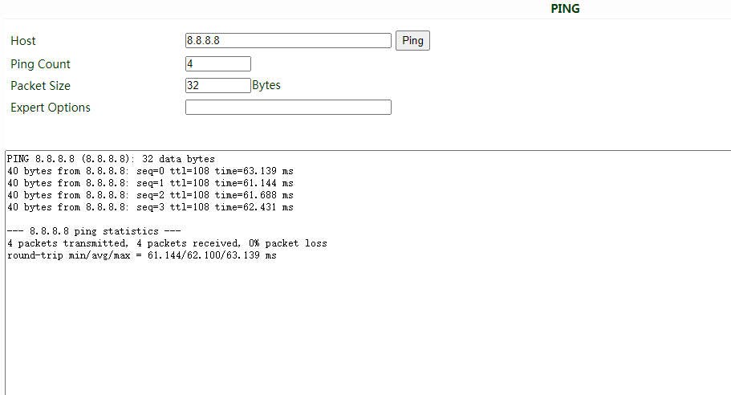
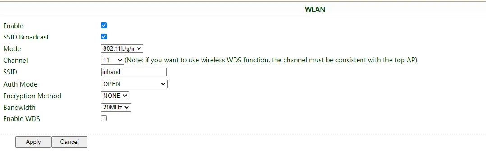
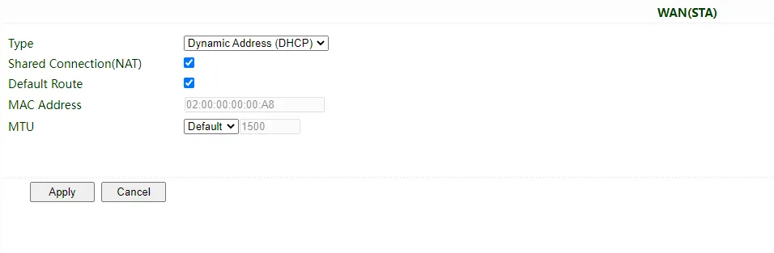
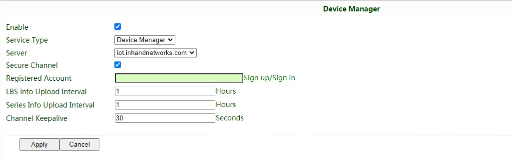

# CR202-Lite Quick Installation Guide (UniFi-Style)

> **Layout Principle Statement**: This document is written in the UniFi-style structure. The upper half (Part I) uses text and illustrations to walk through the physical installation and login flow; the lower half (Part II) provides complete references for packing list, LED meanings, wall mounting, interface parameters, configuration management, log diagnostics, and remote access.
>
> **Version Correspondence Statement**: This manual is rewritten based on the original document *Portable Router CR202-Lite Product Quick Guide*. All parameters, steps, and images are strictly derived from the original text.

---

# Part I: Quick Installation (Visual Step-by-Step Flow)

> **What you need to do first:** Unbox → Mount the device → Connect power and Ethernet → (If using cellular) **Power off** to install SIM and attach antennas → Power on → Set PC to same subnet → Open Web UI in browser.
> **Then:** Scroll down to **Part II** to look up packing list, LED meanings, wall mounting, interface details, and configuration management as needed.

## Must-Read Summary (Before Wiring and Power-On)

| Item | Requirement |
|------|-------------|
| Power supply | **5V/2A Type-C** or built-in **3000 mAh battery** (some models); pay attention to the power voltage level. |
| SIM card | **Single nano SIM** or **eSIM**; **power off** the device before installing or removing the SIM card. Hot-swap is **prohibited**. |
| Installation environment | Operating temperature **-10℃ ~ 50℃**; avoid direct sunlight, heat sources, and strong electromagnetic interference. |
| Login credentials | Username and password are printed on the **nameplate at the bottom of the device**. |

---

## Step 1: Check the Physical Device and Identify Panels and Interfaces

1. Confirm the version of your CR202-Lite (with-battery or without-battery).
2. Locate the **WAN/LAN1**, **LAN2** Ethernet ports, **Type-C** power port, **SIM card slot**, **RESET** button, and antenna connectors on the device.
3. Check the nameplate at the bottom of the device and record the default login username and password.

For panel and interface layout, see §2.2.

---

## Step 2: Mount the Device on a Wall or Inside a Cabinet

CR202-Lite supports wall-mount installation.

1. Stick the **installation positioning card** (included in the package) to the target wall and mark the drilling positions.
2. Use the included **2 expansion screws** to fasten the device to the wall or cabinet.
3. To detach, reverse the order by loosening the wall screws and then removing the device.

For wall-mount details, see §2.4.

---

## Step 3: Connect Power and Ethernet

1. Connect the power adapter (**5V/2A**) to the device via the **Type-C** port, or use the built-in battery after it is fully charged.
2. If wired Internet access is required, connect the external network cable to the **WAN/LAN1** port and the PC cable to the **LAN2** port.

CR202-Lite supports three ways to access the Internet: wired, cellular, and Wi-Fi.

> For Ethernet port speed and pinout, see §2.5.1. For Web configuration of the three Internet access methods, see §2.7.1.

---

## Step 4: (If Using Cellular) Power Off to Install SIM Card and Attach Antennas

> ⚠️ **Be sure to power off the device before operating.**

1. Power off the device.
2. Insert the **nano SIM** card in the direction shown below.

3. Tighten the **4G antenna** onto the corresponding antenna connector on the device.
4. Power the device back on.

> For SIM card slot location and antenna connector details, see §2.5.3.

---

## Step 5: Power On and Confirm the Device Is Ready

1. Connect the power adapter or press the power button to turn on the device.
2. Observe the LEDs:
   - **With-battery version**: Battery LED lights up; System LED blinking green indicates booting, **steady green** indicates normal operation.
   - **Without-battery version**: System LED blinking green indicates booting, **steady green** indicates normal operation.

> For full LED meanings and reset button location, see §2.3.

---

## Step 6: Log In via PC and Browser

1. Connect the PC Ethernet port to the device's **LAN2** port.
2. Configure the PC network (choose one):
   - **Recommended**: Set the PC to **obtain an IP address automatically** (DHCP).
   - Or manually set a static IP: pick any address from **192.168.2.2 ~ 192.168.2.254**, subnet mask **255.255.255.0**, gateway **192.168.2.1**, DNS **8.8.8.8**.
3. Open a browser and visit **192.168.2.1**.
4. Enter the **username and password** printed on the nameplate at the bottom of the device in the pop-up window.

5. If the browser warns "Your connection is not private", click "Advanced" and proceed to the address.

| Port Role | Default IP |
| :-------: | :--------: |
| WAN/LAN1  | (Determined by WAN configuration) |
| LAN2      | 192.168.2.1 |

> After login, if you need to configure wired WAN, cellular dial-up, or Wi-Fi Internet access, please refer to §2.7.1.

---

## Post-Installation Self-Check

- ☐ The device is mounted (wall-mounted in place).
- ☐ Power is connected (Type-C or battery); if using cellular, the SIM and 4G antenna are in place.
- ☐ **System LED is steady green** (device operating normally).
- ☐ The browser can open the Web login page and log in successfully.

**Troubleshooting tip**: If you cannot log in, check whether the PC is on the same subnet as the router; if you forgot the password, please refer to §2.7.2 to perform a hardware factory reset.

---

# Part II: Detailed Information

## 2.1 Packing List

### Standard Accessories

| No. | Name | Qty | Unit | Remarks |
|:---:|:-----|:---:|:----:|:--------|
| 1 | CR202-Lite | 1 | pcs | Mobile 4G router |
| 2 | Battery | 1 | pcs | 3000 mAh (included with some models) |
| 3 | Power adapter | 1 | pcs | 5V/2A, Type-C interface |
| 4 | Ethernet cable | 1 | pcs | 1 meter |
| 5 | Installation screws | 2 | pcs | Expansion screws for wall mounting |
| 6 | Protection bag | 1 | pcs | For storing and protecting the device |
| 7 | Installation positioning card | 1 | pcs | For anchoring the position |

---

## 2.2 Product Structure and Identification

### Front / Top Panel

### Nameplate at the Bottom of the Device

The login username, password, and serial number are printed on the bottom nameplate.

---

## 2.3 LEDs and Reset Button

### 2.3.1 System Status LEDs

#### CR202-Lite (with battery)

| LED | Status | Meaning |
|-----|--------|---------|
| System | Off | Power off |
| | Blinking green | Device starting |
| | Steady green | Device working normally |
| | Blinking yellow | Upgrading |
| Network | Off | Cellular disabled |
| | Blinking green | Dialing up |
| | Blinking yellow | Dialing abnormal |
| | Blinking red | No SIM card, cannot read SIM card, or modem abnormal |
| | Steady green | Dialed up, signal level ≥ 20 |
| | Steady yellow | Dialed up, 19 ≥ signal level ≥ 10 |
| | Steady red | Dialed up, signal level ≤ 9 |
| Wi-Fi | Off | Wi-Fi disabled |
| | Blinking green | Wi-Fi connected, data transmitting |
| | Steady green | Wi-Fi enabled |
| Battery | Blinking | Battery charging |
| | Steady | Battery discharging |
| | Green | 80% < battery level ≤ 100% |
| | Yellow | 20% < battery level ≤ 80% |
| | Red | 0 < battery level ≤ 20% |

#### CR202-Lite (without battery)

| LED | Status | Meaning |
|-----|--------|---------|
| System | Off | Power off |
| | Blinking green | Device starting |
| | Steady green | Device working normally |
| | Blinking yellow | Upgrading |
| Network | Off | Cellular disabled |
| | Blinking green | Dialing up |
| | Steady green | Dial-up successful |
| | Blinking yellow | Dialing abnormal |
| | Blinking red | No SIM card, cannot read SIM card, or modem abnormal |
| Wi-Fi | Off | Wi-Fi disabled |
| | Blinking green | Wi-Fi connected, data transmitting |
| | Steady green | Wi-Fi enabled |
| Signal | Off | Cellular disabled (original text said "Wi-Fi disable"; corrected per context) |
| | Steady green | Dialed up, signal level ≥ 20 |
| | Steady yellow | Dialed up, 19 ≥ signal level ≥ 10 |
| | Steady red | Dialed up, signal level ≤ 9 |

> **Blinking frequency definition**:
> - **Steady on / off**: Lasts at least approx. 3 s
> - **Slow blink**: Approx. 1 Hz
> - **Fast blink**: Approx. 5 Hz

### 2.3.2 Reset Button

- The **RESET** button is located on the side of the device (see the schematic in §2.2).
- Function: Hardware factory reset.
- For detailed operation steps, see §2.7.5.

---

## 2.4 Mechanical Installation

### 2.4.1 Wall Mounting: Installation

1. Stick the **installation positioning card** from the package to the target wall and mark the two drilling positions with a pen.
2. Drill holes at the marks and insert wall plugs.
3. Use the included **2 expansion screws** through the device's back holes and tighten them into the wall plugs.

### 2.4.2 Wall Mounting: Removal

1. Loosen the 2 expansion screws on the wall.
2. Remove the device from the wall.

---

## 2.5 Connections and Cabling

### 2.5.1 Ethernet

- CR202-Lite provides **2 RJ45 ports**: **WAN/LAN1** and **LAN2**.
- Speed: **10M/100M** auto-negotiation.

RJ45 pinout:

(Not provided in the original draft; to be supplemented.)

### 2.5.2 Power Supply

- **Input method**: **Type-C port 5V/2A** or **built-in 3000 mAh battery** (some models).
- Please pay attention to the power voltage level and avoid using mismatched adapters.
- After power-on, the System/Battery LED lights up.

### 2.5.3 Cellular SIM and Antennas

- **SIM card type**: **Single nano SIM** or **eSIM**.
- **Warning: Power off the device before installing or removing the SIM card. Hot-swap is prohibited.**
- nano SIM card installation direction is shown below:

- **4G antenna**: Tighten the antenna onto the corresponding connector on the device.

| Shell Silkscreen | Name | Description |
|:----------------:|------|-------------|
| (Not detailed in the original draft; to be supplemented.) | 4G Antenna | Cellular antenna |

### 2.5.4 Wi-Fi Antenna

- Tighten the **Wi-Fi antenna** onto the corresponding connector on the device.
- If you need to use the Wi-Fi function, please configure AP or STA mode in the Web UI (see §2.7.1 for details).

| Shell Silkscreen | Name | Description |
|:----------------:|------|-------------|
| (Not detailed in the original draft; to be supplemented.) | Wi-Fi Antenna | Wi-Fi antenna |

---

## 2.6 Power Supply and Environment (Quick Reference)

| Item | Specification |
|------|---------------|
| Input voltage | 5V DC (Type-C), or built-in battery |
| Operating temperature | -10℃ ~ 50℃ |
| Storage temperature | -20℃ ~ 60℃ |
| Ambient humidity | (Not detailed in the original draft; to be supplemented.) |

---

## 2.7 First Login, Configuration Management, and Factory Reset

### 2.7.1 Web Login and Internet Configuration

**First login steps** (same as Step 6 in Part I):

1. Connect the PC Ethernet port to the device's **LAN2** port.
2. Set the PC to obtain an IP address automatically (recommended), or manually configure a static IP: **192.168.2.2 ~ 192.168.2.254**, subnet mask **255.255.255.0**, gateway **192.168.2.1**, DNS **8.8.8.8**.
3. Open a browser and visit **192.168.2.1**, then enter the username and password printed on the bottom nameplate.

4. If the browser warns "Your connection is not private", click "Advanced" and proceed.

| Port Role | Default IP |
|:---------:|:----------:|
| WAN/LAN1 | (Determined by WAN configuration) |
| LAN2 | 192.168.2.1 |

---

**Wired WAN configuration**:

After login, go to "Network >> WAN" to create a WAN port. Three IP acquisition methods are supported:

- **Dynamic DHCP (recommended)**: Obtain IP automatically.

- **Static IP**: Manually fill in IP, subnet mask, gateway, and DNS, then click Apply & Save.

- **ADSL Dialup**: Fill in the dial-up account and password, then click Apply & Save.

After configuration, check network connectivity in "Tools >> PING":

---

**Cellular dial-up configuration**:

1. Make sure the nano SIM card is installed with power off and the 4G antenna is connected.
2. Go to "Network >> Cellular" to set the Profile.
3. Cellular is enabled by default; the device will automatically dial up and connect to the Internet within a few minutes. If it cannot connect, try disabling and then re-enabling dial-up.
4. If you are using a private-network SIM card, you also need to configure the **APN** parameter.
5. Check the dial-up status in "Status"; if it shows Connected and there is an IP address and other dial-up parameters, the router has connected to the Internet via the SIM card.

> **Note**: When CR202-Lite does not access the Internet via cellular, please disable Cellular in "Network >> Cellular"; otherwise the device will restart after trying to dial up and failing several times.

---

**Wi-Fi configuration**:

**AP mode (default)**: CR202-Lite acts as a wireless access point to radiate signals. Other terminal devices can connect to CR202-Lite to access the Internet. It is necessary to ensure that CR202-Lite itself has already been connected to the Internet through wired or cellular. AP mode supports setting the SSID name and encryption method, and terminal devices will need to input the password when connecting.

**STA mode**: CR202-Lite connects to another AP Wi-Fi device to access the Internet.

1. Go to "Network >> Switch WLAN Mode", select **STA** for WLAN Type, save, and then reboot the router.

2. Go to "Network >> WLAN Client", click **Scan** to scan available APs, and click Connect to choose a target AP.

3. Configure Wi-Fi parameters and save. Then check the connection status in "Status >> Network Connection".

4. Go to "Network >> WAN(STA)" and set WAN parameters for Wi-Fi.

---

### 2.7.2 Configuration Import and Export

- **Import configuration**: Log in to the Web management page, go to "System >> Config Management", click **Browse** in Router Configuration, select a configuration file, and click **Import** to import the configuration file to the router.
- **Export configuration**: On the same page, click **Backup running-config** to export the current running configuration to your local PC.

### 2.7.3 Log Viewing and System Diagnostics

- **View system logs**: Log in to the Web management page, go to "Status >> Log", and check the system log in the router.
- **Download log file**: Click the **Download Log File** button to download the log from the router to your local PC.
- **Download diagnostic data**: Click **Download System Diagnosing Data** to download the diagnose record from the router to your local PC.

### 2.7.4 Connecting to the InHand Device Manager Remote Management Platform

1. Make sure the router has already connected to the Internet.
2. Go to "Service >> Device Manager" to set the router to connect to the InHand DM platform. The global server address is `https://iot.inhandnetworks.com`.
3. Fill in your DM account in Registered Account, then click **Apply** to save the configuration.
4. If you do not have a DM account, please click **Sign up/Sign in** after selecting the server. You will be directed to the InHand Device Manager website; please follow the instructions to register an account.

5. Log in to your account in Device Manager, and add your device in "Gateways": name your device and fill in the serial number from the device. Then you can manage your router in DM.
6. You can find the serial number in "Status >> System", or you can find it at the back of the device.

### 2.7.5 Factory Reset

**Web-based reset**:

Log in to the Web management page, go to "System >> Config Management", click the "Restore default configuration" button, and the router will restore to default settings after reboot.

**Hardware reset**:

1. Power on the device.
2. Press and hold the **RESET** button until the **System LED** turns **yellow**, then release the button.
3. When the **System LED** starts flashing **yellow**, press and hold the **RESET** button again.
4. When the **System LED** starts flashing **green** slowly, release the **RESET** button. The device will now be restored to its default settings and will restart normally.

---

## 2.8 Related Documents

| Need | Where to Go |
|------|-------------|
| Product introduction, USB/SD details, configuration and troubleshooting | *CR202-Lite User Manual* |
| Ordering information, antenna models, full specifications | *CR202-Lite Product Datasheet* |
| Remote management platform | [InHand Device Manager](https://iot.inhandnetworks.com) |
| Software downloads and announcements | [InHand Networks Official Website](https://www.inhandnetworks.com) |

---

## 2.9 Legal Information

> All statements, information and recommendations in this manual do not constitute any expressed or implied warranty.
