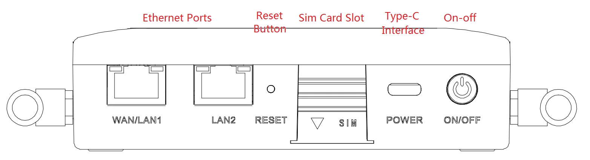
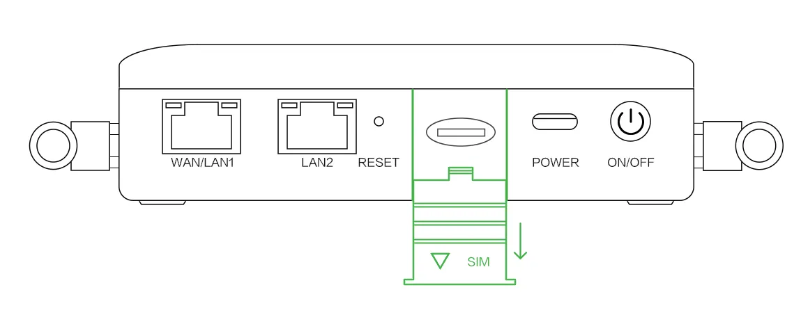
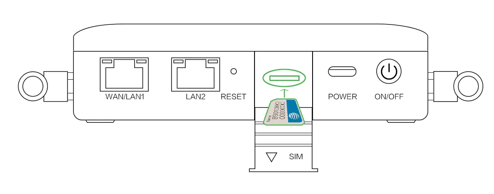
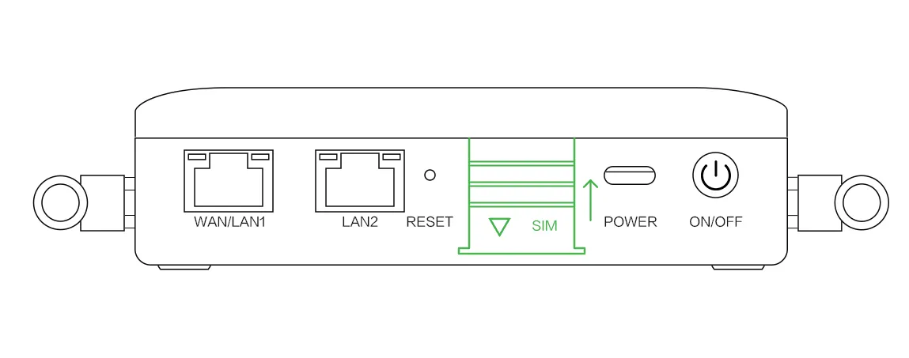
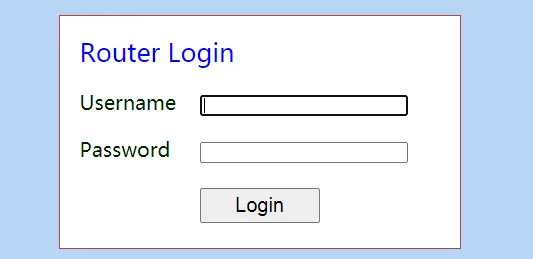
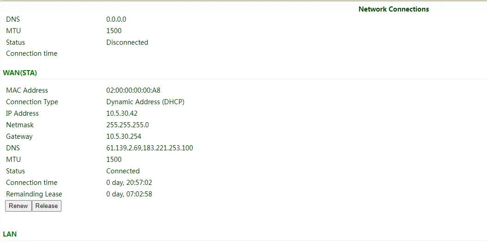
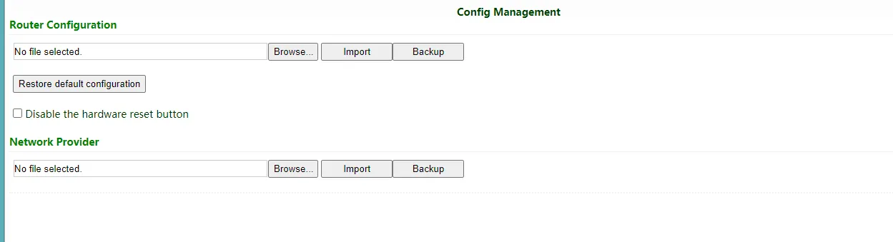

# CR202 Portable Router Quick Installation Guide 

# Part 1: Quick Installation (Visual Workflow)

> **What you need to do first:** Unpack → Mount the device → Connect power and Ethernet → (If using cellular) **Power off** to insert SIM and attach antennas → Power on → Set PC to same subnet → Open Web UI in browser.  
> **Then:** Scroll down to **Part 2** for packing list, indicator meanings, wall mounting, and interface details.

## Must-Read Summary (Before Wiring & Power On)

| Item | Requirement |
|------|-------------|
| Power supply | **5V/2A** via **Type-C** interface; or powered by **internal battery** (battery-equipped models). Verify voltage level before connecting. |
| SIM card | **Power off** the device before inserting or removing SIM card. **Do not hot-swap.** |
| Antennas | Tighten 4G and Wi-Fi antennas by rotating the **metal interface clockwise** until snug. Do not twist by the black rubber stick. |
| Environment | Working temperature **-10℃～50℃**; avoid direct sunlight, heat sources, and strong electromagnetic interference. |

---

## Step 1: Check the Panel and Interface Areas Against the Physical Unit

Take the CR202 out of the box and identify the ports and indicators on the device.  
Common interfaces include: Type-C power port, WAN/LAN1 port, LAN2 port, SIM card slot, antenna connectors, and RESET button.

> For detailed panel layout and indicator positions, see **§2.2**.

---

## Step 2: Mount the Device on a Wall or Inside a Cabinet

Use the included **wall mounting lug** to fix the device to a wall or cabinet interior.

> Detailed mounting steps and hardware requirements are provided in **§2.4**.

---

## Step 3: Connect Power and Ethernet

1. Connect the **Type-C power adapter (5V/2A)** to the device and plug it into a power outlet.  
2. Connect the **WAN/LAN1 port** to your upstream network (public network or modem).  
3. Connect the **LAN2 port** to your PC using the included Ethernet cable.

> For port role definitions and LED behavior, see **§2.3** and **§2.5.1**.

---

## Step 4: (If Using Cellular) Power Off to Insert SIM and Attach Antennas

**⚠️ Power off the device before this step. Do not insert or remove SIM while powered on.**

1. Insert the **nano SIM card** into the SIM card slot as shown below.

   

   

   

2. Attach the **4G antennas** (2 pcs for North America models) to the corresponding antenna connectors. Rotate the metal interface clockwise until tight; do not hold the black glue stick to twist.

3. If using **Wi-Fi**, attach the Wi-Fi antenna as well.

> For antenna silkscreen names and SIM specifications, see **§2.5.3**.

---

## Step 5: Power On and Confirm the Device Is Ready

Power on the device. Observe the LEDs:

- **System LED** blinks green → device is starting.
- **System LED** steady green → device is working normally.

> For complete LED definitions for both battery and non-battery models, see **§2.3**.

---

## Step 6: Log In via PC and Browser

1. Configure your PC to obtain an IP address automatically via **DHCP** (recommended).  
   Alternatively, manually set a static IP in the range **192.168.2.2 ~ 192.168.2.254**, with subnet mask **255.255.255.0**, gateway **192.168.2.1**, and DNS **8.8.8.8** (or your ISP's DNS).

2. Open a browser and navigate to the default IP address:

   | Port Role | Default IP |
   | :-------: | :--------: |
   | WAN/LAN1  | 192.168.2.1 |
   | LAN2      | 192.168.2.1 |

3. Enter the **username and password** when prompted. Please look at the **nameplate at the bottom of the device** for login credentials.

   

4. If the browser warns that the connection is not private, click **Advanced** and proceed to the address.

> For certificate alarm handling and account details, see **§2.7**.

---

## Post-Installation Checklist

- ☐ Device is securely mounted (wall or cabinet).  
- ☐ Power adapter and Ethernet cables are connected; if using cellular, SIM card and antennas are in place.  
- ☐ **System LED is steady green**.  
- ☐ Browser can open the Web login page and login succeeds.  

If the System LED does not turn steady green, or you cannot access the Web UI, verify your PC IP settings and cable connections. If issues persist, perform a hardware reset as described in **§2.7**.

---

# Part 2: Detailed Information

## 2.1 Packing List

### Standard Accessories

| No. | Name | Qty | Unit | Remarks |
|-----|------|-----|------|---------|
| 1 | CR202 Portable Router | 1 | pc | Mobile 4G router |
| 2 | Ethernet cable | 1 | pc | 1 meter cable |
| 3 | Power adaptor | 1 | pc | 5V/2A, Type-C interface |
| 4 | 4G antenna | 2 | pc | North America models have 2 antennas |
| 5 | Certificate and product warrant card | 1 | pc | CR202: 3 years warranty; Battery: 1 year warranty |
| 6 | QSG (Quick Installation Guide) | 1 | pc | This document |
| 7 | Wall mounting lug | 1 | pc | Support wall mounting |

### Optional Accessories

| No. | Name | Qty | Unit | Remarks |
|-----|------|-----|------|---------|
| — | — | — | — | Please contact InHand sales staff for optional accessories according to different fields. |

---

## 2.2 Product Structure and Identification

### Front Panel

The panel layout and interface positions are shown below.

Key areas:

- **Type-C power port**
- **WAN/LAN1 port** — connects to upstream/public network
- **LAN2 port** — connects to PC or local devices
- **SIM card slot**
- **Antenna connectors** — for 4G and Wi-Fi antennas
- **RESET button**

> For indicator locations, see **§2.3**.

---

## 2.3 Indicators and Reset Button

### 2.3.1 Operating Status Indicators (CR202 with Battery)

| LED | Status | Meaning |
|-----|--------|---------|
| System | Off | Power off |
| | Blink green | Device starting |
| | Steady green | Device working |
| | Blink yellow | Upgrading |
| Network | Off | Cellular disabled |
| | Blink green | Dialing up |
| | Blink yellow | Dialing abnormal |
| | Blink red | No SIM card, cannot read SIM card, or modem abnormal |
| | Steady green | Dialed up, signal level ≥ 20 |
| | Steady yellow | Dialed up, 19 ≥ signal level ≥ 10 |
| | Steady red | Dialed up, 9 ≥ signal level |
| Wi-Fi | Off | Wi-Fi disabled |
| | Blink green | Wi-Fi connected, data transmitting |
| | Steady green | Wi-Fi enabled |
| Battery | Blink | Battery charging |
| | Steady | Battery discharging |
| | Green | 80% < battery level ≤ 100% |
| | Yellow | 20% < battery level ≤ 80% |
| | Red | 0 < battery level ≤ 20% |

### 2.3.2 Operating Status Indicators (CR202 without Battery)

| LED | Status | Meaning |
|-----|--------|---------|
| System | Off | Power off |
| | Blink green | Device starting |
| | Steady green | Device working |
| | Blink yellow | Upgrading |
| Network | Off | Cellular disabled |
| | Blink green | Dialing up |
| | Steady green | Dialing successful |
| | Blink yellow | Dialing abnormal |
| | Blink red | No SIM card, cannot read SIM card, or modem abnormal |
| Wi-Fi | Off | Wi-Fi disabled |
| | Blink green | Wi-Fi connected, data transmitting |
| | Steady green | Wi-Fi enabled |
| Signal | Off | Wi-Fi disabled |
| | Steady green | Dialed up, signal level ≥ 20 |
| | Steady yellow | Dialed up, 19 ≥ signal level ≥ 10 |
| | Steady red | Dialed up, 9 ≥ signal level |

**Blink frequency definition:**

- **Steady / Off**: Maintained for at least approximately 3 seconds.
- **Slow blink**: Approximately 1 Hz.
- **Fast blink**: Approximately 5 Hz.

### 2.3.3 Reset Button

The **RESET** button is located on the device panel (see **§2.2**). Its function is to restore the device to factory default settings.

> For detailed hardware reset procedure and corresponding LED state changes, see **§2.7**.

---

## 2.4 Mechanical Installation

### 2.4.1 Wall Mounting

The CR202 supports wall mounting using the included wall mounting lug.

1. Secure the wall mounting lug to the device with screws.
2. Use screws to fix the device (with lug attached) to the wall or cabinet.
3. To remove, reverse the sequence: unscrew from the wall first, then detach the lug from the device.

> Ensure the installation location avoids direct sunlight, heat sources, and strong electromagnetic interference.

---

## 2.5 Connections and Cabling

### 2.5.1 Ethernet

The CR202 provides **two RJ45 ports**:

| Port | Role | Default IP |
|------|------|------------|
| WAN/LAN1 | WAN / LAN | 192.168.2.1 |
| LAN2 | LAN | 192.168.2.1 |

**Wired Internet Access Procedure:**

1. Connect WAN/LAN1 to the public network or upstream router.
2. Connect LAN2 to your PC.
3. In the Web UI, navigate to **Network >> WAN** to create a WAN port.
4. Select an IP acquisition method: **Dynamic DHCP** (recommended), **Static IP**, or **ADSL Dialup**.

   

   

   

5. Click **Apply & Save** after configuration.

> Verify connectivity using **Tools >> PING**.

   

### 2.5.2 Power Supply

| Item | Specification |
|------|---------------|
| Input voltage | **5V DC, 2A** |
| Interface | **Type-C** |
| Alternative power source | Internal battery (battery-equipped models) |
| Power-on indicator | System LED blinks green, then steady green |

**⚠️ Pay attention to the power voltage level before connecting.**

### 2.5.3 Cellular SIM and Antennas

#### SIM Card

| Item | Specification |
|------|---------------|
| Supported card type | Single **nano SIM** or **eSIM** |
| Installation requirement | **Power off** the device before inserting or removing |
| Hot-swap support | **No** — hot-swapping may cause data loss or damage |

Installation illustration:

#### Antennas

| Antenna Type | Quantity | Installation Notes |
|--------------|----------|--------------------|
| 4G antenna | 2 pcs (North America models) | Tighten by rotating the **metal interface clockwise** until snug. Do not twist by the black rubber stick. |
| Wi-Fi antenna | As required | Attach to Wi-Fi antenna connector |

**Cellular Internet Access Procedure:**

1. Power off the device. Insert the SIM card and attach 4G antennas.
2. Power on. The device enables cellular by default and will connect within a few minutes.
3. If the device cannot connect, disable and restart dialup in **Network >> Cellular**.

   

4. Check dialup status in **Status**. If it shows **Connected** with an IP address, the router is online.

   

> If using a private network SIM card, configure the **APN parameter** in **Network >> Cellular**.

### 2.5.4 Wi-Fi

The CR202 supports two Wi-Fi modes: **AP** and **STA**.

#### AP Mode (Default)

In AP mode, the CR202 acts as an access point radiating wireless signals. Terminal devices can connect to the CR202 to access the Internet. Ensure the CR202 itself is already connected via wired or cellular.

#### STA Mode

In STA mode, the CR202 connects to another AP Wi-Fi device to access the Internet.

1. Navigate to **Network >> Switch WLAN Mode**, select **STA**, and save. Reboot the router.

   

2. Go to **Network >> WLAN Client**, click **Scan**, and select an available AP to connect.

   

3. Configure Wi-Fi parameters and save. Check connection status in **Status >> Network Connection**.

   

4. Configure WAN mode in **Network >> WAN(STA)** and set WAN parameters for Wi-Fi.

   

---

## 2.6 Power and Environmental Specifications

| Item | Specification |
|------|---------------|
| Input voltage | 5V DC, 2A (Type-C) |
| Alternative power | Internal battery (battery-equipped models) |
| Working temperature | -10℃ ～ 50℃ |
| Storage temperature | -20℃ ～ 60℃ |
| Environmental notes | Avoid direct sunlight; keep away from heat sources and strong electromagnetic interference |

---

## 2.7 First Login and Factory Reset

### Web Login

1. Configure your PC to obtain an IP address automatically via **DHCP** (recommended), or set a static IP in the range **192.168.2.2 ~ 192.168.2.254** with subnet mask **255.255.255.0** and gateway **192.168.2.1**.

2. Open a browser and navigate to **192.168.2.1**.

3. Enter the username and password from the **nameplate at the bottom of the device**.

   

4. If the browser warns that the connection is not private, click **Advanced** and proceed.

> This section repeats the instructions from **Part 1, Step 6** so that this chapter can be shared independently.

### Factory Reset

#### Method 1: Web UI

1. Log in to the Web management page.
2. Navigate to **System >> Config Management**.
3. Click **Restore default configuration**. The router will restore defaults and reboot.

   

#### Method 2: Hardware Reset (RESET Button)

1. Power on the device.
2. Press and hold the **RESET** button until the **System LED** turns **yellow**, then release.
3. When the **System LED** starts flashing **yellow**, press and hold the **RESET** button again.
4. When the **System LED** starts flashing **green** slowly, release the **RESET** button. The device will restore to default settings and restart normally.

---

## 2.8 Related Documents

| Need | Where to Go |
|------|-------------|
| Product introduction, USB/SD details, configuration & troubleshooting | *CR202 User Manual* |
| Ordering information and antenna models | *CR202 Product Specification* |
| Software downloads and announcements | [InHand Networks Official Website](https://www.inhandnetworks.com) |
| Device cloud management platform | [InHand Device Manager](https://iot.inhandnetworks.com) |

### Connecting to InHand Device Manager

1. Ensure the router has Internet access.
2. Navigate to **Service >> Device Manager**.
3. Select the server (global: `https://iot.inhandnetworks.com`).
4. Fill in your DM account in **Registered Account** and click **Apply**.

   

5. Log in to your account in Device Manager, add the device in **Gateways** using the serial number found in **Status >> System** or on the back of the device.

   

   

---

## 2.9 Legal Information

### Copyright Notice

© InHand Networks. All rights reserved.

### Disclaimer

All statements, information and recommendations in this manual do not constitute any expressed or implied warranty.

### Trademark Notice

InHand Networks and related logos are trademarks or registered trademarks of InHand Networks.
