# CR602 User Manual

## Front Matter

### Declaration

Thank you for choosing our product. Before use, please carefully read this user manual. Compliance with the following statements helps maintain intellectual property rights and legal compliance, and ensures that the user experience aligns with the latest product information. If there are any questions or if written permission is required, please contact our technical support team.

- **Copyright Statement**

  This user manual contains copyrighted content, and the copyright belongs to Beijing InHand Networks Technology Co., Ltd. and its licensors. Without written permission, no organization or individual may excerpt, copy any part of the content of this manual, or distribute it in any form.

- **Disclaimer**

  Due to ongoing updates in product technology and specifications, the company cannot guarantee that the information in this user manual is entirely consistent with the actual product. Therefore, the company assumes no responsibility for any disputes arising from discrepancies between actual technical parameters and this user manual. Any changes to the product are subject to change without notice, and the company reserves the right to make final changes and interpretations.

- **Copyright Information**

  The content of this user manual is protected by copyright laws, and the copyright belongs to Beijing InHand Networks Technology Co., Ltd. and its licensors, with all rights reserved. Without written permission, the content of this manual may not be used, copied, or distributed without authorization.

### Graphical Interface Conventions

The following symbols and formats are used throughout this manual:

| Symbol | Meaning | Example |
|--------|---------|---------|
| `< >` | Indicates a variable or parameter to be replaced with an actual value | `<IP Address>` indicates a specific IP address needs to be filled in |
| `" "` | Indicates text labels on the interface | Click the "Save" button |
| `→` | Indicates menu hierarchy or operation sequence | 【Network】→【Cellular】 |
| `【 】` | Indicates a menu or page name | Enter the 【System Settings】page |
| **Cautions** | Points to note during operation; improper actions may result in data loss or device damage | - |
| **Note** | Provides supplementary and necessary explanations for the operation description | - |

### Technical Support
Email: support@inhandnetworks.com

URL: www.inhand.com

### How to Use This Manual

**Match your needs**

- First-time users: It is recommended to read in sequence: "Understanding the Device" → "Installation and First Use" → "Common Scenario Configuration" → "Function Description and Parameter Reference"
- Existing device users: You may directly refer to "Function Description and Parameter Reference" or "Appendix: Troubleshooting"
- Cloud platform management users: You may refer to "Common Scenario Configuration" for device remote management platform content

**Quick navigation by task**

| Task | Corresponding Chapter | Estimated Time |
|------|----------------------|----------------|
| Install the SIM card and power on the device | [Installation and First Use](#chapter-2-installation-and-first-use) | About 5 minutes |
| Access the Internet via cellular network | [Common Scenario Configuration](#chapter-3-common-scenario-configuration) | About 5 minutes |
| Log in to the web management interface | [Installation and First Use](#chapter-2-installation-and-first-use) | About 5 minutes |
| Configure Wi-Fi parameters | [Common Scenario Configuration](#chapter-3-common-scenario-configuration) | About 5 minutes |
| Configure VPN | [Common Scenario Configuration](#chapter-3-common-scenario-configuration) | About 10 minutes |
| View device status and traffic statistics | [Feature Description and Parameter Reference](#chapter-4-feature-description-and-parameter-reference) | About 5 minutes |
| Troubleshoot network connection failures | [Appendix: Troubleshooting](#appendix-a-troubleshooting) | As needed |

---

# Chapter 1 Understanding the Device

## 1.1 Overview

The CR602 is a cloud-managed 5G CPE that provides high-speed, secure, and user-friendly 5G network access for business environments. The device supports a 7.01 Gbps downlink 5G cellular network, a 3000 Mbps Wi-Fi 7 wireless network, and 2.5 Gbps wired network access capabilities, enabling rapid deployment of a full gigabit network.

Combined with the InCloud Manager, the CR602 forms a cloud-managed network solution that offers global customers high-speed and secure network access, as well as simple and convenient network management services.

## 1.2 Indicator Description

The CR602 is equipped with four types of LED indicators: System, Network, Wi-Fi, and Battery. The indicator status and meanings are described in the following table.

| Indicator | Status | Meaning |
|-----------|--------|---------|
| System | Off | Power off |
|  | Blinking Green | Device is starting up |
|  | Steady Green | Device is working normally |
|  | Blinking Yellow | Device is upgrading |
| Network | Off | Cellular disabled |
|  | Blinking Green | Dialing up |
|  | Blinking Yellow | Dialing error |
|  | Blinking Red | No SIM card, unable to read SIM card, or modem error |
|  | Steady Green | Dialed up, signal is good |
|  | Steady Yellow | Dialed up, signal is medium |
|  | Steady Red | Dialed up, signal is poor |
| Wi-Fi | Off | Wi-Fi disabled |
|  | Blinking Green | Wi-Fi connected, data transmitting |
|  | Steady Green | Wi-Fi enabled |
| Battery | Blinking | Charging |
|  | Steady | Discharging |
|  | Green | 20% < battery level ≤ 100% |
|  | Red | 0 < battery level ≤ 20% |

## 1.3 Restoring Factory Settings

During device operation, press and hold the Reset button for 10 seconds. The System LED will start blinking yellow, indicating that the factory reset has been successfully executed.

## 1.4 Default Settings

| No. | Function | Default Settings |
|-----|----------|------------------|
| 1 | Cellular | Dual SIM cards enabled, using SIM1 by default |
| 2 | Wi-Fi | Wi-Fi 2.4G access point enabled, SSID: prefixed with "CR602-" followed by the last 6 digits of the wireless MAC address; Wi-Fi 5G access point enabled, SSID: prefixed with "CR602-5G-" followed by the last 6 digits of the wireless MAC address; Authentication: WPA2-PSK; Password: last 8 digits of the serial number |
| 3 | Ethernet | 1 WAN port and 1 Ethernet port enabled; IP Address: 192.168.2.1; Subnet Mask: 255.255.255.0; DHCP server enabled, address pool: 192.168.2.2 to 192.168.2.254 |
| 4 | Management Services | Local HTTP (port 80) and HTTPS (port 443) enabled; access from the cellular network disabled |
| 5 | Username and Password | Refer to the label on the back of the device |

---

# Chapter 2 Installation and First Use

## 2.1 Pre-Installation Preparation

Before installing the CR602, ensure that the following conditions are met:

| Item | Requirement |
|------|-------------|
| Power supply | Use the original power adapter provided with the device |
| SIM card | Prepare a valid Nano SIM card or use the embedded eSIM |
| Network cable | Prepare an Ethernet cable for wired connection (if required) |
| PC / mobile device | For accessing the web management interface |

> **Caution**: Use only the provided original power adapter to prevent potential device damage resulting from using incompatible power adapters.

> **Caution**: Ensure the device is positioned away from areas with strong electromagnetic interference and maintains a safe distance from high-power equipment.

## 2.2 Installation Guide

### 2.2.1 Install the SIM Card

The CR602 supports two methods for SIM card installation:

1. **Using an embedded SIM (eSIM)**

   Activate the ICCID shown on the device label following the carrier's guide.

2. **Using external Nano SIM cards**

   Use the provided pin to remove the SIM card tray. Insert the Nano SIM card, then slide the tray back into the device.

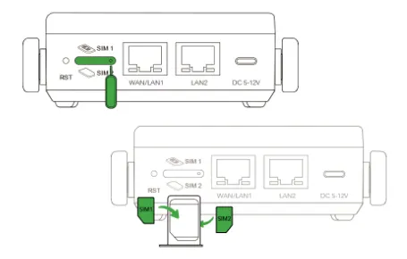

<strong>Fig. 2-1 SIM Card Installation</strong>

### 2.2.2 Power On

1. **Power via battery**

   Press and hold the ON/OFF button for 3 seconds to power on. For the first startup, connect the USB-C adapter, then press the ON/OFF button.

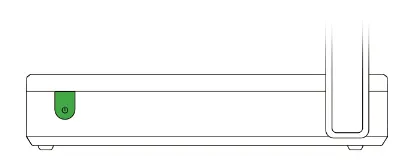

<strong>Fig. 2-2 Power On via Battery</strong>

2. **Power via adapter**

   Connect the USB Type-C adapter to power on the device.

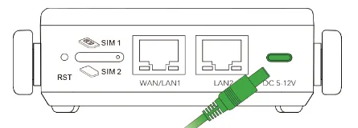

<strong>Fig. 2-3 Power On via Adapter</strong>

> **Warning**: Avoid using or leaving the device in extremely high temperatures (e.g., direct sunlight or inside a hot vehicle). Exposure to such conditions may cause overheating, fire, or reduced performance and lifespan.

### 2.2.3 Connect via Ethernet Cable

After powering on the device, connect a PC to the device's LAN port using an Ethernet cable.

The device's LAN port has the DHCP server enabled by default. Once the PC has automatically obtained an IP address, ensure that the PC and the CR602 are in the same address range.

If the PC fails to obtain an IP address automatically, configure it with a static IP address using the following parameters:

- IP Address: 192.168.2.x (choose an available address within the range of 192.168.2.2 to 192.168.2.254)
- Subnet Mask: 255.255.255.0
- Default Gateway: 192.168.2.1
- DNS Servers: 8.8.8.8 (or the ISP's DNS server address)

### 2.2.4 Log In to the Web Management Interface

1. Open a web browser and enter the default device address `192.168.2.1` in the address bar.
2. Enter the username and password (refer to the label on the back of the device).
3. If the browser shows a security warning, click "Hide" or "Advanced" and select "Proceed" to continue.

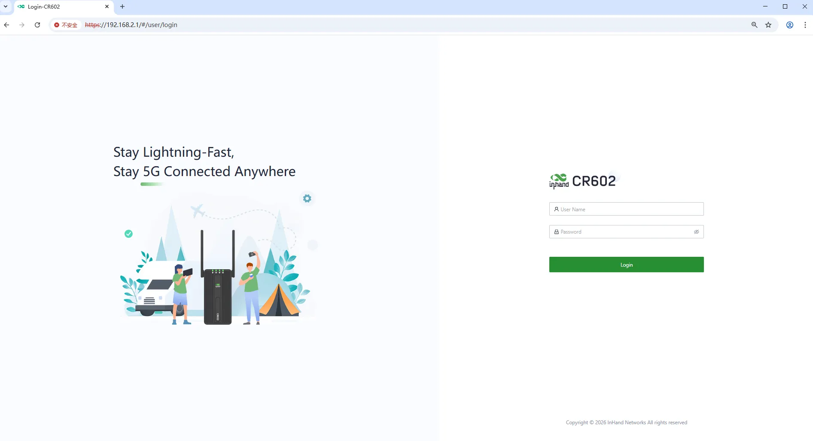

<strong>Fig. 2-4 Web Login Interface</strong>

4. Check the network status in 【Dashboard】→【Interface Status】. The device connects to the Internet successfully if the "Cellular" or "WAN" icon turns green. Click the corresponding icon to view interface information such as signal strength, IP address, and traffic consumption.

5. If the device cannot connect to a network, click 【Internet】→【Uplink Table】→ "Edit" to set up network parameters. The dial-up function is enabled by default. Wait for a few minutes to go online, and re-enable the dial-up if it is not dialed.

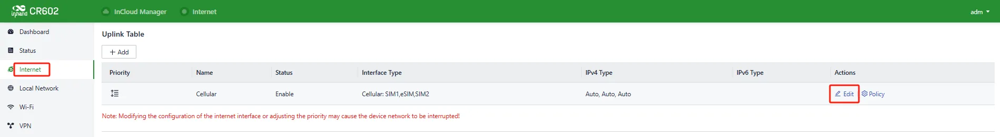

<strong>Fig. 2-5 Edit the Cellular Interface</strong>

## 2.3 Quick Check

After completing the installation, verify the following items:

- [ ] The device is powered on and the System LED is steady green.
- [ ] The SIM card is properly installed (if using cellular network).
- [ ] The PC or mobile device is connected to the CR602 via Ethernet or Wi-Fi.
- [ ] The PC has obtained an IP address in the 192.168.2.x range.
- [ ] The web management interface is accessible at 192.168.2.1.
- [ ] The device can connect to the Internet (Cellular or WAN icon is green).

---

# Chapter 3 Common Scenario Configuration

## Scenario 1: Cellular Network Access

**Objective**: Access the Internet via 4G/5G cellular network.

**Prerequisites**: The SIM card is properly installed and the device is powered on.

**Estimated Time**: About 5 minutes.

**Operation Steps**:
1. Install the SIM card according to [Section 2.2.1](#221-install-the-sim-card).
2. Power on the device according to [Section 2.2.2](#222-power-on).
3. Log in to the web management interface.
4. Navigate to 【Internet】→【Uplink Table】→ "Edit" next to the Cellular interface.
5. Configure the dial-up parameters and SIM card policy as required.
6. Click "Save" and wait for the connection to establish.

**Verification Method**:
1. Check the Network LED status; it should be steady green.
2. In the Dashboard, confirm that the Cellular interface icon is green.
3. Visit an external website to confirm Internet connectivity.

**Common Issues**:
- Network connection fails: Check whether the SIM card is properly inserted and whether the APN parameters are correct.
- Dialing error: Verify the SIM card validity and data plan status.

## Scenario 2: Accessing the Web Management Interface

**Objective**: Log in to the CR602 web management interface for configuration.

**Prerequisites**: The PC is connected to the CR602 via Ethernet or Wi-Fi, and the device is powered on.

**Estimated Time**: About 5 minutes.

**Operation Steps**:
1. Connect the PC to the CR602 LAN port using an Ethernet cable, or connect to the default Wi-Fi SSID.
2. Ensure the PC obtains an IP address automatically (or configure a static IP in the 192.168.2.x range).
3. Open a web browser and enter `192.168.2.1`.
4. Enter the username and password from the device label.
5. Click the login button to access the management interface.

**Verification Method**:
1. The Dashboard page loads successfully after login.

**Common Issues**:
- Unable to open the login page: Verify the PC IP configuration and physical connection.
- Login failure: Check the username and password on the device label.

## Scenario 3: Configuring Wi-Fi

**Objective**: Configure Wi-Fi SSID and security parameters.

**Prerequisites**: The device is powered on and the web management interface is accessible.

**Estimated Time**: About 5 minutes.

**Operation Steps**:
1. Log in to the web management interface.
2. Navigate to 【Wi-Fi】.
3. Click the "Edit" button next to the desired SSID.
4. Configure the SSID name, authentication method, and password.
5. Click "Save" to apply the changes.

**Verification Method**:
1. Use a wireless client to scan for the configured SSID.
2. Connect using the configured password.

**Common Issues**:
- SSID not visible: Check whether the Wi-Fi function is enabled and whether the frequency band settings are correct.
- Connection failure: Verify the password and authentication method.

## Scenario 4: Configuring VPN

**Objective**: Establish a secure VPN tunnel for remote access or site-to-site connectivity.

**Prerequisites**: The device has Internet access, and the peer VPN parameters are known.

**Estimated Time**: About 10 minutes.

**Operation Steps**:
1. Log in to the web management interface.
2. For IPSec VPN: Navigate to 【VPN】→【IPSec VPN】→ "Add". Configure the IKE version, pre-shared key, peer address, tunnel mode, local subnet, peer subnet, IKE policy, and IPSec policy. Click "Save".
3. For L2TP VPN Server: Navigate to 【VPN】→【L2TP VPN】→【Server】. Configure the uplink interface, VPN connection address, IP pool, username/password, and authentication mode. Enable the server.
4. For L2TP VPN Client: Navigate to 【VPN】→【L2TP VPN】→【Clients】→ "Add". Configure the server address, username/password, and authentication mode. Enable the client.

**Verification Method**:
1. Check the VPN status in 【Status】→【VPN】.
2. Confirm that the tunnel status shows "Connected" and traffic is passing.

**Common Issues**:
- Tunnel fails to establish: Verify that the pre-shared key, peer address, and subnet settings match on both ends.
- No traffic through tunnel: Check firewall rules and routing configuration.

---

# Chapter 4 Feature Description and Parameter Reference

## 4.1 Dashboard

Click 【Dashboard】 in the left menu to view the device information, interface status, traffic statistics, and Wi-Fi information.

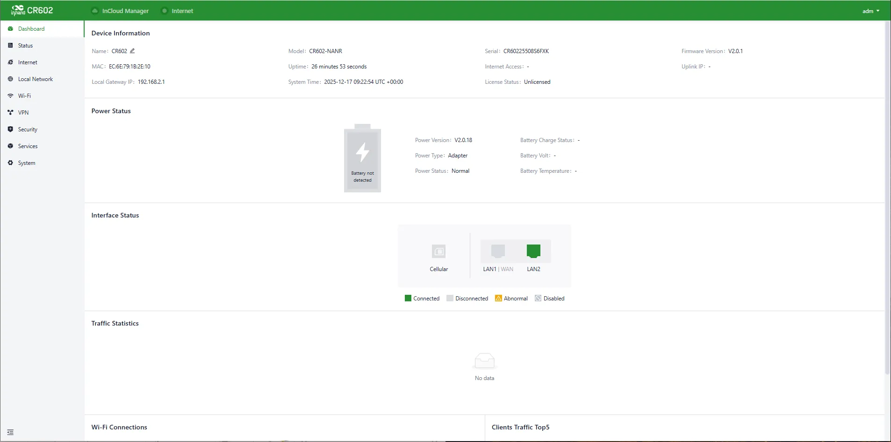

<strong>Fig. 4-1 Dashboard Interface</strong>

### 4.1.1 Device Information

In the "Dashboard > Device Information" section, the following details are displayed:

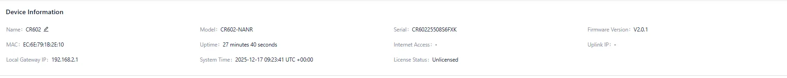

<strong>Fig. 4-2 Device Information Panel</strong>

- **Name**: Identifies the device's name; the default is "CR602" and it can be modified.
- **MAC Address**: The physical MAC address of the device.
- **Local Gateway IP**: The default subnet gateway address for the device.
- **Model**: The specific model of the device.
- **Uptime**: The device's running time since power-up.
- **System Time**: Displays the device's time zone and system time.
- **Serial**: A unique code that identifies the device, which can be used for indexing or adding to a platform account.
- **Internet Access**: The upstream interface used for device connectivity.
- **License Status**: Information about the license applied to the device, which may include the Small Star Cloud Manager Basic or Professional version.
- **Firmware Version**: The current software version used by the device.
- **Uplink IP**: The IP address of the upstream interface used for device connectivity.

### 4.1.2 Power Status

In the "Dashboard > Power Status" section, the power status of the device is displayed.

<strong>Fig. 4-3 Power Status Panel</strong>

### 4.1.3 Interface Status

In the "Dashboard > Interface Status" section, the operational status of each interface is displayed. By clicking an interface icon, detailed information about that interface appears in a pop-up box on the right side.

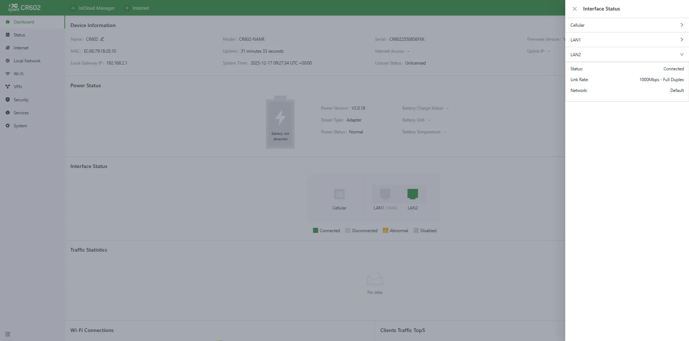

<strong>Fig. 4-4 Detailed Port Information</strong>

### 4.1.4 Traffic Statistics

The "Dashboard > Traffic Statistics" feature monitors the usage of traffic on each upstream interface since the router was powered on. The traffic statistics data resets after a device reboot. Historical traffic records can be viewed on the corresponding device's details page in the InCloud Manager Platform.

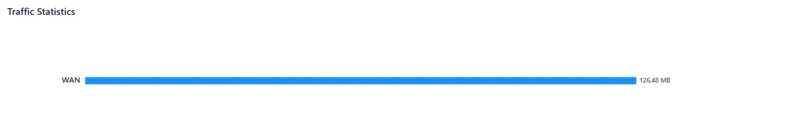

<strong>Fig. 4-5 Traffic Statistics</strong>

### 4.1.5 Wi-Fi Connections

In the "Dashboard > Wi-Fi Connections" section, the number of currently enabled SSIDs and the number of clients connected per SSID are displayed.

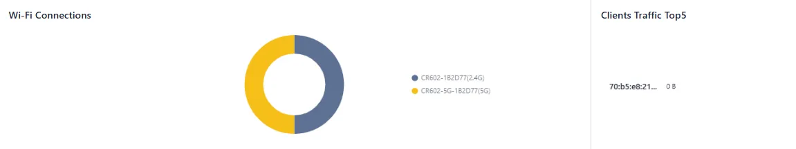

<strong>Fig. 4-6 Wi-Fi Connections Panel</strong>

## 4.2 Status

Click 【Status】 in the left menu to access the status interface, where information about the device's upstream links, cellular signal, clients, VPN, events, and logs can be viewed.

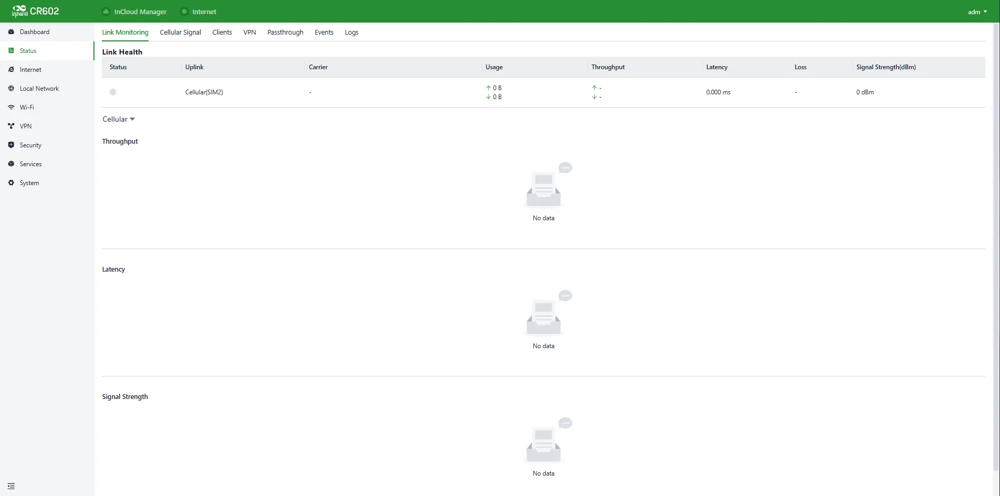

<strong>Fig. 4-7 Status Interface</strong>

### 4.2.1 Link Monitor

The "Status > Link Monitoring" feature monitors the health status of upstream links and displays throughput, latency, packet loss, signal strength, and other parameters for each interface.

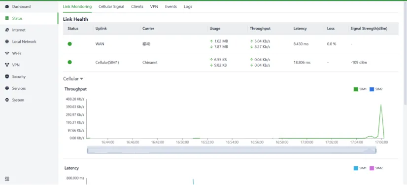

<strong>Fig. 4-8 Link Monitor Panel</strong>

### 4.2.2 Cellular Signal

The "Status > Cellular Signal" feature displays the signal strength and parameters such as RSSI, SINR, and RSRP of the cellular connection.

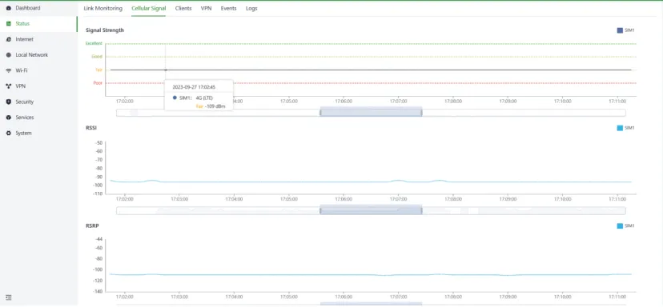

<strong>Fig. 4-9 Cellular Signal Panel</strong>

### 4.2.3 Clients

The "Status > Clients" feature displays detailed information about wired and wireless clients connected to the router, including name, IP address, MAC address, VLAN, connected subnet, traffic usage, and online duration.

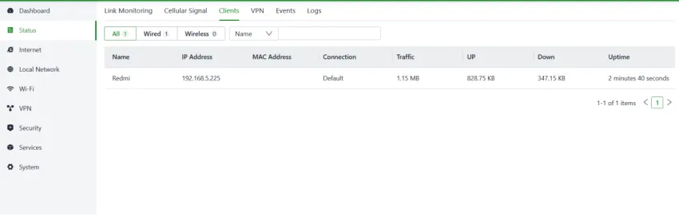

<strong>Fig. 4-10 Clients Panel</strong>

### 4.2.4 VPN

The "Status > VPN" feature displays information about IPSec VPN and L2TP VPN, including status, traffic, and the duration of the most recent connection.

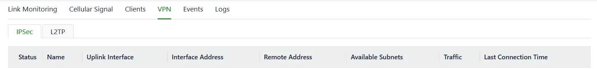

<strong>Fig. 4-11 VPN Status Panel</strong>

### 4.2.5 Passthrough

The "Status > Passthrough" feature displays information about the IP Passthrough status.

<strong>Fig. 4-12 Passthrough Status Panel</strong>

### 4.2.6 Events

The device records event logs, including user login, configuration changes, link changes, reboot, and other events. These can be viewed in the "Status > Events" section. Specific events on a particular date can be filtered by setting the start and end dates or choosing the event type.

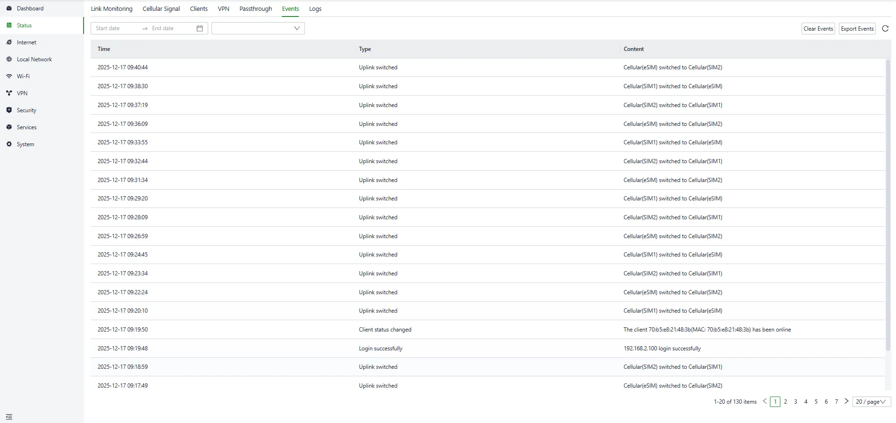

<strong>Fig. 4-13 Events Interface</strong>

### 4.2.7 Logs

The device records operational logs to facilitate fault localization and diagnosis. The logs can be checked in the "Status > Logs" section. Specific logs on a particular date can be filtered by setting the start and end dates or entering a keyword.

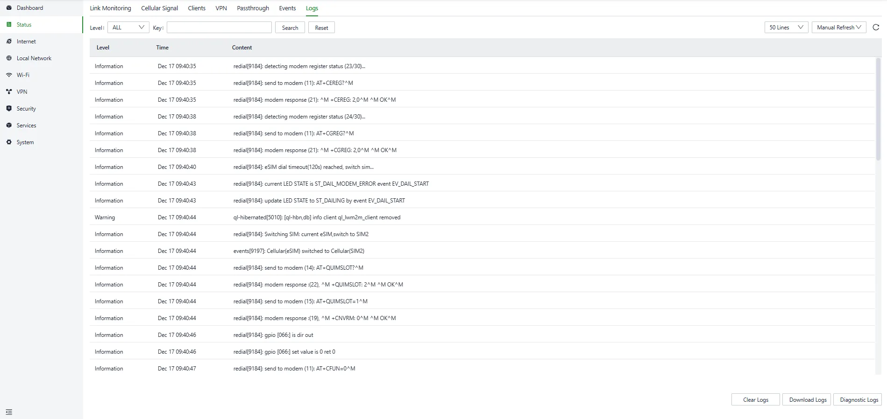

<strong>Fig. 4-14 Logs Interface</strong>

- **Download Logs**: Downloads the device's operational logs.
- **Download Diagnostic Logs**: Downloads the device's diagnostic logs, which include system operation logs, device information, and device configurations.
- **Clear Logs**: Clears the device's operational logs; this does not clear the device's diagnostic logs.

## 4.3 Internet

Click 【Internet】 in the left menu to check and configure the uplink interfaces and multi-link work mode of the device.

> **Caution**: Exercise caution when modifying the upstream link settings, as it may result in network interruption.

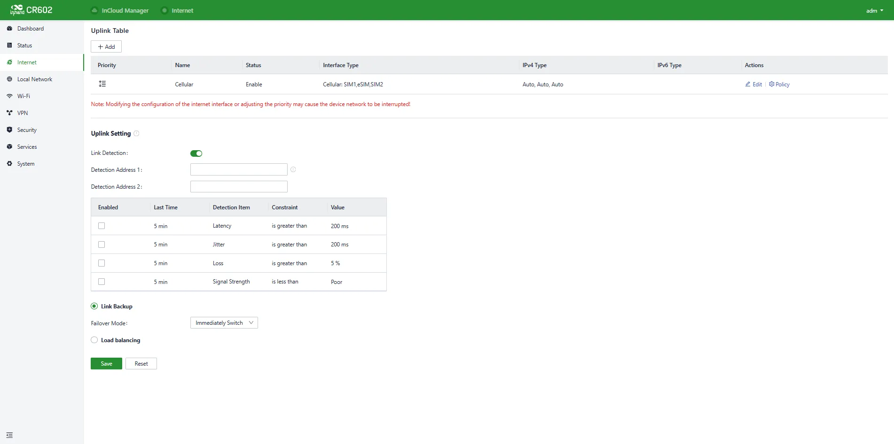

<strong>Fig. 4-15 Internet Page</strong>

### 4.3.1 Uplink Table

The "Internet > Uplink Table" page allows editing of WAN1 and Cellular interfaces, and adding/editing/deleting WAN2 and Wi-Fi (STA) interfaces. The priority of each interface can be adjusted by dragging the "Priority" icons. Priorities are arranged from top to bottom, determining the current upstream interface used by the device.

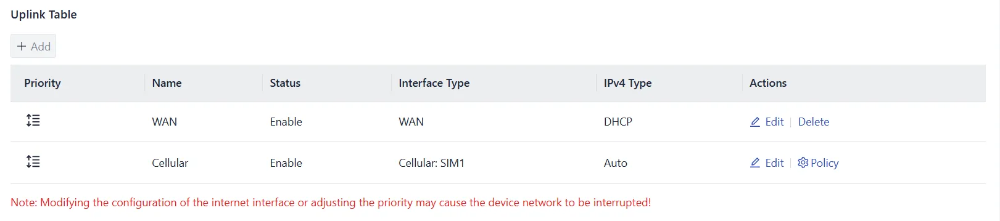

<strong>Fig. 4-16 Uplink Table</strong>

> **Caution**: Switching the WAN interface to the LAN1 interface will delete routing, policy routing, inbound/outbound rules, port forwarding, DDNS, and VPN configurations related to the WAN interface.

The WAN port supports three internet connection modes:

**DHCP**

The DHCP client is enabled on the WAN port by default.

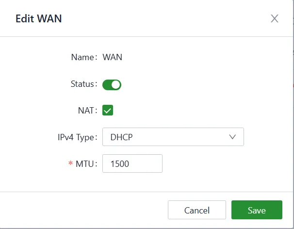

<strong>Fig. 4-17 DHCP Client</strong>

**Static IP**

A static IP address obtained from the ISP or upstream network device can be assigned manually.

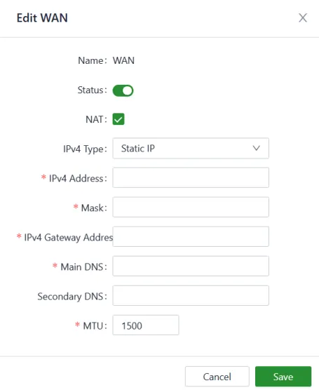

<strong>Fig. 4-18 Set the Static IP</strong>

**PPPoE**

The PPPoE service can be configured on the WAN port for broadband dial-up.

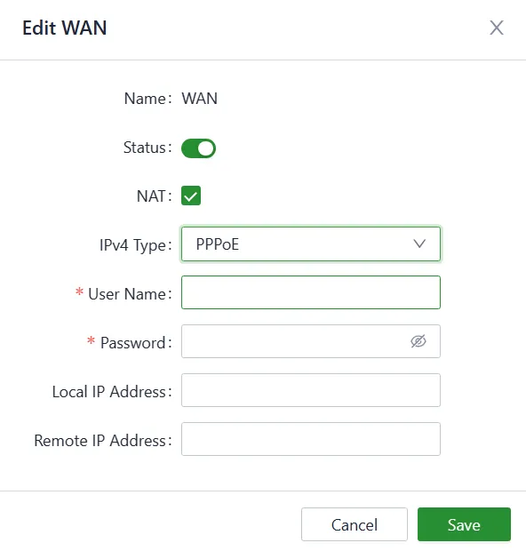

<strong>Fig. 4-19 Set the PPPoE Service</strong>

The Cellular interface supports four working modes for SIM cards. The SIM card working mode and other dial-up parameters can be configured in 【Internet】→【Uplink Table】→【Cellular】→ "Edit".

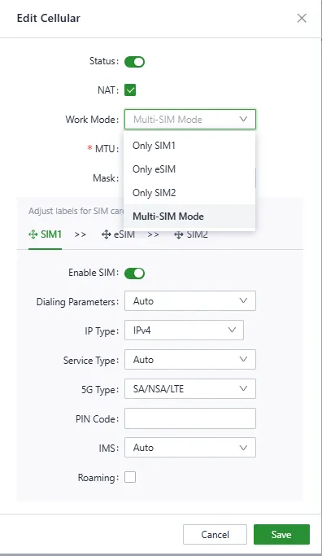

<strong>Fig. 4-20 Configure the Dial-up Parameters</strong>

SIM card policy parameters can be configured in 【Internet】→【Uplink Table】→【Cellular】→ "Policy".

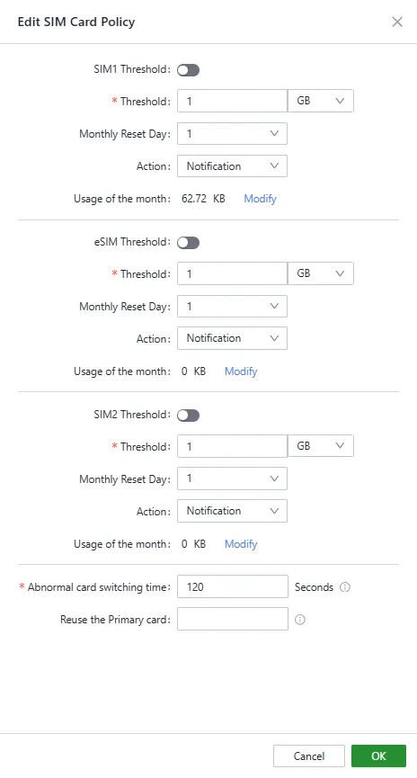

<strong>Fig. 4-21 Configure the SIM Card Policy</strong>

### 4.3.2 Uplink Settings

The "Internet > Uplink Setting" page configures link detection-related settings and the collaboration mode between various uplink interfaces.

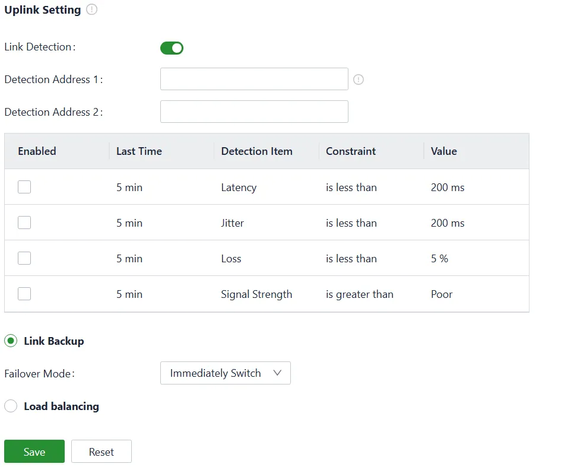

<strong>Fig. 4-22 Uplink Settings</strong>

Link detection is enabled by default. In a private network environment, manually configure the address in "Test Connectivity to" or disable the link detection function to prevent the cellular interface from malfunctioning.

> **Caution**: If link detection is disabled, latency, jitter, loss, and signal strength will not be displayed in 【Status】.

When multiple upstream links are available, the desired working mode for multi-link operation can be selected:

- **Link Backup**: The device monitors the enabled items and triggers a link switch when any item exceeds the threshold. If no item is enabled, the link switch is triggered based on priority only.
- **Load Balancing**: The device forwards and distributes traffic to all operational upstream links.

## 4.4 Local Network

The LAN network of the device can be configured in 【Local Network】→【Local Network List】.

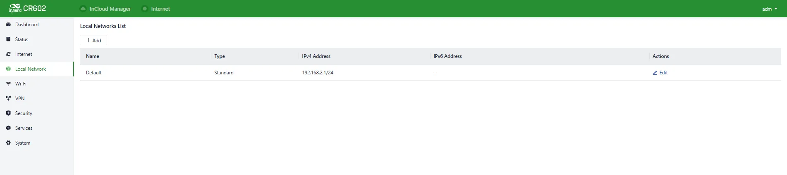

<strong>Fig. 4-23 Local Network Interface</strong>

LAN network parameters can be set by clicking the "Edit" button.

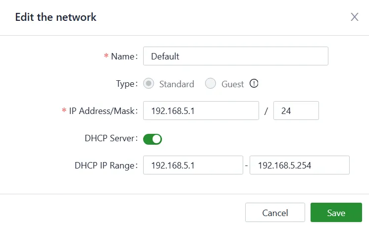

<strong>Fig. 4-24 Configure the LAN Network Parameters</strong>

## 4.5 Wi-Fi

The CR602 can function as a wireless access point (AP) and provide multiple SSIDs for wireless network access, allowing customization of different SSIDs for various purposes.

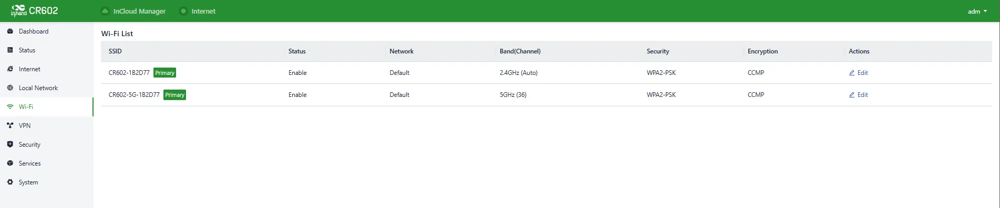

<strong>Fig. 4-25 Wi-Fi Interface</strong>

Wi-Fi parameters can be configured by clicking the "Edit" button.

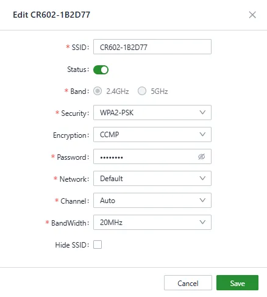

<strong>Fig. 4-26 Set the SSID Parameters</strong>

> **Note**:
> - The device comes with two default main SSIDs for 2.4 GHz and 5 GHz. These main SSIDs cannot have their frequency bands modified or deleted.
> - Once an SSID is added, its frequency band cannot be modified, and the channel will automatically align with the channel of the corresponding main SSID.
> - If a Wi-Fi (STA) interface is created under the 【Internet】 menu with the same frequency band as an SSID, that SSID cannot be enabled until the Wi-Fi (STA) interface is deleted.

## 4.6 VPN

### 4.6.1 IPSec VPN

IPSec (Internet Protocol Security) VPN is a protocol suite designed to enhance network communication security through encryption and authentication. It is widely used for establishing secure remote access, site-to-site connections, and virtual private networks.

A new IPSec VPN item can be created in 【VPN】→【IPSec VPN】→ "Add". The following parameters must be configured correctly.

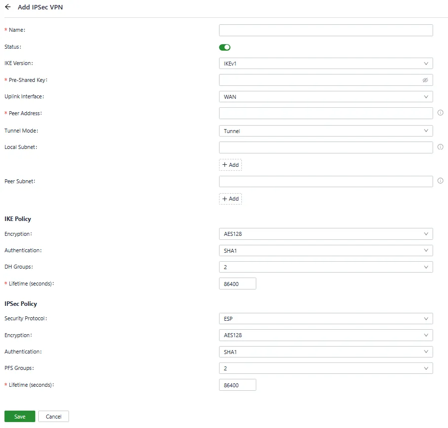

<strong>Fig. 4-27 Set the IPSec VPN Parameters</strong>

- **Name**: Specifies the name of the IPSec VPN created on the device, used for local VPN management.
- **IKE Version**: Specifies the version of the IKE protocol used on this device (IKEv1 or IKEv2).
- **Pre-Shared Key**: Specifies the authentication key for IKE negotiation, which must be consistent on both sides.
- **Uplink Interface**: Specifies the local uplink interface used to establish the tunnel.
- **Peer Address**: Specifies the IP address of the peer device. Set to 0.0.0.0 if the device works as an IPSec VPN server.
- **Tunnel Mode**: Specifies the IP packet encapsulation mode on the IPSec VPN tunnel (tunnel mode or transport mode).
- **Local Subnet**: Specifies the IP address segment of the traffic to be sent through the IPSec VPN tunnel.
- **Peer Subnet**: Specifies the IP address segment used for communication on the remote client.
- **IKE Policy**:
  - **Encryption**: Specifies the encryption algorithm for IKE.
  - **DH Groups**: Specifies the DH key exchange mode.
  - **Lifetime**: Specifies the lifetime of the IKE SA; 86400 is set by default.
- **IPSec Policy**:
  - **Security Protocol**: Specifies the security protocol used for ESP.
  - **Encryption**: Specifies the encryption algorithm of the ESP protocol.
  - **Authentication**: Specifies the authentication algorithm for ESP.
  - **PFS Groups**: Specifies the Perfect Forward Secrecy (PFS) mode, which improves communication security through an additional key exchange in Phase 2 negotiation.
  - **Lifetime**: Specifies the lifetime of the IPSec SA; 86400 is set by default.

### 4.6.2 L2TP VPN

The Layer 2 Tunneling Protocol (L2TP) is a Layer 2 VPN protocol designed to provide secure point-to-point or site-to-site virtual private network connections.

New L2TP VPN configurations can be added in 【VPN】→【L2TP VPN】.

**Server**

The L2TP server can be configured in 【VPN】→【L2TP VPN】→【Server】.

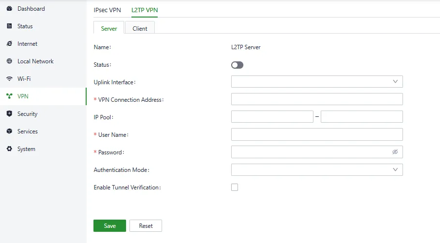

<strong>Fig. 4-28 L2TP VPN Server Interface</strong>

The following parameters must be configured based on actual network requirements:

- **Name**: The name of the L2TP server, which cannot be changed.
- **Status**: Enables or disables the L2TP server.
- **Uplink Interface**: Specifies the uplink interface to establish a tunnel from the L2TP server.
- **VPN Connection Address**: Specifies the gateway address for the L2TP VPN client.
- **IP Pool**: The system assigns an IP address to the L2TP client from the specified IP address pool.
- **Username/Password**: Specifies the username and password for L2TP negotiation, which must be consistent on both ends of the tunnel.
- **Authentication Mode**: Specifies the authentication mode for the L2TP tunnel.
- **Enable Tunnel Authentication**: Ensures both ends of the tunnel are configured with the same username and password when this option is enabled.

 **Client**

The L2TP client parameters can be configured in 【VPN】→【L2TP VPN】→【Clients】.

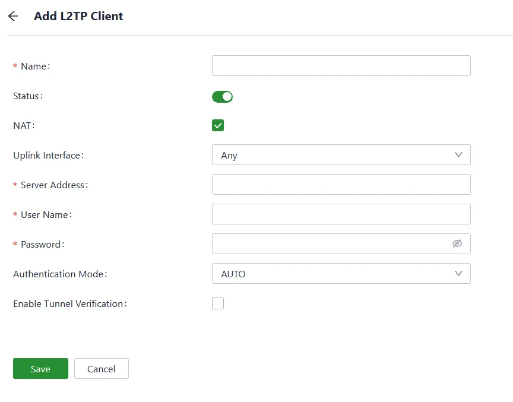

<strong>Fig. 4-29 L2TP VPN Client Interface</strong>

The following parameters must be configured based on actual network requirements:

- **Name**: Specifies the local name of the L2TP client tunnel.
- **Status**: Enables or disables the L2TP client.
- **NAT**: Enables or disables the NAT function.
- **Uplink Interface**: Specifies the uplink interface to establish a tunnel with a remote L2TP server.
- **Server Address**: Specifies the IP address set by the remote L2TP server.
- **Username/Password**: Specifies the username and password for L2TP negotiation, which must be consistent on both ends of the tunnel.
- **Authentication Mode**: Specifies the authentication mode for the L2TP tunnel.
- **Enable Tunnel Verification**: Ensures both ends of the tunnel are configured with the same server name and verification key when this option is enabled.

## 4.7 Security

In the 【Security】 menu, advanced features related to firewalls, policy routing, and traffic shaping can be configured.

### 4.7.1 Firewall

The firewall includes inbound rules, outbound rules, port forwarding, MAC address filtering, domain name filtering, and NAT.

- **Inbound Rules**: Traffic accessing the internal network from the outside is restricted by configured inbound rules, which allow all through by default.
- **Outbound Rules**: Traffic accessing the external network from the inside is restricted by configured outbound rules, which forbid all through by default.

Traffic entering and leaving can be controlled based on interfaces using the "Security > Firewall > Inbound Rules/Outbound Rules" feature.

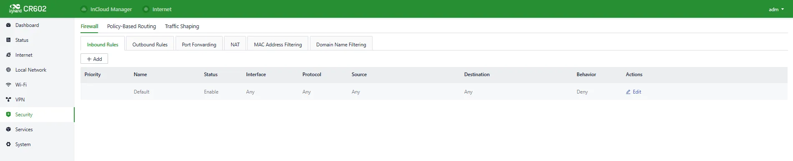

<strong>Fig. 4-30 Set the Inbound/Outbound Rules</strong>

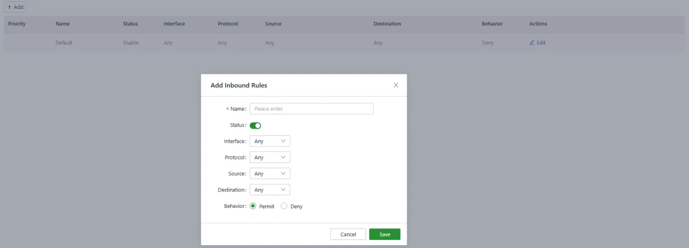

<strong>Fig. 4-31 Add an Inbound Rule</strong>

The following parameters must be configured:

- **Name**: Sets the local identifier of the inbound rule.
- **Status**: Enables or disables the rule.
- **Interface**: Sets the forwarding interface for traffic. In the inbound direction, the outbound interface is generally the upstream interface of the device.
- **Protocol**: Configures the protocol type of packets to be matched (Any, UDP, TCP, ICMP, or Custom).
- **Source**: Sets the source IP address of packets to be matched (IP address or Any).
- **Destination**: Sets the destination IP address of the packets to be matched (IP address or Any).
- **Behaviour**: Sets the behaviour if the traffic matches the configured rules.

- **Port Forwarding**: Port forwarding redirects network packets from one network port to another. When external traffic accesses a specific port on the router, the device forwards the data to the corresponding port on the internal client.

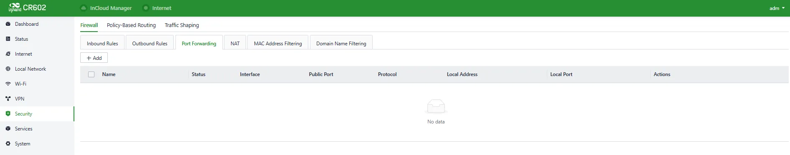

<strong>Fig. 4-32 Set the Port Forwarding Rules</strong>

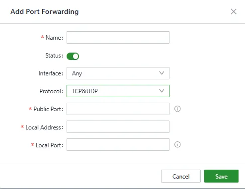

<strong>Fig. 4-33 Add a Port Forwarding Rule</strong>

The following parameters must be configured:

- **Name**: Sets the local identifier of the port forwarding rule.
- **Status**: Enables or disables the rule.
- **Interface**: Sets the uplink interface that provides port mapping for internal clients. This interface must be configured with a public IP address.
- **Protocol**: Sets the protocol of the port on which port mapping takes effect (TCP, UDP, or TCP&UDP).
- **Public Port**: Sets the protocol port on the uplink interface to be mapped.
- **Local Address**: Sets the IP address of the target client that external users need to access.
- **Local Port**: Sets the protocol port that external users need to access on the target client.

- **NAT**: Network Address Translation (NAT) allows multiple devices on a private network to share a single public IP address.

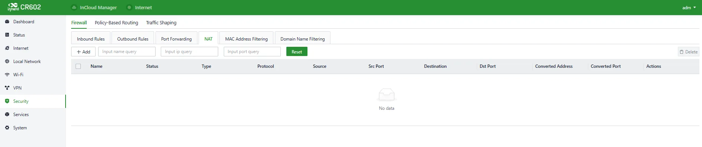

<strong>Fig. 4-34 Set the NAT Rule</strong>

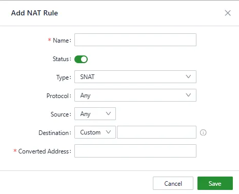

<strong>Fig. 4-35 Add a NAT Rule</strong>

- **MAC Address Filter**: MAC address filtering blocks or allows devices to access the internet based on a list of MAC addresses.

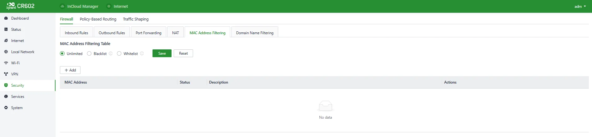

<strong>Fig. 4-36 Set the MAC Address Filter Rule</strong>

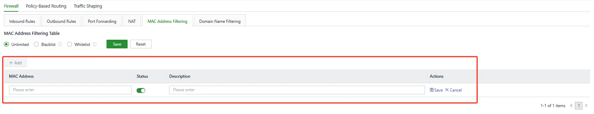

<strong>Fig. 4-37 Add a MAC Address Filter Rule</strong>

- **Blacklist**: Devices in the blacklist cannot access the Internet.
- **Whitelist**: Only devices in the whitelist are allowed to access the Internet.

- **Domain Name Filter**: Domain name filtering blocks or allows devices to access domains based on a list of domain names.

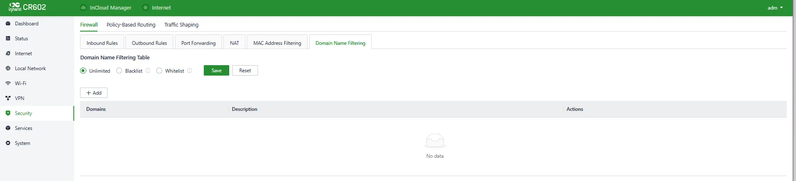

<strong>Fig. 4-38 Set the Domain Name Filter Rule</strong>

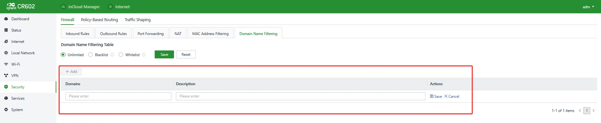

<strong>Fig. 4-39 Add a Domain Name Filter Rule</strong>

### 4.7.2 Policy-Based Routing

Policy-based routing (PBR) allows the device to forward different data flows through different links based on configured policies, improving link utilization and reducing operational costs.

Rules can be set in 【Security】→【Policy-Based Routing】→ "Add/Edit".

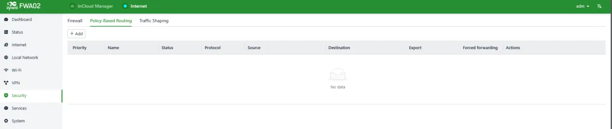

<strong>Fig. 4-40 Policy-Based Routing Interface</strong>

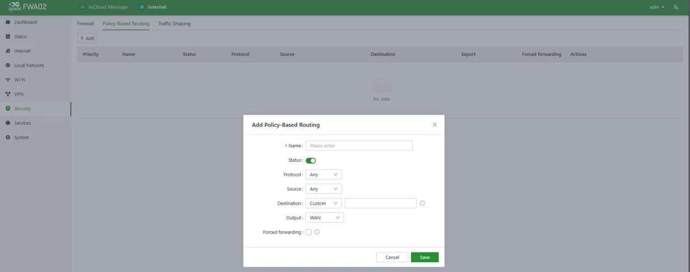

<strong>Fig. 4-41 Add a Policy-Based Routing Rule</strong>

The following parameters must be configured:

- **Name**: Sets the local identifier of the rule.
- **Status**: Enables or disables the rule.
- **Protocol**: Sets the protocol of the port (TCP, UDP, or TCP&UDP).
- **Source**: Sets the source IP address of packets to be matched (IP address or Any).
- **Destination**: Sets the destination IP address of the packets to be matched (IP address or Any).
- **Output**: Sets the traffic egress interface (WAN port or Cellular).

### 4.7.3 Traffic Shaping

Traffic shaping policies apply per-user controls on a per-protocol basis to optimize the network. This function can reduce bandwidth for recreational traffic and prioritize bandwidth for critical business traffic.

Rules can be configured in 【Security】→【Traffic Shaping】→ "Add/Edit".

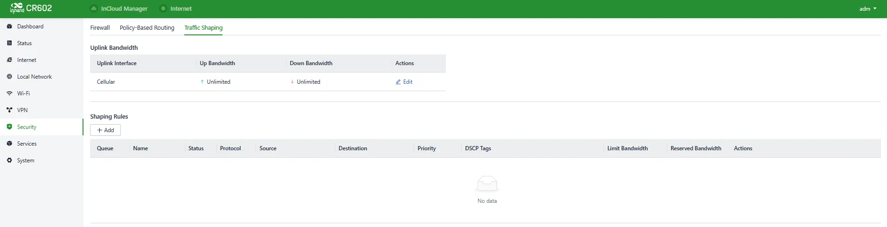

<strong>Fig. 4-42 Traffic Shaping Interface</strong>

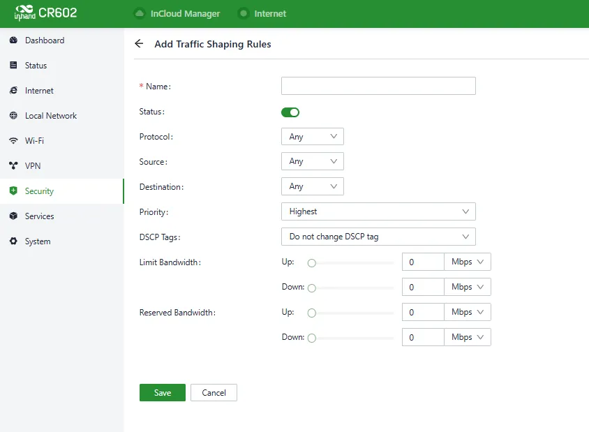

<strong>Fig. 4-43 Add a Traffic-Shaping Rule</strong>

Traffic shaping policies consist of a series of rules that are performed in order, similar to custom firewall rules. Each rule defines the type of traffic to be limited or shaped, and how that traffic should be limited or shaped.

> **Note**:
> - Traffic forwarding priority for unmatched rules is medium.
> - When Limit Bandwidth is set to 0, the system will not limit the bandwidth.
> - The value of Reserved Bandwidth should not be greater than the Limit Bandwidth.

## 4.8 Services

### 4.8.1 Interface Management

The allowed local networks through a specified interface and the interface speed can be configured in "Services > Interface Management".

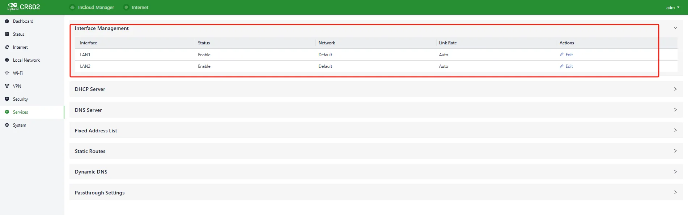

<strong>Fig. 4-44 Interface Panel</strong>

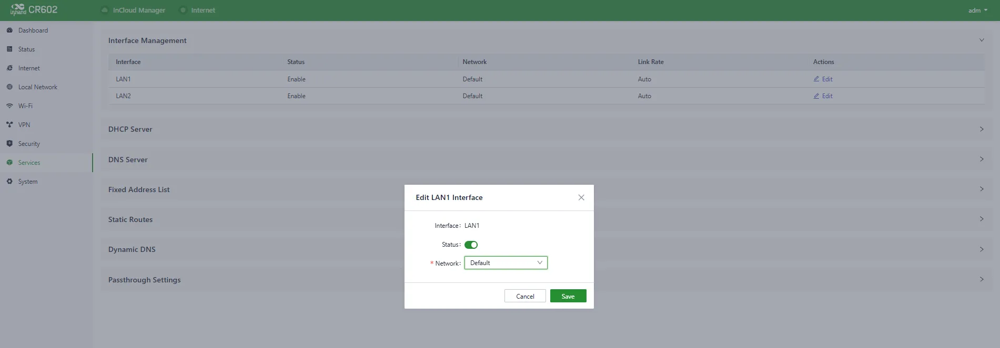

<strong>Fig. 4-45 Edit the Interface</strong>

### 4.8.2 DHCP Server

The DHCP (Dynamic Host Configuration Protocol) service operates in a client/server communication mode, where clients request IP addresses from servers, and servers respond by assigning IP addresses dynamically.

The DHCP server's IP address pool can be configured in "Services > DHCP Server".

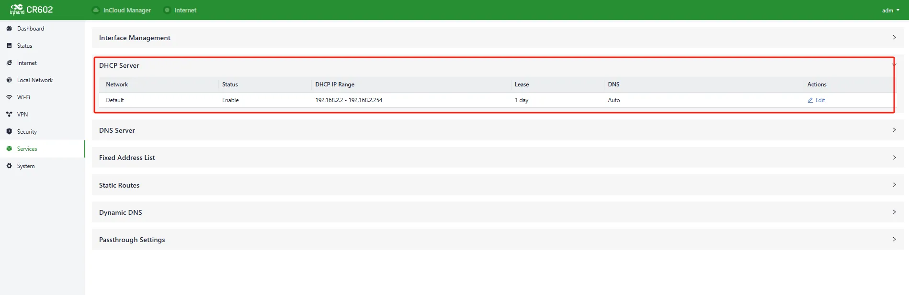

<strong>Fig. 4-46 DHCP Server Panel</strong>

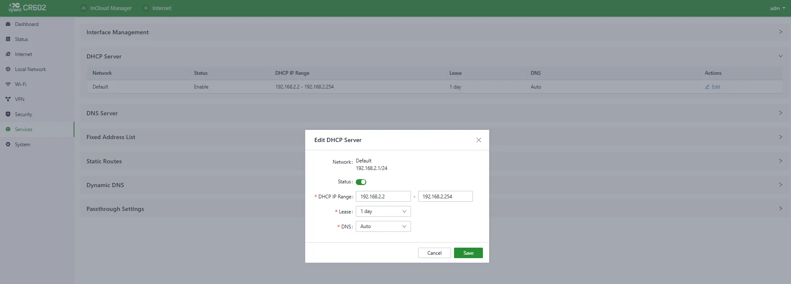

<strong>Fig. 4-47 Edit the DHCP Server</strong>

### 4.8.3 DNS Server

DNS (Domain Name System) servers translate human-readable domain names into IP addresses that computers can understand. When no DNS server address is set in "Services > DNS Server", the device uses the DNS addresses obtained from the upstream interface. Once DNS server addresses are configured, the specified DNS addresses are used for address resolution.

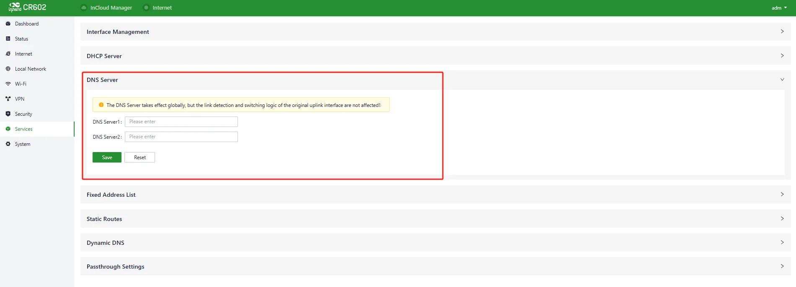

<strong>Fig. 4-48 DNS Server Panel</strong>

### 4.8.4 Fixed Address List

A fixed IP address can be allocated to a device based on its MAC address using the "Services > Fixed Address List" feature. This ensures that the device receives the same IP address every time it connects to the CR602.

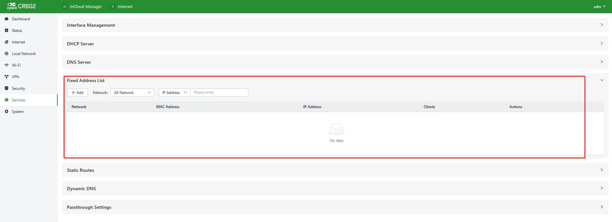

<strong>Fig. 4-49 Fixed Address Panel</strong>

> **Caution**:
> - The addresses available for allocation must fall within the address range of the IP-mode local network, or else the configuration will not take effect.
> - When a local network is deleted, all fixed address allocation rules within the address range of that local network will also be deleted.

### 4.8.5 Static Routes

Static routing entries can be configured in "Services > Static Routes" to manually define routes for data to be forwarded through specific paths and interfaces. Routes generated by other services, such as VPN functionality, will not appear in this table.

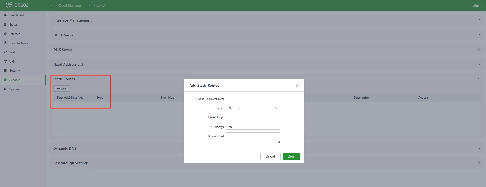

<strong>Fig. 4-50 Static Routes Interface</strong>

> **Caution**:
> - Static routes with the same destination address/network cannot have the same next-hop address, interface, or priority. Otherwise, it may lead to routing failures.
> - When WAN2, Wi-Fi (STA), or L2TP Client VPN is deleted, the corresponding static routes using those interfaces will also be removed.

### 4.8.6 Dynamic DNS

Dynamic DNS (DDNS) is used to automatically update the content of name servers in the Domain Name System. Users can manually configure the Dynamic DNS server address in "Services > Dynamic DNS".

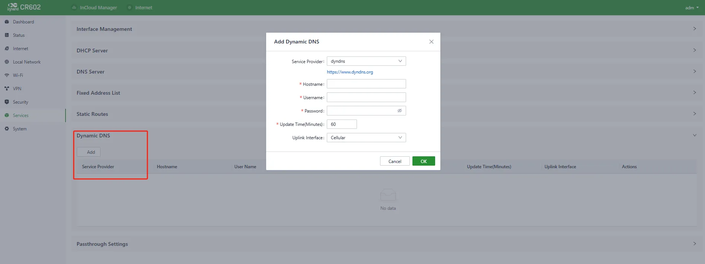

<strong>Fig. 4-51 Set the Dynamic DNS Address</strong>

- **Service Provider**: Provided by the dynamic DNS service provider (dyndns, 3322, oray, no-IP, or custom).
- **Hostname**: Register and obtain the hostname from the service provider.
- **Username**: Register and obtain the username from the service provider.
- **Password**: The password set during registration.

### 4.8.7 Passthrough Settings

The IP Passthrough feature can be enabled in "Services > Passthrough Settings". Once enabled, client devices can obtain the upstream interface address of the CR602.

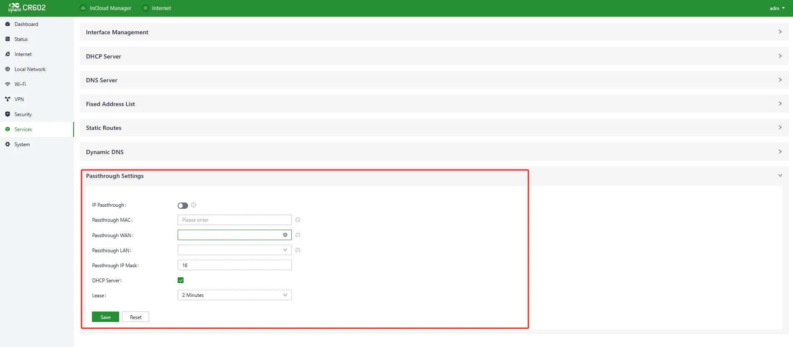

<strong>Fig. 4-52 Set the IP Passthrough Mode</strong>

- **Passthrough MAC**: Only clients bound to this MAC address can obtain the upstream interface address of the device.

> **Caution**:
> - Once IP Passthrough mode is enabled, only one client can access the public network, and the following features are disabled: static routing, VPN, port forwarding, policy-based routing, SD-WAN Overlay, and cloud connectivity.
> - When accessing client devices, inbound rules need to be released.
> - The router can still be accessed via the default subnet's IP address.

## 4.9 System

### 4.9.1 Cloud Management

The InCloud Service (star.inhandcloud.com) is a cloud platform developed by InHand Networks for enterprise network management. It integrates features such as zero-touch deployment, intelligent operations and maintenance, security protection, and user experience optimization. Once devices are connected to the cloud platform, remote management, batch configuration, traffic monitoring, and other operations can be performed.

The CR602 automatically connects to the InCloud Service after establishing an Internet connection by default. If cloud management is not required, it can be disabled manually in "System > Cloud Management".

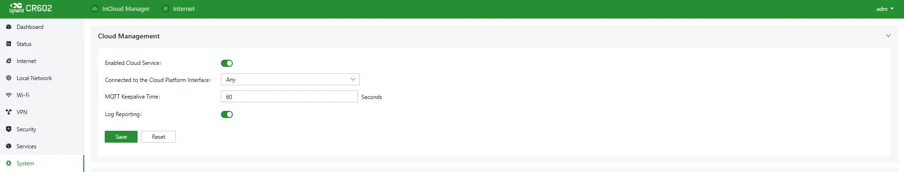

<strong>Fig. 4-53 Configure the Cloud Management Service</strong>

### 4.9.2 Remote Access Control

External access to the router's web configuration interface from the Internet can be controlled in "System > Remote Access Control". This feature also allows setting the service port for remote access.

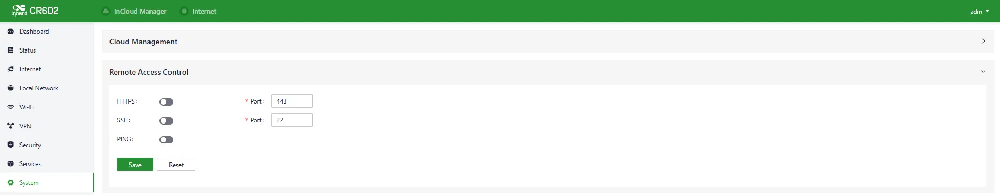

<strong>Fig. 4-54 Configure the Remote Access Control</strong>

- **HTTPS**: When enabled, the router's web interface can be accessed remotely by entering the public IP address and port of the upstream interface in a web browser.
- **SSH**: When enabled, remote login to the router's backend is possible using remote tools such as CRT, by entering the public IP address and port of the device's upstream interface along with a username and password.
- **Ping**: When enabled, the upstream interface address allows external networks to initiate Ping requests.

### 4.9.3 Country & System Clock

The "System > Clock" function allows selecting the current time zone and configuring NTP (Network Time Protocol) server addresses to synchronize the device's system time with an NTP server.

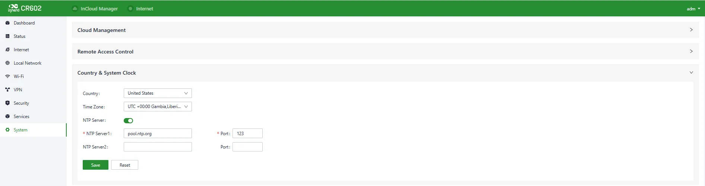

<strong>Fig. 4-55 Set the System Clock and NTP Server</strong>

### 4.9.4 Device Options

In the "System > Device Options" section, various device operations can be performed, such as rebooting, upgrading firmware, and restoring factory settings.

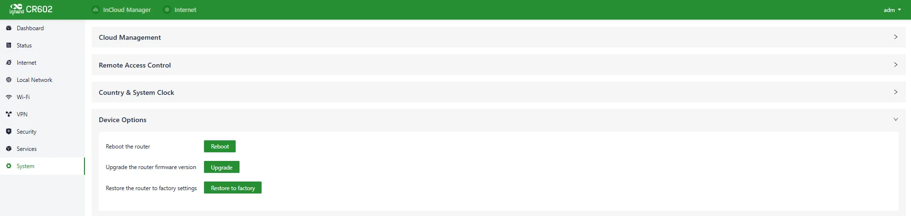

<strong>Fig. 4-56 Device Option Panel</strong>

> **Caution**:
> - When locally upgrading firmware, ensure that the firmware is obtained from a legitimate source to avoid rendering the device unusable due to incorrect firmware installation.
> - When a device is connected to the cloud platform, the platform will synchronize the previous configuration to the device again due to cloud-based configuration synchronization. The device will only clear historical data during the factory reset.

### 4.9.5 Configuration Management

The device configuration can be exported to local storage in "System > Configuration Management". This backup can be useful in cases where device configuration is lost or needs to be restored.

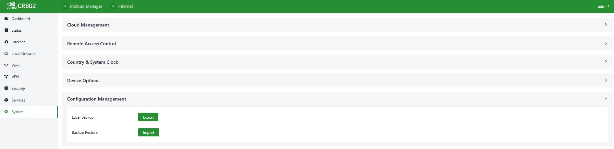

<strong>Fig. 4-57 Configuration Management Panel</strong>

### 4.9.6 Device Alarms

Alarm events can be configured in "System > Device Alarm". When an alarm event occurs, the device automatically sends a corresponding email notification. Alarm events that are not checked are still recorded in the device's local logs.

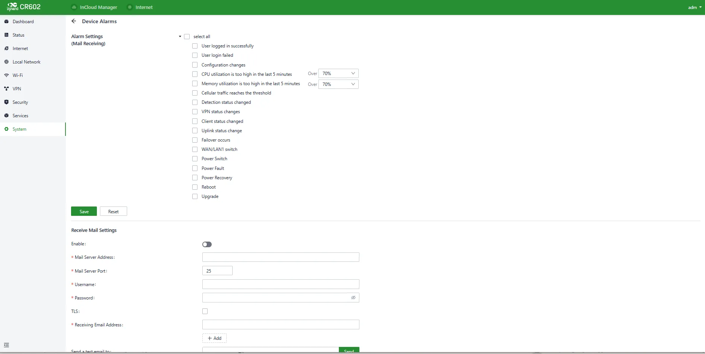

<strong>Fig. 4-58 Configure the Device Alarms</strong>

After configuring the outgoing email server address, port, username, and password, the device uses this email account to send alarm notifications. The "Send Test Email" option can be used to verify whether the outgoing email configuration is correct.

### 4.9.7 Tools

**Ping**

The "System > Tools > Ping" function uses ICMP (Internet Control Message Protocol) to check the device's external network connectivity. Enter a domain name or IP address in the "Target" field and click "Start" to check the connectivity status.

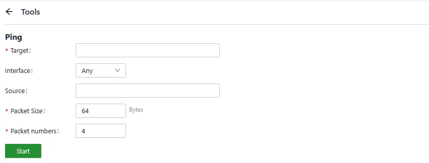

<strong>Fig. 4-59 Ping Tool</strong>

**Traceroute**

The "System > Tools > Traceroute" function checks the routing connectivity from the device to a target host. Input the target host's IP address or domain name, select the outbound interface, and click "Start" to trace the route.

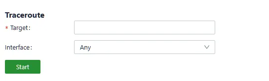

<strong>Fig. 4-60 Traceroute Tool</strong>

**Capture**

The "System > Tools > Capture" function captures packets passing through a specific interface. By selecting the "Output" option, the captured data can be displayed in the interface or exported locally for further analysis.

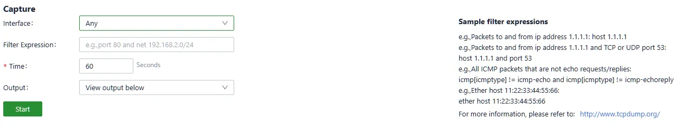

<strong>Fig. 4-61 Capture Tool</strong>

 **Iperf**

The "System > Tools > Iperf" function tests transmission performance.

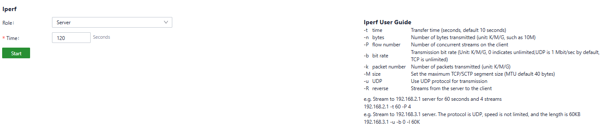

<strong>Fig. 4-62 Iperf Tool</strong>

### 4.9.8 Scheduled Reboot

Scheduled reboot allows administrators to automatically restart devices at specific times. Device scheduled restart times can be set in "System > Scheduled Reboot" on a daily, weekly, or monthly basis.

For monthly reboots, when the selected reboot day is greater than the actual number of days in that month, the device reboots on the last day of that month.

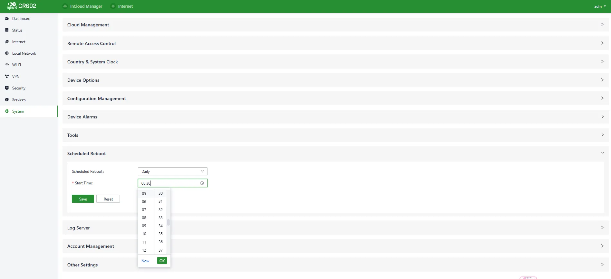

<strong>Fig. 4-63 Set the Scheduled Reboot Time</strong>

### 4.9.9 Log Server

A remote log server can be set to receive logs sent by the device in "System > Log Server".

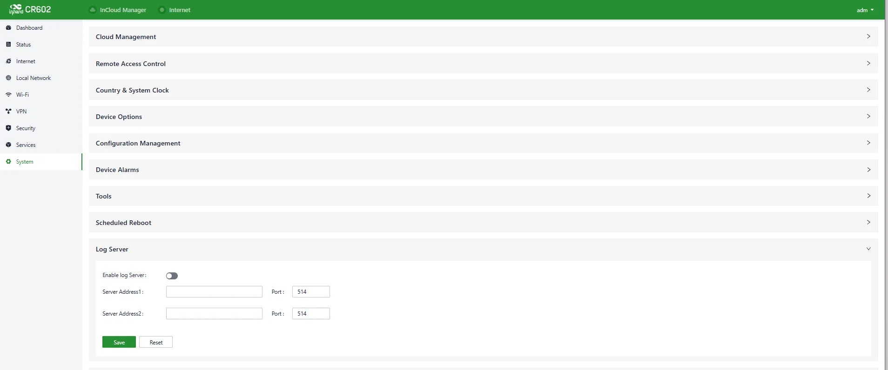

<strong>Fig. 4-64 Set the Log Server Address</strong>

### 4.9.10 Account Management

Device accounts can be configured in "System > Account Management".

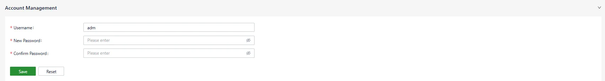

<strong>Fig. 4-65 Set the Account</strong>

### 4.9.11 Other Settings

**Web Login Management**

The logout time for web interface sessions can be set in "System > Other Settings > Web Login Management". Once the online time for a single login session exceeds the configured time, the system automatically logs out the user.

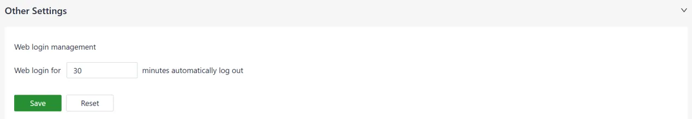

<strong>Fig. 4-66 Set the Web Page Logout Time</strong>

**Accelerated Forwarding**

This feature accelerates packet forwarding and enhances network performance. It is turned off by default.

<strong>Fig. 4-67 Enable the Accelerated Forwarding</strong>

> **Caution**: Enabling this feature will disable the normal functioning of IPSec VPN, traffic shaping, and other related features.

**Auto Reboot**

The automatic restart mechanism reboots the device if it loses network connectivity and remains disconnected for one hour after multiple retry attempts. This feature can be enabled in "System > Other Settings > Auto Reboot".

<strong>Fig. 4-68 Enable the Automatic Reboot</strong>

**SIP ALG**

SIP ALG (Application Layer Gateway) assists in the management and processing of SIP communications, which are used to establish and manage real-time communication sessions such as voice and video calls.

<strong>Fig. 4-69 Enable the SIP ALG</strong>

> **Note**: If the connected device needs to engage in VoIP phone communication, it is recommended to disable this function.

 **Disable the Hardware Reset Button**

This security feature allows administrators to enable or disable the device's physical reset button through the management interface. When disabled, the physical button becomes inactive, preventing accidental or unauthorized factory resets.

> **Note**: Disabling the button does not affect remote software resets or configuration via the management interface. Only users with administrator privileges can modify this setting.

<strong>Fig. 4-70 Disable the Hardware Reset Button</strong>

---

# Appendix A Troubleshooting

## A.1 Network Connection Problems

| Phenomenon | Possible Cause | Troubleshooting Steps | Corresponding Chapter |
|------------|----------------|----------------------|----------------------|
| Unable to connect to cellular network | SIM card not inserted or poor contact | 1. Check whether the SIM card is properly inserted 2. Reinsert the SIM card | [Install the SIM Card](#221-install-the-sim-card) |
| Unable to connect to cellular network | APN parameter configuration error | 1. Verify APN parameters are correct 2. Contact the carrier for correct APN settings | [Cellular Network Access](#scenario-1-cellular-network-access) |
| Unable to connect to cellular network | Weak or no signal | 1. Check whether antennas are connected 2. Adjust the device position | [Installation and First Use](#chapter-2-installation-and-first-use) |
| Unable to connect to WAN network | Upstream DHCP server not enabled | 1. Check the upstream device configuration 2. Try using Static IP or PPPoE mode | [Uplink Table](#431-uplink-table) |
| Slow or unstable speeds | Weak cellular signal | 1. Check signal strength in Status > Cellular Signal 2. Reposition the device for better reception | [Cellular Signal](#422-cellular-signal) |
| Slow or unstable speeds | Wi-Fi interference | 1. Connect to the 5 GHz band 2. Change the Wi-Fi channel | [Wi-Fi](#45-wi-fi) |

## A.2 Web Access Problems

| Phenomenon | Possible Cause | Troubleshooting Steps | Corresponding Chapter |
|------------|----------------|----------------------|----------------------|
| Unable to open the web login page | PC IP address not in the same subnet | 1. Confirm the PC and device are in the same subnet 2. Check whether the PC obtained an IP address automatically | [Connect via Ethernet Cable](#223-connect-via-ethernet-cable) |
| Unable to open the web login page | Incorrect IP address entered | 1. Confirm the default gateway IP (192.168.2.1) 2. Check the device label | [Default Settings](#16-default-settings) |
| Unable to log in | Incorrect username or password | 1. Check the username and password on the device label 2. Restore factory settings if the password is forgotten | [Log In to the Web Management Interface](#224-log-in-to-the-web-management-interface) |

## A.3 VPN Connection Problems

| Phenomenon | Possible Cause | Troubleshooting Steps | Corresponding Chapter |
|------------|----------------|----------------------|----------------------|
| VPN tunnel fails to establish | Parameter mismatch | 1. Verify the pre-shared key and peer address 2. Check local and peer subnet settings | [IPSec VPN](#461-ipsec-vpn) |
| VPN tunnel fails to establish | Firewall blocking | 1. Check inbound/outbound firewall rules 2. Release necessary ports | [Firewall](#471-firewall) |
| No traffic through VPN tunnel | Routing issue | 1. Verify static routes and PBR configuration 2. Check NAT settings | [Static Routes](#485-static-routes) |

---

# Appendix B Safety Precautions

1. Use only the provided original power adapter to prevent potential device damage resulting from using incompatible power adapters.

2. During installation, ensure the device is positioned away from areas with strong electromagnetic interference and maintains a safe distance from high-power equipment. After installation, verify that the device is securely mounted to prevent accidental falls and potential damage.

3. Ensure the device operates within the temperature and humidity specifications outlined in the product manual based on its operating environment.

4. Conduct regular inspections of device cables, including Ethernet cables and power adapter connections. Keep the cables clean and promptly replace any cables showing damage.

5. When cleaning the device, refrain from directly spraying chemical agents onto the device's surface to avoid potential harm to the housing or internal components. Utilize a soft cloth for cleaning purposes.

6. Do not attempt to disassemble, repair, or modify the device, as this may lead to safety risks and void warranty coverage.

7. Regularly update the device's software version to access the latest security patches and feature upgrades. Always acquire firmware versions from official and reputable sources to prevent potential data loss or device damage. Utilizing unofficial or unauthorized firmware can result in compatibility issues, instability, and security vulnerabilities.

8. Securely store the device's login password and avoid disclosing it to unauthorized individuals to mitigate security risks.

> **Warning**: Non-professionals should not open the device enclosure due to the risk of electric shock.

## Lithium-Ion Battery Handling Precautions

Battery abuse can cause damage to the battery and/or personal injury. To prevent damage or injury from battery leaking, heating, or explosion, observe the following precautions:

1. Do not use or leave the cell near a heat source such as fire or a heater.
2. Do not use or leave the cell under blazing sun or in a heated vehicle.
3. Do not short circuit, over-charge, or over-discharge the cell.
4. Do not immerse the battery in water or seawater. Store it in a cool and dry environment when not in use.
5. Do not reverse the positive and negative terminals.
6. Do not disassemble or modify the cell.
7. Do not transport or store the battery together with metal objects such as necklaces, hairpins, or coins.
8. Do not use the cell if it shows conspicuous damage or deformation.
9. Do not connect the cell to an electrical outlet directly.
10. If the cell leaks and electrolyte gets into the eyes, do not wipe the eyes. Thoroughly rinse the eyes with clean running water for at least 15 minutes, and immediately seek medical attention.
11. Do not mix different lithium battery models.
12. Keep the battery away from babies.
13. Do not directly solder the battery or pierce it with a nail or other sharp object.
14. Do not strike, throw, or trample the battery.
15. If the battery gives off an odor, generates heat, becomes discolored or deformed, or appears abnormal during use, recharging, or storage, immediately remove it from the device or battery charger and stop using it.
16. Battery replacement shall be done only by the cell supplier or device supplier and never by the user.
17. Be aware that discharged batteries may cause fire; tape the terminals to insulate them.
18. Do not use the battery in locations with strong electrostatic or magnetic fields.
19. Do not use damaged cells.

---

# FAQ

## Question 1: Unable to connect to 4G/5G network?

1. **Physical Environment**: Check whether the SIM card is inserted into the correct slot and ensure all cellular antennas are properly installed.
2. **APN Settings**: Ensure the APN configuration matches the information provided by the service provider.
3. **Check Device Connectivity**: Log in to the device's local interface and use the built-in ICMP tool to ping 8.8.8.8 to test connectivity. If it can connect, check the connectivity between the client device and the router.
4. **Check SIM Card**: Remove the SIM card and insert it into a phone to verify whether it can connect to the Internet.
5. **Restart**: Try powering off the router, waiting a few seconds, and then reconnecting the power to retry the network connection.
6. **Factory Reset**: Perform a factory reset on the router and then attempt to connect again.

If the issue cannot be resolved using the above steps, contact InHand Networks for technical support.

## Question 2: Is the cloud platform free of charge?

When utilizing the cloud platform services, licenses are required for each device to access the extensive cloud-based features.

## Question 3: How to add devices to the cloud platform?

1. Register for a Small Star Cloud Manager login account at [https://star.inhandcloud.com/](https://star.inhandcloud.com/).
2. Log in to the cloud platform using the registered account. Under the device menu, click "Add", and follow the prompts to enter the device's serial number and MAC address. When a device is added for the first time, it comes with a complimentary 3-year free essential license. Licenses can be renewed as needed in the future.

## Question 4: Is it possible to use the device without the cloud platform?

Yes. The majority of configuration tasks can be completed locally. However, for features such as bulk configuration deployment and firmware upgrades, the cloud platform is required in combination with local device settings.

## Question 5: Unable to resolve the issue using the above steps?

Contact InHand Networks for technical support. Visit [www.inhand.com](http://www.inhand.com) for more information.
