# EAP600 Product User Manual

## Front Matter

### Declaration

Thank you for choosing our product. Before use, carefully read this user manual. Compliance with the following statements helps maintain intellectual property rights and legal compliance, and ensures that the user experience aligns with the latest product information. If there are any questions or if written permission is required, contact the technical support team.

- **Copyright Statement**

  This user manual contains copyrighted content, and the copyright belongs to Beijing InHand Networks Technology Co., Ltd. and its licensors. Without written permission, no organization or individual may excerpt, copy any part of the content of this manual, or distribute it in any form.

- **Disclaimer**

  Due to ongoing updates in product technology and specifications, the company cannot guarantee that the information in this user manual is entirely consistent with the actual product. Therefore, the company assumes no responsibility for any disputes arising from discrepancies between actual technical parameters and this user manual. Any changes to the product are subject to change without notice, and the company reserves the right to make final changes and interpretations.

- **Copyright Information**

  The content of this user manual is protected by copyright laws, and the copyright belongs to Beijing InHand Networks Technology Co., Ltd. and its licensors, with all rights reserved. Without written permission, the content of this manual may not be used, copied, or distributed without authorization.

### Graphical Interface Conventions

The following symbols and formats are used throughout this manual:

| Symbol | Meaning | Example |
|--------|---------|---------|
| `< >` | Indicates a variable or parameter to be replaced with an actual value | `<IP Address>` indicates a specific IP address needs to be filled in |
| `" "` | Indicates text labels on the interface | Click the "Save" button |
| `→` | Indicates menu hierarchy or operation sequence | 【Network】→【WAN】 |
| `【 】` | Indicates a menu or page name | Enter the 【System Settings】page |
| **Cautions** | Points to note during operation; improper actions may result in data loss or device damage | - |
| **Note** | Provides supplementary and necessary explanations for the operation description | - |

### Technical Support
Email: support@inhandnetworks.com

URL: www.inhand.com

### How to Use This Manual

**Match your needs**

- First-time users: It is recommended to read in sequence: "Understanding the Device" → "Installation and First Use" → "Common Scenario Configuration" → "Function Description and Parameter Reference"
- Existing device users: You may directly refer to "Function Description and Parameter Reference" or "Appendix: Troubleshooting"
- Cloud platform management users: You may refer to "Common Scenario Configuration" for device remote management platform content

**Quick navigation by task**

| Task | Corresponding Chapter | Estimated Time |
|------|----------------------|----------------|
| Understand device hardware and default settings | [Understanding the Device](#chapter-1-understanding-the-device) | About 5 minutes |
| Complete device installation and first login | [Installation and First Use](#chapter-2-installation-and-first-use) | About 10 minutes |
| Configure wired internet access | [Common Scenario Configuration](#chapter-3-common-scenario-configuration) | About 10 minutes |
| Configure Wi-Fi and Mesh networking | [Common Scenario Configuration](#chapter-3-common-scenario-configuration) | About 15 minutes |
| Connect device to cloud platform | [Common Scenario Configuration](#chapter-3-common-scenario-configuration) | About 10 minutes |
| Troubleshoot connectivity issues | [Appendix: Troubleshooting](#appendix-troubleshooting) | As needed |

---

## Chapter 1: Understanding the Device

### 1.1 Overview

The EAP600 is a Wi-Fi 6 Access Point developed by InHand Networks for the commercial sector. It delivers secure and high-speed network access, catering to a wide range of industries. By leveraging the network access capabilities of Wi-Fi 6, it provides a solution for small businesses, enterprise branches, hotels, and other settings requiring wireless coverage with high-speed network access. With a comprehensive set of security features and intelligent software services, it ensures an efficient networking experience and delivers a secure business data connection in wireless environments.

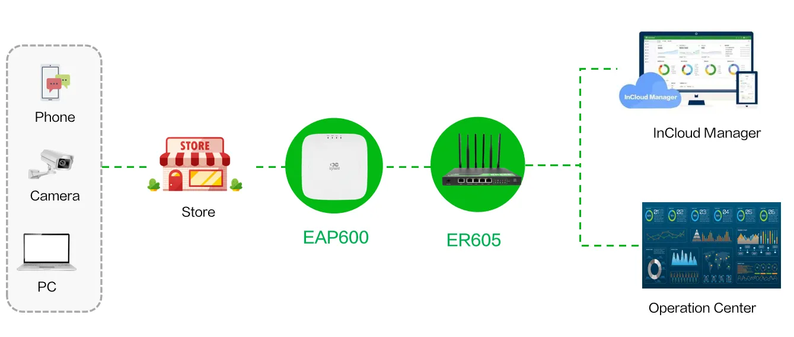

<strong>Figure 1-1 EAP600 Application Scenario</strong>

### 1.2 Package Contents

| Item | Quantity | Description |
|------|----------|-------------|
| EAP600 Access Point | 1 | Main device |
| Power Adapter | 1 | (Original draft lacks detail; to be supplemented) |
| Mounting Accessories |          | (Original draft lacks detail; to be supplemented) |
| Ethernet Cable |          | (Original draft lacks detail; to be supplemented) |
| Quick Start Guide | 1 | (Original draft lacks detail; to be supplemented) |

### 1.3 Appearance and Interfaces

| Interface | Position | Function Description |
|-----------|----------|----------------------|
| WAN/LAN Port | (To be supplemented) | Wired Ethernet interface for network access |
| Power Interface | (To be supplemented) | DC power input or PoE input |
| Reset Button | (To be supplemented) | Restore factory default settings |

### 1.4 LED Indicators

| Indicator | Status | Meaning |
|-----------|--------|---------|
| PWR | Off | The device is powered off |
| | Blinking green | The system is starting |
| | Blinking green rapidly | The system does not work properly |
| | Steady green | The system is upgrading |
| WAN | Off | The network is disconnected |
| | Blinking green | The router is connecting to the wired network |
| Wi-Fi 2.4G | Off | AP mode disabled |
| | Steady on | Other anomalies |
| | Blinking green rapidly | The device functions normally as an AP |
| Wi-Fi 5G | Off | AP mode disabled |
| | Steady on | Other anomalies |
| | Blinking green rapidly | The device functions normally as an AP |

**Note**: The rapid blinking occurs every 200ms, and the steady blinking interval is 500ms.

### 1.5 Restore Factory Defaults

To restore factory default settings using the Reset button:

1. Power on the device, and within 10 seconds, long-press the Reset button until the PWR indicator light rapidly blinks green with a 200ms interval.
2. After the rapid blinking, release the Reset button and wait for the device to complete the factory reset process. The PWR indicator light will stay constantly lit, indicating that the factory reset is complete.

### 1.6 Default Settings

| Function | Default Settings |
|----------|------------------|
| Wi-Fi | 1. The Wi-Fi 2.4 GHz access point (AP) is enabled, and its SSID is "EAP600–" followed by the last six digits of the wireless MAC address. 2. The Wi-Fi 5 GHz AP is enabled, and its SSID is "EAP600-5G–" followed by the last six digits of the wireless MAC address. 3. The authentication method is WPA2-PSK. 4. The two access points have the same password: the last eight digits of the router's SN. |
| Network access control | 1. Local HTTPS service is enabled, using port 443. 2. The device management address is 192.168.10.1 |
| Username and password | adm / 123456 |

---

## Chapter 2: Installation and First Use

### 2.1 Pre-Installation Preparation

Before installing the device, ensure the following conditions are met:

| Item | Requirement |
|------|-------------|
| Power Supply | Use PoE equipment that complies with IEEE 802.3af/at standards, or use the original power adapter. |
| Network Cable | A standard Ethernet cable is available for connecting the device to the upstream network. |
| PC Configuration | A PC with a wireless network adapter or Ethernet port is available for configuration. |
| Environment | The installation location is within the specified temperature and humidity range, away from strong electromagnetic interference. |

> **Caution**: Use the original power adapter or standard-compliant PoE equipment to avoid damaging the device.

### 2.2 Installation Guide

**Step 1: Connect power and network cables**

Connect the power cable and Ethernet cable. When using PoE (Power over Ethernet) to power the EAP600, ensure that the upstream device has PoE functionality enabled.

**Step 2: Connect the PC to the device**

Set the PC and device management IP addresses in the same network segment. The DHCP Server function is enabled by default. The PC needs to be connected to the device's Wi-Fi (SSID and password reference [Default Settings](#16-default-settings)), and verify whether the PC has obtained an address belonging to the 192.168.10.0 network segment.

**Step 3: Log in to the Web management interface**

Open a web browser on the PC and enter the device management address `192.168.10.1`. On the login page, enter the default username and password.

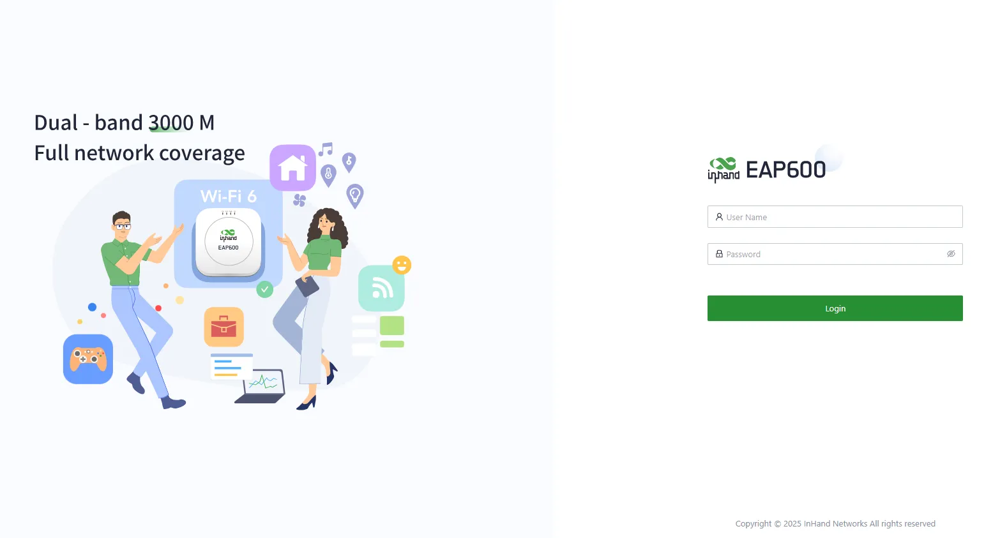

<strong>Figure 2-1 EAP600 Web Login Page</strong>

### 2.3 Quick Check

After installation is complete, verify the following items:

- [ ] The PWR indicator is on, indicating that the device is powered on and operating normally.
- [ ] The WAN indicator is blinking or steady, indicating a network connection.
- [ ] The Wi-Fi 2.4G and/or Wi-Fi 5G indicators are blinking rapidly, indicating that the AP function is active.
- [ ] The PC has successfully obtained an IP address in the 192.168.10.0 network segment.
- [ ] The Web management interface can be accessed via `192.168.10.1`.

---

## Chapter 3: Common Scenario Configuration

### Scenario 1: Wired Internet Access

**Objective**: Configure the EAP600 to access the internet via a wired connection.

**Prerequisites**: The device is powered on, and the WAN port is connected to the upstream network via an Ethernet cable.

**Estimated Time**: About 10 minutes.

**Operation Steps**:

1. Log in to the Web management interface.
2. Navigate to 【Configuration】→【WAN】.
3. Select the network connection type:
   - **DHCP**: The device's WAN interface is set to enable DHCP service by default. Connect the WAN interface to the internet using an Ethernet cable to establish the AP's network connection.
   - **Static IP**: Manually configure the address assigned by the ISP or upstream device. After the configuration is completed, the AP will connect to the network using the specified static IP.
4. Click "Save" to apply the settings.

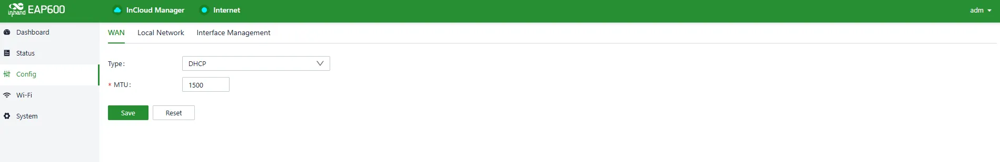

<strong>Figure 3-1 Access the WAN Editing Interface</strong>

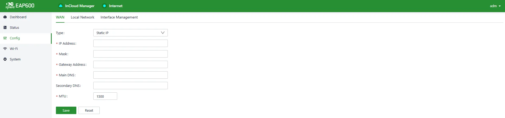

<strong>Figure 3-2 Configuring the AP to Connect to the Network via a Static IP Address</strong>

**Verification Method**:

1. Check that the WAN indicator on the device is blinking green or steady.
2. On the Dashboard, verify that the Uplink IP address has been assigned.
3. From a connected client device, attempt to access an internet website.

**Common Issues**:

- Unable to obtain an IP address: Verify that the upstream device supports DHCP or that the static IP parameters are correct.
- No internet access: Check the Ethernet cable connection and confirm that the upstream network is functioning.

### Scenario 2: Wi-Fi Configuration

**Objective**: Configure Wi-Fi SSIDs and security settings for the 2.4 GHz and 5 GHz bands.

**Prerequisites**: The device is powered on and the Web management interface is accessible.

**Estimated Time**: About 10 minutes.

**Operation Steps**:

1. Log in to the Web management interface.
2. Navigate to 【Wi-Fi】→【SSIDs】.
3. Select the band (2.4 GHz or 5 GHz) and click the "Edit" button for the SSID to configure.

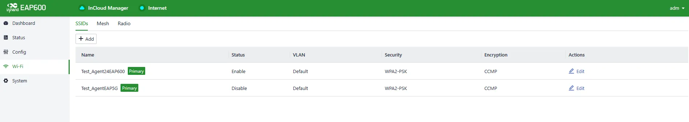

<strong>Figure 3-3 SSID Lists</strong>

4. Enter the desired SSID name, select the authentication method, and set the password.
5. Click "Save" to apply the settings.

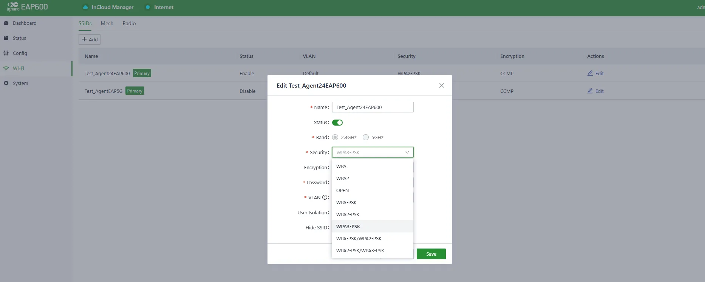

<strong>Figure 3-4 SSID Settings</strong>

**Verification Method**:

1. Use a wireless client device to scan for the configured SSID.
2. Connect to the SSID using the configured password.
3. Verify that internet access is available through the connected Wi-Fi.

**Common Issues**:

- SSID not visible: Verify that the SSID broadcasting is enabled and that the radio is active.
- Connection failure: Verify that the password and authentication method match on both the AP and the client device.

### Scenario 3: Mesh Networking

**Objective**: Establish a Mesh network using multiple EAP600 devices to extend wireless coverage.

**Prerequisites**: At least two EAP600 devices are powered on and within wireless range of each other.

**Estimated Time**: About 15 minutes.

**Operation Steps**:

1. Designate one device as the Controller and the other(s) as Agent(s).
2. On the Controller device, navigate to 【Wi-Fi】→【Mesh】→【Controller】.
3. Enable the Controller function and save the configuration.

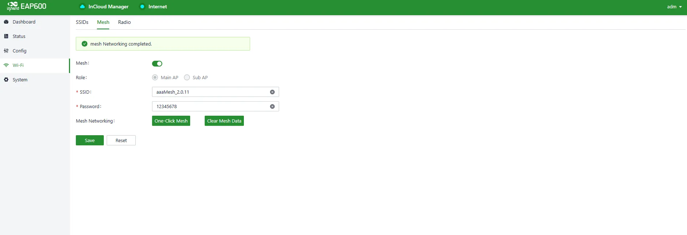

<strong>Figure 3-5 Controller Setting</strong>

4. After saving, click the "One-click Mesh" button on the Controller page.
5. On the Agent device, navigate to 【Wi-Fi】→【Mesh】→【Agent】.
6. Select the connection mode (Wired or Wireless) and save the configuration.

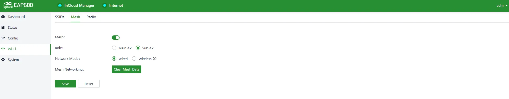

<strong>Figure 3-6 Agent Setting</strong>

7. Wait for approximately one minute for the Agent to connect to the Controller.

**Verification Method**:

1. Navigate to 【Status】→【Mesh】 on the Controller device.
2. Verify that the Agent device appears in the Mesh list with a green status indicator.
3. Connect a wireless client to the Mesh network and verify internet access.

**Common Issues**:

- Mesh network not established: Ensure that the Controller has been configured first and that "One-click Mesh" has been activated.
- Agent cannot connect: For wireless Mesh, ensure that no Ethernet cable is connected to the Agent. For wired Mesh, ensure that the Ethernet cable is properly connected.

### Scenario 4: Cloud Management Connection

**Objective**: Connect the EAP600 to the InCloud Manager platform for remote management.

**Prerequisites**: The device has internet access, and an InCloud Manager account has been registered.

**Estimated Time**: About 10 minutes.

**Operation Steps**:

1. Log in to the Web management interface.
2. Navigate to 【System】→【Cloud Management】.
3. Verify that the InCloud Manager service is enabled. By default, the EAP600 automatically connects to the InCloud Manager once it is online.
4. If the service is disabled, enable it and save the configuration.

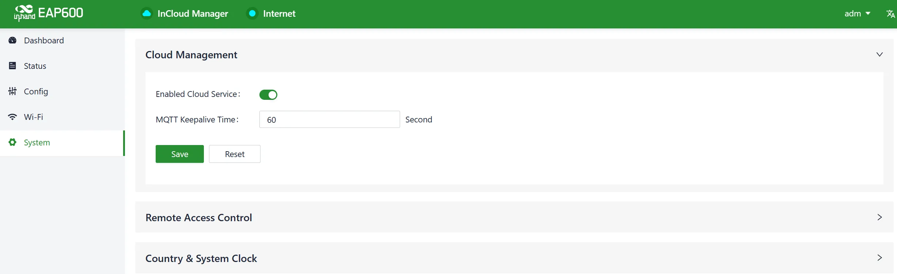

<strong>Figure 3-7 Enable the InCloud Manager Service</strong>

5. Log in to the InCloud Manager platform at [https://star.inhandcloud.com/](https://star.inhandcloud.com/).
6. Navigate to the "Devices" menu and click "Add".
7. Enter the device's serial number and MAC address to complete the addition process.

**Verification Method**:

1. On the InCloud Manager platform, check that the device status shows as "Online".
2. From the platform, attempt to view the device Dashboard or perform a remote operation.

**Common Issues**:

- Device cannot connect to the cloud: Verify that the device has internet access and that the Cloud Management service is enabled.
- Device addition fails: Double-check that the serial number and MAC address are entered correctly.

---

## Chapter 4: Function Description and Parameter Reference

### 4.1 Dashboard

Once the device is added to the platform, the network can be managed and monitored from the platform, while users can also remotely view real-time status information on the device's local interface.

Click 【Dashboard】 in the left-hand menu to access the dashboard interface and view the device's basic information, operating mode, traffic statistics, Wi-Fi connection count, and other information.

The icon next to the "Name" field can be clicked to customize the name of the device.

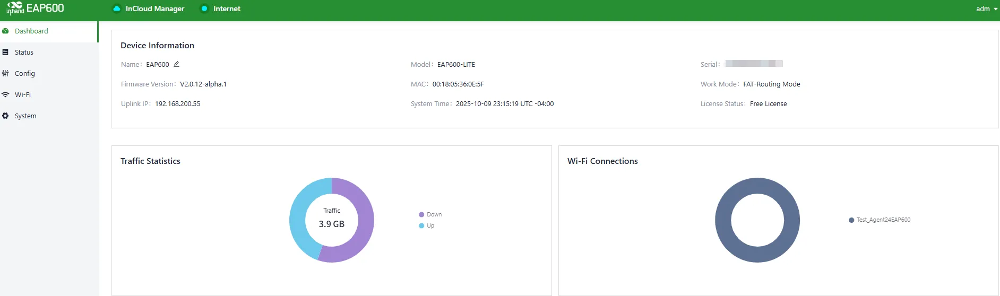

<strong>Figure 4-1 Dashboard Interface</strong>

#### 4.1.1 Device Information

Basic device information can be viewed in the "Dashboard > Device Info" interface, including the device name, device model, device serial number, MAC address, online duration, upstream interface address, and other details.

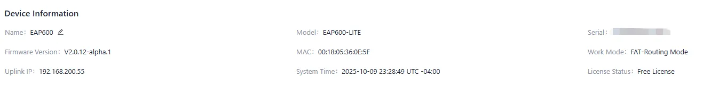

<strong>Figure 4-2 Device Information Interface</strong>

| Parameter | Description |
|-----------|-------------|
| Name | Identifies the device's name, which is initially set to "EAP600" but can be customized. |
| Model | Identifies the specific sub-model of the product. |
| Serial | A unique code that serves as an identifier for the device and can be used for indexing or adding the device to a platform account. |
| Firmware Version | Shows the device's current software version. |
| MAC Address | Identifies the device's physical MAC address. |
| Work Mode | EAP600 has two operational modes: FAT-Bridge and FAT-Routing. |
| Uplink IP | The IP address of the upstream interface used for device internet connectivity. |
| System Time | Displays the device's time zone and system time. |
| License Status | Indicates the licenses applied to the product. The EAP600 product is freely available to users. |

#### 4.1.2 Traffic Statistics

The usage of traffic on various upstream interfaces since the EAP600 was powered on can be checked through the "Dashboard > Traffic Statistics" feature. The data for traffic statistics will reset after the device is restarted. If historical traffic records need to be viewed, they can be found on the corresponding device's details page in the InCloud Manager.

<strong>Figure 4-3 Traffic Statistics</strong>

#### 4.1.3 Wi-Fi Connections

The number of active SSIDs and the client count for each SSID that is connected to the EAP600 can be viewed through the "Dashboard > Wi-Fi Connections" feature.

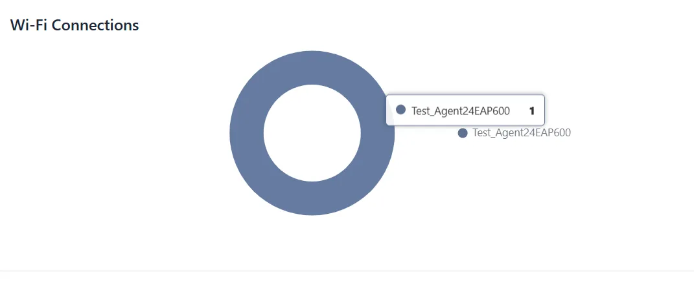

<strong>Figure 4-4 Wi-Fi Connection Status</strong>

### 4.2 Status

Click 【Status】 in the left menu to enter the status page, where the device's Mesh status, client list, events, and logs can be checked.

#### 4.2.1 Mesh

In this menu interface, the Mesh connection status between APs can be viewed. The green indicator in the diagram represents the current device's role.

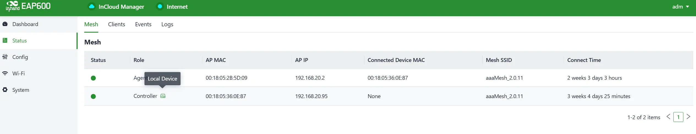

<strong>Figure 4-5 Mesh Status</strong>

| Parameter | Description |
|-----------|-------------|
| Status | Green indicates that the Mesh network has been successfully established, while gray indicates that the Mesh network has not been successfully established. |
| Role | Indicates the role of the AP in the Mesh network. 1. Controller: The Controller in the entire Mesh network. 2. Agent: The Agent in the Mesh network. |
| AP MAC | The MAC address uniquely identifying the AP hardware. |
| AP IP | In the Mesh network, the EAP600's address is assigned by the Controller's DHCP or by a DHCP server obtained by the Controller from a third-party device. |
| Connected Device MAC | Shows the MAC address of the AP's parent node. The Controller does not have a parent node. |
| Mesh SSID | The SSID broadcasted by the Controller in the Mesh network. |
| Connect Time | The duration for the AP to establish the Mesh network. |

#### 4.2.2 Clients

Clients typically refer to wireless devices connected to an access point (AP), such as laptops, smartphones, tablets, and other similar devices.

Detailed client information connected to the EAP600 can be accessed via the "Status > Clients" feature. This information includes client names, IP addresses, MAC addresses, VLAN, connected SSID, RSSI, operating channels, Wi-Fi standards, traffic usage, online duration, and more.

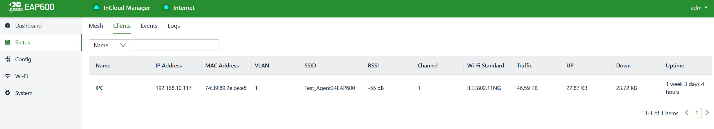

<strong>Figure 4-6 Wireless Client Connection Information</strong>

#### 4.2.3 Events

【Event】 is used to record information related to the device's status, performance, and user-triggered operations. This helps IT personnel understand the network's operational status, detect problems promptly, and take necessary measures. It is a valuable tool for network monitoring and troubleshooting.

Event information generated during the device's operation can be accessed via the "Status > Events" function. New events will be updated at the beginning of the table.

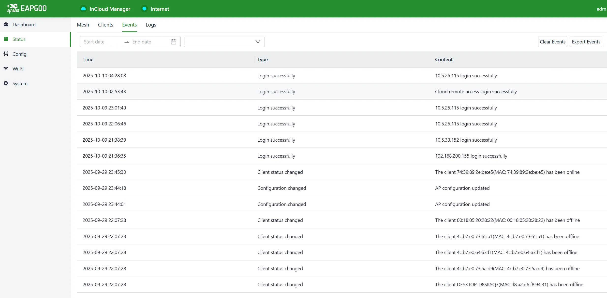

<strong>Figure 4-7 Recorded Events</strong>

At the top of the event list, the displayed content can be filtered by setting the time and selecting the event level. Recorded events can also be exported or cleared using the "Clear Events" and "Export Events" buttons. In addition, the number of events displayed per page can be set, and fast page navigation is available at the bottom right of the page.

The currently supported event types that can be recorded include:

- Successful User Login
- Failed User Login
- Configuration Changes
- High CPU Utilization
- High Memory Utilization
- Device Reboot
- Firmware Upgrade
- Client Status Changes
- Connection Status Changes

#### 4.2.4 Logs

The log function is used to record the raw return information of the device's operation under various circumstances. It is typically employed by IT or research and development personnel for the analysis and troubleshooting of issues.

The device's system logs can be accessed by navigating to the "Status > Logs" section. System logs provide detailed information about the device's operation, and they are invaluable for troubleshooting when issues arise. Users have the option to download and clear logs as needed.

The displayed log entries can be filtered based on log level or by entering keywords. New log entries are added to the end of the log, keeping the most recent events at the bottom of the log.

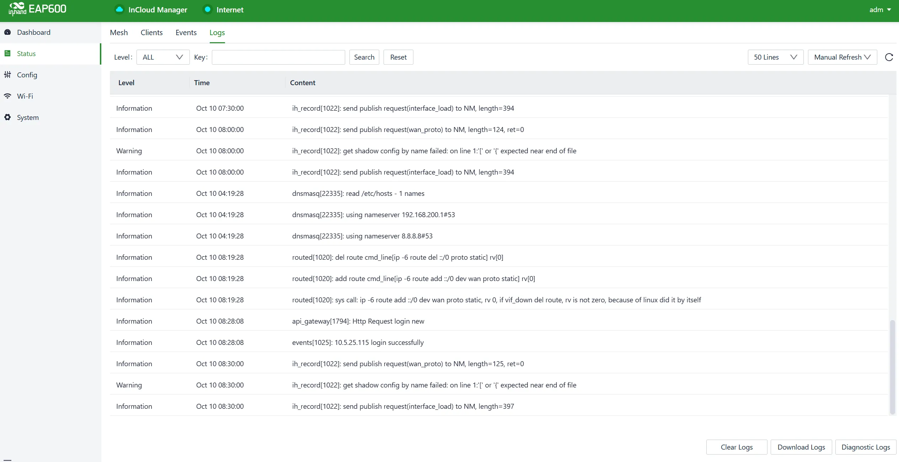

<strong>Figure 4-8 Recorded Logs</strong>

### 4.3 Configuration

Click the "Config" button in the left-side navigation menu to access the configuration page. On this page, the device's WAN/LAN interface settings can be configured.

#### 4.3.1 WAN

The EAP600 supports single-port wired access, and it can be configured to use DHCP or static IP address assignment based on requirements. Click 【Configuration】→【WAN】 to select the network connection type.

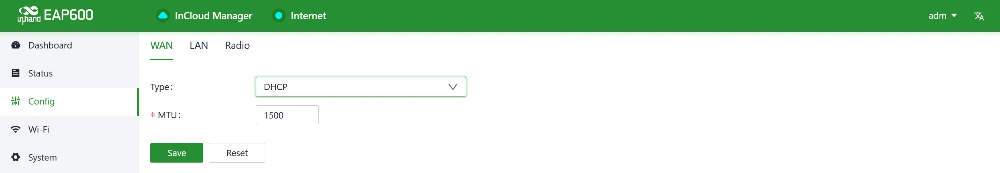

<strong>Figure 4-9 Access the WAN Editing Interface</strong>

- **DHCP**: The EAP600 can dynamically obtain an internet IP address by using the DHCP server of the upstream router.
- **Static IP**: The address assigned by the ISP or upstream device can be manually configured. After the configuration is complete, the AP will connect to the network using the specified static IP.

The default MTU value is 1500, and the valid input range is from 128 to 1500.

#### 4.3.2 Local Network

In this interface, the local LAN subnet can be configured.

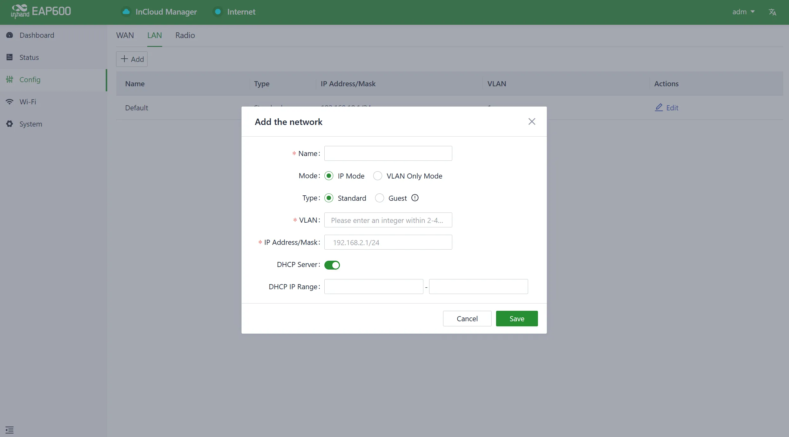

<strong>Figure 4-10 Add a Local Network</strong>

The "Network Type" field provides two available modes:

- **Standard**: Clients connected to the standard mode network can access the Internet and the device's web interface.
- **Guest**: Clients connected to the guest mode network can only access the Internet and cannot log in to the device's web interface.

**Edit Local Network**: The parameters of an existing local network can be adjusted, and the configuration fields are the same as when creating a new network.

#### 4.3.3 Interface Management

In this interface, the port operation mode can be configured. By default, the port is in WAN mode, allowing the AP device to automatically obtain a DHCP address. When the AP operates in a Mesh or local network, the port can be changed to LAN mode.

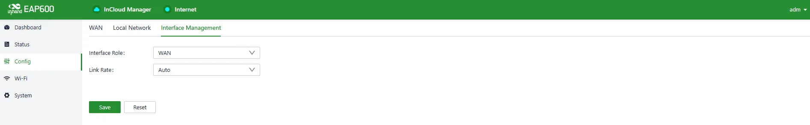

<strong>Figure 4-11 Edit Interface Parameters</strong>

- When the port operates in WAN mode, the EAP600 will obtain an IP address assigned by DHCP through the port.
- When the port operates in LAN mode, the EAP600 will use its own DHCP service to assign IP addresses through the port.

### 4.4 Wi-Fi

#### 4.4.1 SSIDs

SSIDs can be set for both 2.4 GHz and 5 GHz bands, with up to four SSIDs supported per band.

<strong>Figure 4-12 SSID Lists</strong>

By default, the EAP600 will broadcast the initial SSIDs for both 2.4 GHz and 5 GHz bands. The username and password can be found on the nameplate.

1. **2.4GHz**: SSID: EAP600-XXXXXX (the last 6 digits of the 2.4G Wi-Fi MAC address), Password: the last 8 digits of the serial number.
2. **5GHz**: SSID: EAP600-5G-XXXXXX (the last 6 digits of the 2.4G Wi-Fi MAC address), Password: the last 8 digits of the serial number.

<strong>Figure 4-13 SSID Settings</strong>

#### 4.4.2 Mesh

To implement Mesh, both the Controller and Agent need to be configured as follows.

**Controller**

It is recommended to configure the Controller first. Each Controller can connect to only one Agent at a time.

<strong>Figure 4-14 Controller Setting</strong>

After saving the configuration, buttons for "One-click Mesh" and "Clear Mesh Data" will appear on the page.

1. **One-Click Mesh**: When the Controller stops broadcasting or a new Agent establishes a wireless connection for the first time, click the button in the Controller's configuration settings to ensure the Mesh network is successfully established.
2. **Clear Mesh Data**: When the Mesh configuration needs to be modified or the Mesh connection records need to be cleared, this button can be used to reset.

The Controller will periodically send broadcast packets to establish the Mesh network. If no new Agent joins the Mesh network, it will stop broadcasting after 10 minutes.

**Agent**

InHand provides two ways for an Agent to join the Mesh network: via wired connection or wireless connection. Once the Controller is set up, an Agent can usually connect to it within one minute.

<strong>Figure 4-15 Agent Setting</strong>

- **Wired**: Wired Mesh setup is relatively simple and offers greater stability.
- **Wireless**: Wireless Mesh can overcome cabling difficulties, but its stability is somewhat lower than wired. When setting up a wireless Mesh, ensure that no Ethernet cable is connected.

#### 4.4.3 Radio

The frequency width and transmit power for 2.4GHz and 5GHz radio frequencies can be configured under "Configuration > Wi-Fi > Radio." When the "Transmit Power" is set to "Custom," the power value must be manually entered. The valid input range for power is between 1 and 20, with the default value being 20.

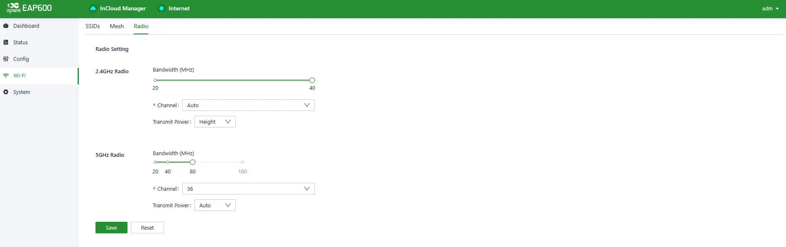

<strong>Figure 4-16 Set the Transmit Power Manually</strong>

### 4.5 System

Under the "System" menu, various settings and features can be configured, including cloud management, remote access control, clock settings, device options, configuration management, device alerts, tools, and log server configurations.

#### 4.5.1 Admin Management

The initial username and password for the device are "adm" and "123456." To enhance security, it is recommended to change this password. This can be done by clicking on "adm" in the top navigation bar, and then selecting "Change Password" from the dropdown menu.

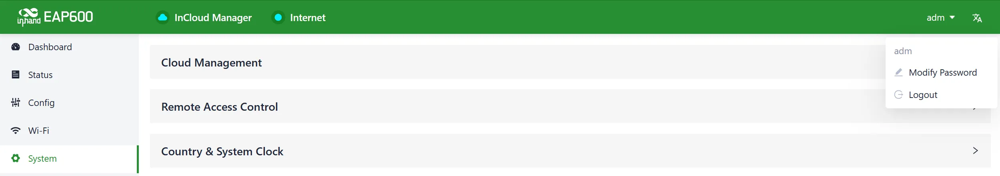

<strong>Figure 4-17 Modify the Password</strong>

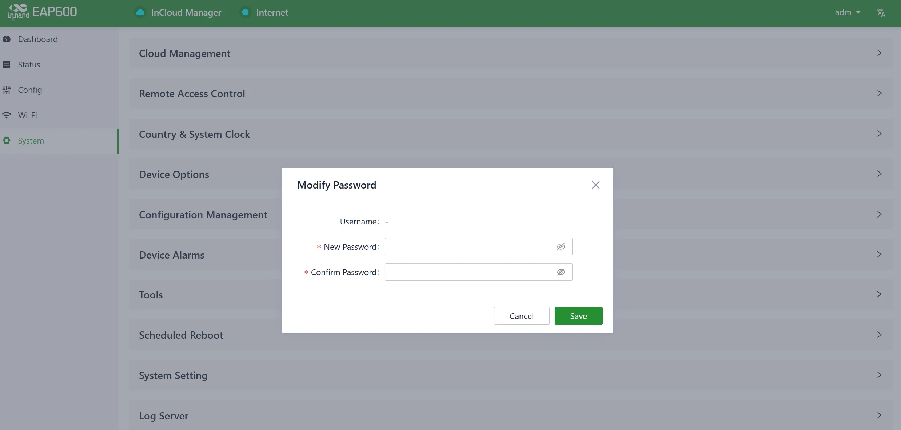

<strong>Figure 4-18 Set a New Password</strong>

#### 4.5.2 Cloud Management

The InCloud Manager (star.inhandcloud.com) is a cloud platform developed by InHand Networks to address the challenges faced by enterprise networks, such as slow deployment, complex operations, and poor user experiences. This platform prioritizes user needs and combines features like zero-touch deployment, intelligent operations and maintenance, security protection, and exceptional business experience capabilities. Once devices are connected to the cloud platform, remote management, batch configuration, and traffic monitoring can be performed, making network device management more convenient and efficient.

The EAP600, by default, automatically connects to the InCloud Manager once it is online. If the cloud management functionality is not preferred, this service can be manually disabled in the "System > Cloud Management" section.

<strong>Figure 4-19 Enable the InCloud Manager Service</strong>

#### 4.5.3 Remote Access Control

The accessibility of the router's web configuration interface from external sources via the Internet can be managed by using the "System > Remote Access Control" feature. This feature enables control and configuration of remote access to the router's web interface.

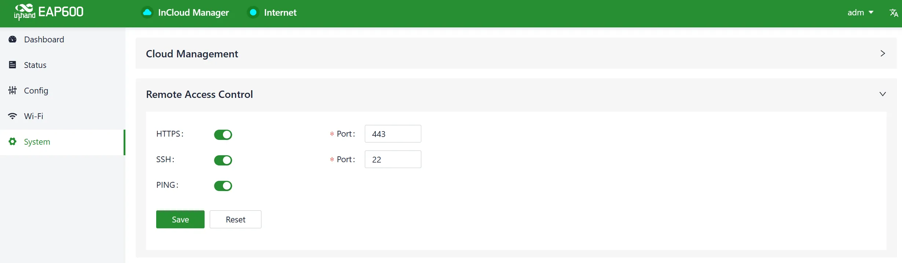

<strong>Figure 4-20 Configure Remote Access</strong>

When remote access to the router's web configuration interface is enabled through the "System > Remote Access Control" feature, the following options are available:

1. **HTTPS**: Once enabled, the router's web interface can be accessed remotely through a web browser by entering the public IP address and port number associated with the upstream interface.
2. **SSH**: When enabled, the router's backend can be remotely logged in to using a remote tool. Enter the public IP address and port number of the upstream interface, along with the username and password to establish remote access.
3. **Ping**: Enabling this option allows external networks to initiate Ping requests to the IP address of the upstream interface.

#### 4.5.4 Country & System Clock

In network functionality, the clock function refers to the capability used to coordinate and synchronize time between network devices. Clock functionality within a network is crucial for data transmission, log recording, security, coordination, and troubleshooting. It ensures that various devices in the network are operating at synchronized times, which is essential for efficient and secure network operations.

In the "System > Clock" function, the following actions can be performed:

- Select the country to configure the device with the appropriate time zone.
- Set the time and date to align with the local time. This will become the device's system time.
- Configure at least one valid NTP (Network Time Protocol) Server address. This allows the device to synchronize its system time with the selected NTP server, ensuring accurate timekeeping.

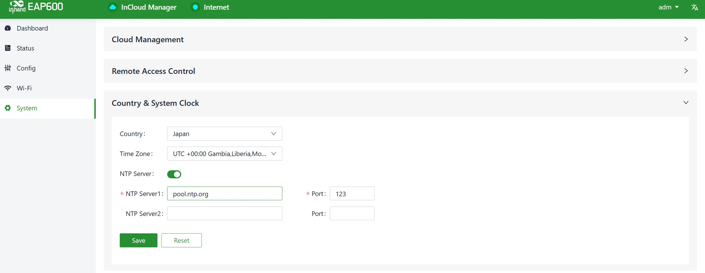

<strong>Figure 4-21 Choose the Country and Configure the NTP Server Address</strong>

#### 4.5.5 Device Option

In "System > Device Options," actions can be performed on the device, such as rebooting, firmware upgrades, and restoring to factory settings.

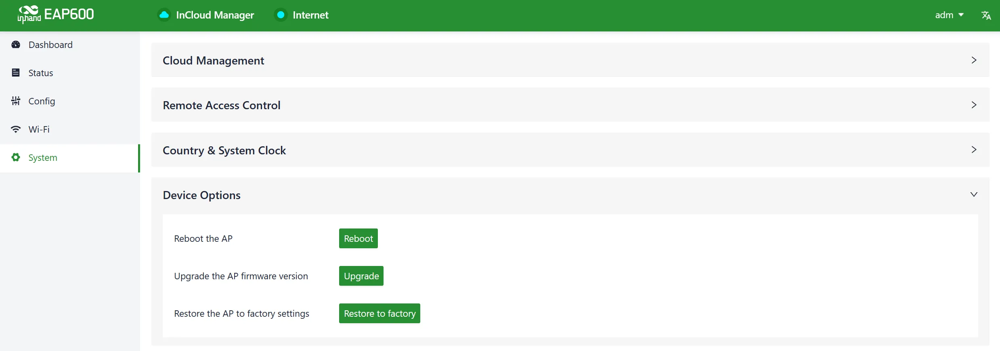

<strong>Figure 4-22 Device Option Interface</strong>

**Cautions**:

- When upgrading firmware locally, ensure that the firmware is obtained from legitimate sources to prevent the device from becoming unusable due to incorrect firmware installation.
- When the device is connected to the cloud platform, due to the cloud-based configuration synchronization mechanism, the platform will reapply the configuration that was in place before the factory reset, with the device only clearing historical data.

#### 4.5.6 Configuration Management

Configuring backups and backup recovery are critical tasks in network management and maintenance. They involve the process of preserving configuration information for network devices so that they can be quickly restored or migrated when needed. This practice ensures the resilience and reliability of network operations and simplifies the recovery process in case of system failures or configuration changes.

In the "System > Configuration Management" section, users have the option to export the device configuration for local storage. This exported configuration can be saved on the local system and can be utilized to restore the device's configurations if they are lost or need to be replaced.

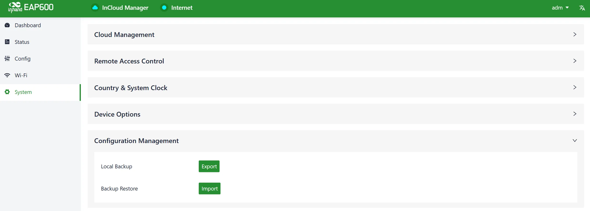

<strong>Figure 4-23 Manage the Device Configuration</strong>

#### 4.5.7 Device Alarms

Specific events that may occur on the device can be selected as alarm events, and the email address for receiving alerts can be configured. When an alarm event occurs, the device will automatically send an email notification. Even if certain alarm options are not selected, related alarm events will still be recorded in the device's local logs.

Alarm event types can be set and the email address for alerts can be configured in the "System > Device Alarms" function. The currently supported alarm events for the device are as follows:

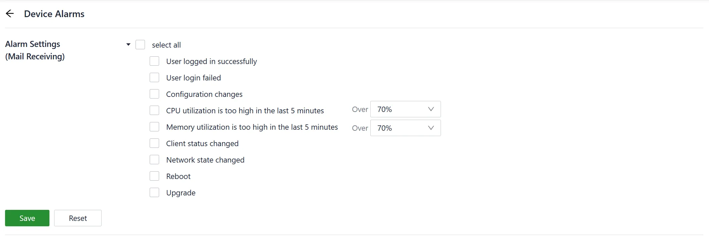

<strong>Figure 4-24 Configure the Alarm Events</strong>

Once the outgoing email server address, port, username, and password for the sender's email are configured, the device will use this email account to send alarm notifications. To verify the configuration of the sender's email, the "Send Test Email" option can be used. This feature allows checking if the sender's email settings are correctly configured and that the device can successfully send test emails.

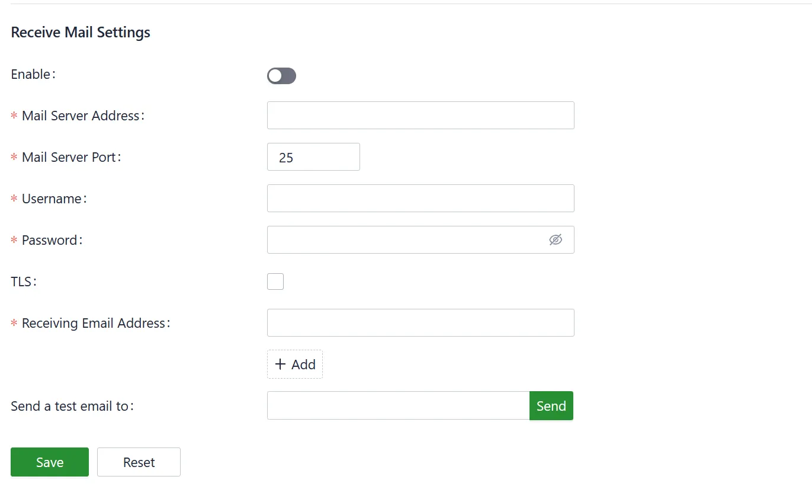

<strong>Figure 4-25 Set the Alarm Email Receiving Address</strong>

#### 4.5.8 Tools

##### 4.5.8.1 Ping

ICMP (Internet Control Message Protocol) can be used to check the device's external network connectivity. In the "Target" field, enter any domain name or IP address to test the device's connectivity to, and then click "Start" to check the connectivity status between the device and the specified target. This can help determine whether the device can reach the target over the internet.

A network ping test on a target can be performed by going to "System > Tools > Ping." This allows sending ICMP echo requests to the specified target IP address or domain name and receiving ICMP echo replies to check network connectivity and latency to that target.

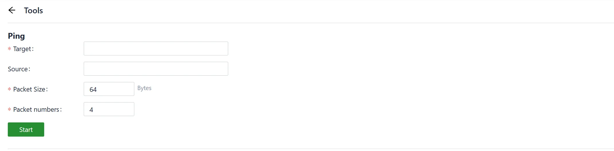

<strong>Figure 4-26 Ping</strong>

##### 4.5.8.2 Traceroute

Traceroute is a network diagnostic tool used to determine the network path that data packets take from the source to the destination, as well as the intermediate routers or hops along that path. The target host's IP address can be entered in "System > Tools > Traceroute," the outgoing interface for the traffic can be chosen, click "Start," and the device's connectivity to the target IP can be checked by tracing the route.

<strong>Figure 4-27 Traceroute</strong>

##### 4.5.8.3 Capture

Packets passing through a specific interface can be captured using the "System > Tools > Capture" feature. Select the "Output" option, and choose to either display the captured packets in the interface or export them locally for analysis or further examination.

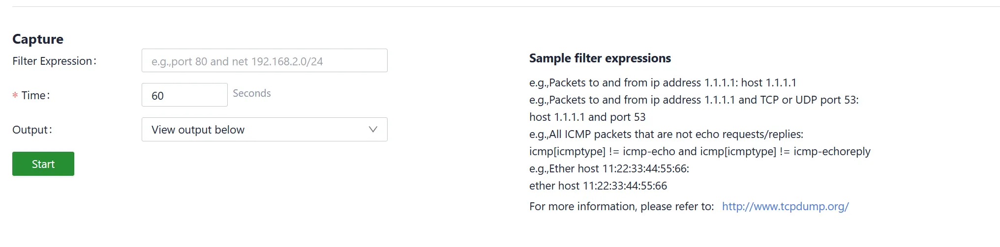

<strong>Figure 4-28 Packet Capture</strong>

#### 4.5.9 Scheduled Reboot

An automatic reboot schedule can be set up in "System > Scheduled Reboot." The reboot frequency can be chosen, such as daily, weekly, or monthly, and the exact time for each scheduled reboot can be specified.

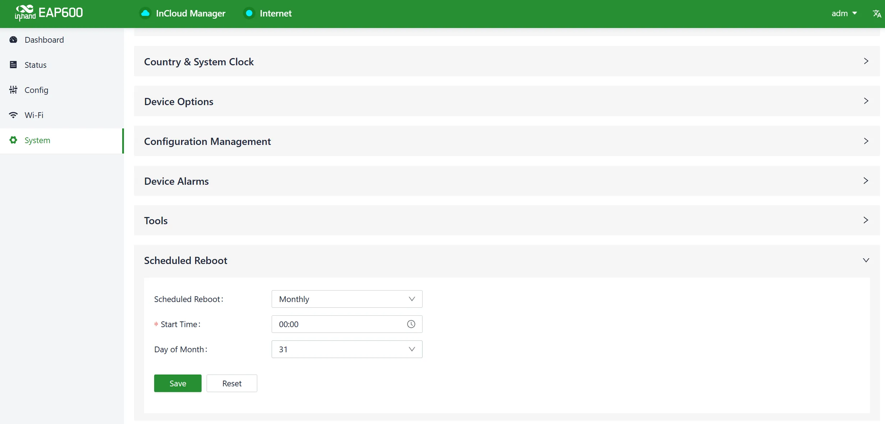

<strong>Figure 4-29 Set the Reboot Plan</strong>

When selecting "Monthly Reboot," if the chosen reboot day is greater than the actual number of days in that month, the device will perform the scheduled reboot at the specified time on the last day of that month.

#### 4.5.10 System Settings

In the "System > System Settings" function, the operating mode of the EAP600 can be set.

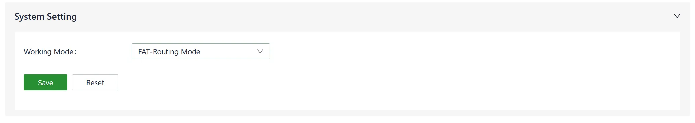

<strong>Figure 4-30 System Settings</strong>

- **FAT (Firmware-Defined Access Point) Router Mode**: In this mode, the AP operates in a FAT mode and uses the configuration set on the AP itself, including SSID, password, and other settings. In router mode, the WAN and LAN ports are isolated from each other, and client devices connected to the AP are assigned addresses from the AP's local address pool.
- **FAT Bridge Mode**: In this mode, the AP operates in FAT mode and uses the AP's configured SSID, password, and other settings. In bridge mode, the WAN and LAN ports are in the same Layer 2 network, and client devices connected to the AP obtain addresses from the DHCP server of the upstream router connected to the AP.

#### 4.5.11 Log Server

When the log file server function is enabled in the "System > Log Server" feature, the device will periodically upload log files to the specified server.

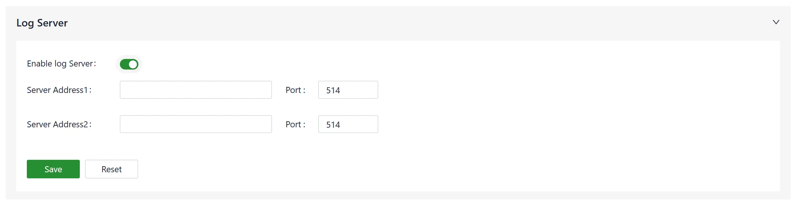

<strong>Figure 4-31 Enable the Log Server Service</strong>

#### 4.5.12 Other Settings

##### 4.5.12.1 Web Login Management

The logout time can be set in "System > Other Settings > Web Login Management." Once the online time for a single login session on the device's web page exceeds the set time, the system will automatically log out of the user, requiring them to log in again to continue their operations.

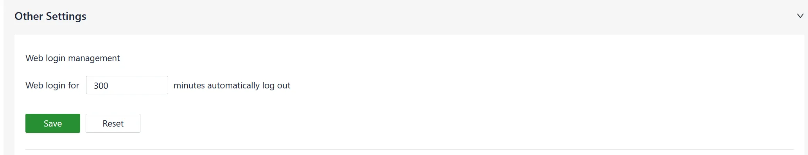

<strong>Figure 4-32 Setting the Automatic Log-out Time</strong>

##### 4.5.12.2 Automatically Restart

When this feature is enabled in "System > Other Settings > Automatically Restart," the device will automatically reboot if it cannot connect to the network and, after one hour of retrying, remains unable to access the network.

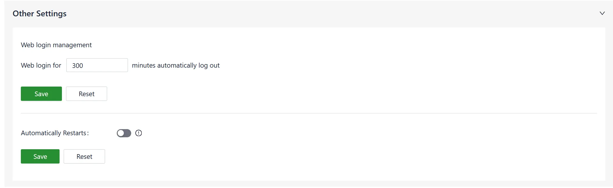

<strong>Figure 4-33 Enable the Automatically Restart</strong>

---

## Chapter 5: Typical Application

### Case 1: Enterprise Wireless Coverage

**Scenario Description**: A small business or enterprise branch requires high-speed wireless coverage for office devices, including laptops, smartphones, and tablets. The EAP600 serves as a Wi-Fi 6 access point to provide secure and reliable network access.

**Network Topology**:

<strong>Figure 5-1 Enterprise Wireless Coverage Topology</strong>

**Device Role**: The EAP600 functions as a Wi-Fi 6 Access Point, responsible for broadcasting wireless SSIDs and forwarding client traffic to the upstream wired network.

**Configuration Steps**:

1. Connect the EAP600 to the upstream switch or router using an Ethernet cable (powered via PoE or the original power adapter).
2. Log in to the Web management interface at `192.168.10.1`.
3. Navigate to 【Configuration】→【WAN】 and configure the network connection type (DHCP or Static IP) according to the upstream network requirements.
4. Navigate to 【Wi-Fi】→【SSIDs】 and configure the 2.4 GHz and 5 GHz SSID names and passwords.
5. (Optional) If multiple EAP600 devices are deployed, navigate to 【Wi-Fi】→【Mesh】 to configure the Controller and Agent devices for seamless roaming.
6. Verify that client devices can connect to the Wi-Fi and access the internet.

**Reference Chapters**:

- [Wired Internet Access](#scenario-1-wired-internet-access)
- [Wi-Fi Configuration](#scenario-2-wi-fi-configuration)
- [Mesh Networking](#scenario-3-mesh-networking)

---

## Appendix: Troubleshooting

### 1 Network Connection Issues

| Phenomenon | Possible Cause | Troubleshooting Steps | Reference Chapter |
|------------|----------------|----------------------|-------------------|
| Clients cannot connect to the wireless network | The AP is not operational or online | 1. Verify that the AP is powered on. 2. Check the LED indicators for abnormal signals. 3. Restart the AP or restore it to a backup configuration. | [LED Indicators](#14-led-indicators) |
| Clients cannot connect to the wireless network | Firmware is outdated | 1. Check the current firmware version on the Dashboard. 2. Obtain the latest firmware from the official source. | [Device Option](#455-device-option) |
| Clients cannot connect to the wireless network | SSID or encryption settings mismatch | 1. Verify that the SSID and password on the client match the AP configuration. 2. Reconfigure the SSID settings if necessary. | [Wi-Fi Configuration](#scenario-2-wi-fi-configuration) |
| Wireless network is slow or unstable | Signal interference or weak signal | 1. Check the signal strength and interference level. 2. Review the channel settings and transmit power parameters. 3. Ensure the AP is not located too close to electronic devices such as microwave ovens or Bluetooth devices. | [Radio](#443-radio) |
| Wireless network is slow or unstable | Too many connected clients | 1. Verify that the number of connected clients does not exceed the AP's capacity. 2. Consider adding additional APs or enabling load balancing. | [Wi-Fi Connections](#413-wi-fi-connections) |
| AP cannot start properly or crashes frequently | Power supply issue | 1. Check if the power adapter is properly connected. 2. Verify that the PoE power supply device is functioning correctly. | [Installation Guide](#22-installation-guide) |
| AP cannot start properly or crashes frequently | Overheating or high humidity | 1. Inspect the AP's temperature to ensure it is not overheating. 2. Verify that the environmental humidity meets the device's requirements. | [Pre-Installation Preparation](#21-pre-installation-preparation) |
| Unable to connect to a specific website or service | DNS configuration issue | 1. Check if other devices can access the website or service. 2. Clear the browser's cache and cookies. 3. Verify if the DNS server addresses are configured correctly and try different DNS server addresses. | [WAN](#431-wan) |

### 2 Device Management Issues

| Phenomenon | Possible Cause | Troubleshooting Steps | Reference Chapter |
|------------|----------------|----------------------|-------------------|
| Unable to log in to the Web interface | IP address mismatch | 1. Confirm that the PC and the device are in the same subnet. 2. Check the device's default IP address (192.168.10.1). | [Default Settings](#16-default-settings) |
| Unable to log in to the Web interface | Incorrect username or password | 1. Verify that the correct username and password are being used. 2. If the password has been forgotten, perform a factory reset. | [Restore Factory Defaults](#15-restore-factory-defaults) |
| Device cannot connect to InCloud Manager | Cloud Management service is disabled | **1**. Navigate to System > Cloud Management. 2. Verify that the InCloud Manager service is enabled. | [Cloud Management Connection](#scenario-4-cloud-management-connection) |
| Mesh network not established | Controller not configured | 1. Ensure that the Controller device has been configured first. 2. Click the "One-click Mesh" button on the Controller. | [Mesh Networking](#scenario-3-mesh-networking) |

---

## Appendix: Security Precautions

1. Use PoE (Power over Ethernet) equipment that complies with the IEEE 802.3af/at standards to power the AP. If PoE is not used, use the original power adapter to avoid damaging the device.

2. Do not install the device in environments with strong electromagnetic interference and keep it away from high-power equipment. After installation, ensure that the device is securely fixed to prevent damage or potential harm due to the device falling.

3. Verify that the operating environment meets the specified temperature and humidity conditions for the device.

4. Regularly inspect the device cables, keeping them clean, and promptly replace any damaged cables.

5. When cleaning the device, avoid spraying chemical agents directly on the device's surface to prevent damage to the casing or internal components. Use a soft cloth for cleaning.

6. Do not attempt to disassemble or modify the device on your own, as this can pose safety risks and void the warranty for the device.

---

## FAQ

**Question 1: Is the cloud platform free for the EAP600?**

For the EAP600 product, InHand provides the license to users for free. Licenses are still required for the ER series routers.

**Question 2: How can devices be added to the cloud platform?**

1. Register for a login account on the InCloud Manager platform at [https://star.inhandcloud.com/](https://star.inhandcloud.com/).
2. Use the registered account to log in to the cloud platform, navigate to the "Devices" menu, and click "Add."
3. Follow the prompts to enter the device's serial number and MAC address to complete the addition process. When adding a device for the first time, a complimentary one-year Basic license is provided, and it can be renewed as needed.

**Question 3: Is it possible to use devices without the cloud platform?**

Yes. Most settings can be configured locally. However, for features like batch configuration deployment, firmware upgrades, Connector, and more, it is recommended to use the cloud platform for enhanced functionality and management.

If the issue cannot be resolved using the steps mentioned above or if any other problems are encountered, contact InHand Networks for technical support. Visit [www.inhandnetworks.com](http://www.inhandnetworks.com/) to obtain more information.
