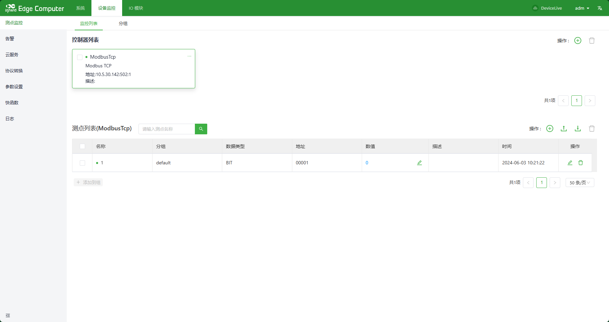
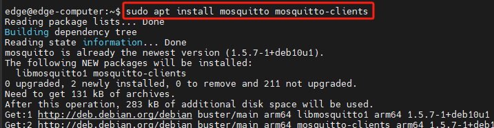
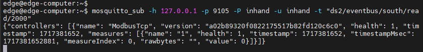
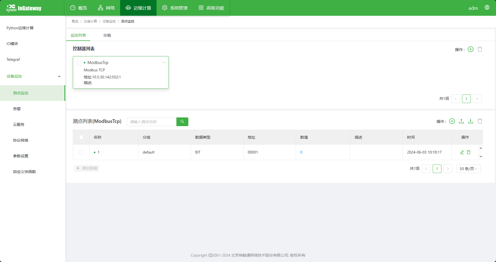
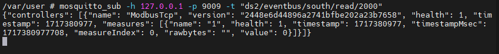
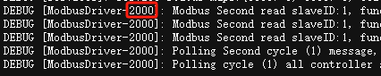

# DSA API Documentation V1.0

## 1 fast function API reference

this section describes the Python API used inside the Gateway, which provides a set of feature-rich interfaces that enable you to write Python scripts to perform various operations and data processing on the Gateway. This section provides the necessary information and sample code to help you take full advantage of the features and performance of the product.

### 1.1 publishing data such as measuring points, alarms, and customizations to the cloud (publishing fast functions)

import the API for publishing data to the cloud:

```python
from quickfaas.remotebus import publish

publish(topic, payload, qos=1, wizard_data=None, cloud_name="default")
```

parameter introduction:

topic: topic of the published data

payload: the published data payload.

qos: Message level of the published data

wizard\_data: Failed to push the message for the first time. The message is stored in the offline cache according to the topic, payload, qos specified by wizard\_data (if wizard\_data is not specified, the sent topic, payload, qos is used). After the connection is restored, the message is uploaded to the MQTT server in chronological order. The format of wizard\_data is as follows:{"topic": `<topic>`, "qos ": `<qos>`, "payload ": `<payload>`}

cloud\_name: specifies the cloud to which the cloud is published. It is available for multi-cloud collaboration.

When configuring the "publish" fast function, there are two formats for the parameter message of the fast function (determined by whether to pass the wizard\_api)

the entry function contains the wizard\_api parameter. The script example is as follows (the default script)

```python
## Enter your python code.
import json
from common.Logger import logger
from quickfaas.remotebus import publish


def main(message, wizard_api, cloudName):
    logger.debug("publish topic:%s, payload: %s, cloudName: %s" % (__topic__, message, cloudName))
    publish(__topic__, json.dumps(message), __qos__, cloud_name=cloudName)
```

Example of the format of the incoming message data:

```json
{
    "timestamp": 1713498600,
    "timestampMsec": 1713498600121,
    "group_name": "default",
    "values": {
        "Modbus": {
            "word": {
                "raw_data": 22,
                "timestamp": 1713498592,
                "status": 1,
                "timestampMsec": 1713498592261
            }
        }
    }
}
```

the entry function does not contain the wizard\_api parameter. The script example is as follows:

```python
## Enter your python code.
import json
from common.Logger import logger
from quickfaas.remotebus import publish


def main(message, cloudName):
    logger.debug("publish topic:%s, payload: %s, cloudName: %s" % (__topic__, message, cloudName))
    publish(__topic__, json.dumps(message), __qos__, cloud_name=cloudName)
```

example of the format of the incoming message data:

```json
{
    "timestamp": 1713498680,
    "timestampMsec": 1713498680121,
    "group": "default",
    "measures": [
        {
            "ctrlName": "Modbus",
            "name": "word",
            "health": 1,
            "timestamp": 1713498672,
            "timestampMsec": 1713498672278,
            "value": 22
        }
    ]
}
```

### 1.2 update the measuring point value of the controller

#### 1.2.1 write

this interface is a write value interface in synchronous mode. After being called, it will wait until the write value response message is returned.

```python
def write(message, timeout=60, cloudName=None)
```

message: write a measuring point message in the following format:

format 1:{"measures1": 12}. If the measuring point name is duplicated or does not exist, an exception will be thrown to indicate that the value has failed to be written.

Format 2:{"controller1": {"measures1": 12}}

format 3:\[{"name": "controller1", "measures":\[{"name": "measures1", "value": 12}]}]

timeout: write point response timeout, 60s by default

cloudName: indicates which cloud platform calls the write command (used to determine whether the measuring point under the current cloud platform is blocked or renamed), optional.

```python
from common.Logger import logger
from quickfaas.measure import write


def action_name():
    write_request = {"measures1": 12}
    logger.debug('write plc response: %s' % write(write_request))

    write_request = {"controller1": {"measures1": 12}}
    logger.debug('write plc response: %s' % write(write_request))
    
    write_request = [{"name": "controller1", "measures":[{"name": "measures1", "value": 12}]}]
    logger.debug('write plc response: %s' % write(write_request))
```

```json
[
    {
        "device": "controller1", 
        "var_name": "measures1", 
        "result": "OK", # "OK" means success, "Failed" means failure
        "error": "Success"
    }
]
```

```json
[
    {
        "name": "controller1", 
        "measures":[
            {
                "name": "measures1", 
                "error_code": 0, # 0 means success, non-zero means failure
               "error_reason": "Success"
            }
        ]
    }
]
```

#### 1.2.2 write\_plc\_values (recommend)

this interface is an asynchronous value write interface, and the value write response message will trigger the callback function interface.

```python
def write_plc_values(message, callback=None, userdata=None, timeout=60, cloudName=None)
```

message: write a measuring point message in the following format:

Format 1:{"measures1": 12}. If the measuring point name is duplicated or does not exist, an exception will be thrown to indicate that the value has failed to be written.

Format 2:{"controller1": {"measures1": 12}}

format 3:\[{"name": "controller1", "measures":\[{"name": "measures1", "value": 12}]}]

callback: the callback function executed when the PLC value is written and returned. In order to be compatible with DS1.0, the callback function also supports three parameters.

userdata: parameters passed to the callback function

timeout: write point response timeout, 60s by default

cloudName: indicates which cloud platform calls the write command (used to determine whether the measuring point under the current cloud platform is blocked or renamed). Optional

```python
from common.Logger import logger
from quickfaas.measure import write_plc_values


def write_callback(message, userdata):
    logger.debug("write plc response: %s, userdata:%s" % (message, userdata))

def write_callback2(message, userdata, wizard_api):
    logger.debug("write plc response: %s, userdata:%s" % (message, userdata))
    
def action_name():
    write_request = {"measures1": 12}
    write_plc_values(message=write_request, callback=write_callback, userdata="")

    write_request = {"controller1": {"measures1": 12}}
    write_plc_values(message=write_request, callback=write_callback, userdata="")
    
    write_request = [{"name": "controller1", "measures":[{"name": "measures1", "value": 12}]}]
    write_plc_values(message=write_request, callback=write_callback2, userdata="")

    1
```

```json
[
    {
        "device": "controller1", 
        "var_name": "measures1", 
        "result": "OK", # "OK" means success, "Failed" means failure
        "error": "Success"
    }
]
```

```json
[
    {
        "name": "controller1", 
        "measures":[
            {
                "name": "measures1", 
                "error_code": 0, # 0 means success, non-zero means failure
               "error_reason": "Success"
            }
        ]
    }
]
```

### 1.3 The measuring point data of the call-up Controller

#### 1.3.1 recall

this interface is a synchronous call-to-read interface. After calling, it will wait until the response message is returned.

```python
def recall(names=None, recall_type="measure", timeout=10, realTime=False)
```

names: A list of recall names

recall\_type: Recall data type

"measure": recall the data according to the measuring point (if names =\[], that is, if no measuring point name is specified, all measuring point data on the equipment will be recalled)

"group": recall data according to the measuring point (this mode data is uploaded through the group data Message Channel)

When recall\_type is "measure:

None or \[], which means to obtain all measuring point data under all controllers

\[{"name": "controller1", "measures": \[]}], representing the acquisition of all measurement point data under the controller (controller1)

\[{"name": "controller1", "measures": \["measure1", "measure2"]}], representing the data of "measure1" and "measure2" under the controller (controller1)

when recall\_type is "group:

\["group1", "group2"], which means to obtain the data of groups "group1" and "group2"

timeout: recall timeout of the measurement point response. The default value is 10 seconds.

realTime: Whether to read real-time data. If it is set to True, the measuring point of recall will be re-read immediately and the newly read value will be returned. The default value is False, valid only when recall\_type = "measure"

```python
from common.Logger import logger
from quickfaas.measure import recall


def action_name():
    # Recall all measurement point data under all controllers
    logger.debug('recall all plc measures: %s' % recall())
    
    # Recall all measurement point data under controller (controller1)
    logger.debug('recall controller1 plc measures: %s' % recall([{"name": "controller1", "measures": []}]))
    
    # Recall the data of the measurement points "measure1" and "measure2" under the controller (controller1)
    logger.debug('recall controller1 plc measures: %s' % recall([{"name": "controller1", "measures": ["measure1", "measure2"]}]))
    
    # Recall data from groups "group1" and "group2"
    recall(["group1", "group2"], "group")
```

```json
[
      {
          "name": "controller1",
          "health": 1,
          "timestamp": 1582771955,
          "measures":[
              {
                  "name": "measures1",
                  "health": 1,
                  "timestamp": 1582771955,
                  "value": 12
              },
             {
                  "name": "measures2",
                  "health": 1,
                  "timestamp": 1582771955,
                  "value": 1.23
              }
          ]
      }
]
```

#### 1.3.2 recall2 (recommend)

this interface is an asynchronous call-to-read interface, and the response message will trigger the callback function interface.

```python
def recall2(names=None, recall_type="measure", callback=None, userdata=None, timeout=10, realTime=False)
```

names: A list of recall names

recall\_type: Recall data type

"measure": recall the data according to the measuring point (if names =\[], that is, if no measuring point name is specified, all measuring point data on the equipment will be recalled)

"group": recall data according to the measuring point (this mode data is uploaded through the group data Message Channel)

when recall\_type is "measure:

None or \[], which means to obtain all measuring point data under all controllers

\[{"name": "controller1", "measures": \[]}], representing the acquisition of all measurement point data under the controller (controller1)

\[{"name": "controller1", "measures": \["measure1", "measure2"]}], representing the data of "measure1" and "measure2" under the controller (controller1)

when recall\_type is "group:

\["group1", "group2"], which means to obtain the data of groups "group1" and "group2"

callback: the callback function executed when data is recalled. To be compatible with DS1.0, the callback function also supports three parameters

userdata: parameters passed to the callback function

timeout: recall timeout of the measurement point response. The default value is 10 seconds.

realTime: Whether to read real-time data. If it is set to True, the measuring point of recall will be re-read immediately and the newly read value will be returned. The default value is False, valid only when recall\_type = "measure"

```python
from common.Logger import logger
from quickfaas.measure import recall2


def recall2_callback(message, userdata):
    logger.debug("recall2 response message: %s, userdata:%s" % (message, userdata))

def recall2_callback2(message, userdata, wizard_api):
    logger.debug("recall2 response message: %s, userdata:%s" % (message, userdata))
    
def action_name():
    # Recall all measurement point data under all controllers
    recall2(callback=recall2_callback, userdata="")
    
    # Recall all measurement point data under controller (controller1)
    recall2(names=[{"name": "controller1", "measures": []}], callback=recall2_callback, userdata="")
    
    # Recall the data of the measurement points "measure1" and "measure2" under the controller (controller1)
    recall2(names=[{"name": "controller1", "measures": ["measure1", "measure2"]}], callback=recall2_callback2, userdata="")
    
    # Recall data from groups "group1" and "group2"
    recall2(["group1", "group2"], "group")
```

```json
{
    "timestamp": 1589507333.2521989,
    "values": {
        "controller1": {
            "measure1": {
                "raw_data": 12,
               "timestamp": 1582771955,
                "status": 1
            },
            "measure2": {
                "raw_data": 1.23,
               "timestamp": 1582771955,
                "status": 1
            }
        }
    }
}
```

### 1.4 to get global parameters

#### 1.4.1 get

```python
def get()
```

```python
from common.Logger import logger
from quickfaas.global_dict import get


def action_name():
    logger.debug('get global dict: %s' % get())

```

```json
[
    {
        "key": "SN",
        "value": "GL9021025088033"
    }
]
```

#### 1.4.2 get\_global\_parameter

```python
def get_global_parameter()
```

```python
from common.Logger import logger
from quickfaas.global_dict import get_global_parameter


def action_name():
    logger.debug('get global dict: %s' % get_global_parameter()) 

```

```json
{
  "SN": "GL9021025088033"
 }
```

### 1.5 to get controller connection status

#### 1.5.1 get\_status

```python
def get_status(controller=None)
```

```python
from common.Logger import logger
from quickfaas.controller import get_status


def action_name():
    logger.debug('controller status: %s' % get_status())

```

```json
[
    {
        "name": "dev1",
        "health": 0,
        "timestamp": 1606784851
    }
]
```

#### 1.5.2 get\_controller\_status

```python
def get_controller_status(controller=None)
```

```json
from common.Logger import logger
from quickfaas.controller import get_controller_status


def action_name():
logger.debug('controller status: %s' % get_controller_status())
```

```json
 {
  "dev1": {
   "health": 0,
    "timestamp": 1606784851
  }
 }
```

### get cloud connection status 1.6

import the API for obtaining the controller connection status:

```python
def get_status(cloud_name="default")
```

```python
from common.Logger import logger
from quickfaas.clouds import get_status


def action_name():
    logger.debug('cloud connection status: %s' % get_status())

```

return data content:

## Returns True online

## Return False offline

### get global configuration 1.7

```python
def get(runningConfig=True, timeout=10)
```

```python
from common.Logger import logger
from quickfaas.config import get


def action_name():
    logger.debug('globle config: %s' % get())

```

return data content:

## Global profile information

### 1.8 Settings Global Configuration

```python
def set(config, timeout=10)
```

```python
from common.Logger import logger
from quickfaas.config import get, set


def action_name():
    global_config = get()

    #Example Modify the global_config configuration

    logger.debug('set config result: %s' % set(global_config))

```

return data content:

## success returned: success

## failed to return: failed

### 1.9 reading a file in a script

```python
def faas_read_file(filePath, mode='r', encode='utf-8', size=-1)
```

filePath: file path;

mode:mode determines the mode in which the file is opened: Read-only, write, append, etc. See the full list below for all possible values. This parameter is not mandatory, and the default file access mode is read-only (r). Same as the mode parameter in the open function interface in python

encode: The encoding format is the same as the encoding parameter in the open function interface in python. The default value is utf-8

size: The length of bytes read. If size is not specified, the entire file is returned, which is consistent with the size parameter in the read function interface in python.

```python
## Enter your python code.
import json
from common.Logger import logger
from quickfaas.file import faas_read_file

def main(message):
    try:
        file_path = "/var/user/app/device_supervisor/test.txt"
        data = faas_read_file(file_path, mode='r', encode='utf-8')
        if data:
            logger.info("data: %s" % data)
    except Exception as e:
        logger.error("Exception: %s" % (e))
```

Return data content:

## The string of all the contents of the file; If there is an error, an exception will be thrown

### 1.10 writing a file in a script

```python
def faas_write_file(filePath, mode='w', data='', encode='utf-8')
```

filePath: file path;

mode:mode determines the mode in which the file is opened: Read-only, write, append, etc. See the full list below for all possible values. This parameter is not mandatory, and the default file access mode is write-only 'w '. Same as the mode parameter in the open function interface in python

data: the content (string) to be written to the file; The default is an empty string

encode: The encoding format is the same as the encoding parameter in the open function interface in python. The default value is utf-8

```python
## Enter your python code.
import json
from common.Logger import logger
from quickfaas.file import faas_write_file,faas_read_file

def main(message):
    try:
        file_path = "/var/user/app/device_supervisor/test.txt"
        faas_write_file(file_path, mode='w', data="test3", encode='utf-8')
    except Exception as e:
        logger.error("Exception: %s" % (e))
```

return data content: none; If an error occurs, an exception will be thrown.

### 1.11 compatible DS1 API description

#### 1.11.1 get\_group

```python
def get_group(self)
```

```python
## Enter your python code.
import json
from common.Logger import logger


def main(message, wizard_api):
    # Get group configuration
    response = wizard_api.get_group()
    logger.debug("group config:%s" % response)

```

```json
[
    {
        "name": "default",
        "uploadInterval": 10
    },
    {
        "name": "group1",
        "uploadInterval": 10
    }
]
```

#### 1.11.2 update\_group

```python
def update_group(self, group_data)
```

```python
## Enter your python code.
import json
from common.Logger import logger


def main(message, wizard_api):
    # Update group configuration information
    group_data = {"group_name":"group1", "upload_interval": 10}
    response = wizard_api.update_group(group_data)
    logger.debug("update group config response:%s" % response)

```

```json
{
  "results": {
    "group_name":"group1",
    "upload_interval": 10
  }
}
```

### 1.12 History Database Universal API

#### 1.12.1 Insert

```python
def insert_request(table_name, insert_data, noack=0, callback=None, userdata=None, timeout=30)
```

parameter description:

table\_name: Data table name

insert\_data: Data to be inserted into the database

the format is::{"`<timestamp>`": {" controller1 ": {" measure1 ": \[ \<measure1\_health>, \<measure1\_value>], "measure2": \[ \<measure2\_health>, \<measure2\_value>] }}}

noack: whether a response is required; 0: A response is required, 1: no response is required

callback: callback function for returning data; It can be None to indicate that the returned data is not received (this parameter is meaningful only when noack is 0)

prototype::def insert\_callback(message, userdata)

userdata: parameter of the callback function (this parameter is meaningful only when noack is 0)

timeout: Request timeout (default 30 seconds)

```python
import time
from common.Logger import logger
from quickfaas.LWTSDB import insert_request


def insert_callback(message, userdata):
 logger.debug("%s response message:%s" % (userdata, message))


def action_name():
    insert_data = [
        {str(int(time.time())): {"controller1": {"measure1": [1, 100], "measure2": [1, "test"]}}}
    ]

    # Insert a piece of data into the time series database without requiring a response
    insert_request('default', insert_data, 1)

    # Insert a piece of data into the time series database and need a response
    insert_request('default', insert_data, 0, callback=insert_callback, userdata="insert")
    
```

```json
{
  "return_code": 0,
  "return_msg":"okay"
}
```

#### 1.12.2 Find

```python
def query_request(table_name, start_time=None, end_time=None, filter=None, limit=1000, offest=0, callback=None, userdata=None, timeout=30)
```

parameter description:

table\_name: Data table name

start\_time: Start time; Format:%Y-%m-%d %H:%M:%S, e.g., 12:00:00 2023-01-09

end\_time: End Time; Format:%Y-%m-%d %H:%M:%S, e.g.: 16:00:00 2023-01-09

filter: filter rules for obtaining data (filter point names and set black and white lists); The format is as follows:

{"default": "accept\_all", "black\_list": {"controller1": \["measure1", "measure2"]}, "white\_list": {}}

default:

"accept\_all": returns all measuring points by default, except those in the blacklist;

"deny\_all": By default, all measurement points are not returned, except those in the whitelist;

black\_list: blacklist measuring point name list

white\_list: whitelist test point name list

limit: limit the maximum number of entries to be recorded at one time;

offest: Skip the number of records that match the record, usually used in combination with limit;

callback: callback function to obtain data returned

prototype: def query\_callback(message, userdata)

userdata: the parameter of the callback function

timeout: Request timeout (default 30 seconds)

remarks:

When the start\_time field is None, it indicates that TIMESTAMP < end\_time, which is sorted in descending order by default.

When the end\_time field is None, TIMESTAMP >= start\_time, which is in ascending order by default.

When both start\_time and end\_time are None, the entire data table is queried. By default, the data table is sorted in ascending order.

```python
from common.Logger import logger
from quickfaas.LWTSDB import query_request


def query_callback(message, userdata):
 logger.debug("%s response message:%s" % (userdata, message))


def action_name():
    # Query all data in the default data table
    query_request('default', callback=query_callback, userdata="query")

    # Query the default data table data (data after '2023-01-09 12:00:00')
    query_request('default', '2023-01-09 12:00:00', callback=query_callback, userdata="query")

    # Query the default data table data (the latest data after '2023-01-09 16:00:00')
    query_request('default', '2022-12-09 16:00:00', limit=1, callback=query_callback, userdata="query")
    
    # Query the default data table data (data before '2023-01-09 16:00:00')
    query_request('default', end_time='2023-01-09 16:00:00', callback=query_callback, userdata="query")
    
    # Query the default data table data (the last data before '2023-01-09 16:00:00')
    query_request('default', end_time='2023-01-09 16:00:00', limit=1, callback=query_callback, userdata="query")
    
    # Query the default data table data (from '2023-01-09 12:00:00' to '2023-01-09 16:00:00')
    query_request('default', '2023-01-09 12:00:00', '2023-01-09 16:00:00', callback=query_callback, userdata="query")
    
    # Query the default data table data (from '2023-01-09 12:00:00' to '2023-01-09 16:00:00', and filter out the measurement points with the measurement point name "measure1")
    filter = {"default": "accept_all", "black_list": {"controller1": ["measure1"]}}
    query_request('default', '2023-01-09 12:00:00', '2023-01-09 16:00:00', filter, callback=query_callback, userdata="query")
    
    # Query the default data table data (from '2023-01-09 12:00:00' to '2023-01-09 16:00:00', and only the measurement point named "measure1")
    filter = {"default": "deny_all", "white_list": {"controller1": ["measure1"]}}
    query_request('default', '2023-01-09 12:00:00', '2023-01-09 16:00:00', filter, callback=query_callback, userdata="query")

```

```json
{
  "total": 1000,
 "offset": 0,
 "size": 100,
  "data":[
    {"1669630340": {"controller1": {"measure1": [1, 100], "measure2": [1, "test1"]}}},
    {"1669630350": {"controller1": {"measure1": [1, 101], "measure2": [1, "test2"]}}}
  ]
}
```

#### 1.12.3 Delete

```python
def remove_request(table_name, start_time=None, end_time=None, noack=0, callback=None, userdata=None, timeout=30)
```

parameter description:

table\_name: the name of the data table;

start\_time: The start time of the time series data; When start\_time is None, it indicates that TIMESTAMP < end\_time

end\_time: the deadline of the time series data; When end\_time is None, TIMESTAMP > start\_time

noack: whether a response is required; 0: A response is required, 1: no response is required

callback: callback function for returning data; It can be None to indicate that the returned data is not received (this parameter is meaningful only when noack is 0)

prototype: def remove\_callback(message, userdata)

userdata: parameter of the callback function (this parameter is meaningful only when noack is 0)

timeout: Request timeout (default 30 seconds)

Note: When start\_time and end\_time are both None, the entire data table is cleared.

```python
from common.Logger import logger
from quickfaas.LWTSDB import remove_request


def remove_callback(message, userdata):
 logger.debug("%s response message:%s" % (userdata, message))


def action_name():
    # Clear the time series database data and require a response
    remove_request('default', callback=remove_callback, userdata="remove")

    # Clear the time series database data, no response required
    remove_request('default', noack=1)
    
    # Delete the time series database data (from '2023-01-09 12:00:00' to '2023-01-09 16:00:00') and require a response
    remove_request('default', '2023-01-09 12:00:00', '2022-12-09 16:00:00', 0, callback=remove_callback, userdata="remove")
    
    # Delete the time series database data (delete the data after '2023-01-09 16:00:00'), and a response is required
    remove_request('default', '2023-01-09 16:00:00', callback=remove_callback, userdata="remove")
    
    # Delete the time series database data (delete the data before '2023-01-09 16:00:00'), and a response is required
    remove_request('default', end_time='2023-01-09 16:00:00', callback=remove_callback, userdata="remove")

```

```json
{
  "return_code": 0,
  "return_msg":"okay"
}
```

### 1.13 MQTT SparkPlug B cloud service API

#### 1.13.1 Publish NBIRTH message: publish\_node\_online

```python
def publish_node_online(cloud_name, nbirth_pub_metrics=None)
```

parameter description:

cloud\_name: name of the cloud service that is successfully connected

nbirth\_pub\_metrics: The custom metric to be published. The format must be as follows: {"Cloud service name": {"metric name": {"value": "specific value or None", "dataType": "metric data type" }}}

#### 1.13.1 Publish NDATA message: SparkPlugB\_publish\_ndata

```python
def SparkPlugB_publish_ndata(pub_metrics=None, cloud_name="default")
```

parameter description:

pub\_metrics: the metrics to be published in the NDATA message. The format must be as follows \[{"name": "metric name","value": None or the actual value to be uploaded}]. ( No "value" field is equivalent to "value": None )

cloud\_name: name of the cloud service that publishes the NDATA message

#### 1.13.2 Subscribe to NCMD message: node\_cmd\_handler

```python
def node_cmd_handler(message, cloud_name="default", file_path=None)
```

parameter description:

message: The NCMD message to be subscribed

cloud\_name: cloud service name

file\_path: Save the updated metric file path.

### 1.14 to get global variables

import the API for obtaining global variables:

from quickfaas.global\_variables import get

```python
def get(key=None)
```

```python
from common.Logger import logger
from quickfaas.global_variables import get


def action_name():
    logger.debug('globle variables: %s' % get())
```

return data content:

returns the values corresponding to all global variables when the parameter key is empty.

If the parameter key is not empty, return the value corresponding to the specified key.

### 1.15 setting global variables

import the API for obtaining global variables:

from quickfaas.global\_variables import set

```python
def set(key, value)
```

```python

from quickfaas.global_variables import set


def action_name():
    set("key", "value")
```

### 2 Internal MQTT message bus

this topic describes the important topics and payloads of the message bus inside the gateway. By reading this section, you can learn how to use specific topics and payloads to realize data transmission and processing, which will help you use the Gateway function more flexibly.

### 2.1 Connection internal MQTT Broker

#### 2.1.1 EC Series Equipment

MQTT Server Address: 127.0.0.1

port number: 9105

user Name: inhand

password: inhand

create and add a controller and measuring point in measuring point monitoring. As shown in the figure:



after adding the controller and measuring point, enter the background of EC equipment and install mosquitto in the background. Execute the command as shown:



after installation, execute the command shown in the figure to subscribe to the point message published by the driver with driverServiceId 2000:



#### 2.1.2 IG Series Equipment

MQTT Server Address: 127.0.0.1

port number: 9009

create a controller and measuring point in the measuring point monitoring, as shown in the figure:



after entering the background of IG Series equipment and executing the following command, you can subscribe to the measuring point message published by the driver with driverServiceId of 2000



### 2.2 Southbound News

#### 2.2.1 The driver releases the collected value of the measuring point of the controller

```plain
ds2/eventbus/south/read/{driverServiceId} 
```

{driverServiceId}: the ServiceId of the current driver. You can view the ServiceId of the current driver in logs.

The following figure shows how the enabled ModbusDriver can view the ServiceId (note: ModbusDriver is not fixed or 2000, and the ServiceId varies according to the order in which the controller is enabled. The actual driverServiceId is based on the ServiceId displayed in the log):



```json
{
    "controllers": [
        {
            "name": "con1",
           "version": "d3b0c5fc05cb72e7759c95f346e29f8d",
            "health": 1,
            "timestamp": 1582771955,
            "measures":[
                {
                    "name": "measures1",
                    "health": 1,
                    "timestamp": 1582771955,
                    "timestampMsec": 1582771955000,
                    "value": 12
                }
            ]
        }
    ]
}
```

name in controllers: Controller name

version: Controller configuration version information (virtual controller can not use this field)

health in controllers: Controller health status, 1 -- Normal, 0 -- abnormal

timestamp: the time in seconds to update the health status of the controller.

timestampMsec: the time in milliseconds for controller health updates

name in measures: the name of the measuring point

health in measures: measuring the health status of the point, 1-normal, 0-abnormal

timestamp: Unix timestamp of the query operation

value: measuring point value

#### 2.2.2 driver releases millisecond-level data information

```plain
ds2/eventbus/south/upload/msec/data/{controllerName} 
```

{controllerName}: the name of the controller that publishes data in milliseconds.

```json
[
  {
    "controller":["con1", 1, 1646910377],
    "measure": {
      "mea1": [1, 100],
      "mea2": [1, 100]
    }
  },
 {
    "controller":["con1", 1, 1646910377],
    "measure": {
      "mea1": [1, 100],
      "mea2": [1, 100]
    }
  }
]
```

controller data: controller\[0] represents the controller name, controller\[1] represents the controller health status, and controller\[2] represents the collection timestamp

measure data: key represents the name of the measuring point, measure\[0] represents the health status of the measuring point, and measure\[1] represents the value of the measuring point.

#### 2.2.3 Write the measuring point value to the driver

```plain
ds2/eventbus/south/write/{requestServiceId}
```

{requestServiceId}: The message publisher. The ServiceId of DataHub is 1010.

```json
{
  "msg_id": 43461834341,
  "timestamp": 1610335020088,
  "payload": [
    {
        "name": "con1",
        "measures":[
            {
                "name": "measures1",
                "value": 12
            }
        ]
    }
 ]
}
```

msg\_id: Message ID

timestamp: timestamp

name in payload: Controller name

name in measure: the name of the measuring point

value: measuring point value

#### 2.2.4 The driver returns the result of writing the measuring point value

```plain
ds2/eventbus/south/write/{requestServiceId}/response
```

{requestServiceId}: The message publisher. The ServiceId of DataHub is 1010.

```json
{
  "msg_id": 43461834341,
  "timestamp": 1610335020088,
  "payload": [
    {
        "name": "con1",
        "measures":[
            {
                "name": "measures1",
               "value": 12,
                "error_code": 0,
               "error_reason": ""
            }
        ]
    }
 ]
}
```

msg\_id: Message ID

timestamp: timestamp

name in payload: Controller name

name in measure: the name of the measuring point

value: measuring point value

error\_code: 0: success, 1: Write failed

error\_reason: error cause description

#### 2.2.5 Modbus Broadcast Write

```plain
ds2/eventbus/south/modbus/broadcast/write
```

```json
{
 "protocol": "Modbus-RTU",
 "endpoint": "rs485",
 "slave": 1,
 "registers": [
    {
      "function": 1,
      "address": 100,
      "length": 1,
      "value": ""
    }
  ]
}
```

protocol: communication protocol, Modbus-RTU/Modbus-TCP

endpoint: Serial port/IP address

slave: slave address

function: function Code

address: address

length: length

value: The value to be written to the register, encoded in base64

### 2.3 Northbound News

#### 2.3.1 Release the grouping data of measuring points, including all measuring points in the grouping

```plain
ds2/eventbus/north/measures/{groupName}
```

{groupName}: group name

```json
{
    "group": "group_aaa", 
    "measures":[
      {
        "ctrlName": "con1",
        "name": "measures1",
        "health": 1,
        "timestamp": 1582771955,
        "timestampMsec": 1582771955000,
        "value": 12,
      }
    ]
}
```

group: Upload message group

name: measuring point name

health:0 measuring point offline, 1 measuring point online

timestamp: The second timestamp of the time at which the data is reported.

timestampMsec: the millisecond timestamp of the data reporting moment.

value: measuring point value

#### 2.3.2 Release the grouping data of measuring points, including only the measuring points with numerical changes in the grouping

```plain
ds2/eventbus/north/changed/measures/{groupName}
```

{groupName}: group name

```json
{
    "group": "group_aaa",
    "measures":[
      {
        "ctrlName": "con1",
        "name": "measures1",
        "health": 1,
        "timestamp": 1582771955,
        "timestampMsec": 1582771955000,
        "value": 12,
      }
    ]
}
```

group: Upload message group

name: measuring point name

health:0 measuring point offline, 1 measuring point online

timestamp: The second timestamp of the time at which the data is reported.

timestampMsec: the millisecond timestamp of the data reporting moment.

value: measuring point value

#### 2.3.3 Release alarm trigger/cancel event message

```plain
ds2/eventbus/north/alarm/{alarmName}
```

{alarmName}: alarm name

```json
{
  "name": "alarm1",
  "ctrlName": "",
  "measureName": "",
  "priority": 1,
  "timestamp": 1234646484,
  "timestampMsec": 1582771955000,
  "status": 0,
  "value": 60,
  "alarm_value": 60,
  "content": "DATA IS OUT OF RANGE"
}
```

name: alarm name

ctrlName: Controller name

measureName: measuring point name

priority: Built-in alarm level, which can support the definition of 5 level value ranges \[1,5]

timestamp: second-level timestamp

timestampMsec: millisecond timestamp

status:0: dismiss alarm 1: trigger alarm

value: current measuring point value

alarm\_value: the value of the measuring point when the alarm is triggered

content: Description

#### 2.3.4 Controller status update message reporting

```plain
ds2/eventbus/north/controllers/delta
```

```json
[
  {
    "name": "dev1",
    "health": 0,
    "timestamp": 1606784851
  }, 
  {
    "name": "dev2",
    "health": 1,
    "timestamp": 1606784852
  }
]
```

name: Controller name

health:0 devices offline, 1 device online

timestamp: The Unix timestamp of the controller status update time.

#### 2.3.5 Update controller measuring point value (write PLC value)

```plain
ds2/eventbus/north/write/measures
```

```json
{
  "task_id": 43461834341,
  "controllers": [
    {
        "name": "con1",
        "measures":[
            {
                "name": "measures1", 
                "value": 12
            },
            {
                "name": "measures2",
                "value": 13
            }
        ]
    }
 ]
}
```

task\_id: Task ID

name in controllers: Controller name

name in measures: the name of the measuring point

value: value

#### 2.3.6 Response controller measuring point writing value

```plain
ds2/eventbus/north/write/measures/response
```

```json
{
   "task_id": "43461834341",
  "controllers": [
    {
        "name": "con1",
        "measures":[
            {
                "name": "measures1",
                "error_code": 0,
                "error_reason": ""
            },
            {
                "name": "measures2",
                "error_code": 1,
                "error_reason": "write failed"
            },
        ]
    }
 ]
}
```

task\_id: Task ID

name in controllers: Controller name

name in measures: the name of the measuring point

error\_code:0: success, 1: Write failed

error\_reason: error cause description

#### 2.3.7 Data Call

actively obtain the measured point value (summoning data) of the controller.

```plain
ds2/eventbus/north/recall/measures
```

```json
{
  "task_id": "43461834341",
  "recallType": "group",
  "groups": ["group_name_1"],
  "controllers": [
    {
      "name": "ctrl1",
      "measures": ["measure_name_1"]
    }
  ]
}
```

task\_id: The task ID. Only "recallType" = = "measure" is valid.

recallType: Support group, measure

when "recallType" = = "group", the measuring point data is uploaded through ds2/eventbus/north/measures/{groupName}. For details, see Measuring Point Grouping Report.

When "recallType" = = "measure", the measuring point data is uploaded through ds2/eventbus/north/recall/measures/response, at this time, the last polling point value will be obtained. , the content is as follows: if controllers = = \[], the name of the measuring point is not specified

When "recallType" = = "realtime", the measuring point data is uploaded through ds2/eventbus/north/recall/measures/response, at this time, all called measuring points will be polled in real time. , the content is as follows: if controllers = = \[], the name of the measuring point is not specified

groups: A list of measuring point groups. Only "recallType" = = "group" is valid.

controllers: a list of controllers. Only "recallType" = = "measure" is valid. The total number of measuring points needs to be limited, and the specific value is to be determined.

name: Controller name

measures: List of measuring points

#### 2.3.8 Response Data Call

only when "recallType" = = "measure.

```plain
ds2/eventbus/north/recall/measures/response
```

```json
{
  "task_id": "43461834341",
  "recallType": "measure",
  "controllers": [
      {
          "name": "con1",
          "health": 1,
          "timestamp": 1582771955,
          "measures":[
              {
                  "name": "measures1",
                  "health": 1, 
                  "timestamp": 1582771955,
                  "value": 12
              }
          ]
      }
  ]
}
```

task\_id: Task ID

recallType:measure

name in controllers: Device name

health in controllers: Device health status, 1 -- device normal, 0 -- device abnormal

timestamp in controllers: update time of device health status

name in measures: variable name

The health:0 -- measure query in measures failed (the rawbytes field is invalid), and the 1 -- measure query succeeded.

timestamp in measures: Unix timestamp of query operation

value: value

### 2.4 system messages

#### 2.4.1 Cloud Connection Status Update

```plain
ds2/eventbus/system/cloud/connection/notice
```

```json
{
  "cloud_name": "name",
  "status": 2,               
  "timestamp": 1614735490  
}
```

cloud\_name: Upload message group

status: The status of the connection. 0 Not Enabled, 1 Connected, 2 Connected Successfully, 3 Unknown Error, 4 Registered, 5 Registered

timestamp: the timestamp of the state change time.

### 2.5 Historical Database

the historical database is a lightweight time series database on the edge computing gateway of the Yinghantong series. It contains the following functions:

- DSA can create data tables for measuring point grouping and store the grouped data in the database according to the specified saving strategy; (via Web configuration)
- fast functions or other data analysis programs that can query/insert/delete historical data through the MQTT message bus inside the gateway.

#### 2.5.1 Insert Request

```plain
insert/req/<table_name>/<client_id>/<operation_id>
```

\<table\_name>: the name of the data table of the operation (that is, the name of the grouping);

\<client\_id>: the ID of the database client, which is used to distinguish different clients. Each client should only subscribe to database messages with its own ID.

- \<client\_id>The suggested format`ext-<MAC>-<pid>`

\<operation\_id>: The database operation ID, which is used to distinguish a request operation and is generated by the client. We recommend that you use UUID.

```json
{
  "noack": 0,
  "data":[
    {"<timestamp>": {"controller1": {"measure1": [<measure1_health>, <measure1_value>], "measure2": [<measure2_health>, <measure2_value>]}}}
  ]
}
```

noack:0 means that a response is required; 1 means that no response is required (when there is no noack field in the request payload, the default is 0)

data: data to be inserted. Multiple inserts are supported.

| Parameters  | description  |
| :--- | :--- |
| timestamp  | timestamp (in seconds) when the data was inserted  |
| controller1  | controller Name  |
| measure1  | name of measuring point  |
| measure1\_health  | health status of measuring points (0: offline, 1 online)  |
| measure1\_value  | the value of the measuring point at this moment  |

#### 2.5.2 Insert Response

the insert response is received only when the noack of the insert request payload is 0.

```plain
insert/rsp/<table_name>/<client_id>/<operation_id>
```

Request Topic parameter description: the same as the request message definition.

```json
{
  "return_code": 0,
  "return_msg":"okay"
}
```

#### 2.5.3 Query request

```plain
query/req/<table_name>/<client_id>/<operation_id>
```

request Topic parameter description: the same as the request message definition.

```json
{
  "start_time": 1669696164, 
  "end_time": 1669696264, 
  "filter": {
    "default": "accept_all", 
    "black_list": {"controller1": ["measure1", "measure2"]}, 
    "white_list": {}, 
  },
  "limit": 1000,
  "offset": 0
}
```

Parameter description:

| parameters | Data Type  | parameter Description  | examples  |
| --- | --- | --- | --- |
| start\_time  | INTEGER <br/> | INTEGER: The start time of the time series data, in seconds, including start\_time. <br/><br/>When the start\_time field is negative or does not exist, it indicates TIMESTAMP < end\_time, which is sorted in descending order by default.  | 1669696164  |
| end\_time  | INTEGER <br/> | deadline time of time series data, in seconds, excluding end\_time. <br/><br/>When the end\_time field is negative or does not exist, TIMESTAMP >= start\_time, which is in ascending order by default  | 1669697264  |
| filter.default  | ENUM  | "accept\_all": returns all measuring points by default, except those in the blacklist; <br/>"deny\_all": By default, all measuring points are no return , except for the measuring points in the white list;  | "filter ": { <br/>"default": "deny\_all ",<br/>"white\_list": {"controller1": \["measure1", "measure2"]} <br/>}  |
| filter.black\_list  | STRING ARRAY  | blacklist measuring point name list  | |
| filter.white\_list  | STRING ARRAY  | name list of White List measuring points  | |
| limit  | INTEGER  | if you need to read a specified number of data records in LwTSDB, you can use the Limit method of LwTSDB, which accepts a numeric parameter that specifies the number of records to read from LwTSDB. If you don't specify the parameter in the limit method (or limit is 0), all the data in the collection is displayed. <br/><br/>LwTSDB itself limits the maximum number of reads to xxxx. When the number of prediction queries exceeds the limit, we recommend that the query application query by time period.  | limit:100  |
| offset  | INTEGER  | can be used offset method to skip a specified amount of data, offset method also accepts a numeric argument as the number of records skipped.<br/>offset usually used in combination with limit.  | offset: 10  |

note: When start\_time and end\_time are both negative, the entire data table is queried.

#### 2.5.4 Query Response

```plain
query/rsp/<table_name>/<client_id>/<operation_id>
```

request Topic parameter description: the same as the request message definition.

```json
{
  "total": 1000,
  "offset": 0,
  "size": 100,
  "data":[
    {"1669630340": {"controller1": {"measure1": [1, 100], "measure2": [1, "test1"]}}},
    {"1669630350": {"controller1": {"measure1": [1, 101], "measure2": [1, "test2"]}}}
  ]
}
```

Parameter description:

| parameters  | data Type  | parameter Description  | examples  |
| --- | --- | --- | --- |
| total  | INTEGER  | regardless of the limit and skip methods, the total number of rows in the query result.  | 1000  |
| offset  | INTEGER  | the offset position of the first line in this message in total, starting from 0.  | 0  |
| size  | INTEGER  | number of data rows in this message  | 100  |
| data\[ I ].timestamp  | INTEGER  | data row timestamp  | 1669696164  |
| data\[ I ].value | dict object  | controller collection of dictionary objects  | {"controller1": {"measure1": \[1,100], "measure2": \[1, "test1"]}}}  |

#### 2.5.5 Delete Request

```plain
remove/req/<table_name>/<client_id>/<operation_id>
```

request Topic parameter description: the same as the request message definition.

```json
{
  "noack": 0,
  "start_time": 1, 
  "end_time": 100, 
}
```

Parameter description:

| parameters  | data Type  | parameter Description  | examples  |
| --- | --- | --- | --- |
| noack  | INTEGER  | 0 means a response is required; 1 means no response is required  | 1  |
| start\_time  | INTEGER <br/> | INTEGER: The start time of the time series data, in seconds, including start\_time. <br/><br/>When the start\_time field is negative or does not exist, it indicates that TIMESTAMP < end\_time  | 1669696164  |
| end\_time  | INTEGER <br/> | deadline time of time series data, in seconds, excluding end\_time.<br/><br/>When the end\_time field is negative or does not exist, it means TIMESTAMP >= start\_time  | 1669697164  |

note: When both start\_time and end\_time are negative, the entire data table is cleared.

#### 2.5.6 Delete Response

the deletion response is received only when the noack of the deletion request payload is 0.

```plain
remove/rsp/<table_name>/<client_id>/<operation_id>
```

Request Topic parameter description: the same as the request message definition.

```json
{
  "return_code": 0,
  "return_msg":"okay"
}
```

#### 2.5.7 Return Value Description

| return Value  | return information  | remarks  |
| --- | --- | --- |
| 0  | Okay  | success  |
| -1  | Request parameter error  | request Parameter error  |
| -2  | Table \<table\_name>not exist  | data table does not exist  |
| -3  | SQL error  | SQL statement execution error  |
| -4  | Request timeout  | request Timeout  |

### 3 \*\*Restful \*\*API

DSA provides Restful APIs for obtaining status information. You can use APIs to obtain collection information and status information.

### 3.1 Login

```plain
POST /v1/user/login
```

request header parameters:

| name  | value  | description  |
| --- | --- | --- |
| Authorization  | Basic YWRtOjEyMzQ1Ng==  | login name and password need to be base64 encrypted and placed in http header; For example, login name: adm and Password: 123456 need to be spliced into "adm:123456" string for base64 encryption to obtain "YWRtOjEyMzQ1Ng = ="  |

```plain
POST https://10.5.30.23/v1/user/login

Request Headers:
Authorization: Basic YWRtOjEyMzQ1Ng==
```

```json
{
  "results": {
    "name": "adm",
    "priv": 15,
    "from": "10.5.30.20",
    "web_session": "MTSVVdC1RwlpmBy30g6G0sErVNKfS0yv",
    "first_login": 0
  }
}
```

note: web\_session is the token information after authentication. This information must be included in the request header for subsequent interface requests.

### 3.2 to get controller status

```plain
POST /v1/apps/device/supervisor2/controller/status
```

request header: Authorization: Bearer

```json
{
  "names":["Modbus TCP"]
}
```

parameter description:

| parameter Name  | description  |
| --- | --- |
| names  | A list of controller names, separated by a number.  |

```json
{
  "result": [
    {
      "name": "Modbus TCP", 
      "status": 1
    }
  ]
}
```

Parameter description:

| parameter Name  | description |
| --- | --- |
| name  | controller Name  |
| status  | controller status. 0 means offline, 1 means online  |

### 3.3 to obtain the value of the lower measuring point of the controller

```plain
POST /v1/apps/device/supervisor2/measure/reading
```

request header: Authorization: Bearer

```json
{
  "ctrlName":"Modbus TCP",
  "names":["INT","WORD","FLOAT"]
}
```

parameter description:

| parameter Name  | description  |
| --- | --- |
| ctrlName  | controller Name  |
| names  | list of measuring point names, multiple names separated  |

```json
{
    "result": [
        {
            "ctrlName": "Modbus TCP",
            "name": "INT",
            "status": 1,
            "timestamp": 1721203547,
            "value": 1
        },
        {
            "ctrlName": "Modbus TCP",
            "name": "WORD",
            "status": 1,
            "timestamp": 1721203547,
            "value": 2
        },
        {
            "ctrlName": "Modbus TCP",
            "name": "FLOAT",
            "status": 1,
            "timestamp": 1721203547,
            "value": 3.12
        }
    ]
}
```

parameter description:

| parameter Name  | description  |
| --- | --- |
| ctrlName  | controller Name  |
| name  | name of measuring point  |
| status  | measuring point acquisition status. 0 means offline, 1 means online  |
| timestamp  | acquisition timestamp, in seconds  |
| value  | acquisition value  |

### 3.4 update the measurement point value under the controller

```plain
PUT /v1/apps/device/supervisor2/measure/writing
```

Request header: Authorization: Bearer

```json
[
  {
    "name":"Modbus TCP",
    "measures":[
      {
        "name":"INT",
        "value":10
      }
    ]
  }
]
```

parameter description:

| parameter Name  | description  |
| --- | --- |
| name  | controller Name  |
| measures.name  | name of measuring point  |
| measures.value  | measuring point value to be written  |

```json
{
    "result": [
        {
            "name": "Modbus TCP",
            "measures": [
                {
                    "name": "INT",
                    "error_code": 0,
                    "error_reason": "Success",
                    "value": 10
                }
            ]
        }
    ]
}
```

parameter description:

| parameter Name  | description  |
| --- | --- |
| name  | controller Name  |
| measures.name  | name of measuring point  |
| measures.error\_code  | write value error code. 0 means success, non -0 means failure  |
| measures.error\_reason  | error cause description  |
| measures.value  | get the latest value of the measuring point after writing the value  |

### 3.5 to obtain real-time alarm information

```plain
GET /v1/apps/device/supervisor2/alarm/realtime?cursor=0&limit=50
```

request header: Authorization: Bearer

Request URL parameter description:

| parameter Name  | description  |
| --- | --- |
| cursor  | real-time alarm start entry location  |
| limit  | maximum number of entries returned by real-time alarm request  |

```json
{
    "cursor": 0,
    "limit": 50,
    "total": 1,
    "result": [
        {
            "name": "test",
            "ctrlName": "Modbus TCP",
            "measureName": "WORD",
            "priority": 1,
            "cond1": {
                "op": "gt",
                "value": 10.0
            },
            "condOp": "none",
            "content": "Exceeding threshold 10",
            "addr": "40002",
            "value": 20,
            "timestamp": 1721204607,
            "status": 1
        }
    ]
}
```

parameter description:

| parameter Name  | description  |
| --- | --- |
| cursor  | real-time alarm start entry location  |
| limit  | maximum number of entries returned by real-time alarm request  |
| total  | number of entries currently returned by real-time alarm  |
| result.name  | alarm Name  |
| result.ctrlName  | name of the controller associated with the alarm  |
| result.measureName  | name of measuring point associated with alarm  |
| result.priority  | alarm level. 1 Reminder, 2 Warning, 3 Secondary, 4 Important, 5 Serious  |
| result.cond1.op  | alarm conditions. eq is equal to, neq is not equal to, gt is greater than, egt is greater than or equal to, lt is less than, elt is less than or equal |
| result.cond1.value  | alarm Threshold  |
| result.condOp  | conditional combination logic. and,or,none  |
| result.content  | alarm description content  |
| result.addr  | address of alarm associated measuring point  |
| result.value  | collection value when alarm is generated/Released  |
| result.timestamp  | timestamp when the alarm is generated/canceled  |
| result.status  | alarm status. 0 deactivate alarm, 1 generate alarm  |

### get cloud connection status 3.6

```plain
GET /v1/apps/device/supervisor2/cloud/status?name=default
```

request header: Authorization: Bearer

request URL parameter description:

| parameter Name  | description  |
| --- | --- |
| name  | cloud Service Name  |

```json
{
  "result": {
    "status": 2,
    "connTime": 127
  }
}
```

parameter description:

| parameter Name  | description  |
| --- | --- |
| status | Cloud service status. 0 Not Enabled, 1 Connected, 2 Connected Successfully, 3 Unknown Error, 4 Registered, 5 Registered  |
| connTime  | connection duration, in seconds  |

### 3.7 to get protocol transition state

```plain
GET /v1/apps/device/supervisor2/north/basic/status?service=modbustcp-slave
```

request header: Authorization: Bearer

request URL parameter description:

| parameter Name  | description  |
| --- | --- |
| service  | the protocol conversion type. <br/>modbustcp-slave:Modbus TCP Server <br/>iec104-server:IEC 104 Server <br/>opcua-server:OPCUA Server <br/>modbusrtu-slave:Modbus RTU Server <br/>iec101-server:IEC 101 Server <br/>sl651-client:SL651-2014 <br/>hj212-client:HJ212 Client <br/>bacnetbip-server:BACnet IP Server <br/>bacnetmstp-server:BACnet MS/TP Server<br/>dnp3-server:DNP3 Outstation <br/>iec61850Server:IEC 61850 Server <br/>snmp\_agent:SNMP Agent  |

```json
{
    "result": {
        "service_status": {
            "status": 2,
            "runtime": 84221
        },
        "link_status": [
            {
                "id": 12,
                "ip": "10.5.30.20",
                "port": 58220,
                "status": 1,
                "linktime": 84145
            }
        ]
    }
}
```

parameter description:

| parameter Name  | description  |
| --- | --- |
| service\_status.status  | service status. 0 not started, 2 running  |
| service\_status.runtime  | run time, in seconds  |
| link\_status.ip  | IP address of connected device  |
| link\_status.port  | connection device port number  |
| link\_status.status  | connection status  |
| link\_status.linktime  | connection duration  |

### 4 Global Profile

```json
{
    "controllers": [],
    "measures": [],
    "alarms": [],
    "alarmLables": ["default"],
    "groups": [
      {
        "_id":"group59b64649c93",
        "name": "default",
        "uploadInterval": 10,
        "LwTSDBSize": 1000,
        "strategy": 1,
        "enablePerOnchange": 0,
        "historyDataMode": "gateway",
        "historyDataPath": "/var/user/data/dbhome/device_supervisor/LwTSDB"
      }
    ],
    "misc": {
      "maxAlarmRecordSz": 2000,
      "logLvl": "INFO",
      "coms": [
        {
          "name": "rs232",
          "baud": 9600,
          "bits": 8,
          "stopbits": 1,
          "parityChk": "n"
        },
        {
          "name": "rs485",
          "baud": 9600,
          "bits": 8,
          "stopbits": 1,
          "parityChk": "n"
        }
      ],
      "cachePath": "/var/user/data/dbhome/device_supervisor/offlinedata",
      "cacheSize": 10000,
      "debugLogPath": "/var/user/data/dbhome/device_supervisor/debugLog",
      "debugLogSize": 2000,
      "cacheMode": "gateway",
      "cacheUploadPeriod": 200,
      "cacheStrategy": 0,
      "pubTimeout": 1000,
      "pubRepeatNum": 3,
      "debugLogMode": "gateway",
      "logNum": 2,
      "logSize": 1
    },
    "clouds": [
      {
        "_id": "cloud59b6464bd03",
        "cacheSize": 10000,
        "enable": 0,
        "name": "default",
        "type": "Standard MQTT",
        "args": {
          "host": "",
          "port": 1883,
          "clientId": "",
          "auth": 0,
          "tls": 0,
          "tlsAuth": "caSelfSigned",
          "groupId": "",
          "cleanSession": 0,
          "mqttVersion": "v3.1.1",
          "keepalive": 60,
          "key": "",
          "cert": "",
          "rootCA": "",
          "verifyServer": 0,
          "verifyClient": 0,
          "username": "",
          "passwd": "",
          "willQos": 0,
          "willRetain": 0,
          "willTopic": "",
          "willPayload": ""
        },
        "uploadRules": []
    }
  ],
  "labels": [],
  "serverList": [],
  "quickfaas": {
    "genericFuncs": [],
    "uploadFuncs": [],
    "downloadFuncs": []
  },
  "mindspheres": [
    {
      "name": "mindsphere",
      "enable": 0,
      "_id": "mindsphereeafcdf",
      "args": {
        "hostEnvironment": "eu1",
        "hostDomain": "mindsphere.io",
        "appName": "",
        "appVersion": "",
        "clientId": "",
        "clientSecret": "",
        "authType": "tenant",
        "hostTenant": "",
        "userTenant": "",
        "timeout": 10,
        "statusTimeout": 300,
        "enableOfflinePut": 0
      },
      "mindsphereputs": []
    }
  ],
  "modbusSlave": {
    "enable": 0,
    "protocol": "Modbus-TCP",
    "port": 502,
    "slaveAddr": 1,
    "useRawvalue": 1,
    "int16Ord": "ab",
    "int32Ord": "abcd",
    "float32Ord": "abcd",
    "maxConnection": 5,
    "mapping_table":[],
    "mappingTable": [
      {
        "name": "1",
        "slaveAddr": 1,
        "_id": "modbusTCPSlave01",
        "measures": []
      }
    ]
  },
  "modbusRTUSlave": {
    "enable": 0,
    "protocol": "Modbus-RTU",
    "coms": "rs485",
    "useRawvalue": 1,
    "slaveAddr": 1,
    "int16Ord": "ab",
    "int32Ord": "abcd",
    "float32Ord": "abcd",
    "mapping_table":[],
    "mappingTable": [
      {
        "name": "1",
        "slaveAddr": 1,
        "_id": "modbusRTUSlave01",
        "measures": []
      }
    ]
  },
  "iec104Server": {
    "enable": 0,
    "cotSize": 2,
    "port": 2404,
    "asduLen": 2,
    "connectMode": "tcpServer",
    "enableSpontaneous": 1,
    "uploadPeriod": 0,
    "useRawvalue": 1,
    "serverList": [
      {
        "asduAddr": 1
      }
    ],
    "kValue": 12,
    "wValue": 8,
    "t0": 30,
    "t1": 15,
    "t2": 10,
    "t3": 20,
    "maximumLink" : 5,
    "timeSet": 1,
    "byteOrder": "abcd",
    "mapping_table":[]
  },
  "iec101Server": {
  "enable": 0,
  "coms": "rs485",
  "mode": "UnBalance",
  "enableSpontaneous": 1,
  "uploadPeriod": 0,
  "protocolMode": 0,
  "useRawvalue": 1,
  "linkLen": 2,
  "linkAddr": 1,
  "asduLen": 2,
  "ioaLen": 3,
  "cotLen": 2,
  "serverList": [
   {
    "asduAddr": 1
   }
  ],
  "linkTimeOut": 2000,
  "timeSet": 1,
  "idleTimeOut": 10000,
  "byteOrder": "abcd",
  "mappingTable": {
    "YX": [],
    "YC": [],
    "YK": []
  }
  },
  "iec104Client": {
    "enable": 0,
    "connectType": 2,
    "serverAddr": "ipower.inhandcloud.cn",
    "serverPort": 2406,
    "communicationCode": "",
    "protocol": 1,
    "asduAddr": 1,
    "tls": 1,
    "verification": 1,
    "mapping_table": {
      "YX": [],
      "YC": [],
      "YK": []
    }
  },
  "opcuaServer": {
    "enable": 0,
    "port": 4840,
    "maximumLink" : 5,
    "securityMode": 0,
    "certificate": "None",
    "privateKey": "None",
    "useRawvalue": 1,
    "identifierType": "String",
    "pubsub": 0,
    "mapping_table":[]
  },
  "iec61850Server": {
    "enable": 0,
    "protocol": "iec61850Server",
    "port": 102,
    "iedName": "INHAND",
    "LDName": "Gateway",
    "ctrlMode": 1,
    "authentication": 0,
    "password": "123456",
    "useRawvalue": 1,
    "dataSet": [],
    "mapping_table": []
 },
 "sl651Slave": {
    "enable": 0,
    "centerAaddr": 1,
    "remoteAddr": "",
    "addressIdentifier": "00F1",
    "timeLeader": "00F0",
    "reverseCRC": 0,
    "addrCode": "",
    "password": "",
    "platform_list": [],
    "useRawvalue": 1,
    "mapping_table": []
 },
 "hj212Client": {
    "enable": 0,
    "useRawvalue": 1,
    "platform_list": [],
    "block_list": [],
    "mapping_table": []
 },
 "bacnetServer": {
    "enable": 0,
    "protocol": "BACnet/IP",
    "deviceId": 0,
    "port": 47808,
    "bbmdEnable": 0,
    "useRawvalue": 1,
    "mapping_table": []
 },
 "bacnetMSTPServer": {
    "enable": 0,
    "protocol": "BACnet/MSTP",
    "deviceId": 0,
    "coms": "rs485",
    "maxInfoFrame": 6,
    "mstpMac": 1,
    "maxMaster": 1,
    "useRawvalue": 1,
    "mapping_table": []
 },
 "Dnp3Server": {
    "enable": 0,
    "protocol": "Dnp3-TCP",
    "slaveAddr": 1,
    "masterAddr": 2,
    "port": 20000,
    "useRawvalue": 1,
    "enableUnsol": 0,
    "maxFrasize": 4096,
    "layerTimeout": 1000,
    "linkRetry": 5,
    "enableLink": 0,
    "mapping_table": []
 },
 "snmpAgent": {
    "enable": 0,
    "port": 161,
    "useRawvalue": 1,
    "version": 3,
    "userName": "",
    "enableAuth": 0,
    "readWrite": "ro",
    "enable_trap": 0,
    "mapping_table": []
 },
 "templates": {},
  "bindConfig": {
    "enable": 0,
    "bind":{
      "modelId": "",
      "modelName": "",
      "srcId": "",
      "srcName": "",
      "devId": "",
      "devName": ""
    },
    "varGroups": [],
    "variables": [],
    "alerts":[]
    }
}

```

global profile parameter description:

| parameter Name  | description  |
| --- | --- |
| controllers  | list of controllers monitored by measuring point  |
| measures | List of measuring points monitored  |
| alarms  | alarm rule list  |
| alarmLables  | alarm label list  |
| groups  | grouping list of monitoring points  |
| misc  | parameter setting information  |
| clouds  | cloud Service List  |
| labels  | list of custom parameters for parameter settings  |
| quickfaas  | list of publish, subscribe, and custom fast functions  |
| mindspheres  | \* MindSphere IoT cloud service  |
| modbusSlave  | Modbus TCP Slave protocol conversion configuration  |
| modbusRTUSlave  | Modbus RTU Slave protocol conversion configuration  |
| iec104Server  | IEC 104 Server Protocol Translation Configuration  |
| iec101Server  | IEC 101 Server Protocol Translation Configuration  |
| iec104Client | White Eagle Energy Steward (IEC 104) cloud service configuration  |
| opcuaServer  | OPCUA Server protocol conversion configuration  |
| iec61850Server  | IEC 61850 Server Protocol Translation Configuration  |
| sl651Slave  | SL651-2014 Protocol Conversion Configuration  |
| hj212Client  | HJ212 Client protocol conversion configuration  |
| bacnetServer  | BACnet IP Server protocol conversion configuration  |
| bacnetMSTPServer  | BACnet MS/TP Server protocol conversion configuration  |
| Dnp3Server  | DNP3 Outstation protocol conversion configuration  |
| snmpAgent  | SNMP Agent protocol conversion configuration |
