# EC Series Linux Software User's Manual V1.0

**Edge Computer EC Series**

**Linux Software User's Manual**

**(Applicable for Debian11 V1.1.0 and above)**

Version 1.0, December 2023

<www.inhandnetworks.com>


The software described in this manual is according to the license agreement, can only be used in accordance with the terms of the agreement.

**Copyright Notice**

© 2023 InHand Networks All rights reserved.

**Trademarks**

The InHand logo is a registered trademark of InHand Networks.

All other trademarks or registered trademarks in this manual belong to their respective manufacturers.

**Disclaimer**

The company reserves the right to change this manual, and the products are subject to subsequent changes without prior notice. We shall not be responsible for any direct, indirect, intentional or unintentional damage or hidden trouble caused by improper installation or use.

## 1.Introduction

This user manual is for the Inhand Arm-based edge computers listed below and covers instructions for all supported models. Detailed instructions for configuring advanced settings are covered in Chapters 3 and 4 of the manual. Before referring to these sections, verify that the hardware specifications for your computer model support the covered features and configurations.

**Inhand Arm-based edge computers**

●  EC312 series

**Inhand Arm-based edge computer Linux system**

The Inhand Arm-based edge computer Linux system is a Linux distribution optimized for industrial applications and users. It is released and maintained by Inhand. The system integrates several feature sets based on Debian to enhance and accelerate user application development and ensure system’s reliability of development.

## 2.Quick boot

### 2.1.Device connection

You will need another computer to connect to the ARM-based computer. Log in to the command line interface by connecting to the ARM computer via Ethernet.

The default username and password are as follows.

| Username | edge |
| :--- | :--- |
| Password | security@edge |

### 2.1.1.SSH connection

Inhand linux computers support SSH connections over Ethernet, and you can connect to Inhand linux computers using the default IP addresses listed below.

| Port | Default IP |
| :--- | :--- |
| ETH1 | 192.168.3.100 |
| ETH2 | 192.168.4.100 |

<u>NOTE                                                       </u>

Before running the ssh command, make sure to configure the IP address of your laptop/ desktop Ethernet interface in the range ETH1 192.168.3.0/24, ETH2 192.168.4.0/24.

<u>                                                                                </u>

**Connect to the Inhand linux machine using SSH command line via ETH1.**


**Enter yes to complete the connection.**

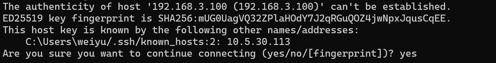

**Enter the default password security@edge to log in.**

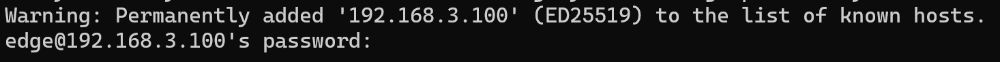

**Login successfully**


<u>NOTE                                                       </u>

More SSH information can be found at [https://wiki.debian.org/SSH](https://wiki.debian.org/SSH)

<u>                                                                                 </u>

### 2.2.User Management

### 2.2.1.Switch to Root user

You can use sudo -i (or sudo su) command switches to the root user . For security reasons, do not use the root user to operate all commands.

**sudo -i Enter the default password security@edge to switch to the root user.**

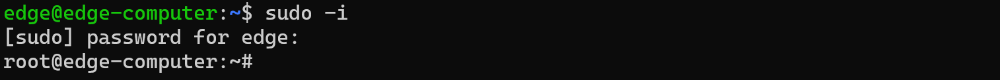

<u>NOTE                                                       </u>

When the ARM computer returns a permission denied message after executing the command, you need to use sudo to elevate the permissions.

You must use "sudo su –c" to run the command instead of using >, <, >>, <<, etc., the command needs to be enclosed inside ''

For more sudo information, visit [https://wiki.debian.org/sudo](https://wiki.debian.org/sudo)

<u>                                                                                </u>

### 2.2.2.Create and delete users

You can create and delete users using the _**useradd**_ and _**userdel**_ commands, see the **Linux man pages** for these commands to use. The following example shows how to create a test1 user in the sudo group whose default login shell is bash and has a home directory of home/test1.

**To create the test1 user, use the **_**useradd** _**command.**


**To change the password for test1, use the **_**passwd** _**command to enter and confirm the password .**

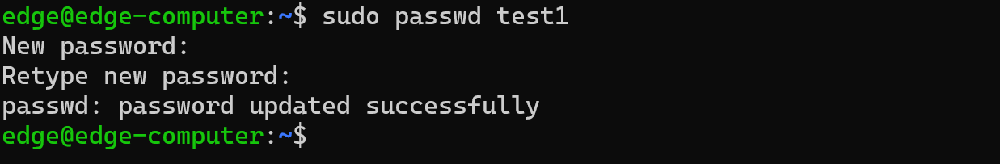

**To delete user test1, use the **_**userdel** _**command .**


### 2.2.3.Disable default user

**Use the **_** passwd -l**_**command to lock the default user so that edge users cannot log in.**

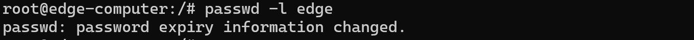

**Use the **_** passwd -u**_**command to unlock the default user so that edge users can log in.**

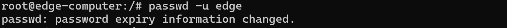

<u>NOTE                                                       </u>

Before disabling the default user, please create other users and ensure that other users can access the ARM computer through SSH.

<u>                                                                                 </u>

### 2.3.Network settings

### 2.3.1.Ethernet settings

After logging in for the first time, you can configure your ARM-based computer network settings to suit your application.

<u>NOTE                                                      </u>

After updating the network configuration, changes in the Ethernet IP address will cause the SSH connection to be interrupted and the SSH connection needs to be re-established.

<u>                                                                                      </u>

**Ethernet configuration file path.**


**Ethernet ETH1 and ETH2 configuration files.**


**Configure Ethernet ETH1 as a static IP**

To set a static IP address for an ARM-based computer, use the_**iface**_ command to modify the gateway address, IP address, network address, netmask, and broadcast parameters of the Ethernet interface.


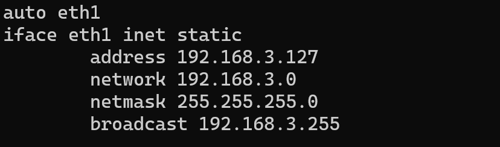

**Configure Ethernet ETH1 as a dynamic IP address**

To configure one or two Ethernet ports to request IP addresses dynamically, use the **dhcp **option in place of static in the_** iface**_ command, as shown below .

| Default Setting for ETH1 | Dynamic Setting using DHCP |
| :--- | :--- |
| auto eth1<br/>iface eth1 inet static<br/>address 192.168.3.100/24 | auto eth1<br/>iface eth1 inet dhcp |


**Enable Ethernet configuration to take effect**

After updating the Ethernet configuration file, use the ***ifdown** _ and***ifup**_ commands to make the configuration take effect.

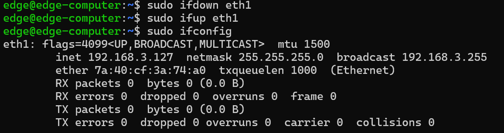

<u>NOTE                                                       </u>

For more vim usage, please refer to [https://manpages.org/vim](https://manpages.org/vim)

For more Ethernet configuration, please refer to [https://www.baeldung.com/linux/network-interface-configure](https://www.baeldung.com/linux/network-interface-configure)

<u>                                                                                  </u>

### 2.4.System Management

### 2.4.1.system version

Use the _**ecversion**_ command to check the system image version of your ARM-based computer.

**To check the firmware version of your ARM-based computer, enter **_**ecversion** _


**Add the **_**–a** _**option to output complete version information**


### 2.4.2.Adjust the time

ARM-based computers have two time settings. One is the system time, and the other is the time maintained by the**RTC** (Real time clock ) ARM-based computer hardware. Use the _**date**_ command to query the current system time or set a new system time. Use the _**hwclock**_ command to query the current RTC time or set a new RTC time.

Use the date MMDDhhmmYYYY command to set the system time:

| MM | month |
| :--- | :--- |
| DD | date |
| hh | Hour |
| mm | minute |
| YYYY | Year |

**Get system time**


**Set system time**


**Get RTC time**


**Write system time to RTC**


<u>NOTE                                                       </u>

For more date and time information, please refer to [https://www.debian.org/doc/manuals/system-administrator/ch-sysadmin-time.html](https://www.debian.org/doc/manuals/system-administrator/ch-sysadmin-time.html)

[https://wiki.debian.org/DateTime](https://wiki.debian.org/DateTime)

<u>                                                                                             </u>

### 2.4.3.Adjust time zone

There are two ways to configure ARM's computer time zone. One is to use the TZ variable and the other is to use the /etc/localtime file.

**Use TZ variable**

The format of the TZ environment variable is as follows:

TZ=`<value>`HH[:MM[:SS]][summer[HH[:MM[:SS]][, start date[/starttime], end date[/endtime]]

Here are some possible settings for the North American Eastern Time Zone:

(1)TZ=EST5EDT

(2)TZ=EST0EDT

(3)TZ=EST0

In the first case, the reference time is GMT and the stored time value is correct worldwide. A simple change to the TZ variable prints local time correctly in any time zone.

In the second case, the reference time is Eastern Standard Time and the only conversion performed is to Daylight Savings Time. Therefore, there is no need to adjust the hardware clock twice a year for daylight saving time.

In the third case, the reference time is always the reported time. You can use this option if the hardware clock on the machine automatically adjusts to daylight saving time, or if you wish to manually adjust the hardware time twice a year.


You must include the TZ settings in the /etc/rc.local file. When you restart your computer, the time zone setting will be activated.

The following table lists other possible values for the TZ environment variable:

| Hours From Greenwich Mean Time (GMT) | Value | Description |
| :--- | :--- | :--- |
| 0 | GMT | Greenwich Mean Time |
| +1 | ECT | European Central Time |
| +2 | EET | European Eastern Time |
| +2 | ART | |
| +3 | EAT | Saudi Arabia |
| +3.5 | MET | Iran |
| +4 | NET | |
| +5 | PLT | West Asia |
| +5.5 | IST | India |
| +6 | BST | Central Asia |
| +7 | VST | Bangkok |
| +8 | CTT | China |
| +9 | JST | Japan |
| +9.5 | ACT | Central Australia |
| +10 | AET | Eastern Australia |
| +11 | SST | Central Pacific |
| +12 | NST | New Zealand |
| -11 | MIT | Samoa |
| -10 | HST | Hawaii |
| -9 | AST | Alaska |
| -8 | PST | Pacific Standard Time |
| -7 | PNT | Arizona |
| -7 | MST | Mountain Standard Time |
| -6 | CST | Central Standard Time |
| -5 | EST | Eastern Standard Time |
| -5 | IET | Indiana East |
| -4 | PRT | Atlantic Standard Time |
| -3.5 | CNT | Newfoundland |
| -3 | AGT | Eastern South America |
| -3 | BET | Eastern South America |
| -1 | CAT | Azores |

**Use the /etc/localtime file**

The local time zone is stored in /etc/localtime and is used by the GNU Library for C (glibc) if no value is set for the TZ environment variable. This file is either a copy of the /usr/share/zoneinfo/ file or a symbolic link to it. ARM - based computers do not provide the /usr/share/zoneinfo/ file. You should find a suitable time zone information file and overwrite the original local time file in the ARM based machine.

<u>NOTE                                                      </u>

To change the time zone through localtime, please refer to [https://linuxize.com/post/how-to-set-or-change-timezone-in-linux/](https://linuxize.com/post/how-to-set-or-change-timezone-in-linux/)

<u>                                                                               </u>

### 2.5.Determine disk space

To determine the amount of free disk space, use the _**df**_ command with the _**–h**_ option. The system returns the amount of disk space divided by file system. Here is an example:

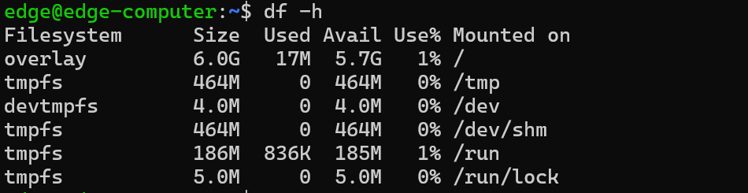

### 2.6.Install system image

### 2.6.1.Prepare a bootable SD card

(1)Prepare a Micro SD card with a capacity of at least 16GB and a USB card reader

(2)Insert the SD card into the corresponding USB slot on your Windows system

(3)Download win32diskimager from the link address

[http://sourceforge.net/projects/win32diskimager/](http://sourceforge.net/projects/win32diskimager/)

(4)Save the attachment linux-PE.img to your local Windows computer

(5)Confirm that the Device device is the SD card drive letter, and select linux-PE.img as the Image File.

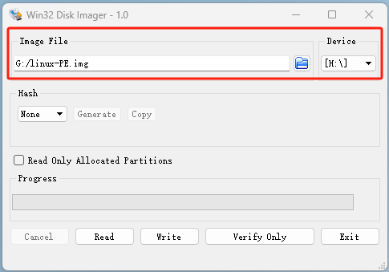

(6)Click the Write button and select Yes

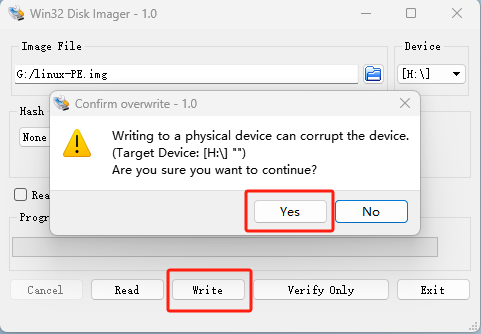

(7)Waiting for production to be completed

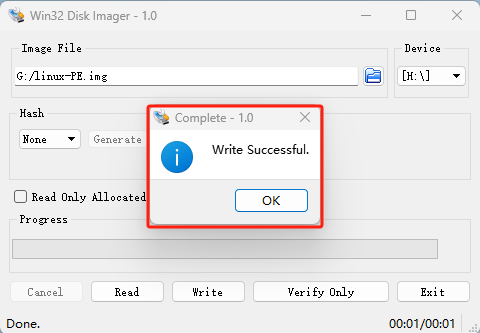

(8)Format the SD card and select FAT32 as the file system.


### 2.6.2.Copy system image to SD card

(1)Create a flash-image folder in the root directory of the SD card


(2)Copy the system image and image MD5 file to the flash-image folder

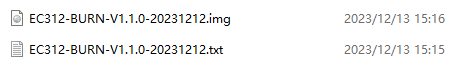

(3)Download the Dos2Unix tool from the link address

[https://dos2unix.sourceforge.io/](https://dos2unix.sourceforge.io/)

(4)Use the dos2nuix program to convert Windows format line breaks in MD5 files to Unix format


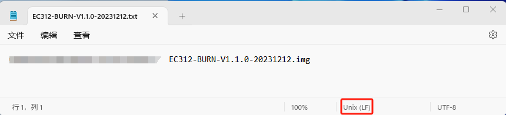

(5)Remove SD card

### 2.6.3.ARM computer configured in mirror installation mode

(1)Power off the device and remove the 4 fixing screws on the upper cover.

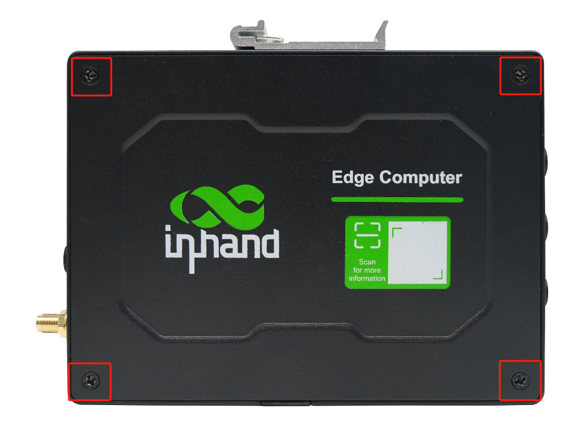

(2)bootable SD card with the system image into the SD slot

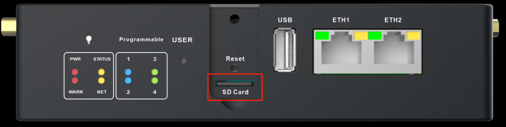

(3)Short circuit J16 terminal

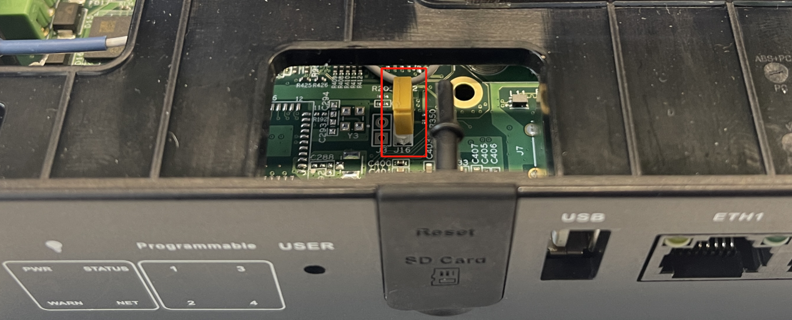

(4)The device is powered on and waits for the status light to flash.

(5)Connect the device through ETH1 and use telnet to connect to 192.168.3.100. The user name is root and there is no password.


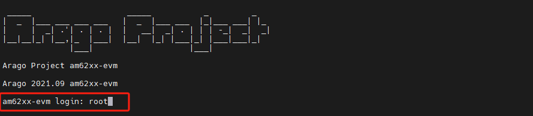

(6)Install the system using flash command

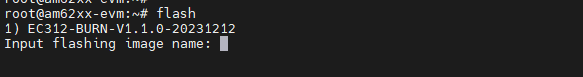

(7)Enter the system name that appears available for installation


(8)Wait for flashing complete

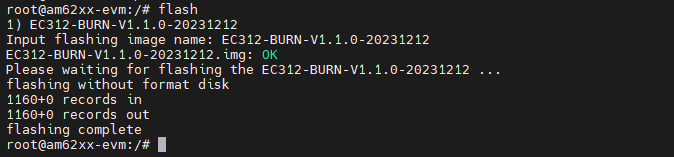

(9)Disconnect the power, remove the J16 short-circuit terminal and SD card, restore the upper cover and power on again

<u>NOTE                                                       </u>

Updating the system through the flash command will not clear user data and device manufacturer solidified information (such as device model/SN number/Ethernet MAC address, etc.)

If you want to clear user data and device manufacturer firmware information, please use the flash -f command with caution.

<u>                                                                                </u>

## 3.Peripheral configuration

### 3.1.serial port

The ARM computer's serial port supports RS-232 and RS-485 with flexible baud rate settings. Each port is independent of each other. Please refer to the hardware description section in the product manual for corresponding connection and use.

The _**stty**_ command is used to view and modify serial terminal settings, as detailed below.

**Show settings details**

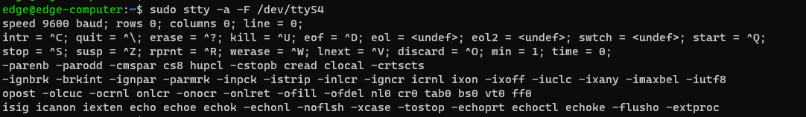

**Set the serial port baud rate to 115200**


**Verify setting results**

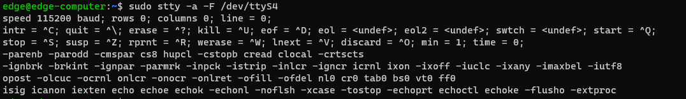

<u>NOTE                                                       </u>

For more ways to use stty, please refer to

[http://www.gnu.org/software/coreutils/manual/coreutils.html](http://www.gnu.org/software/coreutils/manual/coreutils.html)

<u>                                                                               </u>

### 3.2.USB and SD card

ARM-based computers offer a USB port for storage expansion . You can use the _**mkdir**_ command to create a storage mount point, use the mount command to mount a storage partition, and use the _**mkfs**_command to format the partition.

**View USB memory**


**Create USB storage mount point**


**Mount USB storage partition 1 to the mount point**


**Check the mounting status**

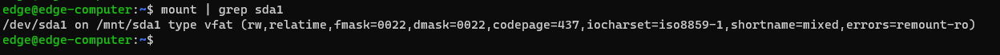

**View SD card memory**


**Create SD card storage mount point**


**Mount SD card memory partition 1 to the mount point**


**Check the mounting status**


**Unmount and format USB partition 1 as ext4 file system**

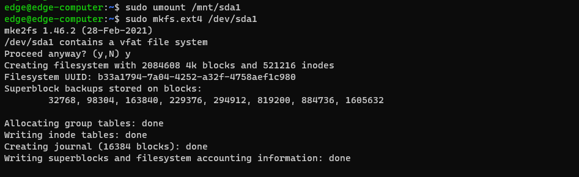

<u>NOTE                                                       </u>

Before formatting the storage, make sure the storage is not mounted to the device.

For more information on how to use the mkdir command, please refer to

[https://linuxize.com/post/how-to-create-directories-in-linux-with-the-mkdir-command/](https://linuxize.com/post/how-to-create-directories-in-linux-with-the-mkdir-command/)

For more information on how to use the mount command, please refer to

[https://www.man7.org/linux/man-pages/man8/mount.8.html](https://www.man7.org/linux/man-pages/man8/mount.8.html)

For more information on how to use the mkfs command, please refer to

[https://linuxsimply.com/mkfs-command-in-linux/](https://linuxsimply.com/mkfs-command-in-linux/)

<u>                                                                               </u>

### 3.3.CAN bus

The CAN port on the ARM computer supports CAN 2.0A/B and CAN FD standards, and the maximum data baud rate can reach 5Mbps.

### 3.3.1.Configure Socket CAN

By default, the CAN port is in the down state without initialization . If you need to configure the CAN port , please use the ip link command.

**Configure CAN port**


**Enable CAN port**

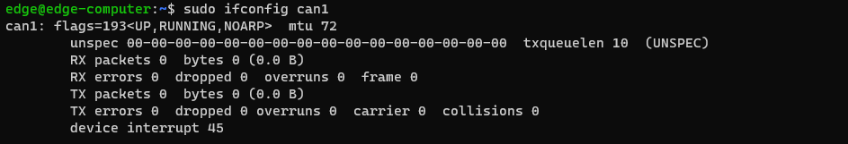

The following code is an example of the SocketCAN API, which uses the raw interface to receive and send packets .

**Send example**

```cpp
#include <stdio.h> 
#include <stdlib.h> 
#include <unistd.h> 
#include <string.h> 
#include <net/if.h> 
#include <sys/types.h> 
#include <sys/socket.h> 
#include <sys/ioctl.h> 
#include <linux/can.h> 
#include <linux/can/raw.h> 
int main(void) 
{ 
    int s; 
    int nbytes; 
    struct sockaddr_can addr; 
    struct can_frame frame; 
    struct ifreq ifr; 
    char *ifname = "can1"; 
    if((s = socket(PF_CAN, SOCK_RAW, CAN_RAW)) < 0) { 
    perror("Error while opening socket");
    return -1; 
    } 
    strcpy(ifr.ifr_name, ifname); 
    ioctl(s, SIOCGIFINDEX, &ifr); 
    addr.can_family = AF_CAN; 
    addr.can_ifindex = ifr.ifr_ifindex; 
    printf("%s at index %d\n", ifname, ifr.ifr_ifindex); 
    if(bind(s, (struct sockaddr *)&addr, sizeof(addr)) < 0) { 
    perror("Error in socket bind"); 
    return -2; 
    } 
    frame.can_id = 0x123; 
    frame.can_dlc = 2; 
    frame.data[0] = 0x11; 
    frame.data[1] = 0x22; 
    nbytes = write(s, &frame, sizeof(struct can_frame)); 
    printf("Wrote %d bytes\n", nbytes); 
    return 0; 
}
```

**receive examples**

```cpp
#include <stdio.h> 
#include <stdlib.h> 
#include <unistd.h> 
#include <string.h> 
#include <net/if.h> 
#include <sys/types.h> 
#include <sys/socket.h> 
#include <sys/ioctl.h> 
#include <linux/can.h> 
#include <linux/can/raw.h> 
int main(void) 
{ 
    int i; 
    int s; 
    int nbytes; 
    struct sockaddr_can addr; 
    struct can_frame frame; 
    struct ifreq ifr; 
    char *ifname = "can0"; 
    if((s = socket(PF_CAN, SOCK_RAW, CAN_RAW)) < 0) { 
    perror("Error while opening socket"); 
    return -1; 
    } 
    strcpy(ifr.ifr_name, ifname); 
    ioctl(s, SIOCGIFINDEX, &ifr); 
    addr.can_family = AF_CAN; 
    addr.can_ifindex = ifr.ifr_ifindex; 
    printf("%s at index %d\n", ifname, ifr.ifr_ifindex); 
    if(bind(s, (struct sockaddr *)&addr, sizeof(addr)) < 0) { 
    perror("Error in socket bind"); 
    return -2; 
    } 
    nbytes = read(s, &frame, sizeof(struct can_frame)); 
    if (nbytes < 0) { 
    perror("Error in can raw socket read"); 
    return 1; 
    } 
    if (nbytes < sizeof(struct can_frame)) { 
    fprintf(stderr, "read: incomplete CAN frame\n");
    return 1; 
    } 
    printf(" %5s %03x [%d] ", ifname, frame.can_id, frame.can_dlc); 
    for (i = 0; i < frame.can_dlc; i++) 
    printf(" %02x", frame.data[i]); 
    printf("\n"); 
    return 0; 
}
```

SocketCAN information will be written to the paths / proc/sys/net/ipv4/conf/can*and /proc/sys/net/ipv4/neigh/can*

<u>NOTE                                                       </u>

Before configuring the CAN interface, please ensure that the CAN interface is in down state.

For more information on how to use the CAN bus, please refer to

[https://www.kernel.org/doc/html/latest/networking/can.html](https://www.kernel.org/doc/html/latest/networking/can.html)

<u>                                                                               </u>

### 3.4.Analog input detection

The analog input port on the ARM computer supports 4-20mA current signal detection, and the current value can be read using the cat command.


<u>NOTE                                                       </u>

The unit of current value obtained by analog input detection is microampere.

<u>                                                                               </u>

### 3.5.Digital input and output

ARM computers have multiple channels of digital input detection and digital output control. You can use the cat command to query the GPIO information corresponding to the digital interface.

**Query digital input and output through cat command**

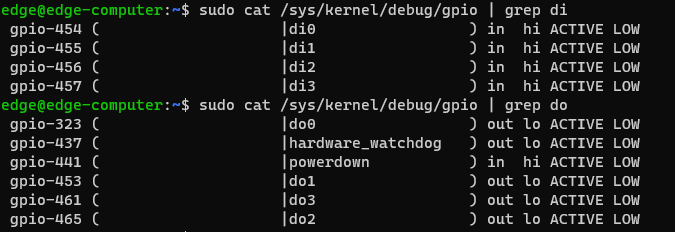

| Digital input and output channels | device node |
| :--- | :--- |
| DI0 | /sys/class/gpio/gpio454 |
| DI1 | /sys/class/gpio/gpio455 |
| DI2 | /sys/class/gpio/gpio456 |
| DI3 | /sys/class/gpio/gpio457 |
| DO0 | /sys/class/gpio/gpio323 |
| DO1 | /sys/class/gpio/gpio453 |
| DO2 | /sys/class/gpio/gpio465 |
| DO3 | /sys/class/gpio/gpio461 |

**Read digital input status through **_**cat** _**command**


**Control digital output status through **_**echo** _**command**

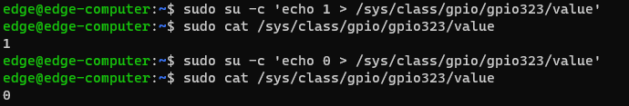

<u>NOTE                                                       </u>

Avoid **'Permission denied'** when **'sudo echo x >'**, because the redirection symbol ">" is also a _**bash**_ command. Sudo only allows the**echo **command to have **root permissions**, but **does not allow** the ">" command to also have root permissions, so _**bash** _ will think that this command does not have the permission to write information. At this time, you need to use ***sudo su -c***  command to handle it.

<u>                                                                               </u>

### 3.6.User programmable keys

ARM computers provide programmable buttons, which are provided to users for development and use using the **event** event process. The event corresponding to the button is /dev/input/event0.

**Reference example**

```cpp
#include <stdio.h>
#include <linux/input.h>
#include <stdlib.h>
#include <sys/types.h>
#include <sys/stat.h>
#include <fcntl.h>
 
#define DEV_PATH "/dev/input/event0"

int main()
{
    int keys_fd;
    char ret[2];
    struct input_event t;
    keys_fd = open(DEV_PATH, O_RDONLY);
    if(keys_fd <= 0)
    {
        printf("open /dev/input/event0 device error!\n");
        return -1;
    }
    while(1)
    {
        if(read(keys_fd, &t, sizeof(t)) == sizeof(t))
        {
            if(t.type == EV_KEY)
                if(t.value==0 || t.value==1)
                {
                    printf("key %d %s\n", t.code, (t.value) ? "Pressed" : "Released");
                    if(t.code == KEY_ESC)
                        break;
                }
        }
    }
    close(keys_fd);
    return 0;
}
```

<u>NOTE                                                       </u>

For more information on **how to use events**, please refer to

[https://askubuntu.com/questions/826719/decoding-key-values-from-dev-input-eventx-in-c](https://askubuntu.com/questions/826719/decoding-key-values-from-dev-input-eventx-in-c)

<u>                                                                               </u>

### 3.7.LED

There are multiple user-programmable LEDs on the ARM computer. You can use the _**ls**_ command to view the LED nodes and the _**echo**_ command to control the LEDs.


**Light up USER LED**

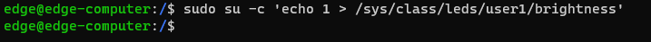

**Make USER LED blink**


<u>NOTE                                                       </u>

For more LED usage methods, please refer to

[https://www.kernel.org/doc/html/latest/leds/leds-class.html](https://www.kernel.org/doc/html/latest/leds/leds-class.html)

[https://raspberrypi.stackexchange.com/questions/697/how-do-i-control-the-system-leds-using-my-software](https://raspberrypi.stackexchange.com/questions/697/how-do-i-control-the-system-leds-using-my-software)

<u>                                                                               </u>

### 3.8.TPM

ARM computers provide **TPM2.0** hardware support and are pre-installed with the **tpm2-tools tool**, which can be used to test and verify **TPM2.0**.

**Generate random numbers**

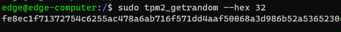

<u>NOTE                                                       </u>

For more information on how to use tpm2-tools, please refer to

[https://tpm2-tools.readthedocs.io/en/latest/](https://tpm2-tools.readthedocs.io/en/latest/)

<u>                                                                               </u>

## 4.Wireless connections

The instructions in this chapter cover all wireless features supported by Inhand ARM-based computers. Before referring to sections in this chapter, please make sure that those sections apply to the hardware specifications of the ARM computer platform.

### 4.1.Cellular settings

In cellular control based on ARM computers, it is necessary to control the cellular power switch and dual-card switching switch. Both switches are switched and enabled through GPIO.

| | device node | value | state | default |
| --- | :--- | :--- | :--- | :--- |
| cellular power control | /sys/class/gpio/gpio401/value | 1 | enable | |
| | | 0 | disable | ✔ |
| SIM card switch | /sys/class/gpio/gpio405/value | 1 | SIM card 2 | |
| | | 0 | SIM card 1 | ✔ |

<u>NOTE                                                       </u>

When using cellular, you need to confirm which card slot the current SIM card is in or which SIM card slot you want to use for dialing. You need to switch to the required SIM card before enabling cellular power, otherwise the cellular module will fail to check the card.

<u>                                                                               </u>

**Switch SIM to SIM card 1**


**Enable cellular module**


**Query module model**


You can query the cellular module used by the current hardware device through the _**envtools**_ command, where _**cell-***_ represents the module model (the current device uses the FQ53 module)

**Dial using PPPD**

ARM-based computers support the PPPD dial-up function. PPPD dial-up scripts are different for different types of cellular modules. The detailed dial-up scripts and module correspondences are as follows.

| cellular module | PPPD chat script |
| :--- | :--- |
| LQA3 | quectel-ppp-ttyUSB2 |
| MOD1 | quectel-ppp-ttyUSB4 |
| FQ73 | quectel-ppp-ttyUSB5 |
| FQ53 | quectel-ppp-ttyUSB5 |
| FQ33 | quectel-ppp-ttyUSB3 |


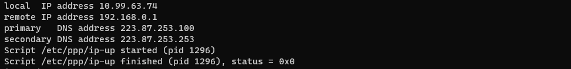

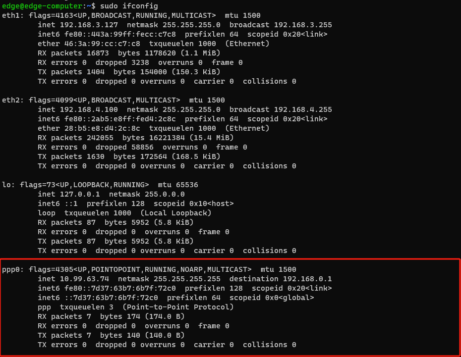

<u>NOTE                                                       </u>

The PPPD dial-up script configured by the device by default is the most basic dial-up implementation and does not configure APN and other information. If you need to configure APN or use richer module functions, you need to change /etc/ppp/peers/quectel-ppp-ttyUSB* script

<u>                                                                               </u>

### 4.2.Wi-Fi settings

ARM computers support Wi-Fi configuration, and you can use the wpa_supplicant tool to configure and use Wi-Fi .

**Enable Wi-Fi**

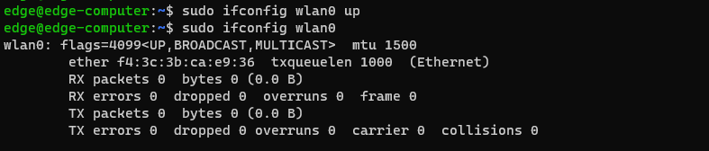

**Add wpa_supplicant.conf configuration file**


**Start wpa_supplicant service**


**Scan for hotspots**


**Query scan results**

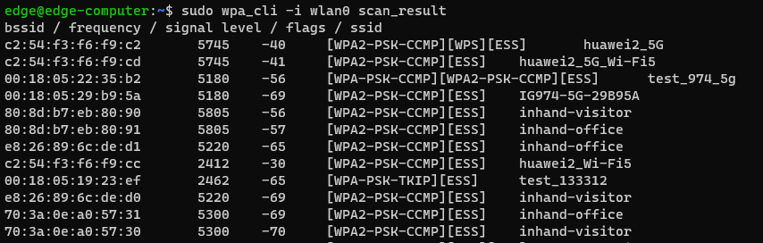

**Add new connection**

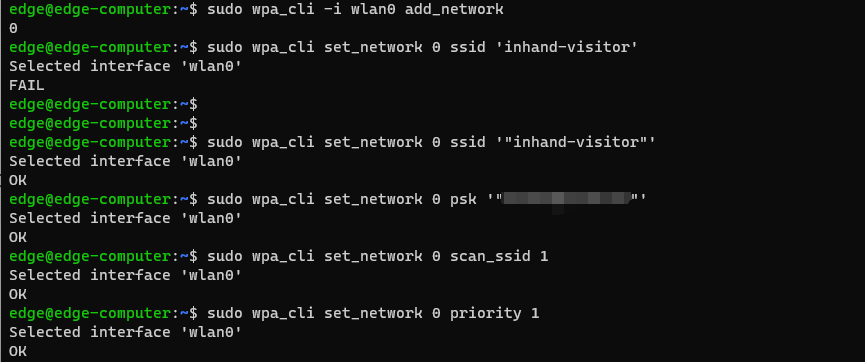

**save connection**

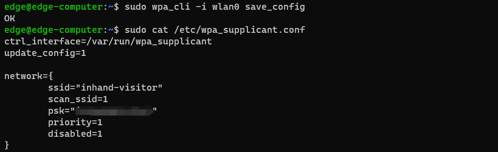

**Enable connection**

**Enable DHCP**

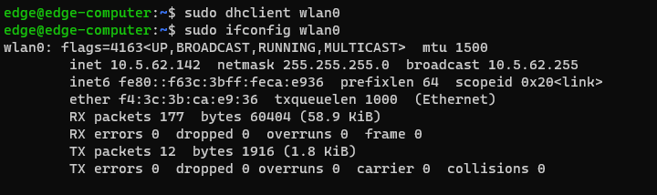

**Disconnect**


**List saved connections**

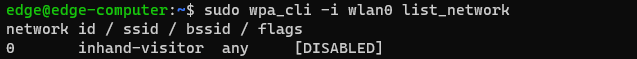

<u>NOTE                                                       </u>

For more information on how to use wpa_supplicant, please refer to

[https://wiki.archlinux.org/title/Wpa_supplicant](https://wiki.archlinux.org/title/Wpa_supplicant)

<u>                                                                                 </u>

## 5.Safety

SSH connections for the root account are disabled for increased security . sudo is a program designed to allow users permitted by the system administrator to execute programs as root. The goal is to grant as few privileges as possible but still allow the user to gain appropriate root privileges . Using sudo is better (or safer) than opening a session as root for many reasons, including:

1. No one needs to know the root password (sudo prompts for the current user's password). Additional privileges can be granted temporarily to individual users and then no password changes are required.
2. It's easy to run only the commands that require special permissions via sudo; the remaining commands are executed as an unprivileged user, reducing the damage caused by errors.
3. As the example shows, some system-level commands are not directly available to user edge

The output is as follows:

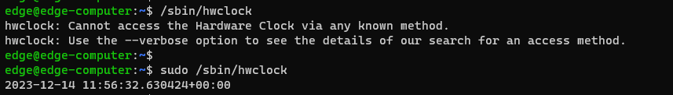

## 6.Start, recover and update

### 6.1.recover

ARM computers provide two system reset mechanisms, one is based on the **update** command method, and the other is based on the **reset** button mechanism.

**Based on update command mode**

Enter ***sudo update reset*** and then enter_**yes**_ according to the prompts. The ARM computer will automatically restart and reset the system.


**Based on reset button mechanism**

The reset button mechanism relies on the **reset_monitor.service**. This service is not added to the boot list by default and is not enabled.

**To add it to the boot auto-start list, please use **_** sudo systemctl enable reset_monitor**_

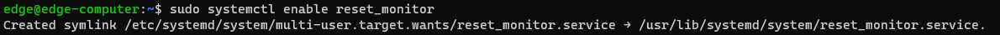

**To delete from the boot auto-start list, use **_** sudo systemctl disable reset_monitor**_**.**


**To start the reset_monitor service, please use **_** sudu systemctl start reset_monitor**_


**To query the reset_monitor service status, please use **_** sudu systemctl status reset_monitor**_

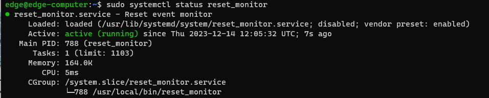

**Use the reset button to reset the system**

After the reset_monitor.service service is started, the system can be reset by pressing the reset button. When pressed for more than 10 seconds, the warn LED will light up. After pressing for more than 20s, the warn LED will turn off. Release the reset button when the warn LED is on, and the ARM computer will automatically restart and reset the system.

<u>NOTE                                                       </u>

System reset is an important function for ARM computers. After system reset, ARM computers will be restored to the default state. At this time, all user data and configurations will be lost.

Before performing a system reset on an ARM computer, please ensure that critical data is effectively backed up and transferred to external storage media such as removable disks.

After the system is reset, the reset_monitor service will be deleted from the auto-start list. If you want to reset the system through the reset button again, please reconfigure it according to the reset button mechanism mentioned above.

<u>                                                                                 </u>

### 6.2.Update

### 6.2.1.App update, installation and download

ARM computer provides a complete application update strategy based on the distribution Linux system (Debian 11). You can use the apt command to update and install applications online, and the _**dpkg**_ command to install offline application packages.

**Update and install applications online using apt command**

The first and most important step is to synchronize the package index file in the ARM. This file will be updated synchronously from the source repository specified in /etc/apt/sources.list. When a synchronization is performed, package-related information, including versions and dependencies, are also downloaded from the repository. To perform a sync, make sure your network can connect to the apt repository, then run the_**apt-get update**_ command with root privileges.

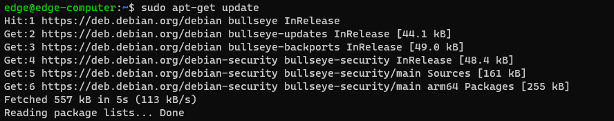

Next, you can use ***sudo apt-get install <packages name>*** to download and install new applications and use_**sudo apt-get upgrade <packages name>**_to update installed applications, such as installing cron applications.

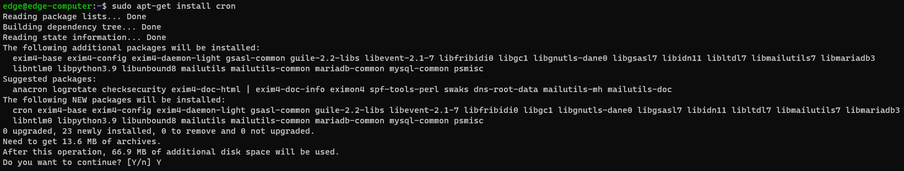

**Use **_** dpkg -l**_**to display the list of installed applications**

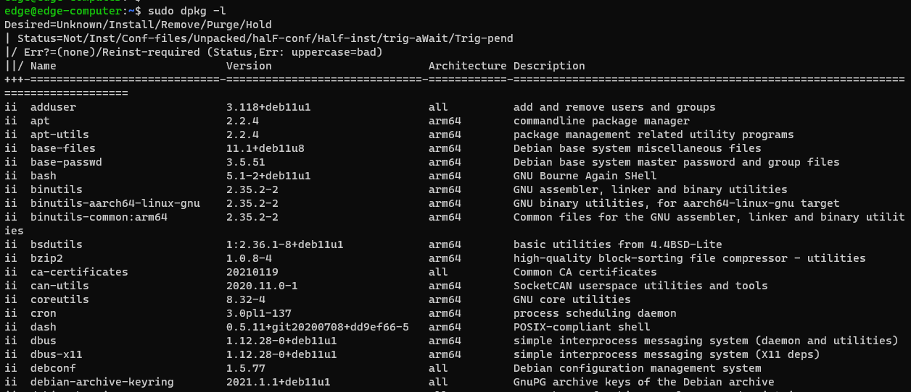

**Install offline using **_** dpkg -i <packages-name.deb>**_


<u>NOTE                                                       </u>

For more information on how to use the apt command, please refer to

[https://linuxize.com/post/how-to-use-apt-command/](https://linuxize.com/post/how-to-use-apt-command/)

For more information on how to use the dpkg command, please refer to

[https://linuxize.com/post/how-to-use-apt-command/](https://linuxize.com/post/how-to-use-apt-command/)

Dependency issues may occur when using dpkg to install offline software

dpkg: error processing package bcron (--install):

dependency problems - leaving unconfigured

At this time, you need to install the dependent software according to the prompts and try

<u>                                                                                 </u>

### 6.2.2.ARM computer version update

**Prepare a removable USB memory or SD card for version updates**

(1)Format removable USB memory or SD card to FAT32 file system

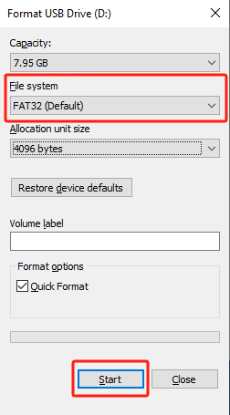

(2)Create the ec300_img folder in the root directory of the file system


(3)Copy the mirroring and image MD5 files that need to be updated on the ARM computer to the ec300_img directory

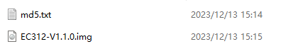

(4)Use the dos2nuix program to convert Windows format line breaks in MD5 files to Unix format

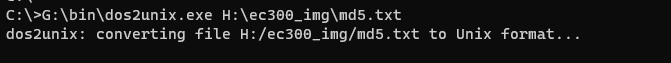

(5)Insert the removable USB memory or SD card into the ARM computer, enter sudo update, and enter yes when prompted.


(6)The system will automatically restart and update the system. During the system update process, the warn LED will flash. After the update is completed, the ARM computer will automatically restart.

(7)After the update is complete, you can use the ***sudo ecversion*** command to check the current ARM computer version

<u>NOTE                                                       </u>

When a removable USB memory and an SD card are connected at the same time, the ARM computer will determine whether there is an updateable image in the two memories. If there is an updateable image in both memories, the image in the removable USB memory will be started by default for update.

<u>                                                                                 </u>

## 7.Programming instructions

ARM computer supports application natively compilating and cross-compilation. Native compilation is simpler because all the coding and compilation can be done directly on the device. However, the ARM architecture is less powerful and therefore compiles slower. To overcome it, you can use a toolchain to compile the code on a Linux machine, which will compile much faster.

### 7.1.Native compilation environment

Follow these steps to update the program:

(1)Make sure the network connection is available

(2)Use ***apt-get update*** command to update the Debian package list


(3)Install local compilation toolchain


### 7.2.Cross-compilation environment

Cross-compilation is a method of using a cross-compilation tool chain to compile a program that can be recognized and executed by an ARM computer on an x86 platform computer. Before cross-compiling an ARM computer executable program, you need to prepare an x86_64 Ubuntu operating system version 18.04 or above platform computer.

**Download the cross-compilation toolchain on your local computer**

wget [**https://developer.ARM.com/-/media/Files/downloads/gnu-a/9.2-2019.12/binrel/gcc-ARM-9.2-2019.12-x86_64-aarch64-none-linux-gnu.tar.xz**](https://developer.arm.com/-/media/Files/downloads/gnu-a/9.2-2019.12/binrel/gcc-arm-9.2-2019.12-x86_64-aarch64-none-linux-gnu.tar.xz)

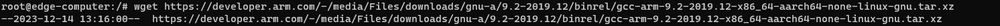

### 7.3.Sample program

Use vim to compile the hello.c file locally and use gcc to compile it into a hello executable program.

**Sample code**

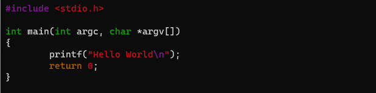

**Compile using gcc**


**Give hello executable permissions**


**Execute hello program**


<u>NOTE                                                       </u>

Please refer to the compilation method based on make and makefile.

[https://linuxhandbook.com/using-make/](https://linuxhandbook.com/using-make/)

For Linux development based on C language, please refer to

[https://linuxconfig.org/c-development-on-linux-introduction-i](https://linuxconfig.org/c-development-on-linux-introduction-i)

<u>                                                                                 </u>
