# EC300-LoRaWAN User Manual_V1.1

\*\*LoRaWAN Gateway EC300-LoRaWAN Series \*\*

\*\*User Manual \*\*

\*\*(For Debian11) \*\*

Version 1.1, June 2025

[www.inhand.com](http://www.inhand.com.cn)


The software described in this manual is provided under a license agreement and can only be used in accordance with the terms of that agreement.

\*\*COPYRIGHT NOTICE \*\*

© All rights reserved 2025 InHand Network.

\*\*Trademark \*\*

The InHand logo is a registered trademark of InHand Network.

All other trademarks or registered trademarks in this manual belong to their respective manufacturers.

\*\*Disclaimer \*\*

The company reserves the right to change this manual, and the product is subject to subsequent changes without notice. We are not responsible for any direct, indirect, intentional or unintentional damage and hidden dangers caused by improper installation and use.

## 1 Introduction

This user manual applies to the LoRaWAN gateway EC300-LoRaWAN based on the Arm architecture and covers the complete instruction set for all supported models. Before you refer to these chapters, confirm that the hardware specifications for your computer model support the features that are covered.

In order to facilitate user configuration, InHand has developed a set of IEOS system programs and provided a web interface. Users can easily carry out network management and system management through the web. IEOS is based on debian 11, so Linux native commands can be used for network management and system management. However, it should be noted that when the IEOS feature is enabled, IEOS will take over network management and system management. In this case, network management and system management through Linux native commands may fail. IEOS is enabled by default. If you need to perform network management and system management through the Linux native command line, you need to disable IEOS first.

## 2 Hardware Installation Instructions

In this chapter, we will introduce the external interface description of the LoRaWAN gateway EC300-LoRaWAN based on the Arm architecture.

### 2.1 Introduction

The following sections describe the application of external connectors and pin assignments.

### 2.2 EC300-LoRaWAN panel

### 2.2.1 Front panel

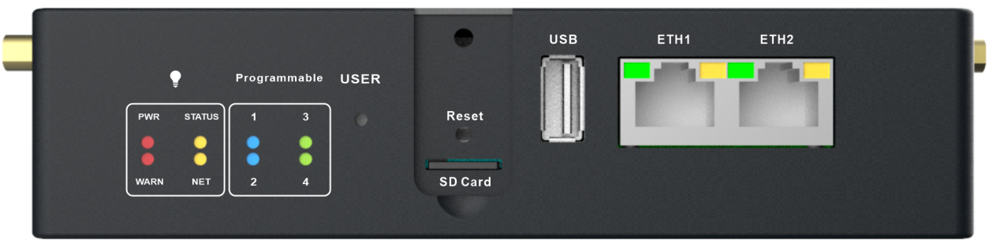

### 2.2.2 Left panel

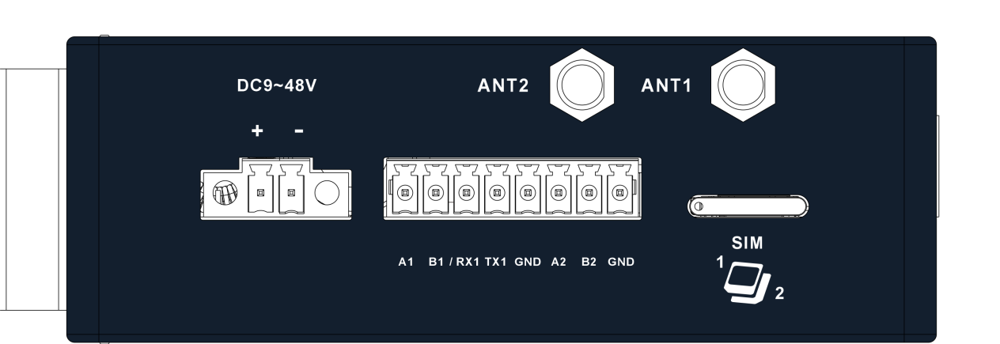

### 2.2.3 Right Panel

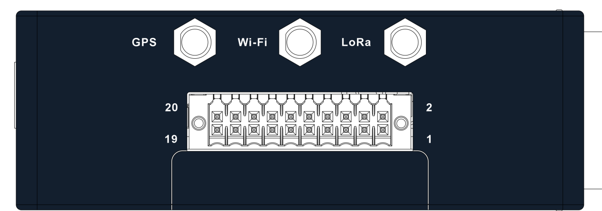

### 2.3 EC300-LoRaWAN external interface

### 2.3.1 Ethernet

This is dual RJ45 connector for Ethernet connection.

EC300-LoRaWAN has 2 RJ45 Ethernet ports and supports 10m/100m adaptive rate.

Yellow light: LINK indicator, the opposite device is on for 1000m interface duration, and the opposite device is off for 10/100m interface duration.

Green light: ACT Light, flashing when there is data.

### 2.3.2 Serial Port

EC300-LoRaWAN supports up to two serial ports.

COM1 (standard): RS-232 / RS-485 (RX1 TX1 / A1 B1 ), at the same time, you can only choose to access RS-232 or RS-485, they can not be connected to work at the same time.

COM2 (standard): RS-485(A2 B2)

### 2.3.3 USB

EC300-LoRaWAN provides a USB 2.0 Host interface.

### 2.3.4 LED

EC300-LoRaWAN has 8 LED lights, indicating the power supply and system operation status respectively.

| \*\*Identification \*\* | \*\*name \*\* | \*\*color \*\* | \*\*definition \*\* |
| --- | --- | --- | --- |
| PWR  | power Indicator  | red  | power-on is always on  |
| STATUS  | ~~~~system operation status indicator  | yellow  | when the system starts normally, the STATUS flashes. If an exception occurs during the system startup phase, the system fails to start. Or when the factory restoration operation has not been completed, the STATUS goes out.  |
| WARN  | warning indicator  | green | When the system has a warning exception, such as system upgrade or factory restore has not been completed, dialing is abnormal (cellular function needs to be turned on), The WARN light flashes.  |
| NET  | ~~~~cellular connection status indicator  | green  | dial off goes out; It stays on when dialing is successful; The dialing process flashes.  |
| User1  | user Programmable Indicator 1  | green  | default off, can be controlled by user programming  |
| User2  | user Programmable Indicator 2  | green  | default off, can be controlled by user programming  |
| User3  | user Programmable Indicator 3  | green  | default off, can be controlled by user programming  |
| User4  | user Programmable Indicator 4  | green  | default off, can be controlled by user programming  |

### 2.3.5 User Programmable Keys

EC300-LoRaWAN provides API interface, users can call API interface to detect the status of programmable keys, and then implement their own key logic.

### 2.3.6 DC Input

EC300-LoRaWAN support 9~48V DC input

### 2.3.17 SIM Card Slot

EC300-LoRaWAN supports 2 SIM card slots. The SIM card needs to be installed in the power-off state, and the SIM card can be inserted into the card slot by pressing.

### 2.3.8 MicroSD Card Slot

EC300-LoRaWAN has a card slot for MircoSD card. SD does not support hot plug and needs to be plugged and unplugged in case of power failure.

### 2.3.9 Restore Factory Button

There is a reset button for system factory reset. Reference [restore Factory Settings](https://vyi4g1.yuque.com/vyi4g1/gqvnum/omwx50chnlyvhrtg/edit#9EoWG)operate.

### 2.3.10 Antenna Interface

EC300-LoRaWAN has a total of 5 antenna interfaces, and the number of standard antennas of different models is different, will install the antenna by screwing the antenna into the corresponding antenna connector.

| \*\*Identification \*\* | \*\*name \*\* |
| :---: | :---: |
| ANT1  | 4G LTE main antenna/5G antenna  |
| ANT2  | 4G LTE diversity receiving antenna/5G antenna  |
| GNSS | GNSS antenna (please use passive GPS antenna)  |
| Wi-Fi  | WiFi antenna  |
| Lora  | Lora antenna  |

## 3 Getting Started

In this chapter, we will introduce the basic configuration of the LoRaWAN gateway EC300-LoRaWAN based on the Arm structure.

### 3.1 Connection to EC300-LoRaWAN Gateway

You need a computer to connect to EC300-LoRaWAN and log in to the command line interface. It can be connected by Ethernet network cable.

Factory default username and password:

**Username: edge**

**Password: security@edge**

The EC300-LoRaWAN device has root created by default at the factory, but login is disabled. If you need to use the root user, please modify the system configuration manually, input sudo -s switches to the root user. The user edge is in the sudo group, so you can use sudo under the edge user to execute system-level commands . For additional details, see The sudo mechanism section in Chapter 5.

**Prompt**

when appear **command not found**enter sudo -s to switch to the root user or use the sudo command.

**Attention**

for security reasons, we recommend that you disable the default user account and create your own user account.

### 3.1.1 Connecting via SSH Console

The EC300-LoRaWAN supports SSH connections over Ethernet. Use the following default IP address to connect to the EC300-LoRaWAN.

| Port  | default IP  |
| --- | --- |
| ETH 1  | 192.168.3.100  |
| ETH 2  | 192.168.4.100  |

#### 3.1.1.1 Linux Users

Prompt

These steps apply when you connect to EC300-LoRaWAN on a Linux PC. Do not apply these steps to the EC300-LoRaWAN device itself. Before you run the ssh command, make sure that the IP address of the Ethernet port of the PC is within a specified range. ETH1:192.168.3.0/24,ETH2:192.168.4.0/24.

Run the ssh command on a Linux PC to access the ETH1 port of EC300-LoRaWAN.


Input \*\*yes \*\*continue to complete the connection.

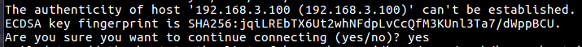

When the terminal prompt edge @ lorawan-gw appears on the interface: ~$, shell commands can be entered, the connection is successful.

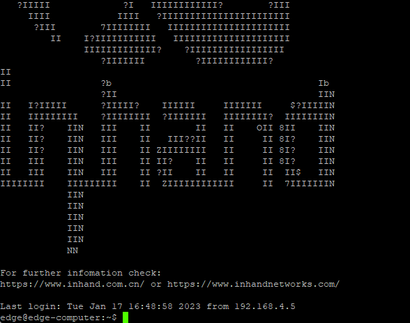

##### 3.1.1.2 Windows Users

**Prompt**

These steps apply to you connecting EC300-LoRaWAN on a Windows PC. Do not apply these steps to the EC300-LoRaWAN device itself.

Please do the following steps on your Windows PC

Click on the link [http://www.chiark.greenend.org.uk/~sgtatham/putty/download.html](http://www.chiark.greenend.org.uk/~sgtatham/putty/download.html), download PuTTY (free software), and establish a connection with LoRaWAN gateway EC300-LoRaWAN in the form of SSH command in the Windows environment. The following figure is an example of a connection using SSH:

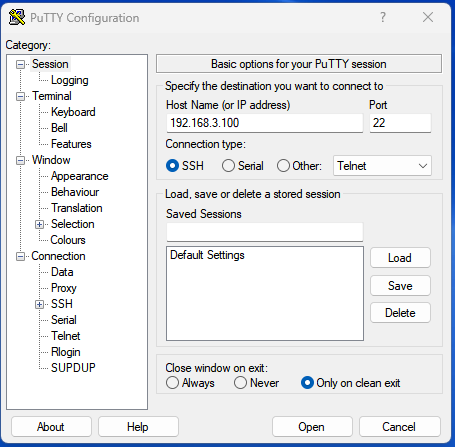

### 3.2 User Account Management

### 3.2.1 Switching to the Root User

You can use sudo -s command to switch to the root user. For security reasons, do not operate all commands under root privileges.

**Prompt**

Click on the link to get more about **sudo**command Information.

[https://wiki.debian.org/sudo](https://wiki.debian.org/sudo)

**Attention**

You may get a "permission deleted" prompt when using some pipes or redirection behaviors under non-root permissions. At this time, you must use' Sudo su -c' to replace commands such as '>','<','>','<','etc', etc., which need to contain single quotation marks of the complete command.

### 3.2.2 Creating and Deleting User Accounts

You can use \*\*useradd **and** userdel \*\*command to create and delete a user's account. Be sure to use these commands in the main interface to set the relevant access permissions for the account. The following is an example of how to create test1 in The sudo group (the default login environment for the test1 user is bash, and its home directory is/home/test1)


to change the password for test1, use the passwd command, enter the new password and then repeat the new password to confirm the change.

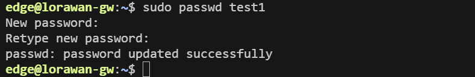

If you want to delete user test1, use the command userdel


### 3.2.3 Disable the Default User Account

Attention

You should first create a user account before disabling the default account.

Use the passwd command to lock the default user account so that edge users cannot log in


Unlock edge users


### 3.3 Network Management and Systems Management

EC300-LoRaWAN is based on debian 11 system, so Linux native commands can be used for network management and system management. In order to facilitate user configuration, InHand has developed a set of IEOS system programs to provide a web interface. Users can conveniently carry out network management and system management through the web. However, it should be noted that when the IEOS function is enabled, IEOS will take over network management and system management, in this case, network management and system management through Linux native commands may be invalid. IEOS is enabled by default when the device leaves the factory. If you need to perform network management and system management based on Linux native commands, you need to disable IEOS first.

### 3.3.1 Web Management Based on IEOS

IEOS is a set of network management and system management programs run on Linux system developed by InHand. IEOS provides a web interface through which users can configure Ethernet port IP address, cellular dialing, Wi-Fi Station,DHCP Client/Server, static routing, firewall and other networks. You can also operate the system time, time zone, firmware upgrade and system restart; in addition, IEOS also supports the device management platform DeviceLive of InHand. Users can remotely monitor and manage EC300-LoRaWAN devices through the DeviceLive platform.

IEOS adopts the design scheme of separating state and configuration, and is divided into three functional sections: network management, system management and state. Only network and system configurations can be performed under the Network Management menu and System Management menu. The status information needs to be unified to the status page for viewing.

Important note: When using IEOS program to manage network configuration and system configuration, if Linux native commands are used at the same time, the two may affect each other and cause abnormal running status. It is recommended that all configurations supported by IEOS be managed through the IEOS web. Configurations not supported by IEOS can be combined with Linux native commands to achieve configuration goals.

#### 3.3.1.1 Login to the Web

Consider that the user's program may need to use HTTP/HTTPS standard Port Number 80/443 , IEOS use 9100 port number HTTPSConnected port, not supported HTTP access; When a user uses HTTP visit web when, will automatically jump to pass HTTPS . This document was adopted eth2 the default address 192.168.4.100 as an example for description.

Landing Address: https :// 192.168.4.100:9100

Initial login account: adm

Initial login password: 123456

Important Note: When IEOS program is enabled, some port numbers will be reserved for internal communication. The reserved port number range is 9100~9200. After IEOS is enabled, customer programs should avoid using these port numbers, otherwise conflicts may occur and functional abnormalities may occur.


#### 3.3.1.2 Network Management

##### 3.3.1.2.1 Configuring Ethernet Interfaces

Configure a static IP address for the eth1 interface

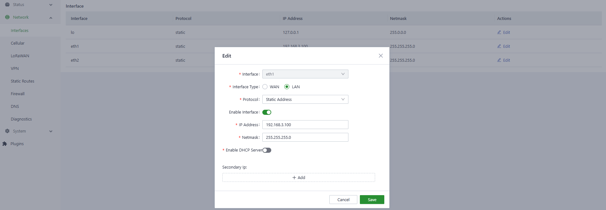

When configuring the DHCP Client for the eth1 interface, you need to set `Interface Type`Set `WAN`

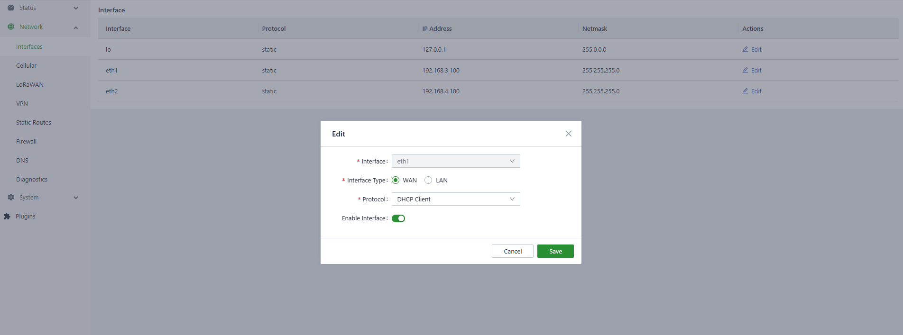

Start the dhcp server function on the eth1 interface and assign addresses to the devices under eth1

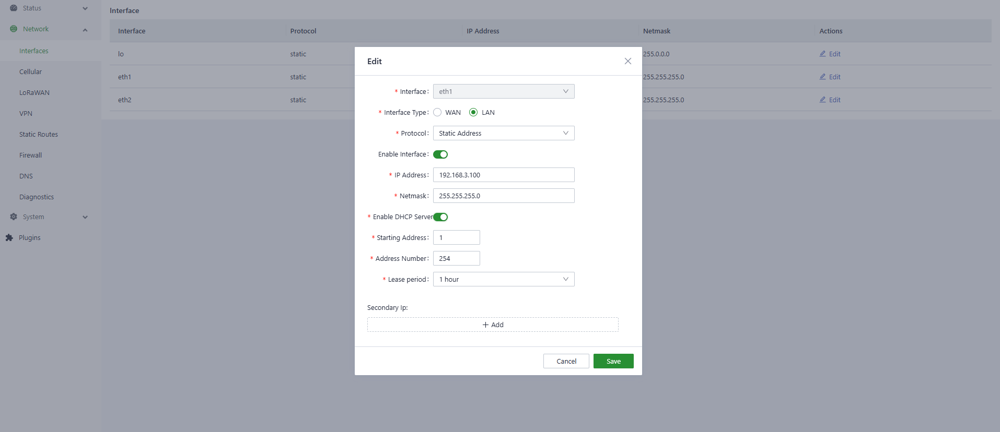

DHCP Server configuration parameters:

\*\*Enable DHCP Server \*\*switches for DHCP Server functions

\*\*Starting Address \*\*: DHCP Server address pool start base address, network segment + Start address = start IP address of the address pool. In the screenshot, the network segment of eth1 is 192.168.3.0/24 and the base address is 1, then the starting address of the address pool is 192.168.3.1/24.

\*\*Max Address Number \*\*maximum number of addresses in the address pool.

\*\*Lease Period \*\*: Lease Time

##### 3.3.1.2.2 Configuring Cellular Dialing

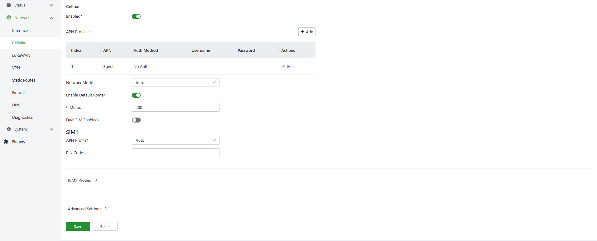

Cellular network parameter description:

\*\*Enabled \*\*: The switch of the cellular function; The default is the on state.

\*\*Profiles \*\*: dialing parameter set, which is used to configure APN, user name, password, authentication method and other information when dialing for a dedicated network card. If it is not a dedicated network card, it is usually not necessary to modify the configuration here. A dial parameter set can add up to 10 records.

**Network Mode**: Cellular network system, you can choose 3G,4G and other related network systems, such as LTE,WCDMA, etc. If it is not clear which network system to choose, select automatic; The program will automatically select the most appropriate network system. The default value is automatic.

\*\*Enable Default Route \*\*: Enable the function of adding default route. After opening, when the dial is successful, a default route of cellular port will be added. The default is on.

\*\*Metric \*\*: The metric value of the default route of the cellular Port. When the default route is configured for the cellular port, Wi-Fi port, and Ethernet port, the minimum metric value takes effect.

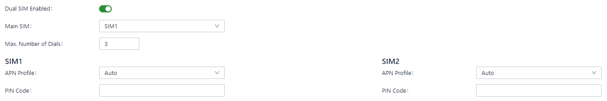

\*\*Dual SIM Enabled \*\*enable the Dual SIM feature. EC300-LoRaWAN in order to improve the reliability of the network, support dual card single dial. Two SIM cards need to be inserted into the device. After this function is turned on, if the sim1 card fails to dial due to arrears, it will automatically switch to the sim2 card for dialing. The default is off.

\*\*Main SIM \*\*: main SIM card. When dialing, the selected SIM card will be used for dialing first. When dialing fails for a certain number of times, it will switch to another SIM card for dialing. By default, sim1 will be used for dialing first.

\*\*Max Number of Dials \*\*: after the dual-card single-dial function is enabled, switch to another SIM card for dialing after the current dialing SIM card reaches the specified number of dialing.

\*\*APN Profile \*\*: The dial parameter set selected by the SIM card, the default value is automatic. In general, the private network card usually needs to configure the dialing parameter set, and select the Index of the dialing parameter set here.

\*\*PIN Code \*\*: The PIN Code of the SIM card.

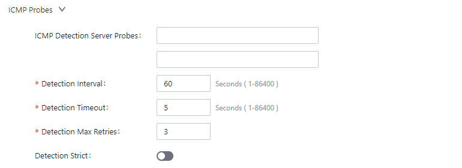

Wireless cellular network is more complex, sometimes there will be a dial-up fake connection, that is, the dial-up state is successful, but the ping cannot reach the target address; When these situations occur, you can return to normal by dialing again. IEOS cellular dialing supports ICMP probing to detect fake connections. It is recommended that customers using cellular networking turn on ICMP detection, so that false connections can be quickly recovered.

ICMP detection parameters:

**ICMP Detection Server Probes**: ICMP detection address; Two detection addresses can be configured. As long as one address is successfully detected, there is no fake connection in the cellular. When both addresses are not configured, the ICMP detection function is turned off.

**Detection Interval**: How often the ICMP probe is performed.

**Detection Timeout**: ICMP detection timeout period, and how long to wait without receiving the detection response message, the detection is considered to have failed.

**Detection Max Retries**: Maximum number of probes; When the probe fails to reach this value, the redial is triggered. Value range \[1,5]

**Detection Strict**: Whether to enable strict detection. When strict detection is turned off, the detection program will detect whether the message received by the cellular interface changes in each detection cycle. If there is any change, indicating that the cellular network is open, ICMP message will not be sent for detection, thus saving some traffic. If detection is turned on, ICMP detection messages will be sent periodically regardless of whether the number of messages received by the cellular interface changes. The default is off.

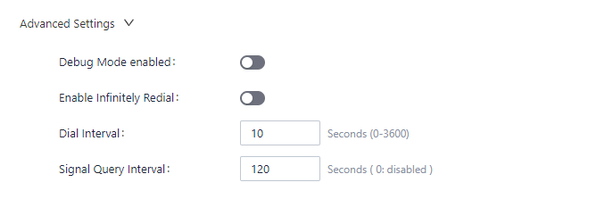

In the advanced configuration are some setting options that are not commonly used.

**Debug Mode enabled**: Whether to enable the debug function. After it is enabled, some dial-related debug information will be added to the log, which is disabled by default.

**Enable Infinitely Redial**: Turns on unlimited redial. In some cases, dialing will be in an abnormal state, and the system can be restored to normal by restarting the system. By default, unlimited redialing is closed. When dialing fails for a certain number of times, the system will be restarted to try to recover. Since dialing is turned on by default, some customers will restart if dialing fails without inserting a SIM card. In this case, unlimited redial can be turned on; In this way, no matter how many times the dialing fails, the system will not restart.

**Dial Interval**dialing interval; The amount of time to wait before dialing the next time a dial fails.

**Signal Query Interval**signal query interval. When the signal is not good, the problem of false connection may occur; At this time, there is a certain probability that the problem of false connection can be solved by re-dialing. The dialer periodically detects the signal strength, and the signal detection period is configured here.

##### 3.3.1.2.3 Configuring LoRaWAN

The LoRaWAN configuration is divided into three states:

- \*\*Off: \*\*closed status, do not do business processing.
- \*\*Packet forward: \*\*message forwarding status, forwarding LoRaWAN data to the third-party network server platform
- \*\*Build-in network server: \*\*built-in network server

###### 3.3.1.2.3.1 Off

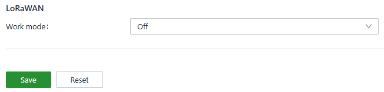

###### 3.3.1.2.3.2 Packet Forward

Packet forward forwarding is divided into udp forwarding and mqtt forwarding.

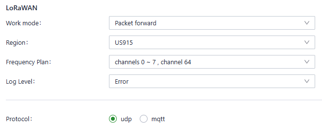

\*\*Region: \*\*EC300-LoRaWAN has different models in different regions. The area here is determined by the model and cannot be configured. It is only used for display.

\*\*Frequency plan: \*\*the frequency band information must be consistent with the frequency band information of the terminal node and network server.

\*\*Log Level: \*\*log level. Adjust the log level as needed. The default log level is Error.

\*\*Protocol: \*\*  Packet forward forwarding is divided into udp forwarding and mqtt forwarding.

- udp forwarding

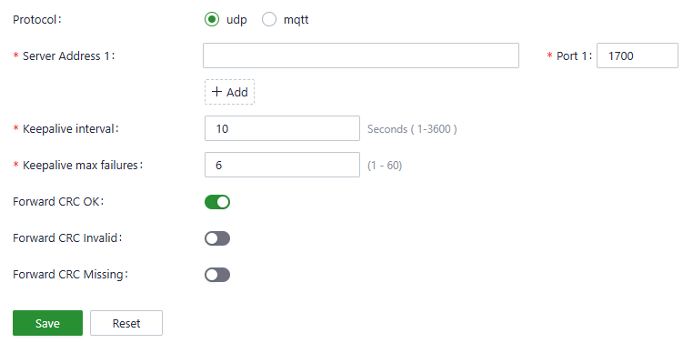

**Server Address**: Address of the network server, up to 5 can be added

\*\*Port \*\*: Port number of the network server

\*\*Keepalive Interval \*\*: The Heartbeat interval maintained between the network server and the network server. The unit is seconds and the value range is \[1, 3600]. The default value is 10

\*\*Keepalive max failures: \*\*the maximum number of times that heartbeat detection fails. If the number exceeds this number, the gateway and the platform lose the connection.

\*\*Forward CRC OK: \*\*whether to forward LoRaWAN messages that are verified by CRC; Enabled by default.

\*\*Forward CRC Invalid: \*\*whether to forward LoRaWAN messages with invalid CRC verification; Disabled by default.

\*\*Forward CRC Missing \*\*: whether to forward LoRaWAN messages without CRC; Disabled by default.

- mqtt forwarding

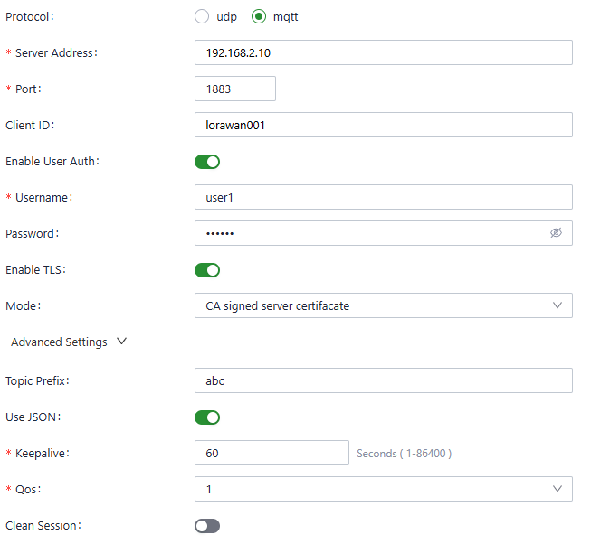

\*\*Server Address: \*\*the mqtt broker provided by the network server listens to the IP address.

\*\*Port: \*\*the listening port number of the mqtt broker provided by the network server.

\*\*Client ID:\*\*The client id of the mqtt client.

\*\*Enable User Auth: \*\*whether to enable user authentication. Enter the user name and password after enabling

\*\*Username: \*\*username used for authentication when establishing a connection with mqtt broker

\*\*Password: \*\*password used for authentication when establishing a connection with mqtt broker

\*\*Enable TLS \*\*: whether to enable TLS;

\*\*Mode: \*\*visible after enabling TLS, used to configure whether to use a CA certificate or a self-signed certificate

\*\*topic prefix: \*\*add the configured prefix before the default topic as the final topic. The default topics include:

```
- gateway/{{gateway_dev_eui}}/event/up 
- gateway/{{gateway_dev_eui}}/event/stats 
```

\*\*Use JSON: \*\*send data in json format or binary format

\*\*Keepalive: \*\*mqtt heartbeat interval

\*\*qos: \*\*the qos level of the mqtt message.

\*\*Clean Session: \*\*whether to clear the session

###### 3.3.1.2.3.3 Build-in Network Server

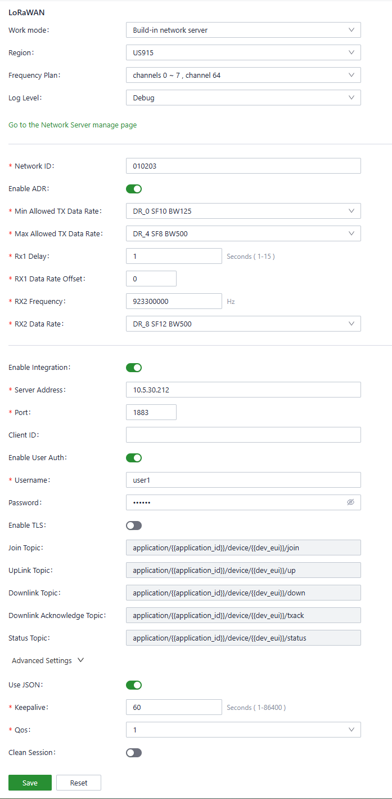

\*\*Region: \*\*EC300-LoRaWAN has different models in different regions. The area here is determined by the model and cannot be configured. It is only used for display.

\*\*Frequency Plan: \*\*the frequency band information must be consistent with the frequency band information of the terminal node and network server.

\*\*Log Level: \*\*log level. Adjust the log level as needed. The default log level is Error.

\*\*Go to the Network Server Manage Page: \*\*this is a link. After clicking, jump to the chirpstack configuration page. Information such as Gateway EUI, terminal JoinEUI and Appkey are all configured on the chirpstack page. The use of chirpstack is detailed in the second half of this chapter.

\*\*Network ID: \*\*the networking ID of LoRa, which is used to distinguish different networks.

\*\*Enable ADR: \*\*whether to enable the ADR(Adaptive Data Rate) function. This function only takes effect if the endpoint supports ADR.

\*\*Min Allowed TX Data Rate:\*\*to configure the minimum sending rate, you need to enable ADR to configure.

**Max Allowed TX Data Rate:**configure the maximum sending rate; You need to enable ADR to configure.

**Rx1 Delay:**Rx1 window delay time, unit second, value range \[1,15]

**RX1 Data Rate Offset:**rate offset of RX1 receive window;

**RX2 Frequency:**frequency used by RX2 receiving window;

**RX2 Data Rate:**the data rate used by the RX2 receive window;

**Enable Integration:**whether to enable data push integration. After the integration is enabled, data received from the terminal can be pushed to the mqtt broker.

**Server Address:**the address of the mqtt broker; EC300-LoRaWAN runs an mqtt broker locally and is pushed to 127.0.0.1 by default. When the customer's program runs on EC300-LoRaWAN, you can subscribe to related topics to obtain LoRaWAN data.

**Server Port:**the port number of the mqtt borker; The default is 9121

\*\*Client ID: \*\*the client id of the mqtt client.

\*\*Enable User Auth: \*\*whether to enable user authentication. You must enter the user name and password after enabling user authentication. The mqtt broker running on EC300-LoRaWAN has enabled user name and password authentication.

\*\*Username: \*\*the user name used for authentication when establishing a connection with the mqtt broker. The user name used to connect to the local mqtt broker is carrier.

\*\*Password: \*\*the password used for authentication when establishing a connection with the mqtt broker. The password for connecting to the local mqtt broker is mqtt @ carrier.

\*\*Enable TLS \*\*: whether to enable TLS;

\*\*Mode: \*\*visible after enabling TLS, used to configure whether to use a CA certificate or a self-signed certificate

**Join toic/UpLink topic/Downlink topic/Downlink Acknowledge topic/Status topic:**the message template is defined here, where {{application\_id}} and {{dev\_eui}} are variables, and {{application\_id}} is automatically generated after the application is added on the chirpstack configuration page. The value can be obtained from the chirpstack server page. Details are provided later. {{dev\_eui}} is the device eui of the terminal device, which is obtained from the terminal device manufacturer.

**application/{{application\_id}}/device/{{dev\_eui}}/join:**the topic corresponding to the access event of the terminal device.

Example topic: <code>application/acb57b95-2c39-486e-a8e7-724d4d6343ac/device/9620853c959b5856/join </code>

The payload example is as follows:

```json
{  
    "deduplicationId": "feef733a-bd99-4b54-b0f9-ed045d03f898",  
    "time": "2025-03-07T06:54:35.594623020+00:00",  
    "deviceInfo": {  
        "tenantId": "52f14cd4-c6f1-4fbd-8f87-4025e1d49242",  
        "tenantName": "ChirpStack",  
        "applicationId": "acb57b95-2c39-486e-a8e7-724d4d6343ac",  
        "applicationName": "ddd",  
        "deviceProfileId": "6a5e561f-17bd-4bee-a6ff-707a81e71008",  
        "deviceProfileName": "profile-01",  
        "deviceName": "node-01",  
        "devEui": "9620853c959b5856",  
        "deviceClassEnabled": "CLASS_C",  
        "tags": {  
  
        }  
    },  
    "devAddr": "06b0b667"  
}
```

**application/{{application\_id}}/device/{{dev\_eui}}/up:**the topic corresponding to the uplink data sent by the terminal device; The data field is the service data encoded in base64 sent by the terminal. After base64 decoding, the original data can be obtained.

Example topic: <code>application/acb57b95-2c39-486e-a8e7-724d4d6343ac/device/9620853c959b5856/up </code>

The payload example is as follows:

```json
{
  "deduplicationId": "ce397905-f943-45af-8ab5-cebb371b2a3a",
  "time": "2025-03-07T08:10:33.292943009+00:00",
  "deviceInfo": {
    "tenantId": "52f14cd4-c6f1-4fbd-8f87-4025e1d49242",
    "tenantName": "ChirpStack",
    "applicationId": "acb57b95-2c39-486e-a8e7-724d4d6343ac",
    "applicationName": "ddd",
    "deviceProfileId": "6a5e561f-17bd-4bee-a6ff-707a81e71008",
    "deviceProfileName": "profile-01",
    "deviceName": "node-01",
    "devEui": "9620853c959b5856",
    "deviceClassEnabled": "CLASS_C",
    "tags": {}
  },
  "devAddr": "06b0b667",
  "adr": false,
  "dr": 1,
  "fCnt": 79,
  "fPort": 51,
  "confirmed": false,
  "data": "7u7u",
  "rxInfo": [
    {
      "gatewayId": "0016c001f10550c9",
      "uplinkId": 314812379,
      "nsTime": "2025-03-07T08:10:33.035682529+00:00",
      "rssi": -12,
      "snr": 12.25,
      "channel": 4,
      "location": {
        "latitude": 35.86166,
        "longitude": 104.195397
      },
      "context": "BhqN7A==",
      "metadata": {
        "region_config_id": "us915_0",
        "region_common_name": "US915"
      },
      "crcStatus": "CRC_OK"
    }
  ],
  "txInfo": {
    "frequency": 903100000,
    "modulation": {
      "lora": {
        "bandwidth": 125000,
        "spreadingFactor": 9,
        "codeRate": "CR_4_5"
      }
    }
  }
}
```

**application/{{application\_id}}/device/{{dev\_eui}}/down:**the corresponding topic of the downlink data is sent to the terminal device; The value corresponding to the devEui field needs to be consistent with the dev\_eui in the topic.

Example topic:<code>application/acb57b95-2c39-486e-a8e7-724d4d6343ac/device/9620853c959b5856/down </code>

The payload example is as follows:

```shell
{
    "devEui": "9620853c959b5856",
    "fPort": 1,
    "data": "7u7u"
}
```

**application/{{application\_id}}/device/{{dev\_eui}}/txack:**the corresponding topic when the terminal device returns the ack message after receiving the downlink data.

Example topic: <code>application/acb57b95-2c39-486e-a8e7-724d4d6343ac/device/9620853c959b5856/txack </code>

The payload example is as follows:

```json
{
  "downlinkId": 2677400421,
  "time": "2025-03-07T08:15:27.302565414+00:00",
  "deviceInfo": {
    "tenantId": "52f14cd4-c6f1-4fbd-8f87-4025e1d49242",
    "tenantName": "ChirpStack",
    "applicationId": "acb57b95-2c39-486e-a8e7-724d4d6343ac",
    "applicationName": "ddd",
    "deviceProfileId": "6a5e561f-17bd-4bee-a6ff-707a81e71008",
    "deviceProfileName": "profile-01",
    "deviceName": "node-01",
    "devEui": "9620853c959b5856",
    "deviceClassEnabled": "CLASS_C",
    "tags": {}
  },
  "queueItemId": "98b73db8-4631-479c-a315-aa9d1b58b35a",
  "fCntDown": 2,
  "gatewayId": "0016c001f10550c9",
  "txInfo": {
    "frequency": 923300000,
    "power": 21,
    "modulation": {
      "lora": {
        "bandwidth": 500000,
        "spreadingFactor": 12,
        "codeRate": "CR_4_5",
        "polarizationInversion": true
      }
    },
    "timing": {
      "immediately": {}
    },
    "context": "FSvtpQ=="
  }
}
```

**application/{{application\_id}}/device/{{dev\_eui}}/status:**topic corresponding to demodulation amplitude and battery status

Example topic: <code>application/acb57b95-2c39-486e-a8e7-724d4d6343ac/device/9620853c959b5856/status </code>

The payload example is as follows:

```json
{
  "deduplicationId": "a0047d3f-b432-4400-8ef8-ed8fad4c9025",
  "time": "2025-03-07T08:16:15.688878229+00:00",
  "deviceInfo": {
    "tenantId": "52f14cd4-c6f1-4fbd-8f87-4025e1d49242",
    "tenantName": "ChirpStack",
    "applicationId": "acb57b95-2c39-486e-a8e7-724d4d6343ac",
    "applicationName": "ddd",
    "deviceProfileId": "6a5e561f-17bd-4bee-a6ff-707a81e71008",
    "deviceProfileName": "profile-01",
    "deviceName": "node-01",
    "devEui": "9620853c959b5856",
    "deviceClassEnabled": "CLASS_C",
    "tags": {}
  },
  "margin": 10,
  "externalPowerSource": false,
  "batteryLevelUnavailable": false,
  "batteryLevel": 100
}
```

**Use JSON:**whether to use JSON format to send data, and use protobuf format to send data after closing

**Keepalive:**mqtt heartbeat interval, in seconds

**qos:**the qos level of the mqtt message.

\*\*Clean Session: \*\*whether to clear the session

\*\*The Use of Chirpstack: \*\*

1. After clicking the link above, you will jump to the chirpstack login page. The default username/password is admin/admin

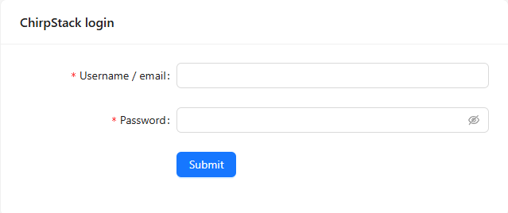

1. After logging in, it is recommended to change the default password first.

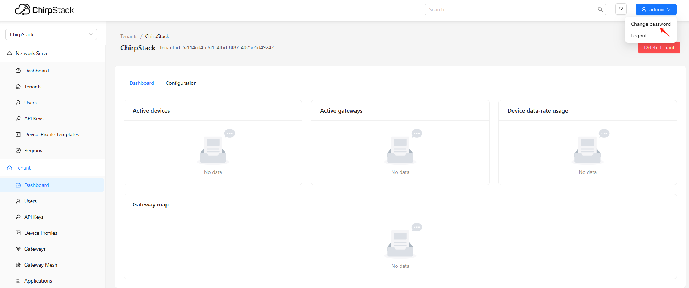

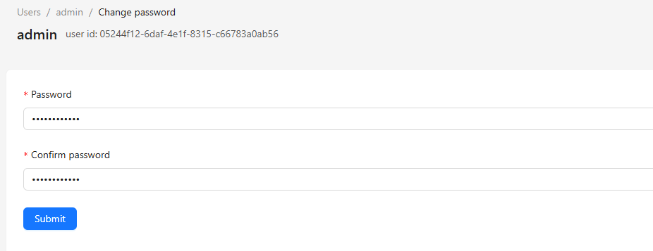

1. Cut `Gateway`menu, click `Add gateway`to add a gateway, gateway eui is required when adding a gateway. This information can be found from `device Overview`status page acquisition.

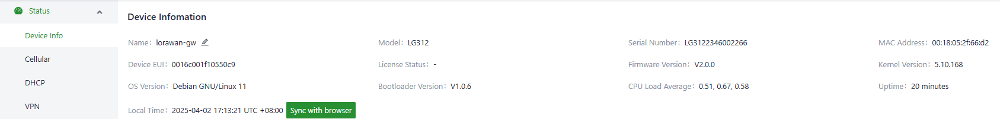

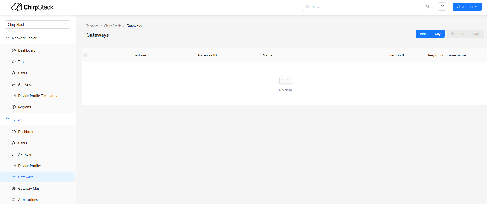

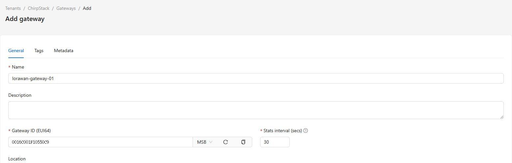

After adding the gateway for tens of seconds, click again `Gateway`menu, you can see that the gateway is already online

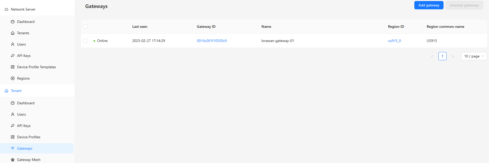

1. Cut `Device Profiles`menu, click `Add device profile`add a profile file.

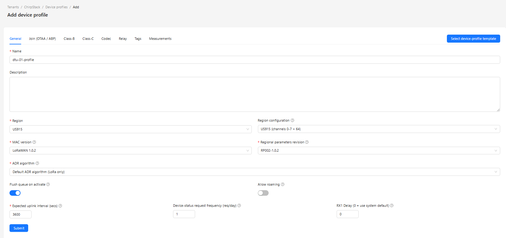

Region andThe options for Region configuration are determined by the previous configuration

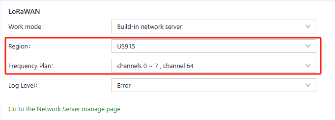

The MAC version and Regional parameters revision need to be set according to the specifications supported by the endpoint.

1. Cut `Applications`menu, click `Add application`add an application

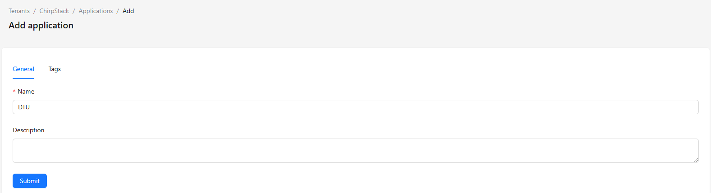

After the application is added, an app id is generated. The app id is used when lorawan data needs to be pushed out through mqtt.

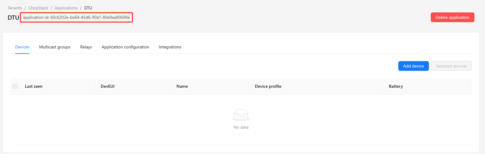

1. After creating the applicaiton, based on the applicaiton, click `Add device`add device

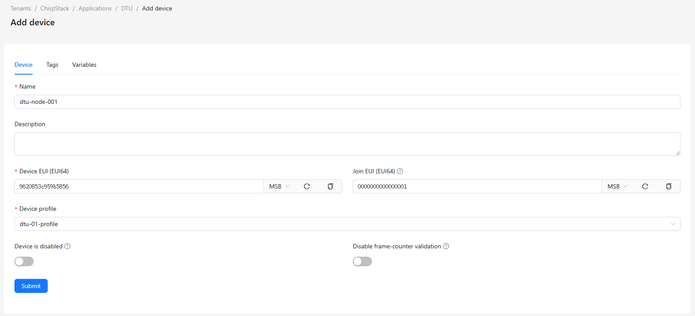

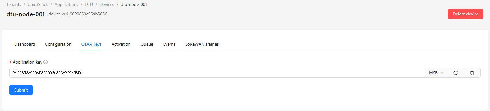

<code>Device EUI </code>, <code>Join EUI </code>and <code>Applicaiton key </code>this information needs to be obtained from the terminal manufacturer.

1. Test Communications

Trigger the terminal to generate data, then click the device's EUI and select `Events`to check whether the terminal data is received

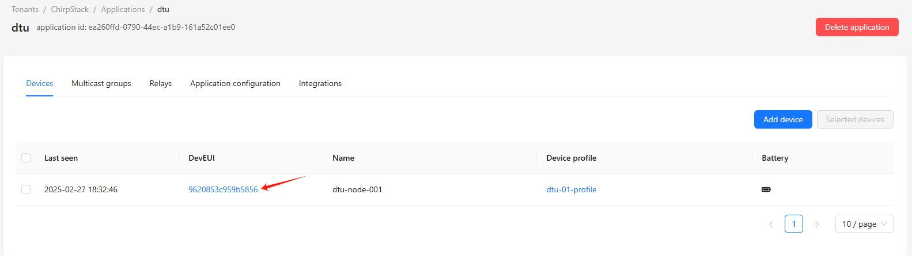

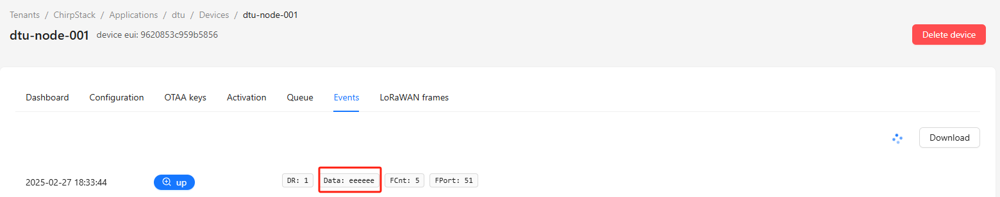

When testing network server to send data to the terminal, the terminal needs to be switched to Class C mode. Class C can be enabled in the configuration of Device profiles, and then switched `Queue`the menu sends data to the terminal, and checks whether the data has been received at the terminal.

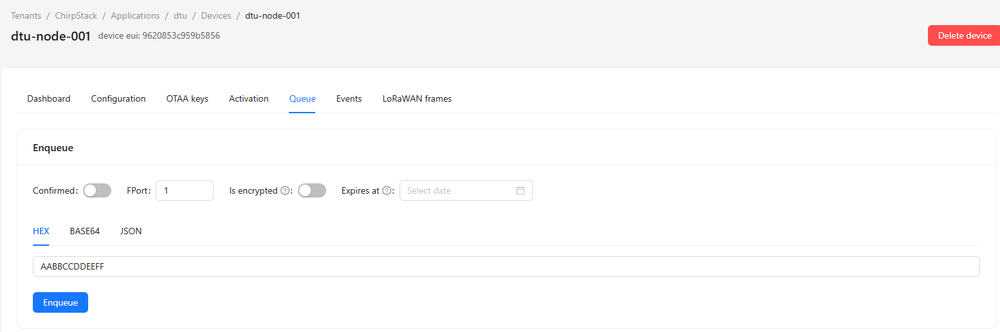

##### 3.3.1.2.4 Configure Wi-Fi

The EC series supports both Station and AP modes.

###### 3.3.1.2.4.1 Station Mode

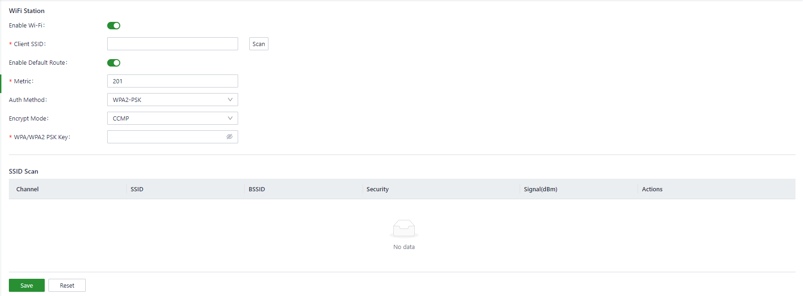

**Enable Wi-Fi**: enable switch; Off by default

**Client SSID**: The ssid to be connected can be entered manually; You can also use the scan button to obtain the ssid that can be connected nearby.

**Enable Default Route**: Whether to enable the function of adding default route. After turning on, when wifi connection is successful, a default route of wlan port will be added. The default is on.

**Metric**: The measurement value of the default route of the wifi port. When the default route is configured for the cellular port, Wi-Fi port and Ethernet port, the minimum measurement value takes effect.

**Auth Method**authentication method, support no authentication, WPA-PSK,WPA2-PSK,WPA-PSK/WPA2-PSK Mixed

**Encrypt Mode**: Encryption method; Supports CCMP,TKIP,TKIP and CCMP

**WPA/WPA2 PSK Key**: Key Information

###### 3.3.1.2.4.2 Access Point Mode

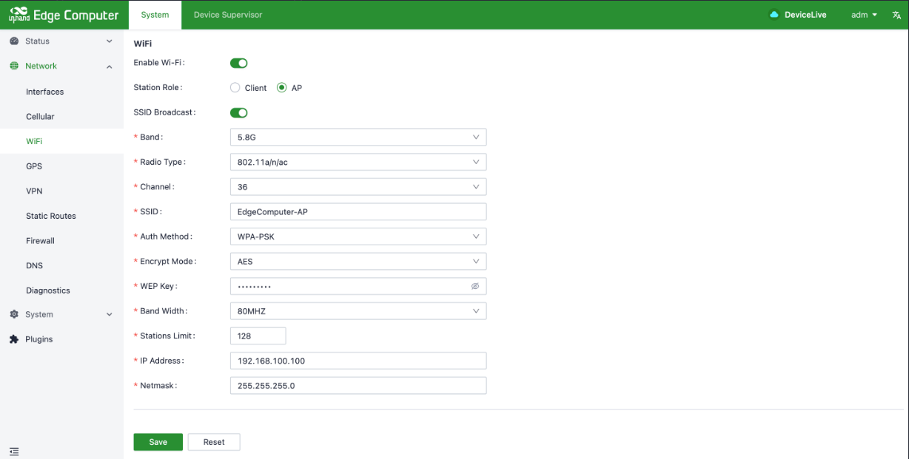

SSID Broadcast:\

Controls whether the SSID is broadcasted. Enabled by default.

- Enabled: The SSID can be detected by nearby devices.
- Disabled:The SSID is hidden and must be manually entered to connect.

Band:

Select the Wi-Fi frequency band, such as:

- 2.4G:Suitable for longer coverage range.
- 5.8G:Suitable for high-speed data transmission.

Radio Type:

Wireless standard, such as:

- 802.11a/n/ac: Supports 5G.
- 802.11b/g/n:Supports 2.4G.

Channel:

Specifies the wireless channel used. Can be manually selected or set to default.

SSID:

Set the Wi-Fi network name (SSID).

Auth Method:

Select the Wi-Fi authentication method:

- Open:No authentication.
- WPA-PSK
- WPA2-PSK
- WPA-PSK/WPA2-PSK Mixed

Encryption Mode:

Wireless encryption mode, supporting:

- AES
- TKIP

WEP Key (Wi-Fi Password):

Set the Wi-Fi access password.

Bandwidth:

Select the bandwidth range, such as:

- 20MHz:Suitable for complex environments with strong anti-interference capabilities.
- 40MHz / 80MHz:Suitable for high-speed transmission in low-interference environments.

Stations Limit:

Set the maximum number of clients allowed to connect to the AP.

IP Address:

Local IP address in Wi-Fi AP mode (default: 192.168.100.100).

Subnet Mask:

Subnet configuration parameter, default: 255.255.255.0.

##### 3.3.1.2.5 Configuring Static Routes

The static route of Ethernet is configured here. When the default routes of Ethernet, cellular, and wifi are configured at the same time, the default route with the lowest metric value takes effect. Ensure that the Metric values of the default routes are different.

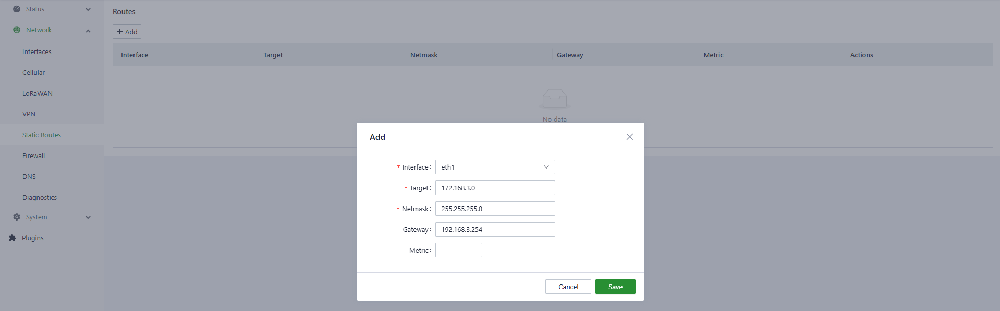

Static route configuration parameters:

**Interface**: The outbound interface of the static route

**Target**: Target Network

**Netmask**: Destination Network Mask

**Gateway**: Next Hop Address

**Metric**: Metrics for static routes

##### 3.3.1.2.6 Configuring the Firewall

- Basic Setting

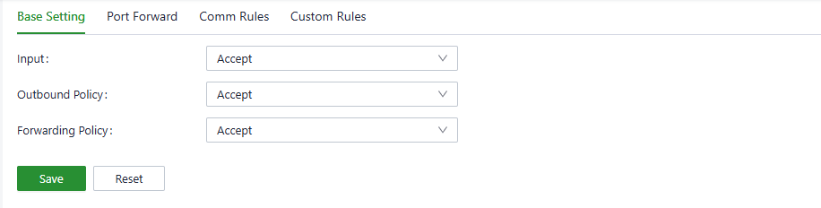

Set inbound, outbound, and forwarding policies separately.

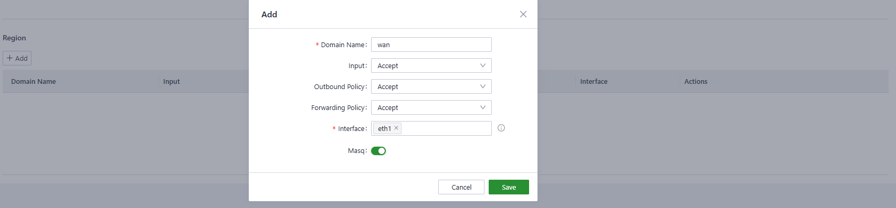

Domain rules can be added in the Region configuration. Domains are interface-based, and WAN and LAN domains can be configured. <code>Masq </code>used to control whether to enable NAT rules, for WAN interfaces, if the hanging device needs to be networked, you can turn on this option.


- Port Forward

DNAT rules are usually used when messages enter from the WAN direction and access devices under the LAN.

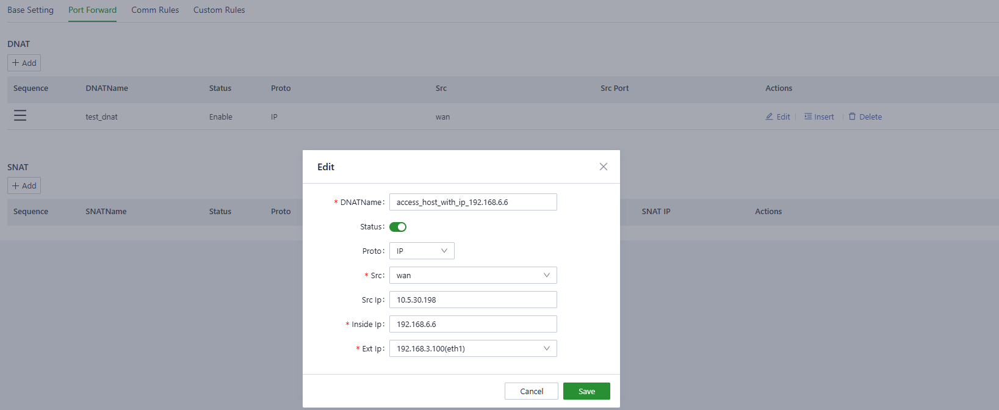

DNAT Name: the Name used to configure the DNAT rule. It can be used to describe the purpose of the DNAT rule.

Status: After a rule is added, you can enable or disable the rule. When Status is set to off, the rule is disabled.

Proto: supports protocol types such as IP, UDP, and TCP

Src: Identifies from which domain, that is, which interface, the device receives the message.

Src IP: identifies the source IP address of the message; If it is not filled in, all messages are matched.

Inside IP: identifies the IP address of the target device to be accessed, usually a device in the local area network, such as an HTTP server.

Ext IP: when a domain has multiple IP addresses, it is used to identify the IP address of the interface corresponding to the Src domain. When an interface has multiple IP addresses, you need to select one.

The meaning of the rule in the screenshot is: `wan`when the domain receives a source address of 10.5.30.198 and a destination address of 192.168.3.100, the destination address will be modified `192.168.6.6`.

SNAT rules are usually used when messages enter the local area network and need to change the source IP address of the message to the wan port IP address.

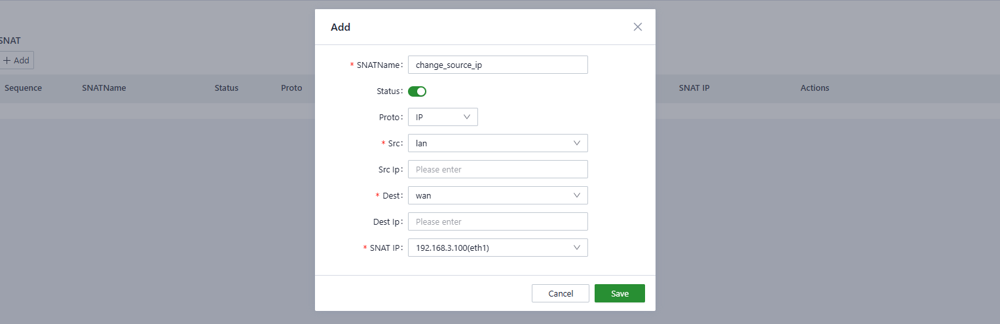

SNAT Name: the Name used to configure the SNAT rule. It can be used to describe the purpose of the SNAT rule.

Status: After a rule is added, you can enable or disable the rule. When Status is set to off, the rule is disabled.

Proto: supports protocol types such as IP, UDP, and TCP

Src: Which domain the message comes from, that is, which interface it comes from, usually the LAN domain.

Src IP: indicates the source IP address of the matching packet. This parameter can be omitted to match all source IP addresses.

Dest: The domain from which the message is sent, usually a wide area network domain.

Dest Ip: the destination Ip address of the message; It can be omitted to match all messages.

SNAT IP: The ip address of the modified source IP address.

The meaning of the rule in the screenshot is: the source IP address of the message that enters from lan domain (eth2) and is routed to wan domain (eth1) is modified to the IP address of eth1 interface, I .e. 192.168.3.100.

- Comm rules

Communication rules are used to filter message forwarding

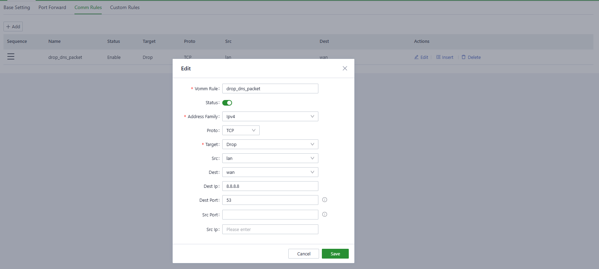

Comm Rule: identifies the Rule and describes the target of the Rule.

Status: After a rule is added, you can enable or disable the rule. When Status is set to off, the rule is disabled.

Proto: supports protocol types such as IP, UDP, and TCP

Target: Target Processing action, which can be Drop,Accept, or Reject.

Src: domain from which the message enters the device

Dest: the domain through which the message is sent from the device

Dest IP: the destination address of the message; If not configured, all destination addresses are matched.

Dest Port: the destination Port of the packet; Matches all ports if not configured

Src IP: source IP address of the message; If not configured, match all source IP addresses

Src Port: source Port of the message; Matches all source ports when not configured

- Custom Rules

to add a custom firewall rule by using the iptables command

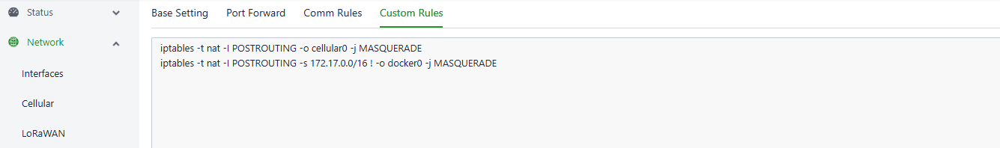

##### 3.3.1.2.7 Configure DNS

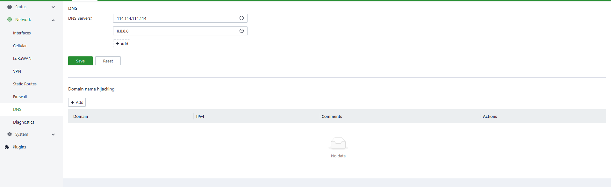

**DNS Servers**: DNS Server address, up to 4 can be configured

**Domain name hijacking:**the domain name hijacking function enables the binding between IP addresses and domain names.


##### 3.3.1.2.8 Network Diagnostics

Network diagnostics supports ping,traceroute, and nslookup functions.

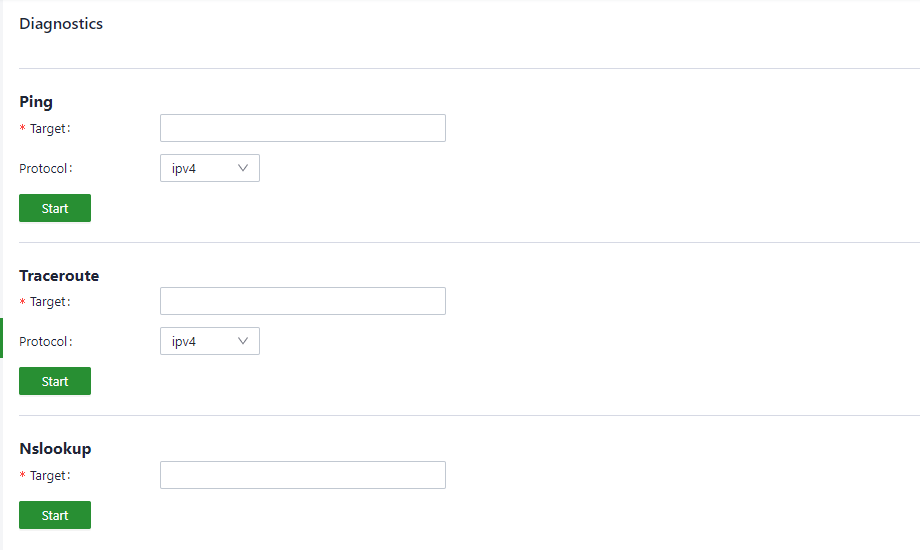

##### 3.3.1.2.9 Configuring OpenVPN

###### 3.3.1.2.9.1 Configuring OpenVPN Server

The configuration of OpenVPN can be configured manually on the web page or by importing a configuration file.

a. Manual Configuration

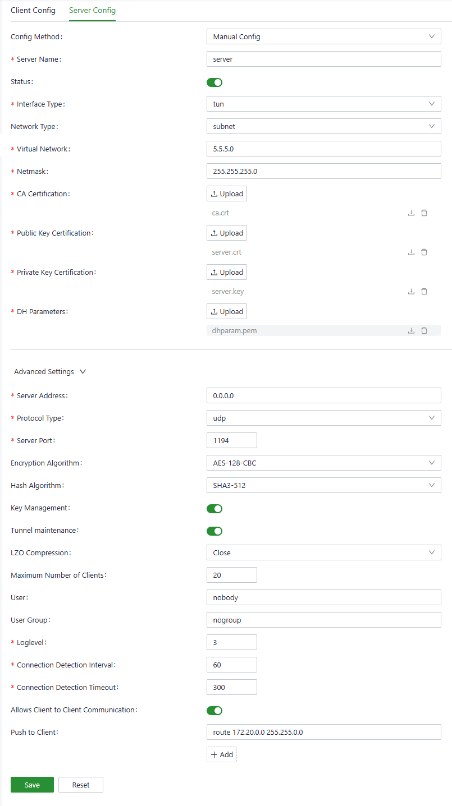

\*\*Server Name \*\*: The string that uniquely identifies the server-side configuration. It can contain only English letters and numbers, start with a letter, and can be no more than 64 characters in length.

**Status**: On or off, used to control the start or stop of the OpenVPN Server.

\*\*Interface Type \*\*currently, only tun mode is supported.

**Network Type**: Support `p2p`, `net30`and `subnet`. `p2p`and `net30`used to establish a point-to-point connection, `subnet`used to establish a virtual local area network.

**Virtual Network**: `subnet`in this mode, you need to configure the network segment information of the virtual network; If yes `p2p`or `net30`the local IP address and the remote IP address are configured.

**Netmask**: `subnet`in this mode, you need to configure the subnet mask of the virtual network.

**CA Certification**: The CA certificate file needs to be imported here.

**Public Key Certification**: You need to import the server's public key certificate file here.

**Private Key Certification**: The private key certificate file of the import server is required here

**DH Parameters**: The DH parameter file of the import server is required here.

In the advanced settings, you can configure some parameters with low frequency of change.

**Server Address**: the IP address that OpenVPN listens to. By default, it listens to 0.0.0.0, that is, it listens to all IP addresses.

**Protocol Type**: Support `udp`and `tcp`, default `udp`.

**Server Port**: The port number that the server listens to. Default `1194`.

**Encryption Algorithm**: Configure the encryption algorithm used to ensure the confidentiality of data transmission.

\*\*Hash Algorithm \*\*configure the hash algorithm used to guarantee the integrity of data transmission.

**Key Management**: after key retention is enabled, even if OpenVPN is temporarily disconnected due to network exceptions, it can be quickly recovered without the need for a new handshake.

**Tunnel maintenance**: When tunnel maintenance is enabled, it can prevent the tunnel from being closed due to short-term network fluctuations.

\*\*LZO Compression \*\*whether to enable LZO compression.

**Maximum Number of Clients**: Configure the number of clients that connect to the OpenVPN Server at the same time.

\*\*User \*\*specifies the user running the OpenVPN process

**User Group**: specify the user group to run the OpenVPN process

**Loglevel**: Value range <code>1 to 11 </code>, the larger the value, the more detailed the log information, <code>ALL </code>view the OpenVPN log in the type log.

**Connection Detection Interval**: the cycle of sending heartbeat packets to check whether the VPN connection is alive.

**Connection Detection Timeout**: If no response is received within the timeout period, determine that the connection is disconnected and try to restart

**Allows Client to Client Communication**: Whether to allow the client and the client to communicate with each other

**Push to Client**: can push information such as routing and DNS to the client.

b. Import Configuration

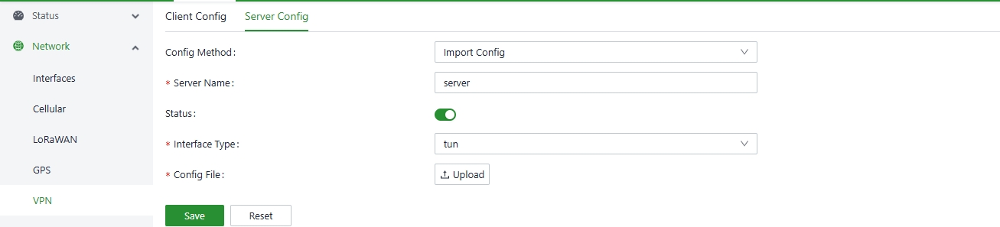

**Server Name**: The string that uniquely identifies the server configuration. It can contain only English letters and numbers and start with a letter. The string must be no more than 64 characters in length.

**Status**: On or off, used to control the start or stop of the OpenVPN Server.

\*\*Interface Type \*\*currently, only tun mode is supported.

**Config File**: import the OpenVPN Server configuration file, which must contain information such as the CA certificate, Server certificate, and Server key.

###### 3.3.1.2.9.2 Configuring the OpenVPN Client

a. Manual Configuration

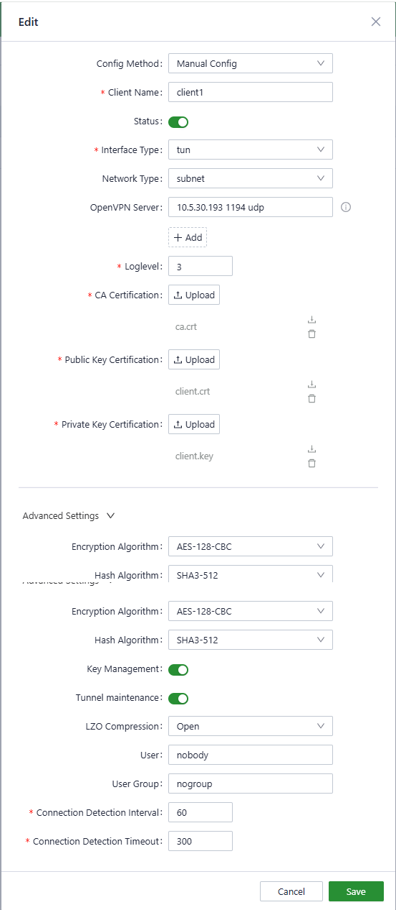

**Client Name**: The string that uniquely identifies the server-side configuration. It can contain only English letters and numbers, start with a letter, and can be no more than 64 characters in length.

**Status**: On or off, used to control the start or stop of the OpenVPN Server.

\*\*Interface Type \*\*currently, only tun mode is supported.

**Network Type**: Support `p2p`, `net30`and `subnet`. `p2p`and `net30`used to establish a point-to-point connection, `subnet`used to establish a virtual local area network. When the network type is `p2p`or `net30`you need to configure the local IP address and remote IP address.

**OpenVPN Server**: configure the ip address, port number, and protocol information of the OpenVPN Server in the format of ip port proto, for example:

`192.168.3.200 1194 udp`You can configure up to 10 server addresses. The OpenVPN client attempts to establish a connection one at a time in order until the OpenVPN tunnel is successfully established.

**Loglevel**: Value range <code>1 to 11 </code>, the larger the value, the more detailed the log information, <code>ALL </code>view the OpenVPN log in the type log.

**CA Certification**: The CA certificate file needs to be imported here

**Public Key Certification**: The public key certificate file of the client needs to be imported here.

**Private Key Certification**: The private key certificate file of the client needs to be imported here.

In the advanced settings, you can configure some parameters with low frequency of change.

**Encryption Algorithm**: Configure the encryption algorithm used to ensure the confidentiality of data transmission.

\*\*Hash Algorithm \*\*configure the hash algorithm used to guarantee the integrity of data transmission.

**Key Management**: after key retention is enabled, even if OpenVPN is temporarily disconnected due to network exceptions, it can be quickly recovered without the need for a new handshake.

**Tunnel maintenance**: When tunnel maintenance is enabled, it can prevent the tunnel from being closed due to short-term network fluctuations.

\*\*LZO Compression \*\*whether to enable LZO compression.

\*\*User \*\*specifies the user running the OpenVPN process

**User Group**: specify the user group to run the OpenVPN process

**Connection Detection Interval**: the cycle of sending heartbeat packets to check whether the VPN connection is alive.

**Connection Detection Timeout**: If no response is received within the timeout period, determine that the connection is disconnected and try to restart.

b. import Configuration

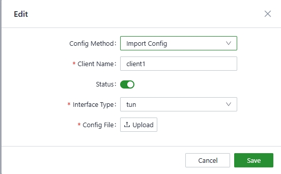

**Client Name**: The string that uniquely identifies the client configuration. It can contain only English letters and numbers and start with a letter. The string must be no more than 64 characters in length.

**Status**turns on or off to control the start or stop of the OpenVPN client.

**Interface Type**currently, only tun mode is supported.

**Config File**: import the OpenVPN Client configuration file. The configuration file must contain information such as the CA certificate, Client certificate, and Client key.

#### 3.3.1.3 System Management

##### 3.3.1.3.1 Basic Configuration

Cloud Management

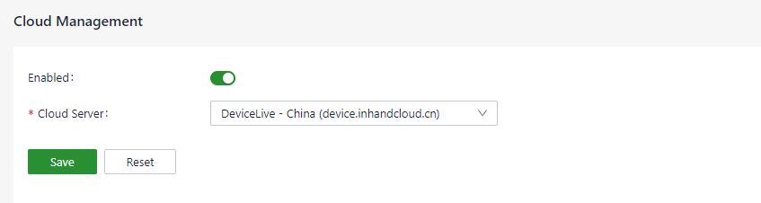

\*\*Enabled \*\*: The enable switch for connecting to the DeviceLive platform; DeviceLive is the remote monitoring and management platform of InHand equipment;

\*\*Cloud Server \*\*: DeviceLive platform has 2 addresses; One is the address of the domestic platform, the other is the address of the overseas platform; Choose which platform to connect here.

Time Zones and NTP Clients

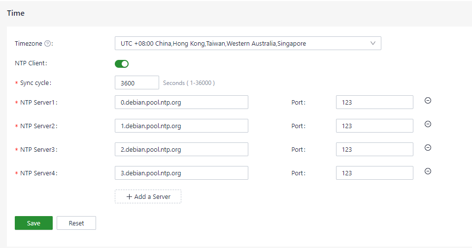

You can configure up to 10 NTP Server addresses. The program periodically sends synchronization requests to each Server address in turn. After successful synchronization, the system time is written to RTC and no longer sends synchronization requests to subsequent NTP servers.

In addition to using NTP to synchronize the time, there is a synchronization button on the Device Info status page to manually synchronize the time, but this synchronization button will only be displayed when the difference between the Device time and the local time (the time of the computer used to access the Device) exceeds 3 seconds.

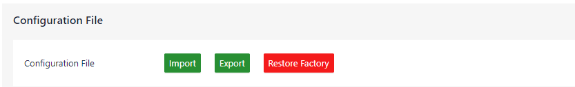

The import, export and factory restoration of configurations are supported here.

##### 3.3.1.3.2 Firmware Upgrade

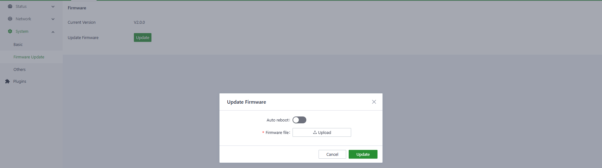

The automatic restart option is turned off by default. After the firmware is upgraded, the system needs to be manually restarted to take effect. After the automatic restart option is turned on, the system will automatically restart after the firmware is upgraded.

##### 3.3.1.3.3 Other


This page has two functions: restart the system and reset the system. Resetting the system requires careful use. The reset system function will restore the configuration state and file system state of the system to the same as those at the factory, which means that the software installed by the user will also be cleared.

#### 3.3.1.4 Status

##### 3.3.1.4.1 Equipment Information

The device information status page displays the host name, device model, serial number, firmware version, kernel version, file system version, and an overview of CPU, memory, and disk space usage.

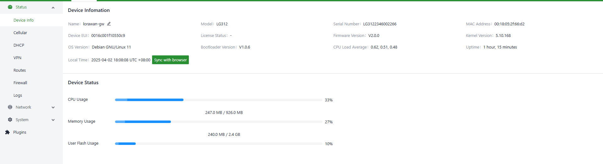

##### 3.3.1.4.2 Cellular Dial Status Information

The cellular dialing status page displays the SIM card, IMIE,IMSI,ICCID, signal strength, IP address, DNS and other information currently used for dialing.

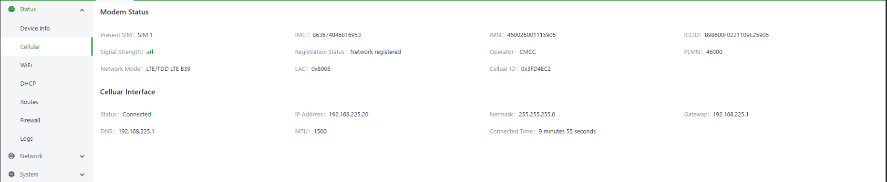

##### 3.3.1.4.3 Wi-Fi Station Status Information

The Wi-Fi status page displays the IP address, Gateway, and DNS information obtained after a successful Wi-Fi connection.

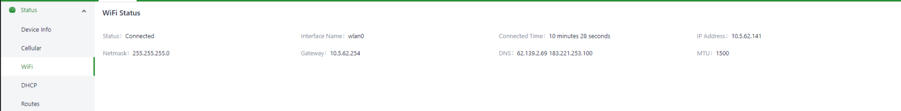

##### 3.3.1.4.4 DHCP Server Status Information

The DHCP Server status page shows the IP address, client host name, client host mac and Expiration Time assigned by the device as DHCP Server.

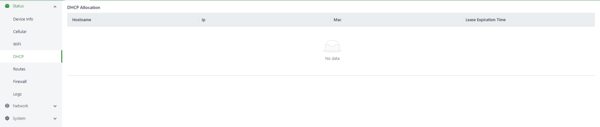

##### 3.3.1.4.5 Routing Status Information

The route status page displays information such as IPv4 directly connected routes, static routes, and route neighbors.

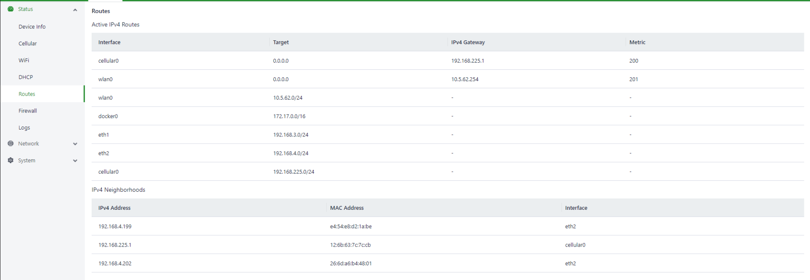

##### 3.3.1.4.6 Firewall State Information

The firewall status information displays information such as filtering rules and IP address mapping rules.

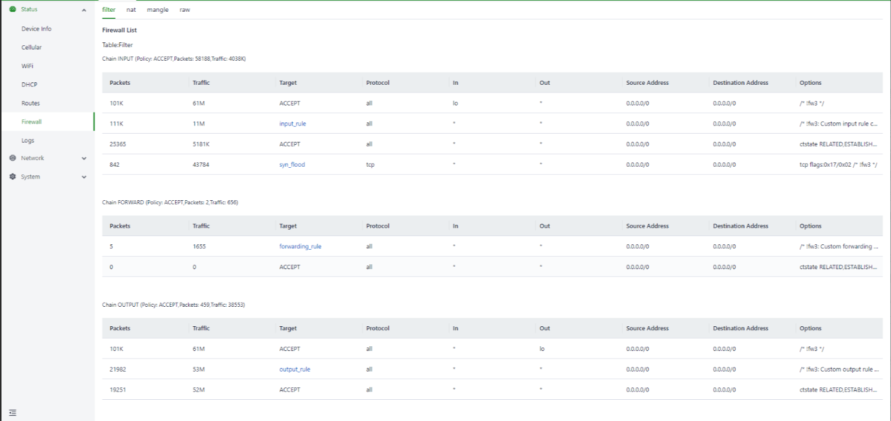

##### 3.3.1.4.7 Log Information

On the Logs page, you can view system logs, user logs, and set the log level to view, including Error, Info, and Debug. Logs can also be downloaded locally.

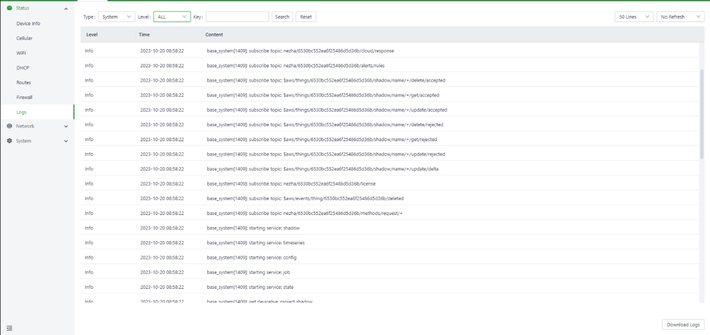

##### **3.3.1.4.8 OpenVPN Status Information**

###### 3.3.1.4.8.1 OpenVPN Server Status Information

On the OpenVPN Server status page, you can view information such as the status update time and the connected OpenVPN clients.

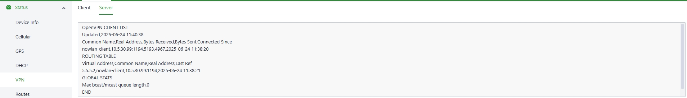

###### 3.3.1.4.8.2 OpenVPN Client Status Information

On the OpenVPN client status page, you can view information such as the virtual IP address obtained by the client and the tunnel connection duration.

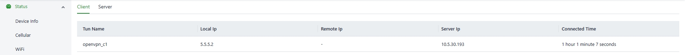

### 3.3.2 Linux-based Command Line Management

When using the Linux Command Line for network configuration and system configuration, you first need to close the IEOS program. IEOS is managed through systemctl,

the way to close IEOS is as follows:

```shell
systemctl stop ieos_daemon
```

This shutdown takes effect only for this startup. After the system restarts, the IEOS program will still start. The method of prohibiting the IEOS program from starting is as follows:

```shell
systemctl disable ieos_daemon
```

Important note: After IEOS is closed, wireless networking functions such as dial-up and Wi-Fi need to be realized by users based on Linux native commands, and remote management of devices cannot be realized by docking DeviceLive platform.

#### 3.3.2.1 Network Management

##### 3.3.2.1.1 Setting a Static IP Address

If you want to set a static IP address for EC300-LoRaWAN, use the command vim /etc/network/interfaces.d/eth1 or vim /etc/network/interfaces.d/eth2 to modify the corresponding network configuration file to set the default gateway, address, network, and subnet mask of the Ethernet interface. Here is an example of setting static IP to eth2 Port:

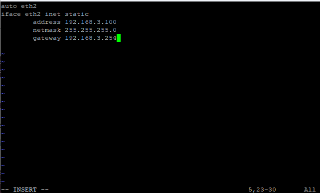

After modifying the IP configuration of the interface, run/etc/init.d/networking restart to restart the network service to make the configuration take effect.

##### 3.3.2.1.2 Setting a Dynamic IP Address

If you want to set a dynamic IP address for EC300-LoRaWAN, run the vim /etc/network/interfaces.d/eth1 or vim /etc/network/interfaces.d/eth2 command to modify the corresponding network configuration file. After inet, set DHCP to automatically obtain the IP address.

Here is an example of setting dynamic IP for eth1 port.

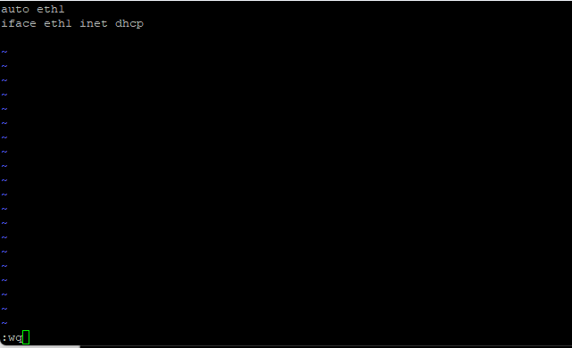

After modifying the IP configuration of the interface, run/etc/init.d/networking restart to restart the network service to make the configuration take effect.

#### 3.3.2.3 System Management

##### 3.3.2.3.1 Query Firmware Version

to check the computer firmware version of EC300-LoRaWAN, type:


##### 3.3.2.3.2 Viewing Free Disk Space

to determine the amount of free drive space, use the df command with the-h option. The system returns the amount of drive space broken down by file system. For EC300-LoRaWAN products, the available disk partition is/dev/mmcblk0p8. Here is an example:

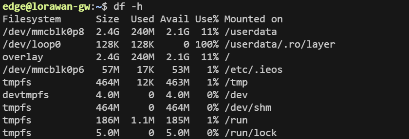

##### 3.3.2.3.4 Adjustment Time

The EC300-LoRaWAN has two time settings. One is the system time and the other is the RTC (real time clock) time maintained by the hardware of the LG 312. Use the date command to query the current system time or set a new system time. Use the hwclock command to query the current RTC time or set a new RTC time.

Use the command date MMDDhhmmYYYY to set the system time:

MM: month

DD: Day

hh: time

mm: min

YYYY: Year


Use the following command to set the RTC time to the system time


Click the links below for more information about dates and times:

[https://www.debian.org/doc/manuals/system-administrator/ch-sysadmin-time.html](https://www.debian.org/doc/manuals/system-administrator/ch-sysadmin-time.html)

[https://wiki.debian.org/DateTime](https://wiki.debian.org/DateTime)

##### 3.3.2.3.5 Setting Time Zone

There are two ways to configure the time zone for EC300-LoRaWAN. One is to use the command tzselect. The other is to use the/etc/localtime file.

##### 3.3.2.3.6 Using the Tzselect Command

After typing the tzselect command, you will enter the interface of selecting regions. First, select the approximate regions (divided by continents and oceans) and enter the numbers in front of continents or oceans.

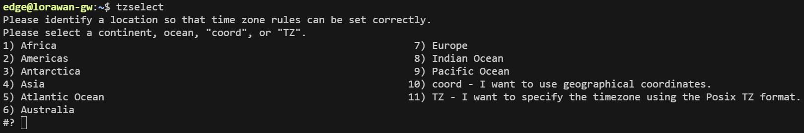

Then select the continent or the country under the ocean.

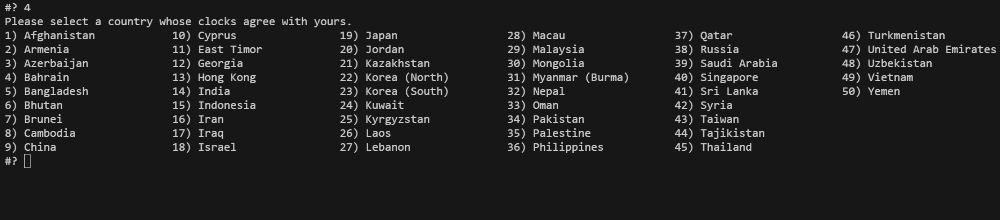

Obtain the Chinese time zone keyword Asia/Shanghai according to the preceding steps, and run the following command to set the time zone

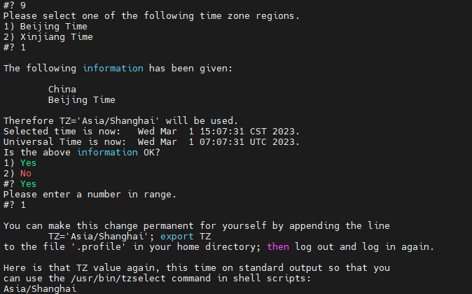

##### 3.3.2.3.7 Using Localtime Files

The local time zone is stored in/etc/localtime and is used by the GNU library for C(glibc) if no value is set for the TZ environment variable. This file is either a copy of/usr/share/zoneinfo/file or a symbolic link to it. If EC300-LoRaWAN cannot find the/usr/share/zoneinfo/file, please download the time zone information file you need from this website ( [https://www.iana.org/time-zones](https://www.iana.org/time-zones)), and relink to the local time file in EC300-LoRaWAN.

**Attention**

After successfully downloading the required time zone information file, decompress it and use the zic command to compile the corresponding binary file. The generated time zone file is "/usr/share/zoneinfo/custom time zone file name".

## 4 Advanced configuration of peripheral interfaces

In this chapter, we will introduce the advanced configuration of the peripheral interface of the LoRaWAN gateway EC300-LoRaWAN based on the Arm structure.

This chapter includes the following:

### 4.1 Serial Port

EC300-LoRaWAN has 4 serial ports, one serial port supports RS485, and three serial ports support RS-232 or RS-485 mode.

The device node corresponding to COM1 is/dev/ttyS4

The device node corresponding to COM2 is/dev/ttyS5

The device node corresponding to COM3 is/dev/ttyS6

The device node corresponding to COM4 is/dev/ttyS8

### 4.1.1 Changing Serial Port Settings

Use the stty command to view and set the serial port.

View the detailed command content by typing sudo stty -- help:

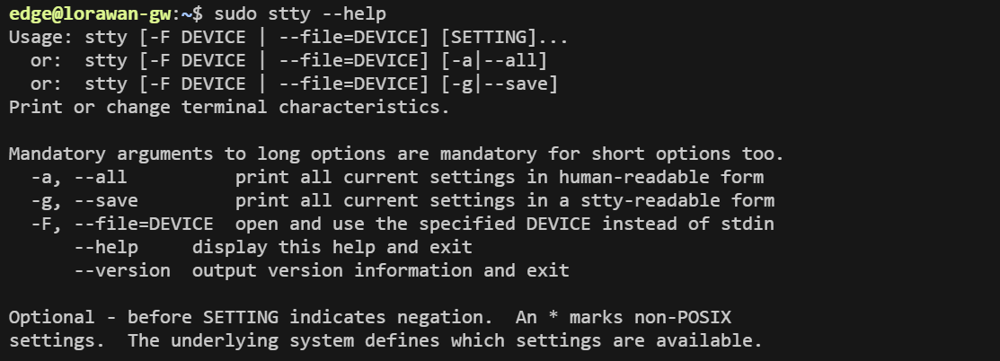


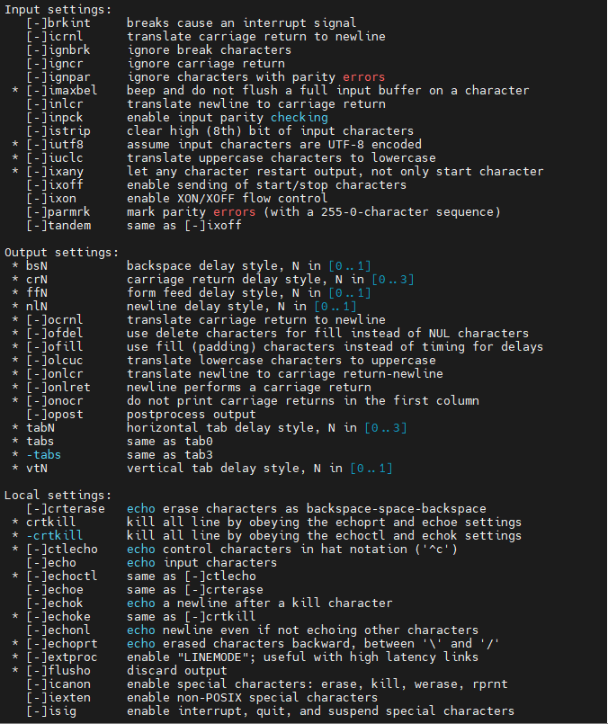

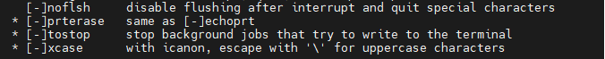

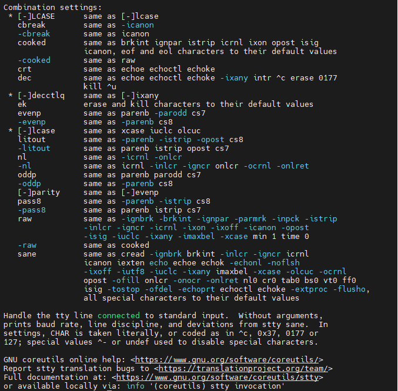

### 4.1.2 View Serial Port Information

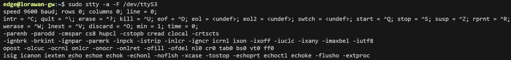

### 4.1.3 Settings COM1 Baud Rate of Serial Port


**Attention**

More information about the stty command is available at the following link

[http://www.gnu.org/software/coreutils/manual/coreutils.html](http://www.gnu.org/software/coreutils/manual/coreutils.html)

### 4.2 USB Interface

EC300-LoRaWAN provides a USB 2.0 Host interface, mainly used to expand storage devices

EC300-LoRaWAN support USB storage device hot plug.

**Attention**

Before disconnecting the USB mass storage device, please remember to enter `sync`synchronize commands to prevent data loss. When you disconnect the storage device, exit from the Mount directory.

### 4.3 Micro SD Card Mounting

The partition of the SD card needs to be formatted as FAT32 format. The formatting method is as follows:

- SD card capacity <= 32GB:SD card is inserted into the card reader, and then the card reader is inserted into the computer using Windows system. Most Windows systems only support the format of SD cards with a capacity of less than 32GB as FAT32 system, and a partition will be automatically created when formatting. It can also be formatted as FAT32 file system under Linux system, with the same method as SD card capacity> 32GB.
- SD card capacity> 32GB: When the SD card capacity is greater than 32GB, you need to format FAT32 format under Linux. The SD card is inserted into the card reader, and then the card reader is inserted into the computer using the Linux system or the computer installing the virtual machine Linux virtual machine.

a. Run fdisk -l to view the device node corresponding to the SD card. The example is/dev/sda

b. Execute fdisk /dev/sda to partition (p view current partition, d delete existing partition, n create new partition, w save changes), create partition

/dev/sda1

c. Execute sudo mkfs.vfat -F 32 /dev/sda1 to format the partition as FAT32.

d. After formatting, remove the SD card from the card reader and insert it into the device when the device is powered off.

EC300-LoRaWAN support micro SD memory card does not support hot plug. Mounting Reference [https://www.man7.org/linux/man-pages/man8/mount.8.html](https://www.man7.org/linux/man-pages/man8/mount.8.html)

### 4.4 CAN bus Interface

The three-way CAN port of the EC300 supports the CAN bus.

### 4.4.1 Configure the connection CAN Interface

By default, the CAN port will be initialized. If you need any other configuration, check the CAN device using the ip link command. To check the status of the CAN device, use the ip link command:

To configure a CAN device, use ip link set can\* down to first turn off the device

Where can\* is selected from can1, can2, or can3.

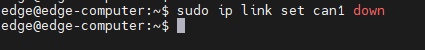

Then configure the bit rate (here's a 50k bit rate example) :

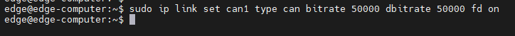

Finally turn the device back on


### 4.5 IO Debugging

EC300-LoRaWAN supports 4-way IO input and 4-way IO output.

| \*\*Port number \*\* | \*\*device Description File \*\* |
| --- | --- |
| \*\*DI1 \*\* | \*\*/sys/class/gpio/gpio454/value \*\* |
| \*\*DI2 \*\* | \*\*/sys/class/gpio/gpio455/value \*\* |
| \*\*DI3 \*\* | \*\*/sys/class/gpio/gpio456/value \*\* |
| **DI4** | \*\*/sys/class/gpio/gpio457/value \*\* |
| \*\*DO1 \*\* | \*\*/sys/class/gpio/gpio323/value \*\* |
| \*\*DO2 \*\* | \*\*/sys/class/gpio/gpio453/value \*\* |
| \*\*DO3 \*\* | \*\*/sys/class/gpio/gpio465/value \*\* |
| \*\*DO4 \*\* | \*\*/sys/class/gpio/gpio461/value \*\* |

Read DI status can use cat "device description file";


to control the DO state, you can use echo 1 > "device description file" or echo 0 > "device description file" under the root user"

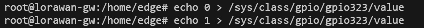

### 4.6 AIN Debugging

Refer to Section 2.3.6 for wiring definitions and Section 2.3.15 for hardware interface definitions.

| Port number | Device description file |
| :--- | :--- |
| AIN1 | /dev/ain1 |
| AIN2 | /dev/ain2 |

To read the AIN current value, you can use**cat "device description file".**

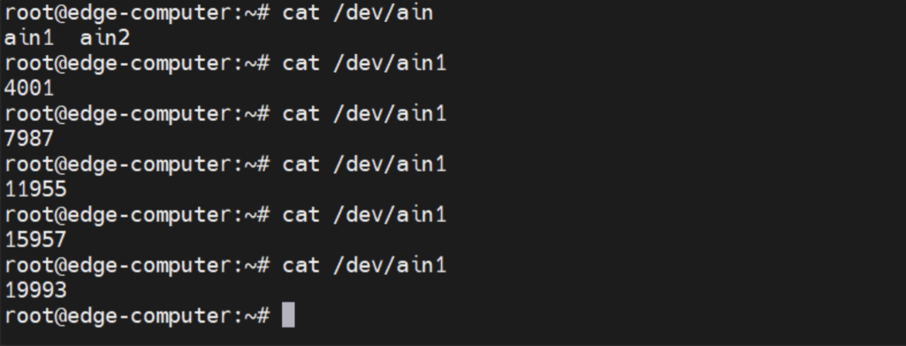

The return value indicates the current channel current value in microamperes (uA).

### 4.7 SuperCapacitor

### 4.7.1 Specification

#### 4.7.1.1 Capacitor Specifications

The specifications of the supercapacitor are: 10.8V/5F.

#### 4.7.1.2 Power-Off Retention

The power-off holding module can maintain system operation for 20-30S after power failure depending on the load conditions.

### 4.7.2 Functions

#### 4.7.2.1 Power Failure Alarm

The EC300 supports the power-down alarm function. When the external power supply is disconnected, the system will send a UDP broadcast message ‘power\_down’ to port 9107 of IP address 255.255.255.255.

#### 4.7.2.2 Safe Shutdown

Power failure refers to the continuous disconnection of the external power supply for more than 0.5 seconds. After sending the UDP broadcast message, the system waits for 3 seconds and actively performs a power off.

## 5 Security

In this chapter, we will introduce the security mechanism of the LoRaWAN gateway EC300-LoRaWAN based on the ARM structure.

### 5.1 sudo Mechanism

In LG 312, the root user is disabled for better security. Sudo is a program that allows system administrators to allow approved users to execute commands as root or other users. The most basic principle is to give as few privileges as possible to get the job done. Using sudo is more secure than opening a session as root for a number of reasons, including:

Do not need to know the root password (sudo will prompt the current user's password), can grant ordinary user privileges

It is easy to run commands that require privileges through sudo, and the rest of the time, work as an unprivileged user, thereby reducing the damage that may be caused by incorrect operations.

### 5.2 Firewall

Netfileter/iptables (hereinafter referred to as iptables) is an excellent and completely free packet filtering-based firewall tool for nuix/linux systems. It is very powerful and flexible in use. It can finely control the incoming, outgoing and flowing data packets through the server.

### 5.3 TPM2.0

TPM stands for "Trusted Platform Module" and it is a hardware security module designed to provide security and encryption capabilities for computer systems. It is a secure microcontroller that can be embedded in a computer system or sold as a standalone hardware device. It contains a cryptographic coprocessor for storing encryption keys, digital certificates, and other secure data, as well as supporting multiple cryptographic algorithms and security protocols. On EC300, the standard TPM2 protocol stack and TPM2 tools have been integrated for user use.

ARM computers provide TPM2.0 hardware support and are pre-installed with the tpm2-tools tool, which can be used to test and verify TPM2.0.

Generate random numbers

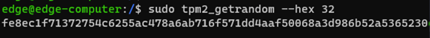

NOTE

For more information on how to use tpm2-tools, please refer to [https://tpm2-tools.readthedocs.io/en/latest/](https://tpm2-tools.readthedocs.io/en/latest/)

## 6 System Restore Factory Settings and Update

In this chapter, we will introduce how to restore factory settings and update the LoRaWAN gateway EC300-LoRaWAN based on the Arm structure.

This chapter includes the following:

### 6.1 Factory Reset

There are two ways to restore factory settings:

1. By typing the command, the system will automatically restart and restore the factory settings.


1. Restore factory settings by pressing the button:

- Long press the restore factory settings button for 10-20s, and see the warn light on.
- When The warn light is on, release the key.
- After releasing the button, the system starts to restart after the warn light flashes several times and performs a factory reset
- After the system restarts, the warn light flashes and the status goes out. After about 30s, when both the warn light and the error light stop flashing and the status starts flashing at the same time, the system completes the factory reset.

## 7 Programming Guide

EC300-LoRaWAN provides a device information description file in JSON format. Customers who need to operate peripherals such as IO,LED and serial ports can obtain the device node information of these peripherals by querying the device description information file.

Device description file path: `/tmp/ieos/etc/system_info.json`, as follows:

```json
{
    "device_info":{
        "model_info": {
           "model": "EC312",
           "pn": "B-LQA3",
           "sn": "CL3122402000012",
           "oem": "inhand",
           "features": "std;cell-LQA3;gps;"
       },
       "software_info": {
           "boot_loader": "V1.0.4",
           "kernel": "5.10.168",
           "version": "V2.0.2-beta2",
           "os": "Debian GNU/Linux 11"
       },
        "hardware_info":{
            "arch": "aarch64",
            "soc": "k3",
            "interface":{
              "eth": [
                   {
                  "iface_name":"eth1",
                     "iface_mac": "e2:29:3f:03:3f:f6"
                   },
                   {
                   "iface_name":"eth2",
                     "iface_mac": "e2:29:3f:03:3f:f7"
                   },
                   {
                    "iface_name":"eth3",
                     "iface_mac": "e2:29:3f:03:3f:f8"
                   },
                   {
                    "iface_name":"eth4",
                     "iface_mac": "e2:29:3f:03:3f:f9"
                   }
                 ],
                "wlan": [
                    {
                       "iface_name":"wlan0",
                       "iface_mac":"e6:29:3f:03:2f:f9"
                    },
                    {
                       "iface_name":"wlan1",
                       "iface_mac":"e6:29:3f:03:2f:f8"
                    }
                ],
                "ble":[
                 {
                     "iface_name":"hci0",
                        "iface_mac":"e6:39:3f:03:4f:f8"
                   },
                   {
                     "iface_name":"hci1",
                        "iface_mac":"e6:39:3f:03:4f:f9"
                   }
                ],
                "can": [
                   {
                        "iface_name": "can1"
                   },
                   {
                        "iface_name": "can2"
                   },
                   {
                        "iface_name": "can3"
                   }
               ]
            },
            "gpio":[
                {
                  "gpio_name": "cellular_power",
                  "dev_node": "/sys/class/gpio/gpio0"
                },
                {
                  "gpio_name": "sim_switch",
                  "dev_node": "/sys/class/gpio/gpio19"
                },
                {
                  "gpio_name":"msata_power",
                  "dev_node": "/sys/class/gpio/gpio20"
                },
                {
                  "gpio_name":"gnss_power",
                  "dev_node": "/sys/class/gpio/gpio110"
                },
                {
                  "gpio_name":"ble_power",
                  "dev_node":"/sys/class/gpio/gpio220"
                }
            ],
            "user_key":[
                 {
                     "user_key_name":"user1",    // The name matches the panel
                     "dev_node":"/sys/class/gpio/gpio50"
                 },
                 {
                     "user_key_name":"user2",
                     "dev_node":"/sys/class/gpio/gpio51"
                 }    
            ],
            "uart":[
                {
                 "uart_name":"com1",    // The name matches the panel
                   "dev_node":"/dev/ttyS1"
                },
                {
                 "uart_name":"com2",
                   "dev_node":"/dev/ttyS2"
                },
                {
                 "uart_name":"com3",
                   "dev_node":"/dev/ttyS3"
                },
                {
                  "uart_name":"com4",
                   "dev_node":"/dev/ttyS4"
                }
            ],
            "led":[
                {
                  "led_name": "user1",   // The name matches the panel
                  "dev_node": "/sys/class/leds/user1"
                },
                {
                  "led_name": "user2",
                  "dev_node": "/sys/class/leds/user2"
                },
                {
                  "led_name": "cell",
                  "dev_node": "/sys/class/leds/cell"
                },
                {
                   "led_name": "sim1",
                   "dev_node": "/sys/class/leds/sim1"
                },
                {
                   "led_name": "sim2",
                   "dev_node": "/sys/class/leds/sim2"
                },
                {
                   "led_name": "error",
                   "dev_node": "/sys/class/leds/error"
                },
                {
                   "led_name": "warn",
                   "dev_node": "/sys/class/leds/warn"
                },
                {
                   "led_name": "status",
                   "dev_node": "/sys/class/leds/status"
                },
                {
                   "led_name": "level1",
                   "dev_node": "/sys/class/leds/level1"
                },
                {
                   "led_name": "level2",
                   "dev_node": "/sys/class/leds/level2"
                },
                {
                   "led_name": "level3",
                   "dev_node": "/sys/class/leds/level3"
                } 
            ],
            "io":{
                "di": [
                    {
                       "di_name":"di1",  // The name matches the panel
                       "dev_node":"/sys/class/gpio/gpio1"
                    },
                    {
                       "di_name":"di2",
                       "dev_node":"/sys/class/gpio/gpio2"
                    }
                ],
                "do": [
                   {
                      "do_name":"do1",     // The name matches the panel
                      "dev_node": "/sys/class/gpio/gpio11"
                   },
                   {
                      "do_name":"do2",
                      "dev_node":"/sys/class/gpio/gpio12"
                   }
                ]
            }
        }
    }
}
```

### 7.1 IO Programming Guide

At present, there are a total of 8 IO interfaces on the device: for example, DI1 ~ DI4 on the device panel are 4 input pins; DO1 ~ DO4 are 4 output pins.

According to the device description information file `/tmp/ieos/etc/system_info.json`the I/O device node can be obtained as follows:

When you need to program the IO interface, you can directly operate the value value under the background device node ( \*\*sys/class/gpio/gpioxxx/value \*\*)

Case:

When DO1 needs to output high level, it can directly \*\*sys/class/gpio/gpio323/value write 1 \*\*

`echo 1 &gt; /sys/class/gpio/gpio323/value`

When you need to check the level of DI1, you can also check it directly. \*\*sys/class/gpio/gpio454/value \*\*the value

`cat /sys/class/gpio/gpio454/value`

Full shell script:

```plain
#!/bin/bash

gpio323="/sys/class/gpio/gpio323/value"
gpio453="/sys/class/gpio/gpio453/value"
gpio465="/sys/class/gpio/gpio465/value"
gpio461="/sys/class/gpio/gpio461/value"
## To output a high voltage from DO1, simply write '1' to the sys/class/gpio/gpio323/value file
if [ -f "$gpio323" ]; then
    echo 1 > /sys/class/gpio/gpio323/value
else
    echo "no file exit "$gpio323
fi

## To output a low voltage from DO1, simply write '0' to the sys/class/gpio/gpio323/value file
if [ -f "$gpio323" ]; then
    echo 0 > $gpio323
else
    echo "no file exit "$gpio323
fi

gpio454="/sys/class/gpio/gpio454/value"
gpio455="/sys/class/gpio/gpio455/value"
gpio456="/sys/class/gpio/gpio456/value"
gpio457="/sys/class/gpio/gpio457/value"
## To check the DI1 signal level, simply read the value at sys/class/gpio/gpio454/value
if [ -f "$gpio454" ]; then
    cat $gpio454
else
    echo "no file exit "$gpio454
fi


```

### 7.2 Led Programming Guide

Users on the device can use USER1,USER2,USER3 and USER4 four lights for status prompts, please check the light sign to confirm the position of the light.

According to the device description information file `/tmp/ieos/etc/system_info.json`the corresponding device node of LED can be obtained as follows:

user1:/sys/class/leds/user1

user2:/sys/class/leds/user2

user3:/sys/class/leds/user3

user4:/sys/class/leds/user4

There are some control files in the/sys/class/leds/user1 directory to control the properties and status of LED:

/sys/class/leds/user1/brightness: This file is used to control the USER1 light on or off. Writing 1 is always on, writing 0 is always off.

/sys/class/leds/user1/trigger: the trigger of the LED light, which can be written to timer to trigger the timer, and written to none to cancel the trigger.

/sys/class/leds/user1/delay\_on: This file represents the time in ms when the LED light is on.

/sys/class/leds/user1/delay\_off: This file indicates the time, in ms, that the LED light is off.

If the trigger is configured as a scheduled trigger, the value in brightness is no longer valid and is automatically changed to 0.

Replacing user1 with user2 in the file path controls the operation of the USER2 lamp, and the same applies to USER3 and user4.

Case:

When the USER1 light is required to be on, write 1 to the brightness file

`echo 1 &gt; /sys/class/leds/user1/brightness`

When the USER1 light needs to flash, write the timer to the trigger file, and control the on and off time through delay\_on and delay\_off

```plain
## Start timer
echo timer > /sys/class/leds/user1/trigger

## Lights up for 1 second
echo 1000 > /sys/class/leds/user1/delay_on

## Off for 1 second
echo 1000 > /sys/class/leds/user1/delay_off
```

Full shell script:

```plain
#!/bin/bash

USER1_BRIGTHNESS="/sys/class/leds/user1/brightness"
USER1_TRIGGER="/sys/class/leds/user1/trigger"
USER1_DELAY_ON="/sys/class/leds/user1/delay_on"
USER1_DELAY_OFF="/sys/class/leds/user1/delay_off"

## Turn on the USER1 light
if [ -f "$USER1_BRIGTHNESS" ]; then
    echo 1 > $USER1_BRIGTHNESS
else
    echo "no file exit "$USER1_BRIGTHNESS
fi

## Set USER1 light to flash
if [ -f "$USER1_TRIGGER" ]; then
    echo timer > $USER1_TRIGGER
else
    echo "no file exit "$USER1_TRIGGER
fi

## Set the USER1 light to be on for 1000ms
if [ -f "$USER1_DELAY_ON" ]; then
    echo 1000 > $USER1_DELAY_ON
else
    echo "no file exit "$USER1_DELAY_ON
fi

## Set USER1 light to off for 1000ms
if [ -f "$USER1_DELAY_OFF" ]; then
    echo 1000 > $USER1_DELAY_OFF
else
    echo "no file exit "$USER1_DELAY_OFF
fi

## Stop USER1 from flashing
if [ -f "$USER1_TRIGGER" ]; then
    echo none > $USER1_TRIGGER
else
    echo "no file exit "$USER1_TRIGGER
fi
```

### 7.3 Cross Compilation

The user's own `c/c++`the program can be cross-compiled on the development machine using the cross-compilation tool chain, and then the target file is uploaded to the EC300-LoRaWAN device for execution.

Cross compilation tool compression package: `gcc-linaro-6.3.1-2017.05-x86_64_aarch64-linux-gnu.tar.gz`

How to configure environment variables for the cross-compilation toolchain:

1. On the development machine, decompress the gcc-linaro-6.3.1-2017.05-x86\_64\_aarch64-linux-gnu.tar.gz to the/opt PATH (you can also decompress to other paths, and make corresponding adjustments when setting the PATH environment variable in step 2)
2. Edit `~/.bashrc`file, adding a line to the end of the file `PATH=$PATH:/opt/gcc-linaro-6.3.1-2017.05-x86_64_aarch64-linux-gnu/bin`
3. Execution `source ~/.bashrc`enables environment variables to take effect in the current terminal; The newly opened terminal automatically takes effect.

Take the classic hello world program as an example to illustrate, create the following directories and files

```shell
mkdir ~/example
touch ~/example/hello.c
touch ~/example/Makefile
```

`~/example/hello.c`the contents of the file are as follows:

```c
#include <stdio.h>

int main(void) 
{
        printf("hello, world!\n");
        return 0;
}
```

`~/example/Makefile`the contents of the file are as follows:

```makefile
## Define the target file name and source file name
TARGET  := hellworld
DIRS    := $(shell find . -maxdepth 3 -type d) 
SRCS    := $(foreach dir,$(DIRS),$(wildcard $(dir)/*.c))
OBJS    := $(SRCS:.c=.o)


CC=aarch64-linux-gnu-gcc

## Defining compiler and compilation options
CFLAGS  := -Wall -Wextra -g -Wno-unused-parameter

## Defining a default target
all: $(TARGET)

## Define target file dependencies and compilation commands
$(TARGET): $(OBJS)
        $(CC) $(CFLAGS) $(LIBS) $^ -o $@ 

## Defines commands for compiling source files into target files
%.o: %.c
        $(CC) $(CFLAGS) $(LIBS) -c $< -o $@

## Defines the command to clear temporary files
clean:
        rm -f $(TARGET) $(OBJS)

## Declare a pseudo target ".PHONY"
.PHONY: all clean
```

In `~/example`execute make under the Directory to generate the target file. `helloworld`

### 7.4 Watchdog Programming

- There is an external hardware watchdog on the device, and the device will restart without feeding the dog for 60 seconds.
- You can disable the watchdog program of the system and feed the dog in your own program so that the device can restart when the program is abnormal.
- Use this command to shut down the system watchdog: `systemctl stop watchdog`
- Example watchdog program:

```c
#include <fcntl.h>
#include <unistd.h>
#include <stdlib.h>
#include <stdio.h>
#include <string.h>
#include <signal.h>
#include <sys/types.h>
#include <sys/stat.h>

static int fd = 0;

/* Signal processing function */
void signal_handler(int signal)
{
    /* Turn off the watchdog. If you do not feed the watchdog after turning it off, the device will restart after 60 seconds */
    write(fd, "V", 1);
    close(fd);
    exit(0);
}

int main(int argc, char **argv)
{
    /* Open the watchdog through open */
    fd = open("/dev/watchdog0", O_WRONLY);

    /* Register Kill Signal */
    signal(SIGTERM, signal_handler);
    
    while (1) {
        /* Use write to feed the dog */
        write(fd, "\0", 1); 

        /* Feed the dog every 10 seconds */
        sleep(10);
    }
}

```
