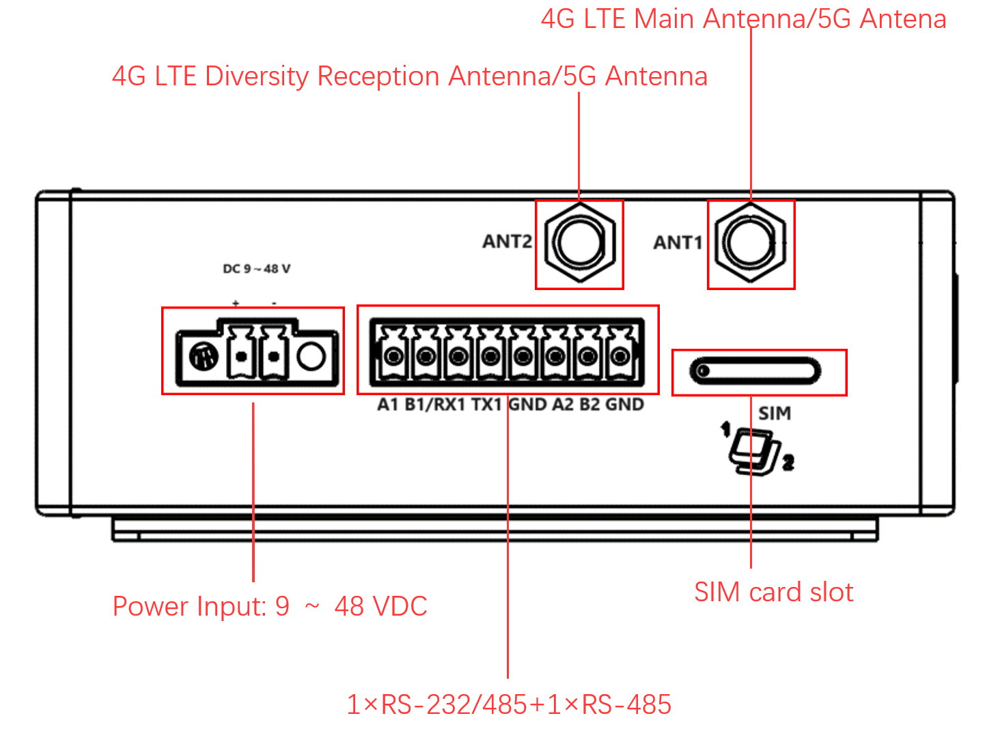
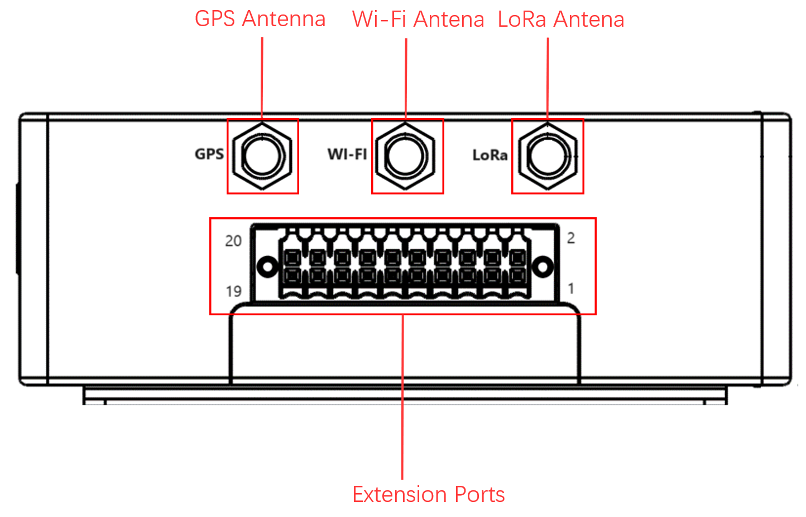
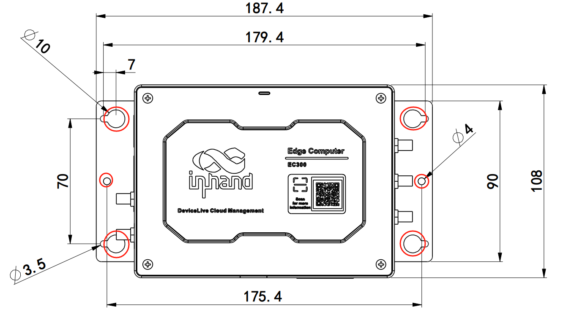
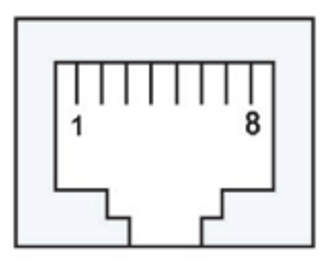
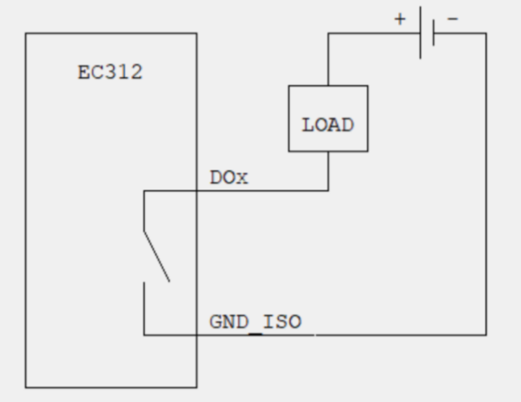
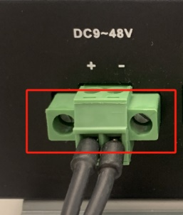
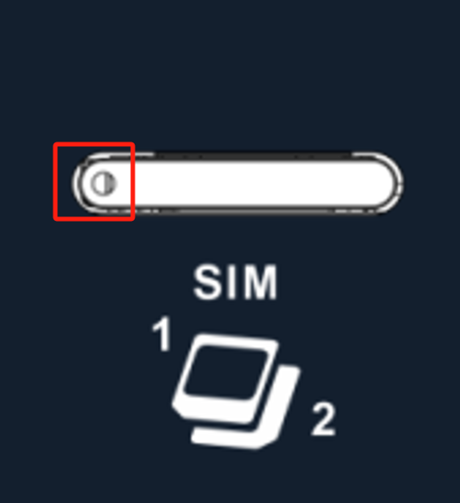

Edge computer EC300 series 

Quick Start Guide 

Version 1.0 May 2024 

[www.inhand.com](http://www.inhand.com) 

The software described in this manual is provided under a license agreement and can only be used in accordance with the terms of that agreement. 

Copyright Statement

© 2024 InHand Network reserves all rights. 

Trademark 

The InHand logo is a registered trademark of InHand Network. 

All other trademarks or registered trademarks in this manual belong to their respective manufacturers. 

Disclaimers

Our company reserves the right to make changes to this manual, and any subsequent changes to the product will not be notified separately. We are not responsible for any direct, indirect, intentional or unintentional damage or hidden dangers caused by improper installation or use. 

# 1 Product Introduction

EC312 series edge computers are designed for users who develop lightweight edge applications. It has rich interfaces and can expand various functions such as serial port, CAN, analog input, etc. Built in Linux system, providing long-term support to meet industrial automation needs. Support security features such as Secure Boot and TPM2.0 to ensure software and data security. Built in InHand DeviceSupervisor™ Agent services enable easy data collection, processing, and cloud deployment, supporting DeviceLive cloud management.

# 2 Packing list 

| Number | Name | Quantity | Remarks |
| --- | --- | --- | --- |
| 1 | EC312 Host | 1 | — |
| 2 | Power Adapter | 1 | Optional Equipment |
| 3 | Wi-Fi Antenna | 1 | Standard Equipment (Depending on the device model) |
| 4 | GPS Antenna | 1 | Standard Equipment (Depending on the device model) |
| 5 | Cellular Antenna | 1 | Standard Equipment (Depending on the device model) |
| 6 | Card Needle | 1 | — |
| 7 | Warranty Card | 1 | — |

# 3 Product Appearance 

The panel layout of EC312 is as follows: 

## 3.1 Front panel

## 3.2 Left panel 

## 3.3 Right panel 

# 4 Description of indicator lights 

| Signage | Name | Definition |
| --- | --- | --- |
| PWR | Power indicator | Power on and always on |
| STATUS | System operating status indicator light | When the system starts normally, the STATUS flashes. If the system fails to start due to an exception in the system startup phase, or when the factory recovery operation has not been completed, STATUS is solid off. |
| WARN | Warning indicator light | When the system has a warning abnormality, the WARN light flashes. Warning abnormalities include: the factory reset has not been completed; and the dialing abnormality (the cellular function needs to be turned on). |
| NET | Cellular connection status indicator | Keep on after successful dialing |
| User1 | User programmable indicator LED 1 | It is off by default and can be controlled by user programming |
| User2 | User programmable indicator LED 2 | It is off by default and can be controlled by user programming |
| User3 | User programmable indicator LED 3 | It is off by default and can be controlled by user programming |
| User4 | User programmable indicator LED 4 | It is off by default and can be controlled by user programming |

# 5. Install EC312 

## 5.1 DIN rail installation

The installation plate of the DIN rail is attached to the EC312 rear panel (fixed with M3 × 6MM screws). The installation steps are as follows:   
1. Clip the upper hook of the DIN rail installation plate into the top of the DIN rail bracket

2\. Slowly push the device forward towards the DIN rail bracket to ensure that the bottom end of the DIN rail clicks into place 

## 5.2 Wall mounted installation 

EC312 can be installed using a wall mounted kit, which needs to be purchased separately. Follow the steps below to install

Step 1: Use screws (M3 × 4mm) to secure the wall mounting kit to the back panel of EC312 

Step 2: After the wall mounted kit is successfully fixed to EC312, use an additional 4 M8 and 2 M3 screws to secure EC312 to the wall or cabinet

# 6 Connector Description 

## 6.1 Ethernet interface 

EC300 has 2 RJ45 Ethernet ports and supports 10M/100M adaptive speed. The pin description of RJ45 is as follows: 

10/100Mbps   

| Pin | Description |
| --- | --- |
| 1 | TX+ |
| 2 | TX- |
| 3 | RX+ |
| 4 | — |
| 5 | — |
| 6 | RX- |
| 7 | — |
| 8 | — |

## 6.2 Serial port 

EC300 supports up to four serial ports: two standard serial ports and two expandable serial ports. 

Standard serial port:

COM1 (standard): RS-232/RS-485 (RX1 TX1/A1 B1), at the same time, you can only choose to connect to RS-232 or RS-485, they cannot be connected to work at the same time. 

COM2 (standard): RS-485 (A2 B2)   

| Pin | COM1 | COM2 |
| --- | --- | --- |
|  | **RS-232** | **RS-485** | **RS485** |
| A1 | — | A+ | — |
| B1 | — | B- | — |
| RX1 | RX | — | — |
| TX1 | TX | — | — |
| GND | GND | GND | — |
| A2 | — | — | A+ |
| B2 | — | — | B- |
| GND | — | — | GND |

  

Scalable serial port: 

COM3 (Extension): RS232/RS485 (Extension Interface PIN1 Extension Interface PIN2) COM4 (Extension): RS232/RS485 (Extension Interface PIN5 Extension Interface PIN6)  

**Remark:**

**The specific support for expandable serial ports also depends on the model of the expansion module. For details,** **please refer to the** **[Extension Interface](https://help.inhand.com/portal/en/kb/articles/ec312-quick-start-guide-v1-0#612Extension_Interface)** **section.**

## 6.3 CAN port   

    

EC300 has a 3-way CAN bus interface and supports the CAN 2.0A/B standard. It is compatible with CAN FD and can reach a maximum speed of 5Mbps. 

CAN1: Extension Interface PIN1 Extension Interface PIN2 

CAN2: Extension Interface PIN5 Extension Interface PIN6

CAN3: Extension Interface PIN9 Extension Interface PIN10   

**Remark:**

**The support for CAN** **interface expansion also depends on the model of the expansion module**. For **details****,** **please refer to the** **[Extension Interface](https://help.inhand.com/portal/en/kb/articles/ec312-quick-start-guide-v1-0#612Extension_Interface)** **section**.   

## 6.4 Digital input interface   

| Parameter | Description | Min | Type | Max | Unit |
| --- | --- | --- | --- | --- | --- |
| Vds | Drain source voltage |  |  | 48 | V |
| VIN Low | Maximal input voltage recongnized as LOW |  |  | 3 | V |
| VIN High | Minimal input voltage recognized as HIGH | 10 |  | 30 | V |

  

| Interface identification | Features | Description |
| --- | --- | --- |
| GND | Power reference ground | 4 digital input DI,  Wet contact state  "1":+10~+30V/-30 ~ -10VDC  "0": 0 ~ +3V/-3 ~ 0V  Isolate 3000VDC |
| DICOM | Input public side |
| DI0 | Digital input port 0 |
| DI1 | Digital input port number 1 |
| DI2 | Digital input port number 2 |
| DI3 | Digital input port number 3 |

  

The wiring method is as follows (only supports wet node wiring): 

## 6.5 Digital output interface 

| Interface identification | function | describe |
| --- | --- | --- |
| DO0 | Digital output interface 0 | 4-way DO OD output, isolated 3000VDC |
| DO1 | Digital output interface No.1 |
| DO2 | Digital output interface No.2 |
| DO3 | Digital output interface No.3 |
| GND | Grounding terminal |

The wiring method is as follows:

**Remark:**

**The support for digital input/output interfaces also depends on the model of the expansion module. For details, please refer to the** **[Extension Interface](https://help.inhand.com/portal/en/kb/articles/ec312-quick-start-guide-v1-0#612Extension_Interface)** **section**  

## 6.6 USB interface 

EC300 provides a USB 2.0 Host interface, mainly used for expanding storage devices. Supports hot swapping of USB storage devices.  

**Attention:**

**Before disconnecting a USB** **mass storage device, remember to enter the sync** **synchronization command to prevent data loss.** **When you disconnect the storage device, please exit from the mounting directory.**  

## 6.7 User programmable button

EC300 provides an API interface, which users can call to detect the status of programmable buttons and then implement their own button logic. 

## 6.8 DC Input

EC312 supports 9-48V DC power supply. Insert the adapter terminal into the DC port of EC312 and connect the power adapter. When the PWR power indicator light remains on, it indicates that the device has been powered on normally. 

## 6.9 SIM card

EC312 is equipped with a SIM card holder for cellular communication, located below the left panel. Supports 2 NANO SIM cards. The installation steps are as follows:

Step 1: The SIM card of EC312 needs to be installed in the event of a power outage. Please ensure that the device power has been disconnected before installation 

Step 2: Before installation, the SIM card holder needs to be removed using a card reader (included in the factory)

Step 3: Insert the NANO SIM card, which has two card slots located above and below the drawer style card holder 

## 6.10 MicroSD card 

EC312 is equipped with an SD card slot for extended storage, located below the front panel. Before use, please open the protective cover and insert the SD card into the SD card slot. 

  

## 6.11 Antenna interface 

The EC300 has five antenna interfaces in total, and the number of standard antennas for different models is different. See the "Ordering Information" section of the EC312 Series Edge Computer Product Specification for the antenna support for specific models.   

| Identification | Name |
| --- | --- |
| ANT1 | 4G LTE main antenna/5G antenna |
| ANT2 | 4G LTE diversity receive antenna/5G antenna |
| GPS | GPS antenna |
| Wi-Fi | Wi Fi antenna |

  

The product model shown below is EC312-B-LQA3, which only supports one 4G antenna interface. Screw the antenna into the corresponding SMA antenna interface to complete the antenna installation. 

## 6.12 Extension Interface 

EC300 can support interface expansion. Please refer to the product specification for selection instructions. The currently supported expansion modules are as follows:   

| Expansion module | function |
| --- | --- |
| NAAD | 2x 4-20mA analog input+4x DI+4x DO |
| N44C | 2x RS-485+1x CAN FD |
| N4CC | 1x RS-485+2x CAN FD |
| N44D | 2x RS-485+4x DI+4x DO |
| — | NONE |

  

The definition of the extension interface is as follows: 

  

| PIN | Extension module |
| --- | --- |
| **NAAD** | **N44C** | **N4CC** | **N44D** |
| **Interface Definition** |
| 1 | AIN1+ | A\_485\_A | A\_485\_A | A\_485\_A |
| 2 | \- | A\_485\_B | A\_485\_B | A\_485\_B |
| 3 | AIN1- | \- | \- | \- |
| 4 | GND | GND | GND | GND |
| 5 | AIN2+ | B\_485\_A | CAN2\_H | B\_485\_A |
| 6 | \- | B\_485\_B | CAN2\_L | B\_485\_B |
| 7 | AIN2- | \- | \- | \- |
| 8 | GND | GND | GND | GND |
| 9 | \- | CAN3\_H | CAN3\_H | \- |
| 10 | \- | CAN3-L | CAN3-L | \- |
| 11 | DO0 | \- | \- | DO0 |
| 12 | DO1 | \- | \- | DO1 |
| 13 | DO2 | \- | \- | DO2 |
| 14 | DO3 | \- | \- | DO3 |
| 15 | DI0 | \- | \- | DI0 |
| 16 | DI1 | \- | \- | DI1 |
| 17 | DI2 | \- | \- | DI2 |
| 18 | DI3 | \- | \- | DI3 |
| 19 | DI\_COM | \- | \- | DI\_COM |
| 20 | GND | \- | \- | GND |

# 7 Power and Environmental requirements   

| Input voltage | 9-48 VDC (dual pin terminals, V+, V -) |
| --- | --- |
| **Power consumption** | 6W |
| **Working temperature** | \-20-70℃（\-4°F-158°F） |
| **Storage temperature** | \-40-85℃（\-40°F-185°F） |
| **Environmental humidity** | 5-95% (without frost) |

# 8 Accessing EC312 

Connect to EC300 using the following default IP address.   

| Port | Default IP |
| --- | --- |
| ETH 1 | 192.168.3.100/24 |
| ETH 2 | 192.168.4.100/24 |

Step 1: Interconnect PC and EC312 

As shown in the following figure, plug one end of the network cable into the ethernet port of EC312, insert the example in the figure into port 2, and plug the other end into the network port of the computer. At the same time, set the IP address of the computer to the same network segment address as the device interface

Step 2: Manage EC312

Method 1: Use native Linux commands for network and system management by   
clicking on the link [http://www.chiark.greenend.org.uk/~sgtatham/putty/download.html](http://www.chiark.greenend.org.uk/~sgtatham/putty/download.html), download PuTTY (free software), and establish the connection with the edge computer EC312 in the way of SSH command in the Windows environment. The default username for logging in is on the device's backplane

The following figure is an example of using SSH connection: 

  

Method 2: Network and system management through WEB

EC312 supports IEOS based web interface management. IEOS is a self-developed network management and system management program developed by InHand that runs on Linux systems. IEOS can provide web interface services

IEOS uses port 9100 as the HTTPS connection port and does not support access through HTTP; When users access the web using HTTP, they will automatically redirect to using HTTPS. This document takes the default address 192.168.4100 of eth2 as an example for explanation. 

Login address: [https://192.168.4.100:9100](https://192.168.4.100:9100)

Initial login account: adm 

Initial login password: 123456 

The following figure is an example of using a web connection: 

  
  

**Remark :  
Not all** **EC312** **models support the WEB** **interface management function. For specific support, see the "Ordering Guide" section of the** **EC312 Series Edge Computer\_Prdt Spec****.**