# EC312 Quick Start Guide_V1.0

**Edge computer EC300 series**

**Quick** **Start Guide**

Version 1.0 January 2026

[www.inhand.com](http://www.inhand.com/)

The software described in this manual is provided under a license agreement and can only be used in accordance with the terms of that agreement.

**Copyright Statement**

© 2024 InHand Network reserves all rights.

**Trademark**

The InHand logo is a registered trademark of InHand Network.

All other trademarks or registered trademarks in this manual belong to their respective manufacturers.

**Disclaimers**

Our company reserves the right to make changes to this manual, and any subsequent changes to the product will not be notified separately. We are not responsible for any direct, indirect, intentional or unintentional damage or hidden dangers caused by improper installation or use.

## **1 Product Introduction**

EC312-LoRaWAN series edge computers are designed for users who develop lightweight edge applications. It has rich interfaces and can expand various functions such as serial port, CAN, analog input, etc. Built in Linux system, providing long-term support to meet industrial automation needs. Support security features such as Secure Boot and TPM2.0 to ensure software and data security. Built in InHand DeviceSupervisor™ Agent services enable easy data collection, processing, and cloud deployment, supporting DeviceLive cloud management.

## **2 Packing list**

| **Number** | **Name** | **Quantity** | **Remarks** |
| :---: | --- | :---: | --- |
| 1 | EC312-LoRaWAN Host | 1 | — |
| 2 | Power Adapter | 1 | Optional Equipment |
| 3 | Wi-Fi Antenna | 1 | Standard Equipment (Depending on the device model) |
| 4 | GPS Antenna | 1 | Standard Equipment (Depending on the device model) |
| 5 | Cellular Antenna | 1 | Standard Equipment (Depending on the device model) |
| 6 | LoRa Antenna | 1 | Standard Equipment (Depending on the device model) |
| 7 | Card Needle | 1 | — |
| 8 | Warranty Card | 1 | — |

## **3 Product Appearance**

The panel layout of EC312-LoRaWAN is as follows:

### **3.1 Front panel**

### **3.2 Left panel**

### **3.3 Right panel**

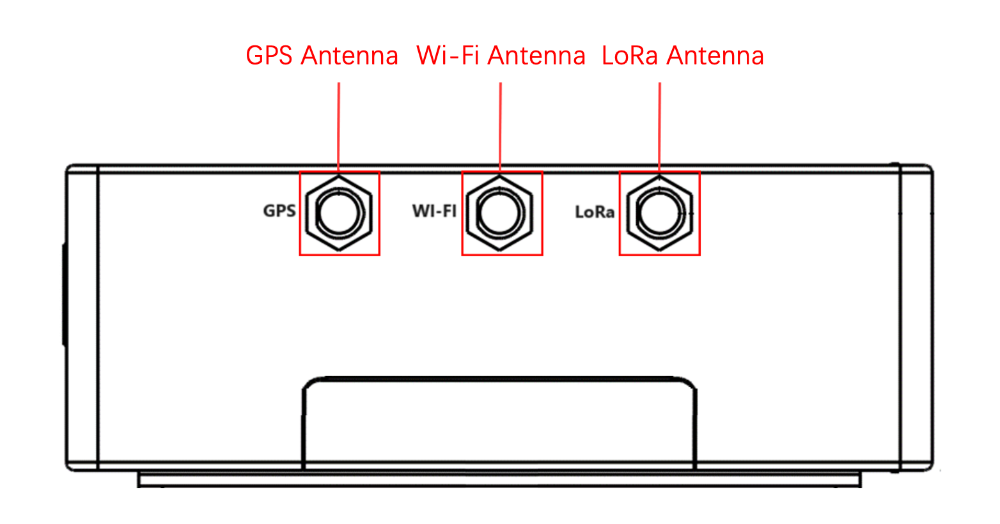

## 4 Description of indicator lights

| **Signage** | **Name** | **Definition** |
| --- | --- | --- |
| PWR | Power indicator | Power on and always on |
| STATUS | System operating status indicator light | When the system starts normally, the STATUS flashes. If the system fails to start due to an exception in the system startup phase, or when the factory recovery operation has not been completed, STATUS is solid off. |
| WARN | Warning indicator light | When the system has a warning abnormality, the WARN light flashes. Warning abnormalities include: the factory reset has not been completed; and the dialing abnormality (the cellular function needs to be turned on). |
| NET | Cellular connection status indicator | Keep on after successful dialing |
| User1 | User programmable indicator LED 1 | It is off by default and can be controlled by user programming |
| User2 | User programmable indicator LED 2 | It is off by default and can be controlled by user programming |
| User3 | User programmable indicator LED 3 | It is off by default and can be controlled by user programming |
| User4 | User programmable indicator LED 4 | It is off by default and can be controlled by user programming |

## **5. Install EC312-LoRaWAN**

### **5.1 DIN rail installation**

The installation plate of the DIN rail is attached to the EC312-LoRaWAN rear panel (fixed with M3 × 6MM screws). The installation steps are as follows:

1. Clip the upper hook of the DIN rail installation plate into the top of the DIN rail bracket
2. Slowly push the device forward towards the DIN rail bracket to ensure that the bottom end of the DIN rail clicks into place

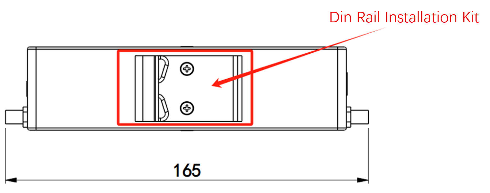

### **5.2 Wall mounted installation**

EC312-LoRaWAN can be installed using a wall mounted kit, which needs to be purchased separately. Follow the steps below to install

Step 1: Use screws (M3 × 4mm) to secure the wall mounting kit to the back panel of EC312-LoRaWAN

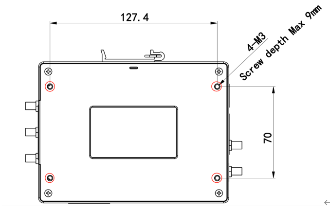

Step 2: After the wall mounted kit is successfully fixed to EC312-LoRaWAN, use an additional 4 M8 and 2 M3 screws to secure EC312-LoRaWAN to the wall or cabinet

## **6 Connector Description**

### **6.1 Ethernet interface**

EC300 has 2 RJ45 Ethernet ports and supports 10M/100M adaptive speed. The pin description of RJ45 is as follows:

**10/100Mbps**

| **Pin** | **Description** |
| --- | --- |
| 1 | TX+ |
| 2 | TX- |
| 3 | RX+ |
| 4 | — |
| 5 | — |
| 6 | RX- |
| 7 | — |
| 8 | — |

### **6.2 Serial port**

EC300 supports up to four serial ports: two standard serial ports and two expandable serial ports.

**Standard serial port:**

COM1 (standard): RS-232/RS-485 (RX1 TX1/A1 B1), at the same time, you can only choose to connect to RS-232 or RS-485, they cannot be connected to work at the same time.

COM2 (standard): RS-485 (A2 B2)

| **Pin** | **COM1** | **COM2** |  |
| --- | --- | --- | --- |
|  | **RS-232** | **RS-485** | **RS485** |
| A1 | — | A+ | — |
| B1 | — | B- | — |
| RX1 | RX | — | — |
| TX1 | TX | — | — |
| GND | GND | GND | — |
| A2 | — | — | A+ |
| B2 | — | — | B- |
| GND | — | — | GND |

### **6.2 USB interface**

EC300 provides a USB 2.0 Host interface, mainly used for expanding storage devices. Supports hot swapping of USB storage devices.

**Attention:**

**Before disconnecting a USB** **mass storage device, remember to enter the sync** **synchronization command to prevent data loss.** **When you disconnect the storage device, please exit from the mounting directory.**

### **6.3 User programmable button**

EC300 provides an API interface, which users can call to detect the status of programmable buttons and then implement their own button logic.

### **6.4 DC Input**

EC312-LoRaWAN supports 9-48V DC power supply. Insert the adapter terminal into the DC port of EC312-LoRaWAN and connect the power adapter. When the PWR power indicator light remains on, it indicates that the device has been powered on normally.

### **6.5 SIM card**

EC312-LoRaWAN is equipped with a SIM card holder for cellular communication, located below the left panel. Supports 2 NANO SIM cards. The installation steps are as follows:

Step 1: The SIM card of EC312-LoRaWAN needs to be installed in the event of a power outage. Please ensure that the device power has been disconnected before installation

Step 2: Before installation, the SIM card holder needs to be removed using a card reader (included in the factory)

Step 3: Insert the NANO SIM card, which has two card slots located above and below the drawer style card holder

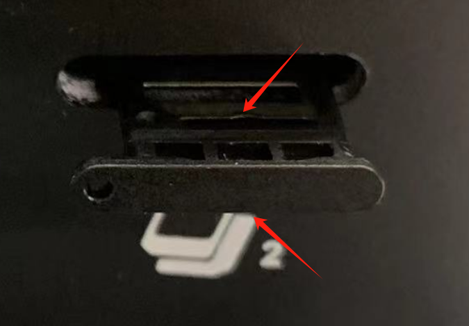

### **6.6 MicroSD card**

EC312-LoRaWAN is equipped with an SD card slot for extended storage, located below the front panel. Before use, please open the protective cover and insert the SD card into the SD card slot.

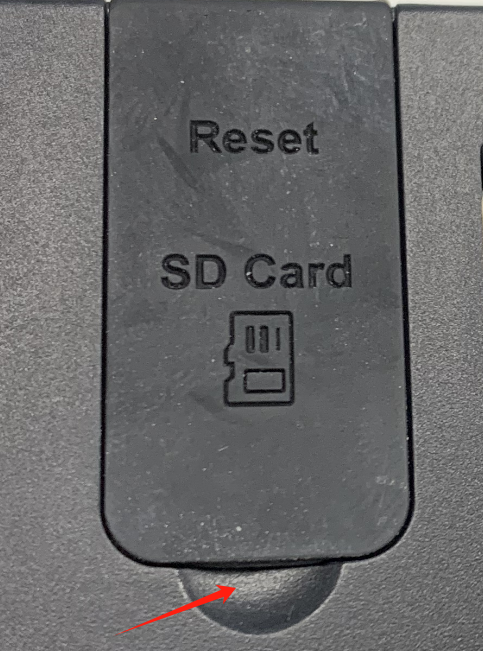 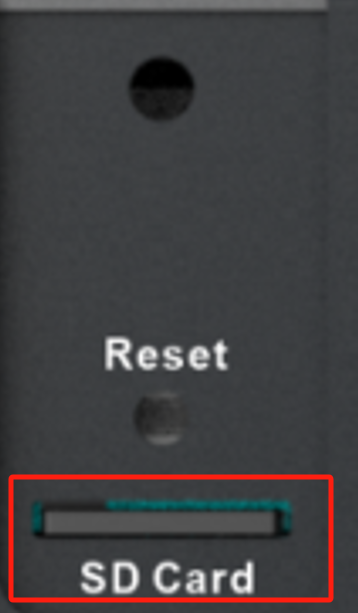

### **6.7 Antenna interface**

The EC300 has five antenna interfaces in total, and the number of standard antennas for different models is different. See the "Ordering Information" section of the EC312-LoRaWAN Series Edge Computer Product Specification for the antenna support for specific models.

| **Identification** | **Name** |
| --- | --- |
| ANT1 | 4G LTE main antenna/5G antenna |
| ANT2 | 4G LTE diversity receive antenna/5G antenna |
| GPS | GPS antenna |
| Wi-Fi | Wi-Fi antenna |
| LoRa | LoRa antenna |

The product model shown below is EC312-H-LQA3-L470, which only supports one 4G antenna interface. Screw the antenna into the corresponding SMA antenna interface to complete the antenna installation.

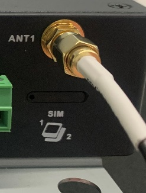

## **7 Power and Environmental requirements**

| **Input voltage** | 9-48 VDC (dual pin terminals, V+, V -) |
| --- | --- |
| **Power consumption** | 6W |
| **Working temperature** | -20-70℃（-4°F-158°F） |
| **Storage temperature** | -40-85℃（-40°F-185°F） |
| **Environmental humidity** | 5-95% (without frost) |

## **8 Accessing EC312-LoRaWAN**

Connect to EC300 using the following default IP address.

| **Port** | **Default** **IP** |
| --- | --- |
| ETH 1 | 192.168.3.100/24 |
| ETH 2 | 192.168.4.100/24 |

**Step** **1:** **Interconnect** **PC** **and** **EC312-LoRaWAN**

As shown in the following figure, plug one end of the network cable into the ethernet port of EC312-LoRaWAN, insert the example in the figure into port 2, and plug the other end into the network port of the computer. At the same time, set the IP address of the computer to the same network segment address as the device interface

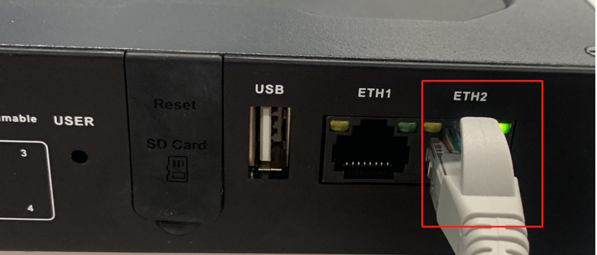

**Step 2:** **Manage** **EC312-LoRaWAN**

Method 1: Use native Linux commands for network and system management by
clicking on the link [http://www.chiark.greenend.org.uk/~sgtatham/putty/download.html](http://www.chiark.greenend.org.uk/~sgtatham/putty/download.html), download PuTTY (free software), and establish the connection with the edge computer EC312-LoRaWAN in the way of SSH command in the Windows environment. The default username for logging in is on the device's backplane

The following figure is an example of using SSH connection:

Method 2: Network and system management through WEB

EC312-LoRaWAN supports IEOS based web interface management. IEOS is a self-developed network management and system management program developed by InHand that runs on Linux systems. IEOS can provide web interface services

IEOS uses port 9100 as the HTTPS connection port and does not support access through HTTP; When users access the web using HTTP, they will automatically redirect to using HTTPS. This document takes the default address 192.168.4100 of eth2 as an example for explanation.

Login address: [https://192.168.4.100:9100](https://192.168.4.100:9100/)

Initial login account: adm

Initial login password: 123456

The following figure is an example of using a web connection:

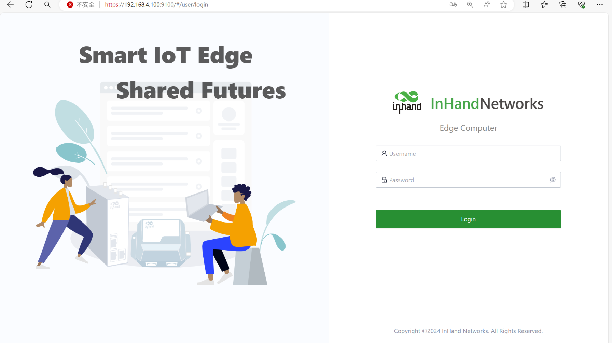

**Remark :  
Not allEC312-LoRaWANmodels support the WEBinterface management function. For specific support, see the "Ordering Guide" section of theEC312-LoRaWAN Series Edge Computer_Prdt Spec.**

## **9 Accessing the built-in LNS**

1）Click [Network] -> [LoRaWAN], then click [Go to the Network Server manage page] on that page, as shown in the image below.

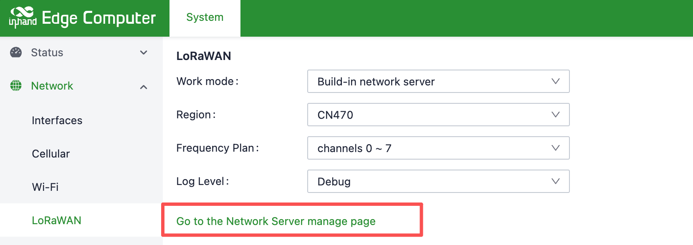

1) Log in with your username and password (admin/admin)

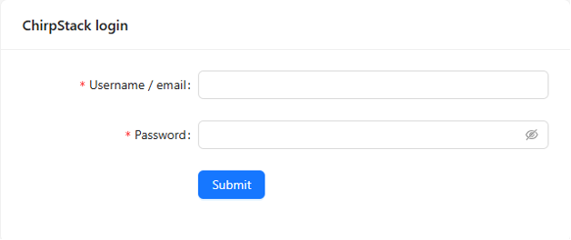

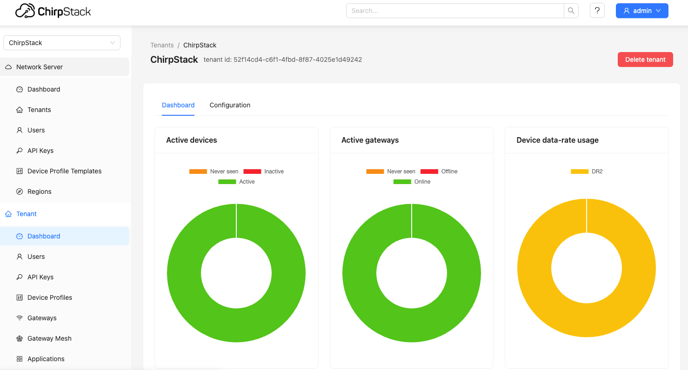
