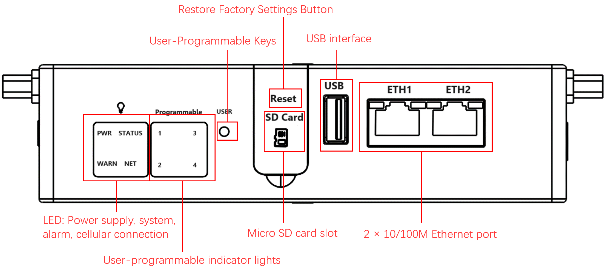
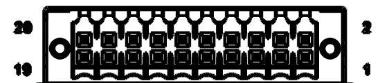
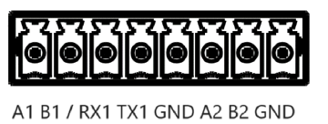
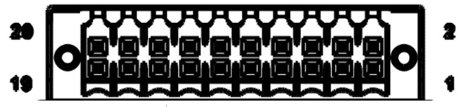
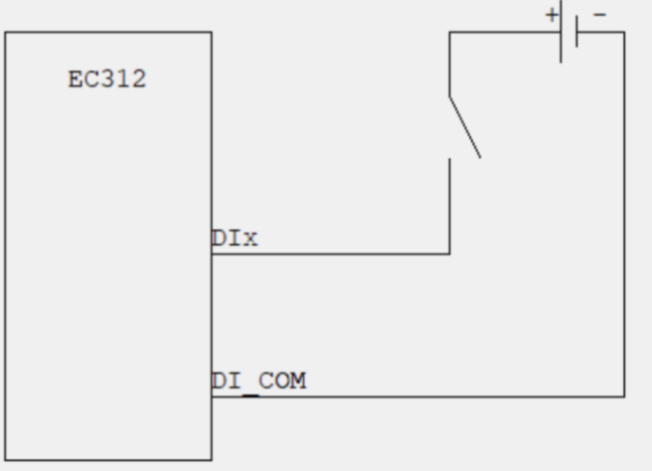
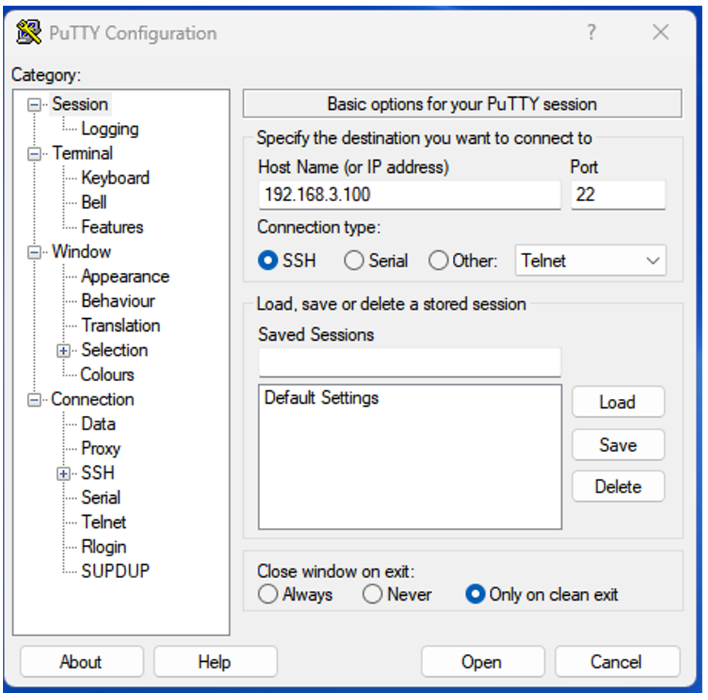

# EC312 Quick Start Guide

## Part 1: Quick Installation (Visual Step-by-Step)

> **You need to do first:** Unbox → Fix the device → Connect power and network cable → (If using cellular) **Power off** to install SIM, connect antenna → Power on → Set PC to same subnet → Open Web in browser.  
> **Then:** Flip to **Part 2** below to check packing list, indicator meanings, wall mounting, pinouts, etc.

### Must-Read Summary (Before Wiring and Power-On)

| Item | Requirement |
|------|-------------|
| Power supply | **9–48 V DC**, dual-pin terminal **V+ / V−** (or matching adapter); **PWR solid red** indicates powered on. |
| SIM card | **Must power off** before installing or removing; **no hot-swap**. |
| Cellular / WLAN / GPS antenna | Tighten according to **silkscreen** on enclosure; standard quantity varies by model (see product specification ordering information). |
| USB mass storage | Execute **sync** and exit mount directory before disconnecting to prevent data loss. |

### Step 1: Check the Panel and Interface Areas Against the Physical Device

Compare the device in your hand with the panel diagrams below to locate each interface.

**Front panel**

**Left panel**

**Right panel**

Key interfaces to confirm: Ethernet ports, DC power terminal, USB port, antenna SMA connectors, SIM card slot (under left panel), Micro SD slot (under front-panel cover), and extension interface. For detailed pin definitions of each interface, see §2.5.

### Step 2: Mount the Device on a DIN Rail or in a Cabinet

**DIN rail mounting** (recommended for control cabinets):

1. Hook the upper clip of the DIN-rail mounting plate over the top edge of the DIN rail.
2. Slowly push the device forward until the bottom clip clicks into place.

For wall-mounting instructions and kit details, see §2.4.

### Step 3: Connect Power and Ethernet

**Power**: Insert the adapter terminal into the **DC** port on EC312 and connect the power supply.

**Ethernet**: Connect a network cable from your PC to **ETH 1** or **ETH 2** on EC312.

> RJ45 pin definitions and serial-port pinouts are in §2.5.1 and §2.5.2.

### Step 4: (If Using Cellular) Power Off to Install SIM and Attach Antennas

**Important: Power must be disconnected before installing or removing the SIM card.**

1. Use the included card needle to eject the SIM card tray from the slot below the left panel.

   

2. Insert the **NANO SIM** card(s) into the upper and/or lower slots of the drawer-style tray.

   

3. Screw the cellular antenna into the SMA connector marked **ANT1** (and **ANT2** if your model supports it) according to the enclosure silkscreen. If your model includes Wi-Fi and/or GPS, attach those antennas to **Wi-Fi** and **GPS** respectively.

   

> Full antenna silkscreen mapping and SIM details are in §2.5.6.

### Step 5: Power On and Confirm the Device Is Ready

After applying power, observe the front-panel LEDs:

- **PWR** — solid on: device is powered.
- **STATUS** — flashing: system is operating normally.

If STATUS remains off or WARN starts flashing, see §2.3 for light definitions and troubleshooting.

### Step 6: Log In from a PC Browser

1. Set your PC’s Ethernet adapter to the same subnet as the EC312 port you plugged into:

   | Port | Default IP |
   |:----:|:----------:|
   | ETH 1 | 192.168.3.100/24 |
   | ETH 2 | 192.168.4.100/24 |

2. Open a browser and enter the login address (using ETH 2 as an example):

   `https://192.168.4.100:9100`

   Initial account: **adm**  
   Initial password: **123456**

   

   

> **Note:** Not all EC312 models support the WEB interface management function. For specific support, see the "Ordering Guide" section of the *EC312 Series Edge Computer Product Specification*.  
> SSH login via PuTTY is also supported; see §2.7 for details.

### Post-Installation Checklist

- ☐ Device is firmly fixed (DIN rail or wall mount).  
- ☐ Power and Ethernet cables are connected; if using cellular, SIM and antennas are in place.  
- ☐ **PWR is solid on** and **STATUS is flashing**.  
- ☐ Browser opens the Web login page and login succeeds.  

If any item fails, check §2.3 (indicators), §2.5 (wiring), and §2.7 (login) for troubleshooting.

---

## Part 2: Detailed Information

### 2.1 Packing List

**Standard Equipment**

| No. | Name | Qty | Unit | Remarks |
|:---:|:-----|:---:|:----:|:--------|
| 1 | EC312 Host | 1 | pc | — |
| 2 | Card Needle | 1 | pc | — |
| 3 | Warranty Card | 1 | pc | — |

**Optional Equipment**

| No. | Name | Qty | Unit | Remarks |
|:---:|:-----|:---:|:----:|:--------|
| 1 | Power Adapter | 1 | pc | Optional Equipment |
| 2 | Wi-Fi Antenna | 1 | pc | Standard Equipment (Depending on the device model) |
| 3 | GPS Antenna | 1 | pc | Standard Equipment (Depending on the device model) |
| 4 | Cellular Antenna | 1 | pc | Standard Equipment (Depending on the device model) |

### 2.2 Product Structure and Identification

EC312 series edge computers are designed for users who develop lightweight edge applications. It has rich interfaces and can expand various functions such as serial port, CAN, analog input, etc. Built in Linux system, providing long-term support to meet industrial automation needs. Support security features such as Secure Boot and TPM2.0 to ensure software and data security. Built in InHand DeviceSupervisor™ Agent services enable easy data collection, processing, and cloud deployment, supporting DeviceLive cloud management.

#### 2.2.1 Front Panel

The front panel contains the system indicators (PWR, STATUS, WARN, NET, User1~User4), Ethernet ports, USB port, and the protective cover for the Micro SD slot.

#### 2.2.2 Left Panel

The left panel contains the antenna SMA connectors and the SIM card slot.

#### 2.2.3 Right Panel

The right panel contains the DC power terminal, serial/CAN/DI/DO terminals, and the extension interface.

#### 2.2.4 Extension Interface

EC300 can support interface expansion. Please refer to the product specification for selection instructions. The currently supported expansion modules are as follows:

| Expansion module | Function |
|:----------------:|:---------|
| NAAD | 2× 4-20 mA analog input + 4× DI + 4× DO |
| N44C | 2× RS-485 + 1× CAN FD |
| N4CC | 1× RS-485 + 2× CAN FD |
| N44D | 2× RS-485 + 4× DI + 4× DO |
| — | NONE |

The definition of the extension interface is as follows:

| PIN | NAAD | N44C | N4CC | N44D |
|:---:|:-----|:-----|:-----|:-----|
| 1 | AIN1+ | A_485_A | A_485_A | A_485_A |
| 2 | — | A_485_B | A_485_B | A_485_B |
| 3 | AIN1- | — | — | — |
| 4 | GND | GND | GND | GND |
| 5 | AIN2+ | B_485_A | CAN2_H | B_485_A |
| 6 | — | B_485_B | CAN2_L | B_485_B |
| 7 | AIN2- | — | — | — |
| 8 | GND | GND | GND | GND |
| 9 | — | CAN3_H | CAN3_H | — |
| 10 | — | CAN3-L | CAN3-L | — |
| 11 | DO0 | — | — | DO0 |
| 12 | DO1 | — | — | DO1 |
| 13 | DO2 | — | — | DO2 |
| 14 | DO3 | — | — | DO3 |
| 15 | DI0 | — | — | DI0 |
| 16 | DI1 | — | — | DI1 |
| 17 | DI2 | — | — | DI2 |
| 18 | DI3 | — | — | DI3 |
| 19 | DI_COM | — | — | DI_COM |
| 20 | GND | — | — | GND |

> **Remark:** The specific support for expandable serial ports, CAN interface, and digital input/output interfaces depends on the model of the expansion module.

#### 2.2.5 User Programmable Button

EC300 provides an API interface, which users can call to detect the status of programmable buttons and then implement their own button logic.

### 2.3 Indicator Lights

#### 2.3.1 System Status Indicators

| Signage | Name | Definition |
|:-------:|:-----|:-----------|
| PWR | Power indicator | Power on and always on. |
| STATUS | System operating status indicator light | When the system starts normally, the STATUS flashes. If the system fails to start due to an exception in the system startup phase, or when the factory recovery operation has not been completed, STATUS is solid off. |
| WARN | Warning indicator light | When the system has a warning abnormality, the WARN light flashes. Warning abnormalities include: the factory reset has not been completed; and the dialing abnormality (the cellular function needs to be turned on). |
| NET | Cellular connection status indicator | Keep on after successful dialing. |
| User1 | User programmable indicator LED 1 | It is off by default and can be controlled by user programming. |
| User2 | User programmable indicator LED 2 | It is off by default and can be controlled by user programming. |
| User3 | User programmable indicator LED 3 | It is off by default and can be controlled by user programming. |
| User4 | User programmable indicator LED 4 | It is off by default and can be controlled by user programming. |

### 2.4 Mechanical Installation

#### 2.4.1 DIN Rail — Installation

The installation plate of the DIN rail is attached to the EC312 rear panel (fixed with M3 × 6 mm screws). The installation steps are as follows:

1. Clip the upper hook of the DIN rail installation plate into the top of the DIN rail bracket.
2. Slowly push the device forward towards the DIN rail bracket to ensure that the bottom end of the DIN rail clicks into place.

#### 2.4.3 Wall Mounting

EC312 can be installed using a wall mounted kit, which needs to be purchased separately. Follow the steps below to install.

**Step 1:** Use screws (M3 × 4 mm) to secure the wall mounting kit to the back panel of EC312.

**Step 2:** After the wall mounted kit is successfully fixed to EC312, use an additional 4 M8 and 2 M3 screws to secure EC312 to the wall or cabinet.

### 2.5 Connections and Cabling

#### 2.5.1 Ethernet

EC300 has 2 RJ45 Ethernet ports and supports 10M/100M adaptive speed. The pin description of RJ45 is as follows:

**10/100 Mbps RJ45 Pinout**

| Pin | Description |
|:---:|:-----------|
| 1 | TX+ |
| 2 | TX- |
| 3 | RX+ |
| 4 | — |
| 5 | — |
| 6 | RX- |
| 7 | — |
| 8 | — |

#### 2.5.2 Power and Serial Ports

**Power**

EC312 supports **9–48 V DC** power supply. Insert the adapter terminal into the DC port of EC312 and connect the power adapter. When the PWR power indicator light remains on, it indicates that the device has been powered on normally.

**Standard Serial Ports**

- **COM1** (standard): RS-232/RS-485 (RX1 TX1 / A1 B1). At the same time, you can only choose to connect to RS-232 or RS-485; they cannot be connected to work at the same time.
- **COM2** (standard): RS-485 (A2 B2)

| Pin | COM1 (RS-232) | COM1 (RS-485) | COM2 (RS-485) |
|:---:|:-------------:|:-------------:|:-------------:|
| A1 | — | A+ | — |
| B1 | — | B- | — |
| RX1 | RX | — | — |
| TX1 | TX | — | — |
| GND | GND | GND | — |
| A2 | — | — | A+ |
| B2 | — | — | B- |
| GND | — | — | GND |

**Scalable Serial Ports**

- **COM3** (Extension): RS-232/RS-485 (Extension Interface PIN1, Extension Interface PIN2)
- **COM4** (Extension): RS-232/RS-485 (Extension Interface PIN5, Extension Interface PIN6)

> **Remark:** The specific support for expandable serial ports depends on the model of the expansion module. For details, please refer to §2.2.4.

#### 2.5.3 CAN Port

EC300 has a 3-way CAN bus interface and supports the CAN 2.0A/B standard. It is compatible with CAN FD and can reach a maximum speed of 5 Mbps.

- CAN1: Extension Interface PIN1, Extension Interface PIN2
- CAN2: Extension Interface PIN5, Extension Interface PIN6
- CAN3: Extension Interface PIN9, Extension Interface PIN10

> **Remark:** The support for CAN interface expansion depends on the model of the expansion module. For details, please refer to §2.2.4.

#### 2.5.4 Digital Input

**Electrical Parameters**

| Parameter | Description | Min | Type | Max | Unit |
|:----------|:------------|:---:|:----:|:---:|:----:|
| Vds | Drain source voltage | — | — | 48 | V |
| VIN Low | Maximal input voltage recognized as LOW | — | — | 3 | V |
| VIN High | Minimal input voltage recognized as HIGH | 10 | — | 30 | V |

**Interface Definition**

| Interface identification | Features | Description |
|:------------------------:|:---------|:------------|
| GND | Power reference ground | 4 digital input DI, wet contact state  
"1": +10~+30 V / -30 ~ -10 V DC  
"0": 0 ~ +3 V / -3 ~ 0 V  
Isolate 3000 VDC |
| DICOM | Input public side | — |
| DI0 | Digital input port 0 | — |
| DI1 | Digital input port 1 | — |
| DI2 | Digital input port 2 | — |
| DI3 | Digital input port 3 | — |

The wiring method is as follows (only supports wet node wiring):

> **Remark:** The support for digital input interfaces depends on the model of the expansion module. For details, please refer to §2.2.4.

#### 2.5.5 Digital Output

| Interface identification | Function | Description |
|:------------------------:|:---------|:------------|
| DO0 | Digital output interface 0 | 4-way DO OD output, isolated 3000 VDC |
| DO1 | Digital output interface 1 | — |
| DO2 | Digital output interface 2 | — |
| DO3 | Digital output interface 3 | — |
| GND | Grounding terminal | — |

The wiring method is as follows:

> **Remark:** The support for digital output interfaces depends on the model of the expansion module. For details, please refer to §2.2.4.

#### 2.5.6 Cellular SIM and Antennas

**SIM Card**

EC312 is equipped with a SIM card holder for cellular communication, located below the left panel. Supports 2 NANO SIM cards.

> **Attention:** The SIM card of EC312 needs to be installed in the event of a power outage. Please ensure that the device power has been disconnected before installation.

Installation steps:

1. Before installation, the SIM card holder needs to be removed using a card reader (included in the factory).

   

2. Insert the NANO SIM card, which has two card slots located above and below the drawer style card holder.

   

**Antenna Interface**

The EC300 has five antenna interfaces in total, and the number of standard antennas for different models is different. See the "Ordering Information" section of the *EC312 Series Edge Computer Product Specification* for the antenna support for specific models.

| Identification | Name |
|:--------------:|:-----|
| ANT1 | 4G LTE main antenna / 5G antenna |
| ANT2 | 4G LTE diversity receive antenna / 5G antenna |
| GPS | GPS antenna |
| Wi-Fi | Wi-Fi antenna |

The product model shown below is EC312-B-LQA3, which only supports one 4G antenna interface. Screw the antenna into the corresponding SMA antenna interface to complete the antenna installation.

#### 2.5.7 USB and Micro SD

**USB**

EC300 provides a USB 2.0 Host interface, mainly used for expanding storage devices. Supports hot swapping of USB storage devices.

> **Attention:** Before disconnecting a USB mass storage device, remember to enter the sync synchronization command to prevent data loss. When you disconnect the storage device, please exit from the mounting directory.

**Micro SD**

EC312 is equipped with an SD card slot for extended storage, located below the front panel. Before use, please open the protective cover and insert the SD card into the SD card slot.

### 2.6 Power and Environmental Specifications

| Item | Specification |
|:-----|:--------------|
| Input voltage | 9–48 VDC (dual pin terminals, V+, V−) |
| Power consumption | 6 W |
| Working temperature | −20–70 °C (−4 °F–158 °F) |
| Storage temperature | −40–85 °C (−40 °F–185 °F) |
| Environmental humidity | 5–95% (without frost) |

### 2.7 First Login and Factory Reset

#### Web Login

Connect to EC300 using the following default IP address.

| Port | Default IP |
|:----:|:----------:|
| ETH 1 | 192.168.3.100/24 |
| ETH 2 | 192.168.4.100/24 |

**Step 1:** Interconnect PC and EC312.

As shown in the following figure, plug one end of the network cable into the Ethernet port of EC312 (the example in the figure uses port 2), and plug the other end into the network port of the computer. At the same time, set the IP address of the computer to the same network segment address as the device interface.

**Step 2:** Manage EC312.

**Method 1:** Use native Linux commands for network and system management by downloading PuTTY (free software) from [http://www.chiark.greenend.org.uk/~sgtatham/putty/download.html](http://www.chiark.greenend.org.uk/~sgtatham/putty/download.html), and establish the connection with the edge computer EC312 in the way of SSH command in the Windows environment. The default username for logging in is on the device's backplane.

The following figure is an example of using SSH connection:

**Method 2:** Network and system management through WEB.

EC312 supports IEOS based web interface management. IEOS is a self-developed network management and system management program developed by InHand that runs on Linux systems. IEOS can provide web interface services.

IEOS uses port 9100 as the HTTPS connection port and does not support access through HTTP; when users access the web using HTTP, they will automatically redirect to using HTTPS. This document takes the default address **192.168.4.100** of ETH 2 as an example for explanation.

Login address: `https://192.168.4.100:9100`

Initial login account: **adm**  
Initial login password: **123456**

The following figure is an example of using a web connection:

> **Remark:** Not all EC312 models support the WEB interface management function. For specific support, see the "Ordering Guide" section of the *EC312 Series Edge Computer Product Specification*.

#### Factory Reset

When the factory recovery operation has not been completed, the STATUS indicator is solid off and the WARN indicator flashes. For detailed recovery procedures, please refer to the *EC312 User Manual*.

### 2.8 Related Documents

| Need | Destination |
|:-----|:------------|
| Product introduction, USB/SD details, configuration and troubleshooting | *EC312 User Manual* |
| Ordering information and antenna models | *EC312 Series Edge Computer Product Specification* |
| Software and announcements | [www.inhand.com](http://www.inhand.com) |

### 2.9 Legal Information

**Copyright Statement**

© 2024 InHand Network reserves all rights.

**Trademark**

The InHand logo is a registered trademark of InHand Network.

All other trademarks or registered trademarks in this manual belong to their respective manufacturers.

**Disclaimers**

Our company reserves the right to make changes to this manual, and any subsequent changes to the product will not be notified separately. We are not responsible for any direct, indirect, intentional or unintentional damage or hidden dangers caused by improper installation or use.
