# EC300 Series Edge Computer User Manual


## Declaration

Thank you for selecting this product. Prior to use, read this user manual carefully and observe the following statements. Compliance with these provisions helps maintain intellectual property rights and legal compliance, and ensures that the usage experience remains consistent with the latest product information. For questions or to obtain written permission, contact the technical support team.

- **Copyright Notice**

  This user manual contains copyright-protected material. All rights are reserved by Beijing InHand Networks Technology Co., Ltd. and its licensors. No part of this manual may be excerpted, reproduced, or transmitted in any form or by any means without prior written permission.

- **Disclaimer**

  Due to continuous updates in product technology and specifications, the company does not guarantee that the information in this user manual is entirely consistent with the actual product. Therefore, the company assumes no liability for disputes arising from discrepancies between actual technical parameters and the contents of this manual. Product changes may be made without prior notice. The company reserves the right of final modification and interpretation.

- **Copyright Information**

  The contents of this user manual are protected by copyright law. All rights are reserved by Beijing InHand Networks Technology Co., Ltd. and its licensors. No part of this manual may be used, copied, or distributed without prior written permission.

## GUI Conventions

The following symbols and formatting conventions are used throughout this manual:

| Symbol | Meaning | Example |
|--------|---------|---------|
| `< >` | Indicates a variable or parameter to be replaced with an actual value | `<IP address>` indicates that a specific IP address must be entered |
| `" "` | Indicates a text label on the interface | Click the "Save" button |
| `→` | Indicates a menu hierarchy or sequence of operations | **Network** → **Cellular** |
| `【 】` | Indicates a menu or page name | Navigate to the 【System Settings】page |

## Technical Support
Email: support@inhandnetworks.com

URL: www.inhand.com

## How to Use This Manual

### Reading Guide

- First-time users: It is recommended to read the chapters in the following order: "Know the Device" → "Installation and First Use" → "Common Scenario Configurations" → "Feature Descriptions and Parameter Reference"
- Existing device users: Refer directly to "Feature Descriptions and Parameter Reference" or "Appendix: Troubleshooting"
- Cloud platform management users: Refer to the device remote management platform sections in "Common Scenario Configurations" (where applicable)

### Quick Jump by Task

| Task | Corresponding Chapter | Estimated Time |
|------|----------------------|----------------|
| Connect to the device via Ethernet | [Ethernet Connection](#ethernet-connection) | Approx. 5 minutes |
| Configure cellular network | [Cellular Network Configuration](#cellular-network-configuration) | Approx. 10 minutes |
| Configure Wi-Fi | [Wi-Fi Configuration](#wi-fi-configuration) | Approx. 5 minutes |
| Configure OpenVPN | [OpenVPN Configuration](#openvpn-configuration) | Approx. 10 minutes |
| Firmware upgrade | [Firmware Upgrade](#firmware-upgrade) | Approx. 15 minutes |
| Device remote management | [DeviceLive Cloud Management](#devicelive-cloud-management) | Approx. 10 minutes |
| Peripheral interface configuration | [Peripheral Interfaces](#peripheral-interfaces) | As needed |
| Factory reset | [Factory Reset](#factory-reset) | Approx. 5 minutes |

**Default Access Information for the EC300 Series Edge Computer**

| Item | Default Value |
|------|---------------|
| ETH 1 IP address | 192.168.3.100/24 |
| ETH 2 IP address | 192.168.4.100/24 |
| SSH username | edge |
| SSH password | security@edge |
| Web login username | adm |
| Web login password | 123456 |


# Chapter 1 Know the Device

## 1.1 Overview

The EC300 series edge computers are Arm architecture-based industrial computing platforms designed for lightweight edge application development. Equipped with rich interfaces including serial ports, CAN bus, and analog input, the EC300 supports interface expansion to meet diverse industrial automation requirements. The device runs a built-in Linux system (Debian 11) with long-term support. Security features such as Secure Boot and TPM2.0 ensure software and data integrity. The built-in InHand DeviceSupervisor Agent enables data collection, processing, and cloud deployment, with support for DeviceLive cloud management platform remote monitoring.

## 1.2 Packing List

| Item | Quantity | Description |
|------|----------|-------------|
| EC312 Host | 1 | Edge computer main unit |
| Power Adapter | 1 | Optional equipment |
| Wi-Fi Antenna | 1 | Standard equipment (depending on the device model) |
| GPS Antenna | 1 | Standard equipment (depending on the device model) |
| Cellular Antenna | 1 | Standard equipment (depending on the device model) |
| Card Needle | 1 | Used for SIM card tray removal |
| Warranty Card | 1 | Product warranty certificate |

## 1.3 Appearance and Interfaces

The EC312 panel layout is as follows:

### 1.3.1 Front Panel

<p align="center">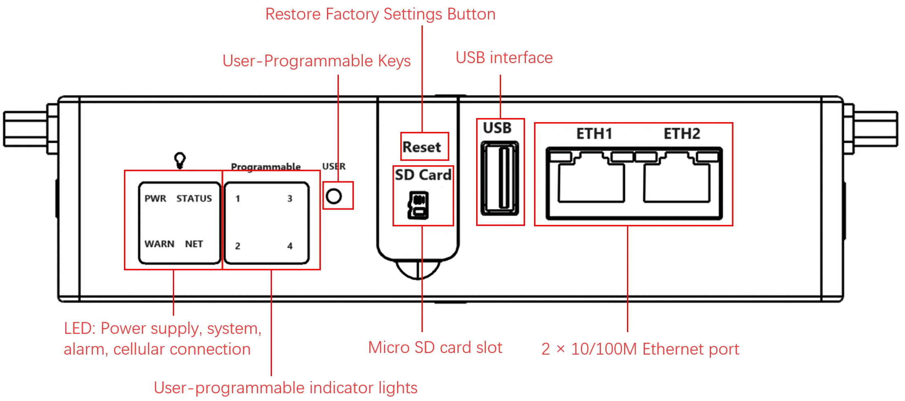</p>

<p align="center"><strong>Figure 1-1 EC312 Front Panel</strong></p>

### 1.3.2 Left Panel

<p align="center">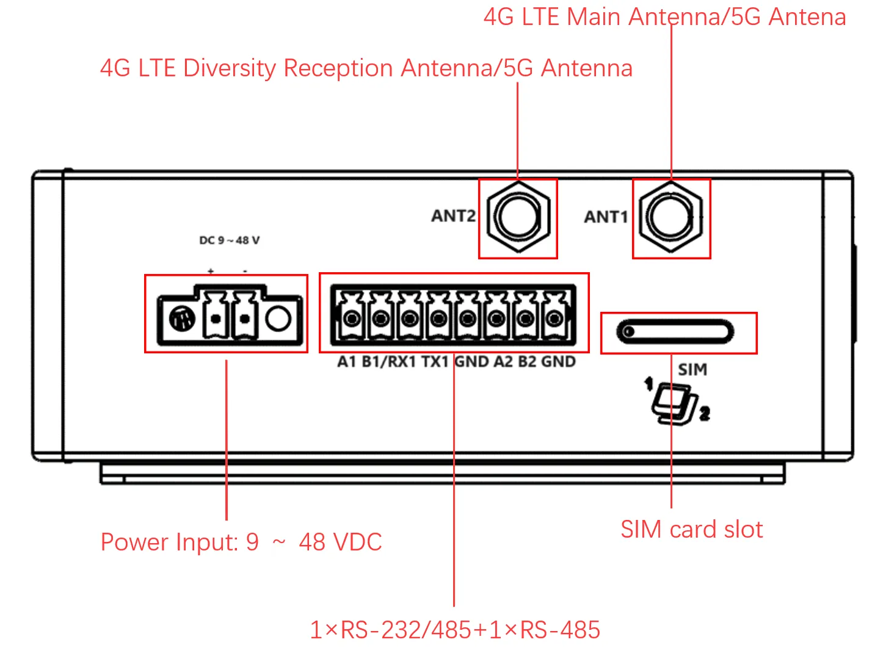</p>

<p align="center"><strong>Figure 1-2 EC312 Left Panel</strong></p>

### 1.3.3 Right Panel

<p align="center">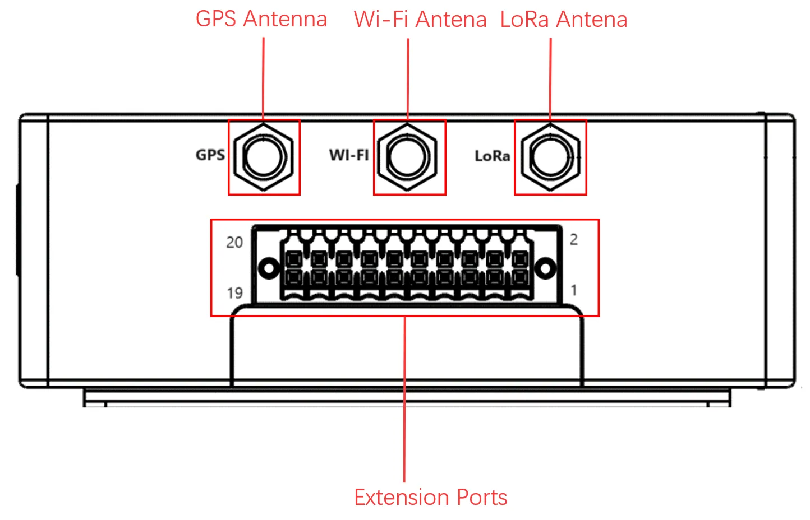</p>

<p align="center"><strong>Figure 1-3 EC312 Right Panel</strong></p>

### 1.3.4 Interface Description

| Interface | Position | Function Description |
|-----------|----------|---------------------|
| ETH 1/ETH 2 | Front panel | RJ45 Ethernet port, 10M/100M adaptive |
| COM1/COM2 | Left panel | Standard serial port (RS-232/RS-485) |
| DC Input | Left panel | 9-48V DC power input |
| SIM Card Slot | Left panel | Dual NANO SIM card slot |
| MicroSD Slot | Front panel | MicroSD card slot for extended storage |
| USB 2.0 | Left panel | USB 2.0 Host interface |
| Antenna Interfaces | Right panel | Cellular, GPS, Wi-Fi antenna SMA interfaces |
| Extension Interface | Right panel | Expansion module interface for serial/CAN/DI/DO/AIN |
| RESET | Left panel | Factory reset button |
| User Programmable Button | Left panel | User-defined function button |

## 1.4 Indicator Lights

<p align="center"></p>

<p align="center"><strong>Figure 1-4 EC312 Antenna Interface</strong></p>

| Indicator | Status | Meaning |
|-----------|--------|---------|
| PWR | Solid on | Device powered on |
| STATUS | Flashing | System starts normally |
| | Solid off | System startup exception or factory recovery not completed |
| WARN | Flashing | Warning abnormality (factory reset incomplete or dialing abnormality when cellular is enabled) |
| NET | Solid off | Dial function not enabled |
| | Flashing | Dialing in progress |
| | Solid on | Dialing successful |
| User1 | Solid off (default) | User programmable indicator LED 1, controllable via programming |
| User2 | Solid off (default) | User programmable indicator LED 2, controllable via programming |
| User3 | Solid off (default) | User programmable indicator LED 3, controllable via programming |
| User4 | Solid off (default) | User programmable indicator LED 4, controllable via programming |

## 1.5 Factory Reset

There are two methods to restore the EC300 to factory settings:

### Hardware Factory Reset

1. Power on the device and ensure the system has started.
2. Long press the **Reset** key for 10-20 seconds until the **WARN** light stays solid on.
3. When the **WARN** light turns on, release the **Reset** key.
4. The device will automatically restart and restore factory settings.

> **Note**: System reset is an important function. After reset, the device will return to the default state and all user data and configurations will be lost. Before resetting, ensure that critical data has been backed up to external storage media.

### Software Factory Reset

1. Log in to the web management interface.
2. Navigate to 【System Management】→【Configuration Management】.
3. Click the reset button and confirm. The device will complete the factory reset operation automatically.

Alternatively, use the Linux command line:

```
sudo factory_reset
```

## 1.6 Default Settings

| Parameter | Default Value |
|-----------|---------------|
| ETH 1 IP address | 192.168.3.100/24 |
| ETH 2 IP address | 192.168.4.100/24 |
| SSH username | edge |
| SSH password | security@edge |
| Web login username | adm |
| Web login password | 123456 |
| IEOS HTTPS port | 9100 |
| Root user | Disabled by default |


# Chapter 2 Installation and First Use

## 2.1 Pre-Installation Preparation

Before installing the EC300 series edge computer, verify the following items:

| Item | Requirement |
|------|-------------|
| Power supply | 9-48V DC, dual-pin terminal (V+, V-) |
| Power consumption | 6W |
| Operating temperature | -20 to 70°C (-4°F to 158°F) |
| Storage temperature | -40 to 85°C (-40°F to 185°F) |
| Environmental humidity | 5-95% (without frost) |
| Tools | Screwdriver (for DIN rail or wall mounting), network cable |

> **Attention**: The SIM card must be installed while the device is powered off. Ensure the device power has been disconnected before SIM card installation.

## 2.2 Installation Guide

### 2.2.1 DIN Rail Installation

The DIN rail installation plate is attached to the EC312 rear panel (fixed with M3 x 6mm screws). The installation steps are as follows:

1. Clip the upper hook of the DIN rail installation plate into the top of the DIN rail bracket.
2. Slowly push the device forward towards the DIN rail bracket to ensure that the bottom end of the DIN rail clicks into place.

<p align="center">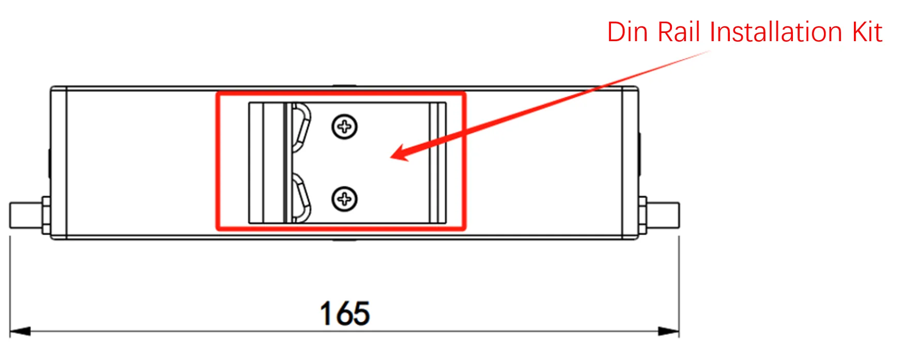</p>

<p align="center"><strong>Figure 2-1 DIN Rail Installation</strong></p>

### 2.2.2 Wall-Mounted Installation

The EC312 can be installed using a wall-mounted kit, which needs to be purchased separately.

1. Use screws (M3 x 4mm) to secure the wall mounting kit to the back panel of EC312.

<p align="center"></p>

<p align="center"><strong>Figure 2-2 Wall Mount Kit Installation (Step 1)</strong></p>

2. After the wall-mounted kit is successfully fixed to EC312, use an additional 4 M8 and 2 M3 screws to secure EC312 to the wall or cabinet.

<p align="center"></p>

<p align="center"><strong>Figure 2-3 Wall Mount Kit Installation (Step 2)</strong></p>

### 2.2.3 Power Connection

The EC312 supports 9-48V DC power supply. Insert the adapter terminal into the DC port of EC312 and connect the power adapter.

<p align="center">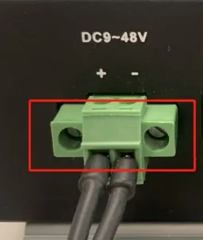</p>

<p align="center"><strong>Figure 2-4 DC Input Interface</strong></p>

When the PWR power indicator light remains on, the device has been powered on normally.

### 2.2.4 SIM Card Installation

1. Ensure that the device power has been disconnected before installation.
2. Remove the SIM card holder using the card needle (included in the factory).

<p align="center">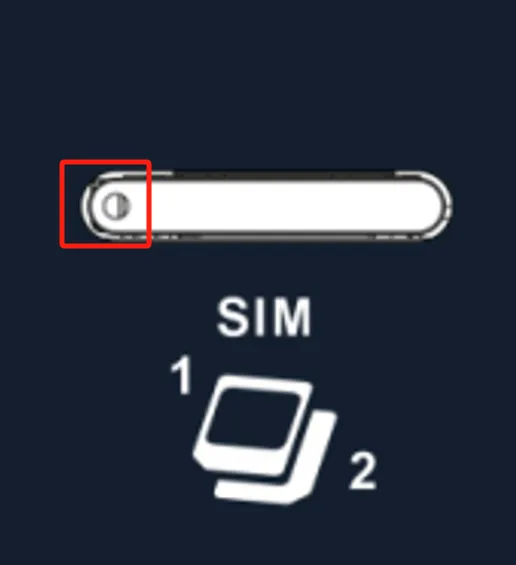</p>

<p align="center"><strong>Figure 2-5 SIM Card Tray Removal</strong></p>

3. Insert the NANO SIM card. There are two card slots located above and below the drawer-style card holder.

<p align="center"></p>

<p align="center"><strong>Figure 2-6 SIM Card Installation</strong></p>

### 2.2.5 Antenna Installation

The EC300 has five antenna interfaces in total. The number of standard antennas for different models varies. Screw the antenna into the corresponding SMA antenna interface to complete the antenna installation.

| Identification | Name |
|----------------|------|
| ANT1 | 4G LTE main antenna / 5G antenna |
| ANT2 | 4G LTE diversity receive antenna / 5G antenna |
| GPS | GPS antenna |
| Wi-Fi | Wi-Fi antenna |

<p align="center"></p>

<p align="center"><strong>Figure 2-7 Antenna Installation</strong></p>

### 2.2.6 First Login via SSH

1. Interconnect the PC and EC312 using a network cable. Plug one end into the Ethernet port of EC312 and the other end into the network port of the computer.
2. Set the PC IP address to the same network segment as the device interface (ETH1: 192.168.3.0/24, ETH2: 192.168.4.0/24).

<p align="center">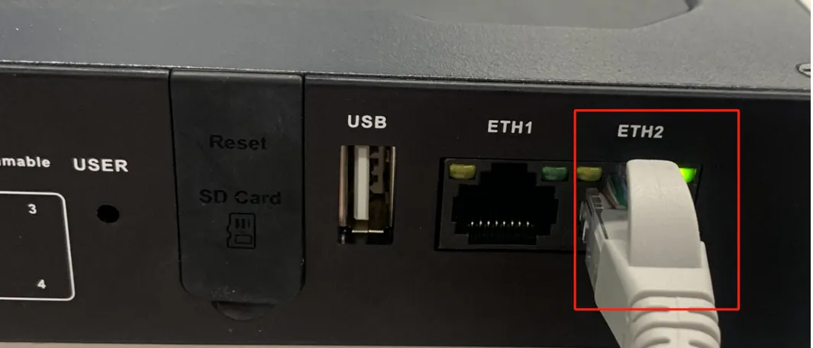</p>

<p align="center"><strong>Figure 2-8 PC Connection to EC312</strong></p>

3. Use PuTTY or a Linux terminal to establish an SSH connection to the device.

<p align="center">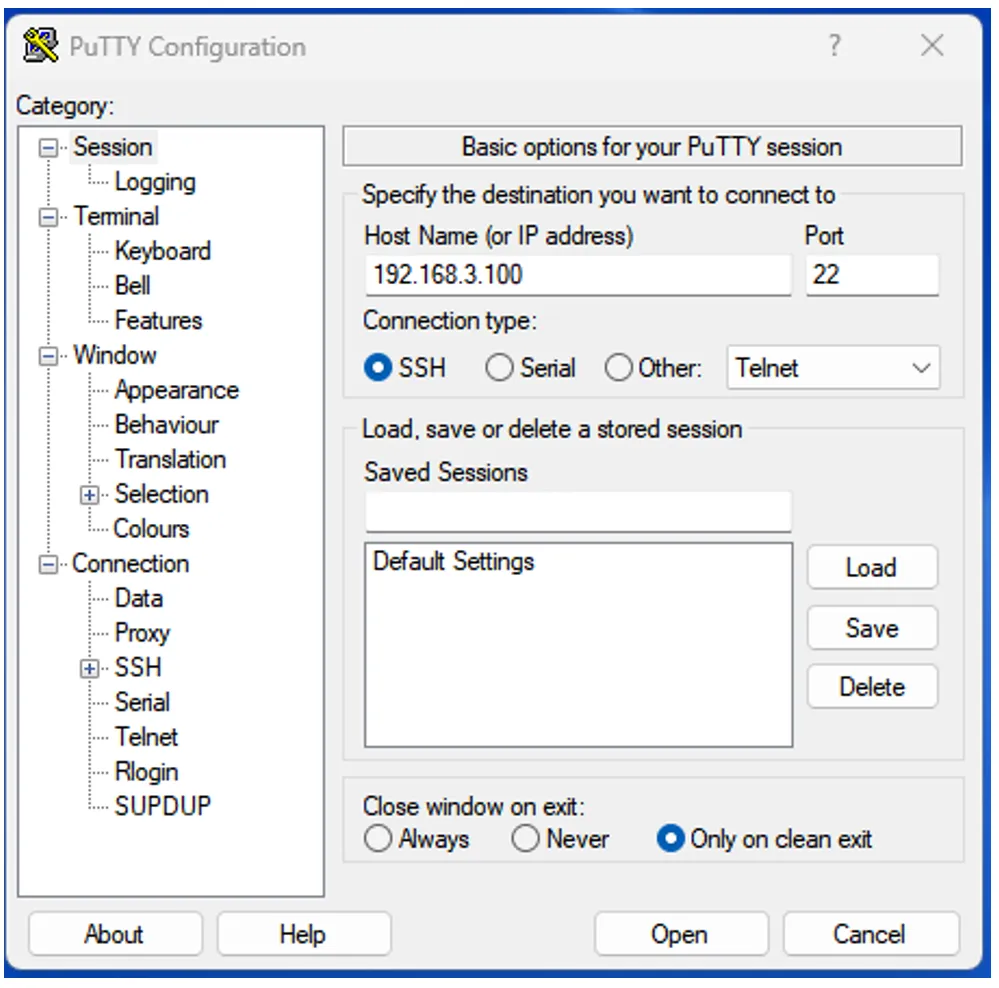</p>

<p align="center"><strong>Figure 2-9 SSH Connection Example</strong></p>

4. Log in with the default credentials:
   - Username: edge
   - Password: security@edge

### 2.2.7 First Login via Web Interface

1. Open a web browser and navigate to `https://192.168.4.100:9100` (using ETH2 as an example).
2. Enter the login credentials:
   - Username: adm
   - Password: 123456

<p align="center"></p>

<p align="center"><strong>Figure 2-10 Web Login Page</strong></p>

> **Note**: Not all EC312 models support the WEB interface management function. For specific support, see the "Ordering Guide" section of the EC312 Series Edge Computer Product Specification.

## 2.3 Quick Check

After installation is complete, verify the following items:

- [ ] The PWR indicator is solid on, indicating normal power supply.
- [ ] The STATUS indicator is flashing, indicating normal system startup.
- [ ] The network cable is securely connected and the PC can ping the device IP address.
- [ ] The SIM card is properly inserted (if cellular function is required).
- [ ] Antennas are properly installed (if cellular/Wi-Fi/GPS function is required).
- [ ] The device can be accessed via SSH or web interface.


# Chapter 3 Common Scenario Configurations


## Scenario 1: Connect to the Device via Ethernet

**Objective**: Connect a PC to the EC300 via Ethernet and establish management access through SSH or the web interface.

**Prerequisites**: The EC300 is powered on, a network cable is available, and the PC has an Ethernet port.

**Estimated Time**: Approx. 5 minutes.

**Operation Steps**:
1. Connect one end of the network cable to the ETH 1 or ETH 2 port of the EC300.
2. Connect the other end of the network cable to the PC Ethernet port.
3. Configure the PC IP address to be in the same subnet as the device:
   - For ETH 1: Set PC IP to 192.168.3.x/24 (e.g., 192.168.3.10)
   - For ETH 2: Set PC IP to 192.168.4.x/24 (e.g., 192.168.4.10)
4. Open an SSH client (PuTTY on Windows, or terminal on Linux) and connect to the device IP address.
5. Log in with the default SSH credentials (username: edge, password: security@edge).

Alternatively, for web access:
1. Open a web browser and navigate to `https://<device-ip>:9100`.
2. Log in with the default web credentials (username: adm, password: 123456).

**Verification Method**:
1. Ping the device IP address from the PC to confirm network connectivity.
2. Confirm successful login via SSH or web interface.

**Common Issues**:
- Unable to ping the device: Check whether the PC IP address is in the same subnet as the device, and verify the network cable connection.
- Web page cannot be opened: Confirm the URL uses HTTPS and port 9100; clear the browser cache or try a different browser.


## Scenario 2: Cellular Network Configuration

**Objective**: Connect the EC300 to the Internet via 4G/5G cellular network.

**Prerequisites**: A valid SIM card has been inserted, the cellular antenna is installed, and the device is powered on. The device supports web management.

**Estimated Time**: Approx. 10 minutes.

**Operation Steps**:
1. Log in to the web management interface at `https://<device-ip>:9100`.
2. Navigate to 【Network】→【Cellular】.
3. Enable the cellular function (enabled by default).
4. Configure the APN parameters if using a dedicated network card (obtain APN parameters from the operator).
5. Select the network mode (Auto, 3G, 4G, LTE, WCDMA, etc.). It is recommended to select Auto.
6. Enable or disable the default route as required.
7. If dual-SIM is supported, configure Dual SIM settings:
   - Enable Dual SIM.
   - Select the main SIM card.
   - Set the maximum number of dial attempts before switching.
8. Configure ICMP probe parameters to detect and recover from false connections (recommended for cellular connections).
9. Click "Save" and wait for the connection to establish.

**Verification Method**:
1. Check the NET indicator on the device; solid on indicates successful dialing.
2. Navigate to 【Status】→【Cellular Status】to view the IP address, signal strength, and connection details.
3. Use the network diagnostic tool to ping an external address (e.g., 8.8.8.8).

**Common Issues**:
- Network connection failure: Check whether the SIM card is correctly inserted, whether the APN parameters are correct, and whether the antenna is properly connected.
- False connection (dialing successful but unable to access the Internet): Enable ICMP probe and configure appropriate probe addresses and intervals.
- Signal weak or no signal: Adjust the device position or antenna orientation.


## Scenario 3: Wi-Fi Configuration

**Objective**: Configure the EC300 Wi-Fi function in Station mode or Access Point mode.

**Prerequisites**: The device model supports Wi-Fi, the Wi-Fi antenna is installed, and the device is powered on.

**Estimated Time**: Approx. 5 minutes.

**Operation Steps** (Station Mode):
1. Log in to the web management interface.
2. Navigate to 【Network】→【Wi-Fi】→【Station】.
3. Enable Wi-Fi.
4. Enter or scan for the SSID of the target wireless network.
5. Select the authentication method (Open, WPA-PSK, WPA2-PSK, WPA-PSK/WPA2-PSK Mixed).
6. Select the encryption mode and enter the Wi-Fi password.
7. Enable or disable the default route as required.
8. Click "Save" and wait for the connection to establish.

**Operation Steps** (Access Point Mode):
1. Navigate to 【Network】→【Wi-Fi】→【Access Point】.
2. Configure the SSID broadcast setting.
3. Select the band (2.4G or 5.8G) and radio type (802.11a/n/ac or 802.11b/g/n).
4. Set the channel, SSID, authentication method, and encryption mode.
5. Set the Wi-Fi password (WEP Key).
6. Configure the bandwidth, stations limit, IP address, and subnet mask.
7. Click "Save".

**Verification Method**:
1. For Station mode: Navigate to 【Status】→【Wi-Fi Status】to verify the IP address and gateway information.
2. For AP mode: Use a wireless client to search for the configured SSID and connect.

**Common Issues**:
- Unable to connect to the target SSID: Verify the SSID and password are correct; check signal strength.
- Client cannot obtain an IP address in AP mode: Verify the DHCP Server settings on the corresponding interface.


## Scenario 4: OpenVPN Configuration

**Objective**: Establish a secure VPN tunnel using OpenVPN for remote access or site-to-site connectivity.

**Prerequisites**: The device is connected to the Internet via Ethernet or cellular. OpenVPN certificates and keys have been prepared.

**Estimated Time**: Approx. 10 minutes.

**Operation Steps** (OpenVPN Server):
1. Log in to the web management interface.
2. Navigate to 【Network】→【OpenVPN】→【Server】.
3. Click "Add" to create a new server configuration.
4. Configure the server name, status, interface type (tun), and network type (p2p, net30, or subnet).
5. Configure the virtual network segment and network mask (for subnet mode).
6. Import the CA certificate, public key certificate, private key certificate, and DH parameter files.
7. In advanced settings, configure the server address, protocol type, port, encryption algorithm, hash algorithm, and other parameters as needed.
8. Click "Save" and start the server.

Alternatively, import an existing OpenVPN Server configuration file containing the certificates and keys.

**Operation Steps** (OpenVPN Client):
1. Navigate to 【Network】→【OpenVPN】→【Client】.
2. Click "Add" to create a new client configuration.
3. Configure the client name, status, interface type, and network type.
4. Enter the OpenVPN Server address, port, and protocol.
5. Import the CA certificate, client public key certificate, and client private key certificate.
6. Configure advanced settings as needed.
7. Click "Save" and start the client.

**Verification Method**:
1. Navigate to 【Status】→【OpenVPN Server Status】or 【OpenVPN Client Status】to view the connection state.
2. Verify that the virtual IP address has been assigned and the tunnel connection duration is displayed.

**Common Issues**:
- Connection cannot be established: Verify the server address, port, and certificates are correct.
- Tunnel disconnects frequently: Enable tunnel persistence and key retention in advanced settings.


## Scenario 5: DeviceLive Cloud Management

**Objective**: Connect the EC300 to the InHand DeviceLive platform for remote monitoring and management.

**Prerequisites**: The device is connected to the Internet, and a DeviceLive account is available.

**Estimated Time**: Approx. 10 minutes.

**Operation Steps**:
1. Log in to the web management interface.
2. Navigate to 【System Management】→【Basic Configuration】→【Cloud Management】.
3. Enable the DeviceLive connection switch.
4. Select the cloud server address (domestic or overseas platform).
5. Click "Save".
6. Log in to the DeviceLive platform and verify that the device appears in the device list.

**Verification Method**:
1. On the DeviceLive platform, check whether the device is online.
2. Verify that device information (model, serial number, firmware version) is displayed correctly.
3. Test remote operations such as configuration viewing or firmware upgrade through the platform.

**Common Issues**:
- Device cannot connect to DeviceLive: Verify the device has Internet access and the correct cloud server address is selected.
- Device appears offline: Check the firewall rules to ensure outbound connections to the DeviceLive server are not blocked.


# Chapter 4 Feature Descriptions and Parameter Reference

## 4.1 User Account Management

### 4.1.1 Switch to the Root User

Use the `sudo -s` command to switch to the root user. For security reasons, do not operate all commands as root.

> **Note**: A "permission denied" message may appear when using pipe or redirect behavior without root permissions. In this case, use `sudo su -c` instead of `>`, `<`, `>>`, `<<`, etc. Include the full command in single quotes.

For more information on sudo commands, refer to [https://wiki.debian.org/sudo](https://wiki.debian.org/sudo).

### 4.1.2 Creating and Deleting User Accounts

Use the `useradd` and `userdel` commands to create and delete user accounts.

<p align="center"></p>

<p align="center"><strong>Figure 4-1 Create User Account</strong></p>

To change a user's password, use the `passwd` command:

<p align="center"></p>

<p align="center"><strong>Figure 4-2 Change User Password</strong></p>

To remove a user, use the `userdel` command:

<p align="center"></p>

<p align="center"><strong>Figure 4-3 Delete User Account</strong></p>

### 4.1.3 Disable the Default User Account

> **Note**: Create a new user account before disabling the default account.

Use the `passwd` command to lock the default user account:

<p align="center"></p>

<p align="center"><strong>Figure 4-4 Lock Default User</strong></p>

To unlock the edge user:

<p align="center"></p>

<p align="center"><strong>Figure 4-5 Unlock Default User</strong></p>


## 4.2 Web Management based on IEOS

IEOS is a network management and system management program developed by InHand that runs on Linux systems. IEOS provides a web interface through which users can perform network management and system management tasks. The IEOS is based on Debian 11, so native Linux commands can also be used for network and system administration. However, when IEOS is enabled, it takes over network and system management. Using native Linux commands for network and system management may fail at this time. IEOS is enabled by default. If users need to perform network and system management based on Linux native command line, IEOS must be disabled first.

IEOS adopts a design scheme of status and configuration separation, divided into three functional sections: Network Management, System Management, and Status. The Network Management and System Management menus are used for configuration only, while status information is displayed on the Status page.

> **Important Note**: When using IEOS to manage network and system configuration, using Linux native commands simultaneously may cause conflicts and result in abnormal running states. It is recommended that configuration supported by IEOS be managed through the IEOS web interface, and configuration not supported by IEOS (such as VPN) be combined with native Linux commands.

IEOS uses port 9100 as the HTTPS connection port and does not support access through HTTP. When users access the web using HTTP, they are automatically redirected to HTTPS.

> **Important Note**: When IEOS is enabled, it reserves port numbers from 9100 to 9200 for internal communication. Client programs should avoid using these port numbers to prevent conflicts and malfunctions.

### 4.2.1 Login to the Web

Considering that the user's program may need to use the standard HTTP/HTTPS port number 80/443, IEOS uses the port number 9100 as the HTTPS connection port, and does not support access through HTTP; When the user uses HTTP to access the web, it will automatically jump to HTTPS. This document uses eth2's default address of 192.168.4.100 as an example.

Login Address:https://192.168.4.100:9100

login account: adm

login password: 123456

Important note: When IEOS program is enabled, it will reserve some port numbers for internal communication. The reserved port number ranges from 9100 to 9200. After IEOS is enabled, the client's program should avoid using these port numbers, otherwise it may cause conflicts and malfunction.

<p align="center"></p>

<p align="center"><strong>Figure 4-6 Web Login Page (IEOS HTTPS)</strong></p>

### 4.2.2 Network Management

#### 4.2.2.1 Configuring the Ethernet Interface

Configure the eth1 interface with a static IP address

<p align="center">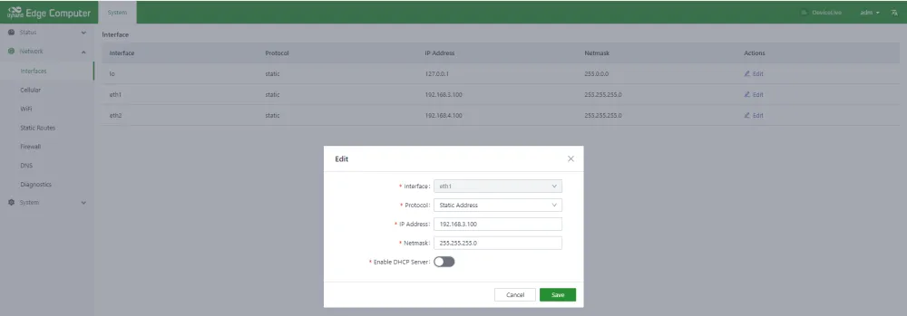</p>

<p align="center"><strong>Figure 4-7 Ethernet Interface Static IP Configuration</strong></p>

Configure the eth1 interface with a DHCP Client

<p align="center"></p>

<p align="center"><strong>Figure 4-8 Ethernet Interface DHCP Client Configuration</strong></p>

Start the dhcp server function on the eth1 interface and assign an address to the downstream device connected to eth1.

<p align="center">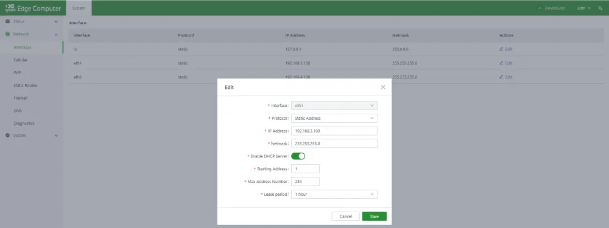</p>

<p align="center"><strong>Figure 4-9 Ethernet Interface DHCP Server Configuration</strong></p>

DHCP Server configuration parameters description:

Enable DHCP Server: The switch of DHCP Server function

Starting Address: Starting base address of DHCP Server address pool, network segment + starting address = starting ip address of address pool. In the screenshot, the network segment of eth1 is 192.168.3.0/24, and the base address is 1, then the starting address of the address pool is 192.168.3.1/24.

Max Address Number: The maximum number of addresses in the address pool.

Lease period: The length of the lease period

#### 4.2.2.2 Configure Cellular Dialing

<p align="center">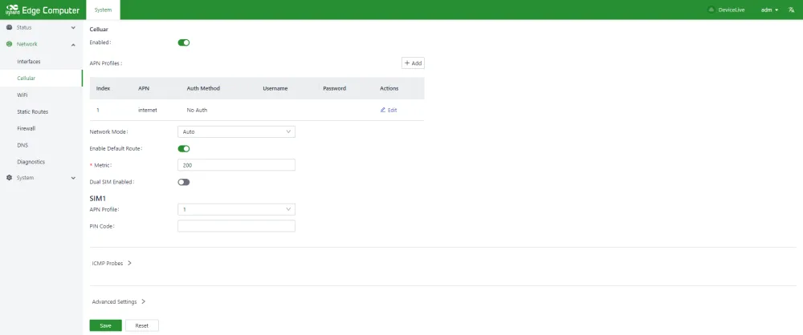</p>

<p align="center"><strong>Figure 4-10 Cellular Dialing Configuration</strong></p>

Cellular network parameters Description:

Enabled: The switch of cellular function; Enabled by default.

Profiles: A set of dial parameters used to configure APN, username, password, and authentication methods when dialing a dedicated network card. If you are not a dedicated network card, you usually do not need to change the configuration here. You can add up to 10 records to the dial-up parameter set.

Network Mode: The network mode of the cell, you can choose 3G, 4G and other related network mode, such as LTE, WCDMA, etc. If it is not clear which network mode to choose, select automatic; The program will automatically select the most appropriate network mode. The default is automatic.

Enable Default Route: Enable the add default route function, when enabled, when the dial is successful, it will add a default route of the cellular port. The default route is enabled.

Metric: This is the metric for the default routing of the cellular port. When default routing is configured on the cellular, Wi-Fi, and Ethernet ports, the metric with the lowest value is used.

<p align="center">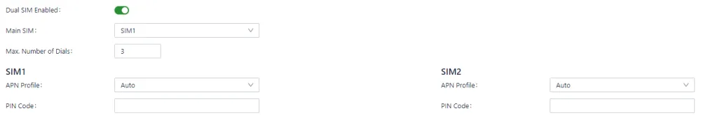</p>

<p align="center"><strong>Figure 4-11 Cellular Dual SIM Configuration</strong></p>

Dual SIM Enabled: Dual Sim enabled. In order to improve the reliability of the network, EC300 supports dual SIM and single dial. Two sim cards need to be inserted into the device. If the sim1 card fails to dial because of unpaid charges, it will automatically switch to the sim2 card for dialing. By default, it is off.

Main SIM: The main sim card, when dialing, the selected sim card will be preferred for dialing. When dialing fails to reach a certain number of times, when switching to another sim card for dialing, the default is to use sim1 for dialing.

Max Number of Dials: When the dual-SIM single-dial function is enabled, the current sim card will be dialed to another sim card for dialing when the number of dials reaches a specified number.

APN Profile: sim card selected dialing parameters set, the default value is automatic. Usually special network card usually need to configure the dial parameter set, and select the Index of the dial parameter set here.

PIN Code: The PIN code of the sim card.

<p align="center"></p>

<p align="center"><strong>Figure 4-12 Cellular ICMP Probe Configuration</strong></p>

Wireless cellular networks are complex, sometimes there will be dial-up false connection, that is, the dial-up state is successful, but the target address can not be ping; When this happens, you can simply dial again and get back to normal. IEOS cellular dialing supports ICMP probing to detect spurious connections. It is recommended that customers with cellular connections enable ICMP probing so that false connections can be quickly recovered.

ICMP probe parameters:

ICMP Detection Server Probes:  ICMP probe address; 2 probe addresses can be configured, as long as 1 address is successfully probed, it means that there is no fake connection in the cell. When neither address is configured, ICMP probe is off.

Detection Interval: How often should ICMP probes be performed?

Detection Timeout: The duration of ICMP probe timeout. If no probe response packet is received, the probe is considered to have failed.

Detection Max Retries: the maximum number of probes; When a probe fails to reach this value, a redial is triggered. Range \[1,5\]

Detection Strict: Whether strict detection is enabled. When strict detection is turned off, the detection program will detect whether the packet received by the cellular interface has changed in each detection cycle. If there is a change, it means that the cellular network is working, and ICMP packets will not be sent for detection, so as to save some traffic; If the probe is turned on, ICMP probe packets will be sent periodically regardless of whether the number of packets received by the cellular interface has changed. By default, it is off.

<p align="center"></p>

<p align="center"><strong>Figure 4-13 Cellular Advanced Configuration</strong></p>

In Advanced configuration are some less commonly used Settings options.

Debug Mode enabled: Whether the debug function is enabled. After enabled, some dial-related debugging information will be added to the log, and it is disabled by default.

Enable Infinitely Redial:  In some cases, dialing will be in an abnormal state, which can be restored by rebooting the system; By default infinite redialing is turned off, and the system will be restarted to try to recover after a certain number of dialing failures. Since dialing is enabled by default, some customers without sim card, dialing failure, the system will restart, in this case, you can open unlimited redialing; In this way, no matter how many times the dialing fails, the system will not restart.

Dial Interval; But if a dial fails, the amount of time to wait before making another dial.

Signal Query Interval: Signal query interval. When the signal is bad, you may have problems with false connections; At this time, redialing has a certain probability to solve the problem of false connection. The dialing program will check the signal strength at regular intervals; here, the signal detection period is configured.

#### 4.2.2.3 Configure the Wi-Fi 


The EC series supports both Station and AP modes.

**Station Mode**  

<p align="center"></p>

<p align="center"><strong>Figure 4-14 Wi-Fi Station Mode Configuration</strong></p>

Enable Wi-Fi: Enable the switch; Off by default

Client SSID: The ssid you want to connect to, you can enter it manually; You can also use the scan button to get nearby SSIDs that you can connect to

Enable Default Route: Enable the function of adding default route. If enabled, when the wifi connection is successful, a default route of wlan port will be added. The default route is enabled.

Metric: This is the metric for the default route of the wifi port. When the default route is configured for the cellular, Wi-Fi, and Ethernet ports, the metric with the lowest value is applied.

Auth Method: Auth method, supports no auth, WPA-PSK, WPA2-PSK, WPA-PSK/WPA2-PSK Mixed

Encrypt Mode:CCMP, TKIP, TKIP and CCMP are supported

WPA/WPA2 PSK Key: Key information

**Access Point Mode**

<p align="center">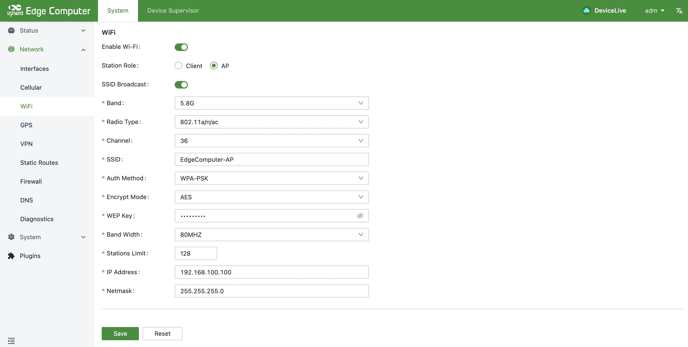</p>

<p align="center"><strong>Figure 4-15 Wi-Fi Access Point Mode Configuration</strong></p>

**SSID Broadcast:  
**

Controls whether the SSID is broadcasted. Enabled by default.

-   **Enabled:** The SSID can be detected by nearby devices.
-   **Disabled:** The SSID is hidden and must be manually entered to connect.

**Band:**

Select the Wi-Fi frequency band, such as:

-   **2.4G:** Suitable for longer coverage range.
-   **5.8G:** Suitable for high-speed data transmission.

**Radio Type:**

Wireless standard, such as:

-   **802.11a/n/ac:** Supports 5G.
-   **802.11b/g/n:** Supports 2.4G.

**Channel:**

Specifies the wireless channel used. Can be manually selected or set to default.

**SSID:**

Set the Wi-Fi network name (SSID).

**Auth Method:**

Select the Wi-Fi authentication method:

-   **Open:** No authentication.
-   **WPA-PSK**
-   **WPA2-PSK**
-   **WPA-PSK/WPA2-PSK Mixed**

**Encryption Mode:**

Wireless encryption mode, supporting:

-   **AES**
-   **TKIP**

**WEP Key (Wi-Fi Password):**

Set the Wi-Fi access password.

**Bandwidth:**

Select the bandwidth range, such as:

-   **20MHz:** Suitable for complex environments with strong anti-interference capabilities.
-   **40MHz / 80MHz:** Suitable for high-speed transmission in low-interference environments.

**Stations Limit:**

Set the maximum number of clients allowed to connect to the AP.

**IP Address:**

Local IP address in Wi-Fi AP mode (default: 192.168.100.100).

**Subnet Mask:**

Subnet configuration parameter, default: 255.255.255.0.  

#### 4.2.2.4 Configuring Static Routes  

This is a static routing for Ethernet. When the default routing for Ethernet, cellular, and wifi is configured, the default route with the lowest metric value will take effect. You need to make sure that the Metric value of the default route is different.

<p align="center">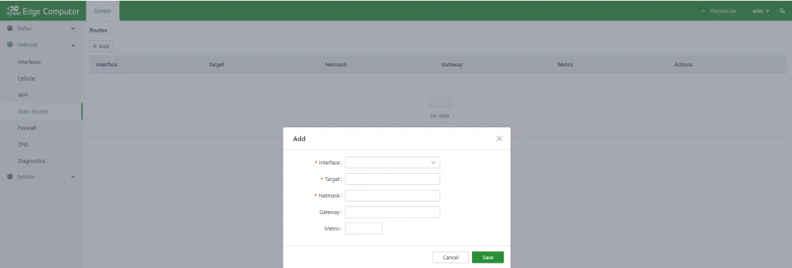</p>

<p align="center"><strong>Figure 4-16 Static Route Configuration</strong></p>

Static route configuration parameters:

Interface: The outgoing interface of the static route

Target: The target network

Netmask: Target network mask

Gateway: Next hop address

Metric: The metric for the static route

#### 4.2.2.5 Configuring the Firewall

<p align="center">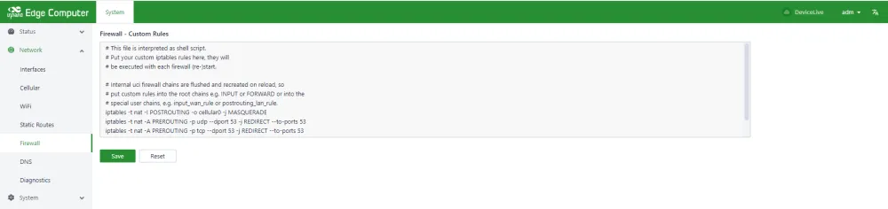</p>

<p align="center"><strong>Figure 4-17 Firewall Configuration</strong></p>

Only the iptables command is currently supported for configuration.

#### 4.2.2.6 Configuring DNS

<p align="center">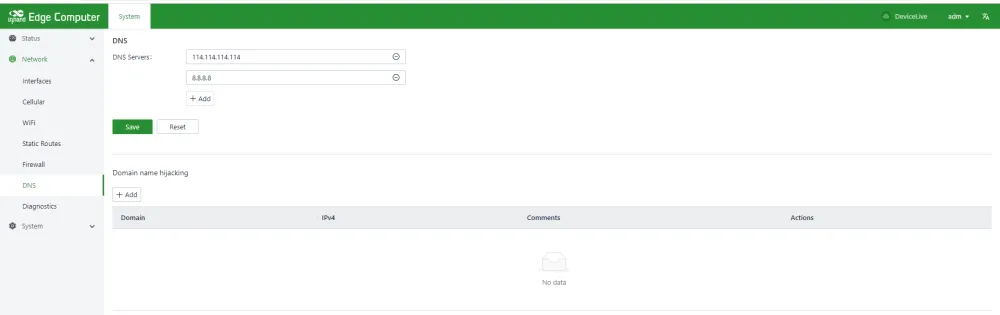</p>

<p align="center"><strong>Figure 4-18 DNS Configuration</strong></p>

DNS Servers: DNS Server address, up to 4 can be configured

Domain name hijacking: Domain name hijacking function, can realize the binding between IP address and domain name.

<p align="center"></p>

<p align="center"><strong>Figure 4-19 DNS Domain Hijacking Configuration</strong></p>

#### 4.2.2.7 Network Diagnostics

Network diagnostics support ping, traceroute and nslookup functions.

<p align="center"></p>

<p align="center"><strong>Figure 4-20 Network Diagnostics</strong></p>

#### 4.2.2.8 Configuring OpenVPN 

**Configuring OpenVPN Server**

The configuration of OpenVPN can be configured manually on the web page or by importing a configuration file. 

1\. Manual Configuration 

<p align="center">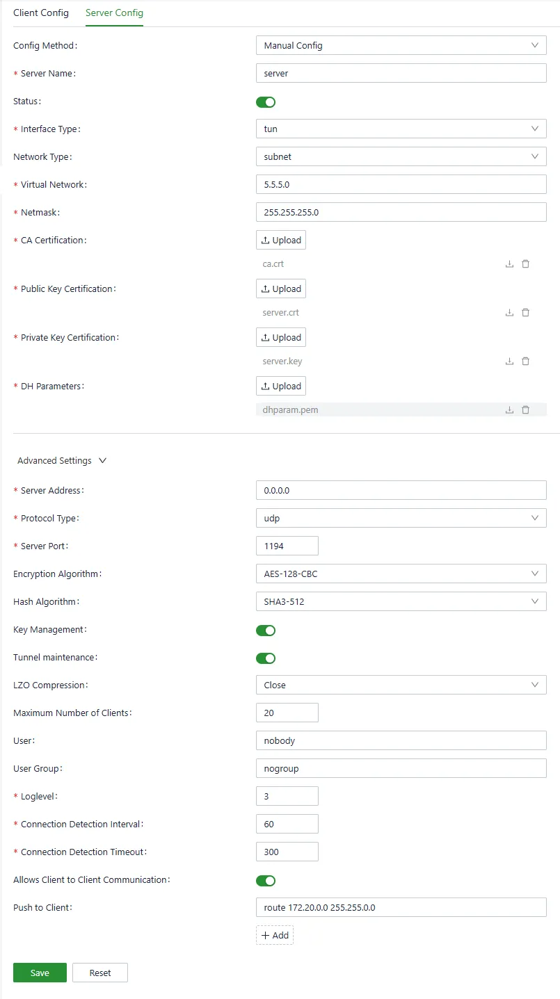</p>

<p align="center"><strong>Figure 4-21 OpenVPN Server Manual Configuration</strong></p>

1.  **Server Name** : The string that uniquely identifies the server-side configuration. It can contain only English letters and numbers, start with a letter, and can be no more than 64 characters in length. 
2.  **Status** : On or off, used to control the start or stop of the OpenVPN Server. 
3.  **Interface Type** : Currently, only tun mode is supported. 
4.  **Network Type** : Support p2p , net30 and subnet . p2p and net30 used to establish a point-to-point connection, subnet used to establish a virtual local area network. 
5.  **Virtual Network** : In subnet mode, you need to configure the network segment information of the virtual network; If it is p2p or net30 configuration, it is the local IP address and the remote IP address. 
6.  **Network Mask** : In subnet mode, you need to configure the subnet mask of the virtual network. 
7.  **CA Certificate** : The CA certificate file needs to be imported here.
8.  **Public Key Certificate** : You need to import the server's public key certificate file here. 
9.  **Private Key Certificate** : The private key certificate file of the import server is required here.
10.  **DH parameter** : The DH parameter file of the import server is required here.  

In the advanced settings, you can configure some parameters with low frequency of change.   

1.  **Server Address** : the IP address that OpenVPN listens to. By default, it listens to 0.0.0.0, that is, it listens to all IP addresses. 
2.  **Protocol Type** : Support udp and tcp , default udp . 
3.  **Server Port** : The port number that the server listens to. Default 1194 . 
4.  **Encryption Algorithm** : Configure the encryption algorithm used to ensure the confidentiality of data transmission. 
5.  **Hash Algorithm** : Configure the hash algorithm used to guarantee the integrity of data transmission. 
6.  **Key retention** : after key retention is enabled, even if OpenVPN is temporarily disconnected due to network exceptions, it can be quickly recovered without the need for a new handshake. 
7.  **The tunnel remains** : When tunnel maintenance is enabled, it can prevent the tunnel from being closed due to short-term network fluctuations. 
8.  **LZO compression** : Whether to enable LZO compression. 
9.  **Maximum number of clients** : Configure the number of clients that connect to the OpenVPN Server at the same time. 
10.  **User** : Specifies the user running the OpenVPN process.
11.  **User Group** : specify the user group to run the OpenVPN process.
12.  **Log Level** : Value range 1 to 11 , the larger the value, the more detailed the log information, ALL view the OpenVPN log in the type log.
13.  **Connection Detection Interval** : the cycle of sending heartbeat packets to check whether the VPN connection is alive. 
14.  **Connection detection timeout** : If no response is received within the timeout period, determine that the connection is disconnected and try to restart.
15.  **Allow client-to-client communication** : Whether to allow the client and the client to communicate with each other.
16.  **Push to client** : can push information such as routing and DNS to the client.   

17.  Import Configuration  

<p align="center">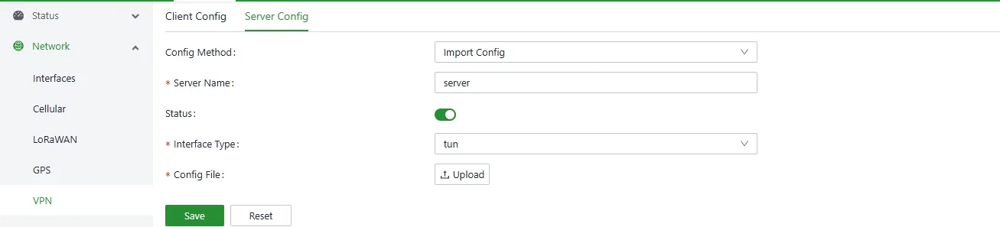</p>

<p align="center"><strong>Figure 4-22 OpenVPN Server Import Configuration</strong></p>

1.  **Server Name** : The string that uniquely identifies the server configuration. It can contain only English letters and numbers and start with a letter. The string must be no more than 64 characters in length. 
2.  **Status** : On or off, used to control the start or stop of the OpenVPN Server. 
3.  **Interface Type** : Currently, only tun mode is supported. 
4.  **Profile** : import the OpenVPN Server configuration file, which must contain information such as the CA certificate, Server certificate, and Server key.   

**Configuring the OpenVPN Client**

1. Manual Configuration  

<p align="center">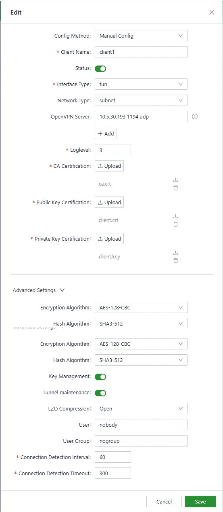</p>

<p align="center"><strong>Figure 4-23 OpenVPN Client Manual Configuration</strong></p>

1.  **Client Name** : A string that uniquely identifies the server configuration. It can contain only English letters and numbers, start with a letter, and can be no more than 64 characters in length. 
2.  **Status** : On or off, used to control the start or stop of the OpenVPN Server. 
3.  **Interface Type** : Currently, only tun mode is supported. 
4.  **Network Type** : Support p2p , net30 and subnet . p2p and net30 used to establish a point-to-point connection, subnet used to establish a virtual local area network. When the network type is p2p or net30 you need to configure the local IP address and remote IP address. 
5.  **OpenVPN Server** : configure the ip address, port number, and protocol information of the OpenVPN Server in the format of ip port proto, for example: 192.168.3.200 1194 udp you can configure up to 10 server addresses. The OpenVPN client attempts to establish a connection one at a time in order until the OpenVPN tunnel is successfully established.   

6.  **Log Level** : Value range 1 to 11 , the larger the value, the more detailed the log information, ALL view the OpenVPN log in the type log. 
7.  **CA Certificate** : The CA certificate file needs to be imported here.  

8.  **Public Key Certificate** : The public key certificate file of the client needs to be imported here. 
9.  **Private Key Certificate** : The private key certificate file of the client needs to be imported here. 

In the advanced settings, you can configure some parameters with low frequency of change.   

1.  **Encryption Algorithm** : Configure the encryption algorithm used to ensure the confidentiality of data transmission. 
2.  **Hash Algorithm** : Configure the hash algorithm used to guarantee the integrity of data transmission. 
3.  **Key retention** : After key retention is enabled, even if OpenVPN is temporarily disconnected due to network exceptions, it can be quickly recovered without the need for a new handshake. 
4.  **The tunnel remains** : When tunnel maintenance is enabled, it can prevent the tunnel from being closed due to short-term network fluctuations. 
5.  **LZO compression** : Whether to enable LZO compression. 
6.  **User** : Specifies the user running the OpenVPN process.
7.  **User Group** : Specify the user group to run the OpenVPN process.
8.  **Connection Detection Interval** : The cycle of sending heartbeat packets to check whether the VPN connection is alive. 
9.  **Connection detection timeout** : If no response is received within the timeout period, determine that the connection is disconnected and try to restart.  

2\. Import Configuration  

<p align="center">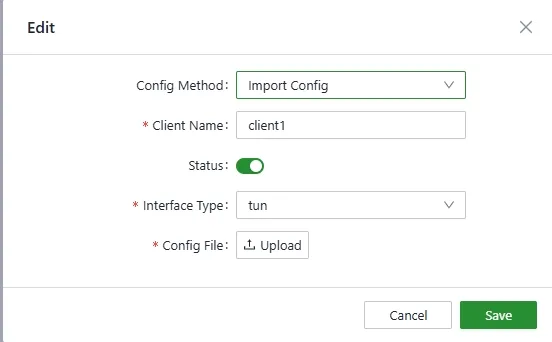</p>

<p align="center"><strong>Figure 4-24 OpenVPN Client Import Configuration</strong></p>

1.  **Client Name** : The string that uniquely identifies the client configuration. It can contain only English letters and numbers and start with a letter. The string must be no more than 64 characters in length. 
2.  **Status** : Turns on or off to control the start or stop of the OpenVPN client. 
3.  **Interface Type** : Currently, only tun mode is supported. 
4.  **Profile** : Import the OpenVPN Client configuration file. The configuration file must contain information such as the CA certificate, Client certificate, and Client key. 


### 4.2.3 System Administration

#### 4.2.3.1 Basic Configuration

**Cloud Management**

Navigate to 【System Management】→【Basic Configuration】→【Cloud Management】 to configure.

<p align="center">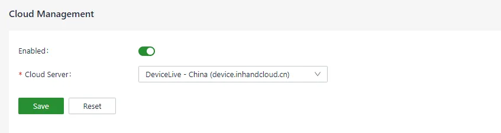</p>

<p align="center"><strong>Figure 4-25 Cloud Management Configuration</strong></p>

| Parameter | Description |
|-----------|-------------|
| Enabled | Enable switch for connecting to the DeviceLive platform |
| Cloud Server | Select the domestic or overseas DeviceLive platform address |

**Time Zone and NTP Client**

Navigate to 【System Management】→【Basic Configuration】→【Time Zone and NTP】 to configure.

<p align="center">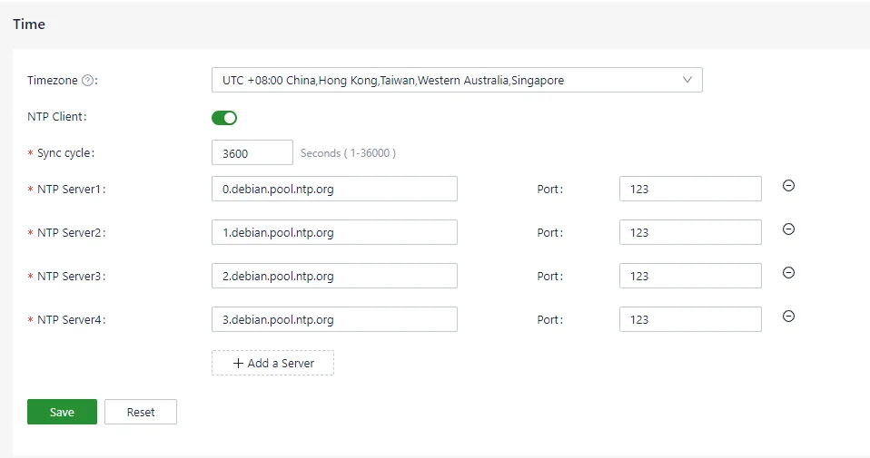</p>

<p align="center"><strong>Figure 4-26 Time Zone and NTP Configuration</strong></p>

A maximum of 10 NTP Server addresses can be configured. The program periodically sends synchronization requests to each server address in turn. After successful synchronization, the system time is written to the RTC and synchronization requests to subsequent NTP servers stop.

In addition to NTP synchronization, a manual synchronization button is available on the Device Info status page. This button is displayed only when the device time and local time differ by more than 3 seconds.

<p align="center"></p>

<p align="center"><strong>Figure 4-27 Manual Time Synchronization</strong></p>

**Configuration Import, Export, and Factory Restore**

Navigate to 【System Management】→【Basic Configuration】→【Configuration Management】 to import, export, or restore configuration.

#### 4.2.3.2 Firmware Upgrade

Navigate to 【System Management】→【Firmware Upgrade】 to upgrade the device firmware.

<p align="center"></p>

<p align="center"><strong>Figure 4-28 Firmware Upgrade</strong></p>

The automatic restart option is turned off by default. After upgrading the firmware, manually restart the system for the upgrade to take effect. When automatic restart is enabled, the system restarts automatically after a successful firmware upgrade.

#### 4.2.3.3 Others

Navigate to 【System Management】→【Others】 to restart or reset the system.

<p align="center"></p>

<p align="center"><strong>Figure 4-29 System Restart and Reset</strong></p>

> **Warning**: The reset system function restores the system configuration and file system to factory defaults. Software installed by the user will also be cleared. Use with caution.


### 4.2.4 Status

#### 4.2.4.1 Device Information

The device information status page shows hostname, device model, serial number, firmware version, kernel version, filesystem version, and an overview of CPU, memory, and disk space usage.

<p align="center">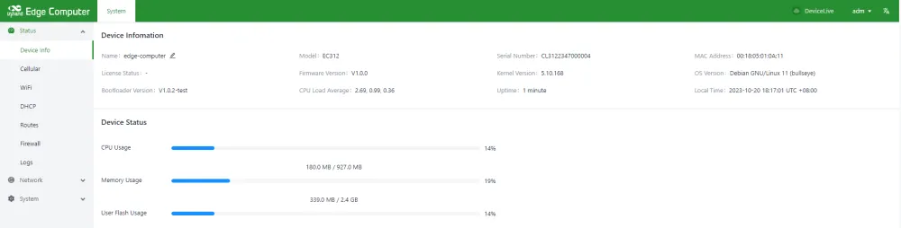</p>

<p align="center"><strong>Figure 4-30 Device Information</strong></p>

#### 4.2.4.2 Cellular Status Information

The cellular status page shows IMEI, IMSI, ICCID, signal strength of the current SIM, as well as the IP address, DNS, and other information obtained through dialing.

<p align="center">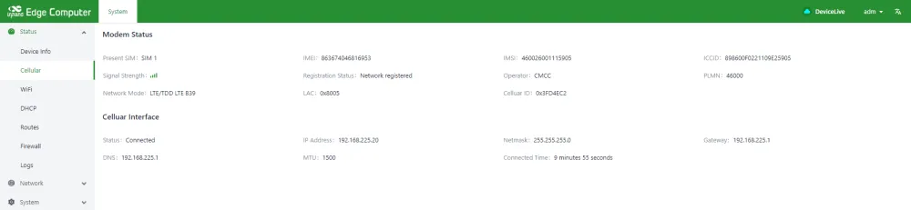</p>

<p align="center"><strong>Figure 4-31 Cellular Status Information</strong></p>

#### 4.2.4.3 Wi-Fi Status Information

The Wi-Fi status page shows the IP address, gateway, and DNS information obtained after the Wi-Fi connection was successful.

<p align="center"></p>

<p align="center"><strong>Figure 4-32 Wi-Fi Status Information</strong></p>

#### 4.2.4.4 DHCP Server Status Information

The DHCP Server status page shows the assigned IP address of the device as a DHCP Server, the client hostname, the client host MAC, and the expiration time.

<p align="center">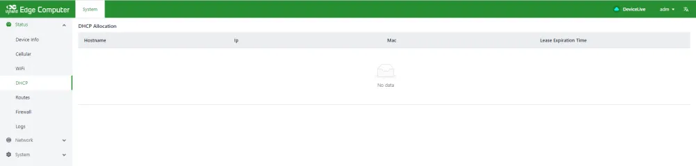</p>

<p align="center"><strong>Figure 4-33 DHCP Server Status Information</strong></p>

#### 4.2.4.5 Routing Status Information

The route status page displays IPv4 direct route, static route, and route neighbor information.

<p align="center">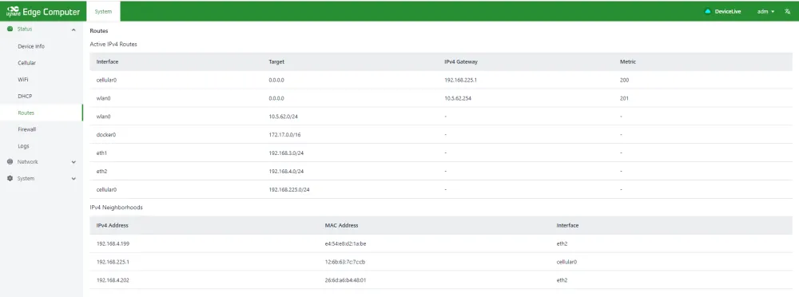</p>

<p align="center"><strong>Figure 4-34 Routing Status Information</strong></p>

#### 4.2.4.6 Firewall Status Information

Firewall status information shows filtering rules, IP address mapping rules, and other information.

<p align="center"></p>

<p align="center"><strong>Figure 4-35 Firewall Status Information</strong></p>

#### 4.2.4.7 Log Information

The log page can view the system log, user log, and set the log level, including Error, Info, Debug, and other levels. Logs can also be downloaded locally.

<p align="center"></p>

<p align="center"><strong>Figure 4-36 Log Information</strong></p>

#### 4.2.4.8 OpenVPN Status Information

**OpenVPN Server Status**

On the OpenVPN Server Status page, information such as the status update time and the connected OpenVPN clients can be viewed.

<p align="center">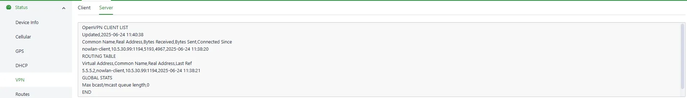</p>

<p align="center"><strong>Figure 4-37 OpenVPN Server Status</strong></p>

**OpenVPN Client Status**

On the OpenVPN Client Status page, information such as the virtual IP address obtained by the client and the tunnel connection duration can be viewed.

<p align="center">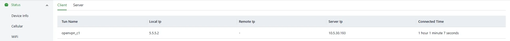</p>

<p align="center"><strong>Figure 4-38 OpenVPN Client Status</strong></p>


## 4.3 Linux-based Command-Line Management

### 4.3.1 Network management

When using the Linux command line for network and system configuration, IEOS must be disabled first. IEOS is managed through systemctl.

To stop IEOS (applies only to the current boot):

```
systemctl stop ieos_daemon
```

To prevent IEOS from starting after reboot:

```
systemctl disable ieos_daemon
```

> **Important Note**: After IEOS is turned off, wireless networking functions such as dialing and Wi-Fi require native Linux commands. Remote management on the DeviceLive platform is not available.

#### 4.3.1.1 Set Up a Static IP Address

Edit `/etc/network/interfaces.d/eth1` or `/etc/network/interfaces.d/eth2` to set the default gateway, address, network, and subnet mask:

<p align="center">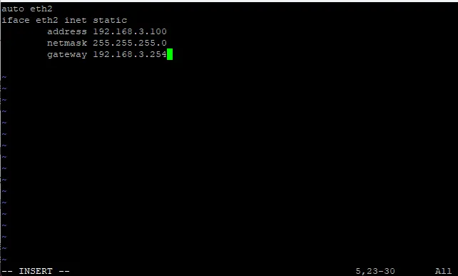</p>

<p align="center"><strong>Figure 4-39 Static IP Command Line Configuration</strong></p>

After changing the interface IP configuration, run `/etc/init.d/networking restart` to restart the network service.

#### 4.3.1.2 Set Up a Dynamic IP Address

Edit the corresponding network configuration file and set the interface to DHCP after `inet`:

<p align="center"></p>

<p align="center"><strong>Figure 4-40 DHCP Command Line Configuration</strong></p>

After changing the interface IP configuration, run `/etc/init.d/networking restart` to restart the network service.

### 4.3.2 System Administration

#### 4.3.2.1 Query Firmware Version

To check the computer firmware version:

<p align="center"></p>

<p align="center"><strong>Figure 4-41 Query Firmware Version</strong></p>

#### 4.3.2.2 Check Available Disk Space

Use the `df -h` command to check available drive space. For EC300 products, the disk partition available to users is `/dev/mmcblk0p8`.

<p align="center">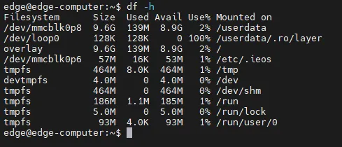</p>

<p align="center"><strong>Figure 4-42 Check Available Disk Space</strong></p>

#### 4.3.2.3 Adjust the Time

The EC300 has two time settings: system time and RTC (Real Time Clock) time. Use the `date` command to query or set the system time. Use the `hwclock` command to query or set the RTC time.

Set the system time with the command `date MMDDhhmmYYYY`:

<p align="center"></p>

<p align="center"><strong>Figure 4-43 Set System Time</strong></p>

Set the RTC time to the system time:

<p align="center"></p>

<p align="center"><strong>Figure 4-44 Set RTC Time</strong></p>

For more details about date and time, refer to:
- [https://www.debian.org/doc/manuals/system-administrator/ch-sysadmin-time.html](https://www.debian.org/doc/manuals/system-administrator/ch-sysadmin-time.html)
- [https://wiki.debian.org/DateTime](https://wiki.debian.org/DateTime)

#### 4.3.2.4 Set Time Zone

There are two ways to configure the time zone: using the `tzselect` command or the `/etc/localtime` file.

**Using tzselect**

When typing the `tzselect` command, select the approximate area by entering the number in front of the continent or ocean.

<p align="center"></p>

<p align="center"><strong>Figure 4-45 tzselect Area Selection</strong></p>

Then select the country under the continent:

<p align="center"></p>

<p align="center"><strong>Figure 4-46 tzselect Country Selection</strong></p>

After obtaining the time zone keyword, execute the following command to set the time zone:

<p align="center"></p>

<p align="center"><strong>Figure 4-47 Set Time Zone</strong></p>

**Using a Localtime File**

The localtime file is stored in `/etc/localtime`. If `/usr/share/zoneinfo/file` is not available, download the time zone information file from [https://www.iana.org/time-zones](https://www.iana.org/time-zones), and link it to the localtime file on the EC300.

> **Note**: After downloading the time zone information file, unzip it and compile the corresponding binary file using the `zic` command. The generated time zone file is `/usr/share/zoneinfo/custom_time_zone_filename`.


## 4.4 Peripheral Interfaces

### 4.4.1 Serial Ports

The EC300 has four serial ports. COM1 supports RS-232/RS-485. COM2 supports RS-485. COM3 and COM4 are expandable serial ports supporting RS-232/RS-485.

| Serial Port | Device Node | Mode |
|-------------|-------------|------|
| COM1 | /dev/ttyS4 | RS-232 / RS-485 |
| COM2 | /dev/ttyS5 | RS-485 |
| COM3 | /dev/ttyS6 | RS-232 / RS-485 (expandable) |
| COM4 | /dev/ttyS8 | RS-232 / RS-485 (expandable) |

**Standard Serial Port Pin Definition**

<p align="center">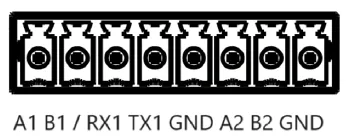</p>

<p align="center"><strong>Figure 4-48 Standard Serial Port</strong></p>

| Pin | COM1 (RS-232) | COM1 (RS-485) | COM2 (RS-485) |
|-----|---------------|---------------|---------------|
| A1 | — | A+ | — |
| B1 | — | B- | — |
| RX1 | RX | — | — |
| TX1 | TX | — | — |
| GND | GND | GND | — |
| A2 | — | — | A+ |
| B2 | — | — | B- |
| GND | — | — | GND |

**Expandable Serial Port**

<p align="center">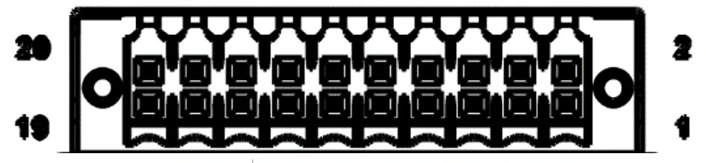</p>

<p align="center"><strong>Figure 4-49 Expandable Serial Port</strong></p>

> **Remark**: The specific support for expandable serial ports depends on the model of the expansion module.

**Change Serial Port Settings**

Check and set the serial port with the `stty` command.

<p align="center"></p>

<p align="center"><strong>Figure 4-50 stty Command Help</strong></p>

<p align="center"></p>

<p align="center"><strong>Figure 4-51 stty Command Example 1</strong></p>

<p align="center">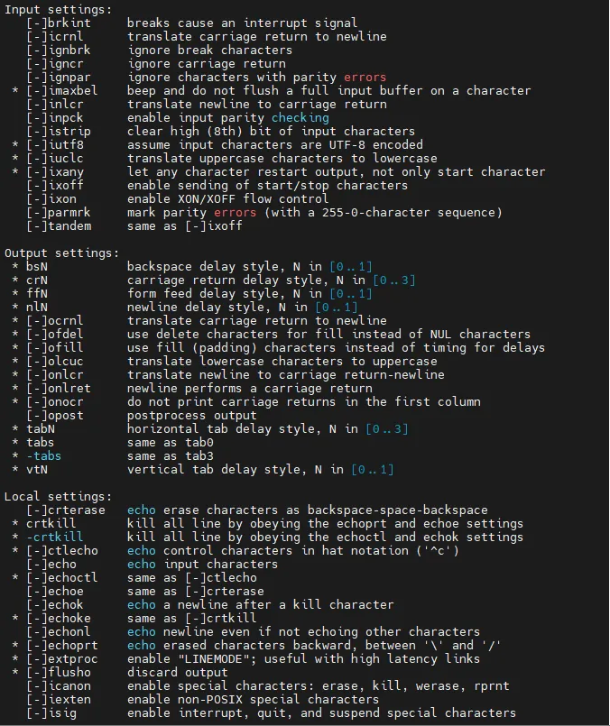</p>

<p align="center"><strong>Figure 4-52 stty Command Example 2</strong></p>

<p align="center"></p>

<p align="center"><strong>Figure 4-53 stty Command Example 3</strong></p>

<p align="center"></p>

<p align="center"><strong>Figure 4-54 stty Command Example 4</strong></p>

**Check Serial Port Information**

<p align="center"></p>

<p align="center"><strong>Figure 4-55 Check Serial Port Information</strong></p>

**Set the Baud Rate of COM1**

<p align="center"></p>

<p align="center"><strong>Figure 4-56 Set COM1 Baud Rate</strong></p>

> **Note**: Details about the stty command are available at [http://www.gnu.org/software/coreutils/manual/coreutils.html](http://www.gnu.org/software/coreutils/manual/coreutils.html).

### 4.4.2 USB Interface

The EC300 provides a USB 2.0 Host interface, mainly used for expanding storage devices. The device supports hot swapping of USB storage devices.

> **Attention**: Before disconnecting a USB mass storage device, enter the `sync` synchronization command to prevent data loss. When disconnecting the storage device, exit from the mounting directory.

### 4.4.3 MicroSD Card

The EC300 has a MicroSD card slot for extended storage, located below the front panel.

<p align="center">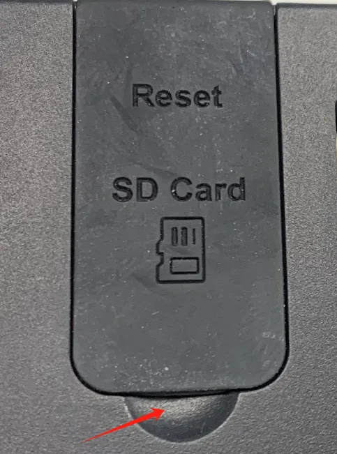</p>

<p align="center"><strong>Figure 4-57 MicroSD Card Slot (View 1)</strong></p>

<p align="center">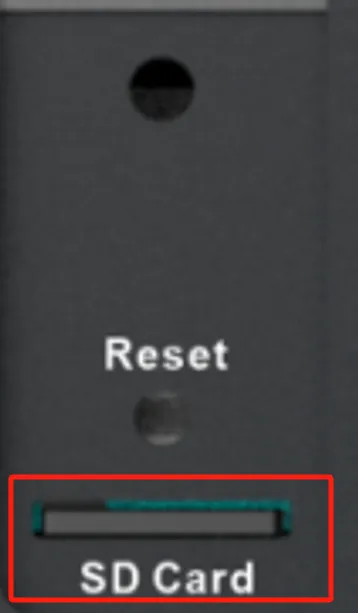</p>

<p align="center"><strong>Figure 4-58 MicroSD Card Slot (View 2)</strong></p>

The partition of the SD card needs to be formatted as FAT32:

- SD card capacity <= 32GB: Insert the SD card into a card reader and format it as FAT32 on a Windows or Linux system.
- SD card capacity > 32GB: Format under Linux using the following steps:
  1. Run `fdisk -l` to view the device node (e.g., `/dev/sda`).
  2. Run `fdisk /dev/sda` to partition (`p` to view, `d` to delete, `n` to create, `w` to save).
  3. Run `sudo mkfs.vfat -F 32 /dev/sda1` to format the partition as FAT32.
  4. Remove the SD card and insert it into the device while powered off.

> **Note**: The EC300 does not support hot swapping of the MicroSD card. For mount reference, see [https://www.man7.org/linux/man-pages/man8/mount.8.html](https://www.man7.org/linux/man-pages/man8/mount.8.html).

### 4.4.4 CAN Bus Interface

The EC300 has a 3-way CAN bus interface and supports the CAN 2.0 A/B standard. It is compatible with CAN FD and can reach a maximum speed of 5 Mbps.

| CAN Port | Pins |
|----------|------|
| CAN1 | Extension Interface PIN1, PIN2 |
| CAN2 | Extension Interface PIN5, PIN6 |
| CAN3 | Extension Interface PIN9, PIN10 |

<p align="center"></p>

<p align="center"><strong>Figure 4-59 CAN Interface</strong></p>

> **Remark**: The support for CAN interface expansion depends on the model of the expansion module.

**Configure the CAN Interface**

By default, the CAN port will be initialized. To reconfigure, first turn off the device:

<p align="center"></p>

<p align="center"><strong>Figure 4-60 Turn Off CAN Device</strong></p>

Configure the bit rate (example: 50k):

<p align="center"></p>

<p align="center"><strong>Figure 4-61 Configure CAN Bit Rate</strong></p>

Turn the device back on:

<p align="center"></p>

<p align="center"><strong>Figure 4-62 Turn On CAN Device</strong></p>

### 4.4.5 IO Ports

**Digital Input Interface**

| Parameter | Description | Min | Type | Max | Unit |
|-----------|-------------|-----|------|-----|------|
| Vds | Drain source voltage | | | 48 | V |
| VIN Low | Maximal input voltage recognized as LOW | | | 3 | V |
| VIN High | Minimal input voltage recognized as HIGH | 10 | | 30 | V |

| Interface Identification | Features | Description |
|--------------------------|----------|-------------|
| GND | Power reference ground | 4 digital input DI, wet contact state. "1": +10~+30V / -30~-10VDC; "0": 0~+3V / -3~0V. Isolate 3000VDC |
| DICOM | Input public side | |
| DI0 | Digital input port 0 | |
| DI1 | Digital input port 1 | |
| DI2 | Digital input port 2 | |
| DI3 | Digital input port 3 | |

The wiring method is as follows (only supports wet node wiring):

<p align="center">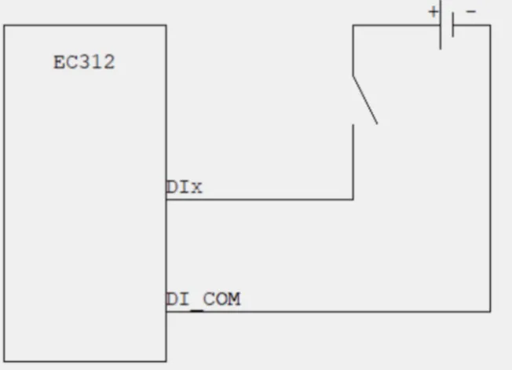</p>

<p align="center"><strong>Figure 4-63 Digital Input Wiring</strong></p>

**Digital Output Interface**

| Interface Identification | Function | Description |
|--------------------------|----------|-------------|
| DO0 | Digital output interface 0 | 4-way DO OD output, isolated 3000VDC |
| DO1 | Digital output interface 1 | |
| DO2 | Digital output interface 2 | |
| DO3 | Digital output interface 3 | |
| GND | Grounding terminal | |

The wiring method is as follows:

<p align="center">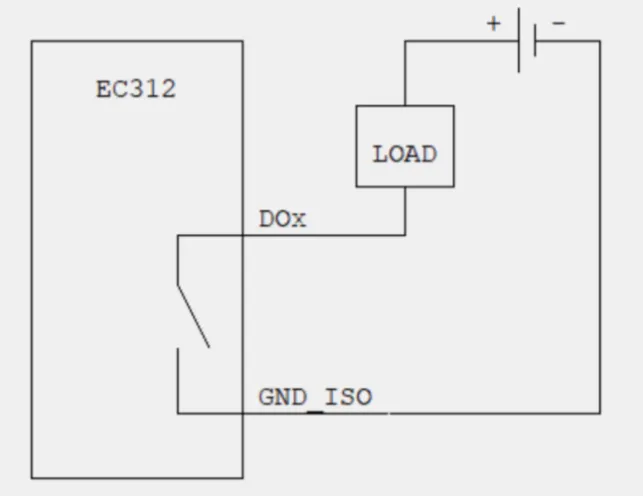</p>

<p align="center"><strong>Figure 4-64 Digital Output Wiring</strong></p>

> **Remark**: The support for digital input/output interfaces depends on the model of the expansion module.

### 4.4.6 Analog Input Interface

The EC300 supports up to two expandable AIN analog current signal input interfaces with an input range of 4-20mA. It uses the TI TLA2022 12-bit ADC, featuring a sampling rate of 1.6kHz, a resolution of 16.6uA, and an accuracy of 1%.

| Port Number | Device Description File |
|-------------|-------------------------|
| AIN1 | /dev/ain1 |
| AIN2 | /dev/ain2 |

To read the AIN current value, use `cat /dev/ain1`:

<p align="center">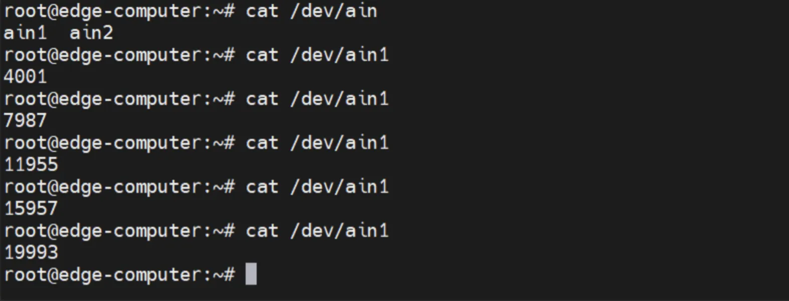</p>

<p align="center"><strong>Figure 4-65 Read Analog Input Value</strong></p>

The return value indicates the current channel current value in microamperes (uA).

### 4.4.7 SuperCapacitor

**Specifications**

The supercapacitor specifications are: 10.8V/5F.

The power-off holding module can maintain system operation for 20-30 seconds after power failure depending on the load conditions.

**Power Failure Alarm**

When the external power supply is disconnected, the system sends a UDP broadcast message `power_down` to port 9107 of IP address 255.255.255.255.

**Safe Shutdown**

Power failure refers to the continuous disconnection of the external power supply for more than 0.5 seconds. After sending the UDP broadcast message, the system waits for 3 seconds and actively performs a power off.


## 4.5 Security

### 4.5.1 Sudo Mechanism

In the EC300, the root user is disabled for better security. Sudo is a program that lets the system administrator allow an approved user to execute some commands as the root user or another user. The most basic rule is to give as few privileges as possible to get the job done. Using sudo is more secure than root session opening for a number of reasons, including:

- Grant privileges to normal users without having to know the root password (sudo will prompt for the current user's password).
- It is easy to run privileged commands via sudo, and the rest of the time, work as an unprivileged user, reducing potential damage due to wrong operations.

The default user `edge` is in the sudo group and can use `sudo` to execute system-level commands.

### 4.5.2 Firewalls

Netfilter/iptables is a packet-filtering firewall tool that comes with the Linux system. It is powerful and flexible, and can finely control the data packets flowing into, out of, and through the server.

On the web interface, navigate to 【Network】→【Firewall】 to configure firewall rules using iptables commands.

### 4.5.3 TPM2.0

TPM (Trusted Platform Module) is a hardware security module designed to provide security and encryption capabilities for computer systems. It is a secure microcontroller that can be embedded in a computer system or sold as a standalone hardware device. It contains a cryptographic coprocessor for storing encryption keys, digital certificates, and other secure data, and supports multiple cryptographic algorithms and security protocols.

The EC300 provides TPM2.0 hardware support and is pre-installed with the tpm2-tools tool, which can be used to test and verify TPM2.0.

**Generate Random Numbers**:

<p align="center">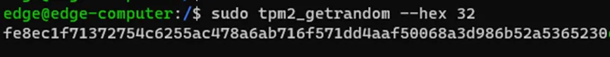</p>

<p align="center"><strong>Figure 4-66 TPM2.0 Generate Random Numbers</strong></p>

> **Note**: For more information on how to use tpm2-tools, refer to [https://tpm2-tools.readthedocs.io/en/latest/](https://tpm2-tools.readthedocs.io/en/latest/)

### 4.5.4 Secure Boot

The EC300 supports Secure Boot to ensure software integrity during the boot process.


## 4.6 Programming Guidelines

The EC300 provides a JSON format device information description file. Users who need to operate IO, LED, serial port, and other peripherals can obtain the device node information by querying the device description file.

Device description file path: `/tmp/ieos/etc/system_info.json`

### 4.6.1 IO Programming

There are 8 IO interfaces on the device: DI0~DI3 are 4 input pins, and DO0~DO3 are 4 output pins.

According to the device description file, the IO device nodes are:

| Port Number | Device Description File |
|-------------|-------------------------|
| DI0 | /sys/class/gpio/gpio454/value |
| DI1 | /sys/class/gpio/gpio455/value |
| DI2 | /sys/class/gpio/gpio456/value |
| DI3 | /sys/class/gpio/gpio457/value |
| DO0 | /sys/class/gpio/gpio323/value |
| DO1 | /sys/class/gpio/gpio453/value |
| DO2 | /sys/class/gpio/gpio465/value |
| DO3 | /sys/class/gpio/gpio461/value |

When programming the IO interface, directly operate the value under the device node.

**Example**: When DO0 needs to output a high level, write 1 to `/sys/class/gpio/gpio323/value`:

```
echo 1 > /sys/class/gpio/gpio323/value
```

When checking the level of DI0, read the value of `/sys/class/gpio/gpio454/value`:

```
cat /sys/class/gpio/gpio454/value
```

**Full Shell Script**:

```bash
#!/bin/bash

gpio323="/sys/class/gpio/gpio323/value"
gpio453="/sys/class/gpio/gpio453/value"
gpio465="/sys/class/gpio/gpio465/value"
gpio461="/sys/class/gpio/gpio461/value"

# Set DO0 high
if [ -f "$gpio323" ]; then
    echo 1 > $gpio323
else
    echo "no file exit "$gpio323
fi

# Set DO0 low
if [ -f "$gpio323" ]; then
    echo 0 > $gpio323
else
    echo "no file exit "$gpio323
fi

gpio454="/sys/class/gpio/gpio454/value"
gpio455="/sys/class/gpio/gpio455/value"
gpio456="/sys/class/gpio/gpio456/value"
gpio457="/sys/class/gpio/gpio457/value"

# Read DI0 level
if [ -f "$gpio454" ]; then
    cat $gpio454
else
    echo "no file exit "$gpio454
fi
```

### 4.6.2 LED Programming

The four lights USER1, USER2, USER3, and USER4 on the device can be used for status prompts.

According to the device description file, the LED device nodes are:

| LED | Device Node |
|-----|-------------|
| user1 | /sys/class/leds/user1 |
| user2 | /sys/class/leds/user2 |
| user3 | /sys/class/leds/user3 |
| user4 | /sys/class/leds/user4 |

Control files in the LED directory:

| File | Function |
|------|----------|
| brightness | Controls the LED on or off. Write 1 for on, 0 for off |
| trigger | Timer trigger. Write `timer` for timing trigger, `none` to cancel |
| delay_on | Time the LED is on, in ms |
| delay_off | Time the LED is off, in ms |

If trigger is configured for timing, the value in brightness will no longer take effect and will automatically change to 0.

**Example**: Turn on USER1:

```
echo 1 > /sys/class/leds/user1/brightness
```

Make USER1 flash (1 second on, 1 second off):

```
echo timer > /sys/class/leds/user1/trigger
echo 1000 > /sys/class/leds/user1/delay_on
echo 1000 > /sys/class/leds/user1/delay_off
```

### 4.6.3 Cross-Compiling

A user's own C/C++ program can be cross-compiled using the cross-compilation toolchain on the development machine, and then the object file is uploaded to the EC300 device for execution.

Cross-compilation tool zip package: `gcc-linaro-6.3.1-2017.05-x86_64_aarch64-linux-gnu.tar.gz`

**Environment Variable Configuration**:

1. Unzip the toolchain to `/opt` on the development machine.
2. Edit `~/.bashrc` and add: `PATH=$PATH:/opt/gcc-linaro-6.3.1-2017.05-x86_64_aarch64-linux-gnu/bin`
3. Execute `source ~/.bashrc` to apply the environment variables.

**Example Makefile**:

```makefile
# Define TARGET and source filenames
target := hellworld
DIRS := $(shell find . -maxdepth 3 -type d)
SRCS := $(foreach dir,$(DIRS),$(wildcard $(dir)/*.c))
OBJS := $(SRCS:.c=.o)

CC=aarch64-linux-gnu-gcc

# Define compiler and compile options
CFLAGS := -Wall -Wextra -g -Wno-unused-parameters

# define default TARGET
all: $(TARGET)

# define target file dependencies and compile commands
$(TARGET): $(OBJS)
	$(CC) $(CFLAGS) $(LIBS) $^ -o $@

# Define the command to compile the source file to the target file
%.o: %.c
	$(CC) $(CFLAGS) $(LIBS) -c $< -o $@

# Define command to clear temporary files
clean:
	rm -f $(TARGET) $(OBJS)

# declare pseudo target ".PHONY"
.PHONY: all clean
```

Run `make` in the project directory to generate the object file.

### 4.6.4 Watchdog Programming

- There is an external hardware watchdog on the device. The device will restart if the watchdog is not fed for 60 seconds.
- The system watchdog program can be disabled so that a custom program can implement the feed logic: `systemctl stop watchdog`

**Example Watchdog Program**:

```c
#include <fcntl.h>
#include <unistd.h>
#include <stdlib.h>
#include <stdio.h>
#include <string.h>
#include <signal.h>
#include <sys/types.h>
#include <sys/stat.h>

static int fd = 0;

/* Signal processing function */
void signal_handler(int signal)
{
    /* Shut down the watchdog. The device will restart after 60 seconds if the dog is not fed */
    write(fd, "V", 1);
    close(fd);
    exit(0);
}

int main(int argc, char **argv)
{
    /* Open the watchdog */
    fd = open("/dev/watchdog0", O_WRONLY);
    /* Registering Kill signals */
    signal(SIGTERM, signal_handler);

    while (1) {
        /* Feed the dog by writing */
        write(fd, "\0", 1);
        /* Feed the dog every 10 seconds */
        sleep(10);
    }
}
```


# Chapter 5 Typical Applications

## Case 1: Industrial Data Collection and Cloud Deployment

**Scenario Description**: In an industrial automation environment, the EC300 edge computer collects data from PLCs and sensors via serial ports and digital inputs, processes the data locally, and uploads it to the cloud through the cellular network for remote monitoring.

**Device Role**: The EC300 acts as an edge gateway, responsible for collecting data from field devices via serial ports and IO interfaces, performing local data processing, and transmitting data to the DeviceLive cloud platform through the cellular network.

**Configuration Steps**:
1. Install the EC300 on a DIN rail at the industrial site.
2. Connect the power supply (9-48V DC).
3. Connect PLCs or sensors to the COM1/COM2 serial ports or DI/DO interfaces.
4. Insert a valid SIM card and install the cellular antenna.
5. Power on the device and verify that the PWR and STATUS indicators are normal.
6. Log in to the web management interface.
7. Navigate to 【Network】→【Cellular】 and configure the APN parameters.
8. Verify cellular connection in 【Status】→【Cellular Status】.
9. Navigate to 【System Management】→【Basic Configuration】→【Cloud Management】 and enable DeviceLive connection.
10. On the DeviceLive platform, verify that the device is online and data is being received.

**Reference Chapters**:
- [Installation and First Use](#chapter-2-installation-and-first-use)
- [Cellular Network](#43-cellular-network)
- [Serial Ports](#4131-serial-ports)
- [Digital Input/Output](#4135-digital-input-interface)
- [DeviceLive Cloud Management](#4101-cloud-management)


# Appendix Troubleshooting

## 1 Network Connection Issues

| Symptom | Possible Cause | Troubleshooting Steps | Corresponding Chapter |
|---------|----------------|----------------------|----------------------|
| Cannot connect to cellular network | SIM card not inserted or poor contact | 1. Check whether the SIM card is correctly inserted<br>2. Reinsert the SIM card | [SIM Card Installation](#225-sim-card-installation) |
| Cannot connect to cellular network | APN parameter configuration error | 1. Verify APN parameters are correct<br>2. Contact the operator to obtain the correct APN | [Cellular Network](#43-cellular-network) |
| Cannot connect to cellular network | Weak or no signal | 1. Check whether the antenna is connected<br>2. Adjust the device position or antenna orientation | [Antenna Installation](#225-antenna-installation) |
| Cannot connect to cellular network | Cellular function disabled | 1. Check whether the cellular function is enabled in the web interface<br>2. Enable the cellular switch and save | [Cellular Network](#43-cellular-network) |
| Web interface cannot be opened | Incorrect IP address | 1. Confirm the PC and device are in the same subnet<br>2. Check the device default IP address | [First Login via Web](#227-first-login-via-web-interface) |
| Web interface cannot be opened | Browser compatibility issue | 1. Try a different browser (recommended: Chrome)<br>2. Clear the browser cache | [First Login via Web](#227-first-login-via-web-interface) |
| Web interface cannot be opened | HTTPS port blocked | 1. Confirm the URL uses HTTPS and port 9100<br>2. Check the PC firewall settings | [First Login via Web](#227-first-login-via-web-interface) |
| Cannot ping the device | Network cable not connected | 1. Check the network cable connection<br>2. Replace the network cable | [Connect to the Device](#2216-first-login-via-ssh) |
| Cannot ping the device | PC IP configuration error | 1. Set the PC IP to the same subnet as the device<br>2. Disable and re-enable the network adapter | [Connect to the Device](#2216-first-login-via-ssh) |
| Wi-Fi connection failure | Incorrect SSID or password | 1. Verify the SSID and password are correct<br>2. Rescan and reconnect | [Wi-Fi Configuration](#44-wi-fi) |
| Wi-Fi connection failure | Wi-Fi function disabled | 1. Enable Wi-Fi in the web interface<br>2. Save and wait for the connection | [Wi-Fi Configuration](#44-wi-fi) |

## 2 SSH Access Issues

| Symptom | Possible Cause | Troubleshooting Steps | Corresponding Chapter |
|---------|----------------|----------------------|----------------------|
| SSH connection refused | Incorrect IP address | 1. Verify the device IP address<br>2. Check the PC network configuration | [First Login via SSH](#2216-first-login-via-ssh) |
| SSH connection refused | SSH service not running | 1. Verify the device is powered on and started<br>2. Check the device status indicators | [Indicator Lights](#14-indicator-lights) |
| Login failure | Incorrect username or password | 1. Verify the default username: edge<br>2. Verify the default password: security@edge | [Default Settings](#16-default-settings) |

## 3 System Issues

| Symptom | Possible Cause | Troubleshooting Steps | Corresponding Chapter |
|---------|----------------|----------------------|----------------------|
| Device cannot start | Power supply abnormal | 1. Check the power supply voltage (9-48V DC)<br>2. Check the power cable connection | [Power Connection](#223-power-connection) |
| Device cannot start | System startup exception | 1. Check the STATUS indicator status<br>2. Perform a factory reset if necessary | [Factory Reset](#15-factory-reset) |
| Factory reset fails | Reset button not pressed long enough | 1. Long press the Reset key for 10-20 seconds<br>2. Wait for the WARN light to stay solid on | [Factory Reset](#15-factory-reset) |
| Firmware upgrade fails | Incorrect firmware file | 1. Verify the firmware file matches the device model<br>2. Re-download the firmware file | [Firmware Upgrade](#4104-firmware-upgrade) |
| Device restarts unexpectedly | Infinite redial disabled with no SIM card | 1. Insert a valid SIM card<br>2. Or enable infinitely redial in cellular advanced settings | [Cellular Advanced](#434-advanced-configuration) |

## 4 Peripheral Interface Issues

| Symptom | Possible Cause | Troubleshooting Steps | Corresponding Chapter |
|---------|----------------|----------------------|----------------------|
| Serial port communication failure | Incorrect baud rate | 1. Check and set the correct baud rate using `stty`<br>2. Verify the serial port mode (RS-232/RS-485) | [Serial Ports](#4131-serial-ports) |
| Serial port communication failure | Incorrect wiring | 1. Verify TX/RX or A/B wiring is correct<br>2. Check the GND connection | [Serial Port Pin Definition](#4131-serial-ports) |
| USB storage not recognized | Unsupported file system | 1. Format the USB device as FAT32 or ext4<br>2. Reinsert the device | [USB Interface](#4132-usb-interface) |
| MicroSD card not recognized | Unsupported file system | 1. Format the SD card as FAT32<br>2. Ensure the device is powered off during insertion | [MicroSD Card](#4133-microsd-card) |
| DI/DO not working | Expansion module not supported | 1. Verify the expansion module model supports DI/DO<br>2. Check the extension interface pin definition | [Extension Interface](#1314-interface-description) |
| CAN communication failure | Incorrect bit rate | 1. Check and configure the correct CAN bit rate<br>2. Verify the CAN interface is up | [CAN Bus Interface](#4134-can-bus-interface) |


# Appendix Safety Precautions

1. The device must be used within the specified temperature and humidity ranges.
2. Do not use the device in flammable or explosive environments.
3. Verify that the power supply voltage meets the device specifications (9-48V DC) before connecting power.
4. The SIM card and MicroSD card must be installed or removed only when the device is powered off.
5. Before disconnecting a USB mass storage device, execute the `sync` command to prevent data loss.
6. Non-professionals must not open the device enclosure due to electric shock risk.
7. Ensure proper grounding when installing the device in an industrial cabinet.
8. Do not expose the device to direct sunlight or rain for extended periods.
9. Use only certified power adapters and antennas to avoid interference or damage.
10. When performing a factory reset, ensure that critical data has been backed up to external storage.

> **Warning**: Non-professionals must not open the device enclosure. Electric shock risk.

> **Warning**: System reset will erase all user data and configurations. Back up critical data before resetting.


# FAQ Frequently Asked Questions

### Question 1: What is the difference between the EC300 and a standard industrial PC?

1. The EC300 is an edge computer designed for industrial IoT applications with built-in cellular, Wi-Fi, and cloud management capabilities.
2. It supports industrial interfaces such as RS-232, RS-485, CAN bus, digital input/output, and analog input.
3. The device includes hardware security features such as Secure Boot and TPM2.0.
4. It supports the IEOS web management system and DeviceLive cloud platform for remote management.
5. Standard industrial PCs typically lack integrated wireless connectivity and industrial I/O interfaces.

### Question 2: Why cannot the device connect to the cellular network?

1. Physical environment: Check whether the SIM card is inserted into the correct slot and whether the cellular antenna is installed.
2. APN settings: Ensure the APN configuration matches the information provided by the operator.
3. Check device connectivity: Log in to the device web interface and use the network diagnostic tool to ping 8.8.8.8. If successful, check the connectivity between the PC and the device.
4. Verify SIM card status: Remove the SIM card and install it in a mobile phone to verify it can connect to the network.
5. Restart: Power off the device, wait a few seconds, and reconnect power to retry the network connection.
6. Factory reset: Restore the device to factory defaults and retry the network connection.

### Question 3: How to disable IEOS and use native Linux commands?

1. Log in to the device via SSH.
2. Execute `systemctl stop ieos_daemon` to stop IEOS for the current session.
3. Execute `systemctl disable ieos_daemon` to prevent IEOS from starting after reboot.
4. Use native Linux commands for network and system management.
5. To re-enable IEOS, execute `systemctl enable ieos_daemon` and `systemctl start ieos_daemon`.

> **Note**: After IEOS is disabled, wireless networking functions require native Linux commands, and DeviceLive remote management is unavailable.

### Question 4: How to change the default web login password?

1. Log in to the web management interface with the default credentials.
2. Navigate to the user management or system settings page (depending on the IEOS version).
3. Change the password and save.
4. For security reasons, it is recommended to disable the default `adm` account and create a new administrator account.

### Question 5: What expansion modules are supported by the EC300?

| Expansion Module | Function |
|------------------|----------|
| NAAD | 2x 4-20mA analog input + 4x DI + 4x DO |
| N44C | 2x RS-485 + 1x CAN FD |
| N4CC | 1x RS-485 + 2x CAN FD |
| N44D | 2x RS-485 + 4x DI + 4x DO |
| — | No expansion module |

For detailed selection instructions, refer to the EC312 Series Edge Computer Product Specification.

### Question 6: How to read digital input and control digital output via programming?

1. Query the device description file at `/tmp/ieos/etc/system_info.json` to obtain the device node paths.
2. Read DI status using `cat /sys/class/gpio/gpioXXX/value`.
3. Control DO status using `echo 1 > /sys/class/gpio/gpioXXX/value` (high) or `echo 0 > /sys/class/gpio/gpioXXX/value` (low).
4. Refer to the Programming Guidelines section for sample shell scripts.

### Question 7: Why does the device restart automatically?

1. Check whether the cellular infinite redial option is disabled and the device has no valid SIM card. In this case, the system may restart after repeated dialing failures.
2. Check whether the hardware watchdog is triggered due to a program exception.
3. Check whether an automatic restart is configured after firmware upgrade.
4. Check the power supply stability. Voltage fluctuations may cause unexpected restarts.

