# EC312 CAN-to-AWS Configuration Manual

## 1. Document Information

- **Product model:** InHand EC312 Edge Computing Gateway
- **Plug-in used:** Device Supervisor (DSA)
- **Cloud:** AWS IoT Core
- **Reference case:** Differential-pressure (DP) sensor on CAN ID `0x18FF0155` → AWS IoT
- **Date:** 2026-05-21

> The overall data flow: **The Python app receives the CAN data and publishes it to the internal MQTT broker, which then writes the data to the virtual controller. Next, log in to the EC312 Web UI, configure the virtual controller and the cloud connector under Device Supervisor (DSA), to publish the data to AWS.**


---

## 2. Prerequisites

1. EC312 powered on (DC 9–36 V) and reachable on its LAN port.
2. A laptop connected to **EC312 ETH2** (LAN) and configured to the same subnet (default LAN `192.168.4.0/24`).
3. SIM card inserted (insert with the device powered OFF).
4. AWS account ready, with permission to create a **Thing**, **Policy** and download **X.509 certificates** in AWS IoT Core.
5. SSH client (e.g. MobaXterm, PuTTY, or `ssh` on macOS/Linux).
6. A web browser for the EC312 Web UI.

Default credentials (factory):

| Item | Value |
|---|---|
| LAN IP | `192.168.2.1` (router) / `192.168.4.100` (edge OS) |
| Web username | `adm` |
| Web password | `123456` *(or random — see device label)* |
| SSH user | `edge` |
| SSH password | `security@edge` |

> **Change all default passwords after first login.**

---

## 3. Part 1 — CAN-bus Reader (Python on EC312 edge OS)

### 3.1 Connect with SSH

Connect the PC to **EC312 ETH2** and SSH into the edge OS:

```bash
ssh edge@192.168.4.100
# password: security@edge
```


### 3.2 Switch to root

```bash
sudo -s
# password: security@edge
```

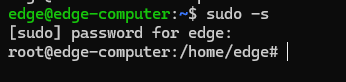

### 3.3 Confirm internet connectivity

```bash
ping 8.8.8.8 -c 4
```

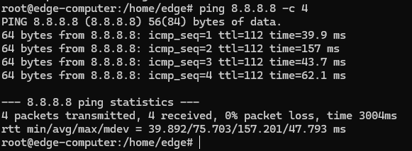

### 3.4 Update APT sources

```bash
apt-get update
```


### 3.5 Install pip

```bash
apt-get install -y python3-pip
```

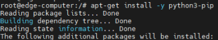

### 3.6 Install `python-can`

```bash
pip3 install python-can
apt install python3-can
```

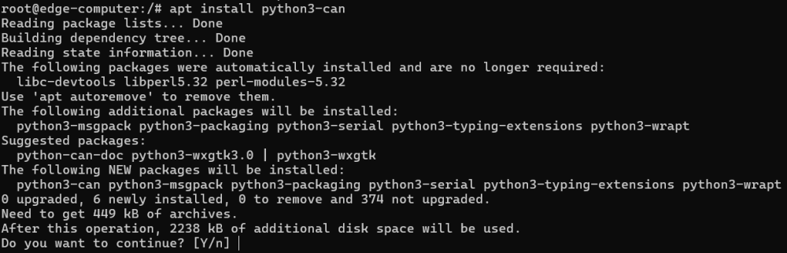

### 3.7 Write the first test script

Save the file as `can-ec312.py`:

```python
import can
import time

def read_dp_sensor_data(can_interface):
    """
    Reads data from a differential pressure (DP) sensor over CAN,
    decodes pressure & temperature and prints them.
    """
    bus = can.interface.Bus(can_interface, bustype='socketcan')

    while True:
        message = bus.recv()

        # Filter by arbitration ID (0x18FF0155 in this case)
        if message.arbitration_id == 0x18FF0155:
            pressure    = (message.data[0] << 8) | message.data[1]
            temperature = (message.data[2] << 8) | message.data[3]

            pressure_bar       = pressure / 100.0
            temperature_celsius = temperature / 10.0

            print(f"Pressure: {pressure_bar:.2f} bar, "
                  f"Temperature: {temperature_celsius:.2f} °C")
            print(f"Raw Pressure Data (message.data[0]): {hex(message.data[0])}")

        time.sleep(1)

if __name__ == "__main__":
    can_interface = 'can2'  # adjust if your CAN port is different
    read_dp_sensor_data(can_interface)
```

### 3.8 Connect the CAN sensor to `CAN2`

Wire the DP sensor (or whichever CAN device) to the EC312 `CAN2` port:


### 3.9 Run the Python script

```bash
python3 ./can-ec312.py
```

You should see decoded pressure and temperature values printed to the console.

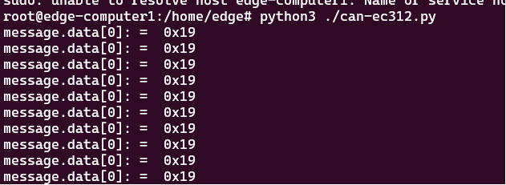

---

## 4. Part 2 — Create the Virtual Controller in Device Supervisor

Log in to the EC312 Web UI (`https://<EC312_LAN_IP>`) and open **Device Supervisor (DSA)**. Reference:
<https://help.inhand.com/portal/en/kb/articles/dsa>

### 4.1 Create a virtual controller


### 4.2 Add a measurement tag

Add a tag named `pressure` (as an example). It will represent the value the Python app writes through MQTT.


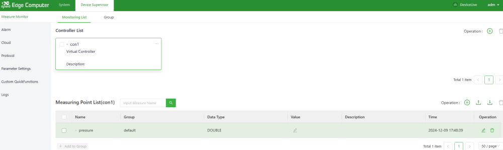

### 4.3 Note the **Service ID** of the controller

Each virtual controller has its own **driver service ID**. You will need it as `{driverServiceId}` in the MQTT topic.

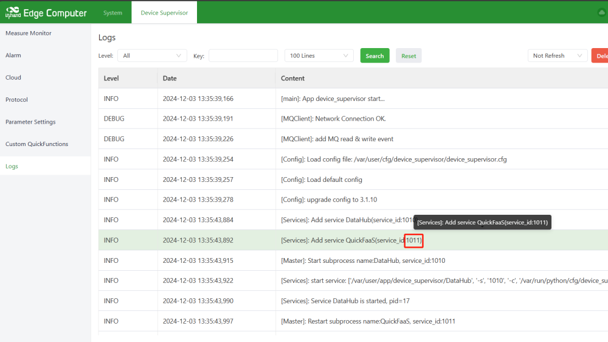

---

## 5. Part 3 — Write CAN data into the Virtual Controller via Internal MQTT

Modify the Python script to connect to the **internal MQTT broker** of Device Supervisor and publish on the south-bound topic. Reference:
<https://help.inhand.com/portal/en/kb/articles/dsa#21_Connect_to_the_internal_MQTT_Broker>

Internal MQTT broker (fixed):

| Item | Value |
|---|---|
| Host | `127.0.0.1` |
| Port | `9105` |
| Username | `inhand` |
| Password | `inhand` |
| South-bound write topic | `ds2/eventbus/south/read/{driverServiceId}` |


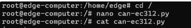

### 5.1 Updated Python script (with MQTT)

```python
import can
import time
import json
import paho.mqtt.client as mqtt

# --- MQTT Configuration ---
MQTT_SERVER       = "127.0.0.1"
MQTT_PORT         = 9105
MQTT_USERNAME     = "inhand"
MQTT_PASSWORD     = "inhand"
MQTT_TOPIC        = "ds2/eventbus/south/read/{driverServiceId}"
DRIVER_SERVICE_ID = "exampleServiceId"   # <-- replace with the real service ID

mqtt_client = mqtt.Client()
mqtt_client.username_pw_set(MQTT_USERNAME, MQTT_PASSWORD)
mqtt_client.connect(MQTT_SERVER, MQTT_PORT, keepalive=60)

def read_dp_sensor_data(can_interface):
    bus = can.interface.Bus(can_interface, bustype='socketcan')

    while True:
        try:
            message = bus.recv()
            if message and message.arbitration_id == 0x18FF0155:
                pressure    = (message.data[0] << 8) | message.data[1]
                temperature = (message.data[2] << 8) | message.data[3]

                pressure_bar        = pressure / 100.0
                temperature_celsius = temperature / 10.0

                payload = {
                    "controllers": [
                        {
                            "name": "con1",
                            "version": "d3b0c5fc05cb72e7759c95f346e29f8d",
                            "health": 1,
                            "timestamp": int(time.time()),
                            "measures": [
                                {
                                    "name": "pressure",
                                    "health": 1,
                                    "timestamp": int(time.time()),
                                    "timestampMsec": int(time.time() * 1000),
                                    "value": pressure_bar
                                }
                            ]
                        }
                    ]
                }

                mqtt_topic   = MQTT_TOPIC.format(driverServiceId=DRIVER_SERVICE_ID)
                mqtt_payload = json.dumps(payload)
                mqtt_client.publish(mqtt_topic, mqtt_payload, qos=1)

            time.sleep(1)
        except KeyboardInterrupt:
            print("Exiting...")
            break
        except Exception as e:
            print(f"Error during processing: {e}")

if __name__ == "__main__":
    can_interface = 'can2'
    read_dp_sensor_data(can_interface)
```

> Install the MQTT library if needed: `pip3 install paho-mqtt`

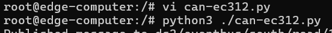

### 5.2 Verify in the Virtual Controller

Open Device Supervisor → Virtual Controller and confirm that the `pressure` tag updates with the value pushed from the internal MQTT bus.

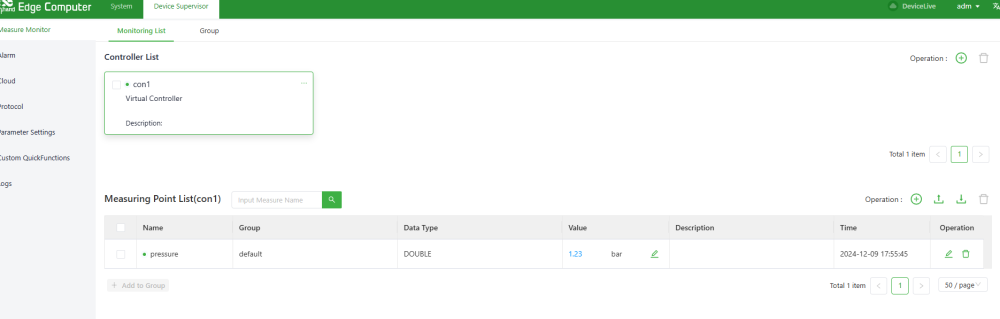

---

## 6. Part 4 — Connect Device Supervisor to AWS IoT Core

AWS IoT configuration reference:
<https://help.inhand.com/portal/en/kb/articles/dsa#AWS_IoT_Instructions>

### 6.1 Prepare AWS

In the AWS IoT Core console:

1. Create a **Thing**.
2. Create or attach a **Policy** that allows `iot:Connect`, `iot:Publish`, `iot:Subscribe`, `iot:Receive` on the topics you will use. *(Detailed steps in section 6.2 below.)*
3. Generate / download the X.509 **certificate**, **private key** and the **Amazon root CA**.
4. Take note of your AWS IoT **endpoint** (Settings → Device data endpoint), e.g. `xxxxxxxxxxxxxx-ats.iot.<region>.amazonaws.com`. (You can also copy the Domain name from **AWS IoT Core** → **Connect** → **Domain configurations** and use it as the endpoint for the device to connect to AWS IoT Core.)

### 6.2 Create the AWS IoT Policy

**Console steps**

1. Log in to the **AWS Management Console** and open the **IoT Core** service.
2. Left navigation → **Manage → Security → Policies** (in some regions: **Security → Policies**).
3. Click **Create policy** (top-right).
4. Under **Policy properties**:
   - **Policy name** — e.g. `EC312_CAN_AWS_Policy`.
   - **Policy document** — switch to the **JSON** editor (clearer than the default Builder mode).
5. Paste the JSON below (replace topic names with your own), then click **Create**.
6. After creation, attach the policy to the device certificate:
   **Manage → All devices → Things → *your Thing* → Certificates → select the certificate → Actions → Attach policy →** pick the policy you just created.

> **Important:** the policy is attached to the **certificate**, not to the Thing. A single certificate can have multiple policies attached.

**Policy JSON — recommended (least-privilege)**

```json
{
  "Version": "2012-10-17",
  "Statement": [
    {
      "Effect": "Allow",
      "Action": "iot:Connect",
      "Resource": "arn:aws:iot:<region>:<account-id>:client/${iot:Connection.Thing.ThingName}"
    },
    {
      "Effect": "Allow",
      "Action": "iot:Publish",
      "Resource": [
        "arn:aws:iot:<region>:<account-id>:topic/ec312/pressure"
      ]
    },
    {
      "Effect": "Allow",
      "Action": "iot:Subscribe",
      "Resource": [
        "arn:aws:iot:<region>:<account-id>:topicfilter/ec312/cmd"
      ]
    },
    {
      "Effect": "Allow",
      "Action": "iot:Receive",
      "Resource": [
        "arn:aws:iot:<region>:<account-id>:topic/ec312/cmd"
      ]
    }
  ]
}
```

Replace the placeholders:

| Placeholder | Value |
|---|---|
| `<region>` | AWS region — e.g. `us-east-1`, `ap-southeast-1`. For AWS China prefix the ARN with `aws-cn:` (e.g. `arn:aws-cn:iot:cn-northwest-1:…`). |
| `<account-id>` | Your 12-digit AWS account ID (top-right of console under your user). |
| `ec312/pressure` | The **publish** topic — must match the *Publish topic* you set in DSA. |
| `ec312/cmd` | The **subscribe** topic for downlink commands. Remove the Subscribe/Receive statements if you don't need downlink. |

**Important traps to avoid**

- **Publish / Receive** use `topic/<name>` (an exact topic resource).
- **Subscribe** uses `topicfilter/<name>` — even for an exact topic name. Using `topic/` here will return `not authorized`.
- The `iot:Connect` resource uses `${iot:Connection.Thing.ThingName}`, which forces the device to connect with a Client ID equal to its Thing name. Make sure the **Client ID** field in DSA matches the Thing name in AWS, otherwise the connection is refused. (Or relax it to `client/*` — not recommended for production.)
- TLS requires the device clock to be correct. EC312 must have a working NTP / cellular time sync, otherwise the certificate handshake fails.

**Policy JSON — permissive (testing only)**

If you just want to validate the link first, use the wildcard policy below, then tighten it once everything works:

```json
{
  "Version": "2012-10-17",
  "Statement": [
    {
      "Effect": "Allow",
      "Action": ["iot:Connect", "iot:Publish", "iot:Subscribe", "iot:Receive"],
      "Resource": "*"
    }
  ]
}
```

> Do not leave the permissive policy in production — switch to the least-privilege version above as soon as the pipeline is verified.

### 6.3 Configure AWS IoT in DSA

In EC312 Web UI → **Device Supervisor → Cloud / Northbound → AWS IoT**:


Fill in:

| Field | Value |
|---|---|
| Endpoint | the AWS IoT data endpoint copied above |
| Client ID / Thing name | as registered in AWS |
| Port | `8883` |
| CA certificate | Amazon root CA |
| Client certificate | the device certificate generated for this Thing |
| Client private key | the matching private key |
| Publish topic | e.g. `ec312/pressure` |
| Subscribe topic (optional) | e.g. `ec312/cmd` |

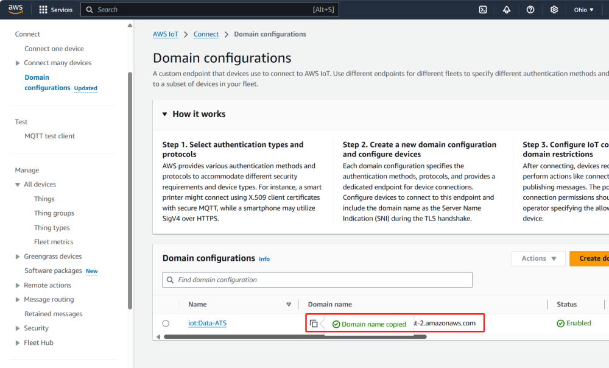


---

## 7. Part 5 — Publish to AWS and Verify

### 7.1 Publish from EC312

The configured publish topic on the EC312 side (this example):


### 7.2 Subscribe on AWS

In AWS IoT Core → **MQTT test client**, subscribe to the same topic and watch the live messages from EC312:

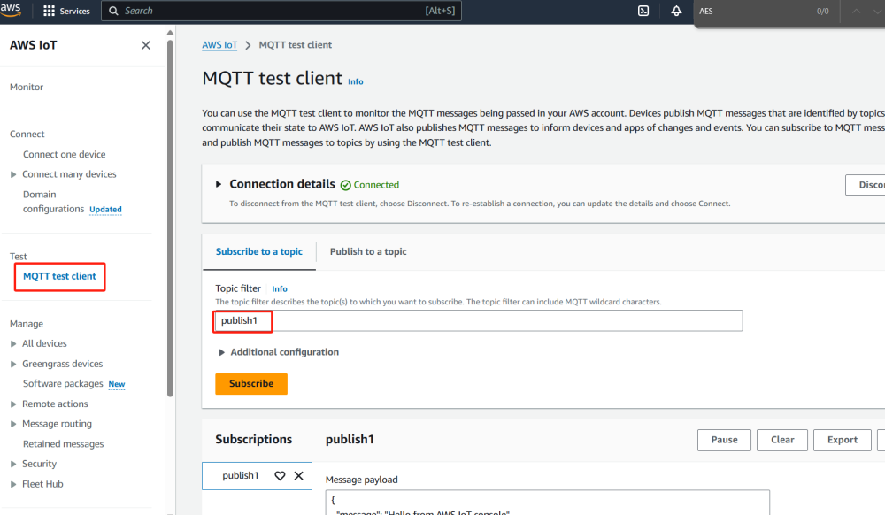

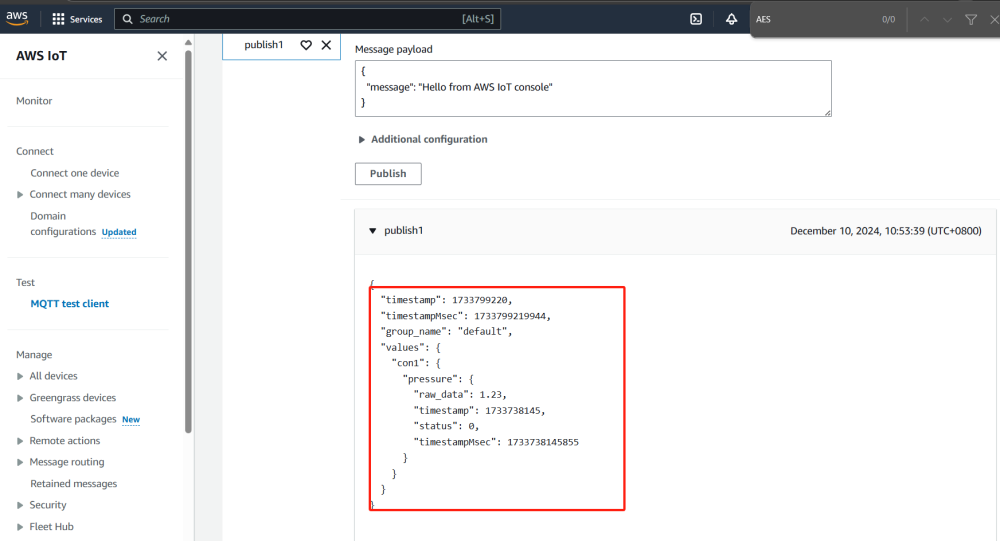

If the values match what the Python app prints in the SSH console, the end-to-end pipeline (CAN → Python → Internal MQTT → Virtual Controller → AWS IoT) is working.

---

## 8. Optional — Hardening & Operations

### 8.1 Change the default web password

`System → Admin Access → User`: change the password for `adm`. Apply and save.

### 8.2 Restrict remote management

`System → Admin Access`: choose which service (HTTPS / SSH), which port, and whether to allow remote (WAN) access.

### 8.3 Enable Device Manager (cloud O&M)

`Services → Device Remote Management Platform`:

1. Enable.
2. Service type: **Device Manager**.
3. Server: choose **China** or **International** based on your project.
4. Account: your InHand Device Manager account.

### 8.4 Backup the configuration

`Services → Configuration Management → Router Config → Backup Config`.
Restore via the **Import Config** button (reboot to take effect).

### 8.5 Run the Python app on boot

Make the script a systemd service so it survives reboots:

```ini
# /etc/systemd/system/can-aws.service
[Unit]
Description=EC312 CAN to AWS bridge
After=network-online.target

[Service]
User=root
ExecStart=/usr/bin/python3 /root/can-ec312.py
Restart=on-failure
RestartSec=5

[Install]
WantedBy=multi-user.target
```

```bash
systemctl enable can-aws
systemctl start can-aws
systemctl status can-aws
```

---

## 9. Troubleshooting

| Symptom | Check |
|---|---|
| Cannot open Web UI | Same subnet? IP conflict? Try factory reset. |
| Cellular cannot dial up | SIM seated? APN correct? Signal value 21–30? |
| Signal OK but cannot reach AWS | LAN IP / gateway / DNS correct on EC312? SIM whitelist allows the AWS endpoint? |
| `can.interface.Bus` raises `OSError` | `can2` is up? `ip link show can2` — `ifconfig can2 up` if needed. |
| No frames received | Wrong arbitration ID? Termination resistor missing? Baud rate mismatch? |
| MQTT publish fails to internal broker | Username `inhand` / password `inhand`? Port `9105`? Service ID matches the controller? |
| AWS IoT connection refused | Certificate / policy / endpoint correct? Time on EC312 synced (TLS needs valid clock)? |

---

## 10. Safety Notes

- Ground the device properly on industrial / vehicle sites.
- Do not hot-plug serial / CAN cables while powered.
- Back up the configuration after every change.
- Change default passwords periodically.
- Only authorized personnel should operate the gateway.

---
