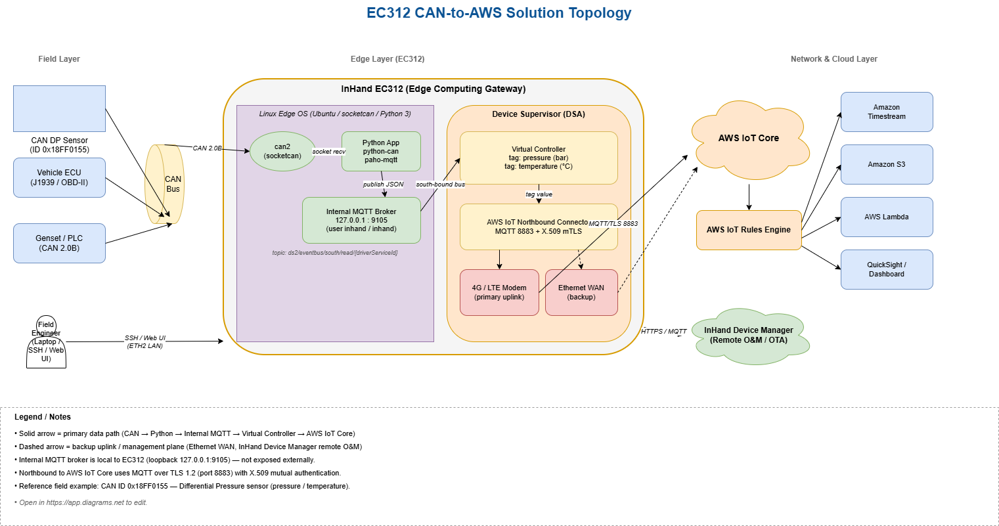

# EC312 CAN-to-AWS Solution 

**Product:** InHand EC312 Edge Computing Gateway

**Use Case:** CAN-bus Data Acquisition & Forwarding to AWS IoT Core

---

## 1. Solution Overview

### 1.1 Background

With the rapid adoption of Industrial IoT (IIoT), Smart Factory, Smart Mobility and Smart Operations, a large amount of equipment in the field (engines, generators, vehicles, sensors, controllers) communicates over the **CAN bus (Controller Area Network)**. These data assets are usually trapped on the local bus and difficult to expose to upper-layer cloud applications. Traditional gateways often fail in field conditions because they cannot decode CAN frames natively, lack edge-side scripting, or cannot connect securely to public clouds such as AWS.

This solution uses the **InHand EC312 edge computing gateway** as an "on-board computer" that:

- Reads raw CAN frames from the local bus,
- Decodes and normalizes the data with a Python application,
- Buffers the data through an internal MQTT message bus and the built-in **Device Supervisor (DSA)** virtual controller,
- And finally publishes the data securely (TLS/X.509) to **AWS IoT Core** for storage, analytics, and visualization.

### 1.2 Objectives

- Acquire CAN-bus data from field equipment in real time
- Decode, structure and standardize CAN frames at the edge
- Push data to AWS IoT Core with minimum latency and minimum cellular traffic
- Enable remote configuration, remote diagnosis and remote upgrade of the edge gateway
- Provide a flexible Python runtime for customer-specific protocol parsing
- Deliver a secure, reliable, low-OPEX field deployment

### 1.3 Application Scenarios

The EC312 + DSA + AWS pattern fits any project where CAN-bus data must reach a public cloud:

- **Commercial vehicle / fleet telematics** — engine ECU, transmission, brakes, fuel system (J1939, OBD-II)
- **Off-highway and construction machinery** — excavators, loaders, cranes, agricultural tractors
- **Power generation & gensets** — diesel generator controllers with CAN/J1939 interface
- **Industrial machinery** — CNC, presses, compressors and pumps with CAN-based PLC drives
- **EV charging & battery management** — BMS, charger CAN reporting
- **Marine & rail rolling-stock telemetry**
- **Aftermarket sensor integration** — differential pressure, vibration, temperature sensors broadcasting on CAN

> **Reference field example (this manual):** A **Differential Pressure (DP) sensor** broadcasts pressure and temperature on CAN ID `0x18FF0155`. EC312 reads it through `can2`, converts to bar / °C, and forwards to AWS IoT.

---

## 2. Requirements Analysis

### 2.1 Field-side situation

| Item | Typical value |
|---|---|
| Device types | ECUs, sensors, controllers with CAN interface |
| Communication interface | CAN 2.0A/B, optional Modbus/Ethernet |
| Communication protocol | Raw CAN, J1939, OBD-II, vendor-specific |
| Deployment environment | Vehicle / outdoor / industrial cabinet |
| Power | DC 9–36 V (matches EC312 input range) |
| Connectivity | 4G/LTE cellular as primary, Ethernet as backup |

### 2.2 Core requirements

1. **Acquisition** — read CAN frames in real time without losing messages.
2. **Edge processing** — decode physical values at the edge (bar, °C, RPM…), filter noise, drop redundant frames.
3. **Network** — 4G primary uplink, low traffic consumption, automatic re-dialing.
4. **Cloud integration** — secure connection to AWS IoT Core, X.509 mutual TLS.
5. **Remote O&M** — remote configuration, remote diagnosis, remote firmware upgrade via InHand Device Manager.
6. **Security** — encrypted transport, certificate-based authentication, role-based local web access.

---

## 3. Overall Architecture

### 3.1 Logical architecture (four layers)

1. **Perception layer** — CAN sensors, ECUs, controllers
2. **Edge layer** — EC312 with Python application + Device Supervisor (virtual controller + AWS IoT north-bound)
3. **Network layer** — 4G/LTE cellular (primary) and Ethernet (backup)
4. **Cloud / Application layer** — AWS IoT Core, AWS Rules Engine, downstream services (Timestream / S3 / Lambda / QuickSight, etc.)

### 3.2 Solution topology



```
CAN Sensor (0x18FF0155)
        │  CAN 2.0B (can2)
        ▼
┌───────────────────────── EC312 (Edge) ─────────────────────────┐
│                                                                │
│   Python App  ──►  Internal MQTT Broker  ──►  Virtual          │
│   (python-can)     127.0.0.1 : 9105            Controller (DSA)│
│                                                                │
└──────────────────────────────┬─────────────────────────────────┘
                               │ MQTT over TLS (north-bound)
                               ▼
                        AWS IoT Core (Cloud)
                               │
                               ▼
              Rules Engine ► Timestream / S3 / Lambda / Dashboard
```

### 3.3 Data flow (south → north)

1. Field CAN sensor broadcasts a CAN frame on the bus.
2. EC312's `can2` socket receives the frame; the Python app filters by `arbitration_id`.
3. The Python app decodes the payload (e.g. pressure / temperature) and converts to physical units.
4. The Python app publishes a JSON payload to the **internal MQTT broker** of Device Supervisor on `ds2/eventbus/south/read/{driverServiceId}`.
5. The **Virtual Controller** receives the measurement and stores it as a tag (e.g. `pressure`).
6. DSA's **AWS IoT north-bound** publishes the tag value to the configured AWS IoT topic over TLS.
7. AWS IoT Core forwards the message to subscribers / Rules Engine for storage and visualization.

---

## 4. Network & Connectivity Design

### 4.1 Uplink selection

| Option | Recommended for |
|---|---|
| 4G/LTE | Vehicles, mobile assets, remote sites — **primary choice for this solution** |
| Ethernet (WAN) | Fixed installations with wired internet — backup or alternative |
| Wi-Fi | Local commissioning, plant Wi-Fi |
| Dual SIM (model-dependent) | Mission-critical fleets needing carrier redundancy |

### 4.2 Why EC312

- **Native CAN** — built-in CAN interface (`can2` used in this case), accessible from Linux via `socketcan`.
- **Open Linux edge OS** — root SSH, `apt`, Python 3, full `python-can` / `paho-mqtt` support.
- **Device Supervisor (DSA)** — built-in industrial protocol & cloud connector framework (Modbus, OPC UA, MQTT, AWS IoT, Azure IoT…).
- **Industrial design** — DC 9–36 V wide voltage, wide temperature, vehicle-grade.
- **Remote O&M** — InHand Device Manager cloud for fleet-scale configuration and OTA.

---

## 5. Data Acquisition & Protocol

### 5.1 South-bound (field → edge)

- CAN 2.0A / 2.0B (this case: extended ID `0x18FF0155`)
- Modbus RTU / TCP, OPC UA, custom serial — supported via DSA drivers or custom Python apps
- Standard automotive / industrial dialects: J1939, OBD-II, NMEA 2000

### 5.2 North-bound (edge → cloud)

- **AWS IoT Core** (this case) — MQTT + X.509 mutual TLS
- Other supported clouds via DSA: Azure IoT Hub, Alibaba Cloud IoT, generic MQTT broker, HTTP REST
- Internal interface for custom apps: **MQTT message bus** at `127.0.0.1:9105` (user `inhand` / `inhand`)

### 5.3 Sample decoded payload

```json
{
  "controllers": [
    {
      "name": "con1",
      "version": "d3b0c5fc05cb72e7759c95f346e29f8d",
      "health": 1,
      "timestamp": 1747800000,
      "measures": [
        {
          "name": "pressure",
          "health": 1,
          "timestamp": 1747800000,
          "timestampMsec": 1747800000123,
          "value": 3.27
        }
      ]
    }
  ]
}
```

---

## 6. Security

- TLS 1.2 with X.509 mutual authentication between EC312 and AWS IoT Core
- AWS IoT policy restricts the device to its own MQTT topics
- Local web management protected by username / password (default `adm` / `123456` — **must be changed**)
- SSH access restricted to the edge LAN port
- Configuration backup / restore via the gateway's `Services → Configuration Management`
- Remote upgrade and audit through InHand Device Manager

---

## 7. Solution Highlights

1. **CAN-native edge** — direct kernel-level CAN socket, no extra USB adapter required.
2. **Python at the edge** — full Linux + Python 3 + `python-can` + `paho-mqtt`; customers can ship their own decoders.
3. **Decoupled architecture** — Python app ⇄ internal MQTT ⇄ Virtual Controller; the same pipeline works for any protocol the customer can parse in Python.
4. **One-click AWS** — Device Supervisor ships an AWS IoT north-bound: just paste the endpoint + X.509 certs, no glue code.
5. **Fleet-ready** — remote O&M via InHand Device Manager for hundreds or thousands of EC312s.
6. **Vehicle-grade** — wide voltage, wide temperature, designed for in-vehicle and outdoor cabinets.

---

## 8. Bill of Materials (per site)

| # | Item | Notes |
|---|---|---|
| 1 | InHand EC312 Edge Computing Gateway | With CAN, 4G/LTE, Linux |
| 2 | SIM card | Carrier per region; APN as required |
| 3 | 4G antennas | Main (+ AUX where applicable) |
| 4 | Power supply | DC 9–36 V |
| 5 | CAN harness | DB9 or terminal wiring to CAN bus |
| 6 | AWS IoT Core account | Endpoint, Thing, X.509 certs, policy |

---
