# EC3000 User Manual_V1.0

**EC3000 Series AI Edge Computer**

**User Manual**

Version 1.0, September 2024

[www.inhand.com](http://www.inhand.com)


The software described in this manual is according to the license agreement, can only be used in accordance with the terms of the agreement.

**Copyright Notice**

© 2024 InHand Networks All rights reserved.

**Trademarks**

The InHand logo is a registered trademark of InHand Networks.

All other trademarks or registered trademarks in this manual belong to their respective manufacturers.

**Disclaimer**

The company reserves the right to change this manual, and the products are subject to subsequent changes without prior notice.We shall not be responsible for any direct, indirect, intentional or unintentional damage or hidden trouble caused by improper installation or use.

## 1. General Introduction

### 1.1. Introduction

The EC3000 series is equipped with the RK3588 platform, providing Hailo-8 AI computing power expansion, ideal for edge AI computing applications. The system provides 2 RS-232 serial interfaces, 2 RS-485 serial interfaces, 1 CAN LAN controller, 4 digital inputs and 4 digital outputs, 1 network indicator, 1 STATUS system status indicator, 1 USER user indicator, 1 PWR power indicator, 2 network interfaces, 1 USB Type-C 3.0 OTG, 4 USB 3.0, 2 HDMI video outputs for user connection, 1 microphone connector, 1 SPK power output connector, 1 SIM card slot to support 2 Nano cards, 1 RESET system reset button, 1 ON/OFF switch button.

### 1.2. Product Features

### 1.2.1. Key Features

#### 1.2.1.1. Hardware Platform

| **Table 1: Processor** | |
| --- | --- |
|  | **Core** |
| **CPU** | ARM Cortex-A76 (4-core), Cortex-A55 (4-core), max frequency up to 2.4GHz |
| **NPU** | 6 TOPS (INT8), support INT4 / INT8 / INT16 / FP16 |
| **GPU** | Mali-G610 GPU, supports OpenGL ES 3.2, OpenCL 2.2, Vulkan 1.1, embedded high-performance 2D, 3D acceleration hardware |
| **RAM** | 8G |
| **FLASH** | 64GB eMMC |

#### 1.2.1.2. System Peripheral Interfaces

2 x 10 / 100 / 1000 Mbps Ethernet,The ETH1 interface is a standalone Ethernet interface, and the ETH2 interface has two external switch ports

2 x RS-232, 5PIN industrial terminals

2 x RS-485, 5PIN industrial terminals

1 x CAN 2.0A/B, max rate up to 1Mbps

4 x DI, Isolated Digital Inputs, Supports Wet and Dry Nodes

4 x DO, Isolated Digital Outputs, Supports 40 VDC sink voltage and 0.2 A max sink current

4 x LEDs, 1 network indication LED, 1 system status LED, 1 programmable LED, 1 power LED

1 x USB 3.0 OTG, Type-C connector

4 x USB 3.0 Host, Type-A connector

2 x HDMI with maximum resolution of 4096 x 2304 @60Hz

1 x MIC, 3.5mm microphone audio jack

1 x SPK, Speaker Out, supports 2 x 8Ω/5W

1 x SIM card slot, supports 2 Nano SIMs

1 x RESET pinhole button for system reset

1 x ON/OFF flick switch button for device power on/off

7 x SMA, 1 for GNSS, 4 for cellular modules, 2 for Wi-Fi

1 x Trusted Platform Module, TPM 2.0

1 x Wi-Fi/BLE Module

1 x Cellular Module

1 x RTC, Coin Cell

1 x Hardware Watchdog

#### 1.2.1.3. System Expandable Interfaces

1 x Hailo-8 AI Module, M.2 M-KEY 2242/2280

1 x NVME SSD, M.2 B-KEY 2242

### 1.3. Mechanical Specifications

**Standard size:**189 x 135 x 54 mm

**Reference weight:**1.35 kg (excluding package and power adapter)

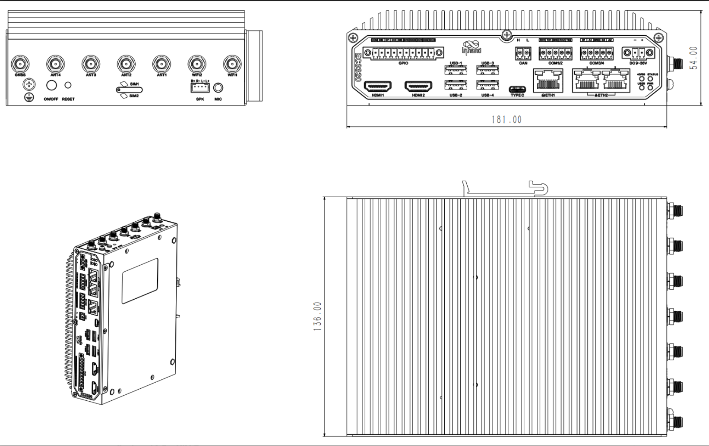

### 1.4. Power Supply Specifications

Power input: DC 9-36 V, recommended power ≥ 36W

Idle power consumption: 5W

Full load power consumption: 30W

### 1.5. Environmental Specifications

Working temperature: -20 ~ 60°C

Operating humidity: 95%@40°C (non-condensing)

Storage temperature: -40 ~ 85°C

## 2. System Interface Information

### 2.1. System Interface Overview

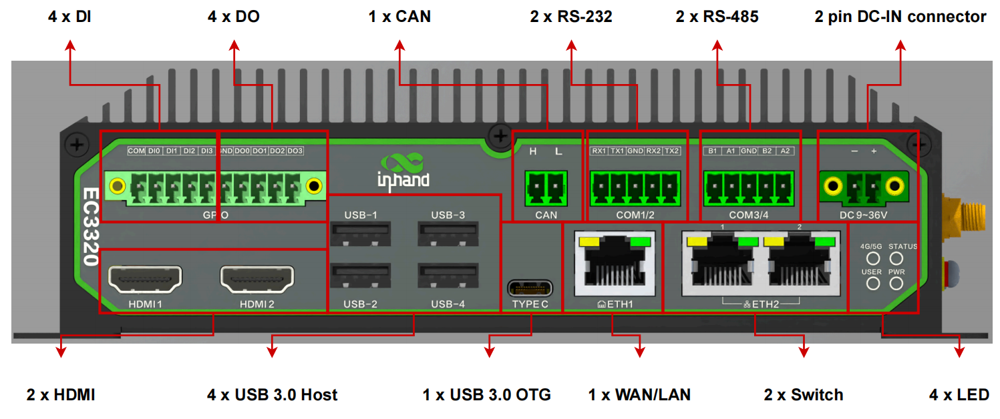

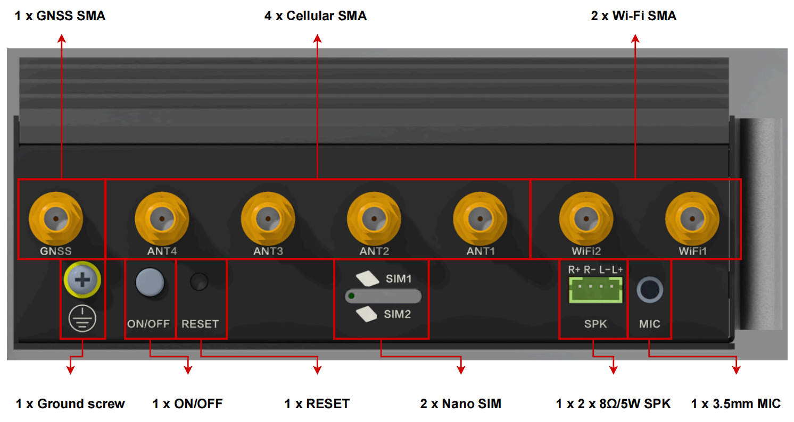

### 2.2. Interfaces

### 2.2.1. Indicator lights

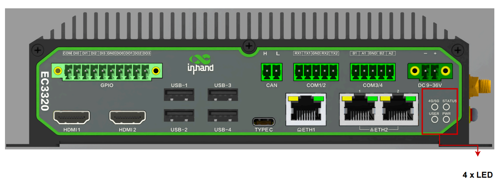

The front panel is equipped with 4 LEDs, which are:

1. PWR Power On/Off Indicator (red), this light indicates the startup state of the system, when the PWR LED is on it means that the system handles the power on state, and when the PWR LED is off it means that the system is in the power off state;
2. STATUS system operation status indicator (green), the light can indicate the system operation status, when the STATUS LED flashes (frequency 1Hz) indicates that the system is running normally, STATUS LED off indicates that the system is not running;
3. 4G/5G Network Status Indicator (green), this light indicates the cellular network connection status, when the 4G/5G LED is on it means that the cellular network is connected successfully, and the 4G/5G LED is flashing means that the cellular network is not connected;
4. USER Programmable indicator (green LED), which is user-programmable for LED status logic.

### 2.2.2. DC-IN Connector

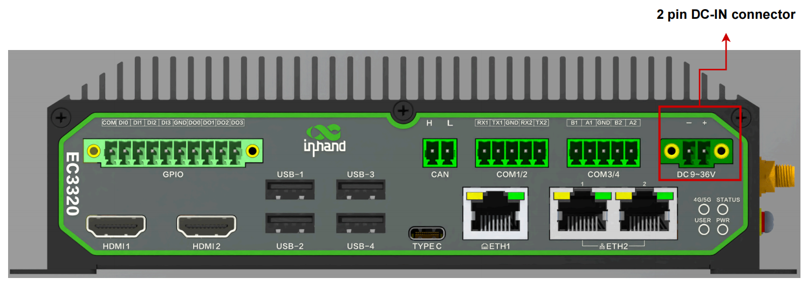

DC power input connector on the front panel of the system

1. Must be installed by a skilled person.
2. Use copper conductors only.
3. Choose appropriate wire diameter.
4. The voltage for the system is 9 VDC to 36 VDC.
5. Recommended power supply power ≥ 36W.

### 2.2.3. Serial Port

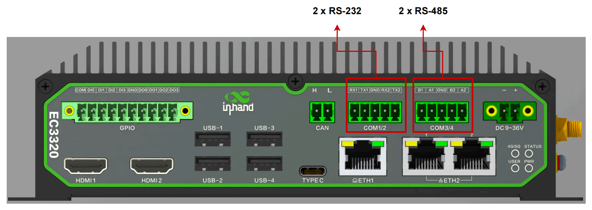

The device provides two RS-232 and two RS-485 serial ports on the front panel, and the function definitions are described in the following table.

| **Table 2: Serial Interface** | | |
| --- | --- | --- |
|  | **RS-232** | **RS-485** |
| COM1 | RX1<br/>TX1<br/>GND |  |
| COM2 | RX2<br/>TX2<br/>GND |  |
| COM3 |  | B1<br/>A1<br/>GND |
| COM4 |  | B2<br/>A2<br/>GND |

### 2.2.4. Ethernet(WAN/LAN)

The device provides 2 network interfaces on the front panel, and there are two LEDs above each of them, the green LED indicates the network connection rate, the green LED lights up when the network is Link up and the interface rate is 1000Mbps, otherwise, the green LED is off; the orange LED indicates the network communication, if there is data communication in network Link up, the orange LED blinks, otherwise, the orange LED is off; ETH1 is a standalone Ethernet interface, while The ETH2 interface has 2 switch ports

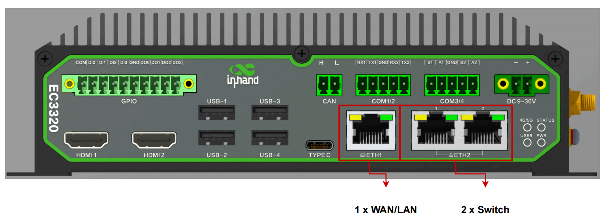

| **Table 3: Ethernet** | | |
| --- | --- | --- |
| **Green LED** | | |
| OFF | ON | Blinking |
| 1. No connection<br/>2. Speed 10Mbps<br/>3. Speed 100Mbps | Speed 1000Mbps | - |
| **Orange LED** | | |
| OFF | ON | Blinking |
| 1. No connection<br/>2. No activity on this port | - | Activity on this port |

### 2.2.5. USB 3.0 Host

The device provides four USB 3.0 Host Type-A ports on the front panel, each USB can provide a maximum power of 5W(5V/1A).

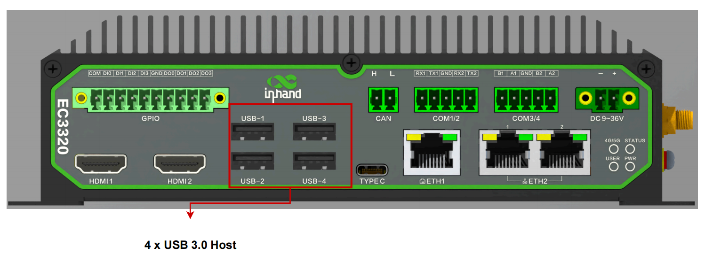

### 2.2.6. USB 3.0 OTG

The device provides 1 USB 3.0 OTG Type-C port on the front panel.

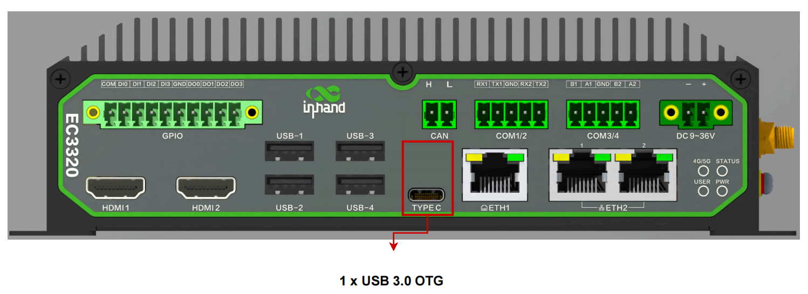

### 2.2.7. CAN

The device provides one CAN 2.0 interface on the front panel, which supports CAN 2.0A/B with a maximum rate of 1Mbps.

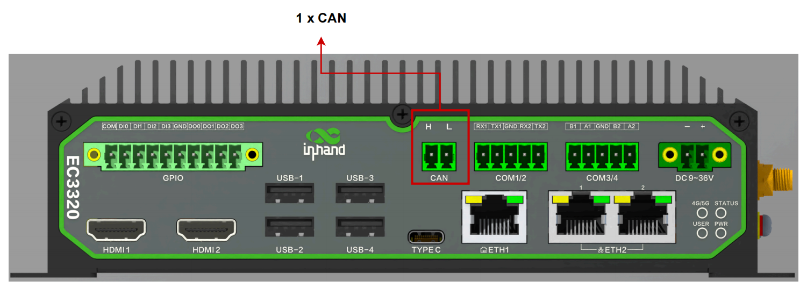

### 2.2.8.HDMI

The device provides 2 HDMI ports on the front panel for external screens with a maximum resolution of 4096 x 2304 @60Hz (4K @60Hz).

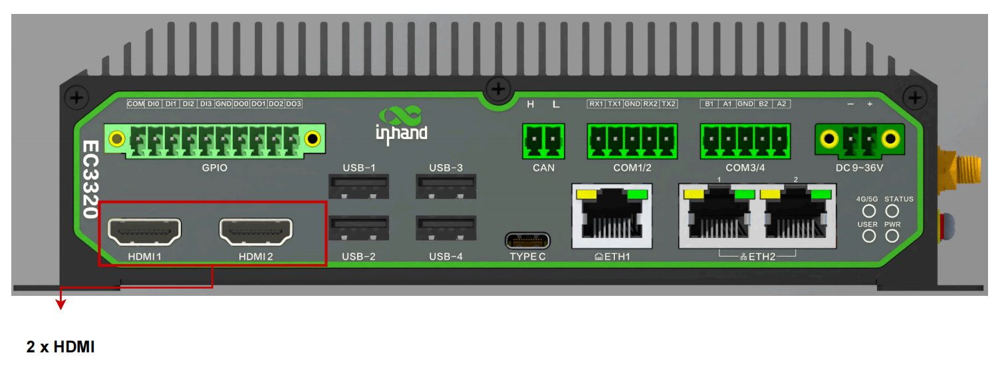

### 2.2.9. Digital Inputs

The device has four isolated digital inputs on the front panel that support wet and dry contacts.

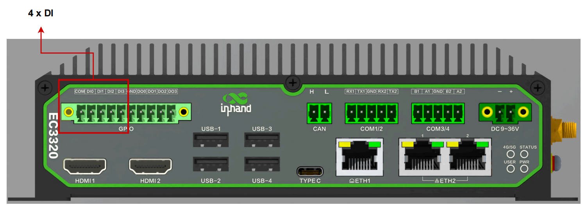

The wiring is as follows:

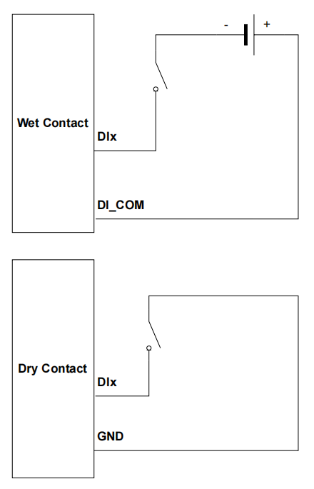

| **Table 4: Isolated Digital Inputs** | |
| --- | --- |
| Number of Input Channels | 4 |
| Optical Isolation | 2500 VDC |
| Input Voltage | Dry contact.<br/>Logic 1: Open<br/>Logic 0: Close to ground  |
| | Wet contact.<br/>VIH(max.) = 60 VDC<br/>VIH(min.) = 5 VDC<br/>VIL(max.) = 2 VDC |

### 2.2.10. Digital Outputs

The device has four isolated digital output connectors on the front panel in open-drain output mode.

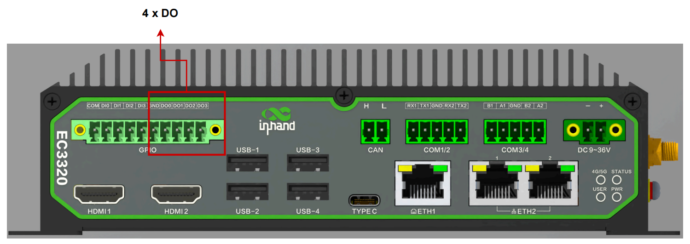

The wiring is as follows:

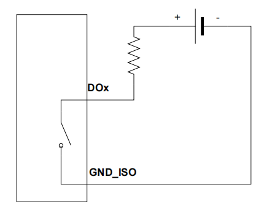

| **Table 5: Isolated Digital Outputs** | |
| --- | --- |
| Number of Output Channels | 4 |
| Optical Isolation | 500 VDC |
| Supply Voltage | Sink 40 VDC |
| Sink Current | 0.2 A max./Channel |

### 2.2.11. Microphone

The device has 1 microphone connector on the right panel and supports 3.5mm standard audio input.

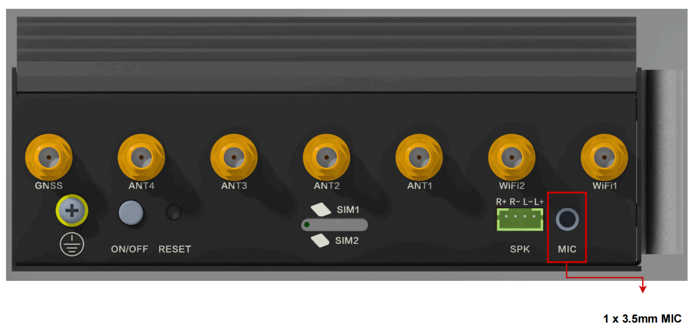

### 2.2.12. Speaker Output

The device has 1 speaker output interface SPK on the right panel. It supports 2 x 8Ω/5W.

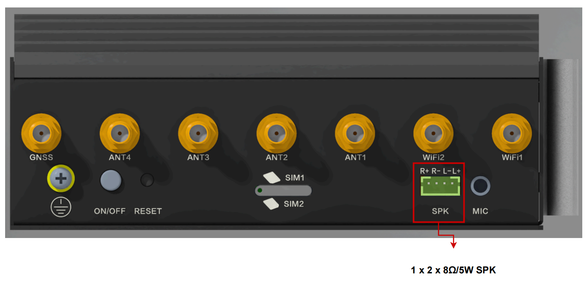

| **Table 6: Speaker Outputs** | |
| --- | --- |
| R+ | Right channel positive |
| R- | Right channel negative |
| L- | Left channel negative |
| L+ | Left channel positive |

### 2.2.13. SIM Card Slot

The device has 1 SIM card slot on the right panel which supports 2 Nano SIM cards, please insert at least 1 available SIM card when using the cellular function.

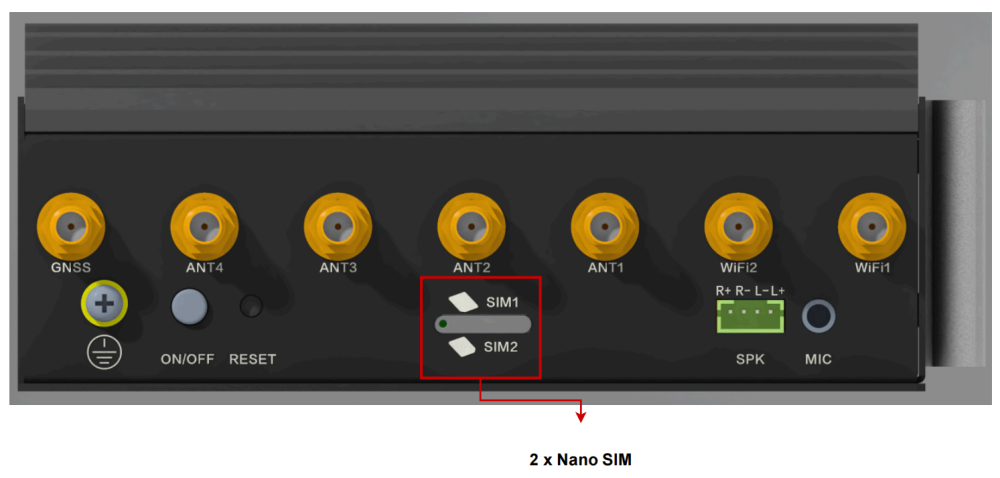

### 2.2.14. RESET Pinhole Button

The device has a RESET pinhole button on the right panel. During normal system operation, press and hold RESET for 10 seconds and wait for the system status light to change from blinking to constantly on and release it, the device will enter the system reset state (restoring the system to the factory state).

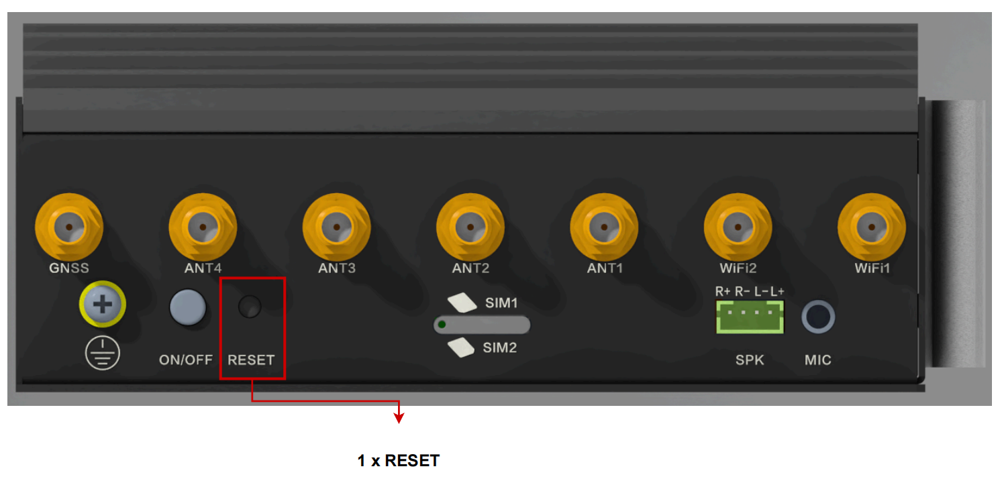

### 2.2.15. ON/OFF flick switch buttons

The device has 1 ON/OFF flick switch button on the right panel, touch ON/OFF button when the system is running normally, the system will prompt yes/no shutdown, click on the display to confirm that the system will be shut down (no selection within 60 seconds of the countdown will be forced to shut down), long press ON/OFF button for more than 6 seconds will be forced to shut down the system when the system is running normally. When the system is off, touch ON/OFF button, the system will start.

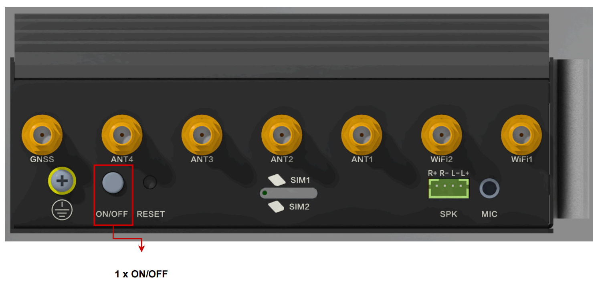

### 2.2.16. Grounding Connection

There is 1 system grounding screw on the right panel of the device, please use a green-yellow grounding wire (16AWG) and ground it with the system grounding screw.

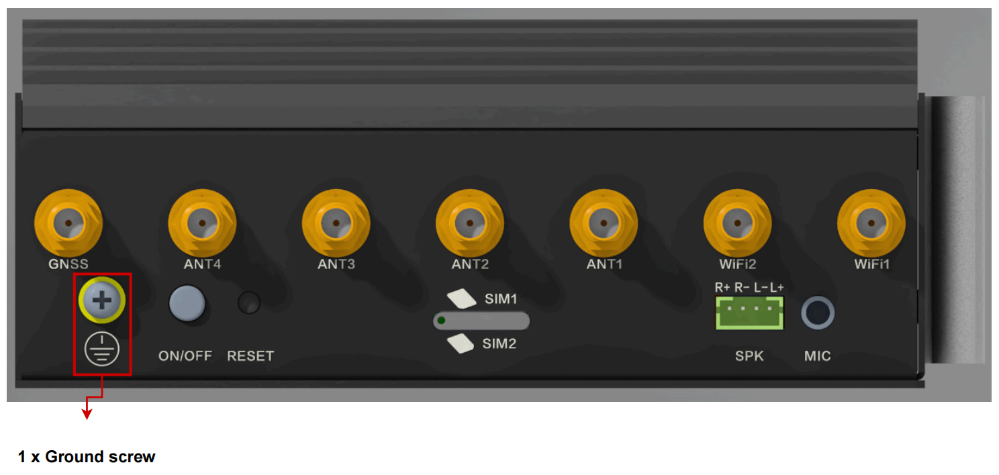

### 2.2.17. SMA

The right panel of the device provides up to 7 SMA connectors, different models are equipped with different types and numbers of 4G/5G/Wi-Fi/GNSS antennas, users can select the device according to their own needs, the specific antenna support can be found in the "Ordering Guide" section of the "EC3000 Series Edge AI Computer Product Specification".

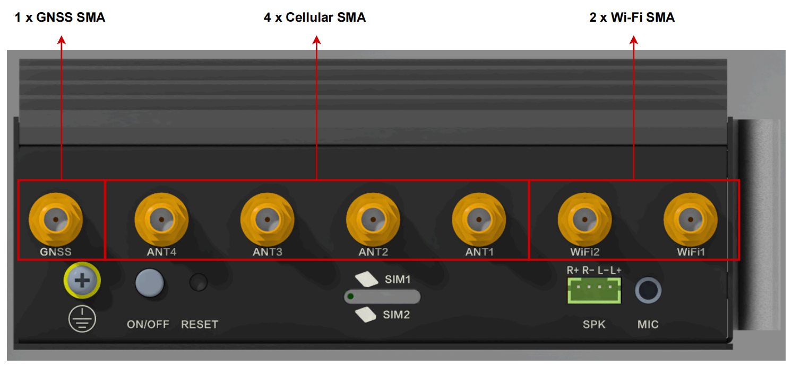

## 3. Installation

### 3.1. Rail Mounting Installation

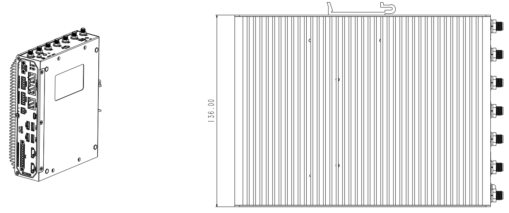

### 3.2. Wall-mounted Installation

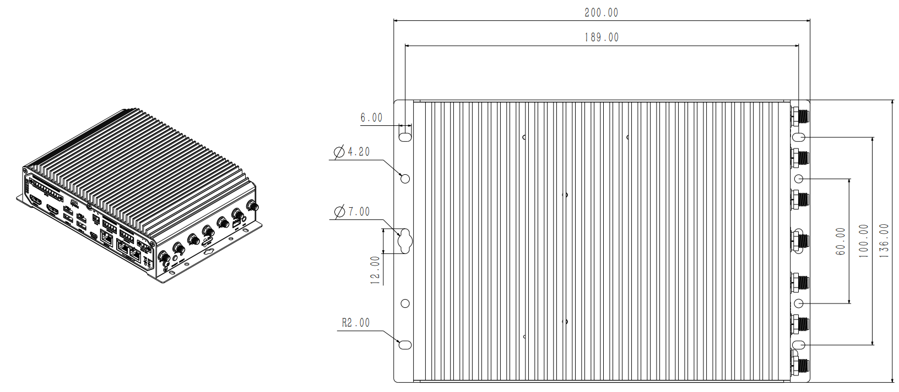

## 4. Getting Started

### 4.1. Connecting to Equipment

### 4.1.1. Connecting to Device via HDMI

#### 4.1.1.1. Connecting HDMI and Peripherals

Connect the device to the monitor via the HDMI1 or HDMI2 port, plug the keyboard and mouse into the USB 3.0 Host port of the device, power up the device and wait for the device to finish booting. Check the nameplate on the bottom of the device to find the default system username and password.

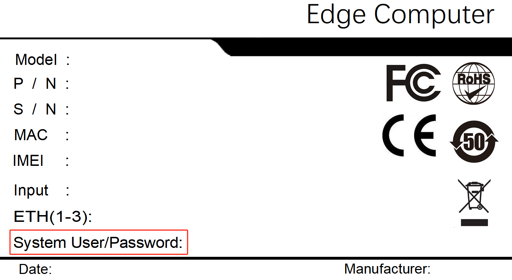

#### 4.1.1.2. Logging in Equipment

On the login screen, select the account corresponding to "System User" and log in after entering the password.


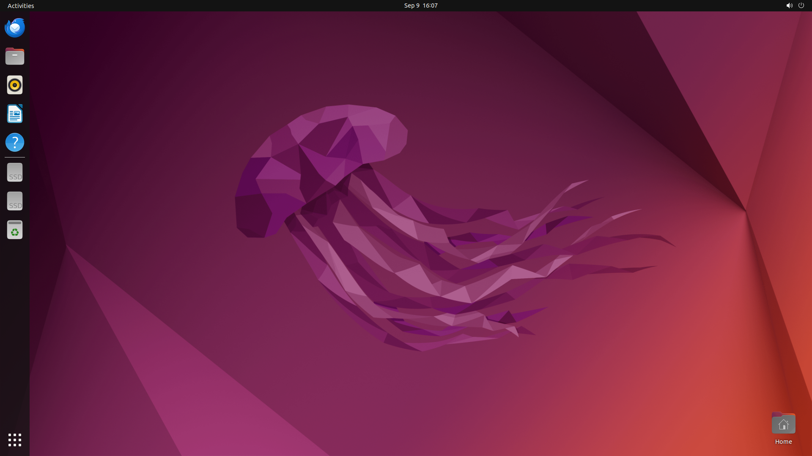

### 4.1.2. Connecting via SSH

#### 4.1.2.1. Connecting to the Network

Connecting to the device using SSH requires ensuring that the device network is accessible. Check the nameplate on the bottom of the device to find the system default Ethernet address and configure the host and device to be on the same network segment.

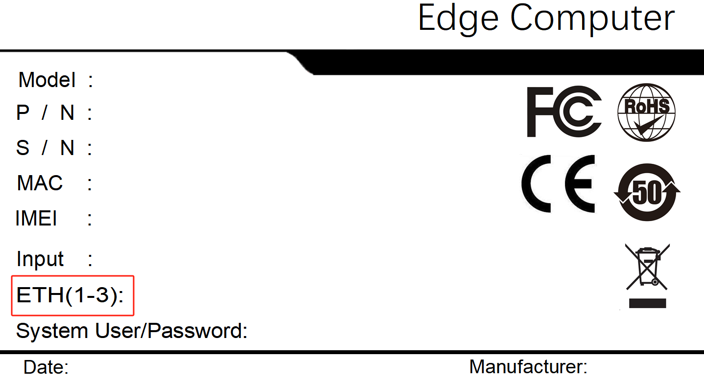

#### 4.1.2.2. Access to Equipment

Open the SSH terminal tool (Mobaxterm for example), enter the device address and click Connect.


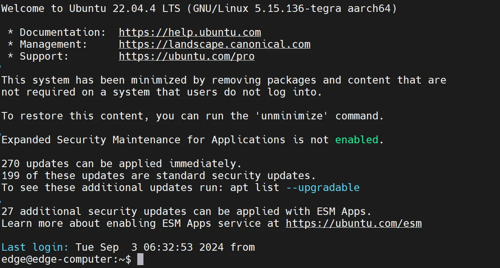

### 4.2. Version Query

Click "Show Applications->Terminal" or right-click and select "Open in Terminal" and enter the following command.

```json
## Query version number only
sudo ecversion 
## Query detailed version information
sudo ecversion -all
```

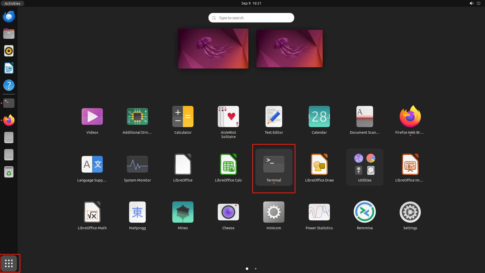

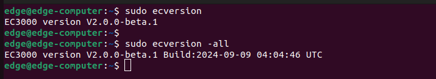

### 4.3. User management

### 4.3.1. Creating Users

Click "Show Applications->Terminal" or right click "Open in Terminal" and enter the following commands, follow the prompts to enter the password and user information, please make sure the user exists before creating, for the user that already exists, create again will prompt "The user 'username' already exists".

```json
## check if the test account exists 
id test 
## create test account
sudo adduser test
```

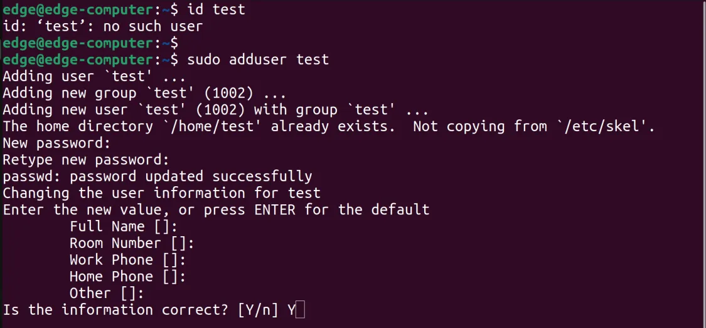

### 4.3.2. Delete Users

Click "Show Applications->Terminal" or right-click and click "Open in Terminal" and enter the following command to delete the user, before deleting the user, please make sure the user exists or not, if you delete a non-existing user, it will prompt "The user 'username' does not exist".

```json
## Check if the test account exists 
id test 
## Delete the test account
sudo deluser test
```

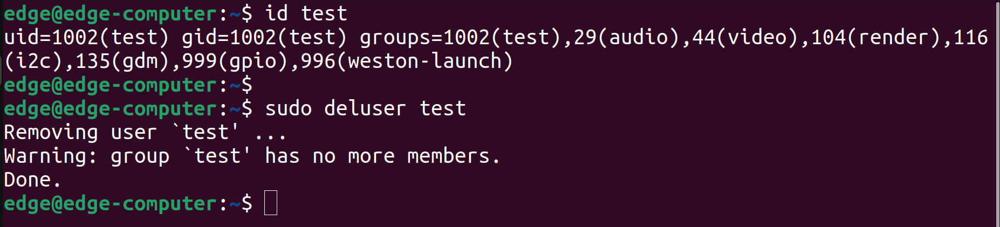

### 4.3.3. Disable and Enable Users

Click "Show Applications->Terminal" or right-click and click "Open in Terminal" and enter the following commands to disable/enable the user, before disable/enable the user, please make sure the user exists, if the user does not exist, it will prompt "The user 'username' does not exist".

```json
## Check if the test account exists 
id test 
## Disable the test account
 sudo passwd -l test 
## Enable test account
 sudo passwd -u test 
## Query the status of the test account (L disabled/P enabled)
 sudo passwd -S test
```

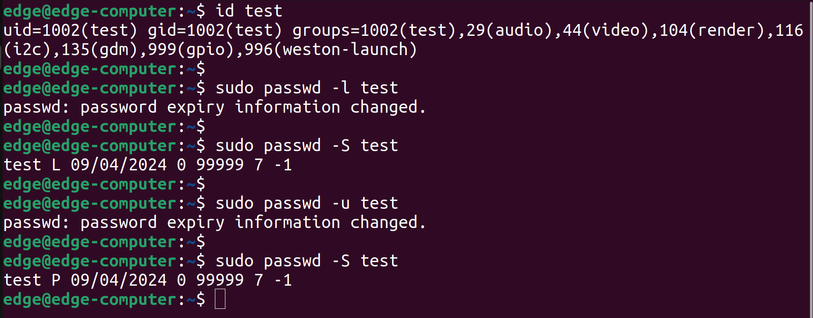

### 4.3.4. Advanced Extension of User Management

Reference:

1. [Ubuntu Manpage: adduser, addgroup - add a user or group to the system](https://manpages.ubuntu.com/manpages/xenial/en/man8/adduser.8.html?_gl=1*1jz4dhl*_gcl_au*MTkwNTc0MDUwMC4xNzI1MzQ3ODI1&_ga=2.97338463.1940871822.1725347824-1111823313.1715413709)
2. [Ubuntu Manpage: deluser, delgroup - remove a user or group from the system](https://manpages.ubuntu.com/manpages/focal/en/man8/deluser.8.html?_gl=1*2hnawf*_gcl_au*MTkwNTc0MDUwMC4xNzI1MzQ3ODI1&_ga=2.165044991.1940871822.1725347824-1111823313.1715413709)
3. [Ubuntu Manpage: passwd - change user password](https://manpages.ubuntu.com/manpages/bionic/man1/passwd.1.html?_gl=1*1rjws9d*_gcl_au*MTkwNTc0MDUwMC4xNzI1MzQ3ODI1&_ga=2.211133397.1940871822.1725347824-1111823313.1715413709)
4. [Ubuntu Manpage: usermod - modify a user account](https://manpages.ubuntu.com/manpages/trusty/en/man8/usermod.8.html?_gl=1*2hnawf*_gcl_au*MTkwNTc0MDUwMC4xNzI1MzQ3ODI1&_ga=2.165044991.1940871822.1725347824-1111823313.1715413709)

### 4.4. Network Settings

### 4.4.1. Ethernet Settings

#### 4.4.1.1. Settings Management

1. Click ”Show Applications->Firefox Web Browser” on your desktop system, enter [https://127.0.0.1:9100](https://127.0.0.1:9100) or access the device's WEB configuration page through an external network. , open the browser and enter <https://IP:9100>.

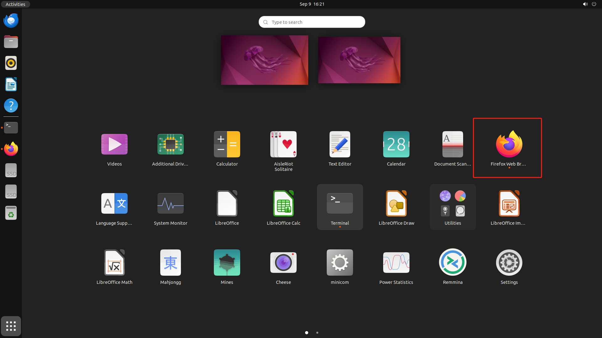


1. Enter the username and password and click Login to log in to the device. After successful login, select “Network -> Interfaces” and select the corresponding Ethernet interface.

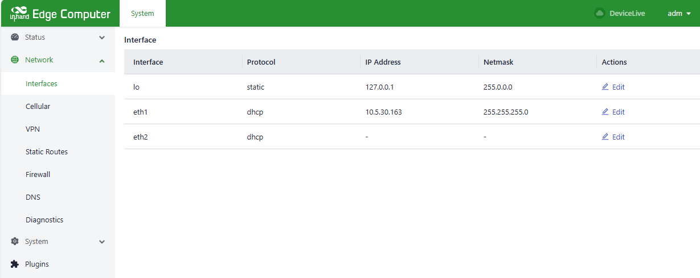

#### 4.4.1.2. Static Configuration

Click Edit in the Ethernet interface, select “Protocol->Static Address”, add a static IP in the IP Address field, add a mask in the netmask and click Save, then the network will be reset.

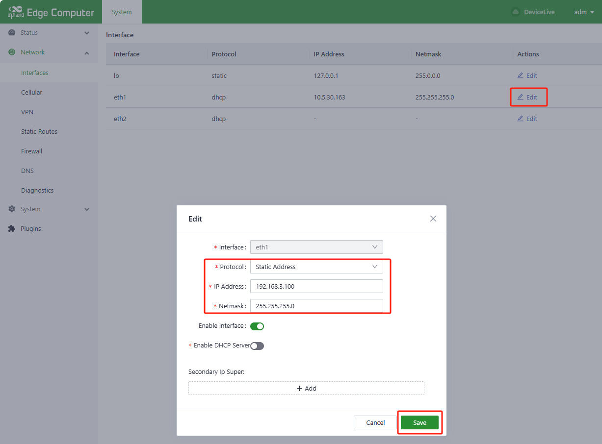

#### 4.4.1.3. Dynamic Configuration

Click Edit in the Ethernet interface, select “Protocol->DHCP Client” and click Save, then the network will be reset.

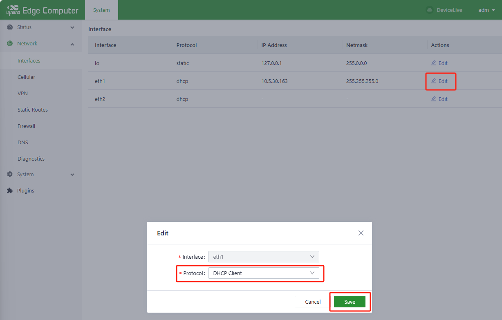

### 4.4.2. Wi-Fi Settings

#### 4.4.2.1. Settings Management

After logging in successfully， select Network -> WiFi.

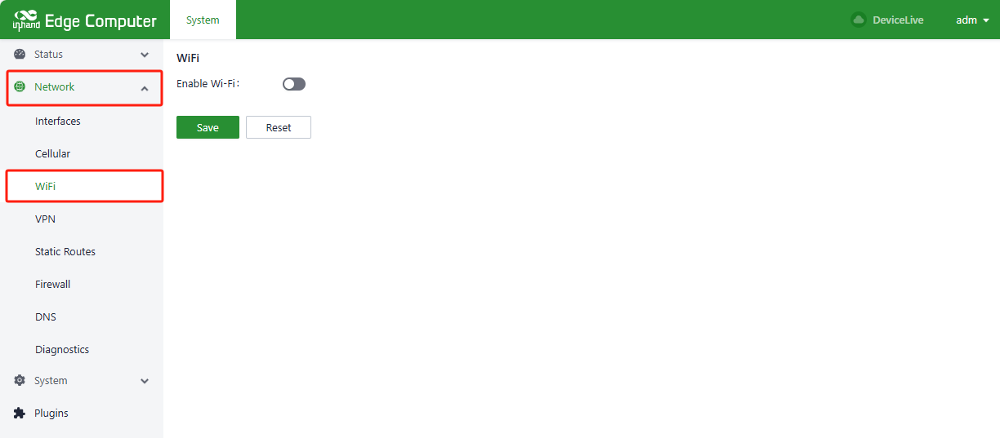

#### 4.4.2.2. Scanning

Click Enable Wi-Fi on the WiFi page and click Scan.

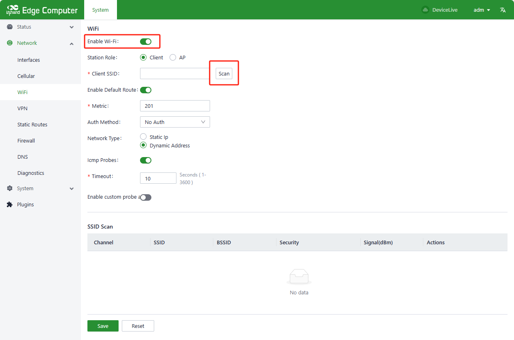

#### 4.4.2.3. Connection

Click the scanned Wi-Fi Actions -> Connect and enter the Client SSID and key (WPA/WPA2 PSK Key), click Save; you can select Static IP or Dynamic Address in the Network Type of the connection.

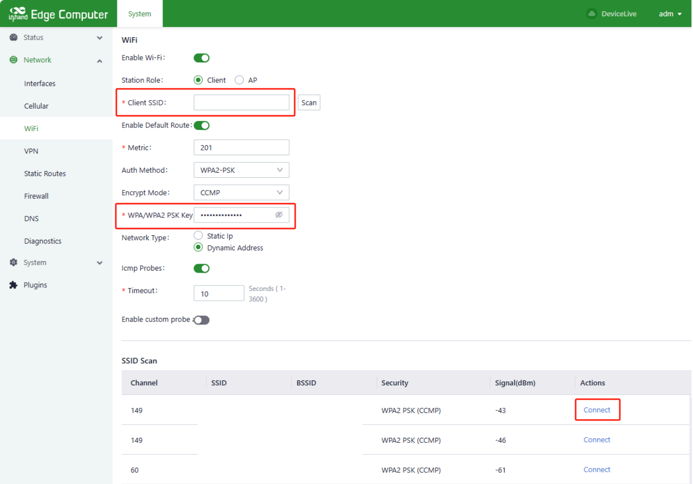

#### 4.4.2.4. Status Query

Click Status -> WiFi page to check Wi-Fi status.

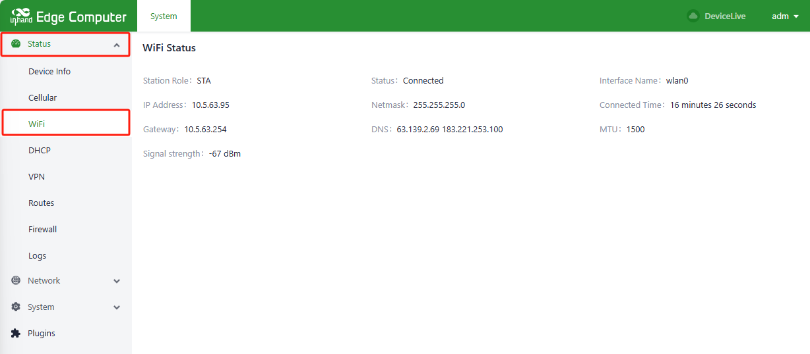

### 4.4.3. Cellular Network Settings

#### 4.4.3.1. Settings Management

After logging in successfully, select Network -> Cellular and click Enabled.

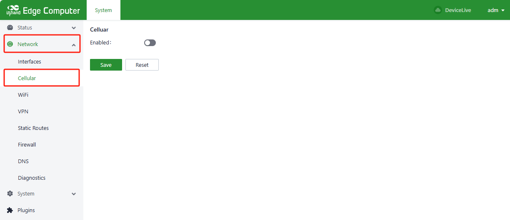

#### 4.4.3.2. Network Mode Selection

Click Cellular Settings page -> Network Mode. The available network modes are Auto, WCDMA, LTE, 5G, 5G SA, and 5G NSA.

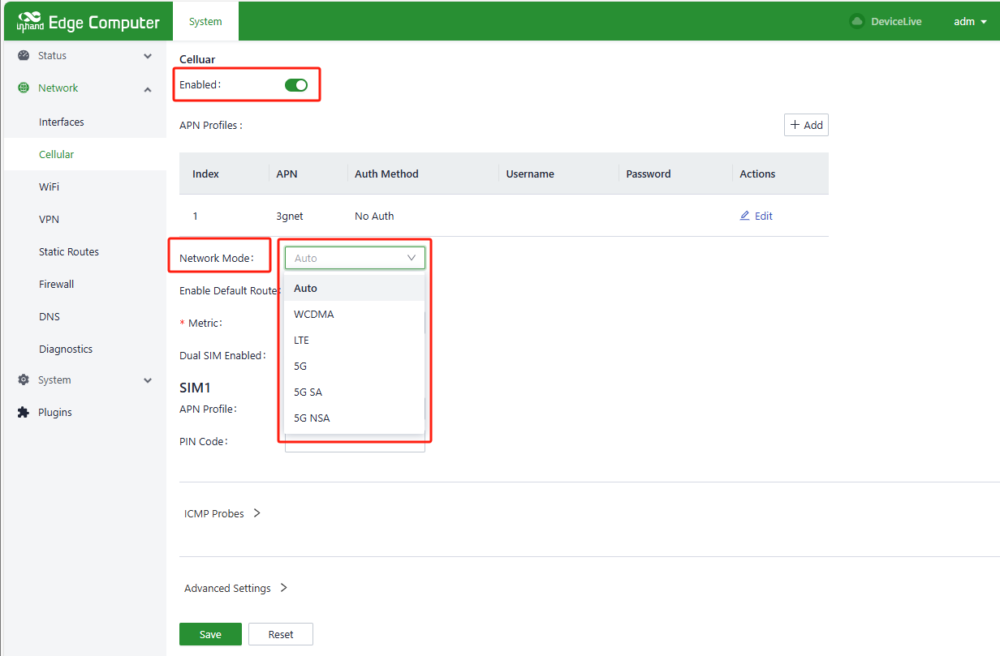

#### 4.4.3.3. Adding a Default Route

Click Cellular page -> Enable Default Route. you can enter a metric value up to 2-255 in the Route Metric.

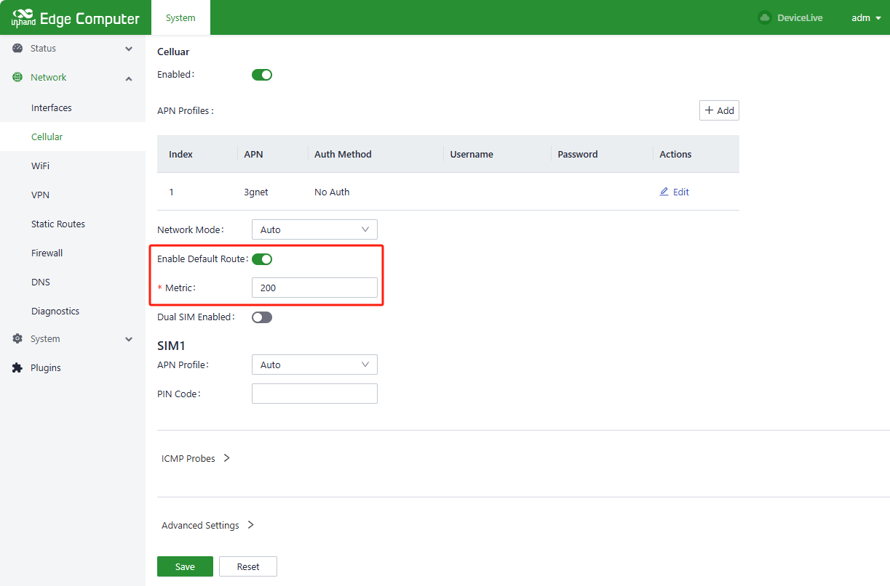

#### 4.4.3.4. SIM Card Selection and Settings

Click Cellular page -> Dual SIM Enabled, select Main SIM from SIM1 or SIM2, configure Max Number of Dials, configure APN parameters and PIN Code for SIM1 and SIM2.

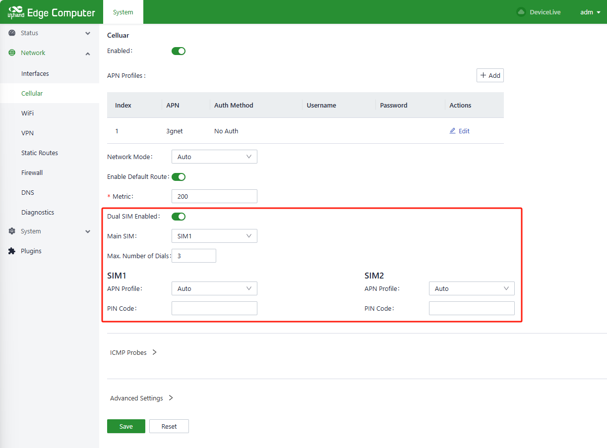

#### 4.4.3.5. Status Query

Click Status -> Cellular to view the cellular status.

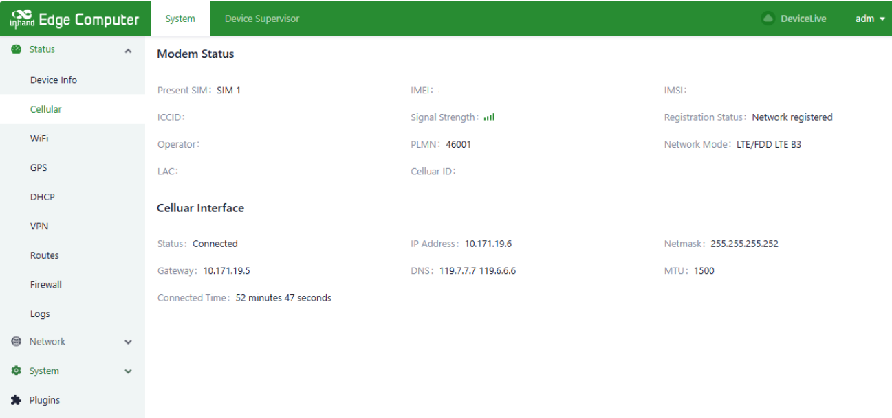

### 4.4.4. CAN

Open Terminal and enter the following command to configure the CAN interface.

```json
## Link up CAN interface
sudo ip link set can0 up type can bitrate 1000000 fd off
```

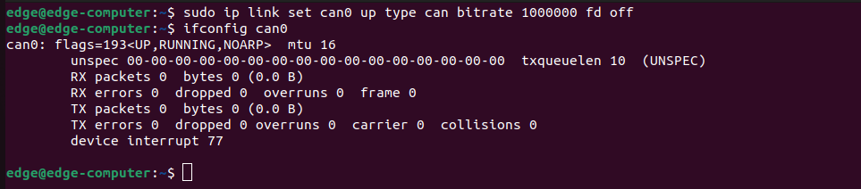

### 4.5. Time Settings

### 4.5.1. Setting the Timezone

After logging in successfully, select System->Basic->Time->Timezone, select the corresponding time zone and click Save.

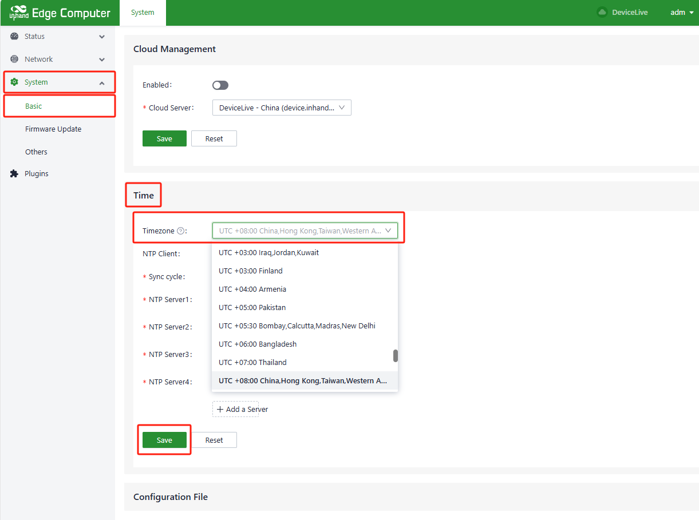

### 4.5.2. Adjustment Time

Click "Status -> Device Info -> Sync with browser" to write the local time to the device.

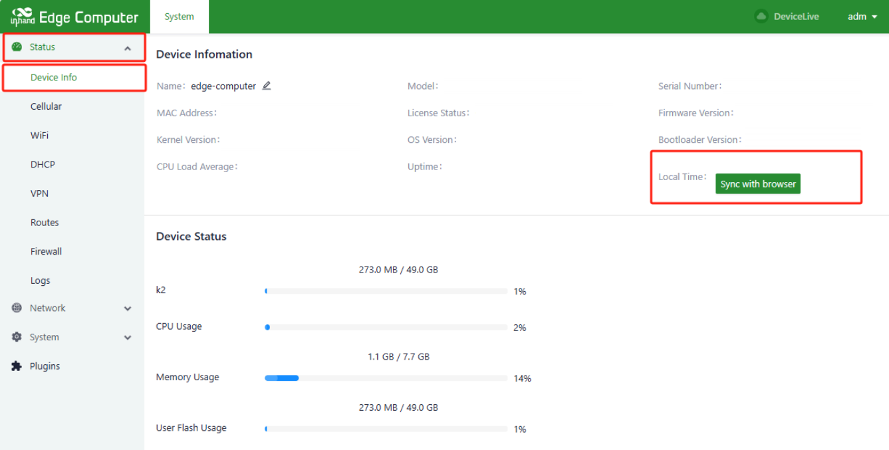

### 4.6. Peripheral Configuration

### 4.6.1. Serial Port Management

The device supports two RS-232 and two RS-485 serial ports corresponding to device nodes /dev/ttyCOM1, /dev/ttyCOM2, /dev/ttyCOM3 and /dev/ttyCOM4.

| **Table 7: Serial Port Mapping** | |
| --- | --- |
| COM1 | /dev/ttyCOM1 |
| COM2 | /dev/ttyCOM2 |
| COM3 | /dev/ttyCOM3 |
| COM4 | /dev/ttyCOM4 |

### 4.6.2. Digital Input/Output Management

The device supports 4 isolated digital inputs and 4 isolated digital outputs.

| **Table 8: Digital Inputs/Outputs** | | |
| --- | --- | --- |
| DI | DI0 | /sys/class/gpio/gpio498/value |
| | DI1 | /sys/class/gpio/gpio497/value |
| | DI2 | /sys/class/gpio/gpio496/value |
| | DI3 | /sys/class/gpio/gpio495/value |
|  | | |
| DO | DO0 | /sys/class/gpio/gpio494/value |
| | DO1 | /sys/class/gpio/gpio493/value |
| | DO2 | /sys/class/gpio/gpio499/value |
| | DO3 | /sys/class/gpio/gpio500/value |

## 5. Advanced

### 5.1. System Updates

Click System -> Firmware Update, select Update Firmware -> Update, select the upgrade image and click Update, wait for the upgrade to finish.

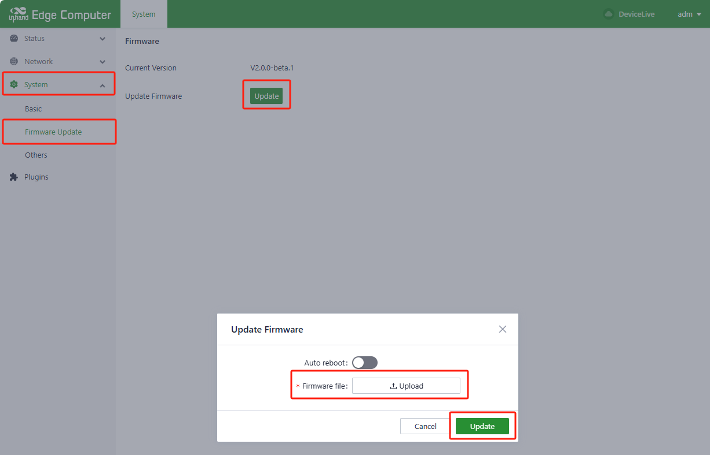

### 5.2. System Reset

### 5.2.1. Factory Reset via WEB

Click System -> Others and select System Reset -> Reset.

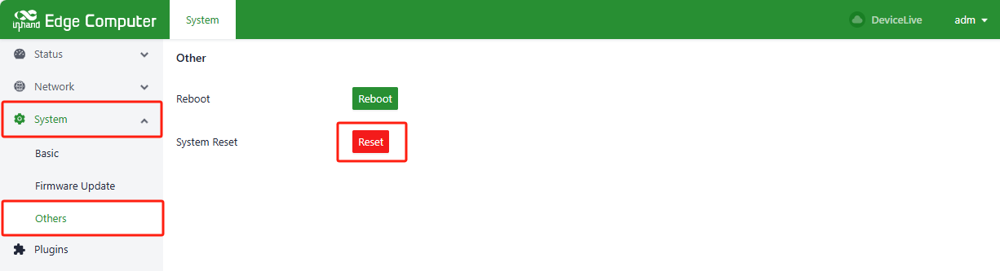

### 5.2.2. Hardware-based Factory Reset

- The device has a RESET pinhole button on the right panel. During normal system operation, press and hold RESET for 10 seconds and wait for the system status light to change from blinking to constantly on and release it, the device will enter the system reset state (restoring the system to the factory state).
- You can also hold down the RESET button before turning on the power, and then hold it down for more than 5 seconds after the power has been turned on and release it. The appliance will enter a system reset state (return to the factory system state).

### 5.2.3. Factory Reset via Command

Open Terminal and use the update command to perform a system reset.

```json
sudo update reset

1
```


## 6. Security (TPM 2.0)

The device supports Trusted Platform Module 2.0 (TPM2.0) and comes with the pre-installed tpm2-tools tool, which allows you to operate the TPM2.0 module directly using commands to implement security functions.

Reference:

1. [tpm2-tools](https://tpm2-tools.readthedocs.io/en/latest/)
2. [tpm2-tools/man at master - tpm2-software/tpm2-tools (github.com)](https://github.com/tpm2-software/tpm2-tools/tree/master/man)

## 7. Programming Guide

Reference:

1. [Journey Develop a SW for Hailo-8 | Hailo](https://hailo.ai/developer-zone/journey-develop-a-sw-for-hailo-8/)
2. [Hailo AI Demos: Experience the Future Of Edge AI Technology](https://hailo.ai/resources/type/demos/)
