# EC3000 Series AI Edge Computer User Manual

## EC3000 Series AI Edge Computer

User Manual

Version 1.0, September 2024

[www.inhand.com](http://www.inhand.com)

<p align="center"></p>

<p align="center"><strong>Figure 1 EC3000 Series AI Edge Computer</strong></p>

## Preface Information

### Statement

First and foremost, InHand Networks thanks users for choosing its products. Prior to use, careful reading of this user manual is recommended. Observing the following statements will help maintain intellectual property rights and legal compliance, and ensure that the usage experience remains consistent with the latest product information. Should there be any questions or should written permission be required, the technical support team may be contacted at any time.

- **Copyright Notice**

The contents of this user manual are protected by copyright and are the property of InHand Networks and its licensors. No part of this manual may be excerpted, reproduced, or transmitted in any form or by any means without prior written permission.

- **Disclaimer**

Due to continuous updates in product technology and specifications, InHand Networks cannot guarantee that the information in this user manual is completely identical to the actual product. Therefore, InHand Networks assumes no liability for any disputes arising from discrepancies between actual technical parameters and this manual. Any product changes may be made without prior notice. InHand Networks reserves the right to make final changes and interpretations.

In addition, InHand Networks shall not be responsible for any direct, indirect, intentional, or unintentional damage or hidden trouble caused by improper installation or use.

- **Copyright Information**

The contents of this user manual are protected by copyright law. Copyright is owned by InHand Networks and its licensors. All rights reserved. No part of this manual may be used, copied, or distributed without prior written permission.

The software described in this manual is subject to a license agreement and may only be used in accordance with the terms of that agreement.

The InHand logo is a registered trademark of InHand Networks. All other trademarks or registered trademarks mentioned in this manual belong to their respective owners.

### GUI Conventions

The following symbols and conventions are used throughout this manual to facilitate understanding of the user interface and operation steps.

| Symbol | Meaning | Example |
|--------|---------|---------|
| `< >` | Indicates a variable or parameter that needs to be replaced with an actual value | `<IP address>` means a specific IP address needs to be entered |
| `" "` | Indicates text labels on the interface | Click the "Save" button |
| `→` | Indicates menu hierarchy or operation sequence | 【Network】→【Cellular】 |
| `【 】` | Indicates a menu or page name | Go to the 【System Settings】page |

### Technical Support
Email: support@inhandnetworks.com

URL: www.inhand.com

### How to Use This Manual

This manual is organized according to the following reading guide to help users quickly locate the required information.

- **First-time users**: Reading the following chapters in order is recommended: "Understanding the Device" → "Installation and First Use" → "Common Scenario Configuration" → "Function Description and Parameter Reference"
- **Existing device users**: The "Function Description and Parameter Reference" or "Appendix: Troubleshooting" chapters may be consulted directly
- **Cloud platform management users**: The "Common Scenario Configuration" chapter may be consulted for device remote management platform content (if applicable)

**Quick Jump by Task**

| Task | Corresponding Chapter | Estimated Time |
|------|----------------------|----------------|
| Understanding device appearance, interfaces, and indicators | [Understanding the Device](#chapter-1-understanding-the-device) | About 10 minutes |
| Installing and powering on the device for the first time | [Installation and First Use](#chapter-2-installation-and-first-use) | About 15 minutes |
| Configuring common usage scenarios | [Common Scenario Configuration](#chapter-3-common-scenario-configuration) | About 10–30 minutes |
| Looking up function parameters and configuration details | [Function Description and Parameter Reference](#chapter-4-function-description-and-parameter-reference) | As needed |
| Troubleshooting device problems | [Appendix: Troubleshooting](#appendix-a-troubleshooting) | As needed |


# Chapter 1: Understanding the Device

## Overview

The EC3000 Series AI Edge Computer is an industrial computing platform based on the Rockchip RK3588 platform with Hailo-8 AI computing power expansion, designed for artificial intelligence applications at the edge. The system provides 2 RS-232 serial interfaces, 2 RS-485 serial interfaces, 1 CAN 2.0A/B LAN controller, 4 isolated digital inputs and 4 isolated digital outputs, 4 LED indicators (network, system status, user-programmable, and power), 2 Gigabit Ethernet interfaces, 1 USB Type-C 3.0 OTG port, 4 USB 3.0 Host ports, 2 HDMI video outputs, 1 microphone connector, 1 speaker output connector, 1 SIM card slot supporting 2 Nano SIM cards, 1 RESET system reset button, and 1 ON/OFF switch button. The device supports cellular connectivity via 4G/5G modules, Wi-Fi/BLE, and GNSS positioning, making it suitable for industrial AI deployment scenarios such as machine vision, intelligent edge analytics, and IoT gateway applications.

## Packing List

| Item | Quantity | Remarks |
|------|----------|---------|
| EC3000 Host | 1 | - |
| Power Adapter | 1 | Optional Equipment |
| Cellular Antenna | 2–4 | Standard Equipment (depending on the device model) |
| Wi-Fi Antenna | 2 | Standard Equipment |
| GNSS Antenna | 1 | Optional Equipment |
| Mounting Rail Accessories | 1 | Standard Equipment |
| Warranty Card | 1 | - |

## Appearance and Interfaces

<p align="center"></p>

<p align="center"><strong>Figure 1-1 EC3000 Front Panel Interfaces</strong></p>

<p align="center">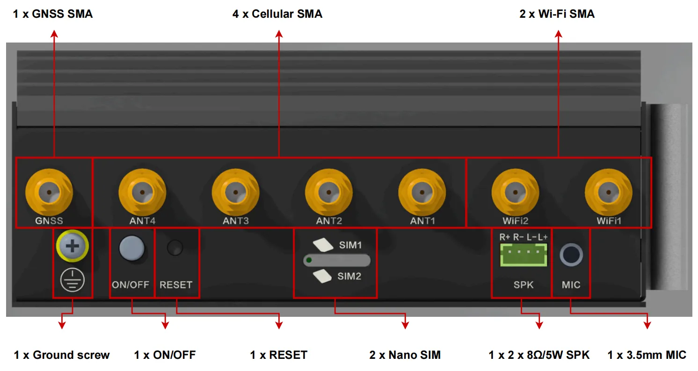</p>

<p align="center"><strong>Figure 1-2 EC3000 Right Panel Interfaces</strong></p>

<p align="center">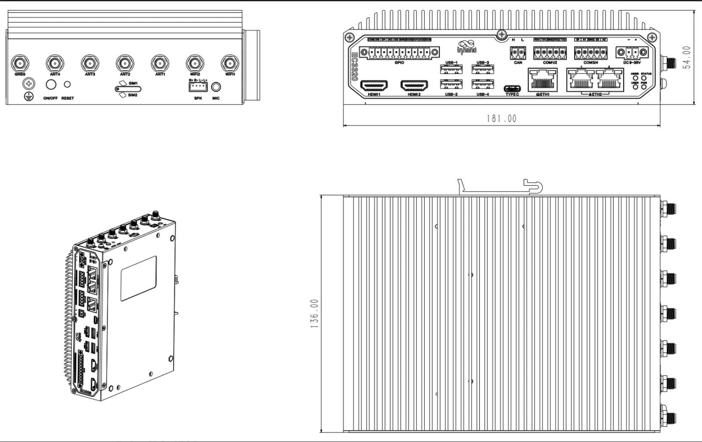</p>

<p align="center"><strong>Figure 1-3 EC3000 Mechanical Dimensions</strong></p>

| Interface | Position | Function |
|-----------|----------|----------|
| PWR Power Indicator | Front panel | Indicates system power-on status (red LED) |
| STATUS System Status Indicator | Front panel | Indicates system operation status (green LED) |
| 4G/5G Network Status Indicator | Front panel | Indicates cellular network connection status (green LED) |
| USER Programmable Indicator | Front panel | User-programmable LED status logic (green LED) |
| DC-IN Power Input | Front panel | DC 9–36 V power input connector |
| COM1/COM2 RS-232 | Front panel | 2 x RS-232 serial interfaces (5PIN industrial terminals) |
| COM3/COM4 RS-485 | Front panel | 2 x RS-485 serial interfaces (5PIN industrial terminals) |
| ETH1/ETH2 Ethernet | Front panel | 2 x 10/100/1000 Mbps Ethernet interfaces. ETH1 is a standalone Ethernet interface; ETH2 has two external switch ports |
| USB 3.0 Host | Front panel | 4 x USB 3.0 Type-A ports |
| USB 3.0 OTG | Front panel | 1 x USB Type-C 3.0 OTG port |
| CAN | Front panel | 1 x CAN 2.0A/B interface, max rate up to 1 Mbps |
| HDMI1/HDMI2 | Front panel | 2 x HDMI video outputs, maximum resolution 4096 x 2304 @60Hz |
| DI (Digital Inputs) | Front panel | 4 x isolated digital inputs, supports wet and dry nodes |
| DO (Digital Outputs) | Front panel | 4 x isolated digital outputs, open-drain mode |
| MIC | Right panel | 3.5 mm microphone audio jack |
| SPK | Right panel | Speaker output, supports 2 x 8Ω/5W |
| SIM Card Slot | Right panel | 1 x slot supporting 2 Nano SIM cards |
| RESET Button | Right panel | System reset pinhole button |
| ON/OFF Button | Right panel | Power on/off flick switch button |
| Grounding Screw | Right panel | System grounding connection (16AWG green-yellow wire recommended) |
| SMA Antennas | Right panel | 7 x SMA connectors: 4 for cellular, 2 for Wi-Fi, 1 for GNSS |

## LED Indicators

<p align="center">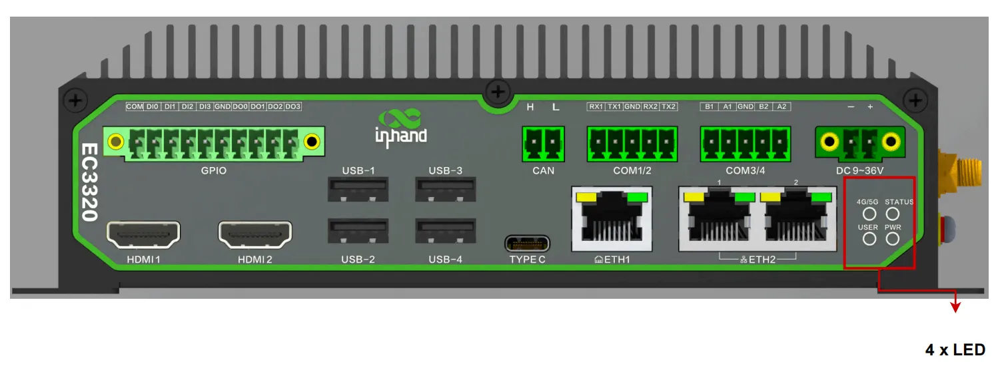</p>

<p align="center"><strong>Figure 1-4 EC3000 LED Indicators</strong></p>

| LED | State | Meaning |
|-----|-------|---------|
| PWR | Off | System is powered off |
| | On (red) | System is powered on |
| STATUS | Off | System is not operating |
| | Flashing (1 Hz, green) | System is operating normally |
| 4G/5G | Off | Cellular function is disabled or device is not powered on |
| | On (green) | Cellular network is connected successfully |
| | Flashing (green) | Cellular network is not connected |
| USER | Off | User-programmable LED is off |
| | On (green) | User-programmable LED is on (logic configurable by user) |

## Factory Reset

<p align="center">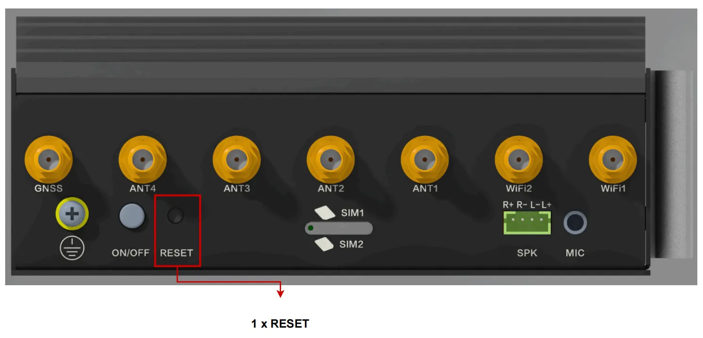</p>

<p align="center"><strong>Figure 1-5 RESET Pinhole Button</strong></p>

To reset the system to factory default settings:

1. Ensure the system is running normally.
2. Locate the RESET pinhole button on the right panel of the device.
3. Press and hold RESET for 10 seconds and wait for the system status light to change from blinking to constantly on.
4. Release the button. The device enters the system reset state and restores to factory default settings.

Alternatively, hold down the RESET button before turning on the power, and then hold it down for more than 5 seconds after the power has been turned on and release it. The device will enter a system reset state (return to the factory system state).

## Default Settings

| Parameter | Default Value |
|-----------|---------------|
| System username | (Printed on the device nameplate) |
| System password | (Printed on the device nameplate) |
| Default Ethernet address | (Printed on the device nameplate) |
| Web management port | 9100 (HTTPS) |


# Chapter 2: Installation and First Use

## 2.1 Pre-installation Preparation

Before installing the EC3000 Series AI Edge Computer, ensure the following conditions are met and the necessary tools are prepared.

### Environment Requirements

| Item | Requirement |
|------|-------------|
| Operating temperature | -20 ~ 60°C |
| Operating humidity | 95%@40°C (non-condensing) |
| Power supply | DC 9–36 V, recommended power ≥ 36W |
| Network access | Available for remote connection if required |
| Display (optional) | Monitor with HDMI input for local access |

### Tools and Accessories

(Original manuscript not detailed, to be supplemented)

### Safety Notes

> **Note**: Ensure the power supply voltage matches the device specification (DC 9–36 V) before connecting power.

> **Note**: The device must be installed by a skilled person. Use copper conductors only.

> **Note**: Choose an appropriate wire diameter for all connections.

> **Note**: There is one system grounding screw on the right panel of the equipment. Use a green-yellow grounding wire (16AWG) and connect it securely with the system grounding screw.

> **Note**: Do not install or remove the device in environments with excessive dust, moisture, or flammable gases.

## 2.2 Installation Guide

### 2.2.1 DIN Rail Mounting

The EC3000 Series AI Edge Computer supports standard DIN rail mounting. The installation steps are as follows:

<p align="center">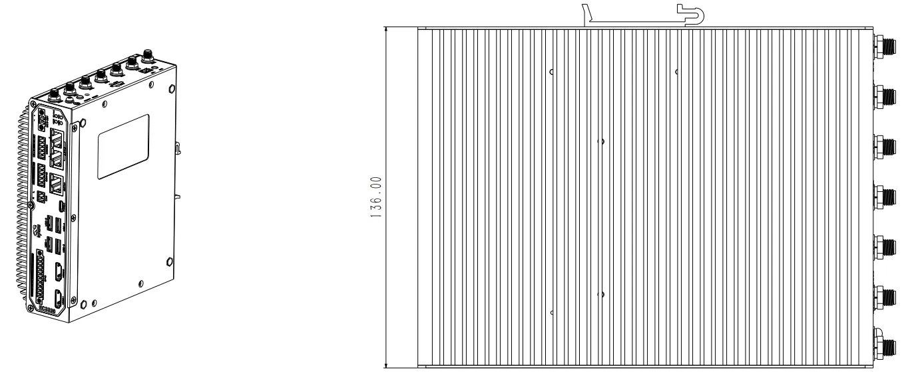</p>

<p align="center"><strong>Figure 2-1 DIN Rail Mounting</strong></p>

(Original manuscript not detailed, to be supplemented)

### 2.2.2 Wall Mounting

The device also supports wall-mounted installation.

<p align="center"></p>

<p align="center"><strong>Figure 2-2 Wall Mounting</strong></p>

(Original manuscript not detailed, to be supplemented)

### 2.2.3 Power Connection

Connect the DC power supply to the DC-IN connector on the front panel and verify that the PWR indicator lights up after connection.

<p align="center">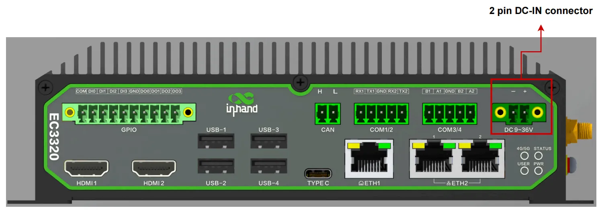</p>

<p align="center"><strong>Figure 2-3 DC-IN Power Connector</strong></p>

The DC power input specifications are as follows:

1. Must be installed by a skilled person.
2. Use copper conductors only.
3. Choose appropriate wire diameter.
4. The voltage for the system is 9 VDC to 36 VDC.
5. Recommended power supply power ≥ 36W.

### 2.2.4 Network Wiring

For remote access via SSH (Secure Shell, can be understood as: a secure remote login protocol that allows encrypted command-line access to the device over a network), ensure the host computer and the device are on the same network segment. The default Ethernet address can be found on the nameplate at the bottom of the device.

<p align="center">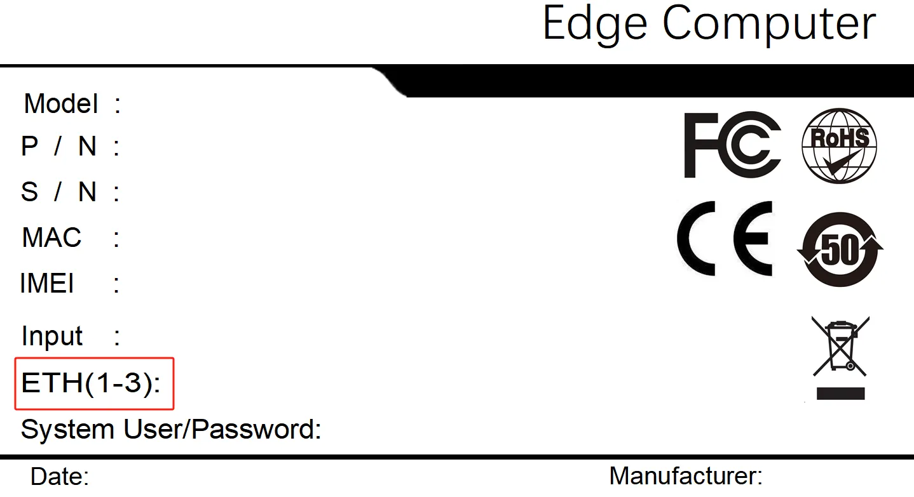</p>

<p align="center"><strong>Figure 2-4 Default Ethernet Address on Nameplate</strong></p>

### 2.2.5 Login Methods

#### Local Login via HDMI

1. Connect the device to a monitor via the HDMI1 or HDMI2 port, and plug the keyboard and mouse into the USB 3.0 Host port.
2. Power up the device and wait for the boot process to complete.
3. Check the nameplate on the bottom of the device to find the default system username and password.

<p align="center">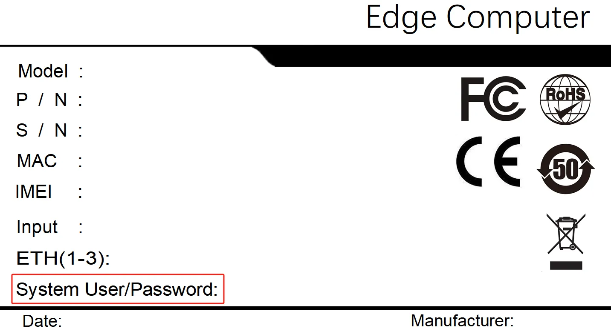</p>

<p align="center"><strong>Figure 2-5 Connecting HDMI and Peripherals</strong></p>

4. On the login screen, select the account corresponding to "System User", enter the password, and log in.

<p align="center"></p>

<p align="center"><strong>Figure 2-6 Login Screen</strong></p>

<p align="center">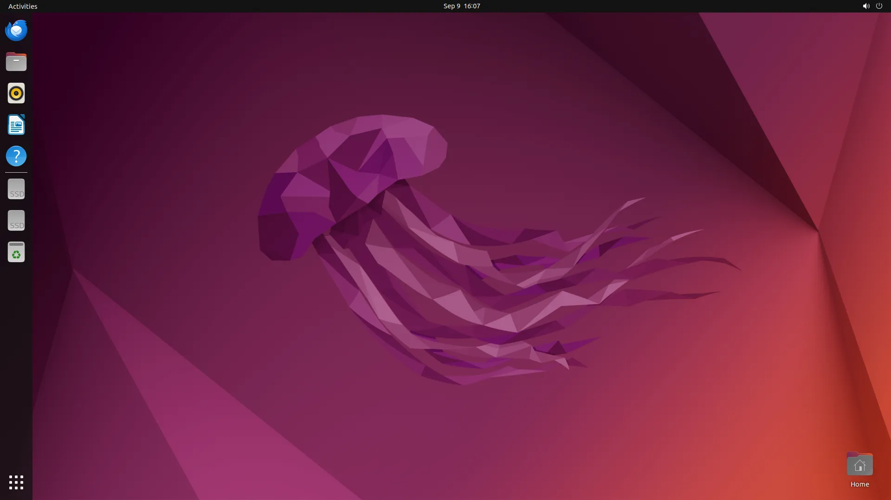</p>

<p align="center"><strong>Figure 2-7 System User Login</strong></p>

#### Remote Login via SSH

1. Ensure the device and the host computer are on the same network segment.
2. Open an SSH terminal tool (e.g., MobaXterm), enter the device IP address, and click Connect.

<p align="center"></p>

<p align="center"><strong>Figure 2-8 SSH Connection Configuration</strong></p>

3. Follow the prompts and enter the default username and password.

<p align="center"></p>

<p align="center"><strong>Figure 2-9 SSH Username Prompt</strong></p>

<p align="center"></p>

<p align="center"><strong>Figure 2-10 SSH Password Prompt</strong></p>

## 2.3 Quick Check

After completing the installation, verify the following items:

- [ ] The device is securely mounted (DIN rail or wall).
- [ ] The power connection is stable and the device has powered on successfully (PWR LED is on).
- [ ] The STATUS LED is flashing green, indicating normal system operation.
- [ ] The monitor displays the login screen when connected via HDMI (if applicable).
- [ ] The host computer can reach the device IP address when using SSH.
- [ ] The default username and password have been located on the device nameplate.


# Chapter 3: Common Scenario Configuration

## Scenario 1: Connecting via HDMI

**Objective**: Access the device locally by connecting a monitor, keyboard, and mouse via HDMI.

**Prerequisites**: An HDMI monitor, a USB keyboard, a USB mouse, and the device power adapter are available.

**Estimated Time**: About 5 minutes.

**Procedure**:
1. Connect the device to the monitor using the HDMI1 or HDMI2 port.
2. Plug the keyboard and mouse into the USB 3.0 Host ports of the device.
3. Power on the device and wait for the system to finish booting.
4. Check the nameplate on the bottom of the device to obtain the default system username and password.

<p align="center"></p>

<p align="center"><strong>Figure 3-1 Connecting HDMI and Peripherals</strong></p>

5. On the login screen, select the user corresponding to "System User", enter the password, and log in.

<p align="center"></p>

<p align="center"><strong>Figure 3-2 Login Screen</strong></p>

<p align="center"></p>

<p align="center"><strong>Figure 3-3 System User Login</strong></p>

**Verification Method**:
1. Verify that the Ubuntu desktop environment is displayed after login.
2. Verify that the keyboard and mouse respond correctly.

---

## Scenario 2: Connecting via SSH

**Objective**: Establish a remote command-line connection to the device using SSH.

**Prerequisites**: The host computer and the device are on the same network segment.

**Estimated Time**: About 3 minutes.

**Procedure**:
1. Check the nameplate on the bottom of the device to obtain the system default Ethernet address.

<p align="center"></p>

<p align="center"><strong>Figure 3-4 Device Nameplate</strong></p>

2. Configure the host computer and the device to be on the same network segment.
3. Open an SSH terminal tool (e.g., MobaXterm), enter the device address, and click **Connect**.

<p align="center"></p>

<p align="center"><strong>Figure 3-5 SSH Terminal Connection Settings</strong></p>

4. When prompted, enter the default username and password.

<p align="center"></p>

<p align="center"><strong>Figure 3-6 SSH Login Prompt</strong></p>

<p align="center"></p>

<p align="center"><strong>Figure 3-7 SSH Connection Established</strong></p>

**Verification Method**:
1. Verify that the terminal prompt appears after successful authentication.
2. Execute a simple command (e.g., `ls`) to confirm the session is active.

---

## Scenario 3: Configuring Ethernet Interface

**Objective**: Configure the Ethernet interface parameters, including static IP and DHCP client modes.

**Prerequisites**: The device is powered on and accessible via the web management interface.

**Estimated Time**: About 5 minutes.

**Procedure**:
1. Open Firefox Web Browser on the desktop system, enter `https://127.0.0.1:9100`, or access the device's Web configuration page through an external network by entering `https://<IP>:9100` in the browser.

<p align="center"></p>

<p align="center"><strong>Figure 3-8 Firefox Web Browser</strong></p>

<p align="center"></p>

<p align="center"><strong>Figure 3-9 Web Configuration Page Access</strong></p>

<p align="center"></p>

<p align="center"><strong>Figure 3-10 Web Login Page</strong></p>

2. Enter the username and password and click Login to log in to the device. After successful login, select 【Network】→【Interfaces】 and select the corresponding Ethernet interface.

<p align="center">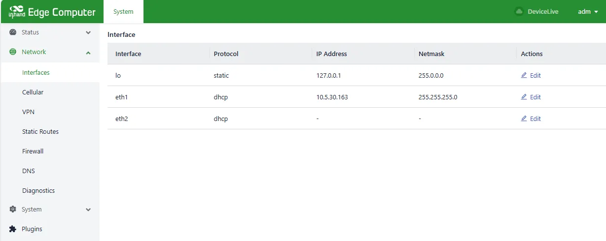</p>

<p align="center"><strong>Figure 3-11 Ethernet Interface Configuration</strong></p>

3. To configure a static IP address, click **Edit** in the Ethernet interface, select "Protocol→Static Address", add a static IP in the IP Address field, add a mask in the netmask, and click **Save**. The network will be reset.

<p align="center">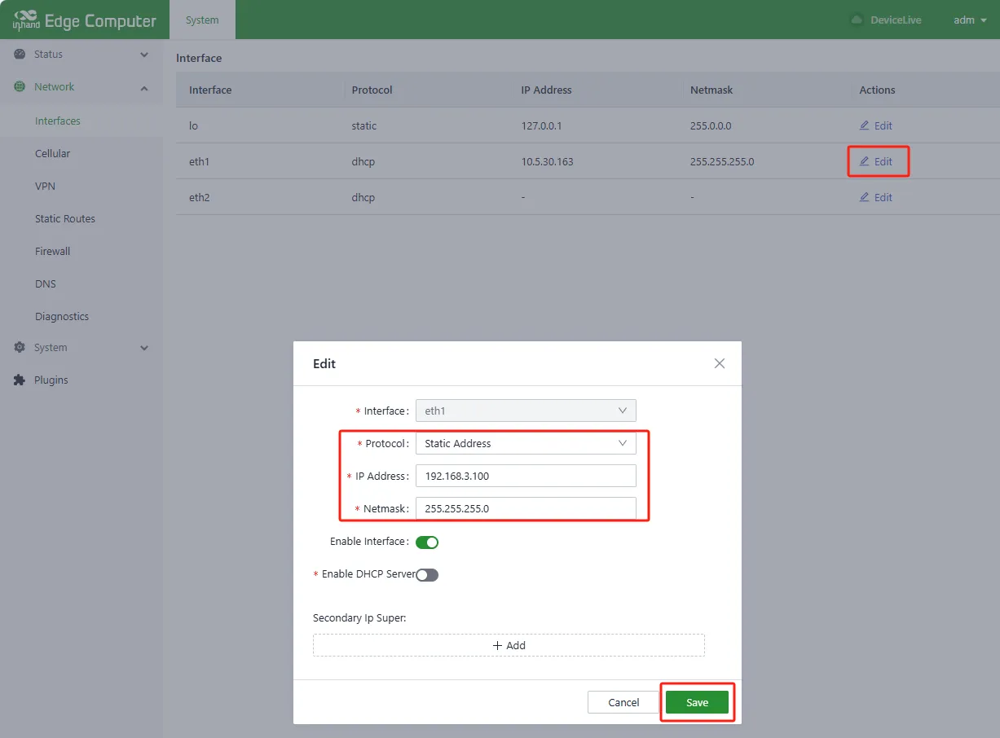</p>

<p align="center"><strong>Figure 3-12 Static IP Configuration</strong></p>

4. To configure dynamic IP assignment, click **Edit** in the Ethernet interface, select "Protocol→DHCP Client", and click **Save**. The network will be reset.

<p align="center"></p>

<p align="center"><strong>Figure 3-13 DHCP Client Configuration</strong></p>

**Verification Method**:
1. Check that the Ethernet interface displays the configured IP address.
2. Ping an external address or the gateway to confirm network connectivity.

---

## Scenario 4: Configuring Wi-Fi Connection

**Objective**: Configure the device to connect to an existing Wi-Fi network as a station (STA mode, can be understood as: "client mode," where the device connects to another Wi-Fi hotspot like a mobile phone connects to a router).

**Prerequisites**: The device supports Wi-Fi functionality and is powered on.

**Estimated Time**: About 5 minutes.

**Procedure**:
1. After logging in successfully, select 【Network】→【WiFi】.

<p align="center"></p>

<p align="center"><strong>Figure 3-14 Wi-Fi Settings Management</strong></p>

2. Click **Enable Wi-Fi** on the WiFi page and click **Scan**.

<p align="center">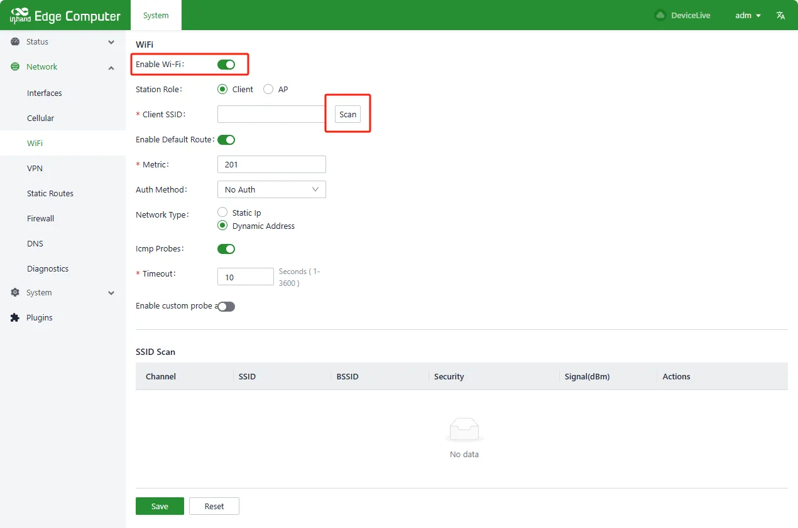</p>

<p align="center"><strong>Figure 3-15 Wi-Fi Scanning</strong></p>

3. Click the scanned Wi-Fi **Actions** → **Connect** and enter the Client SSID and key (WPA/WPA2 PSK Key), click **Save**. Static IP or Dynamic Address can be selected in the Network Type of the connection.

<p align="center"></p>

<p align="center"><strong>Figure 3-16 Wi-Fi Connection</strong></p>

**Verification Method**:
1. Select 【Status】→【WiFi】 to check the Wi-Fi connection status.

<p align="center">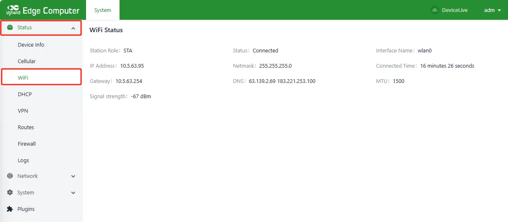</p>

<p align="center"><strong>Figure 3-17 Wi-Fi Status Query</strong></p>

2. Verify that the Wi-Fi interface has obtained an IP address.

**Common Issues**:
- Wi-Fi scan shows no networks: Verify that the Wi-Fi antennas are connected to the SMA connectors on the right panel.
- Connection fails: Verify that the SSID and password are entered correctly.

---

## Scenario 5: Configuring Cellular Network

**Objective**: Configure the cellular network parameters to establish a mobile network connection.

**Prerequisites**: A SIM card has been inserted into the device, the cellular antenna is connected, and the device is powered on.

**Estimated Time**: About 5 minutes.

**Procedure**:
1. After logging in successfully, select 【Network】→【Cellular】 and click **Enabled**.

<p align="center"></p>

<p align="center"><strong>Figure 3-18 Cellular Network Settings</strong></p>

2. Click Cellular Settings page → **Network Mode**. The available network modes are Auto, WCDMA, LTE, 5G, 5G SA, and 5G NSA.

<p align="center">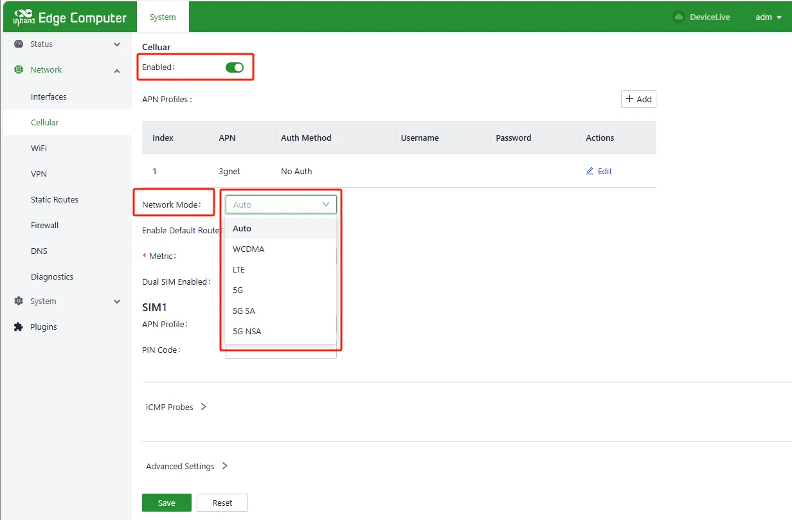</p>

<p align="center"><strong>Figure 3-19 Network Mode Selection</strong></p>

3. Click Cellular page → **Enable Default Route**. A metric value of 2–255 can be entered in the Route Metric.

<p align="center"></p>

<p align="center"><strong>Figure 3-20 Default Route Configuration</strong></p>

4. Click Cellular page → **Dual SIM Enabled**, select Main SIM from SIM1 or SIM2, configure Max Number of Dials, and configure APN parameters and PIN Code for SIM1 and SIM2.

<p align="center">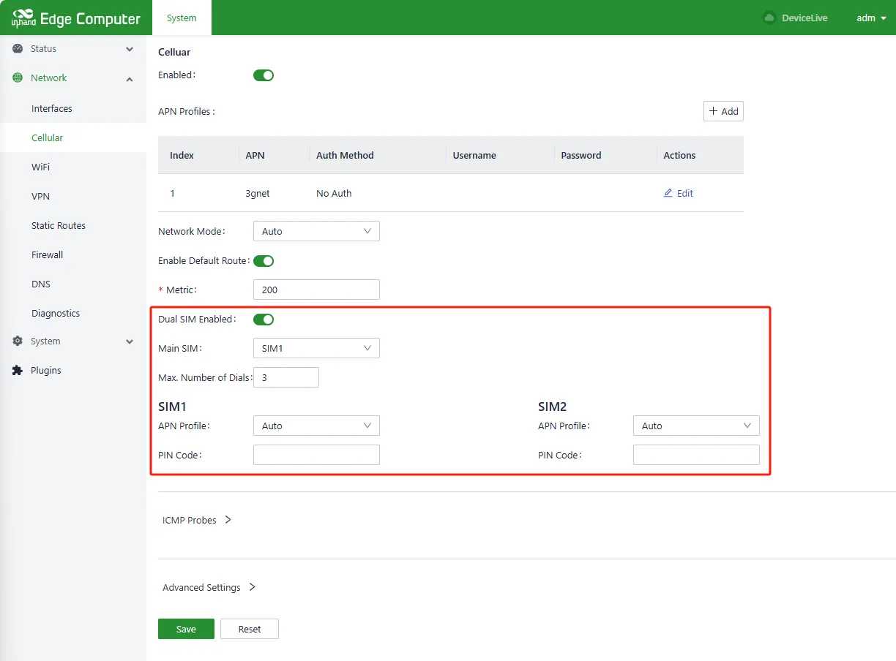</p>

<p align="center"><strong>Figure 3-21 SIM Card Selection and Settings</strong></p>

**Verification Method**:
1. Select 【Status】→【Cellular】 to view the cellular status.

<p align="center">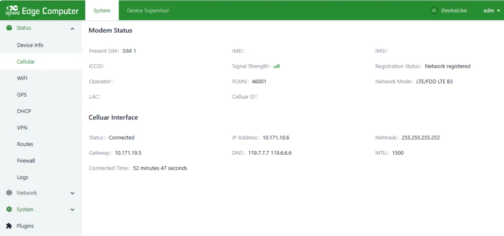</p>

<p align="center"><strong>Figure 3-22 Cellular Status Query</strong></p>

2. Verify that the SIM card is detected and the cellular network is connected.

**Common Issues**:
- SIM card not detected: Verify that the SIM card is correctly inserted into the SIM card slot on the right panel.
- Cellular network not connected: Verify that the APN parameters are correctly configured (obtain from the operator if necessary).
- Weak or no signal: Verify that the cellular antennas are connected to the SMA connectors.

---

## Scenario 6: Configuring CAN Interface

**Objective**: Configure the CAN 2.0 interface for industrial communication.

**Prerequisites**: The device is powered on and the Ubuntu desktop environment or SSH access is available.

**Estimated Time**: About 3 minutes.

**Procedure**:
1. Open Terminal.
2. Enter the following command to bring up the CAN interface:

```
sudo ip link set can0 up type can bitrate 1000000 fd off
```

<p align="center">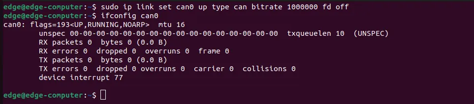</p>

<p align="center"><strong>Figure 3-23 CAN Interface Configuration</strong></p>

**Verification Method**:
1. Verify that the CAN interface is up by running `ip link show can0`.
2. Test CAN communication with a connected device.

---

## Scenario 7: Querying System Version

**Objective**: Query the current system firmware version.

**Prerequisites**: The device is powered on and the user has logged in via HDMI or SSH.

**Estimated Time**: About 2 minutes.

**Procedure**:
1. Click "Show Applications→Terminal" or right-click and select "Open in Terminal".
2. Enter the following command to query the version number only:

```
sudo ecversion
```

3. Enter the following command to query detailed version information:

```
sudo ecversion -all
```

<p align="center"></p>

<p align="center"><strong>Figure 3-24 Version Query</strong></p>

<p align="center">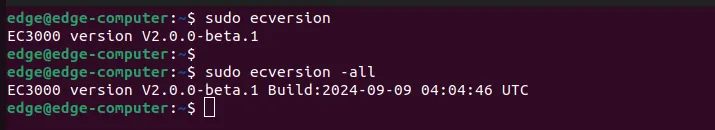</p>

<p align="center"><strong>Figure 3-25 Detailed Version Information</strong></p>

---

## Scenario 8: Setting System Time

**Objective**: Configure the system time zone and adjust the system time.

**Prerequisites**: The device is powered on and the web management interface is accessible.

**Estimated Time**: About 3 minutes.

**Procedure**:
1. After logging in successfully, select 【System】→【Basic】→【Time】→【Timezone】, select the corresponding time zone, and click **Save**.

<p align="center">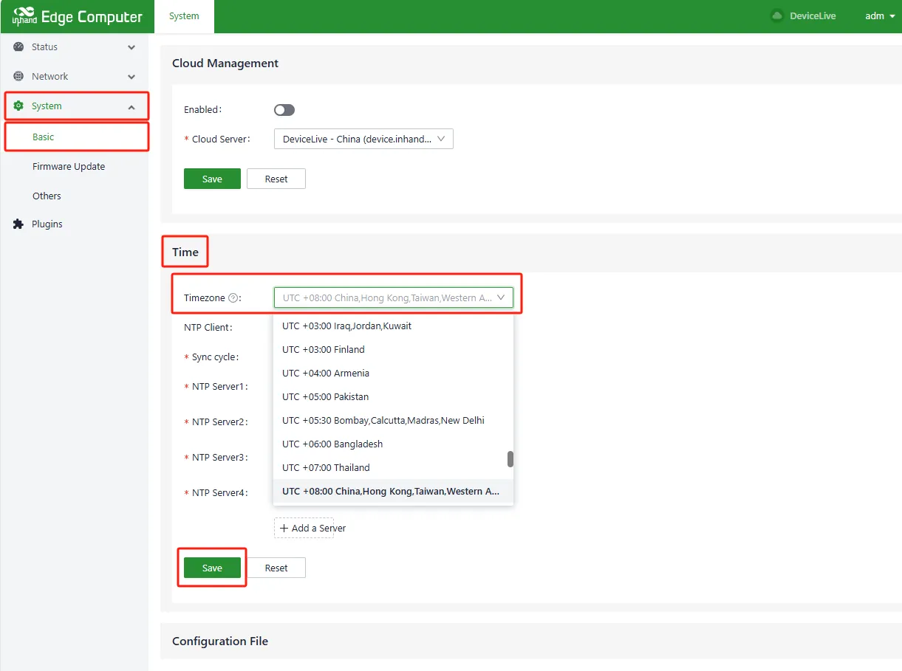</p>

<p align="center"><strong>Figure 3-26 Timezone Setting</strong></p>

2. Click 【Status】→【Device Info】→【Sync with browser】 to write the local time to the device.

<p align="center">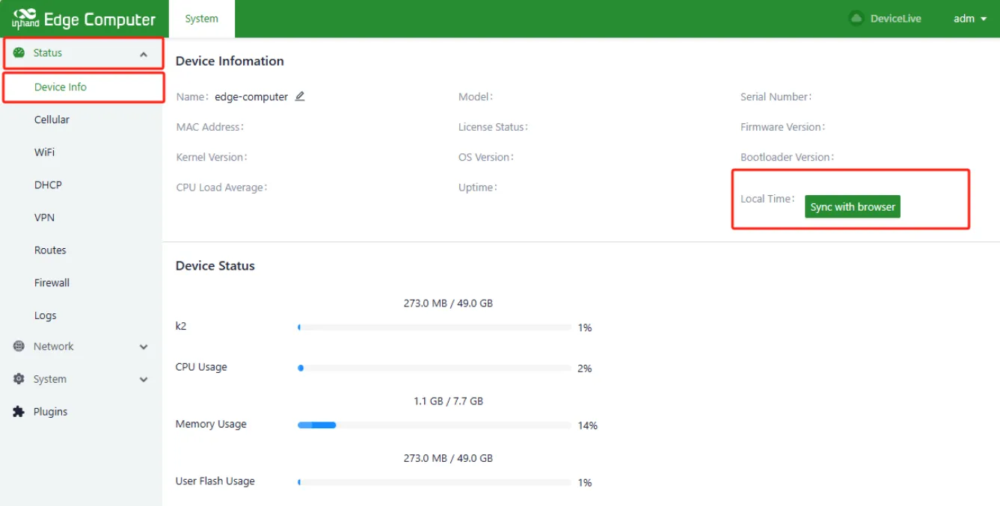</p>

<p align="center"><strong>Figure 3-27 Time Synchronization with Browser</strong></p>


# Chapter 4: Function Description and Parameter Reference

## 4.1 User management

### 4.1.1 Creating Users

Click "Show Applications->Terminal" or right click "Open in Terminal" and enter the following commands, follow the prompts to enter the password and user information, please make sure the user exists before creating, for the user that already exists, create again will prompt "The user 'username' already exists".

```json
## check if the test account exists 
id test 
## create test account
sudo adduser test
```


<p align="center"><strong>Figure 4-1 Creating Users</strong></p>

### 4.1.2 Delete Users

Click "Show Applications->Terminal" or right-click and click "Open in Terminal" and enter the following command to delete the user, before deleting the user, please make sure the user exists or not, if you delete a non-existing user, it will prompt "The user 'username' does not exist".

```json
## Check if the test account exists 
id test 
## Delete the test account
sudo deluser test
```


<p align="center"><strong>Figure 4-2 Delete Users</strong></p>

### 4.1.3 Disable and Enable Users

Click "Show Applications->Terminal" or right-click and click "Open in Terminal" and enter the following commands to disable/enable the user, before disable/enable the user, please make sure the user exists, if the user does not exist, it will prompt "The user 'username' does not exist".

```json
## Check if the test account exists 
id test 
## Disable the test account
 sudo passwd -l test 
## Enable test account
 sudo passwd -u test 
## Query the status of the test account (L disabled/P enabled)
 sudo passwd -S test
```


<p align="center"><strong>Figure 4-3 Disable and Enable Users</strong></p>

### 4.1.4 Advanced Extension of User Management

Reference:

1. [Ubuntu Manpage: adduser, addgroup - add a user or group to the system](https://manpages.ubuntu.com/manpages/xenial/en/man8/adduser.8.html?_gl=1*1jz4dhl*_gcl_au*MTkwNTc0MDUwMC4xNzI1MzQ3ODI1&_ga=2.97338463.1940871822.1725347824-1111823313.1715413709)
2. [Ubuntu Manpage: deluser, delgroup - remove a user or group from the system](https://manpages.ubuntu.com/manpages/focal/en/man8/deluser.8.html?_gl=1*2hnawf*_gcl_au*MTkwNTc0MDUwMC4xNzI1MzQ3ODI1&_ga=2.165044991.1940871822.1725347824-1111823313.1715413709)
3. [Ubuntu Manpage: passwd - change user password](https://manpages.ubuntu.com/manpages/bionic/man1/passwd.1.html?_gl=1*1rjws9d*_gcl_au*MTkwNTc0MDUwMC4xNzI1MzQ3ODI1&_ga=2.211133397.1940871822.1725347824-1111823313.1715413709)
4. [Ubuntu Manpage: usermod - modify a user account](https://manpages.ubuntu.com/manpages/trusty/en/man8/usermod.8.html?_gl=1*2hnawf*_gcl_au*MTkwNTc0MDUwMC4xNzI1MzQ3ODI1&_ga=2.165044991.1940871822.1725347824-1111823313.1715413709)


## 4.2 Web Management Overview

The EC3000 series AI Edge Computer runs on the Ubuntu operating system. While Linux native commands can be used for network and system management, InHand has developed a web-based management interface for simplified configuration. The web management interface can be accessed via HTTPS on port 9100.

When managing the device through the web interface, simultaneous use of Linux native commands may cause conflicts. It is recommended to perform configurations supported by the web interface through the web interface.

**Access Path**

Open Firefox Web Browser and enter `https://127.0.0.1:9100` for local access, or `https://<IP>:9100` for remote access.

**Operation Instructions**

1. Enter the username and password on the login page and click **Login**.
2. Navigate through the menu to access the desired configuration page.

**Parameter Descriptions**

| Parameter | Description |
|-----------|-------------|
| Login URL | `https://<IP>:9100` |
| Default username | (Printed on the device nameplate) |
| Default password | (Printed on the device nameplate) |

---

### 4.2.1 Network Management

#### 4.2.1.1 Ethernet Setting

**Settings Management**

1. Click ”Show Applications->Firefox Web Browser” on your desktop system, enter [https://127.0.0.1:9100](https://127.0.0.1:9100) or access the device's WEB configuration page through an external network. , open the browser and enter <https://IP:9100>.


<p align="center"><strong>Figure 4-4 Firefox Web Browser</strong></p>


<p align="center"><strong>Figure 4-5 enter https://127.0.0.1:9100</strong></p>


<p align="center"><strong>Figure 4-6 Web Login</strong></p>

1. Enter the username and password and click Login to log in to the device. After successful login, select “Network -> Interfaces” and select the corresponding Ethernet interface.


<p align="center"><strong>Figure 4-7 Network->interface</strong></p>

**Static Configuration**

Click Edit in the Ethernet interface, select “Protocol->Static Address”, add a static IP in the IP Address field, add a mask in the netmask and click Save, then the network will be reset.


<p align="center"><strong>Figure 4-8 static configuration</strong></p>

**Dynamic Configuration**

Click Edit in the Ethernet interface, select “Protocol->DHCP Client” and click Save, then the network will be reset.


<p align="center"><strong>Figure 4-9 Dynamic Configuration</strong></p>

#### 4.2.1.2 Wi-Fi Configuration

**Settings Management**

After logging in successfully， select Network -> WiFi.


<p align="center"><strong>Figure 4-10 WiFi Setting</strong></p>

**Scanning**

Click Enable Wi-Fi on the WiFi page and click Scan.


<p align="center"><strong>Figure 4-11 WiFi scanning</strong></p>

**Connection**

Click the scanned Wi-Fi Actions -> Connect and enter the Client SSID and key (WPA/WPA2 PSK Key), click Save; you can select Static IP or Dynamic Address in the Network Type of the connection.


<p align="center"><strong>Figure 4-12 WiFi connection</strong></p>

**Status Query**

Click Status -> WiFi page to check Wi-Fi status.


<p align="center"><strong>Figure 4-13 WiFi status Query</strong></p>


#### 4.2.1.3 Cellular Network

**Settings Management**

After logging in successfully, select Network -> Cellular and click Enabled.


<p align="center"><strong>Figure 4-14 Cellular Setting</strong></p>

**Network Mode Selection**

Click Cellular Settings page -> Network Mode. The available network modes are Auto, WCDMA, LTE, 5G, 5G SA, and 5G NSA.


<p align="center"><strong>Figure 4-15 Network Mode Selection</strong></p>

**Adding a Default Route**

Click Cellular page -> Enable Default Route. you can enter a metric value up to 2-255 in the Route Metric.


<p align="center"><strong>Figure 4-16 Adding a Default Route</strong></p>

**SIM Card Selection and Settings**

Click Cellular page -> Dual SIM Enabled, select Main SIM from SIM1 or SIM2, configure Max Number of Dials, configure APN parameters and PIN Code for SIM1 and SIM2.


<p align="center"><strong>Figure 4-17 SIM card Selection</strong></p>

**Status Query**

Click Status -> Cellular to view the cellular status.


<p align="center"><strong>Figure 4-18 Cellular status query</strong></p>

### 4.2.2 System Administration

#### 4.2.2.1 Basic Configuration

**Cloud Management**

**Parameter Description**:

| Parameter    | Description                                                  |
| ------------ | ------------------------------------------------------------ |
| Enabled      | Enable switch for docking with the DeviceLive platform       |
| Cloud Server | DeviceLive platform address; select domestic or overseas platform |

**Time Zone and NTP Client**
<p align="center"></p>

<p align="center"><strong>Figure 4-19 Time Zone and NTP Configuration</strong></p>

Up to 10 NTP server addresses can be configured. The program periodically sends synchronization requests to each server address in sequence. After successful synchronization, the system time is written to the RTC, and subsequent NTP servers are no longer queried.

In addition to NTP automatic synchronization, a manual synchronization button is available on the [Device Info] status page. This button is displayed only when the device time and local time differ by more than 3 seconds.

This page also supports configuration import, export, and factory recovery.

#### 4.2.2.2 Firmware Upgrade

<p align="center"></p>

<p align="center"><strong>Figure 4-20 Firmware Upgrade</strong></p>

The automatic restart option is disabled by default. After upgrading firmware, the system must be manually restarted to take effect. When automatic restart is enabled, the system automatically restarts after a successful firmware upgrade.

#### 4.2.2.3 Others

<p align="center"></p>

<p align="center"><strong>Figure 4-21 System Restart and Reset</strong></p>

This page provides system restart and system reset functions. System reset restores the configuration and file system to factory defaults, which means user-installed software will also be cleared. Use this function with caution.


## 4.3 Advanced Configuration of the Peripheral Interface
### 4.3.1 CAN

Open Terminal and enter the following command to configure the CAN interface.

```json
## Link up CAN interface
sudo ip link set can0 up type can bitrate 1000000 fd off
```


<p align="center"><strong>Figure 4-22 CAN Interface</strong></p>

### 4.3.2 Serial Port

The device supports two RS-232 and two RS-485 serial ports corresponding to device nodes /dev/ttyCOM1, /dev/ttyCOM2, /dev/ttyCOM3 and /dev/ttyCOM4.

| **Table 7: Serial Port Mapping** |              |
| -------------------------------- | ------------ |
| COM1                             | /dev/ttyCOM1 |
| COM2                             | /dev/ttyCOM2 |
| COM3                             | /dev/ttyCOM3 |
| COM4                             | /dev/ttyCOM4 |

### 4.3.3 Digital Input/Output

The device supports 4 isolated digital inputs and 4 isolated digital outputs.

| **Table 8: Digital Inputs/Outputs** |      |                               |
| ----------------------------------- | ---- | ----------------------------- |
| DI                                  | DI0  | /sys/class/gpio/gpio498/value |
|                                     | DI1  | /sys/class/gpio/gpio497/value |
|                                     | DI2  | /sys/class/gpio/gpio496/value |
|                                     | DI3  | /sys/class/gpio/gpio495/value |
|                                     |      |                               |
| DO                                  | DO0  | /sys/class/gpio/gpio494/value |
|                                     | DO1  | /sys/class/gpio/gpio493/value |
|                                     | DO2  | /sys/class/gpio/gpio499/value |
|                                     | DO3  | /sys/class/gpio/gpio500/value |


## 4.4  Security

### 4.4.1 TPM 2.0
The device supports Trusted Platform Module 2.0 (TPM2.0) and comes with the pre-installed tpm2-tools tool, which allows you to operate the TPM2.0 module directly using commands to implement security functions.

Reference:

1. [tpm2-tools](https://tpm2-tools.readthedocs.io/en/latest/)
2. [tpm2-tools/man at master - tpm2-software/tpm2-tools (github.com)](https://github.com/tpm2-software/tpm2-tools/tree/master/man)

## 4.5 Programming Guide

Reference:

1. [Journey Develop a SW for Hailo-8 | Hailo](https://hailo.ai/developer-zone/journey-develop-a-sw-for-hailo-8/)
2. [Hailo AI Demos: Experience the Future Of Edge AI Technology](https://hailo.ai/resources/type/demos/)


# Appendix A: Troubleshooting

This appendix organizes common issues by observable phenomenon. The troubleshooting steps are derived from the information provided in the source manual.

## 1 Network Connection Issues

| Phenomenon | Possible Cause | Troubleshooting Steps | Related Section |
|------------|----------------|-----------------------|-----------------|
| Cannot connect to cellular network | SIM card not inserted or inserted incorrectly | 1. Check that the SIM card is correctly inserted into the SIM card slot on the right panel.<br>2. Re-insert the SIM card if necessary. | [SIM Card Slot](#appearance-and-interfaces) |
| Cannot connect to cellular network | APN parameters configured incorrectly | 1. Verify that the APN parameters match the operator's requirements.<br>2. Contact the operator to obtain the correct APN settings. | [Cellular Network Configuration](#44-cellular-network-configuration) |
| Cannot connect to cellular network | Weak or no signal | 1. Check that the cellular antennas are connected to the SMA connectors.<br>2. Adjust the device position or antenna orientation. | [SMA Antennas](#appearance-and-interfaces) |
| Wi-Fi scan shows no networks | Wi-Fi antennas not connected | 1. Check that the Wi-Fi antennas are connected to the SMA connectors on the right panel. | [SMA Antennas](#appearance-and-interfaces) |
| Wi-Fi connection fails | Incorrect SSID or password | 1. Verify that the SSID and password are entered correctly.<br>2. Re-enter the credentials and try again. | [Wi-Fi Configuration](#43-wi-fi-configuration) |
| Cannot access web management interface | IP address incorrect | 1. Confirm that the host computer and the device are on the same network segment.<br>2. Check the device default IP address on the nameplate. | [Web Management Overview](#41-web-management-overview) |
| Cannot access web management interface | Browser compatibility issue | 1. Use a recommended browser (e.g., Firefox).<br>2. Clear the browser cache and try again. | [Web Management Overview](#41-web-management-overview) |

## 2 System Issues

| Phenomenon | Possible Cause | Troubleshooting Steps | Related Section |
|------------|----------------|-----------------------|-----------------|
| System configuration needs to be restored to factory state | User-installed software or configuration errors require full reset | 1. Use the RESET pinhole button: press and hold RESET for 10 seconds during normal operation, wait for the system status light to change from blinking to constantly on, then release.<br>2. Alternatively, execute `sudo update reset` in Terminal. | [System Reset Methods](#49-system-reset-methods) |
| Cannot log in via HDMI | Incorrect username or password | 1. Check the device nameplate for the default username and password.<br>2. Verify that the correct account is selected on the login screen. | [Local Login via HDMI](#local-login-via-hdmi) |
| Cannot log in via SSH | Incorrect IP address or network issue | 1. Verify that the device and host computer are on the same network segment.<br>2. Check that the SSH service is running on the device. | [Remote Login via SSH](#remote-login-via-ssh) |

## 3 Peripheral Issues

| Phenomenon | Possible Cause | Troubleshooting Steps | Related Section |
|------------|----------------|-----------------------|-----------------|
| Serial port not responding | Incorrect device node | 1. Verify that the correct device node is used (e.g., `/dev/ttyCOM1`).<br>2. Check the serial port mapping table. | [Serial Port and Digital I/O Configuration](#47-serial-port-and-digital-io-configuration) |
| Digital input not reading correctly | Incorrect GPIO path | 1. Verify that the correct GPIO path is used (e.g., `/sys/class/gpio/gpio498/value`).<br>2. Check the digital I/O mapping table. | [Serial Port and Digital I/O Configuration](#47-serial-port-and-digital-io-configuration) |
| CAN interface not working | Interface not brought up | 1. Execute `sudo ip link set can0 up type can bitrate 1000000 fd off` to bring up the interface.<br>2. Verify the interface status with `ip link show can0`. | [CAN Interface Configuration](#45-can-interface-configuration) |


# Appendix B: Safety Precautions

1. The device must be installed by a skilled person.
2. Use copper conductors only for wiring connections.
3. Choose an appropriate wire diameter for all connections.
4. The system voltage range is 9 VDC to 36 VDC.
5. Recommended power supply power ≥ 36W.
6. There is one system grounding screw on the right panel of the equipment. Use a green-yellow grounding wire (16AWG) and connect it securely with the system grounding screw.
7. Operating temperature: -20 ~ 60°C.
8. Operating humidity: 95%@40°C (non-condensing).
9. Storage temperature: -40 ~ 85°C.
10. The software described in this manual can only be used in accordance with the terms of the license agreement.

> **Warning**: InHand Networks shall not be responsible for any direct, indirect, intentional or unintentional damage or hidden trouble caused by improper installation or use.

