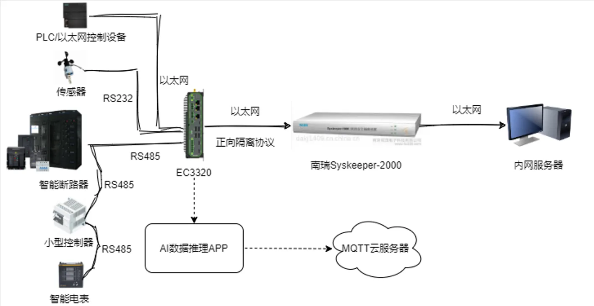

# Power Station Data Acquisition Intelligent Analysis Solution

# I. Solution Overview

## 1.1 Project Background

The customer's original solution was to place all power station data computation and AI inference on the cloud side, which consumed enormous cloud resources and had high costs. By adopting a cloud-edge collaborative solution, the AI data computation and inference part for each station on the cloud side can be moved to run on the edge computer side. The gateway uploads the computation results to the cloud in real-time, and the cloud only handles data display and related scheduling work.

## 1.2 Construction Objectives

- Full equipment networking, unified access management

- Real-time data acquisition, standardization, cloud upload / platform integration

- Support remote configuration, remote diagnosis, remote upgrade

- Local AI inference and analysis of data

- Achieve alarms, linkage, visualization, and report analysis

- Improve operation and maintenance efficiency, reduce manual inspection costs

- Secure, stable, easy to expand, easy to maintain

## 1.3 Applicable Scenarios

- Power station meter equipment data access
- Smart power stations

# II. Requirements Analysis

## 2.1 Current Equipment Status

- Equipment types: PLC, sensors, circuit breakers, electricity meters
- Communication interfaces: RS485, Ethernet port
- Communication protocols: Modbus RTU/TCP, IEC104, DLT645
- Deployment environment: Indoor / Outdoor

# III. Overall Architecture Design

## 3.1 Four-Layer Architecture

1. Perception Layer: Sensors, meters

2. Network Layer: Edge computer, 4G/5G

3. Platform Layer: IoT platform (HTTP/ cloud platform), data storage, edge computing

4. Application Layer: Monitoring large screen, Web management backend, APP, alarm system

## 3.2 Data Flow

Device → Edge computer → Protocol parsing → Edge computing / Local caching → Cloud platform → Application display / Control issuance

## 3.3 Solution Topology

# IV. Network and Access Solution

## 4.1 Networking Method Selection

Cellular/Ethernet/WiFi

## 4.2 Edge Gateway Selection Points

- Supports multiple protocols (Modbus, DLT, IEC104, etc.)

- Multiple serial ports (RS485/RS232), network ports, 4G/5G

- Edge computing, local caching, data continuation after network interruption

- Industrial-grade wide temperature, dustproof, anti-interference

- Remote management, remote upgrade, remote configuration

# V. Protocol and Data Acquisition Solution

## 5.1 Southbound Protocols to Support

- Industrial protocols: Modbus RTU/TCP

- Meter protocols: DL/T645

## 5.2 Northbound Protocols to Support

- MQTT

-

# VI. Solution Highlights Summary

1. One-stop: Access + Network + Platform + Application full-stack solution

2. High compatibility: Multi-device, multi-protocol, multi-network unified access

3. High reliability: Edge caching, data continuation after network interruption, dual-link backup

4. Easy expansion: Support batch expansion, secondary development, API integration

5. Low cost: Reduce manual inspections, improve operation and maintenance efficiency

6. Security and compliance: Transmission encryption, permission management, operation audit
