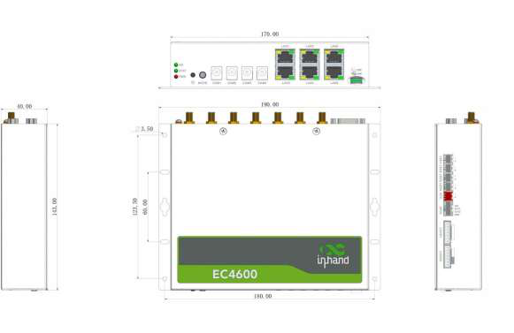

  

    

      
    

    

      Embrace Edge AI, Empower the Era of Visual Recognition
    

  

  

    

      EC4600 Series AI Edge Computer
    

    

      

        
· 14 TOPS AI

        
· 4× Camera

      

      

        
· Rich Interfaces

        
· High Reliability

      

    

  

# 1. Product Overview

**The EC4600 AI edge computer is built for real-time visual recognition and local image analytics, delivering 14 TOPS of edge AI computing power.**

**Key features:**
- **Edge AI compute:** 14 TOPS, octa-core ARM, Adreno GPU, up to 2.7 GHz
- **Vision-ready I/O:** 4× camera power, HDMI, USB, speaker
- **Flexible connectivity:** 4G, Wi-Fi 6, 6× FE, dual-SIM failover
- **Industrial design:** Metal housing, IP40, fanless, wide-temperature design
- **Stable operation:** Hardware/software watchdog, multi-level link detection

## Core Technical Specifications

| Technical Indicator | Specification |
|---|---|
| Cellular Network | LTE Cat4; 2 × Nano SIM; dual-SIM failover |
| Wi-Fi | STA; 802.11a/b/g/n/ac/ax; 2.4 / 5 GHz dual band |
| Operating System | Android 12 |
| Security | Secure Boot |
| Reliability | Dual SIM; multi-level link detection; embedded watchdog |
| Network Features | ARP, Ethernet; Static IP, DHCP |
| AI Computing Power | 14 TOPS (comprehensive) |
| Dimensions | 190 × 143 × 40 mm (including mounting parts); wall mounting |
| Interfaces | 6 × 10/100 Mbps; 4-channel camera power; 2 × RS-232 + 2 × RS-485; HDMI; USB |
| Power Supply | 12 V DC |
| Operating Temperature | -10 °C ~ +60 °C |
| Protection Rating | IP40 |

# 2. Product Dimensions

  

    
    
Top View

  

  

    
Note:

    
1. All dimensions are in millimeters (mm).

    
2. All dimensions are approximate and for reference only.

    
3. Illustrated dimensions shall not be used for production.

    
4. Dimensions are subject to part and manufacturing tolerances.

    
5. Dimensions are subject to change without notice.

  

# 3. Hardware Specifications

| Category/Parameter | Specification |
|--------------------------|------|
| **Processor** | |
| CPU | Qualcomm QCM6490: 1 × Kryo 670 Gold Plus @ 2.7 GHz + 3 × Kryo 670 Gold @ 2.4 GHz + 4 × Kryo 670 Silver @ 1.9 GHz |
| GPU | Qualcomm® Adreno™ 643 @ 812 MHz |
| AI Computing Power | 14 TOPS (comprehensive) |
| RAM | 8 GB |
| Flash | 128 GB eMMC |
| **Connectivity & Networking** | |
| Cellular Network | LTE Cat4 |
| SIM | 2 × Nano SIM; dual-SIM failover |
| Wi-Fi | STA; 802.11a/b/g/n/ac/ax; 2.4 / 5 GHz dual band |
| **Interfaces** | |
| Ethernet Port | 6 × 10/100 Mbps |
| Camera Power Supply | 4 × white round interface (Ø5.5 × 2.1), 5 W |
| Serial Port | 2 × RS-232 (DB9); 2 × RS-485 (one 4-pin with power supply, one 3-pin industrial terminal) |
| GPIO | 2 × OUT |
| NTC | 1 × NTC temperature sensing |
| USB | 2 × USB 2.0 |
| HDMI | 1 × HDMI |
| Speaker | 1 × SPK, supports 5 W speakers |
| Backup Battery | 1 × backup battery interface |
| Power Button | 1 × Power |
| **LED Indicators** | |
| Power | Power supply indicator, always on after power-on |
| Status | Status indicator flashes during normal operation |
| 3G/4G | Cellular indicator always on when connected normally |
| User LED | 4 × LED |
| **Power** | |
| Power Input | 12 V DC |
| **Mechanical** | |
| Dimensions (W × D × H) | 190 × 143 × 40 mm (including mounting parts) |
| Mounting | Wall mounting |
| Ingress Protection | IP40 |
| Cooling | Fanless |
| Housing | Metal |
| **Environmental** | |
| Operating Temperature | -10 °C ~ +60 °C |
| Storage Temperature | -40 °C ~ +85 °C |
| Ambient Humidity | 5 ~ 95 % RH (non-condensing) |
| **Physical** | |
| ESD | Level 2 |
| EFT | Level 2 |
| Surge | Level 2 |
| Shock | IEC 60068-2-27 |
| Vibration | IEC 60068-2-6 |
| Free Fall | IEC 60068-2-32 |

# 4. Software Specifications

| Category/Parameter | Specification |
|--------------------------|------|
| **Operating System** | |
| OS | Android 12 |
| **Network Features** | |
| Network Type | 4G |
| LAN Protocol | ARP, Ethernet |
| WAN Protocol | Static IP, DHCP |
| **Security** | |
| Secure Boot | Supported |
| **Reliability** | |
| Backup | Dual SIM |
| Link Detection | Multi-level link detection; auto redials once disconnected |
| Embedded Watchdog | Device self-diagnosing; auto-recovers from operation faults |

# 5. Ordering Information

## Model Rule

**Model code:** EC4600-\<WMNN\>-\<STD\>

\<WMNN\>: Cellular Type & Frequency Band  
\<STD\>: Standard configuration  
Optional OS suffix: -[X] (OS optional)

## Model List

<table style="width:100%; table-layout:fixed; font-size:11px;">
  <colgroup>
    <col style="width:20%;">
    <col style="width:10%;">
    <col style="width:28%;">
    <col style="width:7%;">
    <col style="width:8%;">
    <col style="width:11%;">
    <col style="width:16%;">
  </colgroup>
  <tr><th>Model</th><th>Region</th><th>&lt;WMNN&gt;: Cellular Type & Frequency Band</th><th>RAM</th><th>Flash</th><th>Ethernet Port</th><th>Serial Port</th></tr>
  <tr><td style="white-space: nowrap;">EC4600-DQ20-STD</td><td>China</td><td>LTE Cat4 LTE-FDD: B1/B3/B5/B8 LTE-TDD: B34/B38/B39/B40/B41 WCDMA: B1/B8 TD-SCDMA: B34/B39 CDMA: BC0 GSM: 900/1800 MHz</td><td>8 GB</td><td>128 GB</td><td>6 × 100 Mbps</td><td>2 × RS-232 2 × RS-485</td></tr>
  <tr><td style="white-space: nowrap;">EC4600-FQ58-STD</td><td>EMEA</td><td>LTE Cat4 LTE-FDD: B1/B3/B7/B8/B20/B28A LTE-TDD: B38/B40/B41 WCDMA: B1/B8 GSM: B3/B8</td><td>8 GB</td><td>128 GB</td><td>6 × 100 Mbps</td><td>2 × RS-232 2 × RS-485</td></tr>
</table>

# 6. Contact Us

- **Website:** [InHand Networks](https://www.inhand.com)
- **Copyright:** © InHand Networks. All rights reserved.
