EC5000 Series AI Edge Computer 

User Manual

Version 2.1, March 2025

[www.inhand.com](http://www.inhand.com/)


The software described in this manual is according to the license agreement, can only be used in accordance with the terms of the agreement.

Copyright Notice

© 2025 InHand Networks All rights reserved.

Trademarks

The InHand logo is a registered trademark of InHand Networks.

All other trademarks or registered trademarks in this manual belong to their respective manufacturers.

Disclaimer

The company reserves the right to change this manual, and the products are subject to subsequent changes without prior notice. 9. We shall not be responsible for any direct, indirect, intentional or unintentional damage or hidden trouble caused by improper installation or use.

# 1 General Introduction

## 1.1 Introduction

The EC5000 comes pre-integrated with NVIDIA® Jetson Orin NX™ or Orin Nano™, making it ideal for industrial AI applications.The EC5000 design includes 2 Gigabit LAN ports, 1 HDMI video display, 6 external USB 3.2 ports, 2xRS-232/RS-422/RS-485, 1 power indicator, 1 system status light, 2 GMSL video interfaces, 4 DI, 4 DO, 1 CAN FD, 2 SIM card slots, 1 USB Type C for system burn-in, 1 TF card slot, 1 reboot (hardware watchdog enable) button, 1 restore mode button, and 1 linear output connector and microphone connector.  

                                                                        Packing list

| Number | Name                     | Quantity | Remarks                                          |
| ------ | ------------------------ | -------- | ------------------------------------------------ |
| 1      | EC5000 Host              | 1        | -                                                |
| 2      | Power Adapter            | 1        | Optional Equipment                               |
| 3      | Wi-Fi Antenna            | 2        | Standard Equipment                               |
| 4      | Cellular Antenna         | 2-4      | Standard Equipment(Depending on thedevice model) |
| 5      | Mounting RailAccessories | 1        | Standard Equipment                               |
| 6      | Warranty Card            | 1        | -                                                |

## 1.2 Product Features

### 1.2.1 Key Features

#### 1.2.1.1 Processor

| **Product Series**    | ****EC5350****                                                            | ****EC5550****                                                          |
| --------------------- | ------------------------------------------------------------------------- | ----------------------------------------------------------------------- |
| Jetson Orin Module    | Jetson Orin Nano 8GB                                                      | Jetson Orin NX 16GB                                                     |
| AI Performance        | 40 TOPS                                                                   | 100 TOPS                                                                |
| GPU                   | 1024-core NVIDIA Ampere architecture GPU with 32 Tensor Cores             | 1024-core NVIDIA Ampere architecture GPU with 32 Tensor Cores           |
| GPU Max Frequency     | 1020MHz                                                                   | 1173MHz                                                                 |
| CPU                   | 6-core Arm® Cortex®-A78AE v8.2<br><br><br>64-bit CPU<br>1.5MB L2 + 4MB L3 | 8-core Arm® Cortex®-A78AE v8.2<br><br><br>64-bit CPU<br>2MB L2 + 4MB L3 |
| CPU Max Frequency<br> | 1.7GHz                                                                    | 2GHz                                                                    |
| Memory                | 8GB 128-bit LPDDR5<br>102 GB/s                                            | 16GB 128-bit LPDDR5<br>102.4GB/s                                        |

#### 1.2.1.2 Ethernet

2 x 10 / 100 / 1000 Mbps

#### 1.2.1.3 Peripheral & I/O

2 x RS-232/422/485 switchable serial interfaces with DB9 connectors

4 x DI, Optocoupler isolation, supporting dry and wet nodes.

4 x DO, Optocoupler isolation, supporting 60 VDC sink voltage, 1.3 A max sink current

2 x USB 3.2 with ≤15W drive capacity each

4 x USB 3.2 with ≤4.5W drive capacity each

1 x USB 2.0, Type-C for system restore only

1 x HDMI 2.0 with maximum resolution of 3840 x 2160 @60Hz

2 x SIM card slots, supporting 1.8/3V SIM/UIM cards, built-in 15KV ESD protection, uses standard SIM cards

7 x SMA antennas, 4 for cellular modules, 2 for Wi-Fi modules, 1 for GNSS

2 x LEDs, 1 for power indication, 1 for system status indication

1 x Micro-SD card slot for Micro-SD card expansion

1 x CAN FD up to 5Mbps

2 x flick switch buttons, 1 for reboot (enable/disable hardware watchdog), 1 for system restore

2 x GMSL 2.0 FAKRA connectors

1 x MIC, 3.5mm microphone audio jack

1 x Audio, 3.5mm line-out

#### 1.2.1.4 Internal System Interfaces

1 x Trusted Platform Module, TPM 2.0

1 x NVME SSD

1 x Wi-Fi, supporting Wi-Fi 5/6

1 x Cellular module with 4G/5G support

1 x RTC, powered by a button cell battery

## 1.3 Mechanical Specifications

Standard Size: 180.0 x 160.0 x 60.0 mm

Reference Weight: 1.65 kg (excluding package and power adapter)

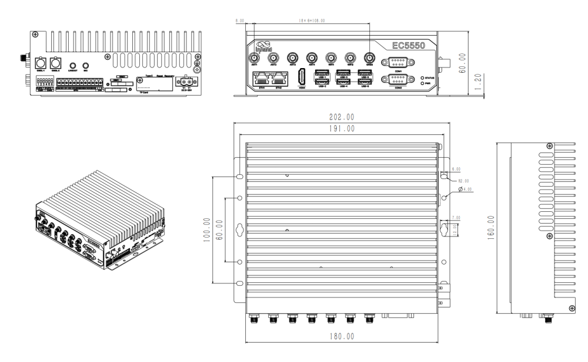

## 1.4 Electrical Specifications

Power Type: AT

Power Input: DC 9-36 V, 15-5.6 A

## 1.5 Environmental Specifications

Oprerating temperature: -20 ~ 60°C

Operating humidity: 95%@40°C (non-condensing)

Storage temperature: -40 ~ 85°C

# 2. System Interface Information

## 2.1 System Interface Overview

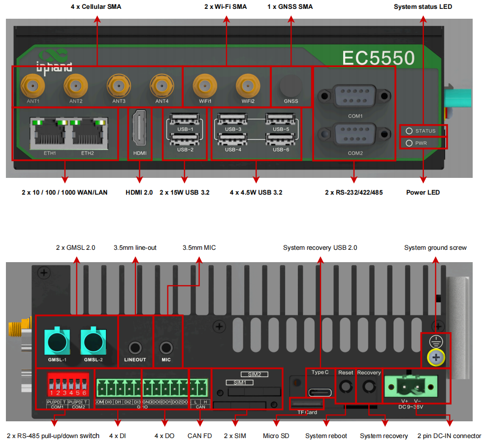

## 2.2 Interfaces

### 2.2.1 Power Indicator

The front panel is equipped with a power on/off indicator (red LED), which indicates the system power-on status. When the LED is on, it means the system is in the power-on state, and when the LED is off, it means the system is in the power-off state.

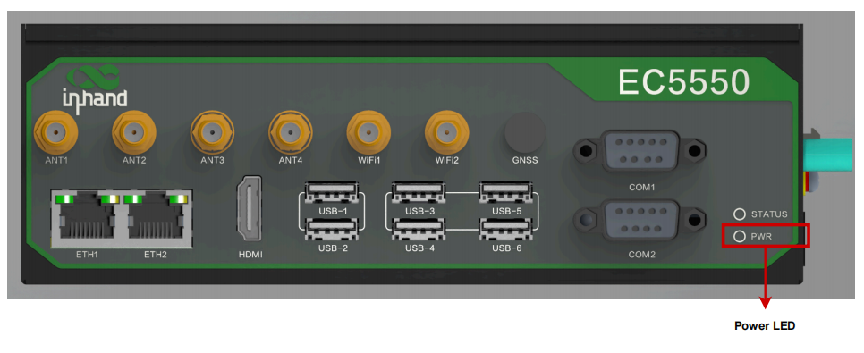

### 2.2.2 System Status LED

The front panel is equipped with a system status light (green LED), which indicates the system operation status. When the LED flashes (frequency 1Hz), it means that the system is operating normally, and the LED is off, which means that the system is not operating.

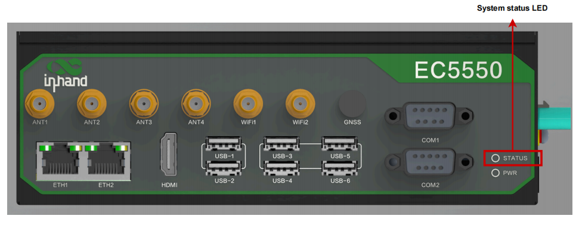

### 2.2.3 Serial Port

The device provides 2 RS-232/422/485 serial ports, the function definition is described in the following table.

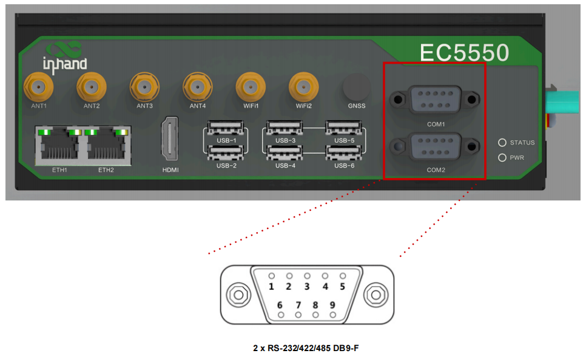

| Table 2：Serial Interface |
| --- | --- | --- | --- |
| DB9-F | RS-232 | RS-422 | RS-485 |
| 1   |     |     |     |
| 2   | RXD | RX+ |     |
| 3   | TXD | TX- | Data- |
| 4   |     |     |     |
| 5   | Ground |     |     |
| 6   |     |     |     |
| 7   |     | TX+ | Data+ |
| 8   |     | RX- |     |
| 9   |     |     |     |

2.2.4 USB 3.2 Gen2

The device provides 2 USB3.2 Gen 2 with maximum power 15W and 4 USB3.2 Gen 2 with maximum power 4.5W. When multiple USBs are working at full load, please choose 12V (or above)/120W (or above) power adapter to use according to the total load.

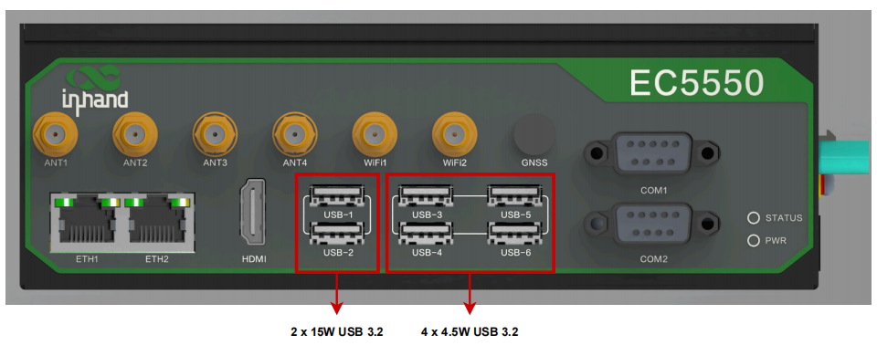

### 2.2.5 HDMI 2.0

The device provides a Type-A HDMI 2.0 connector on the front panel for external screens. The maximum resolution is 3840 x 2160 @60Hz.

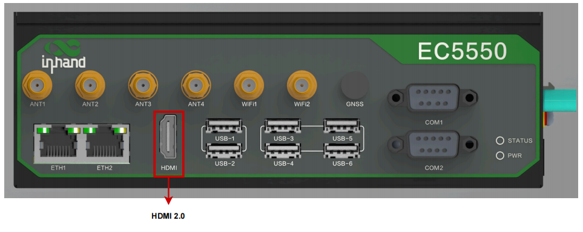

### 2.2.6 Ethernet(WAN/LAN)

The device provides two network interfaces on the front panel, each with two LEDs above it. The green LED indicates the network connection rate, the green LED lights up when the network is Link up at a rate of 1000Mbps, otherwise the green LED is off; the orange LED indicates the network communication situation, if there is a data communication when the network is Link up, the orange LED blinks, otherwise the orange LED is off.

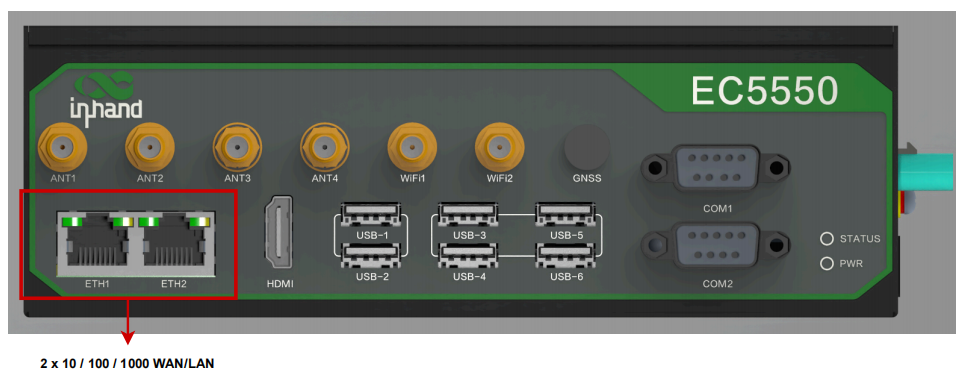

| Table 3: Networks |
| --- | --- | --- |
| Green LED |     |     |
| OFF | ON  | Blinking |
| 1.     No connection2.     Speed 10Mbps3.     Speed 100Mbps | Speed 1000Mbps | -   |
| Orange LED |     |     |
| OFF | ON  | Blinking |
| 1.     No connection2.     No activity on this port | -   | Activity on this port |

### 2.2.7 SMA

The front panel of the device provides up to seven SMA connectors. Different models are equipped with different types and numbers of 4G/5G/Wi-Fi/GNSS antennas. Users can select equipment according to their own needs. For the support status of antennas of specific models, please refer to the "Ordering Guide" section in the "EC5000 Series Edge AI Computer Product Specification".

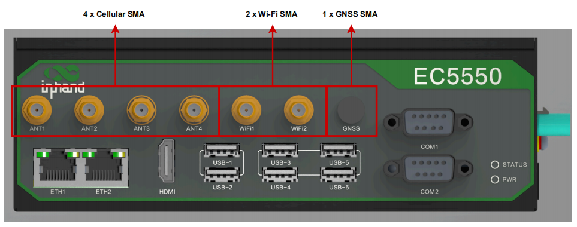

### 2.2.8 Grounding Connection

There is 1 system grounding screw on the right panel of the equipment, please use a green-yellow grounding wire (16AWG) and ground it with the system grounding screw.

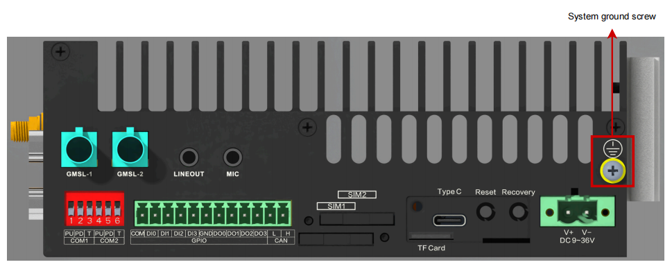

### 2.2.9 DC-IN Connector

When conducting DC connector wiring you should follow the below instructions:

1. Must be installed by a skilled person.  

2. Use copper conductors only.  

3. Choose appropriate wire diameter.  

4. The voltage for the system is 9 VDC to 36 VDC.  

5. The current for the system is 15 A to 5.6 A.

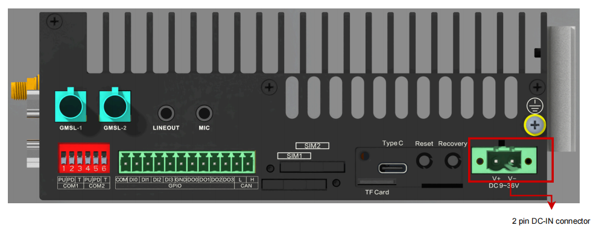

### 2.2.10 Recovery Button

A **Recovery** **Button** is located behind the removable cover on the **right-side panel** of the device.

- **To reset the system to factory defaults**:  
  While the system is running normally, press and hold the **Recovery** button for **10 seconds** until the **system status LED changes from blinking to solid on**, then release the button. The device will enter the **system reset** state and restore to **factory default settings**.

- **To enter firmware flashing mode**:  
  Press and hold the **Recovery** button **before powering on** or **while the system is running**, then **reboot the system** (via the Reset button, `reboot` command, or by power cycling). The system will boot into **firmware flashing mode**.

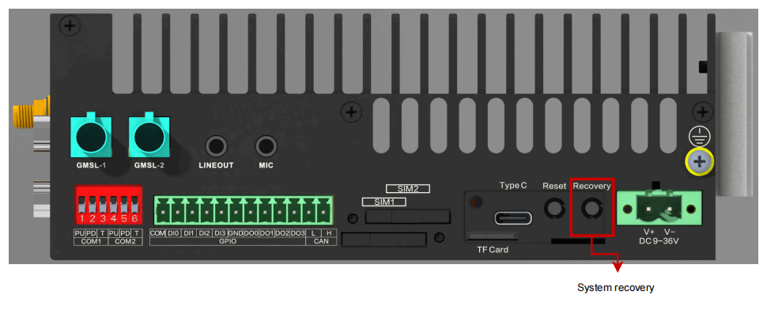

### 2.2.11 Reset Button

A **Reset Button** is located behind the removable cover on the **right-side panel** of the device.

- **To reboot the system and enable the hardware watchdog**:  
  While the system is running normally, press and release the **Reset** button **within 3 seconds**. The system will reboot and the **hardware watchdog will be enabled**.

- **To reboot the system and disable the hardware watchdog**:  
  While the system is running normally, press and hold the **Reset** button for **more than 3 seconds**, then release. The system will reboot and the **hardware watchdog will be disabled**.

**Note:** Please make sure to **disable the hardware watchdog before flashing the system**, to avoid unexpected reboots that may cause the flashing process to fail.  

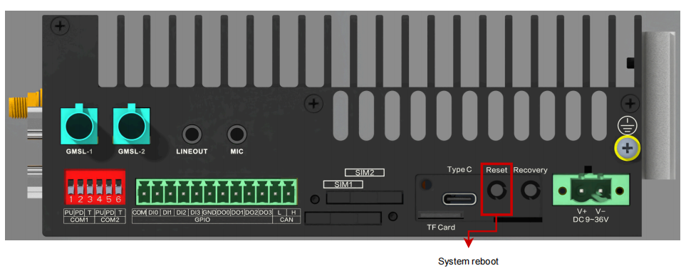

### 2.2.12 USB 2.0 Type-C

The equipment has a USB 2.0 Type-C connector under the emovable baffle on the right panel for connecting to a host burning system in burn-in mode.

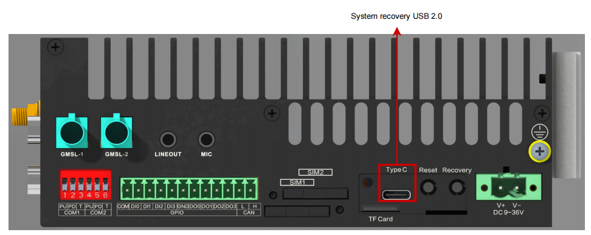

### 2.2.13 TF Card

The device has a TF card slot under the removable baffle on the right panel, which supports Micro SD memory cards. When there is a need for additional storage space, please insert a Micro SD card with a capacity of at least 8GB into this card slot for subsequent use.

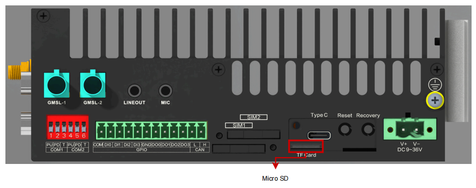

### 2.2.14 SIM Card Slot

The device has 2 SIM card slots (SIM1/SIM2) on the right panel to support standard SIM cards, please insert at least 1 available SIM when using the cellular function.

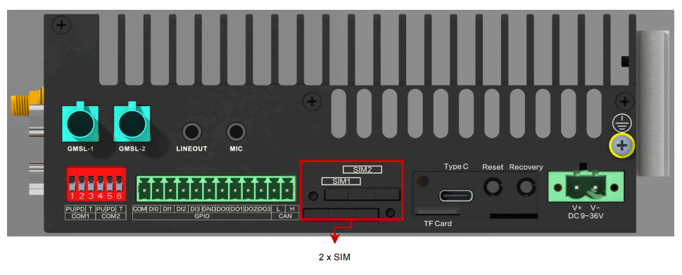

### 2.2.15 CAN FD

The device has 1 CAN FD interface (on-board 120Ω resistor) on the right panel, supporting a maximum communication rate of 5Mbps.

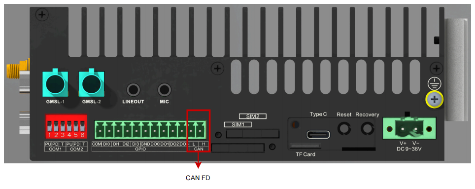

### 2.2.16 Digital Outputs

The device has four isolated digital output connectors on the right panel in open-drain output mode.

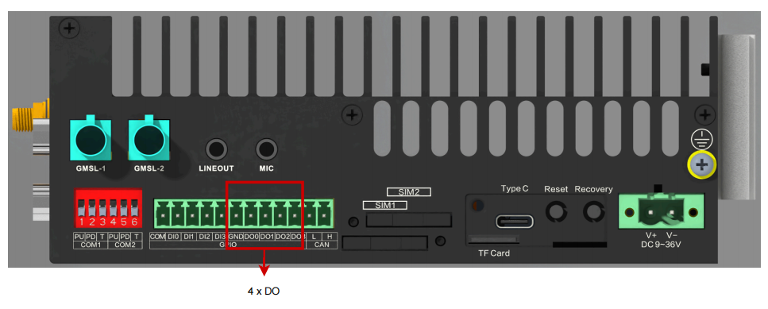

The wiring method is as follows:

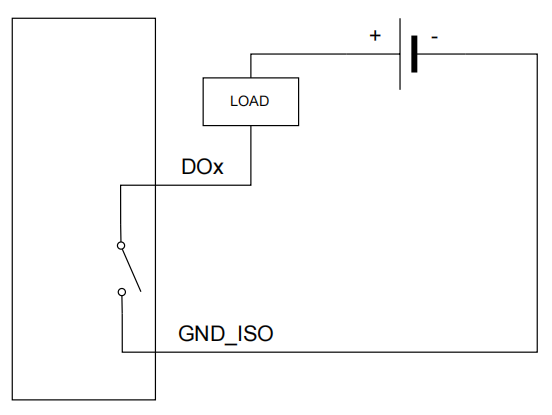

| Table 4: Isolated Digital Outputs |
| --- | --- |
| Number of Output Channels | 4   |
| Optical Isolation | 1414 VDC |
| Supply Voltage | Sink 60 VDC |
| Sink Current | 1.3 A max./Channel |

### 2.2.17 Digital Inputs

The device has four isolated digital inputs on the right panel that support wet and dry contacts.

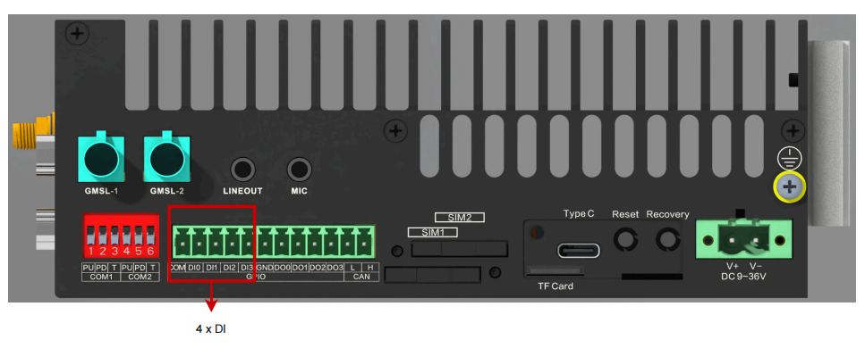

The wiring method is as follows:


| Table 5: Isolated Digital Inputs |
| --- | --- |
| Number of Input Channels | 4   |
| Optical Isolation | 3750 VDC |
| Input Voltage | Dry contact.Logic 1: OpenLogic 0: Close to ground |
| Wet contact.VIH(max.) = 60 VDCVIH(min.) = 5 VDCVIL(max.) = 2 VDC |

### 2.2.18 RS-485 Pull-up/down Dip Switches

The device has 1 RS-485 pull-up and pull-down dip switches on the right panel to control the pull-up and pull-down resistors of the RS-485 bus (corresponding to COM1/COM2).

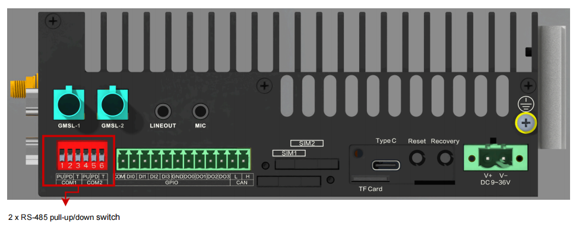

| Table 6: RS-485 Pull-up/down |
| --- | --- |
| PU  | ON: Enable pull-upOFF: Disable pull-up |
| PD  | ON: Enable pull-downOFF: Disable pull-down |
| T   | ON: Enable termination matching resistorOFF: Disable termination matching resistor |

### 2.2.19 GMSL 2.0

The device has 2 GMSL 2.0 ports on the right panel, supporting docking of 2 GMSL cameras.

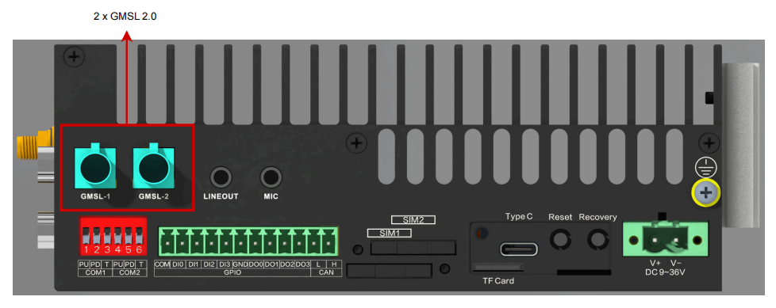

### 2.2.20 Lineout

The device has 1 Line-out connector on the right panel, which supports 3.5mm standard audio output.

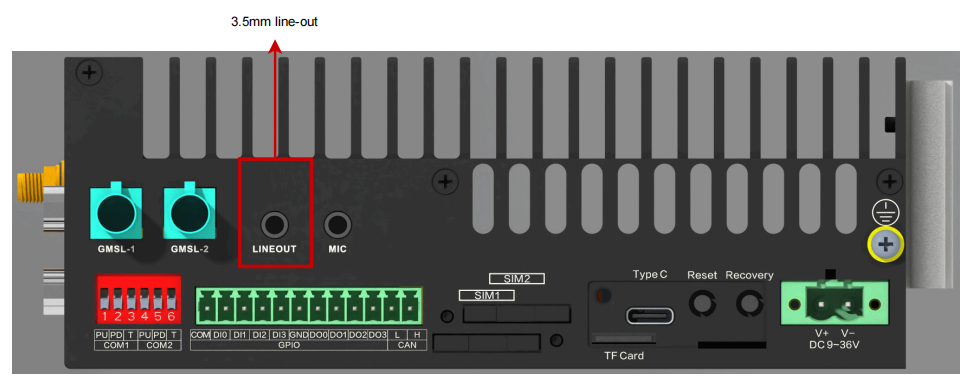

### 2.2.21 Microphone

The device has 1 microphone connector on the right panel and supports 3.5mm standard audio input.

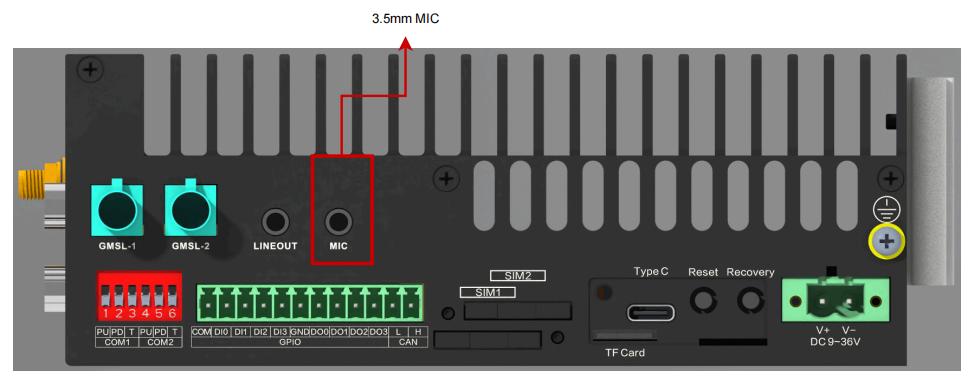

# 3 Installation

## 3.1 Rail Mounting Installation

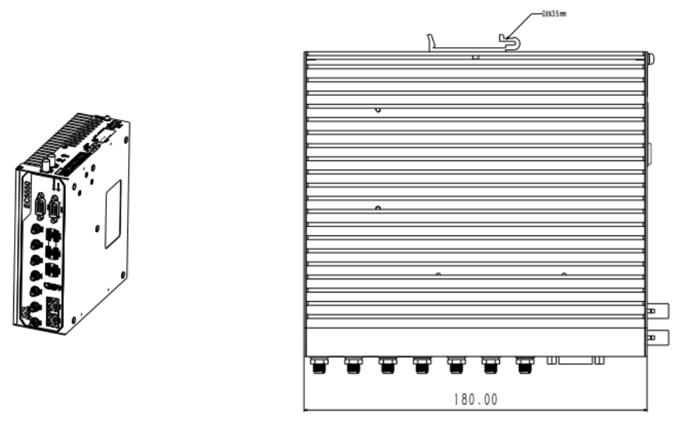

## 3.2 Wall-mounted Installation

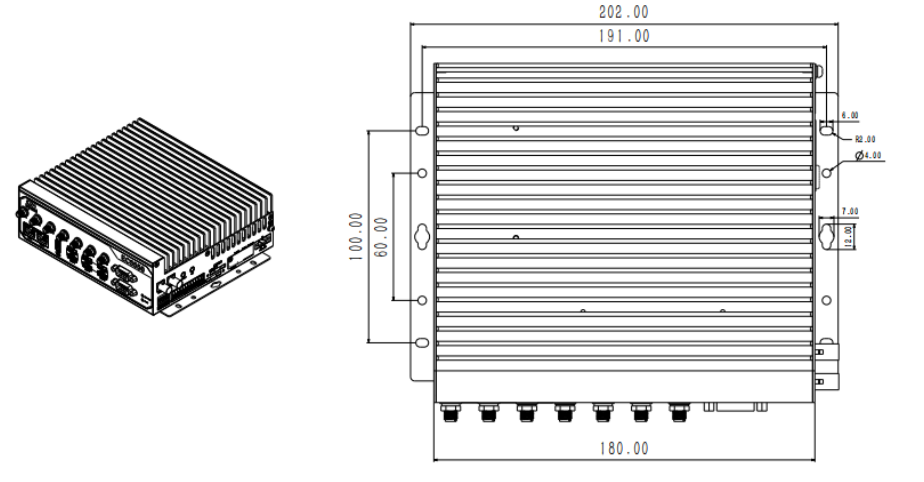

# 4 Getting Started

## 4.1 Connecting to the Device

### 4.1.1 Connecting Device via HDMI

#### 4.1.1.1 Connecting HDMI and Peripherals

Connect the device to the monitor via the HDMI 2.0 port, plug the keyboard and mouse into the USB 3.2 port of the device, power up the device and wait for the device to finish booting. Check the nameplate on the bottom of the device to find the default system username and password.

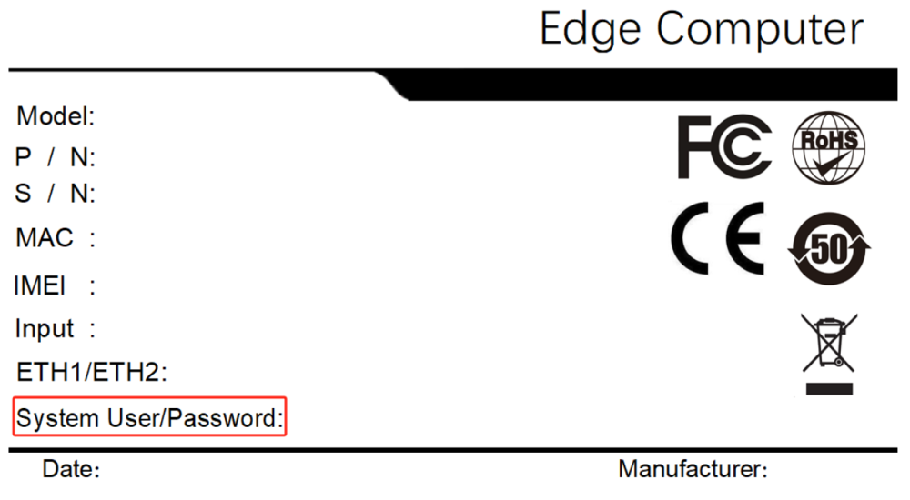

#### 4.1.1.2 Logging Equipment

On the login screen, select the user that corresponds to System User, enter the password, and log in.  

  

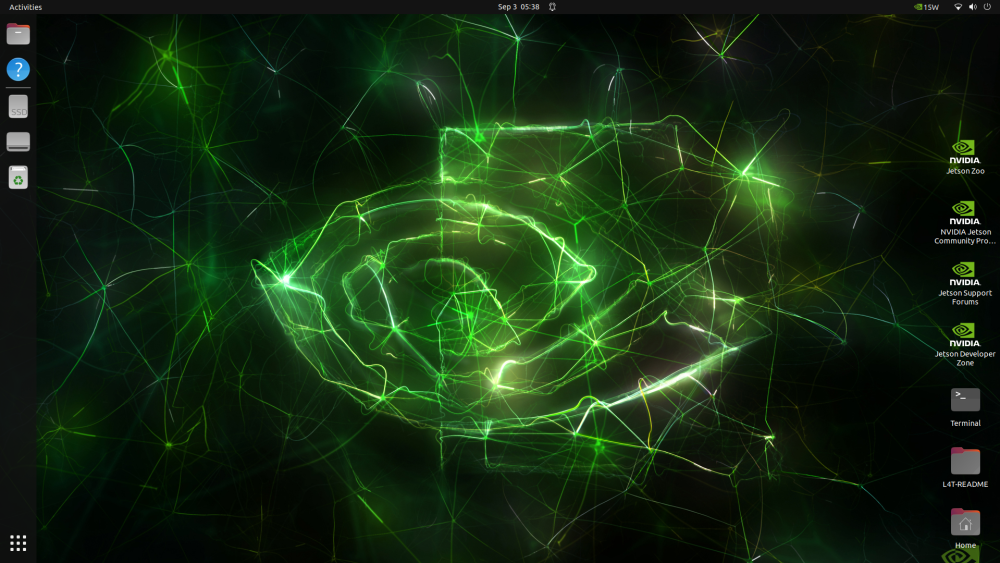

### 4.1.2 Connecting via SSH

#### 4.1.2.1 Connecting to the Network

Connecting to the device using SSH requires ensuring that the device network is accessible. Check the nameplate on the bottom of the device to find the system default Ethernet address and configure the host and device to be on the same network segment.

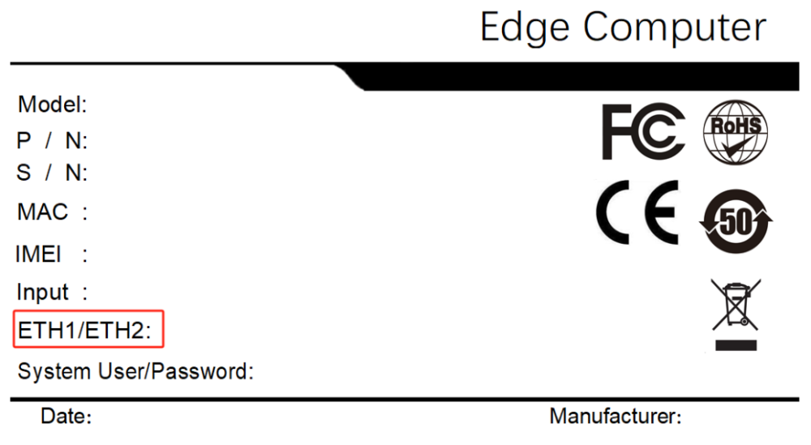

#### 4.1.2.2 Access to Equipment

Open the SSH terminal tool (Mobaxterm for example), enter the device address and click Connect.

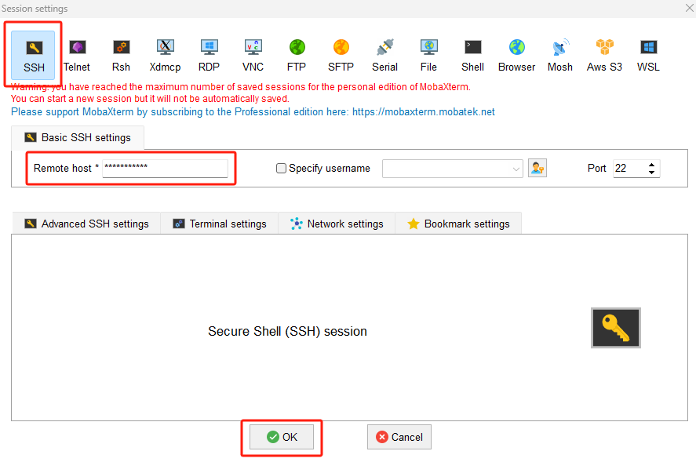

Follow the prompts and enter the default user and password.


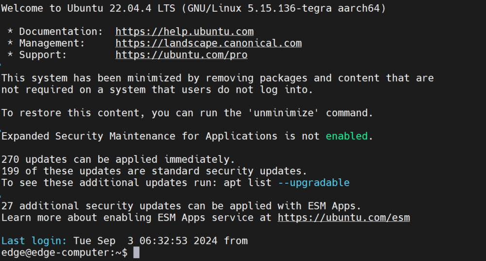

## 4.2 Version Query

Open Terminal on the desktop or right-click and select "Open in Terminal" and enter the following command.

Version Query：  

```
# Query version number onlysudo ecversion # Query detailed version informationsudo ecversion -all
```

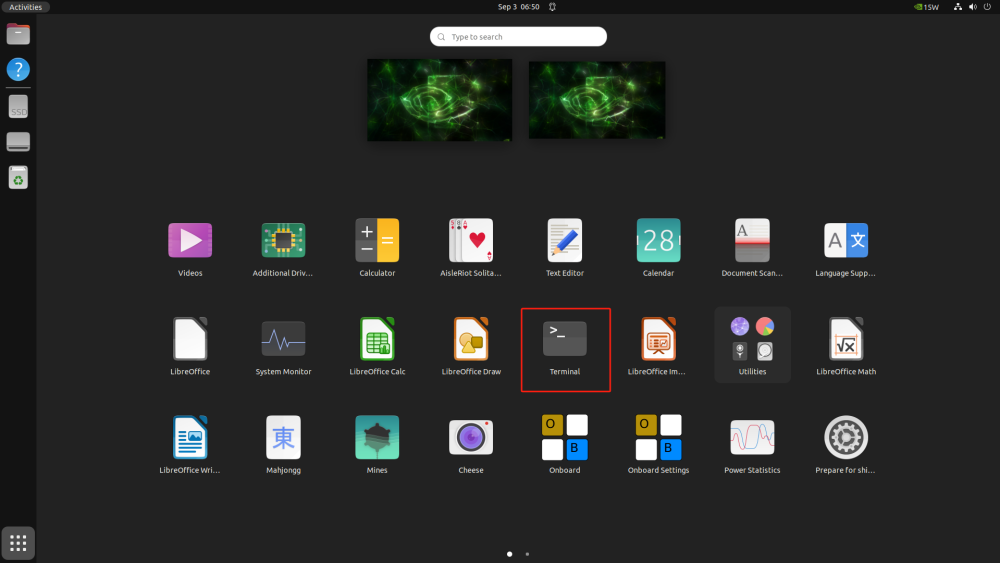

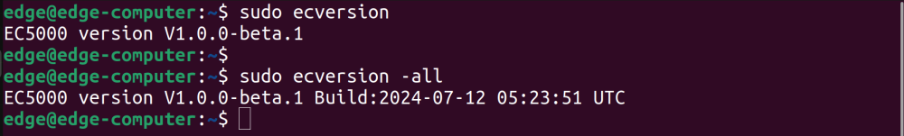

## 4.3 User Management

### 4.3.1 Creating Users

Open the desktop Terminal or right-click and select "Open in Terminal", and enter the following commands, according to the prompts to enter the password and user information, before creating the user, please make sure that the user exists, for the user that already exists, to create again will be prompted by The user 'username' already exists.  

```
# check if the test user exists id test # create test usersudo adduser test 
```


### 4.3.2 Delete Users

Open the desktop Terminal or right-click and click "Open in Terminal", and enter the following command to delete the user, before deleting the user, please make sure the user exists, if you delete the user does not exist will prompt The user 'username' does not exist.  

```
# Check if the test user exists id test # Delete the test user sudo deluser test
```

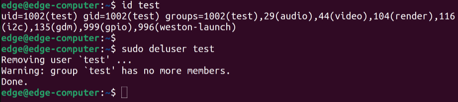

### 4.3.3 Disable and Enable Users

Open the desktop Terminal or right-click and click "Open in Terminal", and enter the following command to disable/enable the user, disable/enable the user before please make sure that the user exists, if the user does not exist, it will be prompted The user 'username' does not exist.  

```
# Check if the test user exists id test # Disable the test usersudo passwd -l test # Enable test usersudo passwd -u test # Query the status of the test user (L disabled/P enabled)sudo passwd -S test
```

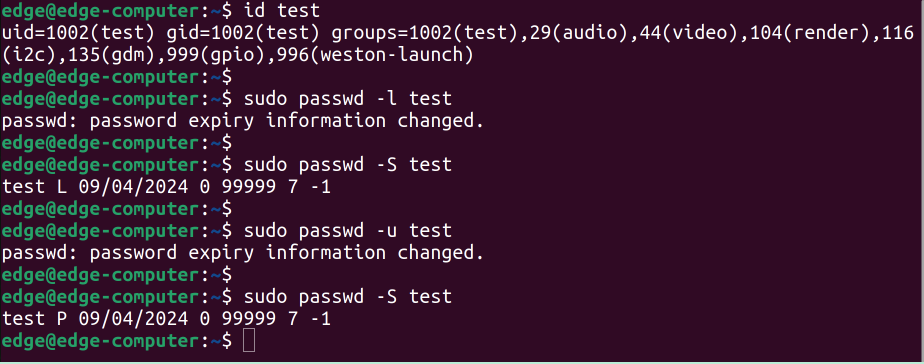

### 4.3.4 Advanced Extension of User Management

Reference:

1. [Ubuntu Manpage: adduser, addgroup - add a user or group to the system](https://manpages.ubuntu.com/manpages/xenial/en/man8/adduser.8.html?_gl=1*1jz4dhl*_gcl_au*MTkwNTc0MDUwMC4xNzI1MzQ3ODI1&_ga=2.97338463.1940871822.1725347824-1111823313.1715413709%20\h)  

1. [Ubuntu Manpage: deluser, delgroup - remove a user or group from the system](https://manpages.ubuntu.com/manpages/focal/en/man8/deluser.8.html?_gl=1*2hnawf*_gcl_au*MTkwNTc0MDUwMC4xNzI1MzQ3ODI1&_ga=2.165044991.1940871822.1725347824-1111823313.1715413709%20\h)  

1. [Ubuntu Manpage: passwd - change user password](https://manpages.ubuntu.com/manpages/bionic/man1/passwd.1.html?_gl=1*1rjws9d*_gcl_au*MTkwNTc0MDUwMC4xNzI1MzQ3ODI1&_ga=2.211133397.1940871822.1725347824-1111823313.1715413709%20\h)  

1. [Ubuntu Manpage: usermod - modify a user account](https://manpages.ubuntu.com/manpages/trusty/en/man8/usermod.8.html?_gl=1*2hnawf*_gcl_au*MTkwNTc0MDUwMC4xNzI1MzQ3ODI1&_ga=2.165044991.1940871822.1725347824-1111823313.1715413709%20\h)  

## 4.4 Web Management Based On IEOS

EC5000 Based on the Ubuntu22.04 system, Therefore, you can use Linux native commands for network management and system management; For easy user configuration, InHand has developed an IEOS system program, Provide a web interface, Users can easily conduct network management and system management through the web, But it is important to note that, When the IEOS function is enabled, IEOS will take over the network management and system management, Network management and system management through Linux native commands may fail; IEOS is enabled by default, If the user needs network management and system management based on the Linux native command line, The IEOS needs to be closed first.

IEOS is a set of network management and system management programs running on the Linux system, developed by InHand, The IEOS provides a web interface, Users can take the Ethernet port ip address via the web, Cellular dialing, Wi-Fi Station, DHCP Client/Server, Static routing, Firewall and other network configuration; Can also be used for system time, time zone, Firmware upgrade and system restart operation; In addition, IEOS also supports DeviceLives equipment management platform DeviceLive, Users can remotely monitor and manage the EC5000 devices through the DeviceLive platform.

IEOS adopts the design scheme of status and configuration, which is divided into three functional sections: network management, system management and state. Under the network management menu and system management menu, only the network and the system can be configured, and the status information needs to be viewed on the status page.

Important: When using the IEOS program to manage network configuration and system configuration, when using both Linux native commands, the two may affect each other and cause abnormal operating status. It is recommended that all the configurations supported by IEOS are managed through IEOS web. Those not supported by IEOS, such as VPN, can be combined with Linux native commands to achieve the configuration goals.

### 4.4.1 Login via web

Considering that the user's application may need to use the HTTP/HTTPS standard ports 80/443, IEOS uses port 9100 for HTTPS connections and does not support access via HTTP. When users attempt to access the web via HTTP, they will be automatically redirected to HTTPS. This document uses the default address 192.168.4.100 on eth2 as an example for explanation. Users can click "Show Applications" -> "Firefox Web Browser" in the desktop system, enter `[https://127.0.0.1:9100](https://127.0.0.1:9100/)` to log in, or access the device configuration page through an external network.

### 

This document uses the default address 192.168.4.100 on eth2 as an example for explanation.  
Login URL: `[https://192.168.4.100:9100](https://192.168.4.100:9100/)`  
login username: adm

password: 123456

Note: When IEOS program is enabled, some port numbers will be reserved for internal communication, and the port number range is 9100 ~ 9200. After IEOS is enabled, the customer program should avoid using these port numbers, otherwise there may be conflicts and abnormal functions.

  

### 4.4.2. Network management

### 4.4.2.1. Configure the Ethernet interface

Configure a static IP address for the eth1 interface  

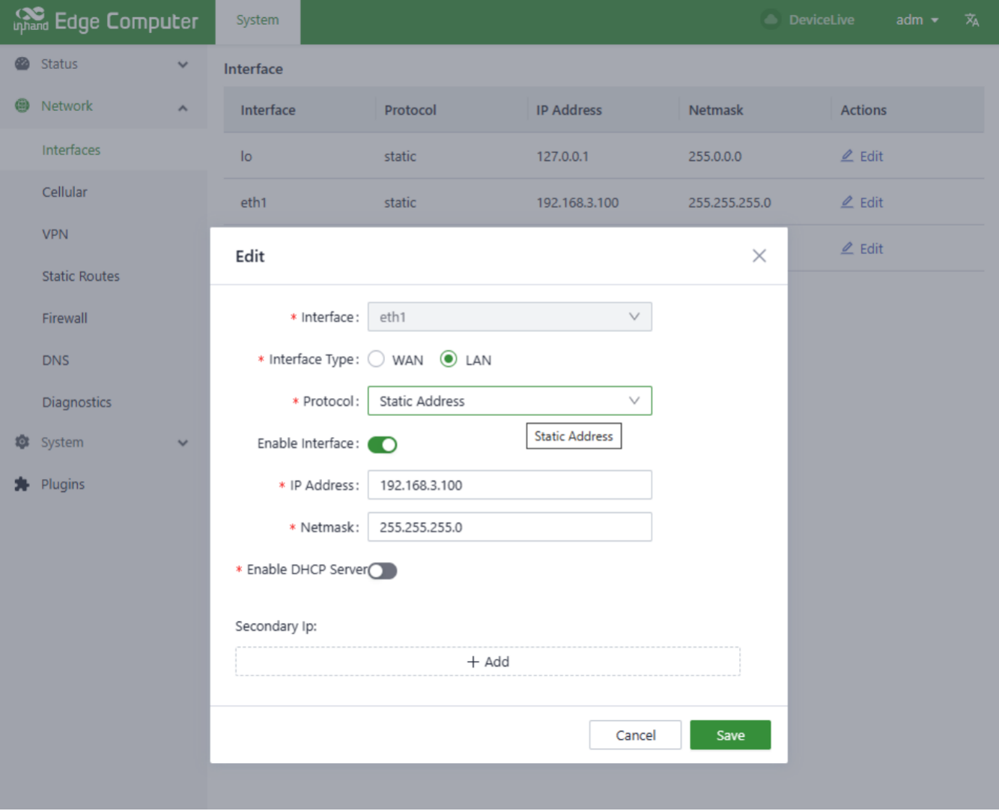  

Configure the DHCP Client for the eth1 interface  

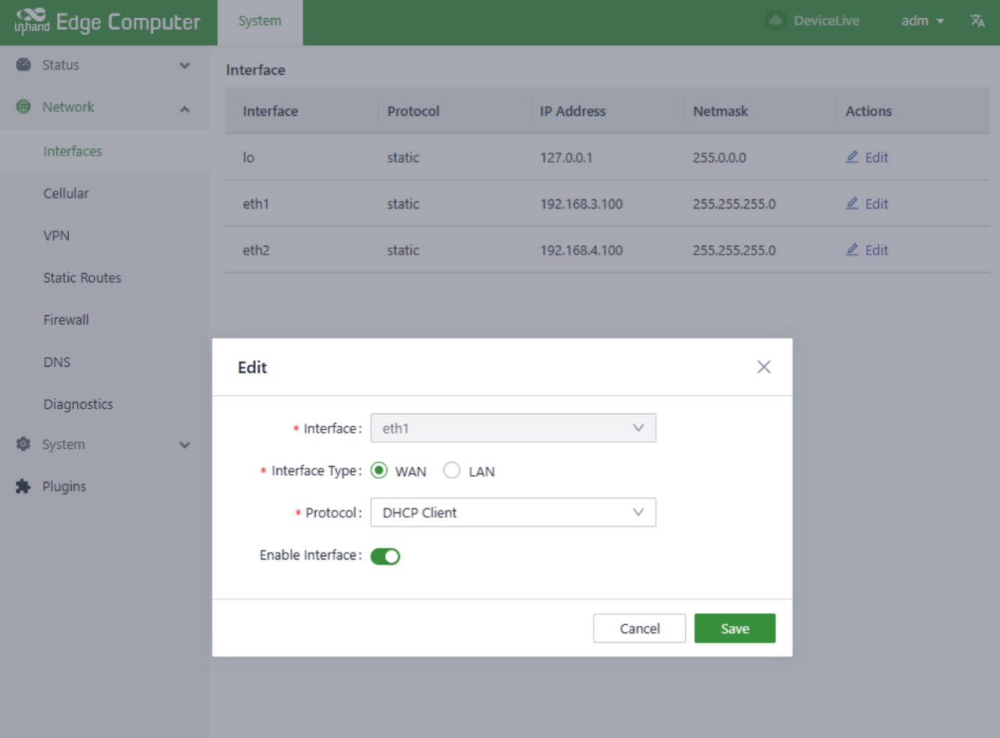  

Start the dhcp server function on the eth1 interface and assign an address to the eth1 down device  

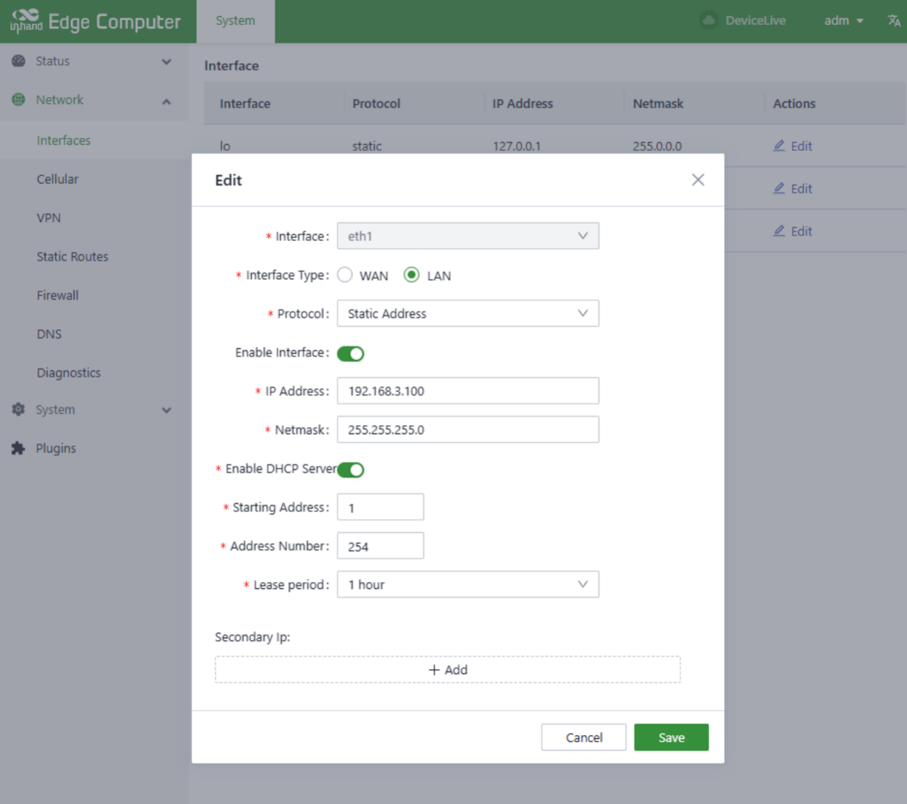  

DHCP Server Description of the configuration parameters:

Enable DHCP Server: Switch of the DHCP Server function

Starting Address: DHCP Server address pool start base address, network segment + starting address = start ip address of the address pool. In the screenshot, the network segment of eth1 is 192.168.3.0/24, the base address is 1, and the starting address of the address pool is 192.168.3.1/24.

Max Address Number: Maximum number of addresses in the address pool.

Lease period: Lease period  

##### 4.4.2.2. Configure the cellular dialing

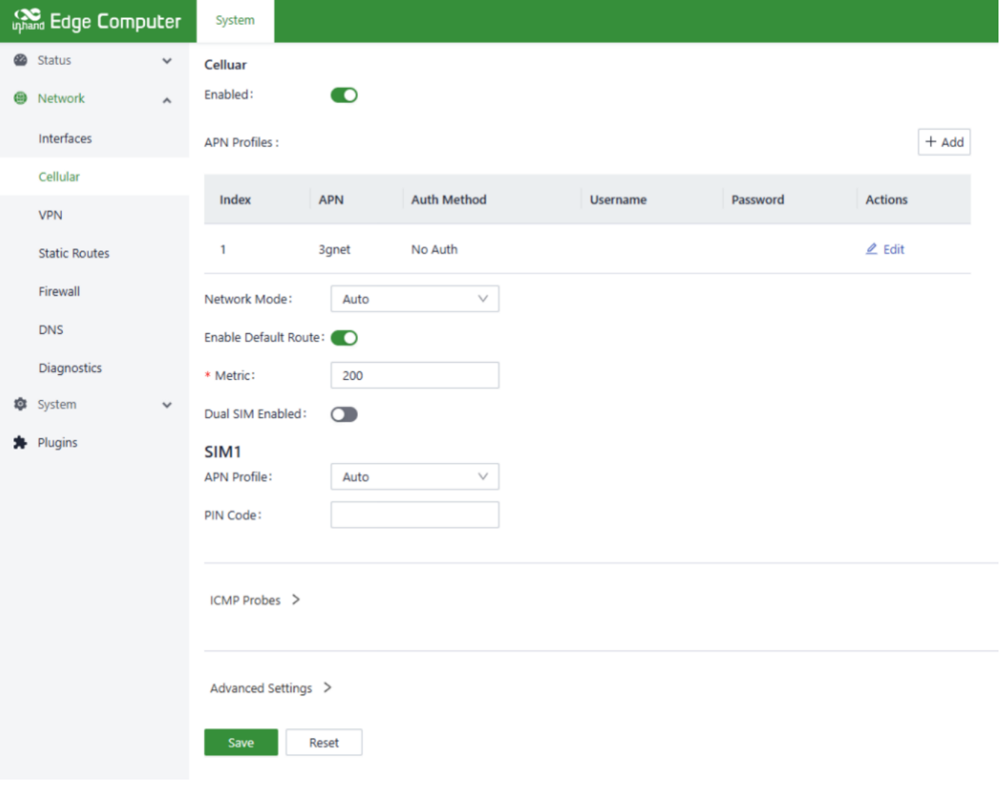  

##### 

Description of the cellular network parameters:

Enabled: The switch of cellular function; the default is on.

Profiles: Dial parameter set, used to configure APN, user name, password and authentication mode. If you are not a private network card, you usually do not need to modify the configuration here. The dial parameter set can add up to 10 records.

Network Mode: Cellular network system, you can choose 3G, 4G and other related network system, such as LTE, WCDMA, etc. If it is not clear which network system is selected, select automatic; the program will automatically select the most appropriate network system. The default value is automatic.

Enable Default Route: Enable the add default routing function. When enabled, a cellular port default route will be added when the dialing is successful. The default is turned on.

Metric: Measure of cellular default routing, when the cellular, Wi-Fi and Ethernet ports are configured with default routing.  

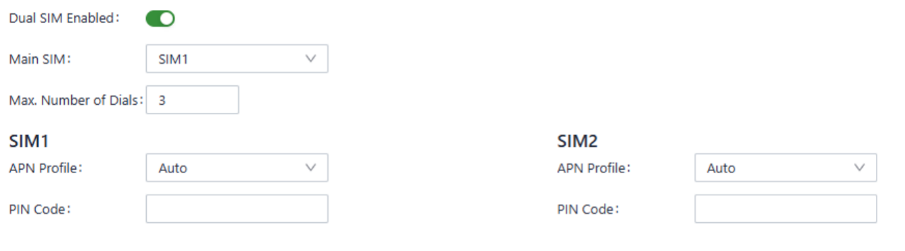  

Dual SIM Enabled: Enable the dual-card function. EC5000 in order to improve the reliability of the network, supports dual card single dial. Two sim cards need to be inserted on the device. After this function is enabled, if the sim1 card fails to dial due to overdue fees, it will automatically switch to the sim2 card for dial. The default is turned off.

Main SIM: Main sim card, dial will use the selected sim card to dial, dial failure to reach a certain number of times, switch to another sim card to dial, default use sim1 to dial.

Max Number of Dials: After the dual card single dial function is enabled, the current dial sim card dial reaches the specified number of times, and switch to another sim card for dial.

APN Profile: The dial parameter set of sim card, the default value is automatic. A private network card usually needs to configure the dial parameter set and select the Index for the dial parameter set here.

PIN Code: The PIN code of the sim card.  

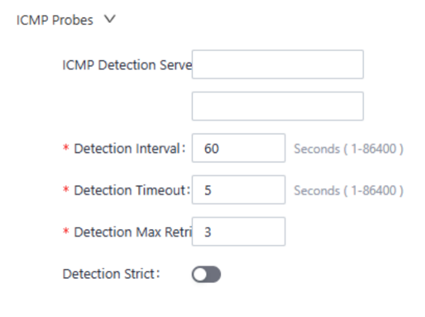  

Wireless cellular network is more complex, sometimes there will be a false dial connection, that is, the dial state is successful, but ping is not the target address; when these conditions occur, a new dial can be returned to normal. IEOS cellular dialing supports ICMP probes to discover false connections. It is recommended that customers use cellular networking to enable ICMP detection, so that it can be quickly restored when fake connections occur.

ICMP probe parameters:

ICMP Detection Server Probes: ICMP probe address; 2 probe addresses can be configured. As long as 1 address probe is successful, there is no false connection in the cell. The ICMP probe function is turned off when the two addresses are not configured.

Detection Interval: How often is the ICMP detection interval performed.

Detection Timeout: ICMP detection timeout time, how long to wait without receiving the detection response message, the detection is considered to fail

Detection Max Retries: Maximum number of probes; redial is triggered. The value range is [1,5]

Detection Strict: Whether to open the strict detection. When the strict detection is closed, the detection program will detect whether the messages received by the cellular interface change in each detection cycle. If there is a change, indicating that the cellular network is connected, the ICMP message will not be sent for detection, which can save some traffic; if the detection is started, the ICMP detection message will be sent periodically regardless of whether the number of the messages received by the cellular interface changes. The default is turned off.  

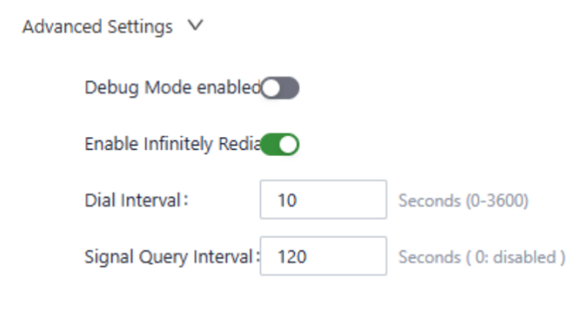  

Advanced configurations are uncommon in setting options.

Debug Mode enabled: Whether to enable the debug function? After it is enabled, some dial-related debugging information will be added to the log and turned off by default.

Enable Infinitely Redial: Open the infinite redial. In some cases, the dial is in an abnormal state and can be restored to normal by restart the system; the default unlimited redial is closed, and when the dial fails a certain number of times, the system will be restarted to restore. Since dial is on by default, some customers fail to dial without sim causes the system to restart, unlimited redial can be enabled; the system will not restart no matter how many dial failures.

Dial Interval: Dial interval; but the waiting time before the next dial when a dial fails.

Signal Query Interval: Signal query interval. When the signal is bad, the false connection may arise; it can solve the false connection. The dial program regularly detects the signal intensity, with the signal detection cycle.

##### 4.4.2.3. Configure the Wi-Fi Station

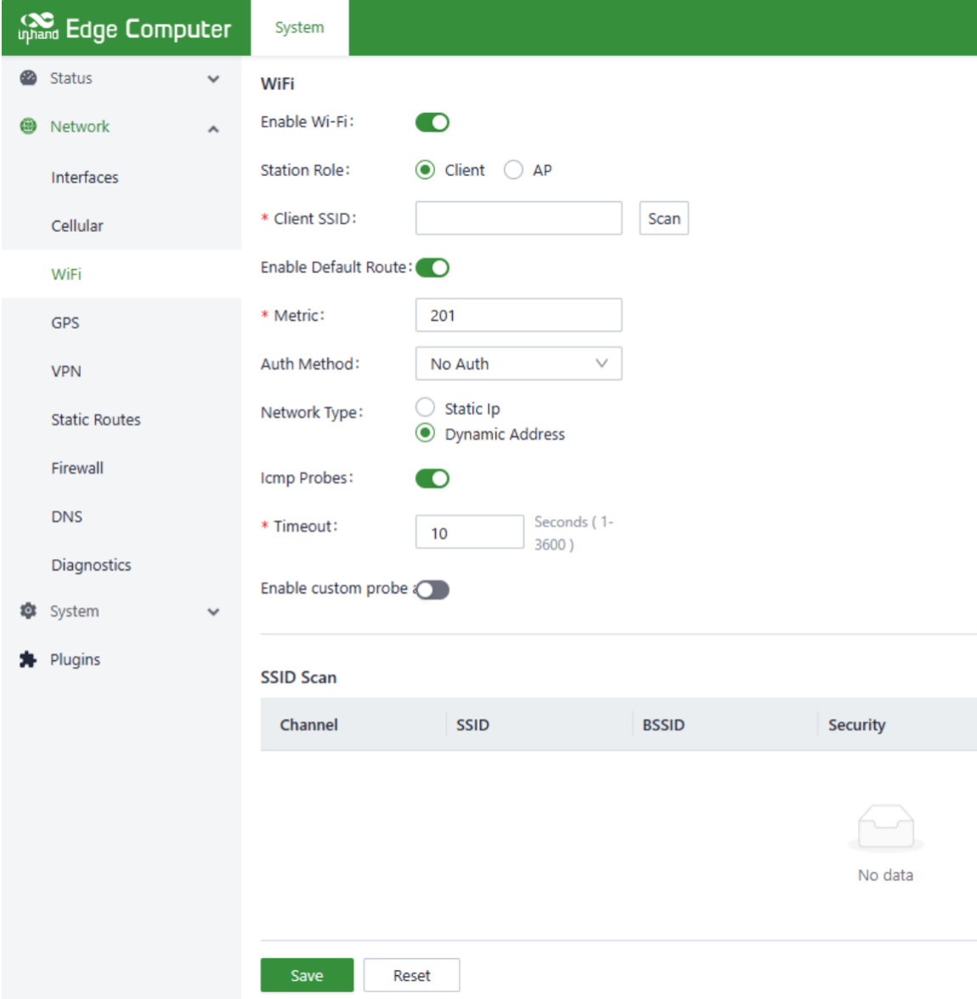  

##### 

Enable Wi-Fi: enabling switch; turned off by default

Client SSID: The ssid to be connected can be entered manually, or a nearby ssid through the scan button

Enable Default Route: Whether to enable the default routing function, a default route for the wlan port. The default is turned on.

Metric: The measure of the default route of the wifi port. When the cellular port, Wi-Fi and the Ethernet port are all configured with the default route, the minimum measurement value takes effect.

Auth Method: Certification mode, support for no-certification, WPA-PSK, WPA 2-PSK, WPA-PSK / WPA 2-PSK Mixed

Encrypt Mode: Encryption mode; support for CCMP, TKIP, TKIP and CCMP

WPA / WPA2 PSK Key: Key information

##### 4.4.2.4. Configure the static routing

##### 

Here is the static route of Ethernet. When the default route of Ethernet, cellular, wifi is configured, the default route with the smallest metric value takes effect. You need to ensure that the Metric value of the default route is different.  

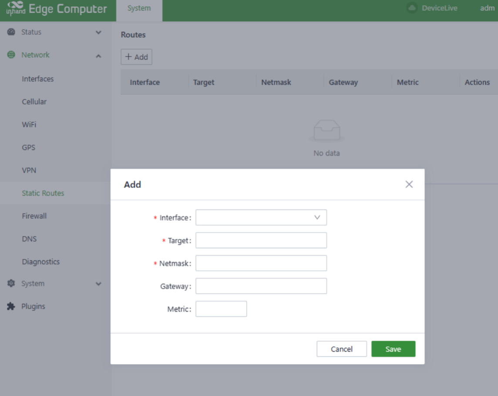  

Static routing configuration parameters:

Interface: Exit interface of static routing

Target: Target network

Netmask: The target network mask

Gateway: Next jump address

Metric: Metric value of the static routing  

##### 4.4.2.5. Configure the firewall

##### 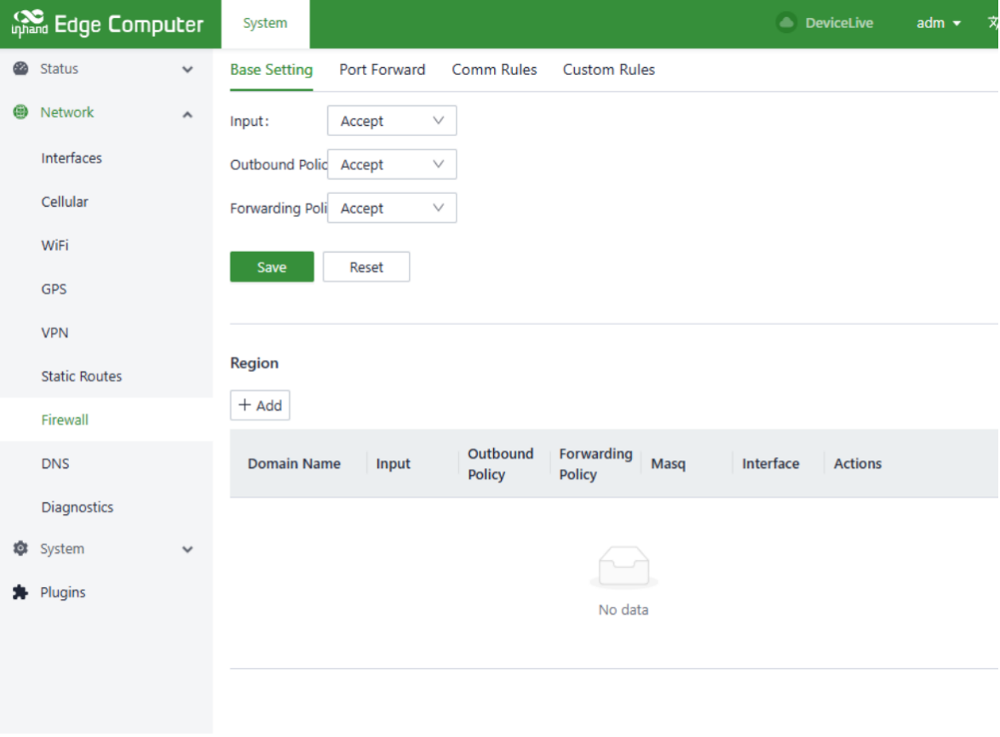

##### 4.4.2.6. Configure the DNS

##### 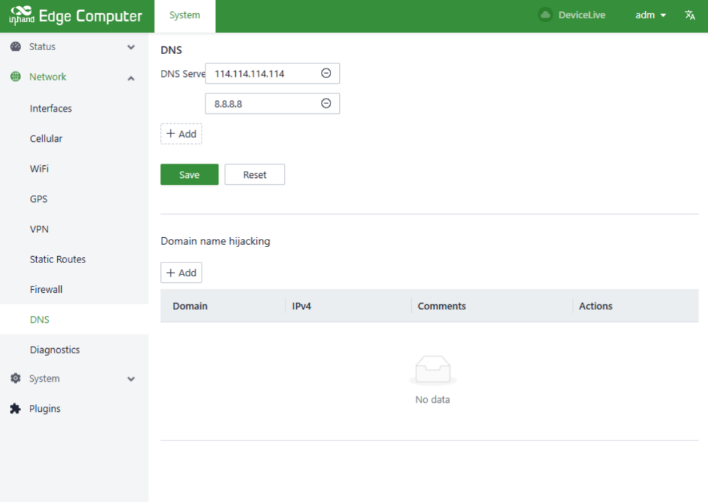

##### 

DNS Servers: DNS Server addresses, up to 4 support configuration

Domain name hijacking: Domain name hijacking function, which can realize the binding between IP address and domain name.  

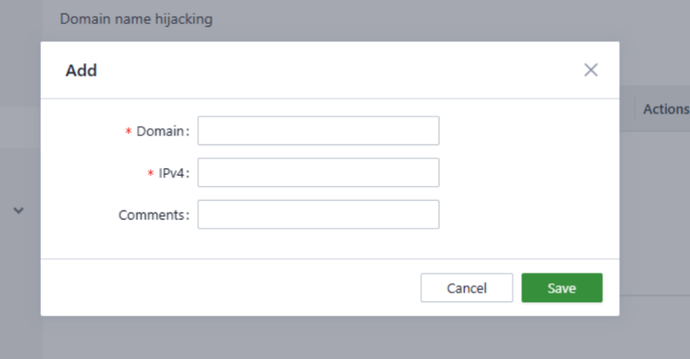

##### 4.4.2.7. Network diagnosis

##### 

Network diagnosis supports ping, traceroute and nslookup functions.  

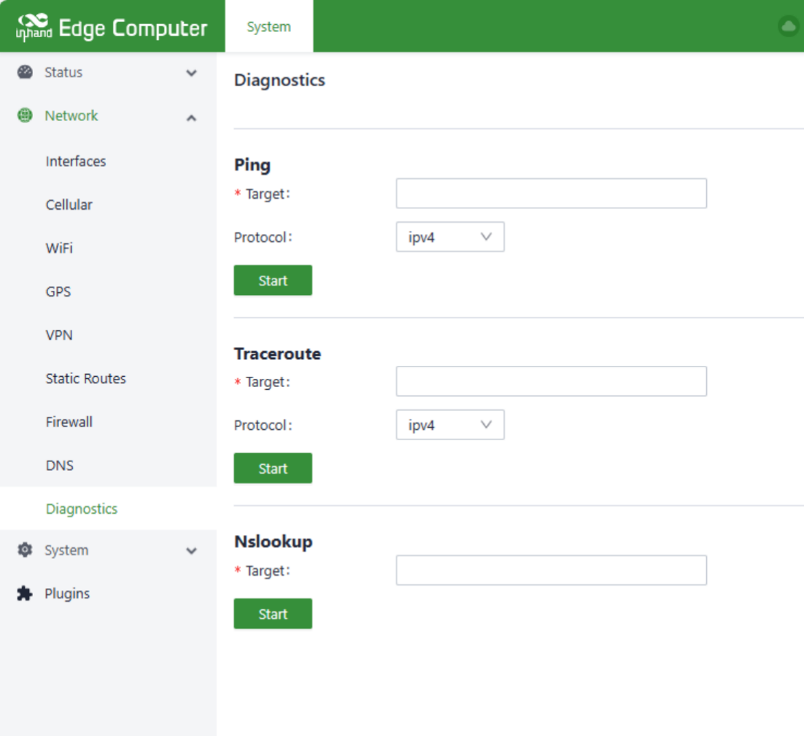  

#### 4.4.3. System management

##### 4.4.3.1. Basic configuration

##### 

Cloud management  

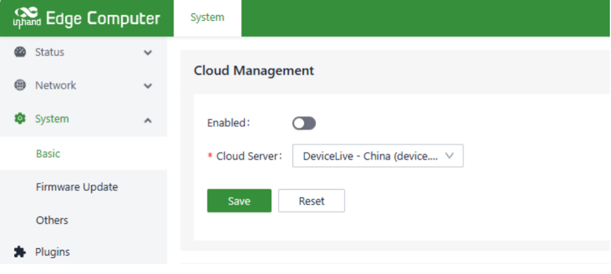  

##### 

Enabled: Power switch of DeviceLive platform; DeviceLive is the remote monitoring and management platform of the equipment;

Cloud Server: The DeviceLive platform has 2 addresses; one is the address of the domestic platform, and the other is the address of the overseas platform; select which platform to connect here.

Time zone and the NTP client  

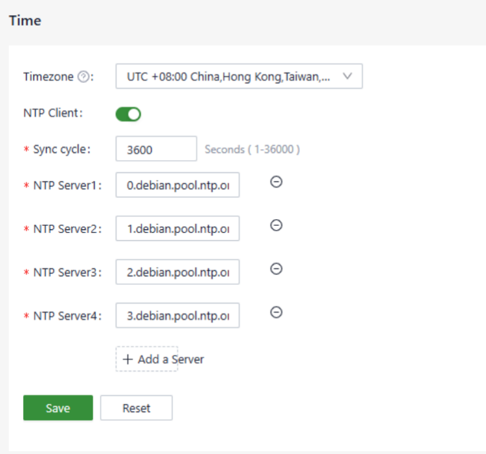  

Up to 10 NTP Server addresses can be configured, and the program periodically sends synchronization requests to each server address. After successful synchronization, the system time is written to RTC and not sent to the NTP server.

In addition to using NTP synchronization time, there is a synchronization button on the Device Info status page, but only if the device time and the local time (access to the computer used by the device differ by more than 3s).  

  

This area supports the configured import, export, and factory recovery.  

##### 4.4.3.2. Firmware upgrade

##### 

  

The automatic restart option is off by default. After upgrading the firmware, the system needs to be restarted manually to take effect; when the automatic restart option is enabled, the system is automatically restarted after the firmware is upgraded.  

##### 4.4.3.3. Others

##### 

##### 

This page has 2 functions: restart system and reset system. Resetting the system needs to be used carefully. Resetting the system function will restore the system configuration status and file system status to the same as the factory, that is, the software installed by the user will also be cleared.  

#### 4.4.4. state

##### 4.4.4.1. Device information

##### 

The device information status page displays the host name, device model, serial number, firmware version, kernel version, file system version, and usage profiles of CPU, memory, and disk space.  

  

##### 4.4.4.2. cellular dial status information

##### 

The cellular dial status page displays the sim card, IMEI, IMSI, ICCID, signal strength, and IP address, DNS.  

  

##### 4.4.4.3. Wi-Fi Station status information

##### 

The Wi-Fi status page displays the IP address, gateway, and DNS information obtained after a successful Wi-Fi connection.  

  

##### 4.4.4.4. DHCP Server Status information

##### 

The DHCP Server status page shows the device as DHCP Server, the assigned IP address, client host name, client host mac, and expiration time.  

  

##### 4.4.4.5. Route status information

##### 

The routing status page displays information about IPv4 direct routing, static routing, and routing neighbors.  

  

##### 4.4.4.6. Firewall status information

##### 

Firewall status information displays filtering rules, IP address mapping rules, and other information.

##### 

  

##### 4.4.4.7. Log information

##### 

The log page can view the system logs, user logs, and set the viewing log levels, including Error, Info, Debug, and more. The logs can also be downloaded locally.  

  

### 4.5. Ubuntu-based graphical interface management

##### 

When using the Linux command line for network configuration and system configuration, you first need to close the IEOS program. The IEOS is managed through the systemctl,

The IEOS is closed in the following manner:

systemctl stop ieos_daemon  

This shutdown is only effective for this startup. After the system is restarted, the IEOS program will still be started. Preventing the IEOS program from starting up is as follows:

systemctl disable ieos_daemon  

Note: After IEOS is turned off, wireless networking functions such as dialup and Wi-Fi require users to be implemented based on Linux native commands, and devices cannot be remotely managed with the DeviceLive platform.

### 4.5.1 Ethernet settings

#### 4.5.1.1 Setting-up and management

Click the network icon on the top right corner of the desktop, select Ethernet ->Wired Settings or click Show Applications->Settings->Network->Ethernet on the bottom left corner of the desktop, please choose to set eth1/eth2 according to the actual situation.  

  

  

#### 4.5.1.2 On/Off Management

Click Turn On/Turn Off or slide the button in the Ethernet settings to turn the network off or on.  

  

  

#### 4.5.1.3 Static Configuration

Click Setup button, select IPv4/IPv6, select Manual for Method, fill in Address, Netmask, Gateway, DNS and Routes according to the network conditions, and click Apply to save. Click Apply to save. After saving, please re-switch the network to make the configuration take effect.  


#### 4.5.1.4 Dynamic Configuration

Click the Setup button, select IPv4/IPv6, select Automaitc(DHCP) for Method, and click Apply to save. After saving, please re-switch the network to make the configuration take effect.

  

### 4.5.2 Wi-Fi Settings

#### 4.5.2.1 Settings Management

Click the network icon on the top right corner of your desktop and select Wi-Fi -> Wi-Fi Settings or click Show Applications -> Settings -> Wi-Fi on the bottom left corner of your desktop.  

  


#### 4.5.2.2 On/Off Management

Tap Turn On/Turn Off or slide the button in the Wi-Fi settings to turn the network off or on.  

  

  

#### 4.5.2.3 Scanning

Scanning can be turned on via Wi-Fi -> Select Network, or the Wi-Fi Setting feature will automatically scan for visible Wi-Fi SSIDs in the neighbourhood when turned on.

  


  

#### 4.5.2.4 Connection

Tap the Settings button on the right side of the Wi-Fi network, enter the password and tap Connect to connect to the network.

  

### 4.5.3 Cellular Network Settings

#### 4.5.3.1 Configuring Cellular ECM Mode

Insert the SIM card into SIM1/SIM2, access the cellular antenna, open Terminal and enter the following commands in order.

Cellular Network Settings:  

```
# Access cellular AT command interface using 115200 baud ratesudo sdebug /dev/ttyUSB2 115200 # Configure cellular ECM mode AT+QCFG="usbnet",1 # Save and reboot cellular module AT+CFUN=1,1
```

  

#### 4.5.3.2 Switching SIM Card

Open Terminal and enter the following command to switch the SIM card.

Switching SIM Card:  

```
# Switch to rootsudo -s # Switch to SIM1 echo 0 > /sys/class/gpio/PG.06/value # Switch to SIM2 echo 1 > /sys/class/gpio/PG.06/value
```

  

### 4.5.4 CAN FD Settings

Open Terminal and enter the following command to configure the CAN interface.

Configure CAN FD:  

```
# Link up CAN interfacesudo ip link set can0 up type can bitrate 1000000 dbitrate 5000000 restart-ms 1000 fd on
```

  

### 4.5.5 Bluetooth Settings

#### 4.5.5.1 Settings Management

Click the network icon on the top right corner of the desktop and select Bluetooth -> Bluetooth Settings or click Show Applications->Settings->Bluetooth on the bottom left corner of the desktop.

  


#### 4.5.5.2 On/Off Management

Tap Turn On/Turn Off or slide the button in Bluetooth settings to turn Bluetooth off or on.

  

  

#### 4.5.5.3 Bluetooth Connection

After switching on the Bluetooth switch, it will automatically scan the neighbouring Bluetooth devices，click on the Bluetooth device name to connect (for Bluetooth devices that require a PIN code, please enter the PIN code).

### 4.5.6 Network Settings Advanced Extensions

Reference:

1.     [Network Manager | Ubuntu](https://ubuntu.com/core/docs/networkmanager)

2.     [Bluez Prerequisites | Ubuntu](https://ubuntu.com/core/docs/bluez/check-installation)

## 4.6 Time Settings

Click Show Applications->Settings->Data & Time at the bottom left corner of the desktop.

  

### 4.6.1 Setting the Time Zone

Select or enter the system time zone by clicking Time Zone on the Settings page.

  

### 4.6.2 Adjusting the Time

By default, the system will automatically set the time when the device is connected to the network, if you need to set the time manually, please turn off Automatic Date & Time and set Date & Time manually.

  

## 4.7 Peripheral Configuration

### 4.7.1 Serial Port Management

The device supports two RS-232/422/485 optional serial ports, corresponding to the device nodes /dev/ttyCOM1 and /dev/ttyCOM2 respectively. Open Terminal and use the uart_mode command to switch the serial port operating mode.  

| Table 7：Serial Port Mapping |
| --- | --- | --- |
| COM1 |     | /dev/ttyCOM1 |     |
| COM2 |     | /dev/ttyCOM2 |     |
| Table 8：Serial port operating mode switching |     |     |     |
| uart_mode | COM1 |     | 485422232 |
| COM2 |     | 485422232 |

For example, to configure COM1 to operate in RS-485 mode, enter the following command.  

```
sudo uart_mode COM1 485
```


### 4.7.2 Digital input/output Management

The device supports 4 isolated digital inputs and 4 isolated digital outputs.  

| Table 9：Digital Inputs/Outputs |
| --- | --- | --- |
| DI  | DI0 | /sys/class/gpio/gpio308 |
| DI1 | /sys/class/gpio/gpio309 |
| DI2 | /sys/class/gpio/gpio310 |
| DI3 | /sys/class/gpio/gpio311 |
|     |     |     |
| DO  | DO0 | /sys/class/gpio/gpio312 |
| DO1 | /sys/class/gpio/gpio313 |
| DO2 | /sys/class/gpio/gpio314 |
| DO3 | /sys/class/gpio/gpio315 |

# 5. Advanced

## 5.1 System Updates

Copy the system upgrade image to removable storage media or transfer it to the device via network, enter the following command to perform the system update operation, please be patient as the system update takes a long time.  

```
sudo update ota <update file>
```


## 5.2 System Reset

### 5.2.1 Recovery flick switch reset

The device has a Recovery flick switch button under the detachable bezel on the right panel, press and hold Recovery for 10 seconds during normal system operation and wait for the system status light to change from blinking to normally lit and release it, the device will enter the system reset state (restoring the system to the factory state), please refer to part 2.2.10 for detailed descriptions of the buttons;

### 5.2.2 Command Reset

Open Terminal and use the update command to perform a system reset.  

```
sudo update reset
```

  

# 6. Security (TPM2.0)

The device supports Trusted Platform Module 2.0 (TPM2.0) and is pre-installed with the tpm2-tools tool. You can directly use instructions to operate the TPM2.0 module to achieve security functions.

Reference：

1.     [tpm2-tools](https://tpm2-tools.readthedocs.io/en/latest/)

2.     [tpm2-tools/man at master · tpm2-software/tpm2-tools (github.com)](https://github.com/tpm2-software/tpm2-tools/tree/master/man)

# 7. Programming Guide

Reference：

1.     [Jetson - Embedded AI Computing Platform | NVIDIA Developer](https://developer.nvidia.com/embedded-computing)

2.     [Jetson Software | NVIDIA Developer](https://developer.nvidia.com/embedded/develop/software)

3.     [Jetson Software Getting Started | NVIDIA Developer](https://developer.nvidia.com/embedded/learn/getting-started-jetson)

4.     [NVIDIA Developer Forums - NVIDIA Developer Forums](https://forums.developer.nvidia.com/)  

##### 

##### 
