# EC5000 User Manual_V2.0

**EC5000 Series AI Edge Computer**

**User Manual**

Version 1.0, September 2024

[www.inhand.com](http://www.inhand.com)


The software described in this manual is according to the license agreement, can only be used in accordance with the terms of the agreement.

**Copyright Notice**

© 2024 InHand Networks All rights reserved.

**Trademarks**

The InHand logo is a registered trademark of InHand Networks.

All other trademarks or registered trademarks in this manual belong to their respective manufacturers.

**Disclaimer**

The company reserves the right to change this manual, and the products are subject to subsequent changes without prior notice. 9. We shall not be responsible for any direct, indirect, intentional or unintentional damage or hidden trouble caused by improper installation or use.

## 1 General Introduction  

### 1.1 Introduction  

The EC5000 comes pre-integrated with NVIDIA® Jetson Orin NX™ or Orin Nano™, making it ideal for industrial AI applications.The EC5000 design includes 2 Gigabit LAN ports, 1 HDMI video display, 6 external USB 3.2 ports, 2xRS-232/RS- 422/RS-485, 1 power indicator, 1 system status light, 2 GMSL video interfaces, 4 DI, 4 DO, 1 CAN FD, 2 SIM card slots, 1 USB Type C for system burn-in, 1 TF card slot, 1 reboot (hardware watchdog enable) button, 1 restore mode button, and 1 linear output connector and microphone connector.

### 1.2 Product Features

### 1.2.1 Key Features

#### 1.2.1.1 Processor

| **Table 1： Processor** | | | |
| --- | --- | --- | --- |
|  | **On-Module memory** | **Orin NX** | **Orin Nano** |
| **CPU** | 4G | - | ARM Cortex-A78AE CPU (6 cores), (TDP up to 10 W, 1.5 GHz) |
| | 8G | ARM Cortex-A78AE CPU (6 cores), (TDP up to 20 W, 2 GHz) | ARM Cortex-A78AE CPU (6 cores), (TDP up to 15 W, 1.5 GHz) |
| | 16G | 16GB (ONX 16GB) - ARM Cortex-A78AE CPU (8 cores),(TDP up to 25 W, 2 GHz) | - |
| **GPU** | 4G | - | 512-core NVIDIA Ampere GPU with 16 <br/>Tensor Cores (Max frequency up to 625 MHz) |
| | 8G | 1024-core NVIDIA Ampere GPU with 32 Tensor Cores (Max frequency up to 765 MHz) | 1024-core NVIDIA Ampere GPU with 32 <br/>Tensor Cores (Max frequency up to 625 MHz) |
| | 16G | 1024-core NVIDIA Ampere GPU with 32 Tensor Cores (Max frequency up to <br/>918 MHz) | - |

#### 1.2.1.2 Ethernet  

2 x 10 / 100 / 1000 Mbps

#### 1.2.1.3  Peripheral & I/O

2 x RS-232/422/485 switchable serial interfaces with DB9 connectors

4 x DI, Optocoupler isolation, supporting dry and wet nodes.

4 x DO, Optocoupler isolation, supporting 60 VDC sink voltage, 1.3 A max sink current

2 x USB 3.2 with ≤15W drive capacity each

4 x USB 3.2 with ≤4.5W drive capacity each

1 x USB 2.0, Type-C for system restore only

1 x HDMI 2.0 with maximum resolution of 3840 x 2160 @60Hz

2 x SIM card slots, supporting 1.8/3V SIM/UIM cards, built-in 15KV ESD protection, uses standard SIM cards

7 x SMA antennas, 4 for cellular modules, 2 for Wi-Fi modules, 1 for GNSS

2 x LEDs, 1 for power indication, 1 for system status indication

1 x Micro-SD card slot for Micro-SD card expansion

1 x CAN FD up to 5Mbps

2 x flick switch buttons, 1 for reboot (enable/disable hardware watchdog), 1 for system restore

2 x GMSL 2.0 FAKRA connectors

1 x MIC, 3.5mm microphone audio jack

1 x Audio, 3.5mm line-out

#### 1.2.1.4 Internal System Interfaces

1 x Trusted Platform Module, TPM 2.0

1 x NVME SSD

1 x Wi-Fi, supporting Wi-Fi 5/6

1 x Cellular module with 4G/5G support

1 x RTC, powered by a button cell battery

### 1.3 Mechanical Specifications

**Standard Size:**180.0 x 160.0 x 60.0 mm

**Reference Weight:** 1.65 kg (excluding package and power adapter)

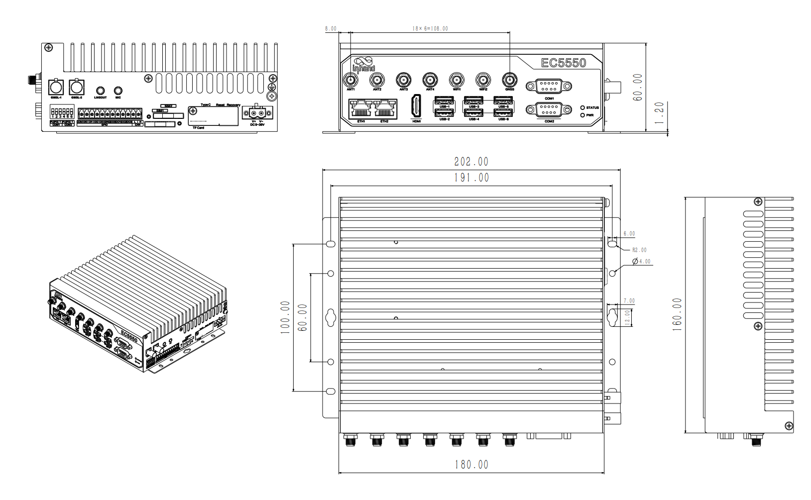

### 1.4 Electrical Specifications  

**Power Type:** AT

**Power Input:** DC 9-36 V, 15-5.6 A

### 1.5  Environmental Specifications  

**Oprerating temperature:** -20 ~ 60°C

**Operating humidity:** 95%@40°C (non-condensing)

**Storage temperature:** -40 ~ 85°C

## 2. System Interface Information

### 2.1 System Interface Overview

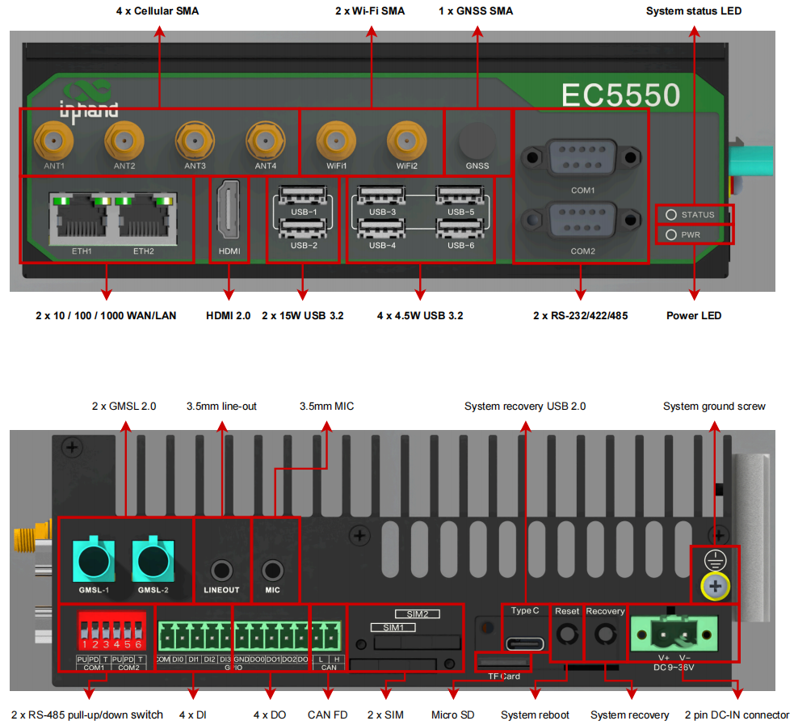

### 2.2 Interfaces

### 2.2.1. Power Indicator

The front panel is equipped with a power on/off indicator (red LED), which indicates the system power-on status. When the LED is on, it means the system is in the power-on state, and when the LED is off, it means the system is in the power-off state.

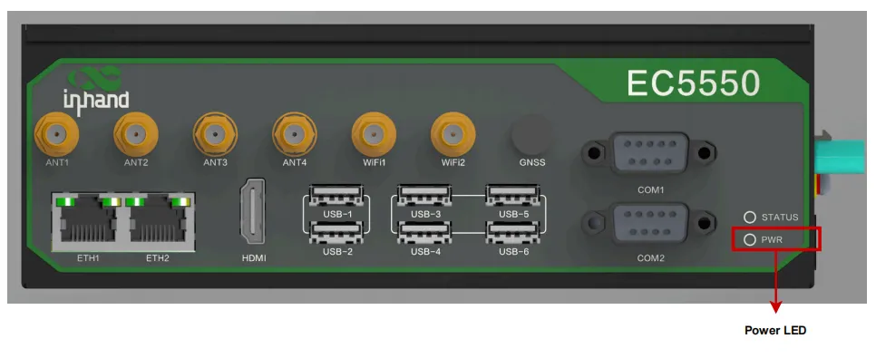

### 2.2.2 System Status LED

The front panel is equipped with a system status light (green LED), which indicates the system operation status. When the LED flashes (frequency 1Hz), it means that the system is operating normally, and the LED is off, which means that the system is not operating.

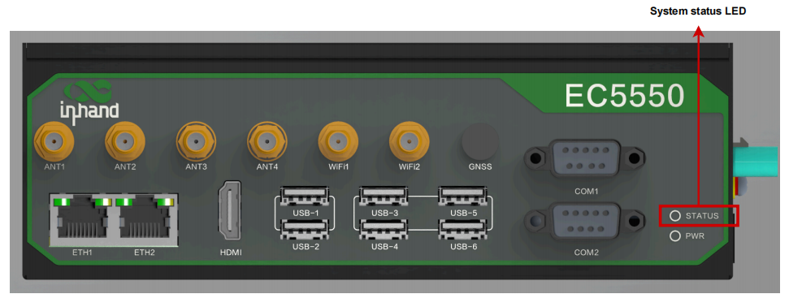

### 2.2.3 Serial Port

The device provides 2 RS-232/422/485 serial ports, the function definition is described in the following table.

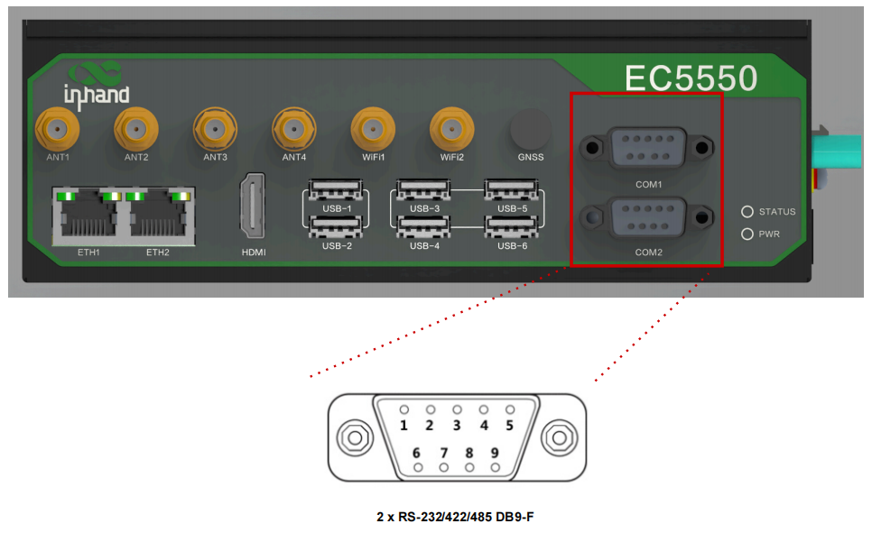

| **Table 2：Serial Interface** | | | |
| --- | --- | --- | --- |
| **DB9-F** | **RS-232** | **RS-422** | **RS-485** |
| 1 | | | |
| 2 | RXD | RX+ | |
| 3 | TXD | TX- | Data- |
| 4 | | | |
| 5 | Ground | | |
| 6 | | | |
| 7 | | TX+ | Data+ |
| 8 | | RX- | |
| 9 | | | |

### 2.2.4 USB 3.2 Gen2

The device provides 2 USB3.2 Gen 2 with maximum power 15W and 4 USB3.2 Gen 2 with maximum power 4.5W. When multiple USBs are working at full load, please choose 12V (or above)/120W (or above) power adapter to use according to the total load.

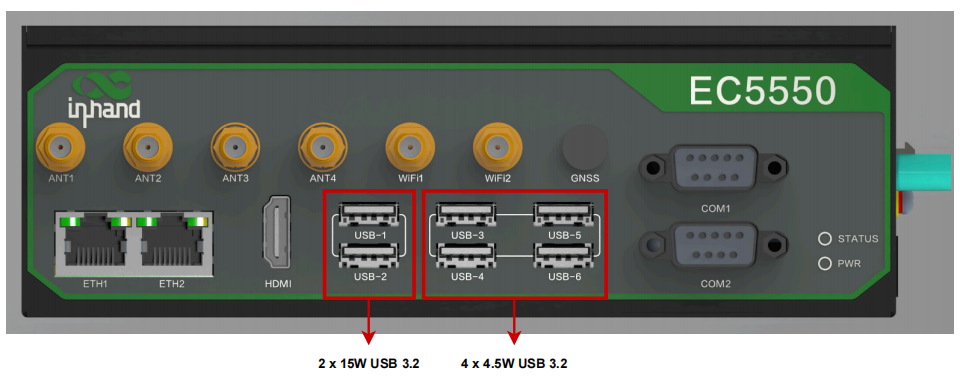

### 2.2.5 HDMI 2.0

The device provides a Type-A HDMI 2.0 connector on the front panel for external screens. The maximum resolution is 3840 x 2160 @60Hz.

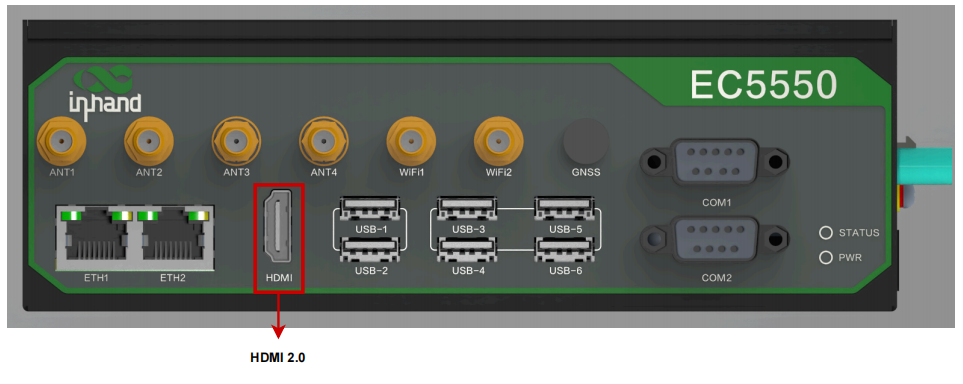

### 2.2.6  Ethernet(WAN/LAN)

The device provides two network interfaces on the front panel, each with two LEDs above it. The green LED indicates the network connection rate, the green LED lights up when the network is Link up at a rate of 1000Mbps, otherwise the green LED is off; the orange LED indicates the network communication situation, if there is a data communication when the network is Link up, the orange LED blinks, otherwise the orange LED is off.

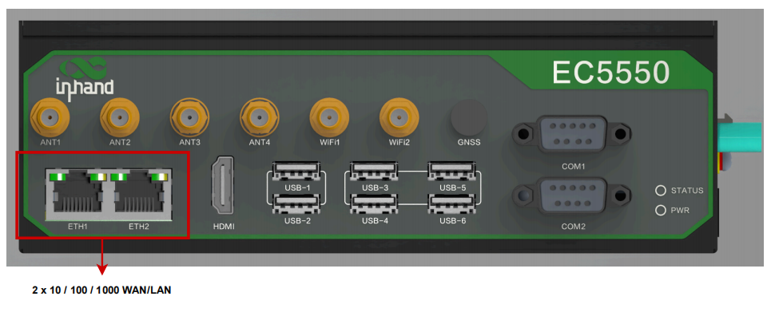

| **Table 3: Networks** | | |
| :--- | --- | --- |
| **Green LED** | | |
| OFF | ON | Blinking |
| 1. No connection<br/>2. Speed 10Mbps<br/>3. Speed 100Mbps | Speed 1000Mbps | - |
| **Orange LED** | | |
| OFF | ON | Blinking |
| 1. No connection<br/>2. No activity on this port | - | Activity on this port |

### 2.2.7 SMA

The front panel of the device provides up to seven SMA connectors. Different models are equipped with different types and numbers of 4G/5G/Wi-Fi/GNSS antennas. Users can select equipment according to their own needs. For the support status of antennas of specific models, please refer to the "Ordering Guide" section in the "EC5000 Series Edge AI Computer Product Specification".

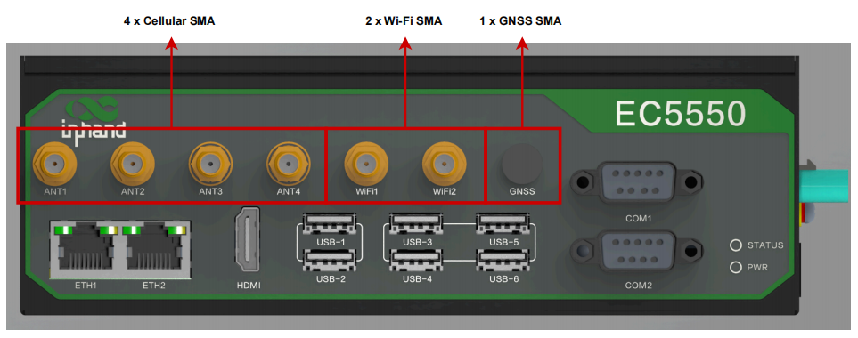

### 2.2.8 Grounding Connection  

There is 1 system grounding screw on the right panel of the equipment, please use a green-yellow grounding wire (16AWG) and ground it with the system grounding screw.

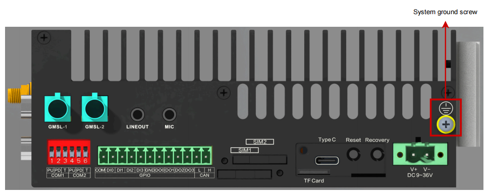

### 2.2.9  DC-IN Connector  

When conducting DC connector wiring you should follow the below instructions:

1. Must be installed by a skilled person.
2. Use copper conductors only.
3. Choose appropriate wire diameter.
4. The voltage for the system is 9 VDC to 36 VDC.
5. The current for the system is 15 A to 5.6 A.

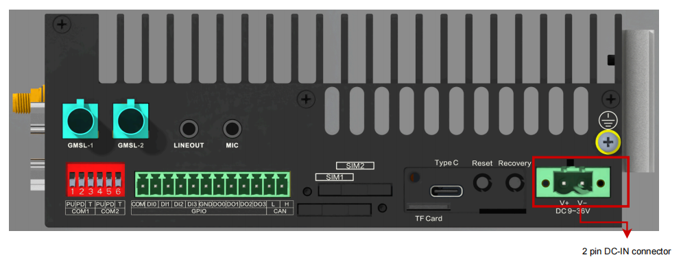

### 2.2.10 Recovery Button

The device has a Recovery touch-switch button under the removable baffle on the right panel. When the system is running normally, press and hold Recovery for 10 seconds and wait for the system status light to change from blinking to always on and release it, the device will enter the system reset state (restoring the system to the factory state); press and hold the Recovery button and reboot the system(press Reset, reboot, or power-down reboot) before the system is powered on or during the system running, then the system will enter the burn-in mode.

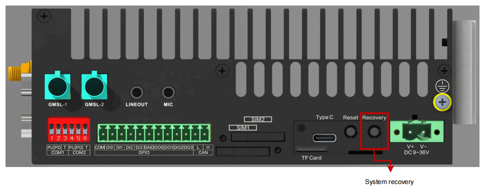

### 2.2.11 Reset Button

The device has a Recovery touch-switch button under the removable baffle on the right panel, press and hold Reset for 3 seconds and release it during normal system operation, then the system will reboot and enable the hardware watchdog; press and hold Reset for 3 seconds and then release it during normal system operation, then the system will reboot and disable the hardware watchdog, please disable the hardware watchdog before the system is burned in, to prevent the hardware watchdog from restarting the system and leading to the failure of the burn-in process.

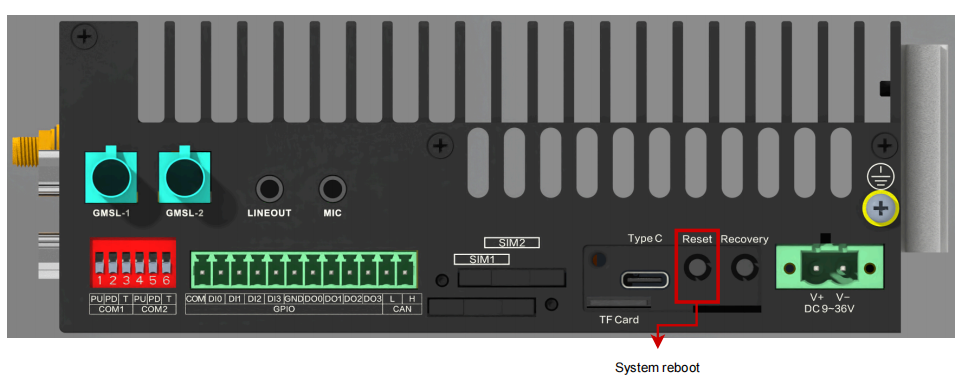

### 2.2.12 USB 2.0 Type-C

The equipment has a USB 2.0 Type-C connector under the emovable baffle on the right panel for connecting to a host burning system in burn-in mode.

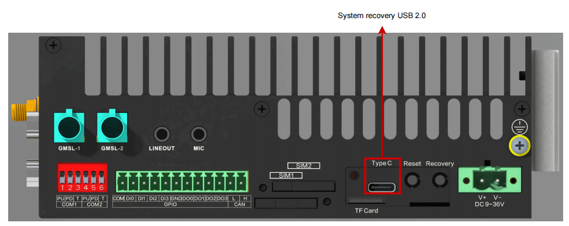

### 2.2.13 TF Card

The device has a TF card slot under the removable baffle on the right panel, which supports Micro SD memory cards. When there is a need for additional storage space, please insert a Micro SD card with a capacity of at least 8GB into this card slot for subsequent use.

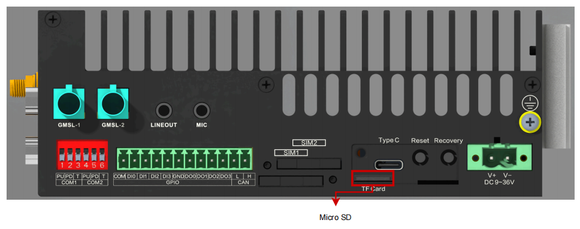

### 2.2.14 SIM Card Slot

The device has 2 SIM card slots (SIM1/SIM2) on the right panel to support standard SIM cards, please insert at least 1 available SIM when using the cellular function.

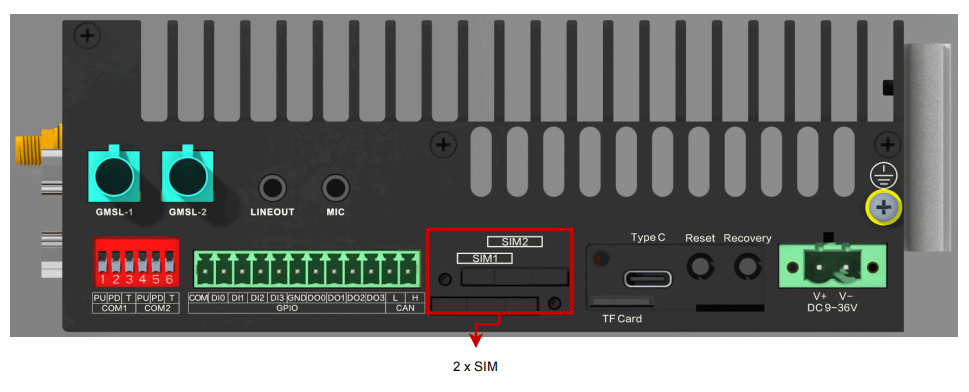

### 2.2.15 CAN FD

The device has 1 CAN FD interface (on-board 120Ω resistor) on the right panel, supporting a maximum communication rate of 5Mbps.

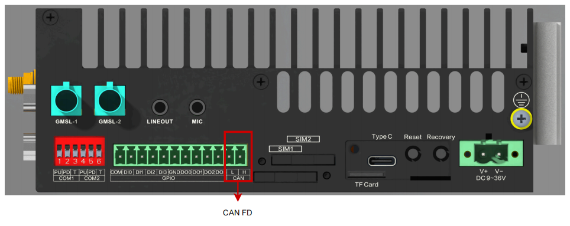

### 2.2.16 Digital Outputs

The device has four isolated digital output connectors on the right panel in open-drain output mode.

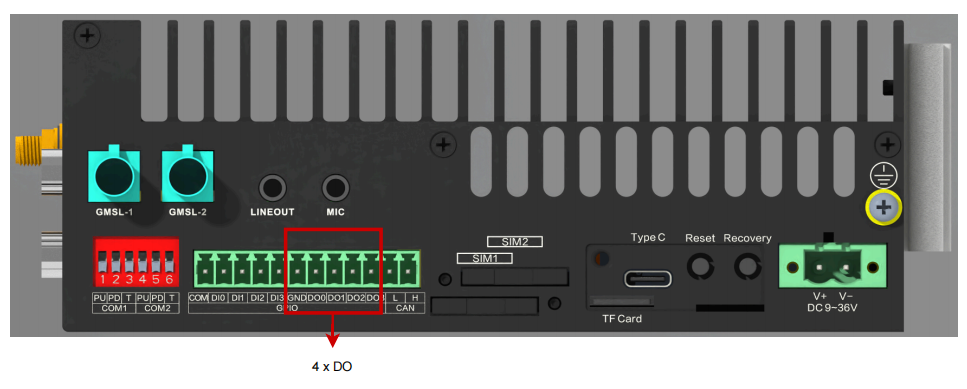

The wiring method is as follows:


| **Table 4: Isolated Digital Outputs** | |
| --- | --- |
| Number of Output Channels | 4 |
| Optical Isolation | 1414 VDC |
| Supply Voltage | Sink 60 VDC |
| Sink Current | 1.3 A max./Channel |

### 2.2.17 Digital Inputs

The device has four isolated digital inputs on the right panel that support wet and dry contacts.

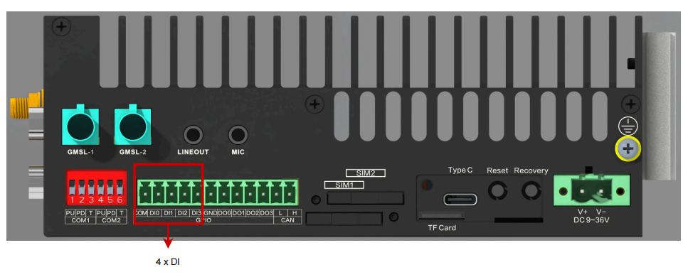

The wiring method is as follows:

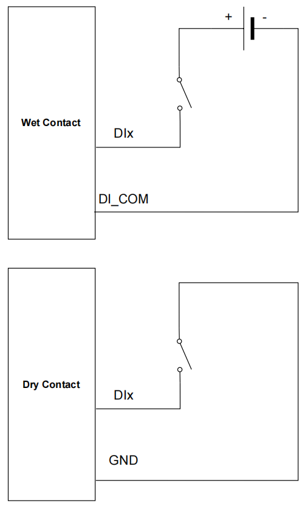

| **Table 5: Isolated Digital Inputs** | |
| :--- | --- |
| Number of Input Channels | 4 |
| Optical Isolation | 3750 VDC |
| Input Voltage | Dry contact.<br/>Logic 1: Open<br/>Logic 0: Close to ground  |
| | Wet contact.<br/>VIH(max.) = 60 VDC<br/>VIH(min.) = 5 VDC<br/>VIL(max.) = 2 VDC |

### 2.2.18 RS-485 Pull-up/down Dip Switches

The device has 1 RS-485 pull-up and pull-down dip switches on the right panel to control the pull-up and pull-down resistors of the RS-485 bus (corresponding to COM1/COM2).

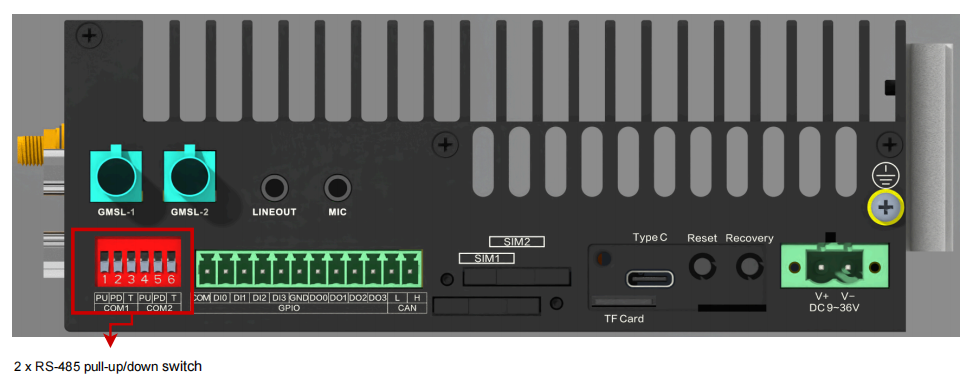

| **Table 6: RS-485 Pull-up/down** | |
| :--- | --- |
| PU | ON: Enable pull-up<br/>OFF: Disable pull-up |
| PD | ON: Enable pull-down<br/>OFF: Disable pull-down |
| T | ON: Enable termination matching resistor<br/>OFF: Disable termination matching resistor |

### 2.2.19 GMSL 2.0

The device has 2 GMSL 2.0 ports on the right panel, supporting docking of 2 GMSL cameras.

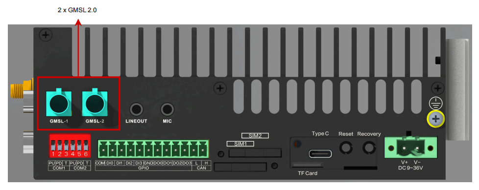

### 2.2.20 Lineout

The device has 1 Line-out connector on the right panel, which supports 3.5mm standard audio output.

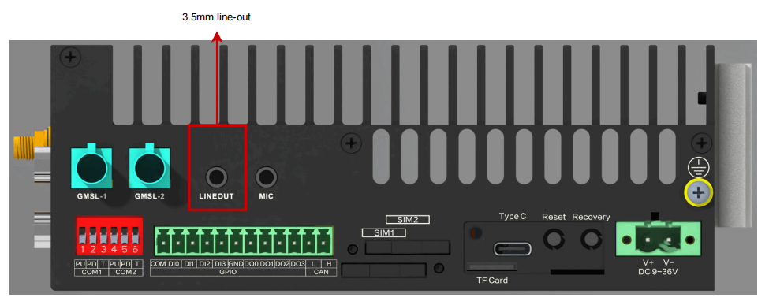

### 2.2.21 Microphone

The device has 1 microphone connector on the right panel and supports 3.5mm standard audio input.

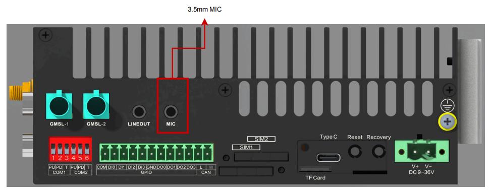

## 3 Installation

### 3.1 Rail Mounting Installation

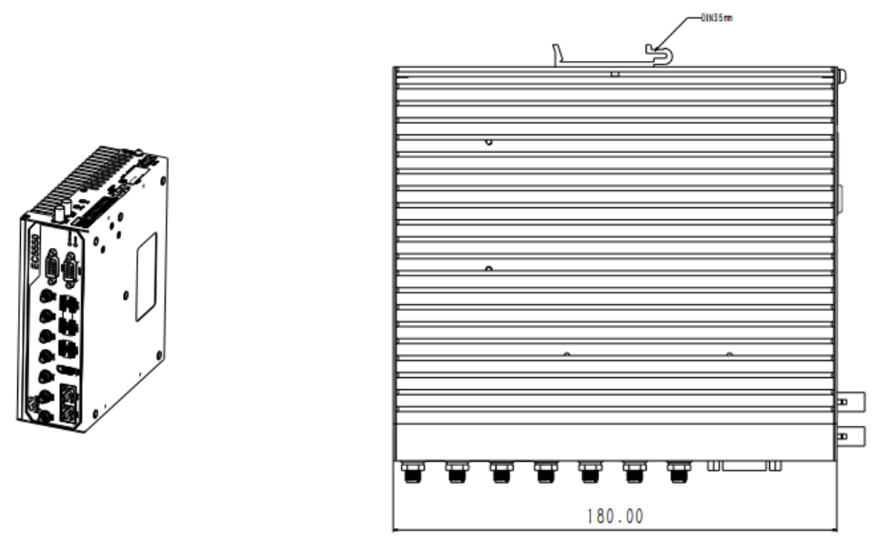

### 3.2 Wall-mounted Installation

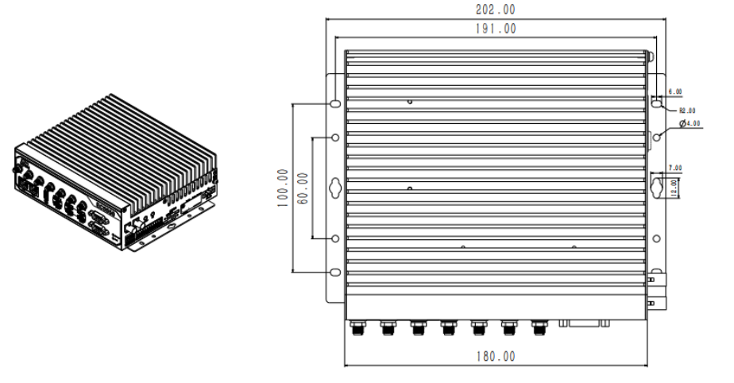

## 4 Getting Started

### 4.1 Connecting to Equipment

### 4.1.1 Connecting Device via HDMI

#### 4.1.1.1 Connecting HDMI and Peripherals

Connect the device to the monitor via the HDMI 2.0 port, plug the keyboard and mouse into the USB 3.2 port of the device, power up the device and wait for the device to finish booting. Check the nameplate on the bottom of the device to find the default system username and password.

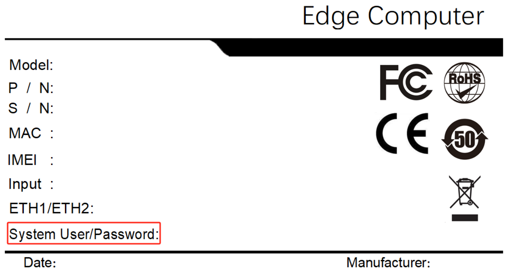

#### 4.1.1.2 Logging Equipment

On the login screen, select the user that corresponds to System User, enter the password, and log in.


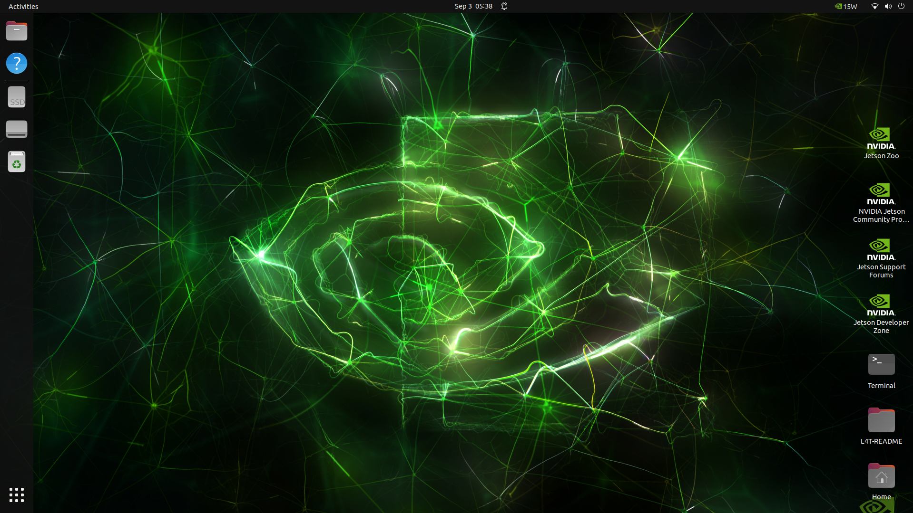

### 4.1.2 Connecting via SSH

#### 4.1.2.1 Connecting to the Network

Connecting to the device using SSH requires ensuring that the device network is accessible. Check the nameplate on the bottom of the device to find the system default Ethernet address and configure the host and device to be on the same network segment.

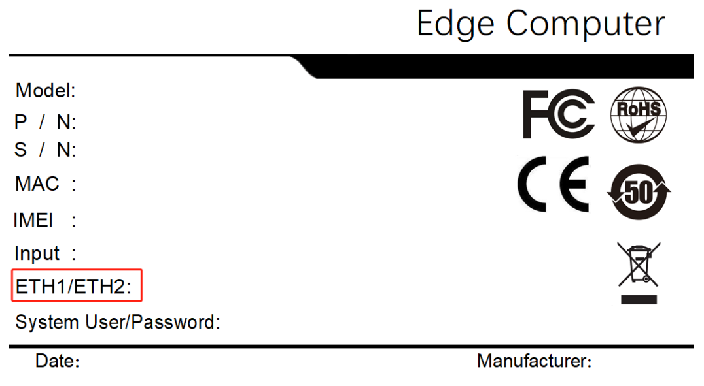

#### 4.1.2.2 Access to Equipment

Open the SSH terminal tool (Mobaxterm for example), enter the device address and click Connect.

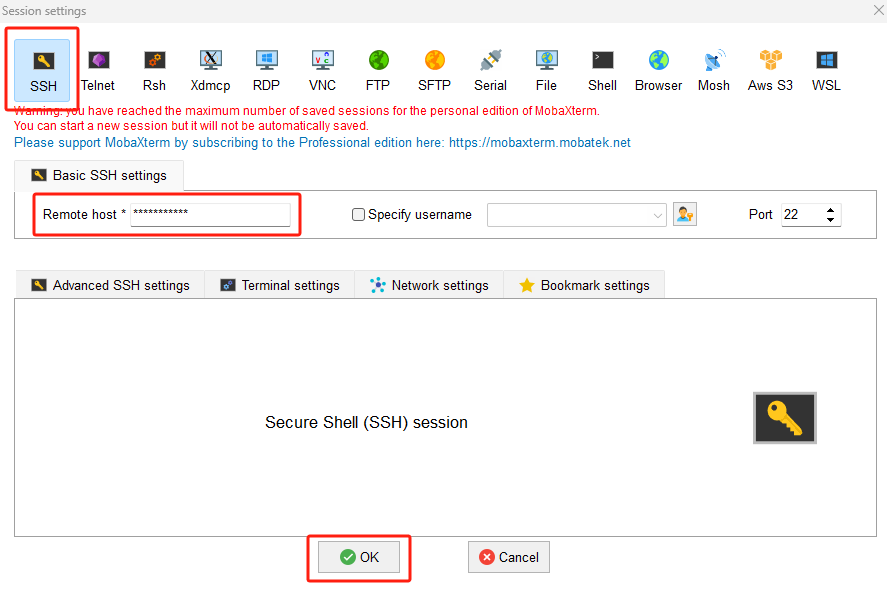

Follow the prompts and enter the default user and password.


### 4.2 Version Query

Open Terminal on the desktop or right-click and select "Open in Terminal" and enter the following command.

Version Query：

```json
## Query version number only
sudo ecversion 
## Query detailed version information
sudo ecversion -all
```

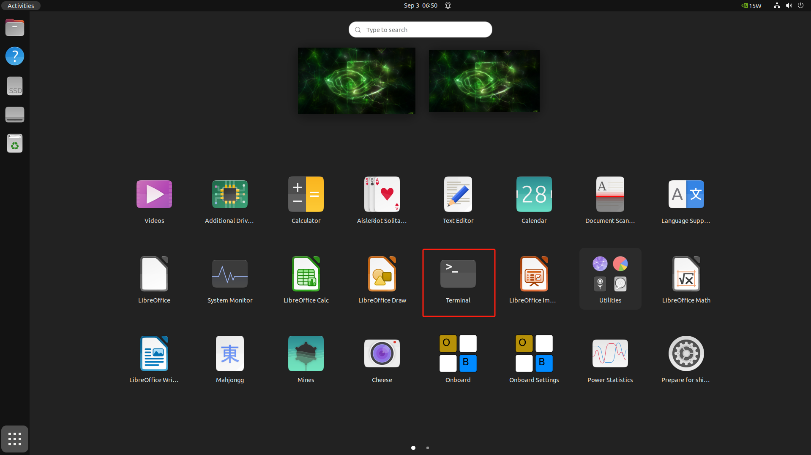

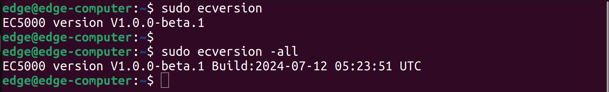

### 4.3 User Management

### 4.3.1 Creating Users

Open the desktop Terminal or right-click and select "Open in Terminal", and enter the following commands, according to the prompts to enter the password and user information, before creating the user, please make sure that the user exists, for the user that already exists, to create again will be prompted by The user 'username' already exists.

```json
## check if the test user exists 
id test 
## create test user
sudo adduser test
```

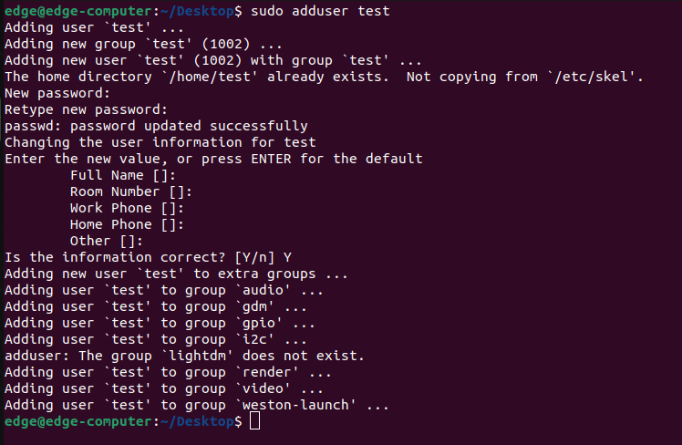

### 4.3.2 Delete Users

Open the desktop Terminal or right-click and click "Open in Terminal", and enter the following command to delete the user, before deleting the user, please make sure the user exists, if you delete the user does not exist will prompt The user 'username' does not exist.

```json
## Check if the test user exists 
id test 
## Delete the test user
sudo deluser test
```

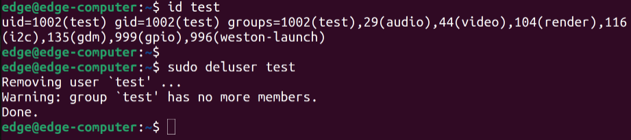

### 4.3.3 Disable and Enable Users

Open the desktop Terminal or right-click and click "Open in Terminal", and enter the following command to disable/enable the user, disable/enable the user before please make sure that the user exists, if the user does not exist, it will be prompted The user 'username' does not exist.

```json
## Check if the test user exists 
id test 
## Disable the test user
sudo passwd -l test 
## Enable test user
sudo passwd -u test 
## Query the status of the test user (L disabled/P enabled)
sudo passwd -S test
```

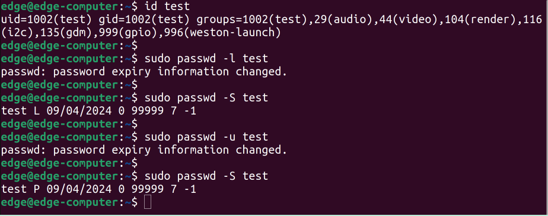

### 4.3.4 Advanced Extension of User Management

Reference:

1. [Ubuntu Manpage: adduser, addgroup - add a user or group to the system](https://manpages.ubuntu.com/manpages/xenial/en/man8/adduser.8.html?_gl=1*1jz4dhl*_gcl_au*MTkwNTc0MDUwMC4xNzI1MzQ3ODI1&_ga=2.97338463.1940871822.1725347824-1111823313.1715413709)
2. [Ubuntu Manpage: deluser, delgroup - remove a user or group from the system](https://manpages.ubuntu.com/manpages/focal/en/man8/deluser.8.html?_gl=1*2hnawf*_gcl_au*MTkwNTc0MDUwMC4xNzI1MzQ3ODI1&_ga=2.165044991.1940871822.1725347824-1111823313.1715413709)
3. [Ubuntu Manpage: passwd - change user password](https://manpages.ubuntu.com/manpages/bionic/man1/passwd.1.html?_gl=1*1rjws9d*_gcl_au*MTkwNTc0MDUwMC4xNzI1MzQ3ODI1&_ga=2.211133397.1940871822.1725347824-1111823313.1715413709)
4. [Ubuntu Manpage: usermod - modify a user account](https://manpages.ubuntu.com/manpages/trusty/en/man8/usermod.8.html?_gl=1*2hnawf*_gcl_au*MTkwNTc0MDUwMC4xNzI1MzQ3ODI1&_ga=2.165044991.1940871822.1725347824-1111823313.1715413709)

### 4.4 Network Settings

### 4.4.1 Ethernet Settings

#### 4.4.1.1 Settings Management

Click the network icon on the top right corner of the desktop, select Ethernet ->Wired Settings or click Show Applications->Settings->Network->Ethernet on the bottom left corner of the desktop, please choose to set eth1/eth2 according to the actual situation.

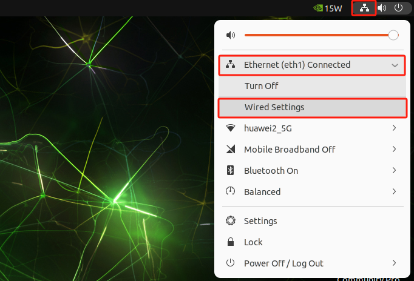

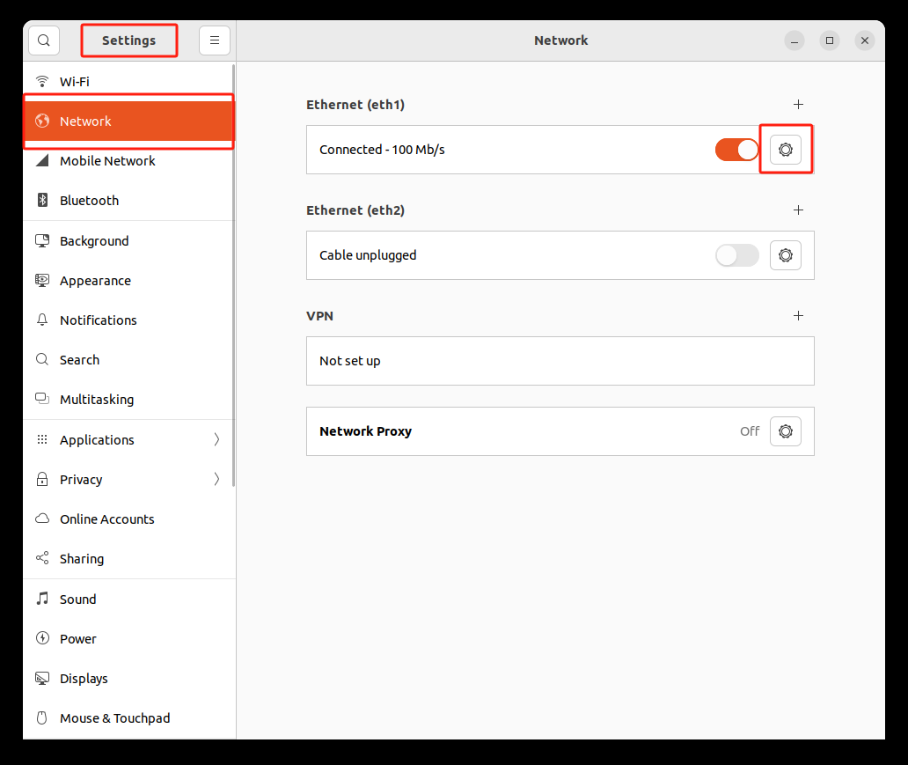

#### 4.4.1.2 On/Off Management

Click Turn On/Turn Off or slide the button in the Ethernet settings to turn the network off or on.

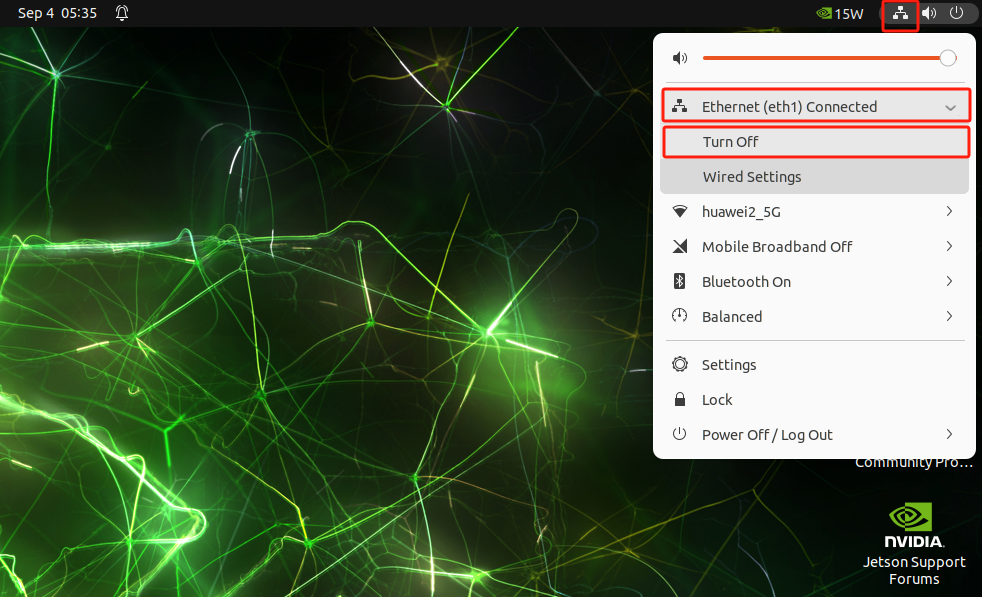


#### 4.4.1.3 Static Configuration

Click Setup button, select IPv4/IPv6, select Manual for Method, fill in Address, Netmask, Gateway, DNS and Routes according to the network conditions, and click Apply to save. Click Apply to save. After saving, please re-switch the network to make the configuration take effect.

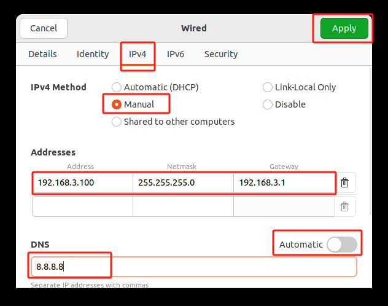

#### 4.4.1.4. Dynamic Configuration

Click the Setup button, select IPv4/IPv6, select Automaitc(DHCP) for Method, and click Apply to save. After saving, please re-switch the network to make the configuration take effect.

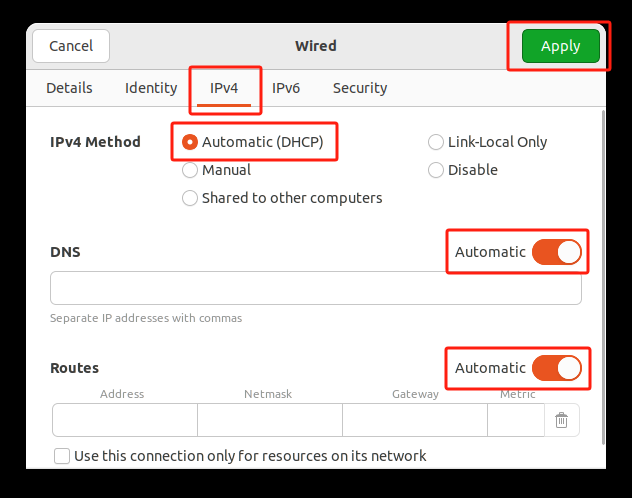

### 4.4.2 Wi-Fi Settings

#### 4.4.2.1 Settings Management

Click the network icon on the top right corner of your desktop and select Wi-Fi -> Wi-Fi Settings or click Show Applications -> Settings -> Wi-Fi on the bottom left corner of your desktop.

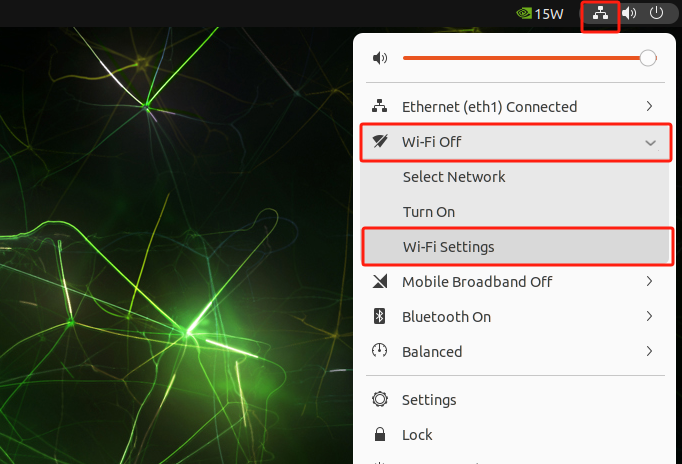

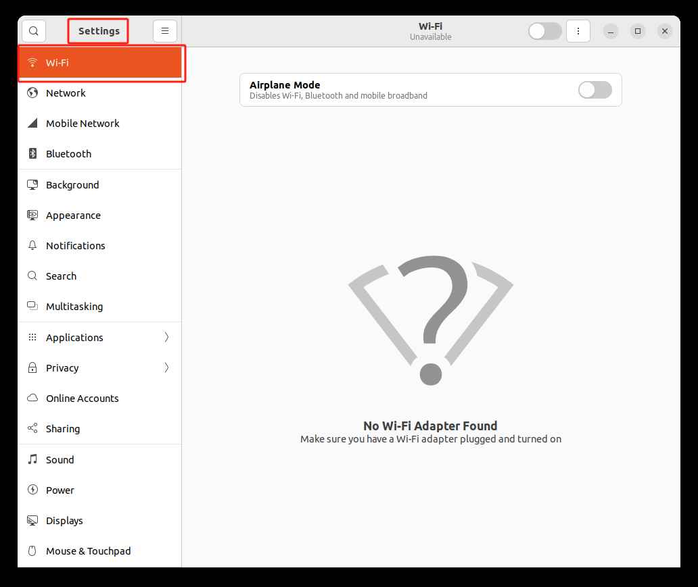

#### 4.4.2.2 On/Off Management

Tap Turn On/Turn Off or slide the button in the Wi-Fi settings to turn the network off or on.

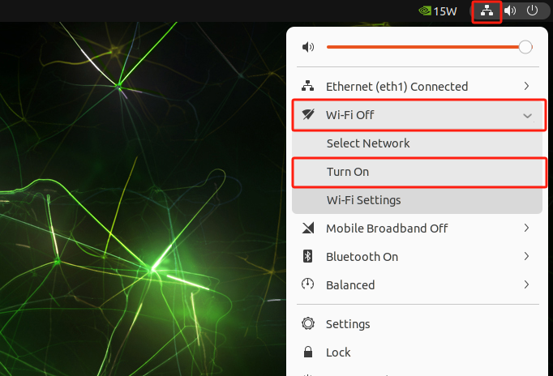

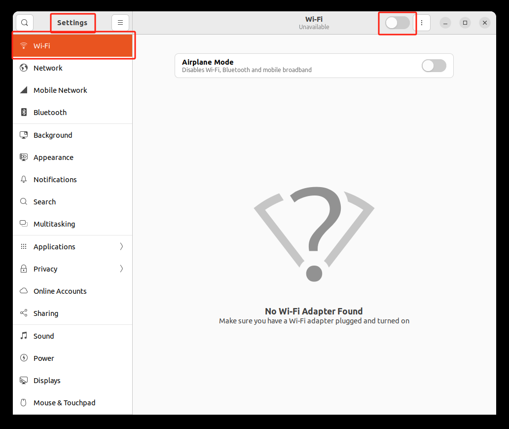

#### 4.4.2.3 Scanning

Scanning can be turned on via Wi-Fi -> Select Network, or the Wi-Fi Setting feature will automatically scan for visible Wi-Fi SSIDs in the neighbourhood when turned on.

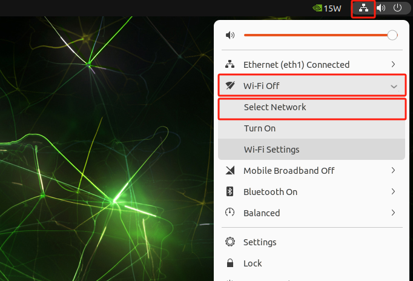

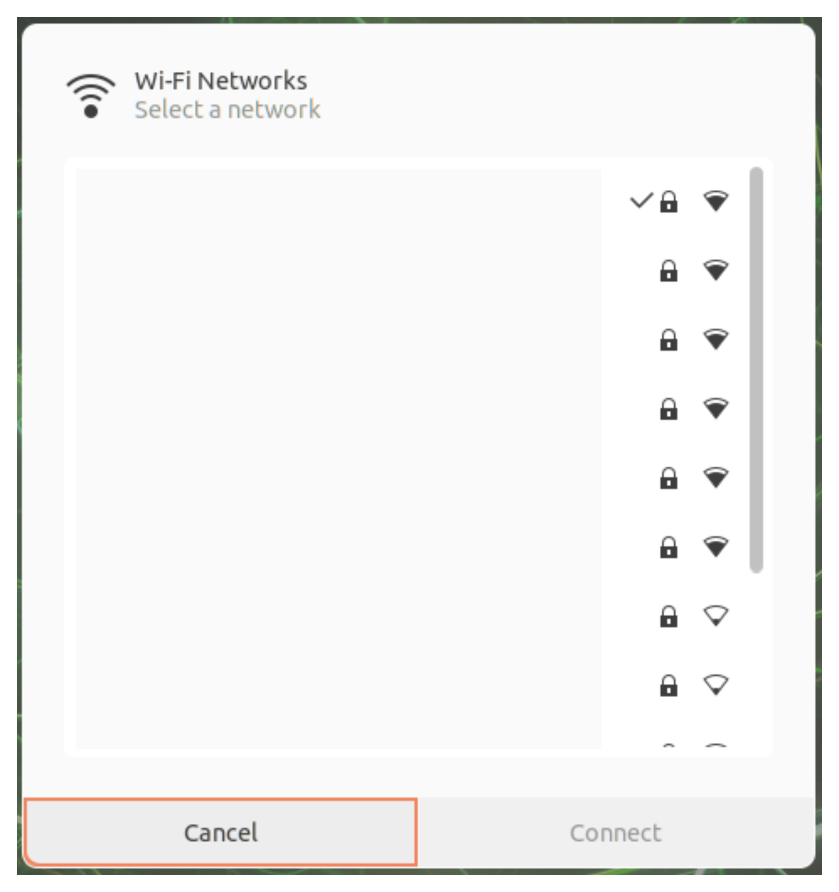

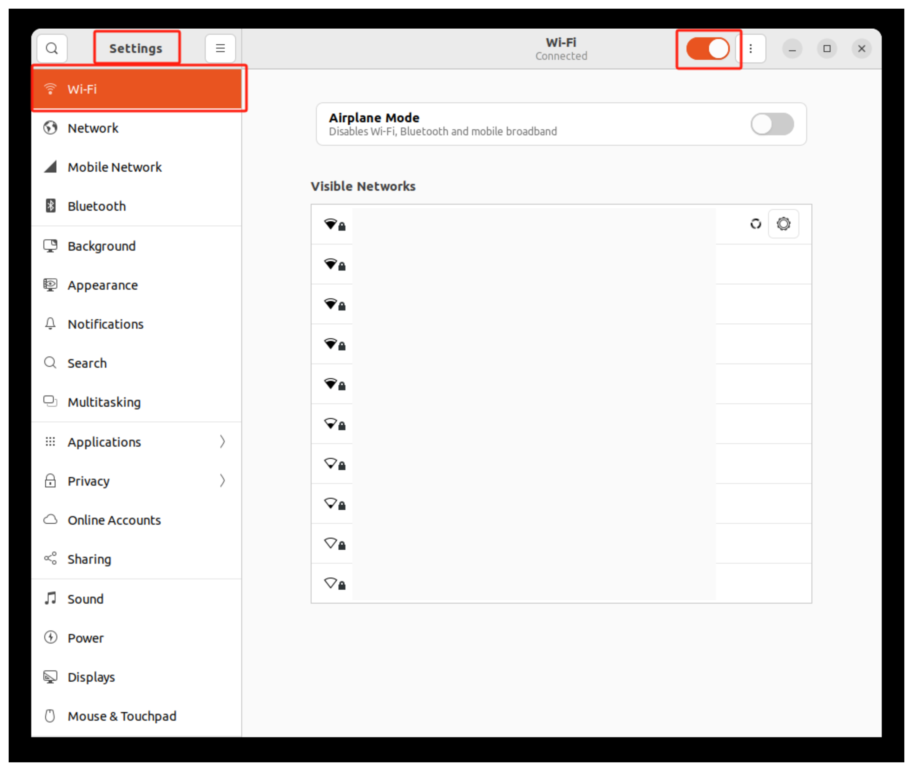

#### 4.4.2.4 Connection

Tap the Settings button on the right side of the Wi-Fi network, enter the password and tap Connect to connect to the network.

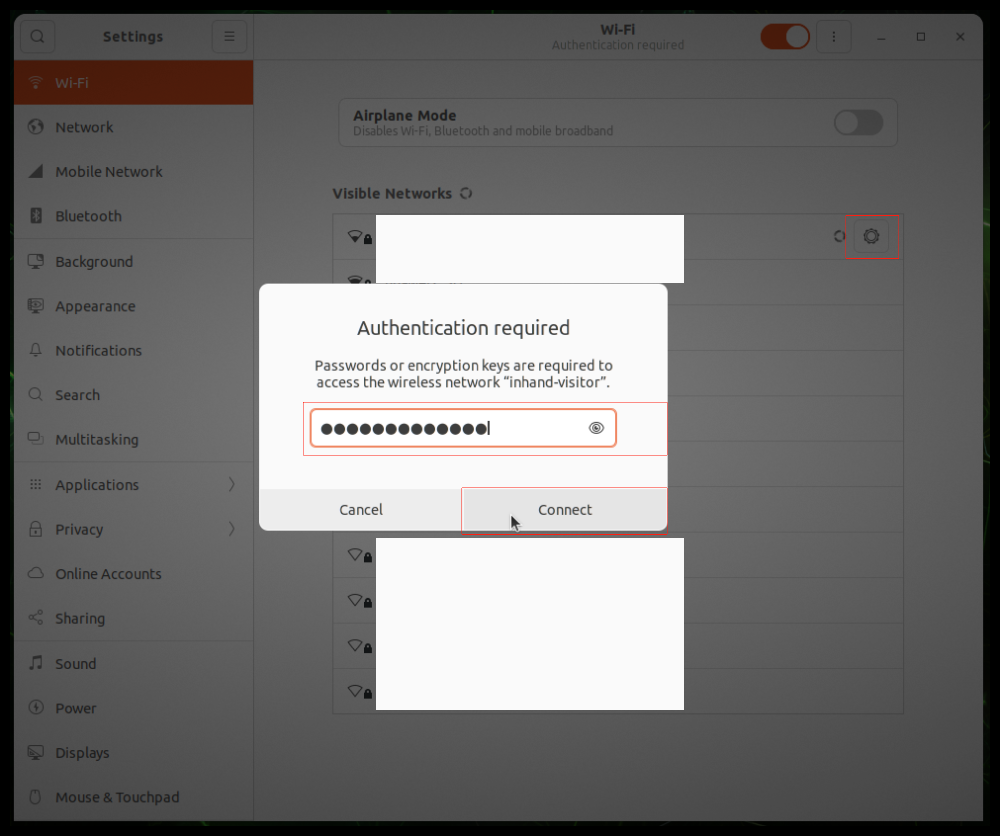

### 4.4.3 Cellular Network Settings

#### 4.4.3.1 Configuring Cellular ECM Mode

Insert the SIM card into SIM1/SIM2, access the cellular antenna, open Terminal and enter the following commands in order.

Cellular Network Settings:

```json
## Access cellular AT command interface using 115200 baud rate
sudo sdebug /dev/ttyUSB2 115200 
## Configure cellular ECM mode 
AT+QCFG="usbnet",1 
## Save and reboot cellular module 
AT+CFUN=1,1
```

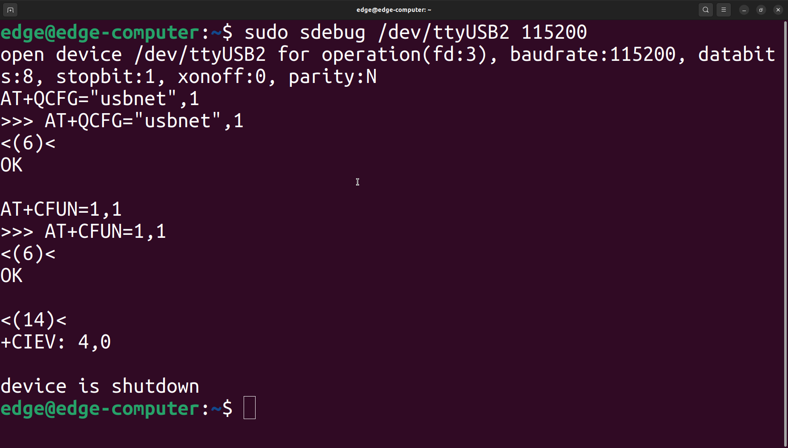

#### 4.4.3.2 Switching SIM Card

Open Terminal and enter the following command to switch the SIM card.

Switching SIM Card:

```json
## Switch to root
sudo -s 
## Switch to SIM1 
echo 0 > /sys/class/gpio/PG.06/value 
## Switch to SIM2 
echo 1 > /sys/class/gpio/PG.06/value
```

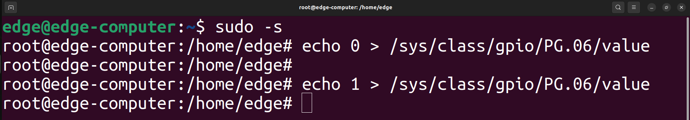

### 4.4.4 CAN FD Settings

Open Terminal and enter the following command to configure the CAN interface.

Configure CAN FD:

```json
## Link up CAN interface
sudo ip link set can0 up type can bitrate 1000000 dbitrate 5000000 restart-ms 1000 fd on
```


### 4.4.5 Bluetooth Settings

#### 4.4.5.1 Settings Management

Click the network icon on the top right corner of the desktop and select Bluetooth -> Bluetooth Settings or click Show Applications->Settings->Bluetooth on the bottom left corner of the desktop.


#### 4.4.5.2 On/Off Management

Tap Turn On/Turn Off or slide the button in Bluetooth settings to turn Bluetooth off or on.


#### 4.4.5.3 Bluetooth Connection

After switching on the Bluetooth switch, it will automatically scan the neighbouring Bluetooth devices，click on the Bluetooth device name to connect (for Bluetooth devices that require a PIN code, please enter the PIN code).


### 4.4.6 Network Settings Advanced Extensions

Reference:

1. [Network Manager | Ubuntu](https://ubuntu.com/core/docs/networkmanager)
2. [Bluez Prerequisites | Ubuntu](https://ubuntu.com/core/docs/bluez/check-installation)

### 4.5 Time Settings

Click Show Applications->Settings->Data & Time at the bottom left corner of the desktop.


### 4.5.1 Setting the Time Zone

Select or enter the system time zone by clicking Time Zone on the Settings page.


### 4.5.2 Adjusting the Time

By default, the system will automatically set the time when the device is connected to the network, if you need to set the time manually, please turn off Automatic Date & Time and set Date & Time manually.


### 4.6 Peripheral Configuration

### 4.6.1 Serial Port Management

The device supports two RS-232/422/485 optional serial ports, corresponding to the device nodes /dev/ttyCOM1 and /dev/ttyCOM2 respectively. Open Terminal and use the uart_mode command to switch the serial port operating mode.

| **Table 7：Serial Port Mapping** | |
| --- | --- |
| COM1 | /dev/ttyCOM1 |
| COM2 | /dev/ttyCOM2 |

| **Table 8：Serial port operating mode switching** | | |
| --- | --- | --- |
| uart_mode | COM1 | 485<br/>422<br/>232 |
| | COM2 | 485<br/>422<br/>232 |

For example, to configure COM1 to operate in RS-485 mode, enter the following command.

```json
sudo uart_mode COM1 485
```


### 4.6.2 Digital input/output Management

The device supports 4 isolated digital inputs and 4 isolated digital outputs.

| **Table 9：Digital Inputs/Outputs** | | |
| --- | --- | --- |
| DI | DI0 | /sys/class/gpio/gpio308 |
| | DI1 | /sys/class/gpio/gpio309 |
| | DI2 | /sys/class/gpio/gpio310 |
| | DI3 | /sys/class/gpio/gpio311 |
| | | |
| DO | DO0 | /sys/class/gpio/gpio312 |
| | DO1 | /sys/class/gpio/gpio313 |
| | DO2 | /sys/class/gpio/gpio314 |
| | DO3 | /sys/class/gpio/gpio315 |

## 5. Advanced

### 5.1 System Updates

Copy the system upgrade image to removable storage media or transfer it to the device via network, enter the following command to perform the system update operation, please be patient as the system update takes a long time.

```json
sudo update ota <update file>
```


### 5.2 System Reset

### 5.2.1 Recovery flick switch reset

The device has a Recovery flick switch button under the detachable bezel on the right panel, press and hold Recovery for 10 seconds during normal system operation and wait for the system status light to change from blinking to normally lit and release it, the device will enter the system reset state (restoring the system to the factory state), please refer to part 2.2.10 for detailed descriptions of the buttons;

### 5.2.2 Command Reset

Open Terminal and use the update command to perform a system reset.

```json
sudo update reset
```


## 6. Security (TPM2.0)

The device supports Trusted Platform Module 2.0 (TPM2.0) and is pre-installed with the tpm2-tools tool. You can directly use instructions to operate the TPM2.0 module to achieve security functions.

**Reference：**

1. [tpm2-tools](https://tpm2-tools.readthedocs.io/en/latest/)
2. [tpm2-tools/man at master · tpm2-software/tpm2-tools (github.com)](https://github.com/tpm2-software/tpm2-tools/tree/master/man)

## 7. Programming Guide

**Reference：**

1. [Jetson - Embedded AI Computing Platform | NVIDIA Developer](https://developer.nvidia.com/embedded-computing)
2. [Jetson Software | NVIDIA Developer](https://developer.nvidia.com/embedded/develop/software)
3. [Jetson Software Getting Started | NVIDIA Developer](https://developer.nvidia.com/embedded/learn/getting-started-jetson)
4. [NVIDIA Developer Forums - NVIDIA Developer Forums](https://forums.developer.nvidia.com/)
