# EC5000 Series AI Edge Computer User Manual

## Front Matter

### Declaration

Thank you for choosing our product. Before use, please read this user manual carefully and comply with the following statements. This will help maintain intellectual property rights and legal compliance, and ensure your user experience is consistent with the latest product information. If you have any questions or need to obtain written permission, please contact our technical support team at any time.

- Copyright Notice

This user manual contains copyright-protected content. The copyright belongs to Beijing InHand Networks Technology Co., Ltd. and its licensors. Without written permission, no unit or individual may excerpt, copy, or reproduce any part or all of this manual, nor distribute it in any form.

- Disclaimer

Due to continuous updates in product technology and specifications, the company cannot guarantee that the information in this user manual is completely consistent with the actual product. Therefore, the company assumes no responsibility for any disputes arising from discrepancies between actual technical parameters and this manual. Any product changes will not be notified in advance. The company reserves the right of final modification and interpretation.

- Copyright Information

The content of this user manual is protected by copyright law. The copyright belongs to Beijing InHand Networks Technology Co., Ltd. and its licensors. All rights reserved. Without written permission, no one may use, copy, or distribute the content of this manual without authorization.

### Graphical Interface Conventions

This document uses the following symbols and formatting conventions to facilitate understanding of operation steps and interface elements.

| Symbol | Meaning | Example |
|--------|---------|---------|
| `< >` | Indicates a variable or parameter to be replaced with an actual value | `<IP address>` means enter a specific IP |
| `" "` | Indicates text labels on the interface | Click the "Save" button |
| `->` | Indicates menu hierarchy or operation sequence | [Network] -> [Cellular] |
| `[ ]` | Indicates a menu or page name | Enter the [System Settings] page |

### Technical Support
Email: support@inhandnetworks.com

URL: www.inhand.com

### How to Use This Manual

**Find Your Role**

- First-time users: It is recommended to read in sequence: Device Overview -> Installation and First Use -> Common Scenario Configuration -> Function Description and Parameter Reference.
- Existing device users: You may directly refer to Function Description and Parameter Reference or Appendix Troubleshooting.
- Cloud platform management users: You may refer to the device remote management platform in Common Scenario Configuration.

**Quick Navigation by Task**

| Task | Corresponding Chapter | Estimated Time |
|------|----------------------|----------------|
| Understand device appearance and interfaces | [Device Overview](#chapter-1-device-overview) | About 10 minutes |
| Complete device installation and power-on | [Installation and First Use](#chapter-2-installation-and-first-use) | About 15 minutes |
| Connect and log in via HDMI | [Common Scenario Configuration](#chapter-3-common-scenario-configuration) | About 5 minutes |
| Configure cellular network Internet access | [Common Scenario Configuration](#chapter-3-common-scenario-configuration) | About 10 minutes |
| Configure IEOS Web management | [Function Description and Parameter Reference](#chapter-4-function-description-and-parameter-reference) | About 10 minutes |
| Troubleshoot device faults | [Appendix Troubleshooting](#appendix-troubleshooting) | As needed |

---

## Chapter 1 Device Overview

### 1.1 Overview

The EC5000 series AI edge computer is pre-integrated with NVIDIA Jetson Orin NX or Orin Nano modules, making it suitable for industrial AI application scenarios. The device provides 2 Gigabit Ethernet interfaces, 1 HDMI video output, 6 USB 3.2 interfaces, 2 RS-232/422/485 serial ports, 4 digital inputs, 4 digital outputs, 1 CAN FD interface, 2 GMSL 2.0 video interfaces, 2 SIM card slots, and supports Wi-Fi 5/6 and 4G/5G cellular network communication. It can meet the requirements of edge computing, industrial vision, and IoT gateway applications.

### 1.2 Packing List

| Item | Quantity | Remarks |
|------|----------|---------|
| EC5000 Host | 1 | - |
| Power Adapter | 1 | Optional |
| Wi-Fi Antenna | 2 | Standard |
| Cellular Antenna | 2-4 | Standard (quantity depends on device model) |
| Mounting Rail Accessories | 1 | Standard |
| Warranty Card | 1 | - |

### 1.3 Appearance and Interfaces

<p align="center">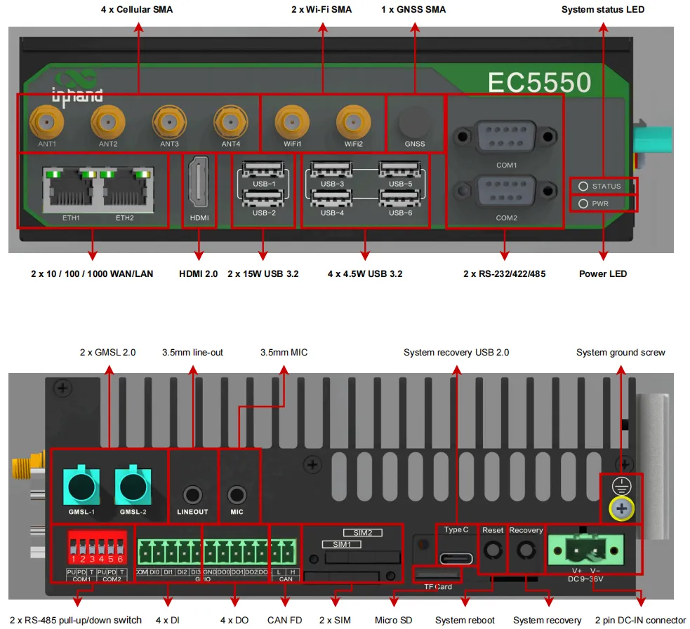</p>

<p align="center"><strong>Figure 1-1 System Interface Overview</strong></p>

<p align="center">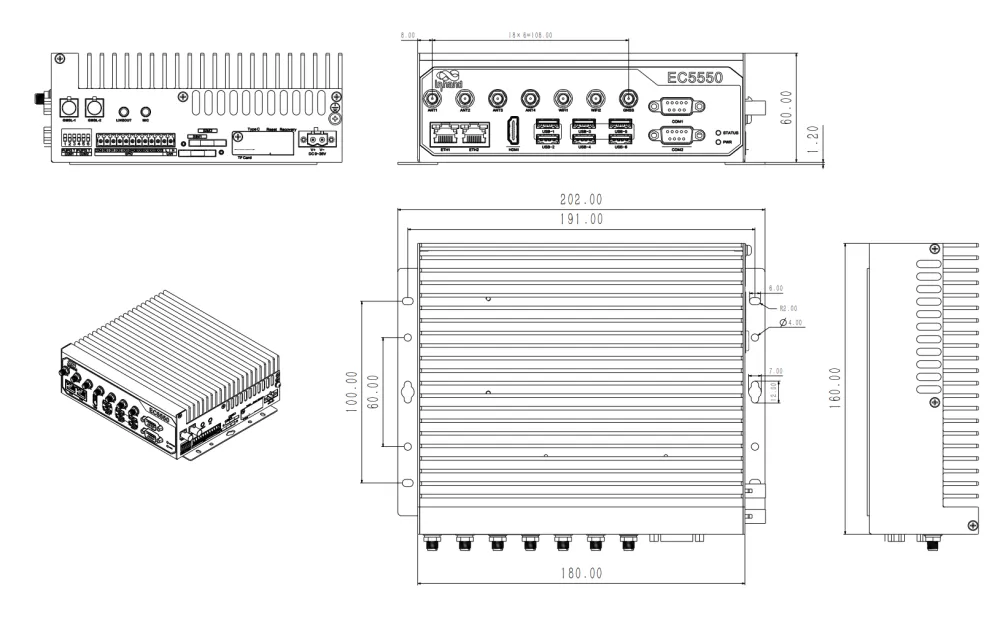</p>

<p align="center"><strong>Figure 1-2 Mechanical Dimensions</strong></p>

| Interface | Location | Function Description |
|-----------|----------|---------------------|
| Power Indicator | Front panel | Red LED, indicates system power status |
| System Status LED | Front panel | Green LED, indicates system operating status |
| Ethernet Port (WAN/LAN) | Front panel | 2x 10/100/1000 Mbps Ethernet interfaces, each with 2 status LEDs |
| USB 3.2 Gen2 | Front panel | 6x USB 3.2 interfaces (2x <=15W drive capacity, 4x <=4.5W drive capacity) |
| HDMI 2.0 | Front panel | Type-A interface, supports up to 3840 x 2160 @60Hz |
| SMA Antenna Interface | Front panel | 7 SMA interfaces (4 cellular, 2 Wi-Fi, 1 GNSS) |
| Serial Port (DB9) | Front panel | 2x RS-232/422/485 switchable serial ports |
| Grounding Terminal | Right panel | System grounding screw, requires green-yellow grounding wire (16AWG) |
| DC Power Input | Right panel | DC 9-36 V input |
| Recovery Button | Right panel (under removable cover) | Restore factory defaults / Enter firmware flashing mode |
| Reset Button | Right panel (under removable cover) | Reboot system and enable/disable hardware watchdog |
| USB 2.0 Type-C | Right panel (under removable cover) | For system flashing mode connection to host only |
| TF Card Slot | Right panel (under removable cover) | Supports Micro SD card expansion |
| SIM Card Slot (SIM1/SIM2) | Right panel | Supports standard SIM cards; at least 1 available SIM required for cellular function |
| CAN FD | Right panel | 1x CAN FD interface, onboard 120 ohm termination resistor, up to 5 Mbps |
| Digital Output (DO) | Right panel | 4x isolated digital outputs, open-drain output mode |
| Digital Input (DI) | Right panel | 4x isolated digital inputs, supports dry and wet contacts |
| RS-485 Pull-up/Pull-down DIP Switch | Right panel | Controls RS-485 bus pull-up/pull-down resistors and termination matching resistor |
| GMSL 2.0 | Right panel | 2x GMSL 2.0 FAKRA interfaces, supports docking GMSL cameras |
| Line-out | Right panel | 3.5 mm standard audio output |
| Microphone | Right panel | 3.5 mm standard audio input |

<p align="center">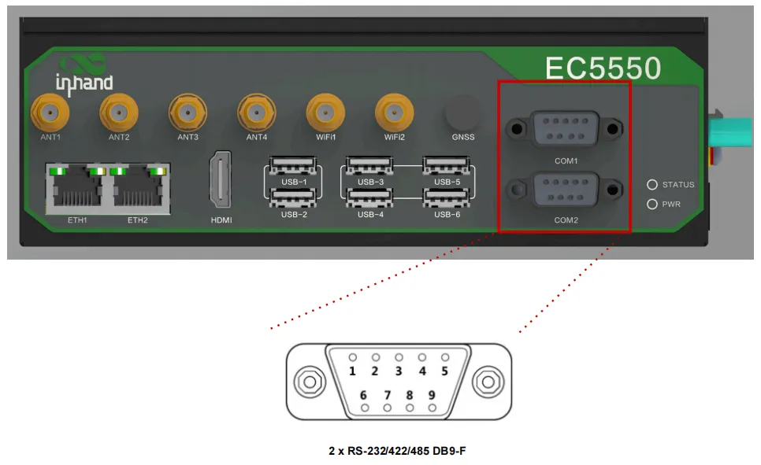</p>

<p align="center"><strong>Figure 1-3 Serial Port Interface</strong></p>

<p align="center">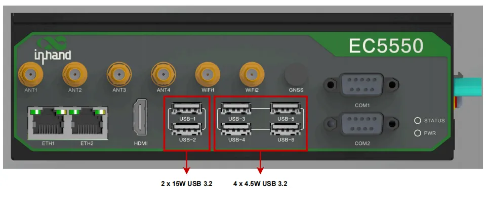</p>

<p align="center"><strong>Figure 1-4 USB 3.2 Interface</strong></p>

<p align="center">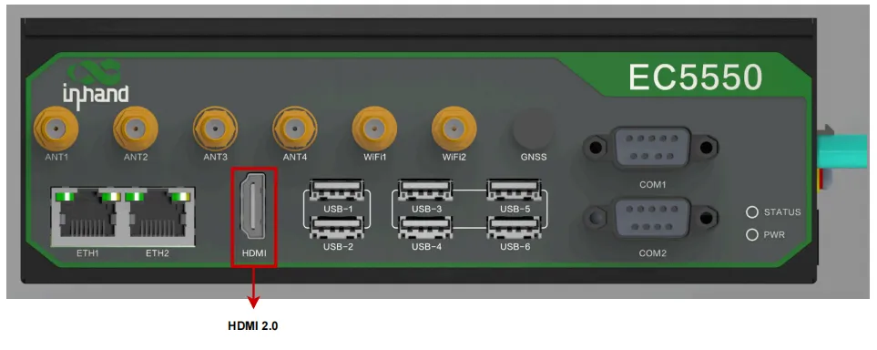</p>

<p align="center"><strong>Figure 1-5 HDMI 2.0 Interface</strong></p>

<p align="center">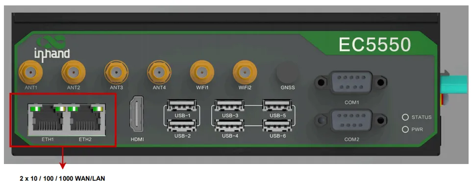</p>

<p align="center"><strong>Figure 1-6 Ethernet Interface</strong></p>

<p align="center">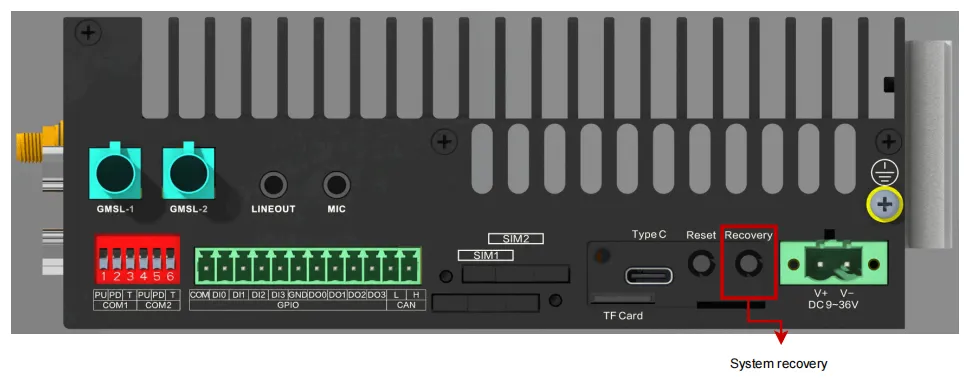</p>

<p align="center"><strong>Figure 1-7 Recovery Button</strong></p>

<p align="center">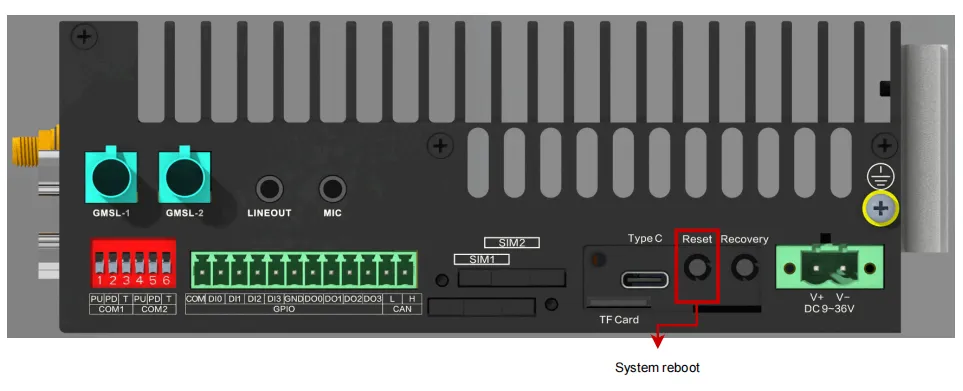</p>

<p align="center"><strong>Figure 1-8 Reset Button</strong></p>

<p align="center">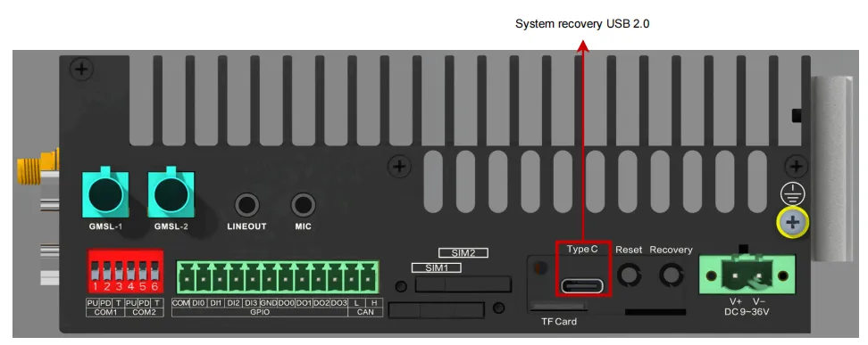</p>

<p align="center"><strong>Figure 1-9 USB 2.0 Type-C Interface</strong></p>

<p align="center">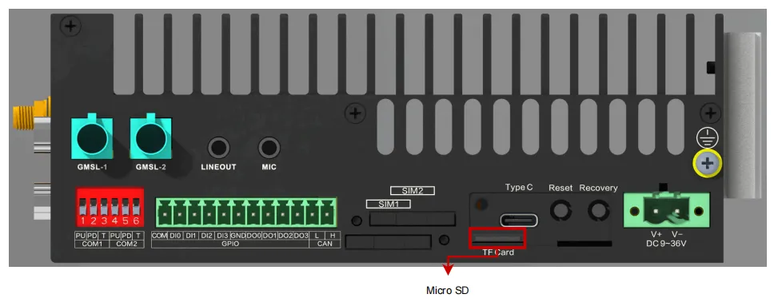</p>

<p align="center"><strong>Figure 1-10 TF Card Slot</strong></p>

<p align="center">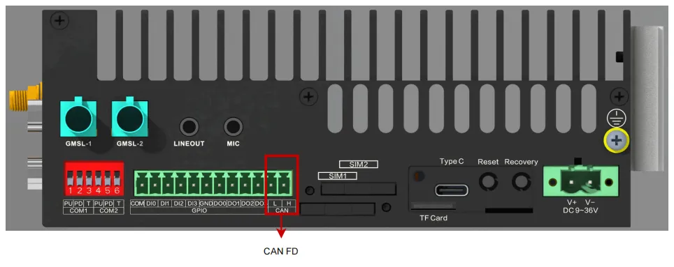</p>

<p align="center"><strong>Figure 1-11 CAN FD Interface</strong></p>

<p align="center">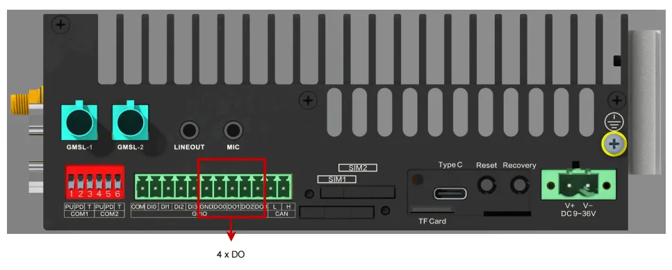</p>

<p align="center"><strong>Figure 1-12 Digital Outputs Interface</strong></p>

<p align="center">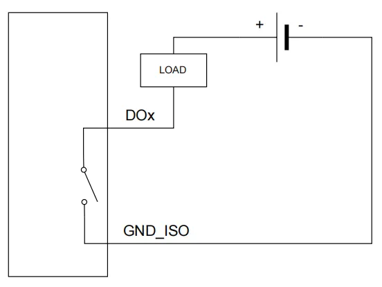</p>

<p align="center"><strong>Figure 1-13 Digital Outputs Wiring</strong></p>

<p align="center">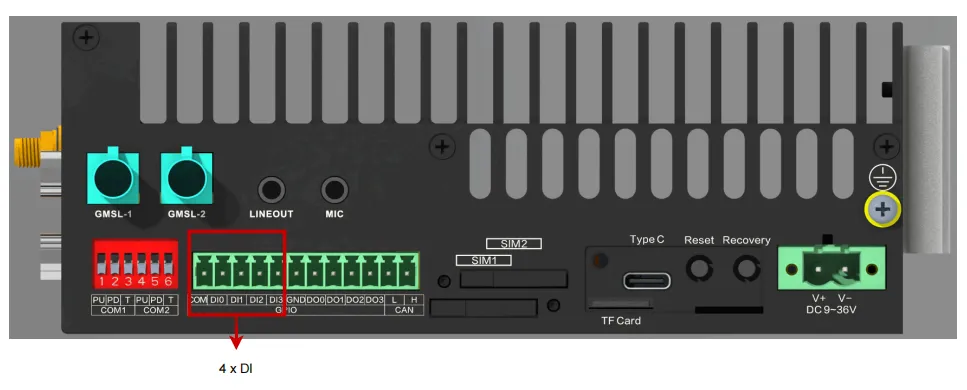</p>

<p align="center"><strong>Figure 1-14 Digital Inputs Interface</strong></p>

<p align="center">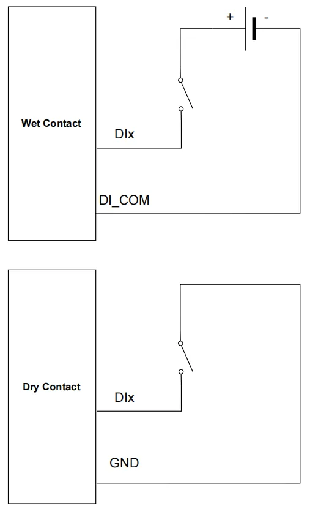</p>

<p align="center"><strong>Figure 1-15 Digital Inputs Wiring</strong></p>

<p align="center">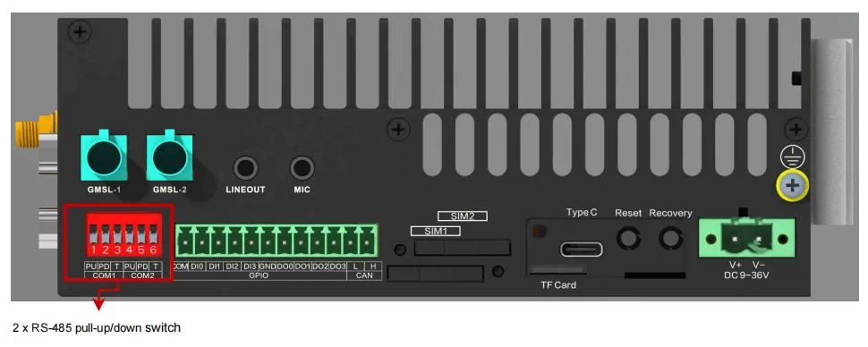</p>

<p align="center"><strong>Figure 1-16 RS-485 Pull-up/Pull-down DIP Switches</strong></p>

<p align="center">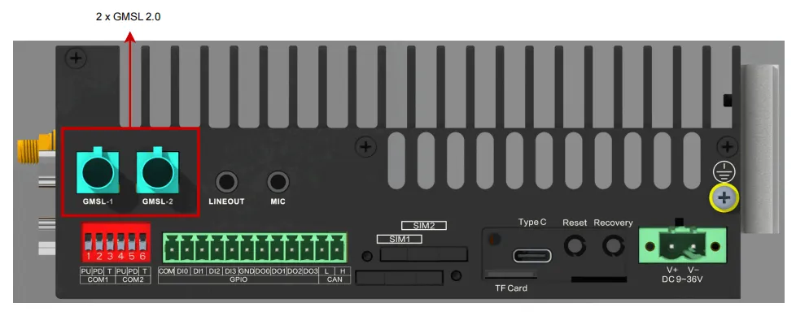</p>

<p align="center"><strong>Figure 1-17 GMSL 2.0 Interface</strong></p>

<p align="center">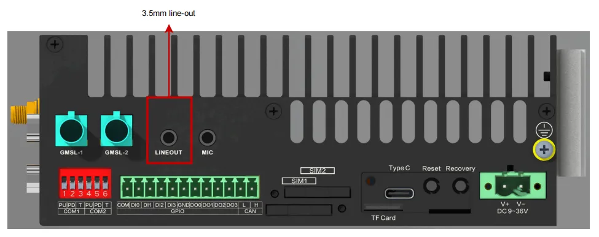</p>

<p align="center"><strong>Figure 1-18 Line-out Interface</strong></p>

<p align="center">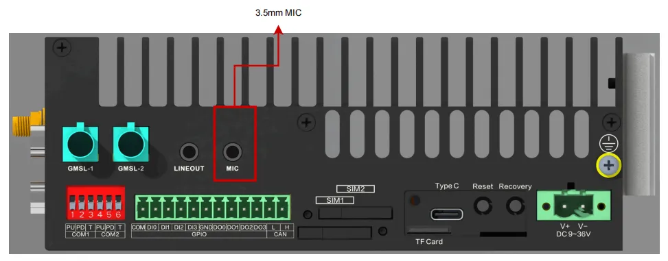</p>

<p align="center"><strong>Figure 1-19 Microphone Interface</strong></p>

### 1.4 LED Indicator Description

<p align="center"></p>

<p align="center"><strong>Figure 1-20 Power Indicator</strong></p>

<p align="center">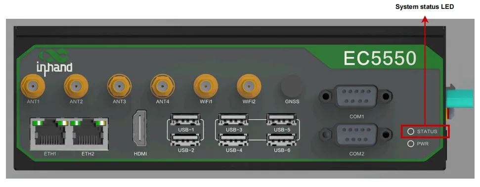</p>

<p align="center"><strong>Figure 1-21 System Status LED</strong></p>

| LED Indicator | Status | Meaning |
|---------------|--------|---------|
| Power Indicator | Solid on | System is powered on |
| | Off | System is powered off |
| System Status LED | Green flashing (1 Hz) | System operating normally |
| | Off | System is not operating |
| Ethernet Green LED | Solid on | Network Link up at 1000 Mbps |
| | Off | No connection or speed is 10/100 Mbps |
| Ethernet Orange LED | Flashing | Data communication on this port |
| | Off | No connection or no data activity on this port |

### 1.5 Factory Reset

The device can be restored to factory defaults by the following methods:

1. **Hardware button reset**: While the system is running normally, press and hold the **Recovery button** on the right panel for **10 seconds** until the system status LED changes from flashing to solid on, then release. The device will enter the system reset state and restore to factory default settings.
2. **Command line reset**: Open a terminal and execute the following command to perform a system reset.
   ```
   sudo update reset
   ```

> **Note**: System reset will restore the system configuration and filesystem state to factory defaults. User-installed software will also be cleared. Confirm that data has been backed up before proceeding.

### 1.6 Default Settings

| Parameter | Default Value | Description |
|-----------|---------------|-------------|
| Default Ethernet Address | 192.168.4.100 (eth2) | Device default Ethernet IP address |
| IEOS Web Login Address | https://192.168.4.100:9100 | IEOS Web management interface access address |
| IEOS Login Username | adm | Web management default username |
| IEOS Login Password | 123456 | Web management default password |
| System Username/Password | See device nameplate on bottom | System default login credentials |
| IEOS Function Status | Enabled | IEOS network and system management program is enabled by default |
| Cellular Function | Enabled | Cellular dial-up function is enabled by default |
| Wi-Fi Station | Disabled | Wi-Fi client function is disabled by default |
| Hardware Watchdog | Depends on button operation | Short press Reset (within 3s) to enable; long press (over 3s) to disable |

---

## Chapter 2 Installation and First Use

### 2.1 Pre-Installation Preparation

Before installing the device, confirm that the following environmental conditions and tools are ready.

| Item | Requirement |
|------|-------------|
| Ambient Temperature | -20 ~ 60 degrees C |
| Ambient Humidity | 95% at 40 degrees C (non-condensing) |
| Power Input | DC 9-36 V. It is recommended to select a 12 V (or above) / 120 W (or above) power adapter according to the total load. |
| Installation Method | DIN rail mounting or wall mounting |
| Required Tools | Phillips screwdriver, green-yellow grounding wire (16AWG) |

> **Note**: The device must be installed by a skilled person. Use copper conductors only and select an appropriate wire diameter. The power voltage range is 9 VDC to 36 VDC.

### 2.2 Installation Guide

#### 2.2.1 DIN Rail Mounting

1. Attach the DIN rail mounting accessories to the bottom of the device.
2. Align the device with the DIN rail and press down from top to bottom until the latch locks.
3. Confirm that the device is securely mounted on the rail.

<p align="center">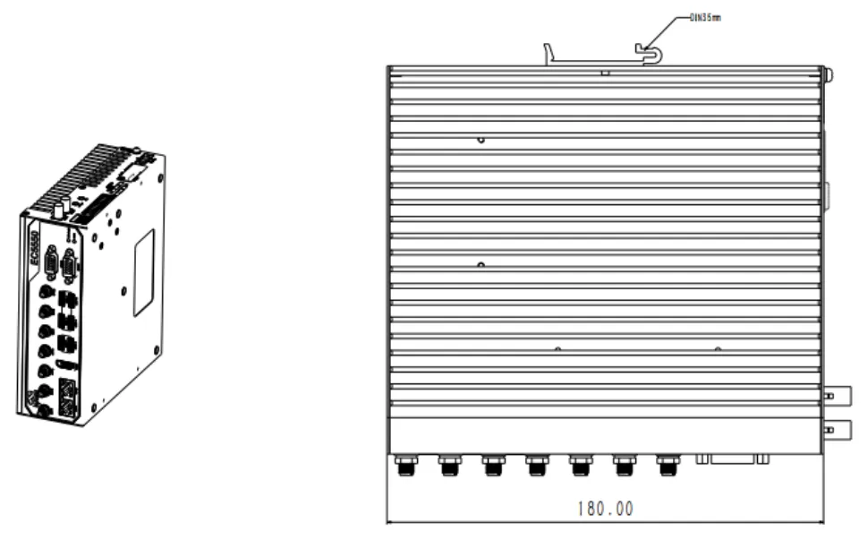</p>

<p align="center"><strong>Figure 2-1 DIN Rail Mounting</strong></p>

#### 2.2.2 Wall Mounting

1. Use the mounting template to mark the screw hole positions on the wall.
2. Drill holes at the marked positions and install expansion screws.
3. Align the mounting holes on the back of the device with the screws and secure.

<p align="center"></p>

<p align="center"><strong>Figure 2-2 Wall Mounting</strong></p>

#### 2.2.3 Grounding Connection

1. Use a green-yellow grounding wire (16AWG).
2. Connect one end of the grounding wire to the system grounding screw on the right panel of the device.
3. Connect the other end of the grounding wire to a reliable grounding terminal.

<p align="center">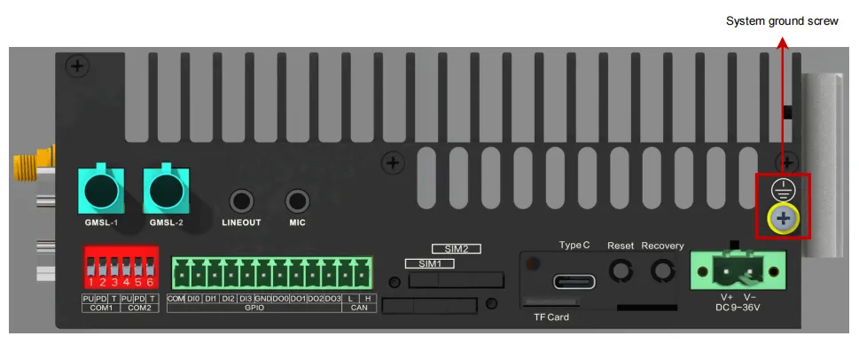</p>

<p align="center"><strong>Figure 2-3 Grounding Connection</strong></p>

#### 2.2.4 Power Connection

1. Confirm that the power adapter output voltage is within the DC 9-36 V range.
2. Connect the DC power plug to the DC-IN connector on the right panel of the device.
3. Power on and observe whether the front panel power indicator is solid on.

<p align="center">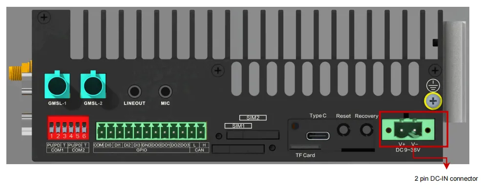</p>

<p align="center"><strong>Figure 2-4 DC-IN Connector</strong></p>

#### 2.2.5 Antenna Installation

Install the cellular antennas, Wi-Fi antennas, and GNSS antenna onto the corresponding SMA interfaces on the front panel according to the device model. Different models are equipped with different types and numbers of antennas. For specific support status, please refer to the "Ordering Guide" in the product specification.

<p align="center">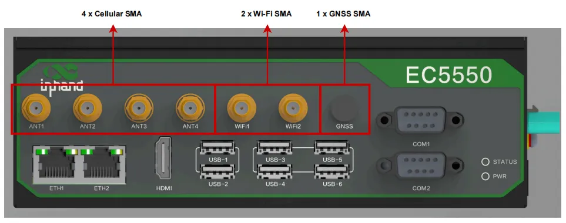</p>

<p align="center"><strong>Figure 2-5 SMA Antenna Interfaces</strong></p>

#### 2.2.6 SIM Card Installation

If the cellular function is required, insert at least one available standard SIM card into the SIM1 or SIM2 slot on the right panel.

<p align="center">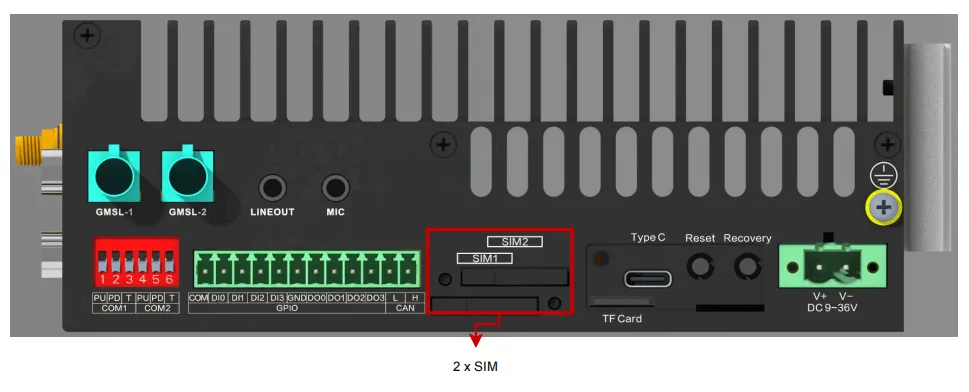</p>

<p align="center"><strong>Figure 2-6 SIM Card Slot</strong></p>

### 2.3 Quick Check

After installation is complete, perform the following checklist item by item.

| Check Item | Check Content | Expected Result |
|------------|---------------|-----------------|
| Power Indicator | Observe the front panel power indicator | Solid red |
| System Status LED | Observe the front panel system status LED | Green flashing (1 Hz) |
| Grounding Connection | Confirm the grounding wire is reliably connected | No looseness |
| Antenna Installation | Confirm required antennas are properly installed | All SMA interfaces tightened |
| SIM Card | Confirm SIM card is correctly inserted (if using cellular) | Card seated in slot |
| Network Connection | Confirm Ethernet cable is connected (if applicable) | Port indicator normal |

---

## Chapter 3 Common Scenario Configuration

### Scenario 1: Local Login via HDMI

**Objective**: Connect to a display via HDMI and log in to the system locally.

**Prerequisites**: Device installation and power-on are complete; monitor, keyboard, and mouse are ready.

**Estimated Time**: About 5 minutes.

**Steps**:
1. Use an HDMI cable to connect the HDMI 2.0 interface on the front panel of the device to the monitor.
2. Connect the keyboard and mouse to the USB 3.2 interfaces on the front panel of the device.
3. Confirm that the device has completed booting and the system status LED is flashing green.
4. On the login screen, select the system user, enter the password, and log in. The default system username and password are on the device nameplate on the bottom.

<p align="center">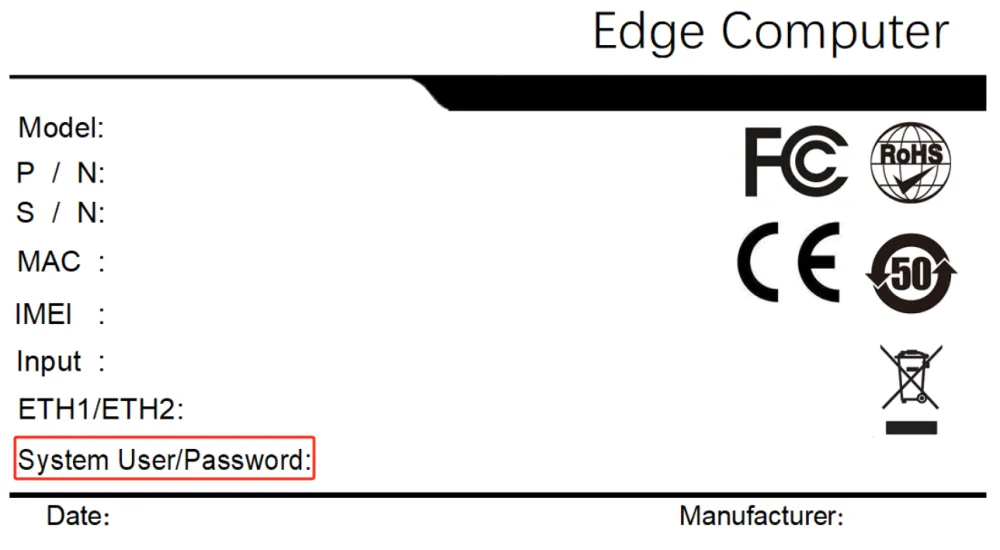</p>

<p align="center"><strong>Figure 3-1 HDMI and Peripheral Connection</strong></p>

<p align="center">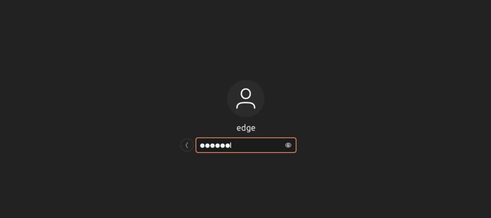</p>

<p align="center"><strong>Figure 3-2 Login Screen</strong></p>

<p align="center">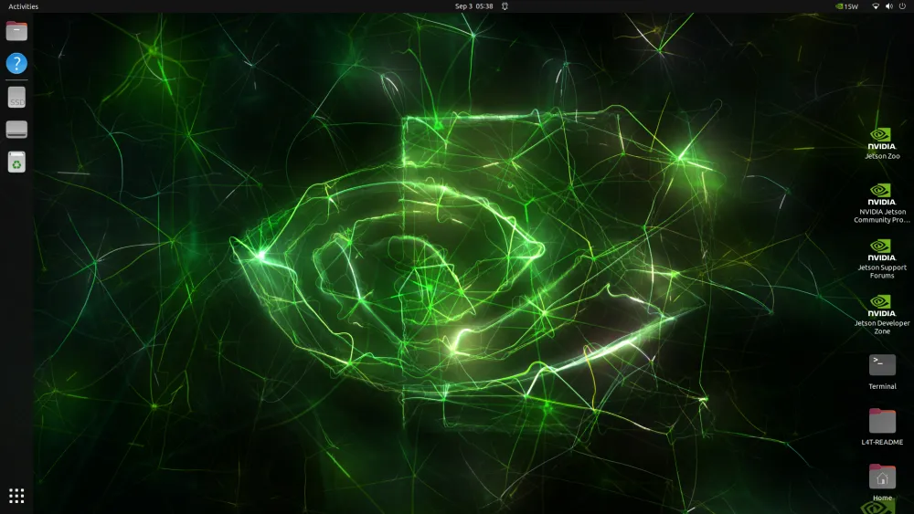</p>

<p align="center"><strong>Figure 3-3 Login Screen (2)</strong></p>

**Verification**:

1. Confirm that the monitor is displaying the system desktop normally.
2. Confirm that the keyboard and mouse are operating normally.

**Common Issues**:
- No signal on monitor: Check whether the HDMI cable is securely connected and confirm the monitor input source is correctly selected.
- Unable to log in: Confirm that the entered username and password match the device nameplate on the bottom.

### Scenario 2: Remote SSH Connection Management

**Objective**: Remotely connect to the device via SSH for command-line management.

**Prerequisites**: The device and host (PC) have established a network connection and are on the same network segment.

**Estimated Time**: About 5 minutes.

**Steps**:
1. Check the device nameplate on the bottom to confirm the system default Ethernet address.
2. Configure the host IP address so that it is on the same network segment as the device.
3. Open an SSH terminal tool on the host (such as MobaXterm).
4. Enter the device IP address and click Connect to establish the connection.
5. Follow the prompts to enter the default username and password to complete login.

<p align="center">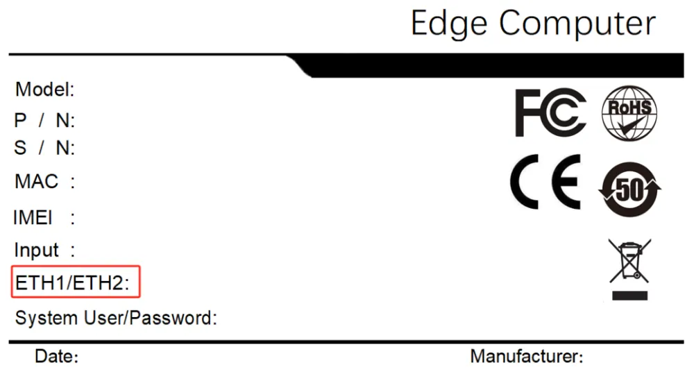</p>

<p align="center"><strong>Figure 3-4 Network Configuration for SSH</strong></p>

<p align="center"></p>

<p align="center"><strong>Figure 3-5 SSH Terminal Connection</strong></p>

<p align="center"></p>

<p align="center"><strong>Figure 3-6 SSH Login Prompt</strong></p>

<p align="center">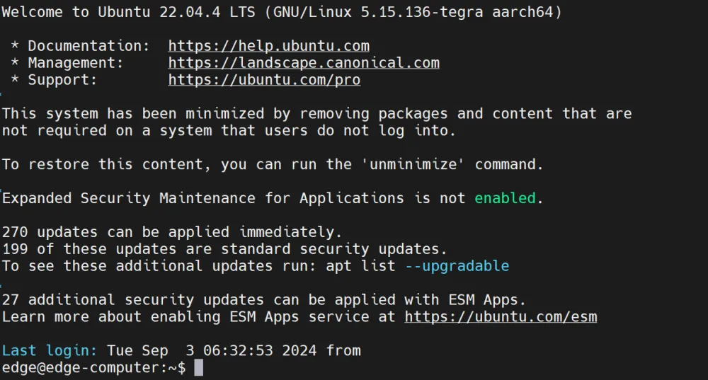</p>

<p align="center"><strong>Figure 3-7 SSH Logged In</strong></p>

**Verification**:
1. Confirm that the SSH terminal displays the device command-line prompt.
2. Execute a `ping` command to test network connectivity.

**Common Issues**:
- Unable to connect via SSH: Confirm that the host and device IPs are on the same network segment, and check firewall settings.
- Authentication failure: Confirm that the username and password match the device nameplate.

### Scenario 3: Getting Started with IEOS Web Management

**Objective**: Perform network and system management on the device through the IEOS Web interface.

**Prerequisites**: The device is powered on, and the host has network connectivity to the device. IEOS is enabled by default.

**Estimated Time**: About 10 minutes.

**Steps**:
1. In the host browser, enter `https://192.168.4.100:9100` (using the eth2 default address as an example).
2. Enter the IEOS default username `adm` and password `123456` to log in.
3. After successful login, the [Network Management] menu can be used to configure Ethernet, cellular, Wi-Fi, and other parameters.
4. The [System Management] menu can be used to perform firmware upgrades, system restarts, factory resets, and other operations.
5. The [Status] page can be used to view device information, network status, and logs.

<p align="center">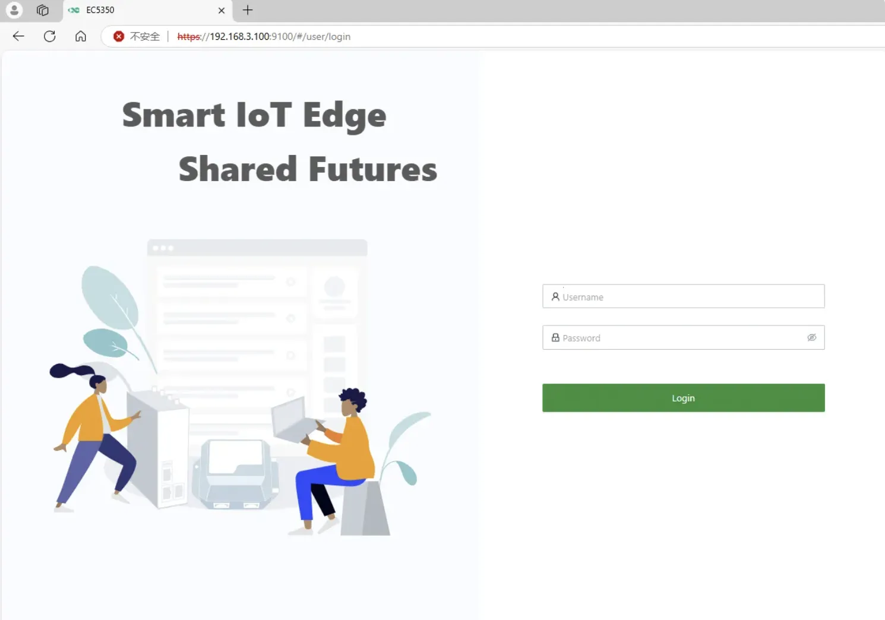</p>

<p align="center"><strong>Figure 3-8 IEOS Web Login</strong></p>

> **Note**: IEOS uses HTTPS port 9100 and does not support HTTP access. When IEOS is enabled, some port numbers (9100~9200) are reserved for internal communication. User applications should avoid using these ports to prevent conflicts.

**Verification**:
1. Confirm that the browser successfully loads the IEOS management page.
2. In [Status] -> [Device Information], confirm that CPU, memory, and disk usage status are normal.

**Common Issues**:
- Unable to open Web page: Confirm that the host and device are on the same network segment, and check that the URL uses HTTPS and port 9100.
- Login failure: Confirm that the default username `adm` and password `123456` are used.

### Scenario 4: Cellular Network Internet Access

**Objective**: Access the Internet via 4G/5G cellular network.

**Prerequisites**: A SIM card has been inserted and cellular antennas are installed; the device is powered on.

**Estimated Time**: About 10 minutes.

**Steps**:
1. Insert the SIM card into the SIM1/SIM2 slot and install the cellular antennas.
2. Log in to the IEOS Web management interface and navigate to [Network Management] -> [Cellular].
3. Confirm that the "Enabled" switch is turned on.
4. If APN configuration is required, add a dial-up parameter set in "Profiles" (APN, username, password, authentication mode). Non-private network cards usually do not require modification.
5. In "Network Mode", select the network mode. The default is "Auto".
6. If dual-SIM single-dial functionality is required, enable "Dual SIM Enabled" and configure the primary SIM card, maximum dial attempts, and other parameters.
7. It is recommended to enable the ICMP probe function, configure the probe address, interval, timeout, and retry count to detect and recover from false connections.
8. Click "Save" and wait for the dial-up to succeed.

<p align="center">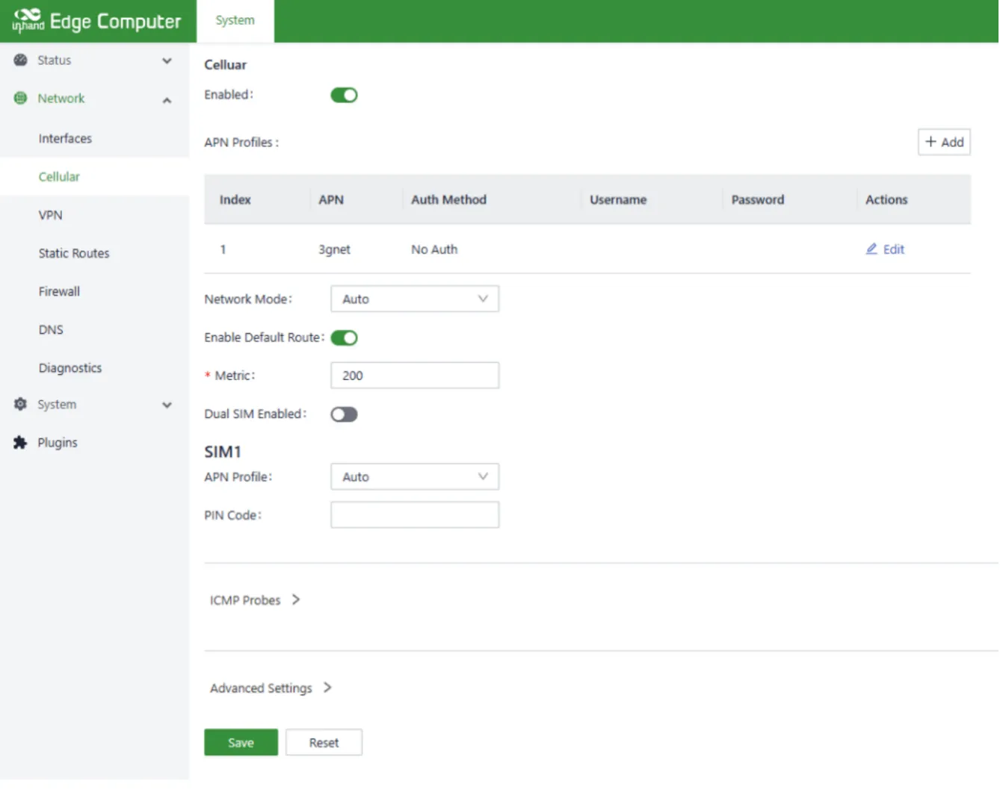</p>

<p align="center"><strong>Figure 3-9 Cellular Configuration</strong></p>

**Verification**:
1. In [Status] -> [Cellular Dial Status], check the SIM card information, signal strength, and obtained IP address.
2. Use the network diagnosis tool to ping an Internet address (such as 8.8.8.8) to confirm network connectivity.

**Common Issues**:
- Unable to dial successfully: Check whether the SIM card is correctly inserted, whether the APN parameters match the operator requirements, and whether the antennas are installed.
- False connection (dial-up successful but unable to access the Internet): Enable the ICMP probe function, or try restarting the cellular module.
- Weak signal: Check antenna connections and adjust the device position to obtain a stronger signal.

### Scenario 5: Wi-Fi Client Network Access

**Objective**: Connect the device as a Wi-Fi client to an existing wireless network.

**Prerequisites**: The device is powered on, and an available Wi-Fi access point is nearby.

**Estimated Time**: About 5 minutes.

**Steps**:
1. Log in to the IEOS Web management interface and navigate to [Network Management] -> [Wi-Fi Station].
2. Turn on the "Enable Wi-Fi" switch.
3. In "Client SSID", enter the wireless network name to be connected, or scan for nearby SSIDs using the "Scan" button.
4. Select the authentication method (No-certification, WPA-PSK, WPA2-PSK, WPA-PSK/WPA2-PSK Mixed).
5. Select the encryption mode (CCMP, TKIP, TKIP and CCMP).
6. Enter the wireless network password (WPA/WPA2 PSK Key).
7. If Internet access via the Wi-Fi egress is required, keep "Enable Default Route" turned on.
8. Click "Save" and wait for the connection to be established.

<p align="center">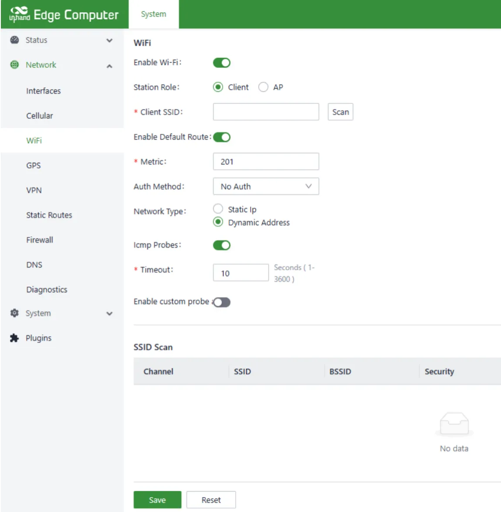</p>

<p align="center"><strong>Figure 3-10 Wi-Fi Station Configuration</strong></p>

**Verification**:
1. In [Status] -> [Wi-Fi Station Status], check the obtained IP address, gateway, and DNS information.
2. Access an Internet website to confirm normal network connectivity.

**Common Issues**:
- Unable to scan SSID: Confirm that the Wi-Fi function is turned on and check the surrounding signal strength.
- Connection failure: Confirm that the SSID and password are entered correctly, and check whether the router has MAC filtering enabled.

### Scenario 6: Serial Port and Industrial I/O Configuration

**Objective**: Configure the serial port operating mode and use the digital input/output interfaces.

**Prerequisites**: The device is powered on, and serial devices or I/O devices requiring communication are connected.

**Estimated Time**: About 10 minutes.

**Steps**:
1. **Serial port mode switching**: Open a terminal and use the `uart_mode` command to switch the serial port operating mode.
   ```
   sudo uart_mode COM1 485
   ```
   Supported modes: RS-232, RS-422, RS-485. COM1 corresponds to `/dev/ttyCOM1`, and COM2 corresponds to `/dev/ttyCOM2`.
2. **RS-485 termination resistor configuration**: If the RS-485 bus pull-up/pull-down resistors or termination matching resistor need to be enabled, adjust the DIP switches on the right panel.
3. **Digital output control**: The device provides 4 isolated digital outputs (DO0~DO3), corresponding to GPIO paths `/sys/class/gpio/gpio312` through `/sys/class/gpio/gpio315`.
4. **Digital input reading**: The device provides 4 isolated digital inputs (DI0~DI3), corresponding to GPIO paths `/sys/class/gpio/gpio308` through `/sys/class/gpio/gpio311`, supporting dry and wet contacts.
5. **CAN FD configuration**: Open a terminal and execute the following command to enable the CAN FD interface.
   ```
   sudo ip link set can0 up type can bitrate 1000000 dbitrate 5000000 restart-ms 1000 fd on
   ```

<p align="center">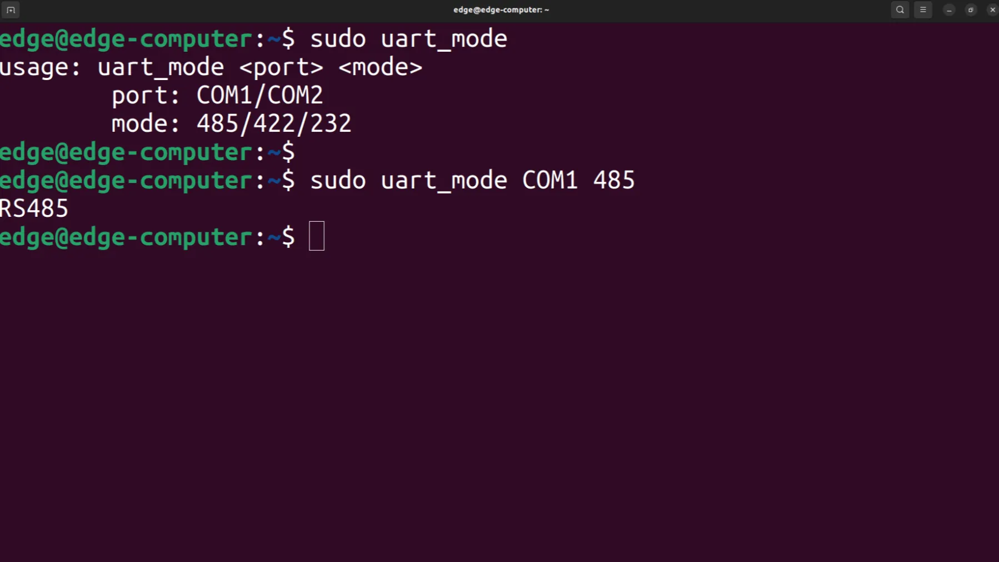</p>

<p align="center"><strong>Figure 3-11 Serial Port Mode Switch</strong></p>

**Verification**:
1. After executing `uart_mode`, test data transmission and reception through a serial port tool.
2. Read the corresponding GPIO path values to confirm normal DI state changes.
3. Use a CAN tool to test CAN FD frame transmission and reception.

**Common Issues**:
- Serial communication abnormal: Confirm that the serial port mode matches the peer device, and check the RS-485 termination resistor configuration.
- No DI state change: Confirm correct wiring, and distinguish between dry contact and wet contact wiring methods.
- CAN FD unable to communicate: Confirm that the baud rate, sample point, and termination resistor configuration match the peer device.

---

## Chapter 4 Function Description and Parameter Reference

## 4.1 User Management

### 4.1.1 Creating Users

Open the desktop Terminal or right-click and select "Open in Terminal", and enter the following commands. According to the prompts, enter the password and user information. Before creating a user, please make sure that the user does not already exist. Creating a user that already exists will prompt: The user 'username' already exists.

```
# Check if the test user exists
id test
# Create the test user
sudo adduser test
```

<p align="center">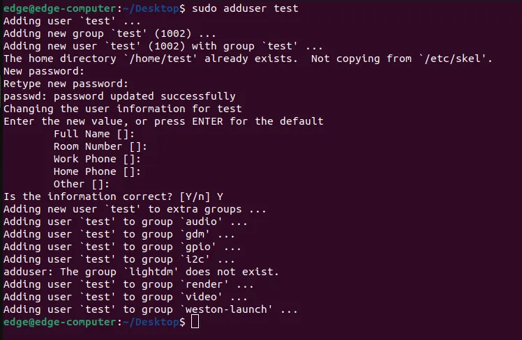</p>

<p align="center"><strong>Figure 4-1 Create User</strong></p>

### 4.1.2 Deleting Users

Open the desktop Terminal or right-click and select "Open in Terminal", and enter the following command to delete the user. Before deleting the user, please make sure the user exists. Deleting a user that does not exist will prompt: The user 'username' does not exist.

```
# Check if the test user exists
id test
# Delete the test user
sudo deluser test
```

<p align="center">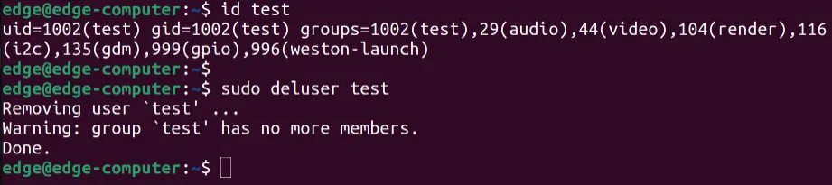</p>

<p align="center"><strong>Figure 4-2 Delete User</strong></p>

### 4.1.3 Disabling and Enabling Users

Open the desktop Terminal or right-click and select "Open in Terminal", and enter the following command to disable/enable the user. Before disabling/enabling the user, please make sure that the user exists. If the user does not exist, it will prompt: The user 'username' does not exist.

```
# Check if the test user exists
id test
# Disable the test user
sudo passwd -l test
# Enable the test user
sudo passwd -u test
# Query the status of the test user (L=disabled, P=enabled)
sudo passwd -S test
```

<p align="center">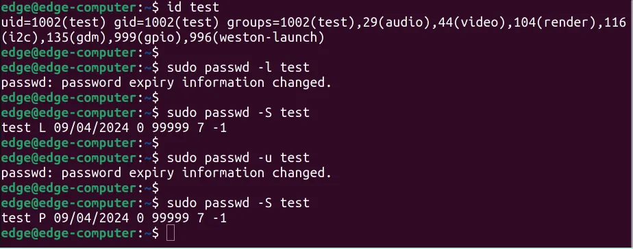</p>

<p align="center"><strong>Figure 4-3 Disable and Enable User</strong></p>

### 4.1.4 Advanced User Management Extension

Reference:

1. [Ubuntu Manpage: adduser, addgroup](https://manpages.ubuntu.com/manpages/xenial/en/man8/adduser.8.html)
2. [Ubuntu Manpage: deluser, delgroup](https://manpages.ubuntu.com/manpages/focal/en/man8/deluser.8.html)
3. [Ubuntu Manpage: passwd](https://manpages.ubuntu.com/manpages/bionic/man1/passwd.1.html)
4. [Ubuntu Manpage: usermod](https://manpages.ubuntu.com/manpages/trusty/en/man8/usermod.8.html)

## 4.2 Web Management based on IEOS

The EC5000 is based on the Ubuntu 22.04 system and supports network and system management using native Linux commands. For ease of user configuration, InHand has developed the IEOS system program, which provides a Web interface. Users can conveniently perform network and system management through the Web interface. It should be noted that when the IEOS function is enabled, IEOS takes over network and system management, and management through native Linux commands may fail. IEOS is enabled by default. If the user needs network and system management based on native Linux command line, IEOS must be disabled first.

IEOS adopts a design scheme separating status and configuration, divided into three functional sections: Network Management, System Management, and Status. Under the Network Management menu and System Management menu, only network and system configurations can be performed. Status information needs to be viewed on the Status page.

> **Important**: When using the IEOS program and native Linux commands simultaneously to manage network and system configuration, the two may affect each other and cause abnormal operating status. It is recommended that all configurations supported by IEOS be managed through the IEOS Web. For functions not supported by IEOS, such as VPN, they can be combined with native Linux commands to achieve the configuration goals.

### 4.2.1 Web Login

Considering that user applications may need to use the HTTP/HTTPS standard ports 80/443, IEOS uses port 9100 for HTTPS connections and does not support access via HTTP. When users attempt to access the Web via HTTP, they will be automatically redirected to HTTPS. This document uses the default address 192.168.4.100 on eth2 as an example for explanation. Users can click "Show Applications" -> "Firefox Web Browser" in the desktop system, enter `https://127.0.0.1:9100` to log in, or access the device configuration page through an external network.

Login URL: `https://192.168.4.100:9100`

Login username: adm

Password: 123456

> **Note**: When the IEOS program is enabled, some port numbers will be reserved for internal communication. The port number range is 9100 ~ 9200. After IEOS is enabled, user applications should avoid using these port numbers; otherwise, conflicts and abnormal functions may occur.

<p align="center"></p>

<p align="center"><strong>Figure 4-4 IEOS Web Login</strong></p>

### 4.1.2 Network Management

#### 4.1.2.1 Ethernet Interface

**Static IP Address Configuration (taking eth1 as an example)**

<p align="center">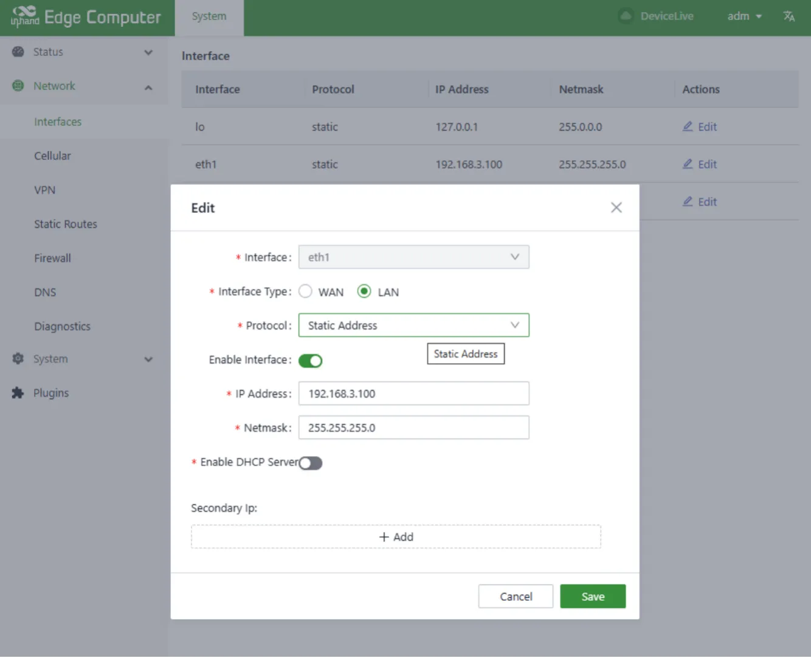</p>

<p align="center"><strong>Figure 4-5 Ethernet Static IP Configuration</strong></p>

**DHCP Client Configuration (taking eth1 as an example)**

<p align="center">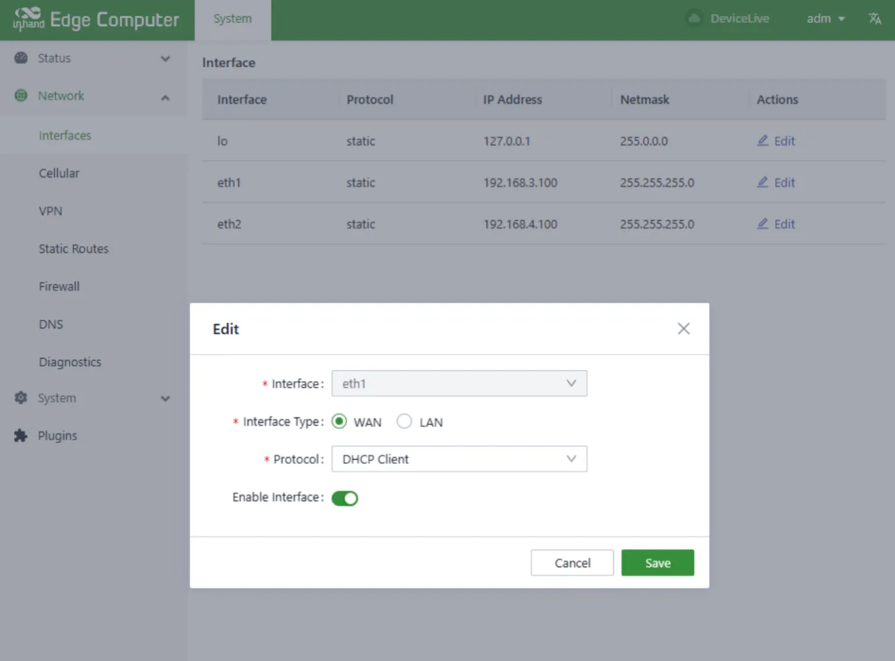</p>

<p align="center"><strong>Figure 4-6 Ethernet DHCP Client Configuration</strong></p>

**DHCP Server Configuration (taking eth1 as an example)**

Enable the DHCP server function on the eth1 interface and assign addresses to downstream devices on eth1.

<p align="center">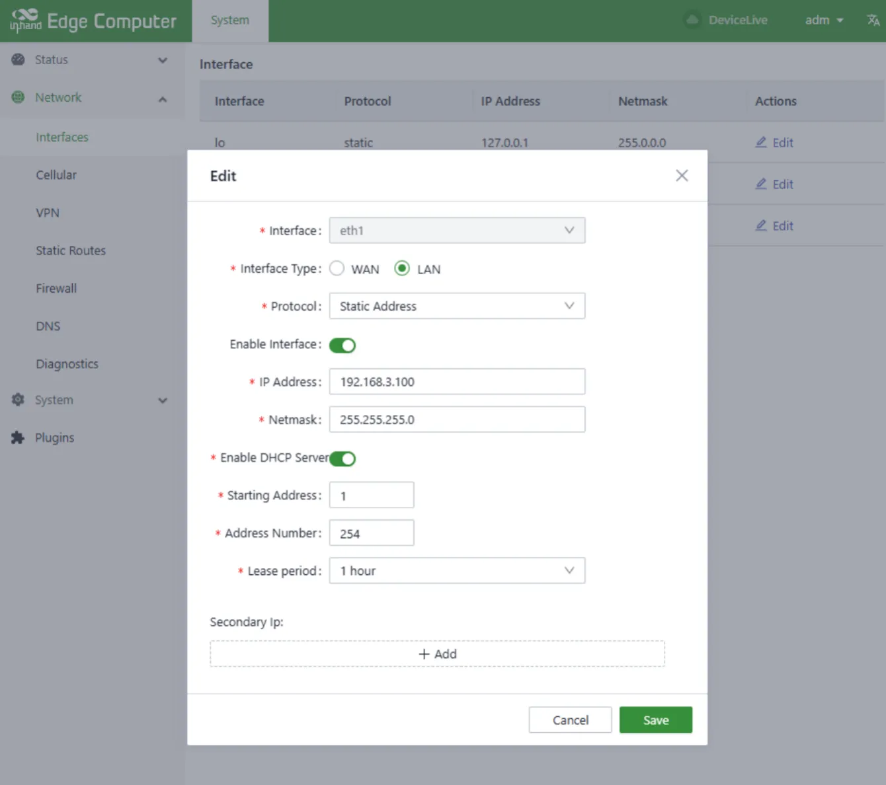</p>

<p align="center"><strong>Figure 4-7 DHCP Server Configuration</strong></p>

DHCP server configuration parameter description:

| Parameter | Description |
|-----------|-------------|
| Enable DHCP Server | DHCP server function switch |
| Starting Address | DHCP server address pool start base address. Network segment + starting address = start IP address of the address pool. In the example, the eth1 network segment is 192.168.3.0/24, the base address is 1, and the starting address of the address pool is 192.168.3.1/24. |
| Max Address Number | Maximum number of addresses in the address pool |
| Lease period | Lease period |

#### 4.1.2.2 Cellular network

<p align="center"></p>

<p align="center"><strong>Figure 4-8 Cellular Dialing Configuration</strong></p>

Cellular network parameter description:

| Parameter | Description |
|-----------|-------------|
| Enabled | Cellular function switch. Enabled by default. |
| Profiles | Dial-up parameter set, used to configure APN, username, password, and authentication mode. Non-private network cards usually do not require modification here. The dial-up parameter set can add up to 10 records. |
| Network Mode | Cellular network system. You can choose 3G, 4G, and other related network systems, such as LTE, WCDMA, etc. If it is not clear which network system to select, choose "Auto"; the program will automatically select the most appropriate network system. The default value is Auto. |
| Enable Default Route | Enable the add default route function. When enabled, a cellular port default route will be added when dialing is successful. Enabled by default. |
| Metric | Measure of cellular default routing. When the cellular, Wi-Fi, and Ethernet ports are all configured with default routes, the route with the smallest metric value takes effect. |

<p align="center">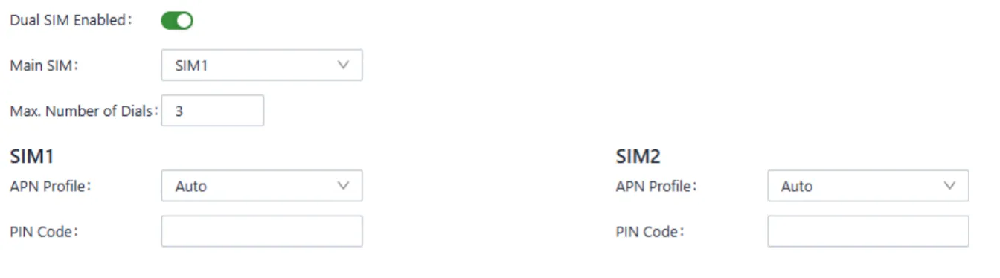</p>

<p align="center"><strong>Figure 4-9 Cellular Dual SIM Configuration</strong></p>

Dual-SIM parameter description:

| Parameter | Description |
|-----------|-------------|
| Dual SIM Enabled | Enable the dual-SIM function. The EC5000 supports dual-SIM single-dial to improve network reliability. Two SIM cards need to be inserted into the device. After this function is enabled, if SIM1 fails to dial due to reasons such as overdue fees, it will automatically switch to SIM2 for dialing. Disabled by default. |
| Main SIM | Primary SIM card. Dialing will use the selected SIM card. After dialing fails a certain number of times, it switches to the other SIM card. SIM1 is used by default. |
| Max Number of Dials | After the dual-SIM single-dial function is enabled, when the current dialing SIM card reaches the specified number of dial attempts, it switches to the other SIM card for dialing. |
| APN Profile | The dial-up parameter set of the SIM card. The default value is Auto. A private network card usually needs to configure the dial-up parameter set and select the corresponding Index here. |
| PIN Code | The PIN code of the SIM card. |

<p align="center">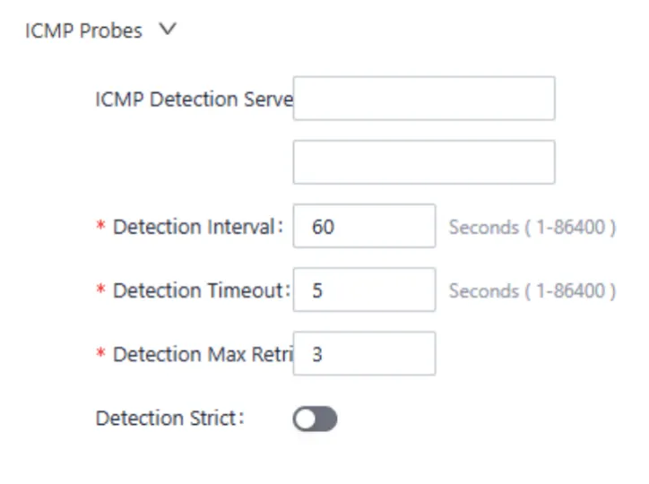</p>

<p align="center"><strong>Figure 4-10 Cellular ICMP Probe Configuration</strong></p>

Wireless cellular networks are relatively complex, and sometimes false dial-up connections occur, that is, the dial-up status shows successful but the target address cannot be pinged. When such situations occur, re-dialing can restore normal operation. IEOS cellular dialing supports ICMP probes to discover false connections. It is recommended that users enable ICMP detection when using cellular networking, so that it can be quickly restored when false connections occur.

ICMP probe parameter description:

| Parameter | Description |
|-----------|-------------|
| ICMP Detection Server Probes | ICMP probe address. Two probe addresses can be configured. As long as one address probe is successful, it means there is no false connection in the cell. The ICMP probe function is turned off when both addresses are not configured. |
| Detection Interval | How often the ICMP detection is performed. |
| Detection Timeout | ICMP detection timeout time. How long to wait without receiving the detection response message before the detection is considered a failure. |
| Detection Max Retries | Maximum number of probes. After reaching this number, redial is triggered. The value range is [1,5]. |
| Detection Strict | Whether to enable strict detection. When strict detection is closed, the detection program will detect whether the number of messages received by the cellular interface changes in each detection cycle. If there is a change, indicating that the cellular network is connected, the ICMP message will not be sent for detection, which can save some traffic. If strict detection is enabled, the ICMP detection message will be sent periodically regardless of whether the number of messages received by the cellular interface changes. Disabled by default. |

<p align="center">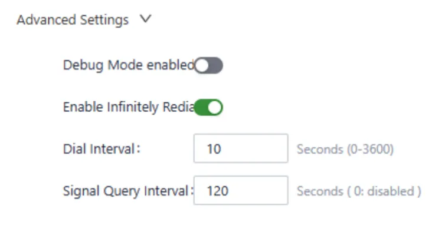</p>

<p align="center"><strong>Figure 4-11 Cellular Advanced Configuration</strong></p>

Advanced configuration parameter description:

| Parameter | Description |
|-----------|-------------|
| Debug Mode enabled | Whether to enable the debug function. After it is enabled, some dial-related debugging information will be added to the log. Disabled by default. |
| Enable Infinitely Redial | Enable infinite redial. In some cases, dialing is in an abnormal state and can be restored to normal by restarting the system. Infinite redial is disabled by default. When dialing fails a certain number of times, the system will restart to recover. Since dialing is on by default, some customers fail to dial without a SIM card, causing the system to restart. In this case, infinite redial can be enabled so that the system will not restart regardless of how many dial failures occur. |
| Dial Interval | Dial interval. The waiting time before the next dial when a dial fails. |
| Signal Query Interval | Signal query interval. When the signal is bad, false connections may arise. This can be addressed through the signal query interval. The dial program regularly detects the signal strength according to the signal detection cycle. |

#### 4.1.2.3 Wi-Fi  Configuration

<p align="center"></p>

<p align="center"><strong>Figure 4-12 Wi-Fi Station Configuration</strong></p>

Wi-Fi Station parameter description:

| Parameter | Description |
|-----------|-------------|
| Enable Wi-Fi | Enabling switch. Disabled by default. |
| Client SSID | The SSID to be connected. Can be entered manually or scanned for nearby SSIDs using the Scan button. |
| Enable Default Route | Whether to enable the default route function. A default route for the wlan port will be added. Enabled by default. |
| Metric | The measure of the default route of the Wi-Fi port. When the cellular port, Wi-Fi, and Ethernet port are all configured with default routes, the route with the smallest metric value takes effect. |
| Auth Method | Authentication mode. Supports No-certification, WPA-PSK, WPA2-PSK, WPA-PSK/WPA2-PSK Mixed. |
| Encrypt Mode | Encryption mode. Supports CCMP, TKIP, TKIP and CCMP. |
| WPA/WPA2 PSK Key | Key information. |

#### 4.1.2.4 Static Routing

This is the static route for Ethernet. When the default routes of Ethernet, cellular, and Wi-Fi are all configured, the default route with the smallest metric value takes effect. It is necessary to ensure that the metric values of the default routes are different.

<p align="center">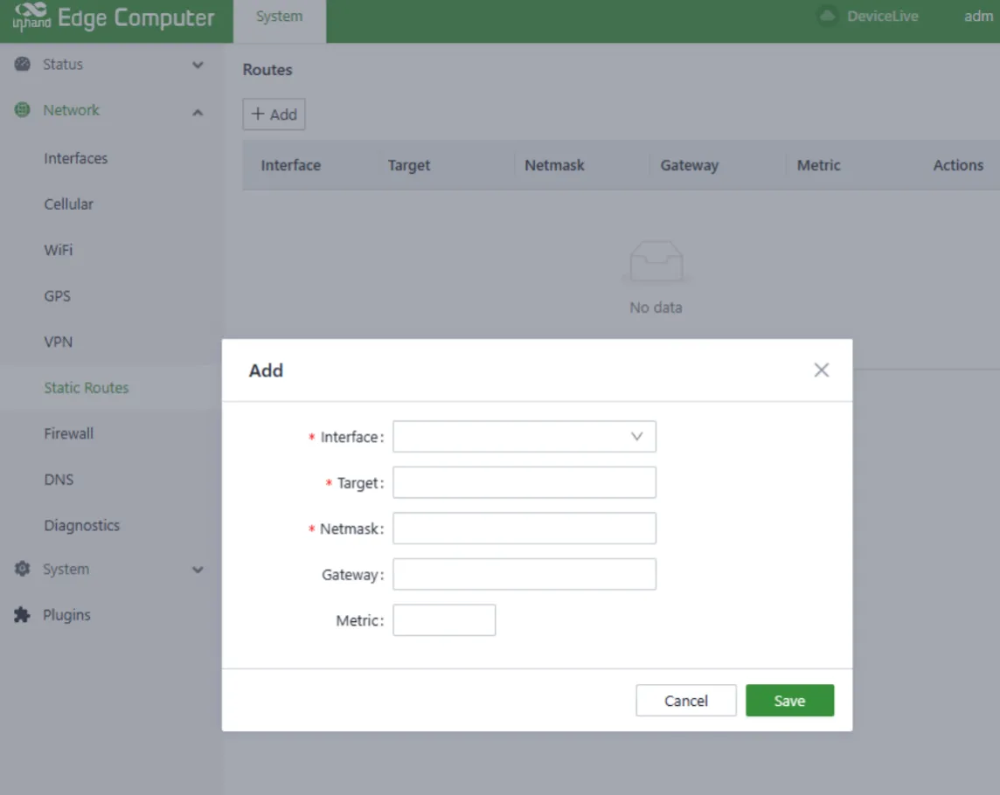</p>

<p align="center"><strong>Figure 4-13 Static Routing Configuration</strong></p>

Static routing configuration parameter description:

| Parameter | Description |
|-----------|-------------|
| Interface | Exit interface of static routing |
| Target | Target network |
| Netmask | Target network mask |
| Gateway | Next hop address |
| Metric | Metric value of static routing |

#### 4.1.2.5 Firewall

<p align="center">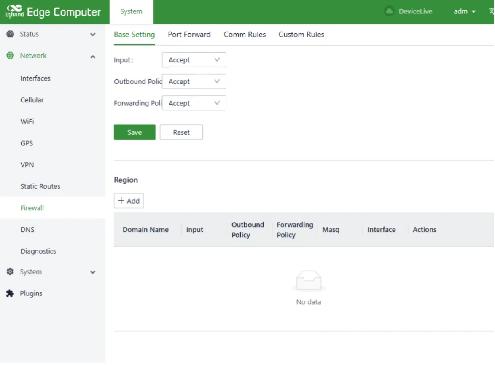</p>

<p align="center"><strong>Figure 4-14 Firewall Configuration</strong></p>

#### 4.1.2.6 DNS

<p align="center">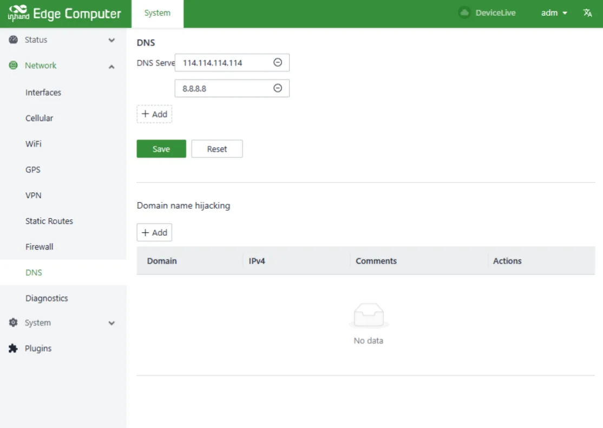</p>

<p align="center"><strong>Figure 4-15 DNS Configuration</strong></p>

DNS configuration parameter description:

| Parameter | Description |
|-----------|-------------|
| DNS Servers | DNS server addresses. Up to 4 can be configured. |
| Domain name hijacking | Domain name hijacking function, which can realize the binding between IP address and domain name. |

<p align="center">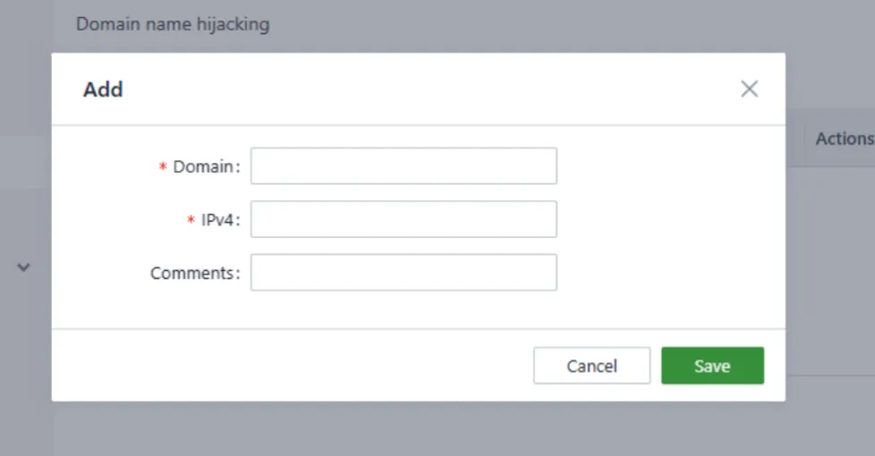</p>

<p align="center"><strong>Figure 4-16 DNS Hijacking Configuration</strong></p>

#### 4.1.2.7 Network Diagnosis

Network diagnosis supports Ping, Traceroute, and Nslookup functions.

<p align="center">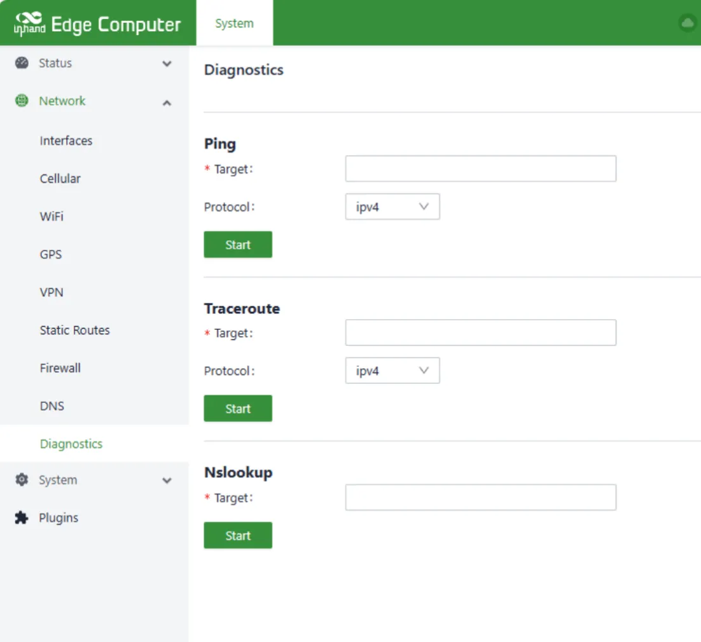</p>

<p align="center"><strong>Figure 4-17 Network Diagnosis</strong></p>

### 4.2.3 System Management

#### 4.2.3.1 Basic Configuration

**Cloud Management**

<p align="center">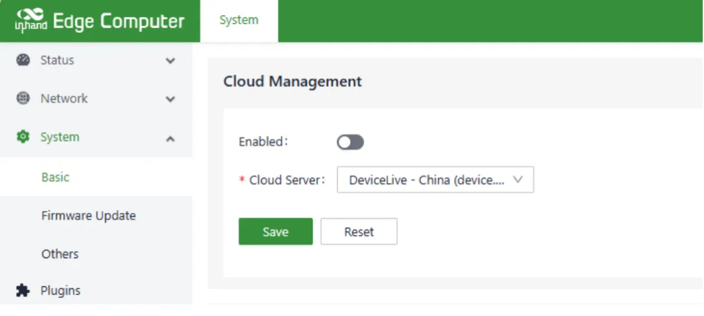</p>

<p align="center"><strong>Figure 4-18 Cloud Management Configuration</strong></p>

Cloud management parameter description:

| Parameter | Description |
|-----------|-------------|
| Enabled | DeviceLive platform power switch. DeviceLive is the remote monitoring and management platform for the device. |
| Cloud Server | The DeviceLive platform has two addresses: one for the domestic platform and one for the overseas platform. Select which platform to connect to here. |

**Time Zone and NTP Client**

<p align="center">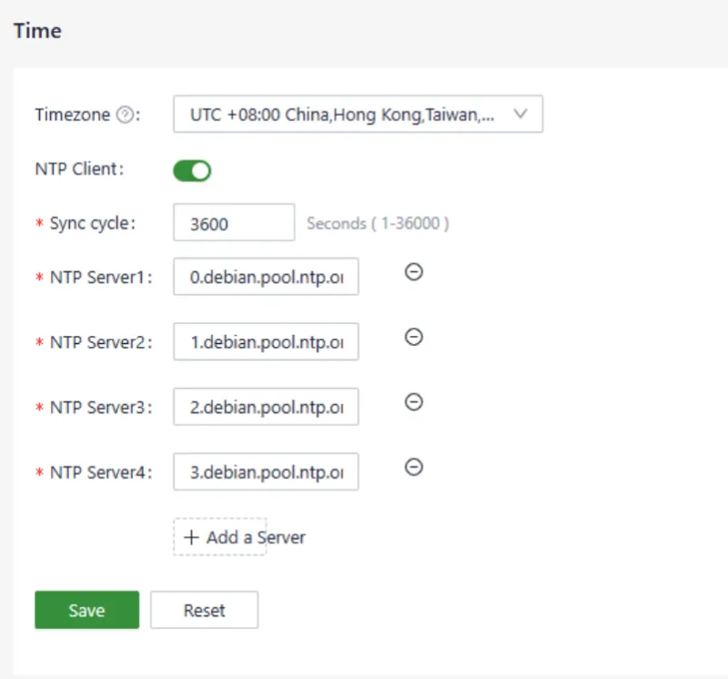</p>

<p align="center"><strong>Figure 4-19 Time Zone and NTP Configuration</strong></p>

Up to 10 NTP server addresses can be configured. The program periodically sends synchronization requests to each server address. After successful synchronization, the system time is written to the RTC, and no further requests are sent to the NTP server.

In addition to using NTP synchronization time, there is a synchronization button on the Device Info status page, but it is only available when the device time and the local time (the computer time used to access the device) differ by more than 3 seconds.

<p align="center"></p>

<p align="center"><strong>Figure 4-20 Configuration Import, Export, and Factory Reset</strong></p>

This area supports configuration import, export, and factory reset operations.

#### 4.2.3.2 Firmware Upgrade

<p align="center"></p>

<p align="center"><strong>Figure 4-21 Firmware Upgrade</strong></p>

The automatic restart option is disabled by default. After upgrading the firmware, the system needs to be restarted manually to take effect. When the automatic restart option is enabled, the system is automatically restarted after the firmware is upgraded.

#### 4.2.3.3 Others

<p align="center"></p>

<p align="center"><strong>Figure 4-22 System Restart and Reset</strong></p>

This page contains two functions: restart system and reset system. The reset system function needs to be used carefully. This function will restore the system configuration status and filesystem status to the same as the factory defaults. That is, software installed by the user will also be cleared.

### 4.2.4 Status

#### 4.2.4.1 Device Information

The device information status page displays the host name, device model, serial number, firmware version, kernel version, filesystem version, and usage profiles of CPU, memory, and disk space.

<p align="center"></p>

<p align="center"><strong>Figure 4-23 Device Information Status</strong></p>

#### 4.2.4.2 Cellular Dial Status

The cellular dial status page displays the SIM card information, IMEI, IMSI, ICCID, signal strength, and IP address, DNS.

<p align="center"></p>

<p align="center"><strong>Figure 4-24 Cellular Dial Status</strong></p>

#### 4.2.4.3 Wi-Fi Status

The Wi-Fi status page displays the IP address, gateway, and DNS information obtained after a successful Wi-Fi connection.

<p align="center"></p>

<p align="center"><strong>Figure 4-25 Wi-Fi Station Status</strong></p>

#### 4.2.4.4 DHCP Server Status

The DHCP server status page shows the device as DHCP server, the assigned IP address, client host name, client host MAC, and expiration time.

<p align="center"></p>

<p align="center"><strong>Figure 4-26 DHCP Server Status</strong></p>

#### 4.2.4.5 Route Status

The routing status page displays information about IPv4 direct routing, static routing, and routing neighbors.

<p align="center"></p>

<p align="center"><strong>Figure 4-27 Route Status</strong></p>

#### 4.2.4.6 Firewall Status

Firewall status information displays filtering rules, IP address mapping rules, and other information.

<p align="center"></p>

<p align="center"><strong>Figure 4-28 Firewall Status</strong></p>

#### 4.2.4.7 Log Information

The log page can be used to view system logs, user logs, and set the viewing log levels, including Error, Info, Debug, and more. The logs can also be downloaded locally.

<p align="center"></p>

<p align="center"><strong>Figure 4-29 Log Information</strong></p>

## 4.3 Ubuntu Graphical Interface Management

When using Linux command line for network configuration and system configuration, IEOS needs to be disabled first. IEOS is managed through systemctl. The method to shut down IEOS is as follows:

```
systemctl stop ieos_daemon
```

This shutdown is only effective for the current boot. After the system is restarted, the IEOS program will still start. To prevent the IEOS program from starting on boot, use the following method:

```
systemctl disable ieos_daemon
```

> **Note**: After IEOS is turned off, wireless networking functions such as dial-up and Wi-Fi require users to implement them based on native Linux commands, and the device cannot be remotely managed through the DeviceLive platform.

### 4.3.1 Ethernet Settings

**Settings Management**

Click the network icon on the top right corner of the desktop, select Ethernet -> Wired Settings; or click Show Applications -> Settings -> Network -> Ethernet on the bottom left corner of the desktop. Please choose to set eth1/eth2 according to the actual situation.

<p align="center"></p>

<p align="center"><strong>Figure 4-30 Ubuntu Ethernet Settings (1)</strong></p>

<p align="center"></p>

<p align="center"><strong>Figure 4-31 Ubuntu Ethernet Settings (2)</strong></p>

**On/Off Management**

Click Turn On/Turn Off or slide the button in the Ethernet settings to turn the network off or on.

<p align="center"></p>

<p align="center"><strong>Figure 4-32 Ubuntu Ethernet On/Off Management (1)</strong></p>

<p align="center"></p>

<p align="center"><strong>Figure 4-33 Ubuntu Ethernet On/Off Management (2)</strong></p>

**Static Configuration**

Click the Setup button, select IPv4/IPv6, select Manual for Method, fill in Address, Netmask, Gateway, DNS, and Routes according to the network conditions, and click Apply to save. After saving, please re-toggle the network to make the configuration take effect.

<p align="center"></p>

<p align="center"><strong>Figure 4-34 Ubuntu Static IP Configuration</strong></p>

**Dynamic Configuration**

Click the Setup button, select IPv4/IPv6, select Automatic (DHCP) for Method, and click Apply to save. After saving, please re-toggle the network to make the configuration take effect.

<p align="center"></p>

<p align="center"><strong>Figure 4-35 Ubuntu DHCP Configuration</strong></p>

### 4.3.2 Wi-Fi Settings

**Settings Management**

Click the network icon on the top right corner of the desktop, select Wi-Fi -> Wi-Fi Settings; or click Show Applications -> Settings -> Wi-Fi on the bottom left corner of the desktop.

<p align="center"></p>

<p align="center"><strong>Figure 4-36 Ubuntu Wi-Fi Settings (1)</strong></p>

<p align="center"></p>

<p align="center"><strong>Figure 4-37 Ubuntu Wi-Fi Settings (2)</strong></p>

**On/Off Management**

Click Turn On/Turn Off or slide the button in the Wi-Fi settings to turn Wi-Fi off or on.

<p align="center"></p>

<p align="center"><strong>Figure 4-38 Ubuntu Wi-Fi On/Off Management (1)</strong></p>

<p align="center"></p>

<p align="center"><strong>Figure 4-39 Ubuntu Wi-Fi On/Off Management (2)</strong></p>

**Scanning**

Scanning can be turned on via Wi-Fi -> Select Network, or the Wi-Fi Setting feature will automatically scan for visible Wi-Fi SSIDs in the neighborhood when turned on.

<p align="center"></p>

<p align="center"><strong>Figure 4-40 Ubuntu Wi-Fi Scanning (1)</strong></p>

<p align="center"></p>

<p align="center"><strong>Figure 4-41 Ubuntu Wi-Fi Scanning (2)</strong></p>

<p align="center"></p>

<p align="center"><strong>Figure 4-42 Ubuntu Wi-Fi Scanning (3)</strong></p>

**Connection**

Click the Settings button on the right side of the Wi-Fi network, enter the password, and click Connect to connect to the network.

<p align="center"></p>

<p align="center"><strong>Figure 4-43 Ubuntu Wi-Fi Connection</strong></p>

### 4.3.3 Cellular Network Settings

**Configuring Cellular ECM Mode**

Insert the SIM card into SIM1/SIM2, install the cellular antenna, open Terminal, and enter the following commands in order.

Cellular Network Settings:

```
# Access cellular AT command interface using 115200 baud rate
sudo sdebug /dev/ttyUSB2 115200
# Configure cellular ECM mode
AT+QCFG="usbnet",1
# Save and reboot cellular module
AT+CFUN=1,1
```

<p align="center"></p>

<p align="center"><strong>Figure 4-44 Cellular ECM Mode Configuration</strong></p>

**Switching SIM Card**

Open Terminal and enter the following command to switch the SIM card.

Switching SIM Card:

```
# Switch to root
sudo -s
# Switch to SIM1
echo 0 > /sys/class/gpio/PG.06/value
# Switch to SIM2
echo 1 > /sys/class/gpio/PG.06/value
```

<p align="center"></p>

<p align="center"><strong>Figure 4-45 Switching SIM Card</strong></p>

### 4.3.4 CAN FD Settings

Open Terminal and enter the following command to configure the CAN interface.

Configure CAN FD:

```
# Link up CAN interface
sudo ip link set can0 up type can bitrate 1000000 dbitrate 5000000 restart-ms 1000 fd on
```

<p align="center"></p>

<p align="center"><strong>Figure 4-46 CAN FD Configuration</strong></p>

### 4.3.5 Bluetooth Settings

** Settings Management**

Click the network icon on the top right corner of the desktop, select Bluetooth -> Bluetooth Settings; or click Show Applications -> Settings -> Bluetooth on the bottom left corner of the desktop.

<p align="center"></p>

<p align="center"><strong>Figure 4-47 Bluetooth Settings (1)</strong></p>

<p align="center"></p>

<p align="center"><strong>Figure 4-48 Bluetooth Settings (2)</strong></p>

**On/Off Management**

Click Turn On/Turn Off or slide the button in Bluetooth settings to turn Bluetooth off or on.

<p align="center"></p>

<p align="center"><strong>Figure 4-49 Bluetooth On/Off Management (1)</strong></p>

<p align="center"></p>

<p align="center"><strong>Figure 4-50 Bluetooth On/Off Management (2)</strong></p>

**Bluetooth Connection**

After turning on the Bluetooth switch, it will automatically scan for nearby Bluetooth devices. Click the Bluetooth device name to connect (for Bluetooth devices that require a PIN code, please enter the PIN code).

### 4.3.6 Advanced Network Settings Extension

Reference:

1. [Network Manager | Ubuntu](https://ubuntu.com/core/docs/networkmanager)
2. [Bluez Prerequisites | Ubuntu](https://ubuntu.com/core/docs/bluez/check-installation)


## 4.6 Advanced Configuration of the Peripheral Interface

### 4.6.1 Serial Port Management

The device supports two RS-232/422/485 optional serial ports, corresponding to the device nodes `/dev/ttyCOM1` and `/dev/ttyCOM2` respectively. Open Terminal and use the `uart_mode` command to switch the serial port operating mode.

| Serial Port Mapping |  |
|---------------------|--|
| COM1 | /dev/ttyCOM1 |
| COM2 | /dev/ttyCOM2 |

| uart_mode | COM1 | COM2 |
|-----------|------|------|
| Mode Switch | 485/422/232 | 485/422/232 |

For example, to configure COM1 to operate in RS-485 mode, enter the following command:

```
sudo uart_mode COM1 485
```

<p align="center"></p>

<p align="center"><strong>Figure 4-51 Serial Port Mode Switch</strong></p>

### 4.6.2 Digital Input/Output Management

The device supports 4 isolated digital inputs and 4 isolated digital outputs.

| DI/DO | Channel | GPIO Path |
|-------|---------|-----------|
| DI | DI0 | /sys/class/gpio/gpio308 |
| DI | DI1 | /sys/class/gpio/gpio309 |
| DI | DI2 | /sys/class/gpio/gpio310 |
| DI | DI3 | /sys/class/gpio/gpio311 |
| DO | DO0 | /sys/class/gpio/gpio312 |
| DO | DO1 | /sys/class/gpio/gpio313 |
| DO | DO2 | /sys/class/gpio/gpio314 |
| DO | DO3 | /sys/class/gpio/gpio315 |

## 4.5 Advanced

### 4.5.1 System Updates

Copy the system upgrade image to removable storage media or transfer it to the device via network, enter the following command to perform the system update operation, please be patient as the system update takes a long time.  

```
sudo update ota <update file>
```


<p align="center"><strong>Figure 4-52 System updates</strong></p>

### 4.5.2 System Reset

**Recovery flick switch reset**

The device has a Recovery flick switch button under the detachable bezel on the right panel, press and hold Recovery for 10 seconds during normal system operation and wait for the system status light to change from blinking to normally lit and release it, the device will enter the system reset state (restoring the system to the factory state), please refer to part 2.2.10 for detailed descriptions of the buttons;

**Command Reset**

Open Terminal and use the update command to perform a system reset.  

```
sudo update reset
```


<p align="center"><strong>Figure 4-53 System Reset</strong></p>

## 4.6 Security
### 4.6.1 TPM2.0

The device supports Trusted Platform Module 2.0 (TPM2.0) and is pre-installed with the tpm2-tools tool. Users can directly use instructions to operate the TPM2.0 module to achieve security functions.

Reference:

1. [tpm2-tools](https://tpm2-tools.readthedocs.io/en/latest/)
2. [tpm2-tools/man at master](https://github.com/tpm2-software/tpm2-tools/tree/master/man)

## 4.7 Programming Guide

Reference:

1. [Jetson - Embedded AI Computing Platform | NVIDIA Developer](https://developer.nvidia.com/embedded-computing)
2. [Jetson Software | NVIDIA Developer](https://developer.nvidia.com/embedded/develop/software)
3. [Jetson Software Getting Started | NVIDIA Developer](https://developer.nvidia.com/embedded/learn/getting-started-jetson)
4. [NVIDIA Developer Forums](https://forums.developer.nvidia.com/)

---

## Chapter 5 Typical Applications

### Case 1: Industrial AI Edge Vision Gateway

**Scenario Description**

In an industrial production line, the EC5000 serves as an edge AI vision gateway. It captures production line images through GMSL cameras, performs real-time AI inference (such as defect detection and object recognition) using the Jetson Orin module, and uploads the processing results to a cloud platform via cellular network or Ethernet. At the same time, remote device monitoring and management are achieved through DeviceLive.

**Device Role**: This device serves as an edge AI gateway, responsible for image acquisition, AI inference, protocol conversion, and data upload to the cloud. It also supports local and remote network management through IEOS/DeviceLive.

**Configuration Steps**:
1. Connect the GMSL camera to the GMSL 2.0 interface on the right panel of the device.
2. Install the cellular antenna and insert the SIM card to ensure cellular network availability.
3. Log in to the IEOS Web management interface and configure cellular dialing or Ethernet parameters to ensure the device can access the Internet.
4. In IEOS, configure the DeviceLive cloud management parameters to enable remote monitoring.
5. On the Ubuntu system, deploy the AI inference application and configure camera streaming and the inference pipeline.
6. Configure the serial port or CAN FD interface to connect to the PLC for production line control signal interaction.

**Reference Chapters**:
- [Cellular Dialing Configuration](#cellular-dialing-configuration)
- [Cloud Management](#basic-configuration)
- [Serial Port Management](#461-serial-port-management)
- [CAN FD Settings](#424-can-fd-settings)
- [Programming Guide](#49-programming-guide)

### Case 2: Remote Industrial Device Monitoring and Management

**Scenario Description**

In distributed industrial sites (such as substations, pumping stations, and environmental monitoring points), the EC5000 serves as a remote edge gateway. It collects on-site switch signals through DI/DO, collects sensor or instrument data through serial ports, and uses the cellular network to transmit data back to the central platform. Batch device remote operation and maintenance are achieved through DeviceLive.

**Device Role**: This device serves as a remote edge gateway, responsible for on-site data acquisition, protocol conversion, edge preprocessing, and data upload to the cloud. It also supports remote firmware upgrades and configuration management through DeviceLive.

**Configuration Steps**:
1. Install the cellular antenna and insert the SIM card to ensure cellular network availability.
2. Connect the on-site DI/DO signal lines to the corresponding terminals on the right panel of the device.
3. Connect sensors or instruments to the device via RS-485/RS-232 serial ports.
4. Log in to the IEOS Web management interface and configure cellular dialing parameters. Enable ICMP probes to ensure connection reliability.
5. In IEOS, configure the DeviceLive cloud management parameters and select the corresponding platform address.
6. On the Ubuntu system, deploy the data acquisition and forwarding application, and configure serial port communication parameters and DI/DO reading logic.

**Reference Chapters**:
- [Cellular Dialing Configuration](#cellular-dialing-configuration)
- [Cloud Management](#basic-configuration)
- [Digital Input/Output Management](#462-digital-inputoutput-management)
- [Serial Port Management](#461-serial-port-management)
- [System Update and Reset](#45-system-update-and-reset)

---

## Appendix A Troubleshooting

### 1 Network Connection Issues

| Symptom | Possible Cause | Troubleshooting Steps | Reference Chapter |
|---------|---------------|----------------------|-------------------|
| Unable to connect to cellular network | SIM card not inserted or poor contact | 1. Check whether the SIM card is correctly inserted into the SIM1/SIM2 slot<br>2. Reinsert the SIM card | [SIM Card Installation](#226-sim-card-installation) |
| Unable to connect to cellular network | APN parameter configuration error | 1. Verify whether APN parameters match operator requirements<br>2. Contact the operator to obtain the correct APN parameters | [Cellular Dialing Configuration](#cellular-dialing-configuration) |
| Unable to connect to cellular network | Weak signal or no signal | 1. Check whether cellular antennas are installed and tightened<br>2. Adjust device position to obtain a stronger signal | [Antenna Installation](#225-antenna-installation) |
| Unable to connect to cellular network | False dial-up connection | 1. Enable the ICMP probe function in IEOS<br>2. Configure a reliable probe address and save | [Cellular Dialing Configuration](#cellular-dialing-configuration) |
| Wi-Fi connection failure | Incorrect SSID or password | 1. Confirm that the entered SSID and password are correct<br>2. Rescan and connect | [Wi-Fi Station Configuration](#wi-fi-station-configuration) |
| Wi-Fi connection failure | Weak signal or no signal | 1. Confirm that the Wi-Fi function is turned on<br>2. Move the device to an area with stronger signal | [Wi-Fi Client Network Access](#scenario-5-wi-fi-client-network-access) |
| Ethernet unable to communicate | Incorrect IP address configuration | 1. Confirm that the device and peer are on the same network segment<br>2. Check IP address, subnet mask, and gateway configuration | [Ethernet Interface Configuration](#ethernet-interface-configuration) |
| Ethernet unable to communicate | Physical connection abnormal | 1. Check whether the network cable is firmly inserted<br>2. Confirm that the port indicator status is normal | [Ethernet Settings](#421-ethernet-settings) |

### 2 System Access Issues

| Symptom | Possible Cause | Troubleshooting Steps | Reference Chapter |
|---------|---------------|----------------------|-------------------|
| Unable to open IEOS Web interface | Incorrect IP address or port | 1. Confirm that the host and device are on the same network segment<br>2. Check that the URL is https://<IP>:9100 | [Getting Started with IEOS Web Management](#scenario-3-getting-started-with-ieos-web-management) |
| Unable to open IEOS Web interface | IEOS not running | 1. Log in to the device via SSH<br>2. Execute systemctl status ieos_daemon to confirm IEOS status | [Web Login](#411-web-login) |
| SSH connection failure | Network unreachable | 1. Confirm that the host and device IPs are on the same network segment<br>2. Check firewall settings | [Remote SSH Connection Management](#scenario-2-remote-ssh-connection-management) |
| SSH connection failure | Incorrect username or password | 1. Verify that the username and password match the device nameplate<br>2. Confirm correct case and special character input | [Remote SSH Connection Management](#scenario-2-remote-ssh-connection-management) |
| HDMI no display | Cable or monitor issue | 1. Check whether the HDMI cable is securely connected<br>2. Confirm that the monitor input source is correctly selected | [Local Login via HDMI](#scenario-1-local-login-via-hdmi) |
| Unable to log in to system | Incorrect username or password | 1. Verify that the username and password match the device nameplate<br>2. Confirm correct case input | [Local Login via HDMI](#scenario-1-local-login-via-hdmi) |

### 3 LED Indicator Abnormalities

| Symptom | Possible Cause | Troubleshooting Steps | Reference Chapter |
|---------|---------------|----------------------|-------------------|
| Power indicator off | Power not connected or power supply failure | 1. Check the power adapter and DC-IN connection<br>2. Confirm that the power adapter output voltage is within the DC 9-36 V range | [Power Connection](#224-power-connection) |
| System status LED off | System not started or boot failure | 1. Confirm that the power indicator is solid on<br>2. Check whether the power supply power meets the load requirements | [System Status LED](#14-led-indicator-description) |
| System status LED not flashing | System operating abnormally | 1. Wait for the system to complete booting (first boot takes a long time)<br>2. Try power cycling or restoring factory settings | [Factory Reset](#15-factory-reset) |

### 4 Peripheral Communication Issues

| Symptom | Possible Cause | Troubleshooting Steps | Reference Chapter |
|---------|---------------|----------------------|-------------------|
| Serial communication abnormal | Serial port mode mismatch | 1. Confirm that the serial port mode matches the peer device<br>2. Use the uart_mode command to switch modes again | [Serial Port Management](#461-serial-port-management) |
| Serial communication abnormal | Improper RS-485 termination resistor configuration | 1. Check the RS-485 DIP switch configuration<br>2. Confirm that termination resistors are enabled at both ends of the bus | [RS-485 DIP Switches](#16-rs-485-dip-switches) |
| CAN FD unable to communicate | Baud rate or sample point mismatch | 1. Confirm that baud rate and sample point match the peer device<br>2. Check the CAN FD termination resistor (onboard 120 ohm) | [CAN FD Settings](#424-can-fd-settings) |
| No DI state change | Incorrect wiring method | 1. Confirm correct dry contact/wet contact wiring<br>2. Check whether wet contact voltage is within the valid range | [Digital Input/Output Management](#462-digital-inputoutput-management) |
| DO no output | Abnormal load or wiring | 1. Confirm correct DO wiring<br>2. Confirm that load voltage and current are within specification (Sink 60 VDC, 1.3 A max./Channel) | [Digital Outputs](#112-digital-outputs-interface) |

### 5 System Operation Issues

| Symptom | Possible Cause | Troubleshooting Steps | Reference Chapter |
|---------|---------------|----------------------|-------------------|
| System repeatedly restarts | Dial failure triggering system restart | 1. Check whether the SIM card is inserted and not overdue<br>2. Enable the infinite redial function in IEOS | [Cellular Advanced Configuration](#cellular-advanced-configuration) |
| System repeatedly restarts | Insufficient power supply | 1. Confirm that the power adapter power meets the total load requirements<br>2. When multiple USB ports are fully loaded, it is recommended to use a 12 V/120 W or above power supply | [Power Connection](#224-power-connection) |
| Firmware upgrade failure | Hardware watchdog not disabled | 1. Disable the hardware watchdog before flashing the system<br>2. Press and hold the Reset button for more than 3 seconds to restart and disable the watchdog | [Reset Button](#18-reset-button) |
| Firmware upgrade failure | Upgrade package incorrect or corrupted | 1. Confirm that the upgrade package matches the device model<br>2. Re-download or copy the upgrade package and verify it | [System Update](#system-update) |

---

## Appendix B Safety Precautions

1. The device must be installed by a skilled person. Use copper conductors only.
2. Before connecting power, confirm that the voltage meets the device specification requirements (DC 9-36 V).
3. When multiple USB interfaces are operating at full load, it is recommended to select a 12 V (or above) / 120 W (or above) power adapter.
4. The device should be used within the specified temperature and humidity range (operating temperature: -20 ~ 60 degrees C; operating humidity: 95% at 40 degrees C, non-condensing).
5. Do not use this device in flammable or explosive environments.
6. Before flashing the system, the hardware watchdog must be disabled to avoid unexpected reboots causing flashing failure.
7. The system grounding screw must be reliably connected to the grounding terminal using a green-yellow grounding wire (16AWG).
8. Non-professionals should not disassemble the device casing without authorization.

> **Warning**: High-voltage circuits exist inside the device. Non-professionals should not open the device casing. Risk of electric shock.

---

## Appendix C Command Line Reference

### 1 Common Commands

| Command | Function | Example |
|---------|----------|---------|
| `ecversion` | Query system version number | `sudo ecversion` |
| `ecversion -all` | Query detailed version information | `sudo ecversion -all` |
| `adduser` | Create system user | `sudo adduser test` |
| `deluser` | Delete system user | `sudo deluser test` |
| `passwd -l` | Disable user | `sudo passwd -l test` |
| `passwd -u` | Enable user | `sudo passwd -u test` |
| `passwd -S` | Query user status | `sudo passwd -S test` |
| `uart_mode` | Switch serial port operating mode | `sudo uart_mode COM1 485` |
| `update ota` | Perform system OTA upgrade | `sudo update ota <update file>` |
| `update reset` | Restore system to factory state | `sudo update reset` |
| `systemctl stop ieos_daemon` | Stop IEOS service | `systemctl stop ieos_daemon` |
| `systemctl disable ieos_daemon` | Prevent IEOS from starting on boot | `systemctl disable ieos_daemon` |
| `ip link set can0 up` | Enable CAN FD interface | `sudo ip link set can0 up type can bitrate 1000000 dbitrate 5000000 restart-ms 1000 fd on` |
| `sdebug` | Access cellular AT command interface | `sudo sdebug /dev/ttyUSB2 115200` |

### 2 Cellular AT Command Examples

```
# Configure cellular ECM mode
AT+QCFG="usbnet",1

# Save and reboot cellular module
AT+CFUN=1,1
```

### 3 GPIO Operation Examples

```
# Switch to root
sudo -s

# Switch to SIM1
echo 0 > /sys/class/gpio/PG.06/value

# Switch to SIM2
echo 1 > /sys/class/gpio/PG.06/value
```

---

## FAQ Frequently Asked Questions

### Q1: How to handle conflicts between IEOS and native Linux command configuration?

1. When IEOS is enabled, it takes over network and system management. Configurations modified through native Linux commands may be overwritten by IEOS.
2. It is recommended that all configurations supported by IEOS be managed through the IEOS Web.
3. If full native Linux command management is required, disable IEOS first: execute `systemctl stop ieos_daemon` to stop the service, and execute `systemctl disable ieos_daemon` to prevent it from starting on boot.
4. After IEOS is disabled, wireless functions such as cellular dialing and Wi-Fi require users to implement them based on native Linux commands, and the DeviceLive remote management platform cannot be used.

### Q2: How to toggle the hardware watchdog enable/disable state?

1. **Enable hardware watchdog**: While the system is running normally, press the Reset button and release it within 3 seconds. The system will restart and the hardware watchdog will be enabled.
2. **Disable hardware watchdog**: While the system is running normally, press and hold the Reset button for more than 3 seconds and then release it. The system will restart and the hardware watchdog will be disabled.
3. **Important**: Before flashing the system, the hardware watchdog must be disabled. Otherwise, the watchdog timeout restart may cause flashing failure.

### Q3: What is the switching logic of the dual-SIM single-dial function?

1. The dual-SIM single-dial function requires two SIM cards to be inserted into the device, and "Dual SIM Enabled" to be enabled in IEOS.
2. The system uses the primary SIM card (Main SIM, default SIM1) for dialing by default.
3. When the primary SIM card dial failure reaches the "Max Number of Dials" set value, it automatically switches to the other SIM card for dialing.
4. If the other SIM card dials successfully, it will continue to use that card. If it fails, it will continue to attempt switching.

### Q4: What serial port modes does the device support? How to switch?

1. The device provides 2 RS-232/422/485 switchable serial ports (COM1/COM2), corresponding to device nodes `/dev/ttyCOM1` and `/dev/ttyCOM2`.
2. Use the `uart_mode` command to switch serial port modes. For example: `sudo uart_mode COM1 485` switches COM1 to RS-485 mode.
3. Supported modes: RS-232, RS-422, RS-485.
4. When using RS-485, the pull-up, pull-down, and termination matching resistors can be enabled/disabled through the DIP switches on the right panel.

### Q5: How to recover if system update fails or the device becomes bricked?

1. Before system update, it is recommended to back up important data.
2. If the system update fails, try using the Recovery button to restore factory settings: While the system is running, press and hold the Recovery button for 10 seconds until the system status LED changes from flashing to solid on, then release.
3. If the system cannot boot normally, use the USB 2.0 Type-C interface to connect to a host and enter firmware flashing mode to reflash the system.
4. Method to enter firmware flashing mode: Press and hold the Recovery button, then restart the system (via the Reset button, `reboot` command, or power cycling).

