Edge computer EC940 series 

Quick Start Guide

Version 1.0 May 2024 

[www.inhand.com](http://www.inhand.com) 

The software described in this manual is provided under a license agreement and can only be used in accordance with the terms of that agreement. 

Copyright Statement

© 2024 InHand Network reserves all rights. 

Trademark 

The InHand logo is a registered trademark of InHand Network. 

All other trademarks or registered trademarks in this manual belong to their respective manufacturers. 

Disclaimers

Our company reserves the right to make changes to this manual, and any subsequent changes to the product will not be notified separately. We are not responsible for any direct, indirect, intentional or unintentional damage or hidden dangers caused by improper installation or use.   

# 1 Product Introduction

EC942 series edge computer is a lightweight AI accelerated edge computer launched by InHand for the industrial Internet of Things. It is equipped with ARM Cortex- A55@2.0GHz A quad core processor, equipped with 4GB RAM and 16GB eMMC as standard, provides a powerful computing platform. This product adopts a distributed Linux system, providing users with a flexible and diverse secondary development environment. Support security features such as Secure Boot and TPM2.0 to ensure software and data security. Built in InHand DeviceSupervisor ™ The Agent (DSA) service enables easy data collection, processing, and cloud deployment, and supports DeviceLive cloud management.

# 2 Packing list 

| Number | Name | Quantity | Remarks |
| --- | --- | --- | --- |
| 1 | EC942 Host | 1 | — |
| 2 | Power Adapter | 1 | Optional Equipment |
| 3 | Wi-Fi Antenna | 1 | Standard Equipment (Depending on the device model) |
| 4 | GNSS Antenna | 1 | Standard Equipment (Depending on the device model) |
| 5 | Cellular Antenna | 1 | Standard Equipment (Depending on the device model) |
| 6 | Warranty Card | 1 | — |

# 3 Product Appearance 

The panel layout of EC942 is as follows:

## 3.1 Right panel 

## 3.2 Front panel 

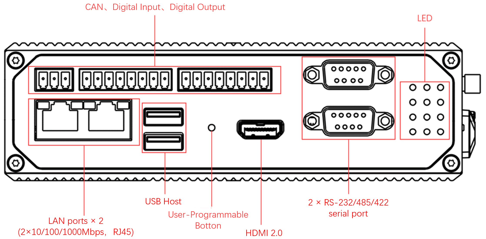

# 4 Description of indicator lights 

EC942 has 12 LED lights that respectively indicate the power supply and system operation status.   

| Led | Name | Definition |
| --- | --- | --- |
| PWR | Power indicator | Power on and always on |
| STATUS | System operating status indicator light | When the system starts normally, the STATUS flashes. If the system fails to start due to an exception in the system startup phase, or when the factory recovery operation has not been completed, STATUS is solid off. |
| WARN | Warning indicator light | When the system has a warning abnormality, the WARN light flashes. Warning abnormalities include: the factory reset has not been completed; and the dialing abnormality (the cellular function needs to be turned on). |
| Error | Error indicator light | When an Error occurs, the error indicator flashes. Errors include: Factory restoration is not complete. |
| SIM1 | SIM1 card indicator | Select SIM card 1 for dialing, select SIM card 2 for dialing or turn off dialing, long off. |
| SIM2 | SIM1 card indicator light, always on if selected | When SIM card 2 is selected for dialing, it is always on. When SIM card 1 is selected for dialing or dialing off, it will be long off. |
| User1 | User Programmable indicator LED 1 | It is off by default and can be controlled by user programming |
| User2 | User Programmable indicator LED 2 | It is off by default and can be controlled by user programming |
| 4G/5G | Cellular connection status indicator | Keep on after successful dialing |
| L1 | Cellular signal strength | See Cellular Signal Strength Indicator instructions |
| L2 | Cellular signal strength |
| L3 | Cellular signal strength |

  

Cellular network signal strength indicator light   

| LED | No signal | Weak signal (RSSI < -90) | Moderate signal (-90 <= RSSI < -70) | Strong signal (RSSI >= -70) |
| --- | --- | --- | --- | --- |
| L1 | OFF | ON | ON | ON |
| L2 | OFF | OFF | ON | ON |
| L3 | OFF | OFF | OFF | ON |

  

In addition to the combination of L1, L2, and L3 signal lights to indicate cellular signal strength, there is also a set of LED combinations to indicate the process of factory restoration.  

| LED | STATE |
| --- | --- |
| WARN | Blinking |
| Error | Blinking |
| STATUS | OFF |

  

After restoring the factory settings, the system will undergo a restart. After the restart is completed, the factory reset is not complete. At this time, the WARN light and ERROR flash, and the STATUS goes out. In this state, the device cannot be powered off, otherwise it may cause some files to be lost and affect system functions. This state will last for 30 seconds. After the factory is restored, WARN and ERROR will turn off, and STATUS will flash. 

# 5. Install EC942 

## 5.1 DIN rail installation

The installation plate of the DIN rail is attached to the EC942 rear panel (fixed with M3 × 6MM screws). The installation steps are as follows:   
1. Insert the top of the DIN rail into the slot above the bracket 

2\. Slowly push the device forward in the direction of the bracket to ensure that the bottom of the DIN rail clicks into place 

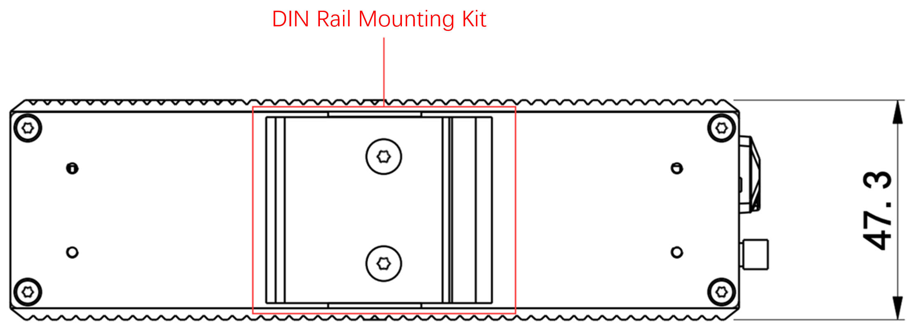   

## 5.2 Wall mounted installation

EC942 can be installed using a wall mounted kit, which needs to be purchased separately. There are two types of wall mounting methods, and the steps are as follows:   
Wall mounting installation method 1: Install the wall mounting kit on the back panel of EC942 

Step 1: Use screws to secure the wall mounting kit to the back panel of EC942

Step 2: After the wall mounted kit is successfully fixed to EC942, use 4 M6 screws to fix the equipment to the wall or cabinet 

Wall mounting method 2: Install the wall mounting kit on the left and right panels 

Step 1: Fix the wall mounted installation kit to the left and right panels with screws respectively      

After fixation, as shown in the figure:

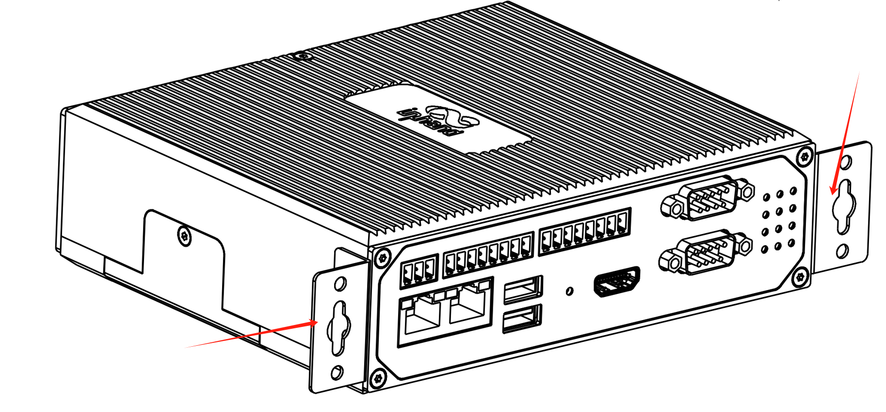

Step 2: After the wall mounted installation kit is successfully installed on the EC942 panel, use 4 M3 and 2 M6 screws to fix the EC942 to the wall or cabinet.   

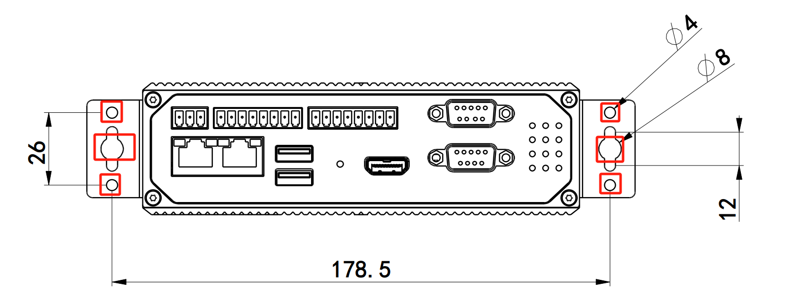  

# 6 Connector Description 

## 6.1 Ethernet Interface

EC942 has 2 RJ45 Ethernet ports, supporting 10M/100M/1000M adaptive rates. The pin description of RJ45 is as follows:  

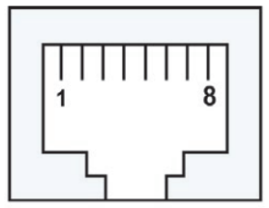  

  

| RJ45 pin number | 10M/100M | 1000M |
| --- | --- | --- |
| 1 | TX+ | TRD (0)+ |
| 2 | TX- | TRD (0)- |
| 3 | RX+ | TRD (1)+ |
| 4 | \- | TRD (2)+ |
| 5 | \- | TRD (2)- |
| 6 | RX- | TRD (1)- |
| 7 | \- | TRD (3)+ |
| 8 | \- | TRD (3)- |

## 6.2 Serial port 

EC942 supports two DB9 serial ports and supports RS-232, RS-485, or RS-422 communication. The software is configurable.

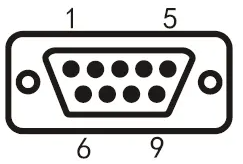

| DB9 pin number | Pin Name | Pin Definition |
| --- | --- | --- |
| 1 | \- | \- |
| 2 | RS-232 RxD/RS-422 TxD+ | RS-232 receive/RS-422 send positive |
| 3 | RS-232 TxD/RS-485 B/RS-422 RxD- | RS-232 sending/RS-485 signal B/RS-422 receiving negative |
| 4 | \- | \- |
| 5 | GND | RS-232 grounding |
| 6 | \- | \- |
| 7 | RS-485 A/RxD+ | RS-485 signal A/RS-422 receiving positive |
| 8 | RS-422 TxD- | RS-422 transmission negative |
| 9 | \- | \- |

## 6.3 CAN port 

EC942 has one CAN bus interface and supports CAN 2.0A/B standard. It is compatible with CAN FD and can reach a maximum speed of 5Mbps. 

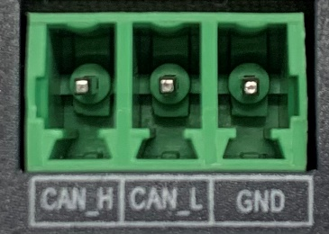  

| Identification | function |
| --- | --- |
| CAN-H | CAN high-level data cable |
| CAN-L | CAN low-level data line |
| GND | Grounding |

Remark:

Not all EC942 models support CAN interface. Please refer to the "Ordering Guide" section of the EC942 Edge Computer\_Prdt Spec for specific support. 

## 6.4 Digital input interface 

| Interface identification | Features | Description |
| --- | --- | --- |
| PCOM | Power supply common terminal | 4-way digital input DI,  Dry contact state  "1" : Closed dry contact state    "0" : disconnected    Wet contact state "1" :+10~+30V/-30 ~ -10VDC  Wet contact state "0" : 0 ~ +3V/-3 ~ 0V  Isolate 3000VDC |
| DGND | Power reference ground |
| DICOM | Input public side |
| DI0 | Digital input port 0 |
| DI1 | Digital input port 1 |
| DI2 | Digital input port 2 |
| DI3 | Digital input port 3 |
| NC | nothing |

Wiring is as follows：  

  
  
  

## 6.5 Digital output interface

| Interface Identification | Features | Description |
| --- | --- | --- |
| DO0 | Digital output port 0 | 4-way digital onput DO,    Isolated 3000VDC |
| DGND | Power reference ground |
| DO1 | Digital output port 1 |
| DGND | Power reference ground |
| DO2 | Digital output port 2 |
| DGND | Power reference ground |
| DO3 | Digital output port 3 |
| DGND | Power reference ground |

The wiring method is as follows:  

  

**Remark:**  

Not all EC942 models support digital input/output interfaces. Please refer to the "Ordering Guide" section of the EC942 Edge Computer\_Prdt Spec for specific support.   

## 6.6 USB interface   

EC942 provides two USB 2.0 Host interfaces, mainly used for expanding storage devices, connecting mice, and keyboards.

EC942 supports hot swapping of USB storage devices. It will automatically mount all partitions. EC942 will partition all USB storage devices and mount them to the/mnt/path. The naming format for the mounting folder is usb1<node>\_<num>. Among them,<node>is the device node name of the partition, and<num>can be a number from 0 to 9.

Attention:

Before disconnecting a USB mass storage device, remember to enter the sync synchronization command to prevent data loss. When you disconnect the storage device, please exit from the/media/\* directory. If you stay in/media/USB \*, the automatic uninstallation process will fail. If this situation occurs, please type umount/media/USB \* to manually uninstall the device. 

## 6.7 User programmable button

EC942 provides an API interface, which users can call to detect the status of programmable buttons and then implement their own button logic. 

## 6.8 DC Input

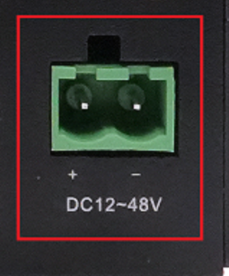

EC942 supports 12-48 VDC power supply. After removing the built-in power adapter from the accessory box, insert the adapter terminal into the DC port of EC942, and then connect the power adapter. When the PWR power indicator light remains on, it indicates that the device has been powered on normally. 

## 6.9 Micro SD/SIM card slot 

  

EC942 supports 2 SIM card slots for cellular communication and 1 Mirco SD card slot for expanding device capacity. Both SIM cards and Micro SD cards do not support hot swapping and need to be plugged and unplugged in the event of a power outage. Before installation, screws and protective covers need to be removed. Press and insert the SIM card or Micro SD card into the card slot. After inserting the SD card and powering on the device, the system will automatically mount all partitions to the/mnt/path, and the naming format of the mounting folder is sd\_<node>\_<num>.

## 6.11 Antenna interface 

EC942 has a total of 7 antenna interfaces, and the number of antennas standard for different models varies. See the "Ordering Information" section of the EC942 Series Edge Computer Product Specification for the antenna support corresponding to the specific model. 

| Identification | Name |
| --- | --- |
| ANT1 | 4G LTE main antenna/5G antenna |
| ANT2 | 4G LTE diversity receiving antenna/5G antenna |
| GNSS | GNSS antenna |
| ANT3 | 5G antenna |
| ANT4 | 5G antenna |
| Wi-Fi1 | Wi-Fi antenna |
| Wi-Fi2 | Wi-Fi antenna |

The product model shown in the figure is EC942-H-LQA8-B, which supports 7 antenna interfaces. Simply screw the required antenna into the corresponding SMA antenna interface to complete the antenna installation, as shown in ANT1. 

## 6.12 DIP Switch 

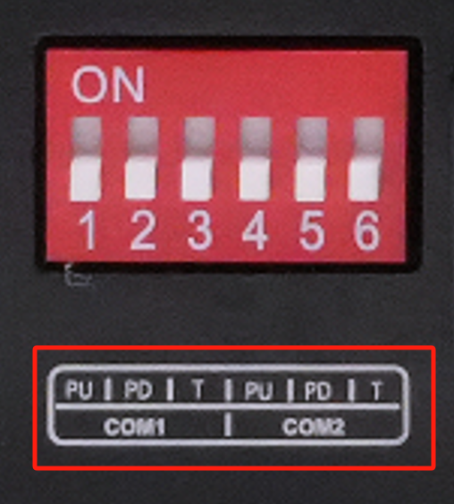

The dial switch controls the pull-up and pull-down resistors of the 485 bus, and can be selected to increase the number of loaded devices on the 485 bus.

| Identification | Function Description |
| --- | --- |
| PU | ON - Enable pull-up resistance; OFF - disable pull-up resistor |
| PD | ON - Enable pull-down resistor; OFF - disable pull-down resistor |
| T | ON - Enable terminal matching resistance; OFF - disable terminal matching resistor |

## 6.13 mSATA hard drive interface 

EC942 supports mSATA hard drives, which are not equipped by default at the factory. If users have high-capacity storage needs and need to purchase mSATA hard drives themselves, they can also consult InHand for mSATA purchasing. 

The installation steps are as follows:

Step 1: Use a screwdriver to open the protective case of the hard drive, and after disassembly, it is shown in the following figure: 

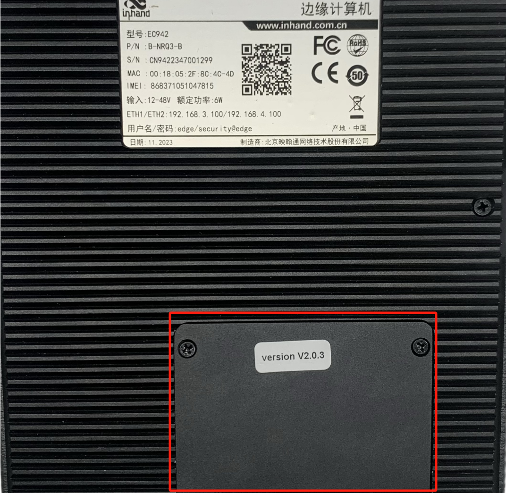  

Step 2: Align the hard drive with the slot, push it to the right and snap it into place; Remove the screw (M2) to secure the left side of the hard drive. 

  

Step 3: Reinstall the removed protective casing back into EC942

# 7 Power and Environmental requirements 

| Input Voltage | 9-48 VDC (dual pin terminals, V+, V -) |
| --- | --- |
| **Power** | Standby power: 120mA-200mA@12V |
| Working power: 150mA-320mA@12V |
| Peak power: 320mA@12.0V |
| **Working Temperature** | \-20-70 ℃ (-4-158 ℉) |
| **Storage Temperature** | \-40-85℃（\-40-185℉） |
| **Ambient Humidity** | 5~95% (without frost) |

# 8 Accessing EC942 

Connect to EC942 using the following default IP address.   

| Port | Default IP |
| --- | --- |
| ETH 1 | 192.168.3.100 |
| ETH 2 | 192.168.4.100 |

Step 1: Interconnect EC942 with PC 

Insert one end of the Ethernet cable into any network port of EC942 as shown in the figure below, and the other end into the computer's network port. At the same time, set the computer's IP address to the same network segment address as the device interface 

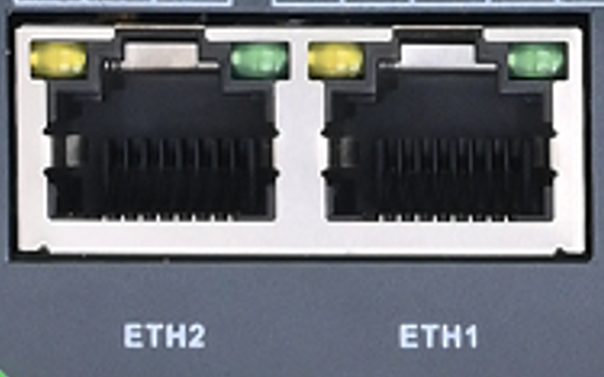

Step 2: Manage EC942

Method 1: Use native Linux commands for network and system management 

Click on the link [http://www.chiark.greenend.org.uk/](http://www.chiark.greenend.org.uk/~sgtatham/putty/download.html \t _blank) [~Sgtatham/putty/download.html](http://www.chiark.greenend.org.uk/~sgtatham/putty/download.html \t _blank), download PuTTY (free software), and establish a connection with the edge computer EC942 in the way of SSH commands in the Windows environment. The default username for logging in is on the device's backplane

The following figure is an example of using SSH connection: 

  

Method 2: Network and system management through the web

EC942 supports IEOS based web interface management. IEOS is a self-developed network management and system management program developed by InHand that runs on Linux systems. IEOS can provide web interface services. Take the insertion of the network cable into the network port ETH 2 as an example. The device login information is as follows:  

Login address: [https://192.168.4.100:9100](https://192.168.4.100:9100/ \t _blank) 

Initial login account: adm 

Initial login password: 123456 

The following figure is an example of using a web connection: 

  

Remark:

Not all EC942 models support the WEB interface management function. Please refer to the "Ordering Guide" section of the EC942 Edge Computer\_Prdt Spec for specific support.