EC942 Quick Start Guide

# Part One: Quick Installation (Visual Step-by-Step)

> **What you need to do first:** Unbox → Mount the device → Connect power and Ethernet → (If using cellular) **Power off** to install SIM and attach antennas → Power on → Set PC to same subnet → Open Web in browser.  
> **Then:** Scroll down to **Part Two** to look up packing list, LED meanings, wall mounting, pinouts, etc.

## Prerequisites (Before Wiring and Power-On)

| Item | Requirement |
|------|-------------|
| Power | **9~48 V DC**, terminals **V+ / V−** (or specified adapter); **PWR solid red** means powered on. |
| SIM / Micro SD | **Must power off** to install or remove; **hot-swap is not supported**. Remove screws and protective cover first. |
| Cellular / WLAN / GNSS Antennas | Tighten according to **silkscreen** on enclosure; standard qty varies by model (see Product Specification Ordering Information). |
| USB Storage | Run `sync` and exit `/media/*` before disconnecting to prevent data loss. |
| Factory Reset | **Do not power off** during the 30-second restart after factory reset, or files may be corrupted. |

## Step 1: Check the Panel and Interface Layout

Hold the EC942 and check the panel areas against the diagrams below:

- **Front panel**: PWR, STATUS, WARN, ERROR, SIM1, SIM2, User1, User2, 4G/5G, L1~L3 LEDs, Ethernet ports, antenna interfaces, user programmable button, etc.
- **Right panel**: DC power port, USB ports, serial ports, DI/DO terminals, SIM/SD card slot protective cover, etc.

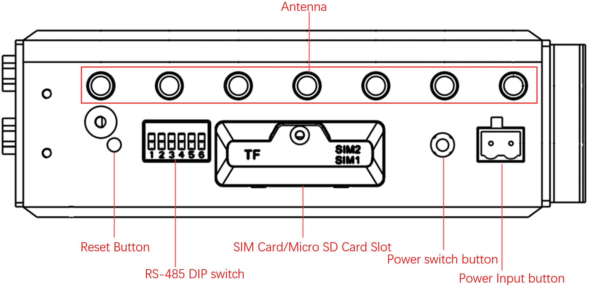

> For detailed panel descriptions, see **§2.2**; for LED meanings, see **§2.3**.

## Step 2: Mount the Device on DIN Rail or in Cabinet

The EC942 comes with a DIN rail mounting plate pre-installed on the rear panel (fixed with M3 × 6 mm screws).

1. Hook the top of the DIN rail into the upper slot of the mounting plate.
2. Slowly push the bottom of the device forward along the rail until the lower clip snaps into place.

> For wall-mounting options, see **§2.4**.

## Step 3: Connect Power and Ethernet

1. **Connect power**: Insert the power adapter terminal (or on-site DC terminal) into the DC power port of the EC942. The device supports **9~48 V DC** input.
2. **Connect Ethernet**: Plug one end of the Ethernet cable into any RJ45 port (ETH 1 or ETH 2) of the EC942, and the other end into your PC or switch.

> For RJ45 pinout, see **§2.5.1**; for serial/CAN pinouts, see **§2.5.2**.

## Step 4: (If Using Cellular) Power Off, Install SIM, and Attach Antennas

**Power off the device first.**

1. Use a screwdriver to remove the screws of the SIM/SD card slot protective cover, then remove the cover.
2. Insert the SIM card into the slot in the correct orientation (EC942 supports 2 SIM card slots).
3. Reinstall the protective cover and tighten the screws.
4. According to the silkscreen on the enclosure, tighten the required antennas onto the corresponding SMA interfaces (ANT1/2/3/4, GNSS, Wi-Fi1/2).

> For SIM/SD card slot operation and mount rules, see **§2.5.6**; for antenna silkscreen mapping, see **§2.5.6**.

## Step 5: Power On and Confirm Device Readiness

After applying power, observe the front panel LEDs:

- **PWR** solid red → Device is powered on.
- **STATUS** green flashing → System is starting normally.

If STATUS is off or WARN/ERROR is flashing, refer to **§2.3** to troubleshoot.

## Step 6: Log In via PC and Browser

1. Set your PC's IP address to the **same subnet** as the corresponding EC942 port.

   | Port | Default IP |
   | :---: | :---: |
   | ETH 1 | 192.168.3.100 |
   | ETH 2 | 192.168.4.100 |

2. Open a browser and navigate to the login address (using ETH 2 as an example):  
   `https://192.168.4.100:9100`
3. Enter the initial login credentials:
   - Username: **adm**
   - Password: **123456**
4. If the browser warns about the certificate, choose to continue.

> Not all EC942 models support Web management. Please refer to the "Ordering Guide" section of the *EC942 Edge Computer_Prdt Spec* for specific support.  
> For SSH command-line login, see **§2.7**.

## Installation Checklist

- ☐ Device is mounted (DIN rail or wall-mounted).
- ☐ Power and Ethernet are connected; if using cellular, SIM and antennas are in place.
- ☐ **PWR is solid on** and **STATUS is flashing**.
- ☐ Web login page is accessible and login is successful.

If you cannot log in, check whether the PC subnet matches the table above and whether the Ethernet cable is firmly seated. For factory reset status description, see **§2.7**.

---

# Part Two: Detailed Information

## 2.1 Packing List

**Standard Accessories**

| No. | Name | Qty | Unit | Remarks |
| :---: | --- | :---: | :---: | --- |
| 1 | EC942 Host | 1 | pc | — |
| 3 | Wi-Fi Antenna | 1 | pc | Standard Equipment (Depending on the device model) |
| 4 | GNSS Antenna | 1 | pc | Standard Equipment (Depending on the device model) |
| 5 | Cellular Antenna | 1 | pc | Standard Equipment (Depending on the device model) |
| 6 | Warranty Card | 1 | pc | — |

**Optional Accessories**

| No. | Name | Qty | Unit | Remarks |
| :---: | --- | :---: | :---: | --- |
| 2 | Power Adapter | 1 | pc | Optional Equipment |

> The wall-mounting kit must be purchased separately.

## 2.2 Product Structure and Identification

### 2.2.1 Front Panel

### 2.2.2 Right Panel

### 2.2.3 User Programmable Button

EC942 provides a user programmable button. Users can call the API interface to detect the button status and implement their own button logic.

## 2.3 LED Indicators

### 2.3.1 System Status LEDs

The EC942 front panel has 12 LEDs indicating power and system operation status.

| LED | Name | Definition |
| --- | --- | --- |
| PWR | Power indicator | Power on and always on |
| STATUS | System operating status indicator light | When the system starts normally, the STATUS flashes. If the system fails to start due to an exception in the system startup phase, or when the factory recovery operation has not been completed, STATUS is solid off. |
| WARN | Warning indicator light | When the system has a warning abnormality, the WARN light flashes. Warning abnormalities include: the factory reset has not been completed; and the dialing abnormality (the cellular function needs to be turned on). |
| Error | Error indicator light | When an Error occurs, the error indicator flashes. Errors include: Factory restoration is not complete. |
| SIM1 | SIM1 card indicator | Select SIM card 1 for dialing, select SIM card 2 for dialing or turn off dialing, long off. |
| SIM2 | SIM1 card indicator light, always on if selected | When SIM card 2 is selected for dialing, it is always on. When SIM card 1 is selected for dialing or dialing off, it will be long off. |
| User1 | User Programmable indicator LED 1 | It is off by default and can be controlled by user programming |
| User2 | User Programmable indicator LED 2 | It is off by default and can be controlled by user programming |
| 4G/5G | Cellular connection status indicator | Keep on after successful dialing |
| L1 | Cellular signal strength | See Cellular Signal Strength Indicator instructions |
| L2 | Cellular signal strength | |
| L3 | Cellular signal strength | |

**Factory Reset LED Status**

After restoring the factory settings, the system will undergo a restart. After the restart is completed, the factory reset is not complete. At this time, the WARN light and ERROR flash, and the STATUS goes out. In this state, the device cannot be powered off, otherwise it may cause some files to be lost and affect system functions. This state will last for 30 seconds. After the factory is restored, WARN and ERROR will turn off, and STATUS will flash.

### 2.3.2 Cellular Signal Strength LEDs

| LED | No signal | Weak signal (RSSI < -90) | Moderate signal (-90 ≤ RSSI < -70) | Strong signal (RSSI ≥ -70) |
| --- | :---: | :---: | :---: | :---: |
| L1 | OFF | ON | ON | ON |
| L2 | OFF | OFF | ON | ON |
| L3 | OFF | OFF | OFF | ON |

## 2.4 Mechanical Installation

### 2.4.1 DIN Rail: Installation

The DIN rail mounting plate is attached to the EC942 rear panel (fixed with M3 × 6 mm screws). The installation steps are as follows:

1. Insert the top of the DIN rail into the slot above the bracket.
2. Slowly push the device forward in the direction of the bracket to ensure that the bottom of the DIN rail clicks into place.

### 2.4.2 Wall Mounting

The wall-mounting kit must be purchased separately. Secure the kit to the device with screws first, then fix the device to the wall or cabinet with screws.

**Method 1: Back Panel Mounting**

Step 1: Use screws to secure the wall mounting kit to the back panel of EC942.

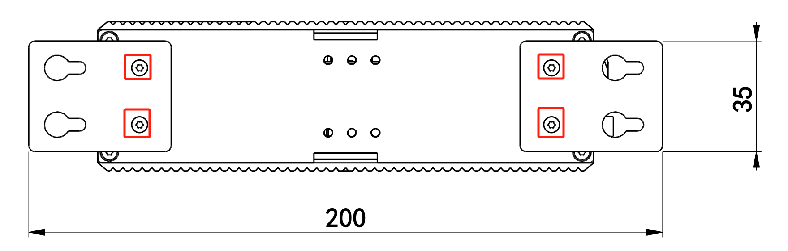

Step 2: After the wall mounted kit is successfully fixed to EC942, use 4 M6 screws to fix the equipment to the wall or cabinet.

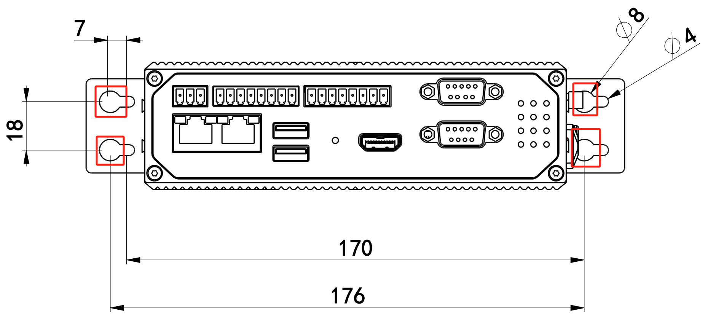

**Method 2: Left and Right Panel Mounting**

Step 1: Fix the wall mounted installation kit to the left and right panels with screws respectively.

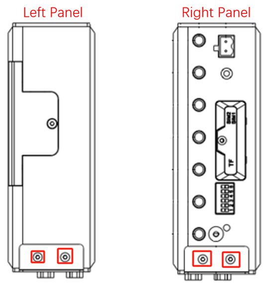

After fixation, as shown in the figure:

Step 2: After the wall mounted installation kit is successfully installed on the EC942 panel, use 4 M3 and 2 M6 screws to fix the EC942 to the wall or cabinet.

## 2.5 Connections and Cabling

### 2.5.1 Ethernet

EC942 has 2 RJ45 Ethernet ports, supporting 10M/100M/1000M adaptive rates.

| RJ45 pin number | 10M/100M | 1000M |
| :---: | --- | --- |
| 1 | TX+ | TRD (0)+ |
| 2 | TX- | TRD (0)- |
| 3 | RX+ | TRD (1)+ |
| 4 | \- | TRD (2)+ |
| 5 | \- | TRD (2)- |
| 6 | RX- | TRD (1)- |
| 7 | \- | TRD (3)+ |
| 8 | \- | TRD (3)- |

### 2.5.2 Power and Serial

**Power**

EC942 supports **12~48 VDC** power supply. After removing the built-in power adapter from the accessory box, insert the adapter terminal into the DC port of EC942, and then connect the power adapter. When the PWR power indicator light remains on, it indicates that the device has been powered on normally.

**Serial Ports**

EC942 supports two DB9 serial ports and supports RS-232, RS-485, or RS-422 communication. The software is configurable.

| DB9 pin number | Pin Name | Pin Definition |
| :---: | --- | --- |
| 1 | \- | \- |
| 2 | RS-232 RxD/RS-422 TxD+ | RS-232 receive/RS-422 send positive |
| 3 | RS-232 TxD/RS-485 B/RS-422 RxD- | RS-232 sending/RS-485 signal B/RS-422 receiving negative |
| 4 | \- | \- |
| 5 | GND | RS-232 grounding |
| 6 | \- | \- |
| 7 | RS-485 A/RxD+ | RS-485 signal A/RS-422 receiving positive |
| 8 | RS-422 TxD- | RS-422 transmission negative |
| 9 | \- | \- |

**CAN Port**

EC942 has one CAN bus interface and supports CAN 2.0A/B standard. It is compatible with CAN FD and can reach a maximum speed of 5Mbps.

| Identification | function |
| --- | --- |
| CAN-H | CAN high-level data cable |
| CAN-L | CAN low-level data line |
| GND | Grounding |

> Not all EC942 models support CAN interface. Please refer to the "Ordering Guide" section of the *EC942 Edge Computer_Prdt Spec* for specific support.

### 2.5.3 RS-485 DIP Switch

The DIP switch controls the pull-up and pull-down resistors of the 485 bus, and can be selected to increase the number of loaded devices on the 485 bus. Enabling the terminal matching resistor helps suppress signal reflections and improve communication stability, but in some scenarios it may reduce the number of devices that can be connected to the bus.

| Identification | Function Description |
| --- | --- |
| PU | ON - Enable pull-up resistance; OFF - disable pull-up resistor |
| PD | ON - Enable pull-down resistor; OFF - disable pull-down resistor |
| T | ON - Enable terminal matching resistance; OFF - disable terminal matching resistor |

### 2.5.4 Digital Input

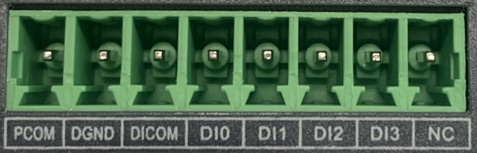

| Interface identification | Features | Description |
| --- | --- | --- |
| PCOM | Power supply common terminal | 4-way digital input DI, Dry contact state "1" : Closed dry contact state "0" : disconnected Wet contact state "1" :+10~+30V/-30 ~ -10VDC Wet contact state "0" : 0 ~ +3V/-3 ~ 0V Isolate 3000VDC |
| DGND | Power reference ground | |
| DICOM | Input public side | |
| DI0 | Digital input port 0 | |
| DI1 | Digital input port 1 | |
| DI2 | Digital input port 2 | |
| DI3 | Digital input port 3 | |
| NC | nothing | |

Wiring is as follows:

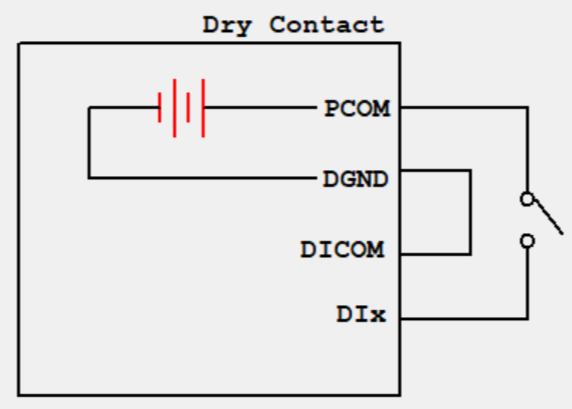

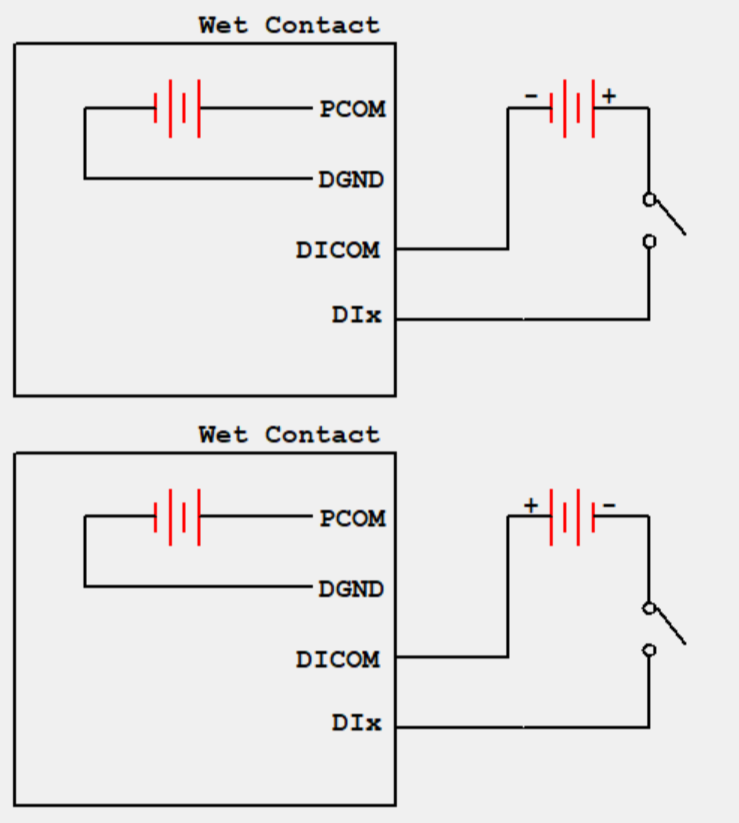

### 2.5.5 Digital Output

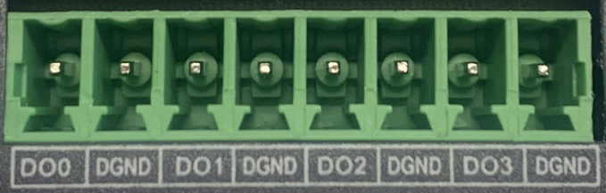

| Interface Identification | Features | Description |
| --- | --- | --- |
| DO0 | Digital output port 0 | 4-way digital onput DO, Isolated 3000VDC |
| DGND | Power reference ground | |
| DO1 | Digital output port 1 | |
| DGND | Power reference ground | |
| DO2 | Digital output port 2 | |
| DGND | Power reference ground | |
| DO3 | Digital output port 3 | |
| DGND | Power reference ground | |

The wiring method is as follows:

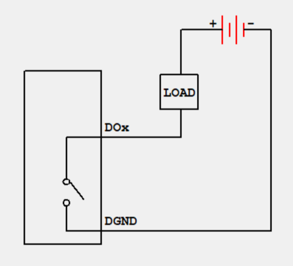

> Not all EC942 models support digital input/output interfaces. Please refer to the "Ordering Guide" section of the *EC942 Edge Computer_Prdt Spec* for specific support.

### 2.5.6 Cellular SIM and Antennas

**SIM / Micro SD Card Slot**

EC942 supports 2 SIM card slots for cellular communication and 1 Micro SD card slot for expanding device capacity. Both SIM cards and Micro SD cards do not support hot swapping and need to be plugged and unplugged in the event of a power outage. Before installation, screws and protective covers need to be removed. Press and insert the SIM card or Micro SD card into the card slot.

After inserting the SD card and powering on the device, the system will automatically mount all partitions to the `/mnt/path`, and the naming format of the mounting folder is `sd_<node>_<num>`.

**Antenna Interfaces**

EC942 has a total of 7 antenna interfaces, and the number of antennas standard for different models varies. See the "Ordering Information" section of the *EC942 Series Edge Computer Product Specification* for the antenna support corresponding to the specific model.

| Identification | Name |
| --- | --- |
| ANT1 | 4G LTE main antenna/5G antenna |
| ANT2 | 4G LTE diversity receiving antenna/5G antenna |
| GNSS | GNSS antenna |
| ANT3 | 5G antenna |
| ANT4 | 5G antenna |
| Wi-Fi1 | Wi-Fi antenna |
| Wi-Fi2 | Wi-Fi antenna |

The product model shown in the figure is EC942-H-LQA8-B, which supports 7 antenna interfaces. Simply screw the required antenna into the corresponding SMA antenna interface to complete the antenna installation, as shown in ANT1.

### 2.5.7 USB and Micro SD

**USB Interface**

EC942 provides two USB 2.0 Host interfaces, mainly used for expanding storage devices, connecting mice, and keyboards.

EC942 supports hot swapping of USB storage devices. It will automatically mount all partitions. EC942 will partition all USB storage devices and mount them to the `/mnt/path`. The naming format for the mounting folder is `usb1<node>_<num>`. Among them, `<node>` is the device node name of the partition, and `<num>` can be a number from 0 to 9.

> **Attention:** Before disconnecting a USB mass storage device, remember to enter the `sync` synchronization command to prevent data loss. When you disconnect the storage device, please exit from the `/media/*` directory. If you stay in `/media/USB*`, the automatic uninstallation process will fail. If this situation occurs, please type `umount /media/USB*` to manually uninstall the device.

**Micro SD**

Micro SD cards do not support hot swapping and must be plugged and unplugged in the event of a power outage. After inserting the SD card and powering on the device, the system will automatically mount all partitions to the `/mnt/path`, and the naming format of the mounting folder is `sd_<node>_<num>`.

### 2.5.8 mSATA Hard Drive Expansion

EC942 supports mSATA hard drives, which are not equipped by default at the factory. If users have high-capacity storage needs and need to purchase mSATA hard drives themselves, they can also consult InHand for mSATA purchasing.

The installation steps are as follows:

Step 1: Use a screwdriver to open the protective case of the hard drive, and after disassembly, it is shown in the following figure:

 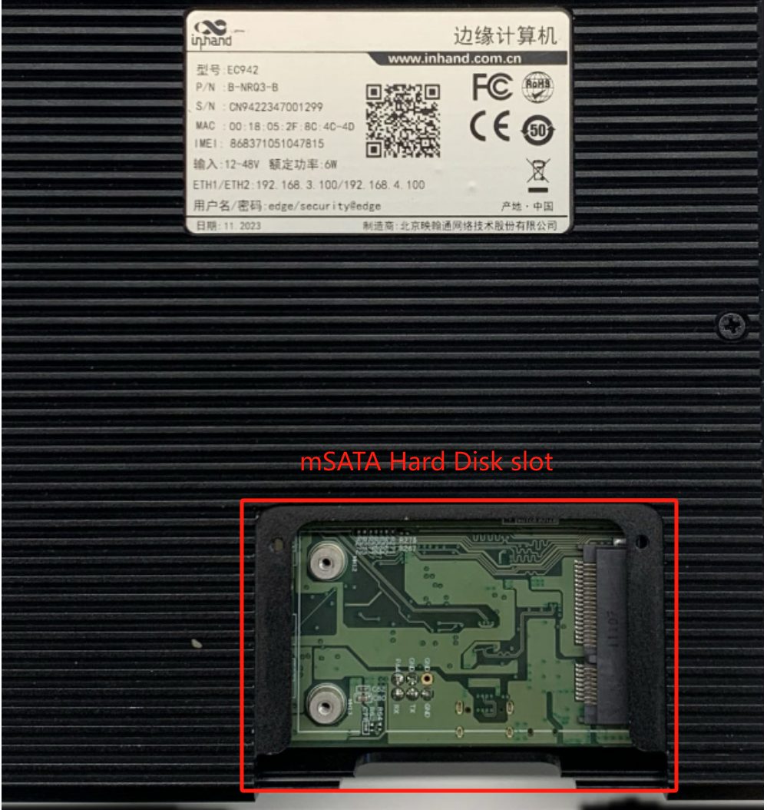

Step 2: Align the hard drive with the slot, push it to the right and snap it into place; Remove the screw (M2) to secure the left side of the hard drive.

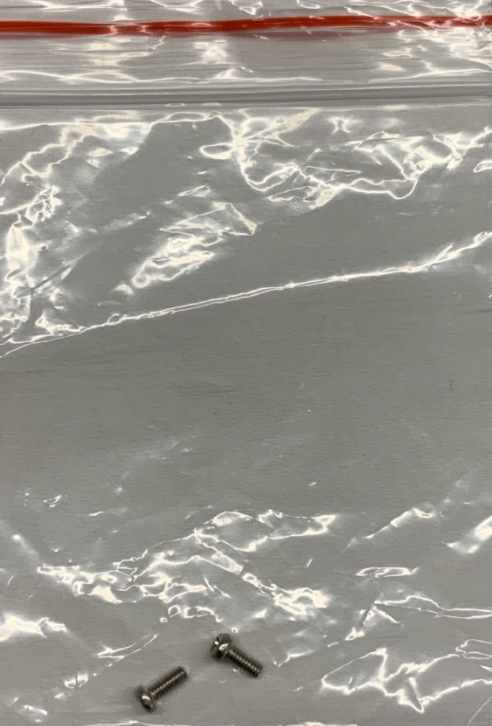 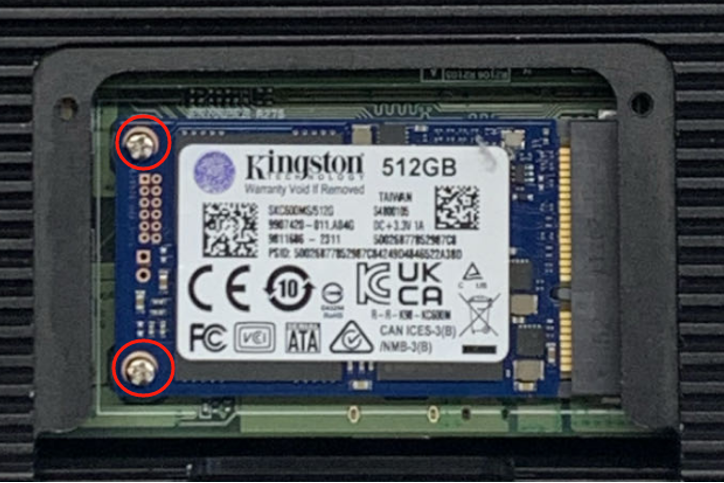

Step 3: Reinstall the removed protective casing back into EC942.

## 2.6 Power and Environmental Specifications (Quick Reference)

| Item | Specification |
| --- | --- |
| Input Voltage | 9-48 VDC (dual pin terminals, V+, V -) |
| Standby Power | 120mA-200mA@12V |
| Working Power | 150mA-320mA@12V |
| Peak Power | 320mA@12.0V |
| Working Temperature | -20-70 ℃ (-4-158 ℉) |
| Storage Temperature | -40-85℃（-40-185℉） |
| Ambient Humidity | 5~95% (without frost) |

## 2.7 First Login and Factory Reset

### Web Login

1. Interconnect EC942 with PC using an Ethernet cable, and set the PC's IP address to the same network segment as the device interface.

   | Port | Default IP |
   | :---: | :---: |
   | ETH 1 | 192.168.3.100 |
   | ETH 2 | 192.168.4.100 |

2. Open a browser and navigate to the login address (using ETH 2 as an example):  
   `https://192.168.4.100:9100`
3. Enter the initial login credentials:
   - Username: **adm**
   - Password: **123456**
4. If the browser warns about the certificate, choose to continue.

> Not all EC942 models support the WEB interface management function. Please refer to the "Ordering Guide" section of the *EC942 Edge Computer_Prdt Spec* for specific support.

### SSH Login

Click on the link [http://www.chiark.greenend.org.uk/~sgtatham/putty/download.html](http://www.chiark.greenend.org.uk/~sgtatham/putty/download.html), download PuTTY (free software), and establish a connection with the edge computer EC942 in the way of SSH commands in the Windows environment. The default username for logging in is on the device's backplane.

### Factory Reset Status

After restoring the factory settings, the system will undergo a restart. After the restart is completed, the factory reset is not complete. At this time, the WARN light and ERROR flash, and the STATUS goes out. In this state, the device cannot be powered off, otherwise it may cause some files to be lost and affect system functions. This state will last for 30 seconds. After the factory is restored, WARN and ERROR will turn off, and STATUS will flash.

## 2.8 Related Documents

| Need | Where to Go |
| --- | --- |
| Product introduction, USB/SD details, configuration and troubleshooting | *EC942 User Manual* |
| Ordering and antenna models | *EC942 Edge Computer_Prdt Spec* |
| Software and announcements | [www.inhand.com](http://www.inhand.com) |

## 2.9 Legal Information

The software described in this manual is provided under a license agreement and can only be used in accordance with the terms of that agreement.

**Copyright Statement**

© 2024 InHand Network reserves all rights.

**Trademark**

The InHand logo is a registered trademark of InHand Network.

All other trademarks or registered trademarks in this manual belong to their respective manufacturers.

**Disclaimers**

Our company reserves the right to make changes to this manual, and any subsequent changes to the product will not be notified separately. We are not responsible for any direct, indirect, intentional or unintentional damage or hidden dangers caused by improper installation or use.
