# EC942 Edge Computer User Manual

## Preface

### Disclaimer

Thank you for choosing InHand Networks products. Before use, please read this user manual carefully. Compliance with the following statements helps maintain intellectual property rights and legal compliance, and ensures that the user experience remains consistent with the latest product information. For any questions or to obtain written permission, please contact the technical support team.

- Copyright Statement

The content of this user manual is protected by copyright. Copyright belongs to InHand Networks and its licensors. Without written permission, no entity or individual may excerpt, reproduce, or distribute any part or all of this manual in any form.

- Disclaimer

Due to continuous updates in product technology and specifications, InHand Networks cannot guarantee that the information in this manual is completely consistent with the actual product. Therefore, InHand Networks assumes no liability for any disputes arising from discrepancies between actual technical parameters and this manual. Any product modifications may be made without prior notice. InHand Networks reserves the right to make final changes and interpretations.

- Legal Notice

The content of this user manual is protected by copyright law. Copyright belongs to InHand Networks and its licensors. All rights reserved. Without written permission, no entity or individual may use, reproduce, or distribute the content of this manual.

### User Interface Conventions

| Symbol | Meaning | Example |
|--------|---------|---------|
| `< >` | Indicates a variable or parameter to be replaced with an actual value | `<IP Address>` indicates a specific IP address needs to be entered |
| `" "` | Indicates text labels on the interface | Click the "Save" button |
| `→` | Indicates menu hierarchy or operation sequence | 【Network】→【Cellular】 |
| `【 】` | Indicates a menu or page name | Enter the 【System Settings】page |

### Technical Support
Email: support@inhandnetworks.com

URL: www.inhand.com

### How to Use This Manual

**a) Select by user type**

- First-time users: It is recommended to read sequentially through [Understanding the Device](#chapter-1-understanding-the-device) → [Installation and First Use](#chapter-2-installation-and-first-use) → [Common Scenario Configuration](#chapter-3-common-scenario-configuration) → [Feature Description and Parameter Reference](#chapter-4-feature-description-and-parameter-reference)
- Existing device users: Can directly refer to [Feature Description and Parameter Reference](#chapter-4-feature-description-and-parameter-reference) or [Appendix A Troubleshooting](#appendix-a-troubleshooting)
- Cloud platform management users: Can refer to the device remote management platform section in [Common Scenario Configuration](#chapter-3-common-scenario-configuration)

**b) Quick navigation by task**

| Task | Corresponding Chapter | Estimated Time |
|------|----------------------|----------------|
| Device installation and power-on | [Installation and First Use](#chapter-2-installation-and-first-use) | Approx. 10 minutes |
| Initial device access and login | [Installation and First Use](#chapter-2-installation-and-first-use) | Approx. 5 minutes |
| Cellular network configuration | [Common Scenario Configuration](#chapter-3-common-scenario-configuration) | Approx. 5 minutes |
| Ethernet network configuration | [Common Scenario Configuration](#chapter-3-common-scenario-configuration) | Approx. 5 minutes |
| Wi-Fi station configuration | [Common Scenario Configuration](#chapter-3-common-scenario-configuration) | Approx. 5 minutes |
| Peripheral interface configuration | [Feature Description and Parameter Reference](#chapter-4-feature-description-and-parameter-reference) | As needed |
| System firmware upgrade | [Feature Description and Parameter Reference](#chapter-4-feature-description-and-parameter-reference) | Approx. 10 minutes |
| Troubleshooting | [Appendix A Troubleshooting](#appendix-a-troubleshooting) | As needed |

## Chapter 1 Understanding the Device

### 1.1 Overview

The EC942 series edge computer is a lightweight AI-accelerated edge computing device developed by InHand Networks for industrial Internet of Things applications. It is equipped with an ARM Cortex-A55 quad-core processor operating at 2.0 GHz, with 4 GB RAM and 16 GB eMMC as standard configuration, providing a powerful computing platform. The device runs a distributed Linux operating system, which provides a flexible and diverse secondary development environment. Security features such as Secure Boot and TPM 2.0 are supported to ensure software and data security. The built-in InHand DeviceSupervisor Agent (DSA) service enables data collection, processing, and cloud deployment, and supports integration with the DeviceLive cloud management platform. This manual covers the EC900 series of ARM-based edge computers and provides complete instructions for all supported models. Before referring to the relevant sections, verify that the hardware specifications of the specific computer model support the features and settings described.

### 1.2 Packing List

| Item | Quantity | Remarks |
|------|----------|---------|
| EC942 Host | 1 | — |
| Power Adapter | 1 | Optional Equipment |
| Wi-Fi Antenna | 1 | Standard Equipment (Depending on the device model) |
| GNSS Antenna | 1 | Standard Equipment (Depending on the device model) |
| Cellular Antenna | 1 | Standard Equipment (Depending on the device model) |
| Warranty Card | 1 | — |

### 1.3 Appearance and Interfaces

The panel layout of the EC942 is as follows.

<p align="center">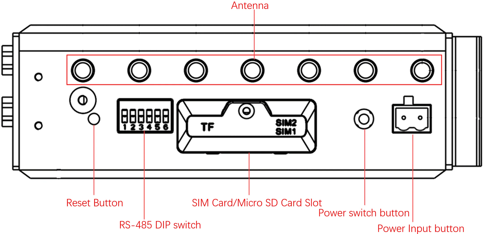</p>

<p align="center"><strong>Figure 1-1 EC942 Right Panel</strong></p>

<p align="center">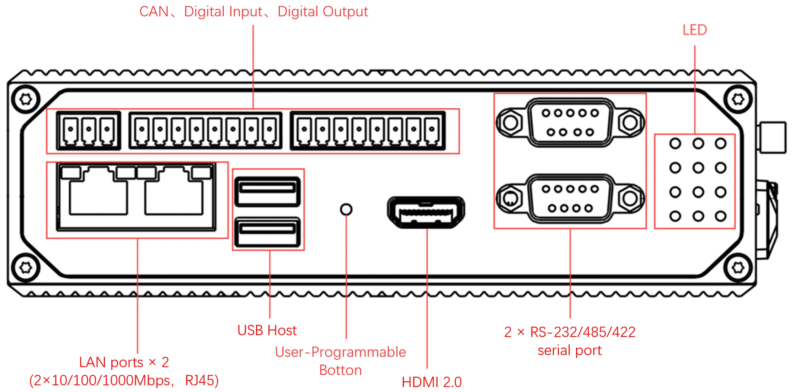</p>

<p align="center"><strong>Figure 1-2 EC942 Front Panel</strong></p>

The main interfaces are summarized in the following table.

| Interface | Position | Function Description |
|-----------|----------|---------------------|
| ETH 1/ETH 2 | Front panel | RJ45 Ethernet ports, 10/100/1000M adaptive |
| COM1/COM2 | Front panel | DB9 serial ports, RS-232/RS-485/RS-422 configurable |
| CAN | Front panel | CAN 2.0A/B bus, compatible with CAN FD, up to 5 Mbps |
| DI0–DI3 | Front panel | 4-way digital input, isolated 3000 VDC |
| DO0–DO3 | Front panel | 4-way digital output, isolated 3000 VDC |
| USB 2.0 Host × 2 | Right panel | For storage expansion, mouse, and keyboard connection |
| DC Input | Right panel | 12–48 VDC power input |
| SIM1/SIM2 | Right panel | 2× SIM card slots for cellular communication |
| Micro SD | Right panel | 1× Micro SD card slot for storage expansion |
| ANT1–ANT4, GNSS, Wi-Fi1–Wi-Fi2 | Right panel | 7× SMA antenna interfaces (quantity varies by model) |
| Reset | Front panel | Factory reset button |
| Power | Front panel | Power on/off button |

> **Note**: Not all EC942 models support the CAN interface, digital input/output interfaces, or the WEB interface management function. Refer to the "Ordering Guide" section of the EC942 Edge Computer Product Specification for specific support details.

### 1.4 LED Indicator Description

The EC942 has 12 LED indicators that show the power supply and system operation status. The indicator positions are shown in Figure 1-2.

| Indicator | State | Meaning |
|-----------|-------|---------|
| PWR | Solid on | Power on |
| STATUS | Flashing | System starts normally |
| | Solid off | System startup exception or factory recovery not completed |
| WARN | Flashing | Warning abnormality: factory reset not completed, or dialing abnormality (cellular function must be enabled) |
| Error | Flashing | Error occurred: factory restoration not complete |
| SIM1 | Solid on | SIM card 1 selected for dialing |
| | Solid off | SIM card 2 selected or dialing turned off |
| SIM2 | Solid on | SIM card 2 selected for dialing |
| | Solid off | SIM card 1 selected or dialing turned off |
| User1 | Off (default) | User-programmable indicator; controlled by programming |
| User2 | Off (default) | User-programmable indicator; controlled by programming |
| 4G/5G | Solid on | Cellular connection successful after dialing |
| L1 | Off | No signal (see Cellular Signal Strength table below) |
| | On | Signal present (see Cellular Signal Strength table below) |
| L2 | Off | No signal or weak signal (see Cellular Signal Strength table below) |
| | On | Moderate or strong signal (see Cellular Signal Strength table below) |
| L3 | Off | No signal, weak, or moderate signal (see Cellular Signal Strength table below) |
| | On | Strong signal (see Cellular Signal Strength table below) |

Cellular signal strength indicator:

| Indicator | No Signal | Weak Signal (RSSI < -90) | Moderate Signal (-90 ≤ RSSI < -70) | Strong Signal (RSSI ≥ -70) |
|-----------|-----------|--------------------------|-------------------------------------|---------------------------|
| L1 | Off | On | On | On |
| L2 | Off | Off | On | On |
| L3 | Off | Off | Off | On |

In addition to the combination of L1, L2, and L3 signal indicators for cellular signal strength, there is also a set of LED combinations to indicate the factory restoration process.

| Indicator | State |
|-----------|-------|
| WARN | Blinking |
| Error | Blinking |
| STATUS | Off |

After factory restoration is initiated, the system restarts. During the restart completion phase, the factory restoration is not yet complete. At this time, the WARN and Error indicators blink, and the STATUS indicator is off. In this state, the device must not be powered off; otherwise, some files may be lost and system functionality may be affected. This state lasts approximately 30 seconds. After factory restoration completes, the WARN and Error indicators turn off, and the STATUS indicator starts flashing.

### 1.6 Factory Reset

Factory reset can be performed via the reset button located on the device front panel.

1. Press and hold the reset button for 10 to 20 seconds until the WARN indicator turns solid on.
2. Release the reset button when the WARN indicator is solid on.
3. The Error indicator blinks several times, and the system restarts to perform factory restoration.
4. After the system restarts, the WARN and Error indicators blink, and the STATUS indicator is off. This state lasts approximately 30 seconds.
5. When the WARN and Error indicators stop flashing and the STATUS indicator starts flashing, factory restoration is complete.

> **Caution**: Do not power off the device while the WARN and Error indicators are blinking and the STATUS indicator is off. Powering off during this state may cause file loss and affect system functionality.

### 1.7 Default Settings

| Parameter | Default Value |
|-----------|---------------|
| ETH 1 IP Address | 192.168.3.100/24 |
| ETH 2 IP Address | 192.168.4.100/24 |
| SSH/Console Username | edge |
| SSH/Console Password | security@edge |
| Web Management URL | https://192.168.4.100:9100 |
| Web Management Username | adm |
| Web Management Password | 123456 |
| Root Account | Created; login disabled by default |
| IEOS Service | Enabled by default |

## Chapter 2 Installation and First Use

### 2.1 Pre-installation Preparation

Before installing the EC942, verify that the operating environment meets the following requirements.

| Parameter | Specification |
|-----------|---------------|
| Input Voltage | 9–48 VDC (dual pin terminals, V+, V−) |
| Standby Power | 120 mA–200 mA @ 12 V |
| Working Power | 150 mA–320 mA @ 12 V |
| Peak Power | 320 mA @ 12.0 V |
| Working Temperature | −20 °C to 70 °C (−4 °F to 158 °F) |
| Storage Temperature | −40 °C to 85 °C (−40 °F to 185 °F) |
| Ambient Humidity | 5% to 95% (without condensation) |

The following tools and materials are required for installation:

- Phillips screwdriver
- DIN rail or wall mounting kit (wall mounting kit purchased separately)
- M3 × 6 mm screws (for DIN rail bracket)
- M6 screws (for wall mounting method 1)
- M3 and M6 screws (for wall mounting method 2)
- Ethernet cable
- Power adapter (optional; included in some packages)

> **Caution**: The device must be powered off before inserting or removing SIM cards or Micro SD cards. Hot swapping is not supported.
>
> **Caution**: Before disconnecting a USB mass storage device, the `sync` command must be entered to prevent data loss.

### 2.2 Installation Guide

**DIN Rail Installation**

The DIN rail mounting plate is attached to the EC942 rear panel (fixed with M3 × 6 mm screws). The installation steps are as follows:

1. Insert the top of the DIN rail into the slot above the bracket.
2. Slowly push the device forward in the direction of the bracket to ensure that the bottom of the DIN rail clicks into place.

<p align="center">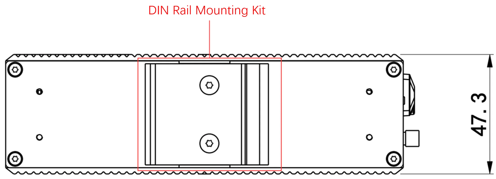</p>

<p align="center"><strong>Figure 2-1 DIN Rail Installation</strong></p>

**Wall Mounting Installation**

The EC942 can be installed using a wall mounting kit, which must be purchased separately. Two wall mounting methods are supported.

**Wall Mounting Method 1**: Install the wall mounting kit on the rear panel of the EC942.

Step 1: Use screws to secure the wall mounting kit to the rear panel of the EC942.

<p align="center"></p>

<p align="center"><strong>Figure 2-2 Wall Mounting Method 1 — Step 1</strong></p>

Step 2: After the wall mounting kit is successfully fixed to the EC942, use 4 M6 screws to fix the equipment to the wall or cabinet.

<p align="center">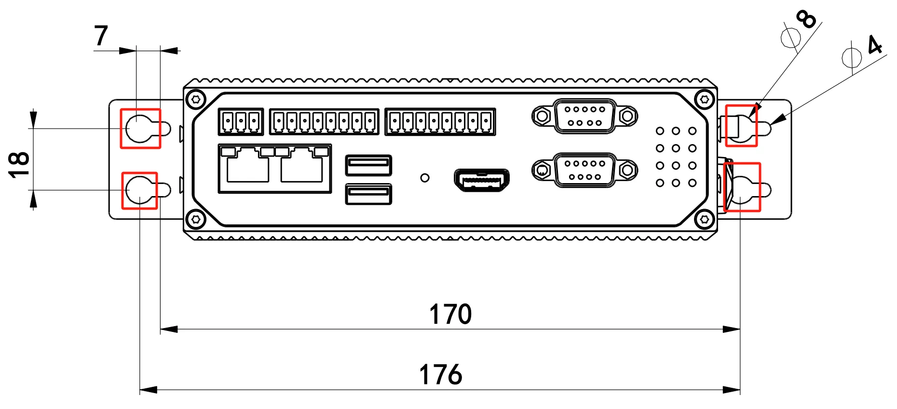</p>

<p align="center"><strong>Figure 2-3 Wall Mounting Method 1 — Step 2</strong></p>

**Wall Mounting Method 2**: Install the wall mounting kit on the left and right panels.

Step 1: Fix the wall mounting installation kit to the left and right panels with screws respectively.

<p align="center">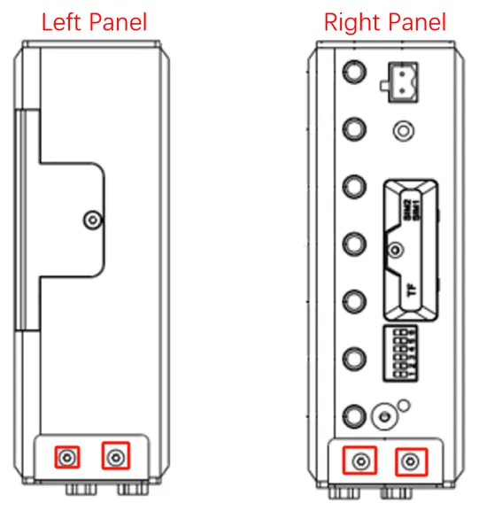</p>

<p align="center"><strong>Figure 2-4 Wall Mounting Method 2 — Step 1</strong></p>

After fixation, the assembly is shown in the following figure.

<p align="center">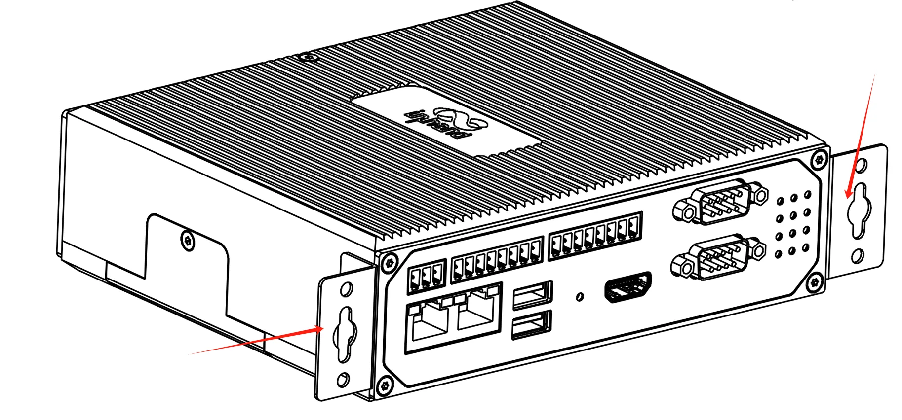</p>

<p align="center"><strong>Figure 2-5 Wall Mounting Method 2 — After Fixation</strong></p>

Step 2: After the wall mounting installation kit is successfully installed on the EC942 panel, use 4 M3 and 2 M6 screws to fix the EC942 to the wall or cabinet.

<p align="center"></p>

<p align="center"><strong>Figure 2-6 Wall Mounting Method 2 — Step 2</strong></p>

**Antenna Installation**

The EC942 has a total of 7 antenna interfaces. The number of antennas included varies by model. Refer to the "Ordering Information" section of the EC942 Series Edge Computer Product Specification for antenna support details for the specific model.

| Identification | Name |
|----------------|------|
| ANT1 | 4G LTE main antenna / 5G antenna |
| ANT2 | 4G LTE diversity receiving antenna / 5G antenna |
| GNSS | GNSS antenna |
| ANT3 | 5G antenna |
| ANT4 | 5G antenna |
| Wi-Fi1 | Wi-Fi antenna |
| Wi-Fi2 | Wi-Fi antenna |

Screw the required antenna into the corresponding SMA antenna interface to complete the antenna installation.

**SIM Card and Micro SD Card Installation**

The EC942 supports 2 SIM card slots for cellular communication and 1 Micro SD card slot for expanding device capacity. Both SIM cards and Micro SD cards do not support hot swapping and must be inserted or removed only when the device is powered off.

Before installation, screws and protective covers need to be removed. Press and insert the SIM card or Micro SD card into the card slot. After inserting the Micro SD card and powering on the device, the system automatically mounts all partitions to the /mnt/ path. The naming format of the mounting folder is `sd_<node>_<num>`.

> **Caution**: SIM cards and Micro SD cards must not be hot swapped. Power off the device before inserting or removing cards.

**Power Connection**

The EC942 supports 12–48 VDC power supply. After removing the built-in power adapter from the accessory box, insert the adapter terminal into the DC port of the EC942, and then connect the power adapter.

<p align="center">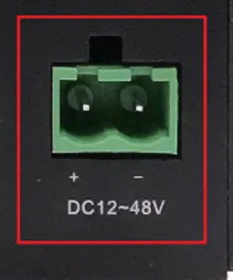</p>

<p align="center"><strong>Figure 2-7 DC Input Power Connection</strong></p>

When the PWR power indicator remains on, the device has been powered on normally.

** mSATA Hard Drive Installation (Optional)**

The EC942 supports mSATA hard drives. The factory default configuration does not include an mSATA hard drive. If high-capacity storage is required, an mSATA hard drive must be purchased separately.

The installation steps are as follows:

Step 1: Use a screwdriver to open the protective case of the hard drive. After disassembly, the internal structure is shown in the following figures.

<p align="center"></p>

<p align="center"><strong>Figure 2-8 mSATA Installation — Protective Case</strong></p>

<p align="center">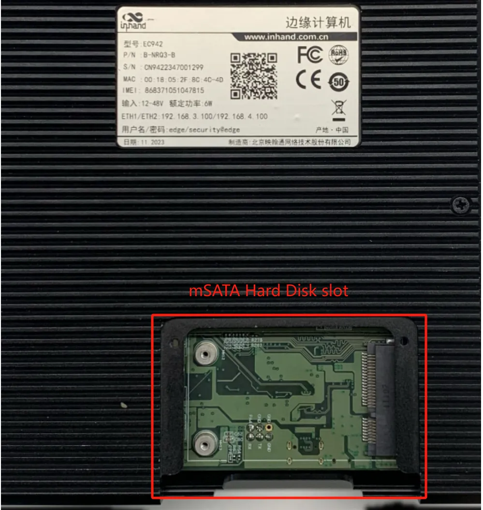</p>

<p align="center"><strong>Figure 2-9 mSATA Installation — Slot Exposed</strong></p>

Step 2: Align the hard drive with the slot, push it to the right and snap it into place. Remove the screw (M2) to secure the left side of the hard drive.

<p align="center"></p>

<p align="center"><strong>Figure 2-10 mSATA Installation — Drive Alignment</strong></p>

<p align="center"></p>

<p align="center"><strong>Figure 2-11 mSATA Installation — Screw Fixation</strong></p>

Step 3: Reinstall the removed protective casing back into the EC942.

### 2.3 Accessing the EC942

After installation and power-on, the EC942 can be accessed via Ethernet for management.

**Ethernet Connection**

Connect one end of an Ethernet cable to any network port of the EC942, and the other end to the computer's network port. Set the computer's IP address to the same network segment as the device interface.

| Port | Default IP Address |
|------|-------------------|
| ETH 1 | 192.168.3.100 |
| ETH 2 | 192.168.4.100 |

<p align="center">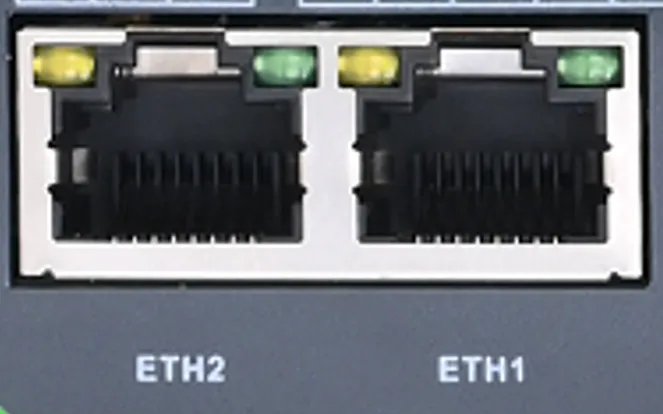</p>

<p align="center"><strong>Figure 2-12 Ethernet Connection to PC</strong></p>

> **Note**: The computer's Ethernet port IP address must be configured within the same subnet as the target device port. For ETH 1, use the 192.168.3.0/24 subnet. For ETH 2, use the 192.168.4.0/24 subnet.

**SSH Access**

The EC942 supports SSH connections over Ethernet.

**Linux Environment**

Use the `ssh` command to access the EC942. The following example demonstrates connecting to the ETH1 port.

<p align="center"></p>

<p align="center"><strong>Figure 2-13 SSH Connection Command (Linux)</strong></p>

Type `yes` to continue and complete the connection.

<p align="center"></p>

<p align="center"><strong>Figure 2-14 SSH Host Key Confirmation</strong></p>

When the terminal prompt `edge@edge-computer:~$` appears and shell commands can be entered, the connection is successful.

<p align="center"></p>

<p align="center"><strong>Figure 2-15 SSH Connection Established</strong></p>

**Windows Environment**

Download PuTTY (free software) from the official website. Use SSH commands in the Windows environment to establish a connection to the EC942.

<p align="center"></p>

<p align="center"><strong>Figure 2-16 PuTTY SSH Configuration (Windows)</strong></p>

The default SSH login credentials are as follows:

| Parameter | Value |
|-----------|-------|
| Username | edge |
| Password | security@edge |

> **Note**: When "command not found" appears, type `sudo -s` to switch to the root user or use the `sudo` command to operate. The root user is created by default but login is disabled. The user `edge` is in the `sudo` group, so system-level commands can be executed using `sudo`.
>
> **Note**: For security reasons, it is recommended to disable the default user account and create a custom account after initial login.

**Web Access**

The EC942 supports IEOS-based web interface management. IEOS is a self-developed network management and system management program developed by InHand that runs on Linux systems. IEOS provides web interface services.

> **Note**: Not all EC942 models support the WEB interface management function. Refer to the "Ordering Guide" section of the EC942 Edge Computer Product Specification for specific support details.

The following example uses the ETH 2 default address. The device login information is as follows:

| Parameter | Value |
|-----------|-------|
| Login Address | https://192.168.4.100:9100 |
| Initial Username | adm |
| Initial Password | 123456 |

<p align="center"></p>

<p align="center"><strong>Figure 2-17 Web Management Login Page</strong></p>

> **Important Note**: When IEOS programs are enabled, port numbers in the range 9100 to 9200 are reserved for internal communication. Client programs should avoid using these port numbers to prevent conflicts and malfunction.

### 2.4 Quick Check

After completing installation and initial access, verify the following items:

- [ ] The PWR indicator is solid on.
- [ ] The STATUS indicator is flashing.
- [ ] The computer can ping the device IP address (192.168.3.100 or 192.168.4.100).
- [ ] SSH login is successful using the username `edge` and password `security@edge`.
- [ ] The web management login page is accessible at `https://192.168.4.100:9100` (if the model supports web management).

## Chapter 3 Common Scenario Configuration

### Scenario 1: Initial Device Access and Login

**Target**: Establish management access to the EC942 via SSH or web interface.

**Prerequisites**: EC942 installed, powered on, and connected to a PC via Ethernet cable.

**Estimated Time**: Approx. 5 minutes.

**Operation Steps**:
1. Configure the PC Ethernet port IP address in the same subnet as the EC942 (192.168.3.0/24 for ETH 1 or 192.168.4.0/24 for ETH 2).
2. Verify connectivity by pinging the device IP address (192.168.3.100 or 192.168.4.100).
3. Access the device via SSH using username `edge` and password `security@edge`.
4. Alternatively, access the web management interface at `https://192.168.4.100:9100` using username `adm` and password `123456`.

**Verification Method**:
1. The SSH terminal displays the prompt `edge@edge-computer:~$`.
2. The web management login page loads successfully and the dashboard is accessible after login.

**Common Issues**:
- Connection failure: Verify the PC IP address is in the same subnet as the device port.
- Authentication failure: Verify the correct username and password are used. Note that SSH and web use different credentials.
- Login page inaccessible: Verify the device model supports web management.

### Scenario 2: Cellular Network Internet Access

**Target**: Access the internet via 4G/5G cellular network.

**Prerequisites**: Valid SIM card inserted; cellular antenna installed; device powered on and accessible via web or SSH.

**Estimated Time**: Approx. 5 minutes.

**Operation Steps**:
1. Log in to the web management interface.
2. Navigate to 【Network】→【Cellular】.
3. Verify that the cellular function is enabled.
4. Configure APN parameters if using a dedicated network card (obtain APN details from the carrier).
5. For dual-SIM models, enable Dual SIM and configure the main SIM and failover settings.
6. Enable ICMP probing to detect and recover from false connections. Configure the probe server addresses, interval, timeout, and retry count.
7. Save the configuration and wait for the connection to establish.

**Verification Method**:
1. The cellular status page displays the assigned IP address, IMEI, IMSI, and signal strength.
2. External addresses are reachable via the network diagnostic ping function or native ICMP tools.

**Common Issues**:
- SIM card not recognized: Power off the device and verify the SIM card is properly inserted.
- APN parameter incorrect: Contact the carrier to obtain the correct APN, username, and password.
- Weak signal: Verify cellular antennas are properly connected and positioned.
- Connection instability: Enable ICMP probing and configure appropriate detection parameters.

### Scenario 3: Wi-Fi Station Connection

**Target**: Connect the EC942 to an existing Wi-Fi network as a station.

**Prerequisites**: Wi-Fi antenna installed; known SSID and authentication credentials; device accessible via web.

**Estimated Time**: Approx. 5 minutes.

**Operation Steps**:
1. Log in to the web management interface.
2. Navigate to 【Network】→【Wi-Fi Station】.
3. Enable Wi-Fi.
4. Enter the target SSID manually or use the scan function to discover nearby networks.
5. Select the authentication method (No Auth, WPA-PSK, WPA2-PSK, or WPA-PSK/WPA2-PSK Mixed).
6. Select the encryption mode (CCMP, TKIP, or TKIP and CCMP) and enter the WPA/WPA2 PSK key.
7. Save the configuration.

**Verification Method**:
1. The Wi-Fi status page shows the assigned IP address, gateway, and DNS.
2. Network connectivity is confirmed by pinging external addresses through the Wi-Fi interface.

**Common Issues**:
- Connection failure: Verify the SSID and password are correct.
- Authentication failure: Confirm the access point supports the selected authentication and encryption method.
- Weak signal: Reposition the device or antenna to improve signal strength.

### Scenario 4: Ethernet Network Configuration

**Target**: Configure the Ethernet interface for network connectivity.

**Prerequisites**: Ethernet cable connected to the target interface; device accessible via SSH or web.

**Estimated Time**: Approx. 5 minutes.

**Operation Steps (via Web)**:
1. Log in to the web management interface.
2. Navigate to 【Network】→【Ethernet】.
3. Select the interface to configure (eth1 or eth2).
4. Configure a static IP address, netmask, and gateway; or set the interface to DHCP Client.
5. To serve addresses to downstream devices, enable DHCP Server and configure the starting address, maximum address number, and lease period.
6. Save the configuration.

**Operation Steps (via Command Line)**:
1. Stop IEOS if it is enabled: `sudo systemctl stop ieos_daemon`.
2. Edit the interface configuration file: `sudo vim /etc/network/interfaces.d/eth1` (or `eth2`).
3. For static IP, set `address`, `netmask`, and `gateway`; for dynamic IP, set `iface eth1 inet dhcp`.
4. Restart the network service: `sudo /etc/init.d/networking restart`.

**Verification Method**:
1. The interface displays the correct IP address in the route status page or via the `ip addr` command.
2. Network connectivity is confirmed by pinging the gateway and external addresses.

**Common Issues**:
- IP address conflict: Verify the configured address is not in use by another device.
- Incorrect subnet mask: Ensure the netmask matches the network segment.
- Gateway unreachable: Verify the gateway IP address is correct and reachable.
- Configuration not applied: Restart the network service or the device after making changes.

## Chapter 4 Feature Description and Parameter Reference

## 4.1 User Account Management

### 4.1.1 Switch to the Root User

The `sudo -s` command switches to the root user. For security reasons, all commands should not be operated as root.

> **Note**: For more information on `sudo` commands, refer to [https://wiki.debian.org/sudo](https://wiki.debian.org/sudo).

> **Note**: A "permission denied" message may appear when using pipe or redirect behavior without root permissions. In this case, `sudo su -c` must be used instead of `>`, `<`, `>>`, `<<`, etc. The full command must be included in single quotes.

### 4.1.2 Creating and Deleting User Accounts

User accounts can be created and deleted using the `useradd` and `userdel` commands. These commands must be used with appropriate access rights. The following example creates a user `test1` in the `sudo` group. The default login environment for `test1` is `bash`, and the home directory is `/home/test1`.

```
sudo useradd -m -s /bin/bash -G sudo test1
```

<p align="center"></p>

<p align="center"><strong>Figure 4-1 Creating a User Account</strong></p>

To change the password for `test1`, use the `passwd` command. Enter the new password and repeat to confirm.

```
sudo passwd test1
```

<p align="center"></p>

<p align="center"><strong>Figure 4-2 Setting a User Password</strong></p>

To remove user `test1`, use the `userdel` command.

```
sudo userdel test1
```

<p align="center"></p>

<p align="center"><strong>Figure 4-3 Deleting a User Account</strong></p>

### 4.1.3 Disable the Default User Account

> **Note**: A new user account must be created before disabling the default account.

Use the `passwd` command to lock the default `edge` user account, preventing login.

```
sudo passwd -l edge
```

<p align="center"></p>

<p align="center"><strong>Figure 4-4 Locking the Default User Account</strong></p>

To unlock the `edge` user:

```
sudo passwd -u edge
```

<p align="center"></p>

<p align="center"><strong>Figure 4-5 Unlocking the Default User Account</strong></p>


## 4.2 Web Management based on IEOS

### 4.2.1 Login to the Web

The EC942 runs Debian 10 and supports native Linux commands for network management and system administration. To facilitate configuration, InHand has developed IEOS, a network management and system management program that provides a web interface. Through the IEOS web interface, users can configure Ethernet port IP addresses, cellular dial-up, Wi-Fi Station, DHCP Client/Server, static routing, firewalls, and other network settings. System time, time zone, firmware upgrade, and system restart can also be managed through IEOS. In addition, IEOS supports integration with the InHand DeviceLive device management platform, enabling remote monitoring and management of EC942 devices.

IEOS adopts a design scheme that separates status and configuration. The interface is divided into three functional sections: network management, system management, and status. The network management menu and system management menu are used exclusively for network and system related configuration. Status information is displayed on the unified status page.

> **Important Note**: When using IEOS to manage network and system configuration, simultaneous use of Linux native commands may cause conflicts and result in abnormal operating states. It is recommended to manage IEOS-supported configurations through the IEOS web interface. For configurations not supported by IEOS, such as VPN, native Linux commands can be combined to achieve the configuration goal.

Because user programs may need to use the standard HTTP/HTTPS port numbers 80/443, IEOS uses port 9100 as the HTTPS connection port and does not support HTTP access. When HTTP is used to access the web, it automatically redirects to HTTPS. This document uses the ETH 2 default address 192.168.4.100 as an example. Entering `192.168.4.100:9100` in the browser opens the login page.

> **Important Note**: When IEOS is enabled, port numbers in the range 9100 to 9200 are reserved for internal communication. Client programs should avoid using these port numbers to prevent conflicts and malfunction.

<p align="center">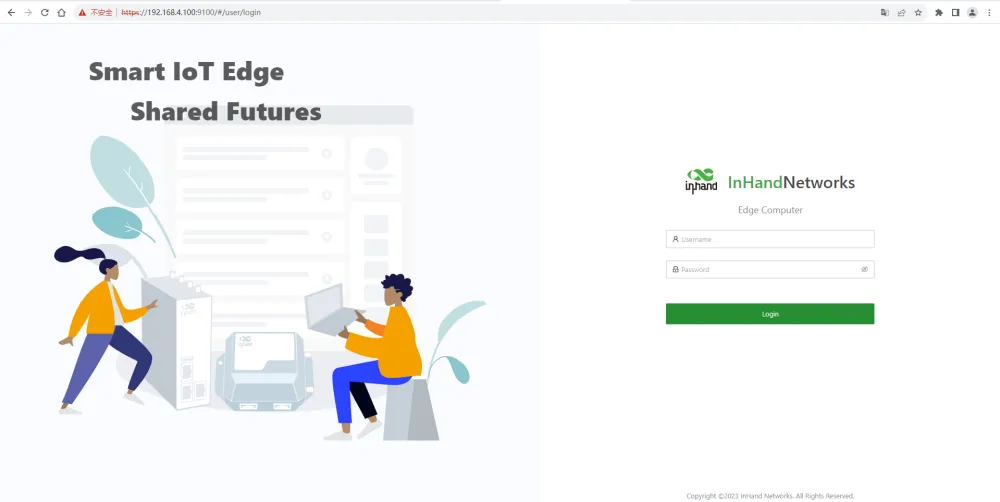</p>

<p align="center"><strong>Figure 4-6 IEOS Web Login Page</strong></p>

### 4.2.2 Network Management

#### 4.2.2.1 Ethernet Interface

The Ethernet interface can be configured with a static IP address, DHCP Client, or DHCP Server.

**Static IP Configuration**

<p align="center"></p>

<p align="center"><strong>Figure 4-7 Ethernet Static IP Configuration</strong></p>

**DHCP Client Configuration**

<p align="center">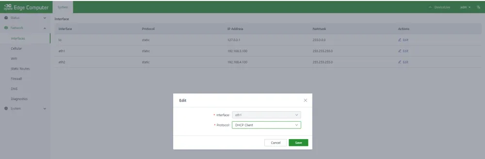</p>

<p align="center"><strong>Figure 4-8 Ethernet DHCP Client Configuration</strong></p>

**DHCP Server Configuration**

<p align="center"></p>

<p align="center"><strong>Figure 4-9 Ethernet DHCP Server Configuration</strong></p>

DHCP Server configuration parameters:

| Parameter | Description |
|-----------|-------------|
| Enable DHCP Server | Controls the DHCP Server function. |
| Starting Address | The starting base address of the DHCP Server address pool. The network segment plus the starting address equals the starting IP address of the pool. For example, if the network segment of eth1 is 192.168.3.0/24 and the base address is 1, the starting address of the pool is 192.168.3.1/24. |
| Max Address Number | The maximum number of addresses in the address pool. |
| Lease Period | The length of the lease period. |

#### 4.2.2.2 Cellular Dialing

<p align="center"></p>

<p align="center"><strong>Figure 4-10 Cellular Dialing Configuration</strong></p>

Cellular network parameters:

| Parameter | Description |
|-----------|-------------|
| Enabled | The cellular function switch. Enabled by default. |
| Profiles | A set of dial parameters used to configure APN, username, password, and authentication methods when dialing a dedicated network card. For non-dedicated network cards, this configuration usually does not need to be changed. Up to 10 records can be added to the dial parameter set. |
| Network Mode | The network mode of the cellular module. Options include 3G, 4G, LTE, WCDMA, and other related modes. If the appropriate mode is unclear, select Automatic; the program selects the most appropriate network mode automatically. The default is Automatic. |
| Enable Default Route | Enables the function of adding a default route. When enabled, a default route for the cellular port is added after successful dialing. Enabled by default. |
| Metric | The metric for the default route of the cellular port. When default routes are configured on the cellular, Wi-Fi, and Ethernet ports, the route with the lowest metric value takes effect. |

**Dual SIM Configuration**

<p align="center"></p>

<p align="center"><strong>Figure 4-11 Cellular Dual SIM Configuration</strong></p>

Dual SIM parameters:

| Parameter | Description |
|-----------|-------------|
| Dual SIM Enabled | Enables dual-SIM functionality. To improve network reliability, the EC942 supports dual SIM with single dial. Two SIM cards must be inserted. If SIM 1 fails to dial (e.g., due to unpaid charges), the device automatically switches to SIM 2. Disabled by default. |
| Main SIM | The primary SIM card. The selected SIM card is preferred for dialing. When dialing fails a specified number of times, the device switches to the other SIM card. SIM 1 is the default. |
| Max Number of Dials | When dual-SIM single-dial is enabled, the device switches to the other SIM card when the current SIM reaches this dial count. |
| APN Profile | The dialing parameter set selected for the SIM card. The default value is Automatic. Dedicated network cards usually require a configured dial parameter set; the Index of the dial parameter set is selected here. |
| PIN Code | The PIN code of the SIM card. |

**ICMP Probe**

<p align="center">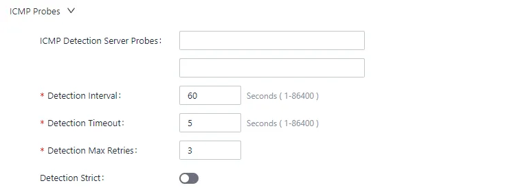</p>

<p align="center"><strong>Figure 4-12 Cellular ICMP Probe Configuration</strong></p>

Wireless cellular networks are complex, and dial-up false connections may occur, where the dial-up state appears successful but the target address cannot be pinged. When this happens, redialing usually restores normal operation. IEOS cellular dialing supports ICMP probing to detect spurious connections. It is recommended to enable ICMP probing for cellular connections to enable rapid recovery from false connections.

ICMP probe parameters:

| Parameter | Description |
|-----------|-------------|
| ICMP Detection Server Probes | The ICMP probe address. Up to 2 probe addresses can be configured. If 1 address is successfully probed, the cellular connection is confirmed valid. When neither address is configured, ICMP probing is disabled. |
| Detection Interval | The interval between ICMP probes. |
| Detection Timeout | The duration of the ICMP probe timeout. If no probe response is received, the probe is considered failed. |
| Detection Max Retries | The maximum number of failed probes before triggering a redial. Range: [1, 5]. |
| Detection Strict | Enables strict detection. When disabled, the detection program checks whether packets received by the cellular interface have changed during each detection cycle. If there is a change, the cellular network is considered active and ICMP packets are not sent, saving traffic. When enabled, ICMP probe packets are sent periodically regardless of packet count changes. Disabled by default. |

**Advanced Configuration**

<p align="center">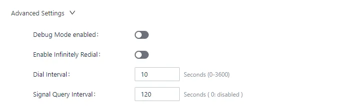</p>

<p align="center"><strong>Figure 4-13 Cellular Advanced Configuration</strong></p>

Advanced configuration parameters:

| Parameter | Description |
|-----------|-------------|
| Debug Mode Enabled | Enables debug functionality. When enabled, dial-related debugging information is added to the log. Disabled by default. |
| Enable Redial | Enables unlimited redial. In some cases, dialing enters an abnormal state that can be recovered by rebooting. By default, unlimited redialing is disabled; the system restarts after a certain number of dialing failures to attempt recovery. Because dialing is enabled by default, devices without a SIM card experience dialing failures that trigger system restart. In this case, unlimited redialing can be enabled so that the system does not restart regardless of dialing failures. |
| Dial Interval | The waiting time before attempting another dial after a failure. |
| Signal Query Interval | The interval at which the dialing program checks signal strength. When signal is weak, false connections may occur; redialing may resolve this. The signal detection period is configured here. |

#### 4.2.2.3 Wi-Fi

<p align="center">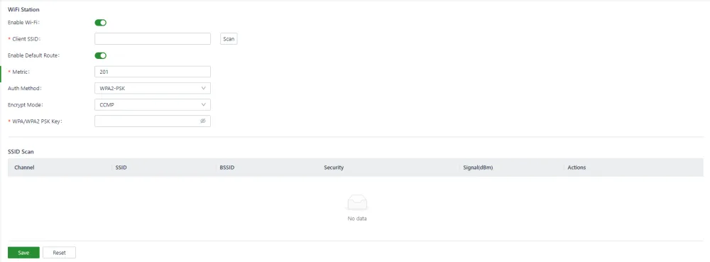</p>

<p align="center"><strong>Figure 4-14 Wi-Fi Station Configuration</strong></p>

Wi-Fi Station parameters:

| Parameter | Description |
|-----------|-------------|
| Enable Wi-Fi | The Wi-Fi enable switch. Disabled by default. |
| Client SSID | The SSID to connect to. Can be entered manually or discovered via the scan function. |
| Enable Default Route | Enables the function of adding a default route. When enabled, a default route for the Wi-Fi port is added after successful connection. Enabled by default. |
| Metric | The metric for the default route of the Wi-Fi port. When default routes are configured on the cellular, Wi-Fi, and Ethernet ports, the route with the lowest metric value takes effect. |
| Auth Method | Authentication method. Supports No Auth, WPA-PSK, WPA2-PSK, and WPA-PSK/WPA2-PSK Mixed. |
| Encrypt Mode | Encryption mode. Supports CCMP, TKIP, and TKIP and CCMP. |
| WPA/WPA2 PSK Key | The key information. |

#### 4.2.2.4 Static Routes

<p align="center"></p>

<p align="center"><strong>Figure 4-15 Static Route Configuration</strong></p>

This section configures static routing for Ethernet. When default routes are configured for Ethernet, cellular, and Wi-Fi, the default route with the lowest metric value takes effect. Ensure that the metric values of default routes are different.

Static route parameters:

| Parameter | Description |
|-----------|-------------|
| Interface | The outgoing interface of the static route. |
| Target | The target network. |
| Netmask | The target network mask. |
| Gateway | The next-hop address. |
| Metric | The metric for the static route. |

#### 4.2.2.5 Firewall

<p align="center"></p>

<p align="center"><strong>Figure 4-16 Firewall Configuration</strong></p>

Currently, only the `iptables` command is supported for firewall configuration.

#### 4.2.2.6 DNS

<p align="center"></p>

<p align="center"><strong>Figure 4-17 DNS Configuration</strong></p>

DNS parameters:

| Parameter | Description |
|-----------|-------------|
| DNS Servers | DNS server address. Up to 4 can be configured. |
| Domain Name Hijacking | Domain name hijacking function. Enables binding between an IP address and a domain name. |

<p align="center"></p>

<p align="center"><strong>Figure 4-18 Domain Name Hijacking Configuration</strong></p>

#### 4.2.2.7 Network Diagnostics

<p align="center">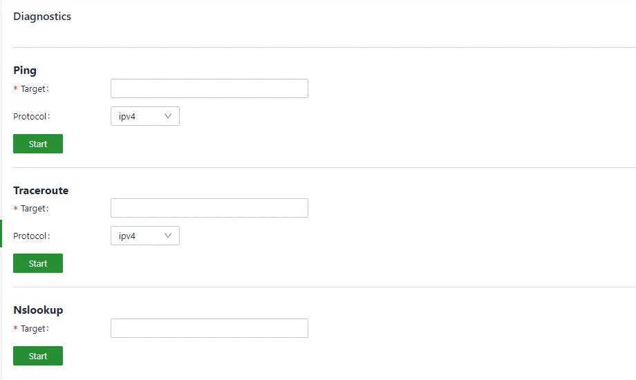</p>

<p align="center"><strong>Figure 4-19 Network Diagnostics</strong></p>

Network diagnostics support ping, traceroute, and nslookup functions.

### 4.2.3 System Administration

#### 4.2.3.1 Basic Configuration

**Cloud Management**

<p align="center"></p>

<p align="center"><strong>Figure 4-20 Cloud Management Configuration</strong></p>

Cloud management parameters:

| Parameter | Description |
|-----------|-------------|
| Enabled | The enable switch for connecting to the DeviceLive platform. DeviceLive is the remote monitoring and management platform for InHand devices. |
| Cloud Server | The DeviceLive platform has two addresses: one for the domestic platform and one for the overseas platform. Select the platform to connect to. |

**Time Zone and NTP Client**

<p align="center"></p>

<p align="center"><strong>Figure 4-21 Time Zone and NTP Client Configuration</strong></p>

Up to 10 NTP server addresses can be configured. The program periodically sends synchronization requests to each server address in turn. After successful synchronization, the system time is written to the RTC, and synchronization requests to subsequent NTP servers are stopped.

In addition to NTP, a manual synchronization button is available on the Device Info status page. This button is displayed only when the device time and local time (the time of the computer accessing the device) differ by more than 3 seconds.

**Configuration Import, Export, and Factory Restore**

<p align="center">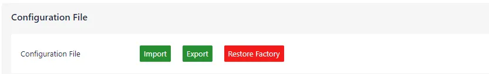</p>

<p align="center"><strong>Figure 4-22 Configuration Import, Export, and Factory Restore</strong></p>

This page supports configuration import, export, and factory restore operations.

#### 4.2.3.2 Firmware Upgrade

<p align="center">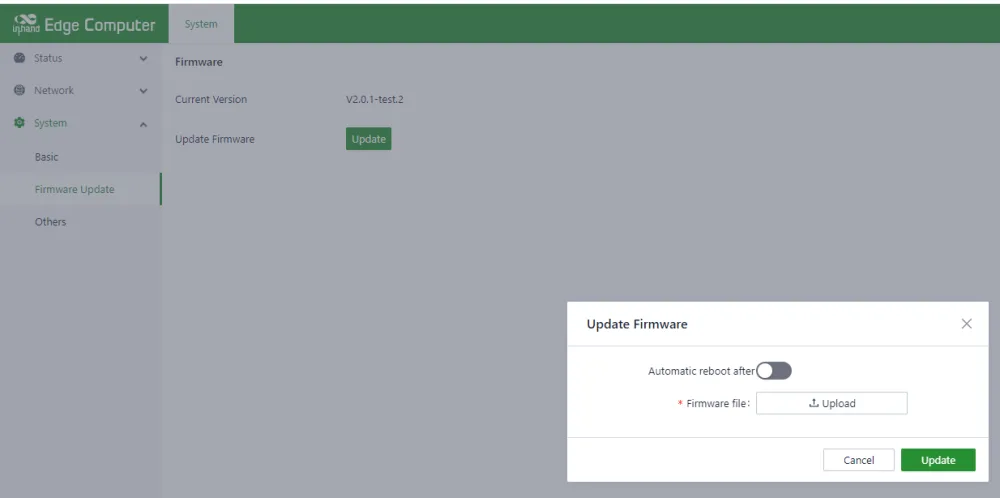</p>

<p align="center"><strong>Figure 4-23 Firmware Upgrade</strong></p>

The automatic restart option is disabled by default. After upgrading the firmware, the system must be manually restarted to take effect. When the automatic restart option is enabled, the system restarts automatically after a successful firmware upgrade.

#### 4.2.3.3 Others

<p align="center"></p>

<p align="center"><strong>Figure 4-24 System Restart and Reset</strong></p>

This page provides two functions: restart the system and reset the system. The reset function restores the system configuration and file system to factory defaults, which means all user-installed software is cleared. The reset function must be used with caution.

### 4.2.4 Status

#### 4.2.4.1 Device Information

The device information status page shows the hostname, device model, serial number, firmware version, kernel version, file system version, and an overview of CPU, memory, and disk space usage.

<p align="center">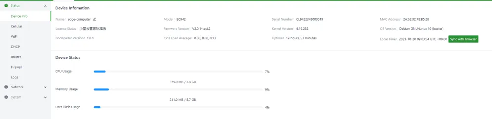</p>

<p align="center"><strong>Figure 4-25 Device Information Status</strong></p>

#### 4.2.4.2 Cellular Dialing Status

The cellular dialing status page shows the SIM card, IMEI, IMSI, ICCID, signal strength used by the current dialing, as well as the IP address, DNS, and other information obtained by the dialing.

<p align="center"></p>

<p align="center"><strong>Figure 4-26 Cellular Dialing Status</strong></p>

#### 4.2.4.3 Wi-Fi Status

The Wi-Fi status page shows the IP address, gateway, and DNS information obtained after the Wi-Fi connection was successful.

<p align="center">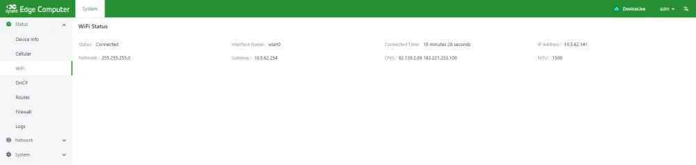</p>

<p align="center"><strong>Figure 4-27 Wi-Fi Station Status</strong></p>

#### 4.2.4.4 DHCP Server Status

The DHCP Server status page shows the assigned IP address of the device as a DHCP Server, the client hostname, the client host MAC, and the expiration time.

<p align="center"></p>

<p align="center"><strong>Figure 4-28 DHCP Server Status</strong></p>

#### 4.2.4.5 Route Status

The route status page displays IPv4 direct route, static route, and route neighbor information.

<p align="center"></p>

<p align="center"><strong>Figure 4-29 Route Status</strong></p>

#### 4.2.4.6 Firewall Status

Firewall status information shows filtering rules, IP address mapping rules, and other information.

<p align="center">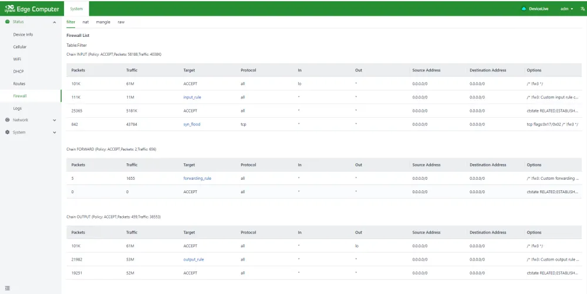</p>

<p align="center"><strong>Figure 4-30 Firewall Status</strong></p>

#### 4.2.4.7 Log Information

The log page can view the system log, user log, and set the log level, including Error, Info, Debug, and other levels. Logs can also be downloaded locally.

<p align="center">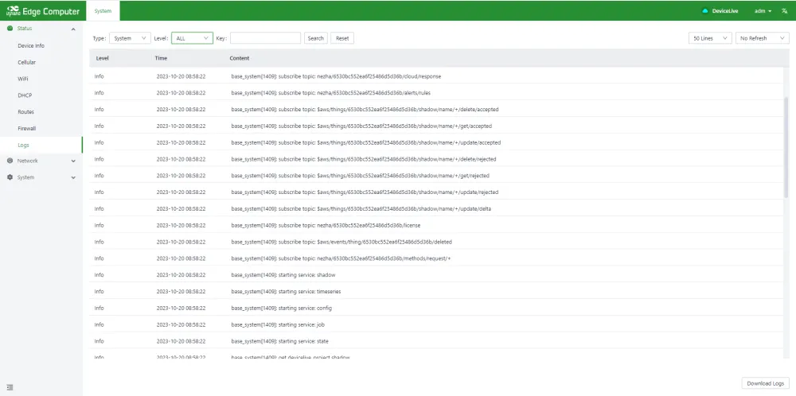</p>

<p align="center"><strong>Figure 4-31 Log Information</strong></p>

## 4.3 Linux-based Command-Line Management

When using the Linux command line for network and system configuration, IEOS must be stopped first. IEOS is managed through `systemctl`.

To stop IEOS for the current session:
```
systemctl stop ieos_daemon
```

This shutdown applies only to the current boot. IEOS starts again after system reboot. To prevent IEOS from starting on boot:
```
systemctl disable ieos_daemon
```

> **Important Note**: After IEOS is closed, wireless networking functions such as cellular dialing and Wi-Fi must be implemented using native Linux commands. Integration with the DeviceLive platform for remote device management is not possible.

### 4.3.1 Network Management

#### 4.3.1.1 Static IP Address

To set a static IP address for the EC942, edit the corresponding network configuration file using `sudo vim /etc/network/interfaces.d/eth1` or `sudo vim /etc/network/interfaces.d/eth2`. Set the gateway, address, network, and subnet mask for the Ethernet interface. The following example sets a static IP address for the eth2 port.

<p align="center"></p>

<p align="center"><strong>Figure 4-32 Static IP Configuration (Command Line)</strong></p>

After changing the interface IP configuration, run `sudo /etc/init.d/networking restart` to restart the network service and apply the configuration.

#### 4.3.1.2 Dynamic IP Address

To configure a dynamic IP address for the EC942, edit the corresponding network configuration file using `sudo vim /etc/network/interfaces.d/eth1` or `sudo vim /etc/network/interfaces.d/eth2`. Set `iface eth1 inet dhcp` to automatically obtain an IP address. The following example sets a dynamic IP for the eth1 port.

<p align="center"></p>

<p align="center"><strong>Figure 4-33 DHCP Client Configuration (Command Line)</strong></p>

After changing the interface IP configuration, run `sudo /etc/init.d/networking restart` to restart the network service and apply the configuration.

### 4.3.2 System Administration

#### 4.3.2.1 Firmware Version

To check the EC942 firmware version, type:
```
cat /etc/version
```

<p align="center">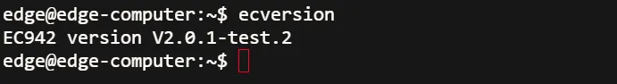</p>

<p align="center"><strong>Figure 4-34 Firmware Version Query</strong></p>

Add the `-a` option to display full version information:
```
cat /etc/version -a
```

<p align="center">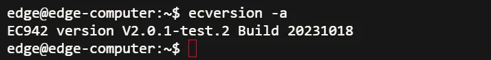</p>

<p align="center"><strong>Figure 4-35 Full Firmware Version Information</strong></p>

#### 4.3.2.2 Available Disk Space

To check available disk space, use the `df` command with the `-h` option. The system returns drive space broken down by file system. For the EC942, the disk partition available to the user is `/dev/mmcblk0p8`.

<p align="center">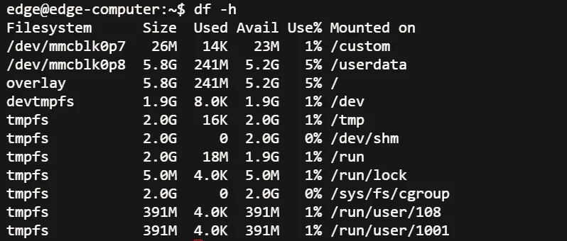</p>

<p align="center"><strong>Figure 4-36 Disk Space Query</strong></p>

#### 4.3.2.3 Product Model Information

The `devinfo` tool displays product model information.

```
devinfo
```

<p align="center"></p>

<p align="center"><strong>Figure 4-37 Product Model Query</strong></p>

#### 4.3.2.4 Time Settings

The EC942 maintains two time settings: system time and RTC (Real Time Clock) time. The `date` command queries or sets the system time. The `hwclock` command queries or sets the RTC time.

Use the command `date MMDDhhmmYYYY` to set the system time:
- MM: month
- DD: day
- hh: hour
- mm: minute
- YYYY: year

<p align="center"></p>

<p align="center"><strong>Figure 4-38 System Time Setting</strong></p>

The RTC time can be synchronized to the system time using the following command:
```
hwclock --hctosys
```

<p align="center"></p>

<p align="center"><strong>Figure 4-39 RTC to System Time Synchronization</strong></p>

#### 4.3.2.5 Time Zone Configuration

There are two methods to configure the time zone for the EC942: using the `tzselect` command or using the `/etc/localtime` file.

**Method 1: tzselect command**

When the `tzselect` command is entered, an area selection screen is displayed. Select the approximate area (divided by continent and ocean) and enter the number corresponding to the continent or ocean.

<p align="center"></p>

<p align="center"><strong>Figure 4-40 tzselect Area Selection</strong></p>

Then select the country under the selected continent or ocean.

<p align="center"></p>

<p align="center"><strong>Figure 4-41 tzselect Country Selection</strong></p>

After following the steps above, the time zone keyword (e.g., Asia/Shanghai) is obtained. Execute the following command to set the time zone:

<p align="center"></p>

<p align="center"><strong>Figure 4-42 Time Zone Setting Command</strong></p>

**Method 2: Using the /etc/localtime file**

The local time zone is stored in `/etc/localtime` and is used by the GNU C library (glibc) if no value is set for the `TZ` environment variable. This file is either a copy of `/usr/share/zoneinfo/<file>` or a symbolic link to it. If the EC942 cannot find the required `/usr/share/zoneinfo/<file>`, download the time zone information file from [https://www.iana.org/time-zones](https://www.iana.org/time-zones) and link it to `/etc/localtime`.

> **Note**: After downloading the required time zone information file, unzip it and compile the corresponding binary file using the `zic` command. The generated time zone file is `/usr/share/zoneinfo/<custom time zone filename>`.

For more details about date and time, refer to the following links:
- [https://www.debian.org/doc/manuals/system-administrator/ch-sysadmin-time.html](https://www.debian.org/doc/manuals/system-administrator/ch-sysadmin-time.html)
- [https://wiki.debian.org/DateTime](https://wiki.debian.org/DateTime)

## 4.4 Peripheral Interfaces

### 4.4.1 Serial Port

EC942 has 2 serial ports, each of which supports RS-232, RS-422 and RS-485 multiple serial port modes. The default serial port mode is RS-232, and the serial port mode can be switched by using ih\_uart\_ctl command.

The device node corresponding to COM1 is /dev/ttyS3

The device node for COM2 is /dev/ttyS4

<p align="center">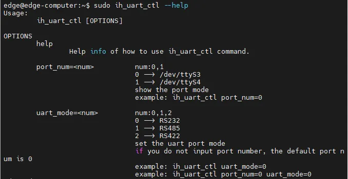</p>

<p align="center"><strong>Figure 4-43 Standard Serial Ports (COM1 and COM2)</strong></p>

**Change the serial port Settings**

View and set the serial port with the stty command

To see the details, type sudo stty --help:

<p align="center"></p>

<p align="center"><strong>Figure 4-44 stty Command Help</strong></p>

<p align="center"></p>

<p align="center"><strong>Figure 4-45 stty Command Example 1</strong></p>

<p align="center"></p>

<p align="center"><strong>Figure 4-46 stty Command Example 2</strong></p>

<p align="center">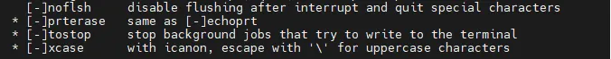</p>

<p align="center"><strong>Figure 4-47 stty Command Example 3</strong></p>

<p align="center">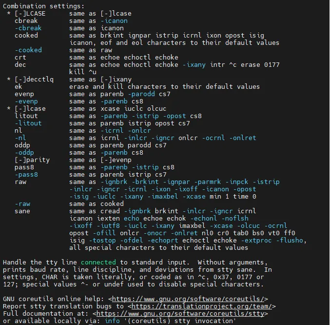</p>

<p align="center"><strong>Figure 4-48 stty Command Example 4</strong></p>

**View serial port information**

<p align="center"></p>

<p align="center"><strong>Figure 4-49 Serial Port Information</strong></p>

**Set the baud rate of COM1 serial port**

<p align="center"></p>

<p align="center"><strong>Figure 4-50 Set COM1 Baud Rate</strong></p>

**Set the baud rate of COM2 serial port**

<p align="center"></p>

<p align="center"><strong>Figure 4-51 Set COM2 Baud Rate</strong></p>

Note

Details about the stty command are available at the following link

[http://www.gnu.org/software/coreutils/manual/co](http://www.gnu.org/software/coreutils/manual/coreutils.html)  

[reutils.html](http://www.gnu.org/software/coreutils/manual/coreutils.html)  

### 4.4.2 USB 2.0

EC942 provides two USB 2.0 Host interfaces, which are mainly used to expand storage devices and connect to mice and keyboards.

EC942 supports USB storage device hotplugging. It will mount all partitions automatically. EC942 will mount all USB storage device partitions to the /mnt/ path with the mount folder named usb\_<node>\_<num>. Where <node> is the device node name of the partition, and <num> can be a number from 0 to 9.

<p align="center"></p>

<p align="center"><strong>Figure 4-52 USB Mass Storage Mount Example</strong></p>

Note

Remember to enter the sync sync command before disconnecting your USB mass storage device to prevent data loss. When you disconnect your storage device, exit from the /media/\* directory. If you stay in /media/usb\*, the automatic uninstall process will fail. If this happens, type umount /media/usb\* to manually unmount the device

### 4.4.3 Micro SD

EC942 supports micro SD memory card but does not support hotplugging. It will mount all partitions automatically. EC942 will mount all micro SD memory card partitions to the /mnt/ path with the mount folder named sd\_<node>\_<num>. Where <node> is the device node name of the partition, and <num> is a number from 0 to 9.

<p align="center">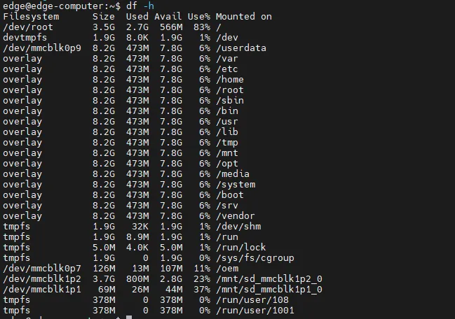</p>

<p align="center"><strong>Figure 4-53 Micro SD Card Slot</strong></p>

### 4.4.4 mSATA hard disk

(1) Log in to the system, run sudo fdisk -l, find your hard disk partition, as shown below is /dev/sda1

<p align="center">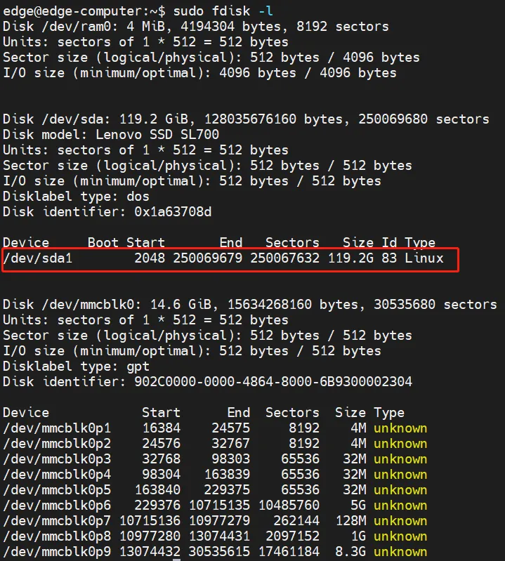</p>

<p align="center"><strong>Figure 4-54 fdisk Partition List</strong></p>

(2) Format the partition to the desired filesystem, such as ext4

<p align="center">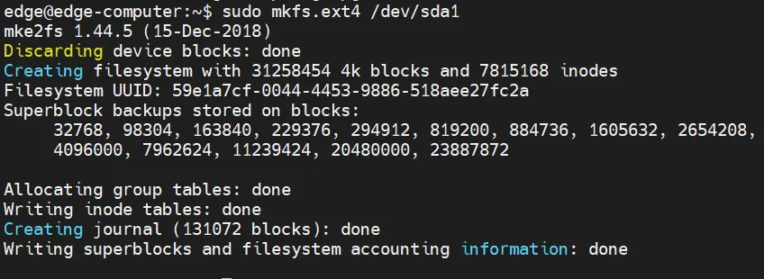</p>

<p align="center"><strong>Figure 4-55 Format Partition (ext4 Example)</strong></p>

(3) Create a mount point such as /mnt/sda1

(4) Edit vi /etc/fstab file,Add /dev/sda1/mn/sda1 ext4 defaults,nofail,x-systemd.device-timeout=10s 0 0 to the end line.

/dev/sda1: device partition, which needs to be configured by the user according to the actual situation

/mnt/sda1: mount point, which needs to be configured according to the actual situation

etx4 hard disk partition file system format, users need to configure according to the actual situation

defaults,nofail,x-systemd.device-timeout=10s 0 0 Fixed configuration, which is recommended, but can be modified as needed.

### 4.4.5 CAN bus interface

The CAN port of the EC942 supports the CAN bus.

**Configure the connection CAN interface**

By default, the CAN port will be initialized. If you need any other configuration, check the CAN device using the ip link command. To check the status of the CAN device, use the ip link command:

<p align="center"></p>

<p align="center"><strong>Figure 4-56 CAN Interface Link Status</strong></p>

To configure the CAN device, use ip link set can0 down to turn the device off first

<p align="center"></p>

<p align="center"><strong>Figure 4-57 Turn Off CAN Device</strong></p>

Then configure the bit rate (here's a 50k bit rate example) :

<p align="center">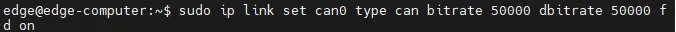</p>

<p align="center"><strong>Figure 4-58 Configure CAN Bit Rate</strong></p>

Finally turn the device back on

<p align="center"></p>

<p align="center"><strong>Figure 4-59 Turn On CAN Device</strong></p>

### 4.4.6 IO Debugging

The EC942 supports 4-way DI and 4-way DO. When you want to use IO port, please type dio\_mgmt command to control io input and output. Usage of dio\_mgmt:

<p align="center">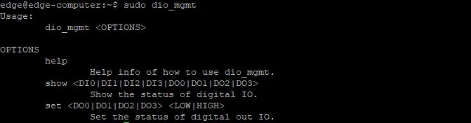</p>

<p align="center"><strong>Figure 4-60 dio_mgmt Command Usage</strong></p>

dio\_mgmt set D<I/O><number><HIGH/LOW> When you need to set a bit of IO port to high or low, type dio\_mgmt set d <I/O><number>< high/low >

<p align="center"></p>

<p align="center"><strong>Figure 4-61 dio_mgmt Set IO Level Example</strong></p>

Print the corresponding IO level information by typing dio\_mgmt show D<I/O><number>.

### 4.4.7 GPS

Some models of EC900 are integrated with GPS module, and the data serial port node is /dev/ttyS9.

If you want to view the details of the GPS, there are two ways to view it:

1.  Use stty to set up the serial port node and type cat to output the source data directly

<p align="center">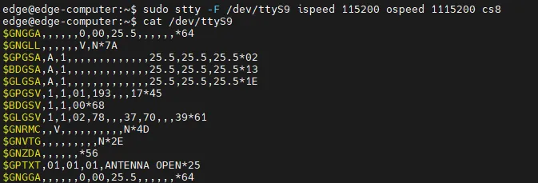</p>

<p align="center"><strong>Figure 4-62 GPS NMEA Output (cat)</strong></p>

2.  Typing gnss commands directly outputs the parsed time, latitude and longitude, and other information

<p align="center"></p>

<p align="center"><strong>Figure 4-63 GNSS Parsed Position Information</strong></p>

### 4.4.8 Toggle the machine button

**Turn off the device**

1\. Turn off the device by long pressing the on/off button for 8 seconds  

2\. You can use Linux commands to shut down all software running on the device and stop the system. However, after running this command, major components such as CPU, RAM, and storage devices will lose power.  

<p align="center"></p>

<p align="center"><strong>Figure 4-64 System Power-Off Command</strong></p>

**Boot the device**

Press the on/off button, and the system will perform the boot operation.

## 4.5 Safety

### 4.5.1 sudo Mechanism

In the EC900 series, the root user is disabled by default for improved security. `sudo` is a program that allows the system administrator to authorize specific users to execute commands as the root user or another user. The fundamental principle is to grant the minimum privileges required to complete a task. Using `sudo` is more secure than opening a root session for several reasons:

- Privileges can be granted to normal users without revealing the root password (`sudo` prompts for the current user's password).
- Privileged commands can be executed via `sudo` as needed, while routine work is performed as an unprivileged user, reducing potential damage from incorrect operations.
- Some system-level commands are not available directly to regular users, as shown in the following example.

<p align="center"></p>

<p align="center"><strong>Figure 4-65 sudo Permission Example</strong></p>

### 4.5.2 Firewalls

Netfilter/iptables is an excellent and free firewall tool based on packet filtering that comes with Linux systems. It is powerful and flexible, and can control data packets flowing into, out of, and through the server in fine detail.

### 4.5.3 TPM 2.0

TPM stands for "Trusted Platform Module." It is a hardware security module designed to provide security and encryption capabilities for computer systems. It is a secure microcontroller that can be embedded in a computer system or sold as a standalone hardware device. It contains a cryptographic coprocessor for storing encryption keys, digital certificates, and other secure data, and supports multiple cryptographic algorithms and security protocols. On the EC942, the standard TPM 2.0 protocol stack and TPM 2.0 tools have been integrated for user use.

## 4.6 Factory Restore and System Upgrade

### 4.6.1 Factory Restore

There are two methods to restore factory settings:

**Method 1: Command**

Type the following command. The system automatically restarts and restores factory settings.

```
sudo restore_factory
```

<p align="center"></p>

<p align="center"><strong>Figure 4-66 Factory Restore Command</strong></p>

**Method 2: Reset Button**

Long press the reset button for 10 to 20 seconds until the WARN indicator turns solid on. Release the button when the WARN indicator is solid on. The Error indicator blinks several times, and the system restarts to perform factory restoration. After restart, the WARN and Error indicators blink and the STATUS indicator is off for approximately 30 seconds. When the WARN and Error indicators stop flashing and the STATUS indicator starts flashing, factory restoration is complete.

> **Caution**: Do not power off the device while the WARN and Error indicators are blinking and the STATUS indicator is off. Powering off during this state may cause file loss and affect system functionality.

### 4.6.2 System Upgrade

System upgrades are performed using a USB flash drive or Micro SD card. If the storage device has multiple partitions, use the first partition. It is recommended not to create multiple partitions. The partition must be formatted in FAT32 format. This document uses upgrading to `EC942-V2.0.0.img` as an example.

1. Create an empty `ec900_img` directory in the root directory of the USB drive (or SD card). Place the `EC942-V2.0.0.img` file and `md5.txt` file provided by InHand into the `ec900_img` directory.
2. Ensure that the `MD5.txt` file contains only the MD5 hash value of `EC942-V2.0.0.img` on a single line. The EC942 does not support OTA upgrade of multiple image files.
3. Safely eject the USB flash drive (or SD card) from the computer. Do not unplug directly; use the "Eject" or "Safely Remove" action.
4. Insert the USB drive (or SD card) into the target EC942 device. The target device automatically verifies the `EC942-V2.0.0.img` file and performs the OTA upgrade. The WARN and ERROR indicators display accordingly during the upgrade. When WARN and ERROR return to normal, the upgrade is complete. Because the image file is large, the upgrade takes considerable time.
5. After the upgrade, the EC942 writes key information to the log file in the `ec900_img` directory. Check the related files for details.


## 4.7 Programming Guidelines

EC900 provides a device information description file in JSON format. Customers who need to operate IO, LED, serial port and other peripherals can obtain the device node information of these peripherals by querying the device description information file.

Device description file path: /tmp/ieos/etc/system\_info.json, the content is as follows:

{

    "device\_info":{

        "model\_info":{

            "model":"EC942",

            "pn":"LQA8-W-G",

            "sn":"CL9422343000019",

            "oem":"inhand",

            "features":";std;cell-LQA8;wlan;io;tmp2;"

        },

        "software\_info":{

            "boot\_loader":"1.0.1",

            "kernel":"4.19.232",

            "version":"V2.0.1-test.2",

            "OS":"Debian GNU/Linux 10 (buster)"

        },

        "hardware\_info":{

            "arch":"arm64",

            "soc":"rk3568",

            "interface":{

                "eth":\[

                    {

                        "iface\_name":"eth2",

                        "iface\_mac":"2E:62:32:7B:B5:28"

                    },

                    {

                        "iface\_name":"eth1",

                        "iface\_mac":"2A:62:32:7B:B5:28"

                    }

                \],

                "wlan":\[

                    {

                        "iface\_name":"wlan0",

                        "iface\_mac":"88:12:AC:FA:AD:53"

                    },

                    {

                        "iface\_name":"wlan1",

                        "iface\_mac":"8A:12:AC:FA:AD:53"

                    }

                \]

            },

            "gpio":\[

                {

                    "gpio\_name":"cellular\_power",

                    "dev\_node":"/sys/class/gpio/gpio0"

                },

                {

                    "gpio\_name":"sim\_switch",

                    "dev\_node":"/sys/class/gpio/gpio19"

                },

                {

                    "gpio\_name":"msata\_power",

                    "dev\_node":"/sys/class/gpio/gpio20"

                },

                {

                    "gpio\_name":"gnss\_power",

                    "dev\_node":"/sys/class/gpio/gpio110"

                },

                {

                    "gpio\_name":"ble\_power",

                    "dev\_node":"/sys/class/gpio/gpio220"

                }

            \],

            "user\_key":\[

                {

                    "user\_key\_name":"USER",

                    "dev\_node":"/sys/class/gpio/gpio95"

                }

            \],

            "uart":\[

                {

                    "uart\_name":"COM1",

                    "dev\_node":"/dev/ttyS3"

                },

                {

                    "uart\_name":"COM2",

                    "dev\_node":"/dev/ttyS4"

                }

            \],

            "io":{

                "di":\[

                    {

                        "di\_name":"DI1",

                        "dev\_node":"/sys/class/gpio/gpio487"

                    },

                    {

                        "di\_name":"DI2",

                        "dev\_node":"/sys/class/gpio/gpio488"

                    },

                    {

                        "di\_name":"DI3",

                        "dev\_node":"/sys/class/gpio/gpio489"

                    },

                    {

                        "di\_name":"DI4",

                        "dev\_node":"/sys/class/gpio/gpio490"

                    }

                \],

                "do":\[

                    {

                        "di\_name":"DO1",

                        "dev\_node":"/sys/class/gpio/gpio491"

                    },

                    {

                        "di\_name":"DO2",

                        "dev\_node":"/sys/class/gpio/gpio492"

                    },

                    {

                        "di\_name":"DO3",

                        "dev\_node":"/sys/class/gpio/gpio493"

                    },

                    {

                        "di\_name":"DO4",

                        "dev\_node":"/sys/class/gpio/gpio494"

                    }

                \]

            },

            "led":\[

                {

                    "led\_name":"USER1",

                    "dev\_node":"/sys/class/leds/user1"

                },

                {

                    "led\_name":"USER2",

                    "dev\_node":"/sys/class/leds/user2"

                },

                {

                    "led\_name":"4G/5G",

                    "dev\_node":"/sys/class/leds/cell"

                },

                {

                    "led\_name":"SIM1",

                    "dev\_node":"/sys/class/leds/sim1"

                },

                {

                    "led\_name":"SIM2",

                    "dev\_node":"/sys/class/leds/sim2"

                },

                {

                    "led\_name":"WARN",

                    "dev\_node":"/sys/class/leds/warn"

                },

                {

                    "led\_name":"ERROR",

                    "dev\_node":"/sys/class/leds/error"

                },

                {

                    "led\_name":"STATUS",

                    "dev\_node":"/sys/class/leds/status"

                },

                {

                    "led\_name":"L1",

                    "dev\_node":"/sys/class/leds/level1"

                },

                {

                    "led\_name":"L2",

                    "dev\_node":"/sys/class/leds/level2"

                },

                {

                    "led\_name":"L3",

                    "dev\_node":"/sys/class/leds/level3"

                }

            \]

        }

    }

}

### 4.7.1 A guide to IO Programming

Currently, there are a total of 8 IO interfaces on the device: for example, there are 4 input pins from DI0 to DI3 on the device panel; DO0-DO3 are 4 output pins.

The IO device nodes can be obtained from the device description file /tmp/ieos/etc/system\_info.json as follows:

DI0~DI3-----sys/class/gpio/gpio487~sys/class/gpio/gpio490

DO0~DO3------sys/class/gpio/gpio491~sys/class/gpio/gpio494

When you need to programming IO interface, direct manipulation background device nodes below the value value (sys/class/gpio/gpioxxx/value)

Case study:

When DO0 need to output high electricity at ordinary times, can be directly to sys/class/write 1 gpio/gpio491 / value

**echo 1 > /sys/class/gpio/gpio491/value**

When you need to check the DI0 level is, the same can be directly to check the sys/class/gpio gpio487 / the value of the value

**cat /sys/class/gpio/gpio487/value**

The full shell script:

  

#!/bin/bash

gpio491="/sys/class/gpio/gpio491/value"

gpio492="/sys/class/gpio/gpio492/value"

gpio493="/sys/class/gpio/gpio493/value"

gpio492="/sys/class/gpio/gpio494/value"

\# When DO0 needs to output a high level, you can directly write 1 to **sys/class/gpio/gpio491/value**.

if \[ -f "$gpio491" \]; then

    echo 1 > /sys/class/gpio/gpio491/value

else

    echo "no file exit "$gpio491

fi

\# When DO1 needs to output a low level, you can directly write 1 to **sys/class/gpio/gpio491/value.**

if \[ -f "$gpio492" \]; then

    echo 0 > $gpio492

else

    echo "no file exit "$gpio492

fi

gpio487="/sys/class/gpio/gpio487/value"

gpio488="/sys/class/gpio/gpio488/value"

gpio489="/sys/class/gpio/gpio489/value"

gpio490="/sys/class/gpio/gpio490/value"

\# When you need to check the level of DI0, you can directly check the value of **sys/class/gpio/gpio487/value**.

if \[ -f "$gpio487" \]; then

    cat $gpio487

else

    echo "no file exit "$gpio487

fi

### 4.7.2 Led Programming Guide

On the device, the user can use the two lights USER1 and USER2 to indicate the status. Please check the lamp label to confirm the position of the two lights USER1 and USER2.

According to the device description file /tmp/ieos/etc/system\_info.json, the device nodes of USER1 and USER2 can be obtained as:

user1: /sys/class/leds/user1

user2: /sys/class/leds/user2

There are some control files in /sys/class/leds/user1 to control the attributes and status of leds:

/ sys/class/leds/user1 / brightness: this file is used to control the user1 lights on or off. Write 1 to always on, write 0 to always off.

/ sys/class/leds/user1 / trigger: leds trigger, can write the timer timer trigger, write none said cancel the trigger.

/ sys/class/leds/user1 / delay\_on: it is time to file said led lights, is an unit with ms.

/ sys/class/leds/user1 / delay\_off: it is time to file said led lights, is an unit with ms.

If trigger is configured for timing, the value in the brightness will no longer take effect and will automatically change to 0.

To control the brightness of user2, replace user1 with USER2 in the file path.

Example:

Write 1 to the brightness file when you need the USER1 light to be on

echo 1 > /sys/class/leds/user1/brightness

When the USER1 light is needed to flash, write the timer to the trigger file and control the time of light and off by delay\_on and delay\_off


Echo # start timer timer > / sys/class/leds light    
echo 1 seconds/user1 / trigger   

\# > 1000 / sys/class/leds/user1 / delay\_on echo out    

\# 1 seconds   
1000 > /sys/class/leds/user1/delay\_off

Full shell script:

  

#!/bin/bash  

USER1\_BRIGTHNESS="/sys/class/leds/user1/brightness"

USER1\_TRIGGER="/sys/class/leds/user1/trigger"

USER1\_DELAY\_ON="/sys/class/leds/user1/delay\_on"

USER1\_DELAY\_OFF="/sys/class/leds/user1/delay\_off"

USER2\_BRIGTHNESS="/sys/class/leds/user2/brightness"

USER2\_TRIGGER="/sys/class/leds/user2/trigger"

USER2\_DELAY\_ON="/sys/class/leds/user2/delay\_on"

USER2\_DELAY\_OFF="/sys/class/leds/user2/delay\_off"

\# Light up the USER1 LED

if \[ -f "$USER1\_BRIGTHNESS" \]; then

    echo 1 > $USER1\_BRIGTHNESS

else

    echo "no file exit "$USER1\_BRIGTHNESS

fi

\# Light up the USER2 LED

if \[ -f "$USER2\_BRIGTHNESS" \]; then

    echo 1 > $USER2\_BRIGTHNESS

else

    echo "no file exit "$USER2\_BRIGTHNESS

fi

\# Set the USER1 LED to flash

if \[ -f "$USER1\_TRIGGER" \]; then

    echo timer > $USER1\_TRIGGER

else

    echo "no file exit "$USER1\_TRIGGER

fi

\# Set the USER2 LED to flash

if \[ -f "$USER2\_TRIGGER" \]; then

    echo timer > $USER2\_TRIGGER

else

    echo "no file exit "$USER2\_TRIGGER

fi

\# Set the USER1 LED to stay on for 1000ms

if \[ -f "$USER1\_DELAY\_ON" \]; then

    echo 1000 > $USER1\_DELAY\_ON

else

    echo "no file exit "$USER1\_DELAY\_ON

fi

\# Set the USER1 LED to stay off for 1000ms

if \[ -f "$USER1\_DELAY\_OFF" \]; then

    echo 1000 > $USER1\_DELAY\_OFF

else

    echo "no file exit "$USER1\_DELAY\_OFF

fi

\# Set the USER2 LED to stay on for 1000ms

if \[ -f "$USER2\_DELAY\_ON" \]; then

    echo 1000 > $USER2\_DELAY\_ON

else

    echo "no file exit "$USER2\_DELAY\_ON

fi

\# Set the USER2 LED to stay off for 1000ms

if \[ -f "$USER2\_DELAY\_OFF" \]; then

    echo 1000 > $USER2\_DELAY\_OFF

else

    echo "no file exit "$USER2\_DELAY\_OFF

fi

\# Turn off USER1 flashing

if \[ -f "$USER1\_TRIGGER" \]; then

    echo none > $USER1\_TRIGGER

else

    echo "no file exit "$USER1\_TRIGGER

fi

\# Turn off USER2 flashing

if \[ -f "$USER2\_TRIGGER" \]; then

    echo none > $USER2\_TRIGGER

else

    echo "no file exit "$USER2\_TRIGGER

fi

### 4.7.3 Cross-compilation

A user's own c/ C ++ program can be cross-compiled by using the cross-compilation toolchain on the development machine, and then the object file is uploaded to the EC942 device for execution.

Cross-compiler package: gcc-linaro-6.3.1-2017.05-x86\_64\_aarch64-linux-gnu.tar.gz

Here's how to configure the environment variables for the cross-compilation toolchain:

1.  Unzip gcc-linaro-6.3.1-2017.05-x86\_64\_aarch64-linux-gnu.tar.gz to /opt on your development machine (you can also unzip it to any other PATH, adjust the path environment variable in step 2)
2.  Edit the ~/.bashrc file and add a line PATH=$PATH:/opt/gcc-linaro-6.3.1-2017.05-x86\_64\_aarch64-linux-gnu/bin at the end of the file
3.  Execute source ~/.bashrc to make the environment variables work in the current terminal; The newly opened terminal will take effect automatically.

Using the classic hello world program as an example, create the following directories and files

mkdir ~/example   
touch ~/example/hello.c   
touch ~/example/Makefile  

The contents of the ~/example/hello.c file are as follows:

#include <stdio.h>  

int main(void)   
{   
       printf("hello, world! \\n");   
        return 0;    
}

The contents of the ~/example/Makefile are as follows:

\# Define TARGET and source filenames  
target := hellworld   
DIRS := $(shell find.-maxdepth 3-type d)    
SRCS := $(foreach dir,$(DIRS),$(wildcard $(dir)/\*.c))   
OBJS := $(SRCS:.c=.o)   


CC=aarch64-linux-gnu-gcc   

\# Define compiler and compile options    
CFLAGS := -Wall-Wextra -g-wno-unused-parameters  

\# define default TARGET    
all: $(TARGET)   

\# define target file dependencies and compile commands    
$(TARGET): $(OBJS)    
$(CC) $(CFLAGS) $(LIBS) $^ -o $@    

\# Define the command to compile the source file to the target file   
%.o: %.c   
$(CC) $(CFLAGS) $(LIBS) -C $< -o $@  

\# Define command to clear temporary files   
clean:   
rm -f $(TARGET) $(OBJS)  

\# declare pseudo target ".PHONY"   
.PHONY: all clean

Run make in the ~/example directory to generate the object file helloworld


## Appendix A Troubleshooting

### 1 Network Connection Issues

| Phenomenon | Possible Cause | Troubleshooting Steps | Corresponding Chapter |
|------------|--------------|----------------------|----------------------|
| Cannot connect to cellular network | SIM card not inserted or poorly connected | 1. Power off the device.<br>2. Check whether the SIM card is correctly inserted.<br>3. Reinsert the SIM card. | [SIM Card and Micro SD Card Installation](#sim-card-and-micro-sd-card-installation) |
| Cannot connect to cellular network | APN parameter configuration error | 1. Verify APN parameters against carrier-provided values.<br>2. Contact the carrier to obtain correct APN, username, and password. | [Scenario 2: Cellular Network Internet Access](#scenario-2-cellular-network-internet-access) |
| Cannot connect to cellular network | Weak signal or no signal | 1. Check whether cellular antennas are connected.<br>2. Adjust device position or antenna orientation. | [Antenna Installation](#antenna-installation) |
| Cannot connect to cellular network | Cellular function disabled | 1. Log in to the web management interface.<br>2. Navigate to 【Network】→【Cellular】and verify the function is enabled. | [Scenario 2: Cellular Network Internet Access](#scenario-2-cellular-network-internet-access) |
| Cannot connect to Wi-Fi network | SSID or password incorrect | 1. Verify the SSID and WPA/WPA2 PSK key.<br>2. Rescan and re-enter credentials. | [Scenario 3: Wi-Fi Station Connection](#scenario-3-wi-fi-station-connection) |
| Cannot connect to Wi-Fi network | Authentication or encryption mode mismatch | 1. Confirm the access point supports the selected authentication method.<br>2. Try WPA-PSK/WPA2-PSK Mixed mode. | [Scenario 3: Wi-Fi Station Connection](#scenario-3-wi-fi-station-connection) |
| Ethernet interface has no IP address | IP configuration error | 1. Verify whether static IP, netmask, and gateway are correct.<br>2. Alternatively, switch to DHCP Client. | [Scenario 4: Ethernet Network Configuration](#scenario-4-ethernet-network-configuration) |
| Ethernet interface has no IP address | Network service not restarted | 1. Restart the network service via command line.<br>2. Or reboot the device. | [Scenario 4: Ethernet Network Configuration](#scenario-4-ethernet-network-configuration) |

### 2 Access Issues

| Phenomenon | Possible Cause | Troubleshooting Steps | Corresponding Chapter |
|------------|--------------|----------------------|----------------------|
| Cannot open web management page | IP address error | 1. Confirm the computer is in the same subnet as the device.<br>2. Check the default IP address (192.168.3.100 or 192.168.4.100). | [Web Access](#web-access) |
| Cannot open web management page | Device model does not support web management | 1. Refer to the product specification to confirm web management support.<br>2. Use SSH for management instead. | [Web Access](#web-access) |
| Cannot open web management page | Browser compatibility issue | 1. Use Chrome or another modern browser.<br>2. Clear browser cache and retry. | [Web Access](#web-access) |
| SSH connection fails | IP address or subnet mismatch | 1. Verify the computer IP is in the same subnet as the target port.<br>2. Check network cable connection. | [SSH Access](#ssh-access) |
| SSH connection fails | Authentication error | 1. Verify username is `edge` and password is `security@edge`.<br>2. Check whether Caps Lock is enabled. | [SSH Access](#ssh-access) |
| SSH command not found | Not running as root or sudo | 1. Type `sudo -s` to switch to root.<br>2. Or prefix commands with `sudo`. | [Switching to the Root User](#switching-to-the-root-user) |

### 3 Indicator Light Abnormalities

| Phenomenon | Possible Cause | Troubleshooting Steps | Corresponding Chapter |
|------------|--------------|----------------------|----------------------|
| PWR indicator off | Power supply abnormal | 1. Check whether the power adapter is correctly connected.<br>2. Verify input voltage is within 9–48 VDC range.<br>3. Check power cable and terminal. | [Power Connection](#power-connection) |
| STATUS indicator solid off | System startup exception | 1. Check power supply stability.<br>2. Perform factory restore if the issue persists. | [Factory Reset](#factory-reset) |
| WARN indicator flashing | Factory restoration in progress | 1. Do not power off the device.<br>2. Wait approximately 30 seconds for completion. | [Factory Reset](#factory-reset) |
| WARN indicator flashing | Cellular dialing abnormality | 1. Check SIM card and antenna.<br>2. Verify APN parameters.<br>3. Check signal strength. | [Scenario 2: Cellular Network Internet Access](#scenario-2-cellular-network-internet-access) |
| 4G/5G indicator off | Cellular not connected | 1. Verify cellular function is enabled.<br>2. Check SIM card and antenna.<br>3. Review APN and network mode settings. | [Scenario 2: Cellular Network Internet Access](#scenario-2-cellular-network-internet-access) |

### 4 Peripheral Interface Issues

| Phenomenon | Possible Cause | Troubleshooting Steps | Corresponding Chapter |
|------------|--------------|----------------------|----------------------|
| USB storage device not mounted | File system not supported or partition issue | 1. Verify the partition is formatted to a supported file system.<br>2. Check `dmesg` logs for errors. | [USB 2.0 Interface](#usb-20-interface) |
| USB storage data loss | Device disconnected without sync | 1. Always run `sync` before disconnecting.<br>2. Exit `/media/usb*` directory before unmounting. | [USB 2.0 Interface](#usb-20-interface) |
| Micro SD card not recognized | Hotplug not supported | 1. Power off the device before inserting or removing the card.<br>2. Reinsert and power on. | [SIM Card and Micro SD Card Installation](#sim-card-and-micro-sd-card-installation) |
| mSATA hard drive not detected | Drive not initialized or formatted | 1. Run `sudo fdisk -l` to check detection.<br>2. Format the partition if needed.<br>3. Add mount point in `/etc/fstab`. | [mSATA Hard Drive](#msata-hard-drive) |
| Serial port communication failure | Mode mismatch | 1. Verify the serial port mode (RS-232/RS-485/RS-422) matches the connected device.<br>2. Use `ih_uart_ctl` to switch mode if necessary. | [Serial Port Configuration](#serial-port-configuration) |
| CAN bus communication failure | Bit rate mismatch | 1. Verify the configured bit rate matches the bus.<br>2. Reconfigure using `ip link set can0 type can bitrate <value>`. | [CAN Bus Interface Configuration](#can-bus-interface-configuration) |

## Appendix B Safety Precautions

1. The device must be operated within the specified temperature and humidity ranges. The working temperature range is −20 °C to 70 °C, and ambient humidity must be 5% to 95% without condensation.

2. Do not use the device in explosive or flammable environments.

3. Before connecting power, verify that the input voltage is within the device specification (9–48 VDC).

4. SIM cards and Micro SD cards do not support hot swapping. The device must be powered off before inserting or removing cards.

5. Before disconnecting a USB mass storage device, the `sync` command must be executed to prevent data loss.

6. During factory restoration, the device must not be powered off while the WARN and Error indicators are blinking and the STATUS indicator is off. Powering off during this state may cause file loss and affect system functionality.

7. When installing or removing the mSATA hard drive, ensure the device is powered off.

8. Antennas must be properly tightened into the corresponding SMA interfaces to ensure reliable wireless communication and prevent damage to the connectors.

9. The device contains no user-serviceable parts inside the enclosure. Disassembly by non-professional personnel is not recommended.

> **Warning**: Non-professional personnel should not open the device enclosure. Risk of electric shock exists.

## FAQ

### Question 1: What is the difference between an edge computer and a common industrial PC?

1. Edge computers such as the EC942 are designed for industrial IoT environments with compact form factors, DIN rail mounting, wide operating temperature ranges, and integrated wireless connectivity (4G/5G, Wi-Fi).
2. The EC942 integrates InHand DeviceSupervisor Agent (DSA) for data collection and cloud deployment, and supports the DeviceLive remote management platform.
3. Unlike common industrial PCs, the EC942 provides isolated digital I/O, CAN bus, and multiple serial interfaces specifically for industrial automation and edge computing scenarios.

### Question 2: How to restore factory settings when the device cannot be accessed via SSH or web?

1. Use the hardware reset button on the front panel.
2. Press and hold the reset button for 10 to 20 seconds until the WARN indicator turns solid on.
3. Release the button. The system restarts and performs factory restoration automatically.
4. After approximately 30 seconds, when the WARN and Error indicators stop flashing and the STATUS indicator starts flashing, restoration is complete.

> **Caution**: Do not power off the device during the restoration process.

### Question 3: Why does the cellular network show as connected but data cannot be transmitted?

1. False connection may have occurred. Enable ICMP probing in the cellular configuration to detect and automatically recover from false connections.
2. Check whether the APN parameters match the carrier requirements.
3. Verify that the default route metric is correctly configured when multiple network interfaces (cellular, Wi-Fi, Ethernet) are active.
4. Check signal strength using the L1, L2, L3 indicators or the cellular status page.

### Question 4: Can the root user log in directly via SSH?

No. The root user is disabled by default for security reasons. Log in with the `edge` user and use `sudo` to execute privileged commands. The `edge` user is in the `sudo` group by default.

### Question 5: What file systems are supported for USB and Micro SD storage?

The EC942 automatically mounts partitions of USB storage devices and Micro SD cards to `/mnt/`. Common Linux file systems such as ext4, FAT32, and VFAT are generally supported. For mSATA hard drives, ext4 is recommended.
