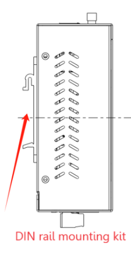
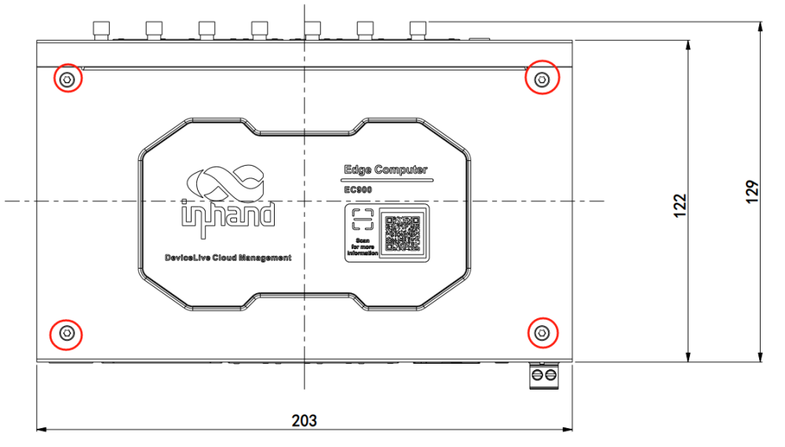
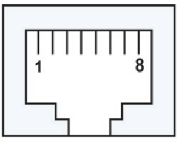
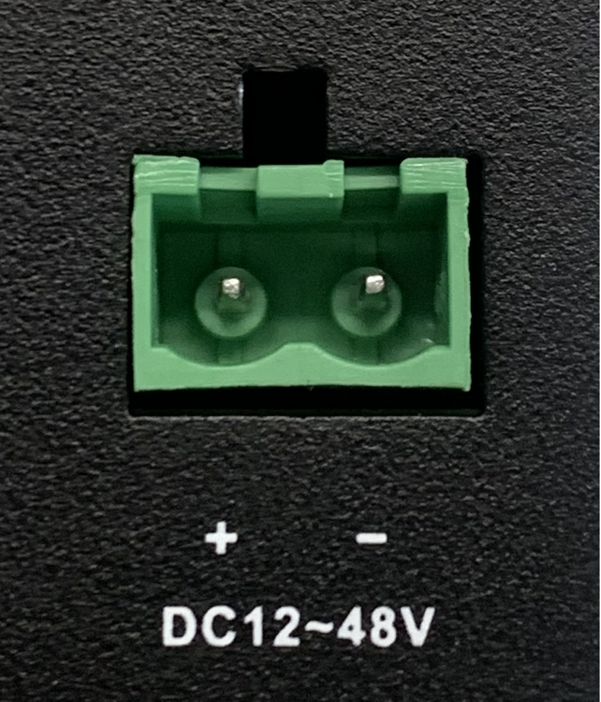
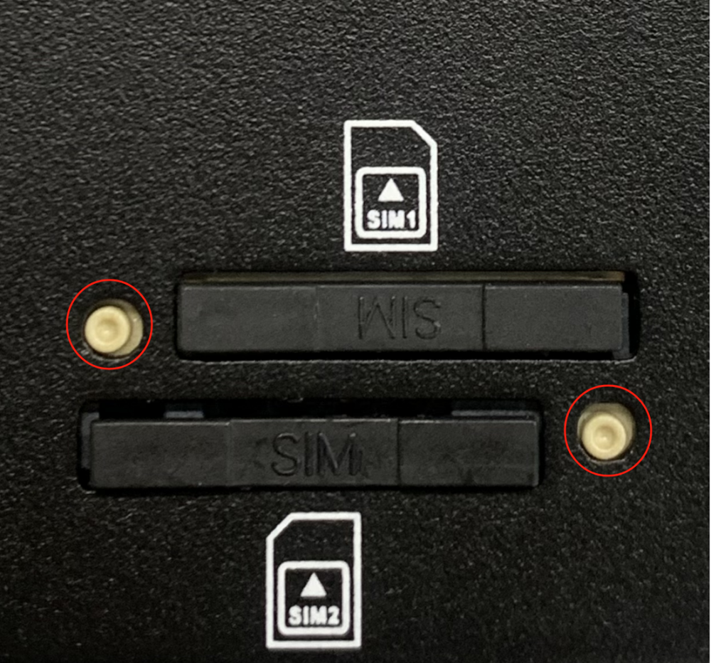
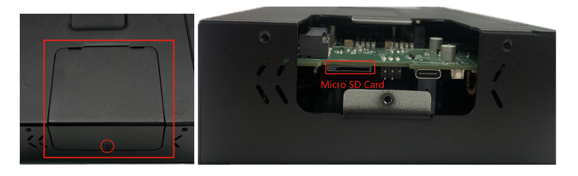
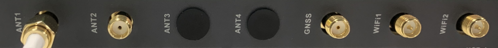
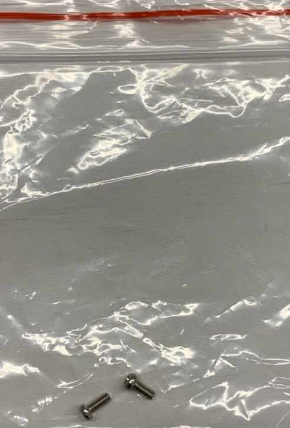
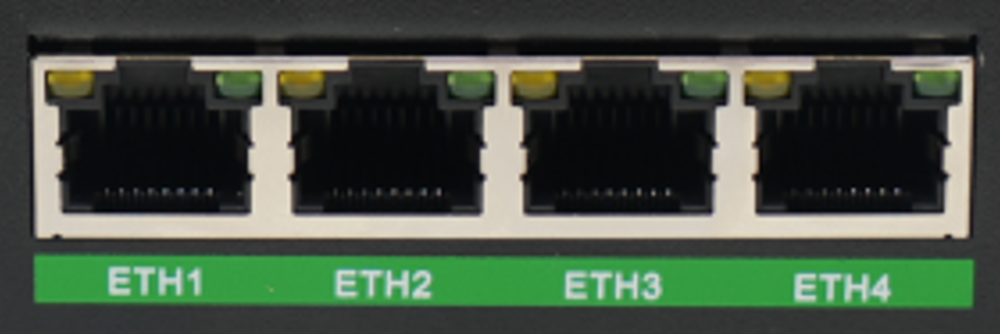

Edge Computer EC950 Series

Quick Start Guide

Version 1.0, May 2024

[www.inhand.com](http://www.inhand.com.cn \h)

The software described in this manual is provided under a license agreement and can only be used in accordance with the terms of that agreement. 

Copyright Statement

© 2024 InHand Network reserves all rights. 

Trademark 

The InHand logo is a registered trademark of InHand Network. 

All other trademarks or registered trademarks in this manual belong to their respective manufacturers. 

Disclaimers

Our company reserves the right to make changes to this manual, and any subsequent changes to the product will not be notified separately. We are not responsible for any direct, indirect, intentional or unintentional damage or hidden dangers caused by improper installation or use. 

# 1 Products

EC954 is a high-performance multi-interface edge computer with AI scaling up to 26 TOPS AI arithmetic and supports TensorRT/cuDNN/VisionWorks/OpenCV AI framework. It is equipped with ARM Cortex-A55@2.0GHz Quad-core processor to provide a powerful computing platform. The product adopts the distribution version of Linux system, providing users with a flexible and diverse secondary development environment. It supports security features such as Secure Boot and TPM2.0 to ensure software and data security. With built-in DeviceSupervisor™ Agent (DSA) service, users can easily collect, process and upload data to the cloud, and support DeviceLive cloud management.

# 2 Packing List

| Number | Name | Quantity | Remarks |
| --- | --- | --- | --- |
| 1 | EC954 Host | 1 | — |
| 2 | Power Adapter | 1 | Optional Equipment |
| 3 | Wi-Fi Antenna | 1 | Standard Equipment (Depending on the device model) |
| 4 | GNSS Antenna | 1 | Standard Equipment (Depending on the device model) |
| 5 | Cellular Antenna | 1 | Standard Equipment (Depending on the device model) |
| 6 | Detachable Pin | 1 | — |
| 7 | Warranty Card | 1 | — |

  

# 3 Product Appearance

The panel layout of the EC954 is shown below:

## 3.1 Front panel

  

## 3.2 Rear panel

**

**

# 4 Indicator Description

The EC954 has 12 LEDs to indicate the power supply and system operating status.

| LED | Name | Definition |
| --- | --- | --- |
| PWR | Power indicator | Power On and always on |
| STATUS | System operation status indicator | When the system starts normally, STATUS blinks, and if an abnormality occurs during the system startup phase resulting in a system startup failure; or if the factory restore operation has not yet been completed, STATUS goes out for a long time. |
| WARN | warning indicator | The WARN lamp blinks when a warning exception occurs in the system and a system upgrade or factory restore has not been completed. |
| ERR | error indicator | The Error light blinks when a serious system error has occurred and a system upgrade or factory restore has not been completed. |
| SIM1 | SIM1 card indicator | Always on when SIM 1 is selected for dialling, long off when SIM 2 is selected for dialling or when dialling is switched off. |
| SIM2 | SIM1 card indicator, always on when selected | Always on when SIM 2 is selected for dialling, long off when SIM 1 is selected for dialling or when dialling is switched off. |
| USER1 | User programmable indicator 1 | Default off, user programmable control |
| USER2 | User programmable indicator 2 | Default off, user programmable control |
| 4G/5G | Cellular network connection status indicator | Always on after successful dialling |
| L1 | cellular network signal strength | See cellular network signal strength indicator description |
| L2 | cellular network signal strength |
| L3 | cellular network signal strength |

Cellular Network Signal Strength Indicator

| LED | no signal | Weak signal (RSSI < -90) | Medium signal (-90 <= RSSI < -70) | Strong signal (RSSI >= -70) |
| --- | --- | --- | --- | --- |
| L1 | OFF | ON | ON | ON |
| L2 | OFF | OFF | ON | ON |
| L3 | OFF | OFF | OFF | ON |

In addition to the combination of L1, L2, and L3 signals to indicate cellular signal strength, there is also a set of LED combinations to mark the process of restoring the factory.

| LED | STATE |
| --- | --- |
| WARN | Blinking |
| ERROR | Blinking |
| STATUS | OFF |

After the execution of restoring factory settings, the system will perform a reboot, after the reboot is completed, the restoration of the factory is not completed, at this time, the WARN light and ERROR blinking, STATUS off, in this state can not be powered off the device, otherwise it may lead to the loss of some files and affect the system function. This state will last for 30 seconds, when the restoration of factory is completed, WARN and ERROR are off and STATUS is blinking.

# 5 Installation of EC954

## 5.1 DIN rail mounting

The mounting plate for the DIN rail is attached to the lower panel of the EC954 and is installed as follows:

1\. Snap the top hook of the DIN rail mounting plate into the top of the DIN rail bracket.

2\. Slowly push the device forward in the direction of the DIN rail bracket so that the bottom end of the DIN rail snaps into place.

  

## 5.2 Wall mounting

The EC954 can be mounted using a wall mounting kit, which needs to be purchased separately. Follow the steps below for installation

Step 1: Secure the wall mounting kit to the lower panel of the EC954 using the screws

Step 2: Once the wall mounting kit has been successfully fixed to the EC954, use the screws to fix the EC954 to the wall or cabinet.

# 6 Connector Description

## 6.1 Ethernet Interface

The EC954 has four RJ45 Ethernet ports that support 10M/100M/1000M adaptive rates.The RJ45 pins are described below:

| RJ45 Pin Number | 10M/100M | 1000M |
| --- | --- | --- |
| 1 | TX+ | TRD(0)+ |
| 2 | TX- | TRD(0)- |
| 3 | RX+ | TRD(1)+ |
| 4 | \- | TRD(2)+ |
| 5 | \- | TRD(2)- |
| 6 | RX- | TRD(1)- |
| 7 | \- | TRD(3)+ |
| 8 | \- | TRD(3)- |

## 6.2 Serial ports

EC954 supports 8 serial ports, the first 4 support RS-232 or RS-485 or RS-422 communication, the software can be configured, the last 4 are fixed to RS-485.

The pinouts for the first four circuits are shown below:

| RJ45 Pin Number | RS-232 | RS-422 | RS-485 |
| --- | --- | --- | --- |
| 1 | DSR | \- | \- |
| 2 | RTS | TxD+ | \- |
| 3 | GND | GND | GND |
| 4 | TxD | TxD- | \- |
| 5 | RxD | RxD+ | Data+ |
| 6 | DCD | RxD- | Data- |
| 7 | CTS | \- | \- |
| 8 | DTR | \- | \- |

## 6.3 CAN port

The EC954 has a 2-way CAN bus interface that supports the CAN 2.0A/B standard. CAN2 is compatible with CAN FD up to 5Mbps.

| RJ45 Pin Number | Identification | Function Description |
| --- | --- | --- |
| 1 | CAN\_H | CAN high level data line |
| 2 | CAN\_L | CAN Low Level Data Line |

## 6.4 Digital Input Interface

| Interface identification | Features | descriptions |
| --- | --- | --- |
| COM | DI Common | 4 Digital Inputs DI, 4 Digital Inputs  Dry contact status  "1": closed dry contact status "0": disconnected  Isolation: 3000 VDC |
| DI0 | Digital Input 0 Connector |
| DI1 | Digital Input 1 Connector |
| DI2 | Digital Input 2 Connector |
| DI3 | Digital Input 3 Connector |

## 6.5 Digital Output Interface

| Interface identification | Features | descriptions |
| --- | --- | --- |
| GND | DO ground terminal | 4 digital outputs DO, DO, DO, DO, DO  Isolated 3000VDC |
| DO0 | Digital Output 0 Connector |
| DO1 | Digital Output 1 Connector |
| DO2 | Digital Output 2 Connector |
| DO3 | Digital Output 3 Connector |

## 6.6 USB interface

The EC954 provides two USB 2.0 Host ports, which are mainly used for expanding storage devices and connecting a mouse and keyboard.

EC954 supports USB storage device hot-plugging. It will mount all the partitions automatically.EC954 will mount all the USB storage device partitions to the /mnt/ path.The naming format of the mount folder is usb\_<node>\_<num>. Where <node> is the device node name of the partition and <num> can be a number from 0 to 9.

ATTENTION:  

Before disconnecting the USB mass storage device, remember to enter the sync sync command to prevent data loss. When you disconnect the storage device, exit from the /media/\* directory. If you stay in /media/usb\*, the automatic uninstallation process will fail. If this happens, type umount /media/usb\* to uninstall the device manually!  

## 6.7 User Programmable Keys

The EC954 provides an API interface that users can call to detect the state of programmable keys and then implement their own key logic.

## 6.8 DC input

The EC954 supports 12 to 48 VDC power supply. After removing the factory supplied power adapter from the accessory box, insert the adapter terminals into the DC port of the EC954 and connect the power adapter. When the PWR power indicator lights up, it means that the device has been properly powered up.

## 6.9 SIM cards

EC954 supports 2 SIM card slots, SIM card needs to be installed in power off state. Remove the card removal pin in the accessory box and press the corresponding pin hole to remove the corresponding SIM card tray. Install the SIM card into the SIM card tray and press the tray back into the slot to complete the SIM card installation.

## 6.10 Micro SD card

The EC954 has a slot for a MircoSD card. SD does not support hot-swap and needs to be operated with power off. It will mount all partitions automatically. EC954 will mount all micro SD memory card partitions under /mnt/ path, the naming format of the mount folder is sd\_<node>\_<num>. Where <node> is the device node name of the partition and <num> is a number from 0 to 9.

To install a Micro SD card, remove the protective case. Install the Micro SD card into the SD card slot located on the left panel of the EC954.

  

## 6.11 Antenna Interface

EC954 has a total of 7 antenna interfaces, and different models are equipped with different numbers of antennas. Specific models corresponding to the antenna support can be found in the "EC954 Series Edge Computer Product Specification" in the "Ordering Information" section.

| Identification | Name |
| --- | --- |
| ANT1 | 4G LTE Main Antenna/5G Antenna |
| ANT2 | 4G LTE Diversity Receiver Antenna/5G Antenna |
| GNSS | GNSS antenna |
| ANT3 | 5G antenna |
| ANT4 | 5G antenna |
| WiFi1 | WiFi antenna |
| WiFi2 | WiFi antenna |

The product model shown below is EC954-FQ58-B, which supports 2 cellular antennas, 2 WIFI antennas and 1 GNSS antenna. Screw the required antennas into the corresponding SMA antenna connector to complete the antenna installation, as shown in ANT1.

## 6.12 mSATA Hard Drive Interface

EC954 supports mSATA hard drive, factory default does not come with mSATA hard drive, if users have large capacity storage needs, they need to purchase their own mSATA hard drive, you can also consult with Imation for mSATA purchase.

The installation procedure is shown below:

Step 1: Use a screwdriver to open the protective casing of the hard disc, after disassembling it as shown in the picture below:

 

Step 2: Align the drive with the slot, push it to the right and snap it into place; remove the screws (M2) to secure the right side of the drive.

 

Step 3: Reinstall the removed protective housing back into the EC954

# 7、Power supply and environmental requirements

| Input Voltage | 12 to 48 VDC (two-pin terminal, V+, V-) |
| --- | --- |
| **power** | Standby power: 120mA-200mA@12V |
| Operating power: 150mA-320mA@12V |
| Peak power: 320mA@12V |
| **operating temperature** | \-20-70°C (-4-158°F) |
| **Storage temperature** | \-40-85°C (-40-185°F) |
| **Environmental humidity** | 5~ 95% (no frosting) |

# 8\. Access to EC954

Connect to the EC954 using the following default IP address

| Port | Default IP |
| --- | --- |
| ETH 1 | 192.168.3.100 |
| ETH 2 | 192.168.4.100 |
| ETH 3 | 192.168.5.100 |
| ETH 4 | 192.168.6.100 |

Step 1: Interconnect the PC and EC954

Insert one end of the cable into any of the EC954's network ports as shown in the figure below, and the other end into the computer's network port, and set the computer's IP address to the same network segment as the device interface address

Way 1: Use Linux native commands for network management and system administration

Click on the link [http://www.chiark.greenend.org.uk/~sgtatham/putty/download.html](http://www.chiark.greenend.org.uk/~sgtatham/putty/download.html) to download PuTTY (free software) to establish a connection to the edge computer EC954 by means of SSH commands in a Windows environment. The default username for login is on the back panel of the device

The following is an example of connecting using SSH:

Mode 2: Network management and system management via the web

EC954 supports WEB interface management based on IEOS, which is a set of network management and system management programmes developed by IEOS running on Linux system, and IEOS can provide web interface services. Take the ETH 2 plugged into EC954 at one end of the network port as an example, the login parameters are as follows:

Login: https:[https://192.168.4.100:9100](https://192.168.4.100:9100/)

Initial login account: adm

Initial login password: 123456

The following figure shows an example of using a WEB connection:

**Explanation：N****ot all EC954 m**odels support the WEB interface management function, please refer to the "Ordering Information" section in the EC954 Series Edge Computer Datasheet for specific support.