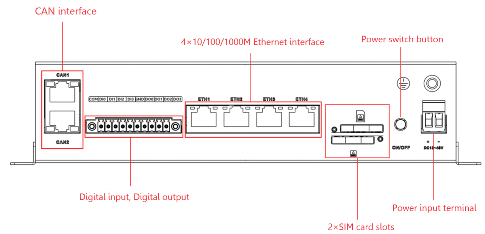
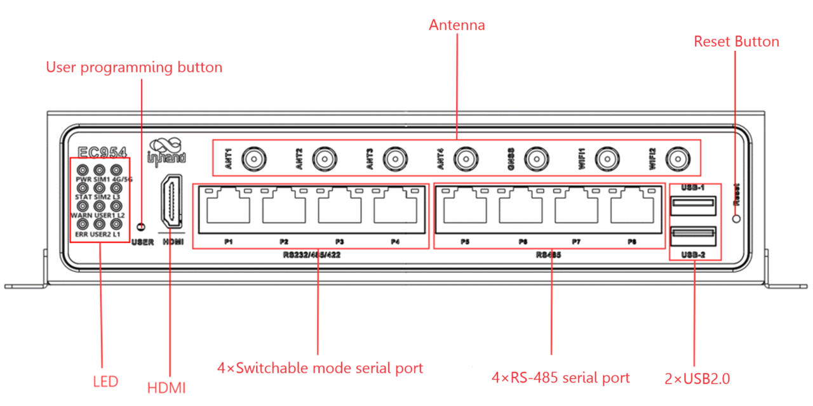
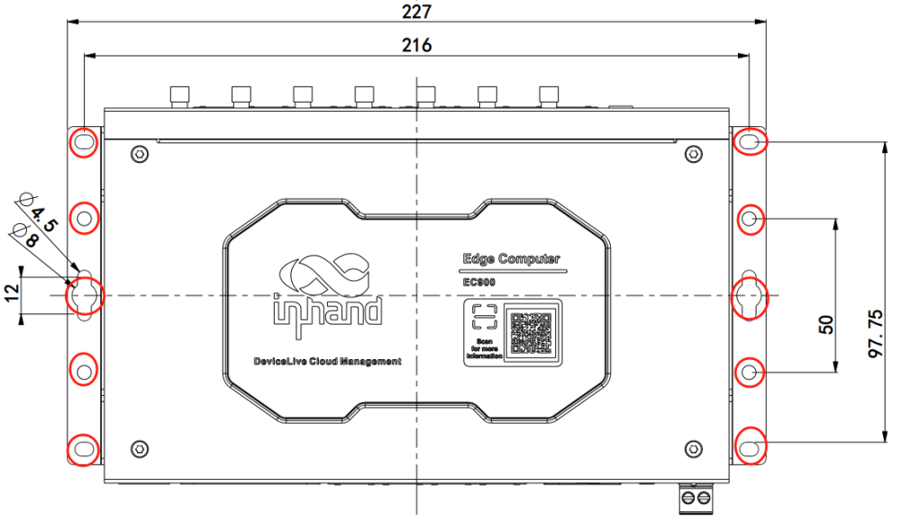
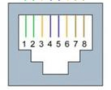
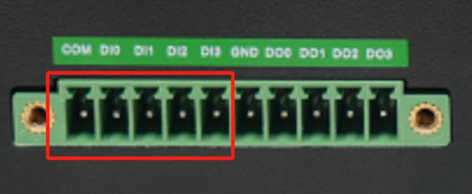
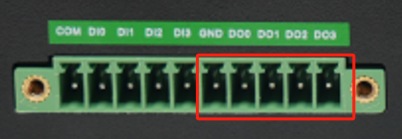
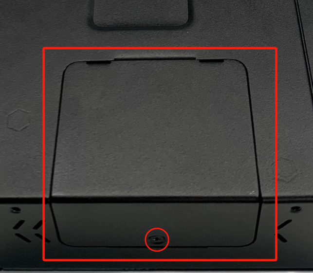
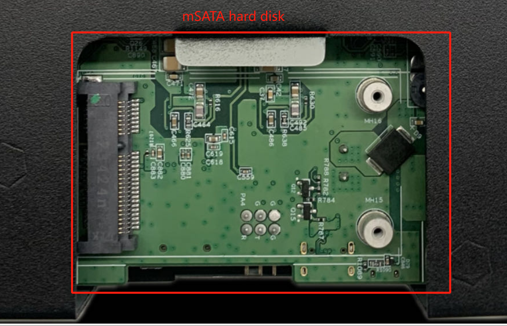
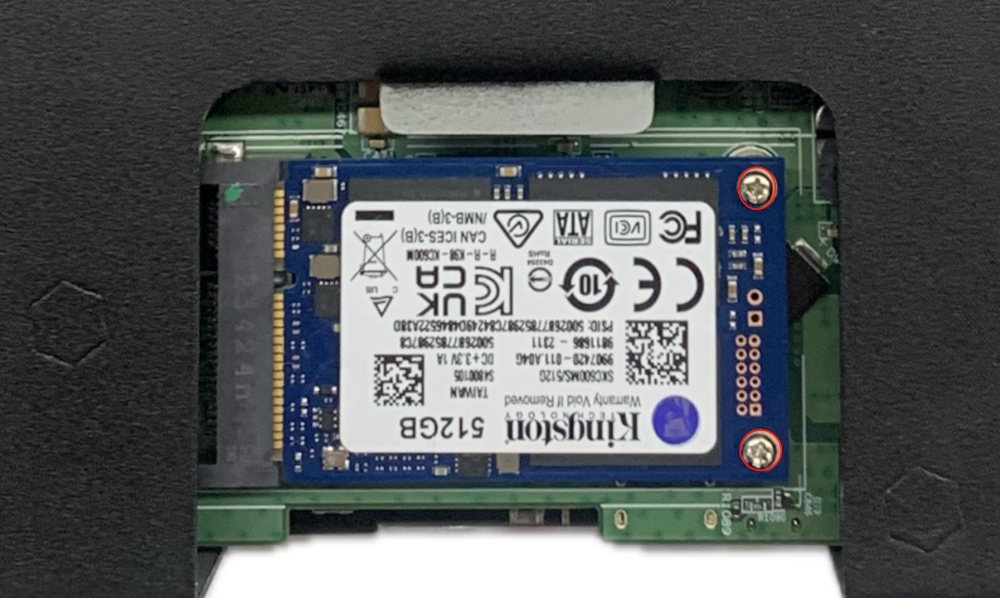
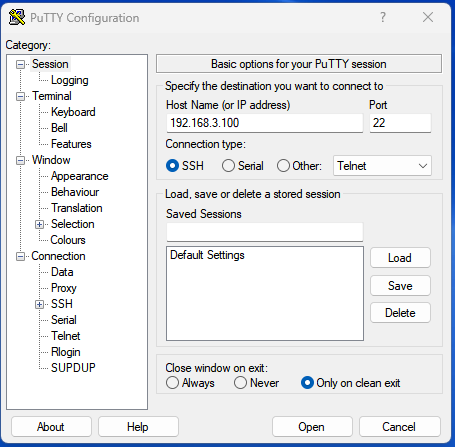

# EC954 Quick Start Guide

# Part 1: Quick Installation (Step-by-Step)

> **You need to:** Unbox → Mount the device → Connect power and Ethernet → (If using cellular) **Power off** to install SIM and connect antennas → Power on → Set PC to same subnet → Open Web in browser.
> **Then:** Scroll down to **Part 2** for packing list, LED meanings, mounting details, pinouts, and more.

## Must-Read Summary (Before wiring and powering on)

| Item | Requirement |
|------|-------------|
| Power Supply | **12 to 48 V DC**, two-pin terminal **V+ / V−** (or supplied adapter); **PWR solid on** means powered. |
| SIM / Micro SD | **Must power off** to install or remove; **no hot-swap**. |
| USB Storage | Supports hot-plug; **enter `sync` before disconnecting** to prevent data loss. |
| Cellular / Wi-Fi / GNSS Antennas | Screw into matching **silkscreen** SMA connectors; quantity varies by model (see Product Specification Ordering Information). |
| Factory Restore | **Do not power off** during the 30-second restoration state (WARN and ERR blinking, STATUS off), or files may be lost. |

## Step 1: Check the device against the physical unit and identify panel and interface areas

Take the EC954 out of the box and compare it with the front and rear panels below. Locate the Ethernet ports, power terminal, serial ports, SIM slots, antenna connectors, and Micro SD slot.

For the full panel layout, see §2.2.

## Step 2: Mount the device to a DIN rail or cabinet

Align the DIN rail mounting plate on the bottom of the EC954 with a standard DIN rail and snap it into place. If you prefer wall mounting, attach the wall mounting kit (purchased separately) to the bottom panel first, then fix the device to the wall.

For detailed DIN rail and wall mounting steps, see §2.4.

## Step 3: Connect power and Ethernet

Strip the power cable and insert the V+ and V− wires into the DC terminal block. Tighten the screws. Connect the other end of the power cable to a 12–48 V DC source. Insert an Ethernet cable into any of the four RJ45 ports.

For Ethernet pinouts and serial port wiring, see §2.5.1 and §2.5.2.

## Step 4: (If using cellular) Power off to install SIM and connect antennas

**Make sure the device is powered off.** Use the detachable pin from the accessory box to eject the SIM tray. Place the SIM card into the tray and push it back into the slot. Screw the required antennas into the SMA connectors according to the silkscreen labels.

For SIM slot details and the antenna name table, see §2.5.6.

## Step 5: Power on and confirm the device is ready

Apply power. The **PWR** LED should light up solid. After the system starts normally, the **STATUS** LED begins blinking.

If STATUS stays off for a long time, a startup abnormality or incomplete factory restore may be occurring. See §2.3 for full LED meanings.

## Step 6: Log in via PC and browser

1. Connect your PC to one of the EC954 Ethernet ports with a cable.

   

2. Set your PC's IP address to the same subnet as the connected port:

   | Port | Default IP |
   | :---: | :---: |
   | ETH 1 | 192.168.3.100 |
   | ETH 2 | 192.168.4.100 |
   | ETH 3 | 192.168.5.100 |
   | ETH 4 | 192.168.6.100 |

3. Open a browser and enter the corresponding HTTPS URL (for example, `https://192.168.4.100:9100` when connected to ETH 2).
4. When the certificate warning appears, accept it and continue.
5. Log in with the default account:
   - Username: **adm**
   - Password: **123456**

> **Note:** Not all EC954 models support the WEB interface management function. Refer to the Ordering Information section in the EC954 Series Edge Computer Datasheet for details.

For SSH login and troubleshooting, see §2.7.

## Installation Self-Check

- ☐ Device is securely mounted (DIN rail or wall).
- ☐ Power and Ethernet are connected; if using cellular, SIM and antennas are in place.
- ☐ **PWR is solid on** and **STATUS is blinking**.
- ☐ Browser opens the Web login page and login is successful.

If STATUS stays off or WARN/ERR are blinking unexpectedly, check the LED table in §2.3. For a factory restore, see §2.7.

---

# Part 2: Detailed Information

## 2.1 Packing List

### Standard Accessories

| No. | Name | Quantity | Unit | Remarks |
| --- | --- | --- | --- | --- |
| 1 | EC954 Host | 1 | pc | — |
| 2 | Wi-Fi Antenna | 1 | pc | Depending on device model |
| 3 | GNSS Antenna | 1 | pc | Depending on device model |
| 4 | Cellular Antenna | 1 | pc | Depending on device model |
| 5 | Detachable Pin | 1 | pc | For SIM tray ejection |
| 6 | Warranty Card | 1 | pc | — |

### Optional Accessories

| No. | Name | Quantity | Unit | Remarks |
| --- | --- | --- | --- | --- |
| 1 | Power Adapter | 1 | pc | — |

> For specific antenna support by model, see the Ordering Information section in the EC954 Series Edge Computer Product Specification.

## 2.2 Product Structure and Identification

EC954 is a high-performance multi-interface edge computer with AI scaling up to 26 TOPS AI arithmetic and supports TensorRT/cuDNN/VisionWorks/OpenCV AI framework. It is equipped with ARM Cortex-A55@2.0GHz Quad-core processor to provide a powerful computing platform. The product adopts the distribution version of Linux system, providing users with a flexible and diverse secondary development environment. It supports security features such as Secure Boot and TPM2.0 to ensure software and data security. With built-in DeviceSupervisor™ Agent (DSA) service, users can easily collect, process and upload data to the cloud, and support DeviceLive cloud management.

### Front Panel

### Rear Panel

The EC954 provides an API interface that users can call to detect the state of programmable keys and then implement their own key logic.

## 2.3 LEDs and Reset Key

The EC954 has 12 LEDs to indicate the power supply and system operating status.

### 2.3.1 Running Status LEDs

| LED | Name | Definition |
| --- | --- | --- |
| PWR | Power indicator | Power On and always on |
| STATUS | System operation status indicator | When the system starts normally, STATUS blinks, and if an abnormality occurs during the system startup phase resulting in a system startup failure; or if the factory restore operation has not yet been completed, STATUS goes out for a long time. |
| WARN | Warning indicator | The WARN lamp blinks when a warning exception occurs in the system and a system upgrade or factory restore has not been completed. |
| ERR | Error indicator | The Error light blinks when a serious system error has occurred and a system upgrade or factory restore has not been completed. |
| SIM1 | SIM1 card indicator | Always on when SIM 1 is selected for dialling, long off when SIM 2 is selected for dialling or when dialling is switched off. |
| SIM2 | SIM1 card indicator, always on when selected | Always on when SIM 2 is selected for dialling, long off when SIM 1 is selected for dialling or when dialling is switched off. |
| USER1 | User programmable indicator 1 | Default off, user programmable control |
| USER2 | User programmable indicator 2 | Default off, user programmable control |
| 4G/5G | Cellular network connection status indicator | Always on after successful dialling |

### 2.3.2 Cellular Signal Strength LEDs

| LED | No Signal | Weak Signal (RSSI < -90) | Medium Signal (-90 <= RSSI < -70) | Strong Signal (RSSI >= -70) |
| --- | --- | --- | --- | --- |
| L1 | OFF | ON | ON | ON |
| L2 | OFF | OFF | ON | ON |
| L3 | OFF | OFF | OFF | ON |

### 2.3.3 Factory Restore LED Indication

In addition to the combination of L1, L2, and L3 signals to indicate cellular signal strength, there is also a set of LED combinations to mark the process of restoring the factory.

| LED | State |
| --- | --- |
| WARN | Blinking |
| ERR | Blinking |
| STATUS | OFF |

After the execution of restoring factory settings, the system will perform a reboot. After the reboot is completed, the restoration of the factory is not completed; at this time, the WARN light and ERROR blinking, STATUS off. In this state, the device cannot be powered off, otherwise it may lead to the loss of some files and affect the system function. This state will last for 30 seconds. When the restoration of factory is completed, WARN and ERROR are off and STATUS is blinking.

## 2.4 Mechanical Installation

### 2.4.1 DIN Rail: Installation

The mounting plate for the DIN rail is attached to the lower panel of the EC954.

1. Snap the top hook of the DIN rail mounting plate into the top of the DIN rail bracket.
2. Slowly push the device forward in the direction of the DIN rail bracket so that the bottom end of the DIN rail snaps into place.

### 2.4.2 Wall Mounting

The EC954 can be mounted using a wall mounting kit, which needs to be purchased separately.

**Step 1:** Secure the wall mounting kit to the lower panel of the EC954 using the screws.

**Step 2:** Once the wall mounting kit has been successfully fixed to the EC954, use the screws to fix the EC954 to the wall or cabinet.

## 2.5 Connections and Wiring

### 2.5.1 Ethernet

The EC954 has four RJ45 Ethernet ports that support 10M/100M/1000M adaptive rates.

| RJ45 Pin Number | 10M/100M | 1000M |
| --- | --- | --- |
| 1 | TX+ | TRD(0)+ |
| 2 | TX- | TRD(0)- |
| 3 | RX+ | TRD(1)+ |
| 4 | - | TRD(2)+ |
| 5 | - | TRD(2)- |
| 6 | RX- | TRD(1)- |
| 7 | - | TRD(3)+ |
| 8 | - | TRD(3)- |

### 2.5.2 Power and Serial Ports

**Power Input**

The EC954 supports 12 to 48 VDC power supply. After removing the factory supplied power adapter from the accessory box, insert the adapter terminals into the DC port of the EC954 and connect the power adapter. When the PWR power indicator lights up, it means that the device has been properly powered up.

**Serial Ports**

EC954 supports 8 serial ports. The first 4 support RS-232 or RS-485 or RS-422 communication, configurable in software. The last 4 are fixed to RS-485.

The pinouts for the first four circuits are shown below:

| RJ45 Pin Number | RS-232 | RS-422 | RS-485 |
| --- | --- | --- | --- |
| 1 | DSR | - | - |
| 2 | RTS | TxD+ | - |
| 3 | GND | GND | GND |
| 4 | TxD | TxD- | - |
| 5 | RxD | RxD+ | Data+ |
| 6 | DCD | RxD- | Data- |
| 7 | CTS | - | - |
| 8 | DTR | - | - |

### 2.5.3 CAN Interface

The EC954 has a 2-way CAN bus interface that supports the CAN 2.0A/B standard. CAN2 is compatible with CAN FD up to 5Mbps.

| RJ45 Pin Number | Identification | Function Description |
| --- | --- | --- |
| 1 | CAN_H | CAN high level data line |
| 2 | CAN_L | CAN Low Level Data Line |

### 2.5.4 Digital Input

| Interface Identification | Features | Descriptions |
| --- | --- | --- |
| COM | DI Common | 4 Digital Inputs DI, 4 Digital Inputs  Dry contact status  "1": closed dry contact status "0": disconnected  Isolation: 3000 VDC |
| DI0 | Digital Input 0 Connector | |
| DI1 | Digital Input 1 Connector | |
| DI2 | Digital Input 2 Connector | |
| DI3 | Digital Input 3 Connector | |

### 2.5.5 Digital Output

| Interface Identification | Features | Descriptions |
| --- | --- | --- |
| GND | DO ground terminal | 4 digital outputs DO, DO, DO, DO, DO  Isolated 3000VDC |
| DO0 | Digital Output 0 Connector | |
| DO1 | Digital Output 1 Connector | |
| DO2 | Digital Output 2 Connector | |
| DO3 | Digital Output 3 Connector | |

### 2.5.6 Cellular SIM and Antennas

**SIM Cards**

EC954 supports 2 SIM card slots. SIM card needs to be installed in power off state. Remove the card removal pin in the accessory box and press the corresponding pin hole to remove the corresponding SIM card tray. Install the SIM card into the SIM card tray and press the tray back into the slot to complete the SIM card installation.

> **Attention:** SIM cards must be installed or removed with the device powered off. Hot-swap is not supported.

**Antennas**

EC954 has a total of 7 antenna interfaces. Different models are equipped with different numbers of antennas. Specific models corresponding to the antenna support can be found in the "EC954 Series Edge Computer Product Specification" in the "Ordering Information" section.

| Identification | Name |
| --- | --- |
| ANT1 | 4G LTE Main Antenna/5G Antenna |
| ANT2 | 4G LTE Diversity Receiver Antenna/5G Antenna |
| GNSS | GNSS antenna |
| ANT3 | 5G antenna |
| ANT4 | 5G antenna |
| WiFi1 | WiFi antenna |
| WiFi2 | WiFi antenna |

The product model shown below is EC954-FQ58-B, which supports 2 cellular antennas, 2 WIFI antennas and 1 GNSS antenna. Screw the required antennas into the corresponding SMA antenna connector to complete the antenna installation, as shown in ANT1.

### 2.5.7 USB and Micro SD

**USB Interface**

The EC954 provides two USB 2.0 Host ports, which are mainly used for expanding storage devices and connecting a mouse and keyboard.

EC954 supports USB storage device hot-plugging. It will mount all the partitions automatically. EC954 will mount all the USB storage device partitions to the /mnt/ path. The naming format of the mount folder is usb_<node>_<num>. Where <node> is the device node name of the partition and <num> can be a number from 0 to 9.

> **ATTENTION:** Before disconnecting the USB mass storage device, remember to enter the sync command to prevent data loss. When you disconnect the storage device, exit from the /media/* directory. If you stay in /media/usb*, the automatic uninstallation process will fail. If this happens, type umount /media/usb* to uninstall the device manually!

**Micro SD Card**

The EC954 has a slot for a MircoSD card. SD does not support hot-swap and needs to be operated with power off. It will mount all partitions automatically. EC954 will mount all micro SD memory card partitions under /mnt/ path. The naming format of the mount folder is sd_<node>_<num>. Where <node> is the device node name of the partition and <num> is a number from 0 to 9.

To install a Micro SD card, remove the protective case. Install the Micro SD card into the SD card slot located on the left panel of the EC954.

> **Attention:** Micro SD cards must be installed or removed with the device powered off. Hot-swap is not supported.

### 2.5.8 mSATA Hard Drive Interface

EC954 supports mSATA hard drive. Factory default does not come with mSATA hard drive. If users have large capacity storage needs, they need to purchase their own mSATA hard drive. You can also consult with InHand for mSATA purchase.

The installation procedure is shown below:

**Step 1:** Use a screwdriver to open the protective casing of the hard disc.

 

**Step 2:** Align the drive with the slot, push it to the right and snap it into place; remove the screws (M2) to secure the right side of the drive.

 

**Step 3:** Reinstall the removed protective housing back into the EC954.

## 2.6 Power and Environmental Specifications

| Item | Specification |
| --- | --- |
| Input Voltage | 12 to 48 VDC (two-pin terminal, V+, V-) |
| **Standby Power** | 120mA-200mA@12V |
| **Operating Power** | 150mA-320mA@12V |
| **Peak Power** | 320mA@12V |
| **Operating Temperature** | -20-70°C (-4-158°F) |
| **Storage Temperature** | -40-85°C (-40-185°F) |
| **Environmental Humidity** | 5~95% (no frosting) |

## 2.7 First Login and Factory Reset

### Web Login

Connect to the EC954 using the following default IP address:

| Port | Default IP |
| --- | --- |
| ETH 1 | 192.168.3.100 |
| ETH 2 | 192.168.4.100 |
| ETH 3 | 192.168.5.100 |
| ETH 4 | 192.168.6.100 |

**Step 1:** Interconnect the PC and EC954.

Insert one end of the cable into any of the EC954's network ports, and the other end into the computer's network port. Set the computer's IP address to the same network segment as the device interface address.

**Step 2:** Open a browser and enter the corresponding HTTPS URL.

For example, when connected to ETH 2: `https://192.168.4.100:9100`

Initial login account: adm

Initial login password: 123456

> **Note:** Not all EC954 models support the WEB interface management function. Please refer to the "Ordering Information" section in the EC954 Series Edge Computer Datasheet for specific support.

### SSH Login

Use Linux native commands for network management and system administration, or download PuTTY (free software) to establish an SSH connection to the EC954 in a Windows environment.

The default username for login is on the back panel of the device.

### Factory Restore

After the execution of restoring factory settings, the system will perform a reboot. After the reboot is completed, the restoration of the factory is not completed; at this time, the WARN light and ERROR blinking, STATUS off. In this state, the device cannot be powered off, otherwise it may lead to the loss of some files and affect the system function. This state will last for 30 seconds. When the restoration of factory is completed, WARN and ERROR are off and STATUS is blinking.

For the method to initiate a factory restore, refer to the EC954 User Manual.

## 2.8 Related Documents

| Need | Document |
|------|----------|
| Product introduction, USB/SD details, configuration and troubleshooting | EC954 User Manual |
| Ordering information and antenna models | EC954 Series Edge Computer Product Specification |
| Software and announcements | [InHand Website](http://www.inhand.com.cn) |

## 2.9 Legal Information

### Copyright Statement

© 2024 InHand Network reserves all rights.

### Trademark

The InHand logo is a registered trademark of InHand Network.

All other trademarks or registered trademarks in this manual belong to their respective manufacturers.

### Disclaimers

Our company reserves the right to make changes to this manual, and any subsequent changes to the product will not be notified separately. We are not responsible for any direct, indirect, intentional or unintentional damage or hidden dangers caused by improper installation or use.
