# EC954 Edge Computer User Manual

(Compatible with Debian 11, IEOS V2.0.0 and above versions)

Version 2.0

---

## Front Matter

### Legal Notices

Thank you for choosing this product. Before use, read this user manual carefully. Compliance with the following statements helps maintain intellectual property rights and legal compliance, ensuring that the user experience remains consistent with the latest product information. For questions or written permission requests, contact the technical support team.

- **Copyright Statement**

  This user manual contains copyright-protected content. The copyright belongs to Beijing InHand Network Technology Co., Ltd. and its licensors. Without written permission, no entity or individual may extract, reproduce, or distribute any part or the entirety of this manual in any form.

- **Disclaimer**

  Due to continuous updates in product technology and specifications, the company cannot guarantee that the information in this user manual is completely identical to the actual product. Therefore, the company assumes no responsibility for any disputes arising from discrepancies between actual technical parameters and the user manual. Any product modifications are subject to change without prior notice. The company reserves the right to make final changes and interpretations.

- **Copyright Information**

  The content of this user manual is protected by copyright law. The copyright belongs to Beijing InHand Network Technology Co., Ltd. and its licensors. All rights reserved. Without written permission, no entity or individual may use, reproduce, or distribute the content of this manual.

### Interface Conventions

| Symbol | Meaning | Example |
|--------|---------|---------|
| `< >` | Indicates a variable or parameter to be replaced with an actual value | `<IP Address>` indicates that a specific IP address must be entered |
| `" "` | Indicates text labels on the interface | Click the "Save" button |
| `→` | Indicates menu hierarchy or operation sequence | [Network] → [Cellular] |
| `【 】` | Indicates a menu or page name | Enter the [System Settings] page |

### Technical Support
Email: support@inhandnetworks.com

URL: www.inhand.com

### How to Use This Manual

**a) Choose Your Path**

- First-time users: Read [Device Overview] → [Installation and First Use] → [Common Scenario Configuration] → [Function Description and Parameter Reference] in sequence.
- Existing device users: Consult [Function Description and Parameter Reference] or [Appendix: Troubleshooting] directly.
- Cloud platform management users: Consult [Common Scenario Configuration] for device remote management platform content.

**b) Quick Task Reference**

| Task | Corresponding Chapter | Estimated Time |
|------|----------------------|----------------|
| Understand device appearance and indicators | [Device Overview](#chapter-1-device-overview) | Approx. 5 minutes |
| Install and power on the device | [Installation and First Use](#chapter-2-installation-and-first-use) | Approx. 10 minutes |
| Configure cellular network access | [Common Scenario Configuration](#chapter-3-common-scenario-configuration) | Approx. 5 minutes |
| Configure Wi-Fi Station connection | [Common Scenario Configuration](#chapter-3-common-scenario-configuration) | Approx. 5 minutes |
| Remotely manage the device via DeviceLive | [Common Scenario Configuration](#chapter-3-common-scenario-configuration) | Approx. 10 minutes |
| Troubleshoot network issues | [Appendix: Troubleshooting](#appendix-a-troubleshooting) | As needed |

---

## Chapter 1: Device Overview

### 1.1 Overview

EC954 is a high-performance multi-interface edge computer featuring AI computation up to 26 TOPS and supporting TensorRT, cuDNN, VisionWorks, and OpenCV AI frameworks. The device integrates an ARM Cortex-A55@2.0GHz quad-core processor to provide a robust computing platform. It runs a Linux distribution, offering a flexible secondary development environment. Security features including Secure Boot and TPM2.0 are supported to ensure software and data integrity. The built-in DeviceSupervisor Agent (DSA) service enables data collection, processing, and cloud upload. The device also supports DeviceLive cloud management for remote monitoring and administration.

### 1.2 Packing List

| Item | Quantity | Remarks |
|------|----------|---------|
| EC954 Host | 1 | — |
| Power Adapter | 1 | Optional equipment |
| Wi-Fi Antenna | 1 | Standard equipment (depending on the device model) |
| GNSS Antenna | 1 | Standard equipment (depending on the device model) |
| Cellular Antenna | 1 | Standard equipment (depending on the device model) |
| Detachable Pin | 1 | — |
| Warranty Card | 1 | — |

### 1.3 Appearance and Interfaces

#### 1.3.1 Top Panel

<p align="center">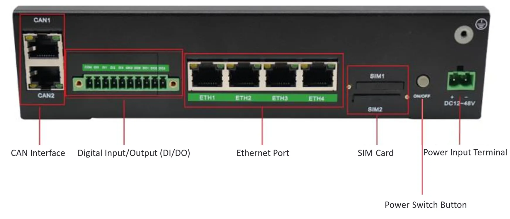</p>

<p align="center"><strong>Figure 1-1 EC954 Top Panel</strong></p>

#### 1.3.2 Front Panel

<p align="center">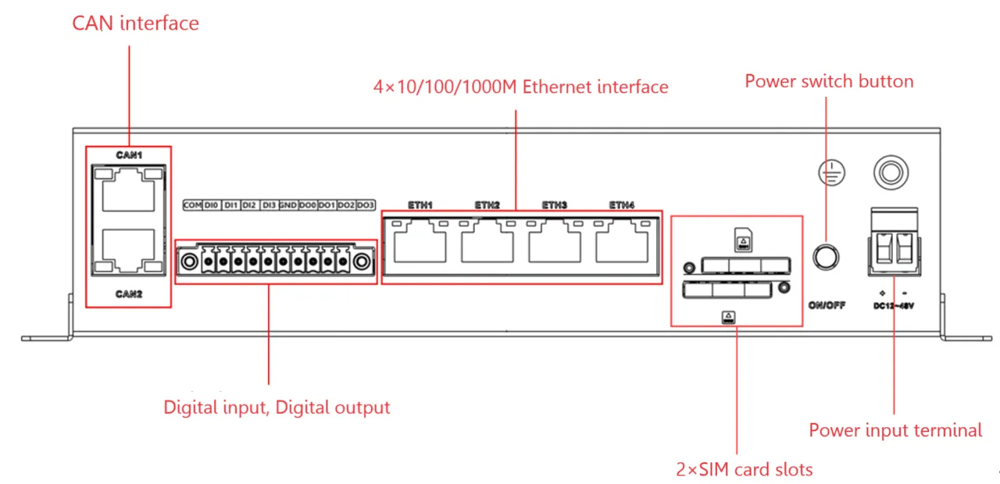</p>

<p align="center"><strong>Figure 1-2 EC954 Front Panel</strong></p>

#### 1.3.3 Rear Panel

<p align="center">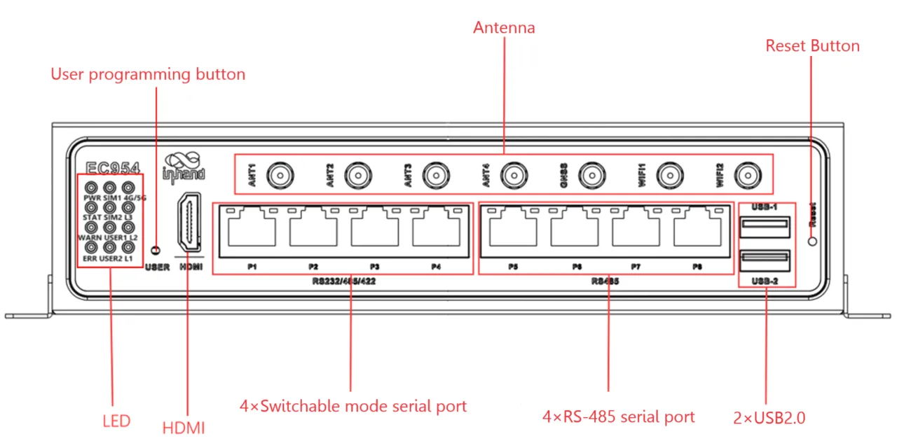</p>

<p align="center"><strong>Figure 1-3 EC954 Rear Panel</strong></p>

#### 1.3.4 Alternative Front Panel View

<p align="center">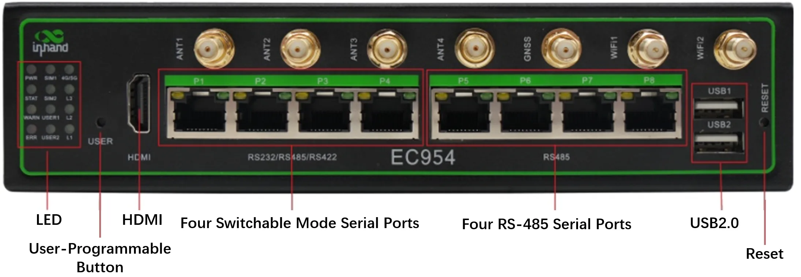</p>

<p align="center"><strong>Figure 1-4 EC954 Front Panel (Alternative View)</strong></p>

#### 1.3.5 Interface Description

| Interface | Position | Function Description |
|-----------|----------|---------------------|
| ETH1-ETH4 | Front panel | Four RJ45 Ethernet ports, supporting 10M/100M/1000M adaptive rates |
| P1-P4 | Front panel | Serial ports 1-4, supporting RS-232/RS-485/RS-422 (software-configurable) |
| P5-P8 | Front panel | Serial ports 5-8, fixed RS-485 |
| CAN | Front panel | 2-way CAN bus interface, supporting CAN 2.0A/B standard; CAN2 compatible with CAN FD up to 5 Mbps |
| DI0-DI3 | Front panel | 4-way digital input, dry contact, 3000 VDC isolation |
| DO0-DO3 | Front panel | 4-way digital output, 3000 VDC isolation |
| USB1-USB2 | Front panel | Two USB 2.0 Host ports |
| DC Input | Front panel | 12-48 VDC power input (two-pin terminal, V+, V-) |
| SIM1-SIM2 | Side panel | Dual SIM card slots |
| Micro SD | Side panel | Micro SD card slot |
| ANT1-ANT4 | Top panel | Cellular antennas (4G LTE Main/Diversity/5G) |
| GNSS | Top panel | GNSS antenna |
| WiFi1-WiFi2 | Top panel | Wi-Fi antennas |
| Reset Button | Side panel | Factory reset button |
| Power Button | Side panel | Power on/off button |
| mSATA | Internal | mSATA hard drive interface |

### 1.4 Indicator Description

EC954 has 12 LEDs indicating power supply and system operating status.

<p align="center">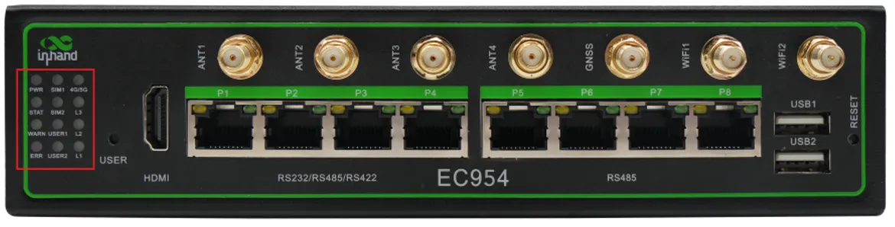</p>

<p align="center"><strong>Figure 1-5 EC954 LED Indicators</strong></p>

| Indicator | Status | Meaning |
|-----------|--------|---------|
| PWR | On | Device powered on |
| STATUS | Blinking | System starting normally |
|  | Off | System startup failure or factory restore in progress |
| WARN | Blinking | Warning exception occurred; system upgrade or factory restore in progress |
| ERR | Blinking | Serious system error occurred; system upgrade or factory restore in progress |
| SIM1 | On | SIM card 1 selected for dialing |
|  | Off | SIM card 2 selected or dialing disabled |
| SIM2 | On | SIM card 2 selected for dialing |
|  | Off | SIM card 1 selected or dialing disabled |
| USER1 | Off (default) | User programmable indicator 1 |
| USER2 | Off (default) | User programmable indicator 2 |
| 4G/5G | On | Cellular dial-up successful |
| L1 | On | Cellular signal strength indicator (see table below) |
| L2 | On | Cellular signal strength indicator (see table below) |
| L3 | On | Cellular signal strength indicator (see table below) |

**Cellular Network Signal Strength Indication**

The combination of L1, L2, and L3 indicates cellular signal strength.

| Signal Strength | L1 | L2 | L3 |
|-----------------|----|----|----|
| No signal | Off | Off | Off |
| Weak (RSSI < -90 dBm) | On | Off | Off |
| Medium (-90 dBm <= RSSI < -70 dBm) | On | On | Off |
| Strong (RSSI >= -70 dBm) | On | On | On |

**Factory Restore LED Indication**

After executing factory restore, the system reboots. During the restore process, the WARN and ERR indicators blink while STATUS is off. In this state, the device must not be powered off; otherwise, file loss may occur. This state lasts approximately 30 seconds. When the restore is complete, WARN and ERR turn off and STATUS blinks.

| Indicator | State During Factory Restore |
|-----------|------------------------------|
| WARN | Blinking |
| ERR | Blinking |
| STATUS | Off |

### 1.5 Restore Factory Settings

Two methods are available to restore factory settings.

**Method 1: Command Line**

Type the following command. The system automatically restarts and restores factory settings.

```
sudo restore
```

**Method 2: Reset Button**

1. Press and hold the factory reset button for 10-20 seconds until the WARN indicator stays on.
2. Release the factory reset button after the WARN indicator stays on.
3. After releasing the button, the ERR indicator flashes several times, and the system begins to restart and perform factory reset.
4. After the system restarts, the WARN and ERR indicators flash and STATUS goes off. After approximately 30 seconds, when both WARN and ERR indicators stop flashing and STATUS starts blinking, the factory reset is complete.

> **Warning**: During the factory restore process, do not power off the device. Otherwise, some files may be lost and system functions may be affected.

### 1.6 Default Settings

| Parameter | Default Value |
|-----------|---------------|
| ETH1 IP Address | 192.168.3.100 |
| ETH2 IP Address | 192.168.4.100 |
| ETH3 IP Address | 192.168.5.100 |
| ETH4 IP Address | 192.168.6.100 |
| CLI Username | edge |
| CLI Password | security@edge |
| Web Username | adm |
| Web Password | 123456 |
| Web Management Port | 9100 (HTTPS) |
| IEOS | Enabled by default |
| Root User | Created but login disabled by default |

---

## Chapter 2: Installation and First Use

### 2.1 Pre-Installation Preparation

**Environmental Requirements**

| Parameter | Specification |
|-----------|---------------|
| Input Voltage | 12 to 48 VDC |
| Operating Temperature | -20 to 70 degrees C (-4 to 158 degrees F) |
| Storage Temperature | -40 to 85 degrees C (-40 to 185 degrees F) |
| Environmental Humidity | 5% to 95% (non-condensing) |

**Tools Required**

- Phillips screwdriver
- Network cable
- SIM card removal pin (included in packing list)
- Antennas (included in packing list, depending on model)

> **Warning**: Ensure the installation environment meets the specified temperature and humidity requirements. Do not install the device in an environment with explosive or flammable materials.

> **Note**: The device must be powered off during SIM card and Micro SD card installation.

### 2.2 Installation Guide

#### 2.2.1 DIN Rail Mounting

The mounting plate for the DIN rail is attached to the lower panel of the EC954.

1. Snap the top hook of the DIN rail mounting plate into the top of the DIN rail bracket.
2. Slowly push the device forward in the direction of the DIN rail bracket so that the bottom end of the DIN rail snaps into place.

<p align="center">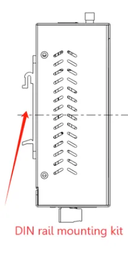</p>

<p align="center"><strong>Figure 2-1 DIN Rail Mounting</strong></p>

#### 2.2.2 Wall Mounting

The EC954 can be mounted using a wall mounting kit, which must be purchased separately.

1. Secure the wall mounting kit to the lower panel of the EC954 using screws.

<p align="center">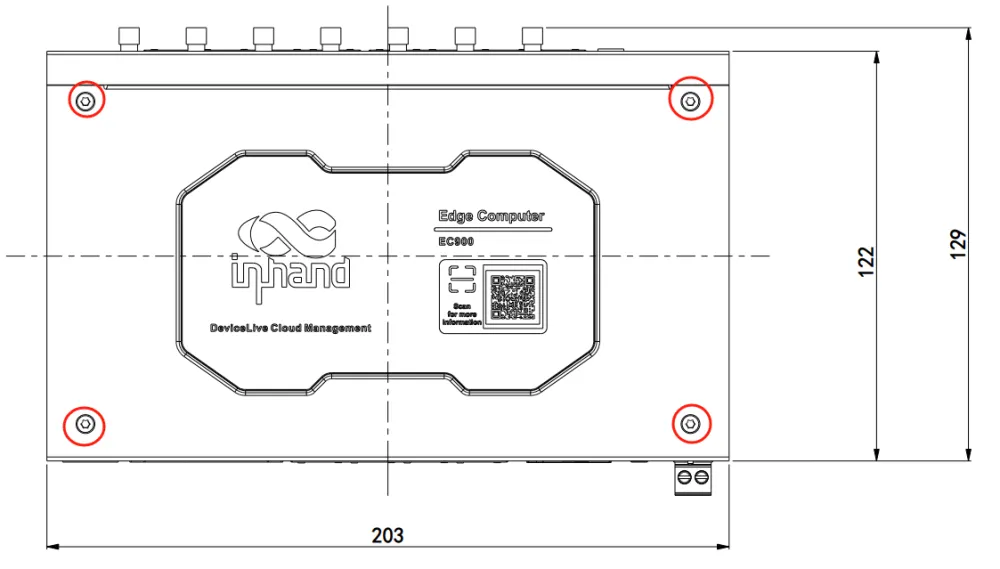</p>

<p align="center"><strong>Figure 2-2 Wall Mounting Kit Installation</strong></p>

2. Once the wall mounting kit has been successfully fixed to the EC954, use screws to fix the EC954 to the wall or cabinet.

<p align="center">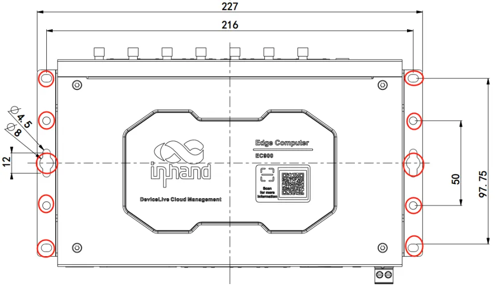</p>

<p align="center"><strong>Figure 2-3 Wall Mounting</strong></p>

#### 2.2.3 Antenna Installation

EC954 has a total of seven antenna interfaces. Different models are equipped with different numbers of antennas.

| Identification | Name |
|----------------|------|
| ANT1 | 4G LTE Main Antenna / 5G Antenna |
| ANT2 | 4G LTE Diversity Receiver Antenna / 5G Antenna |
| GNSS | GNSS Antenna |
| ANT3 | 5G Antenna |
| ANT4 | 5G Antenna |
| WiFi1 | Wi-Fi Antenna |
| WiFi2 | Wi-Fi Antenna |

Screw the required antennas into the corresponding SMA antenna connectors.

<p align="center"></p>

<p align="center"><strong>Figure 2-4 Antenna Installation</strong></p>

#### 2.2.4 SIM Card Installation

EC954 supports two SIM card slots. The SIM card must be installed in a power-off state.

1. Remove the SIM card removal pin from the accessory box.
2. Press the corresponding pin hole to eject the SIM card tray.
3. Install the SIM card into the SIM card tray.
4. Press the tray back into the slot to complete the installation.

<p align="center">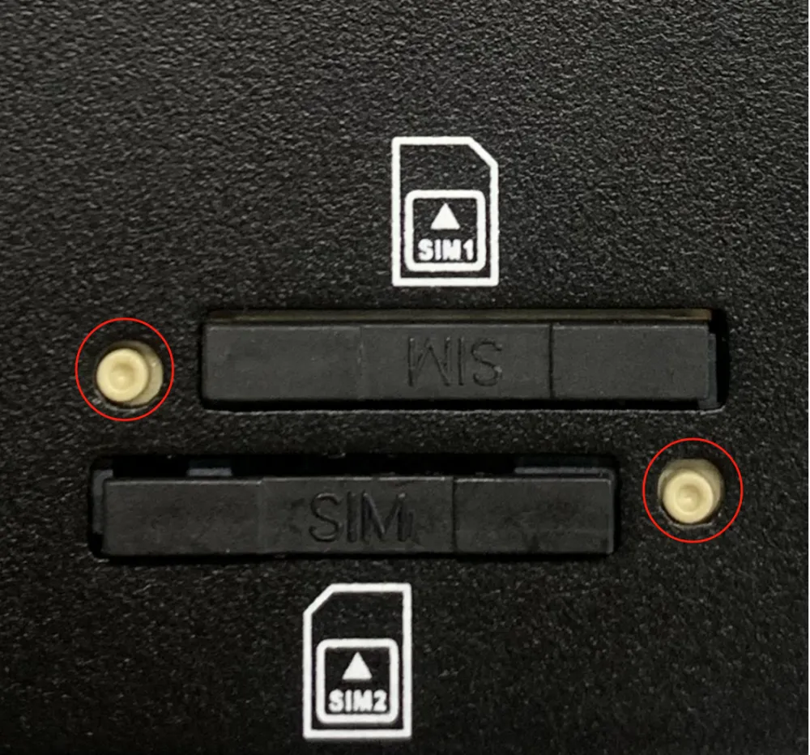</p>

<p align="center"><strong>Figure 2-5 SIM Card Installation</strong></p>

#### 2.2.5 Micro SD Card Installation

The Micro SD card does not support hot-swap and must be installed in a power-off state.

1. Remove the protective case.
2. Install the Micro SD card into the SD card slot located on the left panel of the EC954.

<p align="center">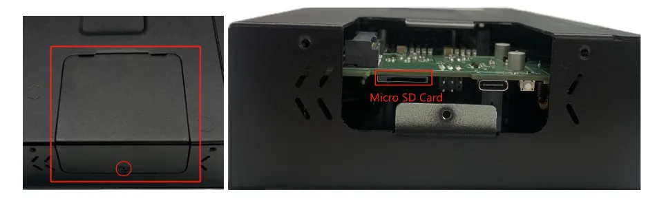</p>

<p align="center"><strong>Figure 2-6 Micro SD Card Installation</strong></p>

#### 2.2.6 mSATA Hard Drive Installation

EC954 supports mSATA hard drives, which are not included by default.

1. Use a screwdriver to open the protective casing of the hard drive.

<p align="center"></p>

<p align="center"><strong>Figure 2-7 mSATA Protective Casing Removal (Step 1)</strong></p>

<p align="center">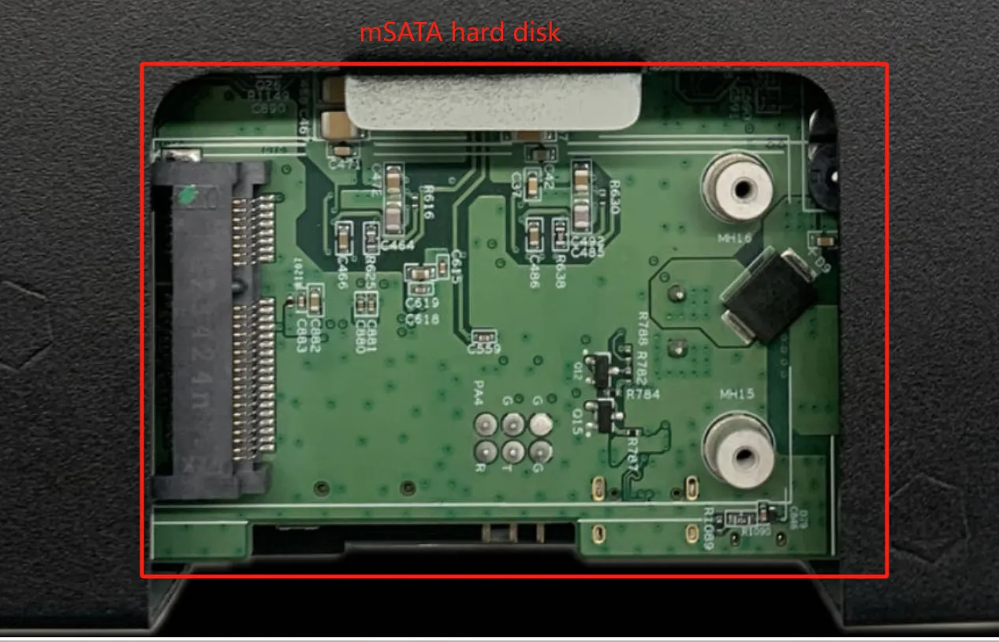</p>

<p align="center"><strong>Figure 2-8 mSATA Protective Casing Removal (Step 2)</strong></p>

2. Align the drive with the slot, push it to the right and snap it into place. Remove the screws (M2) to secure the right side of the drive.

<p align="center"></p>

<p align="center"><strong>Figure 2-9 mSATA Drive Installation (Step 1)</strong></p>

<p align="center">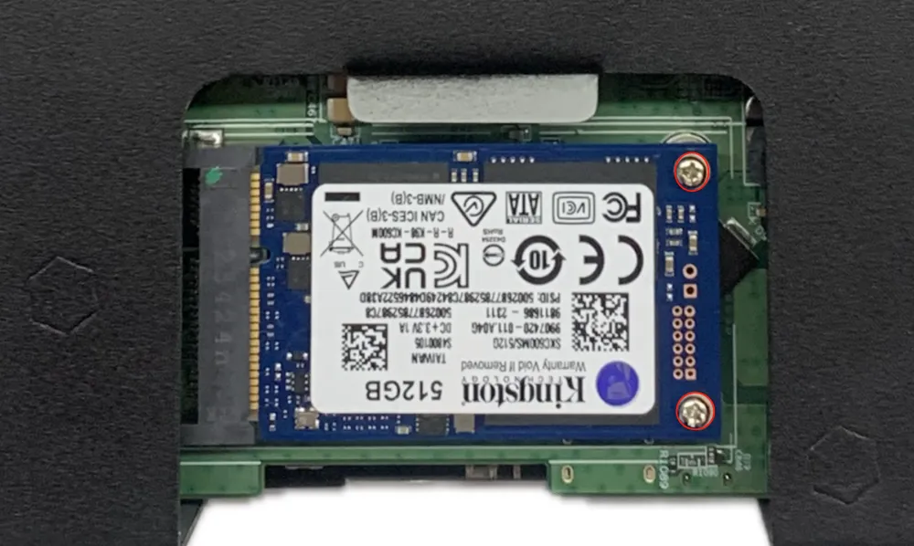</p>

<p align="center"><strong>Figure 2-10 mSATA Drive Installation (Step 2)</strong></p>

3. Reinstall the removed protective housing back into the EC954.

#### 2.2.7 Power Connection

The EC954 supports 12 to 48 VDC power supply.

1. Remove the factory-supplied power adapter from the accessory box.
2. Insert the adapter terminals into the DC port of the EC954 (V+, V-).
3. Connect the power adapter to an appropriate power source.
4. When the PWR power indicator lights up, the device has been properly powered up.

<p align="center">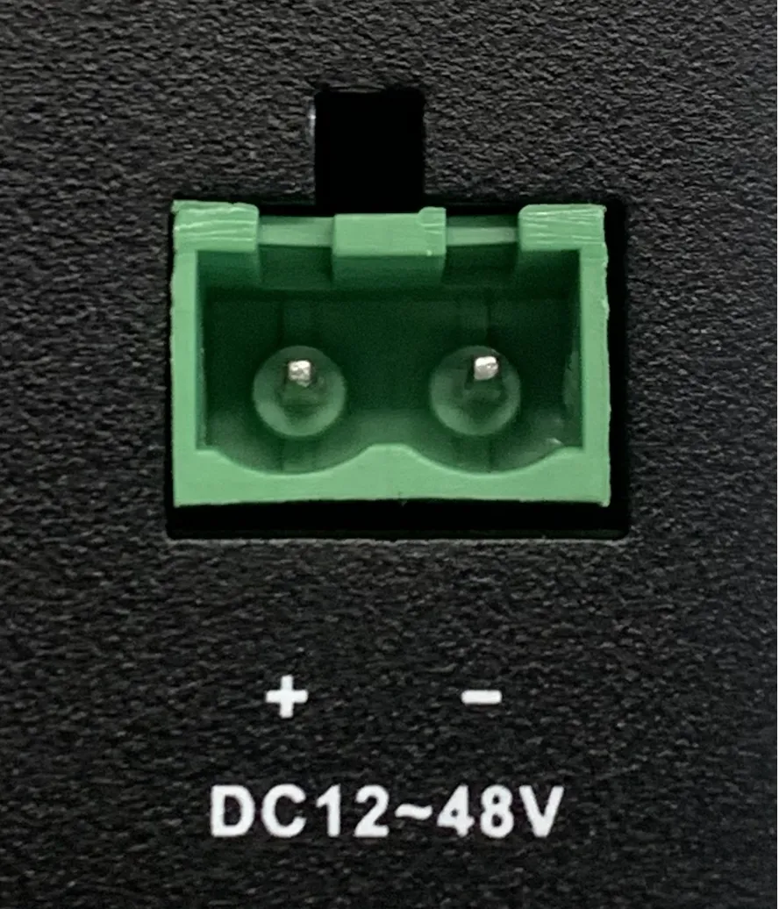</p>

<p align="center"><strong>Figure 2-11 DC Power Input</strong></p>

#### 2.2.8 First-Time Access

**Access via SSH**

1. Connect a PC to any Ethernet port of the EC954 using a network cable.
2. Configure the PC's IP address to be in the same subnet as the device interface address.
3. On a Linux PC, use the `ssh` command to connect. On a Windows PC, download PuTTY from [http://www.chiark.greenend.org.uk/~sgtatham/putty/download.html](http://www.chiark.greenend.org.uk/~sgtatham/putty/download.html) and establish an SSH connection.
4. Enter the default username `edge` and password `security@edge`.
5. When the terminal prompt `edge@edge-computer:~$` appears, the connection is successful.

The following figure shows an example of an SSH connection from a Linux PC.

<p align="center"></p>

<p align="center"><strong>Figure 2-12 SSH Connection from Linux PC</strong></p>

Enter `yes` to continue connecting.

<p align="center"></p>

<p align="center"><strong>Figure 2-13 SSH Confirmation Prompt</strong></p>

When the terminal prompt appears, the connection is successful.

<p align="center">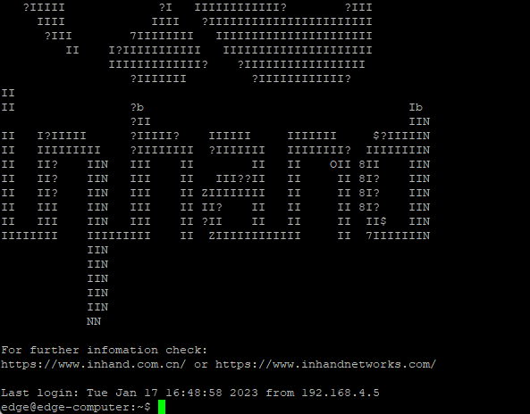</p>

<p align="center"><strong>Figure 2-14 SSH Connection Successful</strong></p>

The following figure shows an example of connecting via PuTTY on a Windows PC.

<p align="center"></p>

<p align="center"><strong>Figure 2-15 PuTTY SSH Connection</strong></p>

<p align="center"></p>

<p align="center"><strong>Figure 2-16 Network Cable Connection</strong></p>

**Access via Web Interface**

1. Connect a PC to any Ethernet port of the EC954 using a network cable.
2. Configure the PC's IP address to be in the same subnet as the device interface address.
3. Open a web browser and enter `https://<Device_IP>:9100`.
4. Enter the default username `adm` and password `123456`.
5. Click the login button to access the web management interface.

> **Note**: Not all EC954 models support the WEB interface management function. Refer to the "Ordering Information" section in the EC954 Series Edge Computer Datasheet for specific support.

### 2.3 Quick Check

After installation is complete, verify the following items.

- [ ] The PWR indicator is on, indicating that power is supplied correctly.
- [ ] The STATUS indicator is blinking, indicating that the system has started normally.
- [ ] The network cable is securely connected and the LINK indicator on the Ethernet port is on.
- [ ] If a SIM card is installed, the corresponding SIM indicator is on.
- [ ] If antennas are installed, the cellular signal strength indicators (L1, L2, L3) show the appropriate signal level.
- [ ] The PC can ping the device's default IP address.
- [ ] The web management interface can be accessed from the PC (if the model supports it).
- [ ] The SSH connection can be established from the PC using the default credentials.

---

## Chapter 3: Common Scenario Configuration

### Scenario 1: Cellular Networking

**Objective**: Access the internet via 4G/5G cellular network.

**Prerequisites**: SIM card inserted, cellular antennas installed, device powered on, and logged in to the web management interface.

**Estimated Time**: Approx. 5 minutes.

**Operation Steps**:
1. Log in to the web management interface.
2. Navigate to [Network] → [Cellular].
3. Confirm that the "Enable" switch is in the ON state.
4. If a dedicated network SIM card is used, configure the APN parameters in [APN Profiles].
5. To use dual SIM cards, enable [Dual SIM enabled] and configure the primary SIM card and dial parameters.
6. In [ICMP Detection], configure the detection server address and enable ICMP detection to prevent false connections.
7. Click "Save" and wait for the connection to establish.

**Verification Method**:
1. Check that the 4G/5G indicator is on.
2. Navigate to [Status] → [Cellular Dialing Status] and verify that an IP address is obtained.
3. Use the [Network Diagnostics] tool to ping an external address.

**Common Issues**:
- Unable to connect: Verify SIM card insertion, APN parameters, and signal strength.
- False connection (dial-up successful but no data): Enable ICMP detection and configure appropriate detection addresses.

### Scenario 2: Wi-Fi Station Connection

**Objective**: Connect the EC954 to an existing Wi-Fi network.

**Prerequisites**: Wi-Fi antennas installed, device powered on, and logged in to the web management interface.

**Estimated Time**: Approx. 5 minutes.

**Operation Steps**:
1. Log in to the web management interface.
2. Navigate to [Network] → [Wi-Fi Station].
3. Enable [Enable Wi-Fi].
4. Enter the target [Client SSID] or click "Scan" to select from nearby networks.
5. Select the [Auth Method] and [Encrypt Mode] matching the target network.
6. Enter the [WPA/WPA2 PSK Key].
7. Click "Save".

**Verification Method**:
1. Navigate to [Status] → [Wi-Fi Station Status] and verify that an IP address is obtained.
2. Ping an external address to confirm internet connectivity.

**Common Issues**:
- Connection failure: Verify SSID, password, and signal strength.
- Unable to obtain IP: Check DHCP server availability on the target network.

### Scenario 3: Ethernet Configuration

**Objective**: Configure an Ethernet interface with a static IP address, DHCP client, or DHCP server.

**Prerequisites**: PC connected to the device via network cable, device powered on, and logged in to the web management interface.

**Estimated Time**: Approx. 5 minutes.

**Operation Steps**:
1. Log in to the web management interface.
2. Navigate to [Network] → [Ethernet].
3. Select the interface to configure (eth1-eth4).
4. Choose the configuration mode: Static IP, DHCP Client, or DHCP Server.
5. If Static IP is selected, enter the IP address, netmask, and gateway.
6. If DHCP Server is selected, configure the starting address, maximum address number, and lease period.
7. Click "Save".

**Verification Method**:
1. Navigate to [Status] → [Routing Status] and verify the route entries.
2. From a connected device, ping the gateway address.

**Common Issues**:
- Unable to communicate: Verify that the IP address, netmask, and gateway are in the correct network segment.
- DHCP Client fails: Check that the upstream DHCP server is available.

### Scenario 4: Remote Device Management via DeviceLive

**Objective**: Remotely monitor and manage the EC954 via the DeviceLive cloud platform.

**Prerequisites**: Device has internet access (cellular or Ethernet), device powered on, and logged in to the web management interface.

**Estimated Time**: Approx. 10 minutes.

**Operation Steps**:
1. Log in to the web management interface.
2. Navigate to [System Management] → [Basic Configuration] → [Cloud Management].
3. Enable [Enabled].
4. Select the [Cloud Server] address (domestic or overseas platform).
5. Click "Save".
6. Log in to the DeviceLive platform and verify that the device is online.

**Verification Method**:
1. On the DeviceLive platform, check that the device status is online.
2. On the device, navigate to [Status] → [Device Information] and verify cloud connection status.

**Common Issues**:
- Device offline: Verify internet connectivity and cloud server address selection.
- Unable to register: Check that the device serial number is correctly bound on the platform.

---

# Chapter 4: Function Description and Parameter Reference

## 4.1 User Account Management

**Function Description**: The EC954 uses a multi-user Linux system. The default user `edge` is in the `sudo` group and can execute system-level commands. The root user is created at factory default but login is disabled.

**Access**: Connect to the EC954 via SSH and use command-line tools.

**Operation Instructions**:

### 4.1.1 Switch to Root User

Use the command `sudo -s` to switch to the root user. For security reasons, do not operate all commands under root privileges.

When using certain pipes or redirection behaviors without root privileges, a permission denied prompt may appear. In this case, use `sudo su -c` with single quotes around the complete command instead of `>`, `<`, `>>`, `<<`, etc.

### 4.1.2 Create and Delete User Accounts

Use the `useradd` and `userdel` commands to create and delete user accounts. Ensure that access permissions are set for the account. The following example creates a user `test1` in the `sudo` group with bash as the default shell and `/home/test1` as the home directory.

<p align="center"></p>

<p align="center"><strong>Figure 4-1 Create User Account</strong></p>

Change the password for `test1` using the `passwd` command. Enter the new password and repeat to confirm.

<p align="center"></p>

<p align="center"><strong>Figure 4-2 Change User Password</strong></p>

Delete user `test1` using the `userdel` command.

<p align="center"></p>

<p align="center"><strong>Figure 4-3 Delete User Account</strong></p>

### 4.1.3 Disable Default User Accounts

> **Warning**: Before disabling the default account, create another user account first.

Lock the default `edge` user to prevent login.

<p align="center"></p>

<p align="center"><strong>Figure 4-4 Lock Default User</strong></p>

Unlock the `edge` user when needed.

<p align="center"></p>

<p align="center"><strong>Figure 4-5 Unlock Default User</strong></p>


## 4.2 Web management based on IEOS

### 4.2.1 Logging into the web 

Considering that the user's program may require the use of HTTP/HTTPS standard port number 80/443, IEOS uses port number 9100 as the port for HTTPS connection and does not support access through HTTP; When users access the web using HTTP, they will automatically redirect to using HTTPS. This document takes the default address 192.168.4100 through eth2 as an example for explanation. After entering 192.168.4100:9100 in the browser, the user will be redirected to the login page

Important note: When the IEOS program is enabled, some port numbers will be reserved for internal communication, with a reserved port number range of 9100 to 9200. After enabling IEOS, customer programs should avoid using these port numbers, otherwise conflicts may occur and functional abnormalities may occur. 

<p align="center"></p>

<p align="center"><strong>Figure 4-6 IEOS Web Login Page</strong></p>

### 4.2.2 Network Management 

#### 4.2.2.21 Ethernet Interface

**Function Description**: The EC954 has four RJ45 Ethernet ports supporting 10M/100M/1000M adaptive rates. Each port can be configured with a static IP address, DHCP client, or DHCP server via the IEOS web interface.

**Access**: Log in to the IEOS web interface. Navigate to [Network] → [Ethernet].

**Operation Instructions**:

To configure a static IP address for the eth1 interface, enter the IP address, netmask, and gateway.

<p align="center">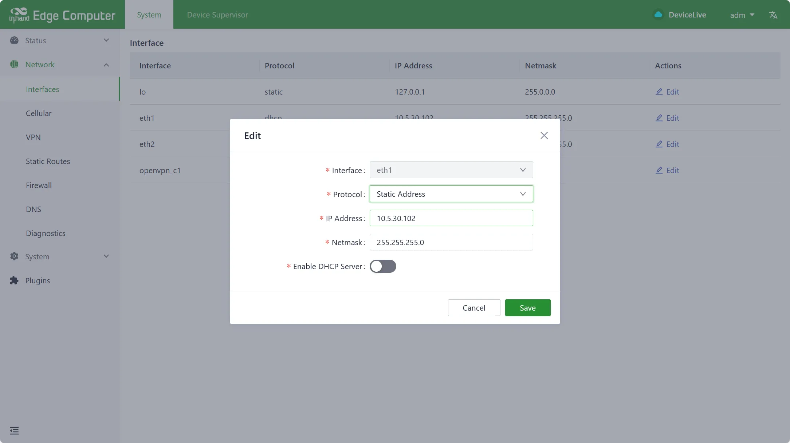</p>

<p align="center"><strong>Figure 4-7 Ethernet Static IP Configuration</strong></p>

To configure DHCP Client for the eth1 interface, select DHCP Client mode.

<p align="center">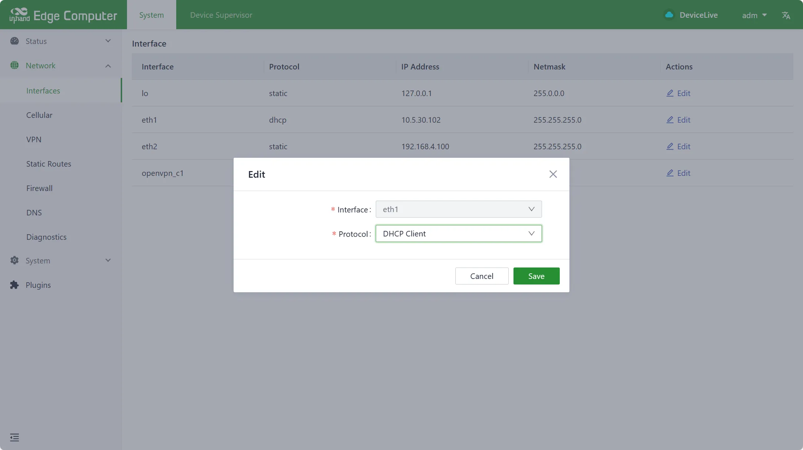</p>

<p align="center"><strong>Figure 4-8 Ethernet DHCP Client Configuration</strong></p>

To enable DHCP Server on the eth1 interface, configure the address pool parameters.

<p align="center">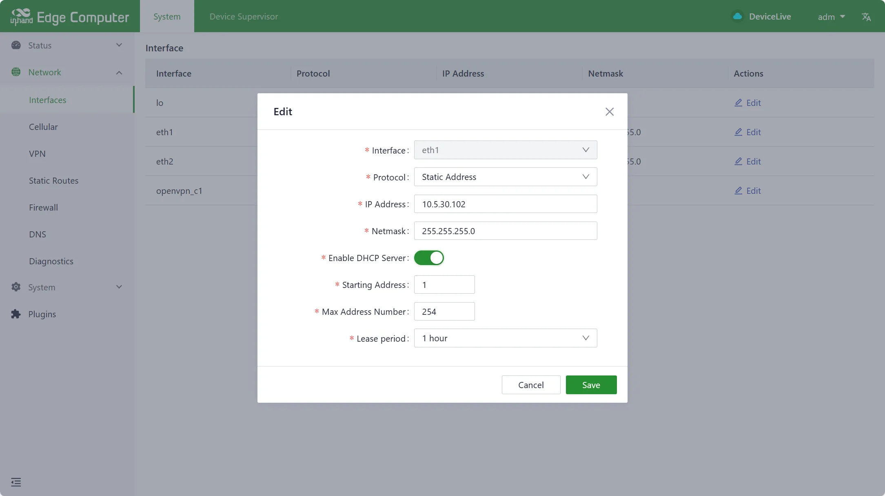</p>

<p align="center"><strong>Figure 4-9 DHCP Server Configuration</strong></p>

**Parameter Description**:

| Parameter | Description |
|-----------|-------------|
| Enable DHCP Server | Switch for DHCP Server functionality |
| Starting Address | The starting base address of the DHCP Server address pool. Network segment + starting address = the starting IP address of the pool |
| Max Address Number | The maximum number of addresses in the address pool |
| Lease Period | Lease period |

The RJ45 pin assignments are as follows.

<p align="center">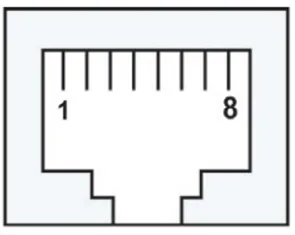</p>

<p align="center"><strong>Figure 4-10 RJ45 Pin Assignment</strong></p>

| RJ45 Pin Number | 10M/100M | 1000M |
|-----------------|----------|-------|
| 1 | TX+ | TRD(0)+ |
| 2 | TX- | TRD(0)- |
| 3 | RX+ | TRD(1)+ |
| 4 | - | TRD(2)+ |
| 5 | - | TRD(2)- |
| 6 | RX- | TRD(1)- |
| 7 | - | TRD(3)+ |
| 8 | - | TRD(3)- |

The Ethernet port LINK/ACT indicators operate as follows: the green LINK indicator is on when the peer device has a 1000M interface, and off when the peer device has a 10/100M interface. The yellow ACT indicator flashes when data is being transmitted.

#### 4.2.2.2 Cellular Network Configuration

**Function Description**: The EC954 supports 4G/5G cellular networking with dual SIM card slots. The cellular function can be configured via the IEOS web interface, including APN parameters, network mode, dual SIM failover, and ICMP connection detection.

**Access**: Log in to the IEOS web interface. Navigate to [Network] → [Cellular].

**Operation Instructions**:

The cellular network basic configuration page is shown below.

<p align="center">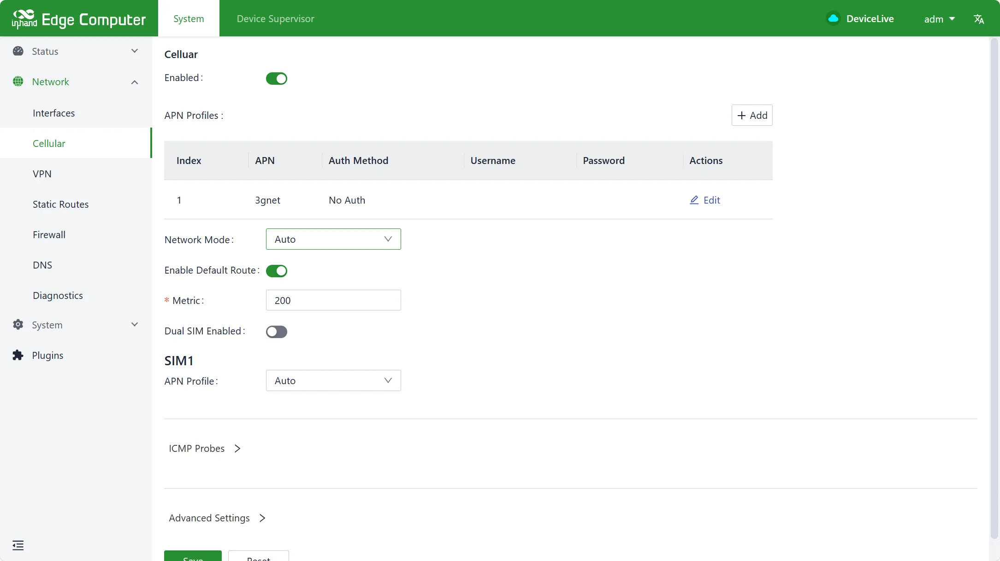</p>

<p align="center"><strong>Figure 4-11 Cellular Network Basic Configuration</strong></p>

**Parameter Description (Basic)**:

| Parameter | Description |
|-----------|-------------|
| Enable | Switch for cellular function; enabled by default |
| APN Profiles | A set of dialing parameters used to configure APN, username, password, and authentication method. Up to 10 records can be added |
| Network Mode | Cellular network format (3G, 4G, LTE, WCDMA, etc.); default is Automatic |
| Enable Default Route | Enable the add default route function for the cellular port; enabled by default |
| Metric | The metric value of the default routing for cellular ports |

To configure dual SIM failover, enable [Dual SIM enabled] and set the primary SIM card.

<p align="center">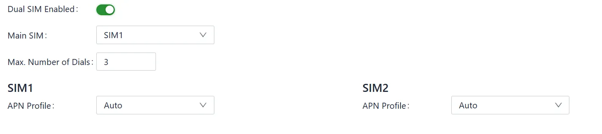</p>

<p align="center"><strong>Figure 4-12 Cellular Dual SIM Configuration</strong></p>

**Parameter Description (Dual SIM)**:

| Parameter | Description |
|-----------|-------------|
| Dual SIM enabled | Enable dual SIM single dial failover; default is off |
| Main SIM | The SIM card prioritized for dialing; default is SIM1 |
| Max Number of Dials | After the current SIM card reaches the specified number of failed dials, switch to the other SIM card |
| APN Profile | The dialing parameter set selected by the SIM card; default is Automatic |
| PIN Code | The PIN code of the SIM card |

To detect false dial-up connections, configure ICMP detection.

<p align="center">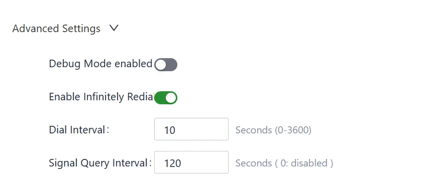</p>

<p align="center"><strong>Figure 4-13 Cellular ICMP Detection Configuration</strong></p>

**Parameter Description (ICMP Detection)**:

| Parameter | Description |
|-----------|-------------|
| ICMP Detection Server Probes | ICMP detection target addresses; up to two addresses can be configured. When both are unconfigured, ICMP detection is off |
| Detection Interval | Interval between ICMP detection attempts |
| Detection Timeout | ICMP detection timeout period |
| Detection Max Retries | Maximum number of detection retries; when failed attempts reach this value, a redial is triggered. Range [1, 5] |
| Detection Strict | When disabled, the detection program checks whether received packets on the cellular interface have changed during each cycle. When enabled, ICMP messages are sent periodically regardless of packet changes. Default is off |

Advanced configuration options are available for uncommon scenarios.

<p align="center">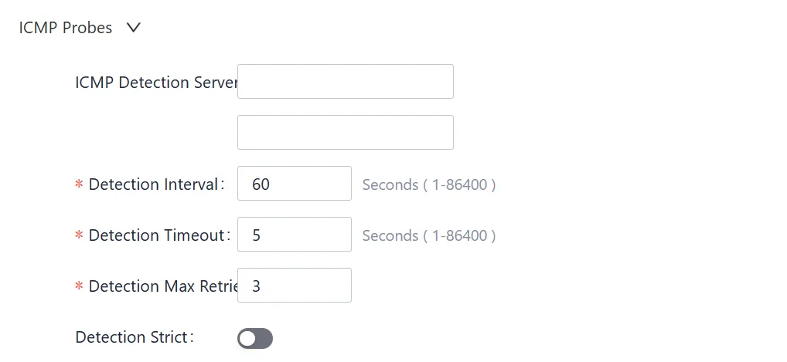</p>

<p align="center"><strong>Figure 4-14 Cellular Advanced Configuration</strong></p>

**Parameter Description (Advanced)**:

| Parameter | Description |
|-----------|-------------|
| Debug Mode enabled | Enable debug logging for dial-up troubleshooting; disabled by default |
| Enable Infinitely Redial | Enable infinite redial; when disabled, the system restarts after a certain number of failed dials. Default is off |
| Dial Interval | Waiting time before the next dial attempt after a failure |
| Signal Query Interval | Interval for the dial-up program to check signal strength |

#### 4.2.2.3 Wi-Fi 

**Function Description**: The EC954 supports Wi-Fi Station mode to connect to existing wireless networks.

**Access**: Log in to the IEOS web interface. Navigate to [Network] → [Wi-Fi Station].

**Operation Instructions**:

<p align="center">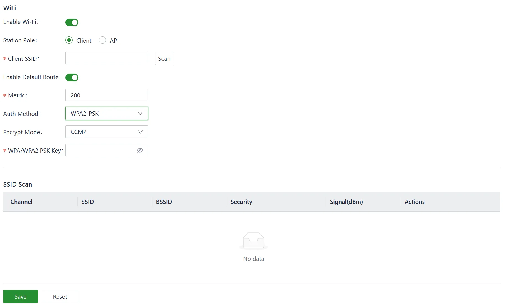</p>

<p align="center"><strong>Figure 4-15 Wi-Fi Station Configuration</strong></p>

**Parameter Description**:

| Parameter | Description |
|-----------|-------------|
| Enable Wi-Fi | Enable switch; default is off |
| Client SSID | The SSID to connect to; can be entered manually or selected via scan |
| Enable Default Route | Enable the add default route function for the WLAN port; enabled by default |
| Metric | The metric value of the default routing for Wi-Fi ports |
| Auth Method | Authentication method; supports No Authentication, WPA-PSK, WPA2-PSK, WPA-PSK/WPA2-PSK Mixed |
| Encrypt Mode | Encryption method; supports CCMP, TKIP, TKIP and CCMP |
| WPA/WPA2 PSK Key | Key information |

#### 4.2.2.4 Static Routing

**Function Description**: Static routing for Ethernet can be configured via the IEOS web interface. When default routing is configured for Ethernet, cellular, and Wi-Fi simultaneously, the route with the lowest metric value takes effect.

**Access**: Log in to the IEOS web interface. Navigate to [Network] → [Static Routing].

**Operation Instructions**:

<p align="center">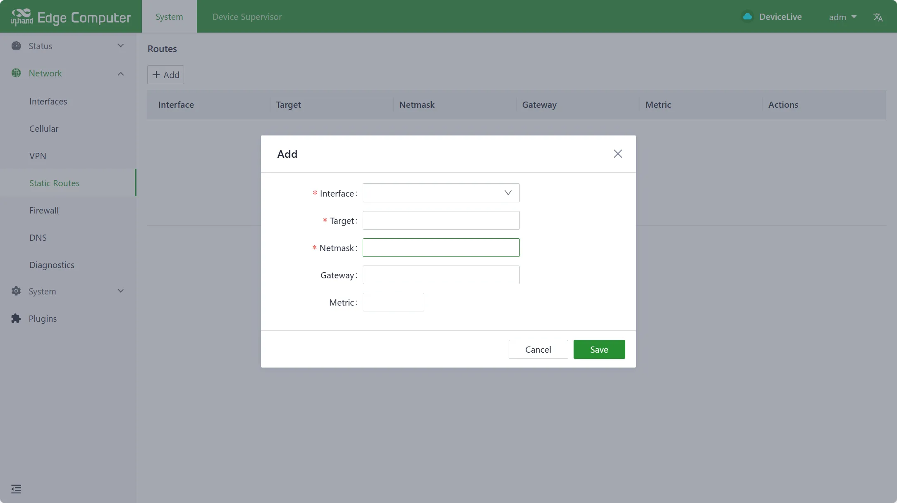</p>

<p align="center"><strong>Figure 4-16 Static Routing Configuration</strong></p>

**Parameter Description**:

| Parameter | Description |
|-----------|-------------|
| Interface | The outbound interface for static routing |
| Target | Target network address |
| Netmask | Target netmask |
| Gateway | Next hop address |
| Metric | The metric value of static routing |

#### 4.2.2.5 Firewall

**Function Description**: The firewall function is configured via the IEOS web interface. Currently, only the iptables command is supported for configuration.

**Access**: Log in to the IEOS web interface. Navigate to [Network] → [Firewall].

**Operation Instructions**:

<p align="center">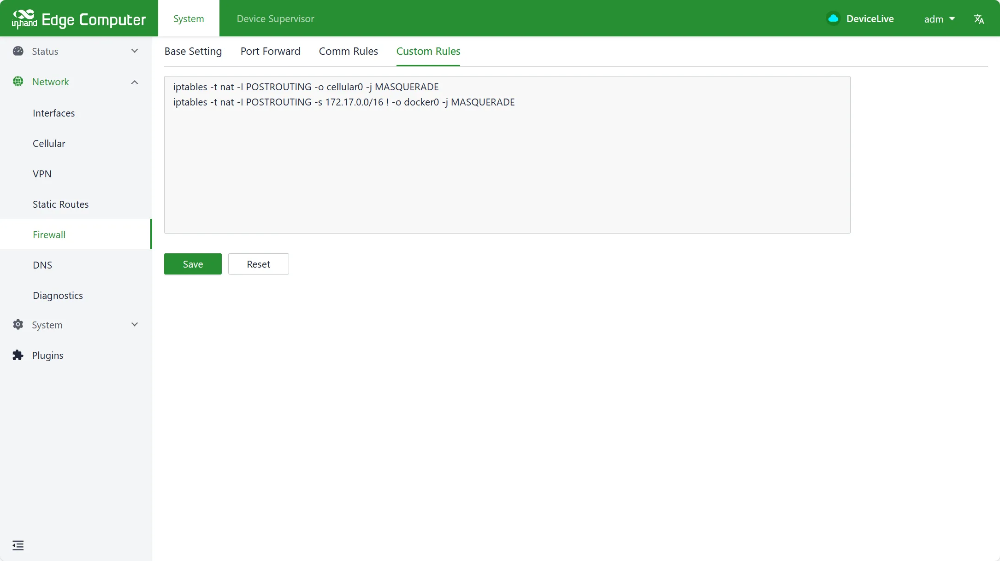</p>

<p align="center"><strong>Figure 4-17 Firewall Configuration</strong></p>

#### 4.2.2.6 DNS

**Function Description**: DNS server addresses and domain name hijacking rules can be configured via the IEOS web interface.

**Access**: Log in to the IEOS web interface. Navigate to [Network] → [DNS].

**Operation Instructions**:

Configure DNS server addresses.

<p align="center">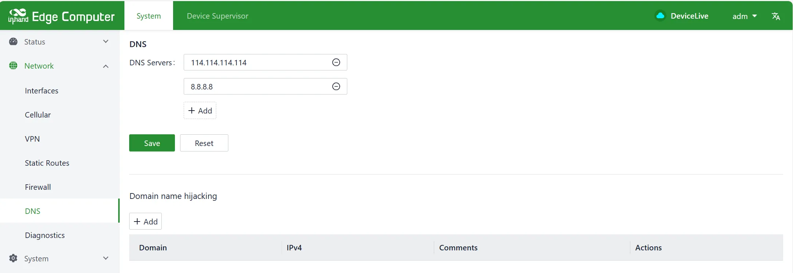</p>

<p align="center"><strong>Figure 4-18 DNS Server Configuration</strong></p>

Configure domain name hijacking rules.

<p align="center">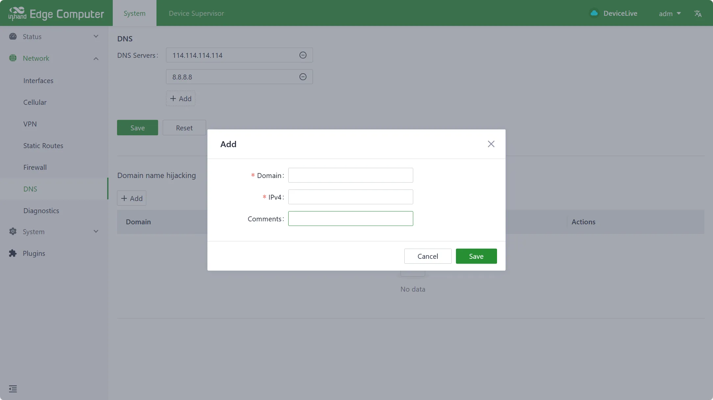</p>

<p align="center"><strong>Figure 4-19 DNS Domain Hijacking Configuration</strong></p>

**Parameter Description**:

| Parameter | Description |
|-----------|-------------|
| DNS Servers | DNS server addresses; up to four can be configured |
| Domain Name Hijacking | Domain name hijacking function; achieves binding between IP addresses and domain names |

#### 4.2.2.7 Network Diagnostics

**Function Description**: Network diagnostics support ping, traceroute, and nslookup functions.

**Access**: Log in to the IEOS web interface. Navigate to [Network] → [Network Diagnostics].

**Operation Instructions**:

<p align="center">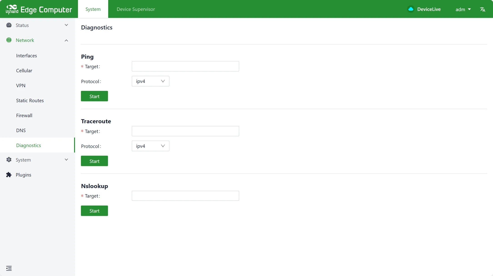</p>

<p align="center"><strong>Figure 4-20 Network Diagnostics</strong></p>

### 4.2.3 System Management

**Function Description**: System management includes basic configuration (cloud management, time zone, NTP), firmware upgrade, system restart, and system reset.

**Access**: Log in to the IEOS web interface. Navigate to [System Management].

#### 4.2.3.1 Basic Configuration

**Cloud Management**

<p align="center">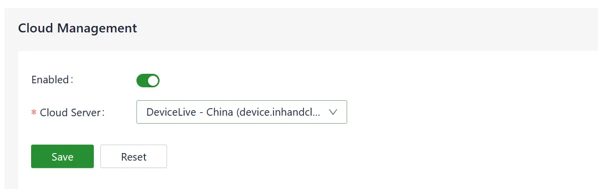</p>

<p align="center"><strong>Figure 4-21 Cloud Management Configuration</strong></p>

**Parameter Description**:

| Parameter | Description |
|-----------|-------------|
| Enabled | Enable switch for docking with the DeviceLive platform |
| Cloud Server | DeviceLive platform address; select domestic or overseas platform |

**Time Zone and NTP Client**

<p align="center">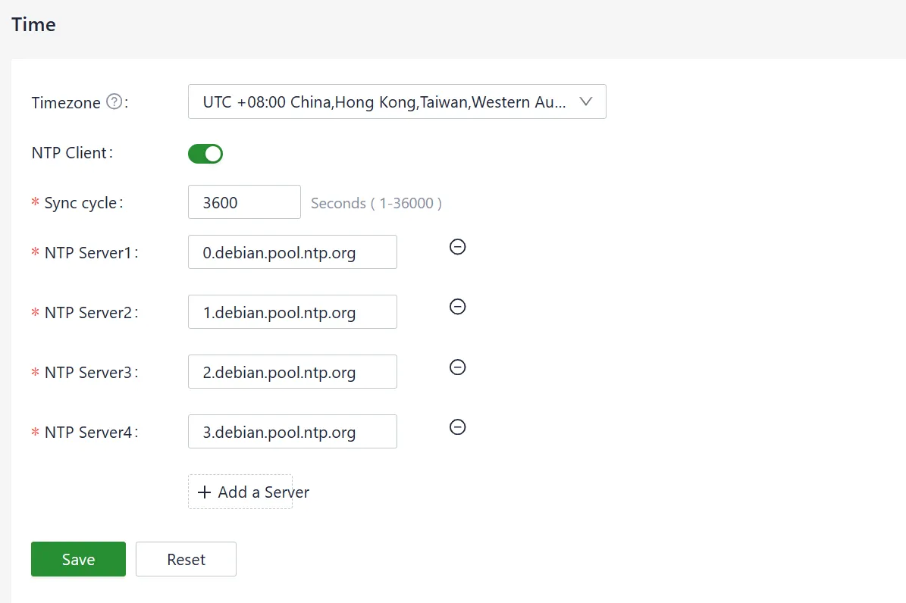</p>

<p align="center"><strong>Figure 4-22 Time Zone and NTP Configuration</strong></p>

Up to 10 NTP server addresses can be configured. The program periodically sends synchronization requests to each server address in sequence. After successful synchronization, the system time is written to the RTC, and subsequent NTP servers are no longer queried.

In addition to NTP automatic synchronization, a manual synchronization button is available on the [Device Info] status page. This button is displayed only when the device time and local time differ by more than 3 seconds.

<p align="center">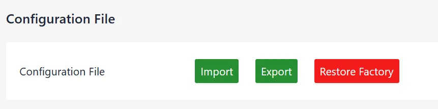</p>

<p align="center"><strong>Figure 4-23 Device Information with Time Synchronization</strong></p>

This page also supports configuration import, export, and factory recovery.

#### 4.2.3.2 Firmware Upgrade

<p align="center">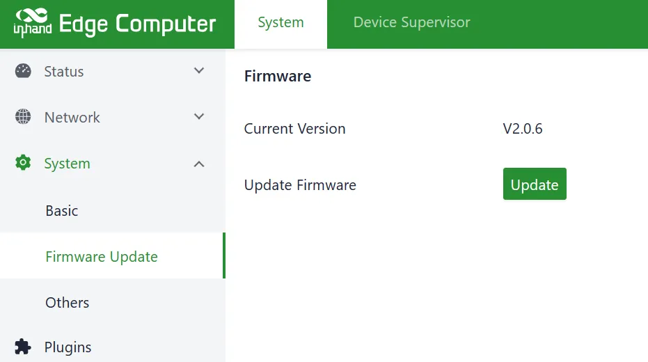</p>

<p align="center"><strong>Figure 4-24 Firmware Upgrade</strong></p>

The automatic restart option is disabled by default. After upgrading firmware, the system must be manually restarted to take effect. When automatic restart is enabled, the system automatically restarts after a successful firmware upgrade.

#### 4.2.3.3 Others

<p align="center">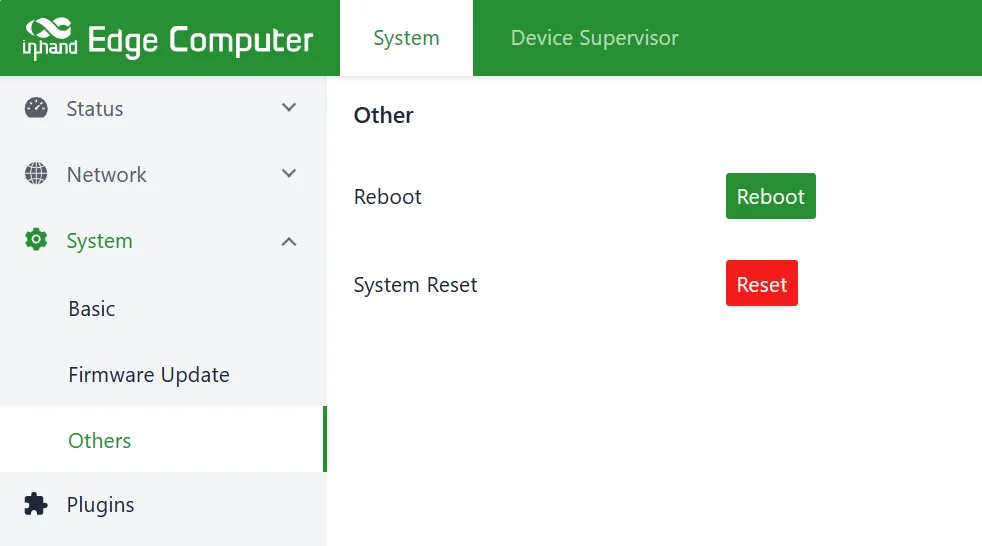</p>

<p align="center"><strong>Figure 4-25 System Restart and Reset</strong></p>

This page provides system restart and system reset functions. System reset restores the configuration and file system to factory defaults, which means user-installed software will also be cleared. Use this function with caution.

### 4.2.4 Status

**Function Description**: The status page displays device information, network connection status, and system operational data.

**Access**: Log in to the IEOS web interface. Navigate to [Status].

#### 4.2.4.1 Device Information

The device information status page displays the host name, device model, serial number, firmware version, kernel version, file system version, and an overview of CPU, memory, and disk space usage.

<p align="center">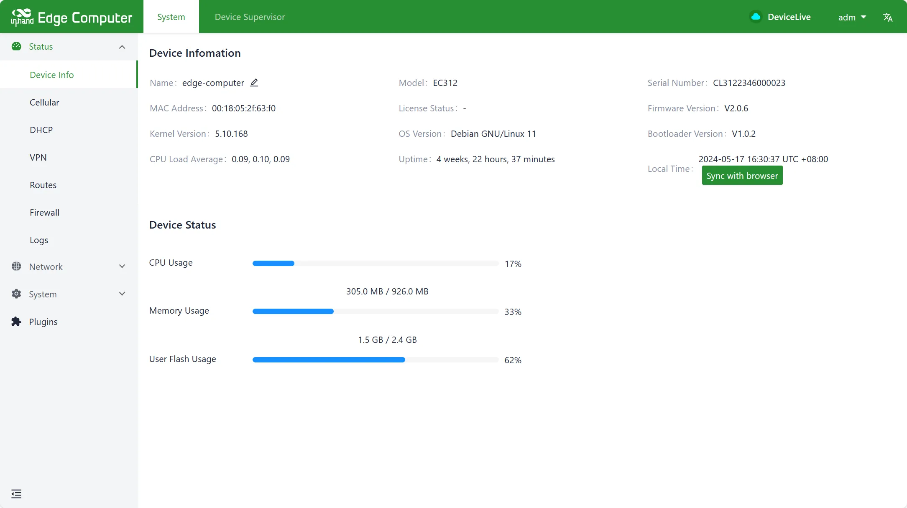</p>

<p align="center"><strong>Figure 4-26 Device Information Status</strong></p>

#### 4.2.4.2 Cellular Status

The cellular dialing status page displays the SIM card, IMEI, IMSI, ICCID, signal strength, and the IP address, DNS, and other information obtained during dialing.

<p align="center">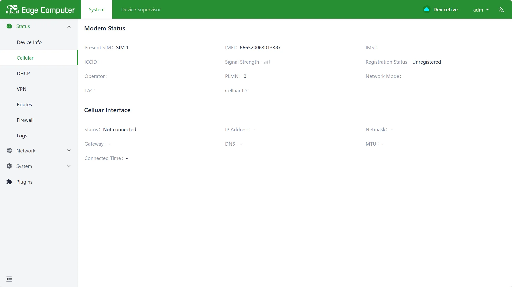</p>

<p align="center"><strong>Figure 4-27 Cellular Dialing Status</strong></p>

#### 4.2.4.3 Wi-Fi Status

The Wi-Fi Station status page displays the IP address, gateway, and DNS information obtained after a successful Wi-Fi connection.

<p align="center">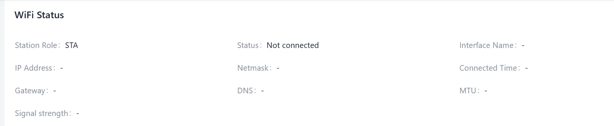</p>

<p align="center"><strong>Figure 4-28 Wi-Fi Station Status</strong></p>

#### 4.2.4.4 DHCP Server Status

The DHCP Server status page displays the IP address, client host name, client host MAC, and expiration time assigned to downstream devices.

<p align="center">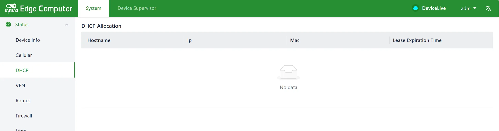</p>

<p align="center"><strong>Figure 4-29 DHCP Server Status</strong></p>

#### 4.2.4.5 Routing Status

The routing status page displays information such as IPv4 direct routing, static routing, and routing neighbors.

<p align="center">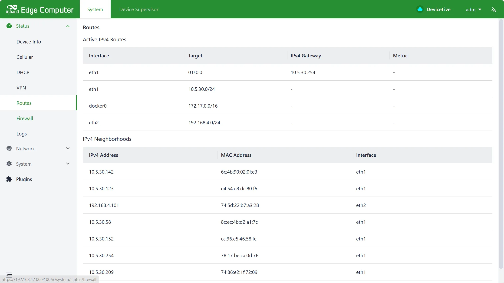</p>

<p align="center"><strong>Figure 4-30 Routing Status</strong></p>

#### 4.2.4.6 Firewall Status

The firewall status page displays filtering rules, IP address mapping rules, and other information.

<p align="center">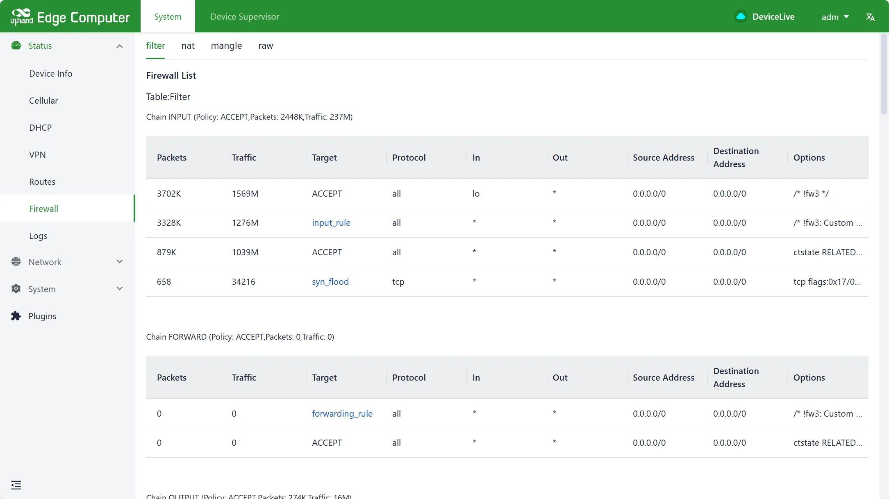</p>

<p align="center"><strong>Figure 4-31 Firewall Status</strong></p>

#### 4.2.4.7 Log Information

The log page displays system logs and user logs. The log level can be set (Error, Info, Debug, etc.). Logs can also be downloaded locally.

<p align="center">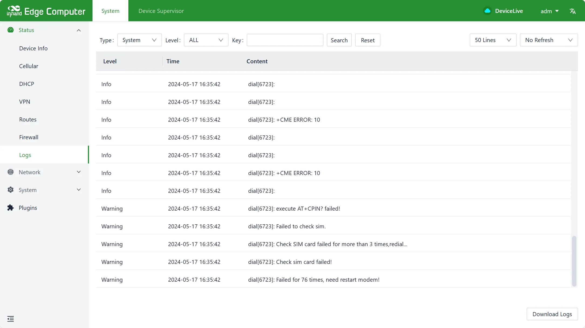</p>

<p align="center"><strong>Figure 4-32 Log Information</strong></p>

## 4.3 Linux Command Line Network Management
When using the Linux command line for network and system configuration, the first step is to close the IEOS program. IEOS is managed through system ctl, 

The way to close IEOS is as follows: 

Systemctl stop ieos\_daemon   

This shutdown only takes effect for this startup. Even after the system restarts, the IEOS program will still start. The way to prevent the IEOS program from starting up is as follows:

Systemctl disable ieos\_daemon   

Important note: After disabling IEOS, wireless networking functions such as dial-up and Wi Fi require users to implement them based on native Linux commands, and it is also impossible to remotely manage devices through the DeviceLive platform. 

### 4.3.1 Network Management 

#### 4.3.1.1 Set a static IP address

If you want to set a static IP address for EC954, modify the corresponding network configuration file by using the commands vim/etc/network/interfaces. d/eth1 or vim/etc/network/interfaces. d/eth2 to set the default gateway, address, network, and subnet mask for the Ethernet interface. Here is an example of setting a static IP for the eth2 port:

<p align="center"></p>

<p align="center"><strong>Figure 4-33 Static IP Configuration (Command Line)</strong></p>

After modifying the interface IP configuration, execute/etc/init.d/networking restart to restart the network service and make the configuration effective. 

#### 4.3.1.2 Set a dynamic IP address

If you want to set a dynamic IP address for EC954, modify the corresponding network configuration file by using the command vim/etc/network/interfaces. d/eth1 or vim/etc/network/interfaces. d/eth2, and set it to DHCP after inet to automatically obtain the IP address. 

Here is an example of setting a dynamic IP for the eth1 port.

<p align="center">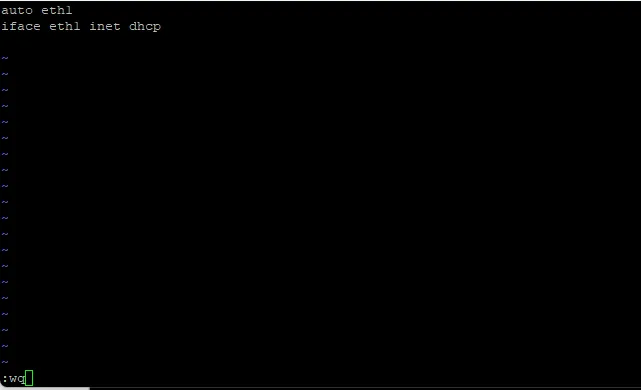</p>

<p align="center"><strong>Figure 4-34 DHCP Client Configuration (Command Line)</strong></p>

After modifying the interface IP configuration, execute/etc/init.d/networking restart to restart the network service and make the configuration effective. 

### 4.3.2  System Administration

#### 4.3.2.1 Querying Firmware Version

To check the computer firmware version of EC954, please type: 

<p align="center"></p>

<p align="center"><strong>Figure 4-35 Firmware Version Query</strong></p>

By adding the - a option, you can see the complete version information: 

<p align="center"></p>

<p align="center"><strong>Figure 4-36 Full Firmware Version Information</strong></p>

#### 4.3.2.2 Viewing available disk space 

To determine the amount of available drive space, use the df command with the - h option. The system will return the amount of drive space decomposed by the file system. The available disk partition for users in EC954 product is/dev/mmcblk0p8. Here is an example:

<p align="center"></p>

<p align="center"><strong>Figure 4-37 Disk Space Query (df -h)</strong></p>

#### 4.3.2.3 Query product model information 

The devinfo tool can view product model information 

<p align="center"></p>

<p align="center"><strong>Figure 4-38 Product Model Query (devinfo)</strong></p>

#### 4.3.2.4 Adjusting Time 

EC954 has two time settings. One is the system time, and the other is the RTC (Real Time Clock) time maintained by the hardware of EC954. Use the date command to query the current system time or set a new system time. Use the hwclock command to query the current RTC time or set a new RTC time.

Use the command date MMDDhhmmYYYY to set the system time: 

MM: Month 

DD: Day 

Hh: hour 

Mm: minutes 

YYYY: Year 

<p align="center"></p>

<p align="center"><strong>Figure 4-39 Set System Time (date)</strong></p>

The following command can be used to set the RTC time to system time

<p align="center"></p>

<p align="center"><strong>Figure 4-40 Synchronize RTC to System Time (hwclock)</strong></p>

Click on the following link to obtain more detailed information about dates and times: 

[https://www.debian.org/doc/manuals/system-administrator/ch-sysadmin-time.html](https://www.debian.org/doc/manuals/system-administrator/ch-sysadmin-time.html) 

[https://wiki.debian.org/DateTime](https://wiki.debian.org/DateTime) 

#### 4.3.2.5 Setting Time Zone 

There are two methods to configure the time zone of EC954. One is to use the command tzselect. Another option is to use the/etc/localtime file. 

**Using the tzselect command**

After typing the tzselect command, you will enter the region selection interface. First, select the approximate region (divided by continent or ocean) and enter the number in front of the continent or ocean 

<p align="center">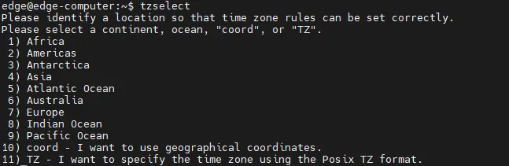</p>

<p align="center"><strong>Figure 4-41 tzselect Area Selection</strong></p>

Choose another country under that continent or ocean 

<p align="center"></p>

<p align="center"><strong>Figure 4-42 tzselect Country Selection</strong></p>

Follow the above steps to obtain the Chinese time zone keyword Asia/Shanghai, and execute the following command to set the time zone 

<p align="center"></p>

<p align="center"><strong>Figure 4-43 Set Time Zone Command</strong></p>

**Using Localtime Files**

The local time zone is stored in/etc/localtime, and if no value is set for the TZ environment variable, it is used by the GNU library for C (glibc). This file is either a copy of/usr/share/zoneinfo/file, or a symbolic link pointing to it. If EC954 cannot find the/usr/share/zoneinfo/file, please download the time zone information file you need from the website（ [https://www.iana.org/time-zones](https://www.iana.org/time-zones) ）And re link to the local time file in EC900. 

Take care

After successfully downloading the required time zone information file, decompress it, and then use the zic command to compile and generate the corresponding binary file. The generated time zone file is "/usr/share/zoneinfo/custom time zone file name". 

## 4.4 Peripheral Interfaces

### 4.4.1 Serial Ports

EC954 has eight serial ports. The first four ports (P1-P4) support RS-232, RS-485, and RS-422 modes. The default mode is RS-485. The last four ports (P5-P8) are fixed to RS-485. The device nodes for P1-P4 are `/dev/ttyCOM1` to `/dev/ttyCOM4`.

<p align="center">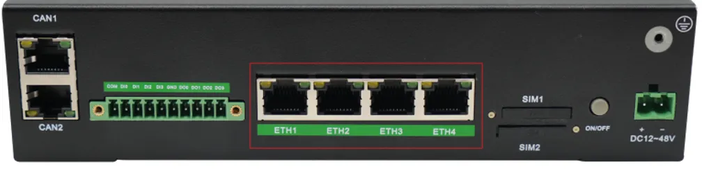</p>

<p align="center"><strong>Figure 4-44 Ethernet Ports</strong></p>

<p align="center"></p>

<p align="center"><strong>Figure 4-45 Serial Ports</strong></p>

The pin assignments for the first four serial ports are shown below.

<p align="center">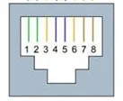</p>

<p align="center"><strong>Figure 4-46 Serial Port Pin Assignment</strong></p>

| RJ45 Pin Number | RS-232 | RS-422 | RS-485 |
|-----------------|--------|--------|--------|
| 1 | DSR | - | - |
| 2 | RTS | TxD+ | - |
| 3 | GND | GND | GND |
| 4 | TxD | TxD- | - |
| 5 | RxD | RxD+ | Data+ |
| 6 | DCD | RxD- | Data- |
| 7 | CTS | - | - |
| 8 | DTR | - | - |

Use the `ih_uart_ctl` command to switch the serial port mode.

<p align="center"></p>

<p align="center"><strong>Figure 4-47 Serial Port Mode Switch</strong></p>

Use the `stty` command to view and configure serial port parameters.

<p align="center"></p>

<p align="center"><strong>Figure 4-48 STTY Help (1)</strong></p>

<p align="center"></p>

<p align="center"><strong>Figure 4-49 STTY Help (2)</strong></p>

<p align="center"></p>

<p align="center"><strong>Figure 4-50 STTY Help (3)</strong></p>

<p align="center"></p>

<p align="center"><strong>Figure 4-51 STTY Help (4)</strong></p>

<p align="center"></p>

<p align="center"><strong>Figure 4-52 STTY Help (5)</strong></p>

View serial port information:

<p align="center">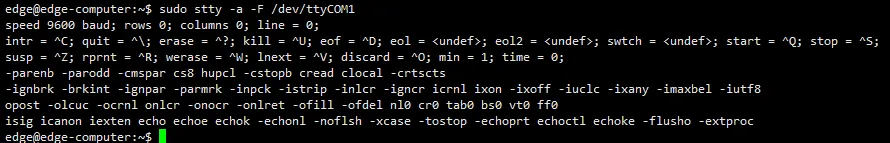</p>

<p align="center"><strong>Figure 4-53 Serial Port Information</strong></p>

Set the baud rate for COM1:

```
sudo stty -F /dev/ttyCOM1 ispeed 9600 ospeed 9600 cs8
```

Set the baud rate for COM2:

```
sudo stty -F /dev/ttyCOM2 ispeed 9600 ospeed 9600 cs8
```

Set the baud rate for COM3:

```
sudo stty -F /dev/ttyCOM3 ispeed 9600 ospeed 9600 cs8
```

Set the baud rate for COM4:

```
sudo stty -F /dev/ttyCOM4 ispeed 9600 ospeed 9600 cs8
```

For more information about the `stty` command, refer to [http://www.gnu.org/software/coreutils/manual/coreutils.html](http://www.gnu.org/software/coreutils/manual/coreutils.html).

### 4.4.2 USB Interface

EC954 provides two USB 2.0 Host ports, used for expanding storage devices and connecting input devices.

<p align="center">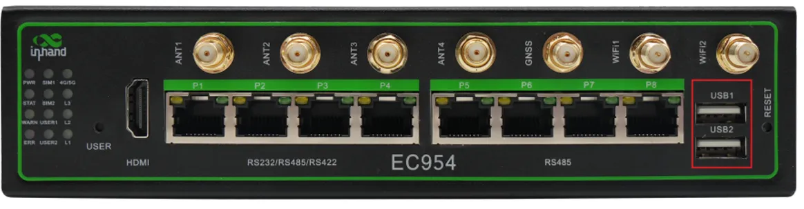</p>

<p align="center"><strong>Figure 4-54 USB Ports</strong></p>

USB storage devices support hot-plugging. All partitions are automatically mounted to `/mnt/usb_<node>_<num>`.

<p align="center">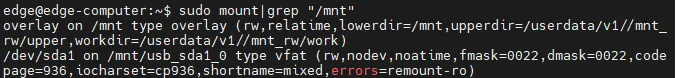</p>

<p align="center"><strong>Figure 4-55 USB Mount Example</strong></p>

> **Warning**: Before disconnecting a USB mass storage device, enter the `sync` command to prevent data loss. Exit from the `/media/*` directory before disconnecting. If the automatic unmount fails, type `umount /media/usb*` to manually unmount the device.

### 4.4.3 Micro SD Card

EC954 supports Micro SD storage cards. Hot-swap is not supported. All partitions are automatically mounted to `/mnt/sd_<node>_<num>`.

<p align="center"></p>

<p align="center"><strong>Figure 4-56 Micro SD Mount Example</strong></p>

### 4.4.4 mSATA Hard Drive

To configure an mSATA hard drive, follow these steps.

1. Log in to the system and execute `sudo fdisk -l` to locate the hard disk partition.

<p align="center"></p>

<p align="center"><strong>Figure 4-57 mSATA Partition Identification</strong></p>

2. Format the partition to the desired file system, such as ext4.

<p align="center"></p>

<p align="center"><strong>Figure 4-58 mSATA File System Format</strong></p>

3. Create a mount point, such as `/mnt/sda1`.
4. Edit the `/etc/fstab` file and add the following line at the end:

```
/dev/sda1 /mnt/sda1 ext4 defaults,nofail,x-system.device-timeout=1s 0 0
```

Replace `/dev/sda1` and `/mnt/sda1` with the actual device partition and mount point. Replace `ext4` with the actual file system format.

<p align="center">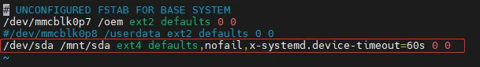</p>

<p align="center"><strong>Figure 4-59 mSATA fstab Configuration</strong></p>

### 4.4.5 CAN Bus Interface

EC954 has a 2-way CAN bus interface supporting the CAN 2.0A/B standard. CAN2 is compatible with CAN FD up to 5 Mbps.

<p align="center"></p>

<p align="center"><strong>Figure 4-60 CAN Pin Assignment</strong></p>

| RJ45 Pin Number | Identification | Function Description |
|-----------------|----------------|---------------------|
| 1 | CAN_H | CAN high level data line |
| 2 | CAN_L | CAN low level data line |

**Configure CAN1**

Check the CAN device status using the `ip link` command.

<p align="center"></p>

<p align="center"><strong>Figure 4-61 CAN1 Device Status</strong></p>

To configure CAN1, first shut down the device:

```
sudo ip link set can0 down
```

Set the bit rate (example for 125k):

```
sudo ip link set can0 type can bitrate 125000
```

Restart the device:

```
sudo ip link set can0 up
```

**Configure CAN2**

Check the CAN2 device status.

<p align="center">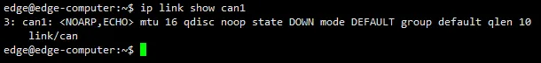</p>

<p align="center"><strong>Figure 4-62 CAN2 Device Status</strong></p>

To configure CAN2:

```
sudo ip link set can1 down
sudo ip link set can1 type can bitrate 125000 dbitrate 1250000 fd on
sudo ip link set can1 up
```

### 4.4.6 IO Ports

EC954 supports four digital inputs (DI0-DI3) and four digital outputs (DO0-DO3).

<p align="center">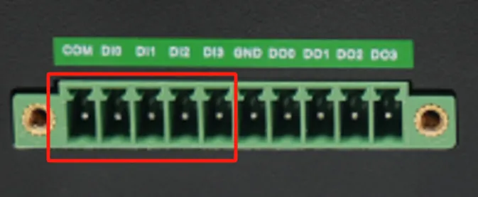</p>

<p align="center"><strong>Figure 4-63 Digital Input Interface</strong></p>

| Interface | Function | Description |
|-----------|----------|-------------|
| COM | DI Common Port | 4-way digital input, dry contact status "1": closed, "0": open, isolation 3000 VDC |
| DI0 | Digital Input 0 | — |
| DI1 | Digital Input 1 | — |
| DI2 | Digital Input 2 | — |
| DI3 | Digital Input 3 | — |

<p align="center">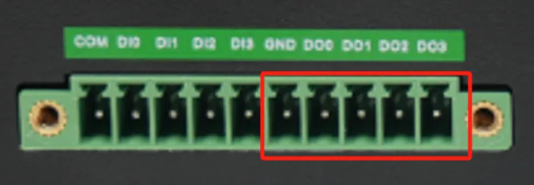</p>

<p align="center"><strong>Figure 4-64 Digital Output Interface</strong></p>

| Interface | Function | Description |
|-----------|----------|-------------|
| GND | DO Ground Terminal | 4-channel digital output, isolation 3000 VDC |
| DO0 | Digital Output 0 | — |
| DO1 | Digital Output 1 | — |
| DO2 | Digital Output 2 | — |
| DO3 | Digital Output 3 | — |

Use the `dio_mgmt` command to control IO.

<p align="center"></p>

<p align="center"><strong>Figure 4-65 dio_mgmt Command Help</strong></p>

Set an IO port to high or low:

<p align="center">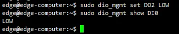</p>

<p align="center"><strong>Figure 4-66 dio_mgmt Set Output</strong></p>

Print the level information of the corresponding IO port:

```
dio_mgmt show DI0
dio_mgmt show DO0
```

### 4.4.7 GPS

Some EC954 models integrate a GPS module. The data serial port node is `/dev/ttyS9`.

To view GPS data, use one of the following methods.

*Method 1*: Configure the serial port using `stty`, then use `cat` to output raw data.

<p align="center">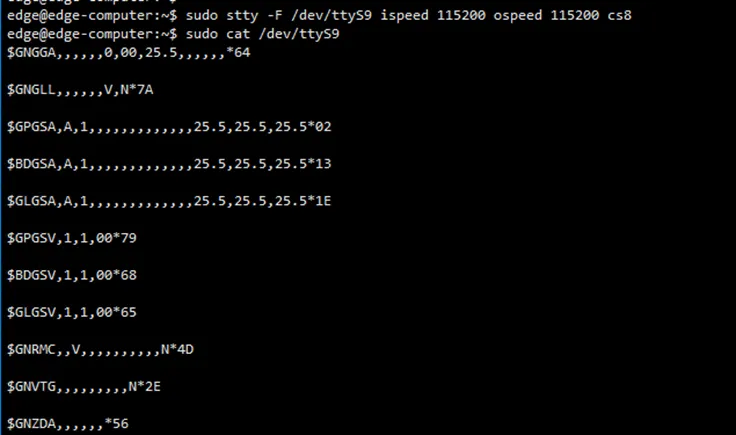</p>

<p align="center"><strong>Figure 4-67 GPS Raw Data Output</strong></p>

*Method 2*: Use the `gnss` command to output parsed information such as time, longitude, and latitude.

<p align="center"></p>

<p align="center"><strong>Figure 4-68 GPS Parsed Data</strong></p>

### 4.4.8 Power On/Off Button

**Shutdown**

1. Press and hold the power button for 8 seconds to turn off the device.
2. Alternatively, use the Linux `shutdown` command to stop all software and power down the system.

<p align="center"></p>

<p align="center"><strong>Figure 4-69 Shutdown Command</strong></p>

**Power On**

Short press the power button. The system performs the power-on operation.

### 4.4.9 User Programmable Buttons

EC954 provides an API interface to detect the state of programmable buttons. The device node information can be obtained from the system description file.

<p align="center">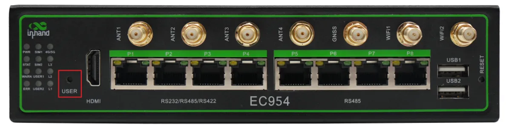</p>

<p align="center"><strong>Figure 4-70 User Programmable Buttons</strong></p>

## 4.5 Security Mechanisms

### 4.5.1 Sudo Mechanism

On the EC954, root user login is disabled for security reasons. `sudo` is a program that allows approved users to execute commands as root. Using `sudo` is safer than operating directly as root because it minimizes privilege exposure.

<p align="center">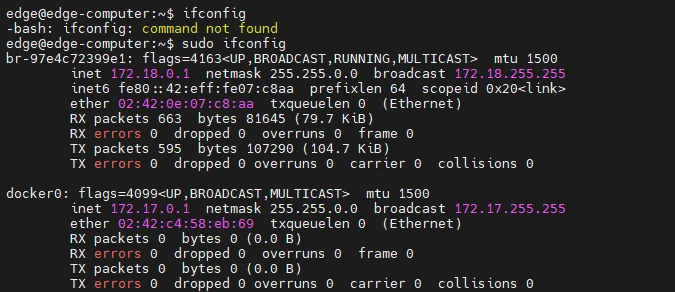</p>

<p align="center"><strong>Figure 4-71 Sudo Command Example</strong></p>

### 4.5.2 Firewall

Netfilter/iptables is a packet filtering firewall tool included with the Linux system. It controls the inflow, outflow, and forwarding of data packets through the server.

### 4.5.3 TPM2.0

TPM (Trusted Platform Module) is a hardware security module designed to provide security and encryption capabilities for computer systems. It includes an encryption coprocessor for storing encryption keys, digital certificates, and other secure data. The EC954 integrates the standard TPM2.0 protocol stack and TPM2.0 tools.


## 4.6 Programming Guide

### 4.6.1 Device Description File

EC954 provides a JSON-format device information description file at `/tmp/ieos/etc/systeminfo.json`. Customers can query this file to obtain device node information for peripherals such as IO, LED, serial port, and others.

### 4.6.2 IO Programming

The device has eight IO interfaces: DI0-DI3 (four input pins) and DO0-DO3 (four output pins). According to the device description file, the IO device nodes are:

- DI0-DI3: `/sys/class/gpio/gpio487` to `/sys/class/gpio/gpio490`
- DO0-DO3: `/sys/class/gpio/gpio491` to `/sys/class/gpio/gpio494`

To program IO interfaces, operate on the `value` file under the corresponding device node.

Set DO0 to high:

```
echo 1 > /sys/class/gpio/gpio491/value
```

Read DI0 level:

```
cat /sys/class/gpio/gpio487/value
```

### 4.6.3 LED Programming

The device provides two user-programmable LEDs: USER1 and USER2. The device nodes are:

- USER1: `/sys/class/leds/user1`
- USER2: `/sys/class/leds/user2`

Control files in the LED directory:

| File | Function |
|------|----------|
| `brightness` | Controls LED on/off; write `1` for on, `0` for off |
| `trigger` | LED trigger mode; write `timer` for timer trigger, `none` to cancel |
| `delay_on` | LED on time in milliseconds (valid when trigger is timer) |
| `delay_off` | LED off time in milliseconds (valid when trigger is timer) |

When the trigger is set to timer, the brightness value no longer takes effect and automatically becomes 0.

Turn USER1 on:

```
echo 1 > /sys/class/leds/user1/brightness
```

Make USER1 blink (1 second on, 1 second off):

```
echo timer > /sys/class/leds/user1/trigger
echo 1000 > /sys/class/leds/user1/delay_on
echo 1000 > /sys/class/leds/user1/delay_off
```

Stop USER1 blinking:

```
echo none > /sys/class/leds/user1/trigger
```

### 4.6.4 Cross Compilation

User-developed C/C++ programs can be cross-compiled on a development machine using the cross-compilation toolchain, then uploaded to the EC954 for execution.

Cross-compilation toolchain package: `gcc-linaro-6.3.1-2017.05-x86_64_aarch64-linux-gnu.tar.gz`

**Environment Setup**:

1. Extract the toolchain package to `/opt` on the development machine.
2. Edit `~/.bashrc` and append the following line:
   ```
   PATH=$PATH:/opt/gcc-linaro-6.3.1-2017.05-x86_64_aarch64-linux-gnu/bin
   ```
3. Execute `source ~/.bashrc` to apply the environment variables.

**Example Makefile**:

```makefile
TARGET  := helloworld
DIRS    := $(shell find . -maxdepth 3 -type d)
SRCS    := $(foreach dir,$(DIRS),$(wildcard $(dir)/*.c))
OBJS    := $(SRCS:.c=.o)

CC=aarch64-linux-gnu-gcc
CFLAGS  := -Wall -Wextra -g -Wno-unused-parameter

all: $(TARGET)

$(TARGET): $(OBJS)
	$(CC) $(CFLAGS) $(LIBS) $^ -o $@

%.o: %.c
	$(CC) $(CFLAGS) $(LIBS) -c $< -o $@

clean:
	rm -f $(TARGET) $(OBJS)

.PHONY: all clean
```

Execute `make` in the project directory to generate the target file.


---

## Chapter 5: Typical Applications

### Case 1: Industrial Edge Data Collection and Remote Management

**Scene Description**: In an industrial monitoring environment, the EC954 is deployed at the edge of a factory network to collect data from field devices via serial ports or IO interfaces, process the data locally, and upload it to a cloud platform via cellular network. Administrators remotely monitor and manage the device through the DeviceLive platform.

**Device Role**: The EC954 acts as an edge gateway, responsible for collecting data from downstream devices, performing local preprocessing, and uploading data to the cloud via cellular network.

**Configuration Steps**:
1. Install the EC954 on a DIN rail or wall in the field cabinet.
2. Connect cellular antennas and insert a SIM card.
3. Power on the device and verify that the cellular network connection is successful.
4. Log in to the web management interface.
5. Navigate to [Network] → [Cellular] and configure APN parameters if required.
6. Navigate to [System Management] → [Basic Configuration] → [Cloud Management] and enable DeviceLive cloud management.
7. Connect field devices (PLCs, sensors) to the serial ports or IO interfaces.
8. Develop and deploy a data collection application using the programming guide.

**Reference Chapters**:
- [Cellular Network Configuration](#42-cellular-network-configuration)
- [Remote Device Management via DeviceLive](#scenario-4-remote-device-management-via-devicelive)
- [Serial Ports](#4131-serial-ports)
- [IO Programming](#4142-io-programming)
- [Programming Guide](#414-programming-guide)

---

## Appendix A: Troubleshooting

### 1 Network Connection Issues

| Phenomenon | Possible Cause | Troubleshooting Steps | Reference Chapter |
|------------|----------------|----------------------|-------------------|
| Unable to connect to cellular network | SIM card not inserted or poorly connected | 1. Check SIM card insertion<br>2. Reinsert the SIM card | [SIM Card Installation](#224-sim-card-installation) |
| Unable to connect to cellular network | APN parameter misconfiguration | 1. Verify APN parameters<br>2. Contact the carrier for correct APN | [Cellular Network Configuration](#42-cellular-network-configuration) |
| Unable to connect to cellular network | Weak or no signal | 1. Check antenna connections<br>2. Adjust device position | [Antenna Installation](#223-antenna-installation) |
| Unable to open web interface | PC IP address not in same subnet | 1. Confirm PC and device are in the same subnet<br>2. Check device default IP | [Default Settings](#16-default-settings) |
| Unable to open web interface | Browser compatibility issue | 1. Use a recommended browser (Chrome)<br>2. Clear browser cache | [First-Time Access](#228-first-time-access) |
| Wi-Fi Station connection fails | Incorrect SSID or password | 1. Verify SSID and password<br>2. Rescan and reconfigure | [Wi-Fi Station Configuration](#43-wi-fi-station-configuration) |
| Ethernet communication failure | IP configuration error | 1. Check IP address, netmask, and gateway<br>2. Verify cable connection | [Ethernet Configuration](#scenario-3-ethernet-configuration) |

### 2 System Issues

| Phenomenon | Possible Cause | Troubleshooting Steps | Reference Chapter |
|------------|----------------|----------------------|-------------------|
| STATUS indicator off after power-on | System startup failure | 1. Check power supply voltage<br>2. Perform factory restore | [Restore Factory Settings](#15-restore-factory-settings) |
| Unable to log in via SSH | Incorrect username or password | 1. Verify default credentials<br>2. Check if the account is locked | [User Account Management](#410-user-account-management) |
| Factory restore incomplete | Device powered off during restore | 1. Do not power off during the 30-second restore window<br>2. Repeat factory restore procedure | [Restore Factory Settings](#15-restore-factory-settings) |
| DeviceLive platform shows device offline | Cloud management disabled | 1. Check cloud management enable status<br>2. Verify cloud server address | [Remote Device Management](#scenario-4-remote-device-management-via-devicelive) |

---

## Appendix B: Safety Precautions

1. The device must be used within the specified temperature and humidity ranges.
2. Do not use the device in explosive or flammable environments.
3. Verify that the power supply voltage matches the device specifications before connecting power.
4. The device must be powered off during SIM card and Micro SD card installation.
5. Before disconnecting USB mass storage devices, execute the `sync` command to prevent data loss.
6. During factory restore or firmware upgrade, do not power off the device.

> **Warning**: Non-professional personnel must not open the device enclosure. Risk of electric shock.

---

## Appendix C: Command Line Reference

### 1 Common Commands

| Command | Function | Example |
|---------|----------|---------|
| `ssh` | Remote SSH login | `ssh edge@192.168.3.100` |
| `sudo -s` | Switch to root user | `sudo -s` |
| `useradd` | Create user account | `sudo useradd -m -G sudo -s /bin/bash test1` |
| `userdel` | Delete user account | `sudo userdel test1` |
| `passwd` | Change password | `sudo passwd test1` |
| `uname -a` | Query firmware version | `uname -a` |
| `df -h` | View disk space | `df -h` |
| `devinfo` | Query product model | `devinfo` |
| `date` | Set system time | `date 052314302024` |
| `hwclock` | Set RTC time | `sudo hwclock --systohc` |
| `tzselect` | Interactive time zone selection | `tzselect` |
| `stty` | Configure serial port | `sudo stty -F /dev/ttyCOM1 9600 cs8` |
| `ip link` | Configure CAN interface | `sudo ip link set can0 up type can bitrate 125000` |
| `dio_mgmt` | Control digital IO | `dio_mgmt set DO0 HIGH` |
| `gnss` | Query GPS information | `gnss` |
| `sync` | Synchronize cached writes | `sync` |
| `shutdown` | Shutdown system | `sudo shutdown -h now` |
| `restore` | Restore factory settings | `sudo restore` |

### 2 IEOS Service Control

| Command | Function |
|---------|----------|
| `systemctl stop ieos_daemon` | Stop IEOS for current session |
| `systemctl disable ieos_daemon` | Disable IEOS from starting on boot |
| `systemctl start ieos_daemon` | Start IEOS |
| `systemctl enable ieos_daemon` | Enable IEOS to start on boot |

---

## FAQ

### Question 1: What is the difference between the EC954 and a standard router?

1. The EC954 is an edge computer with a powerful ARM Cortex-A55 quad-core processor, supporting AI computation up to 26 TOPS. It provides multiple industrial interfaces (serial, CAN, DI/DO) and runs a full Linux distribution for secondary development.
2. Standard routers typically provide only network routing functions without industrial interfaces or edge computing capabilities.

### Question 2: Why can the cellular dial-up status show success but the internet is unreachable?

1. The connection may be a false dial-up. Enable ICMP detection in [Network] → [Cellular] to detect and recover from false connections automatically.
2. Verify that the APN parameters match the carrier requirements.
3. Check the signal strength using the L1, L2, L3 indicators or the status page.

### Question 3: How to resolve the conflict between IEOS web management and Linux native commands?

1. When IEOS is enabled, it takes over network and system management. Native Linux commands may be overwritten or ineffective.
2. It is recommended to use the IEOS web interface for configurations supported by IEOS.
3. For configurations not supported by IEOS (such as VPN), disable IEOS using `systemctl stop ieos_daemon` and configure via native Linux commands.

### Question 4: What are the device nodes for the serial ports?

1. According to the serial port configuration chapter, P1-P4 correspond to `/dev/ttyCOM1` to `/dev/ttyCOM4`.
2. The exact device node names for all interfaces can be queried from `/tmp/ieos/etc/systeminfo.json`.

### Question 5: How to perform a safe shutdown?

1. Press and hold the power button for 8 seconds.
2. Alternatively, log in via SSH and execute `sudo shutdown -h now`.
3. Wait for the PWR indicator to turn off before disconnecting power.

---

*End of Document*
