# Enterprise Router ER2000 Product User Manual

## Preface

### Statement

Thank you for choosing our product. Before use, please read this user manual carefully. Complying with the following statements will help maintain intellectual property rights and legal compliance, ensuring that the user experience aligns with the latest product information. If there are any questions or if written permission is required, please contact our technical support team at any time.

- Copyright Statement

This user manual contains copyrighted content, and the copyright belongs to Beijing InHand Networks Technology Co., Ltd. and its licensors. Without written permission, no organization or individual may excerpt or copy any part of the content of this manual, or distribute it in any form.

- Disclaimer

Due to ongoing updates in product technology and specifications, the company cannot guarantee that the information in this user manual is entirely consistent with the actual product. Therefore, no disputes arising from any discrepancies between the actual technical parameters and this user manual are accepted. Any changes to the product will not be notified in advance, and the company reserves the right to make the final changes and interpretations.

- Copyright Information

The content of this user manual is protected by copyright laws, and the copyright belongs to Beijing InHand Networks Technology Co., Ltd. and its licensors, reserving all rights. Without written permission, the content of this manual may not be used, copied, or distributed without authorization.

### GUI Conventions

| Symbol | Meaning | Example |
|--------|---------|---------|
| `< >` | Indicates a variable or parameter to be replaced with an actual value | `<IP Address>` means to enter a specific IP address |
| `" "` | Indicates a text label on the interface | Click the "Save" button |
| `→` | Indicates menu hierarchy or operation sequence | [Network] → [Cellular] |
| `[ ]` | Indicates a menu or page name | Go to the [System Settings] page |
| **Caution** | Points to note during operation; improper actions may result in data loss or device damage | — |
| **Note** | Provides supplementary and necessary explanations for the operation description | — |

### Technical Support
Email: support@inhandnetworks.com

URL: www.inhand.com

### How to Use This Manual

**Matching the right reader**

- First-time users: It is recommended to read in sequence: [Getting to Know the Device] → [Installation and First Use] → [Common Scenario Configuration] → [Function Description and Parameter Reference].
- Existing device users: Can directly refer to [Function Description and Parameter Reference] or [Appendix: Troubleshooting].
- Cloud platform management users: Can refer to [Common Scenario Configuration] for device remote management platform content (if applicable).

**Quick navigation by task**

| Task | Corresponding Chapter | Estimated Time |
|------|----------------------|----------------|
| Device installation and Web login | [Installation and First Use](#chapter-2-installation-and-first-use) | Approx. 10 minutes |
| Configure Internet access | [Common Scenario Configuration](#chapter-3-common-scenario-configuration) | Approx. 5 minutes |
| Connect to cloud platform | [Common Scenario Configuration](#chapter-3-common-scenario-configuration) | Approx. 5 minutes |
| Monitor device status | [Function Description and Parameter Reference](#chapter-4-function-description-and-parameter-reference) | Approx. 10 minutes |
| Configure VPN | [Function Description and Parameter Reference](#chapter-4-function-description-and-parameter-reference) | Approx. 15 minutes |
| Troubleshoot network issues | [Appendix: Troubleshooting](#appendix-troubleshooting) | On demand |

---

## Chapter 1 Getting to Know the Device

### 1.1 Overview

ER2000 is a high-performance enterprise router/gateway designed for mid-to-large retail sites, branch offices, and small campuses. It offers 10G uplinks and aggregation connectivity, supports SD-WAN for rapid site-to-site deployment, and enables unified provisioning, configuration, monitoring, and remote diagnostics via a cloud management platform. Selected models also support PoE to power APs, IP cameras, and IP phones directly, helping organizations improve bandwidth and reliability across multi-site networks while reducing deployment and O&M costs.

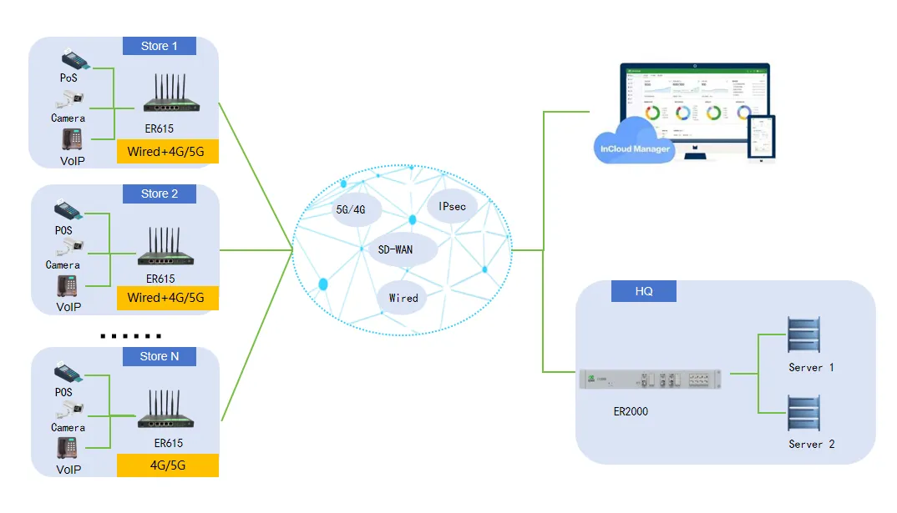

<strong>Figure 1-1 ER2000 Application Scenario</strong>

### 1.2 LED Indicators

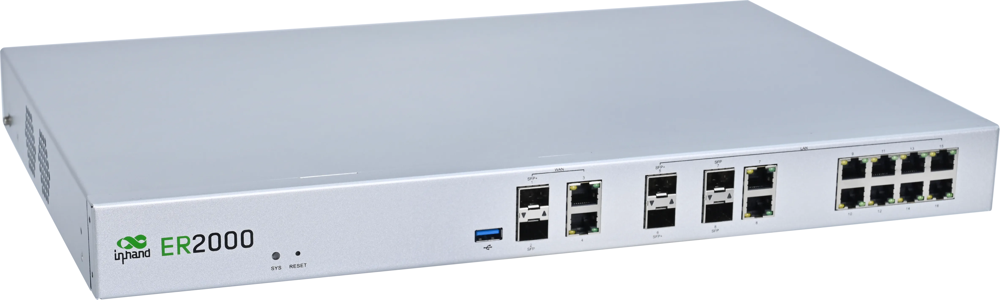

<strong>Figure 1-2 Factory Reset Button Location</strong>

| LED | Status | Meaning |
|-----|--------|---------|
| SYS | Off | Device is not powered on |
| | Steady Red | System starting up |
| | Steady Green | System operating normally |
| | Blinking Red | System fault |
| | Blinking Blue | System upgrading |

### 1.3 Restore to Factory Defaults

Restore factory settings via the Reset button:

1. Power on the device. When the SYS indicator is solid red, press and hold the Reset button (for about 50 seconds) until the SYS indicator starts flashing red.
2. Release the Reset button. The SYS indicator will then flash blue, indicating that the device has entered the factory reset process.

### 1.4 Default Settings

| No. | Function | Default Settings |
|:---:|----------|------------------|
| 1 | Ethernet Default Configuration | Four WAN ports obtain IP addresses via DHCP by default. **IP Address:** 192.168.100.1 **Subnet Mask:** 255.255.255.0 |
| 2 | Network Access Control | Local HTTP and HTTPS access enabled, using ports **80** and **443** respectively. |
| 3 | Username and Password | adm / 123456 |

---

## Chapter 2 Installation and First Use

### 2.1 Pre-Installation Preparation

Before installing the device, ensure the following conditions are met:

- The operating environment temperature and humidity meet the device specifications.
- The necessary tools and accessories (power adapter, Ethernet cables) are prepared.
- A PC with a Web browser (Google Chrome is recommended) is available for configuration.

> **Caution:** Use the original power adapter to avoid device damage caused by mismatch.

### 2.2 Installation Guide

1. Connect the device to power using the supplied power adapter.
2. Connect any LAN port of the device to the PC using an Ethernet cable.
3. Configure the PC's IP address to be in the same subnet as the router.
   - a. The device has DHCP enabled by default. Set the PC to "Obtain an IP address automatically." The router will automatically assign an IP address to the PC. Verify that the PC has obtained an IP address and that it is within the **192.168.100.0** subnet.
   - b. If the PC cannot obtain an IP address automatically, manually configure the PC's IP address to any value between **192.168.100.2–192.168.100.254**, set the default gateway to **192.168.100.1**, the subnet mask to **255.255.255.0**, and the DNS server to **223.5.5.5** or the carrier's DNS server address.
4. Enter the device's default address **192.168.100.1** in the browser address bar. After entering the username and password (refer to the nameplate information or [Default Settings](#16-default-settings)), the device's Web management interface will be accessed. If the browser displays a security warning, open the hidden or advanced options and choose to proceed.

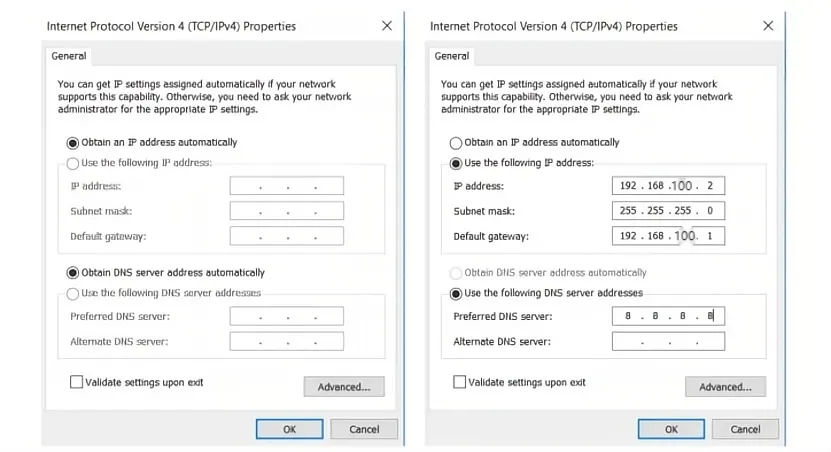

<strong>Figure 2-1 Configure PC IP Address</strong>

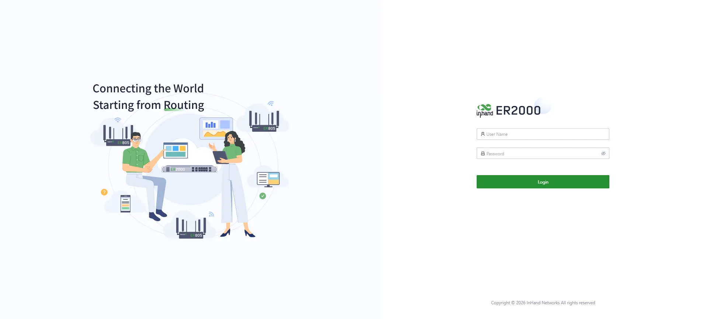

<strong>Figure 2-2 ER2000 Web Interface Login</strong>

### 2.3 Quick Checklist

After installation, verify the following items:

- [ ] The SYS LED is steady green, indicating normal operation.
- [ ] The PC has obtained an IP address in the 192.168.100.0/24 subnet.
- [ ] The Web management interface at 192.168.100.1 is accessible.

---

## Chapter 3 Common Scenario Configuration

### Scenario 1: Quick Internet Access

**Objective**: Connect the ER2000 to the Internet via a wired WAN connection.

**Prerequisites**: The device is powered on, and an Ethernet cable is available to connect the WAN port to the upstream network.

**Estimated Time**: Approx. 5 minutes.

**Operation Steps**:
1. Connect any WAN port (WAN1/WAN2/WAN3/WAN4) to the upstream network with an Ethernet cable.
2. By default, the WAN ports use DHCP. The device will automatically obtain an IP address and access the Internet.
3. If a static IP or PPPoE is required, log in to the Web interface, go to [Internet], select the corresponding WAN interface, and change the connection method as needed.

**Verification Method**:
1. Check that the WAN port LED indicates a normal link.
2. On the [Dashboard] page, verify that the uplink interface has obtained an IP address.
3. Use the Ping tool under [System] → [Tools] to test connectivity to a public IP address (e.g., 8.8.8.8).

**Common Issues**:
- No Internet access: Confirm that the upstream network is functional and that the WAN cable is securely connected.
- Cannot obtain an IP address: Verify whether the ISP requires PPPoE credentials or a static IP configuration.

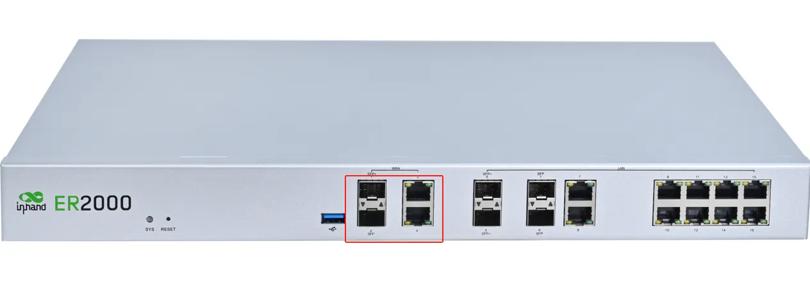

<strong>Figure 3-1 Device WAN Port Configuration</strong>

### Scenario 2: Connect to InCloud Manager Platform

**Objective**: Add the ER2000 to the InCloud Manager cloud platform for centralized management.

**Prerequisites**: The device has Internet access, and a valid email address is available for platform registration.

**Estimated Time**: Approx. 10 minutes.

**Operation Steps**:
1. In a Web browser (Google Chrome is recommended), navigate to [https://star.inhandcloud.com](https://star.inhandcloud.com). The page will be automatically redirected to the portal. Click "Create Now" to create a new platform account.
2. After completing email registration, log in to the InHand Cloud portal with the registered username and password, and select the [InCloud Manager] service.
3. After logging in to InCloud Manager, go to the [Devices] menu, click "Add", enter the device name, serial number, and MAC address, then click "Finish" to complete adding the device.

**Verification Method**:
1. On the InCloud Manager [Devices] page, confirm that the ER2000 device status is online.
2. Click the device name to enter the device details page and verify that basic information and interface status are displayed.

**Common Issues**:
- Device remains offline: Confirm that the device has Internet access and that the serial number and MAC address were entered correctly.
- License expired: When ER2000 connects to the cloud platform for the first time, the platform automatically issues a one-year Basic license. Users can renew the license or upgrade it to the Branch Professional Edition under "Enterprise Management > Subscriptions > Licenses".

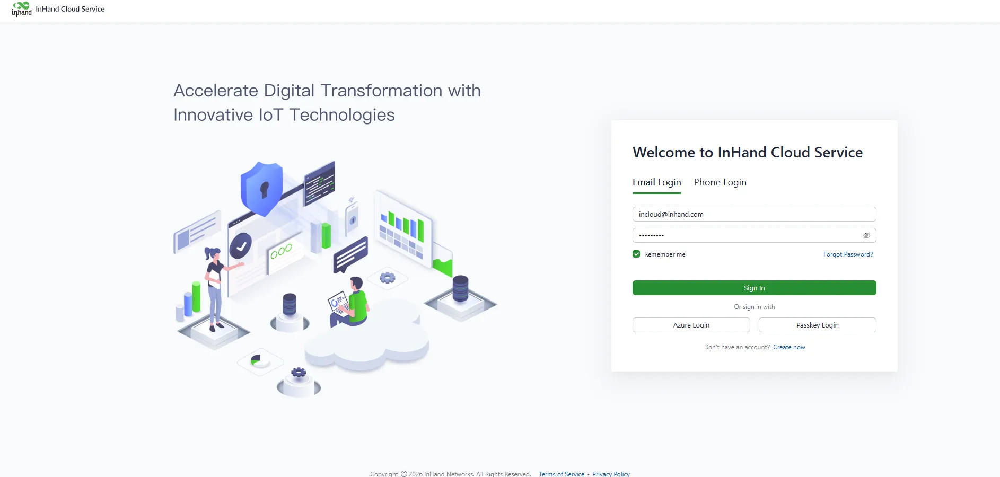

<strong>Figure 3-2 Register an InHand Cloud Services Account</strong>

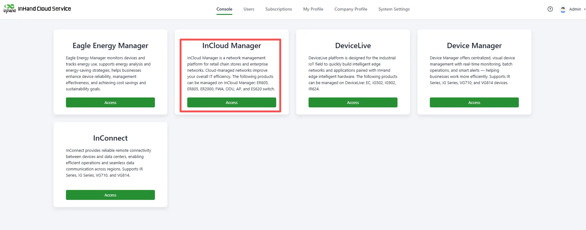

<strong>Figure 3-3 Select SaaS Service</strong>

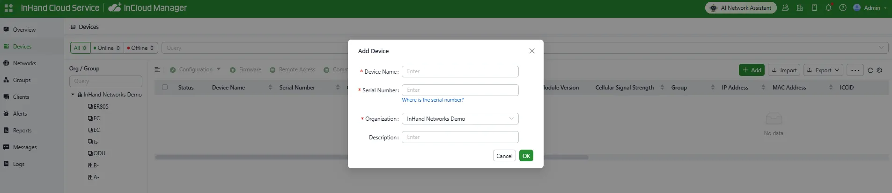

<strong>Figure 3-4 Add the Device to InCloud Manager</strong>

---

## Chapter 4 Function Description and Parameter Reference

### 4.1 Device Monitoring

After adding the device to the platform, the network can be managed and monitored from the platform. The platform also supports remotely viewing real-time status information via the device's local interface.

#### 4.1.1 Device Overview

In the [Devices] section, click the [Device Name] to access the device details page.

**Overview**

On the Overview page, the device's basic information, interface status, traffic statistics, license status, software version, and more can be viewed.

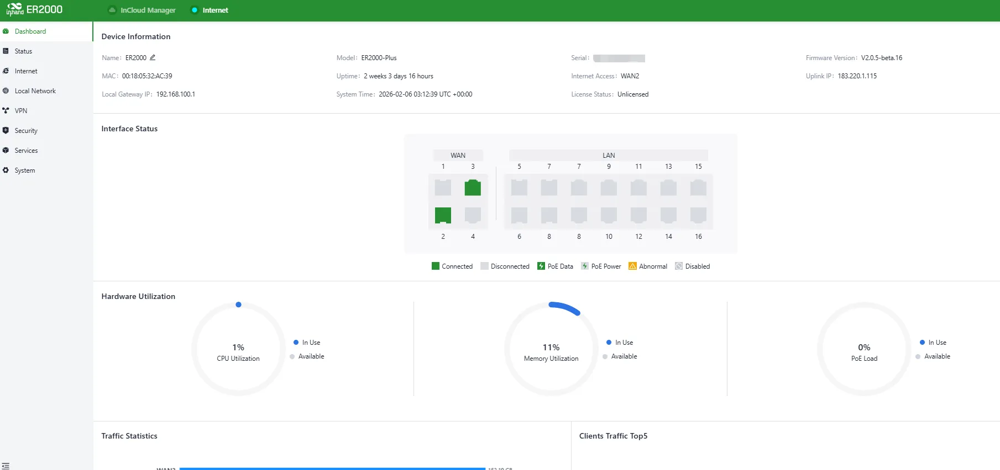

<strong>Figure 4-1 Device Information Overview</strong>

**Traffic Usage**

On the "Devices > Traffic" page, historical traffic usage data for each uplink port can be viewed.

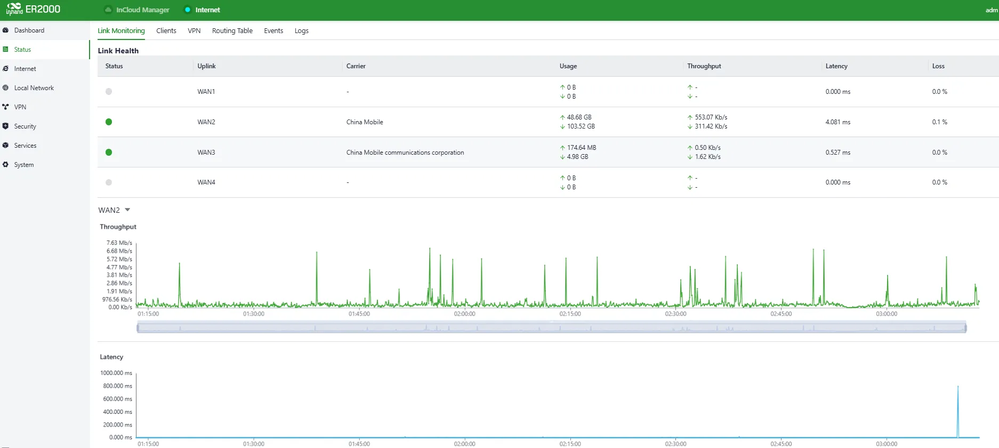

<strong>Figure 4-2 Traffic Statistics</strong>

#### 4.1.2 Local Device Information

Using InCloud Manager's "Remote Access" feature, the device can be viewed and configured in real time. Select the target device and click "Remote Access" to open the device's local login page.

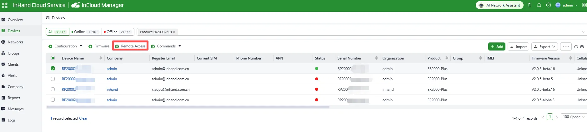

<strong>Figure 4-3 Select Target Device for Remote Access</strong>

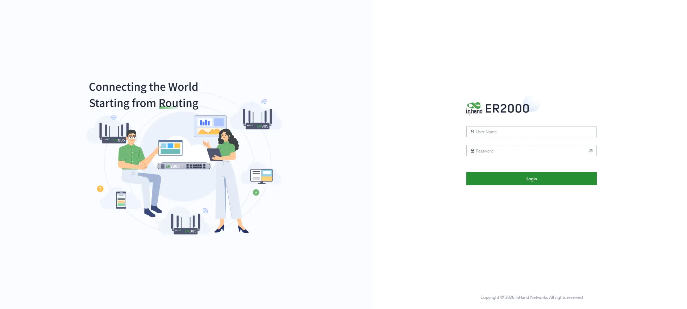

<strong>Figure 4-4 Remote Access Login Page</strong>

**Device Information**

On the [Dashboard] page, the device's basic information is displayed at the top of the page, including device name, model, serial number, MAC address, uptime, uplink interface address, etc.

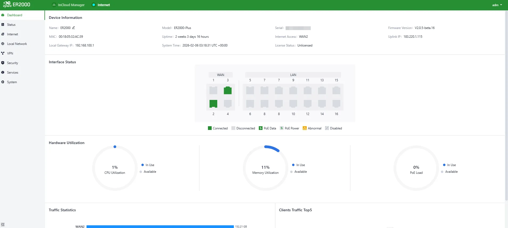

<strong>Figure 4-5 View Device Information</strong>

| Parameter | Description |
|-----------|-------------|
| Name | Device name identifier. Default is "ER2000"; can be modified. |
| MAC Address | Physical MAC identifier of the device. |
| Local Gateway Address | Gateway address of the device's default subnet. |
| Model | Specific device model; helps determine whether the device supports cellular and WLAN features. |
| Uptime | Running time since the device was powered on. |
| System Time | Displays the device time zone and system time. |
| Serial Number | Unique device identifier; used for indexing or adding the device to a platform account. |
| Connection Method | Uplink interface used for Internet access. |
| License Status | License applied to the device: InCloud Manager Basic Edition or Branch Professional Edition. |
| Firmware Version | Current software version number. |
| Uplink Interface Address | IP address of the uplink interface used for Internet access. |

**Interface Status**

In "Dashboard → Interface Status", the operating status of each interface can be viewed. Click an interface icon to view detailed information in the pop-up panel on the right.

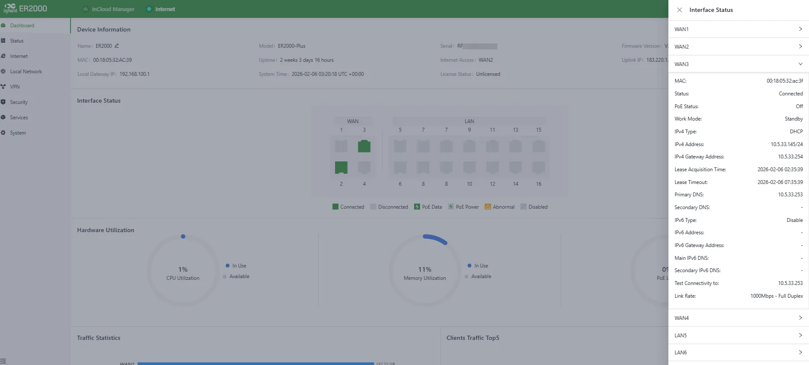

<strong>Figure 4-6 Detailed Port Information</strong>

**Traffic Statistics**

In "Dashboard → Traffic Statistics", traffic usage for each uplink interface since power-on can be viewed. Traffic statistics reset after a reboot. If historical traffic records are needed, view them on the device details page in InCloud Manager.

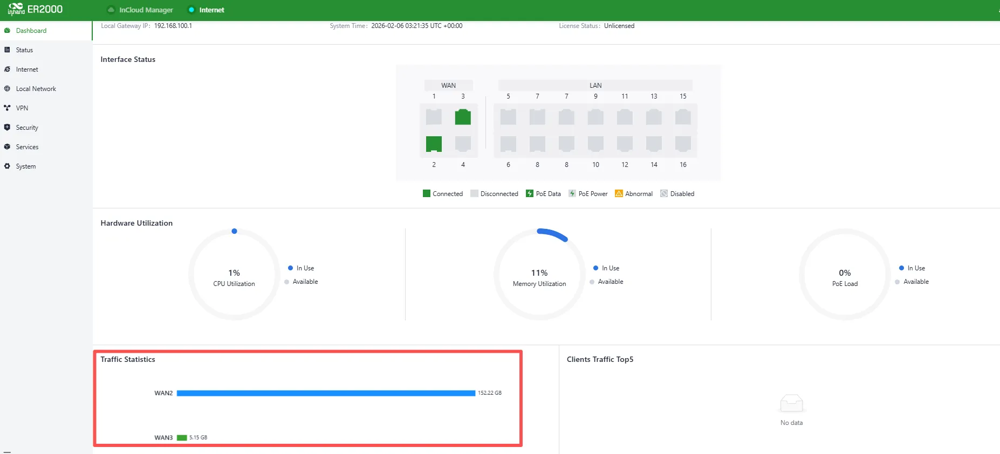

<strong>Figure 4-7 Uplink Traffic Statistics</strong>

**Link Monitoring**

In "Status → Link Monitoring", the uplink health status and metrics such as throughput, latency, packet loss, and signal strength can be viewed.

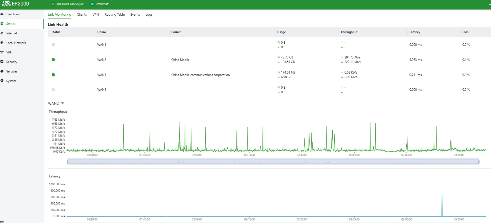

<strong>Figure 4-8 Uplink Link Information</strong>

**Clients**

In "Status → Clients", detailed information about wired/wireless clients connected to the router can be viewed, such as name, IP address, MAC address, VLAN, connected subnet, traffic usage, uptime, etc.

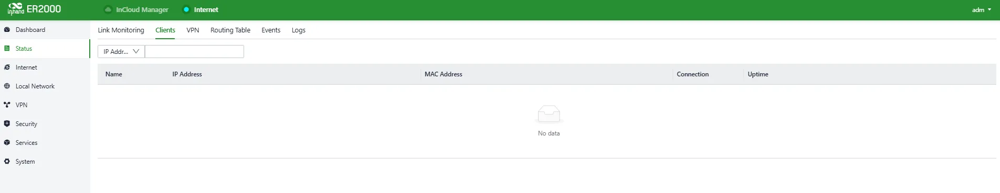

<strong>Figure 4-9 Client Status</strong>

**VPN**

In "Status → VPN", information such as status name, traffic, and last connection duration for IPSec VPN and L2TP VPN can be viewed.

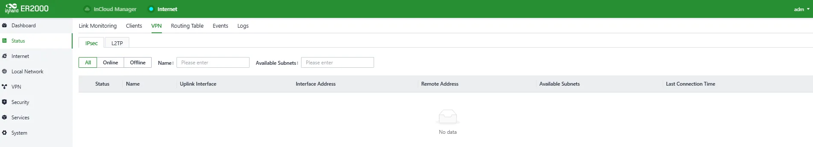

<strong>Figure 4-10 VPN Status Information</strong>

**Routing Table**

In "Status → Routing Table", all routing table information on the device can be viewed, including directly connected routes, static routes, and dynamic routes.

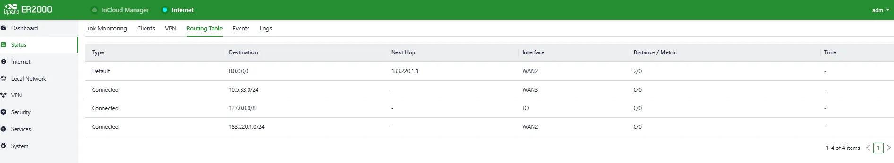

<strong>Figure 4-11 Routing Table</strong>

**Events**

In "Status → Events", device event records can be viewed to better understand device operating status.

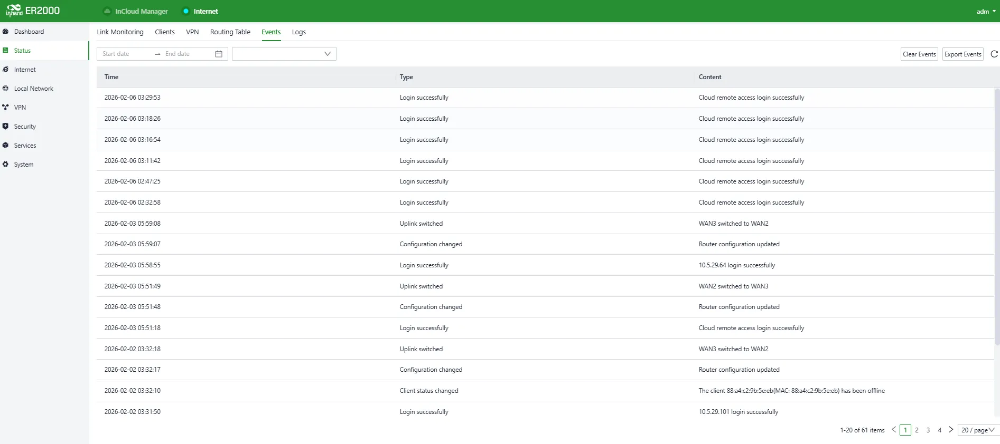

<strong>Figure 4-12 Device Event Records</strong>

Currently supported event types:

- User login success
- User login failure
- Configuration changes
- CPU utilization too high in the last 5 minutes
- Memory utilization too high in the last 5 minutes
- Probe status change
- VPN status change
- Client status change
- Uplink link status change
- Uplink link switchover
- Reboot
- Upgrade

**Logs**

In "Status → Logs", system logs can be viewed. When the device fails, technicians can troubleshoot based on system logs.

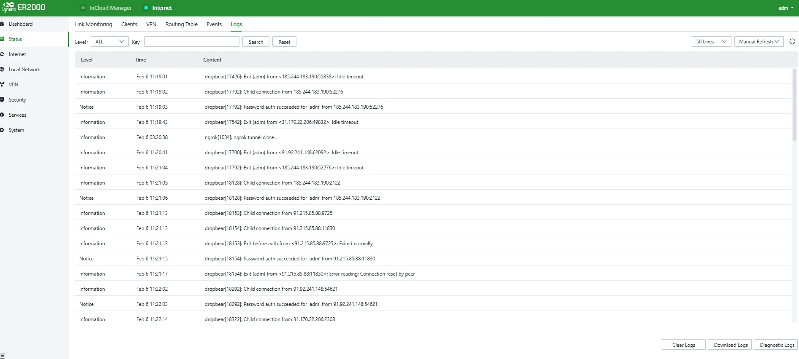

<strong>Figure 4-13 Device Log Records</strong>

Supported log operations:

- Download Logs: Download device runtime logs.
- Download Diagnostic Logs: Download diagnostic logs, including runtime logs, device info, device configuration, etc.
- Clear Logs: Clear runtime logs (diagnostic logs are not cleared).

### 4.2 Internet

ER2000 supports three wired Internet connection methods: DHCP, Static IP, and PPPoE. Click "Edit" to change the connection method as needed. The default method is DHCP.

Under "Internet", parameters and operating mode for each uplink interface can be configured. ER2000 supports up to four WAN ports. Select the appropriate interface based on the uplink port type; configuration items are the same for all ports.

- WAN1: 10G SFP+ optical port
- WAN2: 1G SFP optical port
- WAN3/4: 1G Ethernet ports

#### 4.2.1 Wired Connection (DHCP)

DHCP is enabled by default on the WAN1 interface. Connect the WAN interface to the Internet with an Ethernet cable and the device will access the Internet automatically.

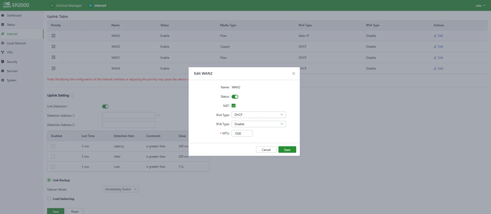

<strong>Figure 4-14 Enable DHCP Service on WAN1 Interface</strong>

#### 4.2.2 Wired Connection (Static IP)

Static IP: The IP address obtained from the ISP or assigned by the network administrator can be manually configured. After configuration, the router will access the network using the specified static IP.

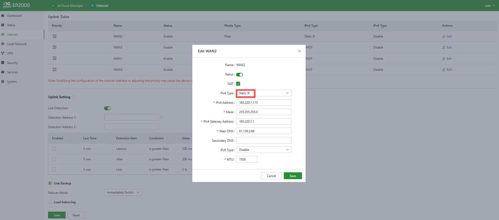

<strong>Figure 4-15 Configure a Static IP Address</strong>

#### 4.2.3 Wired Connection (PPPoE)

PPPoE: Configure broadband dial-up service. The configuration parameters are provided by the ISP. After configuration, the router can access the network via PPPoE.

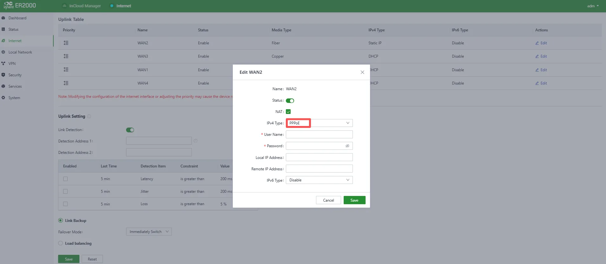

<strong>Figure 4-16 Configure Broadband Dial-Up Service</strong>

#### 4.2.4 Uplink List

In "Internet > Uplink List", WAN1–WAN4 interfaces can be edited. The "Priority" icon can be dragged to adjust interface priority. Interfaces are arranged from top to bottom by priority; higher-priority interfaces are preferred as the current uplink.

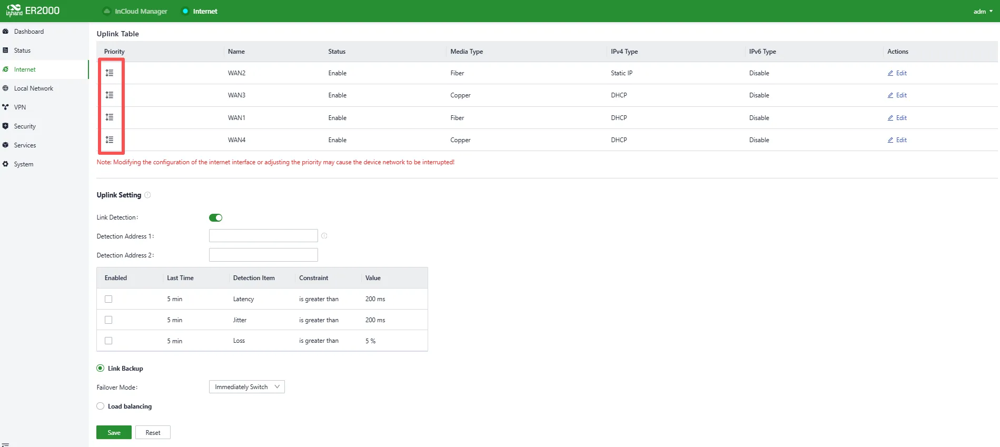

<strong>Figure 4-17 Uplink List</strong>

#### 4.2.5 Uplink Settings

In "Internet > Uplink Settings", link detection and the coordination mode among different uplink interfaces can be configured.

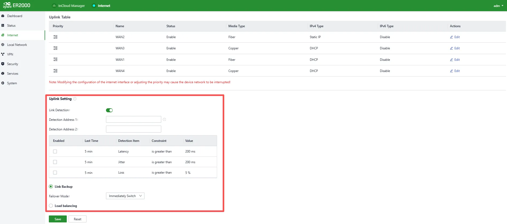

<strong>Figure 4-18 Uplink Settings</strong>

- Link Probe Switch: When enabled, probes connectivity for all uplink interfaces. Enabled by default.
- Probe Address: Enter a specific probe target address.
  - a. After it is set, all uplinks probe only this address. If the specified address is unreachable, Internet access may be affected.
  - b. If not set, the device selects an available address from the uplink DNS address and alternative probe addresses for probing.
  - c. By default, it probes the uplink DNS address and alternative addresses 119.29.29.29 and 223.5.5.5.
- Link Switching Based on Probe Items: In Link Backup mode, users can enable probe items to trigger uplink switching. The following conditions must all be met:
  - a. Link switch is enabled.
  - b. Probe items are enabled.
  - c. The device is in "Link Backup" mode and not set to "No Switching".

**Notes:**

- Changes under the Internet menu may interrupt Internet access. Proceed with caution.
- When the probe address is empty, the device probes the DNS address obtained by the uplink interface by default. After a probe address is set, all uplinks probe only the specified address.
- In Link Backup mode, users can customize probe parameters. The device performs uplink switching based on enabled probe items. If no probe item is enabled, uplink switching is triggered only by priority and link connectivity.
- In Load Balancing mode, all uplinks that are operating normally will forward business traffic.

### 4.3 Local Network

In [Local Network], local subnets can be customized, including LAN address range, VLAN ID, DHCP service, etc. After configuration, go to [Services → Interface Management] and apply the network to the connected port. Local Network serves as the device's subnet resource pool; create subnets as needed. By default, all LAN interfaces use the "Default" subnet (192.168.100.1/24).

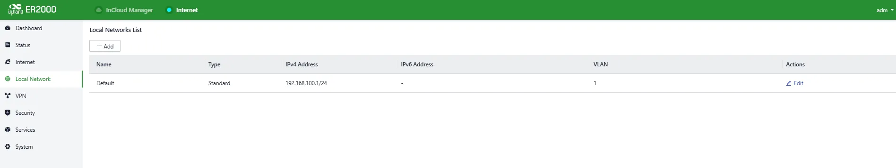

<strong>Figure 4-19 Local Subnet List</strong>

Click "Add/Edit" to add a new local network or edit an existing one.

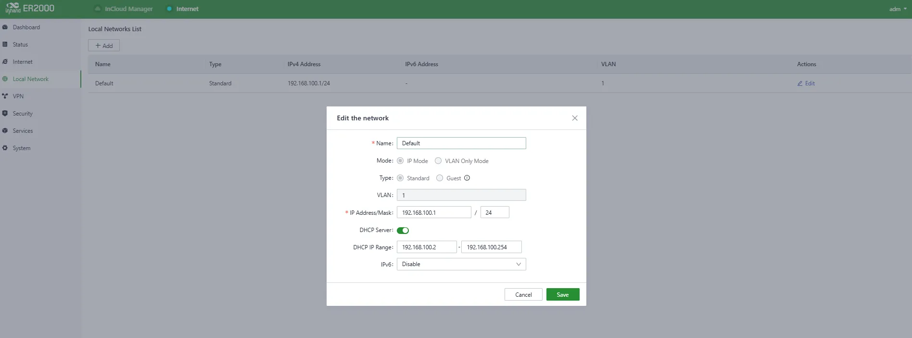

<strong>Figure 4-20 Add Local Network</strong>

| Parameter | Description |
|-----------|-------------|
| Name | Used to identify the network. This name can be selected in "Wi-Fi" and "Interface Management". |
| Mode | Select whether the subnet is Layer-2 transparent mode or Layer-3 IP mode. Default: "IP Mode". |
| VLAN | Split the LAN into different virtual logical networks. By default, all interfaces and Wi-Fi use the default (VLAN1) network. |
| IP Address/Mask | Gateway address for accessing the router via LAN or Wi-Fi. Default: "192.168.100.1". |
| DHCP Server | Clients connected to the router will obtain IP addresses via this feature. Enabled by default; the address pool range is generated automatically based on "IP Address/Mask". |

**Notes:**

- The default local network cannot be deleted and only supports modifying IP Address/Mask and DHCP Server settings.
- The mode of an added local network cannot be changed.
- VLAN Only mode is for Layer-2 passthrough; IP Address/Mask and DHCP Server do not need to be configured.

### 4.4 VPN

A Virtual Private Network (VPN) is an encryption technology used to create secure, private network connections over the public Internet. It allows users to securely access private network resources regardless of location. By encrypting communication data, VPN ensures confidentiality and security and prevents unauthorized access. This technology is useful for connecting to corporate networks, maintaining online privacy, and accessing restricted content. VPN is widely used in enterprise, personal, and mobile device scenarios and is one of the key tools for protecting privacy and data security.

#### 4.4.1 IPsec VPN

IPsec (Internet Protocol Security) VPN is a protocol suite designed to enhance network communication security by protecting data transmission through encryption and authentication. It is widely used for secure remote access, site-to-site connections, and VPNs. In this scenario, ER2000 is typically used as the server side, providing stable and reliable network access for IPsec clients.

Click "Add" under "VPN → IPsec VPN" to add a new IPsec VPN.

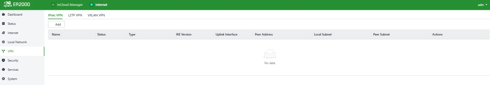

<strong>Figure 4-21 IPSec VPN Edit/Create Entry</strong>

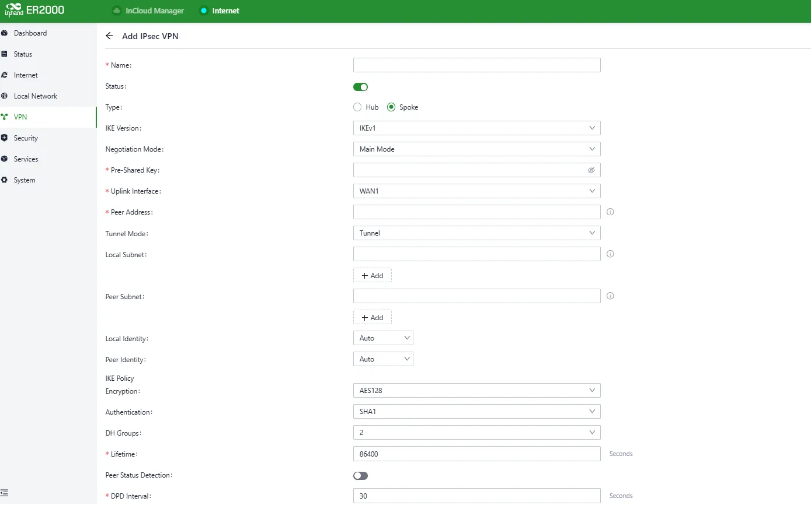

<strong>Figure 4-22 Configure IPSec Server</strong>

After both sides are configured, the tunnel can be established. The tunnel status can be viewed under [Status → VPN]. Only some required fields are explained below:

| Parameter | Description |
|-----------|-------------|
| Name | Identifier for the IPsec VPN created on the router; mainly used for local management. |
| IKE Version | Select IKEv1 or IKEv2. |
| Negotiation Mode | Configure Main Mode / Aggressive Mode for IPsec establishment. |
| Pre-shared Key | Both peers must configure the same authentication key for IKE negotiation. |
| Internet Interface | Uplink interface used locally to establish the IPsec VPN. |
| Tunnel Mode | Encapsulation mode for IP packets; supports Tunnel Mode and Transport Mode. |
| Local Subnet | The subnet that needs to communicate through the IPsec tunnel via ER2000. |
| Remote Subnet | The subnet on the other end that needs to communicate through the IPsec tunnel. |
| Local ID | Field used to identify the local side; supports IP, FQDN, User FQDN. |
| Remote ID | Field used to identify the peer; supports IP, FQDN, User FQDN. |
| IKE Policy | Configure IKE parameters. |
| Encryption | IKE encryption algorithm. Range: DES, 3DES, AES128, AES192, AES256. Default: AES128. |
| Authentication | IKE authentication algorithm. Range: MD5, SHA1, SHA2-256, SHA2-384, SHA2-512. Default: SHA1. |
| DH Group | DH parameters used in IKE phase key negotiation. Range: 1, 2, 5, 14, 15, 16, 19, 20. |
| Lifetime | IKE SA lifetime. Default: 86400 seconds. |
| Peer DPD | Switch for detecting whether the IPsec tunnel is alive. |
| DPD Interval | Heartbeat interval. Default: 30 seconds. |
| DPD Timeout | Timeout. Default: 180 seconds. |
| IPsec Policy | Configure IPsec SA parameters. |
| Security Protocol | Security protocol used by ESP. Range: DES, 3DES, AES128, AES192, AES256. Default: AES128. |
| Encryption/Integrity | ESP algorithm settings. Range: MD5, SHA1, SHA2-256, SHA2-384, SHA2-512. Default: SHA1. |
| Authentication | Used for IPsec protocol authentication. |
| PFS Group | Additional key exchange in Phase 2 to improve security. Range: 1, 2, 5, 14, 15, 16, 19, 20. |
| Lifetime | IPsec SA lifetime. Default: 86400 seconds. |

**Example:**

Branch device ER815 and central device ER2000 in different regions need to access each other via an IPsec tunnel.

- ER2000: WAN IP 10.1.1.1, Local subnet 192.168.100.0/24, Remote subnet 192.168.2.0/24
- ER815: WAN IP 10.1.1.2, Local subnet 192.168.2.0/24, Remote subnet 192.168.100.0/24

At least five parameters must be filled in: Name, Pre-shared Key, Uplink Interface, Local Subnet, Remote Subnet. Other items can keep defaults.

**Notes:**

- The pre-shared key must be identical on server and client.
- Select the interface whose IP/public IP can be reached by the IPsec client. In this example, WAN2 IP is 10.1.1.1.
- Local subnet: the local subnet that communicates with the remote subnet; configure carefully to match.
- Remote subnet: the peer subnet that communicates with the server; configure carefully to match.

#### 4.4.2 L2TP VPN

Layer 2 Tunneling Protocol (L2TP) is a Layer-2 VPN protocol designed to provide secure point-to-point or site-to-site VPN connections. It is commonly used for remote access and branch interconnection, creating simple and flexible VPN tunnels between users or networks.

**L2TP VPN Server**

The L2TP server is typically deployed at the enterprise headquarters to provide remote access services for mobile offices or branches. Click "VPN → L2TP VPN → Server" to enter the L2TP server edit page.

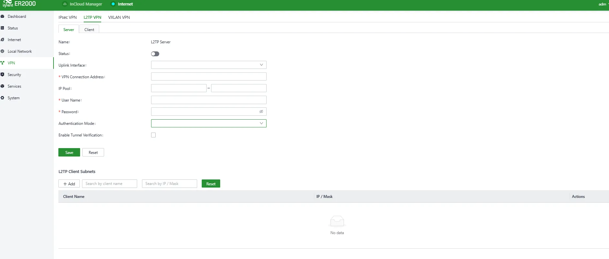

<strong>Figure 4-23 Configure L2TP VPN Server</strong>

| Parameter | Description |
|-----------|-------------|
| Name | L2TP server name; cannot be modified. |
| Status | L2TP server enable switch; disabled by default. |
| Uplink Interface | Uplink interface used when L2TP acts as a server. |
| VPN Communication Address | Gateway address for L2TP clients; clients will be assigned addresses from the pool. The uplink interface IP must not be the same as the VPN communication address. |
| Address Pool | Address pool used for communication when L2TP clients connect. |
| Username/Password | Both peers must configure the same username/password for L2TP negotiation. |
| Authentication Mode | Set L2TP authentication mode. |
| Enable Tunnel Authentication | When enabled, the tunnel authentication username/password must match on both ends. |

**L2TP VPN Client**

ER2000 can act as an L2TP client to establish a tunnel with a remote L2TP server. In typical deployments, the branch side uses ER605 as the client and the server side uses ER2000. Click "Add" under "L2TP VPN → Client" to add an L2TP client. The client address is assigned by the server.

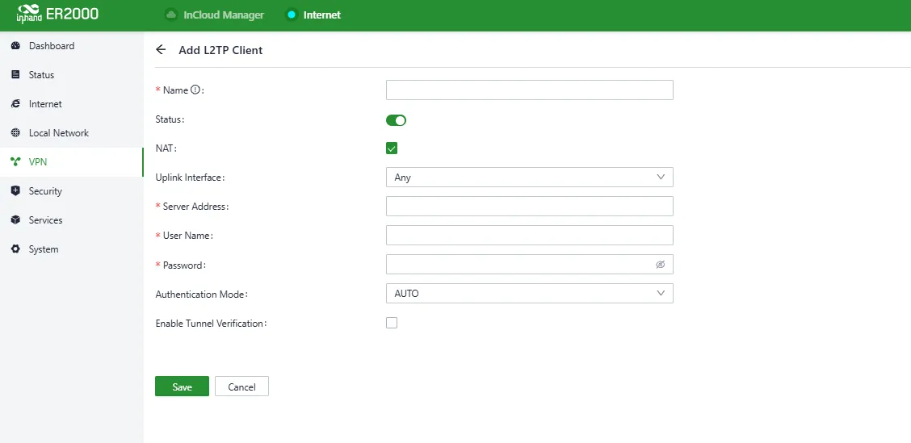

<strong>Figure 4-24 Add L2TP Client</strong>

| Parameter | Description |
|-----------|-------------|
| Name | L2TP client name identifier. |
| Status | Enable/disable switch for the L2TP client tunnel. |
| NAT | NAT switch for client forwarding. |
| Uplink Interface | Uplink interface used for communication with the server. |
| Server Address | Communication address of the remote L2TP server. |
| Username/Password | Must match on both ends. |
| Authentication Mode | Set L2TP authentication mode. |
| Enable Tunnel Authentication | When enabled, tunnel authentication username/password must match on both ends. |

#### 4.4.3 VXLAN VPN

VXLAN (Virtual Extensible LAN) is essentially a tunneling technology. It builds a logical tunnel over an IP network between source and destination devices and encapsulates customer packets for transmission and forwarding.

Click "Add" under "VPN → VXLAN VPN" to add a VXLAN VPN. VXLAN VPN cannot be enabled together with other VPNs or IP Passthrough.

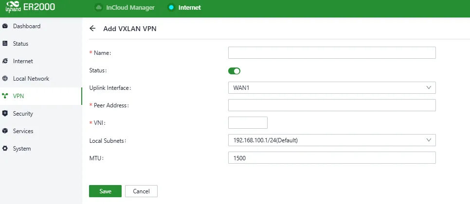

<strong>Figure 4-25 Add VXLAN VPN</strong>

| Parameter | Description |
|-----------|-------------|
| Name | Name of the VXLAN VPN network. |
| Uplink Interface | Egress interface used to establish VXLAN tunnels with other devices. |
| Remote Address | Peer device IP address for building the VXLAN VPN network. |
| VNI | VXLAN Network Identifier; one VNI represents one tenant. |
| Local Subnet | Address range assigned to local client devices. |

### 4.5 Security

Under [Security], advanced features can be configured as needed, including firewall, policy routing, and traffic shaping.

#### 4.5.1 Firewall

The firewall currently includes: Inbound Rules, Outbound Rules, Port Forwarding, MAC Address Filtering, etc. Configure according to business needs.

**Inbound/Outbound Rules**

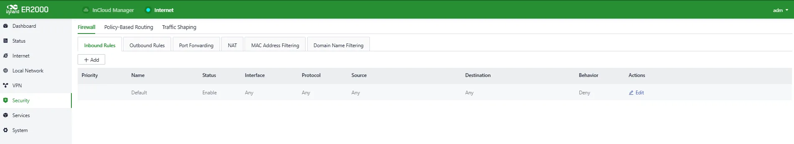

<strong>Figure 4-26 Inbound/Outbound Rules</strong>

In "Security → Firewall → Outbound Rules / Inbound Rules", interface-based traffic control can be implemented. For example, if under heavy attack from a specific source IP, inbound rules can be used to restrict traffic from that IP.

IT can also use outbound rules to restrict certain users' access to external networks. Inbound and outbound rules have the same configurable fields; the only difference is the default rule. Below is an example of adding an inbound rule.

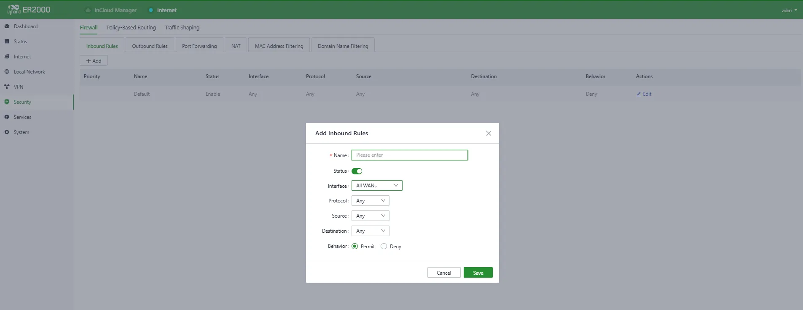

<strong>Figure 4-27 Add Inbound Rule</strong>

| Parameter | Description |
|-----------|-------------|
| Name | Name of the inbound rule for local identification. |
| Status | Rule enable switch. |
| Interface | For outbound rules, the uplink interface where traffic exits the router; for inbound rules, the uplink interface where traffic enters the router. |
| Protocol | Protocol to match. Supports Any, TCP, UDP, ICMP, Custom. |
| Source | Source address to match; customizable. Default Any. |
| Destination | Destination address to match; customizable. Default Any. |
| Action | Allow or Deny for matched traffic. |

- Inbound rules: Management rules for external traffic accessing the router. Default: deny all.
- Outbound rules: Management rules for traffic from the router to the outside. Default: allow all.
- Supports adjusting priority by dragging the icon in the "Priority" column.

**Port Forwarding**

Port forwarding (also called port mapping/port redirection) redirects packets from one network port (or address) to another. Configure port forwarding rules under "Security → Firewall → Port Forwarding". When external traffic accesses a specific port on the router, the device forwards it to the corresponding port on an internal client, enabling access to internal services from outside.

Example: To access port 1024 of internal client 192.168.2.10 from outside, map that client port to port 1024 on WAN1. External users can access it by entering `https://<WAN1 address>:1024` in a browser, where `<WAN1 address>` is the WAN1 interface IP.

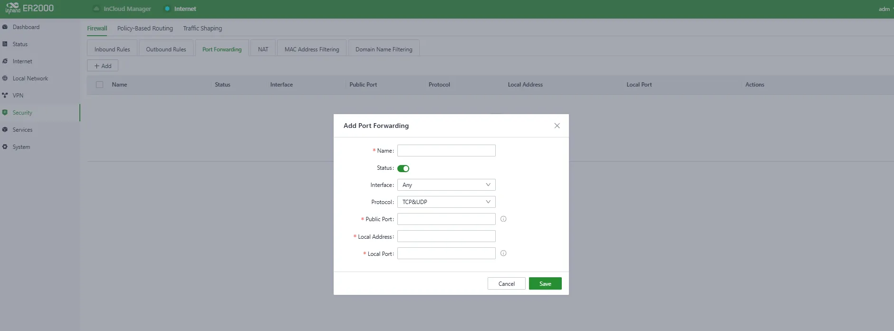

<strong>Figure 4-28 Add Port Forwarding Rule</strong>

| Parameter | Description |
|-----------|-------------|
| Name | Port forwarding rule name for local identification. |
| Status | Enable switch. |
| Interface | Uplink interface providing mapping; the uplink must have public IP support. |
| Protocol | TCP, UDP, or TCP&UDP. |
| Public Port | Port number on the uplink interface; must match the local port input range. |
| Local Address | Target device address behind the router. |
| Local Port | Target service port; must match the public port input range. |

**Network Address Translation**

Network Address Translation (NAT) rewrites the source or destination IP address in packets as they pass through the router, converting private addresses to routable addresses. Configure source/destination address translation under "Security → Firewall → NAT".

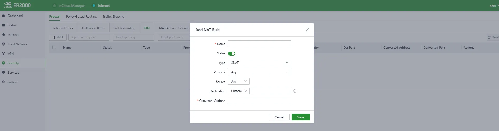

<strong>Figure 4-29 Add NAT Rule</strong>

| Parameter | Description |
|-----------|-------------|
| Name | Identifier for the rule. |
| Status | Enable/disable the rule. |
| Type | Select translation type. a) SNAT: Source address translation; rewrites the source IP field. b) DNAT: Destination address translation; rewrites the destination IP field. |
| Protocol | Select packet type. a) TCP b) UDP c) TCP&UDP |
| Source | Source IP address. |
| Destination | Destination IP address. |
| Translated Address | Value to translate to based on the selected type. |

**MAC Address Filtering**

MAC address filtering blocks (or allows) devices in the MAC list from accessing the Internet by controlling LAN device access requests. Configure rules under "Security → Firewall → MAC Address Filtering".

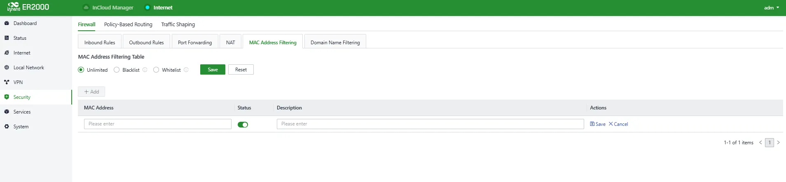

<strong>Figure 4-30 Add MAC Filtering Rule</strong>

Multiple MAC entries with descriptions can be created, and the list can be set to allow only listed MAC addresses (whitelist) or block listed MAC addresses (blacklist).

**Domain Name Filtering**

Domain name filtering blocks (or allows) clients from accessing domain names configured in the list. Configure rules under "Security → Firewall → Domain Name Filtering". Multiple rules can be added and allow access to listed domains (whitelist) or block access (blacklist).

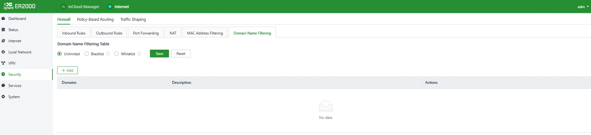

<strong>Figure 4-31 Add Domain Filtering Rule</strong>

#### 4.5.2 Policy Routing

Policy routing allows defining forwarding policies based on actual needs, forwarding different traffic flows via different links. This improves routing flexibility and controllability, increases link utilization efficiency, and reduces enterprise cost. Click "Add" under "Security → Policy Routing" to add a rule. Both source and destination cannot be set to "Any" at the same time.

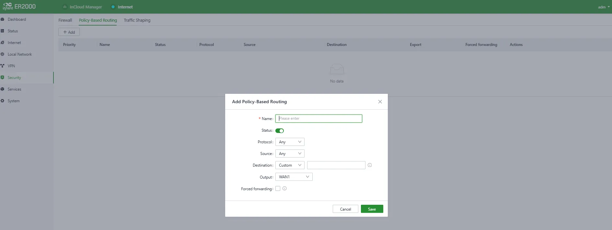

<strong>Figure 4-32 Configure Policy Routing</strong>

#### 4.5.3 Traffic Shaping

Create shaping policies to control bandwidth per protocol to optimize network performance. This function can reduce bandwidth for entertainment traffic and prioritize bandwidth for critical business traffic. Configure traffic shaping rules under "Security → Traffic Shaping → Add/Edit".

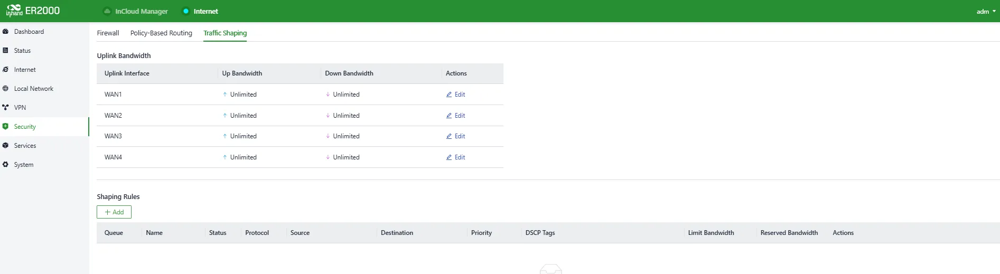

<strong>Figure 4-33 Traffic Shaping Entry</strong>

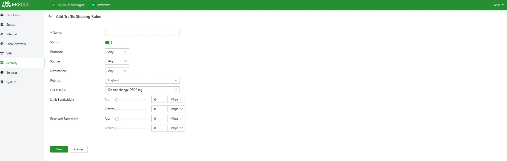

<strong>Figure 4-34 Configure Traffic Shaping Rules</strong>

Traffic shaping policies consist of a series of rules executed in order, similar to custom firewall rules. Each rule has two main parts: the traffic type to limit/shape and how it should be limited/shaped.

**Notes:**

- Traffic that does not match any rule is forwarded with Medium priority.
- When "Limit Bandwidth" is set to 0, the system does not limit bandwidth.
- Reserved bandwidth must not be greater than limited bandwidth.

### 4.6 Services

#### 4.6.1 Interface Management

In "Services → Interface Management", which local network is allowed on a specific interface can be set, and the interface rate can be configured.

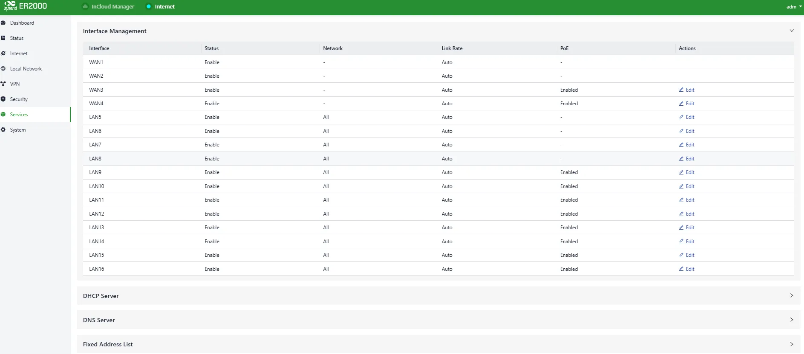

<strong>Figure 4-35 Interface Management Page</strong>

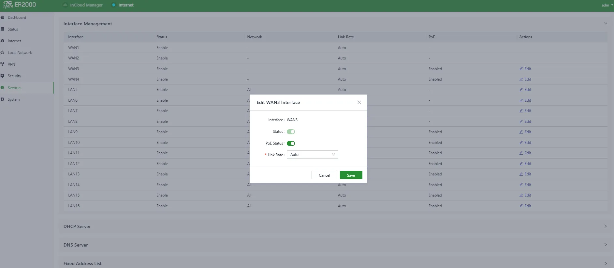

<strong>Figure 4-36 Modify Interface Configuration</strong>

**Note:** Only interfaces in LAN mode can apply local subnets.

#### 4.6.2 DHCP Server

DHCP uses a client/server model: the client requests an address and the server assigns an IP address for dynamic IP allocation. Configure DHCP address pools under "Services → DHCP Server".

Default local subnet on ER2000: 192.168.100.1/24

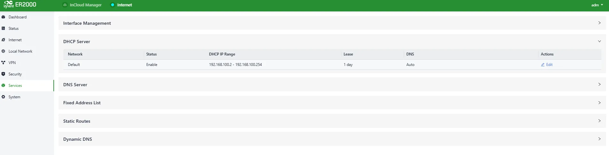

<strong>Figure 4-37 Configure DHCP Address Pool</strong>

**Notes:**

- DHCP services are generated based on local network information. After deleting a local subnet in the "Local Network List", its DHCP Server will also be deleted.
- DHCP Server takes effect only when the local network entry is in IP Mode. Networks in VLAN Only mode are not selectable.

#### 4.6.3 DNS Server

DNS (Domain Name System) servers translate human-readable domain names (e.g., www.example.com) into IP addresses (e.g., 192.168.1.1). DNS servers act as the Internet's address book, helping devices locate each other and ensuring information is delivered correctly.

If DNS server addresses are not configured under "Services → DNS Server", the device uses the DNS addresses obtained by the uplink interface for resolution. After DNS server addresses are configured, the configured DNS addresses will be used for domain name resolution.

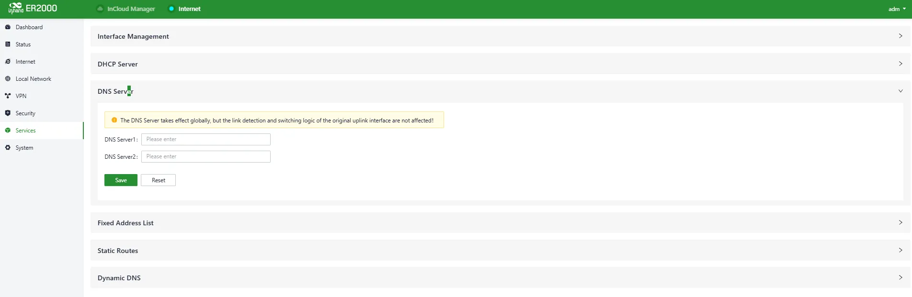

<strong>Figure 4-38 Configure DNS Server</strong>

#### 4.6.4 Fixed Address List

In "Services → Fixed Address List", a fixed IP address can be assigned to a device based on its MAC address. Each time the device connects to ER2000, it will obtain the same IP address.

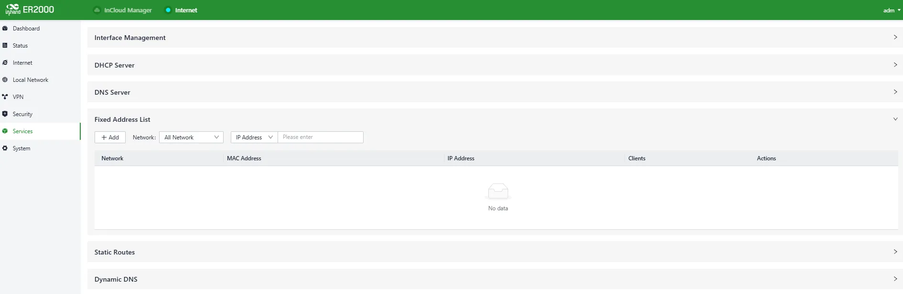

<strong>Figure 4-39 Assign a Fixed IP Address to a Specific MAC Address</strong>

**Notes:**

- The assignable address must be within the address range of a local network in IP Mode; otherwise the configuration will not take effect.
- When a local network is deleted, all fixed address assignment rules within that address range will be deleted.

#### 4.6.5 Static Routing

In "Services → Static Routing", static routing entries can be manually configured to forward data via specified paths and interfaces. All items in the static routing table are created manually. Routes automatically generated by other services (e.g., VPN) are not displayed here.

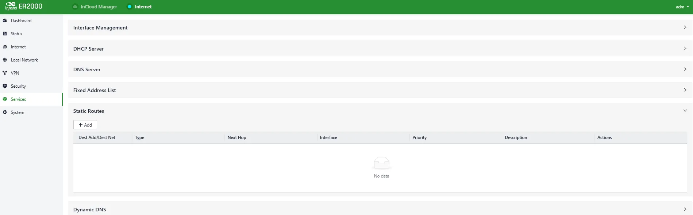

<strong>Figure 4-40 Configure Static Routing Entry</strong>

**Notes:**

- For static routes with the same destination address/network, the next-hop address, interface, or priority cannot be the same; otherwise the route will be invalid.
- After WAN2, Wi-Fi (STA), or L2TP Client VPN is deleted, static routes using the corresponding interface will also be deleted.

#### 4.6.6 Dynamic DNS

Dynamic DNS (DDNS) automatically updates name server records in DNS. Domain names usually need to be associated with a fixed IP address. DDNS provides a fixed hostname for users with dynamic IP addresses so that external users can connect by periodically updated records.

Configure DDNS under "Services → Dynamic DNS".

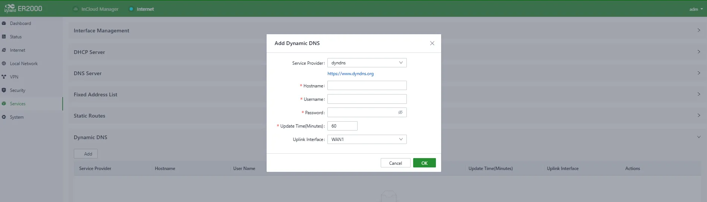

<strong>Figure 4-41 Configure Dynamic DNS Service</strong>

| Parameter | Description |
|-----------|-------------|
| Service Provider | Provided by the DDNS provider. Choices: dyndns, 3322, oray, no-ip, or Custom (URL required). |
| Hostname | Register via the URL under the service provider to obtain a hostname. |
| Username | Register via the URL under the service provider to obtain a username. |
| Password | Password set during registration. |

### 4.7 System

Under [System], cloud management, remote access control, clock, device options, configuration management, device alerts, tools, log server, and more can be configured.

#### 4.7.1 Cloud Management

InCloud Manager (star.inhandcloud.cn) is a cloud platform built by InHand Networks to address slow deployment, complex O&M, and poor business experience in enterprise networks. Centered on user needs, it integrates zero-touch deployment, intelligent O&M, security protection, and excellent business experience. Once the device connects to the cloud platform, users can perform remote management, batch configuration, traffic monitoring, etc., enabling more convenient and efficient network device management.

In "System → Cloud Management", the cloud platform address can be selected. ER2000 connects to InCloud Manager automatically after it is online by default. If cloud management is not desired, it can be disabled manually.

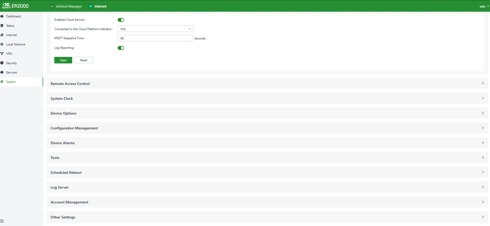

<strong>Figure 4-42 Enable InCloud Manager Service</strong>

#### 4.7.2 Remote Access Control

In "System → Remote Access Control", access to the router's Web UI from the Internet can be enabled/disabled and service ports can be set.

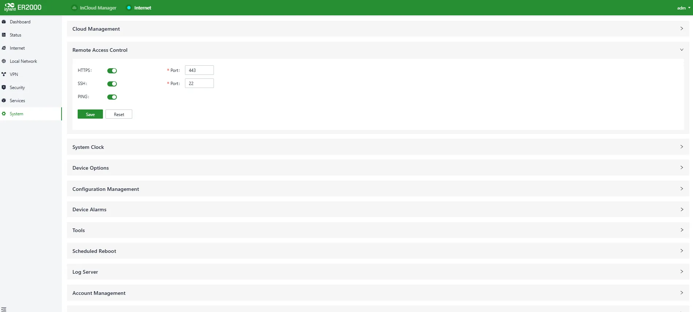

<strong>Figure 4-43 Configure Remote Access Protocols</strong>

| Parameter | Description |
|-----------|-------------|
| HTTPS | When enabled, enter the uplink public address & port in a browser to remotely access the router Web UI. |
| SSH | When enabled, use a remote tool (e.g., CRT) and enter the uplink public address & port, username, and password to remotely log in to the router backend. |
| Ping | When enabled, the uplink interface address allows external networks to initiate Ping requests. |

**Notes:**

- LAN interfaces are not affected by this configuration.
- Firewall rules do not restrict remote access.

#### 4.7.3 System Clock

In networking, the clock function coordinates and synchronizes time between network devices. It is important for data transmission, logging, security, coordination, and troubleshooting. In "System → Clock", select the local time zone and configure the NTP server address to synchronize the device system time.

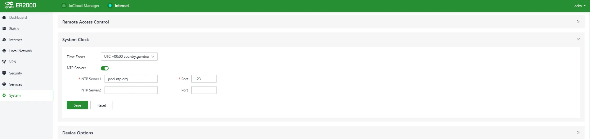

<strong>Figure 4-44 Select Time Zone and Configure NTP Server Address</strong>

#### 4.7.4 Device Options

In "System → Device Options", the device can be rebooted, firmware can be upgraded, and factory settings can be restored.

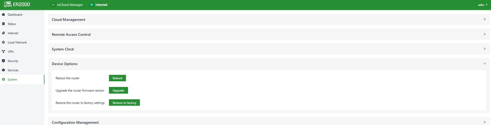

<strong>Figure 4-45 Reboot/Upgrade/Restore Factory Settings</strong>

**Notes:**

- For local firmware upgrades, ensure the firmware is obtained from official channels to avoid device unavailability caused by incorrect firmware.
- After the device connects to the cloud platform, due to the cloud configuration synchronization mechanism, the platform may push the pre-reset configuration back to the device; the device only clears historical data.

#### 4.7.5 Configuration Management

Configuration backup and restore are key network management tasks. In "System → Configuration Management", device configuration can be exported locally. When configuration is lost or needs to be overwritten, import the backup configuration to restore it.

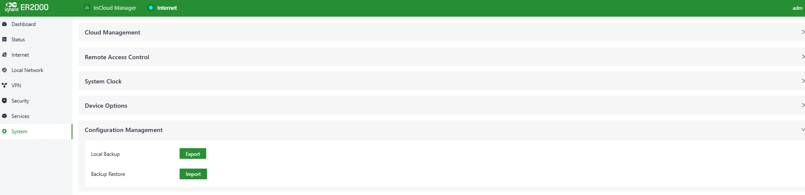

<strong>Figure 4-46 Manage Device Configuration Files</strong>

#### 4.7.6 Device Alerts

If special attention to certain events is desired, select the corresponding alert events and set the email address to receive alerts. When an alert event occurs, the device automatically sends an email notification. Events not selected will still be recorded in local logs. Configure alert event types and alert email address in "System → Device Alerts".

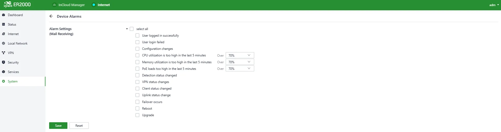

<strong>Figure 4-47 Select Alert Events</strong>

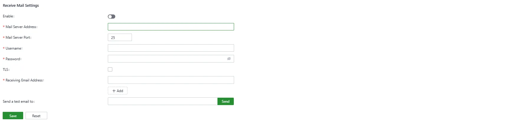

<strong>Figure 4-48 Configure Alert Email Recipient</strong>

#### 4.7.7 Tools

**Ping**

Uses ICMP to test network connectivity. Enter any domain name or IP address in "Target" and click Start to test connectivity.

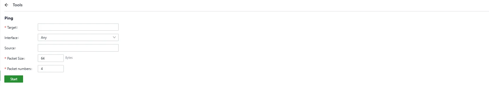

<strong>Figure 4-49 Ping Test Tool</strong>

**Traceroute**

Traceroute is a network diagnostic tool used to determine the path packets take from source to destination and each intermediate hop/router. In "System → Tools → Traceroute", enter the target host IP address, select the egress interface, and click Start to test routing connectivity.

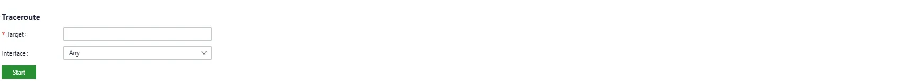

<strong>Figure 4-50 Traceroute Tool</strong>

**Capture**

Packet capture is a network monitoring and analysis technique that captures and records packets transmitted over a network. It is commonly used for troubleshooting, performance analysis, security audits, and protocol analysis. In "System → Tools → Capture", packets can be captured on a specific interface. Under "Output", captured data can be displayed in the UI or exported locally.

<strong>Figure 4-51 Packet Capture Tool</strong>

**Iperf**

Iperf is a TCP/UDP network performance testing tool that measures bandwidth and network quality and provides statistics such as latency jitter, packet loss rate, and MTU. Administrators can use these statistics to locate bottlenecks and troubleshoot network issues.

In "System → Tools → Iperf", traffic generation can be configured as server or client to test network performance.

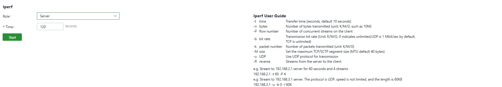

<strong>Figure 4-52 Traffic Test Tool (Iperf)</strong>

#### 4.7.8 Scheduled Reboot

Scheduled reboot is a device management strategy that automatically reboots the device at specific times or conditions to ensure stable operation and performance. In "System → Scheduled Reboot", the reboot time can be set. The device supports rebooting at fixed times daily, weekly, or monthly.

For monthly schedules, if the selected reboot day is greater than the actual days of that month, the device reboots on the last day of the month. For example, if rebooting on the 31st is selected, in a 30-day month the device will reboot on the 30th.

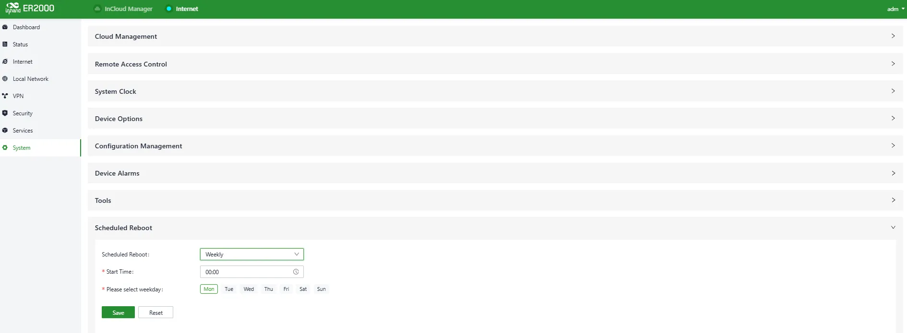

<strong>Figure 4-53 Set Reboot Time</strong>

#### 4.7.9 Log Server

A log server is a dedicated server or software application used to collect, store, and manage logs generated by network devices, applications, and operating systems. Logs include events, warnings, errors, activities, and other information important for monitoring, troubleshooting, and performance optimization.

After enabling the log server function in "System → Log Server", the device periodically uploads log files to the specified log server.

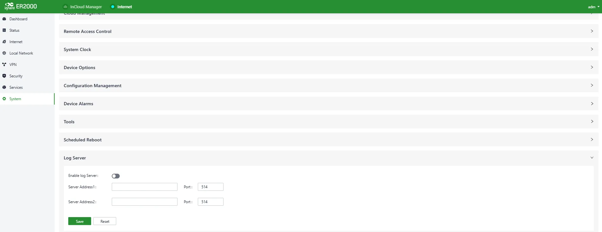

<strong>Figure 4-54 Specify Log Server Address</strong>

#### 4.7.10 Account Management

In "Services → Account Management", the username and password for logging in to the device Web page can be set. Keep the password secure to avoid leakage.

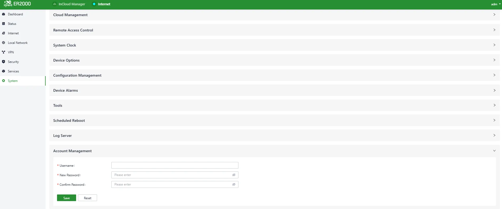

<strong>Figure 4-55 Modify Web Login Account/Password</strong>

#### 4.7.11 Other Settings

**Web Login Management**

If the Web session remains online for a certain period, the system will automatically log out or disconnect to protect privacy and security. Set the logout time under "System → Other Settings → Web Login Management". Once a single session exceeds the configured time, the system logs out and login is required again.

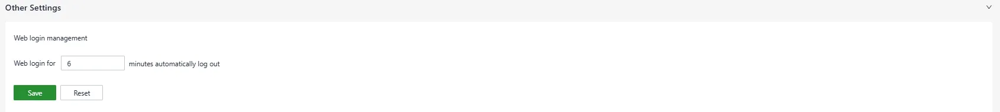

<strong>Figure 4-56 Set Web Login Timeout</strong>

**SIP ALG**

SIP ALG combines Session Initiation Protocol (SIP) and Application Layer Gateway (ALG). It is used to help manage and process SIP communications (used to establish and manage real-time sessions such as voice/video calls). Enable this feature under "System → Other Settings → SIP ALG". If there are VoIP devices on the network, disable this feature.

<strong>Figure 4-57 Enable SIP ALG</strong>

---

## Chapter 5 Typical Applications

### Case 1: IPsec VPN Networking

**Scenario Description**: A branch office (ER815) and a central site (ER2000) in different regions need to securely access each other over the Internet.

**Network Topology**:

(Details not provided in original draft; to be supplemented)

**Device Role**: ER2000 acts as the IPsec VPN server, providing stable and reliable network access for the branch IPsec client.

**Configuration Steps**:
1. On ER2000, go to "VPN → IPsec VPN", click "Add" to create a new IPsec VPN entry.
2. Fill in Name, Pre-shared Key, Internet Interface (WAN2, IP 10.1.1.1), Local Subnet (192.168.100.0/24), and Remote Subnet (192.168.2.0/24).
3. On ER815 (client side), go to "VPN → IPsec VPN", click "Add" to create the client entry. Fill in the same Pre-shared Key, select the uplink interface (WAN1, IP 10.1.1.2), set Local Subnet (192.168.2.0/24), Remote Subnet (192.168.100.0/24), and Remote Address (10.1.1.1).
4. Save the configurations on both devices and check the tunnel status under [Status → VPN].

**Reference Chapters**:
- [IPsec VPN](#441-ipsec-vpn)
- [VPN Status](#4242-vpn)

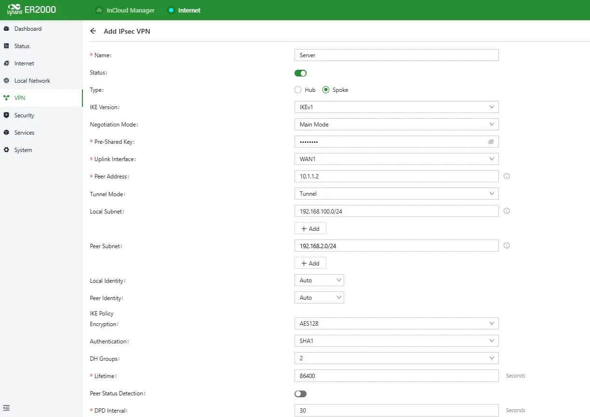

<strong>Figure 5-1 IPsec Server-side Configuration</strong>

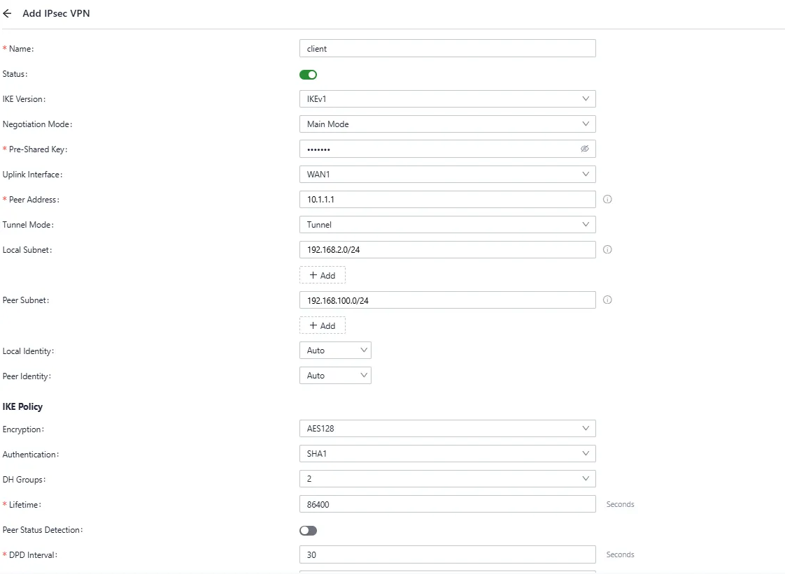

<strong>Figure 5-2 IPsec Client-side Configuration</strong>

### Case 2: L2TP VPN Networking

**Scenario Description**: A branch office (ER815) and a central site (ER2000) need to access each other via an L2TP VPN tunnel.

**Network Topology**:

(Details not provided in original draft; to be supplemented)

**Device Role**: ER2000 acts as the L2TP VPN server, providing remote access services for the branch L2TP client.

**Configuration Steps**:
1. On ER2000, go to "VPN → L2TP VPN → Server". Enable the server, select WAN1 (10.5.3.1) as the uplink interface, and set the VPN communication address to 10.11.12.11. The address pool will auto-fill to 10.11.12.1–10.11.12.254. Set the Username and Password.
2. On ER815 (client side), go to "VPN → L2TP VPN → Client", click "Add". Enter the server address, and set the same Username and Password as the server.
3. Save the configurations on both devices and check the tunnel status under [Status → VPN].

**Reference Chapters**:
- [L2TP VPN](#442-l2tp-vpn)
- [VPN Status](#4242-vpn)

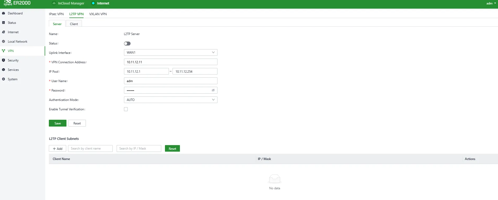

<strong>Figure 5-3 L2TP Server-side Configuration</strong>

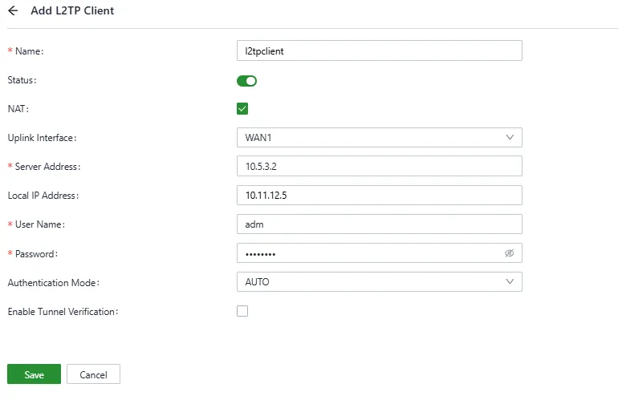

<strong>Figure 5-4 L2TP Client-side Configuration</strong>

### Case 3: SD-WAN Deployment

**Scenario Description**: Enterprise branches need to communicate for business data transfer and video conferencing. Traditional VPN configuration is complex and troubleshooting can be challenging. SD-WAN is used to quickly create connections between branches through a user-friendly interface.

**Network Topology**:

<strong>Figure 5-5 SD-WAN Application Scenario</strong>

**Device Role**: ER2000 can act as the Hub (central) device in an SD-WAN network, managing tunnels to all Spoke (branch) devices.

**Prerequisites**:

- All devices used for SD-WAN networking must have the Branch Professional Edition license.
- All devices can access the Internet, and the subnets that need to communicate within the SD-WAN network have been planned and configured.

**Configuration Steps**:
1. In InCloud Manager under "Network", select "SD-WAN" and click "Add". The SD-WAN network creation page will open.
2. The SD-WAN network currently supports a hub-and-spoke topology. Select ER2000 as the Hub device and add branch devices as Spokes.
3. When adding the Hub device, the public address must be set to the actual mapped public IP. If the Hub has no public IP address, the upstream router can map via NAT to ER2000.
4. After adding, click "Edit" to customize subnets and static routes in the SD-WAN network.
5. Save the network. All devices and selected subnets will interconnect. Within a single network, the local networks of the Hub and Spokes must not be the same, otherwise communication may be affected.

**Verification Method**:
1. After adding the network, the system automatically directs to the topology page. Alternatively, go to the "SD-WAN Networks" list and click the network name to open the topology details page.
2. In the network, all branch devices create connections to the Hub device. Verify that all tunnel statuses are normal.

**Reference Chapters**:
- [Cloud Management](#471-cloud-management)
- [Uplink Settings](#425-uplink-settings)

<strong>Figure 5-6 SD-WAN Network Entry</strong>

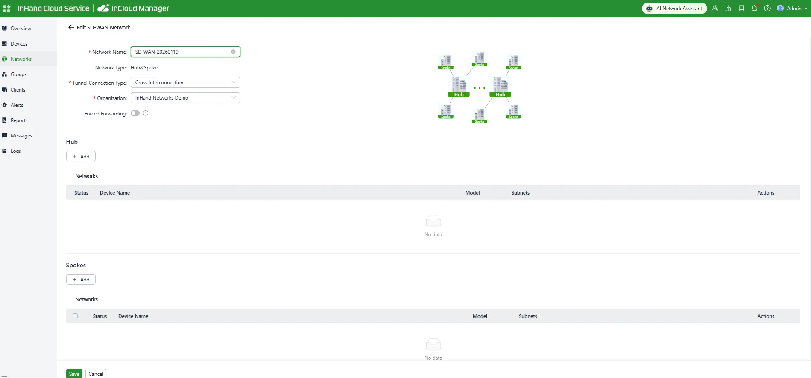

<strong>Figure 5-7 Edit SD-WAN Network</strong>

<strong>Figure 5-8 Add Hub Device</strong>

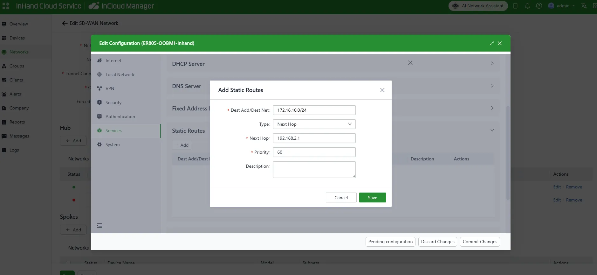

<strong>Figure 5-9 Add Static Routes</strong>

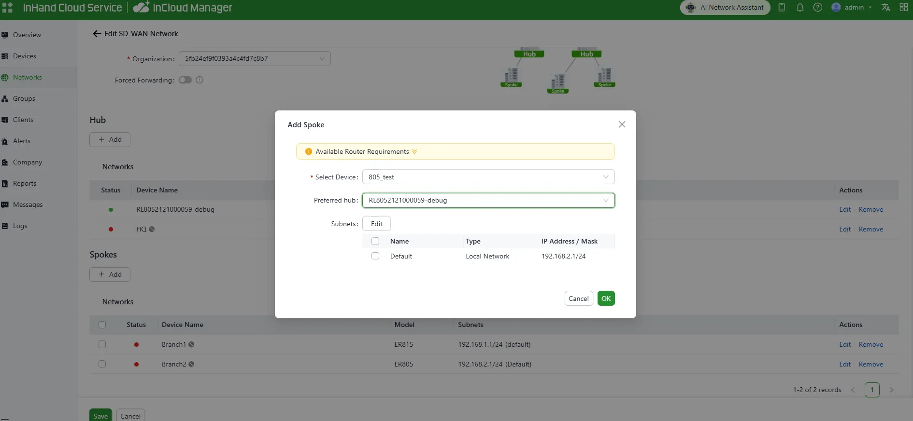

<strong>Figure 5-10 Add Branch Site Device</strong>

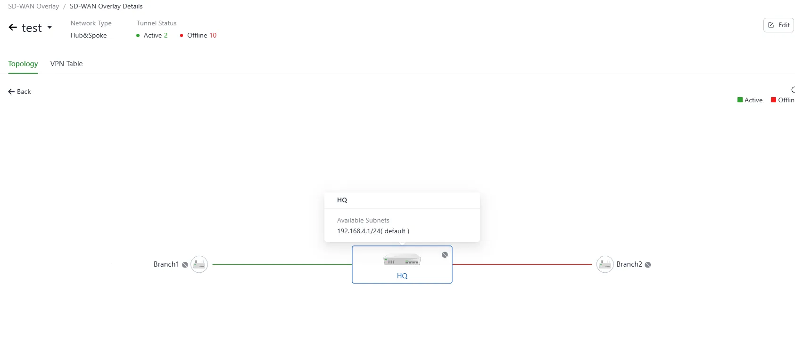

<strong>Figure 5-11 View SD-WAN Network Topology</strong>

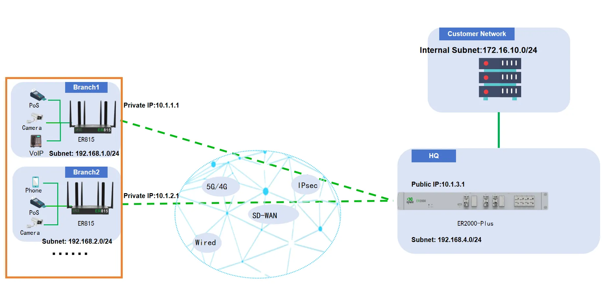

<strong>Figure 5-12 Branch SD-WAN Scenario</strong>

---

## Appendix: Troubleshooting

### A.1 Network Connection Issues

| Symptom | Possible Cause | Troubleshooting Steps | Related Chapter |
|-----------|----------------|----------------------|-----------------|
| No Internet access | WAN cable not connected or upstream fault | 1. Check the WAN cable connection. 2. Verify the upstream network is functional. | [Wired Connection (DHCP)](#421-wired-connection-dhcp) |
| No Internet access | Incorrect connection method (PPPoE/Static IP required) | 1. Confirm with the ISP whether PPPoE credentials or a static IP are required. 2. Reconfigure the WAN interface accordingly. | [Wired Connection (Static IP)](#422-wired-connection-static-ip) |
| Cannot obtain an IP address on LAN | PC not in the same subnet | 1. Verify the PC is set to obtain an IP automatically. 2. Check the LAN subnet configuration. | [Local Network](#43-local-network) |
| Device remains offline on cloud platform | Incorrect serial number or MAC address | 1. Re-check the serial number and MAC address on the device label. 2. Verify the device has Internet access. | [Connect to InCloud Manager Platform](#scenario-2-connect-to-incloud-manager-platform) |
| VPN tunnel not established | Pre-shared key mismatch | 1. Verify the pre-shared key is identical on both ends. 2. Check the local and remote subnet configuration. | [IPsec VPN](#441-ipsec-vpn) |
| VPN tunnel not established | Incorrect server address or unreachable | 1. Confirm the server IP address is correct. 2. Verify that the server-side uplink interface is reachable. | [L2TP VPN](#442-l2tp-vpn) |

### A.2 Web Access Issues

| Symptom | Possible Cause | Troubleshooting Steps | Related Chapter |
|-----------|----------------|----------------------|-----------------|
| Cannot open Web interface | PC IP address not in the same subnet | 1. Confirm the PC is in the 192.168.100.0/24 subnet. 2. Check the default gateway is set to 192.168.100.1. | [Installation Guide](#22-installation-guide) |
| Cannot open Web interface | Browser compatibility issue | 1. Use Google Chrome. 2. Clear the browser cache and retry. | [Installation Guide](#22-installation-guide) |

### A.3 Device Hardware Issues

| Symptom | Possible Cause | Troubleshooting Steps | Related Chapter |
|-----------|----------------|----------------------|-----------------|
| SYS LED is off | Power adapter not connected or faulty | 1. Check the power adapter connection. 2. Replace the power adapter if necessary. | [Installation Guide](#22-installation-guide) |
| SYS LED blinking red | System fault | 1. Wait for the system to recover. 2. If the issue persists, restore factory settings. | [Restore to Factory Defaults](#15-restore-to-factory-defaults) |

---

## Appendix: Safety Precautions

1. Use the original power adapter to avoid device damage caused by mismatch.
2. Do not install the device in environments with strong electromagnetic interference or too close to high-power equipment. After installation, ensure the device is stable to avoid damage from falling.
3. Ensure the operating environment meets the temperature and humidity requirements in the specification sheet.
4. Regularly check cables, including Ethernet cables and power adapter cables. Keep them clean and replace promptly if damaged.
5. When cleaning, avoid spraying chemical agents directly on the device surface to prevent damage to the enclosure or internal components. Use a soft cloth.
6. Do not disassemble, repair, or modify the device without authorization. This may cause safety issues and void the warranty.

---

## FAQ

### Q1: Is the cloud platform free?

InHand Networks is committed to providing high-quality network services for SMB chain organizations. To use cloud platform services, licenses must be purchased per device to access rich cloud features.

### Q2: How do I add the device to the cloud platform?

Register an InCloud Manager login account at [https://star.inhandcloud.com/](https://star.inhandcloud.com/).

Log in with the registered account, go to the Devices menu, click "Add", and follow the prompts to enter the device serial number and MAC address. After the device is added for the first time, a one-year free Basic license is granted by default. Users can renew as needed.

### Q3: Can the device be used without the cloud platform?

Yes. Most configuration functions can be completed locally. However, batch configuration delivery, upgrades, SD-WAN, Connector, and other functions must be used together with the cloud platform.

If the problem cannot be solved using the answers above or other issues are encountered, please contact Beijing InHand Networks Technology Co., Ltd. for technical support.
