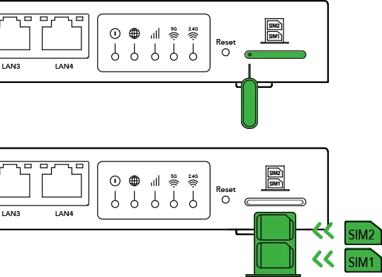
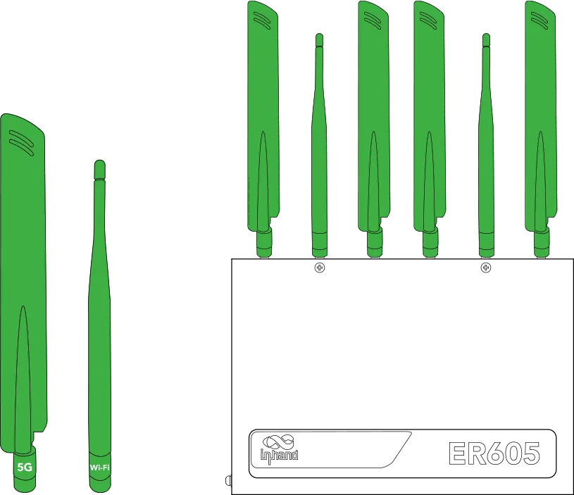
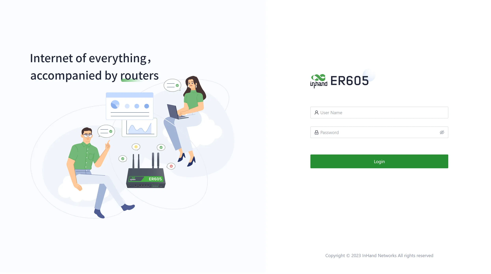
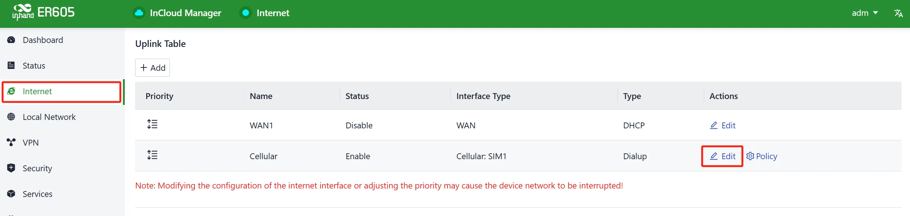
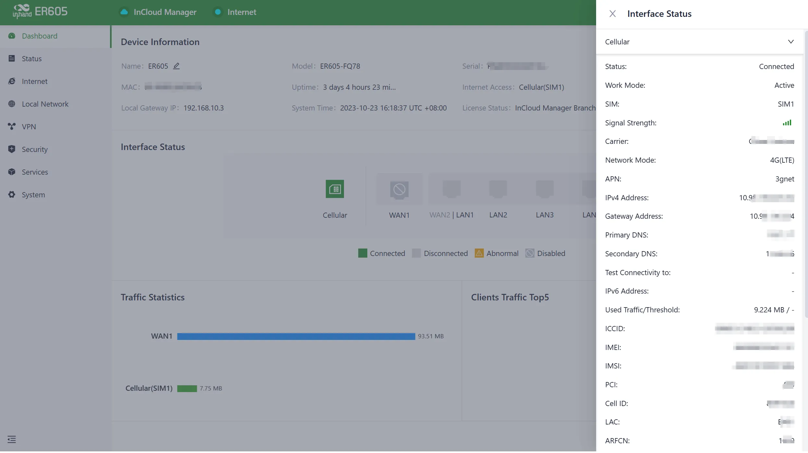
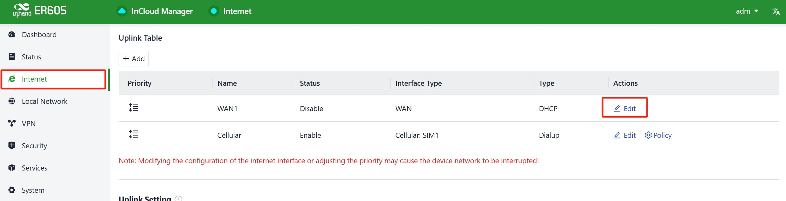
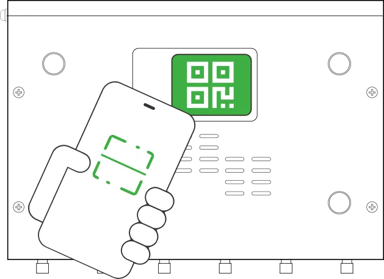
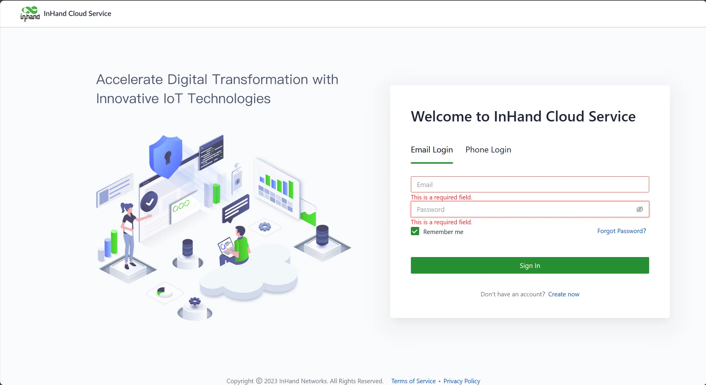
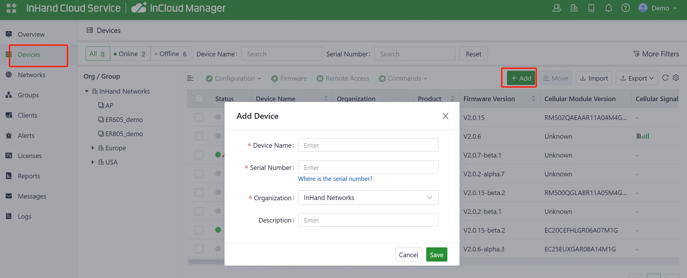
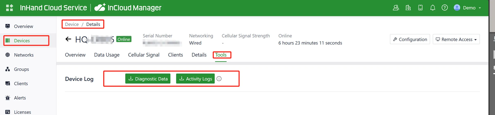

# Edge Router 605 Product Quick Guide

> **What you need to do first:** Unpack → Mount the device → Connect power and Ethernet → (If using cellular) **Power off**, insert SIM card, attach antennas → Power on → Set PC to same subnet → Open Web in browser.  
> **Then:** Scroll down to **Part 2** to look up packing list, LED meanings, mounting, antenna labels, etc.

## Must-Read Summary

| Item | Requirement |
|------|-------------|
| Power Supply | **12 V DC**, Power IN port; **System LED steady red** indicates booting in progress. |
| SIM Card | **Power off** before inserting or removing; **do not hot-swap**. |
| Cellular / Wi-Fi Antennas | Screw onto matching SMA connectors by logo; quantity varies by model (see datasheet ordering info). |

## Step 1: Check the Front Panel and Interface Areas

Take out the ER605 and compare it with the interface diagram below. Locate the **Power IN**, **WAN1**, **WAN2/LAN1**, **LAN2~LAN4**, **Reset** pinhole, **LED indicators**, and **SIM card slot**.

<strong>Figure 1-1 Interface Diagram</strong>

For port roles and LED locations, see §2.2.

## Step 2: Mount the Device

Choose a stable surface or wall-mount location.

**Desktop:** Attach the foot pads to the bottom of the housing, then place the device on the tabletop.

<strong>Figure 1-2 Attach the foot pad</strong>

<strong>Figure 1-3 Place on tabletop</strong>

**Wall-mounted:** Install the hanging ears on both sides of the device, fix two screws to the wall at the correct spacing, then hang the device and push down to confirm it is secure.

<strong>Figure 1-4 Wall mounting</strong>

For detailed mounting steps, see §2.4.

## Step 3: Connect Power and Ethernet

Connect one end of the power adapter to the power outlet and the other end to the device's **Power IN** port.

<strong>Figure 1-5 Connect the Power adapter</strong>

Connect your PC to a LAN port (WAN2/LAN1, LAN2, LAN3, or LAN4) with the included Ethernet cable. WAN1 can be used for wired uplink.

> **Note:** WAN2/LAN1 supports WAN/LAN switch. For port details, see §2.5.1.

## Step 4: (If Using Cellular) Power Off, Insert SIM, and Attach Antennas

**Power off the device first.** The ER605 supports dual nano SIM cards. Use the SIM card ejector tool to release the tray, install the SIM card(s), then reinsert the tray.

<strong>Figure 1-6 Insert SIM cards</strong>

Attach the antennas to the corresponding SMA connectors. Match the logo on the glue stick antenna to the logo near the SMA interface.

<strong>Figure 1-7 Install the antennas</strong>

> **Do not hot-swap SIM cards while powered on.**

For antenna model and quantity by variant, see §2.1 and §2.5.6.

## Step 5: Power On and Confirm the Device Is Ready

Plug in the power adapter. The **System LED** will turn **steady red** during boot. Wait until it changes to **blinking green**, indicating the system is running smoothly.

For all LED states, see §2.3.

## Step 6: Log In via PC and Browser

1. Ensure your PC has obtained an IP address in the **192.168.2.x** range (the LAN port has DHCP enabled by default). If not, set a static IP manually:
   - IP Address: 192.168.2.x (2–254)
   - Subnet Mask: 255.255.255.0
   - Default Gateway: 192.168.2.1
   - DNS Servers: 8.8.8.8 (or your ISP's DNS)

2. Open a web browser and enter **`192.168.2.1`** in the address bar.

3. Enter the username and password from the device's nameplate. If a security warning appears, click **Advanced** and select **Proceed**.

<strong>Figure 1-8 Web Login</strong>

> **Default IP quick reference:**
> | Port Role | Default IP |
> | :---: | :---: |
> | LAN / Management | 192.168.2.1 |

For certificate warning handling and detailed login steps, see §2.7.

## Installation Self-Check

- ☐ The device is securely mounted (desktop or wall).  
- ☐ Power and Ethernet cables are connected; if using cellular, SIM card(s) and antennas are in place.  
- ☐ **System LED is blinking green**.  
- ☐ Browser opens the Web login page and login succeeds.

If the device cannot access the Internet, check **Dashboard > Interface Status** to verify the Cellular or WAN icon is green. For troubleshooting, see §2.7. To restore factory settings, see §2.7.

---

# Part 2: Detailed Information

## 2.1 Packing List

### Standard Accessories

| No. | Part Name | Qty | Unit | Remarks |
|-----|-----------|-----|------|---------|
| 1 | ER605 | 1 | pc | Edge Router 605 |
| 2 | Ethernet Cable | 1 | pc | 1 m |
| 3 | LTE Antenna | 2 | pc | ER605 4G model only |
| 4 | 5G Antenna | 4 | pc | ER605 5G model only |
| 5 | Wi-Fi Antenna | 2 | pc | Magnetic antenna; stick antenna optional |
| 6 | Power Adaptor | 1 | pc | 12 V DC with power cable |
| 7 | Panel Mounting Lug | 4 | pc | 2 hangers and 2 wall mounting lugs |
| 8 | SIM Card Ejector | 1 | pc | Used to remove the SIM tray |

> For ordering information and antenna models by variant, refer to the *ER605 Product Datasheet*.

## 2.2 Product Structure and Identification

### Front Panel

<strong>Figure 2-1 Interface Diagram</strong>

| No. | Interface | Description |
|-----|-----------|-------------|
| 1 | Power IN | 12 V DC power input |
| 2 | WAN1 | Ethernet port |
| 3 | WAN2/LAN1 | Ethernet port, supports WAN/LAN switch |
| 4 | LAN2 | Ethernet port |
| 5 | LAN3 | Ethernet port |
| 6 | LAN4 | Ethernet port |
| 7 | Reset | Pinhole reset button |
| 8 | LED Indicators | System, Network, Cellular, Wi-Fi 2.4G, Wi-Fi 5G |
| 9 | SIM cards slot | Dual nano SIM card tray |

This manual is for the installation and operation of the ER605 of InHand Networks. Before installation, please confirm the product model and accessories in the package and purchase a SIM card from the operator that supports the local network. Please refer to the actual product for specific operations.

Avoid direct sunlight and keep away from heat sources or strong electromagnetic interference. Confirm that the installation position is strong enough to support the weight of the equipment and its installation accessories.

## 2.3 LED Indicators and Reset Button

### 2.3.1 System and Network LEDs

| Indicator | Status and Description |
|-----------|------------------------|
| **System** | Off — Power Off. Steady in red — System booting in progress. Blink in red — System malfunction detected. Blink in yellow — The system is upgrading. Blink in green — The system is running smoothly. |
| **Network** | Off — The network is not connected. Blink in red — Cellular network connecting. Steady in green — Cellular network connected. Blink in yellow — Wired network connecting. Steady in yellow — Wired network connected. |
| **Cellular** | Off — Cellular disabled. Steady in red — Poor signal quality. Steady in yellow — Good signal quality. Steady in green — Excellent signal quality. |
| **Wi-Fi 2.4G** | Off — 2.4G Wi-Fi disabled. Steady in green — Working normally. Blink in green — Working abnormally. |
| **Wi-Fi 5G** | Off — 5G Wi-Fi disabled. Steady in yellow — Working normally. Blink in yellow — Working abnormally. |

**Note:** For the network status indicators, if both the wired and 4G/5G connections are functioning correctly, the indicator will display a blue light for the wired connection. If only one of them is working normally, it will display the corresponding colour. If there is no network connection, it will show a red light.

### 2.3.2 Reset Button

The **Reset** pinhole (No. 7 on the front panel, see §2.2) is used for hardware restoration to factory defaults. For detailed steps, see §2.7.

## 2.4 Mechanical Installation

### 2.4.1 Desktop Installation

1. Ensure the selected desktop area is free from obstructions to provide adequate space for the device.
2. Install the foot pad in the corresponding position of the housing under the device.

<strong>Figure 2-2 Attach the foot pad</strong>

3. Verify the correct installation of the SIM cards, antennas, and power cable.
4. Place the device steadily on the tabletop.

<strong>Figure 2-3 Place on tabletop</strong>

### 2.4.2 Wall-Mounted Installation

1. Install the hanging ears included with the package at the cutouts on both sides of the device.
2. Install two screws on the wall where the equipment needs to be mounted; the distance between the two screws must be consistent with the hole distance between the hanging ears of the equipment.
3. Hang the device in the predetermined position and push down to confirm that the device is installed stably and will not fall.

<strong>Figure 2-4 Wall mounting</strong>

## 2.5 Connection and Wiring

### 2.5.1 Ethernet

The ER605 provides five RJ45 Ethernet ports:
- **WAN1**: Fixed WAN Ethernet port
- **WAN2/LAN1**: Ethernet port that supports WAN/LAN switch
- **LAN2~LAN4**: Fixed LAN Ethernet ports

The LAN ports have DHCP Server functionality enabled by default.

### 2.5.2 Power

The ER605 supports a **12 V DC** voltage input. Please use the power adapter included in the package and pay attention to the voltage level.

### 2.5.6 Cellular SIM and Antennas

**SIM Card**

The ER605 supports **dual nano SIM cards**. Use the SIM card ejector tool included in the package to insert it into the small hole to release the SIM card tray. After installing the SIM card on the tray, insert the tray back into the slot.

<strong>Figure 2-5 Insert SIM cards</strong>

> **Warning:** Insert or remove the SIM card only when the device is powered off. Do not hot-swap.

**Antennas**

Attach the antennas to the SMA connectors. The glue stick antenna needs to be installed on the corresponding SMA interface; you can find the corresponding logo on the glue stick antenna and near the SMA interface.

<strong>Figure 2-6 Install the antennas</strong>

Antenna quantities vary by model:
- **ER605 4G model:** 2 × LTE antenna + 2 × Wi-Fi antenna
- **ER605 5G model:** 4 × 5G antenna + 2 × Wi-Fi antenna

## 2.6 Power Supply and Environment

| Item | Specification |
|------|---------------|
| Input Voltage | 12 V DC |
| Working Temperature | -20 ℃ ~ 50 ℃ |
| Storage Temperature | -40 ℃ ~ 85 ℃ |
| Environmental Requirements | Avoid direct sunlight and keep away from heat sources or strong electromagnetic interference |

## 2.7 First Login and Factory Reset

### Web Login

1. Power on the device. Connect your PC to the device's LAN port using an Ethernet cable.
2. Ensure your PC has automatically obtained an IP address. If not, configure a static IP:
   - IP Address: 192.168.2.x (choose an available address within the range of 192.168.2.2 to 192.168.2.254)
   - Subnet Mask: 255.255.255.0
   - Default Gateway: 192.168.2.1
   - DNS Servers: 8.8.8.8 (or your ISP's DNS server address)
3. Open a web browser and type **`192.168.2.1`** into the address bar.
4. Enter the username and password (check your device's nameplate for login credentials).
5. If your browser displays a security warning, navigate to hidden or advanced options and select "Proceed to website."

| Port Role | Default IP |
| :---: | :---: |
| LAN / Management | 192.168.2.1 |

<strong>Figure 2-7 Web Login</strong>

### Internet Configuration — Cellular

Go to **Internet** in the left navigation bar. Click **Edit** next to **Cellular** to configure the dial-up parameters. The device comes with the dial-up function enabled by default. If it doesn't establish a connection within a few minutes, re-enable the dial-up option.

<strong>Figure 2-8 Uplink table</strong>

<strong>Figure 2-9 Set the APN parameters</strong>

To verify the dial-up status, go to **Dashboard > Interface Status**. The device has successfully connected to the Internet when the **Cellular** icon turns green. You can click on the **Cellular** icon to access information like signal strength, IP address, and data usage.

<strong>Figure 2-10 Check the cellular interface</strong>

### Internet Configuration — Wired

After powering on the device, connect your PC to the device's LAN port using an Ethernet cable.

The device's LAN port has DHCP Server functionality enabled by default. Once the PC has automatically obtained an IP address, ensure that your PC and ER605 are in the same address range.

Check the network in **Dashboard > Interface Status**. The device connects to the Internet successfully if the **WAN** icon turns green. Click the corresponding icon to view interface information such as signal strength, IP address and traffic consumption.

If this device cannot connect to a network, click **Internet > Uplink Table > Edit** to set up network parameters.

The device enables the dial-up function and WAN by default; please wait for a few minutes to go online, and re-enable the dial-up if it is not dialled.

<strong>Figure 2-11 Edit the WAN interface</strong>

<strong>Figure 2-12 Configure the Uplink interface</strong>

**WAN mode options:**

1. **DHCP:** The DHCP service is enabled on the WAN port by default which means this device cannot connect to the Internet immediately if the upstream device connected to the WAN port does not have the DHCP server enabled.
2. **Static IP:** Users can assign a static IP address obtained from the ISP or upstream network device manually.
3. **PPPoE:** Users can set the PPPoE service on the WAN port and then this device can dial up to the Internet through the broadband service.

Verify network connectivity via the Ping tool on **System > Tools**.

<strong>Figure 2-13 Check the network connectivity</strong>

### APP Login — Cellular

1. Insert the SIM card while the device is powered off, connect the antennas to the device, and log in to the InCloud APP.
2. Navigate to the "Device" section below to access the [Device] page, then click the menu button in the upper right corner and select [Add Device]. Then scan the QR Code on the ER605 to add a device.

<strong>Figure 2-14 Scan to add a device</strong>
 

3. Once the QR code is successfully scanned, proceed to configure the device's name, serial number, and description information.
4. If the device fails to connect to the network after adding it, you can click "Configure local device" to set up the device for cloud connectivity. The ER605 is configured with default HTTP access and Wi-Fi AP functionality.

### APP Login — Wired

1. Insert the SIM card while the device is powered off, connect the antennas to the device, and log in to the InCloud APP.
2. Navigate to the "Device" section below to access the [Device] page, then click the menu button in the upper right corner and select [Add Device]. Then scan the QR Code on the ER605 to add the device.

<strong>Figure 2-15 Scan the QR Code to add a device</strong>
 

3. Once the QR code is successfully scanned, proceed to configure the device's name, serial number, and description information.
4. If the device fails to connect to the network after adding it, you can click "Configure local device" to set up the device for cloud connectivity. The ER605 is configured with default HTTP access and Wi-Fi AP functionality.
5. Scan the QR code on the unit's nameplate, and the app will establish a Wi-Fi connection with the ER605 automatically.
6. Once the connection is established, the app will log in to the device, and you will be directed to the network configuration interface. Confirm the information and click 'Submit.'

### InCloud Manager (Web)

1. Open your web browser and visit InCloud at the following address: [https://star.inhandcloud.com/](https://star.inhandcloud.com/). (We recommend using Chrome.)

<strong>Figure 2-16 InCloud Manager Login Page</strong>

2. After registering, log in to the cloud platform using your registered email. Navigate to the "Security Settings" page where you can change your password and link your mobile phone number. Once your phone number is linked, you can use it for future logins to the cloud platform.

<strong>Figure 2-17 Bind a Mobile Phone Number</strong>

3. To add a device to the platform, go to "Device" and click "Add" in the navigation menu. Fill in the device's serial number and MAC address to add it.

<strong>Figure 2-18 Add a Device to the InCloud Manager</strong>

### Log and Diagnostic Data

Log in to InCloud Manager, navigate to **Device**, select **Device Details**, and click on the **Tools** menu in the navigation bar. Then click the corresponding button to initiate the download of logs and diagnostic data.

<strong>Figure 2-19 Download the Logs</strong>

### Factory Reset

**Remote Reset (via InCloud Manager)**

Log in to the InCloud Manager platform, navigate to **Device**, and select **Command** from the menu. Click the **Restore to Factory** button, confirm the action, and the device will reboot and revert to its default settings.

<strong>Figure 2-20 Set the Device to Default Settings</strong>

**Hardware Reset**

1. Power on the device (for 10 seconds) while holding down the reset button until the System indicator light is solid yellow.
2. Release the reset button, and the System indicator light will start flashing yellow.
3. Press the reset button again until the System indicator light remains solid yellow.

## 2.8 Related Documents

| Need | Where to Go |
|------|-------------|
| Product introduction, configuration, and troubleshooting | *ER605 User Manual* |
| Ordering information and antenna models | *ER605 Product Datasheet* |
| Cloud management platform | [InCloud Manager](https://star.inhandcloud.com/) |
| Software and announcements | [InHand Networks Official Website](http://www.inhandnetworks.com/) |

---

## Self-Check Result

| No. | Check Item | Result |
|-----|------------|--------|
| 1 | Content traceability | Pass |
| 2 | Structural completeness | Pass |
| 3 | No deep parameters in Part 1 | Pass |
| 4 | Valid cross-references | Pass |
| 5 | Image paths preserved | Pass |
| 6 | Must-Read Summary present | Pass |
| 7 | Self-check list present | Pass |
| 8 | Related documents (§2.8) | Pass |
| 9 | Legal information (§2.9) | **Not Pass** |
| 10 | Antenna name consistency | Pass |

**Note on Check Item 9:** The original document does not contain any copyright statement, trademark statement, or disclaimer. Per the "content traceability principle" (highest priority), §2.9 has been omitted rather than inventing legal text not present in the source.
