# Edge Router 605 Product User Manual

## Declaration

Thank you for choosing this product. Before use, carefully read this user manual. Compliance with the following statements helps maintain intellectual property rights and legal compliance, ensuring that the user experience aligns with the latest product information. For questions or to obtain written permission, contact the technical support team.

- Copyright Statement

This user manual contains copyrighted content. Copyright belongs to Beijing InHand Networks Technology Co., Ltd. and its licensors. Without written permission, no organization or individual may excerpt, copy any part of this manual, or distribute it in any form.

- Disclaimer

Due to ongoing updates in product technology and specifications, the company cannot guarantee that the information in this user manual is entirely consistent with the actual product. Therefore, no disputes arising from discrepancies between actual technical parameters and the user manual are accepted. Any product changes will not be notified in advance. The company reserves the right to make final changes and interpretations.

- Copyright Information

The content of this user manual is protected by copyright laws. Copyright belongs to Beijing InHand Networks Technology Co., Ltd. and its licensors. All rights reserved. Without written permission, the content of this manual may not be used, copied, or distributed without authorization.

## GUI Conventions

| Symbol | Meaning | Example |
|--------|---------|---------|
| `< >` | Indicates a variable or parameter to be replaced with an actual value | `<IP Address>` indicates a specific IP address must be entered |
| `" "` | Indicates text labels on the interface | Click the "Save" button |
| `→` | Indicates menu hierarchy or operation sequence | 【Network】→【Cellular】 |
| `【 】` | Indicates a menu or page name | Enter the 【System Settings】page |
| `>` | Separates multiple levels of menus | 【Status】>【Link Monitor】 |

## Technical Support
Email: support@inhandnetworks.com

URL: www.inhand.com

## How to Use This Manual

**Match Your Needs**

- First-time users: Read "Getting to Know the Device" → "Installation and First Use" → "Common Scenario Configuration" → "Function Description and Parameter Reference" in sequence.
- Existing device users: Consult "Function Description and Parameter Reference" or "Appendix: Troubleshooting" directly.
- Cloud platform management users: Refer to "Common Scenario Configuration" for device remote management platform content.

**Quick Navigation by Task**

| Task | Chapter | Estimated Time |
|------|---------|----------------|
| Unpack and verify accessories | [Getting to Know the Device](#chapter-1-getting-to-know-the-device) | Approx. 5 minutes |
| Install and power on the device | [Installation and First Use](#chapter-2-installation-and-first-use) | Approx. 10 minutes |
| Configure cellular internet access | [Common Scenario Configuration](#chapter-3-common-scenario-configuration) | Approx. 5 minutes |
| Configure wired internet access | [Common Scenario Configuration](#chapter-3-common-scenario-configuration) | Approx. 5 minutes |
| Add device to cloud platform | [Common Scenario Configuration](#chapter-3-common-scenario-configuration) | Approx. 10 minutes |
| Configure Wi-Fi parameters | [Function Description and Parameter Reference](#chapter-4-function-description-and-parameter-reference) | Approx. 10 minutes |
| Configure VPN | [Function Description and Parameter Reference](#chapter-4-function-description-and-parameter-reference) | Approx. 15 minutes |
| Troubleshoot network failures | [Appendix: Troubleshooting](#appendix-troubleshooting) | As needed |

---

## Chapter 1 Getting to Know the Device

### 1.1 Overview

The ER605 is a next-generation 5G edge router designed for commercial networking. It integrates 4G/5G wireless networks with a variety of broadband services, providing high-speed and secure network access for industries including retail, industrial automation, and enterprise branches. The device supports uninterrupted internet connectivity through multiple uplink methods, comprehensive security features, and cloud-based management. With multi-gigabit Ethernet ports and Wi-Fi 6 capability, the ER605 functions as a high-speed gateway for device informatization and interconnectivity.

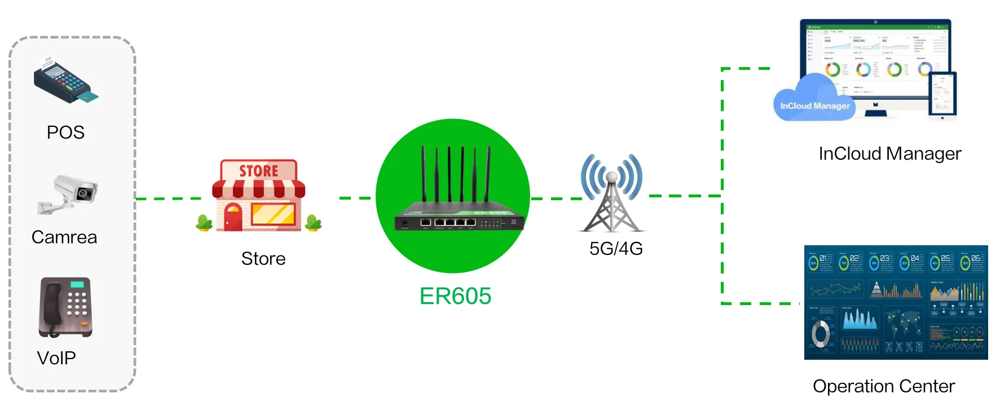

<strong>Fig. 1-1 ER605’s Application</strong>

### 1.2 Packing List

| Item | Quantity | Description |
|------|----------|-------------|
| ER605 | 1 | Edge Router 605 |
| Ethernet Cable | 1 | 1m Ethernet cable |
| LTE Antenna | 2 | For ER605 4G model |
| 5G Antenna | 4 | For ER605 5G model |
| Wi-Fi Antenna | 2 | Magnetic antenna; stick antenna optional |
| Power Adaptor | 1 | 12V DC power adaptor with power cable |
| Panel Mounting Lug | 4 | 2 hangers and 2 wall mounting lugs |
| SIM Card Ejector | 1 | Used to remove the SIM tray |

### 1.3 Appearance and Interfaces

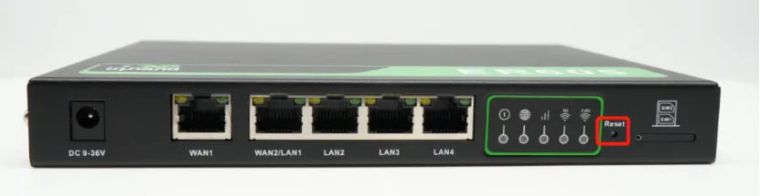

<strong>Fig. 1-2 ER605 Panel Interface</strong>

| Interface | Position | Function |
|-----------|----------|----------|
| Power IN | Rear | 12V DC power input |
| WAN1 | Rear | Ethernet WAN port |
| WAN2/LAN1 | Rear | Ethernet port supporting WAN/LAN switch |
| LAN2 | Rear | Ethernet LAN port |
| LAN3 | Rear | Ethernet LAN port |
| LAN4 | Rear | Ethernet LAN port |
| Reset | Rear | Pinhole reset button |
| LED Indicators | Front | System status indicators |
| SIM Card Slot | Side | Dual nano SIM card tray |

### 1.4 LED Indicators

| Indicator | Status | Meaning |
|-----------|--------|---------|
| System | Off | Power off |
| | Steady red | System booting in progress |
| | Blinking red | System malfunction detected |
| | Blinking yellow | System upgrading |
| | Blinking green | System running smoothly |
| Network | Off | Network not connected |
| | Blinking red | Cellular network connecting |
| | Steady green | Cellular network connected |
| | Blinking yellow | Wired network connecting |
| | Steady yellow | Wired network connected |
| Cellular | Off | Cellular disabled |
| | Steady red | Poor signal quality |
| | Steady yellow | Good signal quality |
| | Steady green | Excellent signal quality |
| Wi-Fi 2.4G | Off | 2.4G Wi-Fi disabled |
| | Steady green | Working normally |
| | Blinking green | Working abnormally |
| Wi-Fi 5G | Off | 5G Wi-Fi disabled |
| | Steady yellow | Working normally |
| | Blinking yellow | Working abnormally |

For the network status indicator:

1. If both wired and 4G/5G connections are functioning normally, it displays a yellow wired indicator.
2. If only one type of network connection is working correctly, it displays the indicator for the active network.
3. If there is no network connection, it displays red.

### 1.5 Restore Factory Settings

<strong>Fig. 1-3 Reset Button Location</strong>

**Hardware Restore**

1. Power on the device (for 10 seconds) while holding down the reset button until the System indicator light is solid yellow.
2. Release the reset button, and the System indicator light starts flashing yellow.
3. Press the reset button again until the System indicator light remains solid yellow.

**Remote Restore**

Log in to the InCloud Manager platform, navigate to "Device," select "Command," click the "Restore to Factory" button, confirm the action, and the device reboots and reverts to default settings.

### 1.6 Default Settings

| No. | Function | Default Settings |
|-----|----------|------------------|
| 1 | Cellular Dialing | Default dialing is set to "SIM1" |
| 2 | Wi-Fi | 1. Wi-Fi 2.4G access point enabled, SSID prefixed with "ER605-" followed by the last 6 digits of the wireless MAC address. 2. Wi-Fi 5G access point enabled, SSID prefixed with "ER605-5G-" followed by the last 6 digits of the wireless MAC address. 3. Authentication method is WPA2-PSK. 4. The password for both bands is the last 8 digits of the serial number. |
| 3 | Ethernet | 1. All 4 LAN ports enabled. 2. IP Address: 192.168.2.1; Subnet Mask: 255.255.255.0. 3. DHCP server enabled, with an address pool from 192.168.2.2 to 192.168.2.100 for automatic IP address assignment. |
| 4 | Network Access Control | Local HTTP (port 80) and HTTPS (port 443) enabled. Access from the cellular network is disabled. |
| 5 | Username/Password | See device nameplate for login credentials. |

---

## Chapter 2 Installation and First Use

### 2.1 Pre-Installation Preparation

**Environment Requirements**

| Parameter | Requirement |
|-----------|-------------|
| Working Temperature | -20℃ to 50℃ |
| Storage Temperature | -40℃ to 85℃ |
| Installation Position | Free from direct sunlight, heat sources, and strong electromagnetic interference; capable of supporting the device weight |

**Tools and Materials**

- SIM card (purchased separately from local operator, required for cellular access)
- Power adapter (included in package)
- Ethernet cable (included in package)
- Antennas (included in package, quantity varies by model)

> **Caution**: Power must be disconnected when inserting or removing SIM cards to prevent data loss or device damage.
> 
> **Caution**: Use only the power adapter included in the package. The ER605 supports 12V DC input. Pay attention to voltage levels.

### 2.2 Installation Guide

#### Install SIM Card

The ER605 supports dual nano SIM cards. Use the SIM card ejector tool included in the package to insert it into the small hole to release the SIM card tray. After installing the SIM card on the tray, insert the tray back into the slot.

<strong>Fig. 2-1 Insert SIM Cards</strong>

#### Attach Antennas

Attach the antennas to the SMA connectors. The stick antenna must be installed on the corresponding SMA interface according to the logo on the antenna and near the SMA interface.

<strong>Fig. 2-2 Attach Antennas</strong>

#### Desktop Installation

1. Ensure the selected desktop area is free from obstructions to provide adequate space for the device.
2. Install the foot pad in the corresponding position of the housing under the device.
3. Verify the correct installation of the SIM cards, antennas, and power cable.
4. Place the device steadily on the tabletop.

<strong>Fig. 2-3 Attach Foot Pads</strong>

<strong>Fig. 2-4 Place on Tabletop</strong>

#### Wall-Mounted Installation

1. Install the hanging ears included with the package at the cutouts on both sides of the device.
2. Install two screws on the wall where the equipment needs to be mounted. The distance between the two screws must be consistent with the hole distance between the hanging ears of the equipment.
3. Hang the device in the predetermined position and push down to confirm that the device is installed stably and will not fall.

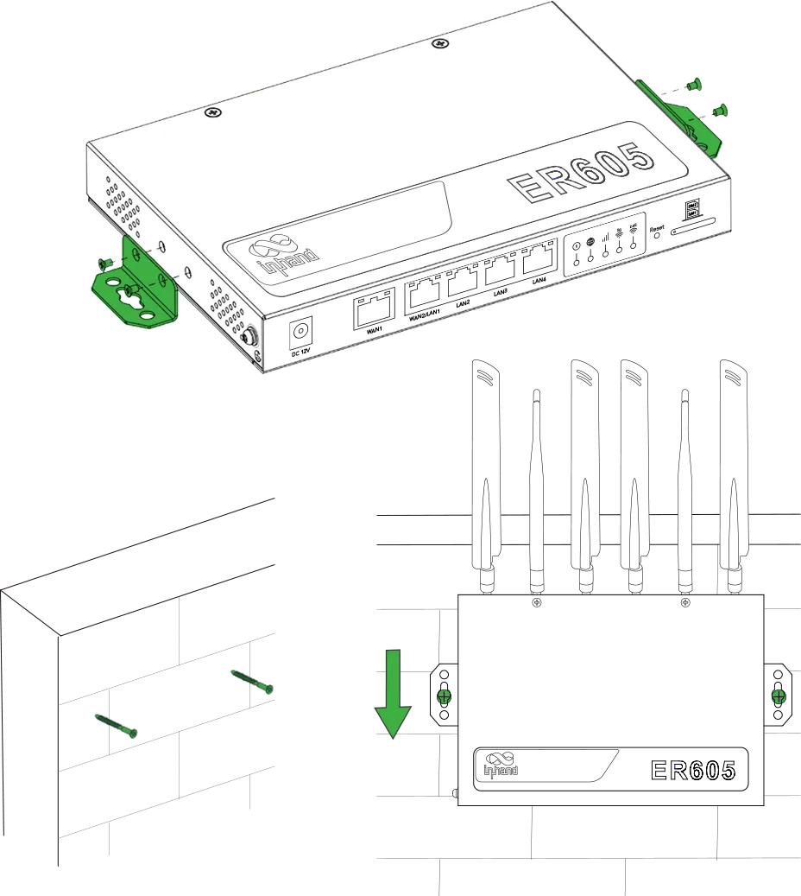

<strong>Fig. 2-5 Wall-Mounted Installation</strong>

#### Power Cable Installation

Insert one end of the power adapter into the power outlet and the other end into the device's power interface.

<strong>Fig. 2-6 Connect Power Adapter</strong>

#### Access Web Interface

1. Connect the PC to any LAN port on the ER605 using an Ethernet cable.
2. The device's LAN port has DHCP Server functionality enabled by default. Once the PC has automatically obtained an IP address, ensure that the PC and ER605 are in the same address range.
3. If the PC fails to obtain an IP address automatically, configure it with a static IP address using the following parameters:
   - IP Address: 192.168.2.x (choose an available address within the range of 192.168.2.2 to 192.168.2.254)
   - Subnet Mask: 255.255.255.0
   - Default Gateway: 192.168.2.1
   - DNS Servers: 8.8.8.8 (or the ISP's DNS server address)

<strong>Fig. 2-7 PC IP Address Configuration</strong>

4. Open a web browser and enter the default device address 192.168.2.1 in the browser's address bar.
5. Enter the username and password (see device nameplate for login credentials) to access the device's web management interface.
6. If the browser displays a security warning, navigate to hidden or advanced options and select "Proceed to website."

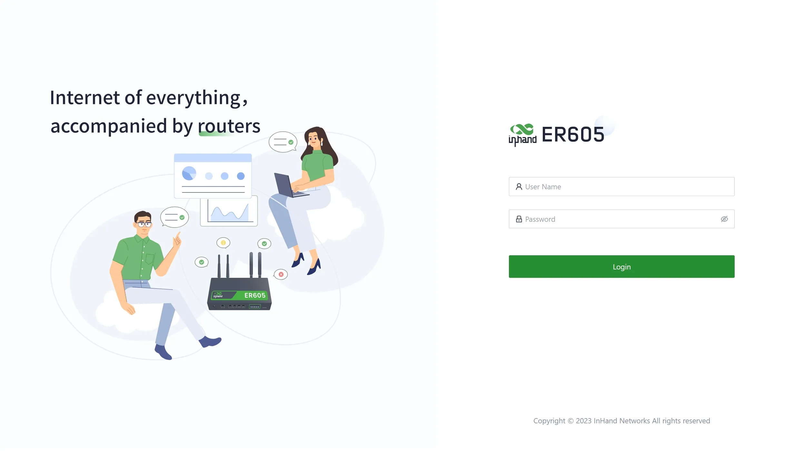

<strong>Fig. 2-8 Device Web Login Page</strong>

### 2.3 Quick Check

- [ ] Device is stably placed on the desktop or securely mounted on the wall.
- [ ] SIM card tray is fully inserted (if cellular access is required).
- [ ] All antennas are tightened and oriented correctly.
- [ ] Power cable is firmly connected and the power LED indicates normal status.
- [ ] PC can access the web management interface at 192.168.2.1.
- [ ] Internet connectivity is established (Cellular or WAN indicator shows connected status).

---

## Chapter 3 Common Scenario Configuration

### Scenario 1: Cellular Internet Access

**Objective**: Access the internet via 4G/5G cellular network.

**Prerequisites**: SIM card inserted, cellular antennas installed, device powered on, web interface accessible.

**Estimated Time**: Approx. 5 minutes.

**Operation Steps**:

1. Power off the device, insert the SIM card into the card slot, and connect the cellular antennas.
2. Log in to the web management interface.
3. Navigate to 【Internet】→【Uplink Table】, click the "Edit" button next to "Cellular" to configure dial-up parameters.

<strong>Fig. 3-1 Uplink Table</strong>

4. Configure APN parameters (APN parameters must be obtained from the operator).

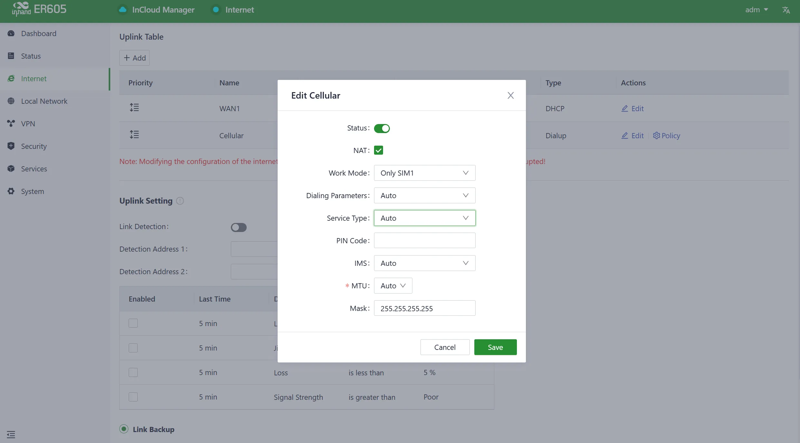

<strong>Fig. 3-2 APN Parameters</strong>

5. The device comes with the dial-up function enabled by default. If it does not establish a connection within a few minutes, re-enable the dial-up option.
6. Click "Save" and wait for the connection to establish.

**Verification**:

1. Navigate to 【Dashboard】>【Interface Status】. The device has successfully connected to the internet when the "Cellular" icon turns green.
2. Click the "Cellular" icon to access information such as signal strength, IP address, and data usage.

<strong>Fig. 3-3 Cellular Interface Status</strong>

3. Use the Ping tool in 【System】>【Tools】 to test connectivity to 8.8.8.8.

**Common Issues**:

- Network connection failure: Check whether the SIM card is correctly inserted and whether APN parameters are correct.
- Data transmission anomaly: Check signal strength and data balance.

### Scenario 2: Wired Internet Access

**Objective**: Access the internet via wired WAN connection.

**Prerequisites**: Ethernet cable connected from upstream device to WAN1, device powered on, web interface accessible.

**Estimated Time**: Approx. 5 minutes.

**Operation Steps**:

1. Connect the WAN1 port to the upstream network device using an Ethernet cable.
2. Log in to the web management interface.
3. Navigate to 【Internet】→【Uplink Table】, click the "Edit" button next to "WAN1".

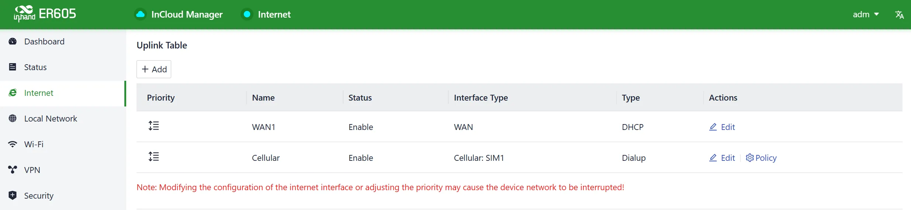

<strong>Fig. 3-4 Uplink Table Interface</strong>

4. Select the connection method:
   - **DHCP** (default): The WAN interface automatically obtains an IP address from the upstream DHCP server.
   - **Static IP**: Manually configure the IP address, subnet mask, gateway, and DNS server obtained from the ISP or upstream network device.

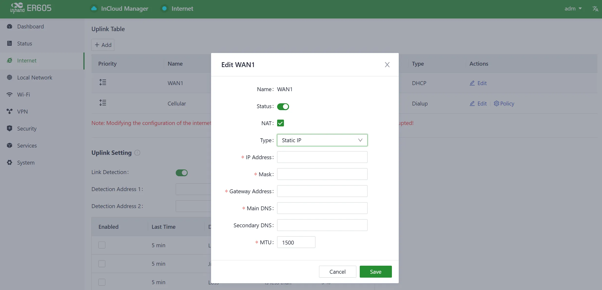

<strong>Fig. 3-5 Static IP Configuration</strong>

   - **PPPoE**: Enter the broadband username and password provided by the ISP.

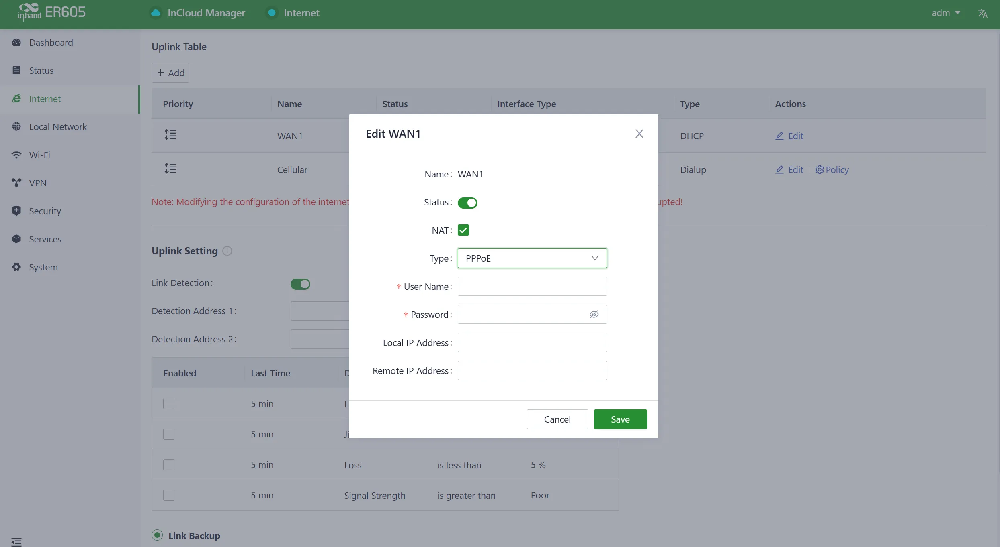

<strong>Fig. 3-6 PPPoE Configuration</strong>

5. Click "Save" and wait for the connection to establish.

**Verification**:

1. Navigate to 【Dashboard】>【Interface Status】. The device connects to the internet successfully when the "WAN" icon turns green.
2. Use the Ping tool in 【System】>【Tools】 to test external connectivity.

**Dual WAN Configuration** (Optional):

When dual WAN connections are required, click the "Add" button in the 【Internet】menu to add the WAN2 interface. The WAN2 interface supports the same configuration options as the WAN1 interface.

<strong>Fig. 3-7 Adding WAN2 Interface</strong>

> **Note**: After adding the WAN2 interface, the original LAN1 interface role switches to WAN2. After deleting the WAN2 interface, the WAN2 interface role switches back to LAN1. After deleting WAN2, all configuration related to the WAN2 interface, including static routes, inbound/outbound rules, port forwarding, policy routing, and traffic shaping settings, will be removed.

**Common Issues**:

- Cannot obtain IP address: Verify that the upstream device has the DHCP server enabled.
- PPPoE connection failure: Verify the broadband username and password with the ISP.

### Scenario 3: Cloud Management via InCloud Manager

**Objective**: Add the device to InCloud Manager for remote monitoring and management.

**Prerequisites**: Device connected to the internet, valid serial number and MAC address available.

**Estimated Time**: Approx. 10 minutes.

**Operation Steps**:

1. Open a web browser and visit https://star.inhandcloud.com.
2. Click "Create now" to register a new platform account, or log in with existing credentials.

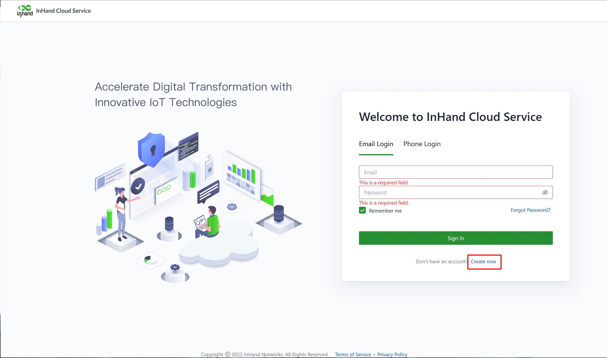

<strong>Fig. 3-8 Create InCloud Account</strong>

3. Select "InCloud Manager" to access the SaaS platform.

<strong>Fig. 3-9 Choose SaaS Service</strong>

4. Navigate to "Devices" and click the "Add" button.
5. Fill in the device's name, serial number, and MAC address.
6. Click "Finish" to complete the addition.

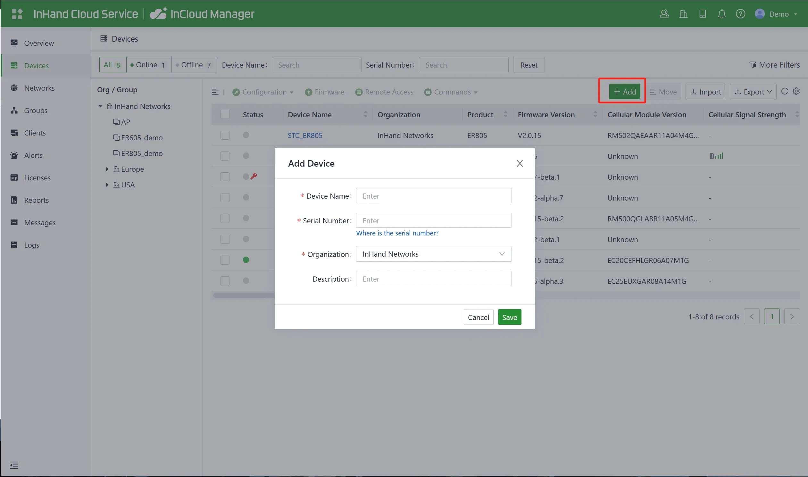

<strong>Fig. 3-10 Add Device to InCloud Manager</strong>

> **Note**: When a device is initially added to the platform account, it automatically receives a 1-year Essential license. Users can renew the license through the "License" menu.

**Verification**:

1. The device appears in the InCloud Manager device list within a few minutes.
2. Dashboard data and device status are visible on the platform.

**Common Issues**:

- Device offline: Verify internet connectivity on the device and check that cloud management is enabled in 【System】>【Cloud Management】.
- Incorrect credentials: Verify the serial number and MAC address on the device nameplate.

### Scenario 4: Wi-Fi Access Point Configuration

**Objective**: Configure wireless network access for client devices.

**Prerequisites**: Device powered on, web interface accessible.

**Estimated Time**: Approx. 10 minutes.

**Operation Steps**:

1. Log in to the web management interface.
2. Navigate to 【Wi-Fi】>【Wi-Fi List】.
3. Click "Add/Edit" to modify an existing SSID or add a new one.
4. Configure the SSID name, frequency band, security mode, and password.
5. Click "Save".

**Verification**:

1. Use a wireless client to scan for the configured SSID.
2. Connect using the configured password.

**Common Issues**:

- SSID not visible: Check whether the SSID is enabled. If Wi-Fi (STA) in the same frequency band is active, the corresponding AP SSIDs are automatically disabled.
- Connection failure: Verify the password matches the configuration.

> **Reference**: For detailed Wi-Fi parameter descriptions, see [Wi-Fi](#45-wi-fi).

---

## Chapter 4 Function Description and Parameter Reference

### 4.1 Dashboard

The Dashboard provides an overview of essential device information, interface status, traffic statistics, cellular signal strength, and the number of connected Wi-Fi devices.

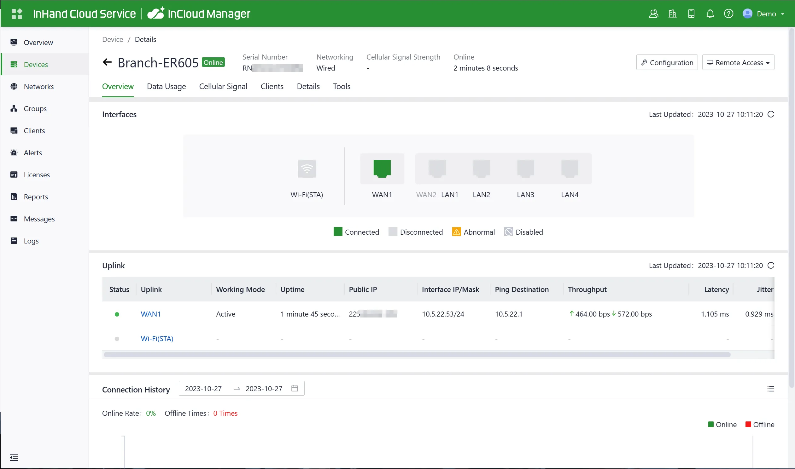

<strong>Fig. 4-1 Dashboard Overview</strong>

**Data Usage**

Users can view the traffic usage and historical data of various upstream links.

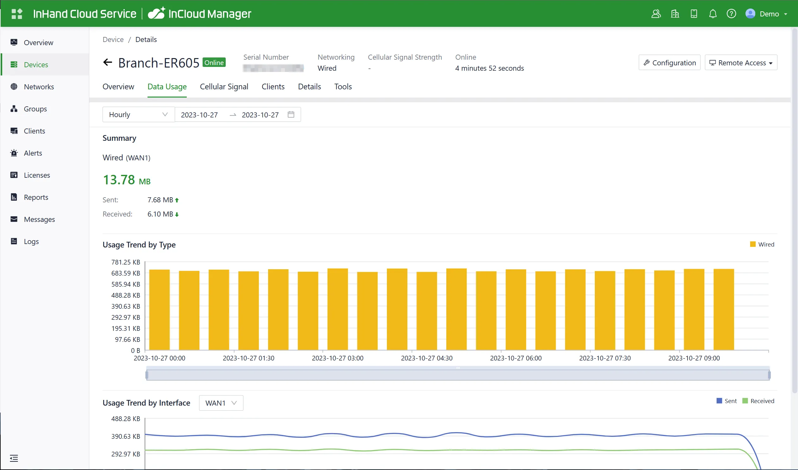

<strong>Fig. 4-2 Data Usage</strong>

**Cellular Signal**

Users can view cellular signal curves such as RSSI, RSRP, RSRQ, and SINR.

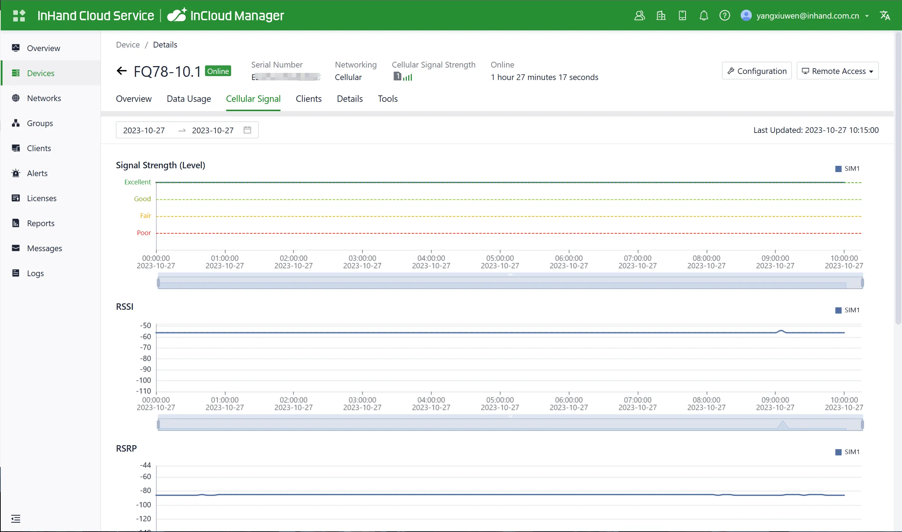

<strong>Fig. 4-3 Cellular Signal</strong>

**Traffic Statistics**

Users can monitor the usage of traffic on each upstream interface since the router was powered on. The data in traffic statistics resets after the device is rebooted. Historical traffic records can be accessed on the device's details page within InCloud Manager.

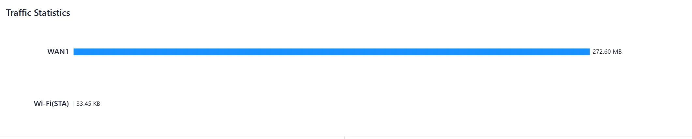

<strong>Fig. 4-4 Traffic Statistics</strong>

**Wi-Fi Connections**

Users can check the number of active SSIDs on the ER605 and the number of connected clients under each SSID.

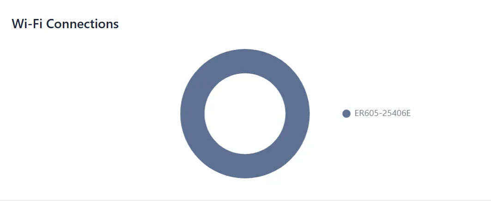

<strong>Fig. 4-5 Wi-Fi Connections</strong>

**Clients Traffic Top 5**

Users can view the current ranking of client traffic usage for devices connected to the router. It displays up to 5 records, and when a client disconnects, its statistical data is cleared.

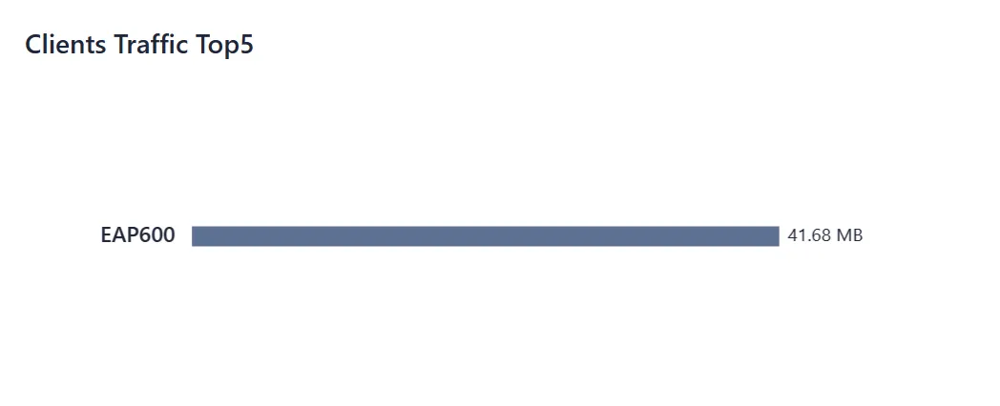

<strong>Fig. 4-6 Top 5 Clients by Traffic</strong>

### 4.2 Status

By clicking on the "Status" option in the left-side menu, users can access the status interface to view information about the device's upstream links, cellular signal, connected clients, VPN, events, logs, and more.

#### 4.2.1 Link Monitor

Users can utilize the "Status > Link Monitoring" feature to check the health status of each upstream link and access information about throughput, latency, packet loss, signal strength, and more for each interface.

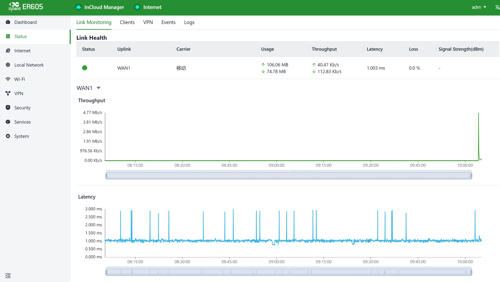

<strong>Fig. 4-7 Link Monitor Interface</strong>

#### 4.2.2 Cellular Signals

Users can access the "Status > Cellular Signal" feature to check the signal strength of SIM cards under the cellular interface, along with parameters such as RSSI, SINR, RSRP, and RSRQ.

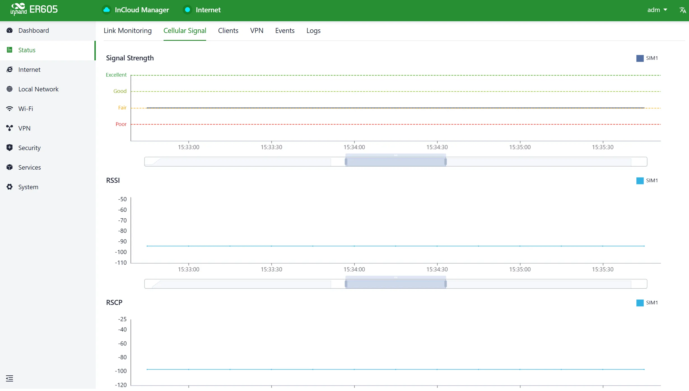

<strong>Fig. 4-8 Cellular Signal Strength</strong>

#### 4.2.3 Clients

Through the "Status > Clients" feature, users can view detailed information about both wired and wireless clients connected to the router. This includes details such as names, addresses, MAC addresses, VLANs, connected subnets, traffic usage, online duration, and more.

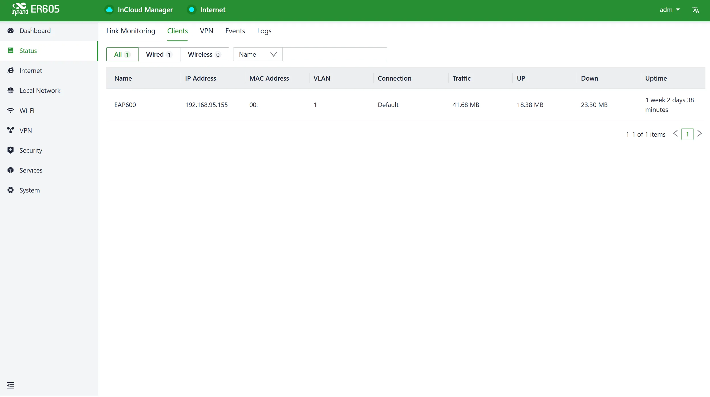

<strong>Fig. 4-9 Connected Clients</strong>

#### 4.2.4 VPN

Users can access the "Status > VPN" feature to view information about IPSec VPN and L2TP VPN, including their status, traffic, and the duration of the most recent connection.

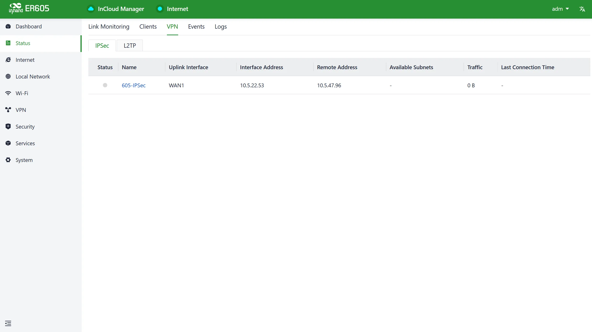

<strong>Fig. 4-10 VPN Information</strong>

#### 4.2.5 Events

Users can use the "Status > Events" feature to check event information related to the device's operation.

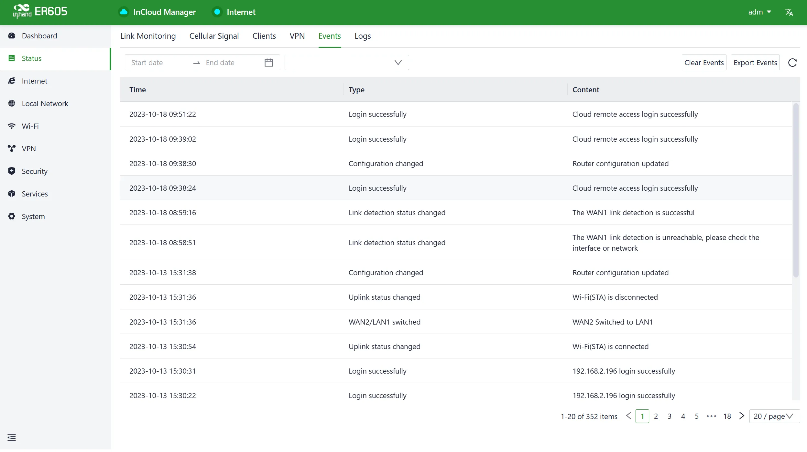

<strong>Fig. 4-11 Event Types</strong>

Currently supported event types:

1. Successful/Failed User Logins
2. High CPU Utilization in the Last 5 Minutes
3. High Memory Utilization in the Last 5 Minutes
4. Cellular Traffic Reaches Threshold
5. VPN Status Changes
6. Uplink Status Changes
7. Uplink Switching
8. WAN2/LAN1 Switching
9. Reboot
10. Upgrade

#### 4.2.6 Logs

Through the "Status > Logs" feature, users can examine the system logs, which contain information about the device's operational history.

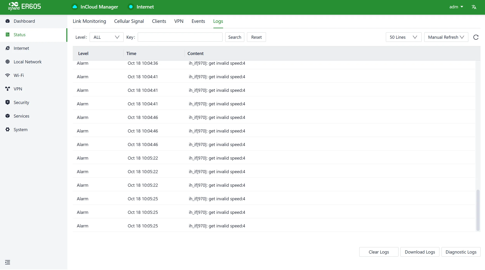

<strong>Fig. 4-12 Logs Information</strong>

1. **Download Logs**: Download the device's operational logs.
2. **Download Diagnostic Logs**: Download the device's diagnostic logs, which include system operation logs, device information, and device configurations.
3. **Clear Logs**: Clear the device's operational logs; this does not clear the device's diagnostic logs.

### 4.3 Internet

Users can configure the parameters and operational modes of each upstream interface under the "Internet" feature.

#### 4.3.1 Uplink Table

Users can edit the WAN1 and Cellular interfaces and add/edit/remove WAN2 and Wi-Fi (STA) interfaces in the "Internet > Upstream Link List." Users can also adjust the priority of each interface by dragging the "Priority" icon. Interfaces are arranged from top to bottom based on their priority, with higher priority interfaces taking precedence in determining the current upstream interface for device operation.

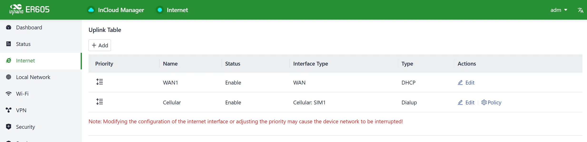

<strong>Fig. 4-13 Uplink Table Interface</strong>

#### 4.3.2 Uplink Settings

Users can configure link detection settings and establish collaboration modes between different upstream interfaces through the "Internet > Upstream Link Settings" feature.

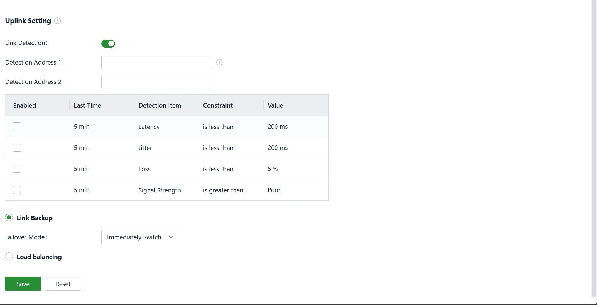

<strong>Fig. 4-14 Uplink Settings Interface</strong>

**Link Detection Switch**: The device has link detection functionality enabled by default. However, in certain specialized network environments where external communication is not possible, users may need to manually disable link detection. When link detection is turned off, users cannot view latency, jitter, packet loss, signal strength, and other information for upstream interfaces in the 【Status】menu.

**Notes**:

1. Modifying settings in the Internet menu can potentially lead to a disruption in device connectivity. Exercise caution when making changes.
2. When the link detection address is left empty, the default behavior is to detect the DNS address via the upstream interface. If a detection address is specified, all upstream interfaces will only detect the address provided.
3. In the router's link backup mode, users can customize detection parameters, and the device switches links based on the enabled detection items. When detection items are not enabled, upstream link switching occurs only based on priority and link connectivity.
4. In the device's load balancing mode, all operational upstream links forward business traffic, provided they are functioning correctly.

#### 4.3.3 WAN Connection Methods

The ER605 supports three wired internet connection methods: DHCP, Static IP, and PPPoE. The default method is DHCP.

1. **DHCP**: The WAN interface is configured to enable DHCP service by default. By connecting the WAN port to the internet using an Ethernet cable, the device automatically establishes an internet connection.
2. **Static IP**: Users can manually configure an address either obtained from their internet service provider or one that is within the same network segment as their upstream device. Once the configuration is complete, the router accesses the network via the specified static IP address.
3. **PPPoE**: Users can configure broadband dial-up. Once the configuration is complete, the router establishes an internet connection through the broadband dial-up.

When users require dual WAN connections, they can click the "Add" button in the 【Internet】menu to add the WAN2 interface. The WAN2 interface supports the same configuration options as the WAN1 interface.

> **Note**: After adding the WAN2 interface, the original LAN1 interface role switches to WAN2. After deleting the WAN2 interface, the WAN2 interface role switches back to LAN1. After deleting WAN2, all configuration related to the WAN2 interface, including static routes, inbound/outbound rules, port forwarding, policy routing, and traffic shaping settings, will be removed.

#### 4.3.4 Cellular Configuration

In the usual scenario, upon inserting the SIM card and connecting the antennas, the ER605 router automatically establishes a dial-up connection and connects to the network when powered on.

To configure APN (Access Point Name) parameters, users can select the "Cellular" interface in the 【Internet】menu and click the "Edit" button to access the APN parameter configuration interface.

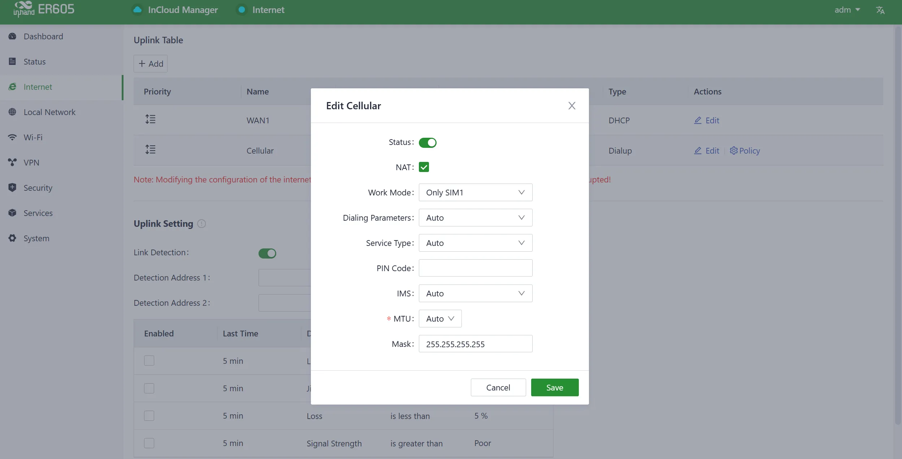

<strong>Fig. 4-15 Edit Cellular Interface</strong>

The ER605, in addition to supporting cellular internet access, includes a traffic policy feature. Once the policy is enabled, the SIM card takes specific actions when the traffic reaches a threshold. Traffic usage statistics reset at the beginning of the next month. Users can select the "Cellular" interface in the 【Internet】menu and click the "Policy" button to access the SIM card's policy parameter configuration interface.

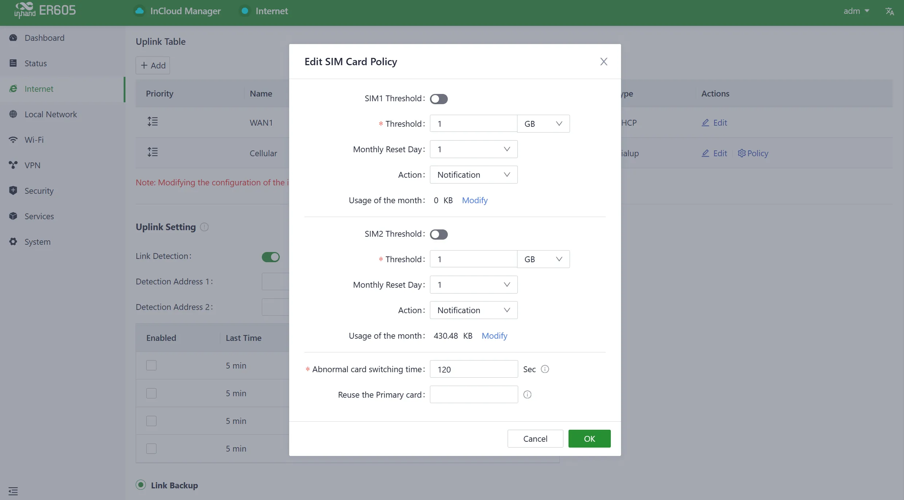

<strong>Fig. 4-16 SIM Card Policy</strong>

1. **Actions**: These are the actions triggered when SIM card traffic reaches a threshold.
   - **Notification**: It generates an event when traffic reaches the threshold but does not stop forwarding regular business traffic.
   - **Cloud Management Only**: It generates an event when traffic reaches the threshold, allowing only the forwarding of cloud-based management traffic while blocking access to the internet for regular business traffic.
   - **Switch the SIM card**: It generates an event when traffic reaches the threshold and switches to another SIM card for internet access.

> **Caution**:
> 
> 1. In certain dedicated network scenarios, it may be necessary to manually disable the "Link Detection" function under the 【Internet】menu to prevent cellular connectivity issues caused by unsuccessful detection.
> 2. In some cases, manual configuration of the subnet mask for the cellular interface may be required to ensure the proper functioning of the ARP feature.
> 3. When inserting or removing a SIM card, it is essential to disconnect the power to prevent data loss or damage to the device.

#### 4.3.5 Wi-Fi (STA)

The ER605 supports connecting as a client to an on-site AP's network. To do this, click on the "Add" button, select "Wi-Fi (STA)," and fill in the required parameters, including the SSID name and password.

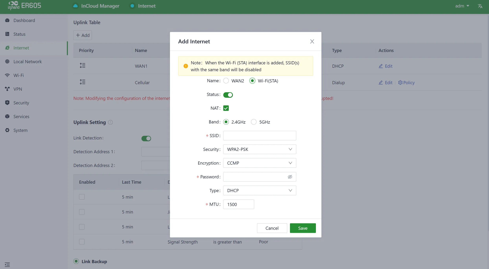

<strong>Fig. 4-17 Add Wi-Fi (STA) Interface</strong>

> **Caution**:
> 
> 1. Upon adding Wi-Fi (STA), ER605 automatically disables SSIDs in the same frequency band within the Wi-Fi settings, and the status field for those SSIDs cannot be modified.
> 2. After removing Wi-Fi (STA), the "Status" field and SSIDs in the same frequency band within the Wi-Fi settings can be modified.
> 3. When Wi-Fi (STA) is deleted, all configuration associated with the Wi-Fi (STA) interface, including static routes, inbound/outbound rules, port forwarding, policy routing, and traffic shaping settings, will be removed.

### 4.4 Local Network

In the 【Local Network】feature, users have the flexibility to define their local subnets. This includes configuring the address range, VLAN ID, DHCP services, and other related parameters for the local LAN. Once the configuration is complete, users need to further apply these settings to the device's LAN port through 【Interface Management】 or apply them to the desired SSID in the Wi-Fi settings. This series of operations is intended to ensure that client devices can smoothly connect to the local network according to the planned network addresses.

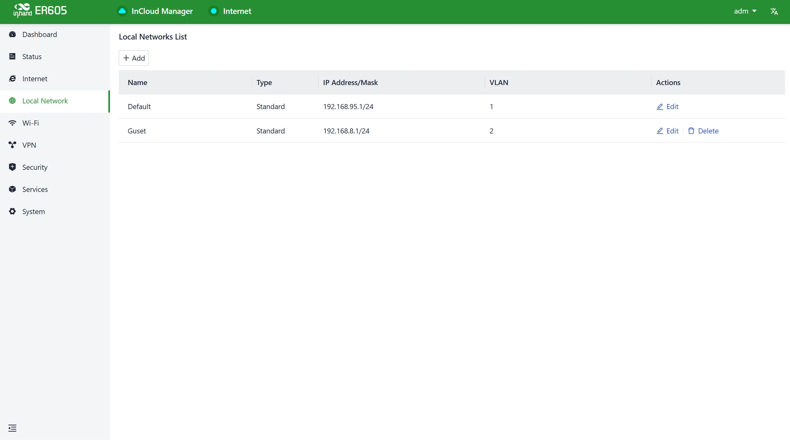

<strong>Fig. 4-18 Local Network List</strong>

Click the "Add/Edit" button to add a new local network or edit an existing one.

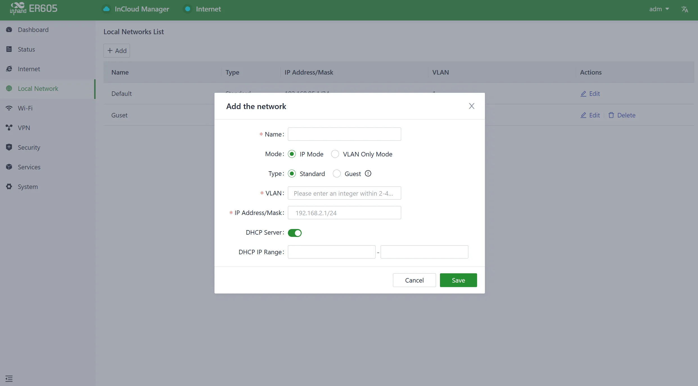

<strong>Fig. 4-19 Add or Edit Local Network</strong>

**Name**: Used to identify the network. Users can select this name to apply the network in both 【Wi-Fi】 and 【Interface Management】.

**Mode**: Choose whether the current subnet operates in Layer 2 transparent mode or Layer 3 IP mode. The default is "IP mode."

**VLAN**: This allows for the division of the local network into different virtual logical networks. The default VLAN for all interfaces and Wi-Fi is "default (VLAN1)."

**IP Address/Subnet Mask**: This is the gateway address for accessing the router through the LAN port or Wi-Fi. The default is "192.168.2.1."

**DHCP Server**: Clients connecting to the router can obtain IP addresses through this function. It is enabled by default, and the address range is generated based on the "IP Address/Subnet Mask."

> **Note**:
> 
> 1. The default local network cannot be deleted, and users can only modify the IP address/subnet mask and DHCP server settings.
> 2. Once a local network is added, its mode cannot be changed.
> 3. The VLAN Only mode is designed for Layer 2 transparent operation and does not require configuration of IP address/subnet mask or DHCP server settings.

### 4.5 Wi-Fi

Wi-Fi is a widely used wireless communication technology that enables computers, smartphones, tablets, and other devices to connect to the internet or a local network. The ER605 can function as an Access Point (AP) to provide multiple SSID wireless network access. Users have the flexibility to customize different SSIDs for various purposes and configurations.

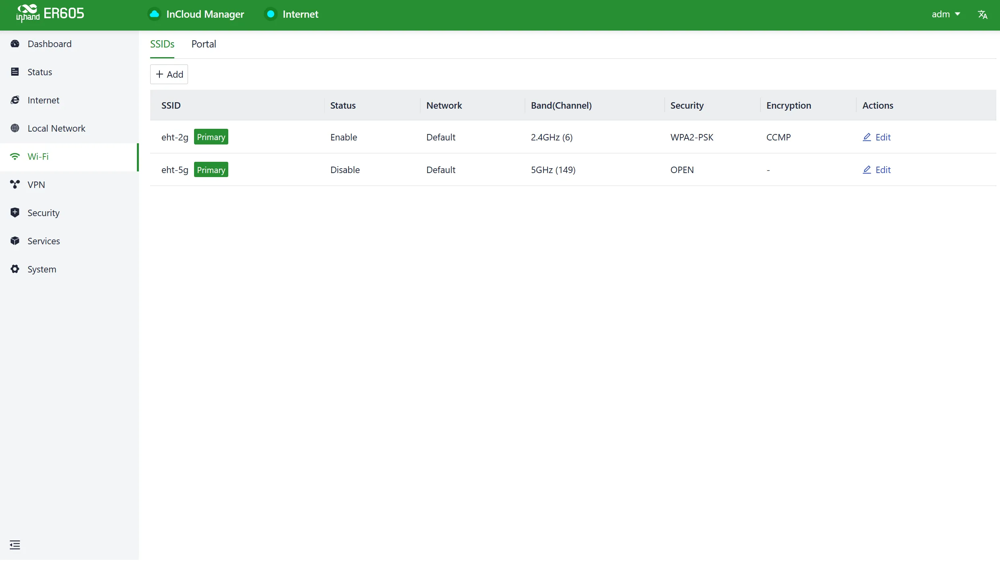

<strong>Fig. 4-20 Wi-Fi List</strong>

By clicking the "Add/Edit" button under "Wi-Fi > Wi-Fi List," users can add a new SSID or edit an existing one.

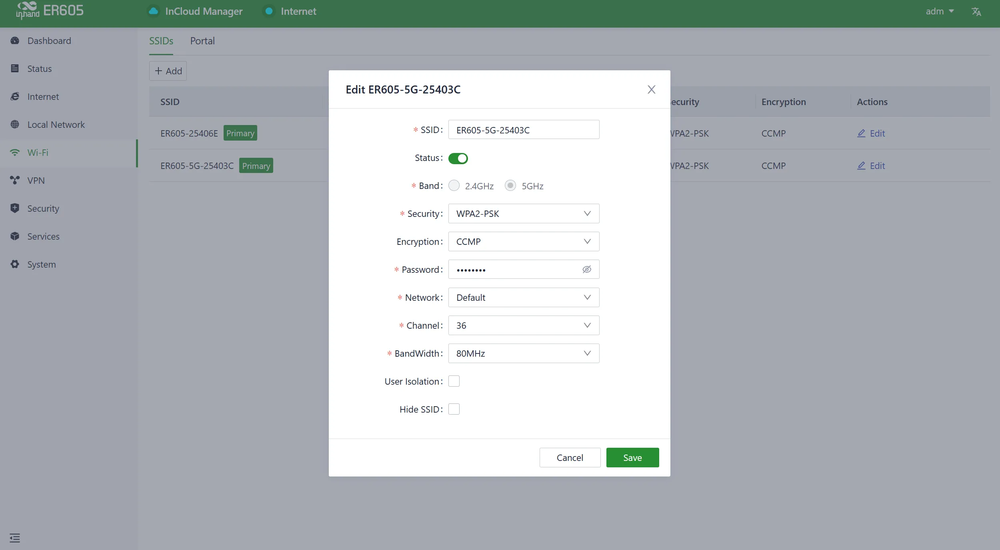

<strong>Fig. 4-21 Edit SSID</strong>

> **Note**:
> 
> 1. The device comes with default 2.4GHz and 5GHz main SSIDs. The frequency bands of these main SSIDs cannot be modified and cannot be deleted.
> 2. Once an SSID is added, its frequency band cannot be changed, and it automatically uses the same channel as its corresponding main SSID.
> 3. If a user creates a Wi-Fi (STA) interface in the "Internet" menu with the same frequency band as an existing SSID, that SSID cannot be enabled until the Wi-Fi (STA) interface is deleted.

### 4.6 VPN

A Virtual Private Network (VPN) is an encryption technology used to establish a secure, private network connection over the public internet. It enables users to securely access private network resources over the internet from anywhere.

#### 4.6.1 IPSec VPN

IPsec (Internet Protocol Security) VPN is a protocol suite designed to enhance network communication security by encrypting and authenticating data transmission. Click the "Add" button under "VPN > IPSec VPN" to add a new IPSec VPN.

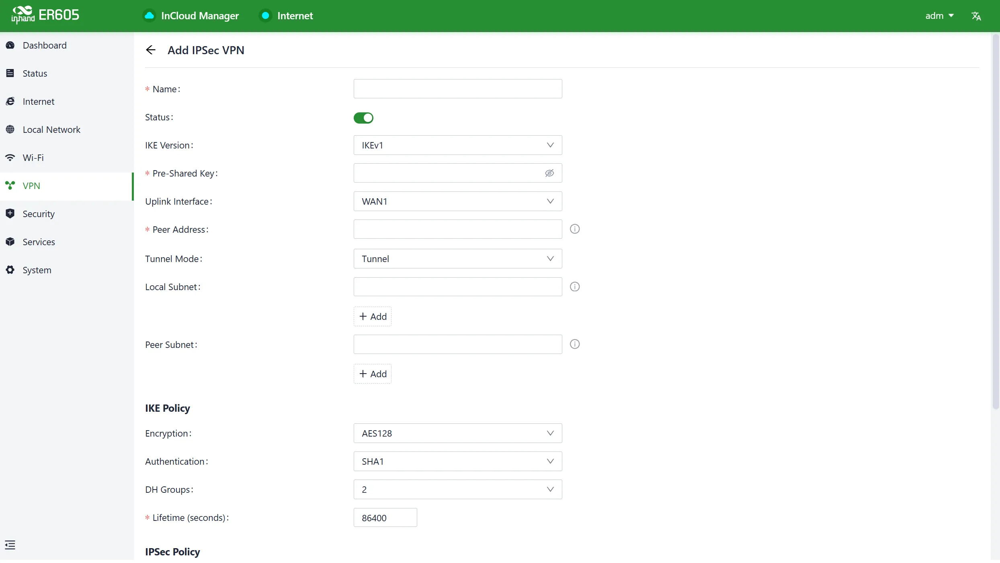

<strong>Fig. 4-22 Add IPSec VPN</strong>

Once configurations are completed at both ends, the tunnel can be established. Users can check the tunnel establishment status in the "Status > VPN" menu.

1. **Name**: The user-assigned name for the IPSec VPN to identify it for local management purposes.
2. **IKE Version**: The version of the Internet Key Exchange (IKE) protocol to be used. It supports both IKEv1 and IKEv2.
3. **Pre-Shared Key**: A secret shared key that must be configured the same on both devices for authentication during IKE negotiation.
4. **Internet Interface**: The upstream interface used to establish the IPSec VPN locally.
5. **Tunnel Mode**: The encapsulation mode for IPSec on IP packets. It supports both tunnel mode and transport mode.
6. **Peer Address**: The address of the remote endpoint with which ER605 establishes the IPSec tunnel.
7. **Local Subnet**: The subnet addresses that need to communicate through the ER605 IPSec VPN tunnel.
8. **Remote Subnet**: The subnet address on the other end of the tunnel that needs to communicate through the IPSec VPN tunnel.
9. **IKE Policy**: Supports configuring the IKE protocol.
   - **Encryption Method**: DES, 3DES, AES128, AES192, AES256 (default: AES128)
   - **Authentication Method**: MD5, SHA1, SHA2-256, SHA2-384, SHA2-512 (default: SHA1)
   - **DH Group**: 1, 2, 5, 14, 15, 16, 19, 20
   - **Timeout**: IKE SA lifetime, default 86400 seconds
10. **IPSec Policy**:
    - **Security Protocol**: DES, 3DES, AES128, AES192, AES256 (default: AES128)
    - **Encryption Method**: MD5, SHA1, SHA2-256, SHA2-384, SHA2-512 (default: SHA1)
    - **PFS Group**: 1, 2, 5, 14, 15, 16, 19, 20
    - **Timeout**: IPSec SA aging time, default 86400 seconds

> **Note**: When establishing a connection using IPSec VPN, by default, use the device with the public IP address as the server. The remote address on the IPSec server side needs to be configured as 0.0.0.0, and the remote address on the IPSec client side should be set to the public IP address of the IPSec server.

#### 4.6.2 L2TP VPN

The Layer 2 Tunneling Protocol (L2TP) is a Layer 2 VPN protocol designed to establish secure point-to-point or site-to-site Virtual Private Network connections.

##### 4.6.2.1 L2TP Client

The ER605 can act as an L2TP client and establish a tunnel with a remote L2TP server. Click on the "L2TP VPN" menu, then navigate to "Client," and use the "Add" button to configure an L2TP client.

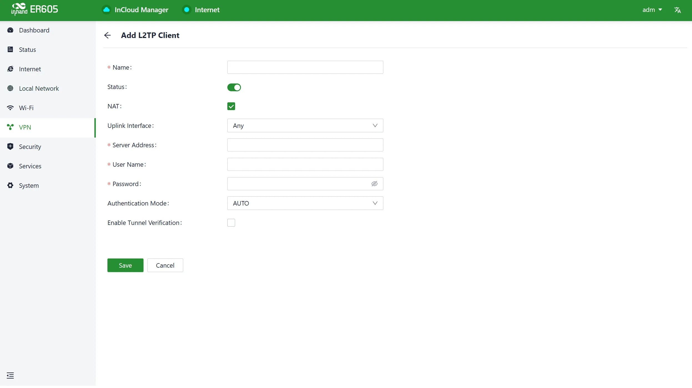

<strong>Fig. 4-23 L2TP Client Parameters</strong>

1. **Name**: The name of the L2TP client for local identification.
2. **Status**: The switch to enable or disable the L2TP client tunnel.
3. **NAT**: The switch for NAT functionality when forwarding with the L2TP client.
4. **Upstream Interface**: The upstream interface used for communication between the L2TP client and the server.
5. **Server Address**: The communication address of the remote L2TP server.
6. **Username/Password**: Credentials that need to be configured the same on both ends during L2TP negotiation.
7. **Authentication Mode**: The L2TP authentication mode.
8. **Enable Tunnel Authentication**: When enabled, both ends need to configure the same username and password for tunnel authentication.

##### 4.6.2.2 L2TP Server

The L2TP server is typically deployed at the corporate headquarters to provide remote access to mobile offices or branch locations. Click "VPN > L2TP VPN > Server" to enter the editing page for the L2TP server.

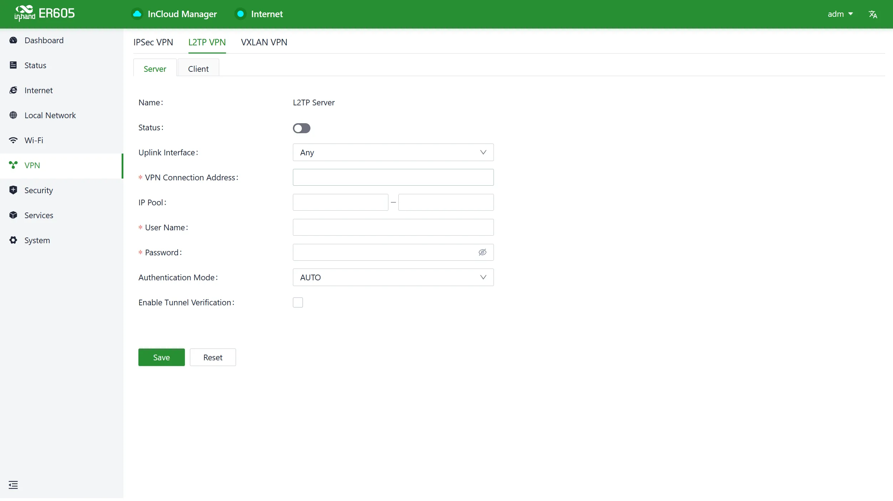

<strong>Fig. 4-24 L2TP Server Parameters</strong>

1. **Name**: The name of the L2TP server, not editable.
2. **Status**: The on/off switch for the L2TP server function, default is off.
3. **Upstream Interface**: The upstream interface used by the L2TP server.
4. **VPN Communication Address**: The gateway address for L2TP clients, which can be assigned to devices within the IP address pool.
5. **Address Pool**: The IP address pool used for communication when L2TP clients connect.
6. **Username/Password**: Credentials that need to be the same on both ends for L2TP negotiation.
7. **Authentication Mode**: The L2TP authentication mode.
8. **Enable Tunnel Verification Function**: When enabled, the usernames/passwords for tunnel verification on both ends need to be the same.

#### 4.6.3 VXLAN VPN

VXLAN (Virtual Extensible LAN) is a tunneling technology that establishes a logical tunnel over an IP network between source and target network devices. Click the "Add" button under "VPN > VXLAN VPN" to create a new VXLAN VPN.

<strong>Fig. 4-25 Add VXLAN VPN</strong>

1. **Name**: The name for this VXLAN VPN network.
2. **Upstream Interface**: The outbound interface used to establish a VXLAN tunnel with other devices.
3. **Peer Address**: The IP address of the peer device with which this device needs to establish a VXLAN VPN network.
4. **VNI**: The VXLAN Network Identifier, where each VNI represents a different tenant or network segment.
5. **Local Subnet**: The address range assigned to local client devices when they connect.

> **Note**: VXLAN cannot be used with other VPN functions and IP Passthrough functions at the same time.

### 4.7 Security

In the 【Security】menu, users can configure advanced features related to firewalls, policy routing, and traffic shaping.

#### 4.7.1 Firewall

The firewall includes functions such as inbound rules, outbound rules, port forwarding, and MAC address filtering.

##### 4.7.1.1 Inbound Rules/Outbound Rules

Users can implement traffic in/out control based on interfaces through the "Security > Firewall > Outbound Rules/Inbound Rules" feature.

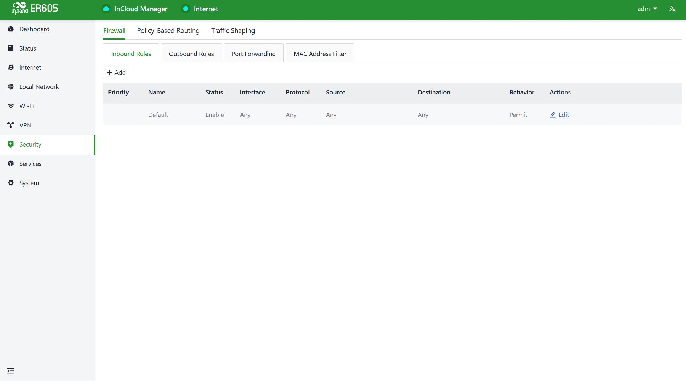

<strong>Fig. 4-26 Firewall Interface</strong>

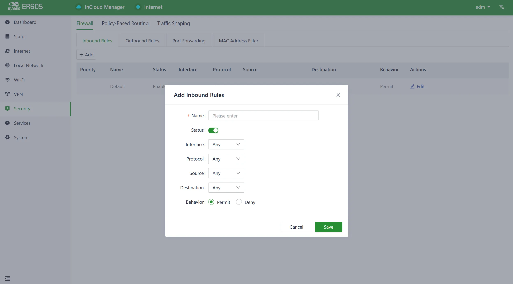

<strong>Fig. 4-27 Add Inbound Rule</strong>

1. **Name**: The name of the inbound/outbound rule for local identification.
2. **Status**: Rule function switch.
3. **Interface**: For outbound rules, it specifies the upstream interface where traffic leaves the router. For inbound rules, it specifies the upstream interface where traffic enters the router.
4. **Protocol**: Match traffic based on the protocol type, with options like Any, TCP, UDP, ICMP, or custom.
5. **Source**: Match the source address for traffic, supporting custom, with the default as Any.
6. **Destination**: Match the destination address for traffic, supporting custom, with the default as Any.
7. **Action**: Action taken for matching traffic in inbound/outbound rules, supporting allow and deny.
8. **Inbound Rules**: Traffic management rules for external network accessing the router, with the default as deny all.
9. **Outbound Rules**: Traffic management rules for traffic going out through the router, with the default allowing all.
10. Support for adjusting the priority of inbound and outbound rules.

##### 4.7.1.2 Port Forwarding

Port forwarding is used to redirect network packets from one network port to another. Users can configure port forwarding rules under "Security > Firewall > Port Forwarding."

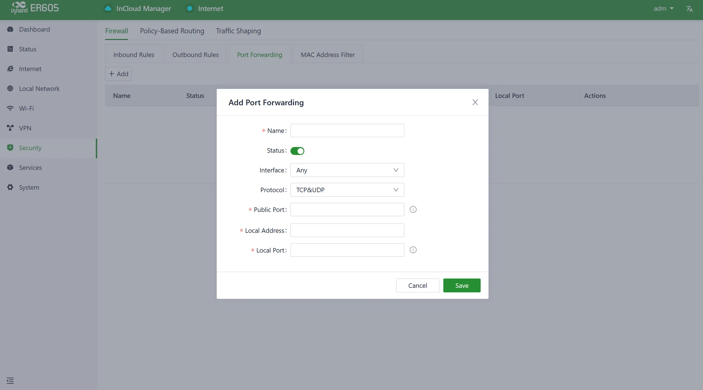

<strong>Fig. 4-28 Add Port Forwarding Rule</strong>

1. **Name**: The name of the port forwarding rule, used for local identification.
2. **Status**: The on/off switch for the port forwarding rule.
3. **Interface**: The upstream interface that provides mapping functionality for internal clients. The upstream interface needs public IP address support.
4. **Protocol**: The protocol type of the traffic for port mapping, supports TCP, UDP, and TCP & UDP.
5. **Public Port**: The port number on the upstream interface that provides mapping.
6. **Local Address**: The address of the target device located under the router that the external network needs to access.
7. **Local Port**: The port of the target device that the external network needs to access. It needs to be consistent with the public port input range.

##### 4.7.1.3 MAC Address Filter

MAC address filtering involves allowing or disallowing devices in a MAC address list to access the internet. Users can configure MAC address filtering rules in "Security > Firewall > MAC Address Filtering."

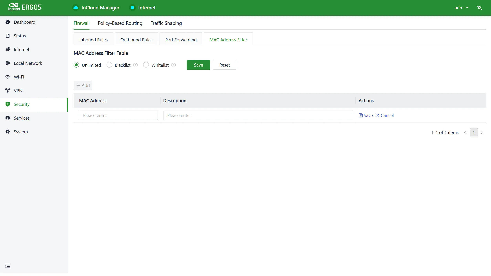

<strong>Fig. 4-29 Add MAC Address Filter Rule</strong>

Users can create multiple MAC addresses in the list, add address descriptions, and set it to allow only the MAC addresses to access the network (whitelist), or block MAC addresses in the list from accessing the network (blacklist).

#### 4.7.2 Policy-Based Routing

Policy routing allows users to create policies based on specific needs, enabling them to route different data flows through different links. Click the "Add" button under "Security > Policy Routing" to create a new policy routing rule.

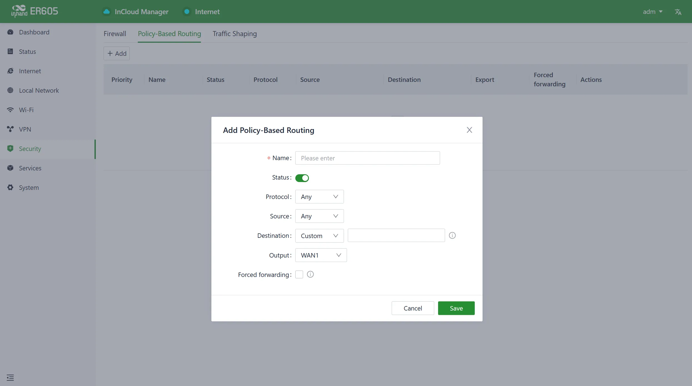

<strong>Fig. 4-30 Add Policy Routing Rule</strong>

> **Caution**: The source address and destination address in a policy routing rule cannot both be set as "Any."

#### 4.7.3 Traffic Shaping

Traffic shaping policies optimize the network based on each protocol, giving users control and prioritizing critical business traffic. Configure traffic shaping rules in "Security > Traffic Shaping > Add/Edit."

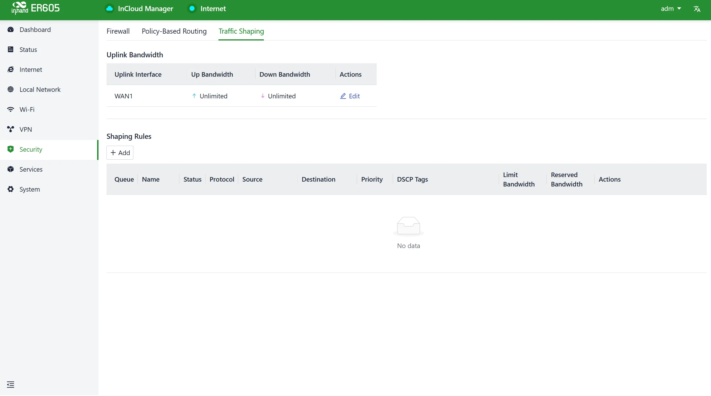

<strong>Fig. 4-31 Traffic Shaping Interface</strong>

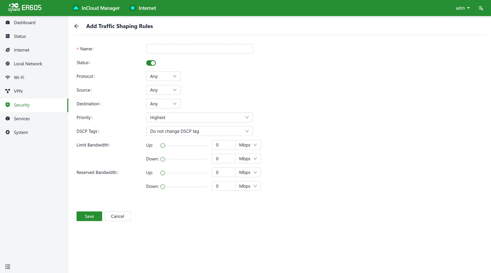

<strong>Fig. 4-32 Add Traffic Shaping Rule</strong>

Traffic shaping policies consist of a series of rules executed sequentially. Each rule comprises two main components: the type of traffic to restrict or adjust and how to limit or adjust that traffic.

> **Note**:
> 
> 1. Traffic forwarding priority for unmatched rules is medium.
> 2. When Limit Bandwidth is set to 0, the system does not limit the bandwidth.
> 3. The value of Reserved Bandwidth should not be greater than the Limit Bandwidth.

### 4.8 Services

#### 4.8.1 Interface Management

Users can configure local networks allowed through a specific interface and set the interface's speed in the "Services > Interface Management" function.

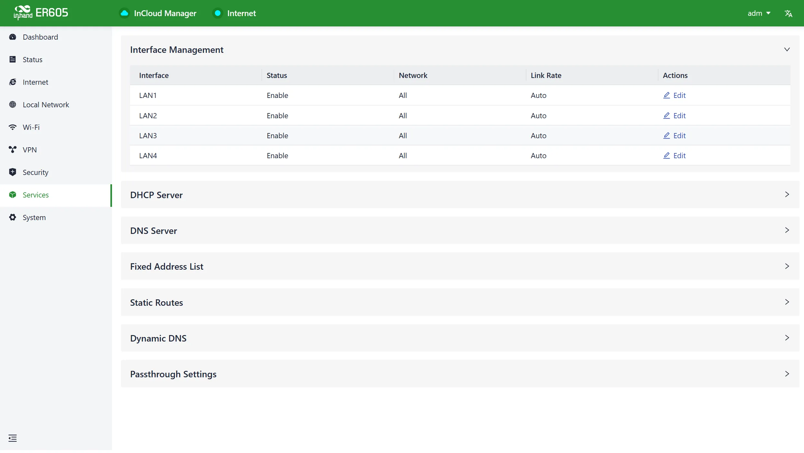

<strong>Fig. 4-33 Interface Management</strong>

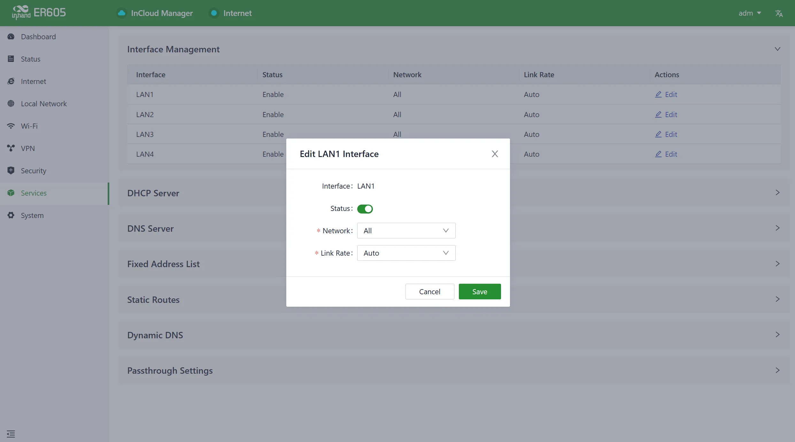

<strong>Fig. 4-34 Edit Interface</strong>

#### 4.8.2 DHCP Server

The DHCP (Dynamic Host Configuration Protocol) service operates in a client/server communication mode, where clients request IP addresses from servers, and servers respond by assigning IP addresses dynamically to clients. Users can configure the DHCP server's IP address pool using the "Services > DHCP Server" feature.

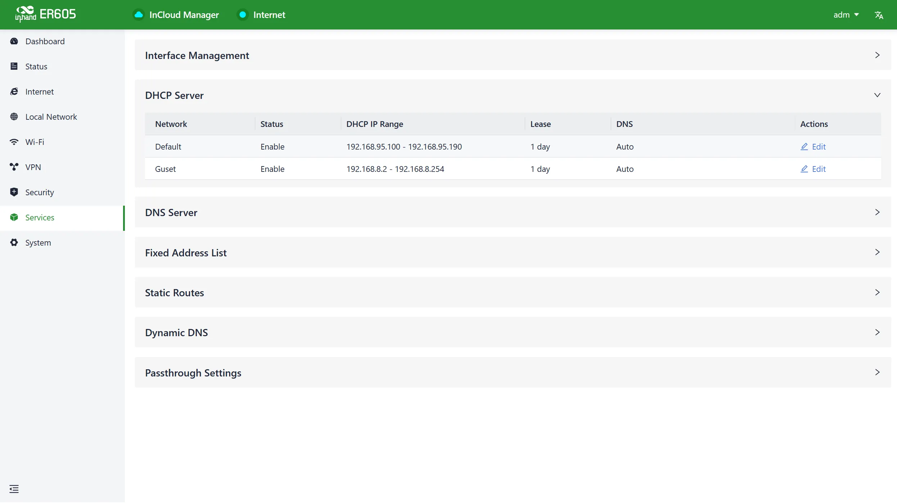

<strong>Fig. 4-35 DHCP Server Interface</strong>

> **Note**:
> 
> 1. The device's DHCP service is generated based on the network information in the local network. If a local subnet is removed from the "Local Network List," the DHCP Server for that local subnet is also deleted.
> 2. Local network entries need to be set in "IP" mode for the DHCP server function to take effect. Networks in "VLAN Only" mode are not within the selectable range.

#### 4.8.3 DNS Server

DNS (Domain Name System) servers translate human-readable domain names into computer-understandable IP addresses. When users do not set DNS server addresses in "Services > DNS Server," the DNS addresses obtained from the device's upstream interface are used for domain name resolution. When users configure DNS server addresses, the configured DNS addresses are used for domain name resolution.

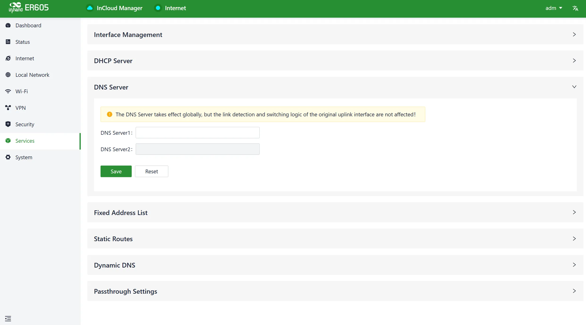

<strong>Fig. 4-36 Add DNS Server</strong>

#### 4.8.4 Fixed Address List

Users can use the "Services > Fixed Address List" function to allocate a fixed IP address to a device based on its MAC address. This means that the device consistently receives the same IP address every time it connects to the ER605.

<strong>Fig. 4-37 Add Fixed IP Address</strong>

> **Caution**:
> 
> 1. The available addresses for allocation must fall within the address range of the local network in IP mode, or else the configuration will not take effect.
> 2. When the local network is deleted, all fixed address allocation rules within the local network's address range will be removed.

#### 4.8.5 Static Routes

Users can configure static routing entries using the "Services > Static Routing" feature to enable data to be forwarded through specified paths and interfaces. The contents of the static routing table are manually created by users, and routing entries generated by other services, such as VPN functionality, will not be displayed in this table.

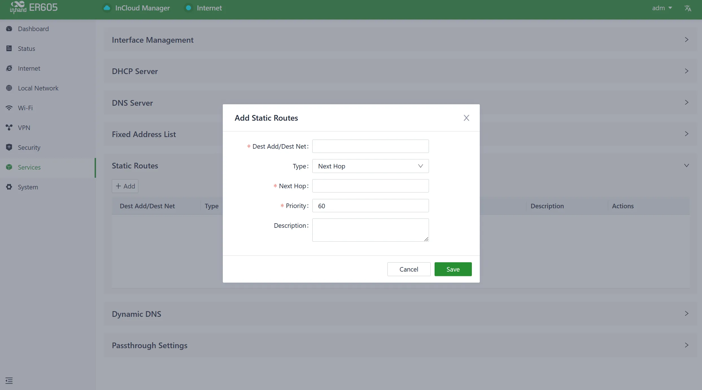

<strong>Fig. 4-38 Add Static Route</strong>

> **Caution**:
> 
> 1. For static routes with the same destination address/network, the next-hop address, interface, or priority cannot be the same; otherwise, it will result in a non-functional route.
> 2. When WAN2, Wi-Fi (STA), or L2TP Client VPN is deleted, the corresponding static routes using those interfaces will also be removed.

#### 4.8.6 Dynamic DNS

Dynamic DNS (Dynamic Domain Name System) is used to automatically update the name server content in the domain system. Users can manually configure the Dynamic DNS server address under the "Services > Dynamic DNS" feature.

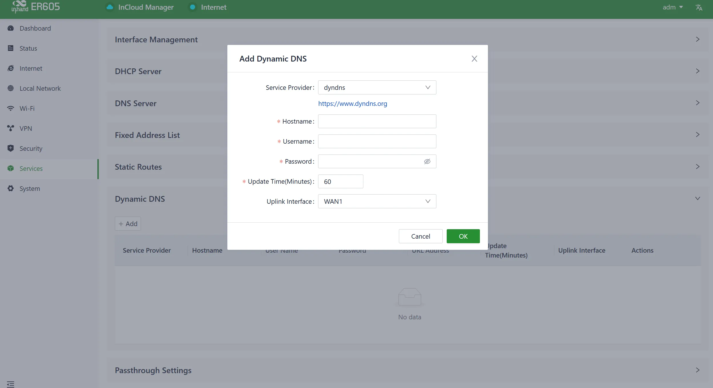

<strong>Fig. 4-39 Add Dynamic DNS Service</strong>

1. **Service Provider**: Provided by the Dynamic DNS service operator. Options include dyndns, 3322, oray, no-ip, or custom (requires a URL).
2. **Hostname**: Register for a hostname by clicking on the URL below the service provider.
3. **Username**: Register for a username by clicking on the URL below the service provider.
4. **Password**: The password set by the user during registration.

#### 4.8.7 Passthrough Settings

Users can enable the IP Passthrough feature through "Service > Passthrough Settings." Once enabled, client devices can obtain the upstream interface address of the ER605.

<strong>Fig. 4-40 Enable IP Passthrough</strong>

1. **Passthrough MAC**: Only clients bound to this MAC can obtain the upstream interface address of the device.

> **Caution**:
> 
> 1. When the IP Passthrough mode is enabled, only one client can access the public network.
> 2. When accessing client devices, inbound rules need to be released.
> 3. Users can still access the router via the default subnet's IP address.

### 4.9 System

In the "System" menu, users can configure settings related to cloud management, remote access control, clock settings, device options, configuration management, device alerts, tools, and log servers, among other functions.

#### 4.9.1 Admin Management

See the device nameplate for the default username and password. To ensure device security, it is recommended to change the password. This can be done by clicking on "adm" in the top navigation bar and selecting "Change Password" from the dropdown menu.

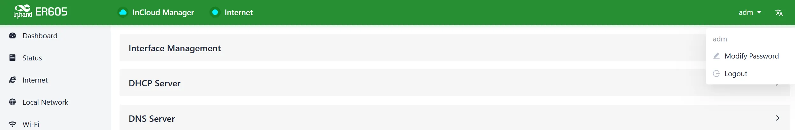

<strong>Fig. 4-41-a Admin Menu</strong>

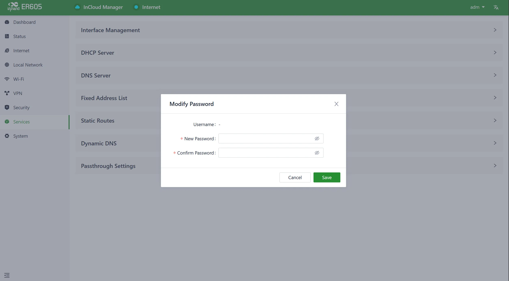

<strong>Fig. 4-41-b Change Password</strong>

#### 4.9.2 Cloud Management

The InCloud Service (star.inhandcloud.com) is a cloud platform developed by InHand Networks for enterprise networks. It integrates features like zero-touch deployment, intelligent operations and maintenance, security protection, and user experience capabilities. Once devices are connected to the cloud platform, users can perform remote management, batch configuration, traffic monitoring, and other operations.

ER605 automatically connects to the InCloud Service after establishing an internet connection by default. If the cloud management function is not required, it can be disabled manually in the "System > Cloud Management" function.

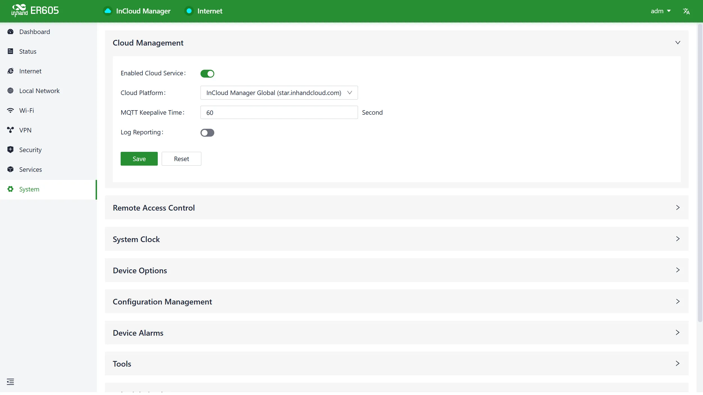

<strong>Fig. 4-42 Enable InCloud Service</strong>

#### 4.9.3 Remote Access Control

Users can configure whether to allow external access to the router's web configuration interface from the Internet through the "System > Remote Access Control" function. The service port can also be set for this purpose.

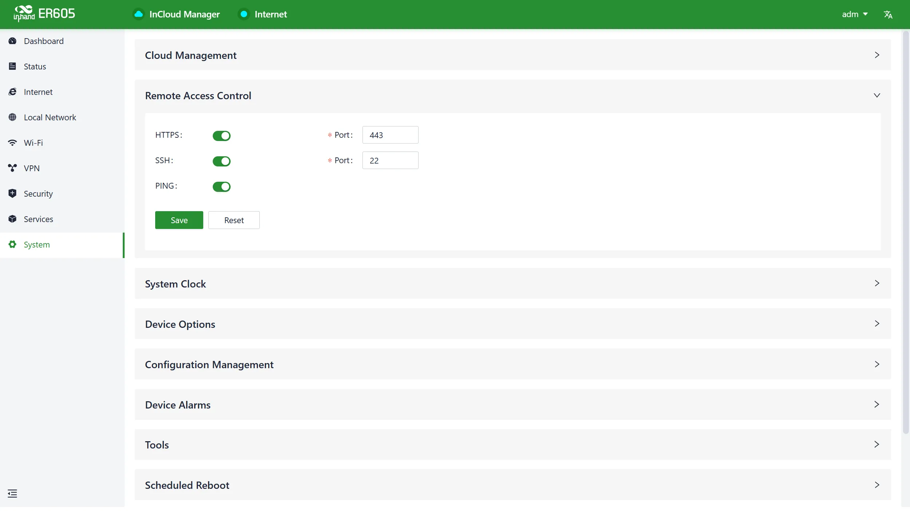

<strong>Fig. 4-43 Remote Access Parameters</strong>

1. **HTTPS**: When enabled, users can access the router's web interface remotely by entering the public IP address and port number of the upstream interface in a web browser.
2. **SSH**: When enabled, users can remotely log in to the router's backend using remote tools by providing the public IP address, port number, username, and password.
3. **Ping**: When enabled, the upstream interface allows external networks to initiate Ping requests.

#### 4.9.4 System Clock

The clock function coordinates and synchronizes time between network devices. Users can use the "System > System Clock" function to select the current time zone and configure NTP (Network Time Protocol) server addresses to synchronize the device's system time with an NTP server.

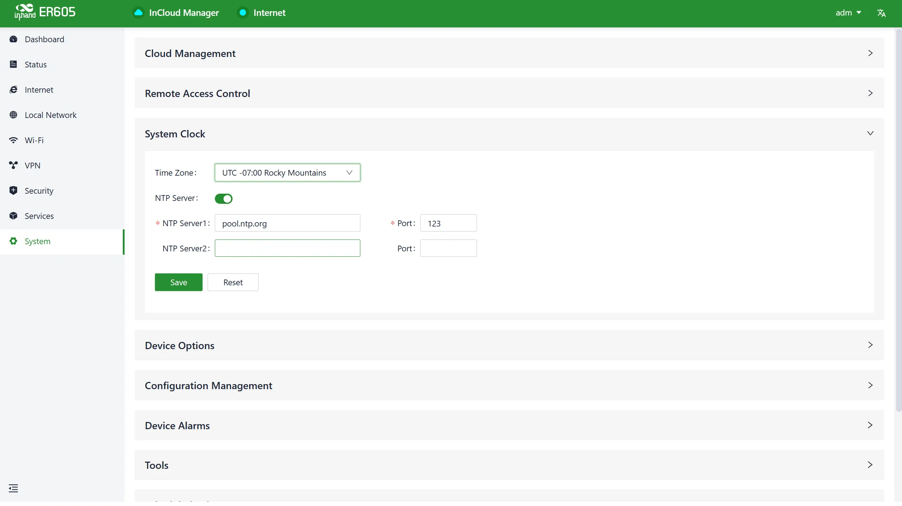

<strong>Fig. 4-44 Time Zone and NTP Server</strong>

#### 4.9.5 Device Options

In the "System > Device Options" section, users can perform various device operations such as rebooting, upgrading firmware, and restoring factory settings.

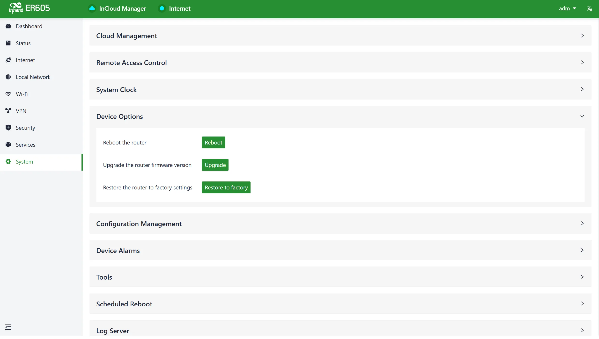

<strong>Fig. 4-45 Device Options</strong>

> **Caution**:
> 
> 1. When performing a local firmware upgrade, it is essential to ensure that the firmware is obtained from a legitimate source to avoid rendering the device inoperable due to incorrect firmware imports.
> 2. When a device is connected to the cloud platform, the platform synchronizes the previous configuration to the device again due to cloud-based configuration synchronization. The device only clears historical data during the factory reset.

#### 4.9.6 Configuration Management

Users can export device configurations to local storage in the "System > Configuration Management" menu. This backup can be imported into the device in case of configuration loss or when overwriting the existing configuration is required.

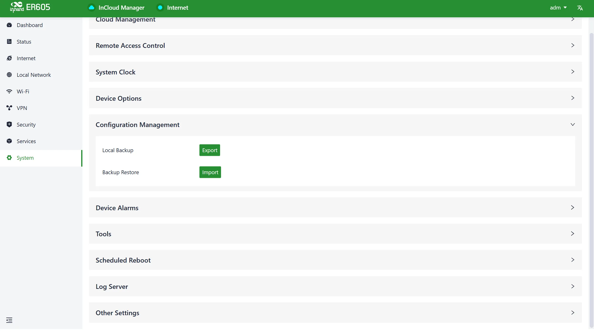

<strong>Fig. 4-46 Configuration Management</strong>

#### 4.9.7 Device Alarms

Users can choose to focus on specific events that may occur on the device by selecting the corresponding alarm events and configuring the email address for receiving alerts. When an alarm event occurs, the device automatically sends an email notification. Even if a user does not select certain alarm options, related alarm events are still recorded in the device's local logs.

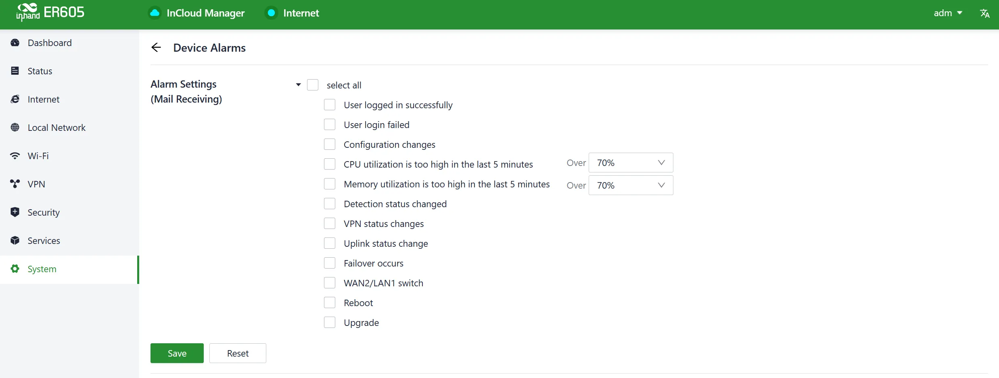

<strong>Fig. 4-47 Alarm Event Types</strong>

After configuring the outgoing email server address, port, username, and password, the device uses this email account to send alarm notifications. Users can use the "Send Test Email" option to verify whether the outgoing email configuration is correct.

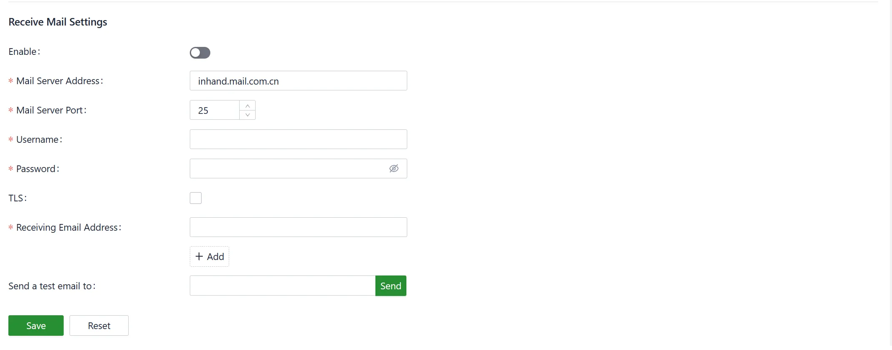

<strong>Fig. 4-48 Mail Receiving Settings</strong>

#### 4.9.8 Tools

##### 4.9.8.1 Ping

Users can use ICMP (Internet Control Message Protocol) to check the device's external network connectivity. In the "Target" field, enter any domain name or IP address to test the device's connectivity to, and then click "Start" to check the connectivity status between the device and the specified target.

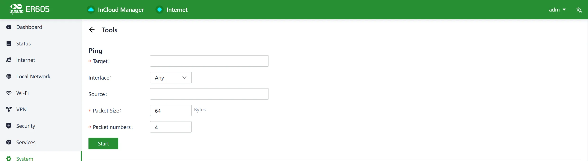

<strong>Fig. 4-49 Ping Tool</strong>

##### 4.9.8.2 Traceroute

Traceroute is a network diagnostic tool used to determine the network path that data packets take from the source to the destination, as well as the intermediate routers or hops along that path. Enter the target host's IP address in "System > Tools > Traceroute," choose the outgoing interface for the traffic, click "Start," and check the device's connectivity to the target IP by tracing the route.

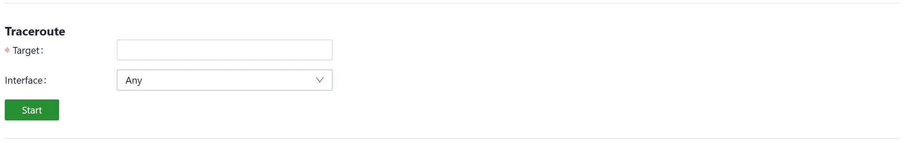

<strong>Fig. 4-50 Traceroute Tool</strong>

##### 4.9.8.3 Packet Capture

Packet capture is a network monitoring and analysis technique used to capture and record data packets transmitted over a computer network. Users can capture packets passing through a specific interface in "System > Tools > Packet Capture." By selecting the "Output" option, users can choose to display the captured data within the interface or export it locally for further analysis.

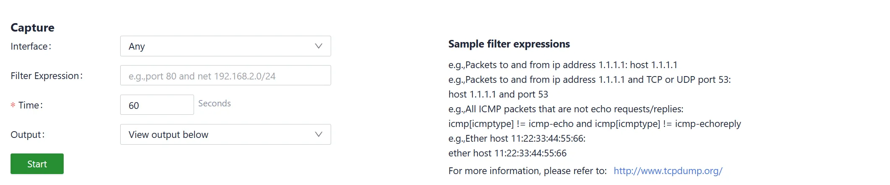

<strong>Fig. 4-51 Packet Capture Tool</strong>

#### 4.9.9 Scheduled Reboot

Scheduled reboot allows administrators to automatically restart a device at a specific time or under certain conditions. Users can set up scheduled reboots in the "System > Scheduled Reboot" function. The device supports scheduled reboots at fixed times daily, weekly, or monthly. In the case of monthly reboots, if the selected reboot day exceeds the actual number of days in the month, the device reboots on the last day of the month. For example, if the 31st is selected, the device reboots on the 30th in a month with only 30 days.

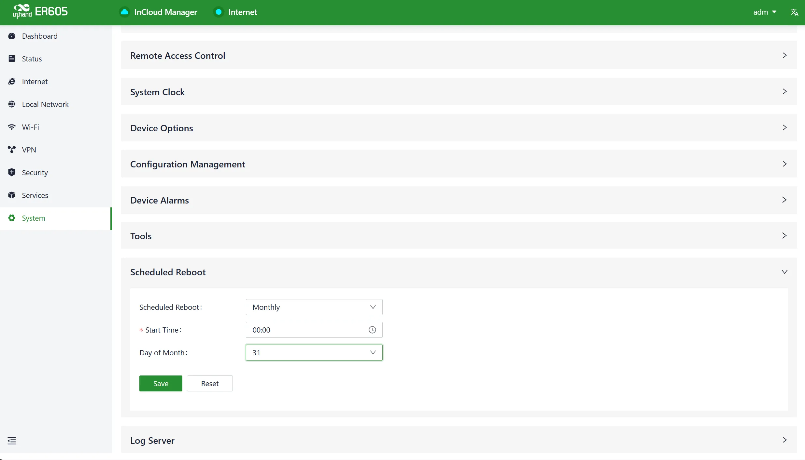

<strong>Fig. 4-52 Scheduled Reboot</strong>

#### 4.9.10 Log Server

When users enable the log file server function in the "System > Log Server" feature, the device periodically uploads log files to the specified log server.

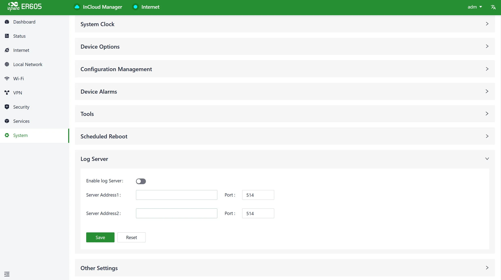

<strong>Fig. 4-53 Log Server Settings</strong>

#### 4.9.11 Other Settings

 **Web Login Management**

When a user logs in to the local interface of the device through the web and the session remains active for a certain period, it automatically logs out or disconnects to protect privacy and security. Users can configure the logout time in "System > Other Settings > Web Login Management." If the online time during a single login session on the device's web page exceeds the configured time, the system automatically logs the user out, and login is required again to continue operations.

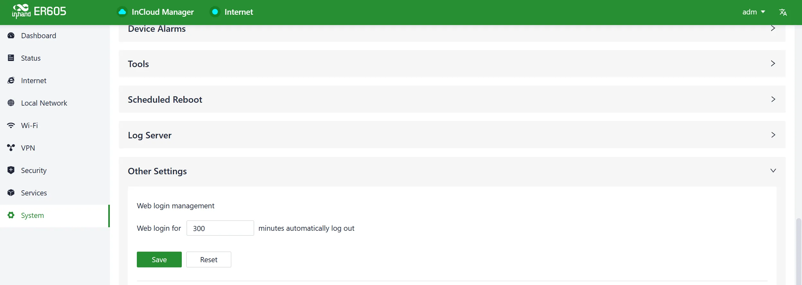

<strong>Fig. 4-54 Web Login Management</strong>

**Fast Forward**

This feature can be used to quickly forward packets, improving network performance. By default, it is turned off. When users enable this feature in "System > Other Settings > Fast Forward," the device's data forwarding rate significantly increases.

<strong>Fig. 4-55 Enable Fast Forward</strong>

**SIP ALG**

SIP ALG (Session Initiation Protocol Application Layer Gateway) is typically used as a firewall function. Users can enable this feature in "System > Other Settings > SIP ALG."

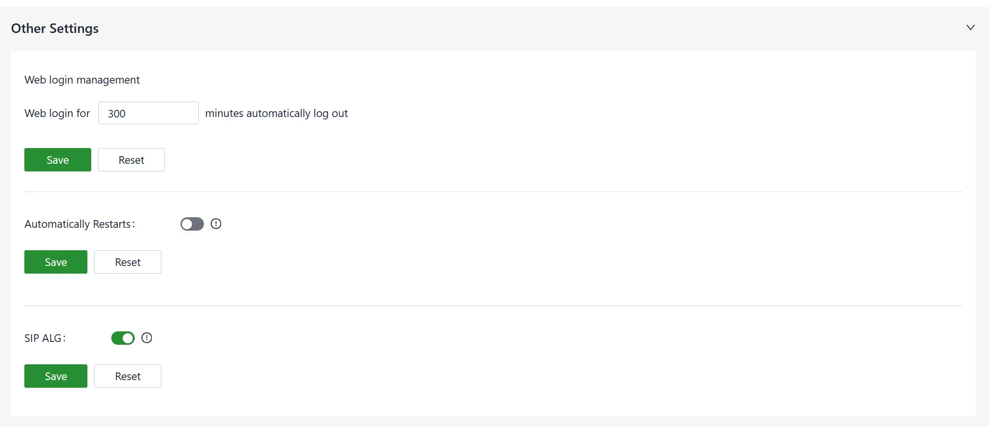

<strong>Fig. 4-56 Enable SIP ALG</strong>

> **Note**: If the connected device needs to engage in VoIP (Voice over Internet Protocol) phone communication, it is recommended to disable this function.

---

## Chapter 5 Typical Applications

### Case 1: Enterprise Branch Networking

**Scenario Description**: Medium-sized enterprise branch offices require secure, high-speed internet access with centralized cloud management. The ER605 serves as the edge gateway, providing wired/cellular dual uplinks and VPN connectivity to headquarters.

**Network Topology**:

<strong>Fig. 5-1 Enterprise Branch Networking Topology</strong>

**Device Role**: The ER605 functions as the edge gateway and router, responsible for local network access, uplink failover between wired and cellular connections, and VPN tunnel termination.

**Configuration Steps**:

1. Install the ER605 at the branch office and complete the physical installation.
2. Configure internet access via wired WAN or cellular connection as described in [Scenario 1](#scenario-1-cellular-internet-access) or [Scenario 2](#scenario-2-wired-internet-access).
3. Log in to the web interface and configure 【Local Network】 settings for the office subnet.
4. Configure 【Wi-Fi】 SSIDs for wireless client access.
5. Set up 【VPN】>【IPSec VPN】 to establish a secure tunnel to the headquarters firewall.
6. Add the device to InCloud Manager via the steps in [Scenario 3](#scenario-3-cloud-management-via-incloud-manager) for remote monitoring.

**Reference Chapters**:

- [Installation and First Use](#chapter-2-installation-and-first-use)
- [Cellular Internet Access](#scenario-1-cellular-internet-access)
- [Wired Internet Access](#scenario-2-wired-internet-access)
- [Local Network](#44-local-network)
- [Wi-Fi](#45-wi-fi)
- [IPSec VPN](#461-ipsec-vpn)
- [Cloud Management](#scenario-3-cloud-management-via-incloud-manager)

---

## Appendix Troubleshooting

### A.1 Network Connection Issues

| Symptom | Possible Cause | Troubleshooting Steps | Reference Chapter |
|---------|---------------|----------------------|-------------------|
| Cannot connect to cellular network | SIM card not inserted or poorly connected | 1. Check SIM card insertion 2. Reinsert SIM card | [SIM Card Installation](#install-sim-card) |
| Cannot connect to cellular network | APN parameter misconfiguration | 1. Verify APN parameters 2. Contact operator for correct APN | [Cellular Internet Access](#scenario-1-cellular-internet-access) |
| Cannot connect to cellular network | Weak or no signal | 1. Check antenna connections 2. Adjust device position | [Attach Antennas](#attach-antennas) |
| Cannot connect to wired network | Upstream DHCP server disabled | 1. Verify upstream device DHCP status 2. Configure static IP if needed | [Wired Internet Access](#scenario-2-wired-internet-access) |
| Cannot connect to wired network | PPPoE credentials incorrect | 1. Verify username/password with ISP 2. Reconfigure PPPoE | [Wired Internet Access](#scenario-2-wired-internet-access) |
| No internet access after connection | Link detection failure in dedicated network | 1. Disable link detection in 【Internet】>【Uplink Settings】 2. Verify subnet mask configuration | [Uplink Settings](#432-uplink-settings) |
| No internet access after connection | IP Passthrough enabled with multiple clients | 1. Verify only one client is bound in Passthrough Settings 2. Disable IP Passthrough if multiple clients are needed | [Passthrough Settings](#487-passthrough-settings) |

### A.2 Web Interface Access Issues

| Symptom | Possible Cause | Troubleshooting Steps | Reference Chapter |
|---------|---------------|----------------------|-------------------|
| Cannot open web interface | Incorrect IP address | 1. Confirm PC and device are in same subnet 2. Check device default IP 192.168.2.1 | [Access Web Interface](#access-web-interface) |
| Cannot open web interface | Browser compatibility issue | 1. Use Chrome browser 2. Clear browser cache | [Access Web Interface](#access-web-interface) |
| Forgot login password | Password lost | 1. Restore factory defaults via reset button 2. Reconfigure device | [Restore Factory Settings](#15-restore-factory-settings) |

### A.3 Cloud Management Issues

| Symptom | Possible Cause | Troubleshooting Steps | Reference Chapter |
|---------|---------------|----------------------|-------------------|
| Device offline in InCloud Manager | Cloud management disabled | 1. Check 【System】>【Cloud Management】status 2. Verify internet connectivity | [Cloud Management](#492-cloud-management) |
| Device offline in InCloud Manager | Incorrect serial number or MAC | 1. Verify device serial number and MAC address 2. Re-add device to platform | [Cloud Management Scenario](#scenario-3-cloud-management-via-incloud-manager) |

### A.4 Wi-Fi Issues

| Symptom | Possible Cause | Troubleshooting Steps | Reference Chapter |
|---------|---------------|----------------------|-------------------|
| Wi-Fi SSID not visible | SSID disabled or Wi-Fi (STA) active | 1. Check 【Wi-Fi】>【Wi-Fi List】status 2. Remove Wi-Fi (STA) if same band is needed | [Wi-Fi](#45-wi-fi) |
| Cannot connect to Wi-Fi | Incorrect password | 1. Verify password on device nameplate or configuration 2. Reconfigure SSID security settings | [Wi-Fi](#45-wi-fi) |

### A.5 VPN Issues

| Symptom | Possible Cause | Troubleshooting Steps | Reference Chapter |
|---------|---------------|----------------------|-------------------|
| VPN tunnel fails to establish | Pre-shared key mismatch | 1. Verify pre-shared key matches on both ends 2. Check IKE version consistency | [IPSec VPN](#461-ipsec-vpn) |
| VPN tunnel fails to establish | Public IP not configured correctly | 1. Configure server remote address as 0.0.0.0 2. Configure client remote address as server public IP | [IPSec VPN](#461-ipsec-vpn) |
| VPN tunnel fails to establish | VXLAN conflict with other VPN | 1. Verify VXLAN is not used with other VPN functions 2. Disable conflicting VPN features | [VXLAN VPN](#463-vxlan-vpn) |

---

## Appendix Safety Precautions

1. Use the original power adapter to avoid device damage from mismatched adapters.
2. Avoid placing the device in environments with strong electromagnetic interference. Keep a safe distance from high-power equipment. Ensure the device is stable after installation to prevent accidental drops.
3. Ensure the device's operating environment meets the temperature and humidity requirements specified in this manual.
4. Regularly inspect device cables, including Ethernet and power connections. Keep cables clean and replace if damaged.
5. When cleaning the device, avoid spraying chemical agents directly on the device surface to prevent damage to the housing or internal components. Use a soft cloth.
6. Do not disassemble or modify the device, as this poses safety risks and may void the warranty.

> **Warning**: Do not open the device enclosure. Risk of electric shock.

---

## FAQ

### Question 1: What are the differences between ER routers and regular routers?

1. Edge Router: ER routers support multiple internet access methods (wired, 4G, 5G) and feature multi-gigabit Ethernet ports and Wi-Fi 6 design. The devices support SD-WAN, out-of-band management, and cloud management.
2. Regular Router: Typically relies on fixed broadband connections such as DSL or fiber. Regular routers lack unified management platforms and advanced features such as firewall and SD-WAN.

### Question 2: Unable to connect to 4G/5G network?

1. Physical Environment: Check whether the SIM card is inserted in the correct slot and whether all cellular antennas are installed.
2. APN Settings: Ensure APN configuration matches the information provided by the operator.
3. Check Device Connectivity: Log in to the device's local interface and use the built-in ICMP tool to ping 8.8.8.8. If successful, check connectivity between the client device and the router.
4. Check SIM Card: Remove the SIM card and insert it into a phone to verify internet access.
5. Restart: Power off the router, wait a few seconds, and reconnect power.
6. Factory Reset: Perform a factory reset and attempt connection again.

### Question 3: Is the cloud platform free of charge?

InHand Networks provides network services for small and medium-sized chain organizations. When utilizing cloud platform services, licenses must be purchased for each device to access cloud-based features.

### Question 4: How to add devices to the cloud platform?

1. Register an InCloud Manager account at https://star.inhandcloud.com.
2. Log in and navigate to the "Devices" menu, click "Add," and enter the device's serial number and MAC address.
3. When a device is added for the first time, it includes a complimentary 1-year Essential license. Users can renew licenses as needed.

### Question 5: Is it possible to use the device without the cloud platform?

Yes. Most configuration tasks can be completed locally. However, features such as bulk configuration deployment, firmware upgrades, SD-WAN, and Connector require the cloud platform.

If the issue cannot be resolved using the above steps or other problems are encountered, contact InHand Networks technical support at www.inhandnetworks.com for more information.
