# Edge Router 615 Product User Manual

## Front Matter

### Declaration

Thank you for choosing our product. Before use, carefully read this user manual. Compliance with the following statements helps maintain intellectual property rights and legal compliance, and ensures that the user experience aligns with the latest product information. If there are any questions or if written permission is required, contact the technical support team at any time.

- **Copyright Statement**

  This user manual contains copyrighted content, and the copyright belongs to Beijing InHand Networks Technology Co., Ltd. and its licensors. Without written permission, no organization or individual may excerpt, copy any part of the content of this manual, or distribute it in any form.

- **Disclaimer**

  Due to ongoing updates in product technology and specifications, the company cannot guarantee that the information in the user manual is entirely consistent with the actual product. Therefore, no disputes arising from any discrepancies between the actual technical parameters and the user manual are accepted. Any changes to the product will not be notified in advance, and the company reserves the right to make the final changes and interpretations.

- **Copyright Information**

  The content of this user manual is protected by copyright laws, and the copyright belongs to Beijing InHand Networks Technology Co., Ltd. and its licensors, reserving all rights. Without written permission, the content of this manual may not be used, copied, or distributed without authorization.

### UI Conventions

The following symbols and formats are used throughout this manual.

| Symbol | Meaning | Example |
|--------|---------|---------|
| `< >` | Indicates a variable or parameter to be replaced with an actual value | `<IP_Address>` indicates a specific IP address needs to be entered |
| `" "` | Indicates a text label on the interface | Click the "Save" button |
| `→` | Indicates menu hierarchy or operation sequence | [Network] → [Cellular] |
| `[ ]` | Indicates a menu or page name | Enter the [System Settings] page |

### Technical Support

**Beijing InHand Networks Technology Co., Ltd. (Headquarters)**

Phone: 010-8417 0010

Address: 5th Floor, Building 3, No. 18 Ziyue Road, Chaoyang District, Beijing

**Chengdu Office**

Phone: 028-8679 8244

Address: 14th Floor, China Taiping Financial Tower, No. 1777 Tianfu Avenue North, Wuhou District, Chengdu, Sichuan

**Guangzhou Office**

Phone: 020-8562 9571

Address: Unit B-130, Yuanyang New Third Board Creative Park, No. 5 Tangdong East Road, Tianhe District, Guangzhou

**Wuhan Office**

Phone: 027-8716 3566

Address: Room 2001, Building 11, Paris Haoting, No. 2 Luoyu East Road, Hongshan District, Wuhan, Hubei

**Shanghai Office**

Phone: 021-5480 8501

Address: Room 1103, No. 18 Shunyi Road, Putuo District, Shanghai

### How to Use This Manual

**a) Recommended reading paths**

- First-time users: Read [Know the Device](#chapter-1-know-the-device) → [Installation and First Use](#chapter-2-installation-and-first-use) → [Common Scenario Configuration](#chapter-3-common-scenario-configuration) → [Function Description and Parameter Reference](#chapter-4-function-description-and-parameter-reference) in sequence.
- Existing device users: Refer directly to [Function Description and Parameter Reference](#chapter-4-function-description-and-parameter-reference) or [Appendix A Troubleshooting](#appendix-a-troubleshooting).
- Cloud management users: Refer to [Scenario 4: Cloud Management](#scenario-4-cloud-management) in [Common Scenario Configuration](#chapter-3-common-scenario-configuration).

**b) Task-based quick reference**

| Task | Chapter | Estimated Time |
|------|---------|----------------|
| Install and power on the device | [Installation and First Use](#chapter-2-installation-and-first-use) | About 10 minutes |
| Access the Internet via wired connection | [Scenario 1: Wired Internet Access](#scenario-1-wired-internet-access) | About 5 minutes |
| Access the Internet via cellular network | [Scenario 2: Cellular Internet Access](#scenario-2-cellular-internet-access) | About 5 minutes |
| Connect to an existing Wi-Fi network | [Scenario 3: Wireless Client Access](#scenario-3-wireless-client-access) | About 5 minutes |
| Configure cloud management | [Scenario 4: Cloud Management](#scenario-4-cloud-management) | About 10 minutes |
| View device status and traffic | [Function Description and Parameter Reference](#chapter-4-function-description-and-parameter-reference) | As needed |
| Troubleshoot network issues | [Appendix A Troubleshooting](#appendix-a-troubleshooting) | As needed |

---

## Chapter 1 Know the Device

### 1.1 Overview

The ER615 is a next-generation 5G edge router developed by InHand Networks for commercial networking applications. It transforms device interconnectivity into reality and serves as a high-speed gateway for device informatization. The device integrates 4G/5G wireless networks with various broadband services, providing high-speed and secure network access for diverse industries. Users can obtain uninterrupted internet connectivity anytime and anywhere, while benefiting from comprehensive security features and exceptional wireless services.

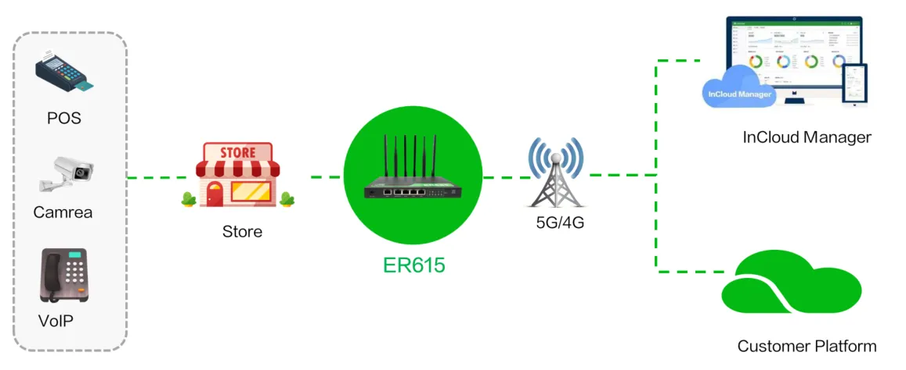

<strong>Fig 1-1 ER615 Application Scenario</strong>

### 1.2 LED Indicators

| Indicator | Status | Meaning |
|-----------|--------|---------|
| System | Off | Power off |
| | Steady red | System booting in progress |
| | Blinking red | System malfunction detected |
| | Blinking yellow | System is upgrading |
| | Blinking green | System is running smoothly |
| Network | Off | Network not connected |
| | Blinking red | Cellular network connecting |
| | Steady green | Cellular network connected |
| | Blinking yellow | Wired network connecting |
| | Steady yellow | Wired network connected |
| Cellular | Off | Cellular disabled |
| | Steady red | Poor signal quality |
| | Steady yellow | Good signal quality |
| | Steady green | Excellent signal quality |
| Wi-Fi 2.4G | Off | 2.4G Wi-Fi disabled |
| | Steady green | Working normally |
| | Blinking green | Working abnormally |
| Wi-Fi 5G | Off | 5G Wi-Fi disabled |
| | Steady yellow | Working normally |
| | Blinking yellow | Working abnormally |

**Network status indicator priority rules:**

1. If both wired and cellular connections are functioning normally, the indicator displays steady yellow (wired).
2. If only one type of network connection is working, the indicator displays the status of the active connection.
3. If no network connection exists, the indicator displays red.

### 1.3 Restore Factory Defaults

<strong>Fig 1-2 Reset Button Location</strong>

To restore factory default settings using the Reset button:

1. Power on the device while holding down the Reset button for 10 seconds until the System indicator light is solid yellow.
2. Release the Reset button. The System indicator light will start flashing yellow.
3. Press the Reset button again until the System indicator light remains solid yellow.

### 1.4 Default Settings

| No. | Function | Default Settings |
|-----|----------|------------------|
| 1 | Cellular Dialing | Default dialing is set to "SIM1" |
| 2 | Wi-Fi | 1. Wi-Fi 2.4G access point enabled, SSID: Prefixed with "ER615-", followed by the last 6 digits of the wireless MAC address. 2. Wi-Fi 5G access point enabled, SSID: Prefixed with "ER615-5G-", followed by the last 6 digits of the wireless MAC address. 3. The authentication method is WPA2-PSK. 4. The password for both is the last 8 digits of the serial number. |
| 3 | Ethernet | 1. Enable all 4 LAN ports. 2. IP Address: 192.168.2.1 Subnet Mask: 255.255.255.0 3. DHCP server enabled, with an address pool from 192.168.2.2 to 192.168.2.100 for automatic IP address assignment to connected devices. |
| 4 | Network Access Control | Local HTTP and HTTPS are enabled with port numbers 80 and 443 respectively. Disable access from the cellular network. |
| 5 | Username/Password | Refer to the device nameplate for login credentials. |

---

## Chapter 2 Installation and First Use

### 2.1 Pre-Installation Preparation

**Environment requirements**

| Item | Requirement |
|------|-------------|
| Power supply | Original power adapter included in the package |
| Antennas | 4G/5G cellular antennas and Wi-Fi antennas |
| SIM card | Standard SIM card (required for cellular access) |
| PC | With Ethernet port and web browser for management |
| Cables | RJ45 Ethernet cable |

> **Caution**: Use the original power adapter to avoid device damage caused by mismatched power supplies.
>
> **Caution**: Avoid placing the device in environments with strong electromagnetic interference. Maintain a safe distance from high-power equipment.
>
> **Caution**: When inserting or removing a SIM card, disconnect the power to prevent data loss or device damage.

### 2.2 Installation Guide

**Device connection and first login**

1. Install the 4G/5G and Wi-Fi antennas and insert the SIM card.
2. Connect the power cable and an Ethernet cable; connect any LAN port to the PC.
3. Configure the PC's IP address to be on the same subnet as the edge router.

<strong>Fig 2-1 PC IP Address Configuration</strong>

The device's LAN port has DHCP Server functionality enabled by default. Once the PC has automatically obtained an IP address, ensure that the PC and router are in the same address range. If the PC fails to obtain an IP address automatically, configure it with a static IP address and the following parameters:

- IP Address: `192.168.2.x` (choose an available address within the range of 192.168.2.2 to 192.168.2.254)
- Subnet Mask: `255.255.255.0`
- Default Gateway: `192.168.2.1`
- DNS Servers: `8.8.8.8` (or the ISP's DNS server address)

4. Enter the default device address `192.168.2.1` in the browser's address bar. Enter the username and password (refer to the device nameplate for login credentials) to access the device's web management interface. If the page shows a security warning, click "Hide" or "Advanced" and select "Proceed" to continue.

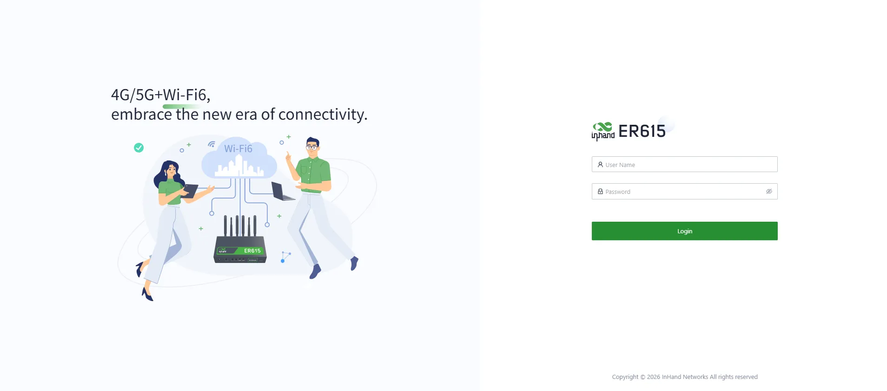

<strong>Fig 2-2 Device Web Login Page</strong>

### 2.3 Quick Check

After installation is complete, verify the following items:

- [ ] The device is powered on and the System indicator is blinking green.
- [ ] The cellular and Wi-Fi antennas are securely installed.
- [ ] The SIM card is correctly inserted (if cellular access is required).
- [ ] The PC has obtained an IP address in the `192.168.2.x` range.
- [ ] The web management interface is accessible at `192.168.2.1`.

---

## Chapter 3 Common Scenario Configuration

### Scenario 1: Wired Internet Access

**Goal**: Access the Internet through a wired broadband connection.

**Prerequisites**: The device is powered on; the WAN port is connected to the upstream network via an Ethernet cable; the PC is connected to a LAN port.

**Estimated Time**: About 5 minutes.

**Steps**:

1. Log in to the web management interface at `192.168.2.1`.
2. Navigate to [Internet] → [Uplink Table].
3. Locate the WAN1 interface and click "Edit".
4. Select the connection method:
   - **DHCP**: Default. The device obtains an IP address automatically.
   - **Static IP**: Manually enter the IP address, subnet mask, gateway, and DNS provided by the ISP.
   - **PPPoE**: Enter the broadband username and password.
5. Click "Save".
6. (Optional) To add a second WAN connection, click "Add" and select WAN2. Note that the LAN1 interface will switch to WAN2.

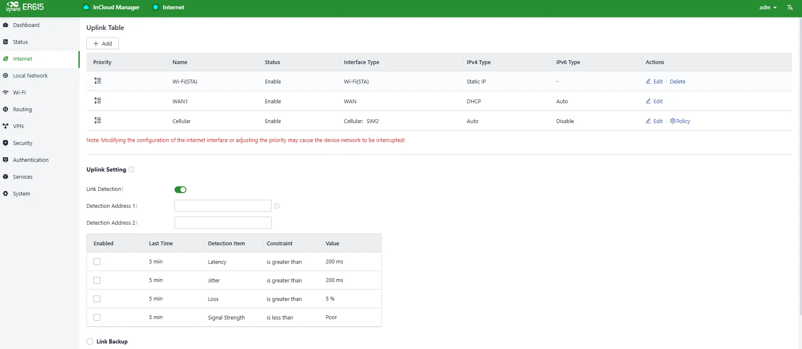

<strong>Fig 3-1 Uplink Table Interface</strong>

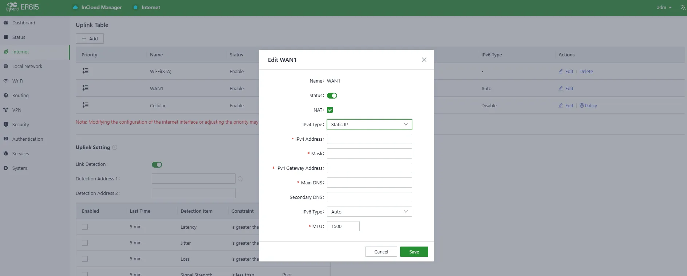

<strong>Fig 3-2 Static IP Configuration</strong>

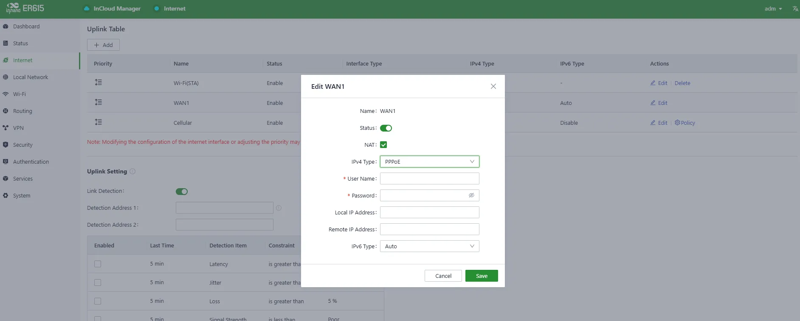

<strong>Fig 3-3 PPPoE Configuration</strong>

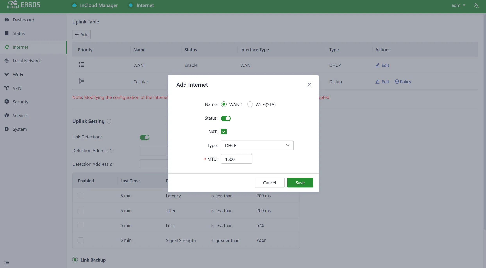

<strong>Fig 3-4 Adding the WAN2 Interface</strong>

**Verification**:

1. Check the Network indicator status.
2. Access an external website from the PC.

**Common Issues**:

- Cannot access the Internet: Verify the WAN cable connection and confirm the correct parameters with the ISP.
- After adding WAN2, LAN1 becomes unavailable: This is by design. Deleting WAN2 restores LAN1.
- After deleting WAN2, all configuration related to the WAN2 interface, including static routes, inbound/outbound rules, port forwarding, policy routing, and traffic shaping settings, will be removed.

### Scenario 2: Cellular Internet Access

**Goal**: Access the Internet via a 4G/5G cellular network.

**Prerequisites**: The SIM card is inserted; cellular antennas are installed; the device is powered on.

**Estimated Time**: About 5 minutes.

**Steps**:

1. Insert the SIM card and install cellular antennas before powering on the device.
2. Log in to the web management interface.
3. Navigate to [Internet] → [Uplink Table].
4. Select the "Cellular" interface and click "Edit".
5. Configure APN parameters (obtain from the operator if necessary).
6. Click "Save" and wait for the connection to establish.
7. (Optional) Configure traffic policy: Click "Policy" on the Cellular interface to set threshold actions.

<strong>Fig 3-5 Cellular Interface Configuration</strong>

<strong>Fig 3-6 SIM Card Policy Configuration</strong>

**Traffic policy actions:**

1. **Notification**: Generates an event when traffic reaches the threshold but does not stop forwarding regular business traffic.
2. **Cloud Management Only**: Generates an event when traffic reaches the threshold, allowing only the forwarding of cloud-based management traffic while blocking access to the Internet for regular business traffic.
3. **Switch the SIM card**: Generates an event when traffic reaches the threshold and switches to another SIM card for Internet access.

> **Caution**: In certain dedicated network scenarios, it may be necessary to manually disable the "Link Detection" function under [Internet] → [Uplink Settings] to prevent cellular connectivity issues caused by unsuccessful detection.
>
> **Caution**: In some cases, manual configuration of the subnet mask for the cellular interface may be required to ensure the proper functioning of the ARP (Address Resolution Protocol) feature.

**Verification**:

1. Check the Cellular indicator signal strength (green/yellow/red).
2. Check the Network indicator for cellular connection status.
3. Access an external website or use the Ping tool in [System] → [Tools] → [Ping].

**Common Issues**:

- No connection: Verify SIM card insertion and APN settings.
- Signal weak or no signal: Check antenna connection and adjust device position.

### Scenario 3: Wireless Client Access

**Goal**: Connect the ER615 to an existing Wi-Fi network as a client.

**Prerequisites**: The device is powered on; the target Wi-Fi SSID and password are known.

**Estimated Time**: About 5 minutes.

**Steps**:

1. Log in to the web management interface.
2. Navigate to [Internet] → [Uplink Table].
3. Click "Add" and select "Wi-Fi (STA)".
4. Enter the SSID name and password of the target access point.
5. Click "Save".

<strong>Fig 3-7 Adding the Wi-Fi (STA) Interface</strong>

> **Caution**: Upon adding Wi-Fi (STA), the ER615 automatically disables SSIDs in the same frequency band within the Wi-Fi settings, and the status field for those SSIDs cannot be modified.
>
> **Caution**: After removing Wi-Fi (STA), the "Status" field and SSIDs in the same frequency band within the Wi-Fi settings can be modified.
>
> **Caution**: When Wi-Fi (STA) is deleted, all configuration associated with the Wi-Fi (STA) interface, including static routes, inbound/outbound rules, port forwarding, policy routing, and traffic shaping settings, will be removed.

**Verification**:

1. Check the Uplink Table for Wi-Fi (STA) connection status.
2. Verify Internet access from connected LAN clients.

**Common Issues**:

- SSIDs in the same frequency band are automatically disabled when Wi-Fi (STA) is added.
- Deleting Wi-Fi (STA) removes associated routing and security configurations.

### Scenario 4: Cloud Management

**Goal**: Register and manage the ER615 via the InCloud Manager cloud platform.

**Prerequisites**: The device is connected to the Internet; a valid email address is available; the device serial number and MAC address are known.

**Estimated Time**: About 10 minutes.

**Steps**:

1. In a web browser (Google Chrome is recommended), enter `https://star.inhandcloud.com`. Select "InCloud Manager" to access the SaaS platform.
2. Click "Create now" to register a new platform account.
3. Log in to InCloud Manager with the registered credentials.
4. Navigate to [Devices] and click "Add".
5. Enter the device name, serial number, and MAC address.
6. Click "Finish" to complete the addition.

<strong>Fig 3-8 Creating an InCloud Manager Account</strong>

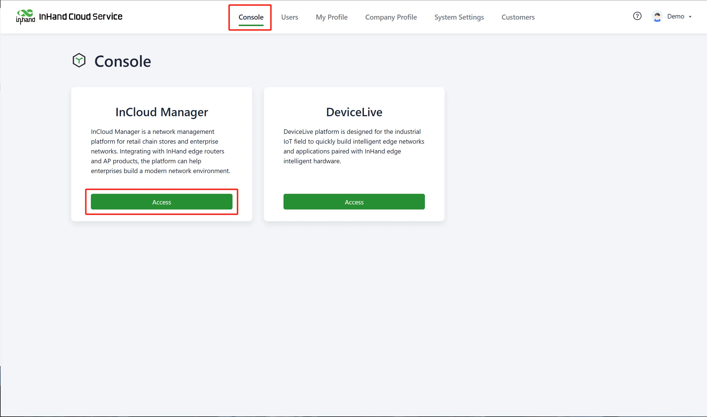

<strong>Fig 3-9 Selecting the SaaS Service</strong>

<strong>Fig 3-10 Adding a Device to InCloud Manager</strong>

**Verification**:

1. The device appears in the InCloud Manager device list.
2. The dashboard displays device status, interface status, and traffic statistics.

**Common Issues**:

- Device not online: Verify the device has Internet access and that cloud management is enabled in [System] → [Cloud Management].
- License expired: Renew the license through the "License" menu. When a device is added to a platform account for the first time, a 1-year Essential license is automatically assigned.

---

## Chapter 4 Function Description and Parameter Reference

### 4.1 Dashboard and Device Status

#### 4.1.1 Dashboard

In the "Devices" section of InCloud Manager, click the "Device Name" to access the device's details page. Click [Dashboard] in the left menu to access the dashboard interface. Essential device information, interface status, traffic statistics, cellular signal strength, and the number of connected Wi-Fi devices can be viewed.

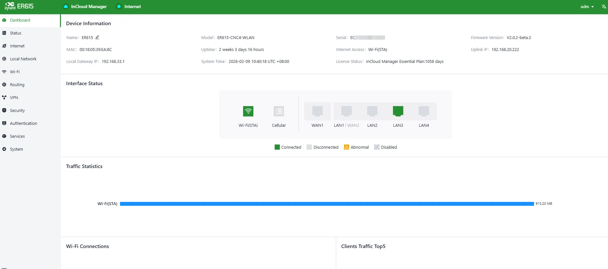

<strong>Fig 4-1 Dashboard Interface</strong>

#### 4.1.2 Data Usage

In this function, the traffic usage and historical data of various upstream links can be viewed.

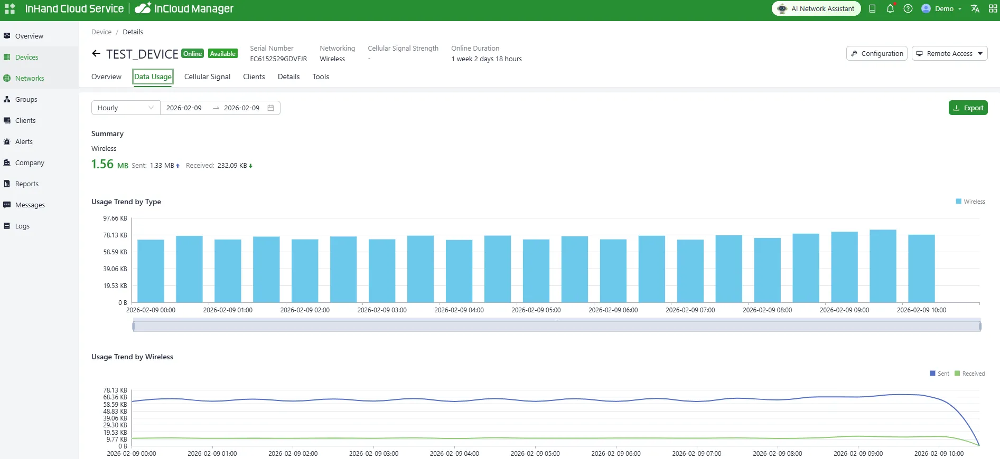

<strong>Fig 4-2 Data Usage Statistics</strong>

#### 4.1.3 Cellular Signal

In this function, cellular signal curves such as RSSI, RSRP, RSRQ, and SINR can be viewed.

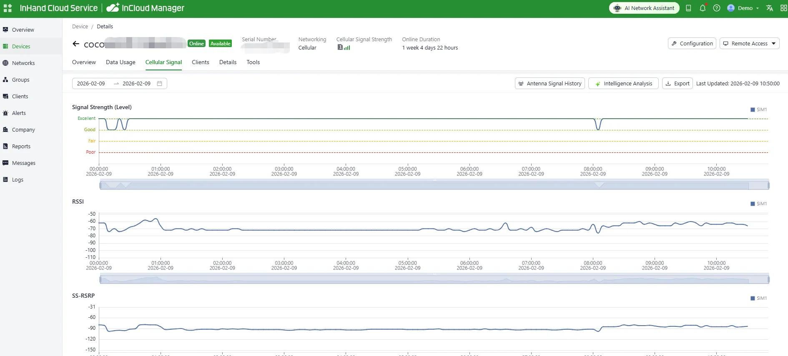

<strong>Fig 4-3 Cellular Signal Records</strong>

#### 4.1.4 Traffic Statistics

Users can monitor the usage of traffic on each upstream interface since the router was powered on through the "Dashboard > Traffic Statistics" feature. The data in traffic statistics will reset after the device is rebooted. If you need to review historical traffic records, you can access this information on the device's details page within InCloud Manager.

<strong>Fig 4-4 Traffic Statistics</strong>

#### 4.1.5 Wi-Fi Connections

In the "Dashboard > Wi-Fi Client Count" feature, the number of active SSIDs on the ER615 and the number of connected clients under each SSID can be checked.

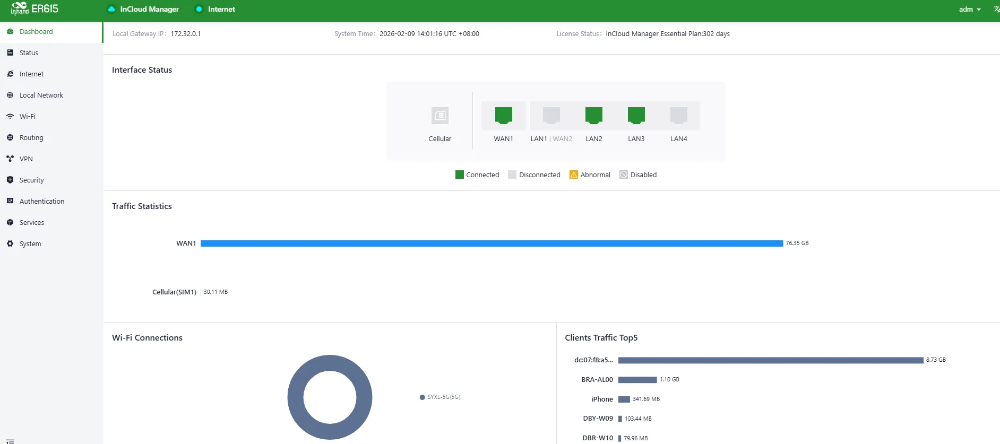

<strong>Fig 4-5 Wi-Fi Client Count</strong>

#### 4.1.6 Client Traffic Top 5

In the "Dashboard > Top 5 Client Traffic" feature, the current ranking of client traffic usage for devices connected to the router can be viewed. It displays up to 5 records, and when a client disconnects, its statistical data is cleared.

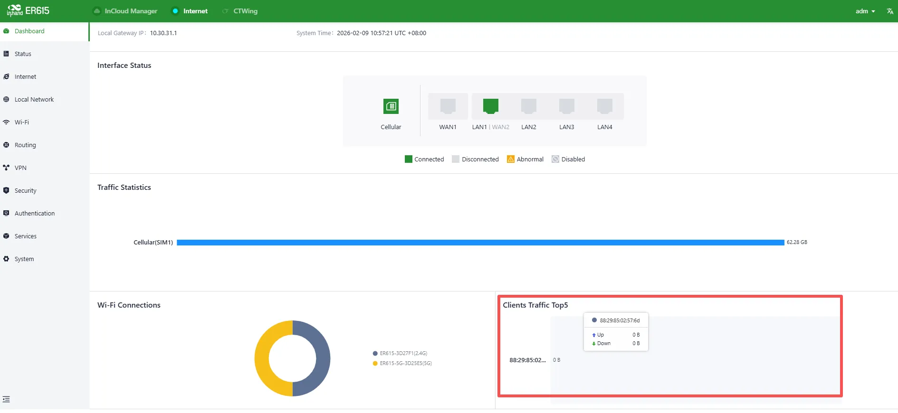

<strong>Fig 4-6 Top 5 Clients by Traffic</strong>

### 4.2 Status

Click [Status] in the left-side menu to access the status interface. Information about the device's upstream links, cellular signal, connected clients, VPN, events, logs, and more can be viewed.

#### 4.2.1 Link Monitor

The [Status] → [Link Monitoring] feature is used to check the health status of each upstream link and access information about throughput, latency, packet loss, signal strength, and more for each interface.

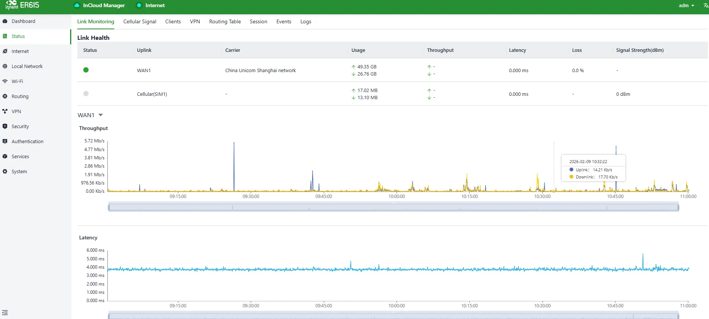

<strong>Fig 4-7 Link Monitor Interface</strong>

#### 4.2.2 Cellular Signals

The [Status] → [Cellular Signal] feature is used to check the signal strength of SIM cards under the cellular interface, along with parameters such as RSSI, SINR, RSRP, and more.

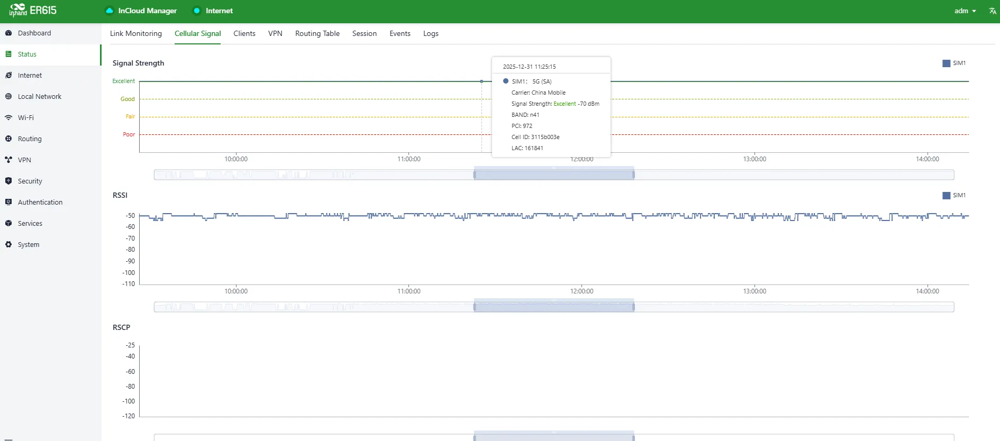

<strong>Fig 4-8 Cellular Signal Strength</strong>

#### 4.2.3 Clients

Through the [Status] → [Clients] feature, detailed information about both wired and wireless clients connected to the router can be viewed. This includes details such as names, addresses, MAC addresses, VLANs, connected subnets, traffic usage, online duration, and more.

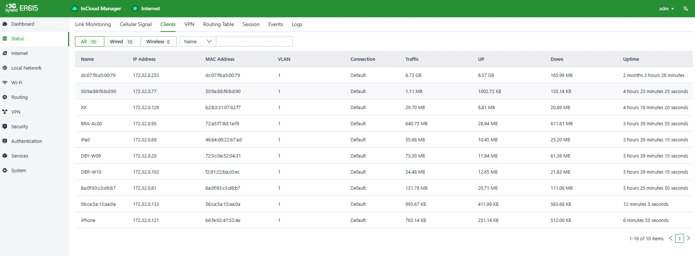

<strong>Fig 4-9 Connected Clients</strong>

#### 4.2.4 VPN

The [Status] → [VPN] feature is used to view information about IPSec VPN and L2TP VPN, including their status, traffic, and the duration of the most recent connection.

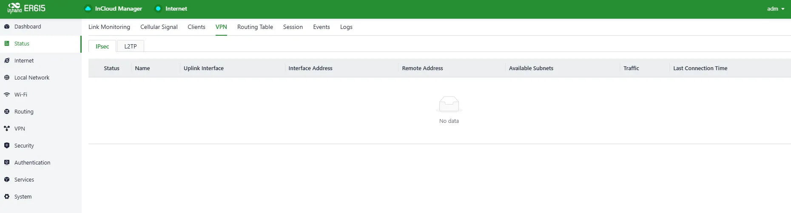

<strong>Fig 4-10 VPN Information</strong>

#### 4.2.5 Routing Table

The device's current static routes, directly connected routes, and dynamic routes can be viewed in the [Status] → [Routing Table] menu.

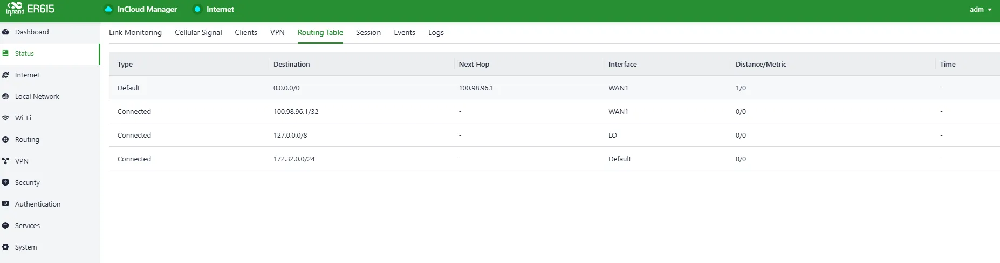

<strong>Fig 4-11 Routing Table</strong>

#### 4.2.6 Sessions

Firewall session records can be viewed through the [Status] → [Sessions] feature.

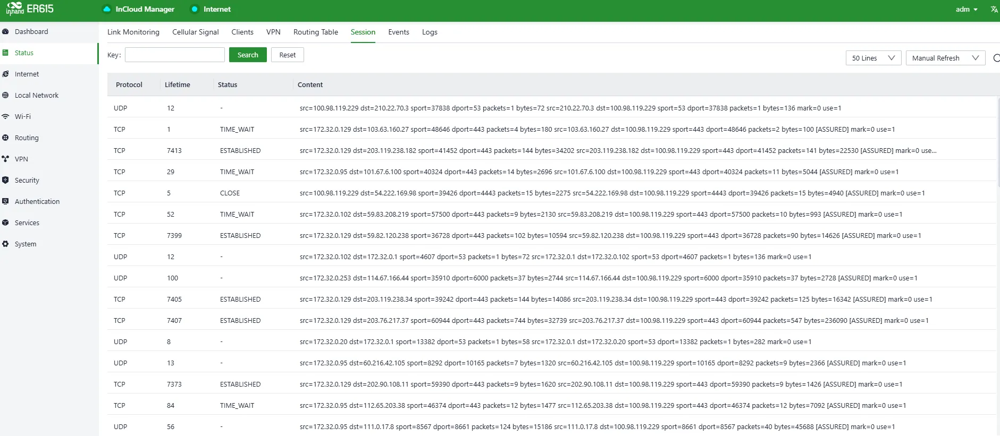

<strong>Fig 4-12 Session Records</strong>

#### 4.2.7 Events

The [Status] → [Events] feature is used to check event information related to the device's operation, helping users understand the device's operational status.

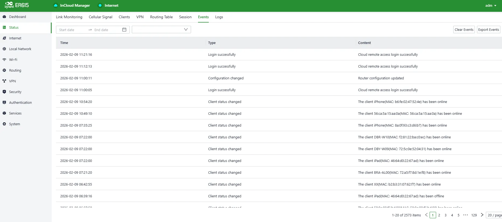

<strong>Fig 4-13 Event Types</strong>

Currently supported event types:

- Successful/Failed User Logins.
- High CPU Utilization in the Last 5 Minutes.
- High Memory Utilization in the Last 5 Minutes.
- Cellular Traffic Reaches Threshold.
- VPN Status Changes.
- Uplink Status Changes.
- Uplink Switching.
- WAN2/LAN1 Switching.
- Reboot.
- Upgrade.

#### 4.2.8 Logs

Through the [Status] → [Logs] feature, the system logs can be examined, which contain information about the device's operational history. When the device encounters issues, technical personnel can use these logs for troubleshooting and diagnosis.

<strong>Fig 4-14 Logs Information</strong>

- **Download Logs**: Download the device's operational logs.
- **Download Diagnostic Logs**: Download the device's diagnostic logs, which include system operation logs, device information, and device configurations.
- **Clear Logs**: Clear the device's operational logs; this does not clear the device's diagnostic logs.

### 4.3 Internet

The parameters and operational modes of each upstream interface can be configured under the [Internet] feature.

#### 4.3.1 Uplink Table

The WAN1 and Cellular interfaces can be edited, and WAN2 and Wi-Fi (STA) interfaces can be added, edited, or removed in the [Internet] → [Uplink Table]. The priority of each interface can be adjusted by dragging the "Priority" icon. Interfaces are arranged from top to bottom based on their priority, with higher priority interfaces taking precedence in determining the current upstream interface for device operation.

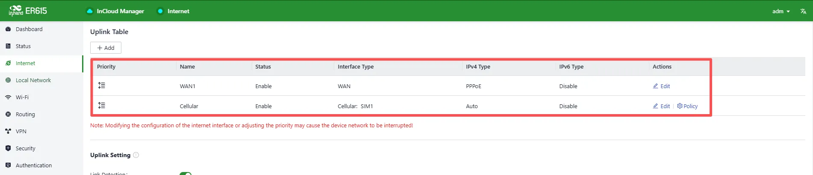

<strong>Fig 4-15 Uplink Table Interface</strong>

#### 4.3.2 Uplink Settings

Link detection settings and collaboration modes between different upstream interfaces can be configured through the [Internet] → [Uplink Settings] feature.

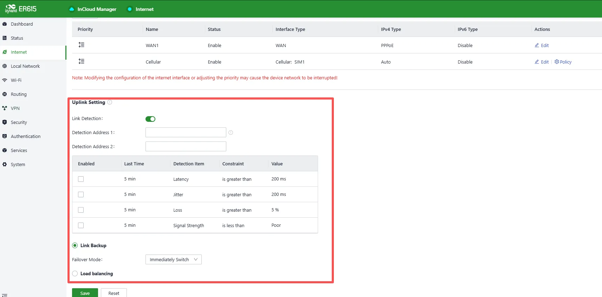

<strong>Fig 4-16 Uplink Settings Interface</strong>

**Link Detection Switch**: The device has link detection functionality enabled by default. However, in certain specialized network environments where external communication is not possible, link detection may need to be manually disabled. When link detection is turned off, latency, jitter, packet loss, signal strength, and other information for upstream interfaces will not be viewable in the [Status] menu.

**Notes**:

- Modifying settings in the Internet menu can potentially lead to a disruption in device connectivity. Exercise caution when making changes.
- When the link detection address is left empty, the default behavior is to detect the DNS address via the upstream interface. If a detection address is specified, all upstream interfaces will only detect the provided address.
- In the router's link backup mode, detection parameters can be customized, and the device switches links based on the enabled detection items. When detection items are not enabled, upstream link switching will only occur based on priority and link connectivity.
- In the device's load balancing mode, all operational upstream links forward business traffic, provided they are functioning correctly.

### 4.4 Local Network

In the [Local Network] feature, local subnets can be defined. This includes configuring the address range, VLAN ID, DHCP services, and other related parameters for the local LAN. Once the configuration is complete, these settings need to be applied to the device's LAN port through [Interface Management] or applied to the desired SSID in the Wi-Fi settings. This series of operations ensures that client devices can smoothly connect to the local network according to the planned network addresses.

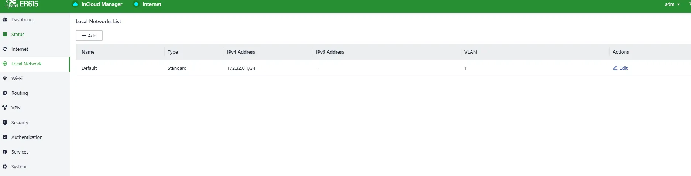

<strong>Fig 4-17 Local Network List</strong>

Click the "Add/Edit" button to add a new local network or edit an existing one.

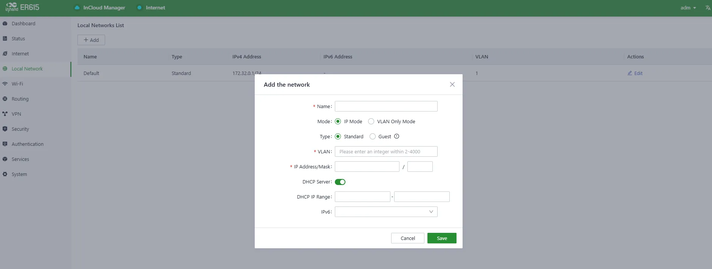

<strong>Fig 4-18 Add/Edit Local Network</strong>

- **Name**: Used to identify the network. This name can be selected to apply the network in both [Wi-Fi] and [Interface Management].
- **Mode**: Choose whether the current subnet operates in 2-layer transparent mode or 3-layer IP mode. The default is "IP mode".
- **VLAN**: Allows for the division of the local network into different virtual logical networks. The default VLAN for all interfaces and Wi-Fi is "default (VLAN1)".
- **IP Address/Subnet Mask**: The gateway address for accessing the router through the LAN port or Wi-Fi. The default is "192.168.2.1".
- **DHCP Server**: Clients connecting to the router can obtain IP addresses through this function. It is enabled by default, and the address range is generated based on the "IP Address/Subnet Mask".

**Notes**:

- The default local network cannot be deleted; only the IP address/subnet mask and DHCP server settings can be modified.
- Once a local network is added, its mode cannot be changed.
- The VLAN Only mode is designed for 2-layer transparent operation and does not require configuration of IP address/subnet mask or DHCP server settings.

### 4.5 Wi-Fi

Wi-Fi is a widely used wireless communication technology that enables computers, smartphones, tablets, and other devices to connect to the internet or a local network. Wi-Fi technology allows devices to transmit data over a certain range through wireless signals, providing the convenience of accessing networks without the need for physical connections.

The ER615 can function as an Access Point (AP) to provide multiple SSID wireless network access. Users have the flexibility to customize different SSIDs for various purposes and configurations.

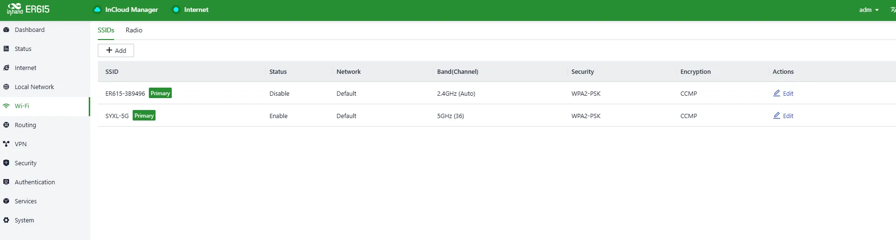

<strong>Fig 4-19 Wi-Fi List</strong>

By clicking the "Add/Edit" button under [Wi-Fi] → [Wi-Fi List], a new SSID can be added or an existing one edited.

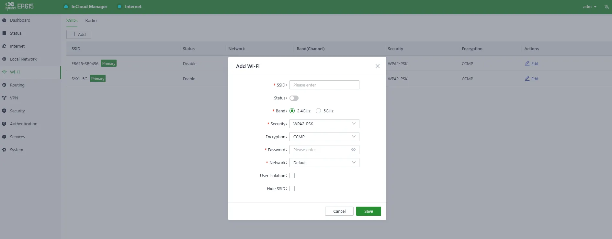

<strong>Fig 4-20 Edit SSID</strong>

**Notes**:

- The device comes with default 2.4GHz and 5GHz main SSIDs. The frequency bands of these main SSIDs cannot be modified and cannot be deleted.
- Once an SSID is added, its frequency band cannot be changed, and it will automatically use the same channel as its corresponding main SSID.
- If a Wi-Fi (STA) interface is created in the [Internet] menu with the same frequency band as an existing SSID, that SSID cannot be enabled until the Wi-Fi (STA) interface is deleted.

### 4.6 VPN

A Virtual Private Network (VPN) is an encryption technology used to establish a secure, private network connection over the public internet. It enables users to securely access private network resources over the internet from anywhere. VPNs achieve this by encrypting communication data, ensuring the confidentiality and security of the communication and preventing unauthorized access. This technology is highly valuable for connecting to corporate networks, maintaining online privacy, and accessing restricted content. VPNs have a wide range of applications, including in the corporate, personal, and mobile device sectors, making them a crucial tool for safeguarding privacy and data security.

#### 4.6.1 IPSec VPN

IPsec (Internet Protocol Security) VPN is a protocol suite designed to enhance network communication security by encrypting and authenticating data transmission. It is widely used for establishing secure remote access, site-to-site connections, and Virtual Private Networks. Click the "Add" button under [VPN] → [IPSec VPN] to add a new IPSec VPN.

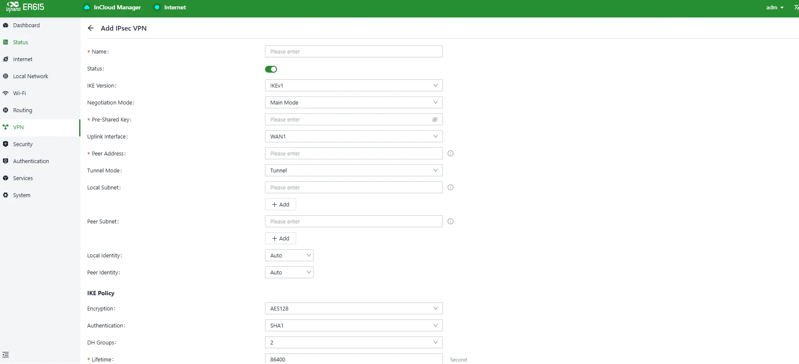

<strong>Fig 4-21 Add an IPSec VPN</strong>

Once configurations are completed at both ends, the tunnel can be established. The tunnel establishment status can be checked in the [Status] → [VPN] menu.

- **Name**: The user-assigned name for the IPSec VPN to identify it for local management purposes.
- **IKE Version**: The version of the Internet Key Exchange (IKE) protocol to be used. Supports both IKEv1 and IKEv2.
- **Pre-Shared Key**: A secret shared key that must be configured the same on both devices for authentication during IKE negotiation.
- **Internet Interface**: The upstream interface used to establish the IPSec VPN locally.
- **Tunnel Mode**: The encapsulation mode for IPSec on IP packets. Supports both tunnel mode and transport mode.
- **Peer Address**: The address of the remote endpoint with which the ER615 establishes the IPSec tunnel.

**Notes**:

When establishing a connection using IPSec VPN, by default, use the device with the public IP address as the server. The remote address on the IPSec server side needs to be configured as `0.0.0.0`, and the remote address on the IPSec client side should be set to the public IP address of the IPSec server.

- **Local Subnet**: The subnet addresses that need to communicate through the ER615 IPSec VPN tunnel.
- **Remote Subnet**: The subnet address on the other end of the tunnel that needs to communicate through the IPSec VPN tunnel.
- **IKE Policy**: Supports configuring the IKE protocol.
  - **Encryption Method**: Sets the encryption algorithm used by IKE.  
    Options: DES, 3DES, AES128, AES192, AES256 (default: AES128)
  - **Authentication Method**: Sets the authentication algorithm used by IKE.  
    Options: MD5, SHA1, SHA2-256, SHA2-384, SHA2-512 (default: SHA1)
  - **DH Group**: Configures the DH exchange parameters used during the IKE phase key negotiation.  
    Options: 1, 2, 5, 14, 15, 16, 19, 20
  - **Timeout**: Sets the IKE SA (Security Association) lifetime, defaulting to 86400 seconds.
- **IPSec Policy**: Configures IPSec parameters.
  - **Security Protocol**: Sets the security protocol used by the ESP protocol.  
    Options: DES, 3DES, AES128, AES192, AES256 (default: AES128)
  - **Encryption Method**: Sets the encryption algorithm used by the ESP protocol.  
    Options: MD5, SHA1, SHA2-256, SHA2-384, SHA2-512 (default: SHA1)
  - **PFS Group**: In IPSec, during the negotiation of a security policy, an additional key exchange is performed in Phase 2 to enhance communication security.  
    Options: 1, 2, 5, 14, 15, 16, 19, 20
  - **Timeout**: Sets the IPSec SA aging time, default is 86400 seconds.

#### 4.6.2 L2TP VPN

The Layer 2 Tunneling Protocol (L2TP) is a Layer 2 VPN protocol designed to establish secure point-to-point or site-to-site Virtual Private Network connections. It is commonly used for remote access and branch office connectivity, creating secure communication channels to protect the privacy and integrity of data transmission.

 **Work as a Client**

The ER615 can act as an L2TP client and establish a tunnel with a remote L2TP server. Click [VPN] → [L2TP VPN] → [Client], and use the "Add" button to configure an L2TP client.

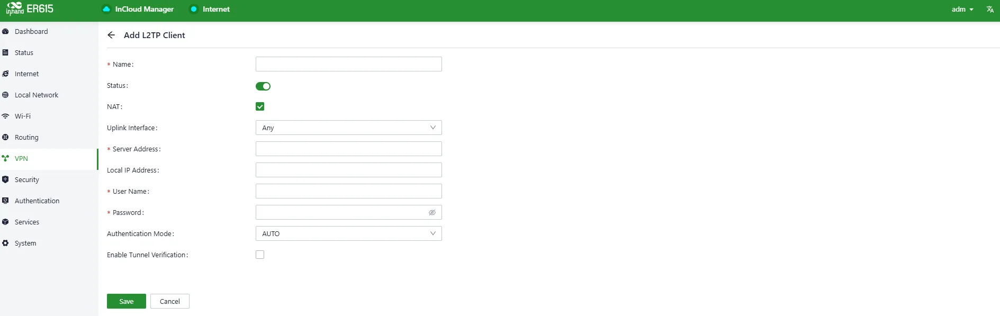

<strong>Fig 4-22 L2TP Client Parameters</strong>

- **Name**: The name of the L2TP client for local identification.
- **Status**: The switch to enable or disable the L2TP client tunnel.
- **NAT**: The switch for NAT functionality when forwarding with the L2TP client.
- **Upstream Interface**: The upstream interface used for communication between the L2TP client and the server.
- **Server Address**: The communication address of the remote L2TP server.
- **Username/Password**: Usernames and passwords that need to be configured the same on both ends during L2TP negotiation.
- **Authentication Mode**: Sets the L2TP authentication mode.
- **Enable Tunnel Authentication**: When enabled, both ends need to configure the same username and password for tunnel authentication.

**Work as a Server**

The L2TP server is typically deployed at the corporate headquarters to provide remote access to mobile offices or branch locations. Click [VPN] → [L2TP VPN] → [Server] to enter the editing page for the L2TP server.

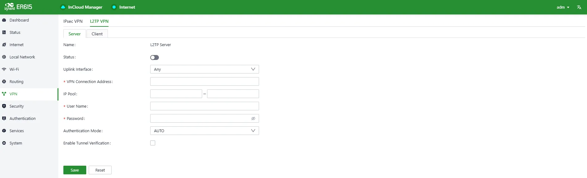

<strong>Fig 4-23 L2TP Server Parameters</strong>

- **Name**: The name of the L2TP server, not editable.
- **Status**: The on/off switch for the L2TP server function, default is off.
- **Upstream Interface**: The upstream interface used by the L2TP server.
- **VPN Communication Address**: The gateway address for L2TP clients, which can be assigned to devices within the IP address pool.
- **Address Pool**: The IP address pool used for communication when L2TP clients connect.
- **Username/Password**: Usernames and passwords that need to be the same on both ends for L2TP negotiation.
- **Authentication Mode**: Sets the L2TP authentication mode.
- **Enable Tunnel Verification Function**: When enabled, the usernames/passwords for tunnel verification on both ends need to be the same.

#### 4.6.3 VXLAN VPN

VXLAN (Virtual Extensible LAN) is essentially a tunneling technology that establishes a logical tunnel over an IP network between source and target network devices. It accomplishes data transmission and forwarding by encapsulating user data packets. Click the "Add" button under [VPN] → [VXLAN VPN] to create a new VXLAN VPN.

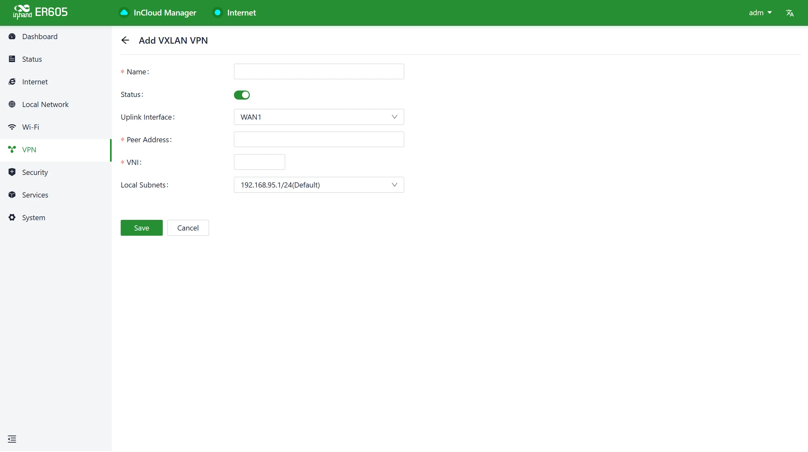

<strong>Fig 4-24 Add a VXLAN VPN</strong>

- **Name**: The name for this VXLAN VPN network.
- **Upstream Interface**: The outbound interface used to establish a VXLAN tunnel with other devices.
- **Peer Address**: The IP address of the peer device with which this device needs to establish a VXLAN VPN network.
- **VNI**: The VXLAN Network Identifier, where each VNI represents a different tenant or network segment.
- **Local Subnet**: The address range assigned to local client devices when they connect.

**Notes**:

VXLAN cannot be used with other VPN functions and IP Passthrough functions at the same time.

### 4.7 Security

In the [Security] menu, advanced features related to firewalls, policy routing, and traffic shaping can be configured.

#### 4.7.1 Firewall

The firewall currently includes functions such as inbound rules, outbound rules, port forwarding, MAC address filtering, and more.

**Inbound Rules/Outbound Rules**

Traffic in/out control based on interfaces can be implemented through the [Security] → [Firewall] → [Outbound Rules/Inbound Rules] feature. For example, if a user is subjected to a significant amount of attacks from a specific source IP address, inbound firewall rules can be used to restrict traffic from that IP address.

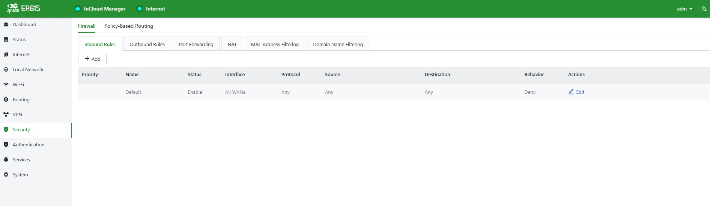

<strong>Fig 4-25 Firewall Interface</strong>

Furthermore, outbound firewall rules can be utilized to restrict certain users' access to external networks. Inbound and outbound rules share the same configurable content, with the only distinction being the default rules.

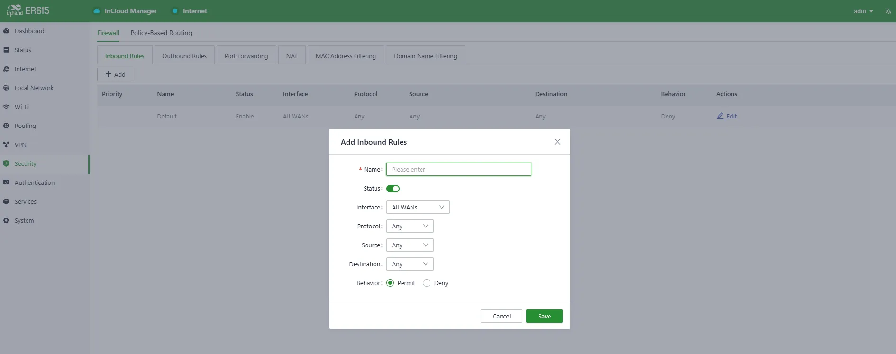

<strong>Fig 4-26 Add an Inbound/Outbound Rule</strong>

- **Name**: The name of the inbound/outbound rule for local identification.
- **Status**: Rule function switch.
- **Interface**: For outbound rules, specifies the upstream interface where traffic leaves the router. For inbound rules, specifies the upstream interface where traffic enters the router.
- **Protocol**: Matches traffic based on the protocol type, with options like Any, TCP, UDP, ICMP, or custom.
- **Source**: Matches the source address for traffic, supporting custom, with the default as Any.
- **Destination**: Matches the destination address for traffic, supporting custom, with the default as Any.
- **Action**: The action taken for matching traffic in inbound/outbound rules, supporting allow and deny.
- **Inbound Rules**: Traffic management rules for external network accessing the router, with the default as deny all.
- **Outbound Rules**: Traffic management rules for traffic going out through the router, with the default allowing all.

The priority of inbound and outbound rules can be adjusted.

**Port Forwarding**

Port forwarding, also known as port mapping or port redirection, is used to redirect network packets from one network port (or address) to another network port or address. Port forwarding rules can be configured under [Security] → [Firewall] → [Port Forwarding]. When external traffic accesses a specific port on the router, the device forwards the data to the corresponding port of an internal client, enabling external access to services inside the router.

For example, when a user needs to access the service on port 1024 of the internal client at `192.168.2.10` from the external network, this client's port can be mapped to port 1024 under the WAN1 interface. External users only need to enter `https://<WAN1_IP>:1024` in their browser to access the target device's data, where the WAN1 IP is the IP address of the WAN1 interface.

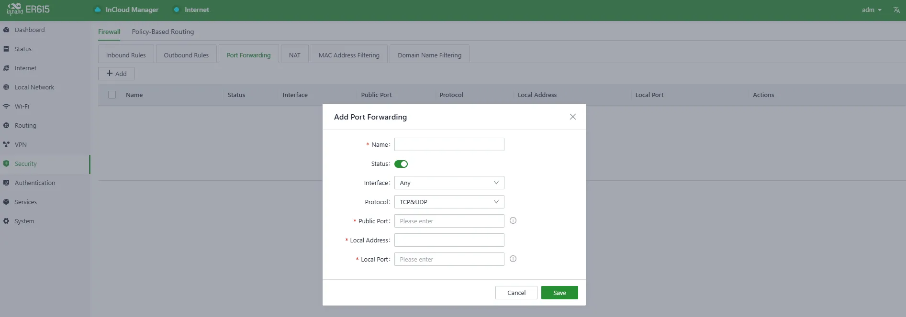

<strong>Fig 4-27 Add a Port Forwarding Rule</strong>

- **Name**: The name of the port forwarding rule, used for local identification.
- **Status**: The on/off switch for the port forwarding rule.
- **Interface**: The upstream interface that provides mapping functionality for internal clients. The upstream interface needs public IP address support.
- **Protocol**: The protocol type of the traffic for port mapping, supports TCP, UDP, and TCP & UDP.
- **Public Port**: The port number on the upstream interface that provides mapping.
- **Local Address**: The address of the target device located under the router that the external network needs to access.
- **Local Port**: The port of the target device that the external network needs to access. It needs to be consistent with the public port input range.

**MAC Address Filter**

MAC address filtering involves allowing or disallowing devices in a MAC address list to access the Internet, which means controlling LAN devices' Internet access requests through MAC address filtering on the router. MAC address filtering rules can be configured in [Security] → [Firewall] → [MAC Address Filtering].

Multiple MAC addresses can be created in the list, address descriptions can be added, and it can be set to allow only the MAC addresses to access the network (whitelist), or MAC addresses in the list can be blocked from accessing the network (blacklist).

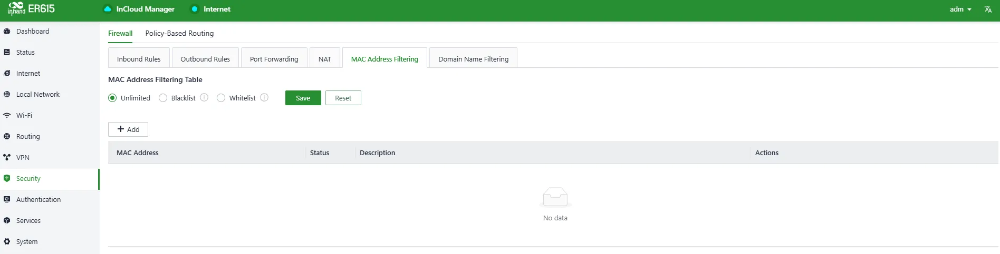

<strong>Fig 4-28 Add a MAC Address Filter Rule</strong>

#### 4.7.2 Policy-Based Routing

Policy routing is a feature that allows users to create policies based on their specific needs, enabling them to route different data flows through different links. This improves the flexibility and control of routing decisions, enhances link utilization efficiency, and reduces enterprise costs. Click the "Add" button under [Security] → [Policy Routing] to create a new policy routing rule.

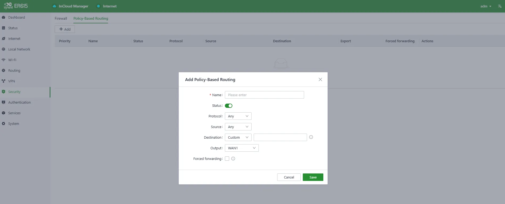

<strong>Fig 4-29 Add a Policy Routing Rule</strong>

> **Caution**: The source address and destination address in a policy routing rule cannot both be set as "Any".

### 4.8 Services

#### 4.8.1 Interface Management

Local networks allowed through a specific interface and the interface's speed can be configured in the [Services] → [Interface Management] function.

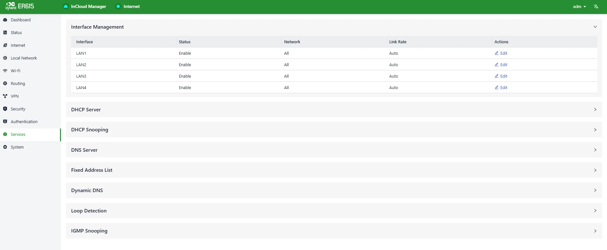

<strong>Fig 4-30 Interface Management</strong>

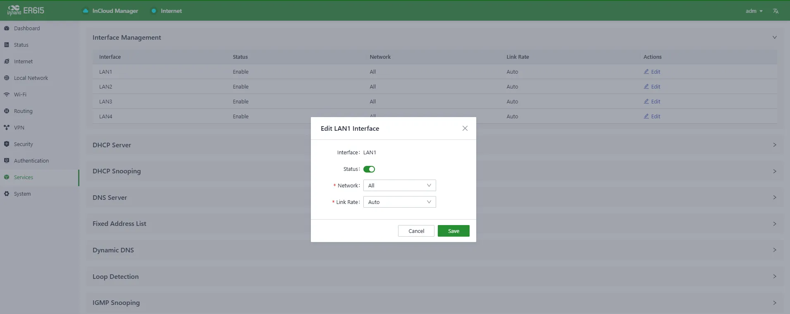

<strong>Fig 4-31 Edit Interface</strong>

#### 4.8.2 DHCP Server

The DHCP (Dynamic Host Configuration Protocol) service operates in a client/server communication mode, where clients request IP addresses from servers, and servers respond to these requests by assigning IP addresses dynamically to clients. The DHCP server's IP address pool can be configured using the [Services] → [DHCP Server] feature.

<strong>Fig 4-32 DHCP Server Interface</strong>

**Notes**:

- The device's DHCP service is generated based on the network information in the local network. If a local subnet is removed from the "Local Network List," the DHCP Server for that local subnet will also be deleted.
- Local network entries need to be set in "IP" mode for the DHCP server function to take effect. Networks in "VLAN Only" mode are not within the selectable range.

#### 4.8.3 DNS Server

DNS (Domain Name System) servers are a crucial network component responsible for translating human-readable domain names (e.g., `www.example.com`) into computer-understandable IP addresses (e.g., `192.168.1.1`). DNS servers act as the address book of the Internet, helping computers and devices find the locations of other devices and ensuring that information can be correctly delivered across the network.

When DNS server addresses are not set in [Services] → [DNS Server], the DNS addresses obtained from the device's upstream interface will be used for domain name resolution. When DNS server addresses are configured, the configured DNS addresses will be used for domain name resolution.

#### 4.8.4 Fixed Address List

The [Services] → [Fixed Address List] function is used to allocate a fixed IP address to a device based on its MAC address. This means that the device will consistently receive the same IP address every time it connects to the ER615.

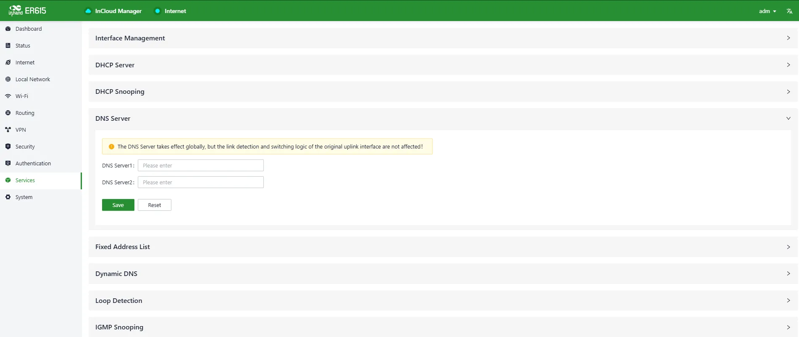

<strong>Fig 4-33 Fixed Address List</strong>

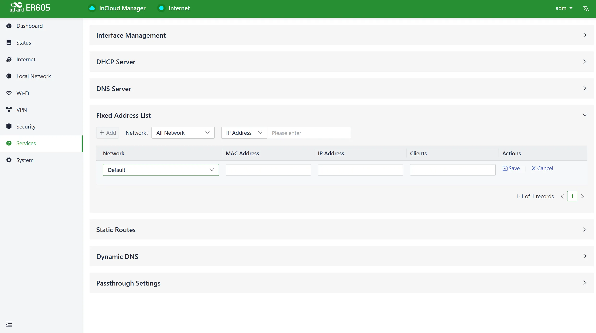

<strong>Fig 4-34 Add a Fixed IP Address</strong>

> **Caution**: The available addresses for allocation must fall within the address range of the local network in IP mode, or else the configuration will not take effect.
>
> **Caution**: When the local network is deleted, all fixed address allocation rules within the local network's address range will be removed.

#### 4.8.5 Dynamic DNS

Dynamic DNS (Dynamic Domain Name System) is used to automatically update the name server content in the domain system. According to Internet domain rules, domain names are typically associated with fixed IP addresses. Dynamic DNS technology allows users with dynamic IP addresses to have a fixed name server. This enables external users to connect to the URL of users with dynamic IP addresses through regular updates.

The Dynamic DNS server address can be manually configured under the [Services] → [Dynamic DNS] feature.

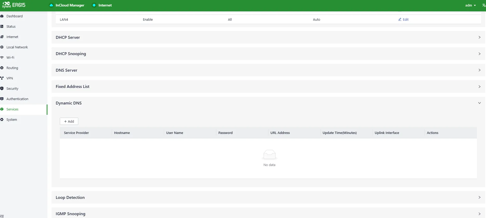

<strong>Fig 4-35 Add a Dynamic DNS Service</strong>

- **Service Provider**: Provided by the Dynamic DNS service operator. Options include dyndns, 3322, oray, no-ip, or a custom option (requires a URL).
- **Hostname**: Register for a hostname by clicking on the URL below the service provider.
- **Username**: Register for a username by clicking on the URL below the service provider.
- **Password**: The password set during registration.

#### 4.8.6 Passthrough Settings

The IP Passthrough feature can be enabled through [Services] → [Passthrough Settings]. Once enabled, client devices can obtain the upstream interface address of the ER615.

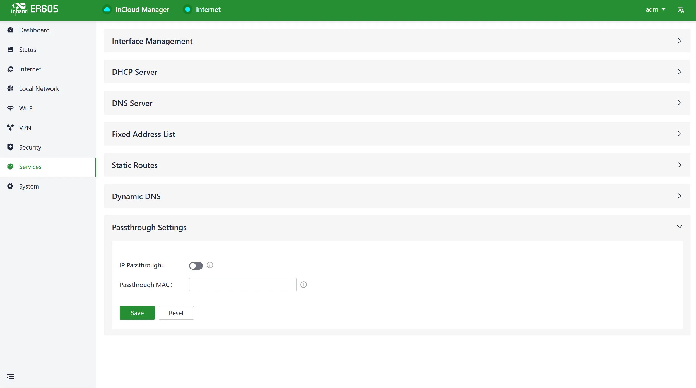

<strong>Fig 4-36 Enable IP Passthrough</strong>

- **Passthrough MAC**: Only clients bound to this MAC can obtain the upstream interface address of the device.

> **Caution**: When IP Passthrough mode is enabled, only one client can access the public network. Static routing, VPN, policy-based routing, SD-WAN Overlay, and cloud connectivity will be affected.
>
> **Caution**: When accessing client devices, inbound rules need to be released.
>
> **Caution**: The router can still be accessed via the default subnet's IP address.

### 4.9 System

In the [System] menu, settings related to cloud management, remote access control, clock settings, device options, configuration management, device alarms, tools, and log servers, among other functions, can be configured.

#### 4.9.1 Administrator Management

Refer to the device nameplate for the username and password. To ensure device security, it is recommended to change the password. This can be done by clicking on "adm" in the top navigation bar and selecting "Change Password" from the dropdown menu.

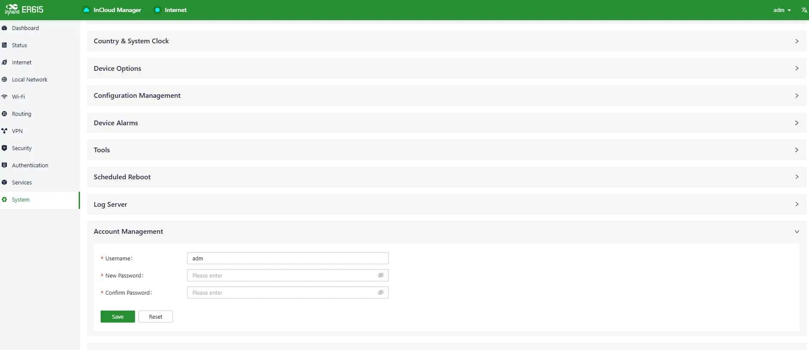

<strong>Fig 4-37 Modify Password</strong>

#### 4.9.2 Cloud Management

The InCloud Service (`star.inhandcloud.com`) is a cloud platform developed by InHand Networks to address the challenges faced by enterprise networks, such as slow deployment, complex operations, and poor user experiences. This platform integrates features like zero-touch deployment, intelligent operations and maintenance, security protection, and excellent user experience capabilities. Once devices are connected to the cloud platform, remote management, batch configuration, traffic monitoring, and other operations can be performed through the platform.

The ER615 automatically connects to the InCloud Service after establishing an Internet connection by default. If the cloud management function is not required, it can be disabled manually in [System] → [Cloud Management].

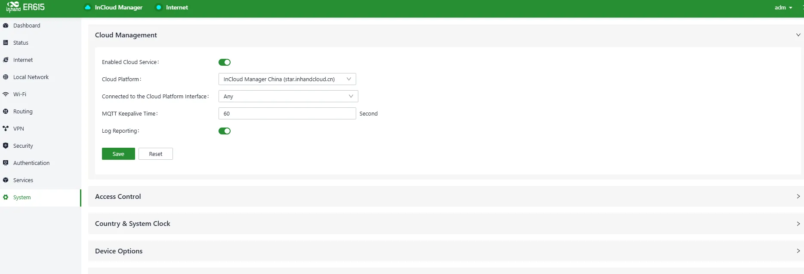

<strong>Fig 4-38 Enable InCloud Service</strong>

#### 4.9.3 Access Control

Whether to allow external access to the router's web configuration interface from the Internet can be configured through [System] → [Remote Access Control]. The service port for this purpose can also be set.

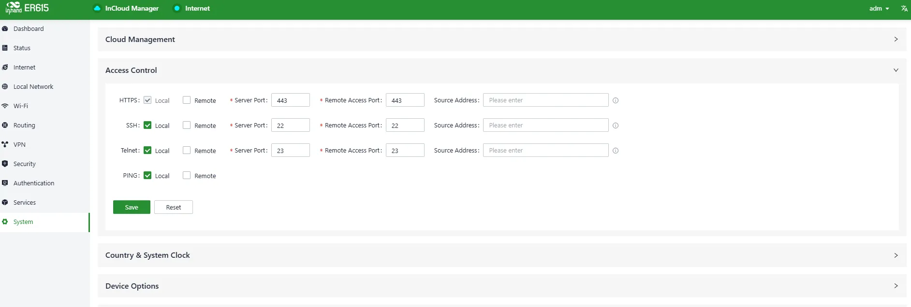

<strong>Fig 4-39 Access Control Parameters</strong>

- **HTTPS**: When enabled, users can access the router's web interface remotely by entering the public IP address and port number of the upstream interface in a web browser.
- **SSH/Telnet**: When enabled, users can remotely log in to the router's backend using remote tools (such as CRT) by providing the public IP address, port number, username, and password.
- **Ping**: When enabled, the upstream interface allows external networks to initiate Ping requests.

#### 4.9.4 System Clock

In network functionality, the clock function refers to the capability used to coordinate and synchronize the time between network devices. Clock functionality within a network is crucial for data transmission, log recording, security, coordination, and troubleshooting. It ensures that various devices in the network are operating with synchronized times.

The [System] → [System Clock] function is used to select the current time zone and configure NTP (Network Time Protocol) server addresses to synchronize the device's system time with an NTP server.

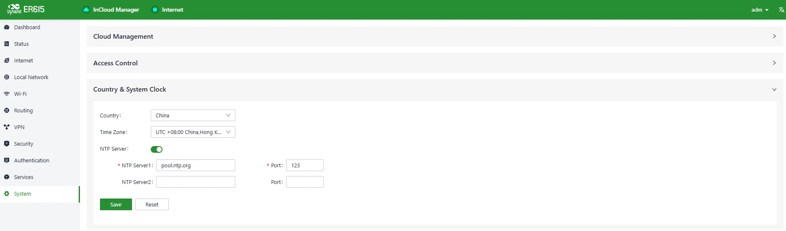

<strong>Fig 4-40 Time Zone and NTP Server</strong>

#### 4.9.5 Device Options

In [System] → [Device Options], various device operations such as rebooting, upgrading firmware, and restoring factory settings can be performed.

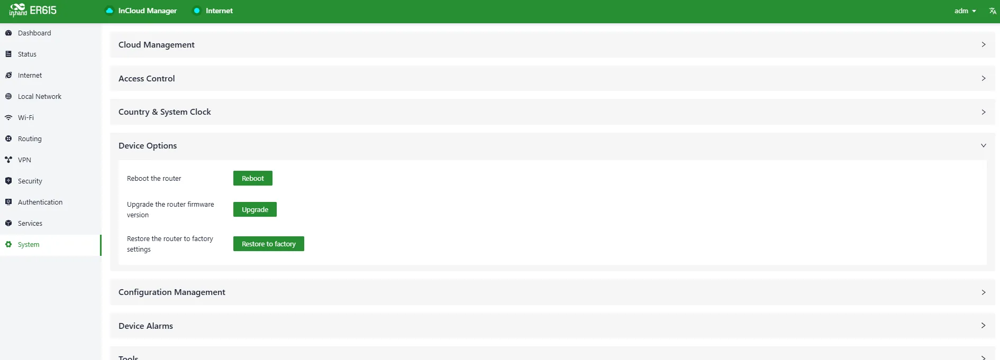

<strong>Fig 4-41 Device Options</strong>

> **Caution**: When performing a local firmware upgrade, it is essential to ensure that the firmware is obtained from a legitimate source to avoid rendering the device inoperable due to incorrect firmware imports.
>
> **Caution**: When a device is connected to the cloud platform, the platform will synchronize the previous configuration to the device again due to cloud-based configuration synchronization. The device will only clear historical data during the factory reset.

#### 4.9.6 Configuration Management

Configuring backups and backup recovery are critical tasks in network management and maintenance. They involve saving the configuration information of network devices so that it can be quickly restored or transferred when needed.

Device configurations can be exported to local storage in the [System] → [Configuration Management] menu. This backup can be imported into the device in case of configuration loss or when overwriting the existing configuration is required.

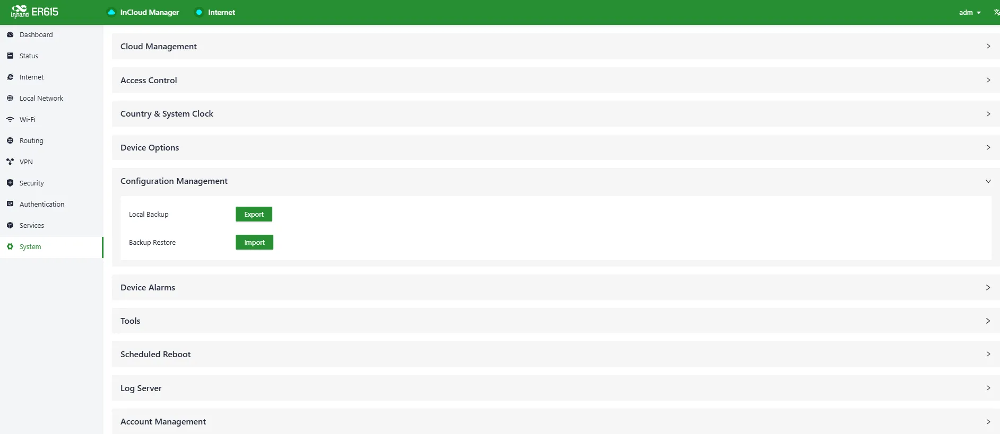

<strong>Fig 4-42 Configuration Management</strong>

#### 4.9.7 Device Alarms

Specific events that may occur on the device can be monitored by selecting the corresponding alarm events and configuring the email address for receiving alerts. When an alarm event occurs, the device automatically sends an email notification. Even if certain alarm options are not selected, related alarm events are still recorded in the device's local logs.

Alarm event types and email addresses for alarm notifications can be configured in the [System] → [Device Alarms] menu.

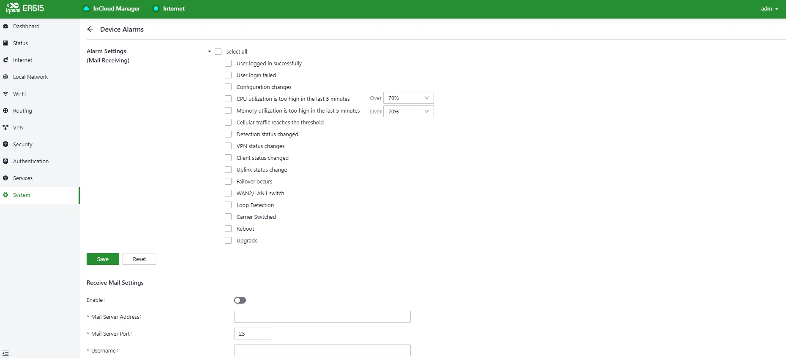

<strong>Fig 4-43 Alarm Event Types</strong>

After configuring the outgoing email server address, port, username, and password, the device uses this email account to send alarm notifications. The "Send Test Email" option can be used to verify whether the outgoing email configuration is correct. This test email helps ensure that the device can successfully send alarm notifications to the specified email address.

<strong>Fig 4-44 Mail Receiving Settings</strong>

#### 4.9.8 Tools

##### 4.9.8.1 Ping

ICMP (Internet Control Message Protocol) can be used to check the device's external network connectivity. In the "Target" field, enter any domain name or IP address to test the device's connectivity to, and then click "Start" to check the connectivity status between the device and the specified target. This helps determine whether the device can reach the target over the Internet.

A network ping test on a target can be performed by going to [System] → [Tools] → [Ping]. This sends ICMP echo requests to the specified target IP address or domain name and receives ICMP echo replies to check network connectivity and latency.

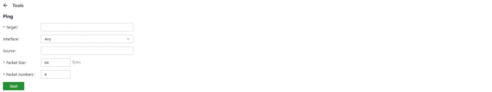

<strong>Fig 4-45 Ping Tool</strong>

##### 4.9.8.2 Traceroute

Traceroute is a network diagnostic tool used to determine the network path that data packets take from the source to the destination, as well as the intermediate routers or hops along that path. The target host's IP address can be entered in [System] → [Tools] → [Traceroute], the outgoing interface for the traffic can be chosen, and "Start" can be clicked to check the device's connectivity to the target IP by tracing the route.

<strong>Fig 4-46 Traceroute Tool</strong>

##### 4.9.8.3 Packet Capture

Packet capturing is a network monitoring and analysis technique used to capture and record data packets transmitted over a computer network. Packet capture tools are typically used for network troubleshooting, network performance analysis, security auditing, and protocol analysis, among other purposes.

Packets passing through a specific interface can be captured in [System] → [Tools] → [Packet Capture]. By selecting the "Output" option, captured data can be displayed within the interface or exported locally for further analysis.

<strong>Fig 4-47 Packet Capture Tool</strong>

#### 4.9.9 Scheduled Reboot

Scheduled reboot is a network device management strategy that allows administrators to automatically restart a device at a specific time or under certain conditions to ensure the device's normal operation and performance.

Scheduled reboots can be set up in [System] → [Scheduled Reboot] based on business requirements. The device supports scheduled reboots at fixed times daily, weekly, or monthly. In the case of monthly reboots, if the selected reboot day exceeds the actual number of days in the month, the device will reboot on the last day of the month. For example, if the 31st of every month is chosen, the device will reboot on the 30th in a month with only 30 days.

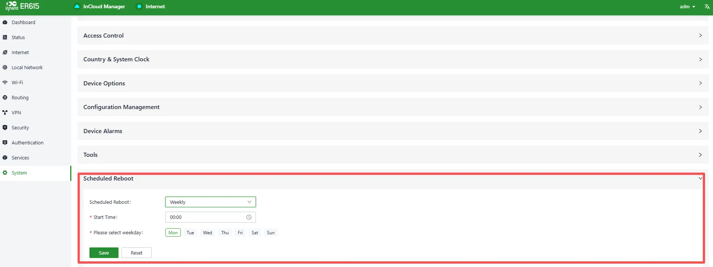

<strong>Fig 4-48 Scheduled Reboot Settings</strong>

#### 4.9.10 Log Server

A log server is a dedicated server or software application used to collect, store, and manage log information generated by network devices, applications, and operating systems. These log records include events, warnings, errors, activities, and other relevant information and are crucial for monitoring, troubleshooting, and performance optimization.

When the log file server function is enabled in [System] → [Log Server], the device periodically uploads log files to the specified log server.

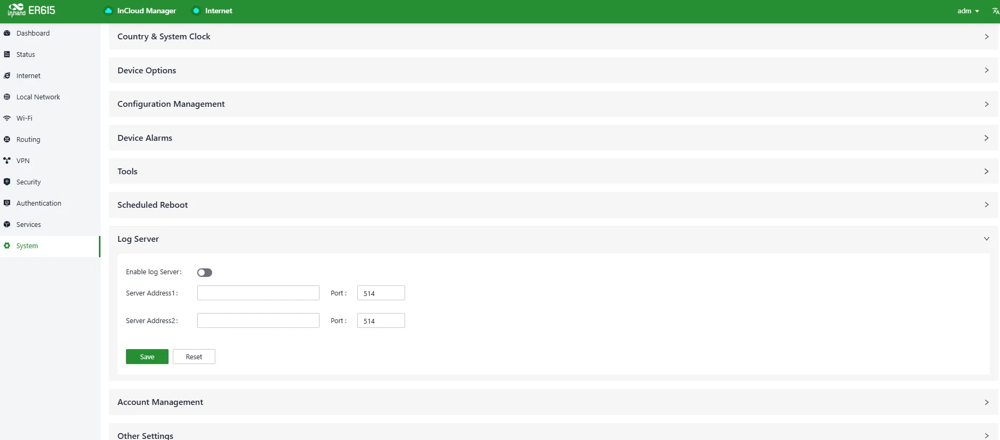

<strong>Fig 4-49 Log Server Address</strong>

#### 4.9.11 Other Settings

##### 4.9.11.1 Web Login Management

When a user logs in to the local interface of the device through the web and the session remains active for a certain period, it automatically logs out or disconnects to protect privacy and security.

The logout time can be configured in [System] → [Other Settings] → [Web Login Management]. If the online time during a single login session on the device's web page exceeds the configured time, the system automatically logs the user out, and login is required again to continue operations.

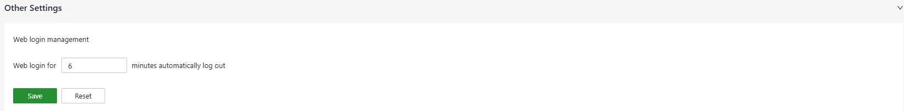

<strong>Fig 4-50 Web Login Management</strong>

##### 4.9.11.2 Fast Forward

This feature can be used to quickly forward packets, improving network performance. By default, it is turned off. When this feature is enabled in [System] → [Other Settings] → [Fast Forward], the device's data forwarding rate significantly increases.

<strong>Fig 4-51 Fast Forward Settings</strong>

##### 4.9.11.3 SIP ALG

SIP ALG is typically used as a firewall and consists of two technologies: Session Initiation Protocol (SIP) and Application Layer Gateway (ALG). This feature can be enabled in [System] → [Other Settings] → [SIP ALG]. Enabling this feature may impact VoIP telephone communication.

<strong>Fig 4-52 SIP ALG Settings</strong>

> **Note**: If the connected device needs to engage in VoIP (Voice over Internet Protocol) phone communication, it is recommended to disable this function.

---

## Appendix A Troubleshooting

### A.1 Network Connection Issues

| Phenomenon | Possible Cause | Troubleshooting Steps | Related Chapter |
|------------|----------------|-----------------------|-----------------|
| Cannot access the Internet via wired connection | WAN cable disconnected or faulty | 1. Check the WAN cable connection. 2. Replace the cable if damaged. | [Scenario 1: Wired Internet Access](#scenario-1-wired-internet-access) |
| Cannot access the Internet via wired connection | Incorrect connection method or parameters | 1. Verify the connection method (DHCP/Static/PPPoE). 2. Check parameters with the ISP. | [Scenario 1: Wired Internet Access](#scenario-1-wired-internet-access) |
| Cannot access the Internet via cellular network | SIM card not inserted or poor contact | 1. Check SIM card insertion. 2. Reinsert the SIM card. | [Scenario 2: Cellular Internet Access](#scenario-2-cellular-internet-access) |
| Cannot access the Internet via cellular network | APN parameter configuration error | 1. Verify APN parameters. 2. Obtain correct APN from the operator. | [Scenario 2: Cellular Internet Access](#scenario-2-cellular-internet-access) |
| Cannot access the Internet via cellular network | Weak or no signal | 1. Check antenna connection. 2. Relocate the device. | [Scenario 2: Cellular Internet Access](#scenario-2-cellular-internet-access) |
| Cannot connect as Wi-Fi client | Incorrect SSID or password | 1. Verify the SSID and password. 2. Check the signal strength of the target AP. | [Scenario 3: Wireless Client Access](#scenario-3-wireless-client-access) |

### A.2 Web Interface Access Issues

| Phenomenon | Possible Cause | Troubleshooting Steps | Related Chapter |
|------------|----------------|-----------------------|-----------------|
| Cannot open the web management interface | PC IP address not in the same subnet | 1. Confirm the PC is in the 192.168.2.x range. 2. Check subnet mask (255.255.255.0). | [Installation and First Use](#chapter-2-installation-and-first-use) |
| Cannot open the web management interface | Browser compatibility issue | 1. Use a recommended browser (e.g., Chrome). 2. Clear browser cache. | [Installation and First Use](#chapter-2-installation-and-first-use) |

### A.3 Cloud Management Issues

| Phenomenon | Possible Cause | Troubleshooting Steps | Related Chapter |
|------------|----------------|-----------------------|-----------------|
| Device not online in InCloud Manager | Cloud management disabled | 1. Check [System] → [Cloud Management] setting. 2. Ensure the device has Internet access. | [Scenario 4: Cloud Management](#scenario-4-cloud-management) |
| Device not online in InCloud Manager | License expired | 1. Renew the license through the "License" menu. | [Scenario 4: Cloud Management](#scenario-4-cloud-management) |

### A.4 VPN Issues

| Phenomenon | Possible Cause | Troubleshooting Steps | Related Chapter |
|------------|----------------|-----------------------|-----------------|
| VPN tunnel not established | Incorrect peer address or pre-shared key | 1. Verify the peer address and pre-shared key. 2. Ensure both ends use matching parameters. | [IPSec VPN](#461-ipsec-vpn) |
| VPN tunnel not established | Mismatched IKE/IPSec policy | 1. Verify encryption, authentication, and DH group settings. 2. Ensure both ends use identical policies. | [IPSec VPN](#461-ipsec-vpn) |

### A.5 Indicator Abnormalities

| Phenomenon | Possible Cause | Troubleshooting Steps | Related Chapter |
|------------|----------------|-----------------------|-----------------|
| System indicator blinking red | System malfunction | 1. Reboot the device. 2. Restore factory defaults if the issue persists. | [Restore Factory Defaults](#15-restore-factory-defaults) |
| Network indicator off | No active network connection | 1. Check cable and SIM card connections. 2. Verify upstream link configuration. | [Common Scenario Configuration](#chapter-3-common-scenario-configuration) |

---

## Appendix B Safety Precautions

1. Use the original power adapter to avoid damaging the device due to mismatched power adapters.
2. When installing the device, avoid placing it in an environment with strong electromagnetic interference, and keep it at a safe distance from high-power equipment. After installation, ensure that the device is stable to prevent accidental drops and potential damage.
3. Ensure that the device's operating environment meets the temperature and humidity requirements specified in the user manual.
4. Regularly inspect the device's cables, including Ethernet cables and power adapter connections. Keep the cables clean, and replace them if any damage is detected.
5. When cleaning the device, avoid spraying chemical agents directly on the device's surface to prevent damage to the housing or internal components. Use a soft cloth for cleaning.
6. Do not attempt to disassemble or modify the device on your own, as this can pose safety risks and may void the device's warranty.

> **Warning**: Non-professionals should not open the device enclosure. Risk of electric shock.

---

## FAQ

### Question 1: What are the differences between ER routers and regular routers?

1. Edge Router: The ER router supports multiple network access methods (wired and cellular), multi-gigabit Ethernet ports, and Wi-Fi 6 design. It supports various terminal devices and includes SD-WAN, out-of-band management, and cloud management capabilities.
2. Regular Router: Typically relies on fixed broadband connections such as DSL or fiber. Regular routers generally lack a unified management platform and advanced features such as firewalls and SD-WAN.

### Question 2: Unable to connect to 4G/5G network?

1. Physical Environment: Check whether the SIM card is inserted into the correct slot and ensure all cellular antennas are properly installed.
2. APN Settings: Ensure that the APN configuration matches the information provided by the service provider.
3. Check Device Connectivity: Log in to the device's local interface and use the built-in ICMP tool to ping 8.8.8.8 to test connectivity. If it connects, then check the connectivity between the end device (e.g., computer or smartphone) and the router.
4. Check SIM Card: Remove the SIM card and insert it into a phone to verify whether it can connect to the Internet.
5. Restart: Power off the router, wait a few seconds, and then reconnect the power to retry the network connection.
6. Factory Reset: Perform a factory reset on the router and then attempt to connect again.

### Question 3: Is the cloud platform free of charge?

InHand Networks is committed to providing high-quality network services for small and medium-sized chain organizations. When utilizing cloud platform services, licenses are required for each device to access the extensive cloud-based features.

### Question 4: How to add devices to the cloud platform?

1. Register for an InCloud Manager login account at `https://star.inhandcloud.com/`.
2. Log in to the cloud platform using the registered account. Under the device menu, click "Add," and follow the prompts to enter the device's serial number and MAC address. This completes the device addition process. When a device is added for the first time, a complimentary 1-year Essential license is included. Licenses can be renewed as needed in the future.

### Question 5: Is it possible to use the device without the cloud platform?

Yes. The majority of configuration tasks can be completed locally. However, for features like bulk configuration deployment, firmware upgrades, SD-WAN, Connector, and more, local device settings need to be combined with the cloud platform.

If the issue cannot be resolved using the above steps or if other problems are encountered, contact InHand Networks for technical support. Visit `www.inhandnetworks.com` for more information.
