# Edge Router 805 Product User Manual

## Preliminary Information

### Declaration

Thank you for choosing InHand Networks product. Before use, carefully read this user manual. Compliance with the following statements helps maintain intellectual property rights and legal compliance, ensuring the user experience aligns with the latest product information. For questions or written permission requests, contact the technical support team.

- **Copyright Statement**

  This user manual contains copyrighted content. Copyright belongs to InHand Networks and its licensors. Without written permission, no organization or individual may excerpt, copy any part of this manual, or distribute it in any form.

- **Disclaimer**

  Due to ongoing updates in product technology and specifications, the company cannot guarantee that the information in this user manual is entirely consistent with the actual product. Therefore, no disputes arising from discrepancies between actual technical parameters and the user manual are accepted. Any product changes will not be notified in advance. The company reserves the right to make final changes and interpretations.

- **Copyright Information**

  The content of this user manual is protected by copyright laws. Copyright belongs to InHand Networks and its licensors. All rights reserved. Without written permission, the content of this manual may not be used, copied, or distributed without authorization.

### GUI Conventions

| Symbol | Meaning | Example |
|--------|---------|---------|
| `< >` | Indicates a variable or parameter to be replaced with an actual value | `<IP Address>` indicates a specific IP address needs to be entered |
| `" "` | Indicates a text label on the interface | Click the "Save" button |
| `→` | Indicates menu hierarchy or operation sequence | 【Network】→【Cellular】 |
| `【 】` | Indicates a menu or page name | Go to the 【System Settings】page |
| `>` | Separates multi-level menus | 【Status】>【Link Monitoring】 |
| **Cautions** | Operations that require attention; improper actions may result in data loss or device damage | — |
| **Note** | Supplementary explanations for operations | — |

### Technical Support

**InHand Networks (Headquarters)**

Phone: +86-10-8417 0010

Address: 5/F, Building 3, No. 18 Ziyue Road, Chaoyang District, Beijing, China

**Chengdu Office**

Phone: +86-28-8679 8244

Address: 14/F, China Taiping Financial Tower, No. 1777 North Tianfu Avenue, Wuhou District, Chengdu, Sichuan, China

**Guangzhou Office**

Phone: +86-20-8562 9571

Address: Unit B-130, Yuanyang New Third Board Creative Park, No. 5 Tangdong East Road, Tianhe District, Guangzhou, China

**Wuhan Office**

Phone: +86-27-8716 3566

Address: Room 2001, Building 11, Paris Haoting, No. 2 Luoyu East Road, Hongshan District, Wuhan, Hubei, China

**Shanghai Office**

Phone: +86-21-5480 8501

Address: Room 1103, No. 18 Shunyi Road, Putuo District, Shanghai, China

Email: [support@inhandnetworks.com](mailto:support@inhandnetworks.com)

URL: [www.inhandnetworks.com](http://www.inhandnetworks.com/)

### How to Use This Manual

**Choose your starting point:**

- First-time users: Read sequentially through "Getting to Know the Device" → "Installation and First Use" → "Common Scenario Configuration" → "Feature Description and Parameter Reference"
- Existing device users: Refer directly to "Feature Description and Parameter Reference" or "Appendix: Troubleshooting"
- Cloud management users: Refer to "Common Scenario Configuration" for InCloud Manager platform guidance

**Quick task reference:**

| Task | Chapter | Estimated Time |
|------|---------|----------------|
| Unpack and inspect the device | [Getting to Know the Device](#chapter-1-getting-to-know-the-device) | About 5 minutes |
| Install the device and power it on | [Installation and First Use](#chapter-2-installation-and-first-use) | About 10 minutes |
| Connect to the Internet via cellular | [Scenario: Cellular Internet Access](#scenario-1-cellular-internet-access) | About 5 minutes |
| Connect to the Internet via wired network | [Scenario: Wired Internet Access](#scenario-2-wired-internet-access) | About 5 minutes |
| Add device to InCloud Manager | [Scenario: Cloud Management](#scenario-3-cloud-management) | About 10 minutes |
| Configure VPN | [VPN](#44-vpn) | As needed |
| Troubleshoot network issues | [Appendix: Troubleshooting](#appendix-troubleshooting) | As needed |

---

## Chapter 1 Getting to Know the Device

### 1.1 Overview

The Edge Router 805 (ER805) is a next-generation 5G edge router developed by InHand Networks for commercial networking applications. It integrates 4G/5G wireless networks with various broadband services, providing high-speed and secure network access for multiple industries. The ER805 enables uninterrupted Internet connectivity anytime and anywhere, combined with comprehensive security features and wireless services. It serves as a high-speed gateway for device informatization and interconnectivity.

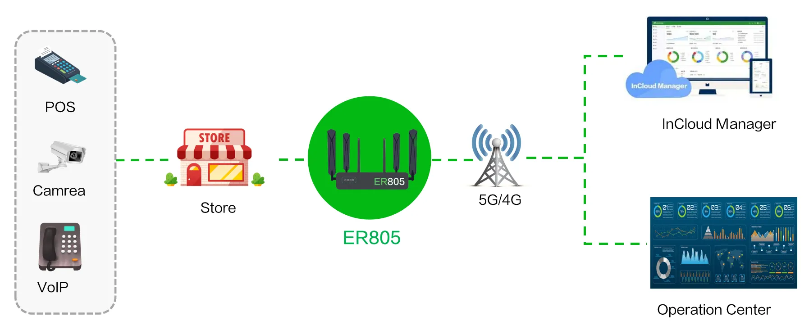

<strong>Fig. 1-1 ER805 Application Scenario</strong>

### 1.2 Packing List

| Item | Quantity | Description |
|------|----------|-------------|
| ER805 | 1 | Edge Router 805 |
| Ethernet Cable | 1 | 1.5 m Ethernet cable |
| LTE Antenna | 2 | For ER805 4G model |
| 5G Antenna | 4 | For ER805 5G model |
| Wi-Fi Antenna | 2 | Magnetic antenna; stick antenna optional |
| Power Adaptor | 1 | Power adaptor with power cable |
| Panel Mounting Lug | 4 | 2 hangers and 2 wall mounting lugs |
| SIM Card Ejector | 1 | Used to remove the SIM tray |

### 1.3 Appearance and Interfaces

<strong>Fig. 1-2 ER805 Device Panel</strong>

| Interface | Position | Function Description |
|-----------|----------|---------------------|
| Power IN | 1 | Power input; supports 9~48V DC voltage range |
| SIM Card Slot | 2 | Dual nano SIM card slots |
| USB | 3 | USB Type-A port, USB 2.0 protocol |
| WAN1 | 4 | Ethernet WAN port |
| WAN2/LAN1 | 5 | Ethernet port supporting WAN/LAN switch |
| LAN2 | 6 | Ethernet LAN port |
| LAN3 | 7 | Ethernet LAN port |
| LAN4 | 8 | Ethernet LAN port |
| Reset | 9 | Pinhole reset button for restoring factory defaults |

### 1.4 LED Indicators

| Indicator | Status | Meaning |
|-----------|--------|---------|
| System | Off | Power off |
| | Blinking blue | System booting in progress |
| | Steady blue | System running smoothly |
| | Blinking red | System malfunction detected |
| | Blinking green | System upgrading in progress |
| Network | Blinking red | Network disconnected |
| | Blinking green | Cellular network connecting |
| | Steady green | Cellular network connected |
| | Blinking blue | Wired network connecting |
| | Steady blue | Wired network connected |
| Wi-Fi 2.4G | Off | 2.4G Wi-Fi disabled |
| | Steady blue | Starting up |
| | Blinking blue | In operation |
| Wi-Fi 5G | Off | 5G Wi-Fi disabled |
| | Steady green | Starting up |
| | Blinking green | In operation |

**Network indicator priority rules:**

1. When both cellular and wired connections are active and normal, the indicator displays steady blue (wired priority).
2. When only one type of connection is active and normal, the indicator displays the color for the active network.
3. When no network connection exists, the indicator displays blinking red.

### 1.5 Restore Factory Settings

The ER805 supports restoring to factory default settings via the hardware Reset button.

<strong>Fig. 1-3 Factory Reset Button Location</strong>

**Operation steps:**

1. After powering on the device, immediately press and hold the Reset button.
2. After holding for a period, the power indicator light starts flashing. Approximately half a minute later, the power indicator light stays on steadily.
3. Release the Reset button; the power indicator light flashes again. Then press and hold the Reset button once more.
4. The power indicator light flashes slowly. Release the Reset button. The factory reset completes successfully, and the device restarts automatically.

### 1.6 Default Settings

| No. | Function | Default Settings |
|-----|----------|-----------------|
| 1 | Cellular Dialing | Default dialing set to "SIM1" |
| 2 | Wi-Fi | 2.4G AP enabled, SSID: "ER805-" + last 6 digits of wireless MAC address; 5G AP enabled, SSID: "ER805-5G-" + last 6 digits of wireless MAC address; Authentication: WPA2-PSK; Password: last 8 digits of serial number |
| 3 | Ethernet | All 4 LAN ports enabled; IP Address: 192.168.2.1; Subnet Mask: 255.255.255.0; DHCP server enabled, address pool: 192.168.2.2 to 192.168.2.100 |
| 4 | Network Access Control | Local HTTP (port 80) and HTTPS (port 443) enabled; cellular network access disabled |
| 5 | Username/Password | Check the device nameplate for login credentials |

---

## Chapter 2 Installation and First Use

### 2.1 Pre-Installation Preparation

**Environmental requirements:**

| Item | Requirement |
|------|-------------|
| Working Temperature | -20°C ~ 70°C |
| Storage Temperature | -40°C ~ 85°C |
| Power Supply | 9~48V DC (use the original power adapter) |
| Installation Position | Avoid direct sunlight, heat sources, and strong electromagnetic interference |

**Tools required:**

- Phillips screwdriver (for wall-mounted installation)
- Expansion screws (for wall-mounted installation, user-provided)
- SIM card (purchased separately from local operator)

> **Caution**: Verify the power supply voltage matches the device specifications before connecting power. Use only the original power adapter included in the package to avoid device damage.

### 2.2 Installation Guide

#### 2.2.1 Insert SIM Card

The ER805 supports dual nano SIM cards. Use the SIM card ejector tool included in the package to insert into the small hole and release the SIM card tray. Install the SIM card on the tray, then insert the tray back into the slot.

> **Caution**: Power off the device before inserting or removing a SIM card to prevent data loss or device damage.

<strong>Fig. 2-1 Install SIM Cards</strong>

#### 2.2.2 Attach Antennas

Attach the antennas to the corresponding SMA connectors on the device.

<strong>Fig. 2-2 Attach Antennas</strong>

#### 2.2.3 Install the Device

**Desktop Installation:**

1. Ensure the selected desktop area is free from obstructions and provides adequate space for the device.
2. Install the foot pad in the corresponding position on the housing underside.
3. Verify correct installation of the SIM card, antennas, and power cable.
4. Place the device steadily on the tabletop.

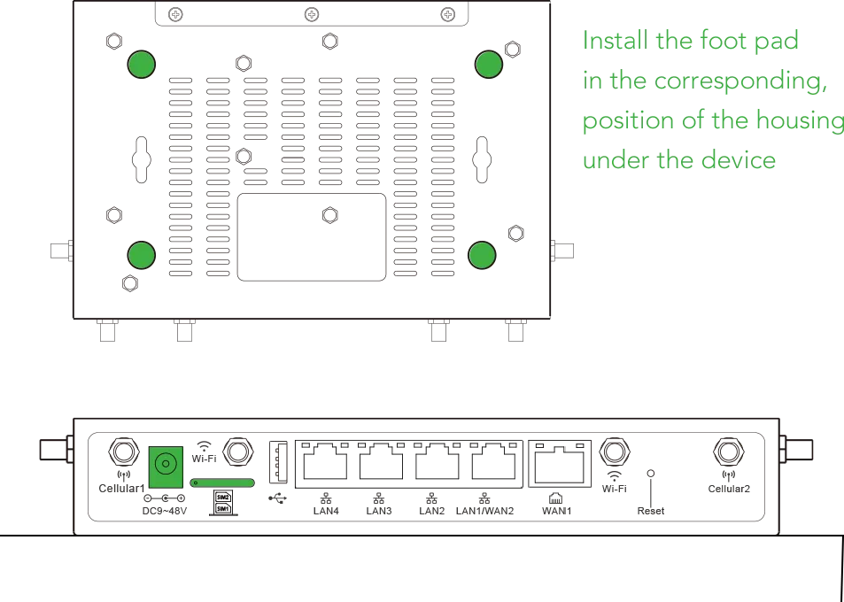

<strong>Fig. 2-3 Desktop Installation</strong>

**Wall-Mounted Installation (Ear-Hanging):**

1. Install the hanging ears included in the package at the cutouts on both sides of the device.
2. Install two screws on the wall; the distance between screws must match the hole distance between the hanging ears.
3. Hang the device in the predetermined position and push down to confirm stable installation.

<strong>Fig. 2-4-a Panel Mounting Installation</strong>

**Wall-Mounted Installation (Direct Mounting):**

1. Drill holes at predetermined installation positions and install two expansion screws; the screw distance must match the mounting hole positions on the device bottom.
2. After mounting, push the device down to ensure firm installation.

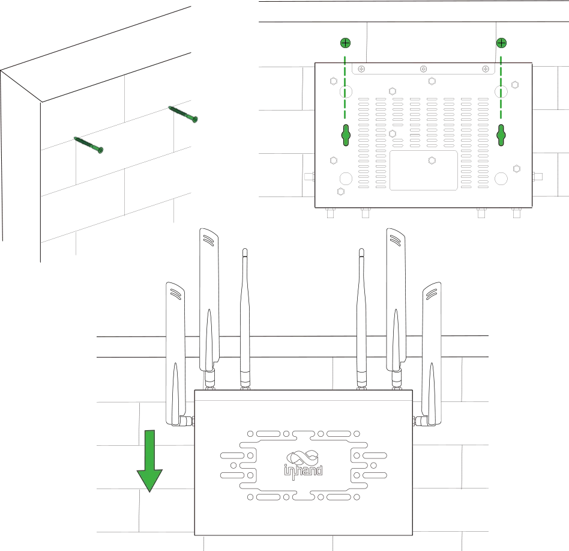

<strong>Fig. 2-4-b Wall Mounting Installation</strong>

#### 2.2.4 Power Cable Installation

Insert one end of the power adapter into the power outlet and the other end into the device's power interface.

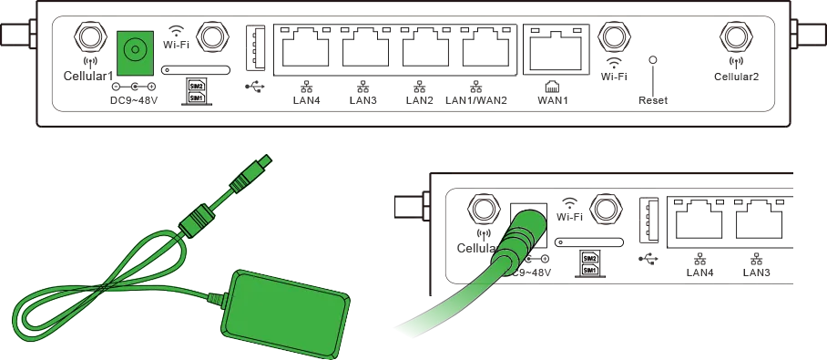

<strong>Fig. 2-5 Power Cable Installation</strong>

#### 2.2.5 Access the Web Management Interface

1. Connect a PC to any LAN port of the device using an Ethernet cable.
2. The device's LAN port has DHCP Server enabled by default. Once the PC automatically obtains an IP address, verify that the PC and ER805 are in the same address range.
3. If the PC fails to obtain an IP address automatically, configure a static IP address with the following parameters:
   - IP Address: 192.168.2.x (choose an available address from 192.168.2.2 to 192.168.2.254)
   - Subnet Mask: 255.255.255.0
   - Default Gateway: 192.168.2.1
   - DNS Servers: 8.8.8.8 (or the ISP's DNS server address)

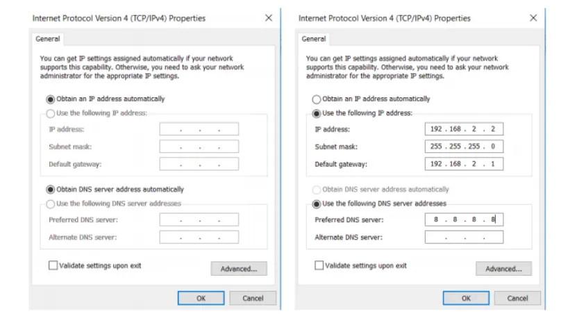

<strong>Fig. 2-6 Configure PC IP Address</strong>

4. Open a web browser and enter the default device address `192.168.2.1` in the address bar. Enter the username and password (check the device nameplate for login credentials) to access the web management interface. If a security warning appears, click "Advanced" or "Hide" and select "Proceed" to continue.

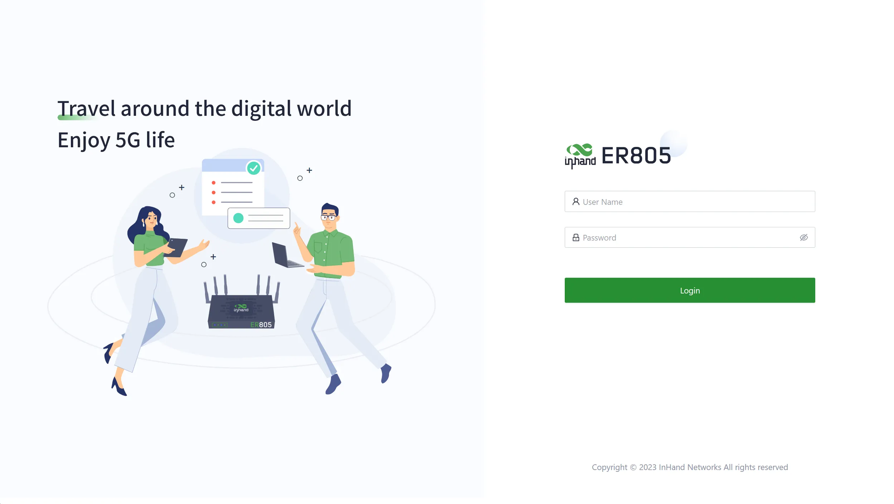

<strong>Fig. 2-7 Device Web Login Page</strong>

### 2.3 Quick Check

**Installation verification checklist:**

- [ ] Device is placed steadily (desktop) or mounted securely (wall)
- [ ] SIM card is correctly inserted (if using cellular)
- [ ] All antennas are firmly attached
- [ ] Power cord is in good contact and meets safety requirements
- [ ] Device powers on and indicator lights display normally
- [ ] PC can access the web management interface at 192.168.2.1

---

## Chapter 3 Common Scenario Configuration

### Scenario 1: Cellular Internet Access

**Goal**: Access the Internet via 4G/5G cellular network.

**Prerequisites**: SIM card inserted, cellular antennas installed, device powered on.

**Estimated Time**: About 5 minutes.

**Operation Steps:**

1. Insert the SIM card while the device is powered off, then install the cellular antennas.
2. Power on the device. In most cases, the ER805 automatically establishes a dial-up connection after inserting the SIM card and connecting antennas.
3. If automatic connection fails, open a web browser and access `192.168.2.1`. Log in with the credentials from the device nameplate.
4. Go to 【Internet】→【Uplink Table】. Click the "Edit" button next to the "Cellular" option.
5. Configure APN parameters (obtain APN parameters from the operator).
6. Click "Save" and wait for the connection to establish.

<strong>Fig. 3-1 Uplink Table</strong>

<strong>Fig. 3-2 Set APN Parameters</strong>

**Verification Method:**

1. Go to 【Dashboard】>【Interface Status】. The device has connected successfully when the "Cellular" icon turns green.
2. Click the "Cellular" icon to view signal strength, IP address, and data usage.
3. Use the Ping tool in 【System】>【Tools】 to test connectivity to an external address such as `8.8.8.8`.

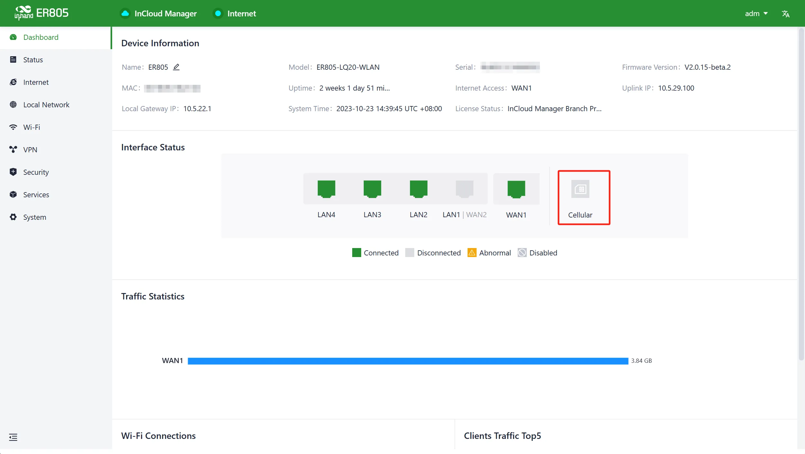

<strong>Fig. 3-3 Check Cellular Interface Status</strong>

**Common Issues:**

- Network connection failure: Check whether the SIM card is correctly inserted and whether APN parameters are correct.
- Data transmission anomaly: Check signal strength and data balance.
- In dedicated network scenarios: Manually disable the "Link Detection" function under 【Internet】 to prevent cellular connectivity issues caused by unsuccessful detection.

### Scenario 2: Wired Internet Access

**Goal**: Access the Internet via wired WAN connection.

**Prerequisites**: Ethernet cable connected from upstream device to WAN1 port, device powered on.

**Estimated Time**: About 5 minutes.

**Operation Steps:**

1. Connect the WAN1 port to the upstream network device (such as a modem or switch) using an Ethernet cable.
2. The device's WAN interface has DHCP service enabled by default. In most cases, the device automatically obtains an IP address and connects to the Internet.
3. If automatic connection fails, log in to the web management interface at `192.168.2.1`.
4. Go to 【Internet】>【Uplink Table】. Click the "Edit" button next to the "WAN1" interface.
5. Select the appropriate connection method:
   - **DHCP**: Automatically obtains an IP address from the upstream device.
   - **Static IP**: Manually configure an IP address obtained from the ISP or upstream network device.
   - **PPPoE**: Configure broadband dial-up parameters (username and password).
6. Click "Save" and wait for the connection to establish.

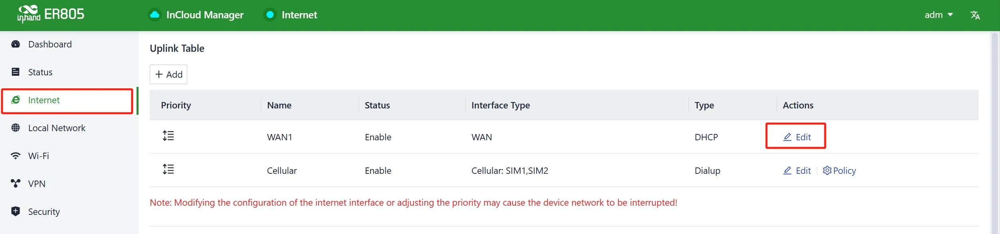

<strong>Fig. 3-4 Edit WAN1 Interface</strong>

<strong>Fig. 3-5-a Configure Uplink Interface</strong>

<strong>Fig. 3-5-b Configure Uplink Interface</strong>

**Verification Method:**

1. Go to 【Dashboard】>【Interface Status】. The device has connected successfully when the "WAN" icon turns green.
2. Click the corresponding icon to view interface information such as IP address and traffic consumption.
3. Use the Ping tool in 【System】>【Tools】 to test network connectivity.

<strong>Fig. 3-6 Check Network Connectivity</strong>

**Common Issues:**

- Unable to obtain IP address: Check whether the upstream device has DHCP server enabled.
- Static IP connection failure: Verify that the IP address, subnet mask, gateway, and DNS are correct.
- PPPoE dial-up failure: Verify the broadband account and password.

### Scenario 3: Cloud Management

**Goal**: Add the ER805 to InCloud Manager for remote management and monitoring.

**Prerequisites**: Device connected to the Internet, InCloud Manager account registered.

**Estimated Time**: About 10 minutes.

**Operation Steps:**

1. Open a web browser (Google Chrome recommended) and visit [https://star.inhandcloud.com/](https://star.inhandcloud.com/).
2. Register a new account or log in with existing credentials.
3. After logging in, navigate to the "Devices" menu and click the "Add" button.
4. Fill in the device name, serial number, and MAC address (obtain from the device nameplate), then click "Finish" to complete the addition.

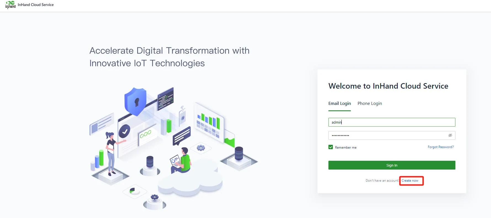

<strong>Fig. 3-7 Choose SaaS Services</strong>

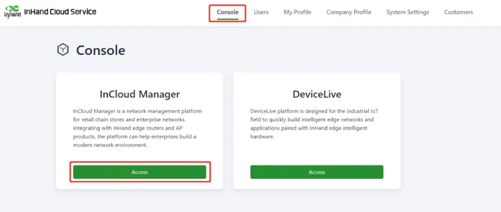

<strong>Fig. 3-8 InCloud Manager Login</strong>

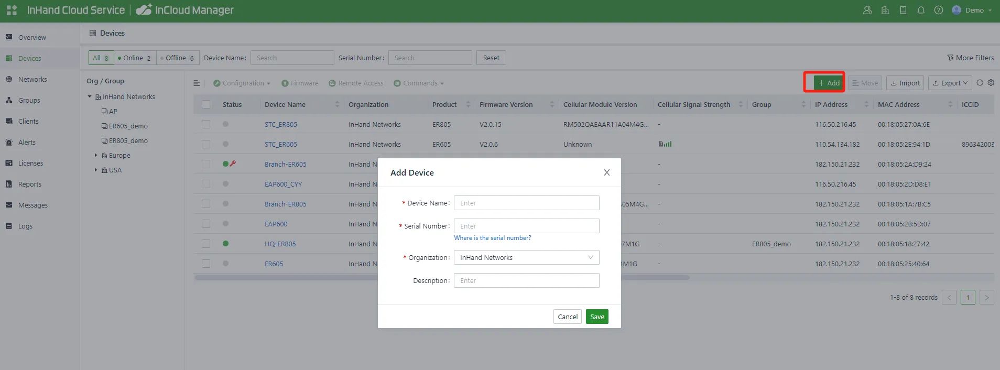

<strong>Fig. 3-9 Add Device to InCloud Manager</strong>

**Verification Method:**

1. In the "Devices" list, verify that the device status shows online.
2. Click the device name to enter the device details page and view real-time status information.

**Common Issues:**

- Device shows offline: Verify that the device has Internet access and that cloud management is enabled in 【System】>【Cloud Management】.
- License expired: When a device is first added, it automatically receives a 1-year Essential license. Renew the license through the "License" menu if needed.

---

## Chapter 4 Feature Description and Parameter Reference

### 4.1 Internet

The ER805 supports three Internet access modes: wired, cellular, and Wi-Fi (STA). The device comes with two non-removable upstream links by default: WAN1 and Cellular. It can support up to four upstream links, including WAN1, WAN2, Cellular, and Wi-Fi (STA). WAN2 and Wi-Fi (STA) interfaces need to be manually added and can be removed as needed.

#### 4.1.1 Wired Connection

The ER805 supports three wired Internet connection methods: DHCP, Static IP, and PPPoE. Modify the connection method by clicking the "Edit" button. The default method is DHCP.

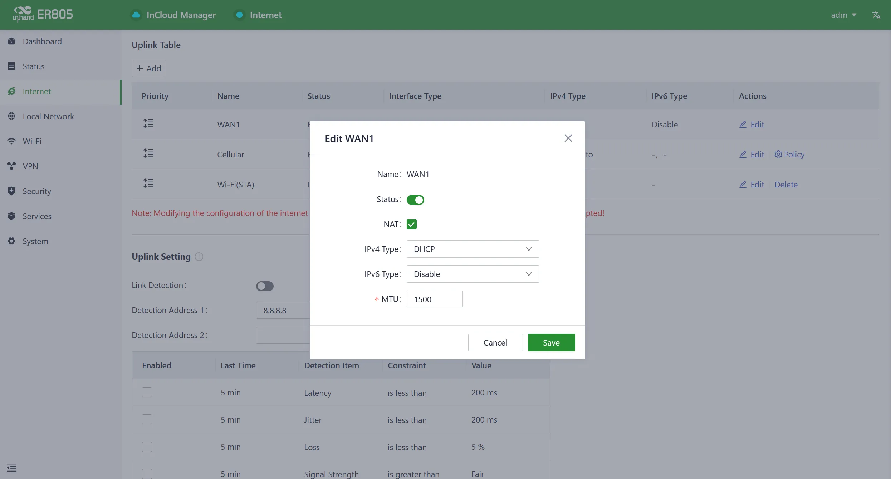

<strong>Fig. 4-1 Edit WAN1 Interface</strong>

- **DHCP**: The device's WAN interface has DHCP service enabled by default. Connect the WAN interface to the Internet using an Ethernet cable, and it automatically establishes an Internet connection.
- **Static IP**: Manually configure an address obtained from the Internet service provider or within the same network segment as the upstream device. The router accesses the network via the specified static IP address after configuration.

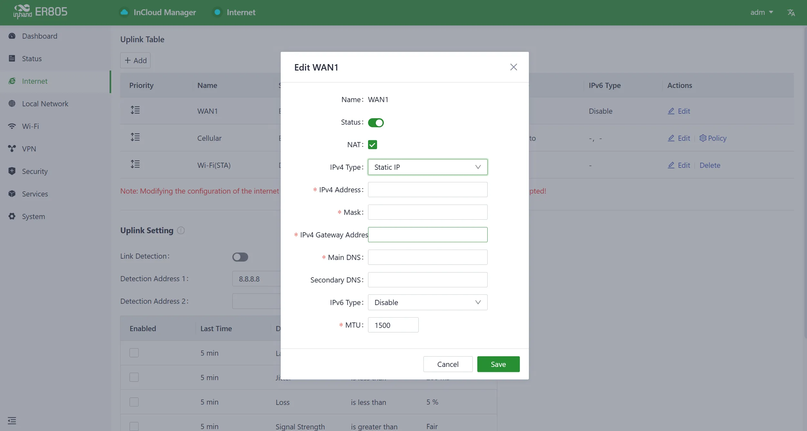

<strong>Fig. 4-2 Assign Static IP to Router</strong>

- **PPPoE**: Configure broadband dial-up parameters. The router establishes an Internet connection through broadband dial-up after configuration.

<strong>Fig. 4-3 Set Up PPPoE Dial-up</strong>

When dual WAN connections are required, click the "Add" button in the 【Internet】menu to add the WAN2 interface. The WAN2 interface supports the same configuration options as WAN1.

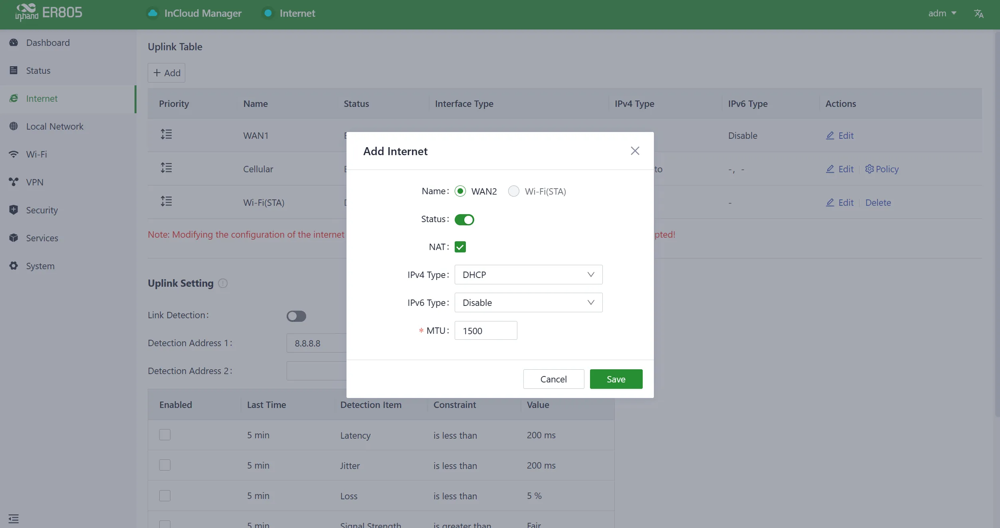

<strong>Fig. 4-4 Add WAN2 Interface</strong>

> **Note:**
> - After adding the WAN2 interface, the original LAN1 interface role switches to WAN2.
> - After deleting the WAN2 interface, the WAN2 interface role switches back to LAN1.
> - After deleting WAN2, all configuration related to the WAN2 interface, including static routes, inbound/outbound rules, port forwarding, policy routing, and traffic shaping settings, will be removed.

#### 4.1.2 Wi-Fi (STA) Connection

The ER805 supports connecting as a client to an on-site AP's network. Click the "Add" button, select "Wi-Fi (STA)," and fill in the required parameters, including the SSID name and password.

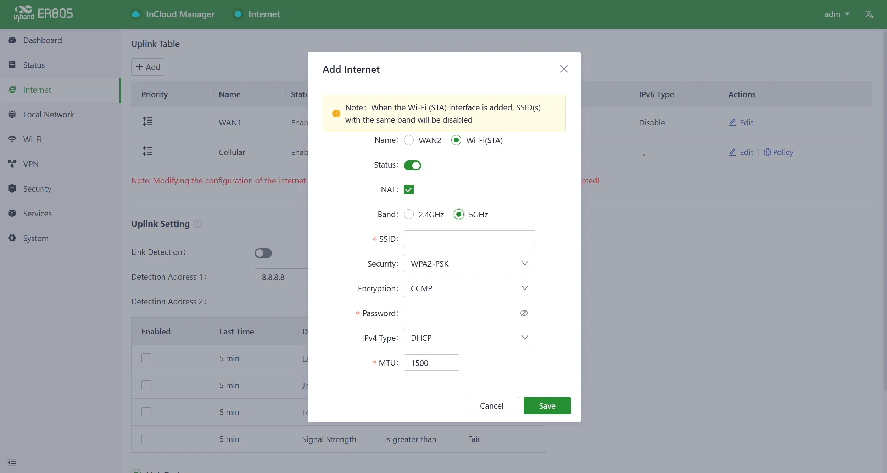

<strong>Fig. 4-5 Add Wi-Fi (STA) Interface</strong>

> **Cautions:**
> - Upon adding Wi-Fi (STA), the ER805 automatically disables SSIDs in the same frequency band within the Wi-Fi settings, and the status field for those SSIDs cannot be modified.
> - After removing Wi-Fi (STA), the "Status" field and SSIDs in the same frequency band within the Wi-Fi settings can be modified.
> - When Wi-Fi (STA) is deleted, all configuration associated with the Wi-Fi (STA) interface, including static routes, inbound/outbound rules, port forwarding, policy routing, and traffic shaping settings, will be removed.

#### 4.1.3 Cellular Connection

In typical scenarios, upon inserting the SIM card and connecting the antennas, the ER802 router automatically establishes a dial-up connection and connects to the network when powered on.

To configure APN (Access Point Name) parameters, select the "Cellular" interface in the 【Internet】menu and click the "Edit" button to access the APN parameter configuration interface.

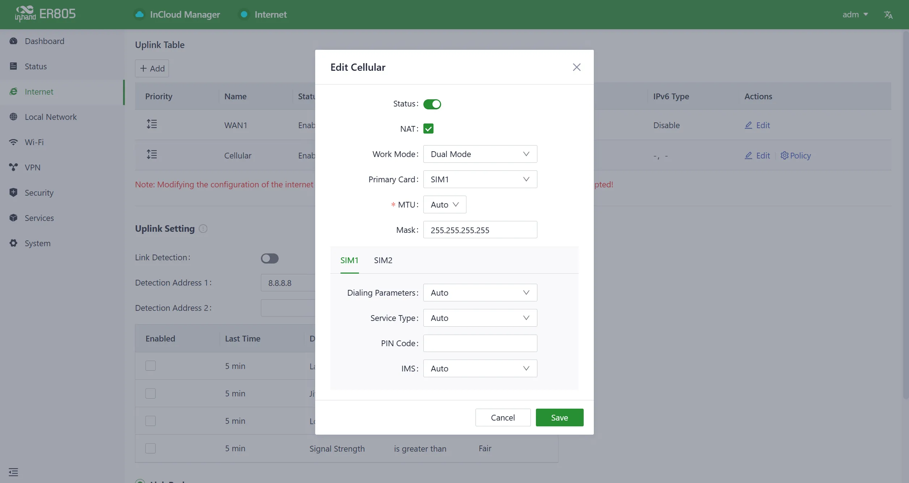

<strong>Fig. 4-6 Edit Cellular Interface</strong>

The ER805 supports a traffic policy feature for cellular interfaces. Once enabled, the SIM card takes specific actions when traffic reaches a threshold. Traffic usage statistics reset at the beginning of each month.

Select the "Cellular" interface in the 【Internet】menu and click the "Policy" button to access the SIM card's policy parameter configuration interface.

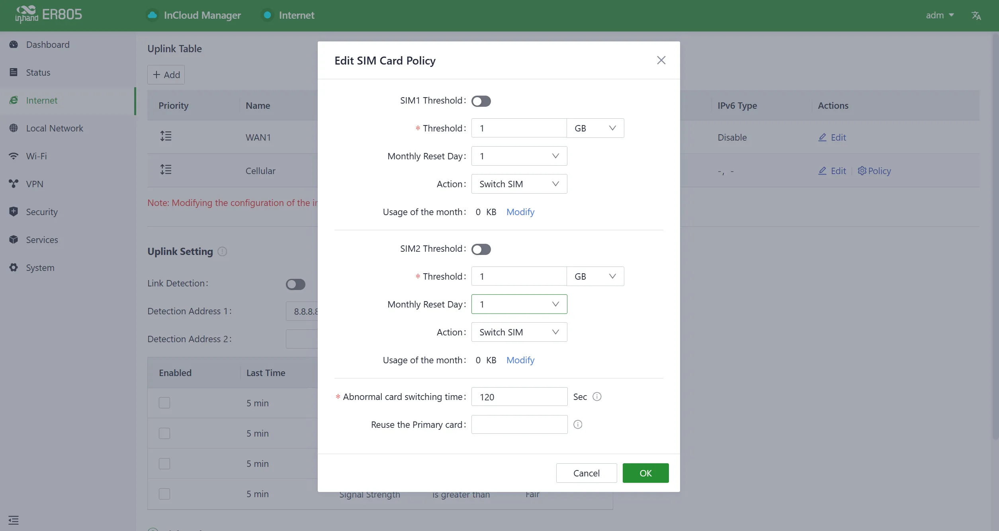

<strong>Fig. 4-7 Edit SIM Card Traffic Policy</strong>

**Actions triggered when SIM card traffic reaches the threshold:**

1. **Notification**: Generates an event when traffic reaches the threshold but does not stop forwarding regular business traffic.
2. **Cloud Management Only**: Generates an event when traffic reaches the threshold, allowing only cloud-based management traffic forwarding while blocking Internet access for regular business traffic.
3. **Switch the SIM Card**: Generates an event when traffic reaches the threshold and switches to another SIM card for Internet access.

> **Cautions:**
> - In certain dedicated network scenarios, manually disable the "Link Detection" function under the 【Internet】menu to prevent cellular connectivity issues caused by unsuccessful detection.
> - In some cases, manual configuration of the subnet mask for the cellular interface may be required to ensure proper functioning of the ARP (Address Resolution Protocol) feature.
> - When inserting or removing a SIM card, disconnect the power to prevent data loss or device damage.

#### 4.1.4 Uplink Table

Edit the WAN1 and Cellular interfaces and add/edit/remove WAN2 and Wi-Fi (STA) interfaces in the 【Internet】>【Uplink Table】. Adjust the priority of each interface by dragging the "Priority" icon. Interfaces are arranged from top to bottom based on priority, with higher priority interfaces taking precedence in determining the current upstream interface.

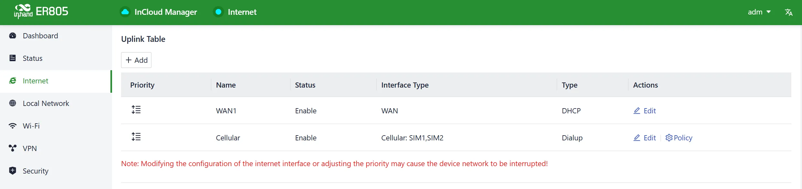

<strong>Fig. 4-8 Uplink Table Interface</strong>

#### 4.1.5 Uplink Settings

Configure link detection settings and establish collaboration modes between different upstream interfaces through 【Internet】>【Uplink Settings】.

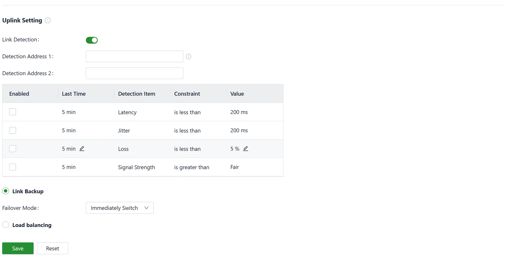

<strong>Fig. 4-9 Uplink Settings Interface</strong>

**Link Detection Switch:** The device has link detection enabled by default. In specialized network environments where external communication is not possible, manually disable link detection. When link detection is turned off, latency, jitter, packet loss, signal strength, and other information for upstream interfaces will not display in the 【Status】menu.

> **Notes:**
> - Modifying settings in the Internet menu can potentially lead to device connectivity disruption. Exercise caution when making changes.
> - When the link detection address is left empty, the default behavior detects the DNS address via the upstream interface. If a detection address is specified, all upstream interfaces detect only the provided address.
> - In router link backup mode, customize detection parameters, and the device switches links based on enabled detection items. When detection items are not enabled, upstream link switching occurs based on priority and link connectivity only.
> - In device load balancing mode, all operational upstream links forward business traffic, provided they function correctly.

### 4.2 Local Network

In the 【Local Network】feature, define local subnets, including address range, VLAN ID, DHCP services, and other parameters. After configuration, apply these settings to the device's LAN port through 【Interface Management】or to the desired SSID in the Wi-Fi settings. This ensures client devices connect to the local network according to planned network addresses.

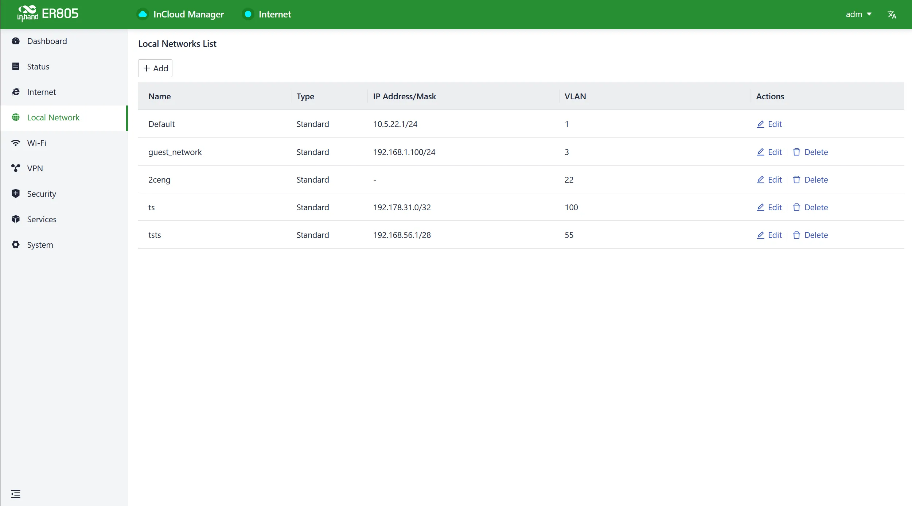

<strong>Fig. 4-10 Local Network List</strong>

Click the "Add/Edit" button to add a new local network or edit an existing one.

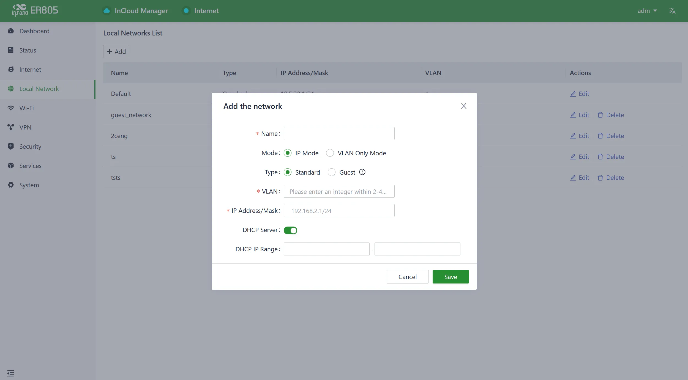

<strong>Fig. 4-11 Add/Edit Local Network</strong>

| Parameter | Description |
|-----------|-------------|
| Name | Identifies the network; select this name to apply in 【Wi-Fi】and 【Interface Management】 |
| Mode | Choose between 2-layer transparent mode or 3-layer IP mode; default is "IP mode" |
| VLAN | Divides the local network into virtual logical networks; default VLAN is "default (VLAN1)" |
| IP Address/Subnet Mask | Gateway address for accessing the router through LAN port or Wi-Fi; default is "192.168.2.1" |
| DHCP Server | Clients obtain IP addresses through this function; enabled by default with address range generated based on IP Address/Subnet Mask |

> **Notes:**
> - The default local network cannot be deleted; only the IP address/subnet mask and DHCP server settings can be modified.
> - Once a local network is added, its mode cannot be changed.
> - VLAN Only mode is designed for 2-layer transparent operation and does not require IP address/subnet mask or DHCP server configuration.

### 4.3 Wi-Fi

The ER805 functions as an Access Point (AP) to provide multiple SSID wireless network access. Customize different SSIDs for various purposes and configurations.

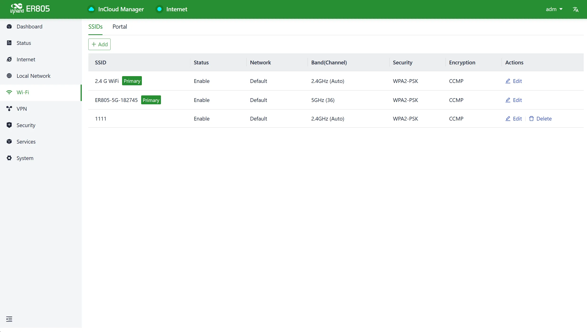

<strong>Fig. 4-12 Wi-Fi List</strong>

Click the "Add/Edit" button under 【Wi-Fi】>【Wi-Fi List】to add a new SSID or edit an existing one.

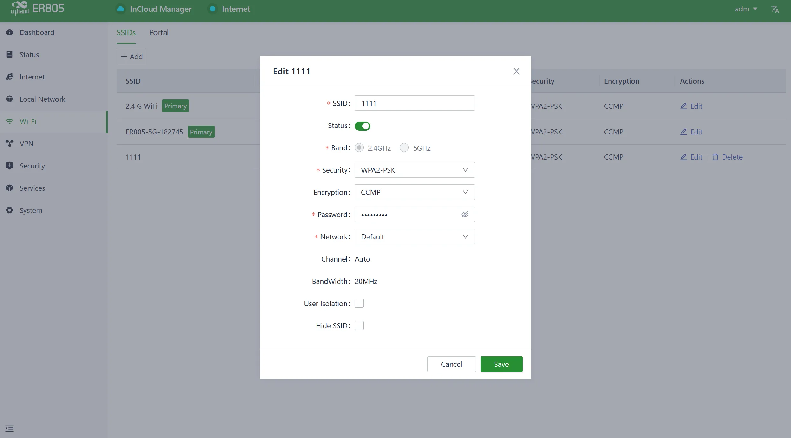

<strong>Fig. 4-13 Edit SSID</strong>

> **Notes:**
> - The device comes with default 2.4GHz and 5GHz main SSIDs. The frequency bands of these main SSIDs cannot be modified or deleted.
> - Once an SSID is added, its frequency band cannot be changed, and it automatically uses the same channel as its corresponding main SSID.
> - If a Wi-Fi (STA) interface is created in the "Internet" menu with the same frequency band as an existing SSID, that SSID cannot be enabled until the Wi-Fi (STA) interface is deleted.

### 4.4 VPN

A Virtual Private Network (VPN) is an encryption technology used to establish a secure, private network connection over the public Internet. It enables secure access to private network resources from anywhere by encrypting communication data, ensuring confidentiality and security.

#### 4.4.1 IPSec VPN

IPsec (Internet Protocol Security) VPN is a protocol suite designed to enhance network communication security by encrypting and authenticating data transmission. It is widely used for establishing secure remote access, site-to-site connections, and VPNs.

Click the "Add" button under 【VPN】>【IPSec VPN】to add a new IPSec VPN.

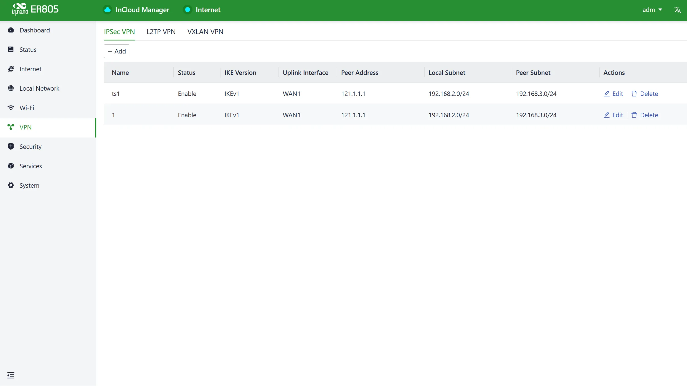

<strong>Fig. 4-14 Add IPSec VPN</strong>

Once configurations are completed at both ends, the tunnel can be established. Check the tunnel establishment status in the 【Status】>【VPN】menu.

| Parameter | Description |
|-----------|-------------|
| Name | User-assigned name for local identification |
| IKE Version | Version of the Internet Key Exchange protocol; supports IKEv1 and IKEv2 |
| Pre-Shared Key | Secret shared key that must match on both devices for IKE negotiation authentication |
| Internet Interface | Upstream interface used to establish the IPSec VPN locally |
| Tunnel Mode | Encapsulation mode for IPSec on IP packets; supports tunnel mode and transport mode |
| Peer Address | Address of the remote endpoint for establishing the IPSec tunnel |
| Local Subnet | Subnet addresses that need to communicate through the IPSec VPN tunnel |
| Remote Subnet | Subnet address on the other end of the tunnel |

**IKE Policy Parameters:**

| Parameter | Options | Default |
|-----------|---------|---------|
| Encryption Method | DES, 3DES, AES128, AES192, AES256 | AES128 |
| Authentication Method | MD5, SHA1, SHA2-256, SHA2-384, SHA2-512 | SHA1 |
| DH Group | 1, 2, 5, 14, 15, 16, 19, 20 | — |
| Timeout | IKE SA lifetime | 86400 seconds |

**IPSec Policy Parameters:**

| Parameter | Options | Default |
|-----------|---------|---------|
| Security Protocol | ESP protocol options | — |
| Encryption Method | DES, 3DES, AES128, AES192, AES256 | AES128 |
| Authentication Method | MD5, SHA1, SHA2-256, SHA2-384, SHA2-512 | SHA1 |
| PFS Group | 1, 2, 5, 14, 15, 16, 19, 20 | — |
| Timeout | IPSec SA aging time | 86400 seconds |

> **Notes:**
> - The device with the public IP address acts as the server; client devices connect using the server's public IP address.

#### 4.4.2 L2TP VPN

Layer 2 Tunneling Protocol (L2TP) is a Layer 2 VPN protocol designed to establish secure point-to-point or site-to-site connections. It is commonly used for remote access and branch office connectivity.

 **Work as a Client**

The ER805 can act as an L2TP client and establish a tunnel with a remote L2TP server. Click 【VPN】>【L2TP VPN】>【Client】, then use the "Add" button to configure an L2TP client.

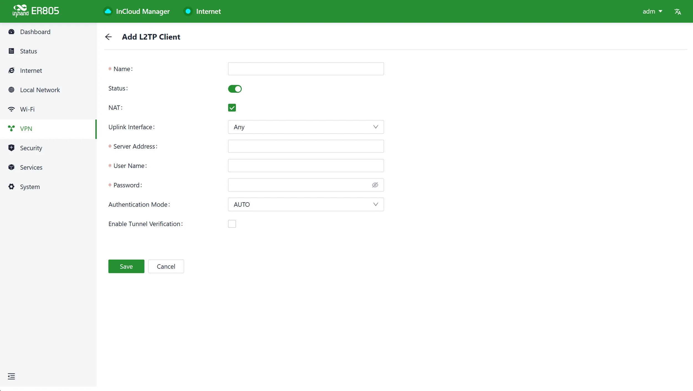

<strong>Fig. 4-15 Set L2TP Client Parameters</strong>

| Parameter | Description |
|-----------|-------------|
| Name | Name of the L2TP client for local identification |
| Status | Switch to enable or disable the L2TP client tunnel |
| NAT | NAT functionality switch when forwarding with the L2TP client |
| Upstream Interface | Upstream interface used for communication between L2TP client and server |
| Server Address | Communication address of the remote L2TP server |
| Username/Password | Credentials configured identically on both ends during L2TP negotiation |
| Authentication Mode | L2TP authentication mode setting |
| Enable Tunnel Authentication | When enabled, both ends configure identical credentials for tunnel authentication |

**Work as a Server**

An L2TP server is typically deployed at enterprise headquarters as a remote access server. Click 【VPN】>【L2TP VPN】>【Server】to access the L2TP server editing page.

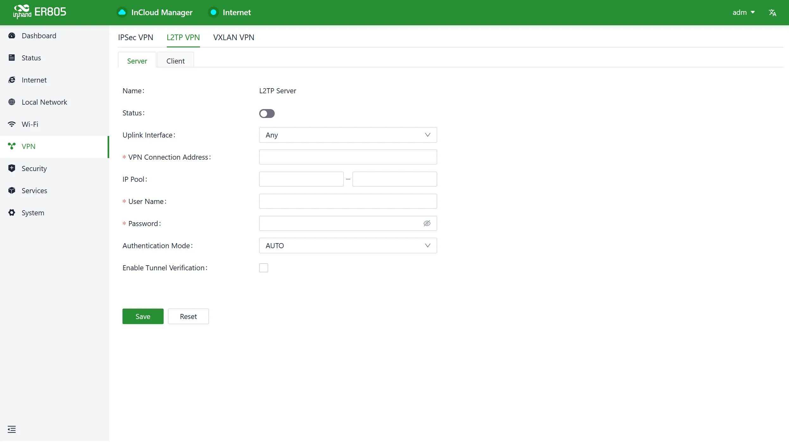

<strong>Fig. 4-16 Set L2TP Server Parameters</strong>

| Parameter | Description |
|-----------|-------------|
| Name | Name of the L2TP server; not editable |
| Status | On/off switch for the L2TP server function; default is off |
| Upstream Interface | Upstream interface used by the L2TP server |
| VPN Communication Address | Gateway address for L2TP clients; assignable from the IP address pool |
| Address Pool | IP address pool used for communication when L2TP clients connect |
| Username/Password | Credentials that must match on both ends for L2TP negotiation |
| Authentication Mode | L2TP authentication mode setting |
| Enable Tunnel Verification Function | When enabled, usernames/passwords for tunnel verification must match on both ends |

#### 4.4.3 VXLAN VPN

VXLAN (Virtual Extensible LAN) is a tunneling technology that establishes a logical tunnel over an IP network between source and destination network devices. It achieves data transmission by encapsulating user-side packets.

Click the "Add" button under 【VPN】>【VXLAN VPN】to create a new VXLAN VPN.

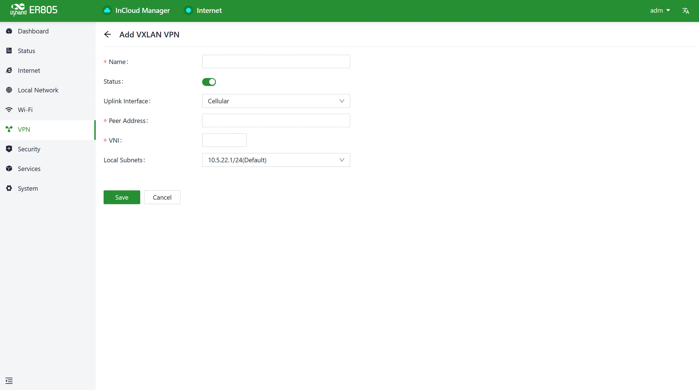

<strong>Fig. 4-17 Add VXLAN VPN</strong>

| Parameter | Description |
|-----------|-------------|
| Name | Name for the VXLAN VPN network |
| Upstream Interface | Outbound interface used to establish VXLAN tunnel with other devices |
| Peer Address | IP address of the peer device for establishing the VXLAN VPN |
| VNI | VXLAN Network Identifier; each VNI represents a different tenant or network segment |
| Local Subnet | Address range assigned to local client devices when connecting |

> **Note:** VXLAN cannot be used simultaneously with other VPN functions and IP Passthrough functions.

### 4.5 Security

The 【Security】menu provides advanced features related to firewalls, policy routing, and traffic shaping.

#### 4.5.1 Firewall

The firewall includes functions such as inbound rules, outbound rules, port forwarding, and MAC address filtering.

 **Inbound Rules / Outbound Rules**

Implement traffic in/out control based on interfaces through 【Security】>【Firewall】>【Outbound Rules/Inbound Rules】. For example, if subjected to significant attacks from a specific source IP address, use inbound firewall rules to restrict traffic from that IP.

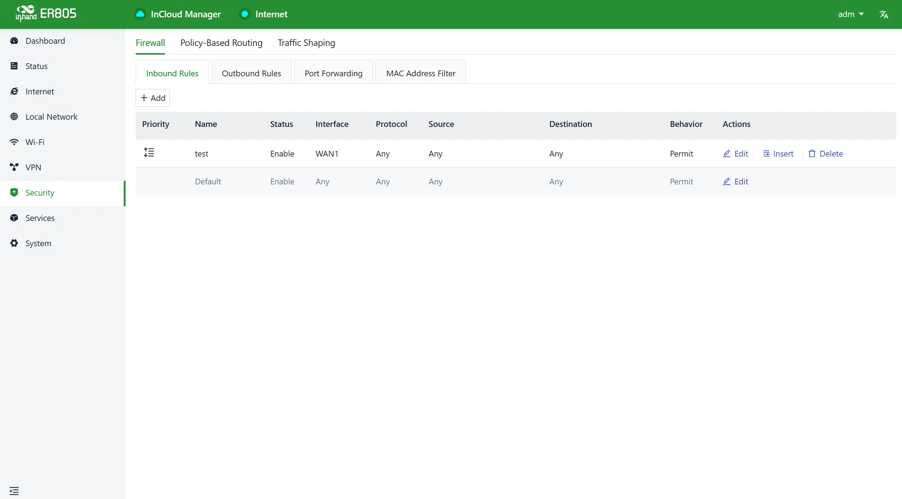

<strong>Fig. 4-18 Firewall Function Entry</strong>

IT personnel can utilize outbound firewall rules to restrict certain users' access to external networks. Inbound and outbound rules share the same configurable content, with the only distinction being the default rules.

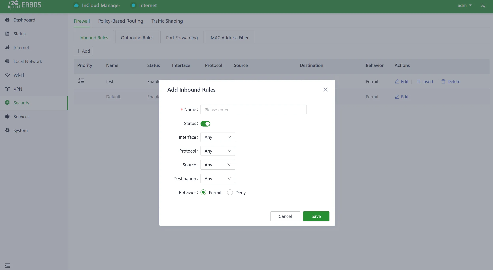

<strong>Fig. 4-19 Add Inbound/Outbound Rule</strong>

| Parameter | Description |
|-----------|-------------|
| Name | Name of the rule for local identification |
| Status | Rule function switch |
| Interface | Outbound rules: upstream interface where traffic leaves the router; Inbound rules: upstream interface where traffic enters |
| Protocol | Match traffic based on protocol type (Any, TCP, UDP, ICMP, or custom) |
| Source | Match source address for traffic; default is Any |
| Destination | Match destination address for traffic; default is Any |
| Action | Action for matching traffic: allow or deny |

- **Inbound Rules**: Traffic management rules for external network accessing the router; default is deny all.
- **Outbound Rules**: Traffic management rules for traffic going out through the router; default is allow all.
- Support for adjusting the priority of inbound and outbound rules.

**Port Forwarding**

Port forwarding redirects network packets from one network port to another. Configure port forwarding rules under 【Security】>【Firewall】>【Port Forwarding】. When external traffic accesses a specific port on the router, the device forwards data to the corresponding port of an internal client.

**Example**: To access a service on port 1024 of internal client 192.168.2.10 from the external network, map this client's port to port 1024 under the WAN1 interface. External users enter `https://<WAN1_IP>:1024` to access the target device.

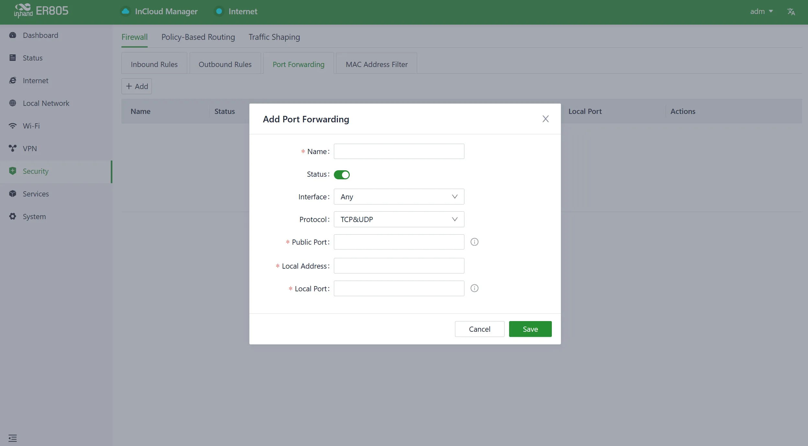

<strong>Fig. 4-20 Add Port Forwarding Rule</strong>

| Parameter | Description |
|-----------|-------------|
| Name | Name of the rule for local identification |
| Status | On/off switch for the rule |
| Interface | Upstream interface providing mapping; requires public IP address support |
| Protocol | Protocol type: TCP, UDP, or TCP & UDP |
| Public Port | Port number on the upstream interface providing mapping |
| Local Address | Address of the target device under the router |
| Local Port | Port of the target device; must match the public port input range |

 **MAC Address Filter**

MAC address filtering allows or disallows devices in a MAC address list to access the Internet, controlling LAN devices' Internet access requests. Configure rules in 【Security】>【Firewall】>【MAC Address Filtering】.

Create multiple MAC addresses in the list, add descriptions, and set to allow only listed MAC addresses (whitelist) or block listed MAC addresses (blacklist).

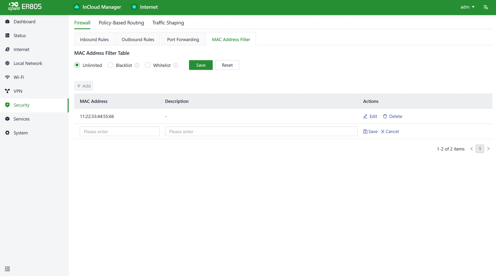

<strong>Fig. 4-21 Add MAC Address Filter Rule</strong>

#### 4.5.2 Policy-Based Routing

Policy routing allows creating policies based on specific needs, enabling different data flows to route through different links. This improves routing decision flexibility, enhances link utilization, and reduces costs. Click the "Add" button under 【Security】>【Policy Routing】to create a new rule.

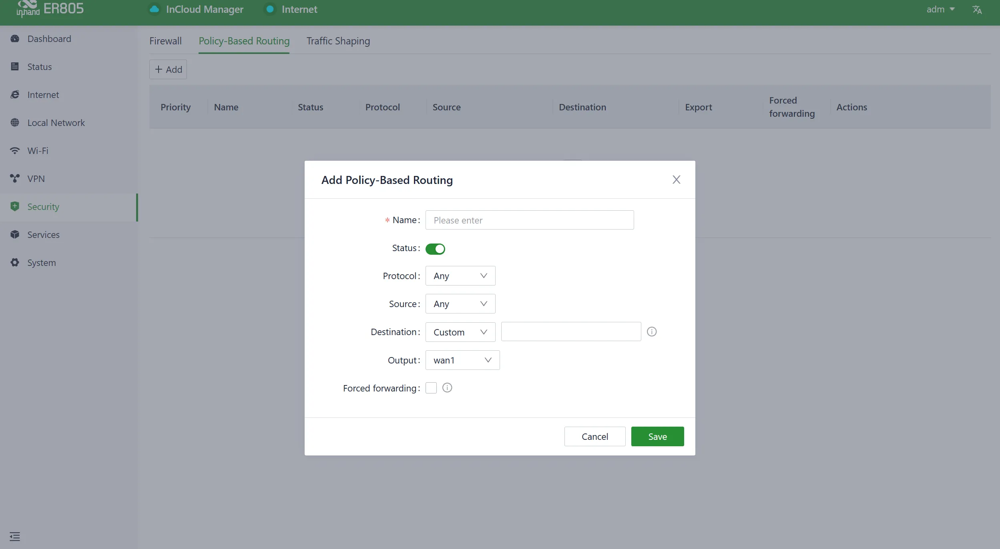

<strong>Fig. 4-22 Add Policy Routing Rule</strong>

> **Caution:** The source address and destination address in a policy routing rule cannot both be set as "Any."

#### 4.5.3 Traffic Shaping

Traffic shaping policies optimize the network based on each protocol, controlling and prioritizing critical business traffic and reducing bandwidth allocated to non-critical traffic. Configure rules in 【Security】>【Traffic Shaping】>【Add/Edit】.

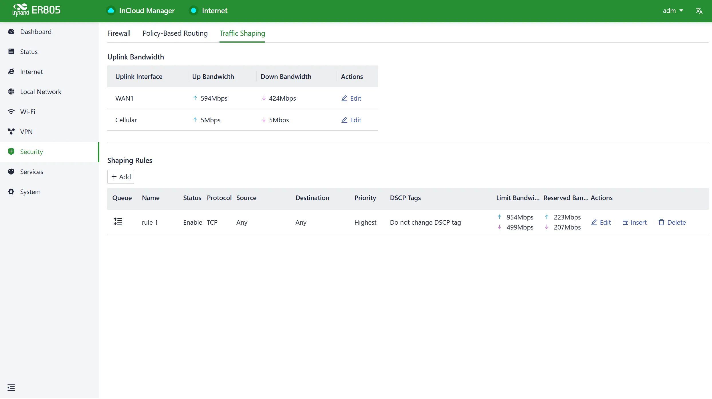

<strong>Fig. 4-23-a Traffic Shaping Interface</strong>

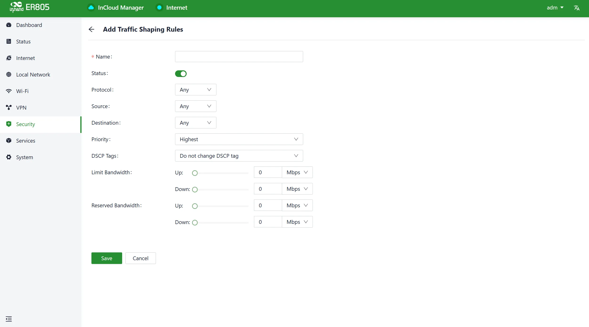

<strong>Fig. 4-23-b Add Traffic Shaping Rule</strong>

Traffic shaping policies consist of rules executed sequentially. Each rule comprises the type of traffic to restrict or adjust and how to limit or adjust that traffic.

> **Notes:**
> - Traffic forwarding priority for unmatched rules is medium.
> - When Limit Bandwidth is set to 0, the system does not limit bandwidth.
> - Reserved Bandwidth value should not exceed Limit Bandwidth.

### 4.6 Services

#### 4.6.1 Interface Management

Configure local networks allowed through a specific interface and set the interface speed in 【Services】>【Interface Management】.

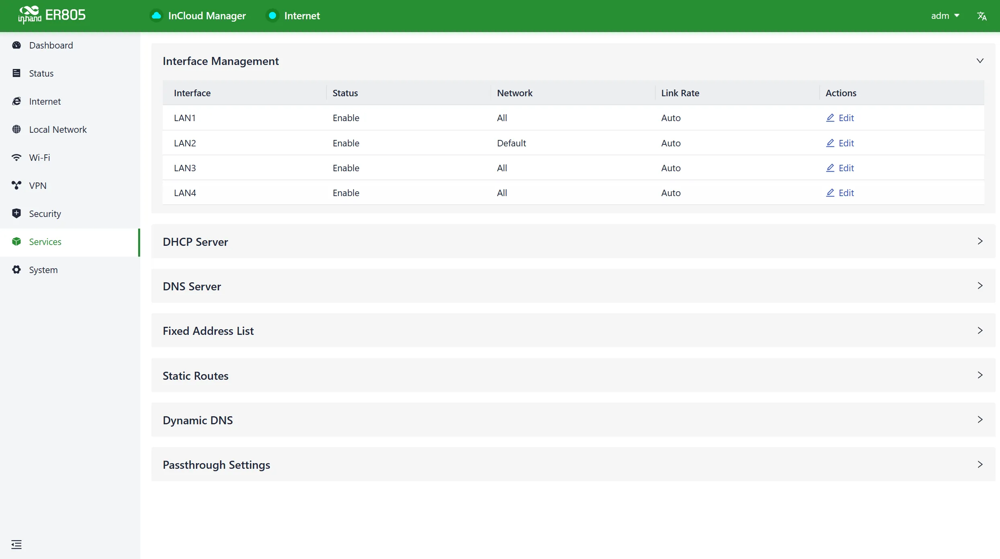

<strong>Fig. 4-24-a Interface Management</strong>

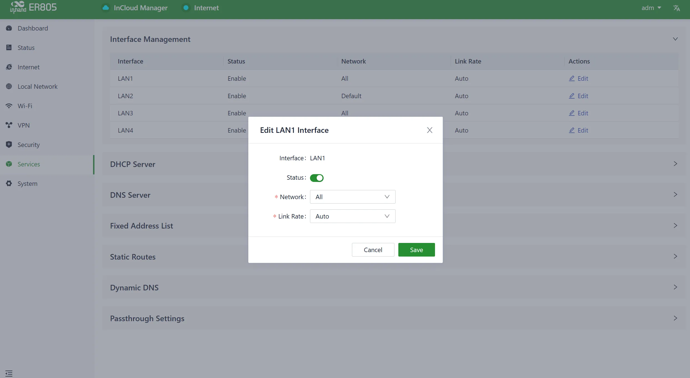

<strong>Fig. 4-24-b Edit Interface</strong>

#### 4.6.2 DHCP Server

DHCP (Dynamic Host Configuration Protocol) operates in a client/server mode, where clients request IP addresses and servers respond by assigning IP addresses dynamically. Configure the DHCP server's IP address pool in 【Services】>【DHCP Server】.

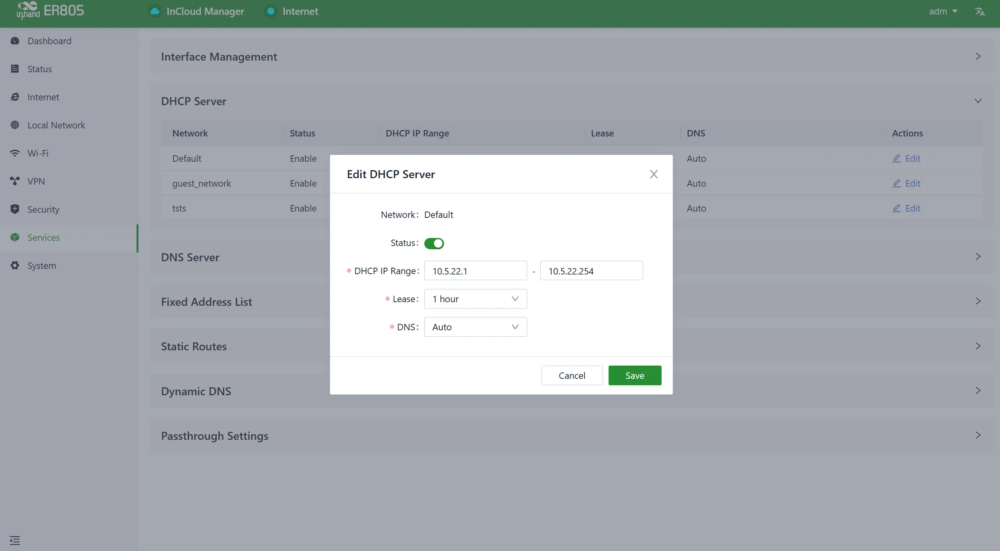

<strong>Fig. 4-25 DHCP Server</strong>

> **Notes:**
> - The device's DHCP service is generated based on network information in the local network. Removing a local subnet from the "Local Network List" also deletes the DHCP Server for that subnet.
> - Local network entries must be set in "IP" mode for the DHCP server function to take effect. Networks in "VLAN Only" mode are not selectable.

#### 4.6.3 DNS Server

DNS (Domain Name System) servers translate human-readable domain names into IP addresses. When no DNS server addresses are set in 【Services】>【DNS Server】, the DNS addresses obtained from the device's upstream interface are used. When DNS addresses are configured manually, the configured addresses are used.

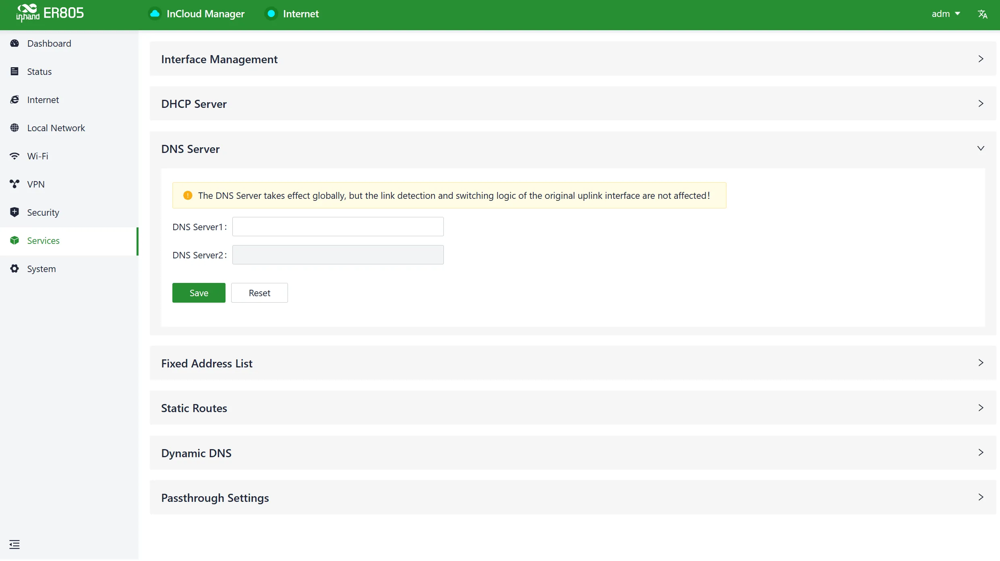

<strong>Fig. 4-26 Add DNS Server</strong>

#### 4.6.4 Fixed Address List

Use 【Services】>【Fixed Address List】to allocate a fixed IP address to a device based on its MAC address. The device consistently receives the same IP address each time it connects to the ER805.

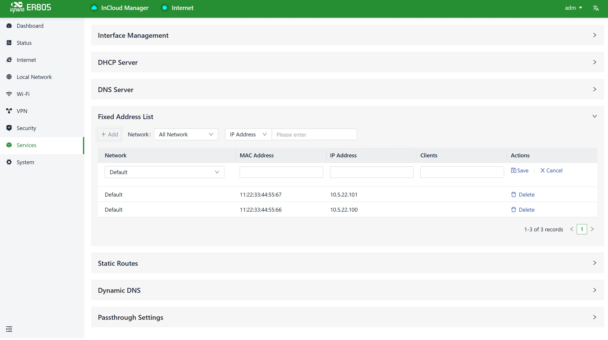

<strong>Fig. 4-27 Add Fixed IP Address</strong>

> **Cautions:**
> - Available addresses must fall within the address range of the local network in IP mode, or the configuration will not take effect.
> - When the local network is deleted, all fixed address allocation rules within that network's address range are removed.

#### 4.6.5 Static Routes

Configure static routing entries in 【Services】>【Static Routing】to enable data forwarding through specified paths and interfaces. Routing entries are manually created by users; entries generated by other services (such as VPN) are not displayed.

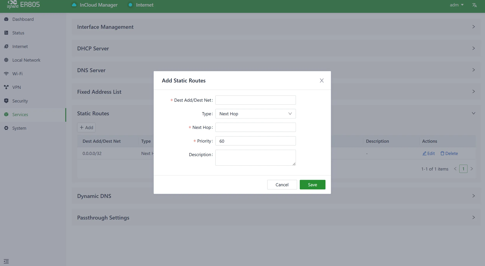

<strong>Fig. 4-28 Add Static Route</strong>

> **Cautions:**
> - For static routes with the same destination address/network, the next-hop address, interface, or priority cannot be identical; otherwise, the route will not function.
> - When WAN2, Wi-Fi (STA), or L2TP Client VPN is deleted, corresponding static routes using those interfaces are also removed.

#### 4.6.6 Dynamic DNS

Dynamic DNS automatically updates name server content in the domain system. It allows users with dynamic IP addresses to have a fixed name server, enabling external users to connect through regular updates. Configure the Dynamic DNS server address in 【Services】>【Dynamic DNS】.

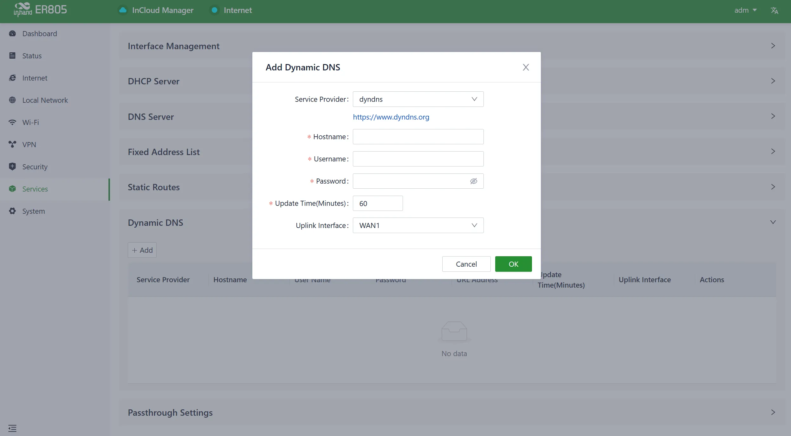

<strong>Fig. 4-29 Add Dynamic DNS Service</strong>

| Parameter | Description |
|-----------|-------------|
| Service Provider | Provided by the Dynamic DNS operator; options include dyndns, 3322, oray, no-ip, or custom (requires URL) |
| Hostname | Register for a hostname via the service provider URL |
| Username | Register for a username via the service provider URL |
| Password | Password set during registration |

#### 4.6.7 Passthrough Settings

Enable IP Passthrough through 【Services】>【Passthrough Settings】. Once enabled, client devices can obtain the upstream interface address of the ER805.

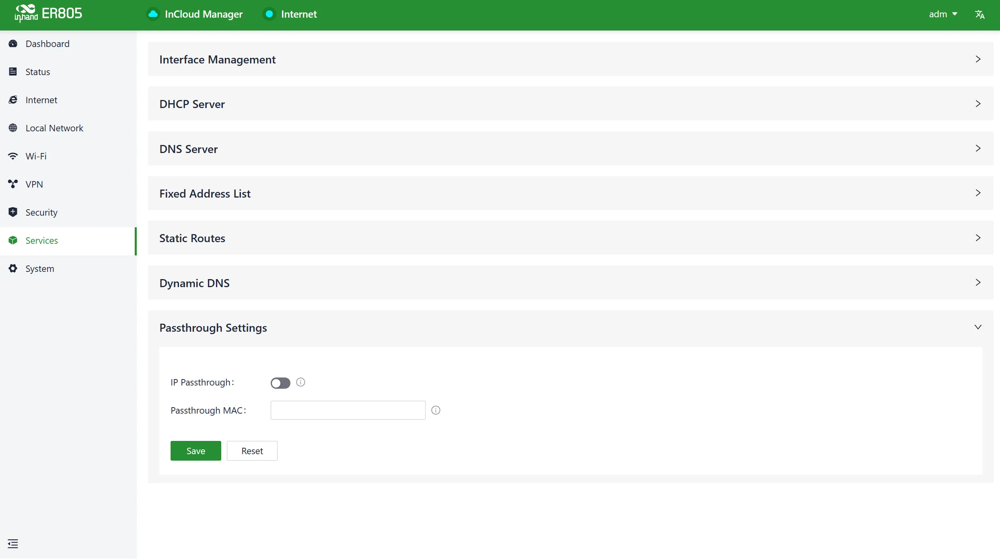

<strong>Fig. 4-30 Enable IP Passthrough</strong>

- **Passthrough MAC**: Only the client bound to this MAC address can obtain the upstream interface address.

> **Cautions:**
> - When IP Passthrough mode is enabled, only one client can access the public network. Static routing, VPN, policy-based routing, SD-WAN Overlay, and cloud connectivity will be affected.
> - When accessing client devices, inbound rules need to be released.
> - The router remains accessible via the default subnet's IP address.

### 4.7 System

The 【System】menu provides settings for cloud management, remote access control, clock, device options, configuration management, device alarms, tools, log servers, and more.

#### 4.7.1 Admin Management

Check the device nameplate for the default username and password. For security, change the password by clicking "adm" in the top navigation bar and selecting "Change Password."

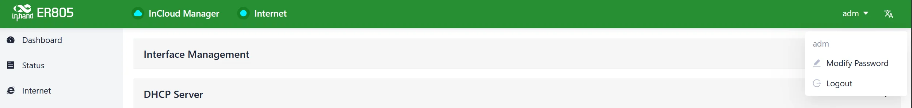

<strong>Fig. 4-31 Modify Password</strong>

#### 4.7.2 Cloud Management

InCloud Service (star.inhandcloud.com) is a cloud platform developed by InHand Networks for enterprise network challenges such as slow deployment, complex operations, and poor user experiences. It integrates zero-touch deployment, intelligent operations and maintenance, security protection, and user experience capabilities. Devices connected to the platform support remote management, batch configuration, and traffic monitoring.

The ER805 automatically connects to the InCloud Service after establishing an Internet connection by default. To disable cloud management, manually turn it off in 【System】>【Cloud Management】.

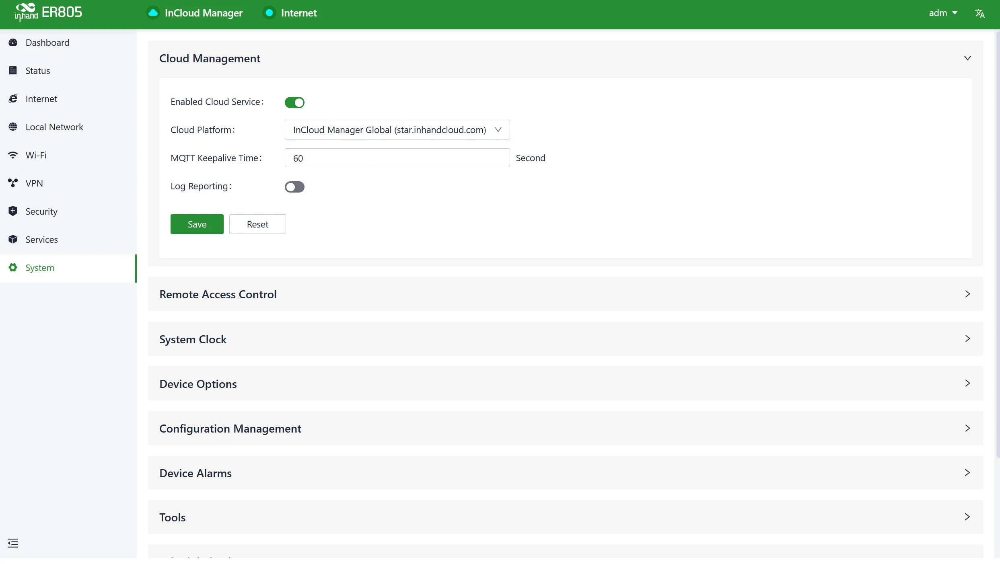

<strong>Fig. 4-32 Enable InCloud Service</strong>

#### 4.7.3 Remote Access Control

Configure whether to allow external access to the router's web configuration interface from the Internet through 【System】>【Remote Access Control】. Set the service port for this purpose.

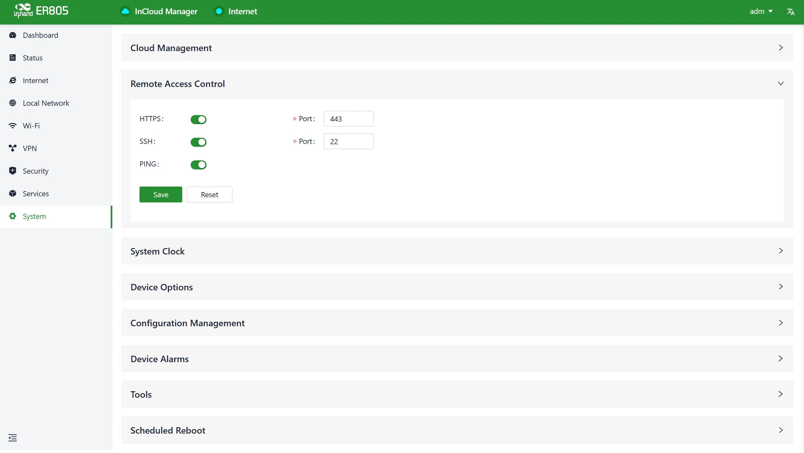

<strong>Fig. 4-33 Set Remote Access Parameters</strong>

- **HTTPS**: When enabled, users can access the router's web interface remotely by entering the public IP address and port number of the upstream interface.
- **SSH**: When enabled, users can remotely log in to the router's backend using remote tools by providing the public IP address, port number, username, and password.
- **Ping**: When enabled, the upstream interface allows external networks to initiate Ping requests.

#### 4.7.4 System Clock

The clock function coordinates and synchronizes time between network devices, crucial for data transmission, log recording, security, and troubleshooting. Use 【System】>【Clock】to select the time zone and configure NTP (Network Time Protocol) server addresses.

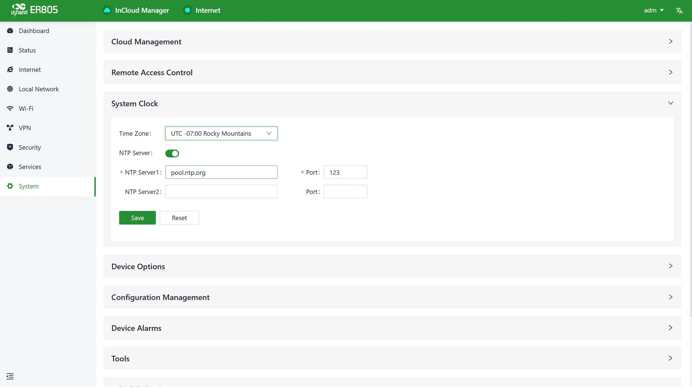

<strong>Fig. 4-34 Set Time Zone and NTP Server</strong>

#### 4.7.5 Device Options

In 【System】>【Device Options】, perform device operations such as rebooting, upgrading firmware, and restoring factory settings.

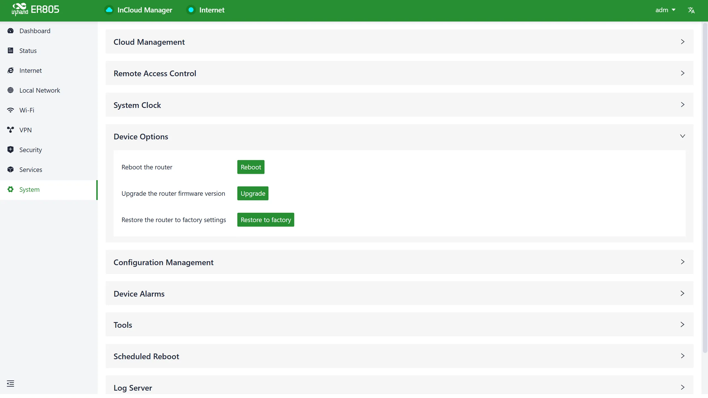

<strong>Fig. 4-35 Device Options</strong>

> **Cautions:**
> - When performing a local firmware upgrade, ensure the firmware is obtained from a legitimate source to avoid rendering the device inoperable.
> - When a device is connected to the cloud platform, the platform synchronizes the previous configuration to the device again due to cloud-based configuration synchronization. The device only clears historical data during factory reset.

#### 4.7.6 Configuration Management

Export device configurations to local storage in 【System】>【Configuration Management】. This backup can be imported in case of configuration loss or when overwriting existing configuration.

<strong>Fig. 4-36 Configuration Management Interface</strong>

#### 4.7.7 Device Alarms

Select specific alarm events and configure the email address for receiving alerts. When an alarm event occurs, the device automatically sends an email notification. Even if certain alarm options are not selected, related events are still recorded in local logs.

Configure alarm event types and email addresses in 【System】>【Device Alarms】.

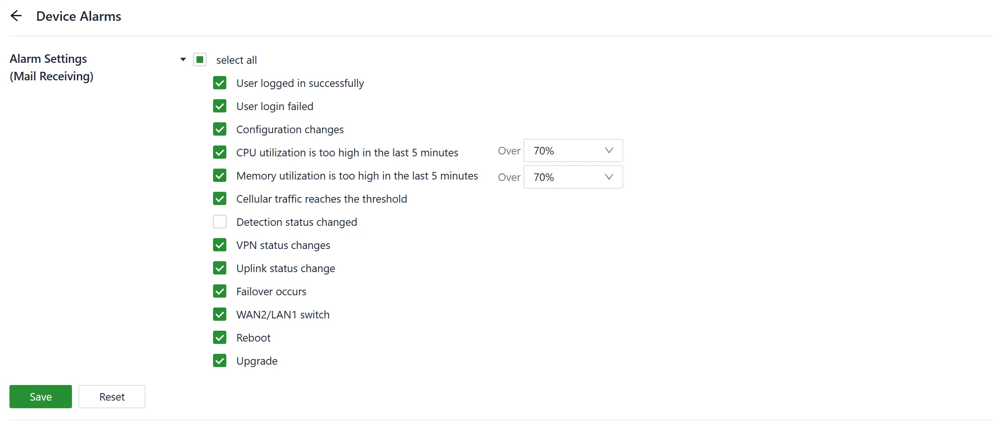

<strong>Fig. 4-37-a Alarm Event Types</strong>

After configuring the outgoing email server address, port, username, and password, the device uses this email account to send alarm notifications. Use the "Send Test Email" option to verify the configuration.

<strong>Fig. 4-37-b Mail Receiving Settings</strong>

#### 4.7.8 Tools

**Ping**

Use ICMP (Internet Control Message Protocol) to check external network connectivity. Enter a domain name or IP address in the "Target" field in 【System】>【Tools】>【Ping】, then click "Start."

<strong>Fig. 4-38 Ping Tool</strong>

**Traceroute**

Traceroute determines the network path that data packets take from source to destination. Enter the target host's IP address in 【System】>【Tools】>【Traceroute】, choose the outgoing interface, and click "Start."

<strong>Fig. 4-39 Traceroute Tool</strong>

**Packet Capture**

Packet capture monitors and records data packets transmitted over the network, used for troubleshooting, performance analysis, and security auditing. Capture packets through a specific interface in 【System】>【Tools】>【Packet Capture】. Select "Output" to display captured data in the interface or export locally.

<strong>Fig. 4-40 Packet Capture</strong>

#### 4.7.9 Scheduled Reboot

Scheduled reboot automatically restarts a device at a specific time or under certain conditions. Set up scheduled reboots in 【System】>【Scheduled Reboot】. The device supports scheduled reboots at fixed times daily, weekly, or monthly.

For monthly reboots, if the selected day exceeds the actual number of days in the month, the device reboots on the last day. For example, selecting the 31st results in a reboot on the 30th in a 30-day month.

<strong>Fig. 4-41 Set Scheduled Reboot Time</strong>

#### 4.7.10 Log Server

A log server collects, stores, and manages log information from network devices. When the log file server function is enabled in 【System】>【Log Server】, the device periodically uploads log files to the specified server.

<strong>Fig. 4-42 Set Log Server Address</strong>

#### 4.7.11 Other Settings

 **Web Login Management**

When logging in to the device's local web interface, the session automatically logs out after a configured period of inactivity. Configure the logout time in 【System】>【Other Settings】>【Web Login Management】.

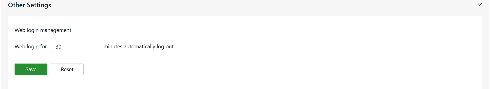

<strong>Fig. 4-43 Set Web Page Logout Time</strong>

 **Accelerated Forwarding**

This feature accelerates packet forwarding and enhances network performance. It is turned off by default. After enabling in 【System】>【Other Settings】>【Accelerated Forwarding】, the device's cellular speed improves significantly.

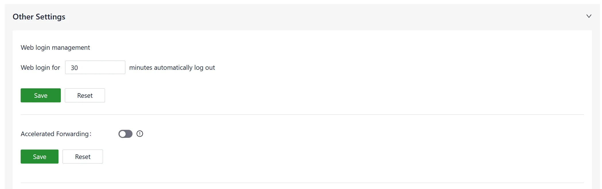

<strong>Fig. 4-44 Enable Accelerated Forwarding</strong>

> **Caution:** Enabling this feature disables the normal functioning of IPSec VPN, traffic shaping, and related features.

**Auto Restart**

This feature automatically restarts the device based on configured conditions. It is turned off by default. Enable in 【System】>【Other Settings】>【Auto Restart】.

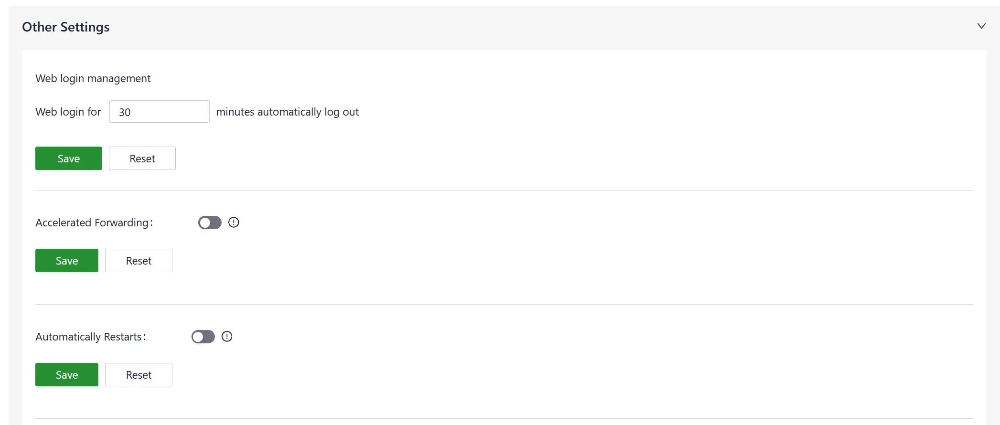

<strong>Fig. 4-45 Enable Auto Restart</strong>

 **SIP ALG**

SIP ALG (Session Initiation Protocol Application Layer Gateway) assists in managing and handling SIP communications, typically used for establishing and managing real-time communication sessions such as voice and video calls. Enable in 【System】>【Other Settings】>【SIP ALG】.

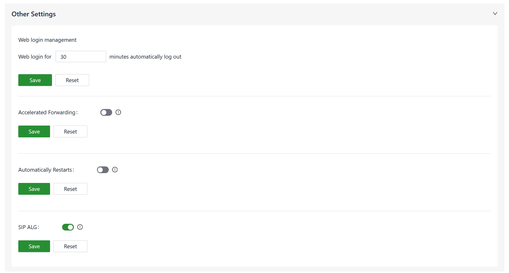

<strong>Fig. 4-46 Enable SIP ALG</strong>

> **Note:** If connected devices engage in VoIP (Voice over Internet Protocol) phone communication, disabling this function is recommended.

#### 4.7.12 SD-WAN

Between enterprise branches, mutual access is often needed for business data transfer and video conferencing. Traditional VPN configurations can be complex and troubleshooting challenging. InHand Networks introduces SD-WAN functionality, which assists in rapidly establishing connections between branches through a user-friendly interface. This enhances link flexibility and reduces operational complexity.

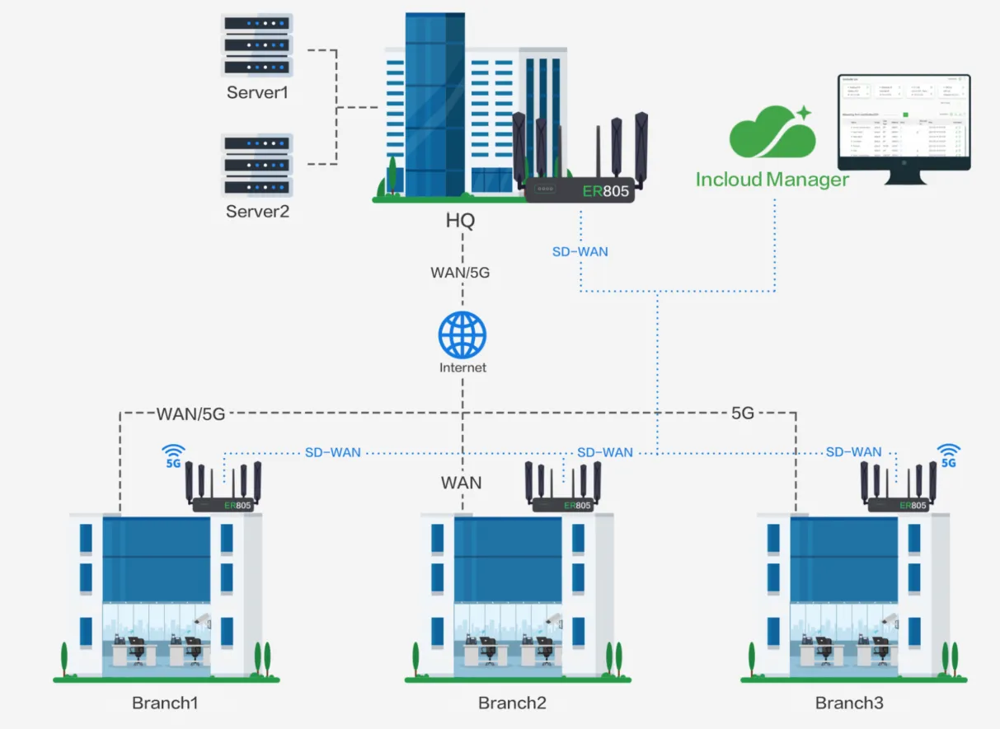

<strong>Fig. 4-47-a SD-WAN Application Scenario</strong>

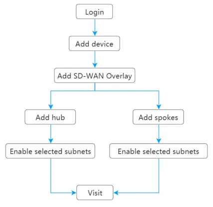

<strong>Fig. 4-47-b SD-WAN Deployment Process</strong>

**Create Network**

In the platform's "Network" function, select "SD-WAN," click "Add," and access the SD-WAN network addition page.

<strong>Fig. 4-48-a SD-WAN Entry</strong>

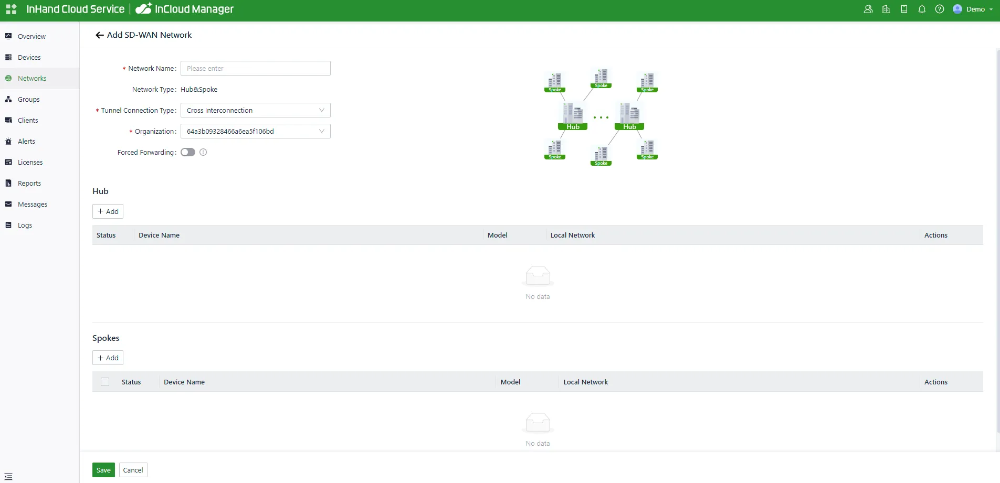

<strong>Fig. 4-48-b Create SD-WAN Network</strong>

The SD-WAN network supports Hub & Spoke topology, with device roles divided into central and branch devices. All branch devices establish tunnels through the central device; traffic between branch devices passes through the central device.

**Hub (Central Device):**

- Requires a public IP address to ensure SD-WAN network operation. Users can also address insufficient public IPs through IP mapping.
- Tunnels are established between the central device's upstream interface with public IP addresses and all upstream interfaces of branch devices.
- The central device's upstream device needs to allow two port numbers and map them to the upstream interface of the ER series router. Port range: 1-65535.
- Supported models: ER805, ER605, ER2000
- Maximum 5 devices can be added.

**Spoke (Branch Device):**

- No specific requirements for public IP addresses.
- Multiple branch devices can be added; final number determined by central device performance.
- Supported models: ER805, ER605.

##### 4.7.12.2 Add Device

On the "Add Network" page, click "Add" for either the central device or branch device. After selecting the device, provide the public IP mapping information. To modify the device's network configuration, click the "Edit" button for the local network.

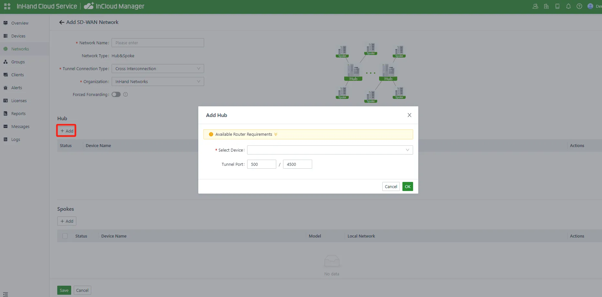

<strong>Fig. 4-49-a Add Hub Device</strong>

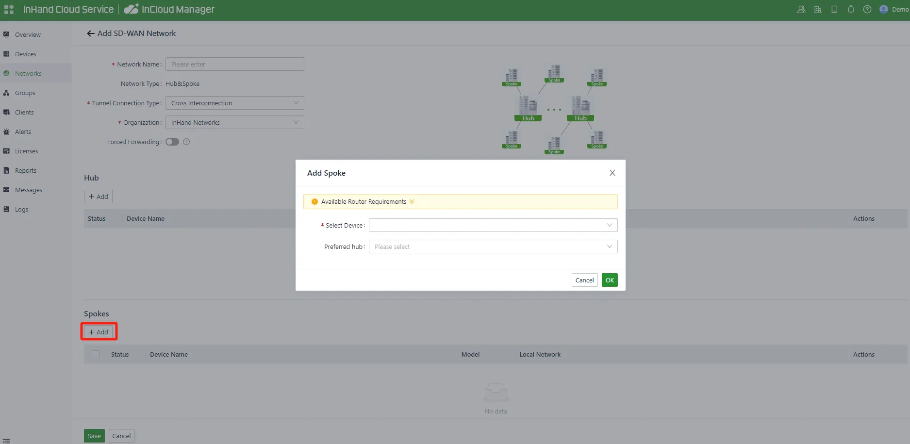

<strong>Fig. 4-49-b Add Spoke Device</strong>

After completing the addition, click "Save." The network is created successfully, and all selected devices and subnets are interconnected. In a single network, the local networks of central and branch devices cannot be identical, as this impacts communication.

 **Check Status**

After adding the network, the topology page displays automatically. Alternatively, go to the "SD-WAN Network" list and click the network name to access topology details. All branch devices establish connections with the central device.

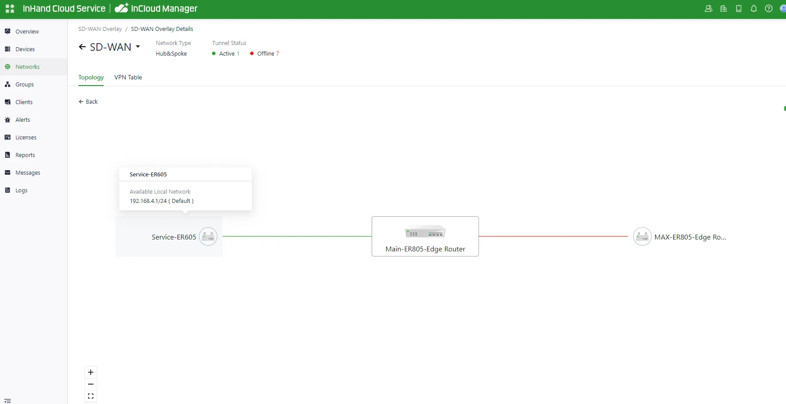

<strong>Fig. 4-50-a SD-WAN Topology</strong>

Hovering the mouse over a link displays the status of tunnels established with the central device interfaces.

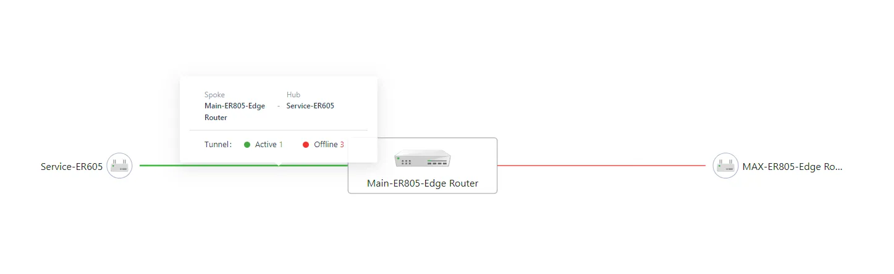

<strong>Fig. 4-50-b Link Status</strong>

Click "VPN Table" at the top-right corner of the "SD-WAN Network Details" page to switch to a tabular view, displaying information about all devices with established VPN connections.

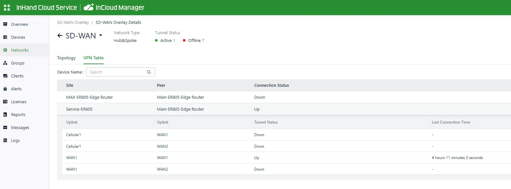

<strong>Fig. 4-50-c VPN List</strong>

---

## Chapter 5 Typical Applications

### Case 1: SD-WAN Enterprise Branch Networking

**Scene Description**: An enterprise with a headquarters and multiple branch offices requires secure inter-branch communication for business data transfer, video conferencing, and resource sharing. Traditional VPN configurations are complex to deploy and maintain. The ER805 with SD-WAN simplifies branch interconnection.

**Device Role**: The ER805 acts as both the central Hub device at headquarters and branch Spoke devices at remote offices. It establishes encrypted tunnels between branches, enabling secure data transmission over the public Internet.

**Configuration Steps:**

1. Deploy an ER805 at headquarters with a public IP address and configure it as the Hub device.
2. Deploy ER805 devices at each branch office and configure them as Spoke devices.
3. Register and log in to InCloud Manager at [https://star.inhandcloud.com/](https://star.inhandcloud.com/).
4. Add all ER805 devices to the InCloud Manager platform (refer to [Scenario 3: Cloud Management](#scenario-3-cloud-management)).
5. Navigate to 【Network】>【SD-WAN】, click "Add" to create a new SD-WAN network.
6. Add the headquarters ER805 as the Hub device, providing public IP mapping information.
7. Add each branch ER805 as a Spoke device.
8. Configure local networks for each device, ensuring no IP address conflicts between headquarters and branch subnets.
9. Click "Save" to create the network. All devices and subnets are interconnected.
10. Verify tunnel status on the topology page; hovering over links displays tunnel health.

**Reference Chapters:**

- [Cloud Management](#scenario-3-cloud-management)
- [SD-WAN](#4712-sd-wan)
- [VPN](#44-vpn)

### Case 2: Retail Store Remote Monitoring

**Scene Description**: A retail chain requires reliable Internet connectivity for POS terminals, security cameras, and remote management at each store location. Wired broadband may be unavailable or unreliable; cellular backup ensures continuous operations.

**Device Role**: The ER805 serves as the store gateway router, providing primary Internet access via wired WAN with cellular as backup. It connects to InCloud Manager for centralized monitoring and management across all store locations.

**Configuration Steps:**

1. Install the ER805 at the store location following the [Installation Guide](#22-installation-guide).
2. Insert a SIM card and attach cellular antennas for backup connectivity.
3. Connect the WAN1 port to the store's broadband modem via Ethernet cable.
4. Connect POS terminals and cameras to the LAN ports.
5. Log in to the web interface and verify wired Internet connectivity (refer to [Scenario 2: Wired Internet Access](#scenario-2-wired-internet-access)).
6. Configure cellular APN parameters as backup (refer to [Scenario 1: Cellular Internet Access](#scenario-1-cellular-internet-access)).
7. Configure link priority in 【Internet】>【Uplink Table】, placing WAN1 above Cellular.
8. Add the device to InCloud Manager for remote monitoring (refer to [Scenario 3: Cloud Management](#scenario-3-cloud-management)).
9. Configure firewall rules in 【Security】>【Firewall】to restrict unauthorized access to POS systems.
10. Verify remote access by logging in to InCloud Manager and checking device status.

**Reference Chapters:**

- [Installation and First Use](#chapter-2-installation-and-first-use)
- [Cellular Internet Access](#scenario-1-cellular-internet-access)
- [Wired Internet Access](#scenario-2-wired-internet-access)
- [Cloud Management](#scenario-3-cloud-management)
- [Firewall](#451-firewall)

---

## Appendix: Troubleshooting

### 1 Network Connection Issues

| Phenomenon | Possible Cause | Troubleshooting Steps | Reference Chapter |
|------------|---------------|----------------------|-------------------|
| Cannot connect to cellular network | SIM card not inserted or poor contact | 1. Check whether SIM card is correctly inserted 2. Reinsert the SIM card | [Insert SIM Card](#221-insert-sim-card) |
| Cannot connect to cellular network | APN parameter configuration error | 1. Verify APN parameters are correct 2. Contact operator for correct APN | [Cellular Connection](#413-cellular-connection) |
| Cannot connect to cellular network | Weak or no signal | 1. Check antenna connection 2. Adjust device position | [Attach Antennas](#222-attach-antennas) |
| Cannot connect to wired network | DHCP server disabled on upstream device | 1. Check upstream device DHCP status 2. Switch to Static IP or PPPoE | [Wired Connection](#411-wired-connection) |
| Cannot connect to wired network | Incorrect Static IP configuration | 1. Verify IP address, subnet mask, gateway, and DNS 2. Contact ISP for correct parameters | [Wired Connection](#411-wired-connection) |
| Cannot connect to wired network | Incorrect PPPoE account/password | 1. Verify broadband account credentials 2. Re-enter username and password | [Wired Connection](#411-wired-connection) |
| No Internet access after connection | Link detection failure in dedicated network | 1. Disable link detection in 【Internet】>【Uplink Settings】 2. Verify network parameters | [Uplink Settings](#415-uplink-settings) |

### 2 Web Interface Access Issues

| Phenomenon | Possible Cause | Troubleshooting Steps | Reference Chapter |
|------------|---------------|----------------------|-------------------|
| Cannot open web interface | Incorrect IP address | 1. Confirm PC and device are in same subnet 2. Check device default IP (192.168.2.1) | [Access Web Interface](#225-access-the-web-management-interface) |
| Cannot open web interface | Browser compatibility issue | 1. Change browser (Chrome recommended) 2. Clear browser cache | [Access Web Interface](#225-access-the-web-management-interface) |
| Cannot open web interface | PC IP configuration error | 1. Verify PC obtained IP via DHCP 2. Manually configure static IP in 192.168.2.x range | [Access Web Interface](#225-access-the-web-management-interface) |
| Forgot login password | Credential loss | 1. Check device nameplate for default credentials 2. Perform factory reset if necessary | [Restore Factory Settings](#15-restore-factory-settings) |

### 3 Wi-Fi Issues

| Phenomenon | Possible Cause | Troubleshooting Steps | Reference Chapter |
|------------|---------------|----------------------|-------------------|
| Wi-Fi not working | Wi-Fi disabled | 1. Check Wi-Fi status in 【Wi-Fi】settings 2. Enable the SSID | [Wi-Fi](#43-wi-fi) |
| Cannot connect to Wi-Fi | Incorrect password | 1. Verify password (default: last 8 digits of serial number) 2. Reset Wi-Fi password | [Default Settings](#16-default-settings) |
| SSID not visible | Wi-Fi (STA) enabled on same band | 1. Check if Wi-Fi (STA) is enabled in 【Internet】 2. Delete Wi-Fi (STA) or use different band | [Wi-Fi STA](#412-wi-fi-sta-connection) |

### 4 Cloud Management Issues

| Phenomenon | Possible Cause | Troubleshooting Steps | Reference Chapter |
|------------|---------------|----------------------|-------------------|
| Device shows offline in platform | No Internet connectivity | 1. Verify device has Internet access 2. Check cellular or wired connection status | [Scenario 1](#scenario-1-cellular-internet-access) / [Scenario 2](#scenario-2-wired-internet-access) |
| Device shows offline in platform | Cloud management disabled | 1. Check 【System】>【Cloud Management】status 2. Enable cloud management | [Cloud Management](#472-cloud-management) |
| Cannot add device | Incorrect serial number or MAC | 1. Verify serial number and MAC from nameplate 2. Re-enter correct information | [Scenario 3](#scenario-3-cloud-management) |
| License expired | License validity ended | 1. Check license status in InCloud Manager 2. Renew license through "License" menu | [Scenario 3](#scenario-3-cloud-management) |

### 5 VPN Issues

| Phenomenon | Possible Cause | Troubleshooting Steps | Reference Chapter |
|------------|---------------|----------------------|-------------------|
| IPSec tunnel not established | Mismatched parameters | 1. Verify pre-shared key, encryption, and authentication match 2. Check IKE version compatibility | [IPSec VPN](#441-ipsec-vpn) |
| IPSec tunnel not established | No public IP address | 1. Verify server-side has public IP 2. Configure port forwarding on upstream device | [IPSec VPN](#441-ipsec-vpn) |
| L2TP tunnel not established | Incorrect server address | 1. Verify server IP address or domain 2. Check network connectivity to server | [L2TP VPN](#442-l2tp-vpn) |
| VXLAN not working | Conflicting function enabled | 1. Disable other VPN functions 2. Disable IP Passthrough | [VXLAN VPN](#443-vxlan-vpn) |

---

## Appendix: Safety Precautions

1. Use the original power adapter to avoid device damage from mismatched power adapters.
2. When installing the device, avoid environments with strong electromagnetic interference and maintain safe distance from high-power equipment. After installation, ensure the device is stable to prevent accidental drops.
3. Ensure the device's operating environment meets temperature and humidity requirements specified in this manual.
4. Regularly inspect device cables, including Ethernet cables and power adapter connections. Keep cables clean and replace if damage is detected.
5. When cleaning the device, avoid spraying chemical agents directly on the device surface to prevent damage to the housing or internal components. Use a soft cloth for cleaning.
6. Do not attempt to disassemble or modify the device, as this poses safety risks and may void the warranty.

> **Warning**: Non-professionals should not open the device enclosure. Risk of electric shock.

---

## FAQ

### Question 1: What are the differences between ER routers and regular routers?

1. Edge Router: ER routers support multiple Internet access methods (wired and cellular 4G/5G), multiple gigabit Ethernet ports, and Wi-Fi 6. They support various terminal device access, SD-WAN, out-of-band management, and cloud management.
2. Regular Router: Typically relies on fixed broadband connections such as DSL or fiber. Regular routers lack a unified management platform and advanced features such as firewall and SD-WAN.

### Question 2: Unable to connect to 4G/5G network?

1. Physical Environment: Check whether the SIM card is inserted into the correct slot and ensure all cellular antennas are properly installed.
2. APN Settings: Ensure APN configuration matches the information provided by the service provider.
3. Check Device Connectivity: Log in to the device's local interface and use the built-in ICMP tool to ping 8.8.8.8 to test connectivity. If successful, check connectivity between the client device and the router.
4. Check SIM Card: Remove the SIM card and insert it into a phone to verify it can connect to the Internet.
5. Restart: Power off the router, wait a few seconds, then reconnect power and retry.
6. Factory Reset: Perform a factory reset on the router and attempt connection again.

### Question 3: Is the cloud platform free of charge?

InHand Networks provides network services for small and medium-sized chain organizations. When utilizing cloud platform services, licenses for each device are required to access extensive cloud-based features. When a device is first added to the platform, it automatically receives a 1-year Essential license.

### Question 4: How to add devices to the cloud platform?

1. Register an InCloud Manager account at [https://star.inhandcloud.com/](https://star.inhandcloud.com/).
2. Log in to the cloud platform. Under the "Devices" menu, click "Add" and follow the prompts to enter the device's serial number and MAC address. This completes the device addition process. A complimentary 1-year Basic Edition license is included when a device is added for the first time.

### Question 5: Is it possible to use the device without the cloud platform?

Yes. Users can complete the majority of configuration tasks locally through the web interface. However, features such as bulk configuration deployment, firmware upgrades, SD-WAN, and Connector require the cloud platform.

---

**Document Information**

| Item | Content |
|------|---------|
| Product Model | Edge Router 805 (ER805) |
| Version | V1.0 |
| Date | 2024 |
| Manufacturer | InHand Networks |
