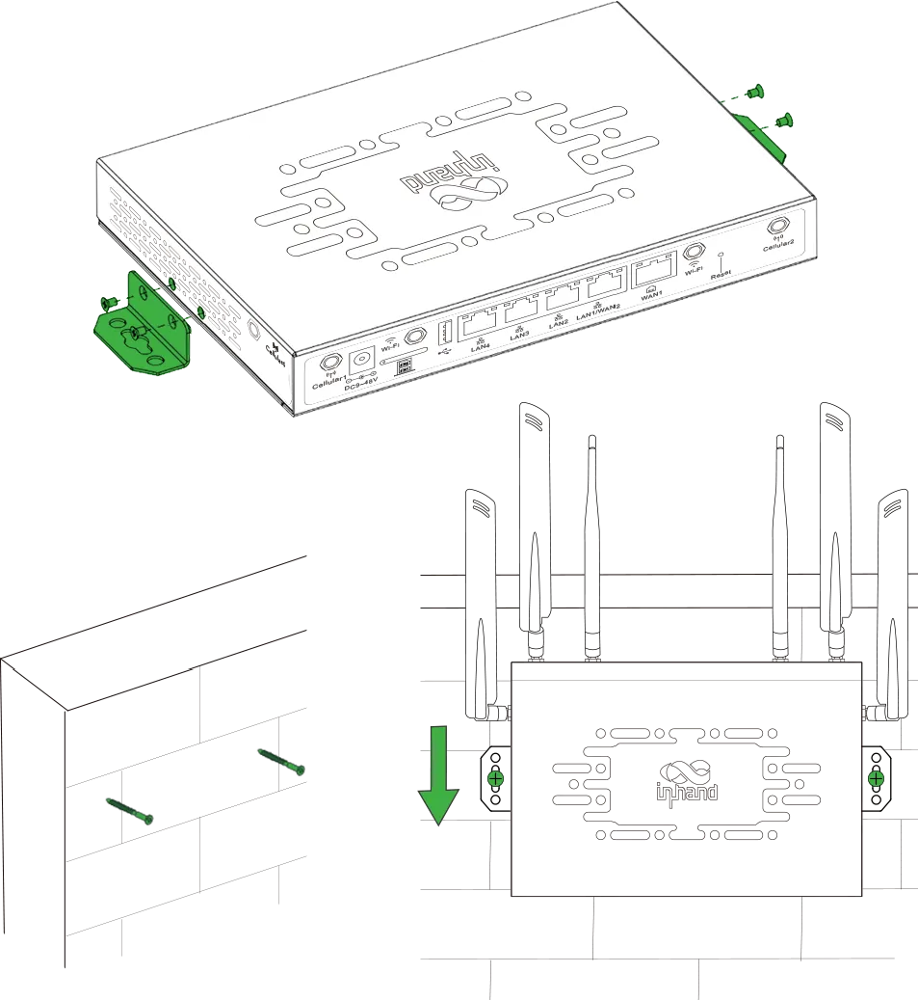
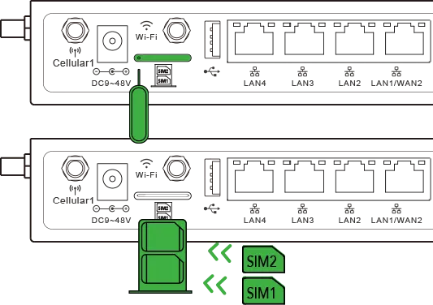
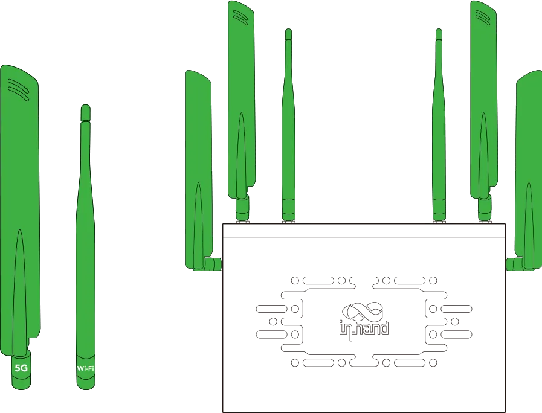
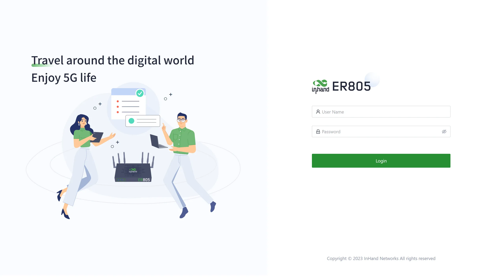
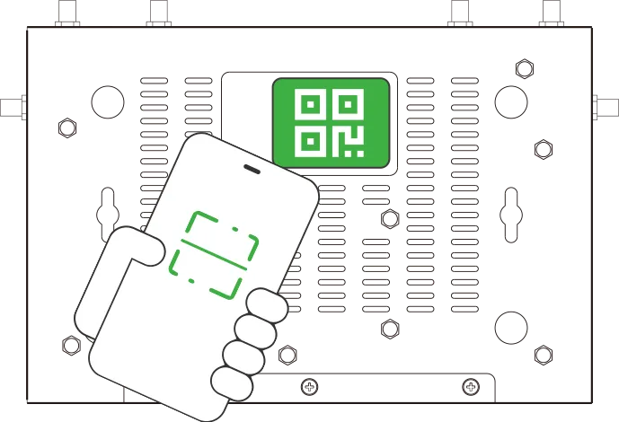
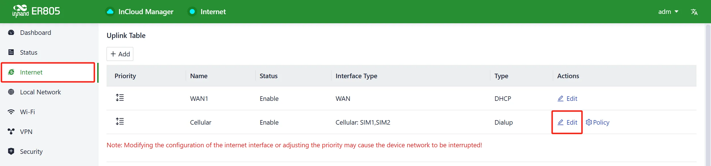
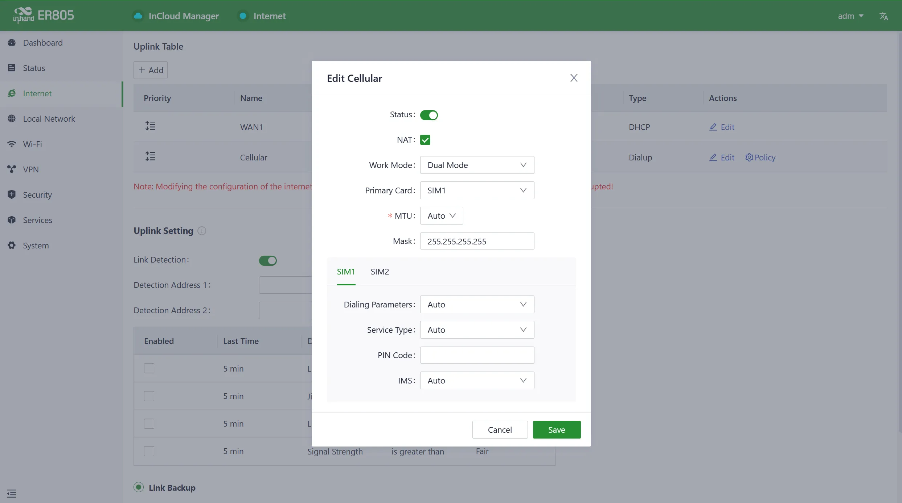
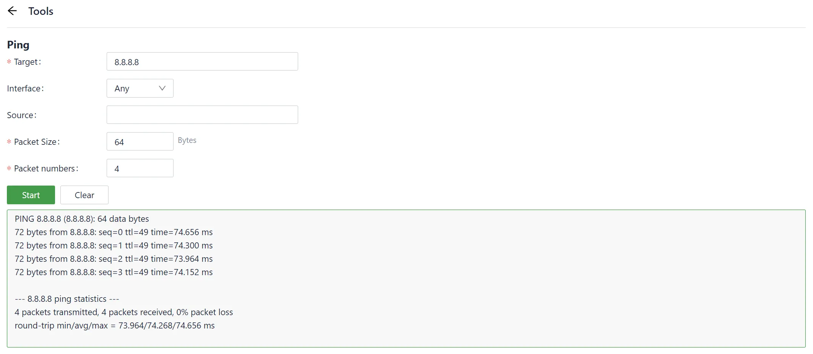

# Edge Router 805 Quick Installation Guide

## Part 1: Quick Installation (Visual Step-by-Step)

> **You need to do first:** Unbox → Fix the device → Connect power and Ethernet → (If using cellular) **Power off** to insert SIM, attach antennas → Power on → PC on same subnet → Open Web in browser.
> **Then:** Scroll down to **Part 2** for packing list, LED meanings, mounting, and interface details.

### Must-Read Summary (Before Wiring and Power-On)

| Item | Requirement |
|------|-------------|
| Power Supply | **9~48V DC**, or use the included power adapter. Pay attention to the voltage level. |
| SIM Card | **Power off** the device before inserting or removing the SIM card tray. |
| Antennas | Tighten antennas onto the SMA connectors according to the housing labels. |
| Environment | Working temperature: **-20℃~70℃**. Avoid direct sunlight and strong electromagnetic interference. |

### Step 1: Check the Panel and Interface Areas

Take out the ER805 and compare it with the diagram below. Identify the Power IN, SIM slots, USB port, Ethernet ports, and Reset button.

- **Power IN**: Power input interface.
- **SIM cards slot**: Dual nano SIM card slots.
- **USB**: USB Type-A with USB 2.0 protocol.
- **WAN1 / WAN2/LAN1 / LAN2~4**: Ethernet ports. See §2.5.1 for details.
- **Reset**: Pinhole reset button. See §2.3.3 for its usage.

> For a complete description of each interface, see **§2.2**.

### Step 2: Mount the Device on a Desktop or Wall

Choose one of the following mounting methods:

**Desktop**: Attach the foot pads to the bottom of the housing, then place the device steadily on the tabletop.

**Wall-mounted (Ear-Hanging)**: Install the hanging ears at the cutouts on both sides of the device. Mount two screws on the wall at the correct spacing, then hang the device and push down to confirm it is stable.

**Wall-mounted (Direct)**: Drill holes and install expansion screws matching the mounting hole positions on the bottom of the device. Push the device down to ensure it is firmly mounted.

> Detailed mounting and removal steps are in **§2.4**.

### Step 3: Connect Power and Ethernet

1. Connect the Ethernet cable from your PC or upstream network to one of the device's LAN ports (LAN2~LAN4) or WAN port (WAN1 / WAN2/LAN1).
2. Insert one end of the power adapter into the power outlet and the other end into the device's Power IN interface.

> For power specifications, see **§2.5.2**. For Ethernet port roles, see **§2.5.1**.

### Step 4: Power Off to Insert SIM and Attach Antennas (If Using Cellular)

**Make sure the device is powered off before proceeding.**

1. Use the SIM card ejector tool to press the small hole and release the SIM card tray. Install the nano SIM card(s) on the tray, then insert the tray back into the slot.

2. Attach the antennas to the SMA connectors on the device:
   - **ER805 4G model**: 2 LTE antennas + 2 Wi-Fi antennas.
   - **ER805 5G model**: 4 5G antennas + 2 Wi-Fi antennas.

> For SIM card and antenna details, see **§2.5.6**.

### Step 5: Power On and Confirm the Device Is Ready

1. Connect the power adapter to power on the device.
2. Observe the front-panel LEDs:
   - The **System** LED blinks blue during boot.
   - The **System** LED turns steady blue when the system is running smoothly.
   - The **Network** LED indicates cellular or wired connection status.

> For the full LED description, see **§2.3**.

### Step 6: Log In via PC and Browser

1. Connect your PC to the device's LAN port using an Ethernet cable. The LAN port has DHCP Server enabled by default.
2. Open a web browser and enter the device's default address: **192.168.2.1**.
3. Enter the username and password (check your device's nameplate for login credentials).
4. If your browser displays a security warning, navigate to hidden or advanced options and select "Proceed to website."

| Port Role | Default IP |
| :-------: | :--------: |
| LAN / WAN | 192.168.2.1 |

> If your PC fails to obtain an IP address automatically, configure a static IP: **IP Address**: 192.168.2.x (2~254); **Subnet Mask**: 255.255.255.0; **Default Gateway**: 192.168.2.1. For detailed login and network configuration steps, see **§2.7**.

### Installation Checklist

- ☐ The device is fixed securely (desktop or wall-mounted).
- ☐ Power and Ethernet cables are connected; if using cellular, SIM and antennas are in place.
- ☐ **System LED is steady blue** (system running smoothly).
- ☐ Browser can open the Web login page at 192.168.2.1 and login succeeds.

If the device cannot connect to the Internet, check the "Internet > Uplink Table" settings in the Web UI, or refer to **§2.7** for troubleshooting. To restore factory settings, see **§2.7**.

---

## Part 2: Detailed Information

### 2.1 Packing List

**Standard Accessories**

| No. | Name | Quantity | Unit | Note |
| :--: | ----- | :------: | :--: | ---- |
| 1 | ER805 (Edge Router 805) | 1 | pc | — |
| 2 | Ethernet Cable | 1 | pc | 1.5 m |
| 3 | LTE Antenna | 2 | pc | ER805 4G model |
| 4 | 5G Antenna | 4 | pc | ER805 5G model |
| 5 | Wi-Fi Antenna | 2 | pc | Magnetic antenna; can change to stick antenna optionally |
| 6 | Power Adaptor | 1 | pc | With power cable |
| 7 | Panel Mounting Lug | 4 | pc | 2 hangers and 2 wall mounting lugs |
| 8 | SIM Card Ejector | 1 | pc | Used to remove the SIM tray |

### 2.2 Product Structure and Identification

This manual is for the installation and operation of the ER805 of InHand Networks. Before installation, please confirm the product model and accessories in the package and purchase a SIM card from the operator that supports the local network. Please refer to the actual product for specific operations.

#### Front Panel

| No. | Interface | Description |
| :--: | --------- | ----------- |
| 1 | Power IN | The ER805 supports a voltage range of 9~48V. |
| 2 | SIM cards slot | Dual nano SIM card slots. |
| 3 | USB | USB Type-A with USB 2.0 protocol. |
| 4 | WAN1 | Ethernet port. |
| 5 | WAN2/LAN1 | Ethernet port that supports WAN/LAN switch. |
| 6 | LAN2 | Ethernet port. |
| 7 | LAN3 | Ethernet port. |
| 8 | LAN4 | Ethernet port. |
| 9 | Reset | Pinhole reset button. |

### 2.3 LED Indicators and Reset Button

#### 2.3.1 System and Network LEDs

| Indicator | Status and Description |
| --------- | ---------------------- |
| System | Off — Power Off. Blink in blue — System booting in progress. Steady in blue — The system is running smoothly. Blink in red — System malfunction detected. Blink in green — System upgrading in progress. |
| Network | Blink in red — Network disconnected. Blink in green — Cellular network connecting. Steady in green — Cellular network connected. Blink in blue — Wired network connecting. Steady in blue — Wired network connected. |

#### 2.3.2 Wi-Fi LEDs

| Indicator | Status and Description |
| --------- | ---------------------- |
| Wi-Fi 2.4G | Off — 2.4G Wi-Fi disabled. Steady in blue — Starting up. Blink in blue — On working. |
| Wi-Fi 5G | Off — 5G Wi-Fi disabled. Steady in green — Starting up. Blink in green — On working. |

#### 2.3.3 Reset Button

The Reset button is located at position **9** on the front panel (see §2.2). It is a pinhole button used for hardware restoration to factory defaults. For detailed operation steps, see **§2.7**.

### 2.4 Mechanical Installation

#### 2.4.1 Desktop Installation

1. Ensure the selected desktop area is free from obstructions to provide adequate space for the device.
2. Install the foot pad in the corresponding position of the housing under the device.
3. Verify the correct installation of the SIM card, antennas, and power cable.
4. Place the device steadily on the tabletop.

#### 2.4.2 Wall-Mounted Installation (Ear-Hanging)

1. Install the hanging ears included with the package at the cutouts on both sides of the device.
2. Install two screws on the wall where the equipment needs to be mounted; note that the distance between the two screws needs to be consistent with the hole distance between the hanging ears of the equipment.
3. Hang the device in the predetermined position and push down to confirm that the device is installed stably and will not fall.

#### 2.4.3 Wall-Mounted Installation (Direct)

1. Drill holes in the wall at predetermined installation positions and install two expansion screws; the distance between the two screws needs to be consistent with the mounting hole position on the bottom of the equipment.
2. After mounting, push the device down to ensure that the device is installed firmly and does not fall.

### 2.5 Connections and Cabling

#### 2.5.1 Ethernet

The ER805 provides five Ethernet ports on the front panel:

| Port | Role | Note |
| ---- | ---- | ---- |
| WAN1 | WAN | Ethernet port for wired Internet access. |
| WAN2/LAN1 | WAN/LAN switchable | Ethernet port that supports WAN/LAN switch. |
| LAN2 | LAN | Ethernet port for local network. |
| LAN3 | LAN | Ethernet port for local network. |
| LAN4 | LAN | Ethernet port for local network. |

The LAN ports have DHCP Server functionality enabled by default.

#### 2.5.2 Power Supply

The ER805 supports a wide voltage range of **9~48V DC** via the Power IN interface. Please use the power adapter included in the package. Pay attention to the voltage level to avoid damage to the device.

#### 2.5.6 Cellular SIM and Antennas

**SIM Card**

The ER805 supports **dual nano SIM cards**.

> **Warning:** Insert or remove the SIM card tray **only when the device is powered off**.

Use the SIM card ejector tool included in the package to insert it into the small hole to release the SIM card tray. After installing the SIM card on the tray, insert the tray back into the slot.

**Antennas**

Attach the antennas to the SMA connectors on the device.

| Model | Antenna Type | Quantity | Note |
| ----- | ------------ | :------: | ---- |
| ER805 4G | LTE Antenna | 2 | — |
| ER805 5G | 5G Antenna | 4 | — |
| All models | Wi-Fi Antenna | 2 | Magnetic antenna; can change to stick antenna optionally |

#### 2.5.7 USB

The ER805 provides one **USB Type-A** port with **USB 2.0** protocol.

### 2.6 Power and Environment

| Item | Specification |
| ---- | ------------- |
| Input Voltage | 9~48V DC |
| Working Temperature | -20℃~70℃ |
| Storage Temperature | -40℃~85℃ |

### 2.7 First Login and Network Configuration

#### Web Login

1. Connect your PC to the device's LAN port using an Ethernet cable.
2. The device's LAN port has DHCP Server functionality enabled by default. Once the PC has automatically obtained an IP address, ensure that your PC and ER805 are in the same address range.
3. If your PC fails to obtain an IP address automatically, configure it with a static IP address:
   - IP Address: 192.168.2.x (Choose an available address within the range of 192.168.2.2 to 192.168.2.254).
   - Subnet Mask: 255.255.255.0.
   - Default Gateway: 192.168.2.1.
   - DNS Servers: 8.8.8.8 (or your ISP's DNS server address).
4. Open a web browser and type the device's default address, **192.168.2.1**, into the browser's address bar.
5. Enter the default username and password (check your device's nameplate for login credentials).
6. If the page shows a security warning, click on the "Hide" or "Advanced" button and select "Proceed" to continue.

#### Device Configuration via InCloud APP

**For Cellular Network:**

1. Insert the SIM card while the device is powered off, connect the antennas to the device, and log in to the InCloud APP.
2. Navigate to the "Device" section below to access the [Device] page, then click the menu button in the upper right corner and select [Add Device]. Then scan the QR Code on the ER805 to add a device.

 

3. Once the QR code is successfully scanned, proceed to configure the device's name, serial number, and description information.
4. If the device fails to connect to the network after adding it, you can click "Configure local device" to set up the device for cloud connectivity. The ER805 is configured with default HTTP access and Wi-Fi AP functionality.

**For Wired Network:**

1. Insert the SIM card while the device is powered off, connect the antennas to the device, and log in to the InCloud APP.
2. Navigate to the "Device" section below to access the [Device] page, then click the menu button in the upper right corner and select [Add Device]. Then scan the QR Code on the ER805 to add the device.

 

3. Once the QR code is successfully scanned, proceed to configure the device's name, serial number, and description information.
4. If the device fails to connect to the network after adding it, you can click "Configure local device" to set up the device for cloud connectivity. The ER805 is configured with default HTTP access and Wi-Fi AP functionality.
5. Scan the QR code on the unit's nameplate, and the app will establish a Wi-Fi connection with the ER805 automatically.
6. Once the connection is established, the app will log in to the device, and you will be directed to the network configuration interface. Confirm the information and click 'Submit.'

#### Cellular Dial-Up Configuration

After logging in to the web management interface:

1. Go to the "Internet" section in the left navigation bar. Click the "Edit" button next to the "Cellular" option to configure the dial-up parameters.

2. The device comes with the dial-up function enabled by default. Configure the APN parameters as needed.

3. To verify the dial-up status, go to the "Interface Status" section located in the "Dashboard." The device has successfully connected to the Internet when the "Cellular" icon turns green. You can click on the "Cellular" icon to access information like signal strength, IP address, and data usage.

#### Wired Network Configuration

After logging in to the web management interface:

1. Check the network in the "Dashboard > Interface Status". The device connects to the Internet successfully if the "WAN" icon turns green. Click the corresponding icon to view interface information such as IP address and traffic consumption.
2. If this device cannot connect to a network, click "Internet > Uplink Table > Edit" to set up network parameters. The device enables the dial-up function and WAN by default; please wait for a few minutes to go online, and re-enable the dial-up if it is not dialled.

**Uplink Configuration Options:**

- **DHCP**: The DHCP service is enabled on the WAN port by default, which means this device cannot connect to the Internet immediately if the upstream device connected to the WAN port does not have the DHCP server enabled.
- **Static IP**: Users can assign a static IP address obtained from the ISP or upstream network device manually.
- **PPPoE**: Users can set the PPPoE service on the WAN port and then this device can dial up to the Internet through the broadband service.

3. Verify network connectivity via the Ping tool on the System/Tools page.

#### Remote Management (InCloud Manager)

**Register/Login**

1. Open your web browser and visit InCloud at the following address: https://star.inhandcloud.com/. This will take you to the InCloud registration and login page. (We recommend using Chrome.)

2. After registering, log in to the cloud platform using your registered email. Navigate to the "Security Settings" page where you can change your password and link your mobile phone number. Once your phone number is linked, you can use it for future logins to the cloud platform.

**Adding Devices to the Platform**

Log in to the InCloud Manager platform, then go to "Device" and click "Add" in the navigation menu. Fill in the device's serial number and MAC address to add it.

#### Factory Reset (Hardware)

**Step 1:** After powering on the device, immediately press and hold the Reset button.

**Step 2:** After holding it for a while, the power indicator light will start flashing. Approximately half a minute later, the power indicator light will stay on steadily.

**Step 3:** Release the Reset button, and the power indicator light will flash again. Then, press and hold the Reset button once more.

**Step 4:** The power indicator light will flash slowly. Release the Reset button, and the factory reset will be successful. The device will restart normally.

#### Factory Reset (Remote)

Log in to the InCloud Manager platform, navigate to "Device," and select "Command" from the menu. Click the "Restore to Factory" button, confirm the action, and the device will reboot and revert to its default settings.

#### Log and Diagnostic Data

Login to InCloud Manager, navigate to "Device," select "Device Details," and click on the "Tools" menu in the navigation bar. Then, click the corresponding button to initiate the download of logs and diagnostic data.

### 2.8 Related Documents

| Requirement | Destination |
| ----------- | ----------- |
| User manual, configuration, and troubleshooting | *Edge Router 805 User Manual* |
| Ordering information and antenna models | *Edge Router 805 Product Datasheet* |
| Cloud platform registration and device management | [InCloud Manager](https://star.inhandcloud.com/) |
| Software and announcements | [InHand Networks Official Website](https://www.inhandnetworks.com/) |

---

*End of document.*

## Self-Check Results

| No. | Check Item | Status |
| :--: | ---------- | :----: |
| 1 | Content traceability | Pass |
| 2 | Structural completeness | Pass |
| 3 | No deep parameters in Part 1 | Pass |
| 4 | Valid cross-references | Pass |
| 5 | Image paths preserved | Pass |
| 6 | Must-read summary present | Pass |
| 7 | Installation checklist present | Pass |
| 8 | Related documents (§2.8) present | Pass |
| 9 | Legal information (§2.9) | **Fail** — The original document does not contain copyright, trademark, or disclaimer sections. Per the content-traceability principle, §2.9 has been removed instead of fabricating content. |
| 10 | Antenna name consistency | Pass |
