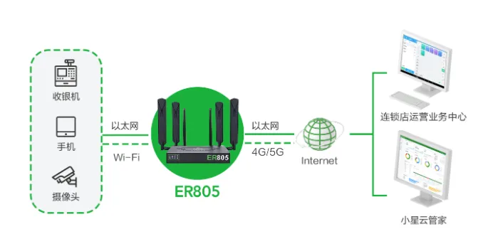

# Chain Store Facility Networking Solution

## 1. Solution Overview

### 1.1 Project Background

With the rapid growth of chain businesses, chain stores are now located across the country, and the stability of the store network is closely tied to the operations of the group headquarters. Building a stable, secure, and standardized business network has become a top priority in IT network construction for chain stores.

A chain enterprise currently operates a large number of directly-owned stores and franchised stores, making routine network management a key task. An interruption to a store's business network affects transactions, causes revenue loss for the enterprise, and can even degrade the customer's shopping experience. Maintaining network stability and quickly locating and resolving faults is therefore critical.

The number of chain stores expands rapidly as the enterprise grows. The IT team must complete networking deployment for many stores within a short period of time, posing a major challenge.

At present, chain branch stores are geographically dispersed and numerous, resulting in high routine operation and maintenance costs. The chain enterprise urgently needs to solve how to manage the networks of many stores efficiently and in real time.

To address this, InHand Networks, leveraging its own strengths and targeting the application scenario of more than 800 chain stores of a chain enterprise in Wuhan, launched the Xinghan Cloud Management Network Solution, which consists of the ER805 edge router and the Device Manager (Xiaoxingyun) SaaS platform, helping the chain enterprise achieve efficient management of its store networks.

### 1.2 Construction Goals

- Provide high-speed, secure, reliable, and uninterrupted network connectivity for real-time communication
- Ensure stable store network operation, with rapid fault location and recovery
- Quickly complete networking deployment for many stores within a short period of time
- Manage the networks of many stores efficiently and in real time
- Reduce the management workload of large-scale network devices

### 1.3 Applicable Scenarios

- Chain store network construction
- Networking for directly-owned stores/franchised stores
- Digital transformation of retail stores
- Branch network management for commercial organizations
- Enterprise SD-WAN networking

## 2. Requirements Analysis

### 2.1 Device Status

- Device types: store TV systems, barcode scanners, charging systems, POS terminals, store cameras, employee/customer computers and mobile phones, etc.
- Communication interfaces: Ethernet, Wi-Fi, 4G/5G
- Communication protocols: SD-WAN, VPDN
- Deployment environment: chain stores (more than 800), geographically dispersed
- Scale: large-scale chain store network

### 2.2 Core Requirements

1. **Network stability**: Provide high-speed, secure, reliable, and uninterrupted network connectivity for real-time communication
2. **Redundant backup**: Support dual-SIM backup, link backup, load balancing, policy routing, and other functions
3. **Data security**: Support VPDN to ensure the security of data exchange
4. **Network performance**: The network channel must feature high stability, low latency, and high bandwidth
5. **Ease of deployment**: Simple configuration with no need for professional on-site engineers; store staff can install and configure the device
6. **SD-WAN**: Support SD-WAN to enable network interconnection and unified management between headquarters and branch stores
7. **Cloud management**: Support cloud management to reduce the management workload of large-scale network devices

## 3. Overall Architecture Design

The solution consists of the store TV system, barcode scanners, the charging system, the ER805, the Xinghan Cloud Network Management Platform, and the group data center. As the on-site network bearer device, the ER805 edge router quickly accesses the Internet via 4G/5G cellular networks or wired networks, providing a stable and efficient business network.

The ER805 can easily build an efficient local area network. The store's TV system, barcode scanners, charging system, store cameras, and employee/customer computers and mobile phones can all access the business LAN simply and conveniently via Ethernet or Wi-Fi. The TV system synchronizes product images, real-time prices, promotional activities, and other information from the operations center server in real time. Data from barcode scanners, the charging system, POS terminals, and other devices is synchronized to the operations center server in real time. Camera footage is synchronized in real time to the local NVR and the operations center. At the same time, 5.8G Wi-Fi provides customers with high-speed wireless network access, delivering an efficient and comfortable shopping and checkout experience. In addition, the ER805 edge router enables one-click SD-WAN networking through the Xinghan Cloud Network Management Platform, easily achieving network interconnection and unified management between headquarters and branch stores.

### 3.1 Four-Layer Architecture

1. **Perception layer**: store TV systems, barcode scanners, charging systems, POS terminals, store cameras, employee/customer devices, etc.
2. **Network layer**: ER805 edge router, supporting 4G/5G, wired network, Wi-Fi, and SD-WAN
3. **Platform layer**: Xinghan Cloud Network Management Platform, group data center/operations center server
4. **Application layer**: product information synchronization, transaction data processing, video surveillance, customer Wi-Fi service, centralized management

### 3.2 Data Flow

Store devices → ER805 router → 4G/5G/wired network → operations center server/data center

SD-WAN networking: Headquarters ←→ ER805 (Xinghan Cloud platform) ←→ branch stores

## 4. Network and Access Solution

### 4.1 Networking Method Selection

Adopt multiple link access methods such as 4G/5G cellular networks and wired networks, supporting dual-SIM switching, wired/wireless link backup, load balancing, policy routing, and more, to ensure uninterrupted network communication for devices.

### 4.2 Key Points for Edge Gateway Selection

**ER805 edge router features**:

- Supports 4G/5G high-speed cellular networks with a maximum downlink rate of 2Gbps, and supports SA and NSA networking
- Redundant link design, supporting dual-SIM switching, wired/wireless link backup, load balancing, policy routing, and more
- High-reliability design, supporting multi-link backup, per-flow load balancing, and failover
- Real-time detection of link latency, jitter, packet loss, signal strength, and other parameters to ensure that important business traffic is always forwarded over the optimal link
- Supports gigabit Wi-Fi with a maximum connection rate of 1300Mbps, 2.4G and 5.8G Wi-Fi dual-band concurrency, and supports AP/STA modes
- Equipped with gigabit Ethernet ports, supporting 1WAN/4LAN or 2WAN/3LAN working modes
- Supports VPDN to ensure the security of data exchange
- Supports firewall and access control functions, allowing blacklists and whitelists to be configured as needed and permitting only specified IPs to access the network
- Supports SD-WAN; simply add the device to the SD-WAN network on the Device Manager platform, and the device can automatically establish tunnels to quickly build a secure and reliable network connection between branches
- Integrated cloud design makes deployment simpler and more convenient; deployment can be completed with simple operations
- Supports access to the Xinghan Cloud Network Management Platform for centralized remote management and deployment, keeping the site under control
- Simple configuration with no need for professional on-site engineers; store staff can install and configure the device

## 5. Protocol and Data Collection Solution

### 5.1 Supported Protocols

- **Network protocols**: 4G/5G (SA/NSA), wired broadband, Wi-Fi 2.4G/5.8G
- **Networking protocol**: SD-WAN
- **Security protocols**: VPDN, firewall, access control

### 5.2 Northbound Protocol Support

- Supports access to the Xinghan Cloud Network Management Platform
- Supports automatic SD-WAN tunnel establishment
- Supports centralized remote management and deployment

## 6. Solution Highlights

1. **High-speed network access**: Supports 4G/5G high-speed cellular networks with a maximum downlink rate of 2Gbps, and supports SA and NSA networking

2. **Multi-link redundancy**:

   - Supports dual-SIM switching and wired/wireless link backup
   - Supports load balancing, policy routing, and more
   - Multi-link backup, per-flow load balancing, and failover
   - Real-time detection of link latency, jitter, packet loss, signal strength, and other parameters to ensure that important business traffic is always forwarded over the optimal link

3. **High-speed Wi-Fi**: Supports gigabit Wi-Fi with a maximum connection rate of 1300Mbps, 2.4G and 5.8G Wi-Fi dual-band concurrency, and supports AP/STA modes, providing customers with a high-speed wireless network

4. **SD-WAN networking**: Supports SD-WAN; simply add the device to the SD-WAN network on the Device Manager platform, and the device can automatically establish tunnels to quickly build a secure and reliable network connection between branches, greatly reducing the difficulty of inter-branch business access and unified management for the enterprise

5. **Simple deployment**: Integrated cloud design makes deployment simpler and more convenient; deployment can be completed with simple operations. Simple configuration with no need for professional on-site engineers; store staff can install and configure the device

6. **Cloud management capability**: Supports access to the Xinghan Cloud Network Management Platform for centralized remote management and deployment, keeping the site under control

7. **Data security assurance**: Supports VPDN to ensure the security of data exchange. Supports firewall and access control functions, allowing blacklists and whitelists to be configured as needed

8. **Rich interfaces**: Equipped with gigabit Ethernet ports, supporting 1WAN/4LAN or 2WAN/3LAN working modes
