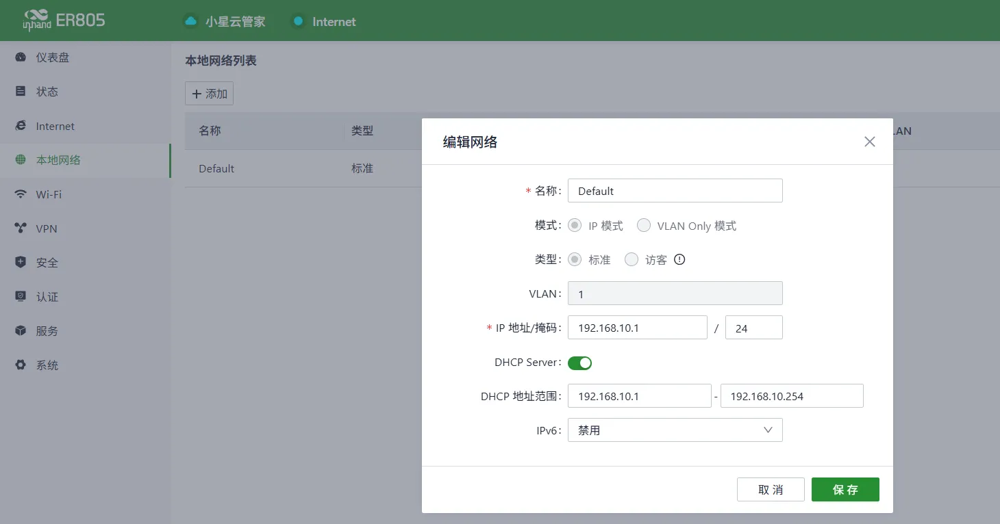
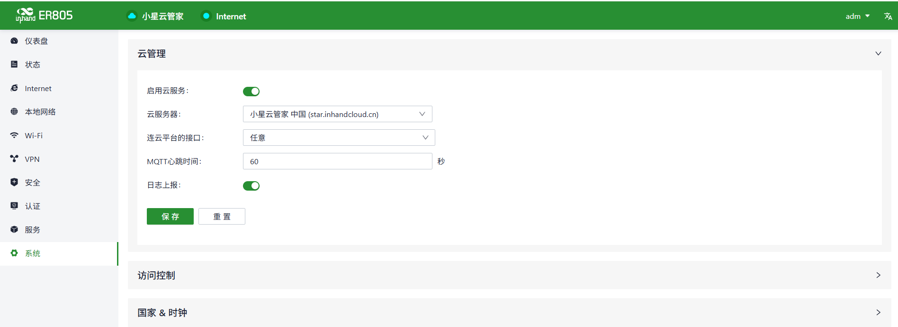
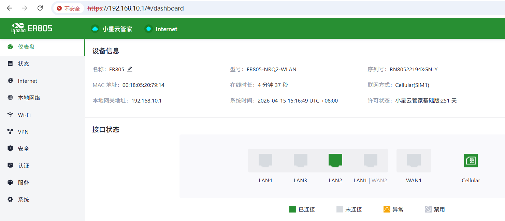

# Configuration Guide

## 1. Document Information

- Document name: Configuration Guide
- Product model: **ER805**
- Firmware version: **V2.0.1**
- Applicable scenario: device networking
- Date: March 25, 2026

## 2. Gateway Overview

### 2.1 Product Introduction

The ER805 is a versatile edge access router that supports 5G/4G cellular and wired broadband access. Equipped with gigabit Ethernet ports and gigabit Wi-Fi, it supports network access for a wide range of digital terminals, meeting the networking needs of various commercial stores and enterprise offices while ensuring uninterrupted digital store operations and productivity. The ER805's multi-link switching policy and dual-SIM design enable multi-link backup, ensuring uninterrupted network connectivity with excellent network performance and high availability.

The solution also provides the Device Manager (Xiaoxingyun) SaaS platform, which helps you achieve centralized network configuration, remote device upgrades, remote fault diagnosis, and one-stop dynamic management of terminals and applications. With online network visualization and insights, your store and office networks are always under control.

### 2.2 Main Functions

- 4G/5G Internet access
- Remote configuration, remote diagnosis, remote upgrade
- Wide-temperature industrial-grade design

### 2.3 Typical Application Topology

POS terminal/cash register device → Ethernet → ER805 → 4G/5G → cloud platform/server

## 3. Hardware Description

### 3.1 Appearance and Interfaces

- Power interface: DC 9–36V
- Ethernet ports: LAN ×4 + 1 WAN
- Wireless: 4G
- Indicators: PWR, network, Wi-Fi
- Reset button: restore factory settings

### 3.2 Wiring Instructions

#### 3.2.1 Power Wiring

- Positive: V+
- Negative: V-
- Note: reverse-polarity protection, lightning protection, and grounding

#### 3.2.2 Ethernet Wiring

Auto MDI/MDIX (straight-through/crossover auto-sensing). Cat5e or higher cable is recommended.

## 4. Factory Default Parameters

- Default IP: 192.168.10.1
- Subnet mask: 255.255.255.0
- Web username: **adm**
- Web password: 123456

## 5. Preparation

- Set the computer to an IP address on the same subnet as the gateway
- Connect the computer to the gateway's LAN port with a network cable
- Power on the router and wait for the RUN indicator to stay solid
- Enter the device IP in a browser to access the configuration page

## 6. Network Configuration

### 6.1 **Local Network Configuration**

### 6.2 4G Wireless Network Configuration

- Insert a 5G SIM card
- Enable the mobile network
- APN: automatic
- Check signal strength

## 7. Enabling the Device Manager Platform

## 8. Configuration Backup and Restore

- Export the configuration file
- Restore factory configuration

## 9. Status Monitoring and Diagnosis

### 9.1 Running Status

- Device online status
- Network traffic, signal strength

### 9.2 Log Viewing

- System log

## 10. Common Issues and Troubleshooting

- Unable to open the Web page
  - Check whether the subnet, network cable, and IP address conflict
  - Reset the gateway and try again

## 11. Safety Precautions

- Ensure reliable grounding at the industrial site
- Change the LAN port address to the gateway of the local subnet
- Back up the configuration after completion
- Change the remote password regularly
- Prohibit operation by unauthorized personnel
