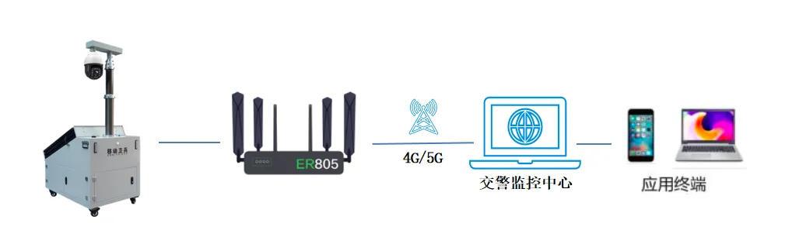

# Mobile Sentinel — Electronic Police Remote Monitoring Solution

## 1. Solution Overview

### 1.1 Project Background

An intelligent transportation company, in collaboration with a city's traffic police department, developed the "5G + Mobile Sentinel" solution to help the traffic police regulator monitor the coverage area 24 hours a day. Through real-time remote monitoring, the solution improves service management, achieves preventive control objectives, and enables reasonable scheduling of spot-check and patrol plans—making regulation more effective and targeted, and gradually advancing key areas toward an "unattended" and "minimally-staffed" operating model.

Leveraging the high bandwidth, low latency, security, and reliability of 5G networks, front-end images are uploaded in real time to the monitoring center and mobile devices, and integrated with the existing video surveillance network to form a unified, coordinated dynamic video command system. As a first-line security device, surveillance systems are already widely deployed. However, monitoring areas located in remote locations often face difficulties in obtaining power and network supply. Complex environments such as emergency site monitoring and construction site monitoring require considerable manpower and material resources for cabling, and present safety hazards.

The Mobile Sentinel monitoring deployment is therefore the optimal choice. A built-in battery combined with solar auxiliary power eliminates the many constraints of wired cabling, while wireless 5G transmission allows deployment anywhere with carrier signal coverage—making it a true sentinel for traffic police, public security, emergency response, security, and stability-maintenance applications. Currently, the city's traffic police department has deployed 80 5G Mobile Sentinel units in the field. Over the next decade, as remote monitoring demand continues to grow, more than 10,000 units are expected to be deployed.

### 1.2 Construction Objectives

- Monitor the coverage area 24 hours a day
- Improve service management through real-time remote monitoring
- Achieve preventive control objectives and reasonably schedule spot-check and patrol plans
- Make regulation more effective and targeted
- Advance key areas toward an "unattended" and "minimally-staffed" operating model
- Upload front-end images in real time to the monitoring center and mobile devices
- Integrate with the existing video surveillance network to form a unified, coordinated dynamic video command system

### 1.3 Applicable Scenarios

- Electronic police remote monitoring
- Traffic and public security monitoring
- Emergency site monitoring
- Smart construction site monitoring
- Counter-terrorism and emergency rescue site monitoring
- Large-scale event security monitoring
- Oil and gas industry monitoring
- Military training monitoring

## 2. Requirements Analysis

### 2.1 Device Status

- Device type: Mobile Sentinel all-in-one unit (built-in battery, solar panel, capture device, vehicle type detection, license plate recognition system)
- Communication interfaces: Ethernet, 4G/5G
- Communication protocol: VPDN private network
- Deployment environment: construction sites, traffic intersections, emergency sites, work sites, and remote monitoring areas; mobile deployment
- Quantity/scale: 80 units deployed; more than 10,000 units expected

### 2.2 Core Requirements

1. **Construction monitoring**: Monitor construction progress and worker safety in real time through mobile surveillance, with rapid early warning when anomalies are detected to protect lives and property
2. **Intelligent transportation**: Employ next-generation information technologies such as vehicle type detection, license plate recognition, and vehicle control to ensure traffic safety, maximize the effectiveness of transportation infrastructure, and improve traffic system operating efficiency and management
3. **Remote maintenance**: Support remote device maintenance and integration with the traffic police management platform, providing strong data support
4. **Network backup**: Support dual-SIM backup to ensure uninterrupted network communication
5. **Scheduled management**: Support scheduled reboot, which users can enable as needed
6. **Environmental adaptability**: Fully industrial design that operates stably for extended periods even in harsh environments
7. **Data security**: Support VPDN for seamless integration with traffic authorities while ensuring data security
8. **High-speed network**: A high-bandwidth, low-latency, secure, and reliable 5G network for real-time monitoring of Mobile Sentinel operating status

## 3. Overall Architecture Design

The solution consists of the Mobile Sentinel, the ER805, and the traffic management monitoring center. Mobile Sentinels are deployed for real-time monitoring at locations such as government field-enforcement sites, oil and gas industry sites, traffic and public security areas, military training grounds, counter-terrorism and emergency rescue sites, smart construction sites, and large-scale events.

The Mobile Sentinel connects to the ER805 via Ethernet and securely transmits data to the traffic police platform over the 4G/5G carrier network through a VPDN tunnel. Maintenance personnel can directly access the on-site router via the VPDN private network to remotely configure, debug, and upgrade it.

The Mobile Sentinel provides PC client software, a mobile app, and an on-site digital touchscreen keypad, enabling users to obtain real-time road condition information, perform real-time remote monitoring, and retrieve video footage for specified times and locations.

### 3.1 Four-Layer Architecture

1. **Perception layer**: Mobile Sentinel all-in-one unit (battery, solar panel, capture device, vehicle type detection, license plate recognition system)
2. **Network layer**: InHand Networks ER805 5G edge router, supporting dual-SIM, 4G/5G, and VPDN private network
3. **Platform layer**: traffic management monitoring center, traffic police platform
4. **Application layer**: real-time monitoring, remote configuration/debugging/upgrade, video footage retrieval, road condition awareness, vehicle type detection, license plate recognition

### 3.2 Data Flow

Mobile Sentinel (capture/detection) → ER805 router (4G/5G, VPDN encryption) → traffic police platform → monitoring center / mobile app / PC client

Remote maintenance: maintenance personnel → VPDN private network → ER805 → remote configuration/debugging/upgrade

## 4. Network and Access Solution

### 4.1 Network Access Selection

The solution adopts 5G/4G high-speed cellular network access, supports dual-SIM backup, and securely transmits data through a VPDN private network tunnel. Wireless 5G transmission allows deployment anywhere with carrier signal coverage.

### 4.2 Edge Gateway Selection Highlights

**ER805 5G edge router features**:

- Dual-SIM backup to ensure uninterrupted network communication
- Scheduled reboot, which users can enable as needed
- Fully industrial design that operates stably for extended periods even in harsh environments
- VPDN support for seamless integration with traffic authorities while ensuring data security
- High-bandwidth, low-latency, secure, and reliable 5G network
- 5G high-speed cellular access and high-speed LAN networking
- 5 × gigabit ports with VLAN support
- Gigabit Wi-Fi 1200M with concurrent 2.4G and 5G dual-band
- Industrial design—stable and reliable—providing highly available data transmission services to meet the challenges of mobile scenarios
- SD-WAN support, delivering high-quality data links with load balancing, redundancy, and link backup to ensure uninterrupted device network communication
- Certified by CE, FCC, IC, PTCRB, AT&T, Verizon, and others for global applicability

## 5. Protocol and Data Acquisition Solution

### 5.1 Supported Protocols

- **Network protocols**: 5G, 4G, dual-SIM, gigabit Ethernet, Wi-Fi 1200M (2.4G and 5G dual-band)
- **Security protocol**: VPDN virtual private network
- **Management protocol**: SD-WAN

### 5.2 Northbound Protocol Support

- VPDN private network access to the traffic police platform
- Remote configuration, debugging, and upgrade
- PC client software and mobile app access

## 6. Solution Highlights

1. **Mobile Sentinel features**:

   - High intelligent-monitoring efficiency: built-in battery and solar panel; capture data supports resumable transmission, enabling 24h uninterrupted monitoring
   - Strong adaptability: mobile monitoring is not constrained by network or power availability; the unit is flexible and can be deployed by a single person, making it more advantageous than wired monitoring in dispersed, complex environments and scenarios requiring temporary deployment

2. **High bandwidth and low latency**: The ER805's high-bandwidth, low-latency network characteristics provide a stable, reliable network channel for Mobile Sentinel application scenarios

3. **5G high-speed network**: 5G high-speed cellular access and high-speed LAN networking; 5 × gigabit ports with VLAN support; gigabit Wi-Fi 1200M with concurrent 2.4G and 5G dual-band

4. **Dual-SIM backup**: Dual-SIM backup ensures uninterrupted network communication

5. **SD-WAN technology**: SD-WAN support delivers high-quality data links with load balancing, redundancy, and link backup to ensure uninterrupted device network communication

6. **VPDN security**: VPDN support enables seamless integration with traffic authorities while ensuring data security

7. **Industrial-grade reliability**: Fully industrial design that operates stably for extended periods even in harsh environments, meeting the challenges of mobile scenarios

8. **Global certifications**: Certified by CE, FCC, IC, PTCRB, AT&T, Verizon, and others for global applicability

9. **Flexible deployment**: A built-in battery combined with solar auxiliary power eliminates the many constraints of wired cabling, while wireless 5G transmission allows deployment anywhere with carrier signal coverage

10. **Multi-platform support**: PC client software, a mobile app, and an on-site digital touchscreen keypad provide real-time road condition information, real-time remote monitoring, and video footage retrieval for specified times and locations

---

*Additional images:*

