# Edge Router 815 Product User Manual

## Preface

### Statement

Thank you for choosing our company's product! Before use, carefully read this user manual. By complying with the following statements, you will help maintain intellectual property rights and legal compliance, ensuring that your user experience aligns with the latest product information. If you have any questions or need written permission, feel free to contact our technical support team.

- Copyright Statement

This user manual contains copyrighted content, and the copyright belongs to InHand Networks and its licensors. Without written permission, no organization or individual may excerpt, copy any part of the content of this manual, or distribute it in any form.

- Disclaimer

Due to ongoing updates in product technology and specifications, the company cannot guarantee that the information in the user manual is entirely consistent with the actual product. Therefore, no disputes arising from any discrepancies between the actual technical parameters and the user manual are accepted. Any changes to the product will not be notified in advance, and the company reserves the right to make the final changes and interpretations.

- Copyright Information

The content of this user manual is protected by copyright laws, and the copyright belongs to InHand Networks and its licensors, reserving all rights. Without written permission, the content of this manual may not be used, copied, or distributed without authorization.

### GUI Conventions

| Symbol | Meaning | Example |
| --- | --- | --- |
| `< >` | Indicates a variable or parameter to be replaced with an actual value | `<IP Address>` means to fill in a specific IP address |
| `" "` | Indicates a text label on the interface | Click the "Save" button |
| `>` | Indicates menu hierarchy or operation sequence | 【Status】>【Link Monitoring】 |
| `【 】` | Indicates a menu or page name | Go to the 【System Settings】page |
| Cautions | Be mindful of the following points during operation, as improper actions may result in data loss or device damage | - |
| Note | Supplement and provide necessary explanations for the operation description | - |

### Technical Support

**InHand Networks Co., Ltd. (Headquarters)**

Phone: 010-8417 0010

Address: 5th Floor, Building 3, No. 18 Ziyue Road, Chaoyang District, Beijing, China

**Chengdu Office**

Phone: 028-8679 8244

Address: 14th Floor, China Taiping Financial Tower, No. 1777 North Tianfu Avenue, Wuhou District, Chengdu, Sichuan, China

**Guangzhou Office**

Phone: 020-8562 9571

Address: Unit B-130, Yuanyang New Third Board Creative Park, No. 5 Tangdong East Road, Tianhe District, Guangzhou, China

**Wuhan Office**

Phone: 027-8716 3566

Address: Room 2001, Building 11, Bali Haoting, No. 2 Luoyu East Road, Hongshan District, Wuhan, Hubei, China

**Shanghai Office**

Phone: 021-5480 8501

Address: Room 1103, No. 18 Shunyi Road, Putuo District, Shanghai, China

### How to Use This Manual

**Target Audience**

- First-time users: It is recommended to read sequentially from "Getting to Know the Device" to "Installation and First Use," then "Common Scenario Configuration," and finally "Function Description and Parameter Reference."
- Existing device users: You may directly refer to "Function Description and Parameter Reference" or "Appendix: Troubleshooting."
- Cloud platform management users: Refer to "Common Scenario Configuration" for cloud platform connection and management.

**Quick Navigation by Task**

| Task | Corresponding Chapter | Estimated Time |
| --- | --- | --- |
| Understand device hardware and default settings | [Getting to Know the Device](#chapter-1-getting-to-know-the-device) | About 5 minutes |
| Install and power on the device for the first time | [Installation and First Use](#chapter-2-installation-and-first-use) | About 10 minutes |
| Connect to the Internet via wired or cellular network | [Common Scenario Configuration](#chapter-3-common-scenario-configuration) | About 10 minutes |
| Connect the device to InCloud Manager for remote management | [Common Scenario Configuration](#chapter-3-common-scenario-configuration) | About 15 minutes |
| Configure advanced features such as VPN, firewall, or SD-WAN | [Function Description and Parameter Reference](#chapter-4-function-description-and-parameter-reference) | As needed |
| Diagnose network or device issues | [Appendix: Troubleshooting](#appendix-troubleshooting) | As needed |

---

## Chapter 1: Getting to Know the Device

### 1.1 Overview

The Edge Router 815 (ER815) is a next-generation 5G edge router developed by InHand Networks for the commercial networking sector. It integrates 4G/5G wireless networks with a variety of broadband services, offering high-speed and secure network access to various industries. The ER815 provides uninterrupted internet connectivity, comprehensive security features, and exceptional wireless services. It transforms device interconnectivity into a reality, serving as a high-speed gateway for device informatization.

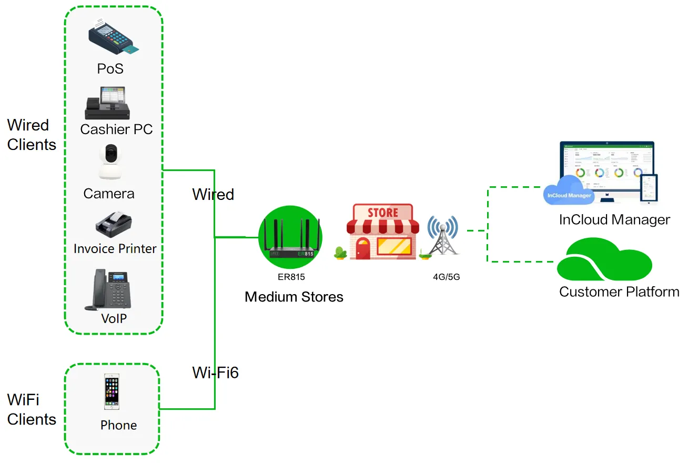

<strong>Figure 1-1 ER815 Application</strong>

### 1.2 Package Contents

| Item | Quantity | Description |
| --- | --- | --- |
| ER815 host | 1 | Edge router main unit |
| Power adapter | 1 | Original power supply |
| Antennas | Set | 4G/5G and Wi-Fi antennas |
| Ethernet cable | 1 | For wired connection |
| Quick start guide | 1 | Basic installation instructions |

> **Note**: (Original document does not detail exact package contents; to be supplemented if needed.)

### 1.3 Appearance and Interfaces

(Original document does not contain an appearance/interface diagram; to be supplemented.)

| Interface | Position | Function Description |
| --- | --- | --- |
| WAN1 | Rear | Wired upstream interface |
| LAN1-LAN4 | Rear | Local area network interfaces |
| SIM card slot | Side | Insert SIM card for cellular network access |
| Reset button | Side | Restore factory defaults |
| Power port | Rear | Connect the power adapter |
| Antenna connectors | Rear/Side | Connect 4G/5G and Wi-Fi antennas |

### 1.4 LED Indicators

| Indicator | Status | Meaning |
| --- | --- | --- |
| System | Off | Power off |
| | Blinking blue | System booting in progress |
| | Steady blue | System running smoothly |
| | Blinking red | System malfunction detected |
| | Blinking green | System upgrading in progress |
| Network | Blinking red | Network disconnected |
| | Blinking green | Cellular network connecting |
| | Steady green | Cellular network connected |
| | Blinking blue | Wired network connecting |
| | Steady blue | Wired network connected |
| Wi-Fi 2.4G | Off | 2.4G Wi-Fi disabled |
| | Steady blue | Starting up |
| | Blinking blue | In operation |
| Wi-Fi 5G | Off | 5G Wi-Fi disabled |
| | Steady green | Starting up |
| | Blinking green | In operation |

For the network status indicator:

- If both cellular and wired connections are normal, it displays a blue wired indicator.
- If only one type of connection is active and normal, it shows the indicator for the active network.
- If there is no network connection, it displays red.

### 1.5 Restore Factory Defaults

To reset to factory default settings using the Reset button:

1. After powering on the device, immediately press and hold the Reset button.
2. After holding it for a while, the system indicator light will start flashing. Approximately half a minute later, the system indicator light will stay on steadily.
3. Release the Reset button, and the power indicator light will flash again. Then, press and hold the Reset button once more.
4. The power indicator light will flash slowly. Release the Reset button, and the factory reset will be successful. The device will restart normally.

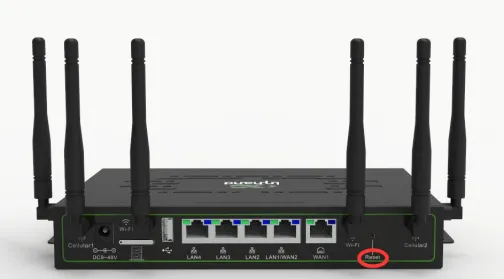

<strong>Figure 1-2 Factory Reset</strong>

### 1.6 Default Settings

| No. | Function | Default Settings |
| --- | --- | --- |
| 1 | Cellular Dialing | Default dialing is set to "SIM1" |
| 2 | Wi-Fi | 1. Wi-Fi 2.4G access point enabled, SSID: Prefixed with "ER815-", followed by the last 6 digits of the wireless MAC address. 2. Wi-Fi 5G access point enabled, SSID: Prefixed with "ER815-5G-", followed by the last 6 digits of the wireless MAC address. 3. The authentication method is WPA2-PSK. 4. The password for both is the last 8 digits of the serial number. |
| 3 | Ethernet | 1. Enable all 4 LAN ports. 2. IP Address: 192.168.2.1 Subnet Mask: 255.255.255.0 3. DHCP server enabled, with an address pool from 192.168.2.2 to 192.168.2.100 for automatic IP address assignment to connected devices. |
| 4 | Network Access Control | Local HTTP and HTTPS are enabled with port numbers 80 and 443 respectively. Disable access from the cellular network. |
| 5 | Username/Password | Check the device nameplate for login credentials. |

---

## Chapter 2: Installation and First Use

### 2.1 Pre-Installation Preparation

Before installing the ER815, ensure the following conditions are met:

- The installation environment is within the specified temperature and humidity range.
- A suitable power outlet is available near the installation location.
- The necessary network cables and antennas are on hand.
- The SIM card (if using cellular network) is activated and ready for use.

> **Caution**: Use the original power adapter to avoid damaging the device due to mismatched power adapters.

### 2.2 Installation Guide

**Step 1: Install antennas and insert the SIM card**

Install the 4G/5G and Wi-Fi antennas onto the corresponding connectors. Insert the SIM card into the SIM card slot.

**Step 2: Connect power and network cables**

Connect the power cable to the device and plug it into a power outlet. Connect an Ethernet cable from any LAN port to your PC.

**Step 3: Configure the PC IP address**

Set the PC's IP address to be on the same subnet as the edge router. The device's LAN port has DHCP Server functionality enabled by default. Once the PC has automatically obtained an IP address, ensure that the PC and router are in the same address range. If the PC fails to obtain an IP address automatically, configure it with a static IP address and the following parameters:

- IP Address: 192.168.2.x (choose an available address within the range of 192.168.2.2 to 192.168.2.254)
- Subnet Mask: 255.255.255.0
- Default Gateway: 192.168.2.1
- DNS Servers: 8.8.8.8 (or your ISP's DNS server address)

<strong>Figure 2-1 Configure PC IP Address</strong>

**Step 4: Log in to the web management interface**

Enter the default device address 192.168.2.1 in the browser's address bar. After entering the username and password (check the device nameplate for login credentials), access the device's web management interface. If the page shows a security warning, click on the "Hide" or "Advanced" button and select "Proceed" to continue.

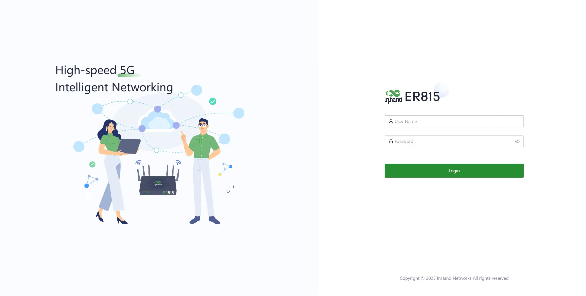

<strong>Figure 2-2 Device Web Login Page</strong>

### 2.3 Quick Check

After completing the installation, perform the following checks:

- [ ] The power indicator is on and the system indicator shows steady blue.
- [ ] The PC has obtained an IP address in the 192.168.2.x range.
- [ ] The web management interface at 192.168.2.1 is accessible.
- [ ] The antennas are securely attached.
- [ ] The SIM card is properly inserted (if cellular access is required).

---

## Chapter 3: Common Scenario Configuration

### 3.1 Scenario: Wired Internet Access

**Goal**: Connect the ER815 to the Internet via a wired connection.

**Prerequisites**: An Ethernet cable is available and connected to an upstream network with Internet access.

**Estimated Time**: About 5 minutes.

**Operation Steps**:
1. Connect the WAN1 interface of the ER815 to the upstream network using an Ethernet cable.
2. The WAN interface has DHCP service enabled by default. It will automatically establish an Internet connection.
3. If a static IP or PPPoE is required, log in to the web interface, go to 【Internet】>【WAN1】, and click "Edit" to configure the connection method.

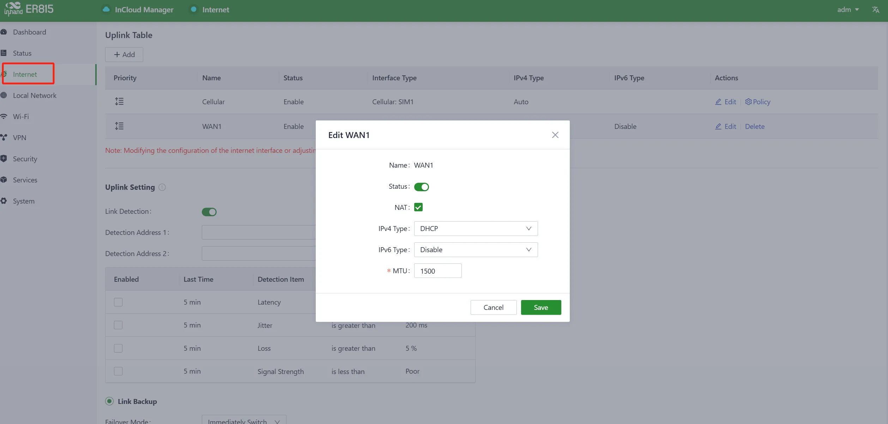

<strong>Figure 3-1 Edit the WAN1 Interface</strong>

**Verification Method**:
1. Check that the Network indicator shows steady blue.
2. On a connected PC, open a web browser and access an external website to confirm Internet connectivity.

**Common Issues**:
- No Internet access: Verify that the upstream network is functional and that the WAN1 cable is securely connected.
- IP not obtained: Confirm that the upstream device is providing DHCP service, or configure a static IP/PPPoE as needed.

### 3.2 Scenario: Cellular Internet Access

**Goal**: Connect the ER815 to the Internet via a 4G/5G cellular network.

**Prerequisites**: A valid SIM card is inserted, and the cellular antennas are installed.

**Estimated Time**: About 5 minutes.

**Operation Steps**:
1. Power off the device, insert the SIM card into the SIM card slot, and install the cellular antennas.
2. Power on the device. The ER815 will automatically establish a dial-up connection and connect to the network.
3. If custom APN parameters are required, log in to the web interface, go to 【Internet】>【Cellular】, click "Edit," and configure the APN settings.

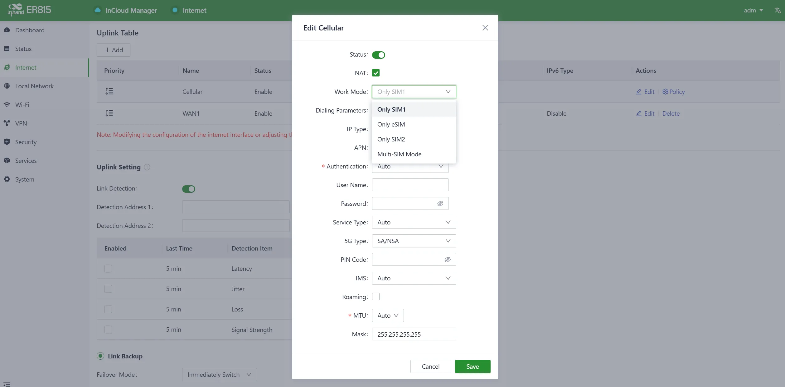

<strong>Figure 3-2 Edit the Cellular Interface</strong>

**Verification Method**:
1. Check that the Network indicator shows steady green.
2. On a connected PC, open a web browser and access an external website to confirm Internet connectivity.

**Common Issues**:
- No cellular connection: Verify that the SIM card is inserted correctly and that the antennas are connected.
- APN mismatch: Contact the carrier to obtain the correct APN parameters.

### 3.3 Scenario: Connect to InCloud Manager

**Goal**: Add the ER815 to InCloud Manager for remote management and monitoring.

**Prerequisites**: The device has established an Internet connection. A valid email address is available for registration.

**Estimated Time**: About 15 minutes.

**Operation Steps**:
1. In a web browser, enter the URL: [https://star.inhandcloud.com](https://star.inhandcloud.com). You will be redirected to the portal page. Select "InCloud Manager" to access the SaaS platform. Click "Create now" to register a new platform account.

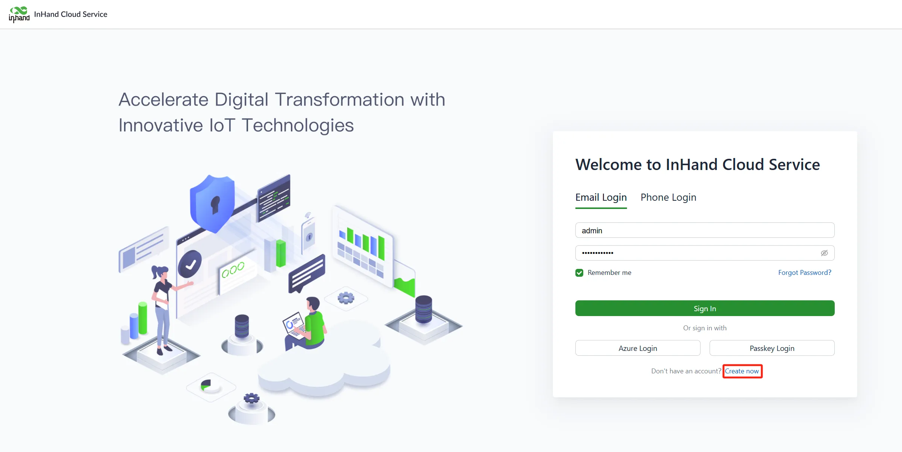

<strong>Figure 3-3 Register an Account</strong>

2. After completing the email registration, log in to InCloud Manager using the registered username and password.

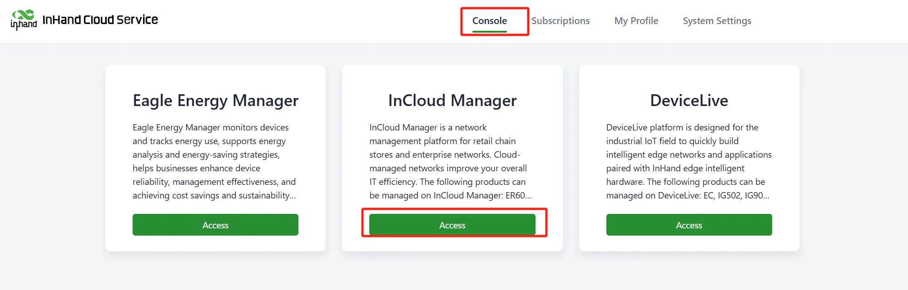

<strong>Figure 3-4 Login</strong>

3. After logging in, go to the "Devices" menu, click the "Add" button, fill in the device's name, serial number, and MAC address, and then click "Finish" to complete the addition.

<strong>Figure 3-5 Add Device</strong>

**Verification Method**:
1. In the "Devices" menu, the newly added device appears online.
2. Click the device name to view its dashboard and confirm data is being reported.

**Common Issues**:
- Device offline: Ensure the device has Internet access and that cloud management is enabled in 【System】>【Cloud Management】.
- Incorrect serial number or MAC address: Double-check the values on the device nameplate.

> **Note**: When a device is initially added to the platform account, it will automatically receive a 1-year Essential license. Users can renew the license through the "License" menu.

---

## Chapter 4: Function Description and Parameter Reference

### 4.1 Monitoring

Once the device is added to the platform, the network can be managed and monitored from the platform. Users can also remotely view real-time status information on the device's local interface.

#### 4.1.1 Platform Device Overview

In the "Devices" section, click on the "Device Name" to access the device's details page.

**Dashboard**

Click on 【Dashboard】 in the left menu to access the dashboard interface. Here, essential device information, interface status, traffic statistics, cellular signal strength, and the number of connected Wi-Fi devices can be viewed.

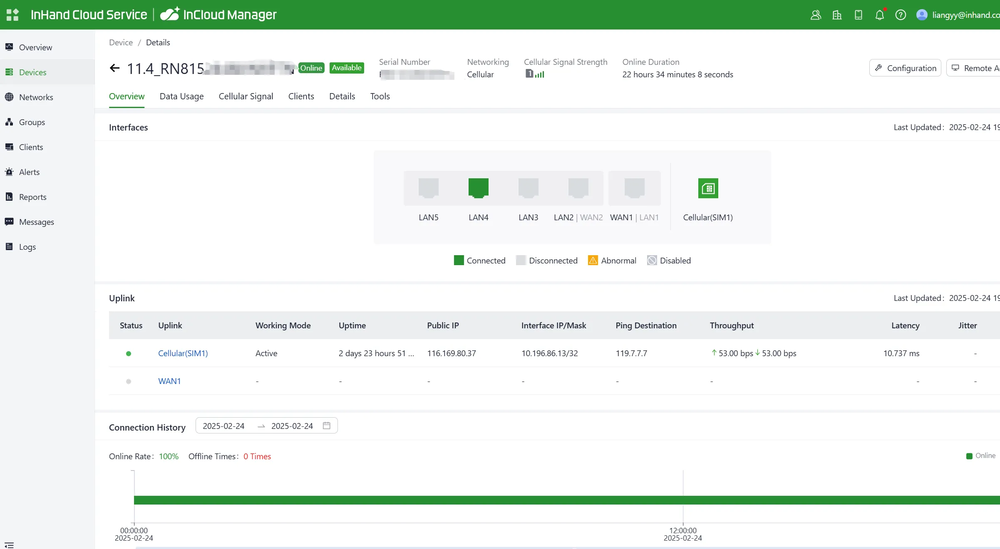

<strong>Figure 4-1 Overview Devices</strong>

In this interface, the status information of the device interfaces is displayed visually. By clicking on the link in the [Uplink] entry, link details can be viewed, such as connection status, working mode, IP address, network type, operator, and other information.

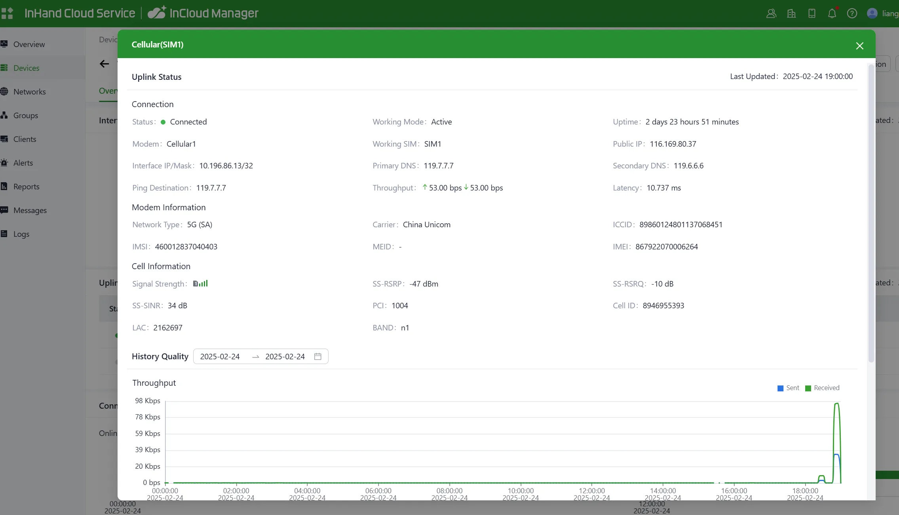

<strong>Figure 4-2 Uplink Details</strong>

**Data Usage**

In this function, the traffic usage and historical data of various upstream links can be viewed.

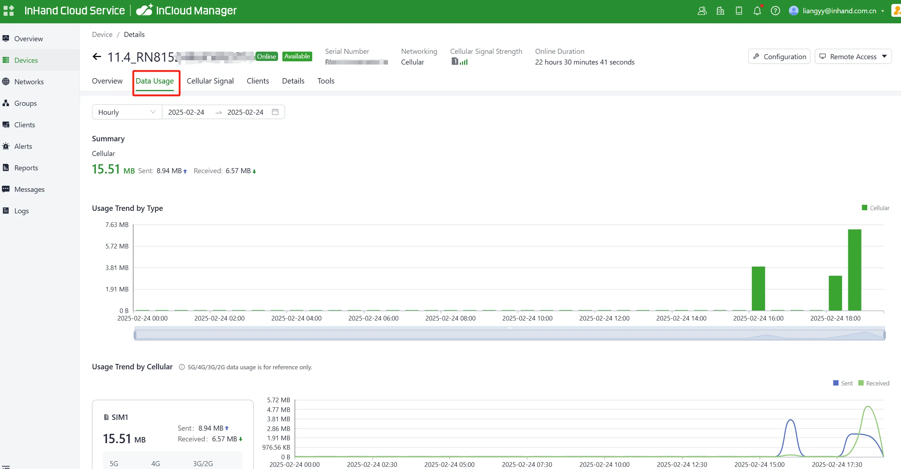

<strong>Figure 4-3 Data Usage</strong>

**Cellular Signal**

In this function, cellular signal curves such as RSSI, RSRP, RSRQ, and SINR can be viewed. When hovering the mouse over the signal curve, the signal strength and cell ID corresponding to the currently active SIM card are displayed.

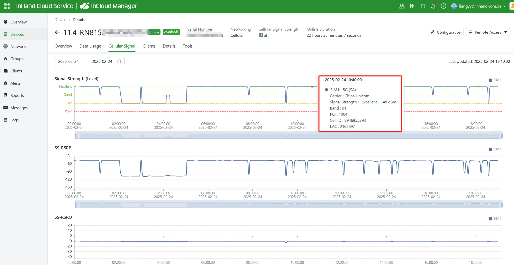

<strong>Figure 4-4 Cellular Signal</strong>

**Clients**

From this functionality interface, client information connected to the device can be viewed, including the client's hostname, MAC address, IP address, connection method, and more.

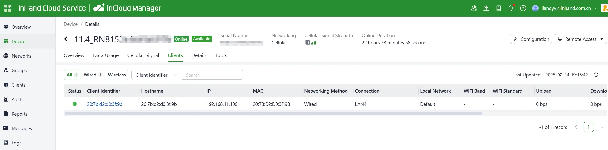

<strong>Figure 4-5 Clients</strong>

**Details**

From this functionality interface, the device's name, model, group affiliation, addition time, license status, version, location distribution, and more can be viewed.

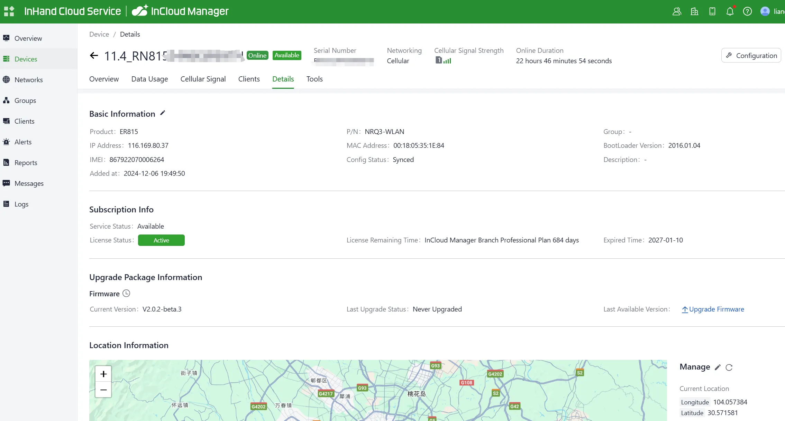

<strong>Figure 4-6 Details</strong>

**Tools**

From this functionality interface, the device's operation logs and diagnostic logs can be downloaded for fault detection and analysis.

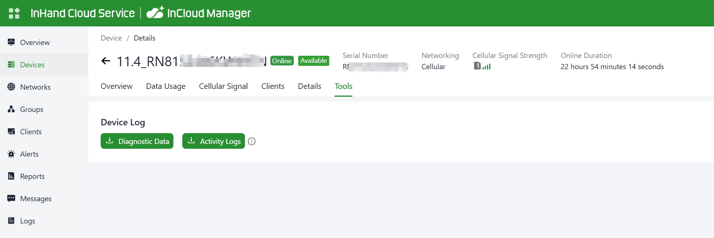

<strong>Figure 4-7 Tools</strong>

#### 4.1.2 Local Device Information

Through the platform's "Remote Access" feature, real-time viewing and configuring of devices is supported. Select the target device, click "Remote Access," and the device's local login interface will open.

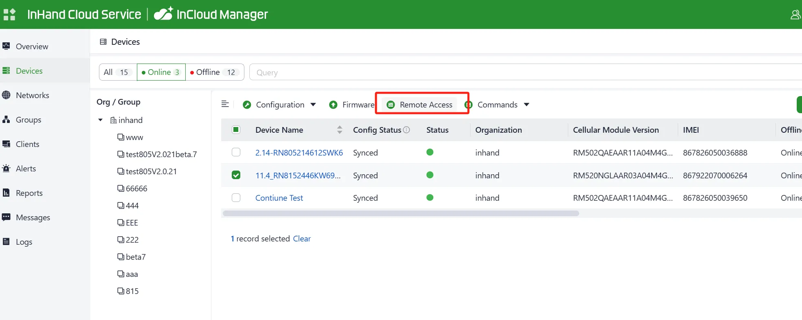

<strong>Figure 4-8 Remote Access Entry</strong>

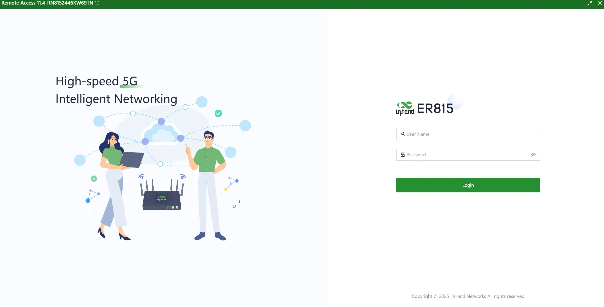

<strong>Figure 4-9 Remote Access to Local Page</strong>

**Device Information**

In the 【Dashboard】 interface, basic device information is displayed at the top, including the device name, device model, device serial number, MAC address, online duration, and upstream interface address.

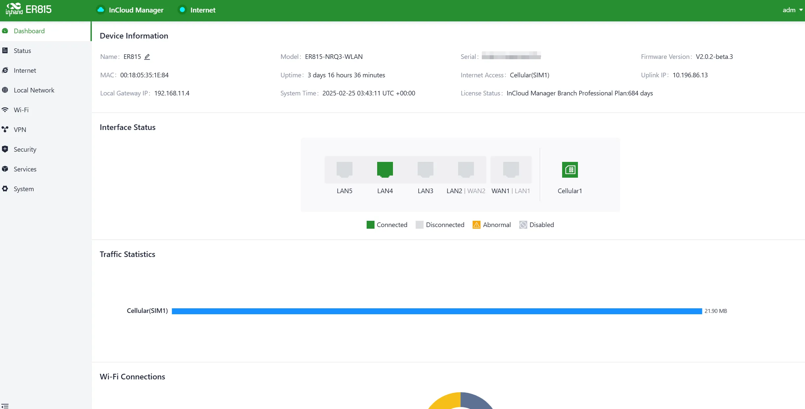

<strong>Figure 4-10 Device Information</strong>

- Name: Identifies the device's name, which is initially set to "ER815" but can be customized.
- MAC Address: Identifies the device's physical MAC address.
- Local Gateway Address: The default gateway address of the device's subnet.
- Model: Specifies the device's specific model, which can help determine if it supports cellular and WLAN features.
- Uptime: Reflects the device's running time since it was powered on.
- System Time: Displays the device's time zone and system time.
- Serial: A unique code that serves as an identifier for the device and can be used for indexing or adding the device to a platform account.
- Internet Access: The upstream interface used by the device for internet connectivity.
- License Status: Information about the applied license on the device, distinguishing between Small Star Cloud Manager Basic and Small Star Cloud Manager Professional.
- Firmware Version: Shows the device's current software version.
- Uplink IP: The IP address of the upstream interface used for device internet connectivity.

**Interface Status**

In the "Dashboard > Interface Status" feature, the operational status of each interface can be inspected visually. By clicking on the "Interface Icon," detailed information for each interface can be accessed in a pop-up box on the right-hand side of the interface.

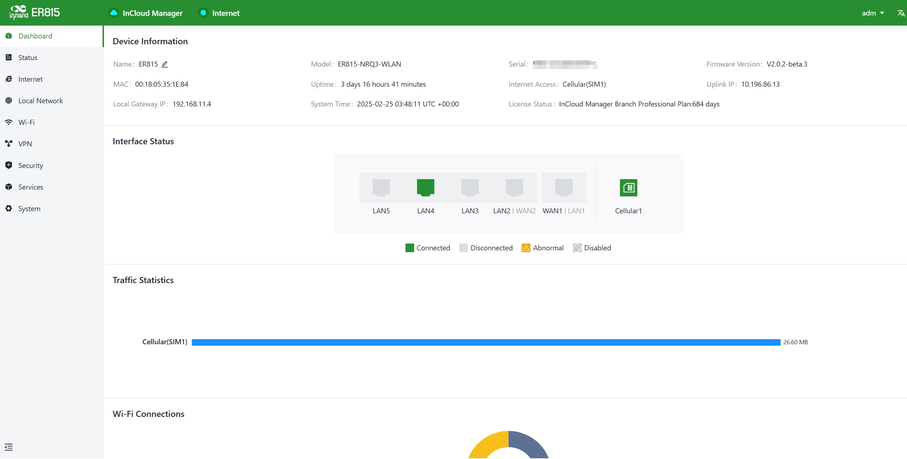

<strong>Figure 4-11 Interface Status</strong>

**Traffic Statistics**

The usage of traffic on each upstream interface since the router was powered on can be monitored through the "Dashboard > Traffic Statistics" feature. The data in traffic statistics will reset after the device is rebooted. If historical traffic records are needed, they can be accessed on the device's details page within InCloud Manager.

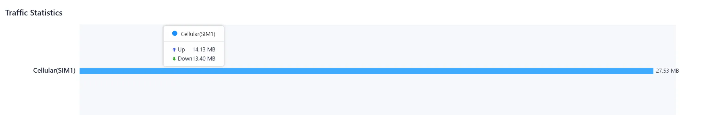

<strong>Figure 4-12 Traffic Statistics</strong>

**Wi-Fi Connections**

In the "Dashboard > Wi-Fi Client Count" feature, the number of active SSIDs on the ER815 and the number of connected clients under each SSID can be checked.

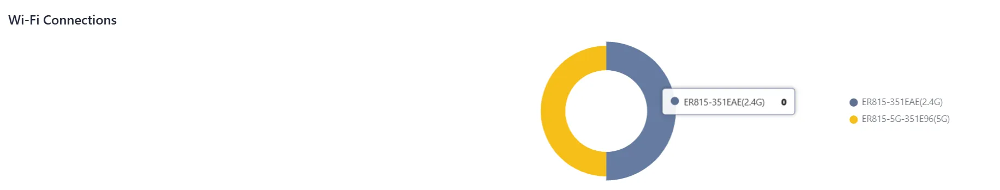

<strong>Figure 4-13 The Number of Clients Connected per SSID</strong>

**Clients Traffic Top 5**

In the "Dashboard > Top 5 Client Traffic" feature, the current ranking of client traffic usage for devices connected to the router can be viewed. It displays up to 5 records, and when a client disconnects, its statistical data will be cleared.

<strong>Figure 4-14 Top 5 Clients by Traffic</strong>

**Link Monitor**

The "Status > Link Monitoring" feature can be utilized to check the health status of each upstream link and access information about throughput, latency, packet loss, signal strength, and more for each interface.

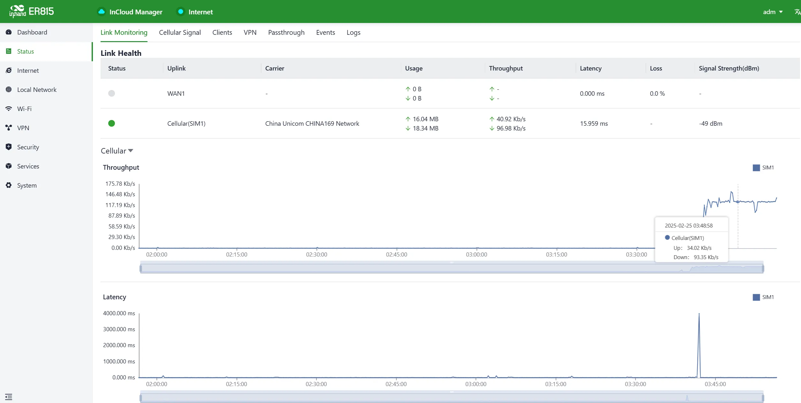

<strong>Figure 4-15 Link Monitor Interface</strong>

**Cellular Signals**

The "Status > Cellular Signal" feature can be accessed to check the signal strength of SIM cards under the cellular interface, along with parameters such as RSSI, SINR, RSRP, and more.

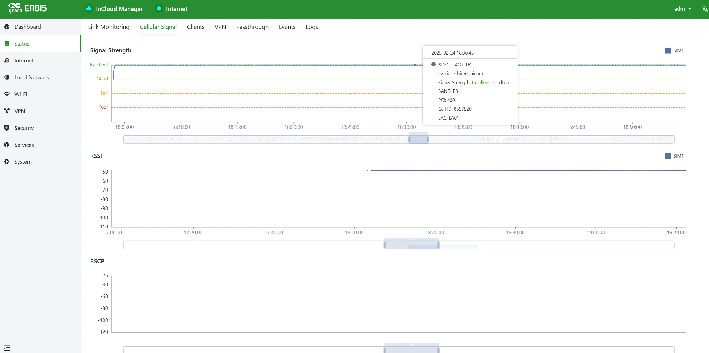

<strong>Figure 4-16 Signal Strength</strong>

**Clients**

Through the "Status > Clients" feature, detailed information about both wired and wireless clients connected to the router can be viewed. This includes details such as names, addresses, MAC addresses, VLANs, connected subnets, traffic usage, online duration, and more.

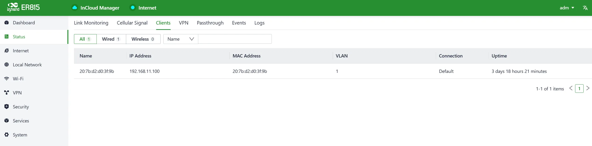

<strong>Figure 4-17 Clients Connected to ER815</strong>

**VPN**

The "Status > VPN" feature can be accessed to view information about IPSec VPN and L2TP VPN, including their status, traffic, and the duration of the most recent connection.

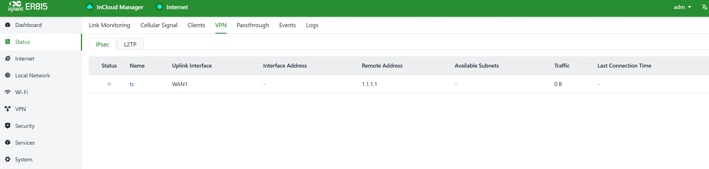

<strong>Figure 4-18 VPN Information</strong>

**Passthrough**

After configuring the IP Passthrough (IPPT) feature, the working status information of IPPT can be viewed here.

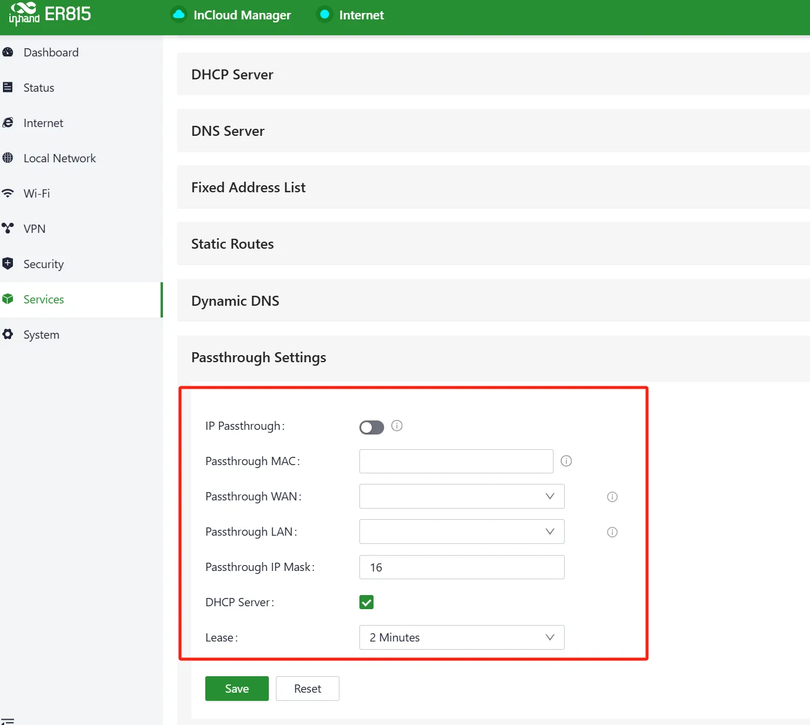

<strong>Figure 4-19 Passthrough Setting</strong>

- Status: Displays whether the IP Passthrough feature is working properly.
- Passthrough WAN: Displays the uplink of IP Passthrough that is currently active.
- Passthrough LAN: Displays the LAN port that is passed through via IP Passthrough.
- Passthrough IP/Mask: Displays the passed-through IP address and subnet mask.
- Passthrough Gateway: The gateway address passed through by IP Passthrough.
- Passthrough DNS1/2: The DNS address obtained from the passthrough interface.
- Passthrough MAC: Only the device with this MAC address can obtain the IP Passthrough address.
- Address Allocation Status: The working status of DHCP in the IP Passthrough feature.
- Lease Timeout: The DHCP lease duration in the IP Passthrough feature.

**Events**

The "Status > Events" feature can be used to check event information related to the device's operation, helping users understand the device's operational status.

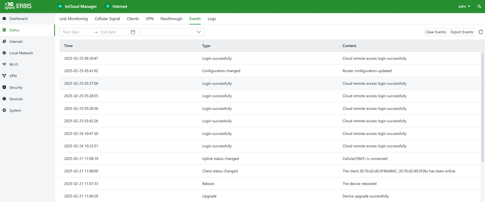

<strong>Figure 4-20 Event Types</strong>

Currently supported event types:

- Successful/Failed User Logins.
- High CPU Utilization in the Last 5 Minutes.
- High Memory Utilization in the Last 5 Minutes.
- Cellular Traffic Reaches Threshold.
- VPN Status Changes.
- Uplink Status Changes.
- Uplink Switching.
- Failover occurs.
- WAN1/LAN1 Switching.
- WAN2/LAN2 Switching.
- Reboot.
- Upgrade.

**Logs**

Through the "Status > Logs" feature, system logs can be examined, which contain information about the device's operational history. When the device encounters issues, technical personnel can use these logs for troubleshooting and diagnosis.

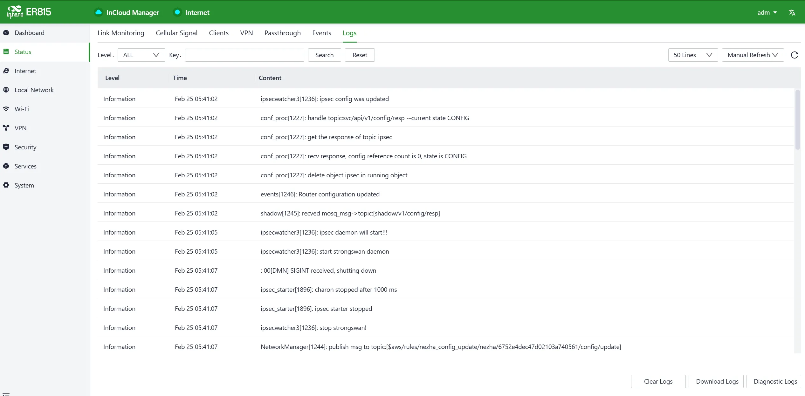

<strong>Figure 4-21 Logs Information</strong>

- Download Logs: Download the device's operational logs.
- Download Diagnostic Logs: Download the device's diagnostic logs, which include system operation logs, device information, and device configurations.
- Clear Logs: Clear the device's operational logs; this does not clear the device's diagnostic logs.

### 4.2 Internet

The parameters and operational modes of each upstream interface can be configured under the "Internet" feature. The ER815 supports three access network modes: wired, cellular, and Wi-Fi. The device comes with two non-removable upstream links by default: WAN1 and Cellular. It can support up to four upstream links, including WAN1, WAN2, Cellular, and Wi-Fi (STA). WAN2 and Wi-Fi (STA) interfaces need to be manually added and can be removed as needed.

#### 4.2.1 Wired Connection

The ER815 supports three wired internet connection methods: DHCP, Static IP, and PPPoE. The connection method can be modified by clicking on the "Edit" button. The default method is "DHCP."

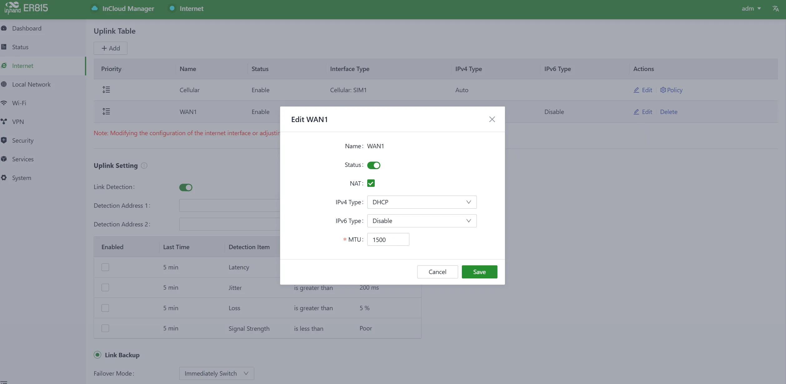

<strong>Figure 4-22 Edit the WAN1 Interface</strong>

- DHCP: The device's WAN interface has DHCP service enabled by default. Simply connect the WAN interface to the internet using an Ethernet cable, and it will automatically establish an internet connection.
- Static IP: Users have the option to manually configure an address either obtained from their internet service provider or one that is within the same network segment as their upstream device. Once the configuration is complete, the router will access the network via the specified static IP address.

<strong>Figure 4-23 Assigning a Static IP to the Router</strong>

- PPPoE: Users have the option to configure broadband dial-up. Once the configuration is complete, the router will establish an internet connection through the broadband dial-up.

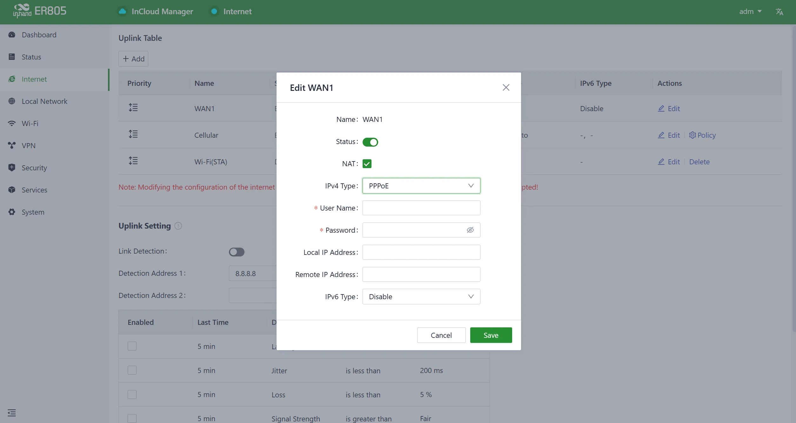

<strong>Figure 4-24 Set up Dial-up Internet Access</strong>

When dual WAN connections are required, the "Add" button in the 【Internet】 menu can be clicked to add the WAN2 interface. The WAN2 interface supports the same configuration options as the WAN1 interface.

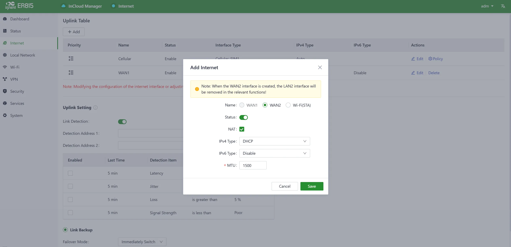

<strong>Figure 4-25 Add WAN2 Interface</strong>

> **Note**:
> - After deleting the WAN1 interface, the WAN1 interface role will switch back to LAN1.
> - After adding the WAN2 interface, the original LAN2 interface role will switch to WAN2.
> - After deleting the WAN2 interface, the WAN2 interface role will switch back to LAN2.
> - After deleting WAN1/2, all configuration related to the WAN1/2 interface, including static routes, inbound/outbound rules, port forwarding, policy routing, and traffic shaping settings will be removed.

#### 4.2.2 Wireless Connection

The ER815 supports connecting as a client to an on-site AP's network. To do this, click on the "Add" button, select "Wi-Fi (STA)," and fill in the required parameters, including the SSID name and password.

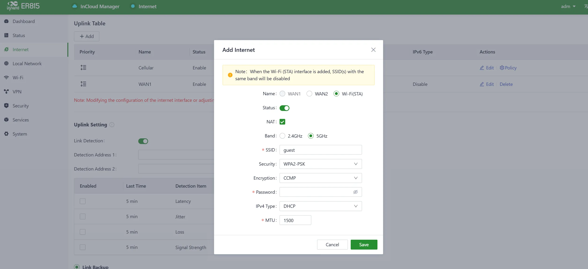

<strong>Figure 4-26 Add Wi-Fi (STA) Interface</strong>

> **Cautions**:
> - Upon adding Wi-Fi (STA), ER815 will automatically disable SSIDs in the same frequency band within the Wi-Fi settings, and the status field for those SSIDs cannot be modified.
> - After removing Wi-Fi (STA), the "Status" field and SSIDs in the same frequency band within the Wi-Fi settings can be modified.
> - When Wi-Fi (STA) is deleted, all configuration associated with the Wi-Fi (STA) interface, including static routes, inbound/outbound rules, port forwarding, policy routing, and traffic shaping settings, will be removed.

#### 4.2.3 5G/4G Connection

In the usual scenario, upon inserting the SIM card and connecting the Wi-Fi antennas, the ER815 router will automatically establish a dial-up connection and connect to the network when powered on.

To configure APN (Access Point Name) parameters, select the "Cellular" interface in the 【Internet】 menu and click the "Edit" button to access the APN parameter configuration interface.

Due to the longer dialing time with multiple SIMs in a polling sequence, the cellular module defaults to "SIM1 only." If SIM2 or eSIM is needed, the working mode must be changed.

<strong>Figure 4-27 Edit the Cellular Interface</strong>

The ER815, in addition to supporting cellular internet access, includes a traffic policy feature. Once the policy is enabled, the SIM card will take specific actions when the traffic reaches a threshold. Traffic usage statistics will reset at the beginning of the next month.

Select the "Cellular" interface in the 【Internet】 menu and click the "Policy" button to access the SIM card's policy parameter configuration interface.

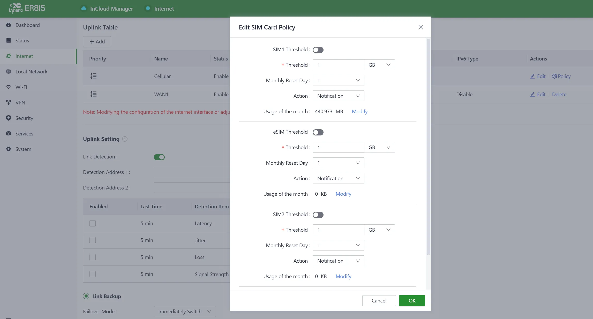

<strong>Figure 4-28 Edit the SIM Cards' Traffic Policy</strong>

Actions: These are the actions triggered when SIM card traffic reaches a threshold.

- Notification: It generates an event when traffic reaches the threshold but does not stop forwarding regular business traffic.
- Cloud Management Only: It generates an event when traffic reaches the threshold, allowing only the forwarding of cloud-based management traffic while blocking access to the internet for regular business traffic.
- Switch the SIM card: It generates an event when traffic reaches the threshold and switches to another SIM card.

> **Cautions**:
> - In certain dedicated network scenarios, it may be necessary to manually disable the "Link Detection" function under the 【Internet】 menu to prevent cellular connectivity issues caused by unsuccessful detection.
> - In some cases, manual configuration of the subnet mask for the cellular interface may be required to ensure the proper functioning of the ARP (Address Resolution Protocol) feature.
> - When inserting or removing a SIM card, it is essential to disconnect the power to prevent data loss or damage to the device.

#### 4.2.4 Uplink Table

The WAN1 and Cellular interfaces can be edited, and WAN2 and Wi-Fi (STA) interfaces can be added/edited/removed in the "Internet > Upstream Link List." The priority of each interface can be adjusted by dragging the "Priority" icon. Interfaces are arranged from top to bottom based on their priority, with higher priority interfaces taking precedence in determining the current upstream interface for device operation.

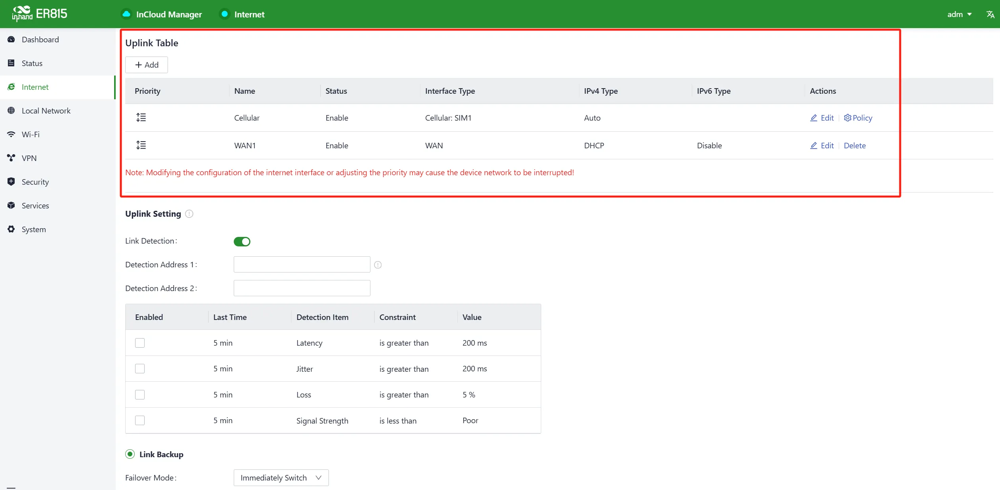

<strong>Figure 4-29 Uplink Table Interface</strong>

#### 4.2.5 Uplink Settings

Link detection settings and collaboration modes between different upstream interfaces can be configured through the "Internet > Upstream Link Settings" feature.

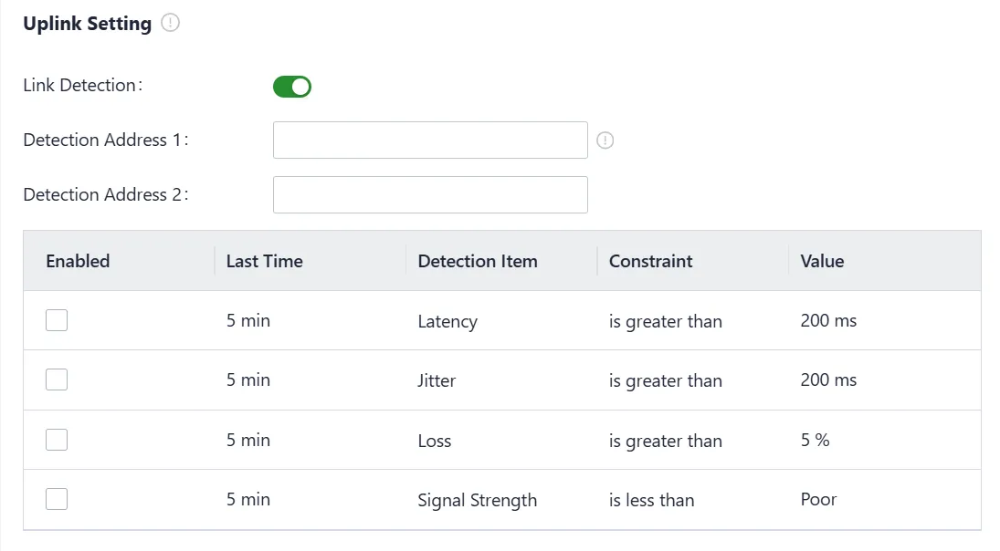

<strong>Figure 4-30 Uplink Settings Interface</strong>

**Link Detection Switch**: The device has link detection functionality enabled by default. However, in certain specialized network environments where external communication is not possible, users may need to manually disable link detection. When link detection is turned off, latency, jitter, packet loss, signal strength, and other information for upstream interfaces will not be viewable in the 【Status】 menu.

- **Detection Address**: If the detection address is not filled in, the device will detect the DNS address of the corresponding uplink. When the DNS addresses of the corresponding uplink interfaces cannot be detected, the device will also attempt to detect the default addresses 8.8.8.8 and 4.2.2.1. If neither can be detected, the device will consider the link's network as abnormal. If a detection address is filled in, all uplink interfaces will use the provided detection address as the sole criterion for judgment. Therefore, it is important to ensure the availability of the specified detection address.

> **Notes**:
> - Modifying settings in the Internet menu can potentially lead to a disruption in device connectivity. Exercise caution when making changes.
> - When the link detection address is left empty, the default behavior is to detect the DNS address via the upstream interface. If a detection address is specified, all upstream interfaces will only detect the address provided.
> - In the router's link backup mode, users can customize detection parameters, and the device will switch links based on the enabled detection items. When detection items are not enabled, upstream link switching will only occur based on priority and link connectivity.
> - In the device's load balancing mode, all operational upstream links will forward business traffic, provided they are functioning correctly.

### 4.3 Local Network

In the 【Local Network】 feature, local subnets can be defined. This includes configuring the address range, VLAN ID, DHCP services, and other related parameters for the local LAN. Once the configuration is complete, these settings need to be further applied to the device's LAN port through 【Interface Management】 or applied to the desired SSID in the Wi-Fi settings. This series of operations is intended to ensure that client devices can smoothly connect to the local network according to the planned network addresses.

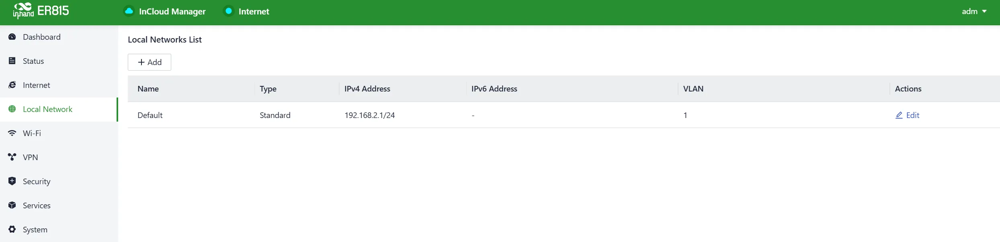

<strong>Figure 4-31 Local Network List</strong>

Click the "Add/Edit" button to add a new local network or edit an existing one.

<strong>Figure 4-32 Add/Edit the Local Network</strong>

- **Name**: Used to identify the network. Users can select this name to apply the network in both 【Wi-Fi】 and 【Interface Management】.
- **Mode**: Choose whether the current subnet operates in 2-layer transparent mode or 3-layer IP mode. The default is "IP mode."
- **VLAN**: This allows for the division of the local network into different virtual logical networks. The default VLAN for all interfaces and Wi-Fi is "default (VLAN1)."
- **IP Address/Subnet Mask**: This is the gateway address for accessing the router through the LAN port or Wi-Fi. The default is "192.168.2.1."
- **DHCP Server**: Clients connecting to the router can obtain IP addresses through this function. It is enabled by default, and the address range is generated based on the "IP Address/Subnet Mask."

> **Note**:
> - The default local network cannot be deleted, and you can only modify the IP address/subnet mask and DHCP server settings.
> - Once a local network is added, you cannot change its mode.
> - The VLAN Only mode is designed for 2-layer transparent operation and doesn't require configuration of IP address/subnet mask or DHCP server settings.

### 4.4 Wi-Fi

Wi-Fi is a widely used wireless communication technology that enables computers, smartphones, tablets, and other devices to connect to the internet or a local network. Wi-Fi technology allows devices to transmit data over a certain range through wireless signals, providing the convenience of accessing networks without the need for physical connections.

The ER815 can function as an Access Point (AP) to provide multiple SSID wireless network access. Users have the flexibility to customize different SSIDs for various purposes and configurations.

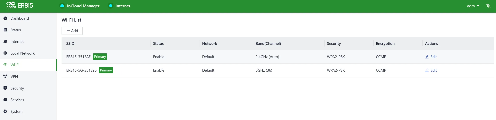

<strong>Figure 4-33 Wi-Fi List</strong>

By clicking the "Add/Edit" button under "Wi-Fi > Wi-Fi List," a new SSID can be added or an existing one can be edited.

<strong>Figure 4-34 Edit the SSID</strong>

> **Notes**:
> - The device comes with default 2.4GHz and 5GHz main SSIDs. The frequency bands of these main SSIDs cannot be modified and cannot be deleted.
> - Once an SSID is added, its frequency band cannot be changed, and it will automatically use the same channel as its corresponding main SSID.
> - If a user creates a Wi-Fi (STA) interface in the "Internet" menu with the same frequency band as an existing SSID, that SSID cannot be enabled until the Wi-Fi (STA) interface is deleted.

### 4.5 VPN

A Virtual Private Network (VPN) is an encryption technology used to establish a secure, private network connection over the public internet. It enables users to securely access private network resources over the internet from anywhere. VPNs achieve this by encrypting communication data, ensuring the confidentiality and security of the communication and preventing unauthorized access. This technology is highly valuable for connecting to corporate networks, maintaining online privacy, and accessing restricted content. VPNs have a wide range of applications, including in the corporate, personal, and mobile device sectors, making them a crucial tool for safeguarding privacy and data security.

#### 4.5.1 IPSec VPN

IPsec (Internet Protocol Security) VPN is a protocol suite designed to enhance network communication security by encrypting and authenticating data transmission. It is widely used for establishing secure remote access, site-to-site connections, and Virtual Private Networks (VPNs). IPsec VPN ensures data protection and security through encryption and authentication methods.

Click the "Add" button under "VPN > IPSec VPN" to add a new IPSec VPN.

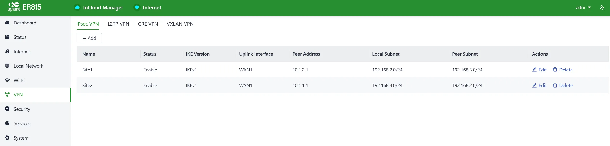

<strong>Figure 4-35 IPSec VPN List</strong>

Once configurations are completed at both ends, the tunnel can be established. The tunnel establishment status can be checked in the "Status > VPN" menu.

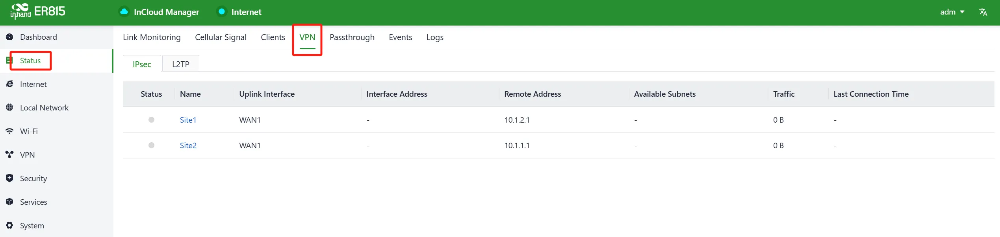

<strong>Figure 4-36 IPSec VPN Configuration</strong>

- **Name**: This is the user-assigned name for the IPSec VPN to identify it for local management purposes.
- **IKE Version**: The version of the Internet Key Exchange (IKE) protocol to be used. It supports both IKEv1 and IKEv2.
- **Pre-Shared Key**: This is a secret shared key that must be configured the same on both devices for authentication during IKE negotiation.
- **Internet Interface**: The upstream interface used to establish the IPSec VPN locally.
- **Tunnel Mode**: This sets the encapsulation mode for IPSec on IP packets. It supports both tunnel mode and transport mode.
- **Peer Address**: This is the address of the remote endpoint with which ER815 establishes the IPSec tunnel.

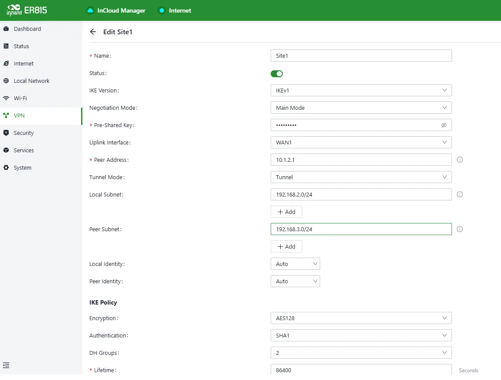

<strong>Figure 4-37 IPSec VPN Advanced Settings</strong>

This setup allows the device with the public IP address to act as the server, and the client devices connect to it using the server's public IP address.

- **Name**: Identify the name of the IPsec tunnel.
- **Status**: IPsec VPN switch.
- **IKE Version**: The default version is IKEv1; IKEv2 can be chosen based on requirements.
- **Negotiation Mode**: The default is Main Mode; Aggressive Mode can be selected here.
- **Pre-shared Key**: The authentication key for establishing a tunnel between the IPsec server and client.
- **Uplink Interface**: The uplink interface of the device to establish the VPN; the IPsec tunnel with the peer will be established using the IP address of the uplink interface.
- **Peer Address**: The communication address of the IPsec peer.
- **Local Subnet**: Configure the subnet matching rules for the local interesting flow in IPsec.
- **Peer Subnet**: Configure the subnet matching rules for the peer interesting flow in IPsec.
- **Tunnel Mode**: Choose between Transport Mode or Tunnel Mode, with Transport Mode set as the default.
- **Local Identity**: The local identification information of the IPSec tunnel. Supports IP address or FQDN, with the default set to automatic.
- **Peer Identity**: The peer identification information of the IPSec tunnel. Supports IP address or FQDN, with the default set to automatic.
- **IKE Policy**: Supports configuring the IKE protocol.
  - **Encryption Method**: Sets the encryption algorithm used by IKE.
    - Options: DES, 3DES, AES128, AES192, AES256 (default: AES128)
  - **Authentication Method**: Set the authentication algorithm used by IKE.
    - Options: MD5, SHA1, SHA2-256, SHA2-384, SHA2-512 (default: SHA1)
  - **DH Group**: Configure the DH exchange parameters used during the IKE phase key negotiation.
    - Options: 1, 2, 5, 14, 15, 16, 19, 20
  - **IKE Policy Lifetime**: Set the IKE SA (Security Association) lifetime, defaulting to 86400 seconds.
  - **Peer Status Detection**: The switch for detecting the availability of the IPsec peer.
  - **DPD Interval**: The detecting interval, with the default set to 30 seconds.
  - **DPD Timeout**: The detecting timeout, with the default set to 180 seconds.
- **IPSec Policy**: This allows you to configure IPSec parameters.
  - **Security Protocol**: Sets the security protocol used by the ESP protocol.
    - Options: DES, 3DES, AES128, AES192, AES256 (default: AES128)
  - **Authentication**: Sets the encryption algorithm used by the ESP protocol.
    - Options: MD5, SHA1, SHA2-256, SHA2-384, SHA2-512 (default: SHA1)
  - **PFS Group**: In IPSec, during the negotiation of a security policy, an additional key exchange is performed in Phase 2 to enhance communication security.
    - Options: 1, 2, 5, 14, 15, 16, 19, 20
  - **Timeout**: Sets the IPSec SA aging time, default is 86400 seconds.

**IPSec VPN Typical Configuration Example**

**Scenario Description**:

Two ER815 devices located in different regions need to establish an IPsec tunnel for business data communication.

- The WAN IP address of the Site1 device is 10.1.1.1, and its local subnet is 192.168.2.0/24, peer subnet is 192.168.3.0/24.
- The WAN IP address of the Site2 device is 10.1.1.2, and its local subnet is 192.168.3.0/24, peer subnet is 192.168.2.0/24.

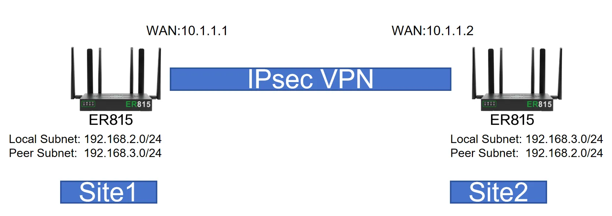

<strong>Figure 4-38 IPSec VPN Topology</strong>

Configure the VPN name, pre-shared key, uplink interface, and peer IP address for both devices, as well as the local and peer interested flow subnets for communication. The remaining parameters will use the default settings to establish the IPsec tunnel at both ends.

Site1 Configuration:

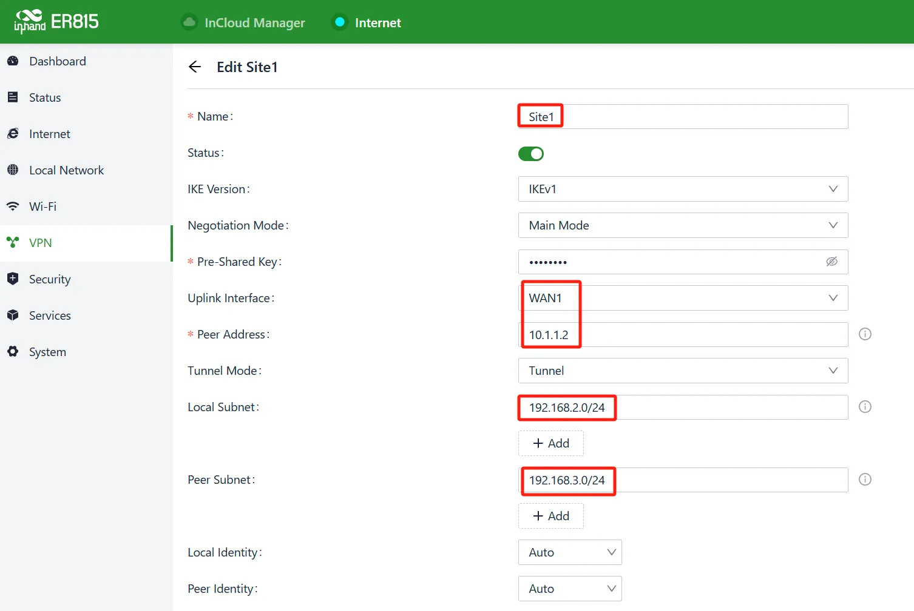

<strong>Figure 4-39 Site1 IPSec Configuration</strong>

Site2 Configuration:

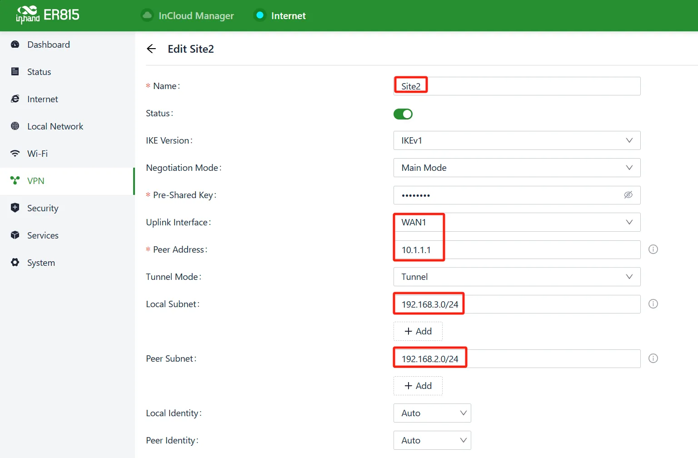

<strong>Figure 4-40 Site2 IPSec Configuration</strong>

#### 4.5.2 L2TP VPN

The Layer 2 Tunneling Protocol (L2TP) is a Layer 2 VPN protocol designed to establish secure point-to-point or site-to-site Virtual Private Network (VPN) connections. It is commonly used for remote access and branch office connectivity, creating secure communication channels for users or networks to protect the privacy and integrity of data transmission.

##### 4.5.2.1 Work as a Server

A typical L2TP server is usually deployed at the headquarters of an enterprise, serving as a remote access server for mobile office or branch offices. To configure the L2TP server settings, click on "VPN > L2TP VPN > Server" to access the L2TP server editing page.

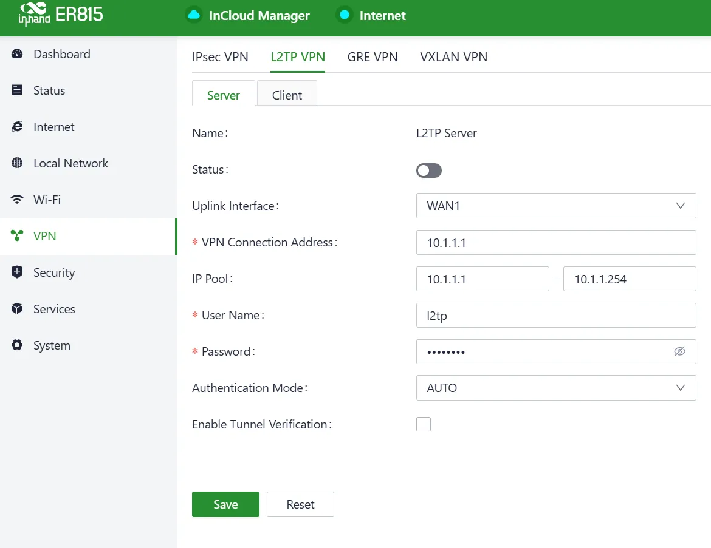

<strong>Figure 4-41 Set the L2TP Server</strong>

- **Name**: The name of the L2TP server, not editable.
- **Status**: The on/off switch for the L2TP server function, default is off.
- **Uplink Interface**: The upstream interface used by the L2TP server.
- **VPN Connection Address**: The gateway address for L2TP clients, which can be assigned to devices within the IP address pool.
- **IP Pool**: The IP address pool is used for communication when L2TP clients connect.
- **Username/Password**: Usernames and passwords that need to be the same on both ends for L2TP negotiation.
- **Authentication Mode**: Setting the L2TP authentication mode.
- **Enable Tunnel Verification Function**: When enabled, the usernames/passwords for tunnel verification on both ends need to be the same.

##### 4.5.2.2 Work as a Client

The ER815 can act as an L2TP client and establish a tunnel with a remote L2TP server. Click on the "L2TP VPN" menu, then navigate to "Client," and use the "Add" button to configure an L2TP client.

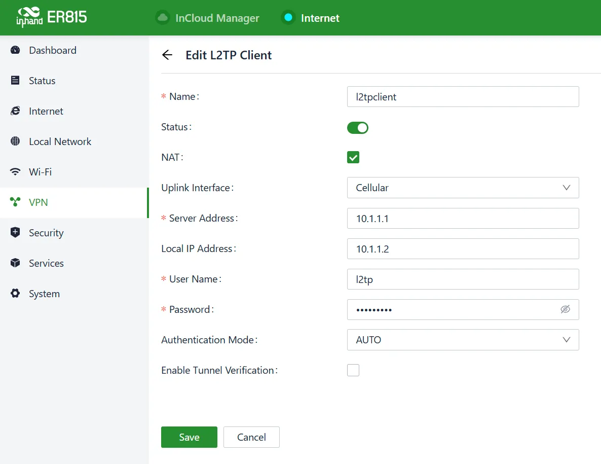

<strong>Figure 4-42 Set the L2TP Client Parameters</strong>

- **Name**: The name of the L2TP client for local identification.
- **Status**: The switch to enable or disable the L2TP client tunnel.
- **NAT**: The switch for NAT functionality when forwarding with the L2TP client.
- **Uplink Interface**: The upstream interface used for communication between the L2TP client and the server.
- **Server Address**: The communication address of the remote L2TP server.
- **Local IP Address**: The Local IP address must be within the L2TP Server address pool range.
- **Username/Password**: Usernames and passwords that need to be configured the same on both ends during L2TP negotiation.
- **Authentication Mode**: Setting the L2TP authentication mode.
- **Enable Tunnel Authentication**: When enabled, both ends need to configure the same username and password for tunnel authentication.

#### 4.5.3 GRE VPN

GRE VPN is a common point-to-point VPN that is simple and flexible to configure. Since it does not include encryption by itself, it is often used in conjunction with the IPsec protocol.

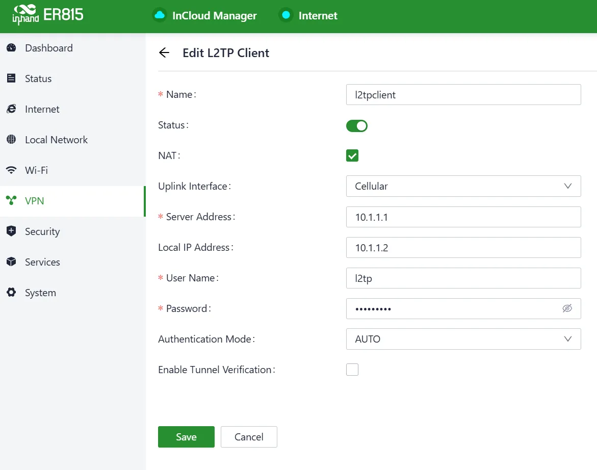

<strong>Figure 4-43 Configure GRE VPN</strong>

- **Name**: The name of the GRE VPN.
- **Tunnel ID**: The identifier of the GRE tunnel process.
- **Status**: The switch to enable or disable the GRE tunnel.
- **NAT**: The switch for NAT functionality when forwarding with the GRE VPN.
- **Network Type**: The default network type is point-to-point or point-to-multipoint.
- **Local Virtual IP**: Configure the subnet matching rules for the local interesting flow in GRE.
- **Peer Virtual IP**: Configure the subnet matching rules for the Peer interesting flow in GRE.
- **Source Address Type**: You can choose to configure the IP address for establishing the GRE tunnel, or you can choose to use the uplink interface's IP address to establish the tunnel.
- **Peer IP Address**: The peer IP address for establishing the GRE VPN.
- **MTU**: The MTU size of the encapsulated packet in the GRE VPN.
- **Tunnel Key**: The authentication key for identity verification at both ends of the GRE VPN.

#### 4.5.4 VXLAN VPN

VXLAN (Virtual Extensible LAN) is essentially a tunneling technology that establishes a logical tunnel over an IP network between the source and destination network devices. It achieves data transmission and forwarding by encapsulating user-side packets in a specific manner.

Click the "Add" button under "VPN > VXLAN VPN" to create a new VXLAN VPN.

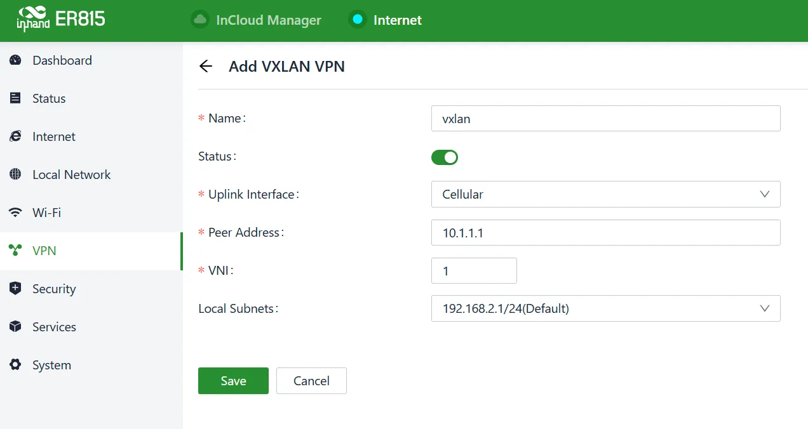

<strong>Figure 4-44 Add a VXLAN VPN</strong>

- **Name**: Set the name for this VXLAN VPN network.
- **Uplink Interface**: The outbound interface used to establish a VXLAN tunnel with other devices.
- **Peer Address**: Configure the IP address of the peer device with which this device needs to establish a VXLAN VPN network.
- **VNI**: The VXLAN Network Identifier, where each VNI represents a different tenant or network segment.
- **Local Subnet**: Specify the address range assigned to local client devices when they connect.

> **Note**:
> - VXLAN cannot be used with other VPN functions and IP Passthrough functions at the same time.

### 4.6 Security

In the 【Security】 menu, advanced features related to firewalls, policy routing, and traffic shaping can be configured.

#### 4.6.1 Firewall

The firewall currently includes functions such as inbound rules, outbound rules, port forwarding, MAC address filtering, and more.

**Inbound Rules/Outbound Rules**

Traffic in/out control based on interfaces can be implemented through the "Security > Firewall > Outbound Rules/Inbound Rules" feature. For example, if a user is subjected to a significant amount of attacks from a specific source IP address, inbound firewall rules can be used to restrict traffic from that IP address.

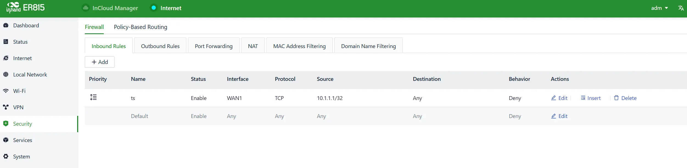

<strong>Figure 4-45 Firewall Function Entry</strong>

Furthermore, IT personnel can utilize outbound firewall rules to restrict certain users' access to external networks. Inbound and outbound rules share the same configurable content, with the only distinction being the default rules.

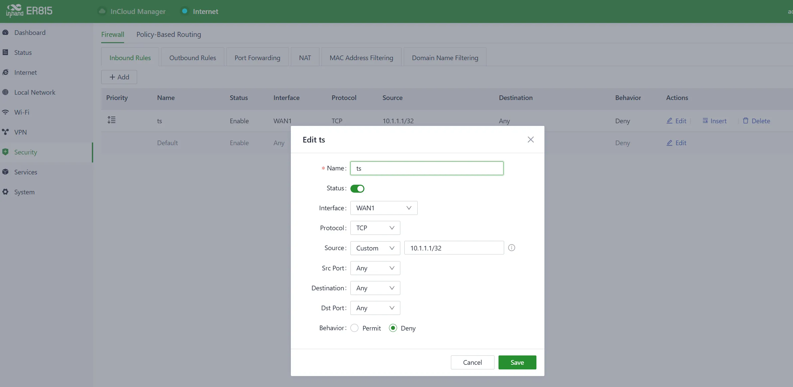

<strong>Figure 4-46 Add Inbound/Outbound Rule</strong>

- **Name**: Set the name of the inbound/outbound rule.
- **Status**: Rule function switch.
- **Interface**: For outbound rules, it specifies the upstream interface where traffic leaves the router. For inbound rules, it specifies the upstream interface where traffic enters the router.
- **Protocol**: Match traffic based on the protocol type, with options like Any, TCP, UDP, ICMP, or custom.
- **Source**: Match the source address for traffic, supporting custom, with the default as Any.
- **Destination**: Match the destination address for traffic, supporting custom, with the default as Any.
- **Action**: Action taken for matching traffic in inbound/outbound rules, supporting allow and deny.
- **Inbound Rules**: Traffic management rules for external network accessing the router, with the default as deny all.
- **Outbound Rules**: Traffic management rules for traffic going out through the router, with the default allowing all.

Support for adjusting the priority of inbound and outbound rules is provided.

**Port Forwarding**

Port forwarding, also known as port mapping or port redirection, is used to redirect network packets from one network port (or address) to another network port or address. Port forwarding rules can be configured under "Security > Firewall > Port Forwarding." When external traffic accesses a specific port on the router, the device forwards the data to the corresponding port of an internal client, enabling external access to services inside the router.

For example, when a user needs to access the service on port 1024 of the internal client at 192.168.2.10 from the external network, this client's port can be mapped to port 1024 under the WAN1 interface. External users only need to enter `https://<WAN1 address>:1024` in their browser to access the target device's data, where the WAN1 address is the IP address of the WAN1 interface.

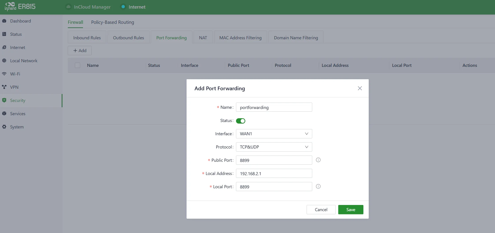

<strong>Figure 4-47 Add a Port Forwarding Rule</strong>

- **Name**: The name of the port forwarding rule, used for local identification.
- **Status**: The on/off switch for the port forwarding rule.
- **Interface**: The upstream interface that provides mapping functionality for internal clients. The upstream interface needs public IP address support.
- **Protocol**: The protocol type of the traffic for port mapping, supports TCP, UDP, and TCP & UDP.
- **Public Port**: The port number on the upstream interface that provides mapping.
- **Local Address**: The address of the target device located under the router that the external network needs to access.
- **Local Port**: The port of the target device that the external network needs to access. It needs to be consistent with the public port input range.

**NAT**

**SNAT**

Source NAT refers to modifying the source IP address of a data packet. It is typically used when internal hosts access external networks, converting the private IP address of the internal host to a public IP address. This way, the external network will see the public IP address rather than the actual private IP address.

**Application Scenario**:

- **Internal network accessing external network**: For example, when an internal host accesses the internet through a NAT router, the source IP is changed to the router's public IP address.

**DNAT**

Destination NAT refers to modifying the destination IP address of a data packet. It is typically used to convert the destination address of a packet from an external network to the IP address of an internal device. This allows external networks to access services located within a private network.

**Application Scenario**:

- **External access to internal servers**: For example, forwarding external requests to a specific service provided by an internal server. It is commonly used for web servers, FTP servers, remote desktop access, etc.

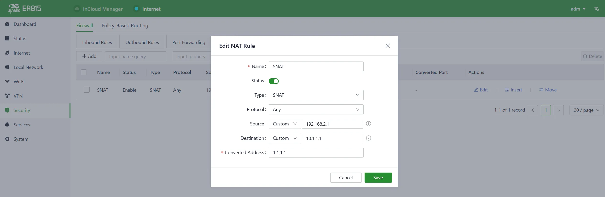

<strong>Figure 4-48 Add a NAT Rule</strong>

- **Name**: The name of the NAT rules.
- **Status**: The on/off switch for the NAT function.
- **Protocol**: The protocols affected by NAT conversion, supports TCP, UDP, and TCP & UDP.
- **Source**: The upstream interface that provides mapping functionality for internal clients. The upstream interface needs public IP address support.
- **Public Port**: The port number on the upstream interface that provides mapping.
- **Local Address**: The address of the target device located under the router that the external network needs to access.
- **Local Port**: The port of the target device that the external network needs to access. It needs to be consistent with the public port input range.

**MAC Address Filtering**

MAC address filtering involves allowing or disallowing devices in a MAC address list to access the internet, which means controlling LAN devices' internet access requests through MAC address filtering on the router. MAC address filtering rules can be configured in "Security > Firewall > MAC Address Filtering."

Multiple MAC addresses can be created in the list, address descriptions can be added, and it can be set to allow only the MAC addresses to access the network (whitelist), or MAC addresses in the list can be blocked from accessing the network (blacklist).

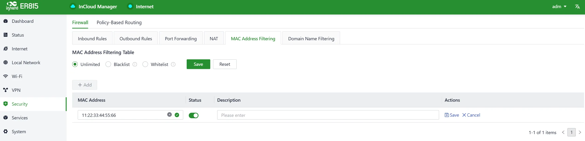

<strong>Figure 4-49 Add a MAC Address Filter Rule</strong>

This feature does not impose any default restrictions on the MAC address list for clients. After modifying the black-and-white list configuration, it may cause clients to be unable to access the ER815. In case of misoperation, the related configuration can be cleared through the InCloud Manager platform.

- **Blacklist**: Clients in the blacklist cannot access the router or use the internet through the ER815.
- **Whitelist**: Only clients in the whitelist can access the router and use the internet through the ER815. Therefore, when setting up the whitelist, if the ER815 is being operated through a PC or other terminal devices, make sure the MAC address of the device is included in the whitelist.

#### 4.6.2 Domain Name Filtering

In this feature, filtering rules for domain names can be set. By default, there are no restrictions.

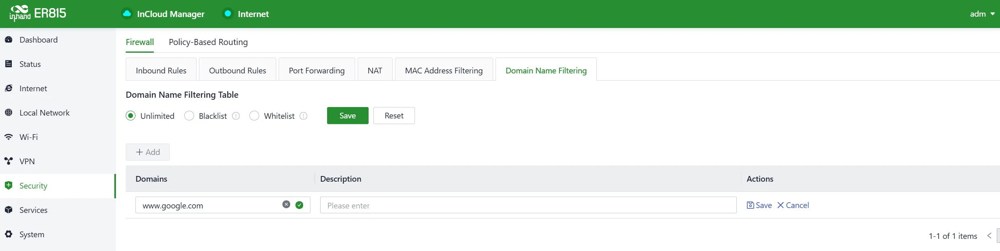

<strong>Figure 4-50 Add a Domain Name Filter Rule</strong>

- **Whitelist**: Only domains on the whitelist are allowed to be accessed.
- **Blacklist**: Domain addresses on the blacklist will be blocked from access.

#### 4.6.3 Policy-Based Routing

Policy routing is a feature that allows users to create policies based on their specific needs, enabling them to route different data flows through different links. This improves the flexibility and control of routing decisions, enhances link utilization efficiency, and reduces enterprise costs. Click the "Add" button under "Security > Policy Routing" to create a new policy routing rule.

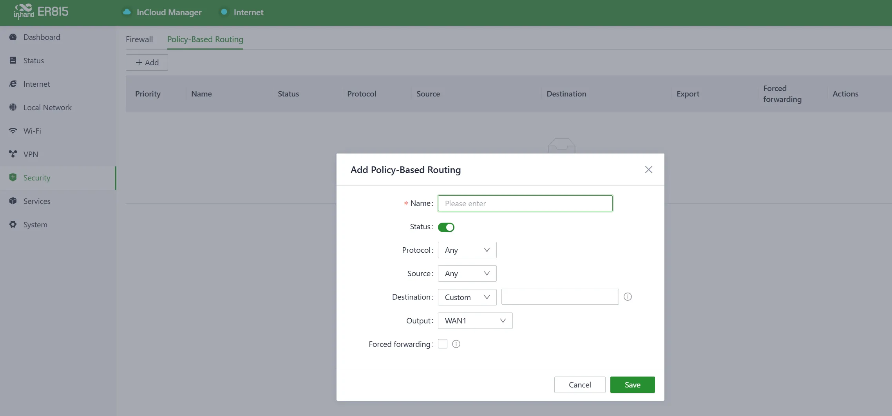

<strong>Figure 4-51 Policy-Based Routing</strong>

- **Name**: The name of the policy routing.
- **Status**: The enable/disable switch for policy routing.
- **Protocol**: The protocol matched by the policy routing.
- **Source**: The source address matched by the policy routing.
- **Destination**: The destination address matched by the policy routing.
- **Output**: The uplink interface used for transmitting in policy routing.
- **Forced forwarding**: When forced forwarding is enabled, traffic matching the policy routing will be forcibly forwarded. When disabled, if the policy routing is unreachable, the traffic can be forwarded via the default route or other policy routes.

> **Cautions**:
> - The source address and destination address in a policy routing rule cannot both be set as "Any."

### 4.7 Services

#### 4.7.1 Interface Management

Local networks allowed through a specific interface and the interface's speed can be configured in the "Services > Interface Management" function.

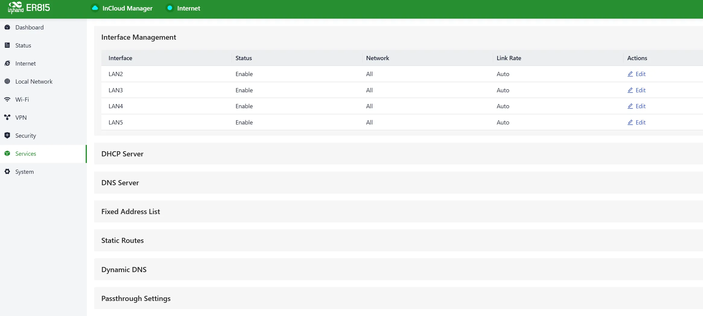

<strong>Figure 4-52 Interface Management</strong>

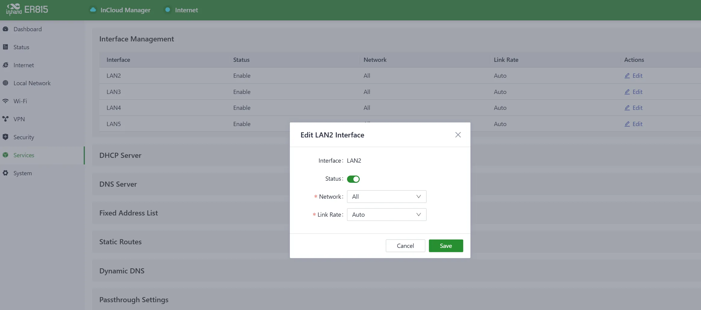

<strong>Figure 4-53 Edit the Interface</strong>

#### 4.7.2 DHCP Server

The DHCP (Dynamic Host Configuration Protocol) service operates in a client/server communication mode, where clients request IP addresses from servers, and servers respond to these requests by assigning IP addresses dynamically to clients. The DHCP server's IP address pool can be configured using the "Services > DHCP Server" feature.

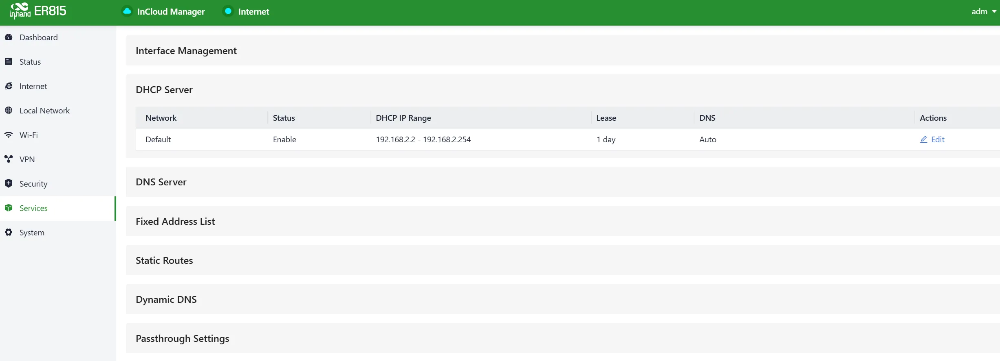

<strong>Figure 4-54 DHCP Server</strong>

> **Notes**:
> - The device's DHCP service is generated based on the network information in the local network. If a local subnet is removed from the "Local Network List," the DHCP Server for that local subnet will also be deleted.
> - Local network entries need to be set in "IP" mode for the DHCP server function to take effect. Networks in "VLAN Only" mode are not within the selectable range.

#### 4.7.3 DNS Server

DNS (Domain Name System) servers are a crucial network component responsible for translating human-readable domain names (e.g., www.example.com) into computer-understandable IP addresses (e.g., 192.168.1.1). DNS servers act as the address book of the internet, helping computers and devices find the locations of other devices and ensuring that information can be correctly delivered across the network.

When DNS server addresses are not set in "Services > DNS Server," the DNS addresses obtained from the device's upstream interface will be used for domain name resolution. When DNS server addresses are configured, the configured DNS addresses will be used for domain name resolution.

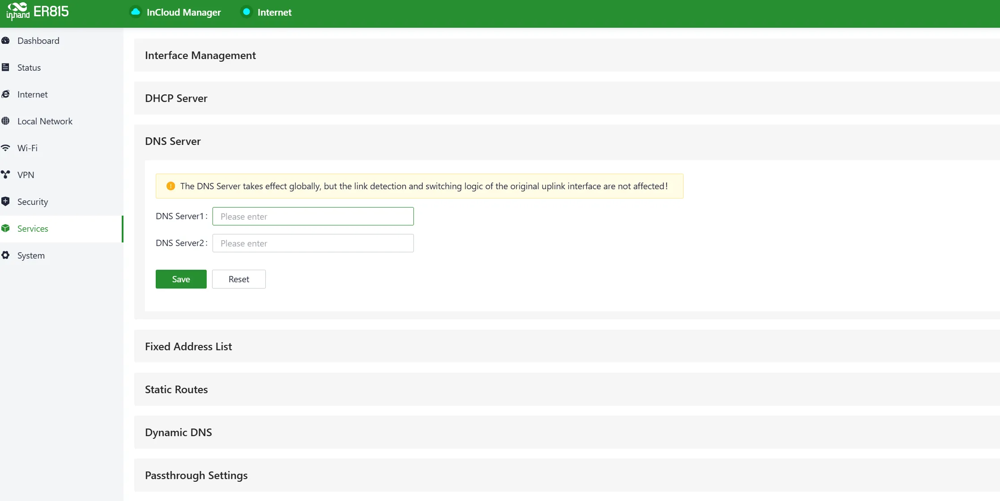

<strong>Figure 4-55 Add a DNS Server</strong>

#### 4.7.4 Fixed Address List

The "Services > Fixed Address List" function can be used to allocate a fixed IP address to a device based on its MAC address. This means that the device will consistently receive the same IP address every time it connects to the ER815.

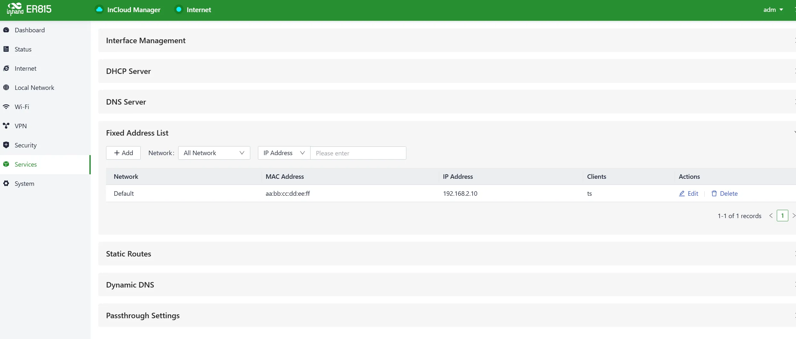

<strong>Figure 4-56 Add a Fixed IP Address</strong>

> **Cautions**:
> - The available addresses for allocation must fall within the address range of the local network in IP mode, or else the configuration will not take effect.
> - When the local network is deleted, all fixed address allocation rules within the local network's address range will be removed.

#### 4.7.5 Static Routes

Static routing entries can be configured using the "Services > Static Routing" feature to enable data to be forwarded through specified paths and interfaces. The contents of the static routing table are manually created by users, and routing entries generated by other services, such as VPN functionality, will not be displayed in this table.

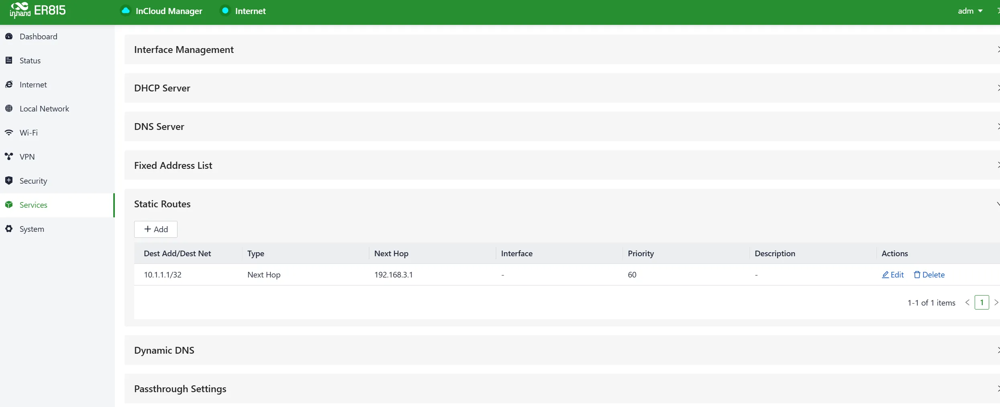

<strong>Figure 4-57 Add a Static Route</strong>

- **Destination Address/Destination Network**: Allows configuring destination addresses and destination subnets.
- **Type**: You can choose the next-hop address of the route or the interface through which it is forwarded.
- **Next Hop**: The next-hop address for route transmission.
- **Interface**: The interface through which the route is forwarded by the device.
- **Priority**: The priority of the static route; the smaller the value, the higher the priority. The default is 60.

> **Cautions**:
> - For static routes with the same destination address/network, the next-hop address, interface, or priority cannot be the same; otherwise, it will result in a non-functional route.
> - When WAN2, Wi-Fi (STA), or L2TP Client VPN is deleted, the corresponding static routes using those interfaces will also be removed.

#### 4.7.6 Dynamic DNS

Dynamic DNS (Dynamic Domain Name System) is used to automatically update the name server content in the domain system. According to internet domain rules, domain names are typically associated with fixed IP addresses. Dynamic DNS technology allows users with dynamic IP addresses to have a fixed name server. This enables external users to connect to the URL of users with dynamic IP addresses through regular updates.

The Dynamic DNS server address can be manually configured under the "Services > Dynamic DNS" feature.

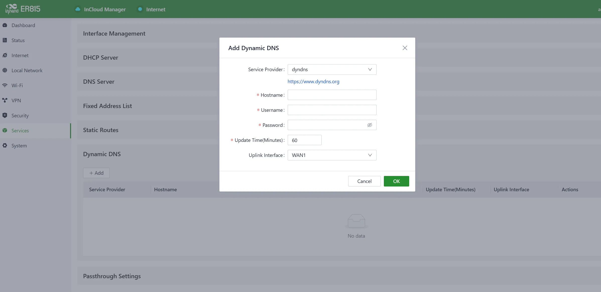

<strong>Figure 4-58 Add a Dynamic DNS Service</strong>

- **Service Provider**: Provided by the Dynamic DNS service operator; options include dyndns, 3322, oray, no-ip, or a custom option (requires a URL).
- **Hostname**: Register for a hostname by clicking on the URL below the service provider.
- **Username**: Register for a username by clicking on the URL below the service provider.
- **Password**: The password set during registration.
- **Update Time**: DDNS data synchronization time.
- **Uplink Interface**: The uplink for DDNS operation.

#### 4.7.7 Passthrough Settings

The IP Passthrough feature can be enabled through "Service > Passthrough Settings."

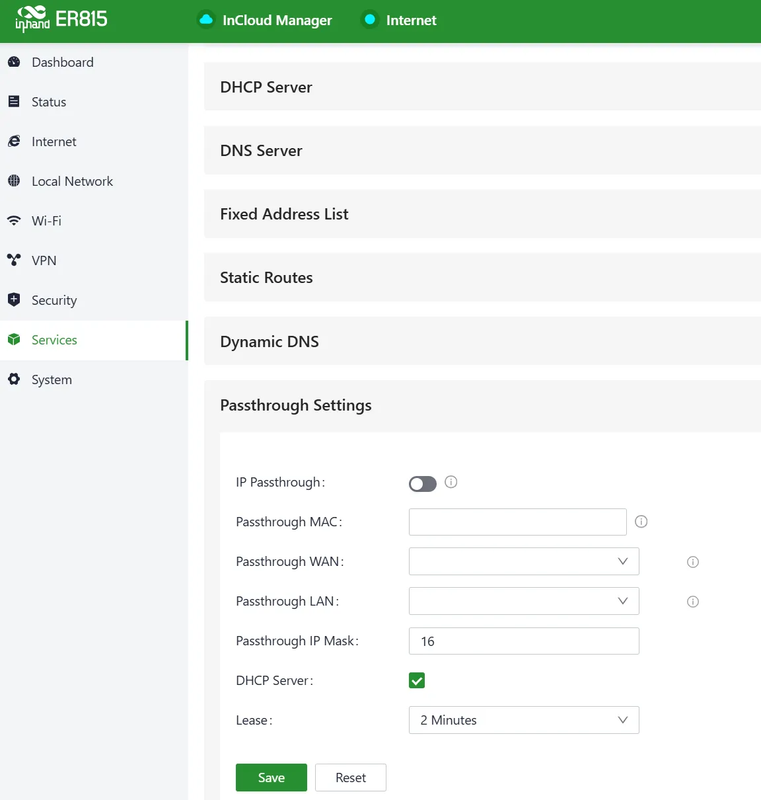

<strong>Figure 4-59 Enable the IP Passthrough</strong>

- **IP Passthrough Switch**: The enable switch for the IP Passthrough (IPPT) status.
- **Passthrough MAC**: Only clients bound to this MAC can obtain the upstream interface address of the device.
- **Passthrough WAN**: The uplink for IP Passthrough.
- **Passthrough LAN**: The LAN port for IP Passthrough.
- **Passthrough IP Mask**: The subnet mask transmitted through the uplink interface for IP Passthrough.
- **DHCP Server**: The DHCP function switch for IP Passthrough.
- **Lease**: The lease time for the DHCP service.

> **Cautions**:
> - When the IP Passthrough mode is enabled, only one client can access the public network.

### 4.8 System

In the "System" menu, settings related to cloud management, remote access control, clock settings, device options, configuration management, device alerts, tools, and log servers can be configured.

#### 4.8.1 Account Management

Check the device's nameplate for the username and password. To ensure the security of the device, it is recommended to change the password. This can be done by clicking on "adm" in the top navigation bar and selecting "Change Password" from the dropdown menu.

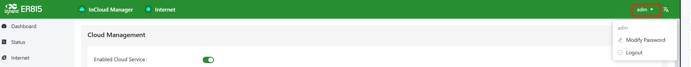

<strong>Figure 4-60 Modify the Password</strong>

#### 4.8.2 Cloud Management

The InCloud Service (star.inhandcloud.com) is a cloud platform developed by InHand Networks to address the challenges faced by enterprise networks, such as slow deployment, complex operations, and poor user experiences. This platform is designed with a focus on user needs and integrates features like zero-touch deployment, intelligent operations and maintenance, security protection, and excellent user experience capabilities. Once devices are connected to the cloud platform, remote management, batch configuration, traffic monitoring, and other operations can be performed through the platform.

ER815 automatically connects to the InCloud Service after establishing an internet connection by default. If the cloud management function is not desired, it can be disabled manually in the "System > Cloud Management" function.

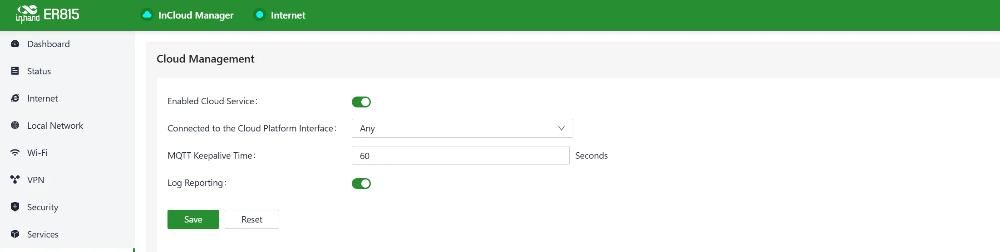

<strong>Figure 4-61 Enable the InCloud Service</strong>

- **Enabled Cloud Service**: Enable or disable the function for the device to connect to the cloud platform. Enabled by default; if disabled, it must be re-enabled through the local device interface.
- **Connected to the Cloud Platform Interface**: Choose the uplink interface for platform communication. If a wired link is available and cellular data usage is a concern, the WAN interface can be selected.
- **MQTT Keepalive Time**: The heartbeat interval between the device and the platform, default is 60 seconds.
- **Log Reporting**: The switch for the log reporting function.

#### 4.8.3 Remote Access Control

Whether to allow external access to the router's web configuration interface from the Internet can be configured through the "System > Remote Access Control" function. The service port for this purpose can also be set.

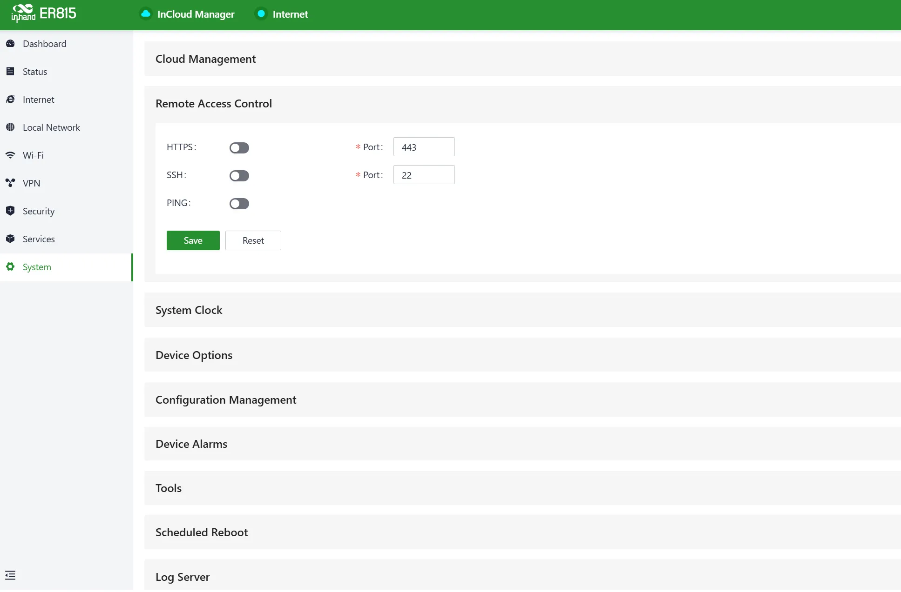

<strong>Figure 4-62 Set the Parameters of Remote Access</strong>

1. **HTTPS**: When enabled, the router's web interface can be accessed remotely by entering the public IP address and port number of the uplink interface in a web browser.
2. **SSH**: When enabled, the router's backend can be remotely logged in to using remote tools (such as CRT) by providing the public IP address, port number, username, and password.
3. **Ping**: When enabled, the uplink interface allows external networks to initiate Ping requests.

#### 4.8.4 System Clock

In network functionality, the clock function refers to the capability used to coordinate and synchronize the time between network devices. Clock functionality within a network is crucial for data transmission, log recording, security, coordination, and troubleshooting. It ensures that various devices in the network are operating with synchronized times, which is essential for efficient and secure network operations.

The "System > Clock" function can be used to select the current time zone and configure NTP (Network Time Protocol) server addresses to synchronize the device's system time with an NTP server.

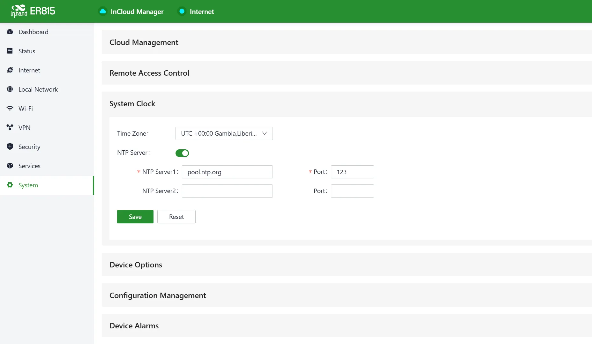

<strong>Figure 4-63 Set the Time Zone and NTP Server</strong>

#### 4.8.5 Device Options

In the "System > Device Options" section, various device operations can be performed such as rebooting, upgrading firmware, upgrading the module version, and restoring factory settings.

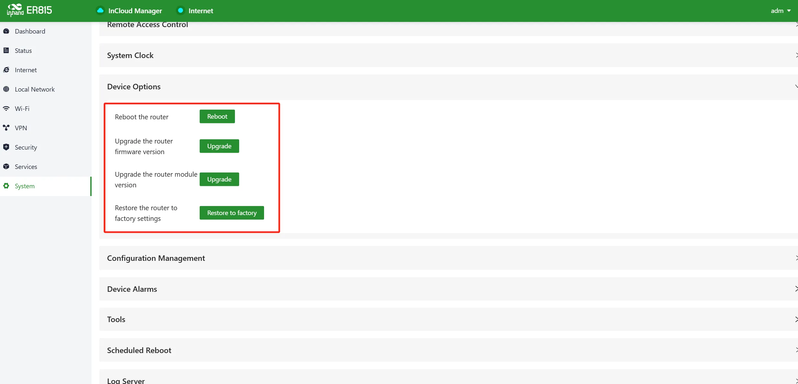

<strong>Figure 4-64 Device Options</strong>

> **Cautions**:
> - When performing a local firmware upgrade, it is essential to ensure that the firmware is obtained from a legitimate source to avoid rendering the device inoperable due to incorrect firmware imports.
> - When a device is connected to the cloud platform, the platform will synchronize the previous configuration to the device again due to cloud-based configuration synchronization. The device will only clear historical data during the factory reset.

#### 4.8.6 Configuration Management

Configuring backups and backup recovery are critical tasks in network management and maintenance. They involve saving the configuration information of network devices so that it can be quickly restored or transferred when needed.

Device configurations can be exported to local storage in the "System > Configuration Management" menu. This backup can be imported into the device in case of configuration loss or when the existing configuration needs to be overwritten.

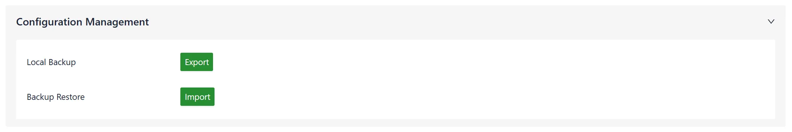

<strong>Figure 4-65 Configuration Management Interface</strong>

#### 4.8.7 Device Alarms

Specific events that may occur on the device can be selected, and the email address for receiving alerts can be configured. When an alarm event occurs, the device will automatically send an email notification. Even if certain alarm options are not selected, related alarm events will still be recorded in the device's local logs.

Alarm event types and email addresses for alarm notifications can be configured in the "System > Device Alarms" menu.

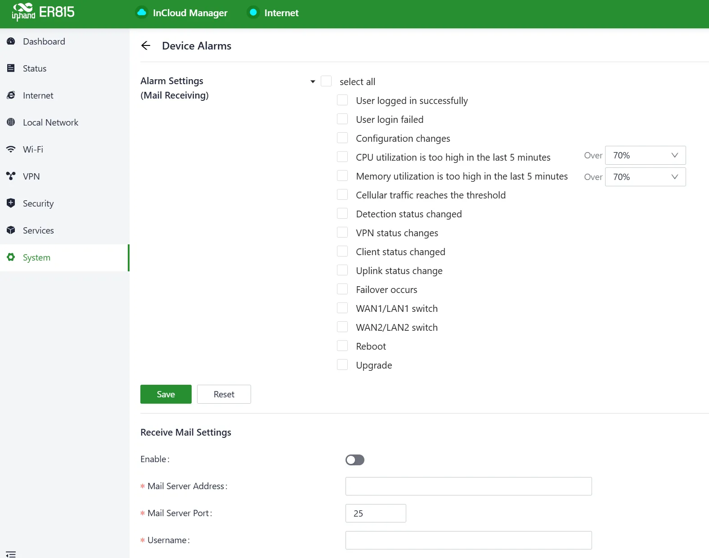

<strong>Figure 4-66 Alarm Event Types</strong>

After configuring the outgoing email server address, port, username, and password, the device will use this email account to send alarm notifications. The "Send Test Email" option can be used to verify whether the outgoing email configuration is correct.

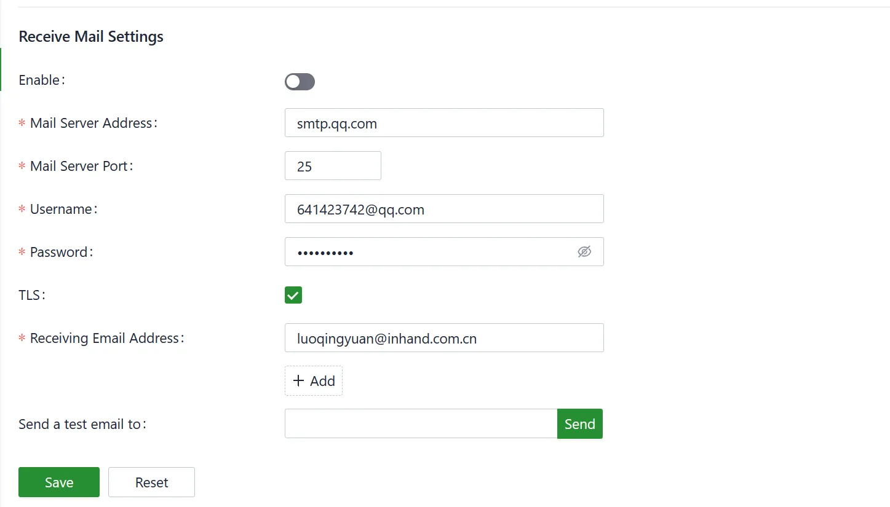

<strong>Figure 4-67 Mail Receiving Settings</strong>

#### 4.8.8 Tools

**Ping**

ICMP (Internet Control Message Protocol) can be used to check the device's external network connectivity. In the "Target" field, enter any domain name or IP address to test the device's connectivity to, and then click "Start" to check the connectivity status between the device and the specified target. This can help determine whether the device can reach the target over the internet.

A network ping test on a target can be performed by going to "System > Tools > Ping." This allows sending ICMP echo requests to the specified target IP address or domain name and receiving ICMP echo replies to check network connectivity and latency to that target.

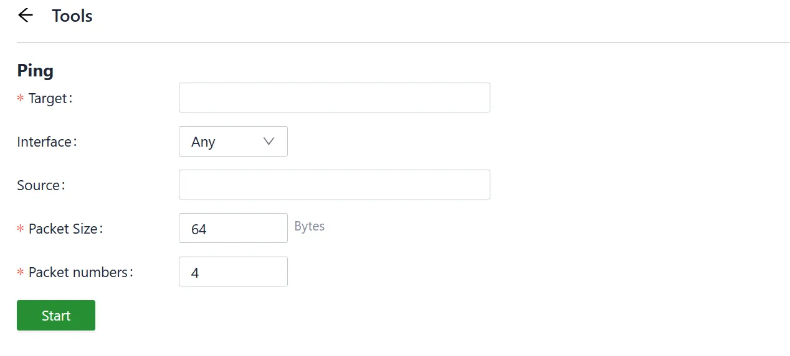

<strong>Figure 4-68 Ping</strong>

**Traceroute**

Traceroute is a network diagnostic tool used to determine the network path that data packets take from the source to the destination, as well as the intermediate routers or hops along that path. The target host's IP address can be entered in "System > Tools > Traceroute," the outgoing interface for the traffic can be chosen, and "Start" can be clicked to check the device's connectivity to the target IP by tracing the route.

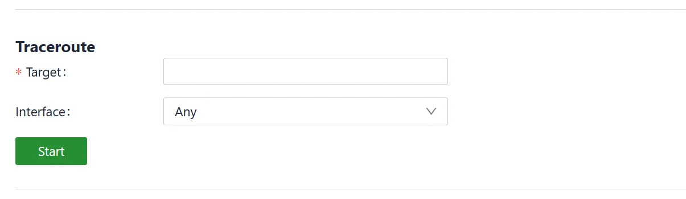

<strong>Figure 4-69 Traceroute</strong>

**Capture**

Packet capturing is a network monitoring and analysis technique used to capture and record data packets transmitted over a computer network. Packet capture tools are typically used for network troubleshooting, network performance analysis, security auditing, and protocol analysis, among other purposes.

Packets passing through a specific interface can be captured in "System > Tools > Packet Capture." By selecting the "Output" option, the captured data can be displayed within the interface or exported locally for further analysis.

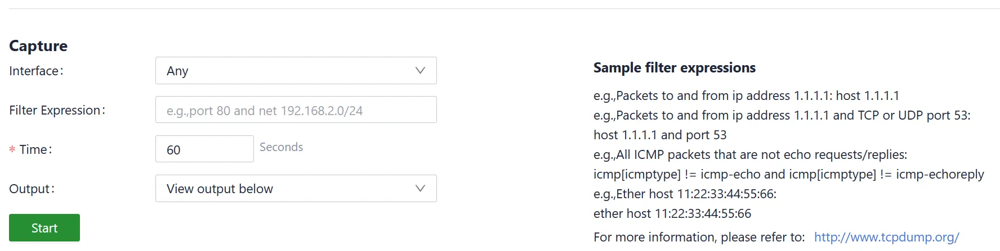

<strong>Figure 4-70 Capture</strong>

#### 4.8.9 Scheduled Reboot

Scheduled reboot is a network device management strategy that allows administrators to automatically restart a device at a specific time or under certain conditions to ensure the device's normal operation and performance.

Scheduled reboots can be set up in the "System > Scheduled Reboot" function based on business requirements. The device supports scheduled reboots at fixed times daily, weekly, or monthly.

In the case of monthly reboots, if the selected reboot day exceeds the actual number of days in the month, the device will reboot on the last day of the month. For example, if reboot on the 31st of every month is selected, it will reboot on the 30th in a month with only 30 days.

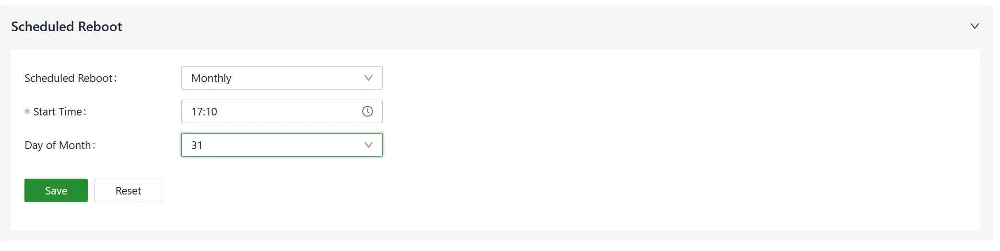

<strong>Figure 4-71 Set the Scheduled Reboot Time</strong>

#### 4.8.10 Log Server

A log server is a dedicated server or software application used to collect, store, and manage log information generated by network devices, applications, and operating systems. These log records include events, warnings, errors, activities, and other relevant information and are crucial for monitoring, troubleshooting, and performance optimization.

When the log file server function is enabled in the "System > Log Server" feature, the device will periodically upload log files to the specified log server.

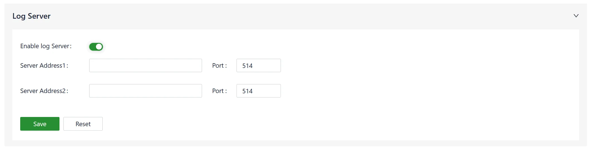

<strong>Figure 4-72 Set the Log Server Address</strong>

#### 4.8.11 Account Management

With this feature, the device login password can be changed. If the password is forgotten, the current configuration can also be overwritten using the platform configuration feature.

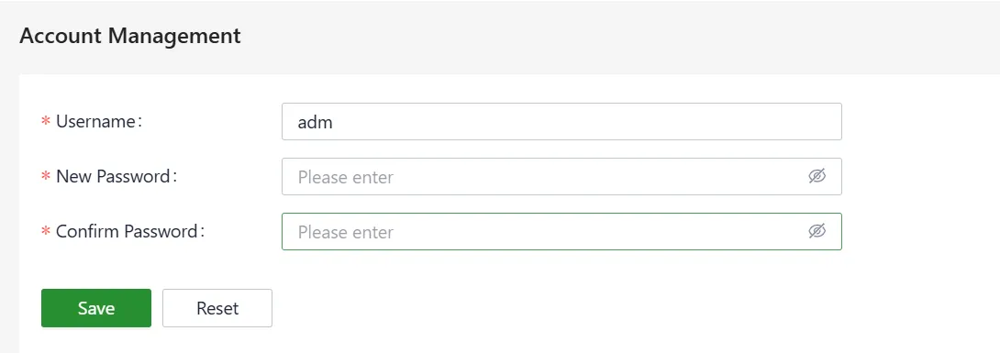

<strong>Figure 4-73 Account Management</strong>

#### 4.8.12 Other Settings

**Web Login Management**

When a user logs in to the local interface of the device through the web and the session remains active for a certain period, it will automatically log out or disconnect to protect the user's privacy and security.

The logout time can be configured in "System > Other Settings > Web Login Management." If the online time during a single login session on the device's web page exceeds the configured time, the system will automatically log the user out, and they will need to log in again to continue their operations.

<strong>Figure 4-74 Set the Web Page Logout Time</strong>

**Automatically Restarts**

When the device is unable to connect to the network, it will trigger a reboot every hour to attempt to restore connectivity. If the device is on a local area network or unable to access the internet, this feature needs to be disabled.

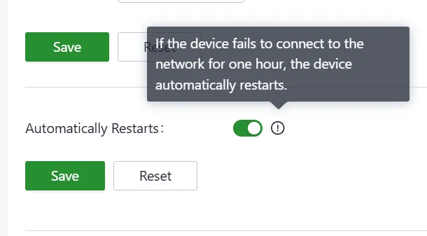

<strong>Figure 4-75 Automatically Restart</strong>

**Fast Forward**

This feature can be used to quickly forward packets, improving network performance. By default, it is turned off. When this feature is enabled in "System > Other Settings > Fast Forward," the device's data forwarding rate will significantly increase.

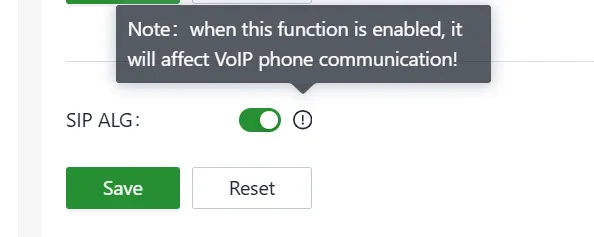

<strong>Figure 4-76 Fast Forward</strong>

**SIP ALG**

SIP ALG consists of two technologies: Session Initiation Protocol (SIP) and Application Layer Gateway (ALG). This protocol is typically used to assist in managing and handling SIP communications (Session Initiation Protocol for establishing and managing real-time communication sessions, such as voice and video calls).

This feature can be enabled in "System > Other Settings > SIP ALG."

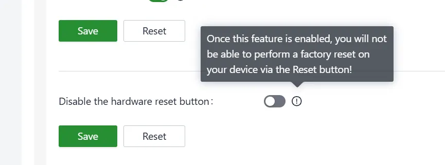

<strong>Figure 4-77 SIP ALG</strong>

> **Note**:
> - If the connected device needs to engage in VoIP (Voice over Internet Protocol) phone communication, it is recommended to disable this function.

#### 4.8.13 SD-WAN

**Background**:

Between enterprise branches, there is often a need for mutual access to facilitate business data transfer, video conferencing, and other requirements. Traditional VPN configurations can be complex and troubleshooting can be challenging. InHand Networks introduces SD-WAN network functionality, which, through a user-friendly interface, assists users in rapidly establishing connections between branches. This not only enhances link flexibility but also significantly reduces operational and management complexity, ultimately providing enterprise users with a better network experience.

<strong>Figure 4-78 Application Scenarios</strong>

**Process**:

<strong>Figure 4-79 Application Process</strong>

**Prerequisites**:

1. Devices using SD-WAN functionality must have a Branch Professional license.

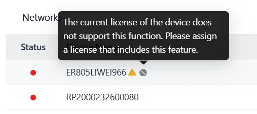

<strong>Figure 4-80 License Requirement</strong>

**Create Network**

In the platform's "Network" function, select "SD-WAN," click on "Add," and you will be redirected to the SD-WAN network addition page.

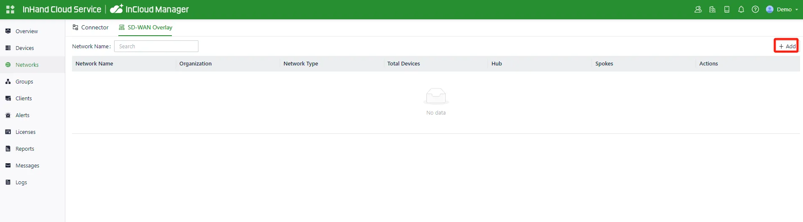

<strong>Figure 4-81 SD-WAN Entry</strong>

<strong>Figure 4-82 Create SD-WAN Network</strong>

The current SD-WAN network supports the Hub & Spoke topology, with device roles divided into central and branch devices. All branch devices establish tunnels through the central device, and traffic between branch devices passes through the central device.

**Hub**:

- Hub devices require a public IP address to ensure the operation of the SD-WAN network. Users can also address the issue of insufficient public IP through IP mapping.
- Tunnels are established between the central device's upstream interface with public IP addresses and all upstream interfaces of the branch devices.
- In the firewall rules, the central device's upstream device needs to allow two port numbers and map them to the upstream interface of the ER series router. The port range is 1-65535.
- Supported device models: ER605, ER805, ER815, ER2000.
- A maximum of 5 devices can be added.

**Spoke**:

- Branch devices have no specific requirements for public IP addresses.
- Multiple branch devices can be added, with the final number determined by the performance of the central device.
- Supported device models: ER815, ER805, ER605.

**Add Device**

On the "Add Network" page, click the "Add" button for either the central device or branch device, depending on the type of device to be added to the network. After selecting the device, provide the public IP mapping information for the device. If the device's network configuration needs to be modified, the "Edit" button for the local network can be clicked to perform remote configuration.

After configuring the public IP of the Hub device, click "Save" under the [Action] section.

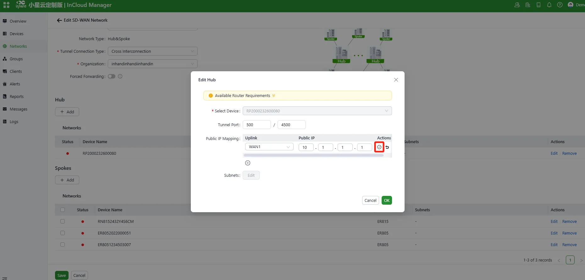

<strong>Figure 4-83 Add Hub</strong>

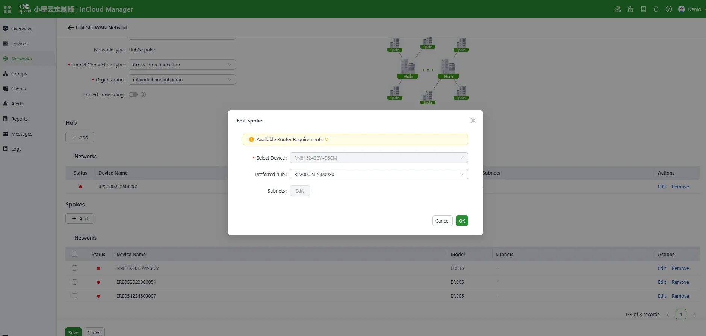

<strong>Figure 4-84 Add Spoke</strong>

After completing the addition, click the "Save" button at the bottom left corner of the page, and the network will be successfully created. All the devices and selected subnets will now be interconnected. In a single network, the local networks of central devices and branch devices cannot be the same, as it could impact communication.

**Example**

**Background Description**:

A chain store requires branch sites to establish an SD-WAN network with the headquarters to enable data intercommunication.

The newly created SD-WAN network needs to communicate with the existing internal network segment 172.16.10.0/24.

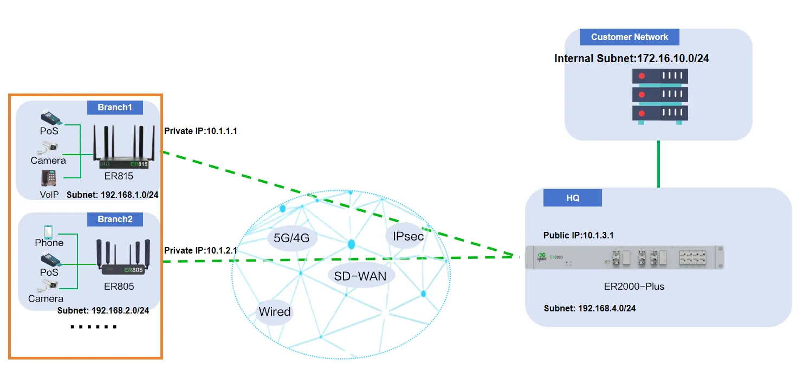

<strong>Figure 4-85 Topology</strong>

- **Branch1**: Cellular/WAN: 10.1.1.1, Subnet: 192.168.1.0/24
- **Branch2**: Cellular/WAN: 10.1.2.1, Subnet: 192.168.2.0/24
- **HQ**: WAN Public IP: 10.1.3.1, Subnet: 192.168.4.0/24
- **Customer Network**: 172.16.10.0/24

**Expected Outcome**: The subnets of Branch1 (192.168.1.0/24) and Branch2 (192.168.2.0/24) can access the subnet of the Hub (192.168.4.0/24), and the newly created SD-WAN network can interoperate with the customer's existing intranet (172.16.10.0/24).

**Step 1**: Configure the network parameters of the device and ensure that the device has the Branch Professional version.

Open the device configuration interface and configure the subnet that needs to communicate within the SD-WAN under Local Subnet, then save the settings. When creating an SD-WAN network, add the hub/branch devices and directly select the subnet.

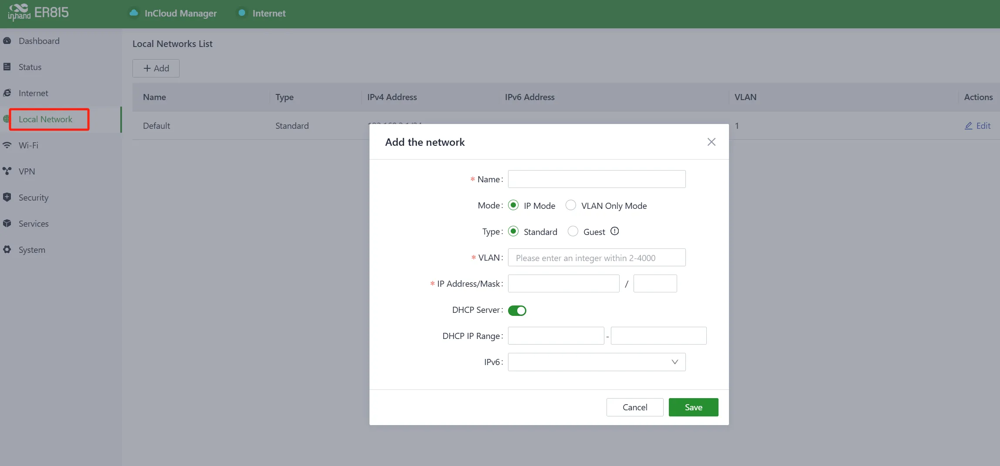

<strong>Figure 4-86 Add/Edit Hub/Spoke Local Network</strong>

**Step 2**: Create an SD-WAN network and add the Hub, Branch1, and Branch2 devices.

> **Note**:
> - If the HQ device has a public IP, the public IP needs to be entered in the indicated field when adding the Hub device to ensure the SD-WAN functions properly.
> - If the HQ device does not connect to the internet directly but through an upstream device with a public IP address, DNAT address mapping needs to be configured on the upstream device and the actual public IP address needs to be entered as the HQ device's public IP.

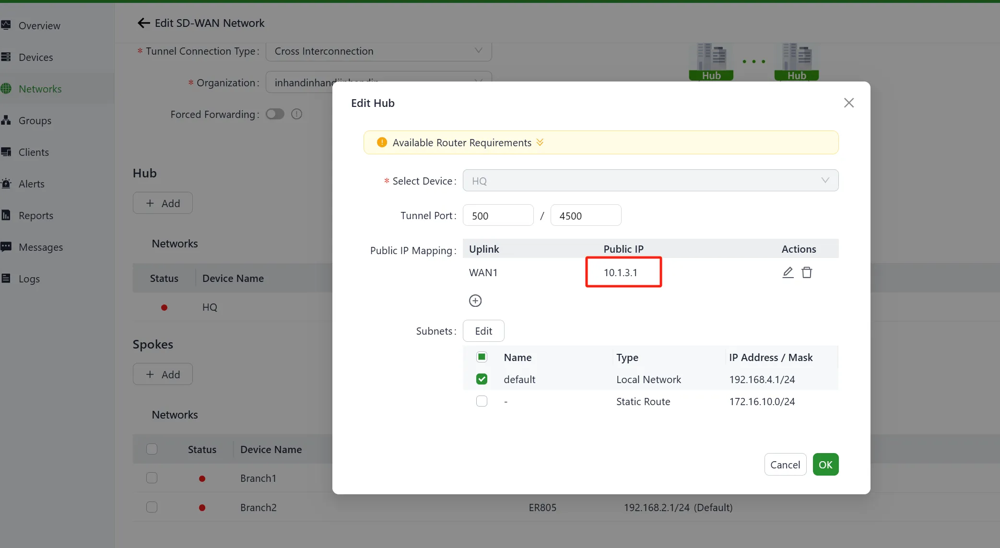

<strong>Figure 4-87 Enter the Public IP Address of the Hub Device</strong>

Announce the external route 172.16.10.0/24 to the SD-WAN network.

Click the "Edit" button next to "Subnets" on the Hub device, then go to **Services > Static Routes** to create the required route.

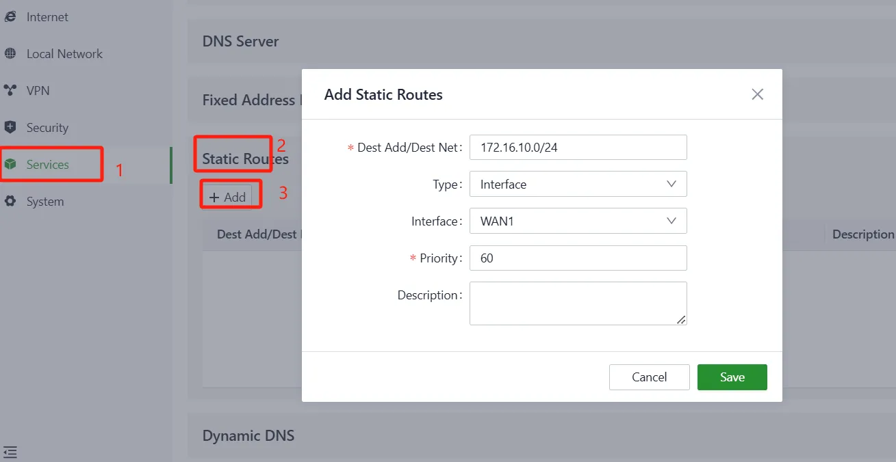

<strong>Figure 4-88 Create the Static Route</strong>

After saving, the newly created route will appear under **Subnets**. Select it, then click **Save** again to deploy it to the device.

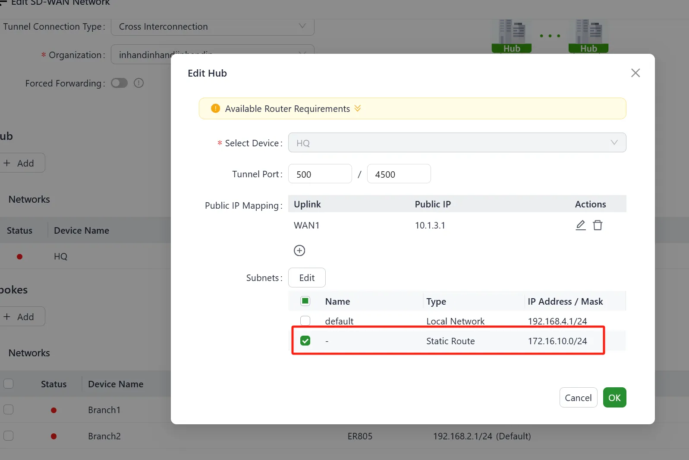

<strong>Figure 4-89 Apply to Selected Subnets</strong>

> **Note**: If no configuration information is displayed, it indicates that the save operation was not successful.

Add Branch Device:

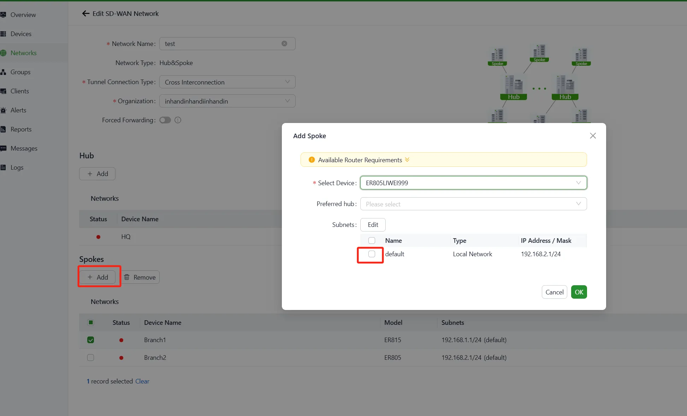

<strong>Figure 4-90 Add Branch Device</strong>

**Step 3**: Click Save and wait a few minutes. The configuration will be automatically pushed from the platform to the device.

Check SD-WAN status:

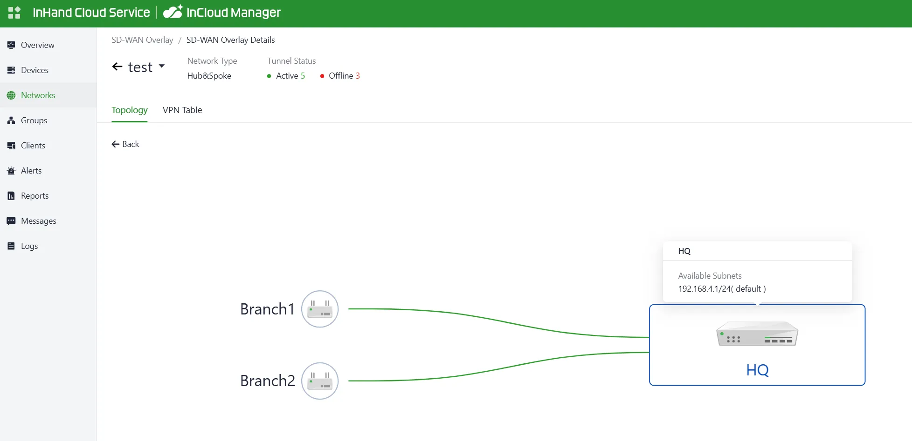

<strong>Figure 4-91 SD-WAN Status</strong>

---

## Chapter 5: Typical Applications

### 5.1 Case: Chain Store SD-WAN Networking

**Scenario Description**:

A retail chain enterprise requires its branch stores to establish secure network intercommunication with the headquarters. The ER815 is deployed at each branch and the headquarters to form an SD-WAN network, enabling data sharing, video conferencing, and centralized management.

**Network Topology**:

<strong>Figure 5-1 SD-WAN Network Topology</strong>

**Device Role**: The ER815 acts as an edge gateway at both the headquarters (Hub) and the branch stores (Spoke), providing Internet access and secure SD-WAN tunnel termination.

**Configuration Steps**:
1. Ensure each ER815 has a valid Branch Professional license and is connected to the Internet.
2. Log in to InCloud Manager and navigate to 【Network】>【SD-WAN】.
3. Click "Add" to create a new SD-WAN network.
4. Add the headquarters ER815 as the Hub device, entering its public IP address or mapped public IP.
5. Add each branch ER815 as a Spoke device.
6. Select the local subnets that need to participate in the SD-WAN for both Hub and Spoke devices.
7. If the headquarters needs to communicate with an existing intranet (e.g., 172.16.10.0/24), configure a static route under 【Services】>【Static Routes】 and apply it to the Hub's subnets.
8. Save the network configuration and wait for the platform to push the settings to all devices.
9. Verify tunnel establishment on each device's SD-WAN status page.

**Reference Chapters**:
- [Cloud Management](#482-cloud-management)
- [SD-WAN](#4813-sd-wan)
- [Static Routes](#475-static-routes)

---

## Appendix: Troubleshooting

### A.1 Network Connection Issues

| Phenomenon | Possible Cause | Troubleshooting Steps | Corresponding Chapter |
| --- | --- | --- | --- |
| Cannot access the Internet via wired connection | WAN cable not connected properly | 1. Check that the WAN1 cable is securely connected. 2. Verify the upstream network is functional. | [Wired Internet Access](#31-scenario-wired-internet-access) |
| Cannot access the Internet via wired connection | Incorrect connection method (e.g., static IP/PPPoE needed) | 1. Log in to the web interface. 2. Go to 【Internet】>【WAN1】 and set the correct connection method. | [Wired Connection](#421-wired-connection) |
| Cannot connect to cellular network | SIM card not inserted or inserted incorrectly | 1. Power off the device. 2. Reinsert the SIM card into the correct slot. | [Cellular Internet Access](#32-scenario-cellular-internet-access) |
| Cannot connect to cellular network | APN parameters incorrect | 1. Contact the carrier to obtain the correct APN. 2. Configure the APN in 【Internet】>【Cellular】. | [5G/4G Connection](#423-5g4g-connection) |
| Cannot connect to cellular network | Antennas not connected | 1. Check that cellular antennas are securely attached. 2. Adjust antenna placement for better signal. | [Installation Guide](#22-installation-guide) |
| Device shows offline in InCloud Manager | No Internet connection | 1. Verify the device has Internet access via WAN or cellular. 2. Check link status on the device dashboard. | [Connect to InCloud Manager](#33-scenario-connect-to-incloud-manager) |
| Device shows offline in InCloud Manager | Cloud management disabled | 1. Log in to the local web interface. 2. Go to 【System】>【Cloud Management】 and enable it. | [Cloud Management](#482-cloud-management) |

### A.2 Web Interface Access Issues

| Phenomenon | Possible Cause | Troubleshooting Steps | Corresponding Chapter |
| --- | --- | --- | --- |
| Cannot open the web management interface | PC IP not in the same subnet | 1. Set the PC to obtain an IP address automatically. 2. Or configure a static IP in the 192.168.2.x range. | [Installation Guide](#22-installation-guide) |
| Cannot open the web management interface | Wrong IP address or port | 1. Confirm the default gateway is 192.168.2.1. 2. Check if the LAN port is correctly connected. | [Default Settings](#16-default-settings) |
| Forgot login password | Password not recorded | 1. Check the device nameplate for default credentials. 2. Perform a factory reset if necessary. | [Restore Factory Defaults](#15-restore-factory-defaults) |

### A.3 VPN Issues

| Phenomenon | Possible Cause | Troubleshooting Steps | Corresponding Chapter |
| --- | --- | --- | --- |
| IPSec tunnel cannot be established | Mismatched pre-shared key | 1. Verify the pre-shared key is identical on both ends. 2. Reconfigure if necessary. | [IPSec VPN](#451-ipsec-vpn) |
| IPSec tunnel cannot be established | Incorrect peer address or subnet | 1. Check the peer IP address and local/peer subnets. 2. Ensure there is network reachability between peers. | [IPSec VPN](#451-ipsec-vpn) |
| L2TP client cannot connect | Wrong server address or credentials | 1. Verify the server address, username, and password. 2. Ensure the L2TP server is enabled and reachable. | [L2TP VPN](#452-l2tp-vpn) |

### A.4 Wi-Fi Issues

| Phenomenon | Possible Cause | Troubleshooting Steps | Corresponding Chapter |
| --- | --- | --- | --- |
| Wi-Fi SSID not visible | Wi-Fi disabled | 1. Log in to the web interface. 2. Go to 【Wi-Fi】 and enable the desired SSID. | [Wi-Fi](#44-wi-fi) |
| Wi-Fi SSID not visible | Wi-Fi (STA) enabled on same band | 1. Check if a Wi-Fi (STA) interface exists in the same band. 2. Remove or disable the Wi-Fi (STA) interface if necessary. | [Wireless Connection](#422-wireless-connection) |
| Cannot connect to Wi-Fi | Incorrect password | 1. Verify the password (default is the last 8 digits of the serial number). 2. Reconfigure the SSID password if changed. | [Default Settings](#16-default-settings) |

---

## Appendix: Safety Precautions

1. Use the original power adapter to avoid damaging the device due to mismatched power adapters.
2. When installing the device, avoid placing it in an environment with strong electromagnetic interference, and keep it at a safe distance from high-power equipment. After installation, ensure that the device is stable to prevent accidental drops and potential damage.
3. Ensure that the device's operating environment meets the temperature and humidity requirements specified in the user manual.
4. Regularly inspect the device's cables, including Ethernet cables and power adapter connections. Keep the cables clean, and replace them if any damage is detected.
5. When cleaning the device, avoid spraying chemical agents directly on the device's surface to prevent damage to the housing or internal components. Use a soft cloth for cleaning.
6. Do not attempt to disassemble or modify the device on your own, as this can pose safety risks and may void the device's warranty.

> **Warning**: Non-professionals should not open the device enclosure due to the risk of electric shock.

---

## FAQ

### Question 1: What are the differences between ER routers and regular routers?

1. Edge Router: Supports both wired and cellular mobile data connectivity (4G, 5G) for network access, providing more ways to connect to the network. The edge router is a 5G router that supports SD-WAN and allows for centralized management through a cloud platform.
2. Regular Router: Typically relies on fixed broadband connections, such as DSL or fiber optics, and connects to the network through wired connections. Regular routers lack a unified management platform and advanced features like firewall and SD-WAN.

### Question 2: Unable to connect to 4G/5G network?

1. Physical Environment: Check if the SIM card is inserted into the correct slot and ensure all cellular antennas are properly installed.
2. APN Settings: Ensure that the APN configuration matches the information provided by the service provider.
3. Check Device Connectivity: Log in to the device's local interface and use the built-in ICMP tool to ping 8.8.8.8 to test connectivity. If it can connect, then check the connectivity between the user's device (e.g., computer or smartphone) and the router.
4. Check SIM Card: Take out the SIM card and insert it into a phone to see if it can connect to the internet.
5. Restart: Try powering off the router, wait a few seconds, and then reconnect the power to retry the network connection.
6. Factory Reset: Perform a factory reset on the router and then attempt to connect again.

### Question 3: Is the cloud platform free of charge?

InHand Networks has been committed to providing high-quality network services for small and medium-sized chain organizations. When users utilize the cloud platform services, they are required to purchase licenses for each device to access the extensive cloud-based features.

### Question 4: How to add devices to the cloud platform?

1. Start by registering for an InCloud Manager account at https://star.inhandcloud.com/.
2. Log in to the cloud platform using the registered account. Under the device menu, click "Add," and follow the prompts to enter the device's serial number and MAC address. This will complete the device addition process. When a device is added for the first time, it comes with a complimentary 1-year free Basic Edition license. Users can renew their licenses as needed in the future.

### Question 5: Is it possible to use the device without the cloud platform?

Yes, it is possible. Users can complete the majority of configuration tasks locally. However, for features like bulk configuration deployment, firmware upgrades, SD-WAN, Connector, and more, it would be necessary to combine local device settings with the cloud platform.

If the issue cannot be resolved using the above steps or any other problems are encountered, contact InHand Networks for technical support. Visit www.inhandnetworks.com for more information.
