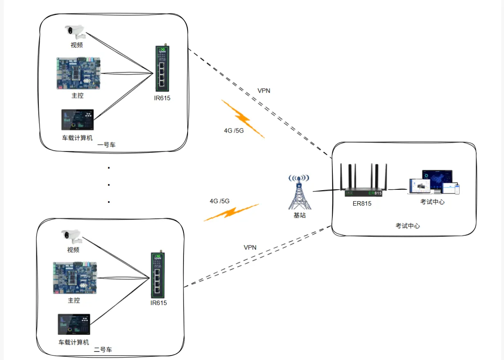

# Driving Test Subject 3 4G/5G Networking Solution

## I. Solution Overview

### 1.1 Project Background

With the widespread application of 4G equipment in driving school Subject 3 projects, it has not only solved the Subject 3 networking problem, but its reliability and stability have been practically tested. Its low failure rate has also been widely recognized by users.

Inhand uses industrial-grade 4G/5G routers with high stability, high environmental adaptability, and terminal block wiring, which effectively solves the impact of high and low temperatures on equipment, and avoids the poor contact problem after oxidation of circular plugs.

The Ministry of Public Security has high requirements for 4G network security. Inhand is committed to providing driving school users with a Subject 3 4G networking solution with better security levels.

### 1.2 Construction Objectives

- Solve the networking problem for driving test Subject 3
- Provide highly reliable and stable 4G/5G network connections
- Achieve secure communication between vehicle equipment and data centers
- Meet the Ministry of Public Security's high requirements for 4G network security
- Achieve real-time data transmission and video image transmission

### 1.3 Applicable Scenarios

- Driving school Subject 3 test vehicle networking
- Driving test monitoring system
- Vehicle video surveillance transmission
- Real-time data transmission scenarios

## II. Requirements Analysis

### 2.1 Current Equipment Status

- Equipment types: Vehicle server, serial server, video server, 4G network router
- Communication interfaces: RJ45 Ethernet interface
- Communication protocols: IPsec VPN, L2TP VPN
- Deployment environment: Driving test vehicles, data centers
- Scale: Multiple test vehicles

### 2.2 Core Requirements

1. **Network Resource Requirements**:

   - Must have dedicated internet line with fixed IP address
   - 4G, 5G data cards, used with dedicated line
   - Best to use fixed IP internet dedicated line from the same operator as the 4G/5G card

2. **Equipment Requirements**:

   - One access VPN router (ER815)
   - Inhand IR315 industrial router

3. **Security Requirements**:

   - Operator's own network security
   - Data encryption from vehicle router to data dedicated line
   - Firewall function to resist external network attacks

## III. Overall Architecture Design

The Subject 3 4G network system consists of vehicle systems and central systems:

- **Vehicle System**: Composed of vehicle server, serial server, video server, 4G network router, 4G/5G data cards, etc. The vehicle server, serial server, and video server are connected to IR315 via network cable RJ45, accessing the 4G/5G network provided by the 4G/5G operator.

- **Central System**: Uses the internet dedicated line provided by the communication operator, connects to the central VPN router ER815 via fiber optic converter. The VPN router is connected to internal network servers and other equipment through a switch. Policies are configured in the VPN router to prevent internal devices from connecting to the internet, and establish VPN networks with vehicle routers of each vehicle, enabling direct communication with vehicle equipment.

### 3.1 Four-Layer Architecture

1. **Perception Layer**: Vehicle server, serial server, video server and other vehicle equipment
2. **Network Layer**: IR315 industrial router (4G/5G), VPN enterprise router ER815, internet dedicated line
3. **Platform Layer**: Data center, internal network server
4. **Application Layer**: Driving test monitoring, video transmission, real-time data communication

### 3.2 Data Flow

Vehicle equipment → IR315 industrial router (4G/5G) → Operator network → VPN tunnel → Data center VPN router (ER815) → Internal network server

## IV. Network and Access Solution

### 4.1 Networking Method Selection

Adopt 4G/5G wireless network access as the primary method, establishing a secure connection with the data center through VPN tunnel. Use internet dedicated line with fixed IP address as the central access link.

### 4.2 Branch Node Selection Points

**IR615 Industrial Router Features**:

- Industrial-grade 4G/5G router, high stability, high environmental adaptability
- Uses terminal block wiring, solving the impact of high and low temperatures and poor contact after oxidation of circular plugs
- Supports IPsec VPN or L2TP VPN technology
- Has firewall function to effectively resist attacks from external networks
- Connects to vehicle server, serial server, video server via RJ45 network cable
- Supports 4G/5G operator network access

## V. Functional Requirements and Protocol Support

### 5.1 Central End

- **VPN Support**: IpSecVPN, L2tpVPN
- **IpSecVPN Throughput**: 300Mbps
- **Access Capacity**: 150~200
- **Others**: Supports static routing, ACL, NAT and other settings

### 5.2 Branch End

- **Network Protocol**: 4G/5G

- **VPN Protocol**: IPsec VPN, L2TP VPN

- **Security Protocol**: Firewall

- Supports VPN tunnel establishment, communication with data center VPN router

- Supports direct communication between vehicle equipment and internal network server

## VI. Solution Highlights Summary

1. **Industrial-grade Reliability**: Uses industrial-grade 4G/5G routers with high stability, high environmental adaptability, and low failure rate

2. **Lower Deployment and O&M Costs**: Traditional bridge solutions have extremely high civil engineering and deployment costs, and some road sections have no deployment conditions. Later maintenance costs are also high. Using this solution requires no prior civil engineering, and network deployment uses the operator's legal infrastructure.

3. **Terminal Block Design**: Uses terminal block wiring, effectively solving the impact of high and low temperatures on equipment, avoiding poor contact problems after oxidation of circular plugs

4. **Three-Level Security Guarantee**:

   - First level: Operator's own network security
   - Second level: Data encryption from vehicle router to data dedicated line using IPsec VPN or L2TP VPN technology
   - Third level: Vehicle computer and VPN router have firewall function to effectively resist attacks from external networks

5. **High Bandwidth Low Latency**: 4G/5G network greatly improves bandwidth and reduces communication latency. It can transmit both real-time data and video images, perfectly meeting the requirements of driving test Subject 3

6. **VPN Networking Technology**: Uses VPN networking technology to effectively achieve communication between vehicle equipment and data centers
