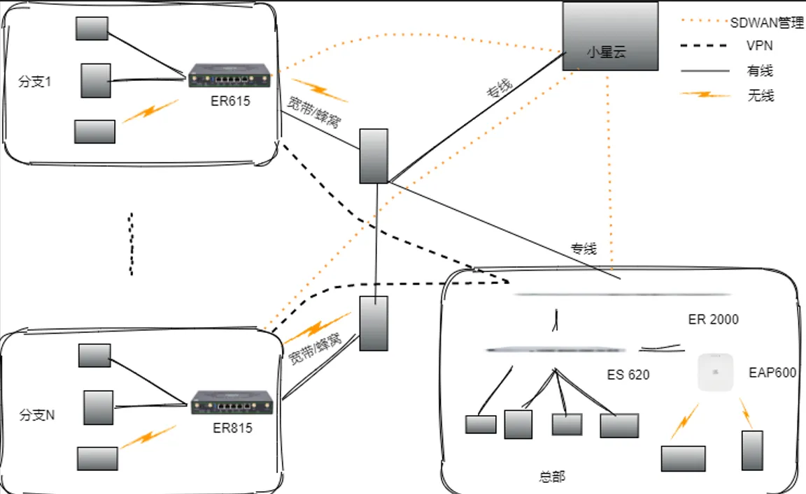

# Enterprise Branch Networking Solution

## I. Solution Overview

### 1.1 Project Background

With the high costs of traditional broadband services for enterprise or brand branch stores, major enterprises and chain brands urgently need to reduce costs and seek a stable and reliable enterprise branch networking solution. Additionally, they need to build an SD-WAN network to achieve traffic interconnection and forced forwarding between branch ends and the central end.

This solution aims to achieve unified equipment access, provide network for equipment, remote control, status monitoring, abnormal alarms, and SD-WAN networking, providing a stable and reliable IoT foundation for enterprises.

### 1.2 Construction Objectives

- Full equipment networking, unified access management

- Build SD-WAN network

- Support remote configuration, remote diagnosis, remote upgrade

- Achieve alarms, linkage, visualization, and report analysis

- Improve operation and maintenance efficiency, reduce manual inspection costs

- Secure, stable, easy to expand, easy to maintain

### 1.3 Applicable Scenarios

- Enterprise/Store equipment networking (computers, mobile phones, barcode scanners, cameras)

- SD-WAN networking

## II. Requirements Analysis

### 2.1 Current Equipment Status

- Equipment types: Mainly civilian equipment

- Communication interfaces: Ethernet/4G/5G/Wi-Fi

- Deployment environment: Indoor

### 2.2 Core Requirements

    1. Network requirements: Wired / 4G/5G backup, low traffic, high stability

    2. Remote requirements: Remote debugging, remote control, remote maintenance

    3. SD-WAN networking requirements: Establish SD-WAN Server at central end, build SD-WAN channel at branch end

    4. Platform requirements: Large screen visualization, reports

## III. Overall Architecture Design

### 3.1 Four-Layer Architecture

1. Perception Layer: Computers, barcode scanners, mobile phones, cameras

2. Network Layer: Edge routers, 4G/5G, Ethernet, WiFi, central end router

3. Application Layer: Monitoring large screen, Web management backend, alarm system, enterprise data center

### 3.2 Data Flow

Device → Edge router → 4G/5G → SD-WAN channel → Central end router → Data display

## IV. Network and Access Solution

### 4.1 Networking Method Selection

Cellular

### 4.2 Edge Router Selection Points

- Gigabit Ethernet ports

- WiFi

- Supports 4G/5G
- Supports SD-WAN networking

- Industrial-grade wide temperature, dustproof, anti-interference

- Remote management, remote upgrade, remote configuration

## V. Solution Highlights Summary

1. One-stop: Access + Network + Platform + Application full-stack solution

2. High compatibility: Multi-device, multi-network unified access

3. Low cost: Reduce manual inspections, improve operation and maintenance efficiency

4. Security and compliance: Transmission encryption, permission management, operation audit
