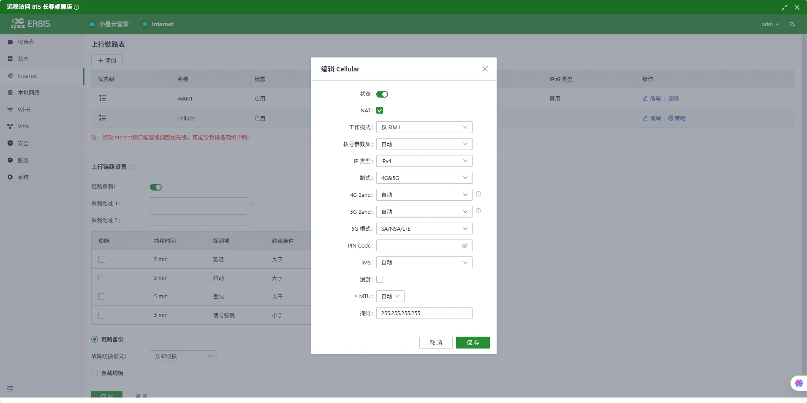
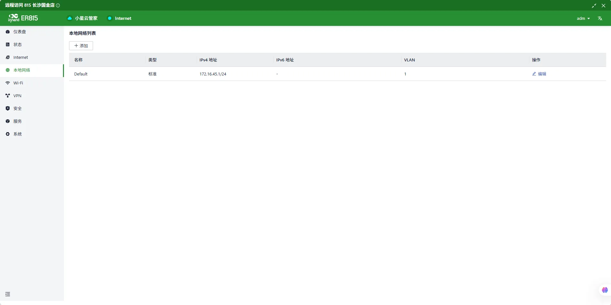
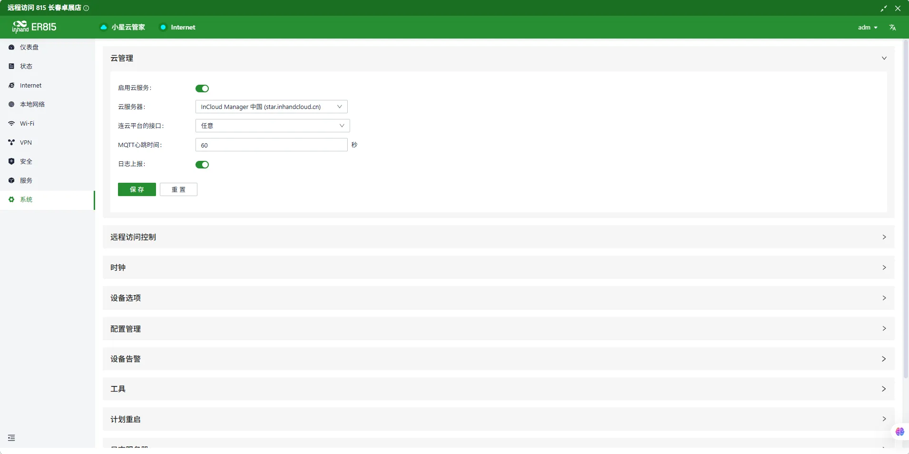
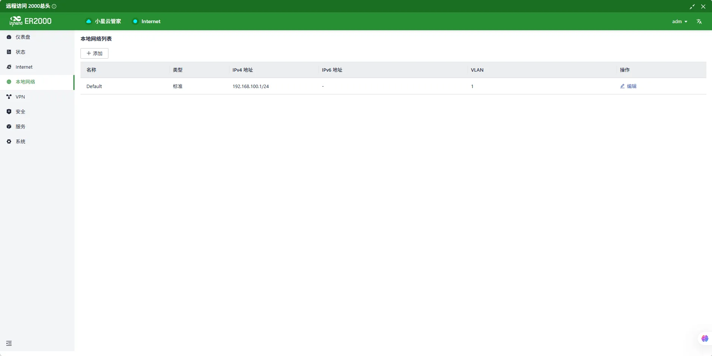
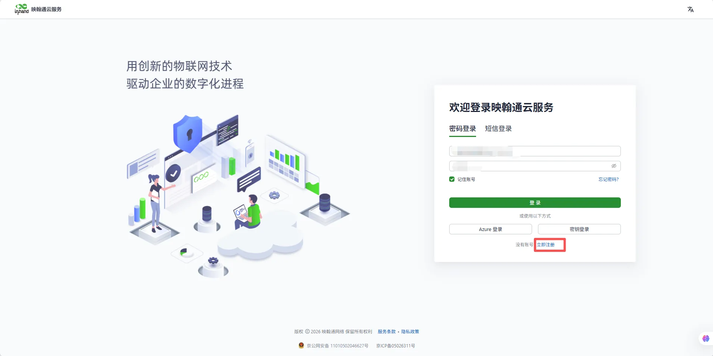
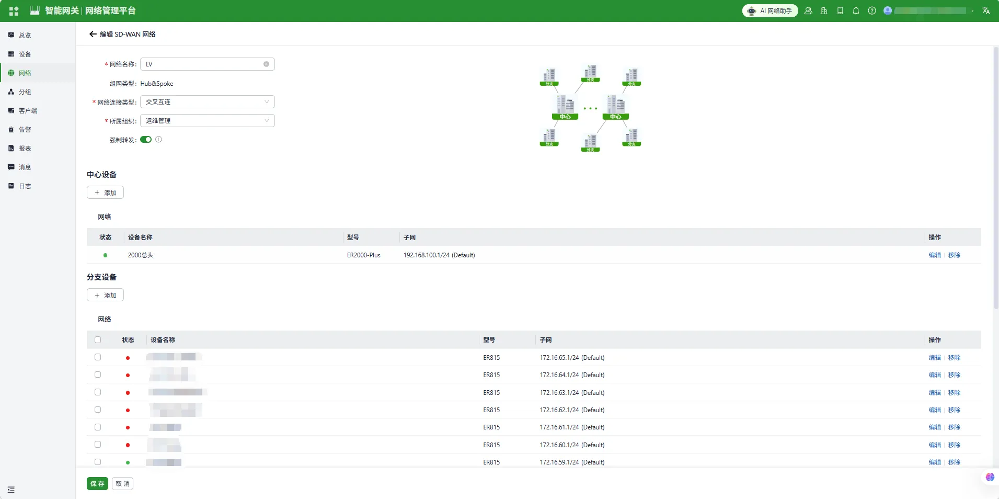

# Enterprise Branch Networking Configuration Manual

## I. Document Information

- **Document Name**: Enterprise Branch Networking Configuration Manual

- **Product Models**: ER815, ER2000

- **Firmware Versions**: V2.0.2 (ER815), V2.0.4 (ER2000)

- **Applicable Scenarios**: Equipment networking, SD-WAN networking

- **Writing Date**: March 30, 2026

## II. Gateway Overview

### 2.1 Product Introduction

In this scenario, the router product is mainly used for **equipment networking** and **building SD-WAN networking between branch ends and central end** in enterprise branch networking scenarios.

### 2.2 Main Functions

- Provide network for on-site equipment

- Build SD-WAN networking between branch ends and central end

- Remote configuration, remote diagnosis, remote upgrade

- Wide temperature industrial-grade design

### 2.3 Typical Application Topology

## III. Hardware Description

## 3.1 Appearance and Interfaces

- Power interface: 12V/3A DC (EC815), 100-240V (ER2000)

- Network ports: ER815 LAN ×5 (WAN/LAN configurable ×2), ER2000 WAN: 1×10G SFP+, 1×GbE SFP, 2×GbE RJ45 (PoE), LAN: 2×10G SFP+, 2×GbE Combo, 8×GbE RJ45 (PoE)

- Wireless: ER815: 4G/5G/Wi-Fi (optional)

- Indicator lights: PWR, RUN, NET, signal strength

- Reset button: Restore factory settings

## 3.2 Wiring Instructions

#### 3.2.1 Power Wiring

- Positive: V+

- Negative: V-

- Note: Reverse polarity protection, lightning protection, grounding

#### 3.2.2 Ethernet Wiring

Direct/crossover adaptive, recommends Cat5e or higher network cables.

## IV. Factory Default Parameters

- Default IP: 192.168.2.1

- Subnet mask: 255.255.255.0

- Web username: adm

- Web password: Random password, refer to corresponding equipment nameplate

## V. Preliminary Preparation

1. Set computer to same network segment IP as gateway

2. Connect computer to gateway LAN port with network cable

3. Power on gateway, wait for RUN light to illuminate steadily

4. Enter gateway IP in browser to access configuration page

## VI. Network Configuration

### 6.1 ER815 Configuration

1. Insert SIM card (supports NB-IoT/4G)

2. Enable mobile network

3. APN: Automatic / Manual entry

4. View signal strength

   5. Set VLAN address to 172.16.45.1/24

   6. Configure connection to Xiaoxing Cloud platform

### 6.2 ER2000 Configuration

1. Connect wired network to ER2000 wan1 port

2. Set local VLAN address to 192.168.100.1

3. Network provided to WAN port needs to be mapped to public network (customer needs to provide this)

4. Configure connection to Xiaoxing Cloud platform

## VII. Xiaoxing Cloud Platform Configuration

Building SD-WAN network requires using Inhand Xiaoxing Cloud platform. Equipment needs to purchase platform professional edition license

1. User registers Xiaoxing Cloud platform account by themselves

2. Add ER815 and ER2000 equipment

3. Add SD-WAN network

4. Edit SD-WAN network

5. Successful connection effect is shown in the figure

## VIII. Same Configuration Can Import Configuration Files

Configuration files are in the config directory
