# Enterprise Switch ES620 Product User Manual

## Front Matter

### Declaration

Thank you for choosing our product. Before use, please read this user manual carefully. Complying with the following statements will help maintain intellectual property rights and legal compliance, and ensure that your user experience aligns with the latest product information. If you have any questions or need written permission, please contact our technical support team at any time.

- **Copyright Statement**

This user manual contains copyrighted content. The copyright belongs to Beijing InHand Networks Technology Co., Ltd. and its licensors. Without written permission, no organization or individual may excerpt, copy any part or all of the content of this manual, or distribute it in any form.

- **Disclaimer**

Due to ongoing updates in product technology and specifications, the company cannot guarantee that the information in this user manual is entirely consistent with the actual product. Therefore, the company assumes no responsibility for any disputes arising from discrepancies between actual technical parameters and this user manual. Any product changes will not be notified in advance. The company reserves the right to make final changes and interpretations.

- **Copyright Information**

The content of this user manual is protected by copyright law. The copyright belongs to Beijing InHand Networks Technology Co., Ltd. and its licensors. All rights reserved. Without written permission, the content of this manual may not be used, copied, or distributed without authorization.

### Graphical Interface Conventions

| Symbol | Meaning | Example |
|--------|---------|---------|
| `< >` | Indicates a variable or parameter to be replaced with an actual value | `<IP Address>` means enter a specific IP address |
| `" "` | Indicates a text label on the interface | Click the "Save" button |
| `>` | Indicates menu hierarchy or operation sequence | [Network] > [Cellular] |
| `[ ]` | Indicates a menu or page name | Enter the [System Settings] page |
| Caution | Points to note during operation; improper actions may result in data loss or device damage | — |
| Note | Supplement and provide necessary explanations for the description of the operation | — |

### Technical Support

**Beijing InHand Networks Technology Co., Ltd. (Headquarters)**

Tel: 010-8417 0010

Address: 5/F, Building 3, No. 18 Ziyue Road, Chaoyang District, Beijing, China

**Chengdu Office**

Tel: 028-8679 8244

Address: 14/F, China Taiping Financial Tower, No. 1777 North Tianfu Avenue, Wuhou District, Chengdu, Sichuan, China

**Guangzhou Office**

Tel: 020-8562 9571

Address: Unit B-130, Yuanyang New Third Board Creative Park, No. 5 Tangdong East Road, Tianhe District, Guangzhou, China

**Wuhan Office**

Tel: 027-8716 3566

Address: Room 2001, Building 11, Paris Haoting, No. 2 Luoyu East Road, Hongshan District, Wuhan, Hubei, China

**Shanghai Office**

Tel: 021-5480 8501

Address: Room 1103, No. 18 Shunyi Road, Putuo District, Shanghai, China

### How to Use This Manual

**Find Your Path**

- First-time users: It is recommended to read in order: [Know the Device](#chapter-1-know-the-device) > [Installation and First Use](#chapter-2-installation-and-first-use) > [Common Scenario Configuration](#chapter-3-common-scenario-configuration) > [Function Description and Parameter Reference](#chapter-4-function-description-and-parameter-reference)
- Existing device users: You may go directly to [Function Description and Parameter Reference](#chapter-4-function-description-and-parameter-reference) or [Appendix A Troubleshooting](#appendix-a-troubleshooting)
- Cloud platform management users: You may refer to the device remote management platform in [Common Scenario Configuration](#chapter-3-common-scenario-configuration)

**Quick Jump by Task**

| Task | Section | Estimated Time |
|------|---------|----------------|
| Learn device appearance and indicator meanings | [Know the Device](#chapter-1-know-the-device) | ~5 minutes |
| Complete device installation and Web login | [Installation and First Use](#chapter-2-installation-and-first-use) | ~10 minutes |
| Add device to InCloud Manager platform | [Common Scenario Configuration](#chapter-3-common-scenario-configuration) | ~10 minutes |
| View function parameters and configuration instructions | [Function Description and Parameter Reference](#chapter-4-function-description-and-parameter-reference) | As needed |
| Troubleshoot network or system faults | [Appendix A Troubleshooting](#appendix-a-troubleshooting) | As needed |

---

## Chapter 1 Know the Device

### 1.1 Overview

The InHand ES620 is a high-performance Layer 2 cloud-managed enterprise switch featuring 24 Gigabit PoE (Power over Ethernet) access ports plus 4 combo optical/electrical ports. Managed centrally via InHand's cloud platform, it delivers fast, reliable connectivity and simplified operations for offices, schools, hotels, and other multi-site networks. With strong switching and forwarding capability, the ES620 ensures stable performance for large-scale data transmission and complex enterprise environments, enabling efficient device aggregation and convenient PoE-powered deployment.

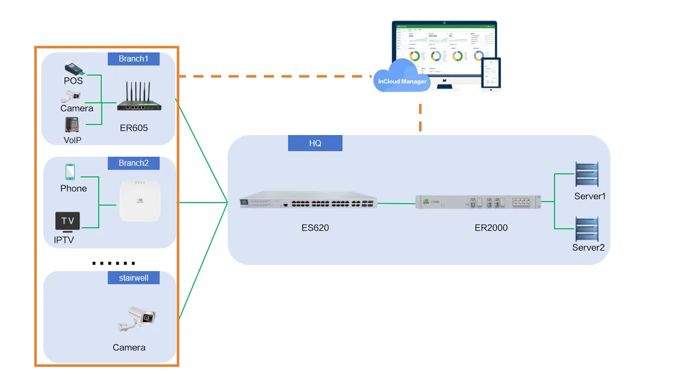

<strong>Figure 1-1 ES620 Application Scenario</strong>

### 1.2 LED Indicators

| Indicator | Status | Meaning |
|:---------:|--------|---------|
| PWR | Off | Device powered off |
| | Steady green | Powering on |
| SYS | Blink yellow | System operating |
| Link | Off | Ethernet port disconnected |
| | Steady green | Negotiated at 1000 Mbps, link established |
| | Steady yellow | Negotiated at 10/100 Mbps, link established |
| | Blink green | Negotiated at 1000 Mbps, data activity |
| | Blink yellow | Negotiated at 10/100 Mbps, data activity |
| PoE | Off | No PD device connected to this port |
| | Steady green | This port is supplying power |

### 1.3 Restore Factory Settings

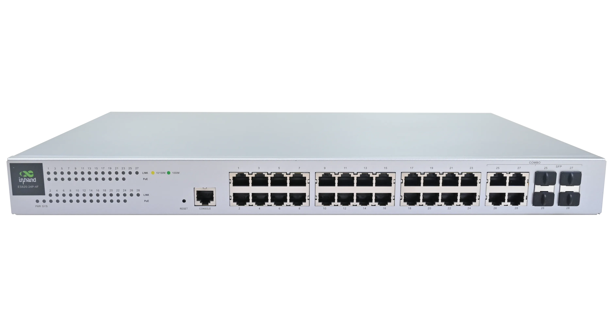

<strong>Figure 1-2 Factory Reset Button</strong>

Restore factory settings via the RESET button:

1. Press and hold the RESET button while powering on the device. Wait until the SYS LED turns solid on, then release the RESET button within 10 seconds.
2. Wait for the SYS LED to turn off, then press and hold the RESET button again until the SYS LED turns solid on.
3. Release the RESET button. The SYS LED will stay solid for 3 seconds and then start flashing rapidly. The device will execute the factory reset process.

### 1.4 Default Settings

| No. | Function | Default Settings |
|:----|:---------|:-----------------|
| 1 | Ethernet Default Configuration | All ports enabled; PoE enabled on ports; RSTP enabled by default; default device management IP: **192.168.20.1** |
| 2 | Username and Password | adm / 123456 |

---

## Chapter 2 Installation and First Use

### 2.1 Pre-Installation Preparation

Before installation, confirm that the following conditions are met:

- The operating environment temperature and humidity meet the device specification requirements.
- The installation location is away from high-power equipment and strong electromagnetic interference sources.
- Power supply, Ethernet cables, and mounting accessories (if applicable) are prepared.

> **Caution**: Use the original power adapter only. Mismatched power supplies may cause device damage.

### 2.2 Installation Guide

1. Mount the device using the appropriate method (rack mounting or desktop placement).
2. Connect the power cable and wait for the system to complete startup.
3. Use an Ethernet cable to connect a PC to any switch port.
4. Configure the PC with a static IP address:
   - IP address: **192.168.20.2–192.168.20.254**
   - Default gateway: **192.168.20.1**
   - Subnet mask: **255.255.255.0**

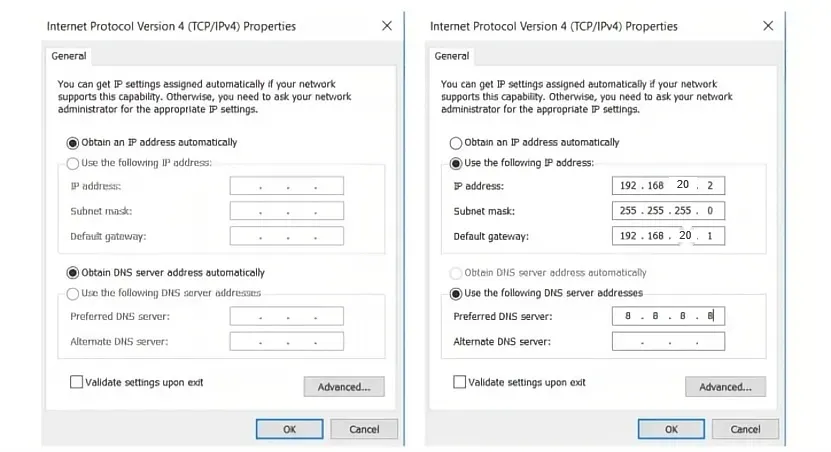

<strong>Figure 2-1 Configure PC IP Address</strong>

5. Enter **192.168.20.1** in the browser address bar. Log in with the username and password (default: **adm / 123456**) to access the device Web management page.
6. If the browser displays a security warning, click "Advanced" or "Hidden" and select "Proceed".

### 2.3 Quick Check

After installation is complete, verify the following items:

- [ ] The PWR indicator is steady green.
- [ ] The SYS indicator is blinking yellow.
- [ ] The PC can ping the device management IP (192.168.20.1).
- [ ] The Web management page can be opened via a browser.

---

## Chapter 3 Common Scenario Configuration

### Scenario 1: Add Device to InCloud Manager Platform

**Goal**: Add the ES620 to StarCloud Manager for remote management, batch configuration, and monitoring.

**Prerequisites**: The device has Internet access and the serial number and MAC address are known.

**Estimated Time**: ~10 minutes.

**Operation Steps**:

1. Open a browser (Google Chrome recommended) and navigate to [https://star.inhandcloud.com](https://star.inhandcloud.com).

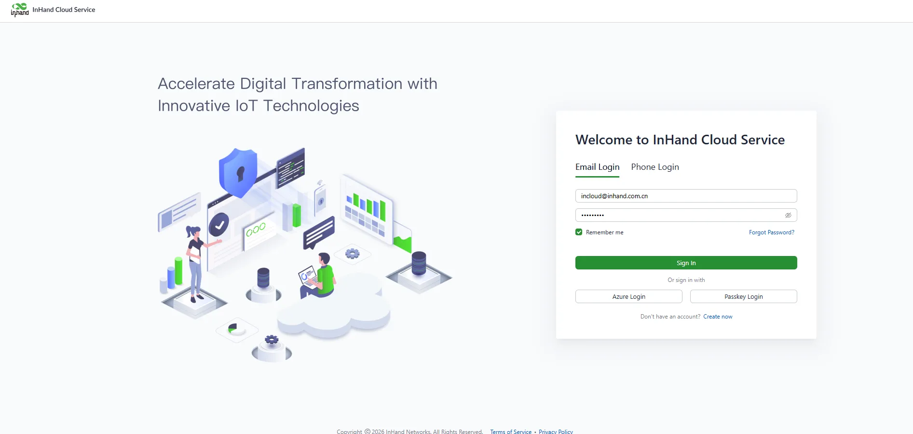

<strong>Figure 3-1 Register an InHand Cloud Service Account</strong>

2. Click "Create Now" to register a new account. After completing email registration, log in with the registered username and password, then select the InCloud Manager service.

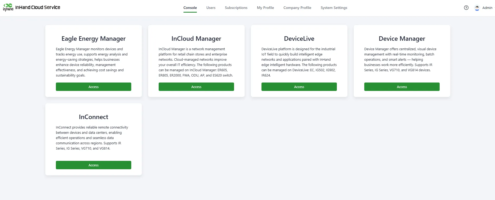

<strong>Figure 3-2 Select SaaS Service</strong>

3. After entering the InCloud Manager service, go to [Devices], click "Add", enter the device name, serial number, and MAC address, then click "Finish" to complete device addition.

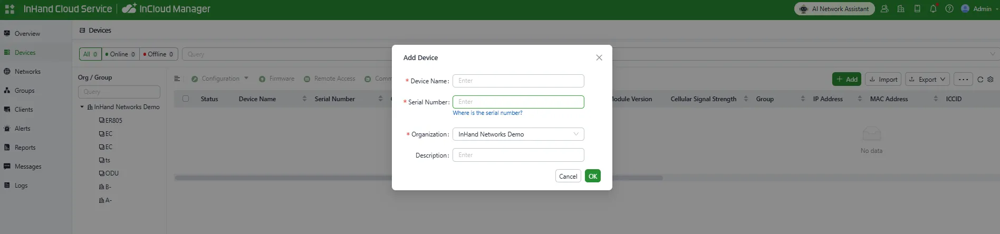

<strong>Figure 3-3 Add Device to InCloud Manager Platform</strong>

**Verification Method**:

1. Check that the device appears in the InCloud Manager device list.
2. Verify that the device online status is displayed normally.

**Common Issues**:

- Device cannot be added: Confirm that the serial number and MAC address are correct.
- Device is offline: Check that the device has Internet access and that cloud management is not disabled.

### Scenario 2: Local Web Management

**Goal**: Access and manage the ES620 through the local Web interface.

**Prerequisites**: The PC is connected to the switch and configured with an IP address in the 192.168.20.0/24 subnet.

**Estimated Time**: ~5 minutes.

**Operation Steps**:

1. Connect the PC to any switch port using an Ethernet cable.
2. Open a browser and enter **192.168.20.1**.
3. Enter the default username **adm** and password **123456**, then click the login button.
4. After successful login, the Web management interface is displayed.

**Verification Method**:

1. Confirm that the dashboard page loads normally.
2. Confirm that device information is displayed correctly.

---

## Chapter 4 Function Description and Parameter Reference

### 4.1 Device Monitoring

After adding the device to the platform, users can manage and monitor the network through the cloud platform. Users can also remotely view real-time device status via the local Web interface.

#### 4.1.1 Overview

On the Overview page, users can view basic device information, interface status, traffic statistics, license status, software version, and more.

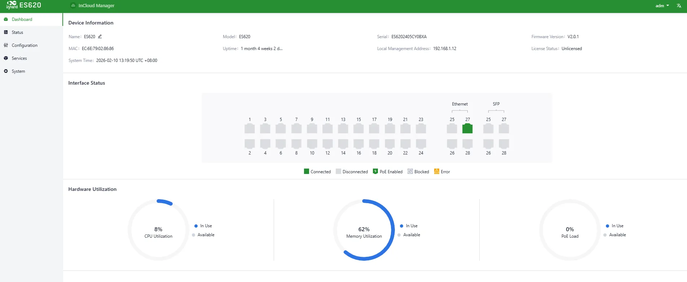

<strong>Figure 4-1 Device Information Overview</strong>

#### 4.1.2 Device Information

Using the **Remote Access** feature of StarCloud Manager, users can view and configure the device in real time. Select the target device and click **Remote Access** to open the device's local login interface.

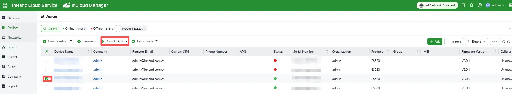

<strong>Figure 4-2 Select Target Device for Remote Access</strong>

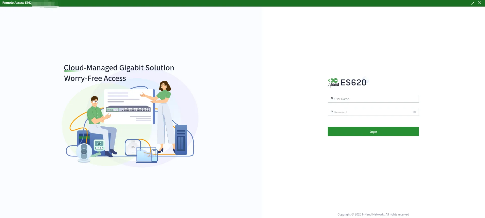

<strong>Figure 4-3 Remote Access Login Page</strong>

On the **Dashboard**, basic device information is displayed at the top of the page, including:

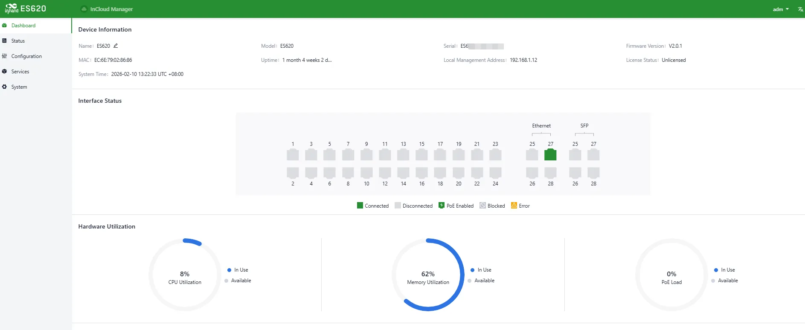

<strong>Figure 4-4 View Device Information</strong>

- **Name**: Device identifier, default "ES620", editable
- **MAC Address**: Physical MAC address
- **Model**: Specific device model
- **Uptime**: Device running time since power-on
- **System Time**: Device time and time zone
- **Serial Number**: Unique device identifier
- **Device Management Address**: Default **192.168.20.1/24**
- **License Status**: StarCloud Manager Basic / Branch Professional
- **Firmware Version**: Current software version

#### 4.1.3 Events

Users can view device runtime events under [Status] > [Events], helping diagnose device status.

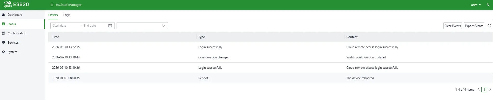

<strong>Figure 4-5 Device Event Records</strong>

Supported event types:

1. User login success
2. User login failure
3. Configuration changes
4. High CPU usage in the last 5 minutes
5. High memory usage in the last 5 minutes
6. High PoE utilization
7. Reboot
8. Upgrade

#### 4.1.4 Logs

Users can view system logs under [Status] > [Logs]. Logs help engineers troubleshoot issues.

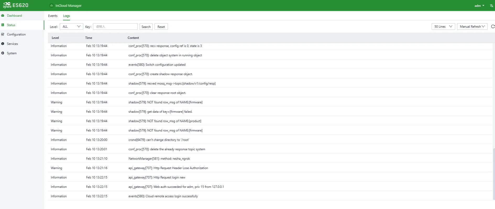

<strong>Figure 4-6 Device Log Records</strong>

Supported operations:

- **Download Logs**
- **Download Diagnostic Logs** (includes logs, device info, and configuration)
- **Clear Logs** (diagnostic logs are retained)

### 4.2 Port Configuration

Through the graphical interface, users can define port roles, modify native VLANs, control PoE status, and set port speed.

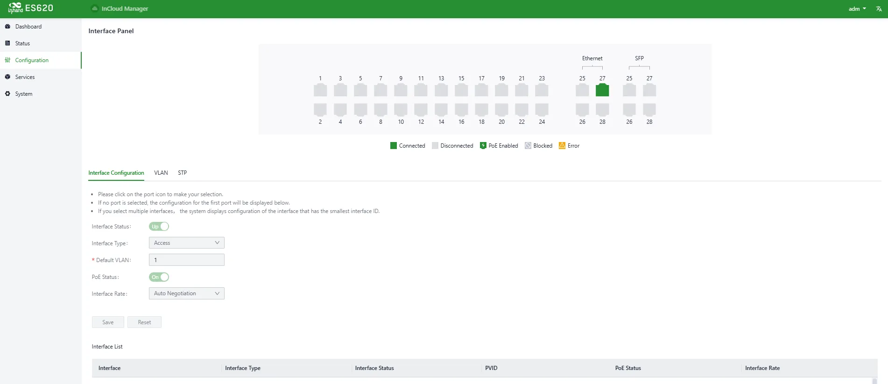

<strong>Figure 4-7 Port Configuration</strong>

**Entry**: [Configuration] > [Port Configuration]

### 4.3 VLAN

Users can create new VLANs (Virtual Local Area Network) and assign ports to different VLANs using tags.

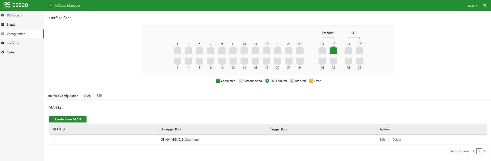

<strong>Figure 4-8 Create VLAN</strong>

**Entry**: [Configuration] > [VLAN]

### 4.4 STP

This menu allows users to configure STP (Spanning Tree Protocol) working modes for ports.

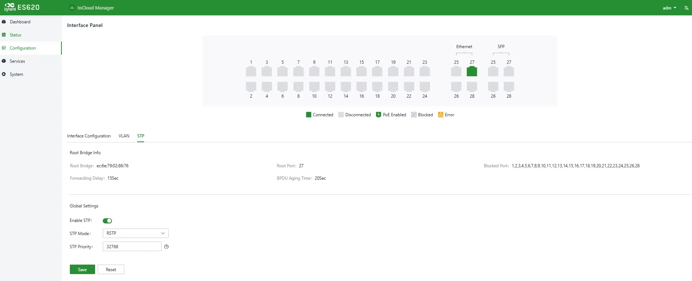

<strong>Figure 4-9 STP Working Mode</strong>

**Entry**: [Configuration] > [STP]

### 4.5 Services

#### 4.5.1 Interface Management

Users can configure the device management IP address under [Services] > [Interface Management].

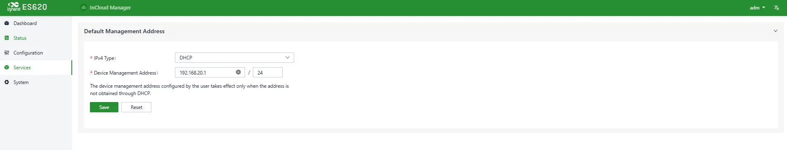

<strong>Figure 4-10 Interface Management</strong>

### 4.6 System

Under the [System] menu, users can configure account management, cloud management, time management, device options, configuration management, device alarms, tools, scheduled reboot, log server, and other settings.

#### 4.6.1 Account Management

The default username and password are **adm / 123456**. For security, the password should be changed.

Click **adm** on the top-right navigation bar and select **Change Password**.

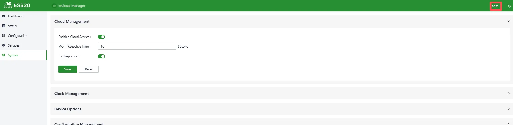

<strong>Figure 4-11 Change adm Password</strong>

**Entry**: Top navigation bar > [adm] > [Change Password]

Users can also set the username and password for logging in to the device Web page under [Services] > [Account Management]. The password should be kept secure to avoid leakage.

<strong>Figure 4-12 Modify Web Login Account/Password</strong>

**Entry**: [Services] > [Account Management]

#### 4.6.2 Cloud Management

InCloud Manager (**star.inhandcloud.cn**) is InHand Networks' cloud platform designed to address slow deployment, complex O&M, and poor service experience.

Users can select the cloud platform address under [System] > [Cloud Management]. By default, the ES620 automatically connects to StarCloud Manager after Internet access. Disable it manually if cloud management is not required.

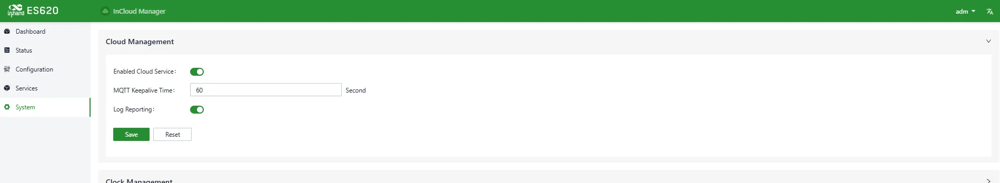

<strong>Figure 4-13 Enable InCloud Manager</strong>

**Entry**: [System] > [Cloud Management]

#### 4.6.3 Time Management

Users can select the time zone and configure the NTP server under [System] > [Clock].

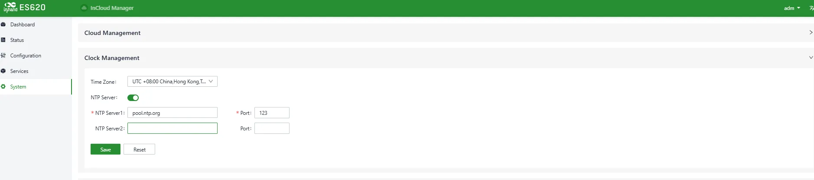

<strong>Figure 4-14 Configure Time Zone and NTP Server</strong>

**Entry**: [System] > [Clock]

#### 4.6.4 Device Options

Users can reboot the device, upgrade firmware, or restore factory settings under [System] > [Device Options].

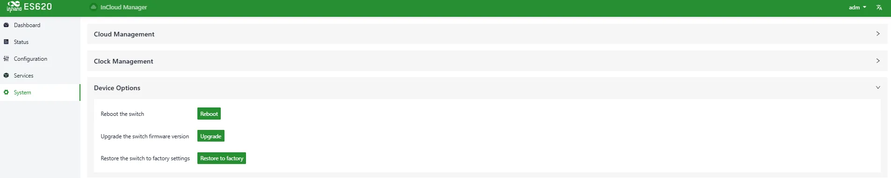

<strong>Figure 4-15 Reboot / Upgrade / Factory Reset</strong>

**Entry**: [System] > [Device Options]

> **Note**: For local firmware upgrades, ensure the firmware is obtained from official channels to avoid device unavailability caused by incorrect firmware.

#### 4.6.5 Configuration Management

Users can export device configuration for backup and import it for restoration under [System] > [Configuration Management].

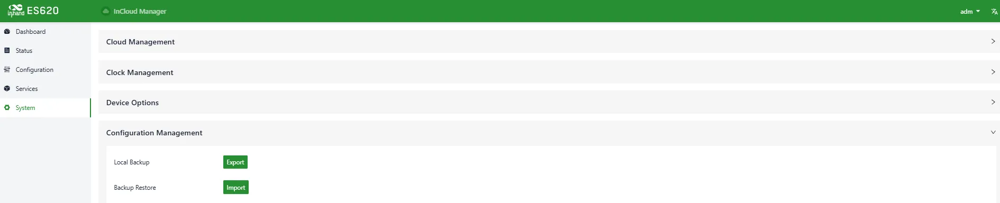

<strong>Figure 4-16 Manage Configuration Files</strong>

**Entry**: [System] > [Configuration Management]

#### 4.6.6 Device Alarms

Users can select alarm events and configure email recipients. Unchecked alarm events will still be recorded in local logs.

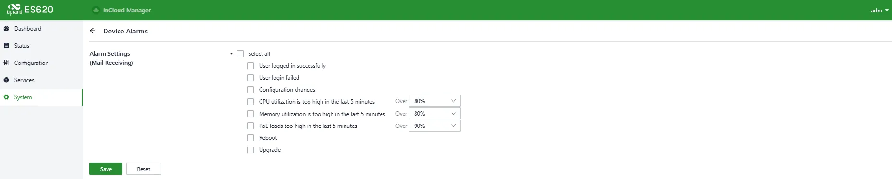

<strong>Figure 4-17 Select Alarm Events</strong>

<strong>Figure 4-18 Configure Alarm Email Address</strong>

**Entry**: [System] > [Device Alarms]

#### 4.6.7 Remote Access Control

Under [System] > [Remote Access Control], users can enable/disable access to the device's Web UI from the Internet and set service ports.

<strong>Figure 4-19 Configure Remote Access Protocols</strong>

- **HTTPS**: When enabled, enter the uplink public address and port in a browser to remotely access the device Web UI.
- **SSH**: When enabled, use a remote tool and enter the uplink public address and port, username, and password to remotely log in to the device backend.
- **Ping**: When enabled, the uplink interface address allows external networks to initiate Ping requests.

> **Note**: LAN interfaces are not affected by this configuration. Firewall rules do not restrict remote access.

**Entry**: [System] > [Remote Access Control]

#### 4.6.8 Tools

##### 4.6.8.1 Ping

Tests network connectivity using ICMP.

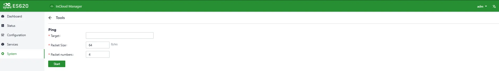

<strong>Figure 4-20 Ping Tool</strong>

**Entry**: [System] > [Tools] > [Ping]

##### 4.6.8.2 Traceroute

Checks routing paths to a destination host.

<strong>Figure 4-21 Traceroute Tool</strong>

**Entry**: [System] > [Tools] > [Traceroute]

##### 4.6.8.3 Packet Capture

Packet capture is a network monitoring and analysis technique that captures and records packets transmitted over a network. It is commonly used for troubleshooting, performance analysis, security audits, and protocol analysis. Under [System] > [Tools] > [Capture], users can capture packets on a specific interface. Under "Output", captured data can be displayed in the UI or exported locally.

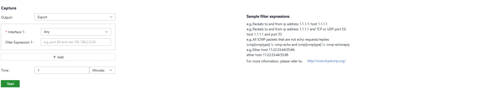

<strong>Figure 4-22 Packet Capture Tool</strong>

**Entry**: [System] > [Tools] > [Capture]

##### 4.6.8.4 Iperf

Iperf is a TCP/UDP network performance testing tool that measures bandwidth and network quality and provides statistics such as latency jitter, packet loss rate, and MTU. Administrators can use these statistics to locate bottlenecks and troubleshoot network issues.

Under [System] > [Tools] > [Iperf], configure traffic generation as server or client to test network performance.

<strong>Figure 4-23 Traffic Test Tool (Iperf)</strong>

**Entry**: [System] > [Tools] > [Iperf]

#### 4.6.9 Scheduled Reboot

Allows the device to reboot automatically at scheduled times (daily, weekly, or monthly).

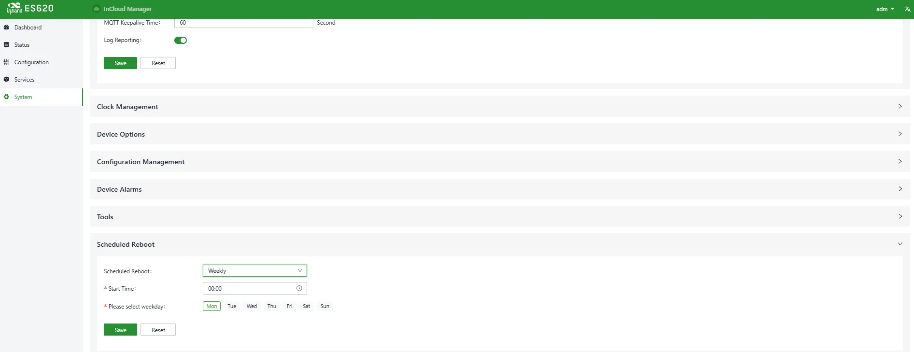

<strong>Figure 4-24 Set Reboot Schedule</strong>

**Entry**: [System] > [Scheduled Reboot]

> **Note**: For monthly schedules, if the selected reboot day is greater than the actual days of that month, the device reboots on the last day of the month.

#### 4.6.10 Log Server

After enabling the log server, the device periodically uploads logs to the specified server.

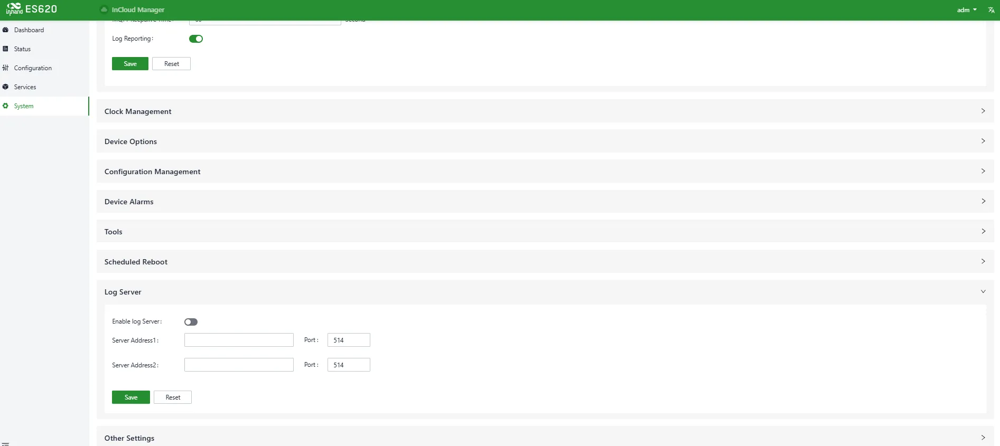

<strong>Figure 4-25 Log Server Address</strong>

**Entry**: [System] > [Log Server]

#### 4.6.11 Other Settings

**Web Login Management**

Automatically logs out users after a configured idle time.

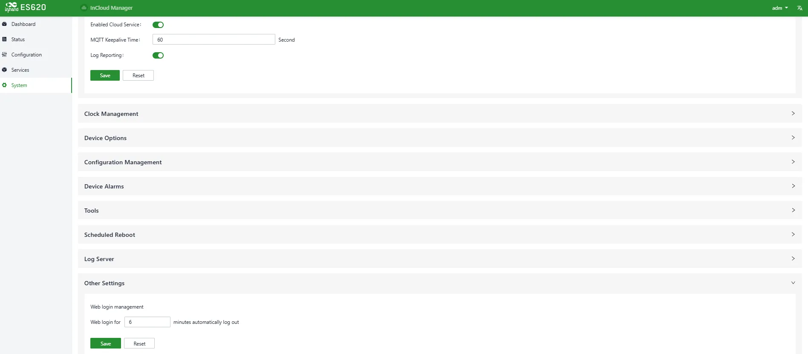

<strong>Figure 4-26 Set Web Login Timeout</strong>

**Entry**: [System] > [Other Settings] > [Web Login Management]

**SIP ALG**

SIP ALG combines Session Initiation Protocol (SIP) and Application Layer Gateway (ALG). It is used to help manage and process SIP communications (used to establish and manage real-time sessions such as voice/video calls). Enable this feature under [System] > [Other Settings] > [SIP ALG]. If there are VoIP devices on the network, this feature should be disabled.

<strong>Figure 4-27 Enable SIP ALG</strong>

**Entry**: [System] > [Other Settings] > [SIP ALG]

#### 4.6.12 SD-WAN

Enterprise branches often need to communicate for business data transfer and video conferencing. Traditional VPN configuration is complex and troubleshooting can be challenging. InHand Networks introduces SD-WAN to help users quickly create connections between branches through a user-friendly interface. This improves link flexibility and greatly reduces operation and management complexity, ultimately delivering a better network experience.

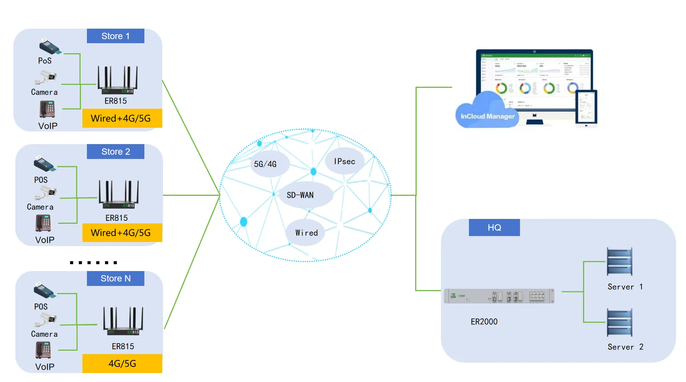

<strong>Figure 4-28 SD-WAN Application Scenario</strong>

Prerequisites:

- All devices used for SD-WAN networking must have the Branch Professional Edition license.
- All devices can access the Internet, and the subnets that need to communicate within the SD-WAN network have been planned and configured.

**Create an SD-WAN Network**

In InCloud Manager under “Network”, select “SD-WAN” and click “Add”. You will be redirected to the SD-WAN network creation page.

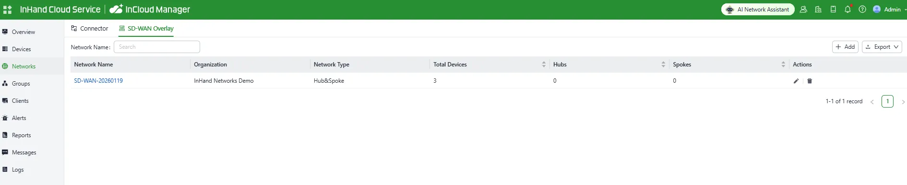

<strong>Figure 4-29 SD-WAN Network Entry</strong>

<strong>Figure 4-30 Edit SD-WAN Network</strong>

The SD-WAN network currently supports a hub-and-spoke topology. Device roles include Hub (central) and Spoke (branch). All spokes create tunnels to the hub; inter-spoke traffic is forwarded via the hub.

**Hub device:**

- The hub requires a public IP address to ensure SD-WAN operation. You can also use IP mapping to address public IP shortages.
- Tunnels are created between the hub uplink interface with a public IP address and all uplink interfaces of spoke devices.
- In firewall rules, the upstream device of the hub must allow two port numbers and map them to the uplink interface of the ER router. Port range: 1–65535.
- Supported device models: ER805, ER815, ER2000
- Up to 5 devices can be added.

**Spoke device:**

- No specific requirement for a public IP address.
- Multiple spokes can be added; the final number depends on hub device performance.
- Supported device models: ER605, ER615,ER805,ER815.

**Add Devices**

On the “Add Network” page, click “Add” under Hub or Spoke depending on the device type you want to add. Select the device and provide its public mapping information. If you need to modify device network configuration, click “Edit” for the local network to perform remote configuration.

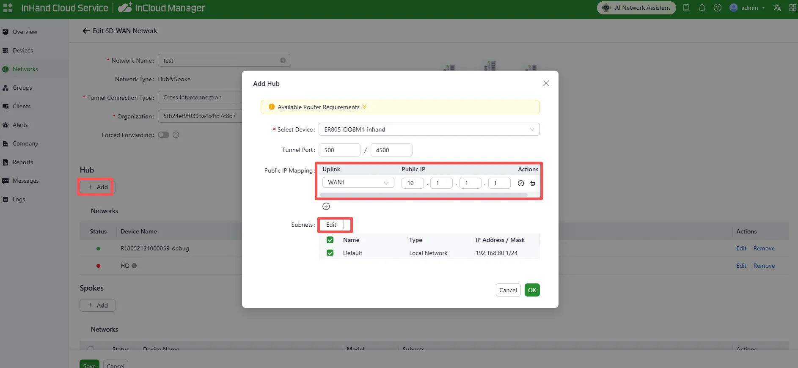

<strong>Figure 4-31 Add Hub Device</strong>

- When adding a hub device, the public address must be set to the actual mapped public IP.
- If the hub has no public IP address, the upstream router can map via NAT to ER2000. The WAN port connected on ER2000 must be configured with the actual working public address.
- After adding, you can click Edit to customize subnets and static routes in the SD-WAN network.

<strong>Figure 4-32 Add Static Routes</strong>

After configuring local subnets and static routes and saving, when adding/editing devices you can select subnets or static routes:

- Selected subnets are the networks that the current device can use for SD-WAN communication.
- Selected static routes will be advertised to the entire SD-WAN network.

<strong>Figure 4-33 Add Branch Site Device</strong>

After adding devices, click “Save” in the lower-left corner to create the network. All devices and selected subnets will interconnect. Within a single network, the local networks of the hub and spokes must not be the same, otherwise communication may be affected.

**Check SD-WAN Network Status**

After adding the network, the system automatically directs you to the topology page. Alternatively, go to the “SD-WAN Networks” list and click the network name to open the topology details page. In the network, all branch devices create connections to the hub device.

<strong>Figure 4-34 View SD-WAN Network Topology</strong>

**Example**

Background: A chain needs a fast and convenient SD-WAN network. The new SD-WAN network needs to communicate with the customer’s existing intranet 172.16.10.0/24.

<strong>Figure 4-35 Branch SD-WAN Scenario</strong>

The customer expects mutual access among Branch 1 (192.168.1.0/24), Branch 2 (192.168.2.0/24), and HQ (192.168.4.0/24), and to access the customer’s existing intranet (172.16.10.0/24) via the hub node.

- Branch 1: Cellular/WAN1: 10.1.1.1, Local subnet: 192.168.1.0/24
- Branch 2: Cellular/WAN2: 10.1.2.1, Local subnet: 192.168.2.0/24

---

## Appendix A Troubleshooting

### A.1 Network Connection Issues

| Symptom | Possible Cause | Troubleshooting Steps | Related Section |
|:--------|:---------------|:----------------------|:----------------|
| Cannot access Web interface | PC IP address not in the same subnet | 1. Confirm the PC is connected to a switch port 2. Check that the PC IP is in the 192.168.20.0/24 range | [2.2 Installation Guide](#22-installation-guide) |
| Cannot access Web interface | Incorrect username or password | 1. Verify the default username is "adm" and password is "123456" 2. If changed, use the modified credentials | [1.6 Default Settings](#16-default-settings) |
| Device cannot be added to cloud platform | Incorrect serial number or MAC address | 1. Verify the serial number and MAC address on the device label 2. Re-enter the information in InCloud Manager | [Scenario 1: Add Device to InCloud Manager Platform](#scenario-1-add-device-to-incloud-manager-platform) |
| Device offline in cloud platform | No Internet access | 1. Check the upstream network connection 2. Confirm that cloud management is enabled | [4.6.2 Cloud Management](#462-cloud-management) |
| Link indicator is off | Ethernet cable disconnected or faulty | 1. Check the cable connection 2. Replace the cable | [1.4 LED Indicators](#14-led-indicators) |
| PoE indicator is off | No PD device connected | 1. Confirm the connected device supports PoE 2. Check the cable quality | [1.4 LED Indicators](#14-led-indicators) |

### A.2 System Issues

| Symptom | Possible Cause | Troubleshooting Steps | Related Section |
|:--------|:---------------|:----------------------|:----------------|
| Forgot login password | Password lost | 1. Restore the device to factory settings 2. Log in with the default password "123456" and reconfigure | [1.5 Restore Factory Settings](#15-restore-factory-settings) |
| High CPU/memory usage alerts | Heavy traffic or abnormal processes | 1. Check traffic statistics 2. Review event logs for anomalies 3. Restart the device if necessary | [4.1.3 Events](#413-events) |
| Cannot receive alarm emails | Email configuration error | 1. Check the recipient email address 2. Verify network connectivity to the mail server | [4.6.6 Device Alarms](#466-device-alarms) |

---

## Appendix B Safety Precautions

1. Use the original power adapter only. Mismatched power supplies may cause device damage.
2. Do not install the device in environments with strong electromagnetic interference or too close to high-power equipment.
3. Ensure the operating environment meets the temperature and humidity requirements in the specification sheet.
4. Regularly check cables, including Ethernet cables and power adapter cables. Keep them clean and replace promptly if damaged.
5. When cleaning, avoid spraying chemical agents directly on the device surface to prevent damage to the enclosure or internal components. Use a soft cloth.
6. Do not disassemble, repair, or modify the device without authorization. This may cause safety issues and void the warranty.

> **Warning**: Non-professionals should not open the device enclosure. Risk of electric shock.

---

## FAQ

### Question 1: Is the cloud platform free?

InHand Networks is committed to providing high-quality network services for SMB chain organizations. To use cloud platform services, licenses must be purchased per device to access rich cloud features. After a device is added for the first time, a one-year free Basic license is granted by default. Users can renew as needed.

### Question 2: How do I add the device to the cloud platform?

1. Register an InCloud Manager login account at [https://star.inhandcloud.cn/](https://star.inhandcloud.cn/).
2. Log in with the registered account, go to the [Devices] menu, click "Add", and follow the prompts to enter the device serial number and MAC address.

### Question 3: Can the device be used without the cloud platform?

Yes. Most configuration functions can be completed locally. However, batch configuration delivery, remote upgrades, and some advanced functions must be used together with the cloud platform.

### Question 4: What should I do if the problem cannot be solved using the above answers?

Contact Beijing InHand Networks Technology Co., Ltd. for technical support. Visit [www.inhandnetworks.com](http://www.inhandnetworks.com/) or send an email to [support@inhandnetworks.com](mailto:support@inhandnetworks.com).
