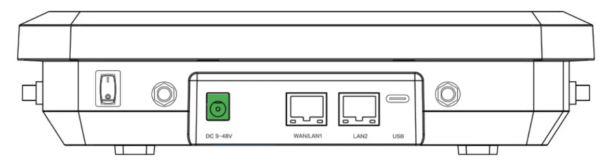
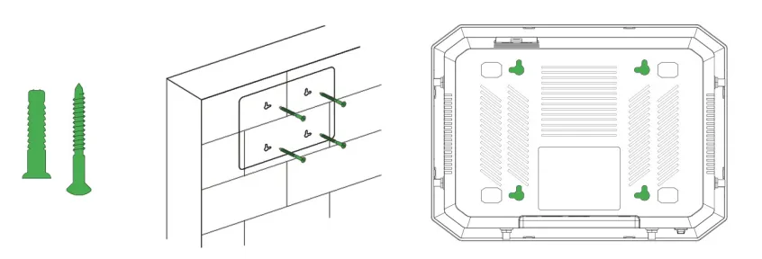
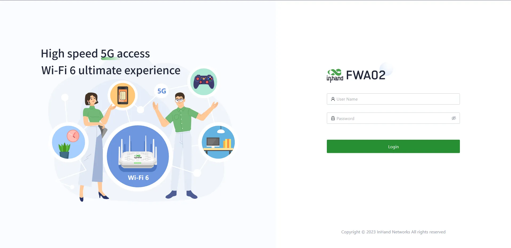
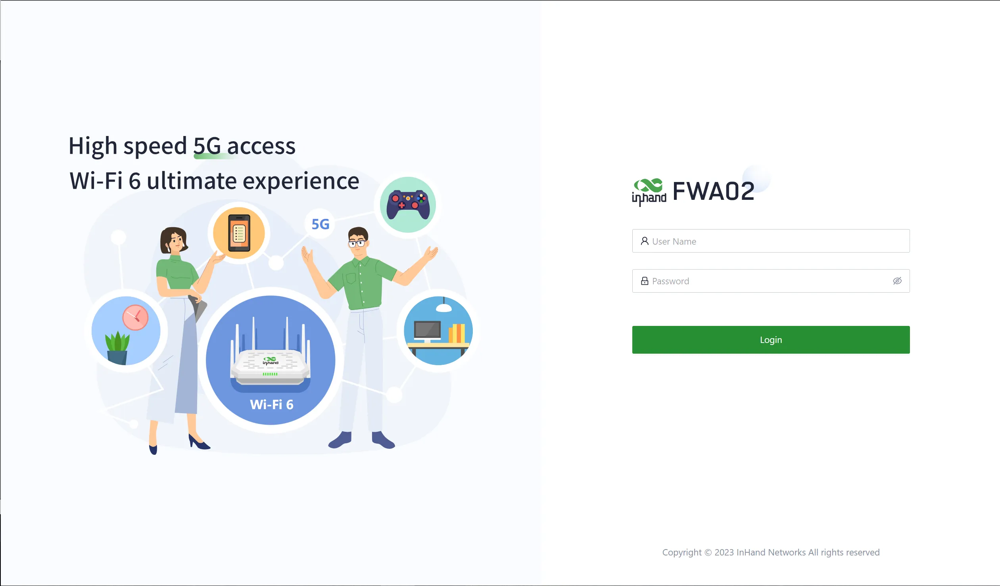
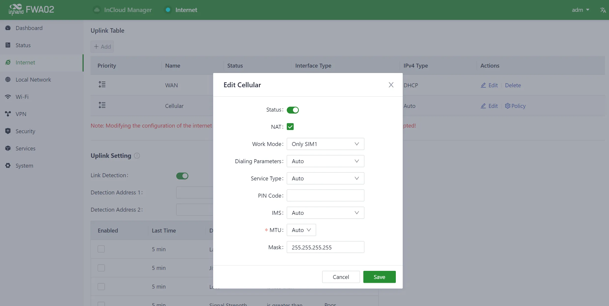
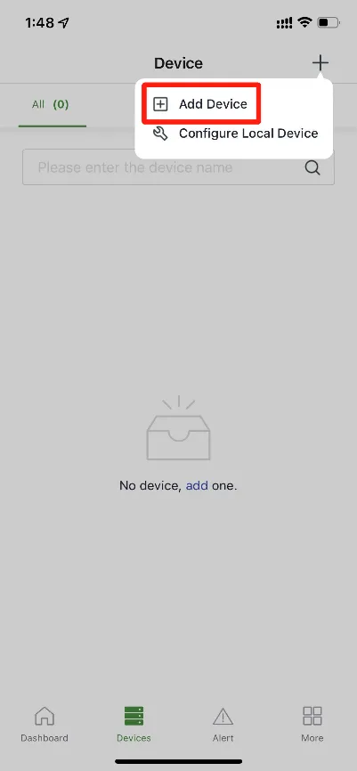
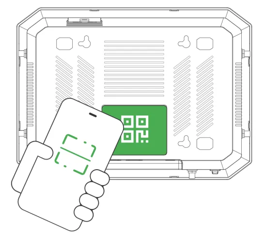
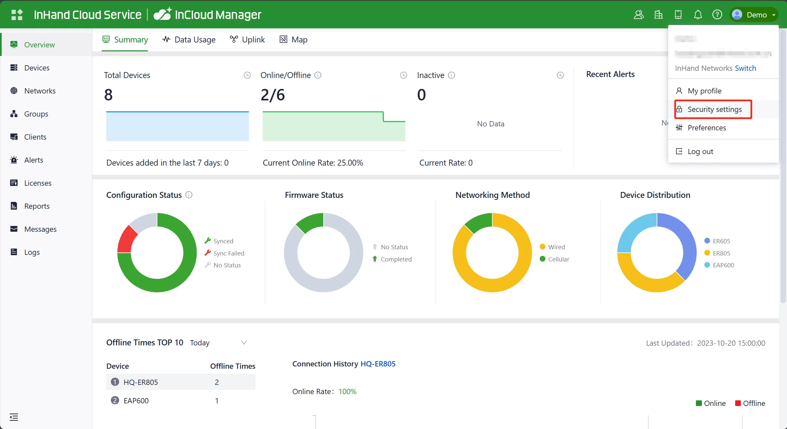
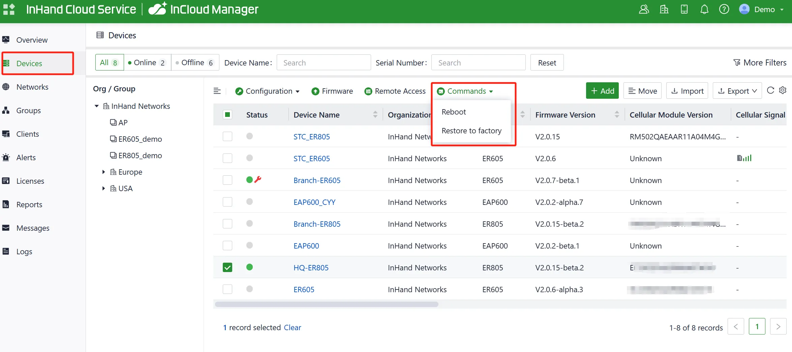

# 5G FWA02 Product Quick Guide

## Part 1: Quick Installation (Visual Step-by-Step)

> **What you need to do first:** Unbox → Mount the device → Connect power and Ethernet → (If using cellular) **Power off** to insert SIM, attach antennas → Power on → Set PC to same subnet → Open Web in browser.  
> **Then:** Scroll down to **Part 2** for packing list, LED definitions, mounting details, and interface specifications.

### Must-Read Summary (Before Wiring and Power On)

| Item | Requirement |
|------|-------------|
| Power Supply | **9~48 V DC** via DC jack; **Power LED steady red** indicates powered on. |
| SIM Card | **Power off** before inserting or removing SIM; **no hot-swapping**. |
| 5G / Wi-Fi Antennas | Tighten 5G antennas to SMA connectors per housing silkscreen; 4 Wi-Fi antennas are built-in. |
| Environment | Working temperature: **-10℃~50℃**; avoid direct sunlight, heat sources, and strong electromagnetic interference. |

### Step 1: Check the Device Panel and Interface Areas

Before installation, familiarize yourself with the front panel interfaces:

1.  Power Switch
2.  DC 9~48V: Power input
3.  WAN/LAN1: Ethernet Port
4.  LAN2: Ethernet Port
5.  USB: Type-C interface supporting USB2.0 protocol

<b>Fig. 1-1 Device Panel</b>

For a complete interface description, see §2.2.

### Step 2: Mount the Device on a Desktop or Wall

The FWA02 supports both desktop placement and wall-mounted installation.

**Desktop Installation:**

1. Ensure the selected desktop area is free from obstructions to provide adequate space for the device.
2. Verify the correct installation of the SIM card, antennas and power cable.
3. Place the device steadily on the tabletop.

<b>Fig. 1-2a Desktop Installation</b>

**Wall-Mounted Installation:**

1. Use a drill or an appropriate tool to pre-drill holes at the marked positions on the wall. Ensure that the hole dimensions are suitable for the expansion screws you are using. Insert the expansion screws into the pre-drilled holes and gently tap or rotate them with the appropriate tool until the expansion screws are securely fastened to the wall.

<b>Fig. 1-2b Pre-drill Holes</b>

2. The mounting holes at the bottom of the device are L-shaped. Align the mounting holes and push down gently to complete the fixation.

<b>Fig. 1-2c Push the Device</b>

Detailed installation steps and removal methods are described in §2.4.

### Step 3: Connect Power and Ethernet

1. Insert one end of the power adapter into the power outlet and the other end into the device's power interface.
2. Connect your PC to the device's WAN/LAN1 or LAN2 port using an Ethernet cable.

<b>Fig. 1-3 Power Cable Installation</b>

> **Please use the power adapter included in the package.** FWA02 supports a voltage input range of 9~48V. Please pay attention to the voltage level.

For power specifications and Ethernet interface definitions, see §2.5.2 and §2.5.1.

### Step 4: (If Using Cellular) Power Off to Insert SIM and Attach Antennas

> **⚠️ Power off the device before this step!** SIM cards do not support hot-swapping.

1. Slide the SIM card cover downward to remove it.
2. Insert the 4FF nano SIM card(s) according to the diagram below (single or dual SIM as needed).
3. Put the SIM card cover back in place.
4. Attach all the 5G antennas to the SMA connectors. The 4 Wi-Fi antennas are built-in and require no installation.

<b>Fig. 1-4a Install the SIM Cards</b>

<b>Fig. 1-4b Install the Antennas</b>

> For Verizon users, there is an embedded SIM card built-in. Please find the ICCID on the back if you want to activate the embedded SIM instead of 4FF SIM.

For SIM card slot locations, antenna silkscreen mapping, and detailed instructions, see §2.5.3.

### Step 5: Power On and Confirm the Device Is Ready

1. After confirming all connections are correct, flip the power switch to power on the device.
2. Observe the LED indicators:
   - **PWR steady red** = Powered on
   - **STATUS steady green** = System running normally

For a complete LED definition table and RESET button description, see §2.3.

### Step 6: Log In via PC and Browser

1. Connect your PC to the device's LAN port (or WAN/LAN1) using an Ethernet cable.
2. Ensure the PC obtains an IP address automatically (DHCP is enabled by default). If not, configure a static IP manually.
3. Open a web browser, enter the device's default address, and log in with the username and password from the product nameplate. If your browser displays a security warning, navigate to hidden or advanced options and select "Proceed to website."

<b>Fig. 1-6 Web Login Interface</b>

| Port Role | Default IP |
| :-------: | :--------: |
| WAN/LAN1  | 192.168.1.1 |
| LAN2      | 192.168.2.1 |

> Default username and password: Please check the product nameplate.

For detailed login steps, APN configuration, wired networking setup, and factory reset methods, see §2.7.

### Installation Self-Check

- ☐ The device is securely mounted (desktop or wall-mounted).  
- ☐ Power and Ethernet cables are connected; if using cellular, SIM card and 5G antennas are in place.  
- ☐ **PWR is steady red** and **STATUS is steady green**.  
- ☐ The browser can open the Web login page and complete login.

**Troubleshooting:** If you cannot access the Web page, confirm that the PC and device are on the same subnet. If the LED indicators are abnormal, refer to §2.3. If a factory reset is required, refer to §2.7.

---

## Part 2: Detailed Information

### 2.1 Packing List

**Standard Accessories**

| No. | Part Name | Quantity | Unit | Description |
|-----|-----------|----------|------|-------------|
| 1 | FWA02 | 1 | pc | 5G FWA02 |
| 2 | Ethernet Cable | 1 | pc | 1m Ethernet Cable |
| 3 | Power Adapter | 1 | pc | DC Power Adapter |
| 4 | 5G Antenna | 6 | pc | FWA02-NAVA: 6× External 5G Antenna |
| | | 4 | pc | FWA02-NATM: 4× External 5G Antenna |
| | | 6 | pc | FWA02-EUNR: 6× External 5G Antenna |
| 5 | QSG | 1 | pc | Quick Installation Guide |
| 6 | Installation accessories | 1 | set | Wall-Mounted and Desktop installation |

> The number of antennas varies by model. Please refer to the 《5G FWA02 Product Specification》for ordering information.

### 2.2 Product Structure and Identification

#### Front Panel

<b>Fig. 2-1 Device Panel</b>

| No. | Interface/Component | Description |
|-----|---------------------|-------------|
| 1 | Power Switch | Power on/off |
| 2 | DC 9~48V | Power input |
| 3 | WAN/LAN1 | Ethernet Port |
| 4 | LAN2 | Ethernet Port |
| 5 | USB | Type-C interface supporting USB2.0 protocol |

This manual is for the installation and operation of the 5G FWA of InHand Networks. Before installation, please confirm the product model and accessories in the package and purchase a SIM card from the operator that supports the local network. Please refer to the actual product for specific operations.

### 2.3 LED Indicators and Reset Button

#### 2.3.1 System Status LEDs

| Indicator | Status | Definition |
|-----------|--------|------------|
| System | Off | Power off |
| | Steady in red | Powering |
| | Blink in red | System error |
| | Steady in green | System working |
| | Blink in blue | Firmware updating |
| Cellular | Blink in red | Unable to access the cellular network |
| | Steady in blue | 4G cellular connection successful |
| | Steady in green | 5G cellular connection successful |
| Signal | Off | No signal value |
| | Steady in red | Signal value is low |
| | Steady in blue | Signal value is moderate |
| | Steady in green | Signal value is excellent |
| WAN | Off | Disconnected |
| | Steady in green | Port works properly |
| | Blink in green | Data transferring |
| LAN | Off | Disconnected |
| | Steady in green | Port works properly |
| | Blink in green | Data transferring |
| Wi-Fi 2.4G | Off | AP mode disabled |
| | Blink in green | AP mode enabled |
| | Steady in green | The STA device successfully connects to this device |
| Wi-Fi 5G | Off | Disconnected |
| | Blink in green | 5G AP function enabled |
| | Steady in green | Wi-Fi clients connected successfully |

#### 2.3.2 Reset Button

The reset button is located on the device (see §2.2 for the panel diagram). Its function is to perform a hardware factory reset.

> For detailed restore steps and LED state changes during reset, see §2.7.4.

### 2.4 Mechanical Installation

#### 2.4.1 Desktop Installation

1. Ensure the selected desktop area is free from obstructions to provide adequate space for the device.
2. Verify the correct installation of the SIM card, antennas and power cable.
3. Place the device steadily on the tabletop.

<b>Fig. 2-4-1 Desktop Installation</b>

#### 2.4.2 Wall-Mounted Installation

1. Use a drill or an appropriate tool to pre-drill holes at the marked positions on the wall. Ensure that the hole dimensions are suitable for the expansion screws you are using. Insert the expansion screws into the pre-drilled holes and gently tap or rotate them with the appropriate tool until the expansion screws are securely fastened to the wall.

<b>Fig. 2-4-2a Pre-drill Holes</b>

2. The mounting holes at the bottom of the device are L-shaped. Align the mounting holes and push down gently to complete the fixation.

<b>Fig. 2-4-2b Push the Device</b>

### 2.5 Connection and Cabling

#### 2.5.1 Ethernet

The FWA02 provides two Ethernet ports:

| Port | Role | Default IP |
|------|------|------------|
| WAN/LAN1 | Ethernet Port | 192.168.1.1 |
| LAN2 | Ethernet Port | 192.168.2.1 |

> The LAN port has DHCP Server functionality enabled by default.

#### 2.5.2 Power Supply

Insert one end of the power adapter into the power outlet and the other end into the device's power interface, then flip the power switch.

<b>Fig. 2-5-2 Power Cable Installation</b>

| Parameter | Specification |
|-----------|---------------|
| Input Voltage | 9~48 V DC |
| Power Adapter | DC Power Adapter (included in package) |

> If the power switch is on, the Power LED will turn on.

#### 2.5.3 Cellular SIM and Antennas

**SIM Card**

5G FWA02 supports dual nano SIM cards (4FF).

<b>Fig. 2-5-3a Install the SIM Cards</b>

1. Slide the SIM card cover downward to remove it, then insert the SIM card(s) according to the diagram.
2. To remove the SIM, press the middle of the SIM inward and it will pop outward from the SIM slot.
3. Put the SIM card cover back in place.

> **⚠️ Power off the device before inserting or removing SIM cards. Hot-swapping is not supported.**  
> For Verizon users, there is an embedded SIM card built-in. Please find the ICCID on the back if you want to activate the embedded SIM instead of 4FF SIM.

**Antennas**

Attach all the 5G antennas to the SMA connectors. The 4 Wi-Fi antennas are built-in.

<b>Fig. 2-5-3b Install the Antennas</b>

| Antenna Type | Quantity | Note |
|--------------|----------|------|
| 5G External Antenna | 6 (NAVA/EUNR) / 4 (NATM) | Tighten to SMA connectors per housing silkscreen |
| Wi-Fi Antenna | 4 (built-in) | Internal, no installation required |

#### 2.5.4 USB

The device provides a **Type-C interface supporting USB2.0 protocol**.

### 2.6 Power Supply and Environment

| Item | Specification |
|------|---------------|
| Input Voltage | 9~48 V DC |
| Working Temperature | -10℃~50℃ |
| Storage Temperature | -40℃~85℃ |
| Environment | Avoid direct sunlight and keep the FWA02 away from heat sources or strong electromagnetic interference |

> Confirm that the installation position is strong enough to support the weight of the equipment and its installation accessories.

### 2.7 First Login and Factory Reset

#### 2.7.1 Web Login

5G FWA02 supports two ways of accessing the Internet: cellular and wired.

**Default IP Address**

| Port Role | Default IP |
| :-------: | :--------: |
| WAN/LAN1 | 192.168.1.1 |
| LAN2 | 192.168.2.1 |

> Default username and password: Please check the product nameplate.

**Cellular Access via PC**

1. Power off the device, insert the SIM card into the card slot, connect the 5G antenna to the device, and establish a wired connection between the 5G FWA02 and your PC using an Ethernet cable.
2. Open a web browser and type the device's default address `192.168.1.1` into the browser's address bar. After entering the default username and password, you will access the device's web management interface. If your browser displays a security warning, navigate to hidden or advanced options and select "Proceed to website."

<b>Fig. 2-7-1a Web Login (Cellular)</b>

3. Go to the "Internet" section in the left navigation bar. Click the "Edit" button next to the "Cellular" option to configure the dial-up parameters. The device comes with the dial-up function enabled by default. If it doesn't establish a connection within a few minutes, re-enable the dial-up option.

<b>Fig. 2-7-1b Uplink Table</b>

<b>Fig. 2-7-1c Configure APN Parameters</b>

4. To verify the dial-up status, go to the "Interface Status" section located in the "Dashboard." The device has successfully connected to the Internet when the "Cellular" icon turns green. You can click on the "Cellular" icon to access information like signal strength, IP address, and data usage.

<b>Fig. 2-7-1d Check Cellular Interface</b>

**Wired Networking via PC**

After powering on the device, connect your PC to the device's LAN port using an Ethernet cable.

The device's LAN port has DHCP Server functionality enabled by default. Once the PC has automatically obtained an IP address, please ensure that your PC and 5G FWA02 are in the same address range.

If your PC fails to obtain an IP address automatically, please configure it with a static IP address using the following parameters:

- IP Address: 192.168.2.x (Choose an available address within the range of 192.168.2.2 - 192.168.2.254)
- Subnet Mask: 255.255.255.0
- Default Gateway: 192.168.2.1
- DNS Servers: 8.8.8.8 (or your ISP's DNS server address)

1. Enter the default device address `192.168.2.1` in the browser's address bar. After entering the username and password, access the device's web management interface. If the page shows a security warning, click on the "Hide" or "Advanced" button and select "Proceed" to continue.

<b>Fig. 2-7-2a Web Login (Wired)</b>

2. Check the network in the "Dashboard > Interface Status". The device connects to the Internet successfully if the "Cellular" or "WAN" icon turns green. Click the corresponding icon to view interface information such as signal strength, IP address and traffic consumption.

3. If this device cannot connect to a network, click "Internet > Uplink Table > Edit" to set up network parameters. The device enables the dial-up function and WAN by default, please wait for a few minutes to go online, and re-enable the dial-up if it is not dialled.

<b>Fig. 2-7-2b Edit Uplink Interface</b>

<b>Fig. 2-7-2c Configure Uplink Parameters (1)</b>

<b>Fig. 2-7-2d Configure Uplink Parameters (2)</b>

| Mode | Description |
|------|-------------|
| DHCP | The DHCP service is enabled on the WAN port by default which means this device cannot connect to the Internet immediately if the upstream device connected to the WAN port does not have the DHCP server enabled |
| Static IP | Users can assign a static IP address obtained from the ISP or upstream network device manually |
| PPPoE | Users can set the PPPoE service on the WAN port and then this device can dial up to the Internet through the broadband service |

4. Verify network connectivity via the Ping tool on the System/Tools page.

<b>Fig. 2-7-2e Check Network Connectivity</b>

#### 2.7.2 Connect via APP

**Cellular Access via APP**

1. Insert the SIM card while the device is powered off, then connect the antennas to the device, and log in to the InCloud APP.
2. Log into the InCloud APP. Click the "Device" directory below to enter the [Device] page and clicking the menu button in the upper right corner, after that select [Add Device]. You can scan the QR code on the FWA02 to add the device.

<b>Fig. 2-7-3a Scan QR Code to Add Device (1)</b>

<b>Fig. 2-7-3b Scan QR Code to Add Device (2)</b>

3. Once you successfully scan the QR code, proceed to configure the device's name, serial number, and description information.
4. If the device fails to connect to the network after adding it, you can click "Configure local device" to set up the device for cloud connectivity. The 5G FWA02 is configured with default Https access and Wi-Fi AP functionality.

**Wired Access via APP**

1. Insert the SIM card while the device is powered off, connect the antennas to the device, and log in to the InCloud APP.
2. Navigate to the "Device" section below to access the [Device] page, then click the menu button in the upper right corner and select [Add Device]. Then scan the QR Code on the 5G FWA02 to add the device.

<b>Fig. 2-7-4a Scan QR Code to Add Device (Wired 1)</b>

<b>Fig. 2-7-4b Scan QR Code to Add Device (Wired 2)</b>

3. Once you successfully scan the QR code, proceed to configure the device's name, serial number, and description information.
4. If the device fails to connect to the network after adding it, you can click "Configure local device" to set up the device for cloud connectivity.
5. Scan the QR code on the unit's nameplate, and the app will establish a Wi-Fi connection with the FWA02 automatically.
6. Once the connection is established, the app will log in to the device, and you will be directed to the network configuration interface. Confirm the information and click 'Submit.'

#### 2.7.3 Remote Management Platform

**InCloud Manager**

*Register/Login*

1. Open your web browser and visit InCloud at the following address: [https://star.inhandcloud.com/](https://star.inhandcloud.com/). This will take you to the InCloud registration and login page. (We recommend using Chrome)

<b>Fig. 2-7-5a InCloud Manager Login Page</b>

2. After registering, log in to the cloud platform using your registered email. Navigate to the "Security Settings" page where you can change your password and link your mobile phone number. Once your phone number is linked, you can use it for future logins to the cloud platform.

<b>Fig. 2-7-5b Bind a Mobile Phone Number</b>

*Adding Devices to the Platform*

Log in to the InCloud Manager platform, then go to "Device" and click "Add" in the navigation menu. Fill in the device's serial number and MAC address to add it.

<b>Fig. 2-7-5c Add a Device</b>

#### 2.7.4 Factory Reset

**Remote Reset**

Log in to the InCloud Manager platform, navigate to "Device," and select "Command" from the menu. Click the "Restore to Factory" button, confirm the action, and the device will reboot and revert to its default settings.

<b>Fig. 2-7-6 Restore to Factory Settings (Remote)</b>

**Hardware Reset**

1. After powering on the device, press and hold the reset button for 30 seconds, and the System indicator is solid blue. Please ignore the process after holding down the SYS indicator for the first time blue after holding the Reset button.
2. Release the key and the blue flashes.
3. Press and hold the reset button again, release the solid blue light and enter the system startup phase.

#### 2.7.5 Logs and Diagnostic Data

Login to InCloud Manager, navigate to "Device," select "Device Details," and click on the "Tools" menu in the navigation bar. Then, click the corresponding button to initiate the download of logs and diagnostic data.

<b>Fig. 2-7-7 Download Logs and Diagnostic Data</b>

### 2.8 Related Documents

| Requirement | Destination |
|-------------|-------------|
| Product introduction, USB details, configuration and troubleshooting | 《5G FWA02 User Manual》 |
| Ordering and antenna models | 《5G FWA02 Product Specification》 |
| Software and announcements | [InHand Networks Official Website](https://www.inhandnetworks.com/) |
