# 5G FWA02 Product User Manual

## Declaration

Thank you for choosing this product. Before use, carefully read this user manual. Observing the following statements helps maintain intellectual property rights and legal compliance, and ensures the user experience aligns with the latest product information. For any questions or to obtain written permission, contact the technical support team at any time.

- Copyright Statement

This user manual contains copyrighted content. The copyright belongs to Beijing InHand Networks Technology Co., Ltd. and its licensors. Without written permission, no organization or individual may excerpt, copy any part or all of this manual, or disseminate it in any form.

- Disclaimer

Due to continuous updates in product technology and specifications, the company cannot guarantee that the information in this user manual is completely consistent with the actual product. Therefore, the company shall not be liable for any disputes arising from discrepancies between actual technical parameters and this user manual. Any product changes will not be notified in advance. The company reserves the right to make final changes and interpretations.

- Copyright Information

The content of this user manual is protected by copyright law. The copyright belongs to Beijing InHand Networks Technology Co., Ltd. and its licensors. All rights reserved. Without written permission, the content of this manual may not be used, copied, or disseminated without authorization.

## Conventions

| Symbol | Meaning | Example |
|--------|---------|---------|
| `< >` | Indicates a variable or parameter to be replaced with an actual value | `<IP address>` indicates a specific IP address is required |
| `" "` | Indicates a text label on the interface | Click the "Save" button |
| `→` | Indicates menu hierarchy or operation sequence | [Network] → [Cellular] |
| `[ ]` | Indicates a menu or page name | Enter the [System Settings] page |
| **Cautions** | Operations that may result in data loss or device damage if performed improperly | - |
| **Note** | Supplementary and necessary explanations for the operation | - |

## Technical Support
Email: support@inhandnetworks.com

URL: www.inhand.com

## How to Use This Manual

### Match Your Needs

- First-time users: It is recommended to read in sequence: [Know the Device] → [Installation and First Use] → [Common Scenario Configuration] → [Function Description and Parameter Reference].
- Existing device users: Go directly to [Function Description and Parameter Reference] or [Appendix Troubleshooting].
- Cloud platform administrators: Refer to [Common Scenario Configuration] → [Cloud Platform Management] for device remote management.

### Quick Task Navigation

| Task | Corresponding Section | Estimated Time |
|------|----------------------|----------------|
| Understand device appearance and interfaces | [Know the Device](#chapter-1-know-the-device) | About 5 minutes |
| Install the device and connect to the network | [Installation and First Use](#chapter-2-installation-and-first-use) | About 10 minutes |
| Configure cellular Internet access | [Scenario: Cellular Internet Access](#31-cellular-internet-access) | About 5 minutes |
| Configure wired Internet access | [Scenario: Wired Internet Access](#32-wired-internet-access) | About 5 minutes |
| Register and manage the device on the cloud platform | [Scenario: Cloud Platform Management](#33-cloud-platform-management) | About 10 minutes |
| Query function descriptions and parameters | [Function Description and Parameter Reference](#chapter-4-function-description-and-parameter-reference) | As needed |
| Troubleshoot faults | [Appendix: Troubleshooting](#appendix-a-troubleshooting) | As needed |

---

# Chapter 1 Know the Device

## 1.1 Overview

The 5G FWA02 is a cloud-managed 5G fixed wireless access device developed by InHand Networks. It delivers high-speed, secure, and easy-to-use 5G network connectivity for enterprise and business applications. The device supports a 4.76 Gbps downlink 5G cellular network, a 3.6 Gbps Wi-Fi 6 wireless network, and 2.5 Gbps wired network access capabilities, enabling rapid deployment of a full-gigabit network.

Combined with the InCloud Manager platform, the 5G FWA02 forms a cloud-managed network solution that provides global customers with high-speed and secure network access, as well as simple and convenient network management services.

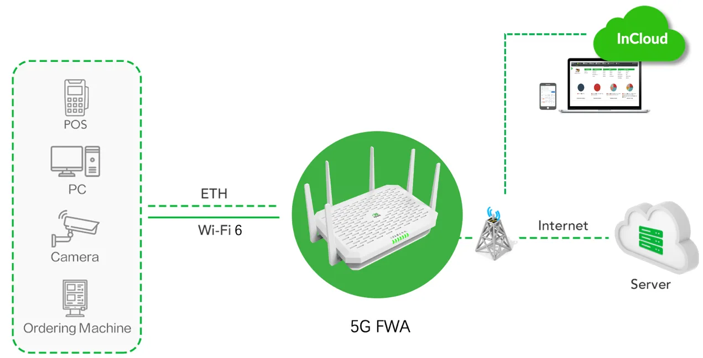

<strong>Figure 1-1 Application case</strong>

## 1.2 Packing List

| Item | Quantity | Description |
|------|----------|-------------|
| FWA02 | 1 | 5G FWA02 host device |
| Ethernet Cable | 1 | 1 m Ethernet cable |
| Power Adapter | 1 | DC power adapter |
| 5G Antenna | 6 | FWA02-NAVA: 6 external 5G antennas |
| | 4 | FWA02-NATM: 4 external 5G antennas |
| | 6 | FWA02-EUNR: 6 external 5G antennas |
| Quick Installation Guide | 1 | Quick Installation Guide (QIG) |
| Installation Accessories | 1 | Wall-mount and desktop installation accessories |

## 1.3 Appearance and Interfaces

<strong>Figure 1-2 Device panel</strong>

| Interface | Position | Function Description |
|-----------|----------|----------------------|
| Power Switch | Rear panel | Power on/off switch |
| DC 9~48V | Rear panel | DC power input, supports 9 V to 48 V |
| WAN/LAN1 | Rear panel | Ethernet port, configurable as WAN or LAN |
| LAN2 | Rear panel | Ethernet port, fixed LAN |
| USB | Rear panel | Type-C interface, supports USB 2.0 protocol |

## 1.4 LED Indicators

| Indicator | State | Meaning |
|-----------|-------|---------|
| System | Off | Power off |
| | Steady red | Powering on |
| | Blinking red | System error |
| | Steady green | System working normally |
| | Blinking blue | Firmware updating |
| Cellular | Blinking red | Unable to access the cellular network |
| | Steady blue | 4G cellular connection successful |
| | Steady green | 5G cellular connection successful |
| Signal | Off | No signal value |
| | Steady red | Signal value is low (ASU ≤ 9) |
| | Steady blue | Signal value is moderate (10 ≤ ASU ≤ 19) |
| | Steady green | Signal value is excellent (ASU ≥ 20) |
| WAN | Off | Disconnected |
| | Steady green | Port works properly |
| | Blinking green | Data transferring |
| LAN | Off | Disconnected |
| | Steady green | Port works properly |
| | Blinking green | Data transferring |
| Wi-Fi 2.4G | Off | AP mode disabled |
| | Blinking green | AP mode enabled |
| | Steady green | STA device successfully connected |
| Wi-Fi 5G | Off | AP mode disabled |
| | Blinking green | 5G AP function enabled |
| | Steady green | Wi-Fi clients connected successfully |

## 1.5 Restoring Factory Settings

### Via the Reset Button

1. Power on the device, then press and hold the reset button for 5 to 10 seconds until the System indicator remains solid blue.
2. Release the button. The indicator will begin flashing blue.
3. Press and hold the reset button again until the solid blue light turns off, indicating that the system has entered the startup phase.

### Via InCloud Manager (Remote)

Log in to the InCloud Manager platform, navigate to [Device], and select [Command] from the menu. Click the "Restore to Factory" button, confirm the action, and the device will reboot and revert to its default settings.

## 1.6 Default Settings

| No. | Function | Default Settings |
|-----|----------|------------------|
| 1 | Cellular | Dual SIM cards are enabled. Default: SIM1. |
| 2 | Wi-Fi | 2.4 GHz AP: Enabled. SSID: `FWA02-xxxxxx` (where `xxxxxx` is the last 6 digits of the wireless MAC address). 5 GHz AP: Enabled. SSID: `FWA02-5G-xxxxxx` (same MAC address suffix). Security: WPA2-PSK authentication for both networks. Password: The last 8 digits of the device serial number. |
| 3 | Ethernet | 1 WAN port and 1 LAN port are enabled. LAN IP Address: `192.168.2.1`, Subnet Mask: `255.255.255.0`. DHCP Server: Enabled, address pool `192.168.2.2` to `192.168.2.100`. |
| 4 | Management Services | Local Access: HTTP (port 80) and HTTPS (port 443) are enabled. Remote Access: Management via cellular network is disabled by default. |
| 5 | Username and Password | Refer to the label on the device for the default login credentials. |

---

# Chapter 2 Installation and First Use

## 2.1 Pre-Installation Preparation

Before installing the device, confirm the following items:

| Item | Requirement |
|------|-------------|
| SIM Card | Purchase a SIM card from an operator that supports the local network. The device supports dual nano SIM cards (4FF). |
| Power Supply | Use the original power adapter included in the package. The device supports DC 9 V to 48 V input. |
| Installation Environment | Working temperature: -10 °C to 50 °C; storage temperature: -40 °C to 85 °C. |
| Tools | For wall-mounted installation, a drill and expansion screws are required. |

> **Caution**: Ensure the installation location is away from direct sunlight, heat sources, and strong electromagnetic interference. Confirm the mounting surface is strong enough to support the weight of the device and its accessories.

## 2.2 Installation Guide

### 2.2.1 Insert SIM Card

The 5G FWA02 supports dual nano SIM cards (4FF).

1. Slide the SIM card cover downward to remove it, then insert the SIM card(s) according to the diagram below.
2. To remove the SIM card, press the middle of the SIM card inward and it will pop outward from the slot.
3. Put the SIM card cover back in place.

> **Note**: For Verizon users, an embedded SIM card is built in. The ICCID is located on the back of the device if activation of the embedded SIM is required instead of the 4FF SIM.

<strong>Figure 2-1 Install the SIM cards</strong>

### 2.2.2 Attach Antennas

Attach all the 5G antennas to the SMA connectors. The four Wi-Fi antennas are built-in and do not require installation.

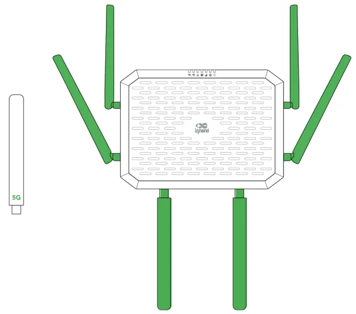

<strong>Figure 2-2 Install the antennas</strong>

### 2.2.3 Install the Device

#### Desktop Installation

1. Ensure the selected desktop area is free from obstructions to provide adequate space for the device.
2. Verify the correct installation of the SIM card, antennas, and power cable.
3. Place the device steadily on the tabletop.

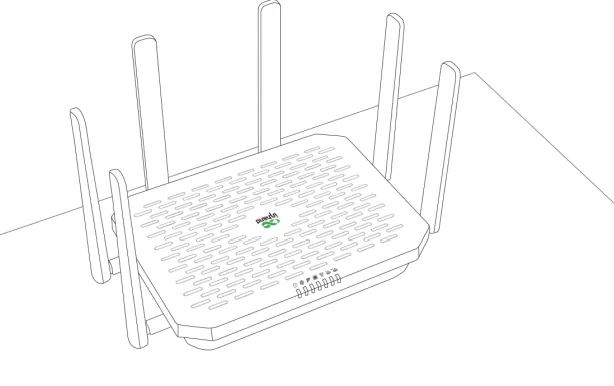

<strong>Figure 2-3 Desktop installation</strong>

#### Wall-Mounted Installation

1. Use a drill or an appropriate tool to pre-drill holes at the marked positions on the wall. Ensure the hole dimensions are suitable for the expansion screws. Insert the expansion screws into the pre-drilled holes and gently tap or rotate them until securely fastened.

<strong>Figure 2-4 Pre-drill holes</strong>

2. The mounting holes at the bottom of the device are L-shaped. Align the mounting holes and push down gently to complete the fixation.

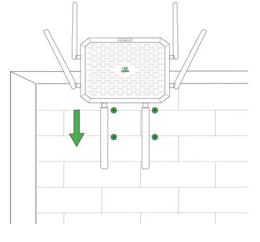

<strong>Figure 2-5 Push the device</strong>

### 2.2.4 Power Cable Installation

Insert one end of the power adapter into the power outlet and the other end into the device's power interface, then flip the power switch. If the power switch is on, the Power LED will turn on.

<strong>Figure 2-6 Power on the device</strong>

## 2.3 Quick Check

After installation is complete, perform the following checks:

- [ ] For desktop installation: ensure the device is stable and will not fall due to cable dragging.
- [ ] For wall-mounted installation: ensure the device is securely mounted.
- [ ] Confirm the power cord is in good contact and meets safety requirements.
- [ ] Turn on the power switch and confirm the device powers on normally (Power LED is on).
- [ ] Confirm the System LED indicates normal operation (steady green after startup).

---

# Chapter 3 Common Scenario Configuration

## 3.1 Cellular Internet Access

**Goal**: Access the Internet via 4G/5G cellular network.

**Prerequisites**: SIM card inserted, antennas installed, device powered on.

**Estimated Time**: About 5 minutes.

**Operation Steps**:

1. Insert the SIM card and attach all cellular antennas.
2. Power on the device and wait for the System LED to turn steady green.
3. Connect a PC to the device's LAN port with an Ethernet cable, or connect to the device's Wi-Fi.
4. Open a web browser and enter the default address `192.168.2.1` in the address bar.
5. Enter the username and password (refer to the device label) to log in to the web management interface.
6. Navigate to [Internet] → [Uplink Table]. Click the "Edit" button next to "Cellular" to configure dial-up parameters. The dial-up function is enabled by default.
7. If the connection is not established within a few minutes, re-enable the dial-up option and verify the APN parameters with the operator.

<strong>Figure 3-1 Web login</strong>

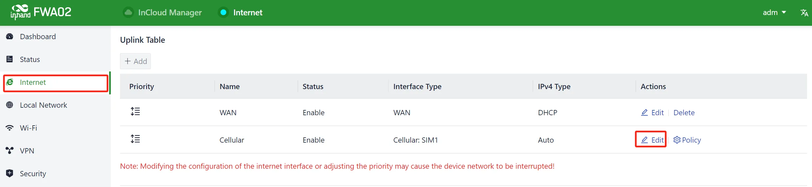

<strong>Figure 3-2 Uplink table</strong>

<strong>Figure 3-3 Configure the APN parameters</strong>

**Verification Method**:

1. Navigate to [Dashboard] → [Interface Status]. The device has successfully connected to the Internet when the "Cellular" icon turns green.
2. Click the "Cellular" icon to view signal strength, IP address, and data usage.

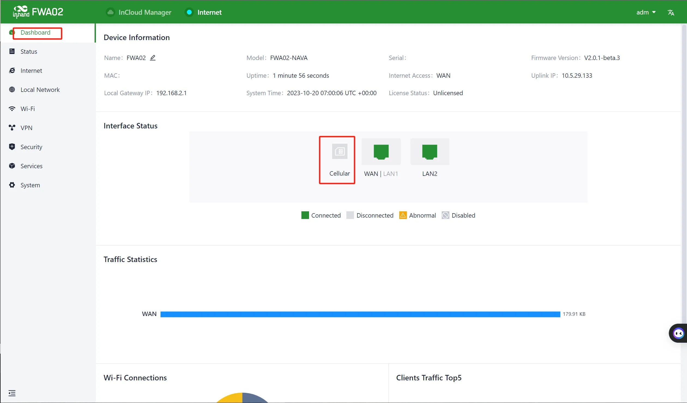

<strong>Figure 3-4 Check the cellular interface</strong>

**Common Issues**:

- Network connection failure: check whether the SIM card is correctly inserted and whether the APN parameters match the operator's requirements.
- Data sending/receiving abnormal: check signal strength and data plan balance.

## 3.2 Wired Internet Access

**Goal**: Access the Internet via a wired WAN connection.

**Prerequisites**: Upstream network device available, Ethernet cable ready, device powered on.

**Estimated Time**: About 5 minutes.

**Operation Steps**:

1. Power on the device.
2. Connect the device's WAN/LAN1 port to the upstream network device with an Ethernet cable.
3. Connect a PC to the device's LAN2 port with an Ethernet cable.
4. The LAN port has the DHCP server enabled by default. Once connected, the PC should automatically obtain an IP address. Verify that the PC and the 5G FWA02 are on the same subnet (e.g., `192.168.2.x`).
5. If the PC fails to obtain an IP address automatically, configure a static IP with the following settings:
   - IP Address: `192.168.2.x` (choose an available address between `192.168.2.2` and `192.168.2.254`)
   - Subnet Mask: `255.255.255.0`
   - Default Gateway: `192.168.2.1`
   - DNS Server: `8.8.8.8` (or the DNS provided by the ISP)
6. Open a web browser and enter the default address `192.168.2.1` in the address bar. Enter the username and password (refer to the device label) to access the web management interface.
7. Navigate to [Internet] → [Uplink Table] → [Edit] to review or configure WAN parameters. The device enables DHCP client mode on the WAN port by default. Wait a few minutes for the device to go online.

<strong>Figure 3-5 Web login interface</strong>

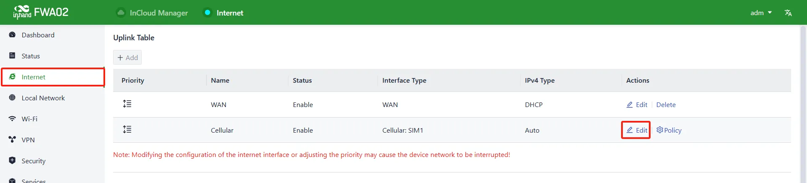

<strong>Figure 3-6 Edit the uplink interface</strong>

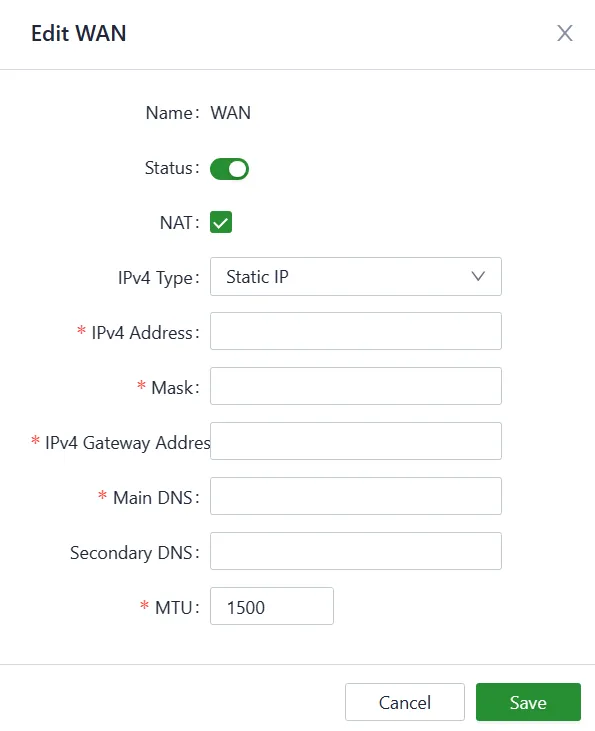

<strong>Figure 3-7 Configure the uplink parameters (DHCP)</strong>

<strong>Figure 3-8 Configure the uplink parameters (Static IP / PPPoE)</strong>

**Verification Method**:

1. Navigate to [Dashboard] → [Interface Status]. The device connects to the Internet successfully when the "WAN" icon turns green.
2. Use the Ping tool on the [System] → [Tools] page to verify network connectivity.

<strong>Figure 3-9 Check the network connectivity</strong>

**Common Issues**:

- WAN connection failure: confirm the upstream device has the DHCP server enabled, or configure a static IP/PPPoE as required.
- PC cannot access the Internet: confirm the PC has obtained a correct IP address in the `192.168.2.x` range.

## 3.3 Cloud Platform Management

**Goal**: Register and manage the device on the InCloud Manager platform for remote monitoring and configuration.

**Prerequisites**: Device connected to the Internet, valid InCloud Manager account.

**Estimated Time**: About 10 minutes.

**Operation Steps**:

1. Open a web browser and visit [https://star.inhandcloud.com](https://star.inhandcloud.com). Complete registration and log in. (Chrome browser is recommended.)

<strong>Figure 3-10 InCloud Manager login page</strong>

2. After registering, log in to the cloud platform using the registered email. Navigate to the "Security Settings" page to change the password and link a mobile phone number.

<strong>Figure 3-11 Bind a mobile phone number</strong>

3. Log in to the InCloud Manager platform, go to [Device], and click "Add" in the navigation menu. Fill in the device serial number and MAC address to add it.

<strong>Figure 3-12 Add a device</strong>

4. Alternatively, log in to the InCloud mobile APP, go to the [Device] page, click the menu button in the upper right corner, and select [Add Device]. Scan the QR code on the FWA02 nameplate to add the device.

5. Once the device is added to the platform, remote management features such as status monitoring, configuration push, firmware upgrade, and log download become available.

**Verification Method**:

1. On the InCloud Manager [Device] page, confirm the device status is "Online".
2. Click the device name to enter the details page and confirm real-time data such as interface status and traffic usage are displayed.

**Common Issues**:

- Device fails to go online: verify the device has Internet access, and confirm the serial number and MAC address entered on the platform are correct.
- Cannot add device: check whether the device already exists under another account.

---

# Chapter 4 Function Description and Parameter Reference

## 4.1 Monitoring

Once the device is registered on the InCloud Manager platform, remote management and monitoring are available. The platform allows viewing of real-time status information from the device's local interface while managing it from anywhere.

### 4.1.1 Overview of the Device

In the "Devices" section, click the "Device Name" to access the device's details page.

#### Overview

Click the "Overview" sub-menu to view the system summary. On this page, key device information, interface status, uplink connectivity, and MQTT connection details can be checked.

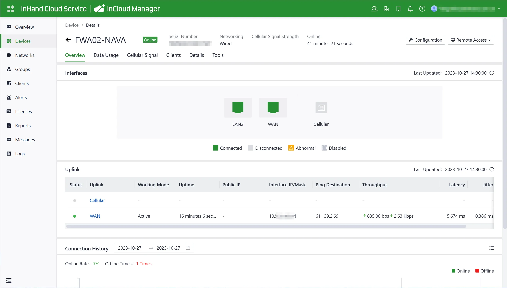

<strong>Figure 4-1 View the device</strong>

#### Data Usage

On this page, real-time traffic consumption and historical usage trends for each WAN link can be monitored.

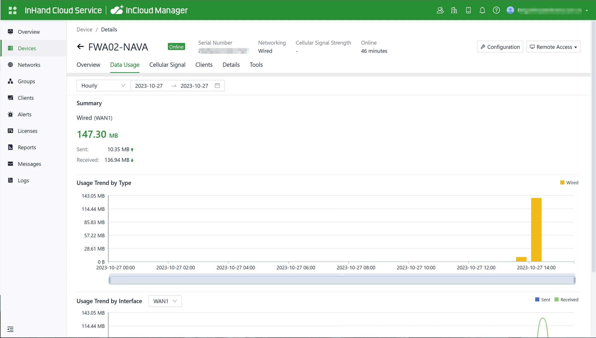

<strong>Figure 4-2 Check the traffic data usage record</strong>

#### Cellular Signal

Within this section, key cellular signal metrics over time can be monitored. Graphs are provided for RSSI, RSRP, RSRQ, and SINR, allowing tracking of signal strength and quality trends.

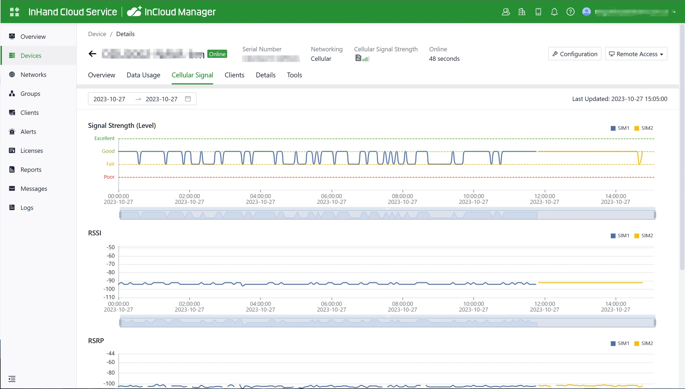

<strong>Figure 4-3 Cellular signal</strong>

### 4.1.2 Local Device Information

Through the platform's "Remote Access" feature, real-time viewing and configuring of devices is supported. Select the target device, click "Remote Access," and the device's local login interface will open.

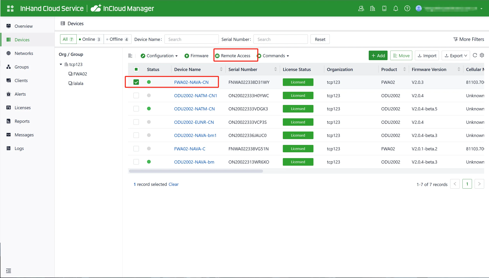

<strong>Figure 4-4 Remote access entry</strong>

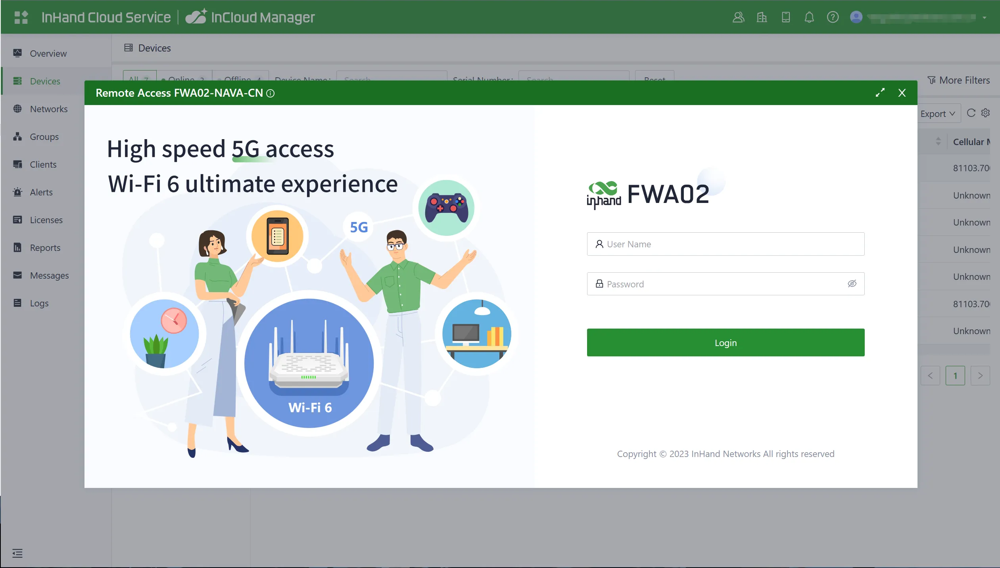

<strong>Figure 4-5 Access local device login page</strong>

#### Device Information

In the [Dashboard] → [Device Information] interface, details about the device name, model, S/N, firmware version, and other information can be checked.

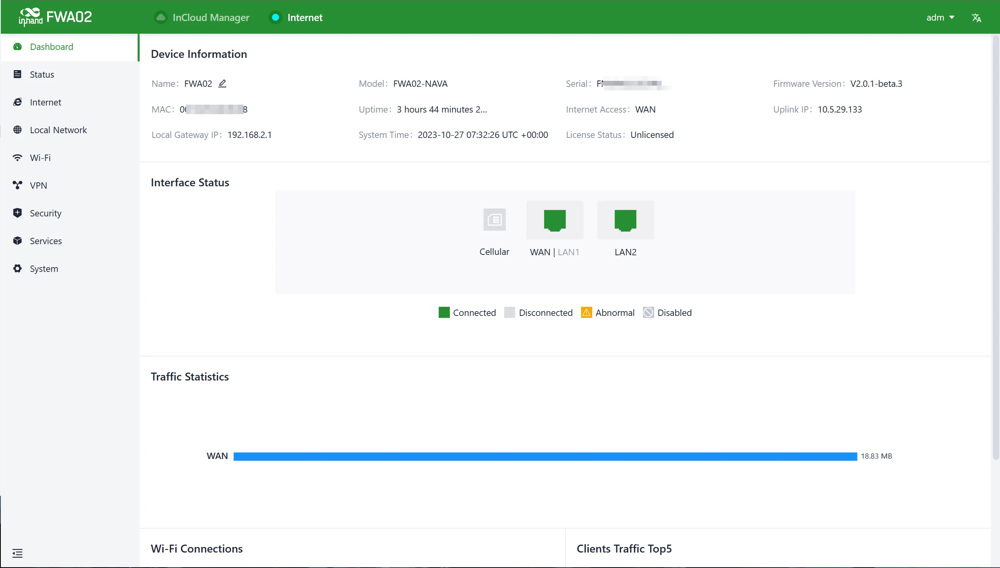

<strong>Figure 4-6 Device information panel</strong>

- Name: Identifies the device's name. The default is "FWA02", but it can be modified.
- MAC Address: Identifies the device's physical MAC address.
- Local Gateway IP: The default subnet gateway address for the device.
- Model: The specific model of the device, which helps determine if it supports cellular and WLAN features.
- Uptime: The device's running time since power-up.
- System Time: Displays the device's time zone and system time.
- Serial: A unique code that identifies the device, which can be used for indexing or adding to a platform account.
- Internet Access: The upstream interface used for device connectivity.
- License Status: Information about the license applied to the device, which may include the InCloud Manager Basic or Professional version.
- Firmware Version: The current software version used by the device.
- Uplink IP: The IP address of the upstream interface used for device connectivity.

#### Interface Status

In the [Dashboard] → [Interface Status] feature, the operational status of each interface can be visually checked. By clicking on the interface icon, detailed information about each interface is displayed in a pop-up box on the right side.

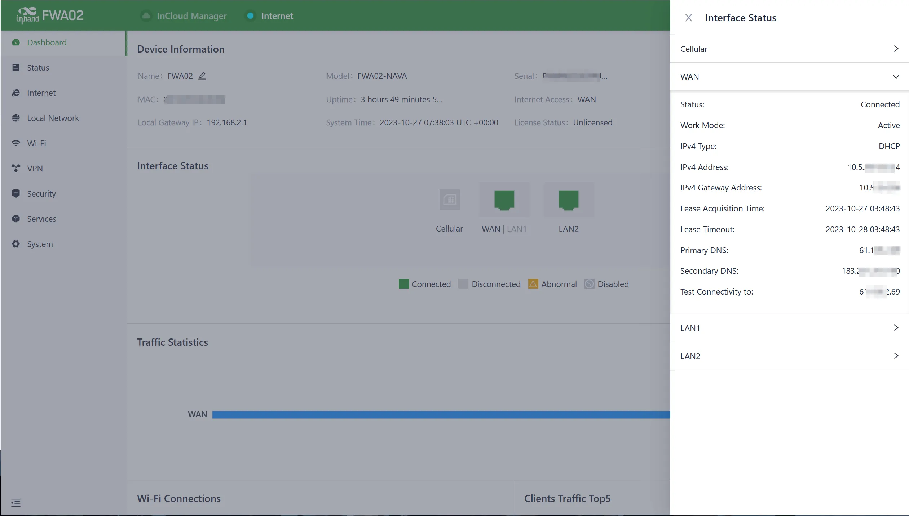

<strong>Figure 4-7 Detailed port information</strong>

#### Traffic Statistics

The [Dashboard] → [Traffic Statistics] feature monitors the usage of traffic on each upstream interface since the router was powered on. The traffic statistics data resets after a device reboot. Historical traffic records can be viewed on the corresponding device's details page in the InCloud Manager platform.

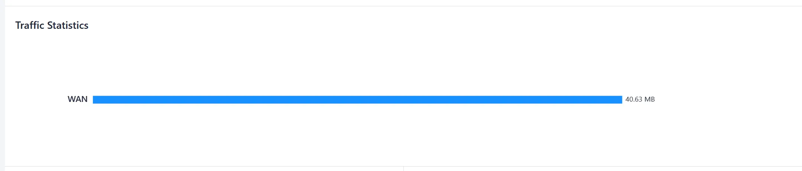

<strong>Figure 4-8 Traffic statistics</strong>

#### Wi-Fi Connections

In the [Dashboard] → [Wi-Fi Connections] feature, the number of currently enabled SSIDs on the 5G FWA02 and the number of clients connected per SSID can be viewed.

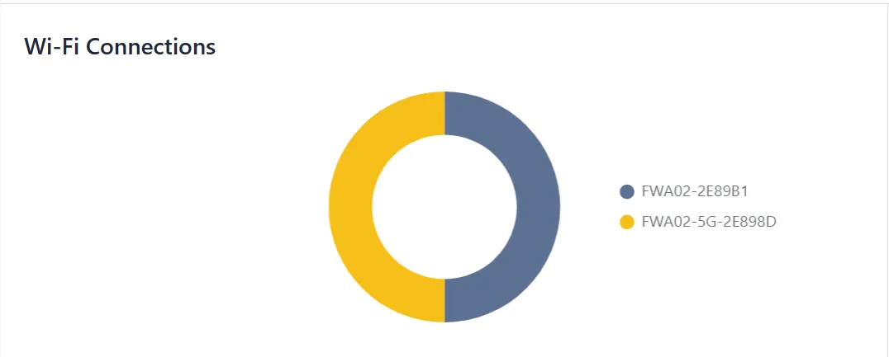

<strong>Figure 4-9 Wi-Fi connections panel</strong>

#### Client Traffic Top 5

In the [Dashboard] → [Top 5 Client Traffic] feature, the current ranking of client traffic usage for devices connected to the router can be viewed. It displays up to 5 records, and when a client disconnects, its statistical data is cleared.

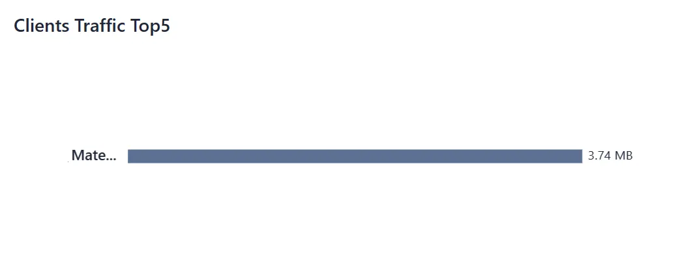

<strong>Figure 4-10 Top 5 clients ranked by traffic usage</strong>

#### Link Monitor

The health status of upstream links and information such as throughput, latency, packet loss, and signal strength for each interface can be monitored through the [Status] → [Link Monitoring] feature.

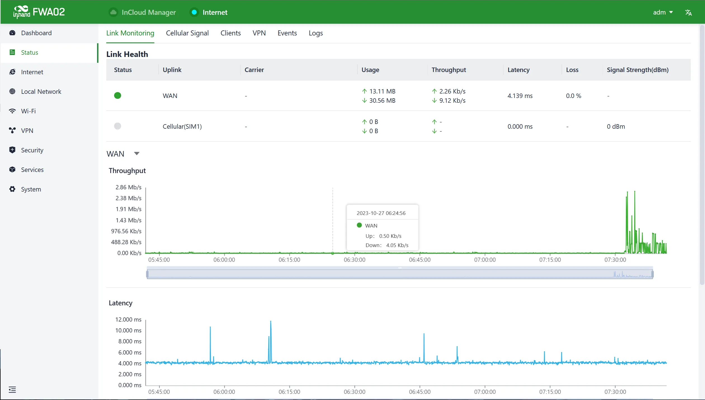

<strong>Figure 4-11 Link monitor panel</strong>

#### Cellular Signal

The signal strength as well as parameters like RSSI, SINR, RSRP, and more of the cellular dial-up can be checked through the [Status] → [Cellular Signal] feature.

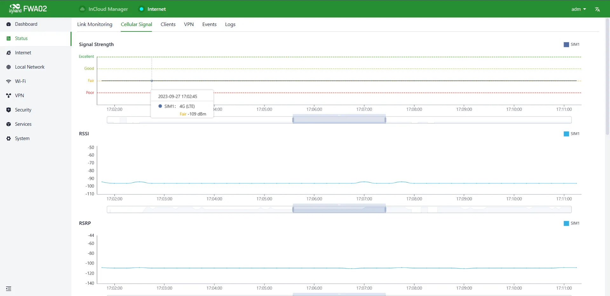

<strong>Figure 4-12 Cellular signal panel</strong>

#### Clients

Detailed information about wired/wireless clients connected to the router, including name, IP address, MAC address, VLAN, connected subnet, traffic usage, online duration, and more can be accessed through the [Status] → [Clients] feature.

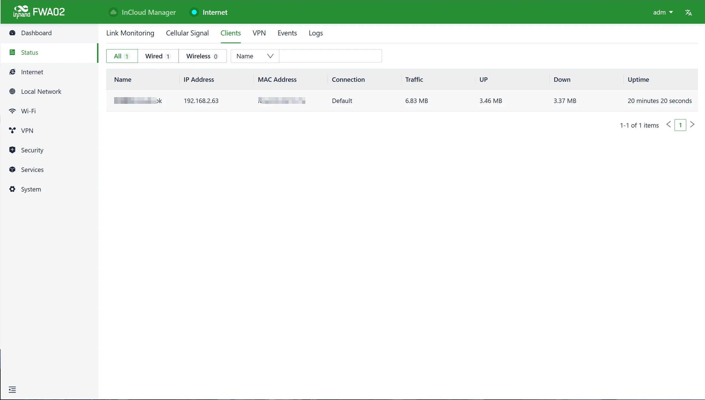

<strong>Figure 4-13 Clients panel</strong>

#### VPN

Information about IPSec VPN and L2TP VPN, including status, traffic, and the duration of the most recent connection, can be viewed through the [Status] → [VPN] feature.

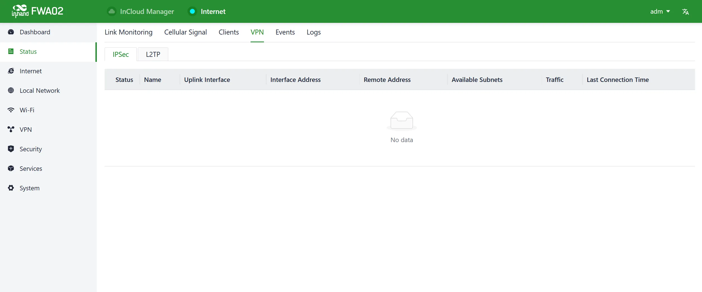

<strong>Figure 4-14 VPN status panel</strong>

#### Events

The device records event logs, including user login, configuration changes, link changes, reboot, and other events. This information can be checked in the [Status] → [Events] interface. Specific events on a particular date can be viewed by setting the start and end dates or choosing the event type.

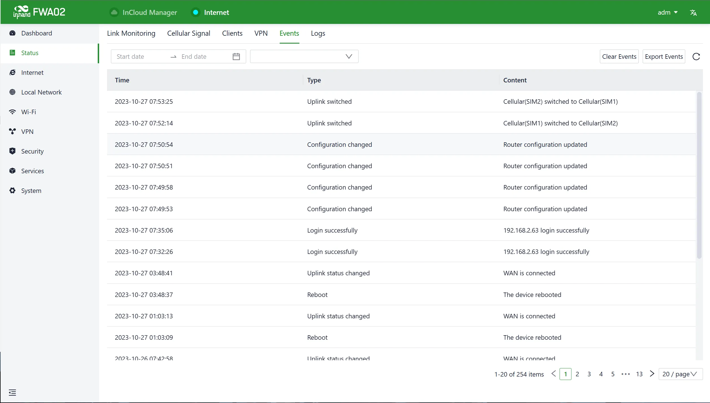

<strong>Figure 4-15 Events interface</strong>

#### Logs

The device will record the logs generated during operation to facilitate fault localization and diagnosis when the device encounters malfunctions.  

The device records the logs generated during operation to facilitate fault localization and diagnosis when malfunctions occur. The recorded logs can be checked in the [Status] → [Logs] interface. Specific logs on a particular date can be checked by setting the start and end dates or setting a keyword.

<strong>Figure 4-16 Logs interface</strong>

- Download Logs: Download the device's operational logs.
- Download Diagnostic Logs: Download the device's diagnostic logs, which include system operation logs, device information, and device configurations.
- Clear Logs: Clear the device's operational logs; this does not clear the device's diagnostic logs.

## 4.2 Internet

Navigate to [Internet] in the left-hand menu to review and configure the device's uplink interfaces and multi-link operation mode.

> **Caution**: Modifying uplink settings may temporarily disrupt network connectivity. Proceed with caution.

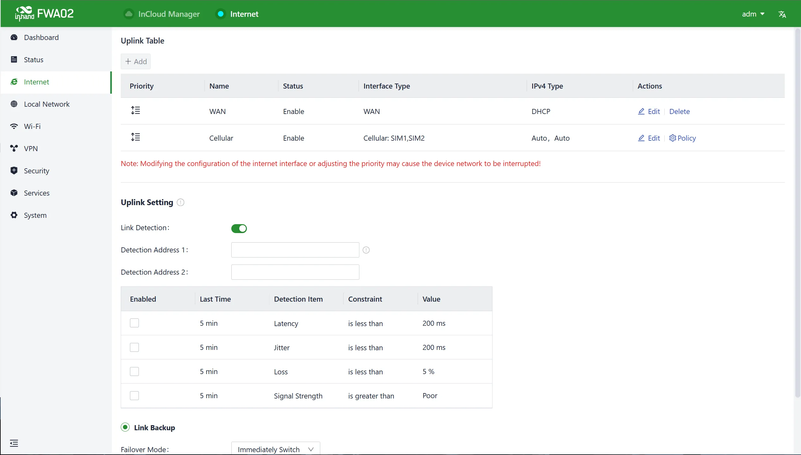

<strong>Figure 4-17 Internet page</strong>

### 4.2.1 Uplink Table

WAN1 and Cellular interfaces can be edited, and WAN2 and Wi-Fi (STA) interfaces can be added/edited/deleted in the [Internet] → [Uplink Table]. The "Priority" icons can be dragged to adjust the priority of each interface. Priorities are arranged from top to bottom, determining the current upstream interface used by the device.

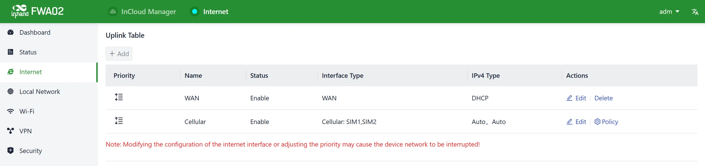

<strong>Figure 4-18 Uplink table</strong>

> **Caution**: The WAN interface will be switched to the LAN1 interface. Routing, policy routing, inbound/outbound rules, port forwarding, DDNS, and VPN related to the WAN interface will be deleted.

The WAN port of the device supports three different Internet connection modes.

1. **DHCP**: The DHCP client is enabled on the WAN port by default. If the upstream device connected to the WAN port does not have the DHCP server enabled, the device cannot connect to the Internet immediately.

<strong>Figure 4-19 DHCP client</strong>

2. **Static IP**: A static IP address obtained from the ISP or upstream network device can be assigned manually.

<strong>Figure 4-20 Set the static IP</strong>

3. **PPPoE**: The PPPoE service can be set on the WAN port, allowing the device to dial up to the Internet through the broadband service.

<strong>Figure 4-21 Set the PPPoE service</strong>

The Cellular interface supports three SIM card working modes. The SIM card working mode and other dial-up parameters can be configured in [Internet] → [Uplink Table] → [Cellular].

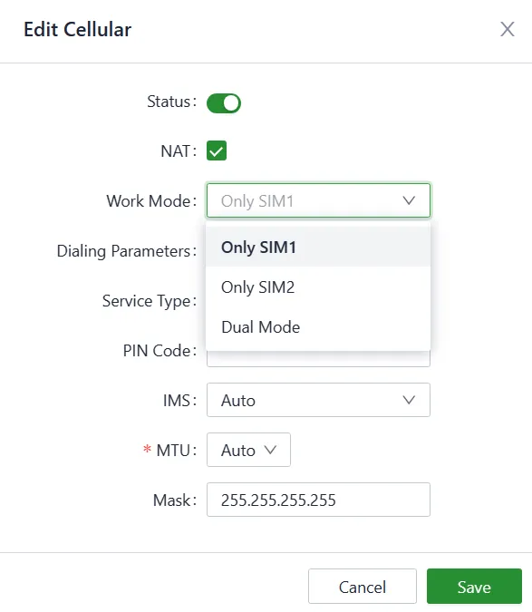

<strong>Figure 4-22 Configure the dial-up parameters</strong>

### 4.2.2 Uplink Settings

Link detection-related settings can be configured in the [Internet] → [Uplink Setting] feature, and the collaboration mode between various uplink interfaces can be configured.

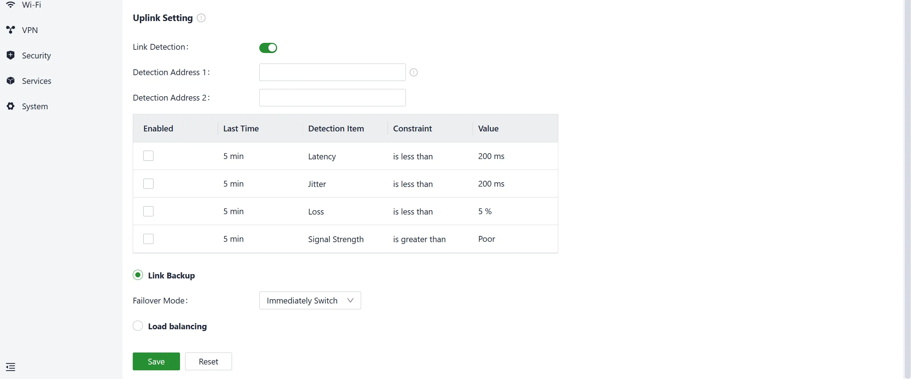

<strong>Figure 4-23 Uplink settings</strong>

"Link detection" is enabled by default. In a private network environment, manually configure the address in "Test Connectivity to" or disable the link detection function to prevent the cellular interface from malfunctioning.

> **Caution**: If link detection is disabled, latency, jitter, loss, and signal strength will not be displayed in [Status].

When multiple upstream links are available, the desired working mode for multi-link operation can be selected based on requirements:

- **Link Backup**: The device monitors the enabled items and triggers a link switch when any item exceeds the threshold. If no item is enabled, the link switch is triggered based on priority only.
- **Load Balancing**: The device forwards and distributes traffic to all operational upstream links.

## 4.3 Local Network

The LAN network of the device can be configured in [Local Network] → [Local Network List].

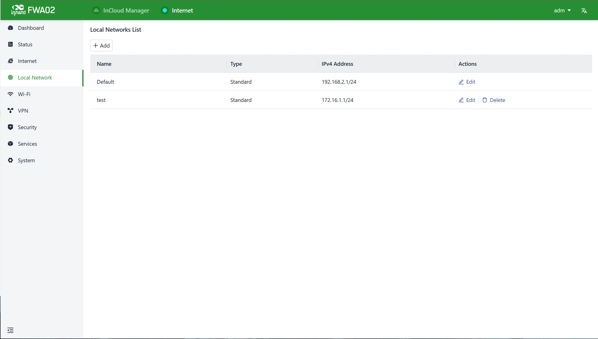

<strong>Figure 4-24 Local network interface</strong>

The LAN network parameters can be set by clicking the "Edit" button.

<strong>Figure 4-25 Configure the LAN network parameters</strong>

## 4.4 Wi-Fi

Wi-Fi is a widely used wireless communication technology that allows computers, smartphones, tablets, and other devices to connect to the Internet or a local network. Wi-Fi technology enables devices to transmit data within a certain range using wireless signals, providing the convenience of accessing networks without physical connections.

The 5G FWA02 can function as an access point (AP) and provide multiple SSIDs for wireless network access, allowing customization of different SSIDs for various purposes and configurations.

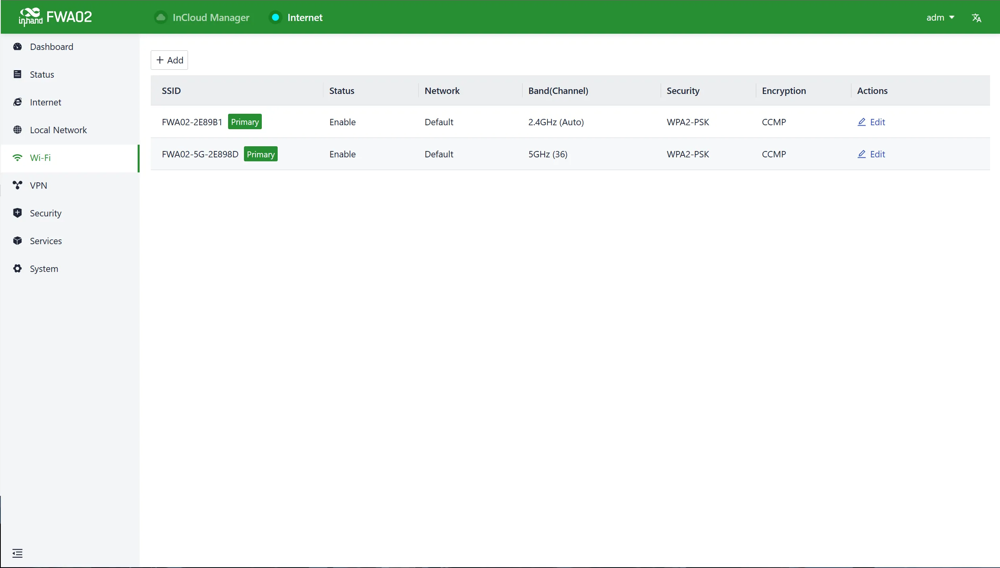

<strong>Figure 4-26 Wi-Fi interface</strong>

The parameters can be configured by clicking the "Edit" button.

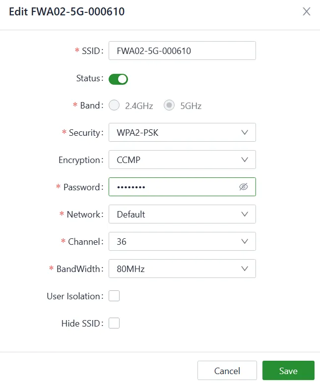

<strong>Figure 4-27 Set the SSID's parameters</strong>

**Notes**:

1. The device comes with two default main SSIDs for 2.4 GHz and 5 GHz. The frequency bands of these main SSIDs cannot be modified or deleted.
2. Once an SSID is added, its frequency band cannot be modified, and the channel will automatically align with the channel of the corresponding main SSID.
3. The FWA02 series products only support AP mode and do not support Wi-Fi STA.

## 4.5 VPN

A VPN (Virtual Private Network) is designed to create a secure and private network within a public network, enabling encrypted communication. With a VPN router, remote access is made possible by encrypting data packets and modifying their destination addresses. VPN can be implemented using server-based, hardware-based, or software-based solutions. In comparison to traditional DDN private lines or frame relays, VPN offers a more secure and convenient remote access solution.

### 4.5.1 IPSec VPN

IPsec (Internet Protocol Security) VPN is a protocol suite designed to enhance network communication security. Its primary purpose is to protect the transmission of data through encryption and authentication. It is widely used for establishing secure remote access, site-to-site connections, and virtual private networks (VPNs).

A new IPSec VPN item can be created via [VPN] → [IPSec VPN] → [Add]. The following parameters must be set correctly.

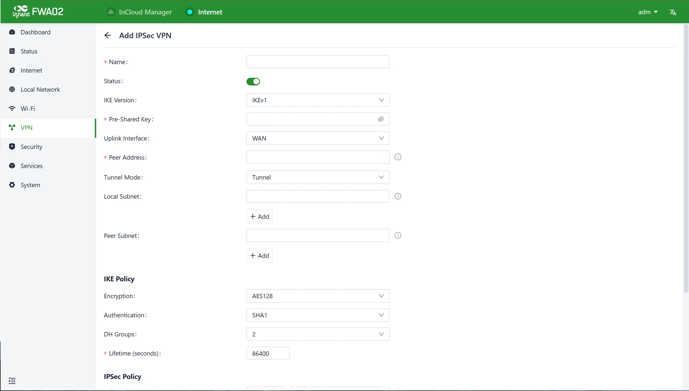

<strong>Figure 4-28 Set the IPSec VPN's parameters</strong>

1. **Name**: Specify the name of the IPSec VPN created on the device, used for local VPN management.
2. **IKE Version**: Specify the version of the IKE protocol used on this device. IKEv1 and IKEv2 are optional.
3. **Pre-Shared Key**: Specify the authentication key for IKE negotiation, which must be consistent on both sides.
4. **Uplink Interface**: Specify the local uplink interface used to establish the tunnel.
5. **Peer Address**: Specify the IP address of the peer device. The peer address must be set to `0.0.0.0` if the device works as an IPSec VPN server.
6. **Tunnel Mode**: Specify the IP packet encapsulation mode on the IPSec VPN tunnel. Tunnel mode and transport mode are optional.
7. **Local Subnet**: Specify the IP address segment of the traffic to be sent out by the device through the IPSec VPN tunnel.
8. **Peer Subnet**: Specify the IP address segment used for communication on the remote client.
9. **IKE Policy**:
   - Encryption: Specify the encryption algorithm for IKE.
   - DH Groups: Specify the DH key exchange mode.
   - Lifetime: Specify the lifetime of the IKE SA. `86400` is set by default.
10. **IPSec Policy**:
    - Security Protocol: Specify the security protocol used for ESP.
    - Encryption: Specify the encryption algorithm of the ESP protocol.
    - Authentication: Specify the authentication algorithm for ESP.
    - PFS Groups: Specify the Perfect Forward Secrecy (PFS) mode, which improves communication security through an additional key exchange in Phase 2 negotiation.
    - Lifetime: Specify the lifetime of the IPSec SA. `86400` is set by default.

### 4.5.2 L2TP VPN

The Layer 2 Tunneling Protocol (L2TP) is a Layer 2 VPN protocol designed to provide secure point-to-point or site-to-site virtual private network (VPN) connections. It is commonly used for remote access and branch office connectivity, establishing secure communication channels for users or networks, thus ensuring the privacy and integrity of data transmission.

A new L2TP VPN can be added or an existing one configured in [VPN] → [L2TP VPN].

#### Server

Typically, the L2TP server is strategically deployed at the enterprise's headquarters to facilitate remote access for employees. The server can be configured in [VPN] → [L2TP VPN] → [Server].

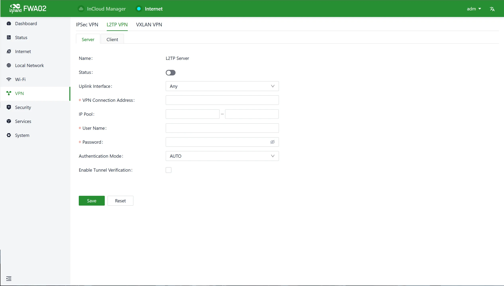

<strong>Figure 4-29 L2TP VPN interface</strong>

Configure the following parameters based on actual network requirements:

- **Name**: The name of the L2TP server, which cannot be changed.
- **Status**: Enable or disable this L2TP server by clicking the switch.
- **Uplink Interface**: Specify the uplink interface to establish a tunnel from the L2TP server.
- **VPN Connection Address**: Specify the gateway address for the L2TP VPN client.
- **IP Pool**: The system assigns an IP address to the L2TP client from the specified IP address pool.
- **Username/Password**: Specify the username and password for L2TP negotiation, which must be consistent on both ends of the tunnel.
- **Authentication Mode**: Specify the authentication mode for the L2TP tunnel.
- **Enable Tunnel Authentication**: Ensure both ends of the tunnel are configured with the same username and password for this option.

#### Client

The L2TP client parameters can be configured to establish a tunnel with a remote L2TP server in [VPN] → [L2TP VPN] → [Clients].

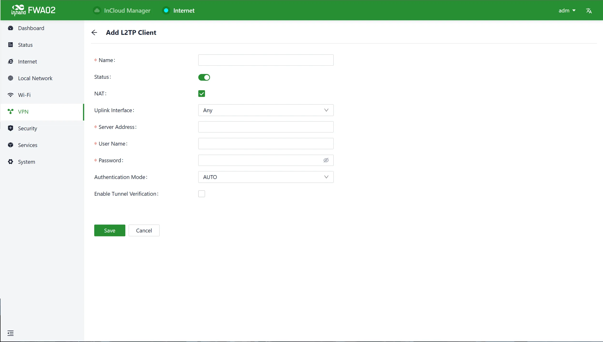

<strong>Figure 4-30 L2TP VPN client interface</strong>

Configure the following parameters based on actual network requirements:

- **Name**: Specify the local name of the L2TP client tunnel.
- **Status**: Enable or disable this L2TP client by clicking the switch.
- **NAT**: Enable or disable the NAT function by clicking the switch.
- **Uplink Interface**: Specify the uplink interface to establish a tunnel with a remote L2TP server.
- **Server Address**: Specify the IP address set by the remote L2TP server.
- **Username/Password**: Specify the username and password for L2TP negotiation, which must be consistent on both ends of the tunnel.
- **Authentication Mode**: Specify the authentication mode for the L2TP tunnel.
- **Enable Tunnel Verification**: Ensure both ends of the tunnel are configured with the same server's name and verification key as this option is enabled.

### 4.5.3 VXLAN VPN

VXLAN (Virtual Extensible LAN) is essentially a tunneling technology that establishes a logical tunnel over an IP network between the source and destination network devices. It achieves data transmission and forwarding by encapsulating user-side packets in a specific manner.

Click the "Add" button under [VPN] → [VXLAN VPN] to create a new VXLAN VPN.

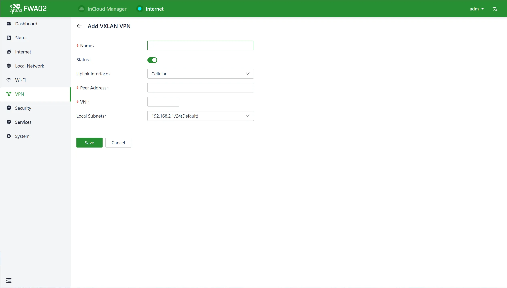

<strong>Figure 4-31 Add a VXLAN VPN</strong>

- **Name**: Set the name for this VXLAN VPN network.
- **Upstream Interface**: The outbound interface used to establish a VXLAN tunnel with other devices.
- **Peer Address**: Configure the IP address of the peer device with which this device needs to establish a VXLAN VPN network.
- **VNI (Virtual Network Identifier)**: An identifier for the VXLAN network; one VNI represents one tenant.
- **Local Subnet**: Define the address range acquired by local client devices when accessing the network.

## 4.6 Security

In the [Security] menu, advanced features related to firewalls, policy routing, and traffic shaping can be configured.

### 4.6.1 Firewall

The firewall currently includes functions such as inbound rules, outbound rules, port forwarding, MAC address filtering, domain name filtering, and NAT.

**Inbound Rules**

Traffic accessing the internal network from the outside is restricted by configured inbound rules, which forbid all traffic through by default.

**Outbound Rules**

Traffic accessing the external network from the inside is restricted by configured outbound rules, which allow all traffic through by default.

Traffic entering and leaving can be controlled based on interfaces using the [Security] → [Firewall] → [Inbound Rules/Outbound Rules] feature. For example, if a large volume of attack traffic is received from a specific source IP address, inbound firewall rules can be used to limit the traffic from that IP address.

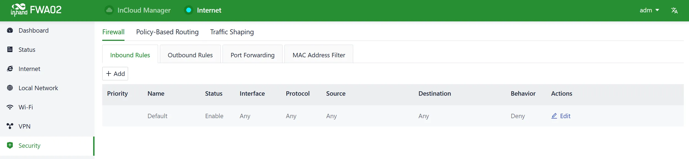

<strong>Figure 4-32 Set the inbound/outbound rules</strong>

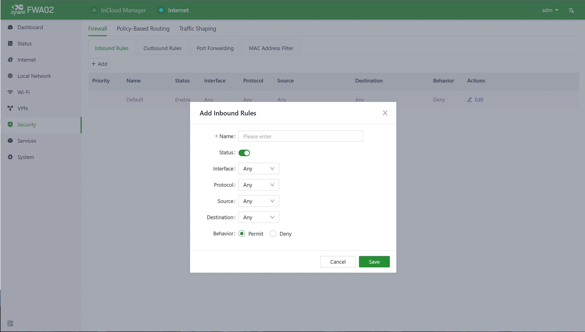

<strong>Figure 4-33 Add an inbound rule</strong>

The following parameters must be configured properly:

1. **Name**: Set the local identifier of the inbound rule.
2. **Status**: Enable or disable this rule by clicking the switch.
3. **Interface**: Set the forwarding interface for traffic. In the inbound direction, the outbound interface is generally the upstream interface of the device.
4. **Protocol**: Configure the protocol type of packets to be matched. Options: Any, UDP, TCP, ICMP, Custom.
5. **Source**: Set the source IP address of packets to be matched, supporting an IP address or retaining the default option Any.
6. **Destination**: Set the destination IP address of the packets to be matched, supporting entering an IP address or retaining the default option Any.
7. **Behaviour**: Set the behaviour if the traffic matches the configured rules.

**Port Forwarding**

Port forwarding, also known as port mapping and port redirection, is the practice of redirecting network packets from one network port (or address) to another network port (or address). Port forwarding rules can be configured in [Security] → [Firewall] → [Port Forwarding]. When external traffic accesses a specific port on the router, the device forwards the data to the corresponding port on the internal client, enabling external access to servers within the router's network.

For example, after setting port forwarding rules as shown below, when users from the public network try to access the device's port 2000 on WAN, the system transfers the request to `192.168.1.23:8080` in LAN.

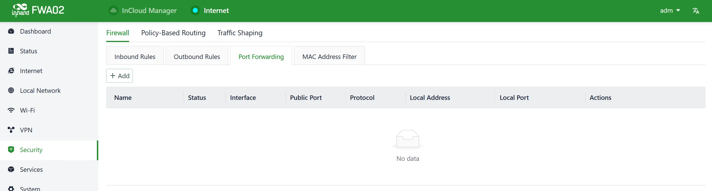

<strong>Figure 4-34 Set the port forwarding rules</strong>

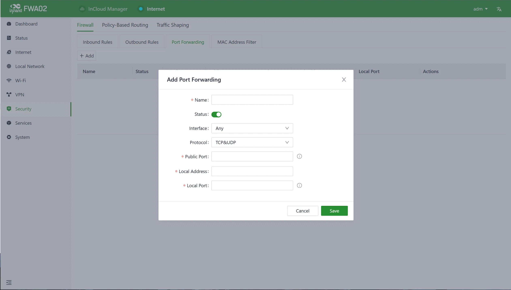

<strong>Figure 4-35 Add a port forwarding rule</strong>

The following parameters must be set properly:

1. **Name**: Set the local identifier of the port forwarding rule.
2. **Status**: Enable or disable this rule by clicking the switch.
3. **Interface**: Set the uplink interface that provides port mapping for internal clients. This interface must be configured with a public IP address.
4. **Protocol**: Set the protocol of the port on which port mapping takes effect. Supports TCP, UDP, and TCP&UDP.
5. **Public Port**: Set the protocol port on the uplink interface to be mapped.
6. **Local Address**: Set the IP address of the target client that external users need to access.
7. **Local Port**: Set the protocol port that external users need to access on the target client.

**NAT**

**SNAT (Source NAT)**: Refers to modifying the source IP address of a data packet. It is typically used when internal hosts access external networks, converting the private IP address of the internal host to a public IP address. This way, the external network sees the public IP address rather than the actual private IP address.

**Application scenario**:
- Internal network accessing external network: For example, when an internal host accesses the Internet through a NAT router, the source IP is changed to the router's public IP address.

**DNAT (Destination NAT)**: Refers to modifying the destination IP address of a data packet. It is typically used to convert the destination address of a packet from an external network to the IP address of an internal device. This allows external networks to access services located within a private network.

**Application scenario**:
- External access to internal servers: For example, forwarding external requests to a specific service provided by an internal server. Commonly used for web servers, FTP servers, remote desktop access, etc.

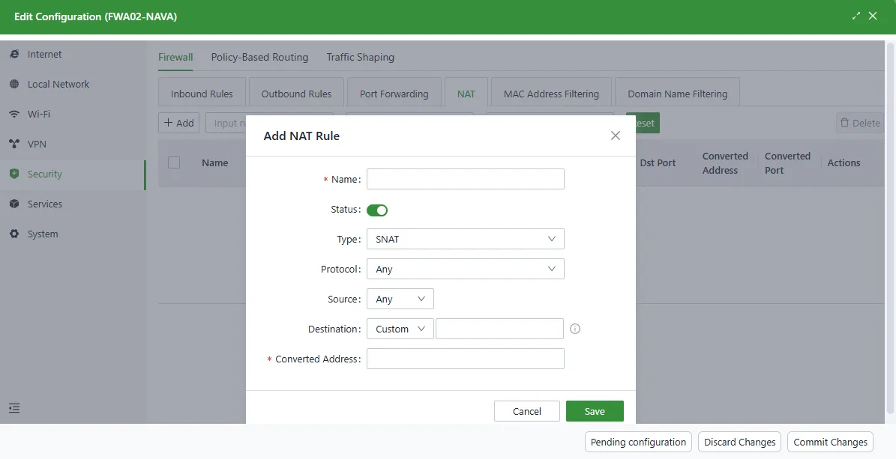

<strong>Figure 4-36 Add a NAT rule</strong>

1. **Name**: The name of the NAT rule.
2. **Status**: The on/off switch for the NAT function.
3. **Protocol**: The protocols affected by NAT conversion. Supports TCP, UDP, and TCP&UDP.
4. **Source**: The upstream interface that provides mapping functionality for internal clients. The upstream interface needs public IP address support.
5. **Public Port**: The port number on the upstream interface that provides mapping.
6. **Local Address**: The address of the target device located under the router that the external network needs to access.
7. **Local Port**: The port of the target device that the external network needs to access. It needs to be consistent with the public port input range.

**MAC Address Filter**

MAC address filtering refers to the practice of blocking or allowing devices to access the Internet based on a list of MAC addresses. This means that internet access requests from devices within the local network can be controlled using the MAC address filtering feature on the router. MAC address filtering rules can be configured in [Security] → [Firewall] → [MAC Address Filtering].

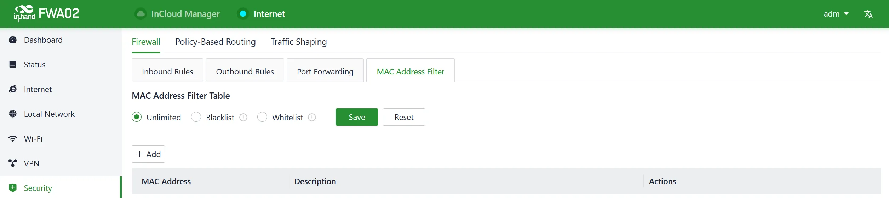

<strong>Figure 4-37 Set the MAC address filter rule</strong>

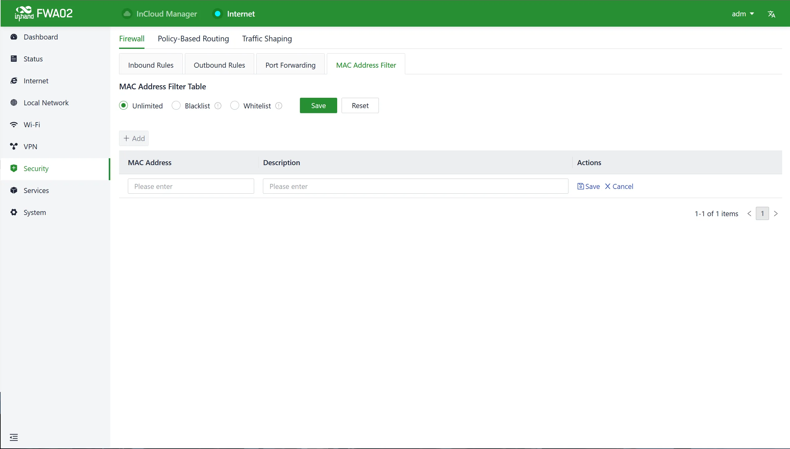

<strong>Figure 4-38 Add a MAC address filter rule</strong>

1. **Blacklist**: Devices in the blacklist will not be able to access the Internet.
2. **Whitelist**: Only devices in the whitelist are allowed to access the Internet.

**Domain Name Filtering**

In this feature, filtering rules for domain names can be set. By default, there are no restrictions.

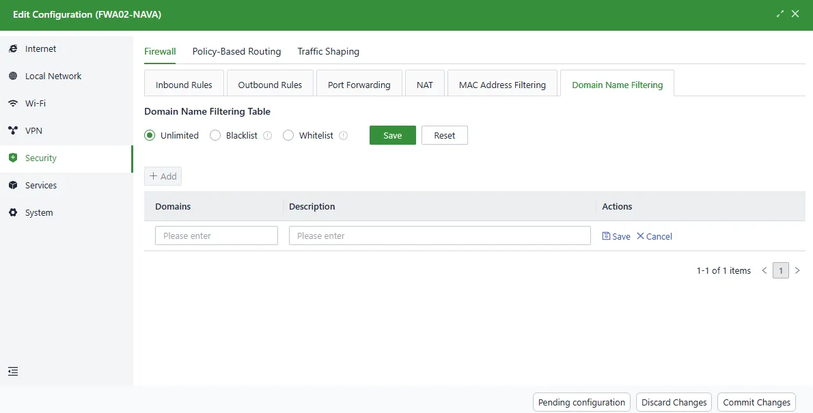

<strong>Figure 4-39 Add a domain name filter rule</strong>

1. **Whitelist**: Only domains on the whitelist are allowed to be accessed.
2. **Blacklist**: Domain addresses on the blacklist will be blocked from access.

### 4.6.2 Policy-Based Routing

Policy-based routing (PBR) allows the device to forward different data flows through different links based on configured policies. This feature enables flexible route selection and control, thus improving link utilization and reducing the operational cost of the enterprise.

Rules can be set in [Security] → [Policy-Based Routing] → [Add/Edit].

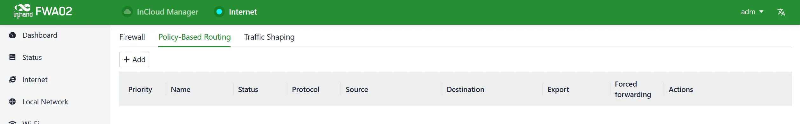

<strong>Figure 4-40 Policy-based routing interface</strong>

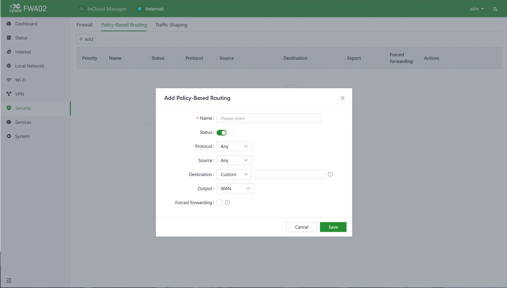

<strong>Figure 4-41 Add a policy-based routing</strong>

The following parameters must be set properly:

1. **Name**: Set the local identifier of the rule.
2. **Status**: Enable or disable this rule by clicking the switch.
3. **Protocol**: Set the protocol of the port. Supports TCP, UDP, and TCP&UDP.
4. **Source**: Set the source IP address of packets to be matched, supporting an IP address or retaining the default option Any.
5. **Destination**: Set the destination IP address of the packets to be matched, supporting entering an IP address or retaining the default option Any.
6. **Output**: Set the traffic egress interface. Options: WAN port and cellular.

### 4.6.3 Traffic Shaping

Create shaping policies to apply per-user controls on a per-protocol basis to optimize the network. This function can also reduce bandwidth for recreational traffic and prioritize bandwidth for critical business traffic.

Traffic shaping rules can be configured in [Security] → [Traffic Shaping] → [Add/Edit].

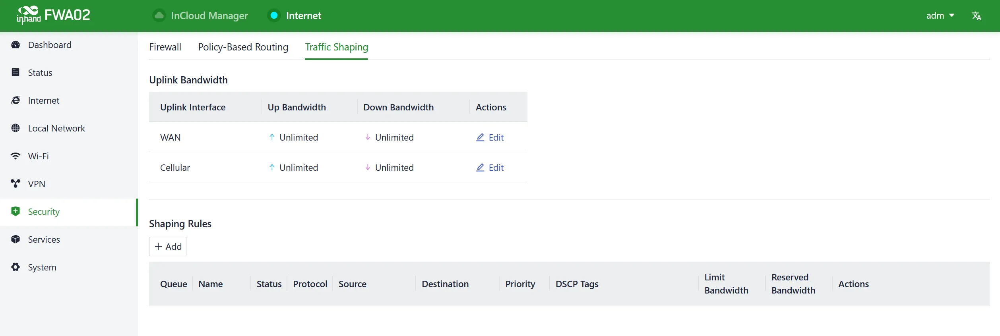

<strong>Figure 4-42 Traffic shaping interface</strong>

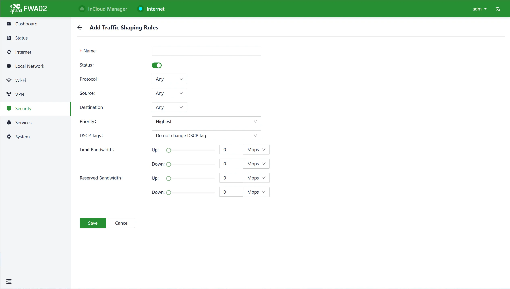

<strong>Figure 4-43 Add a traffic-shaping rule</strong>

Traffic shaping policies consist of a series of rules that are performed in order, similar to custom firewall rules. There are two main components to each rule: the type of traffic to be limited or shaped, and how that traffic should be limited or shaped.

**Notes**:

1. Traffic forwarding priority for unmatched rules is medium.
2. When Limit Bandwidth is set to 0, the system will not limit the bandwidth.
3. The value of Reserved Bandwidth should not be greater than the Limit Bandwidth.

## 4.7 Services

### 4.7.1 Interface Management

The allowed local networks through a specified interface and the interface's speed can be set in the [Services] → [Interface Management] function.

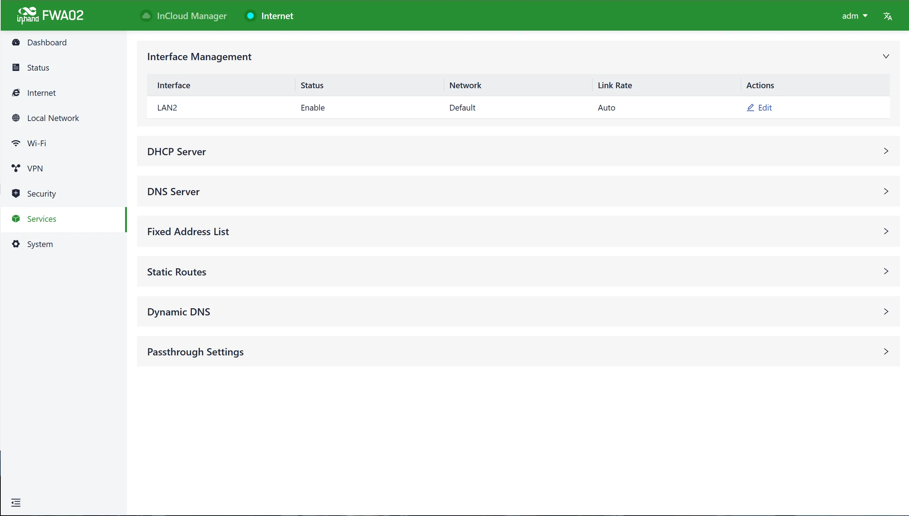

<strong>Figure 4-44 Interface panel</strong>

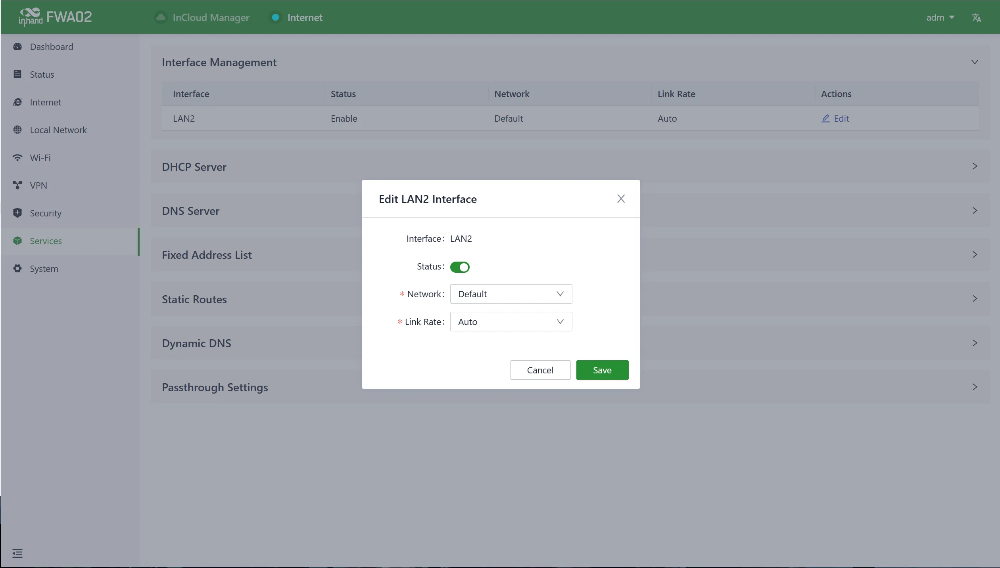

<strong>Figure 4-45 Edit the interface</strong>

### 4.7.2 DHCP Server

The DHCP (Dynamic Host Configuration Protocol) service operates in a client/server communication mode, where clients request IP addresses from servers, and servers respond by assigning IP addresses dynamically to clients.

The DHCP server's IP address pool can be configured using the [Services] → [DHCP Server] feature.

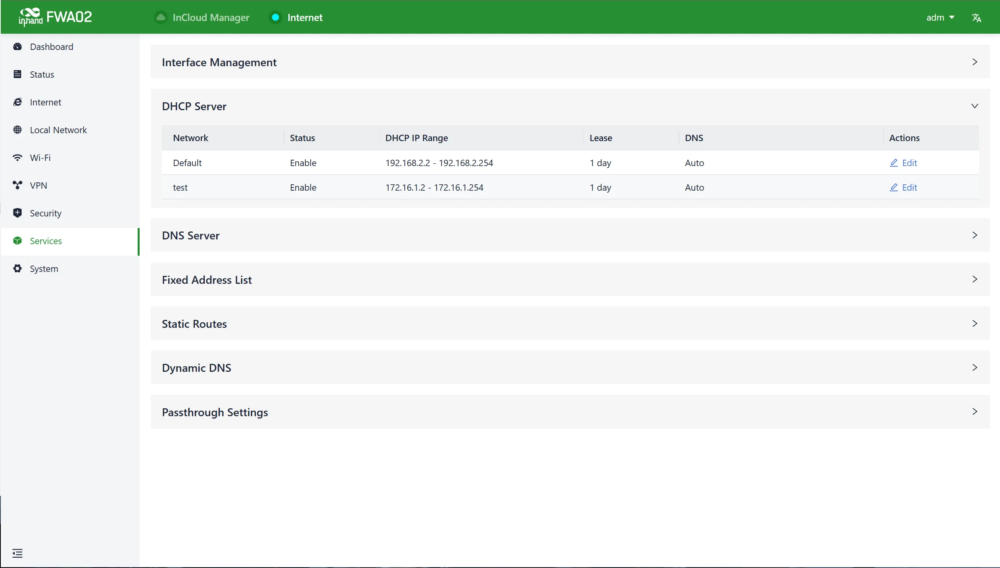

<strong>Figure 4-46 DHCP server panel</strong>

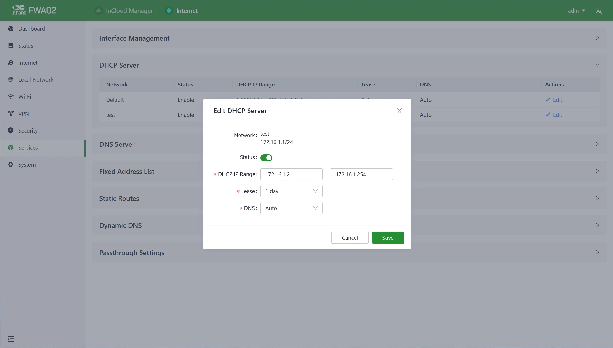

<strong>Figure 4-47 Edit the DHCP server</strong>

### 4.7.3 DNS Server

DNS (Domain Name System) servers are a critical component of the network. They are responsible for translating human-readable domain names (e.g., `www.example.com`) into IP addresses that computers can understand (e.g., `192.168.1.1`). DNS servers act as the Internet's address book, helping computers and devices locate other devices and ensuring information can be correctly transmitted on the network.

When no DNS server address is set in [Services] → [DNS Server], the device uses the DNS addresses obtained from the upstream interface for address resolution. Once DNS server addresses are configured, the specified DNS addresses are used for address resolution.

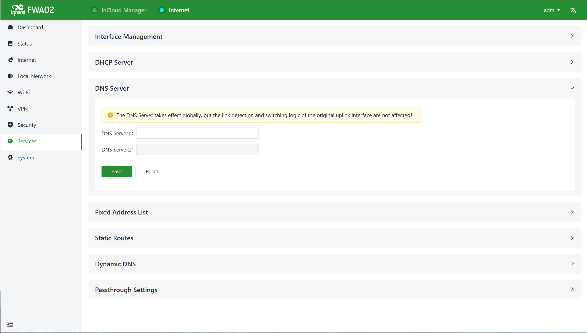

<strong>Figure 4-48 DNS server panel</strong>

### 4.7.4 Fixed Address List

A fixed IP address can be allocated to a device based on its MAC address using the [Services] → [Fixed Address List] feature. This ensures the device receives the same IP address every time it connects to the 5G FWA02.

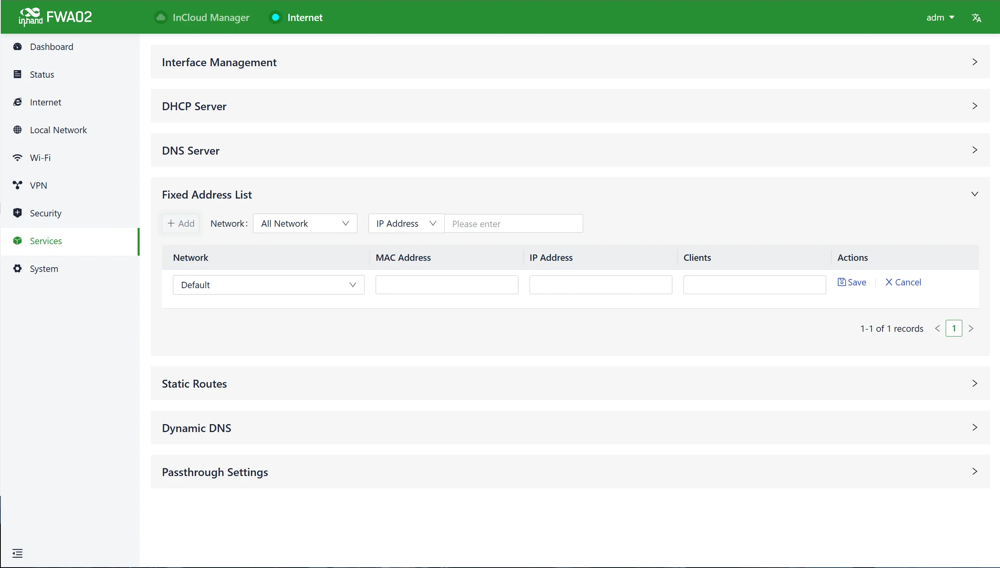

<strong>Figure 4-49 Fixed address panel</strong>

> **Cautions**:
> 1. The addresses available for allocation must fall within the address range of the IP-mode local network, or else the configuration will not take effect.
> 2. When a local network is deleted, all fixed address allocation rules within the address range of that local network will also be deleted.

### 4.7.5 Static Routes

Static routing entries can be configured using the [Services] → [Static Routes] feature to manually define routes for data to be forwarded through specific paths and interfaces. The contents of the static routing table are created manually by users, and routes generated by other services, such as VPN functionality, will not appear in this table.

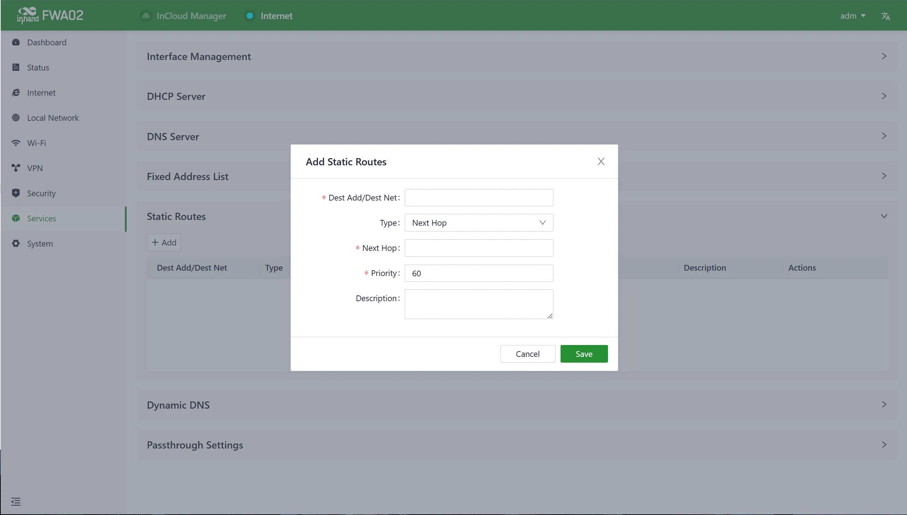

<strong>Figure 4-50 Static routes interface</strong>

> **Cautions**:
> 1. Static routes with the same destination address/network cannot have the same next-hop address, interface, or priority. Otherwise, it may lead to routing failures.
> 2. When WAN2, Wi-Fi (STA), or L2TP Client VPN is deleted, the corresponding static routes using those interfaces will also be removed.

### 4.7.6 Dynamic DNS

Dynamic DNS (Dynamic Domain Name System) is used to automatically update the content of name servers in the Domain Name System. According to the rules of the Internet, domain names are usually associated with fixed IP addresses. Dynamic DNS technology provides fixed name servers for users with dynamic IP addresses, allowing external users to connect to users with dynamic IP addresses through regular updates of their URLs.

The Dynamic DNS server address can be manually configured under the [Services] → [Dynamic DNS] feature.

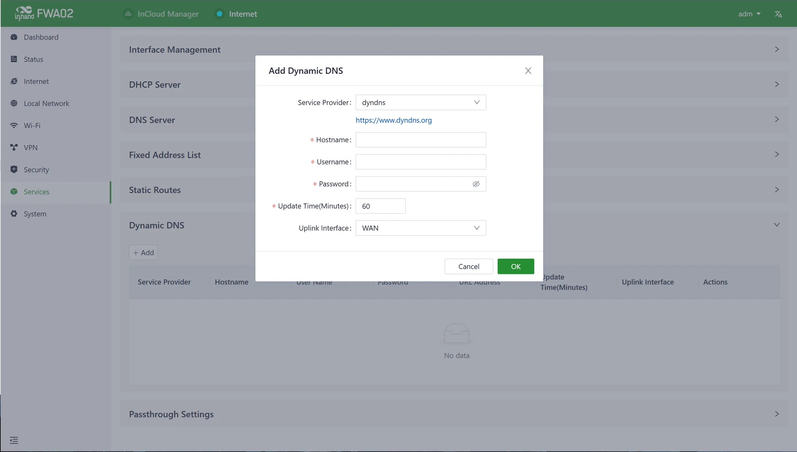

<strong>Figure 4-51 Set the dynamic DNS address</strong>

1. **Service Provider**: Provided by the dynamic DNS service provider. Options include dyndns, 3322, oray, no-IP, or custom (requires a URL).
2. **Hostname**: Click on the URL below the service provider to register and obtain the hostname.
3. **Username**: Click on the URL below the service provider to register and obtain the username.
4. **Password**: The password set by the user during registration.

### 4.7.7 Passthrough Settings

The IP Passthrough feature can be enabled in [Services] → [Passthrough Settings]. Once enabled, client devices can obtain the upstream interface address of the 5G FWA02.

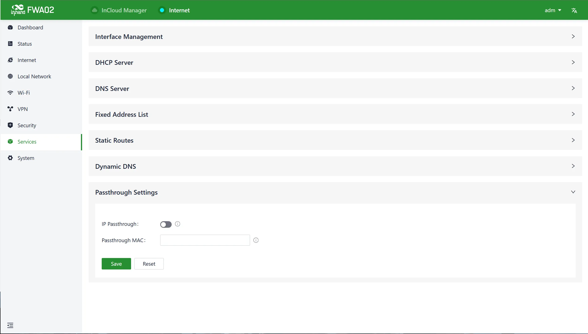

<strong>Figure 4-52 Set the IP passthrough mode</strong>

**Passthrough MAC**: Only clients bound to this MAC can obtain the upstream interface address of the device.

> **Cautions**:
> 1. Once IP Passthrough mode is enabled, only one client can access the public network, and the following features are disabled: static routing, VPN, port forwarding, policy-based routing, SD-WAN Overlay, and cloud connectivity.
> 2. When accessing client devices, inbound rules need to be released.
> 3. The router can still be accessed via the default subnet's IP address.

## 4.8 System

### 4.8.1 Cloud Management

**About InCloud Manager**

InCloud Manager ([star.inhandcloud.com](https://star.inhandcloud.com/)) is a cloud-based management platform developed by InHand Networks to simplify enterprise network deployment, operations, and user experience. Designed with a user-centric approach, it integrates zero-touch deployment, intelligent O&M, security protection, and an intuitive interface for streamlined network management. Once devices are connected to the platform, remote management, batch configuration, traffic monitoring, and other tasks can be performed centrally.

**Cloud Management for 5G FWA02**

By default, the 5G FWA02 automatically registers with InCloud Manager once an Internet connection is established. If cloud management is not preferred, this feature can be disabled manually under [System] → [Cloud Management].

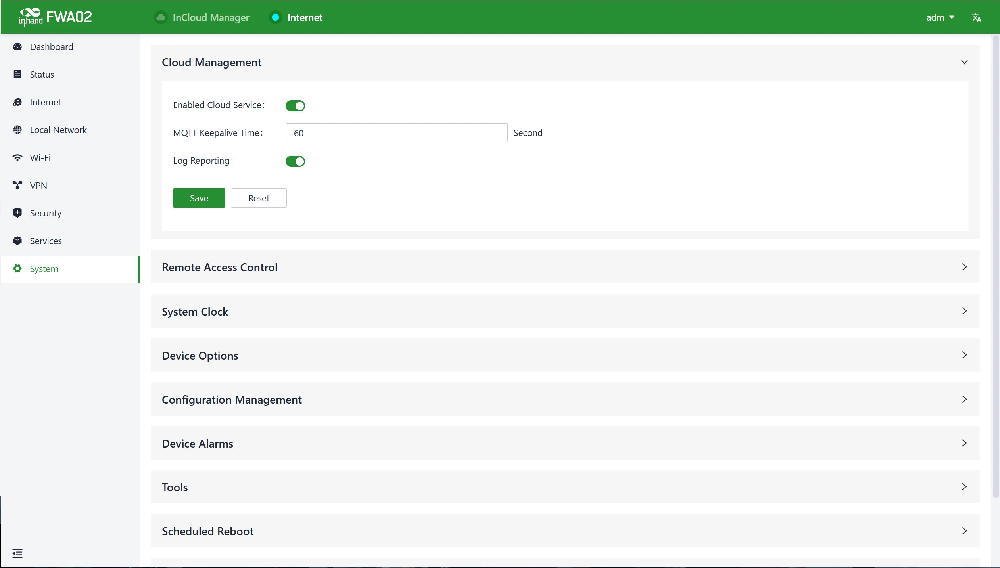

<strong>Figure 4-53 Configure the cloud management service</strong>

### 4.8.2 Remote Access Control

Whether external access to the router's web configuration interface from the Internet is allowed can be controlled by configuring the [System] → [Remote Access Control] function. This feature also allows setting the service port for remote access.

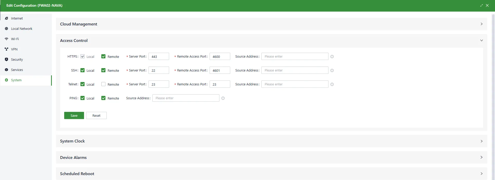

<strong>Figure 4-54 Configure the remote access control</strong>

1. **HTTPS**: When enabled, users can access the router's web interface remotely by entering the public IP address and port of the upstream interface in a web browser.
2. **SSH**: When enabled, users can remotely log in to the router's backend by using remote tools like CRT, entering the public IP address and port of the device's upstream interface, along with a username and password.
3. **Ping**: When enabled, the upstream interface address allows external networks to initiate Ping requests.

### 4.8.3 System Clock

In network functionality, the clock function refers to the capability used to coordinate and synchronize the time between network devices. Clock functionality within a network is crucial for data transmission, log recording, security, coordination, and troubleshooting. It ensures that various devices in the network are operating with synchronized times, which is essential for efficient and secure network operations.

The current time zone can be selected and NTP (Network Time Protocol) server addresses can be configured using the [System] → [Clock] function to synchronize the device's system time with an NTP server.

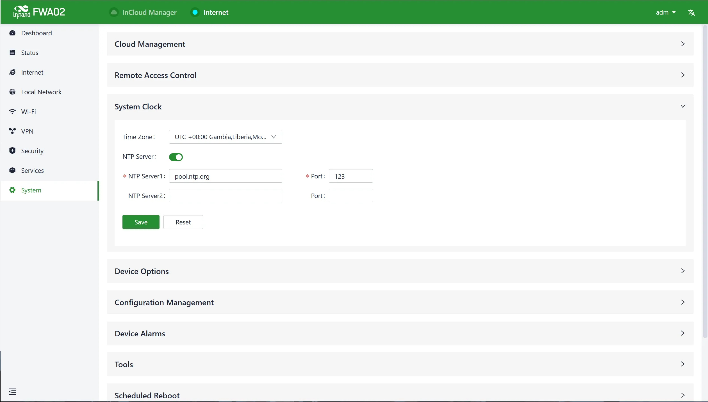

<strong>Figure 4-55 Set the system clock and NTP server</strong>

### 4.8.4 Device Options

In the [System] → [Device Options] section, various device operations can be performed, such as rebooting, upgrading firmware, and restoring factory settings.

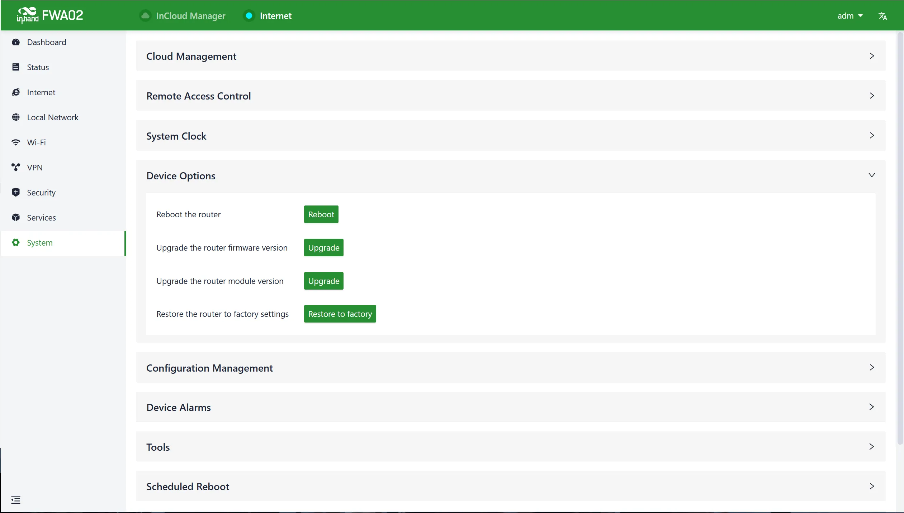

<strong>Figure 4-56 Device option panel</strong>

> **Cautions**:
> 1. When locally upgrading firmware, ensure the firmware is obtained from a legitimate source to avoid rendering the device unusable due to incorrect firmware installation.
> 2. When a device is connected to the cloud platform, the platform will synchronize the previous configuration to the device again due to cloud-based configuration synchronization. The device will only clear historical data during the factory reset.

### 4.8.5 Configuration Management

Configuring backups and backup recovery are critical tasks in network management and maintenance. They involve the process of preserving configuration information for network devices so that they can be quickly restored or migrated when needed. This practice ensures the resilience and reliability of network operations and simplifies the recovery process in case of system failures or configuration changes.

The device configuration can be exported to local storage in [System] → [Configuration Management]. This backup can be useful in cases where device configuration is lost or needs to be restored.

<strong>Figure 4-57 Configuration management panel</strong>

### 4.8.6 Device Alarms

When certain events that occur on the device need special attention, the corresponding alarm events can be checked and the email address to receive alarm notifications can be set in [System] → [Device Alarm]. Once an alarm event occurs, the device automatically sends the corresponding email notification. For alarm options that are not checked, related alarm events will still be recorded in the device's local logs.

In the [System] → [Device Alarm] function, the alarm event types and the email address to receive alarm notifications can be set. This allows specifying which types of alarm events to be notified about via email and where those email notifications should be sent.

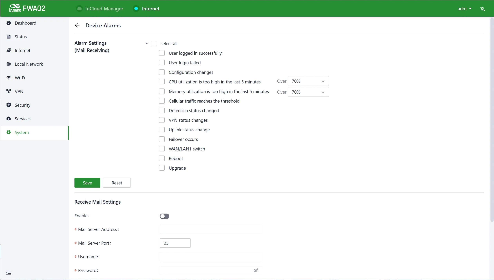

<strong>Figure 4-58 Configure the device alarms</strong>

After configuring the outgoing email server address, port, username, and password, the device uses this email account to send alarm notifications. The "Send Test Email" option can be used to verify whether the outgoing email configuration is correct.

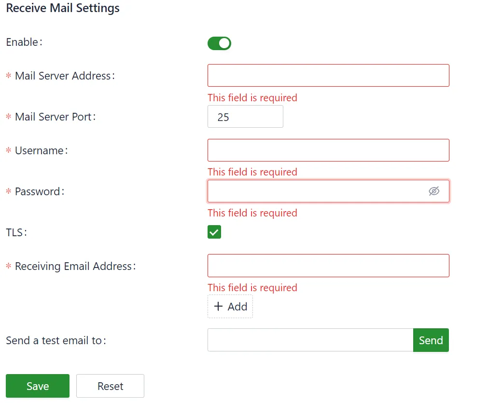

<strong>Figure 4-59 Set the e-mail address</strong>

### 4.8.7 Tools

#### Ping

ICMP (Internet Control Message Protocol) can be used to check the device's external network connectivity. In the "Target" field, enter any domain name or IP address to test the device's connectivity to, and then click "Start" to check the connectivity status between the device and the specified target.

A network ping test on a target can be performed by going to [System] → [Tools] → [Ping].

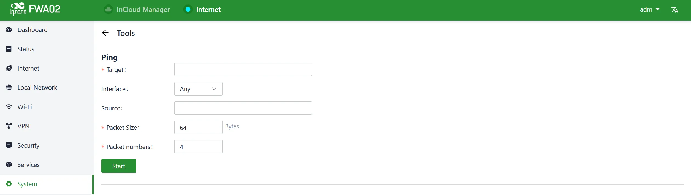

<strong>Figure 4-60 Ping</strong>

#### Traceroute

The [System] → [Tools] → [Traceroute] function can be used to check the routing connectivity from the device to a target host. Input the target host's IP address or domain name, select the outbound interface for traffic, and click "Start" to trace the route from the device to the target IP, displaying each hop along the way. This helps diagnose network routing issues and identify the path taken by data packets to reach the destination.

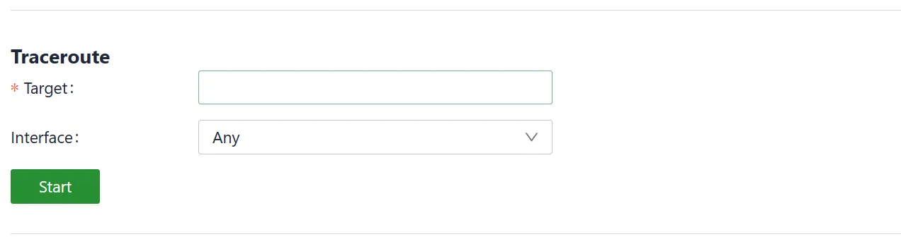

<strong>Figure 4-61 Traceroute</strong>

#### Capture

The [System] → [Tools] → [Capture] function can be used to capture packets passing through a specific interface. By selecting the "Output" option, the captured data can be displayed in the interface or exported locally for further analysis.

<strong>Figure 4-62 Capture</strong>

### 4.8.8 Scheduled Reboot

Scheduled reboot is a strategy in network device management that allows administrators to automatically restart devices at specific times or under certain conditions to ensure their normal operation and performance.

Device scheduled restart times can be set up in the [System] → [Scheduled Reboot] function based on business needs. The device supports scheduled reboots at fixed times on a daily, weekly, or monthly basis.

For monthly reboots, when the selected reboot day is greater than the actual number of days in that month, the device reboots on the last day of that month. For example, if the 31st is chosen in a month with only 30 days, the device reboots on the 30th.

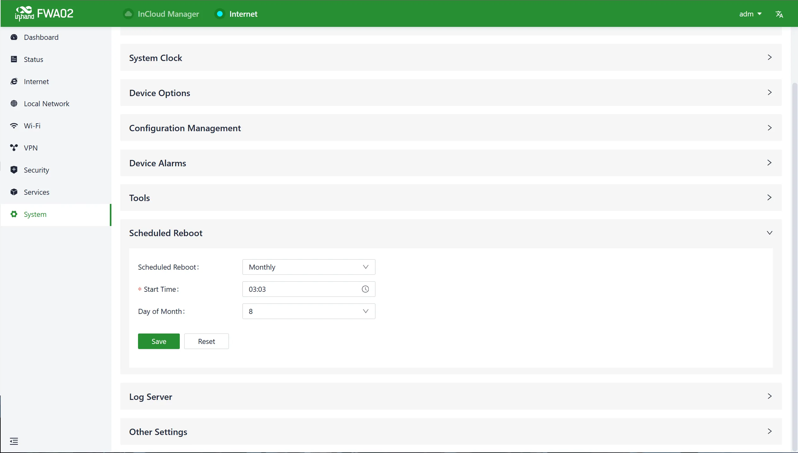

<strong>Figure 4-63 Set the scheduled reboot time</strong>

### 4.8.9 Log Server

A remote log server can be set to receive the logs sent by this device through [System] → [Log Server].

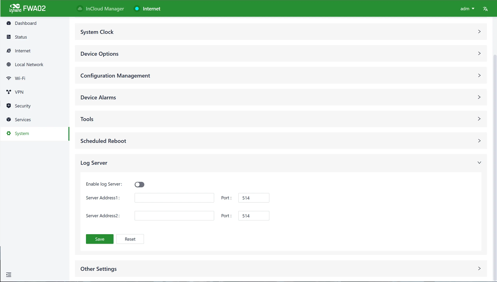

<strong>Figure 4-64 Set the log server's address</strong>

### 4.8.10 Other Settings

#### Web Login Management

After a certain period of inactivity, when a user logs into the local interface of a device through a web interface, the system automatically logs them out or disconnects to ensure privacy and security.

The logout time can be set in [System] → [Other Settings] → [Web Login Management]. Once the online time for a single login session on the device's web page exceeds the configured time, the system automatically logs out the user, and they need to log in again to continue their operations.

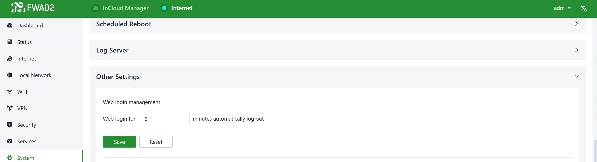

<strong>Figure 4-65 Set the web page logout time</strong>

#### Accelerated Forwarding

This feature can be used to accelerate packet forwarding and enhance network performance. It is turned off by default.

After enabling this feature in [System] → [Other Settings] → [Accelerated Forwarding], the device's cellular speed will significantly improve.

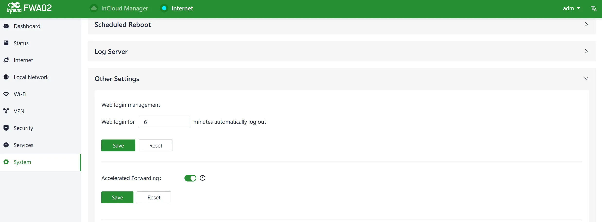

<strong>Figure 4-66 Enable the accelerated forwarding</strong>

> **Caution**: Enabling this feature will disable the normal functioning of IPSec VPN, traffic shaping, and other related features.

#### Automatically Restarts

The device is designed with an automatic restart mechanism to help address situations where manual intervention is required to restore network connectivity on-site.

Enabling this feature in [System] → [Other Settings] → [Auto Reboot] results in the device automatically rebooting if it loses network connectivity and remains disconnected for an hour after multiple retry attempts.

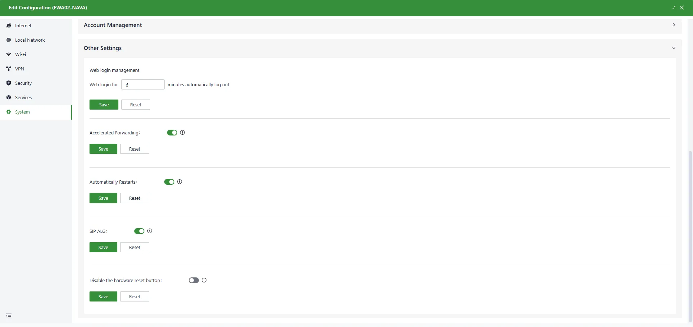

<strong>Figure 4-67 Enable the automatic reboot</strong>

#### SIP ALG

SIP ALG is typically used as a firewall and consists of two technologies: Session Initiation Protocol (SIP) and Application Layer Gateway (ALG). This protocol is typically used to assist in the management and processing of SIP communications, which is used to establish and manage real-time communication sessions, such as voice and video calls.

This feature can be enabled in [System] → [Other Settings] → [SIP ALG]. Enabling this feature may impact VoIP telephone communication.

> **Note**: If the connected device needs to engage in VoIP (Voice over Internet Protocol) phone communication, it is recommended to disable this function.

#### Disable the Hardware Reset Button

This security feature allows administrators to enable or disable the device's physical reset button with a single click through the management interface.

**Purpose**

The primary function is to prevent accidental or unauthorized factory resets of the device. When disabled, the physical button becomes inactive, safeguarding the current configuration and network stability. This is particularly useful in deployed or publicly accessible locations.

> **Note**: Disabling the button does not affect remote software resets or configuration via the management interface. Only users with administrator privileges can modify this setting.

---

# Chapter 5 Typical Application

## Case 1: Enterprise Branch Secure Network Access

**Scene Description**: A retail chain store requires high-speed and secure Internet access for POS terminals, surveillance cameras, and employee devices. The store has no fixed broadband available, so a 5G cellular connection is used as the primary uplink.

**Network Topology**:

<strong>Figure 5-1 Enterprise branch network topology</strong>

**Device Role**: The 5G FWA02 acts as the edge gateway, providing 5G cellular uplink, Wi-Fi 6 LAN access, and wired Ethernet for critical devices. It connects to the InCloud Manager platform for centralized remote management.

**Configuration Steps**:

1. Install the SIM card and 5G antennas on the FWA02, then power on the device.
2. Verify cellular Internet access via [Dashboard] → [Interface Status] (refer to [3.1 Cellular Internet Access](#31-cellular-internet-access)).
3. Connect POS terminals to the LAN ports and configure Wi-Fi SSIDs for employee devices (refer to [4.4 Wi-Fi](#44-wi-fi)).
4. Register the device on the InCloud Manager platform using its serial number and MAC address (refer to [3.3 Cloud Platform Management](#33-cloud-platform-management)).
5. Configure firewall inbound/outbound rules as needed to restrict unauthorized access (refer to [4.6.1 Firewall](#461-firewall)).

**Reference Chapters**:

- [1.4 LED Indicators](#14-led-indicators)
- [3.1 Cellular Internet Access](#31-cellular-internet-access)
- [3.3 Cloud Platform Management](#33-cloud-platform-management)
- [4.4 Wi-Fi](#44-wi-fi)
- [4.6.1 Firewall](#461-firewall)

---

# Appendix A Troubleshooting

## A.1 Cellular Network Connection Issues

| Phenomenon | Possible Cause | Troubleshooting Steps | Reference Chapter |
|------------|----------------|----------------------|-------------------|
| Unable to connect to cellular network | SIM card not inserted or poor contact | 1. Check whether the SIM card is correctly inserted 2. Reinsert the SIM card | [2.2.1 Insert SIM Card](#221-insert-sim-card) |
| Unable to connect to cellular network | APN parameters configured incorrectly | 1. Verify APN parameters against operator requirements 2. Contact the operator to obtain the correct APN | [3.1 Cellular Internet Access](#31-cellular-internet-access) |
| Unable to connect to cellular network | Weak or no signal | 1. Check whether antennas are connected 2. Adjust the device position | [2.2.2 Attach Antennas](#222-attach-antennas) |
| Unable to connect to cellular network | Data plan expired or exceeded | 1. Check data plan status with the operator 2. Renew or recharge the data plan | [3.1 Cellular Internet Access](#31-cellular-internet-access) |

## A.2 Wired Network Connection Issues

| Phenomenon | Possible Cause | Troubleshooting Steps | Reference Chapter |
|------------|----------------|----------------------|-------------------|
| Unable to connect to WAN network | Upstream DHCP server disabled | 1. Confirm the upstream device has DHCP enabled 2. Configure static IP or PPPoE instead | [3.2 Wired Internet Access](#32-wired-internet-access) |
| Unable to connect to WAN network | Incorrect static IP or PPPoE settings | 1. Verify IP settings with the ISP 2. Reconfigure WAN parameters | [4.2.1 Uplink Table](#421-uplink-table) |
| Unable to connect to WAN network | Firewall rules blocking traffic | 1. Check inbound/outbound rules 2. Check MAC address filtering settings | [4.6.1 Firewall](#461-firewall) |

## A.3 Web Interface Access Issues

| Phenomenon | Possible Cause | Troubleshooting Steps | Reference Chapter |
|------------|----------------|----------------------|-------------------|
| Unable to open Web interface | Incorrect IP address | 1. Confirm the PC and device are on the same subnet 2. Check the device default IP address | [3.1 Cellular Internet Access](#31-cellular-internet-access) |
| Unable to open Web interface | Browser compatibility issue | 1. Switch to a recommended browser (Chrome) 2. Clear browser cache | [3.1 Cellular Internet Access](#31-cellular-internet-access) |
| Unable to open Web interface | PC obtained incorrect IP address | 1. Set PC to obtain IP automatically 2. Configure a static IP in the `192.168.2.x` range | [3.2 Wired Internet Access](#32-wired-internet-access) |

## A.4 Slow or Unstable Speed Issues

| Phenomenon | Possible Cause | Troubleshooting Steps | Reference Chapter |
|------------|----------------|----------------------|-------------------|
| Slow or unstable speeds | Weak cellular signal | 1. Check cellular signal strength 2. Relocate the device to an area with stronger reception | [4.1.1 Cellular Signal](#411-overview-of-the-device) |
| Slow or unstable speeds | Wi-Fi client on 2.4 GHz band | 1. Connect the client to the 5 GHz SSID 2. Reduce Wi-Fi interference | [4.4 Wi-Fi](#44-wi-fi) |
| Slow or unstable speeds | Outdated firmware | 1. Check current firmware version 2. Download and install the latest firmware from official sources | [4.8.4 Device Options](#484-device-options) |

---

# Appendix B Safety Precautions

1. Use the provided original power adapter to prevent potential device damage resulting from using incompatible power adapters.
2. During installation, ensure the device is positioned away from areas with strong electromagnetic interference and maintains a safe distance from high-power equipment. After installation, verify that the device is securely mounted to prevent accidental falls and potential damage.
3. Ensure the device operates within the temperature and humidity specifications outlined in the product manual based on its operating environment.
4. Conduct regular inspections of device cables, including Ethernet cables and power adapter connections. Keep the cables clean and promptly replace any cables showing damage.
5. When cleaning the device, refrain from directly spraying chemical agents onto the device's surface to avoid potential harm to the housing or internal components. Utilize a soft cloth for cleaning purposes.
6. Do not attempt to disassemble, repair, or modify the device on your own, as this may lead to safety risks and void warranty coverage.
7. Regularly update the device's software version to access the latest security patches and feature upgrades. Always acquire firmware versions from official and reputable sources to prevent potential data loss or device damage. Utilizing unofficial or unauthorized firmware can result in compatibility issues, instability, and security vulnerabilities.
8. Securely store the device's login password and avoid disclosing it to unauthorized individuals to mitigate security risks.

> **Warning**: Non-professionals should not open the device enclosure. Risk of electric shock.

---

# FAQ

## Question 1: What is the difference between the FWA02 and an ordinary router?

1. The FWA02 supports multiple Internet access methods (5G cellular and wired), features Wi-Fi 6 and multi-gigabit Ethernet, and integrates with the InCloud Manager platform for cloud-based management, SD-WAN, and advanced security features.
2. Ordinary routers typically rely on fixed broadband connections (such as DSL or fiber) and lack unified cloud management platforms, firewalls, SD-WAN, and other advanced enterprise features.

## Question 2: Unable to connect to 4G/5G network?

1. **Physical environment**: Check whether the SIM card is inserted into the correct slot and ensure all cellular antennas are properly installed.
2. **APN settings**: Ensure the APN configuration matches the information provided by the service provider.
3. **Check device connectivity**: Log in to the device's local interface and use the built-in ICMP tool to ping `8.8.8.8` to test connectivity. If it can connect, check the connectivity between the client device and the router.
4. **Check SIM card**: Remove the SIM card and insert it into a phone to verify it can connect to the Internet.
5. **Restart**: Power off the router, wait a few seconds, and then reconnect the power to retry the network connection.
6. **Factory reset**: Perform a factory reset on the router and then attempt to connect again.

## Question 3: Is the cloud platform free of charge?

InHand Networks provides cloud platform services for small and medium-sized organizations. When utilizing cloud platform services, a license is required for each device to access the extensive cloud-based features. A complimentary 3-year essential license is included when a device is added to the platform for the first time.

## Question 4: How to add devices to the cloud platform?

1. Register for an InCloud Manager account at [https://star.inhandcloud.com](https://star.inhandcloud.com/).
2. Log in to the cloud platform using the registered account. Under the [Device] menu, click "Add" and follow the prompts to enter the device's serial number and MAC address. This completes the device addition process.

## Question 5: Is it possible to use the device without the cloud platform?

Yes. The majority of configuration tasks can be completed locally via the Web interface. However, for features such as bulk configuration deployment, firmware upgrades, SD-WAN, and advanced remote management, the cloud platform is required.
