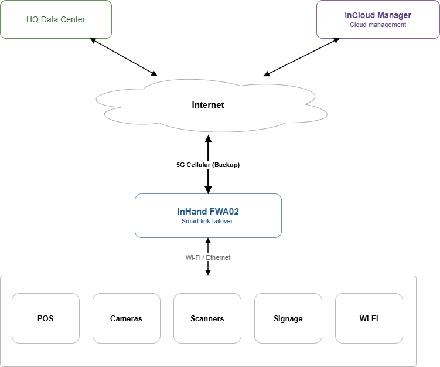
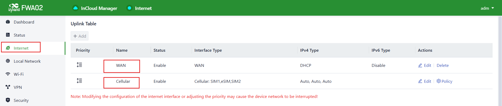
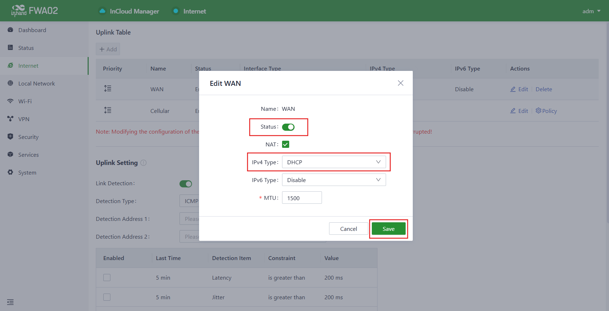

# Retail Store Connectivity — Failover Configuration Guide

## 1. Document Information

- **Product Model:** FWA02 (5G Fixed Wireless Access Router)
- **Firmware Version:** V1.0 or later
- **Applicable Scenario:** Chain retail store connectivity, WAN + 5G cellular failover
- **Document Date:** April 27, 2026

---

## 2. Router Overview

### 2.1 Product Introduction

The InHand FWA02 is a 5G fixed wireless access router designed for plug-and-play deployment in distributed retail environments. It supports dual-link failover between a wired WAN connection and a 5G/4G cellular backup, ensuring uninterrupted business operations for POS transactions, video surveillance, and data synchronization.

### 2.2 Key Features (Failover-Related)

- Wired WAN as primary link with automatic 5G/4G cellular failover
- Dual Nano SIM + eSIM for flexible carrier selection on the cellular backup link
- Real-time link quality monitoring: latency, jitter, packet loss, and cellular signal strength
- Sub-30-second failover detection and switchover

### 2.3 Typical Application Topology

*Figure 1 — Each retail store has one FWA02 connecting all in-store devices. The wired WAN carries all normal traffic; the 5G cellular link activates automatically when the wired link degrades or fails. The device is also reachable from HQ and InCloud Manager over the internet.*

---

## 3. Hardware Description

### 3.1 Interfaces

| Interface | Description |
|-----------|-------------|
| **ETH 1 / ETH 2** | 2 × 2.5 GbE RJ45, WAN/LAN switchable |
| **SIM 1 / SIM 2** | Nano SIM slots (hot-plug), primary and backup cellular |
| **eSIM** | Embedded SIM for pre-provisioned carrier profile |
| **USB** | Type-C, USB 2.0, HOST and SLAVE modes |
| **Power** | Circular interface, 12 V 2 A |
| **Reset** | Recessed button, restores factory defaults |
| **Power switch** | Hardware on/off button |
| **Antenna** | 6 × external Sub-6 GHz cellular antennas; 4 × built-in Wi-Fi antennas |

### 3.2 LED Indicators (Failover-Relevant)

| Indicator | Status | Meaning |
|-----------|--------|---------|
| **System** | Solid green | Device operating normally |
| | Blinking | Booting or upgrading |
| **Cellular** | Solid green | Cellular connected |
| | Blinking | Cellular registering |
| | Off | No SIM / no signal |
| **Signal** | 1–5 bars | Cellular signal strength |
| **WAN** | Solid green | WAN link up |
| | Off | WAN link down |

---

## 4. Factory Default Parameters

| Parameter | Default Value |
|-----------|---------------|
| **LAN IP address** | 192.168.1.1 |
| **Subnet mask** | 255.255.255.0 |
| **DHCP server** | Enabled (pool: 192.168.1.100–199) |
| **Web UI username** | adm |
| **Web UI password** | Printed on device label |
| **ETH 1** | WAN mode (default) |
| **ETH 2** | LAN mode (default) |

> **Note:** The device label on the underside of the unit shows the default web UI password. Change this on first login.

---

## 5. Pre-Configuration Requirements

Before starting configuration, ensure the following:

1. Insert SIM card(s) into SIM 1 (and optionally SIM 2) slots
2. Connect the active broadband modem or ISP handoff to **ETH 1** (WAN) using an Ethernet cable
3. Connect your PC to **ETH 2** (LAN) using an Ethernet cable
4. Power on the FWA02 using the 12 V adapter; wait for the **System** LED to turn solid green (approx. 60 seconds)
5. Set your PC to obtain an IP address automatically (DHCP), or configure a static IP in the 192.168.1.0/24 subnet
6. Open a supported web browser (Chrome, Firefox, or Edge) and navigate to `http://192.168.1.1`
7. Log in with the credentials on the device label

---

## 6. Failover Configuration

### 6.1 Background and Requirements

Each retail store requires:
- A **primary wired WAN** connection for normal high-bandwidth operations
- An **automatic 5G/4G cellular failover** that activates when the wired link fails
- Continuous monitoring of link quality so that switchover is triggered before business impact occurs

On the FWA02, both the WAN and Cellular interfaces appear as entries in the **Uplink Table** under the **Internet** menu. Failover behavior is then defined in the **Uplink Setting** section on the same page.

### 6.2 Step 1 — Review the Uplink Table

1. Log in to the router Web UI at `http://192.168.1.1`
2. In the left navigation, click **Internet**
3. The **Uplink Table** lists all available uplinks. By default you should see two entries:

| Priority | Name | Status | Interface Type | IPv4 Type |
|----------|------|--------|----------------|-----------|
| 1 | **WAN** | Enable | WAN | DHCP |
| 2 | **Cellular** | Enable | Cellular: SIM1, eSIM, SIM2 | Auto, Auto, Auto |

4. The order of rows in the Uplink Table determines failover priority — the top entry is used as the primary uplink, and lower entries are used as backups. Use the priority handle (☷) on the left of each row to drag-and-drop and reorder if needed. WAN should be on top, Cellular below it.

*Figure 2 — Uplink Table on the **Internet** page. WAN is listed first as the primary uplink and Cellular as the backup. Use the **Edit** action on each row to adjust per-uplink settings.*

### 6.3 Step 2 — Configure the WAN Uplink (Primary Link)

1. On the **Internet** page, click **Edit** in the **WAN** row
2. Set the **IPv4 Type** to match your ISP:

| ISP Type | Setting |
|----------|---------|
| DHCP (most broadband) | Select **DHCP** |
| Static IP | Select **Static**, enter IP, mask, gateway, and DNS |
| PPPoE (fiber/DSL) | Select **PPPoE**, enter username and password from ISP |

3. Click **Save** and confirm the **WAN** LED turns solid green
4. Verify the indicator at the top of the page shows **● Internet** (green dot)

)

### 6.4 Step 3 — Configure the Cellular Uplink (Backup)

1. On the **Internet** page, click **Edit** in the **Cellular** row
2. For each SIM slot you intend to use (SIM1, eSIM, SIM2), set the APN:
   - For most carriers: leave **APN** as **Auto** or enter the carrier-specific APN (e.g., `vzwinternet` for Verizon, `fast.t-mobile.com` for T-Mobile)
   - For private MVPN: enter the APN provided by your carrier account manager
3. Leave **Dial number** as `*99#` (default)
4. Click **Save**
5. Confirm the **Cellular** LED turns solid green and the **Signal** indicator shows at least 2 bars

> **Dual SIM:** The Cellular uplink natively groups SIM1, eSIM, and SIM2. Use the **Policy** action on the Cellular row to set the order in which SIMs are tried if the active SIM loses signal.

)

### 6.5 Step 4 — Configure Link Detection and Failover

The **Uplink Setting** section, located further down the **Internet** page, controls how the FWA02 monitors link health and how it reacts when the primary link degrades.

1. Scroll down on the **Internet** page to **Uplink Setting**
2. Toggle **Link Detection** to **ON**
3. Configure detection parameters:

| Field | Recommended Value | Description |
|-------|-------------------|-------------|
| **Detection Type** | ICMP | Use ping for link health checks |
| **Detection Address 1** | `8.8.8.8` | Primary remote target for ping |
| **Detection Address 2** | `1.1.1.1` | Secondary target — both must fail before declaring link down |

4. In the **Detection Item** table, enable the metrics that should trigger a failover. Recommended baseline:

| Detection Item | Constraint | Value | Last Time |
|----------------|------------|-------|-----------|
| **Latency** | is greater than | 200 ms | 5 min |
| **Jitter** | is greater than | 200 ms | 5 min |
| **Loss** | is greater than | 5 % | 5 min |
| **Signal Strength** | is less than | Poor | 5 min |

5. Under the mode selector at the bottom, select **Link Backup** (not **Load balancing**)
6. Set **Failover Mode** to **Immediately Switch** so the router fails over to Cellular as soon as the WAN is declared down
7. Click **Save**

*Figure 3 — **Uplink Setting** page. **Link Detection** is enabled, **Link Backup** is selected as the operating mode, and **Failover Mode** is set to **Immediately Switch**. Click **Save** to apply.*

**Result:** When the wired WAN link fails or its quality crosses any of the enabled detection thresholds, the FWA02 immediately routes all traffic through the Cellular uplink. Once the WAN recovers and passes detection, traffic reverts to it automatically based on the priority order in the Uplink Table.

---

## 7. Verification — WAN Failover Test

After completing all configuration steps, verify the failover behavior as follows:

1. Confirm normal operation: open the **Dashboard** and verify **WAN** is the active uplink and **Cellular** is in **Standby**
2. Unplug the WAN Ethernet cable from ETH 1
3. Within ~15–30 seconds, verify on the Dashboard that **WAN** status changes to **Disconnected** and **Cellular** becomes the **Active** uplink
4. From a device on the store LAN, confirm internet access is maintained (e.g., ping `8.8.8.8` or open a browser)
5. Reconnect the WAN Ethernet cable
6. After detection passes again, verify **WAN** returns to **Active** and **Cellular** returns to **Standby**

---

## 8. Troubleshooting

### 8.1 Cannot Access Web UI

| Symptom | Action |
|---------|--------|
| Browser cannot reach `192.168.1.1` | Confirm PC is connected to ETH 2 (LAN) and set to DHCP or static IP in 192.168.1.0/24 subnet |
| Forgot web UI password | Press and hold the Reset button for 10 seconds to restore factory defaults, then use credentials on the device label |

### 8.2 WAN Link Not Coming Up

| Symptom | Action |
|---------|--------|
| WAN LED off | Check Ethernet cable between FWA02 ETH 1 and ISP modem/handoff |
| WAN LED on but no internet | Verify WAN IPv4 Type matches ISP (DHCP / Static / PPPoE) |
| PPPoE fails to connect | Confirm ISP username and password are correct; check with ISP for service status |

### 8.3 Cellular Not Connecting

| Symptom | Action |
|---------|--------|
| Cellular LED off | Confirm SIM card is inserted fully and re-seat SIM; check SIM is activated |
| Cellular LED blinking, no connection | Verify APN setting matches carrier; check that SIM data plan is active |
| Poor signal (≤1 bar) | Reposition FWA02 closer to a window or external wall; check antenna connections are fully tightened |

### 8.4 Failover Not Triggering

| Symptom | Action |
|---------|--------|
| WAN down but traffic not switching to Cellular | Confirm **Link Detection** is enabled and **Link Backup** mode is selected in **Uplink Setting**; verify the Detection Address is reachable from the Cellular path |
| Failover is very slow | Lower the threshold values in the Detection Item table, or reduce the **Last Time** observation window |
| Traffic not reverting to WAN after recovery | Confirm the WAN row is at Priority 1 in the Uplink Table; check WAN LED is solid green and the Internet indicator at the top of the page is green |
