# 5G FWA12 Quick Installation Guide

## Part 1: Quick Installation

> **You need to:** Unpack → Mount the device → Connect power & Ethernet → (If using cellular) **Power off**, install SIM card(s), attach antennas → Power on → PC on same subnet → Browser open Web.
>
> **Then:** Scroll down to **Part 2** for packing list, LED meanings, mounting details, and interface references.

### Must-Read Summary

| Item | Requirement |
|------|-------------|
| Power Supply | **DC 12 V**; use the power adapter included in the package. |
| SIM Card | **Power off** before inserting or removing SIM card(s). |
| 5G Antennas | Attach all **6** antennas to the SMA connectors according to the housing silkscreen. |
| Environment | Working temperature: **-10 °C ~ 50 °C**; storage temperature: **-40 °C ~ 85 °C**. Keep away from heat sources and strong electromagnetic interference. |

---

### Step 1: Check the Panel and Identify Interface Areas

Take the FWA12 out of the box and compare it with the diagram below. Locate the power switch, DC input, WAN/LAN1 port, LAN2 port, and USB Type-C interface.

  

<b>Fig. 1-1 Device panel</b>

1. Power Switch
2. DC 12V: Power in
3. WAN/LAN1: Ethernet Port
4. LAN2: Ethernet Port
5. USB: Type-C interface supporting USB2.0 protocol

For full panel layout details, see §2.2.

---

### Step 2: Mount the Device on a Desktop or Wall

Choose a desktop or wall location that is free from obstructions, away from direct sunlight and heat sources, and strong enough to support the device weight.

**Desktop installation:** Simply place the device steadily on the tabletop after verifying the SIM card, antennas, and power cable are correctly installed.

  

<b>Fig. 1-2 Desktop installation</b>

**Wall-mounted installation:** The mounting holes at the bottom of the device are L-shaped.

  

<b>Fig. 1-3 Pre-drill holes</b>

1. Use a drill to pre-drill holes at the marked positions on the wall. Insert the expansion screws and fasten them securely.
2. Align the L-shaped mounting holes and push down gently to complete the fixation.

  

<b>Fig. 1-4 Push the device to fix</b>

For detailed mounting instructions, see §2.4.

---

### Step 3: Connect Power and Ethernet

Insert one end of the power adapter into the power outlet and the other end into the device's DC 12V interface. Do **not** turn on the power switch yet.

Connect an Ethernet cable from your upstream network (or PC) to the WAN/LAN1 or LAN2 port as needed.

  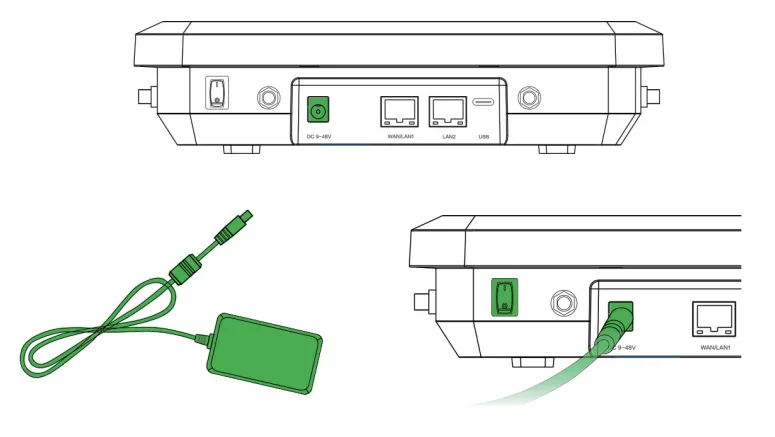

<b>Fig. 1-5 Power on the device</b>

For Ethernet port details, see §2.5.1. For power specifications, see §2.5.2 and §2.6.

---

### Step 4: Power Off, Install SIM Card(s), and Attach Antennas

> **Warning:** Install or remove SIM cards **only when the device is powered off**.

The 5G FWA12 supports dual nano SIM cards (4FF).

1. Slide the SIM card cover downward to remove it, then insert the SIM card(s) according to the diagram below.
2. To remove the SIM, press the middle of the SIM inward and it will pop outward from the SIM slot.
3. Put the SIM card cover back in place.

  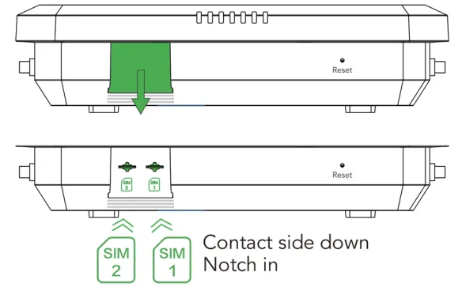

<b>Fig. 1-6 Install the SIM cards</b>

Attach all **6** 5G antennas to the SMA connectors.

  

<b>Fig. 1-7 Install the antennas</b>

For Verizon users, there is an embedded SIM card built-in. Please find the ICCID on the back if you want to activate the embedded SIM instead of 4FF SIM. For detailed SIM and antenna information, see §2.5.6.

---

### Step 5: Power On and Confirm the Device Is Ready

Flip the power switch to the ON position. If the power switch is on, the Power LED will turn on.

  

<b>Fig. 1-8 Power LED</b>

Wait for the device to boot up. Confirm that:

- The **PWR** LED is steady.
- The **System** LED turns steady green (indicating the system is working).

For complete LED indicator meanings, see §2.3.

---

### Step 6: PC and Browser Login

1. Connect your PC to the device's LAN port using an Ethernet cable. The device's LAN port has DHCP Server functionality enabled by default.
2. Open a web browser and type the device's default address **192.168.2.1** into the address bar.
3. Enter the default username and password (please check the product nameplate to obtain them).
4. If your browser displays a security warning, navigate to hidden or advanced options and select "Proceed to website."

  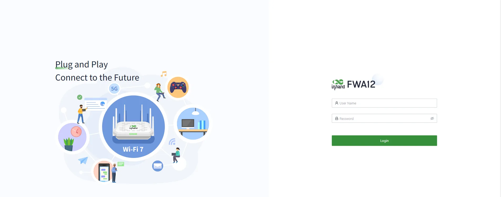

<b>Fig. 1-9 Web login</b>

For detailed login steps and network configuration, see §2.7.

---

### Installation Checklist

- ☐ Device is securely mounted (desktop or wall).  
- ☐ Power and Ethernet cables are connected; if using cellular, SIM card(s) and antennas are in place.  
- ☐ **PWR** LED is steady on.  
- ☐ Browser can open the Web login page and login is successful.  

If the device fails to connect to the network, check the "Internet" settings or perform a factory reset. See §2.7 for troubleshooting and reset procedures.

---

## Part 2: Detailed Information

### 2.1 Packing List

**Standard Accessories**

| No. | Name | Qty | Unit | Remarks |
|:---:|------|:---:|:----:|---------|
| 1 | FWA12 | 1 | pc | 5G FWA12 |
| 2 | Ethernet Cable | 1 | pc | 1 m Ethernet Cable |
| 3 | Power Adapter | 1 | pc | DC Power Adapter |
| 4 | 5G Antenna | 6 | pc | FWA12-NANR, 6×External 5G Antenna |
| 5 | QSG | 1 | pc | Quick Installation Guide |
| 6 | Installation Accessories | 1 | set | Wall-mounted installation and Desktop installation |

---

### 2.2 Product Structure and Identification

This manual is for the installation and operation of the 5G FWA of InHand Networks. Before installation, please confirm the product model and accessories in the package and purchase a SIM card from the operator that supports the local network. Please refer to the actual product for specific operations.

#### Front Panel

  

<b>Fig. 2.2-1 Device panel</b>

1. Power Switch
2. DC 12V: Power in
3. WAN/LAN1: Ethernet Port
4. LAN2: Ethernet Port
5. USB: Type-C interface supporting USB2.0 protocol

---

### 2.3 LED Indicators and Reset Button

#### 2.3.1 System and Network LEDs

| Indicator | Status | Meaning |
|:---------:|--------|---------|
| **System** | Off | Power off |
| | Steady red | Powering |
| | Blink red | System error |
| | Steady green | System working |
| | Blink blue | Firmware updating |
| **Cellular** | Blink red | Unable to access the cellular network |
| | Steady blue | 4G cellular connection successful |
| | Steady green | 5G cellular connection successful |
| **Signal** | Off | No signal value |
| | Steady red | Signal value is low |
| | Steady blue | Signal value is moderate |
| | Steady green | Signal value is excellent |
| **WAN** | Off | Disconnected |
| | Steady green | Port works properly |
| | Blink green | Data transferring |
| **LAN** | Off | Disconnected |
| | Steady green | Port works properly |
| | Blink green | Data transferring |
| **Wi-Fi 2.4G** | Off | AP mode disabled |
| | Blink green | AP mode enabled |
| | Steady green | The STA device successfully connects to this device |
| **Wi-Fi 5G** | Off | Disconnected |
| | Blink green | 5G AP function enabled |
| | Steady green | Wi-Fi clients connected successfully |

#### 2.3.2 Reset Button

The reset button is located on the device panel (see §2.2). Press and hold the reset button for 30 seconds to perform a hardware factory reset. For detailed reset steps, see §2.7.5.

---

### 2.4 Mechanical Installation

#### 2.4.1 Desktop Installation

1. Ensure the selected desktop area is free from obstructions to provide adequate space for the device.
2. Verify the correct installation of the SIM card, antennas and power cable.
3. Place the device steadily on the tabletop.

  

<b>Fig. 2.4-1 Desktop installation</b>

#### 2.4.2 Wall-Mounted Installation

1. Use a drill or an appropriate tool to pre-drill holes at the marked positions on the wall. Ensure that the hole dimensions are suitable for the expansion screws you are using. Insert the expansion screws into the pre-drilled holes and gently tap or rotate them with the appropriate tool until the expansion screws are securely fastened to the wall.

  

<b>Fig. 2.4-2 Pre-drill holes</b>

2. The mounting holes at the bottom of the device are L-shaped. Align the mounting holes and push down gently to complete the fixation.

  

<b>Fig. 2.4-3 Push the device to fix</b>

---

### 2.5 Connections and Cabling

#### 2.5.1 Ethernet

The FWA12 provides two Ethernet ports:

| Port | Role | Rate |
|------|------|------|
| WAN/LAN1 | WAN/LAN | 10/100/1000 Mbps |
| LAN2 | LAN | 10/100/1000 Mbps |

The device's LAN port has DHCP Server functionality enabled by default. The WAN port has DHCP client functionality enabled by default.

#### 2.5.2 Power

Please use the power adapter included in the package. FWA12 supports a voltage input range of 12 V. Please pay attention to the voltage level.

  

<b>Fig. 2.5.2-1 Power on the device</b>

If the power switch is on, the Power LED will turn on.

#### 2.5.6 Cellular SIM and Antennas

**SIM Card**

The 5G FWA12 supports dual nano SIM cards (4FF).

1. Insert a 4FF SIM card (or two as needed): Slide the SIM card cover downward to remove it, then insert the SIM card(s) according to the following diagram.
2. To remove the SIM, press the middle of the SIM inward and it will pop outward from the SIM slot.
3. Put the SIM card cover back in place.

  

<b>Fig. 2.5.6-1 Install the SIM cards</b>

> **Warning:** Insert or remove SIM cards **only when the device is powered off**.

For Verizon users, there is an embedded SIM card built-in. Please find the ICCID on the back if you want to activate the embedded SIM instead of 4FF SIM.

**Antennas**

Attach all the 5G antennas to the SMA connectors.

  

<b>Fig. 2.5.6-2 Install the antennas</b>

The FWA12-NANR includes 6 external 5G antennas. Attach all antennas and tighten them according to the housing silkscreen before powering on.

---

### 2.6 Power Supply and Environment

| Item | Specification |
|------|---------------|
| Input Voltage | DC 12 V |
| Working Temperature | -10 °C ~ 50 °C |
| Storage Temperature | -40 °C ~ 85 °C |
| Environment | Avoid direct sunlight and keep away from heat sources or strong electromagnetic interference. Confirm that the installation position is strong enough to support the weight of the equipment and its installation accessories. |

---

### 2.7 First Login and Network Configuration

#### 2.7.1 Web Login (Initial Access)

The steps below are identical to Part 1 Step 6 and are provided here for convenient reference.

1. Connect your PC to the device's LAN port using an Ethernet cable.
2. Open a web browser and type the device's default address **192.168.2.1** into the address bar.
3. Enter the default username and password (please check the product nameplate to obtain them).
4. If your browser displays a security warning, navigate to hidden or advanced options and select "Proceed to website."

| Port Role | Default IP |
|:---------:|:----------:|
| LAN | 192.168.2.1 |

  

<b>Fig. 2.7-1 Web login</b>

#### 2.7.2 Cellular Dial-up Configuration

The 5G FWA12 supports Internet access via cellular. The device comes with the dial-up function enabled by default.

**Connect via InCloud APP**

1. Insert the SIM card while the device is powered off, then connect the antennas to the device, and log in to the InCloud APP.
2. Log into the InCloud APP. Click the "Device" directory below to enter the [Device] page and click the menu button in the upper right corner, after that select [Add Device]. You can scan the QR code on the FWA12 to add the device.

<table align="center">
  <tr>
    <td align="center">
       
      <b align="center">Fig. 2.7-2 Add device via APP</b>
    </td>
    <td align="center">
       
    </td>
  </tr>
</table>

3. Once you successfully scan the QR code, proceed to configure the device's name, serial number, and description information.
4. If the device fails to connect to the network after adding it, you can click "Configure local device" to set up the device for cloud connectivity. The 5G FWA12 is configured with default Https access and Wi-Fi AP functionality.

**Connect Via PC (Web)**

1. Power off the device first, then insert the SIM card into the card slot, connect the 5G antenna to the device, and establish a wired connection between the 5G FWA12 and your PC using an Ethernet cable.
2. Open a web browser and type the device's default address **192.168.2.1**. After entering the default username and password, you will access the device's web management interface.

  

<b>Fig. 2.7-4 Web login (cellular)</b>

3. Go to the "Internet" section in the left navigation bar. Click the "Edit" button next to the "Cellular" option to configure the dial-up parameters.

  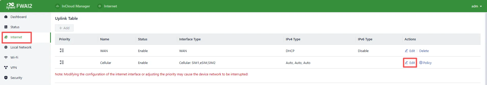

<b>Fig. 2.7-5 Uplink table</b>

  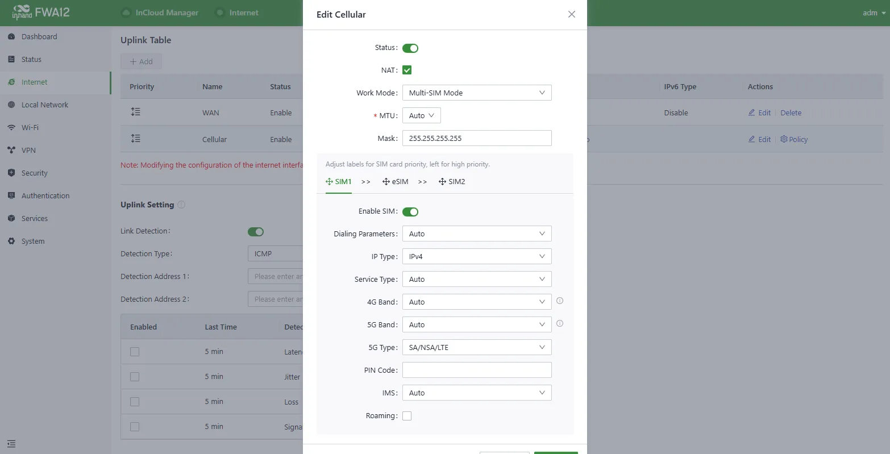

<b>Fig. 2.7-6 Configure the APN parameters</b>

4. To verify the dial-up status, go to the "Interface Status" section located in the "Dashboard." The device has successfully connected to the Internet when the "Cellular" icon turns green.

  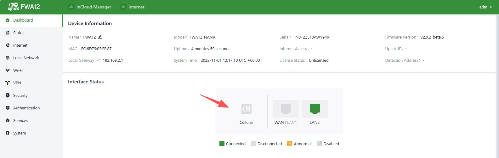

<b>Fig. 2.7-7 Check the cellular interface</b>

#### 2.7.3 Wired Networking Configuration

The 5G FWA12 also supports Internet access via wired connection.

**Connect via InCloud APP**

1. Insert the SIM card while the device is powered off, connect the antennas to the device, and log in to the InCloud APP.
2. Navigate to the "Device" section below to access the [Device] page, then click the menu button in the upper right corner and select [Add Device]. Then scan the QR Code on the 5G FWA12 to add the device.

<table align="center">
  <tr>
    <td align="center">
       
      <b>Fig. 2.7-8 Add device via APP</b>
    </td>
    <td align="center">
       
    </td>
  </tr>
</table>

3. Once you successfully scan the QR code, proceed to configure the device's name, serial number, and description information.
4. If the device fails to connect to the network after adding it, you can click "Configure local device" to set up the device for cloud connectivity. The 5G FWA12 is configured with default Https access and Wi-Fi AP functionality.
5. Scan the QR code on the unit's nameplate, and the app will establish a Wi-Fi connection with the FWA12 automatically.
6. Once the connection is established, the app will log in to the device, and you will be directed to the network configuration interface. Confirm the information and click 'Submit.'

**Connect via PC (Web)**

After powering on the device, connect your PC to the device's LAN port using an Ethernet cable.

The device's LAN port has DHCP Server functionality enabled by default. Once the PC has automatically obtained an IP address, please ensure that your PC and 5G FWA12 are in the same address range.

If your PC fails to obtain an IP address automatically, please configure it with a static IP address using the following parameters:

1. IP Address: 192.168.2.x (Choose an available address within the range of 192.168.2.2 - 192.168.2.254).
2. Subnet Mask: 255.255.255.0.
3. Default Gateway: 192.168.2.1.
4. DNS Servers: 8.8.8.8 (or your ISP's DNS server address)

Then follow these steps:

1. Enter the default device address **192.168.2.1** in the browser's address bar. After entering the username and password, access the device's web management interface. If the page shows a security warning, click on the "Hide" or "Advanced" button and select "Proceed" to continue.

  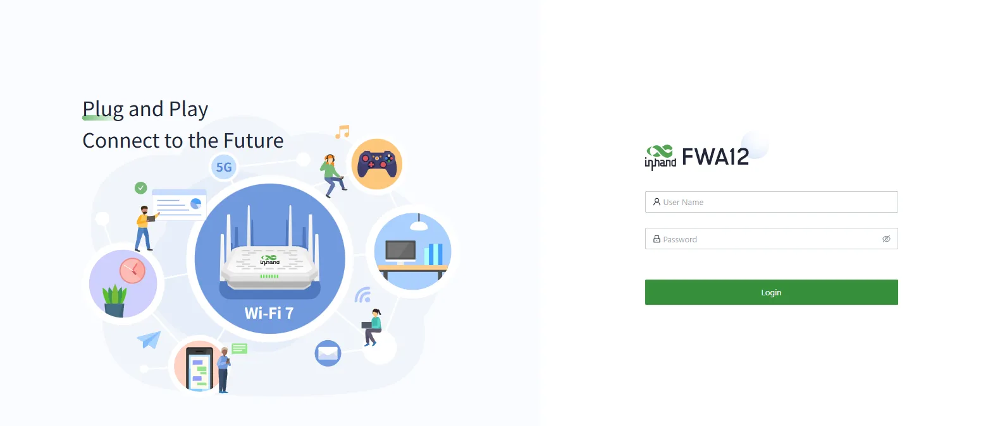

<b>Fig. 2.7-10 Web login interface</b>

2. Check the network in the "Dashboard > Interface Status." The device connects to the Internet successfully if the "Cellular" or "WAN" icon turns green. Click the corresponding icon to view interface information such as signal strength, IP address and traffic consumption.
3. If this device cannot connect to a network, click "Internet > Uplink Table > Edit" to set up network parameters. The device enables the dial-up function and WAN by default, please wait for a few minutes to go online, and re-enable the dial-up if it is not dialled.

  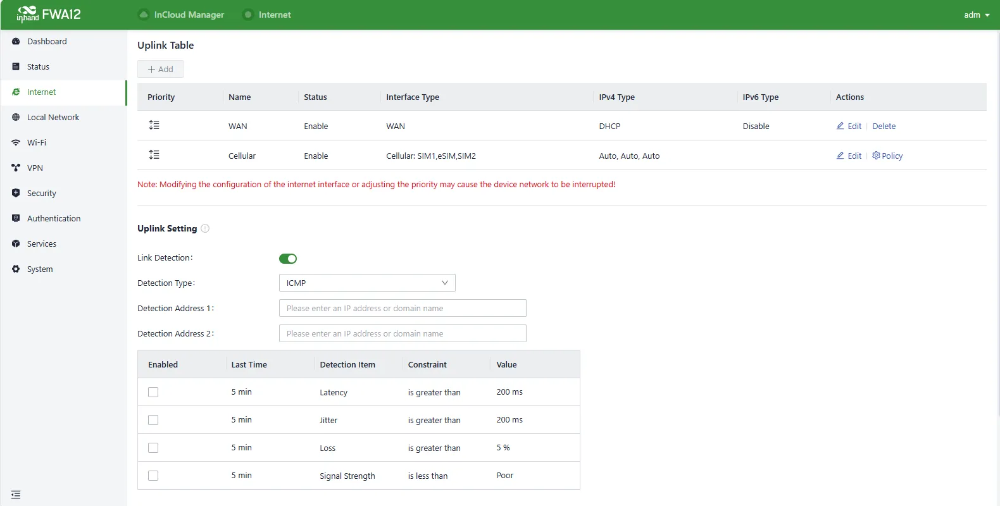

<b>Fig. 2.7-11 Edit the uplink interface</b>

The WAN port supports three connection modes:

1. **DHCP:** The DHCP service is enabled on the WAN port by default which means this device cannot connect to the Internet immediately if the upstream device connected to the WAN port does not have the DHCP server enabled.
2. **Static IP:** Users can assign a static IP address obtained from the ISP or upstream network device manually.
3. **PPPoE:** Users can set the PPPoE service on the WAN port and then this device can dial up to the Internet through the broadband service.

  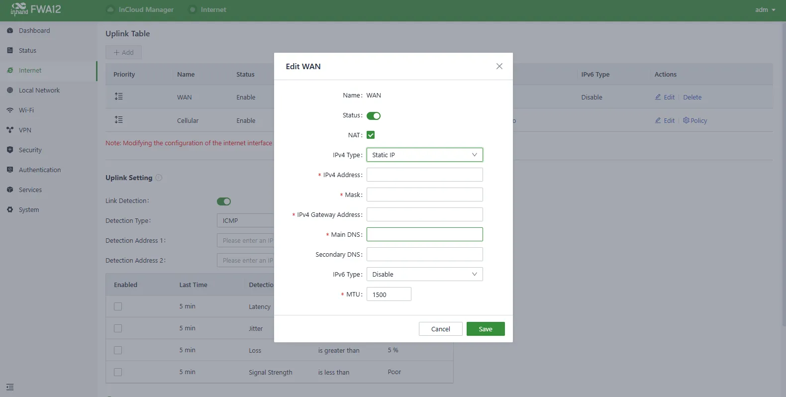

<b>Fig. 2.7-12 Configure the Uplink Parameters</b>

  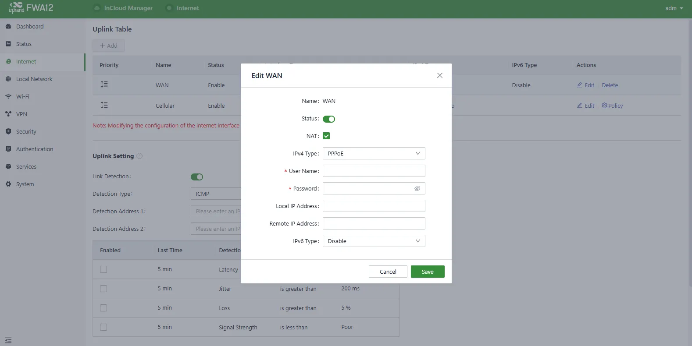

<b>Fig. 2.7-13 Configure the Uplink Parameters (continued)</b>

4. Verify network connectivity via the Ping tool on the System/Tools page.

  

<b>Fig. 2.7-14 Check the network connectivity</b>

#### 2.7.4 InCloud Remote Management

**Register/Login the InCloud Manager**

1. Open your web browser and visit InCloud at the following address: [https://star.inhandcloud.com/](https://star.inhandcloud.com/). This will take you to the InCloud registration and login page. (We recommend using Chrome)

  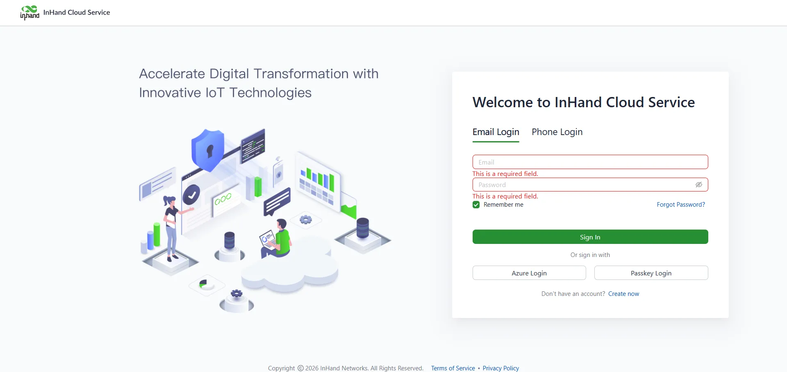

<b>Fig. 2.7-15 InCloud Manager Login Page</b>

2. After registering, log in to the cloud platform using your registered email. Navigate to the "Security Settings" page where you can change your password and link your mobile phone number. Once your phone number is linked, you can use it for future logins to the cloud platform.

  

<b>Fig. 2.7-16 Bind a Mobile Phone Number</b>

**Adding Devices to the Platform**

Log in to the InCloud Manager platform, then go to "Device" and click "Add" in the navigation menu. Fill in the device's serial number and MAC address to add it.

  

<b>Fig. 2.7-17 Add a Device</b>

#### 2.7.5 Factory Reset

**Reset/Restore Remotely**

Log in to the InCloud Manager platform, navigate to "Device," and select "Command" from the menu. Click the "Restore to Factory" button, confirm the action, and the device will reboot and revert to its default settings.

  

<b>Fig. 2.7-18 Set the Device to Default Settings</b>

**Hardware Restore**

1. After powering on the device, press and hold the reset button for 30 seconds, and the System indicator is solid blue. Please ignore the process after holding down the SYS indicator for the first time blue after holding the Reset button.
2. Release the key and the blue flashes.
3. Press and hold the reset button again, release the solid blue light and enter the system startup phase.

#### 2.7.6 Logs and Diagnostic Data

Login to InCloud Manager, navigate to "Device," select "Device Details," and click on the "Tools" menu in the navigation bar. Then, click the corresponding button to initiate the download of logs and diagnostic data.

  

<b>Fig. 2.7-19 Download the Logs</b>

---

### 2.8 Related Documents

| Need | Document |
|------|----------|
| Product introduction, configuration and troubleshooting | 5G FWA12 User Manual |
| Ordering and antenna models | 5G FWA12 Product Datasheet |
| Software and announcements | [InHand Networks Website](https://www.inhandnetworks.com/) |

---

### 2.9 Legal Information

This manual is for the installation and operation of the 5G FWA of InHand Networks.
