# 5G FWA12 Product User Manual

## Preface

### Declaration

Thank you for choosing our product. Before use, carefully read this user manual. Compliance with the following statements helps maintain intellectual property rights and legal compliance, ensuring that the user experience aligns with the latest product information. If there are any questions or written permission is needed, contact our technical support team at any time.

- **Copyright Statement**

This user manual contains copyrighted content, and the copyright belongs to InHand Networks Technology Co., Ltd. and its licensors. Without written permission, no organization or individual may excerpt, copy any part of the content of this manual, or distribute it in any form.

- **Disclaimer**

Due to ongoing updates in product technology and specifications, the company cannot guarantee that the information in the user manual is entirely consistent with the actual product. Therefore, no disputes arising from any discrepancies between the actual technical parameters and the user manual are accepted. Any changes to the product will not be notified in advance, and the company reserves the right to make the final changes and interpretations.

- **Copyright Information**

The content of this user manual is protected by copyright laws, and the copyright belongs to InHand Networks Technology Co., Ltd. and its licensors, reserving all rights. Without written permission, the content of this manual may not be used, copied, or distributed without authorization.

### GUI Conventions

| Symbol | Meaning | Example |
|--------|---------|---------|
| `< >` | Variable or parameter to be replaced with an actual value | `<IP Address>` indicates a specific IP address is required |
| `" "` | Text label on the interface | Click the "Save" button |
| `→` | Menu hierarchy or operation sequence | [Network] → [Cellular] |
| `[ ]` | Menu or page name | Enter the [System Settings] page |
| Caution | Improper operation may result in data loss or device damage | — |
| Note | Supplementary explanation for the operation description | — |

### Technical Support
Email: support@inhandnetworks.com

URL: www.inhand.com

### How to Use This Manual

**Match by User Type**

- First-time users: It is recommended to read [Getting to Know the Device](#chapter-1-getting-to-know-the-device) → [Installation and First Use](#chapter-2-installation-and-first-use) → [Common Scenario Configuration](#chapter-3-common-scenario-configuration) → [Feature Description and Parameter Reference](#chapter-4-feature-description-and-parameter-reference) in order.
- Existing device users: [Feature Description and Parameter Reference](#chapter-4-feature-description-and-parameter-reference) or [Appendix: Troubleshooting](#appendix-troubleshooting) can be consulted directly.
- Cloud platform management users: The device remote management platform section in [Common Scenario Configuration](#chapter-3-common-scenario-configuration) can be consulted.

**Quick Navigation by Task**

| Task | Corresponding Section | Estimated Time |
|------|----------------------|----------------|
| Understand device appearance and indicators | [Getting to Know the Device](#chapter-1-getting-to-know-the-device) | 5 minutes |
| Complete installation and Web login | [Installation and First Use](#chapter-2-installation-and-first-use) | 10 minutes |
| Connect to Internet via cellular network | [Common Scenario Configuration](#chapter-3-common-scenario-configuration) | 5 minutes |
| Connect to Internet via WAN | [Common Scenario Configuration](#chapter-3-common-scenario-configuration) | 5 minutes |
| View feature parameters and configuration | [Feature Description and Parameter Reference](#chapter-4-feature-description-and-parameter-reference) | As needed |
| Troubleshoot network or system faults | [Appendix: Troubleshooting](#appendix-troubleshooting) | As needed |

---

## Chapter 1 Getting to Know the Device

### 1.1 Overview

The 5G cellular network significantly enhances network flexibility and convenience, enabling enterprises to establish a competitive next-generation 5G network for digital business development. The cloud-managed 5G FWA12 series delivers a high-speed, secure, and user-friendly 5G network to empower business operations.

The 5G FWA12 features a 7.01 Gbps downlink 5G cellular network, 4200 Mbps Wi-Fi 7 wireless network, and 2.5 Gbps wired network access capabilities, enabling rapid creation of a full gigabit network, enhancing network performance, and improving the network experience.

Combined with InCloud Manager, the 5G FWA12 forms a cloud-managed network solution that provides global customers with high-speed and secure network access, as well as convenient network management services.

### 1.2 Indicator Description

| Indicator | Status | Meaning |
|-----------|--------|---------|
| System | Off | Power off |
| | Steady red | Powering on |
| | Blinking red | System error |
| | Steady green | System working |
| | Blinking blue | Firmware updating |
| Cellular | Blinking red | Unable to access cellular network |
| | Steady blue | 4G cellular connection successful |
| | Steady green | 5G cellular connection successful |
| Signal | Steady red | ASU ≤ 9 |
| | Steady blue | 10 ≤ ASU ≤ 19 |
| | Steady green | 20 ≤ ASU |
| WAN | Off | Disconnected |
| | Steady green | Port works properly |
| | Blinking green | Data transferring |
| LAN | Off | Disconnected |
| | Steady green | Port works properly |
| | Blinking green | Data transferring |
| Wi-Fi 2.4G | Off | AP mode disabled |
| | Blinking green | AP mode enabled |
| Wi-Fi 5G | Off | AP mode disabled |
| | Blinking green | AP mode enabled |

### 1.3 Restoring Factory Settings

1. Power on the device, then press and hold the reset button for 5 to 10 seconds until the System indicator remains solid blue.
2. Release the button. The indicator will begin flashing blue.
3. Press and hold the reset button again until the solid blue light turns off, indicating that the system has entered the startup phase.

### 1.4 Default Settings

| No. | Function | Default Settings |
|-----|----------|------------------|
| 1 | Cellular | Dual SIM cards are enabled. Default: SIM1. |
| 2 | Wi-Fi | • 2.4 GHz AP: Enabled. SSID: `FWA12-xxxxxx` (where `xxxxxx` is the last 6 digits of the wireless MAC address). • 5 GHz AP: Enabled. SSID: `FWA12-5G-xxxxxx` (same MAC address suffix). • Security: WPA2-PSK authentication is used for both networks. • Password: The last 8 digits of the device's serial number. |
| 3 | Ethernet | Ports: 1 WAN port and 1 LAN port are enabled. • LAN IP Address: `192.168.2.1`, Subnet Mask: `255.255.255.0`. • DHCP Server: Enabled, with an address pool of `192.168.2.2` to `192.168.2.100` for automatic client IP assignment. |
| 4 | Management Services | • Local Access: HTTP (port 80) and HTTPS (port 443) are enabled. • Remote Access: Management via cellular network is disabled by default. |
| 5 | Username and Password | Refer to the label on the device for the default login credentials. |

---

## Chapter 2 Installation and First Use

### 2.1 Pre-Installation Preparation

Before installing the device, ensure the operating environment meets the following requirements:
- Power supply: Use the original power adapter provided with the device.
- Operating temperature and humidity: Within the ranges specified in the product specifications.
- Installation location: Away from strong electromagnetic interference and high-power equipment.

> **Caution**: Improper operation may result in data loss or device damage. Use only the provided original power adapter to prevent potential device damage.

The following items should be prepared:
- 5G FWA12 device
- Power adapter
- Cellular antennas
- Ethernet cable
- Valid SIM card (for cellular network access)

### 2.2 Installation Guide

#### 2.2.1 SIM Card and Antenna Installation

1. Insert the SIM card into the designated slot and securely close the SIM card cover.
2. Properly install all provided antennas and ensure they are tightened securely to avoid signal loss.

#### 2.2.2 Power Connection

1. Inspect the power cable for any damage or exposed wiring.
2. Ensure the cable is firmly connected to the device.
3. Verify that the power plug matches the outlet type and is plugged into a stable power source.

#### 2.2.3 PC Connection and Web Login

1. After powering on the device, connect the computer to the device's LAN port using an Ethernet cable.
2. The LAN port has a DHCP server enabled by default. Once connected, the PC should automatically obtain an IP address. Verify that the PC and the 5G FWA12 are on the same subnet (e.g., 192.168.2.x).
   - If an IP address is not obtained automatically, configure a static IP on the PC with the following settings:
     - IP Address: 192.168.2.x (choose any available address between 192.168.2.2 and 192.168.2.254)
     - Subnet Mask: 255.255.255.0
     - Default Gateway: 192.168.2.1
     - DNS Server: 8.8.8.8 (or use the DNS provided by the ISP)
3. Open a web browser and enter the default address `http://192.168.2.1` in the address bar.
   - Log in using the username and password found on the product label.
   - If a security warning appears (such as for a self-signed certificate), click "Advanced" or "Proceed" to continue to the management interface.

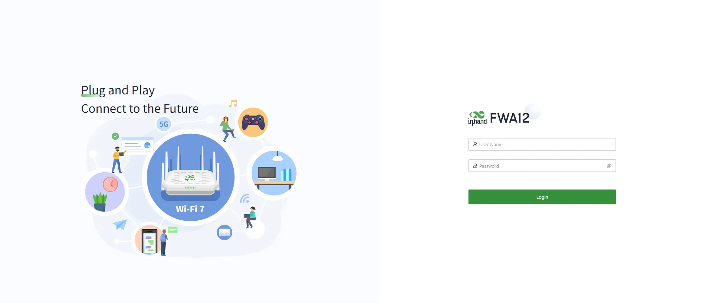

<strong>Fig. 2-1 Web Login Interface</strong>

#### 2.2.4 Network Connection Verification

Navigate to [Dashboard] → [Interface Status].
- A successful Internet connection is indicated when the Cellular or WAN icon turns green.
- Click the corresponding icon to view detailed interface information, including signal strength, IP address, and data usage.

If the device does not establish a connection:
1. Go to [Internet] → [Uplink Table] → [Edit] to review or configure network parameters.
2. By default, dial-up and WAN are enabled. Wait a few minutes for the device to attempt connection.
3. If it still fails to connect, return to the same menu and re-enable the dial-up function to retry the connection process.

### 2.3 Quick Check

After installation, verify the following items:

- [ ] The device is powered on and the System indicator is steady green.
- [ ] The PC is correctly connected to the device's LAN port.
- [ ] The PC has successfully obtained an IP address in the 192.168.2.0/24 subnet.
- [ ] The browser can access 192.168.2.1 and display the login page.
- [ ] Login with the default username and password (from the device label) is successful.

---

## Chapter 3 Common Scenario Configuration

### Scenario 1: Cellular Internet Access

**Objective**: Access the Internet via 4G/5G cellular network.

**Prerequisites**: The SIM card has been inserted, antennas are installed, and the device is powered on.

**Estimated Time**: ~5 minutes.

**Operation Steps**:

1. Insert the SIM card and install the cellular antennas.
2. Navigate to [Internet] → [Uplink Table], then click the "Edit" button for the Cellular interface.
3. Configure the dial-up parameters as needed (APN parameters must be obtained from the carrier).
4. Click "Save" and wait for the connection to establish.

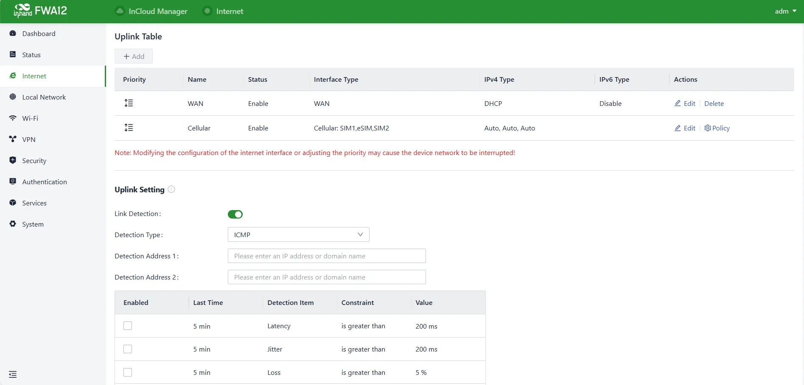

<strong>Fig. 3-1 Edit the Cellular Interface</strong>

**Verification Method**:

1. Check the indicator status to confirm the network connection is normal.
2. Access an Internet website to confirm it loads correctly.

**Common Issues**:

- Network connection failure: Verify the SIM card is properly inserted and the APN parameters are correct.
- Data transmission/reception anomalies: Check the signal strength and data plan balance.

### Scenario 2: WAN Broadband Access

**Objective**: Access the Internet via the wired WAN port.

**Prerequisites**: The WAN port is connected to an upstream network device (such as a modem or optical network unit) via an Ethernet cable, and the device is powered on.

**Estimated Time**: ~5 minutes.

**Operation Steps**:

1. Connect the WAN port to the upstream network device using an Ethernet cable.
2. Navigate to [Internet] → [Uplink Table], then click the "Edit" button for the WAN interface.
3. Select the Internet connection mode according to the upstream network requirements:
   - **DHCP**: Enabled by default. The device obtains an IP address automatically.
   - **Static IP**: Manually assign a static IP address obtained from the ISP or upstream network device.
   - **PPPoE**: Configure the PPPoE service on the WAN port for broadband dial-up.
4. Click "Save" and wait for the connection to establish.

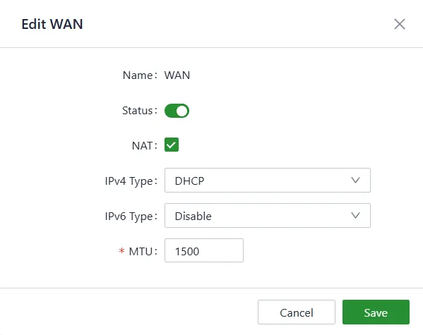

<strong>Fig. 3-2 DHCP Client Configuration</strong>

**Verification Method**:

1. Navigate to [Dashboard] → [Interface Status] and confirm the WAN icon turns green.
2. Access an Internet website to confirm it loads correctly.

**Common Issues**:

- No IP address obtained: Confirm the upstream device has the DHCP server enabled.
- PPPoE dial-up failure: Verify the broadband account and password are correct.

### Scenario 3: Wi-Fi Configuration

**Objective**: Configure the wireless network parameters for client access.

**Prerequisites**: The device is powered on and the Web management interface is accessible.

**Estimated Time**: ~5 minutes.

**Operation Steps**:

1. Navigate to [Local Network] → [Wi-Fi].
2. Click the "Edit" button for the target SSID.
3. Configure the wireless parameters, including SSID name, security mode, and password.
4. Click "Save" to apply the settings.

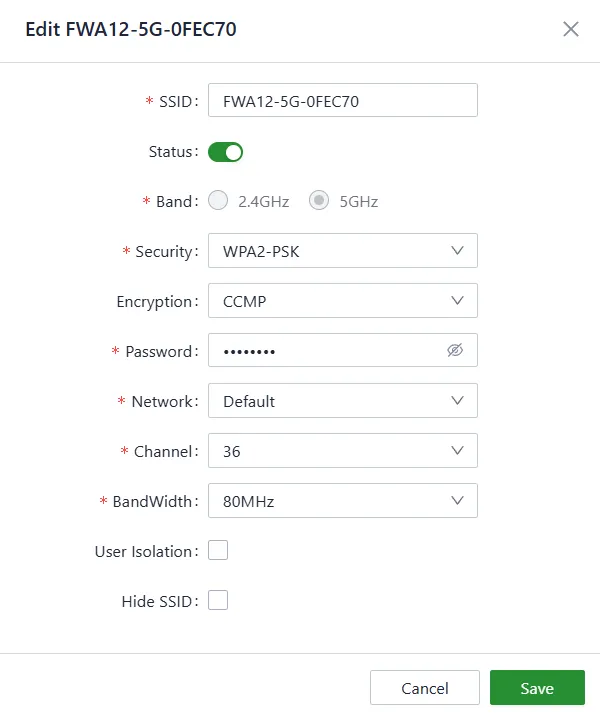

<strong>Fig. 3-3 Set the SSID's Parameters</strong>

**Verification Method**:

1. Use a wireless client to search for the configured SSID.
2. Connect using the configured password and confirm Internet access.

**Common Issues**:

- SSID not found: Check whether the corresponding frequency band AP is enabled.
- Connection failure: Verify the password is correct and the security mode is compatible.

### Scenario 4: VPN Remote Access

**Objective**: Establish a secure VPN connection for remote access or site-to-site connectivity.

**Prerequisites**: The device has Internet access, and the peer VPN device or server parameters are known.

**Estimated Time**: ~15 minutes.

**Operation Steps**:

1. Navigate to [VPN] → [IPSec VPN] or [VPN] → [L2TP VPN] according to the required VPN type.
2. Click the "Add" button to create a new VPN entry.
3. Configure the VPN parameters, including peer address, pre-shared key, local subnet, and peer subnet.
4. Click "Save" to apply the settings.

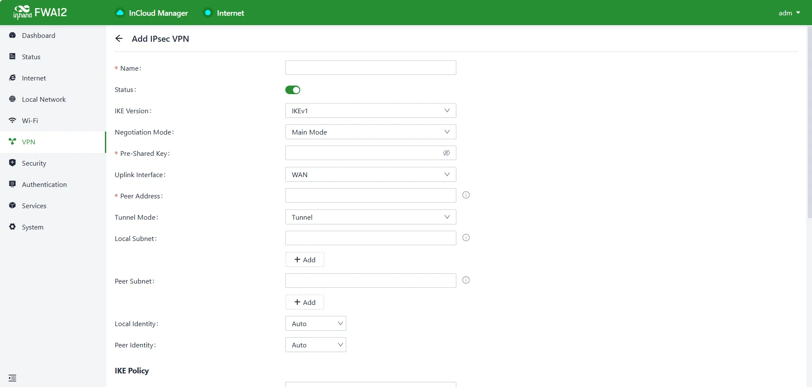

<strong>Fig. 3-4 Set the IPSec VPN's Parameters</strong>

**Verification Method**:

1. Navigate to [Status] → [VPN] to check whether the VPN tunnel status is connected.
2. Test data transmission between the local subnet and the peer subnet.

**Common Issues**:

- Tunnel establishment failure: Verify the peer address is reachable and the pre-shared key matches on both ends.
- No data transmission after connection: Check the local subnet and peer subnet configuration.

---

## Chapter 4 Feature Description and Parameter Reference

### 4.1 Monitoring

Once the device is registered on the InCloud Manager platform (accessible at https://star.inhandcloud.com), it can be remotely managed and monitored. The platform allows real-time status information to be viewed from the device's local interface while managing it from anywhere.

#### 4.1.1 Device Overview

In the "Devices" section, click the "Device Name" to access the device's details page.

 **Overview**

Click the [Overview] sub-menu to view the system summary. On this page, key device information, interface status, uplink connectivity, and MQTT connection details can be checked.

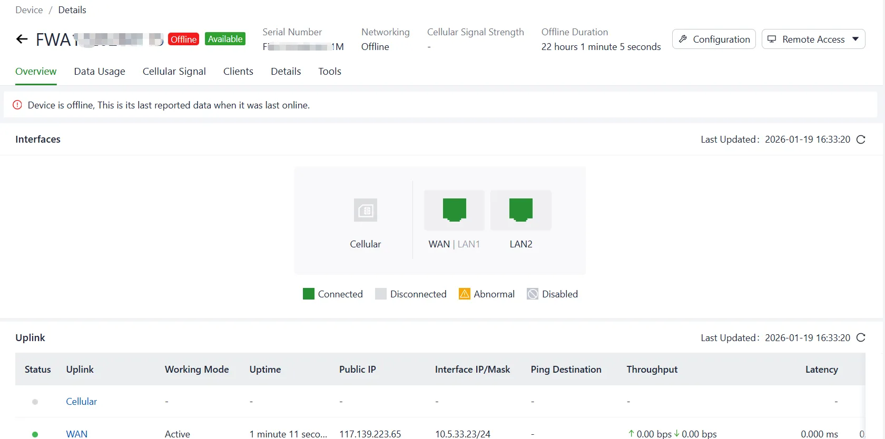

<strong>Fig. 4-1 View the Device</strong>

**Data Usage**

On this page, real-time traffic consumption can be monitored and historical usage trends for each WAN link can be viewed.

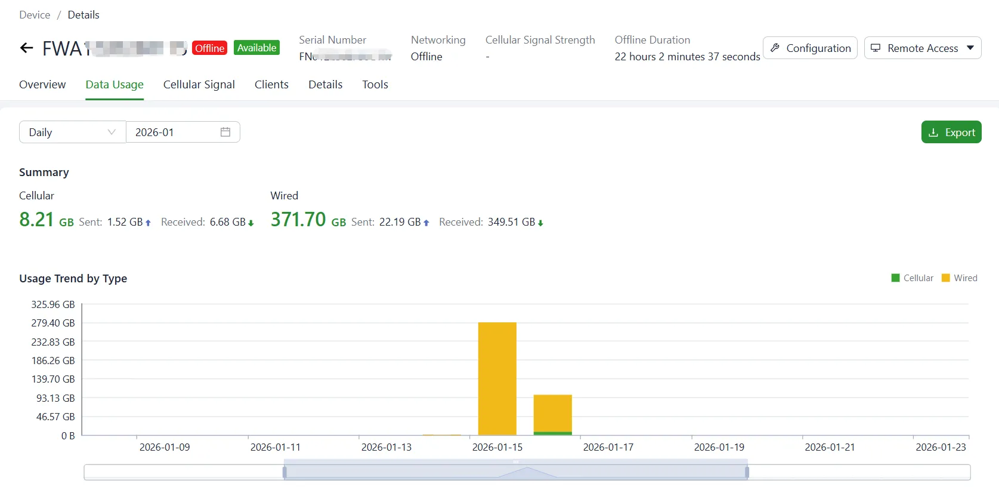

<strong>Fig. 4-2 Check the Traffic Data Usage Record</strong>

**Cellular Signal**

Within this section, key cellular signal metrics can be monitored over time. Graphs are provided for RSSI, RSRP, RSRQ, and SINR, allowing signal strength and quality trends to be tracked.

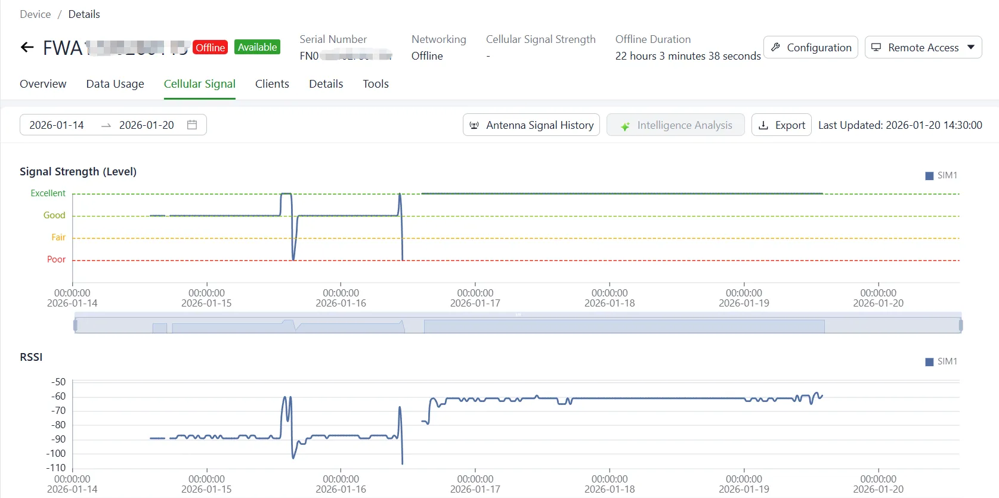

<strong>Fig. 4-3 Cellular Signal</strong>

#### 4.1.2 Local Device Information

Through the platform's "Remote Access" feature, real-time viewing and configuration of devices can be assisted. Select the target device, click "Remote Access," and the device's local login interface will open.

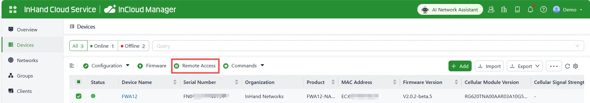

<strong>Fig. 4-4 Remote Access Entry</strong>

**Device Information**

In the [Dashboard] → [Device Information] interface, details about the device name, model, S/N, firmware version, and so on can be checked.

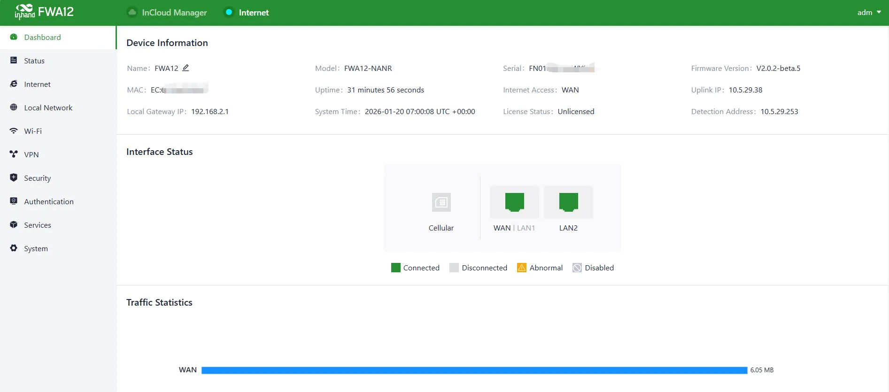

<strong>Fig. 4-5 Device Information Panel</strong>

- **Name**: Identifies the device's name. The default is "FWA12", but it can be modified.
- **MAC Address**: Identifies the device's physical MAC address.
- **Local Gateway IP**: The default subnet gateway address for the device.
- **Model**: The specific model of the device helps determine if it supports cellular and WLAN features.
- **Uptime**: The device's running time since power-up.
- **System Time**: Displays the device's time zone and system time.
- **Serial**: A unique code that identifies the device, which can be used for indexing or adding to a platform account.
- **Internet Access**: The upstream interface used for device connectivity.
- **License Status**: Information about the license applied to the device, which may include the InCloud Manager Basic or Professional version.
- **Firmware Version**: The current software version used by the device.
- **Uplink IP**: The IP address of the upstream interface used for device connectivity.

**Interface Status**

In the [Dashboard] → [Interface Status] feature, the operational status of each interface can be visually checked. By clicking the "Interface icon," detailed information about each interface can be viewed in a pop-up box on the right side of the interface.

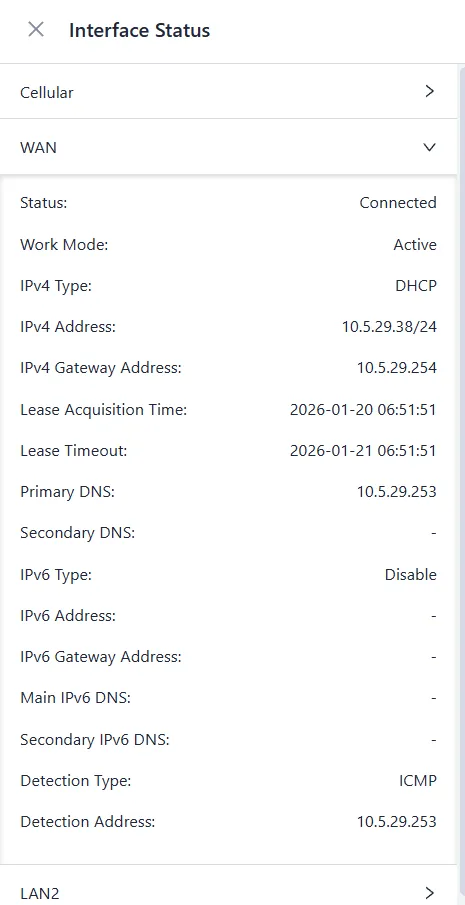

<strong>Fig. 4-6 Detailed Port Information</strong>

**Traffic Statistics**

The [Dashboard] → [Traffic Statistics] feature can be used to monitor the usage of traffic on each upstream interface since the router was powered on. The traffic statistics data will reset after a device reboot. If historical traffic records need to be viewed, they can be found on the corresponding device's details page in the InCloud Manager Platform.

<strong>Fig. 4-7 Traffic Statistics</strong>

**Wi-Fi Connections**

In the [Dashboard] → [Wi-Fi Connections] feature, the number of currently enabled SSIDs on the 5G FWA12 and the number of clients connected per SSID can be viewed.

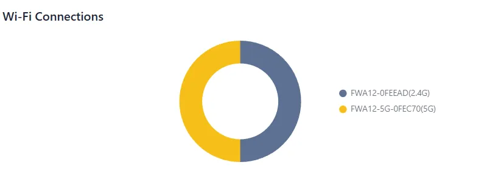

<strong>Fig. 4-8 Wi-Fi Connections Panel</strong>

**Client Traffic Top 5**

In the [Dashboard] → [Top 5 Client Traffic] feature, the current ranking of client traffic usage for devices connected to the router can be viewed. It displays up to 5 records, and when a client disconnects, its statistical data will be cleared.

<strong>Fig. 4-9 Top 5 Clients Ranked by Traffic Usage</strong>

**Link Monitor**

The health status of upstream links and information such as throughput, latency, packet loss, signal strength, and more for each interface can be monitored through the [Status] → [Link Monitoring] feature.

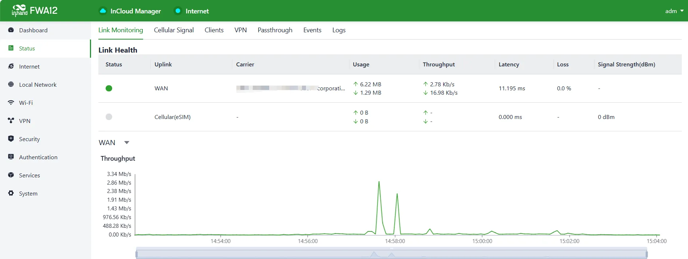

<strong>Fig. 4-10 Link Monitor Panel</strong>

**Cellular Signal**

The signal strength as well as parameters like RSSI, SINR, RSRP, and more of the cellular dial-up can be checked through the [Status] → [Cellular Signal] feature.

**Clients**

Detailed information about wired/wireless clients connected to the router, including details like name, IP address, MAC address, VLAN, connected subnet, traffic usage, online duration, and more can be accessed through the [Status] → [Clients] feature.

**VPN**

Information about IPSec VPN and L2TP VPN, including status, traffic, and the duration of the most recent connection, can be viewed through the [Status] → [VPN] feature.

**Events**

This device records event logs, including user login, configuration changes, link changes, reboot, and other events. This information can be checked in the [Status] → [Events] interface, and specific events on a particular date can be viewed by setting the start and end dates or choosing the event type.

 **Logs**

The device records the logs generated during operation to facilitate fault localization and diagnosis when the device encounters malfunctions.

The recorded logs can be checked in the [Status] → [Logs] interface. At the same time, specific logs on a particular date can be checked by setting the start and end dates or setting a keyword.

- **Download Logs**: Download the device's operational logs.
- **Download Diagnostic Logs**: Download the device's diagnostic logs, which include system operation logs, device information, and device configurations.
- **Clear Logs**: Clear the device's operational logs; this does not clear the device's diagnostic logs.

### 4.2 Internet

Navigate to [Internet] in the left-hand menu to review and configure the device's uplink interfaces and multi-link operation mode.

> **Note**: Modifying uplink settings may temporarily disrupt network connectivity. Proceed with caution.

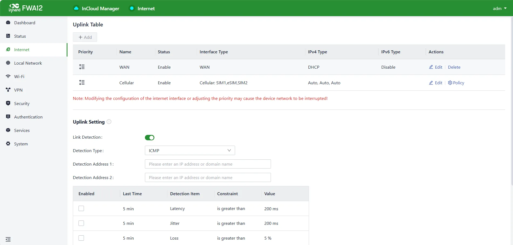

<strong>Fig. 4-11 Internet Page</strong>

#### 4.2.1 Uplink Table

The WAN1 and Cellular interfaces can be edited, and WAN2 and Wi-Fi (STA) interfaces can be added/edited/deleted in the [Internet] → [Uplink Table]. The "Priority" icons can be dragged to adjust the priority of each interface. Priorities are arranged from top to bottom, determining the current upstream interface used by the device.

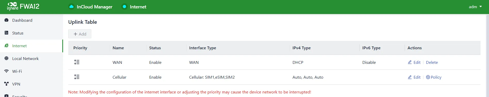

<strong>Fig. 4-12 Uplink Table</strong>

**Cautions**:

1. The WAN interface will be switched to the LAN1 interface. Routing, policy routing, inbound/outbound rules, port forwarding, DDNS, and VPN related to the WAN interface will be deleted.

The WAN port of the device supports three different Internet connection modes:

1. **DHCP**: The DHCP service is enabled on the WAN port by default, which means this device cannot connect to the Internet immediately if the upstream device connected to the WAN port does not have the DHCP server enabled.

<strong>Fig. 4-13 DHCP Client</strong>

2. **Static IP**: A static IP address obtained from the ISP or upstream network device can be assigned manually.

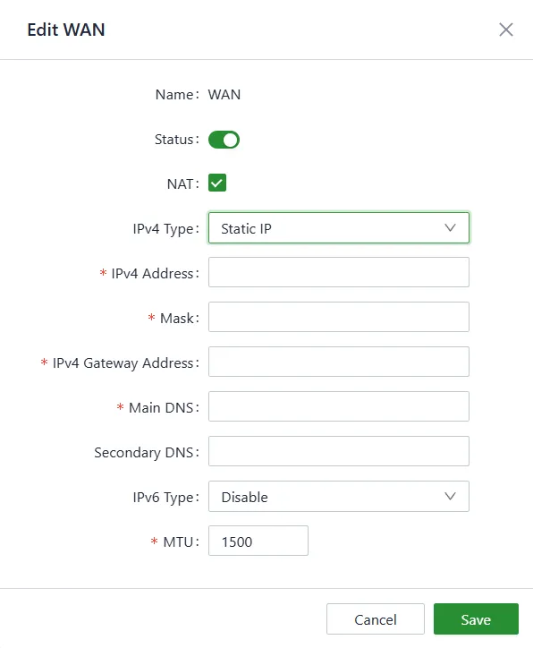

<strong>Fig. 4-14 Set the Static IP</strong>

3. **PPPoE**: The PPPoE service can be set on the WAN port so that this device can dial up to the Internet through the broadband service.

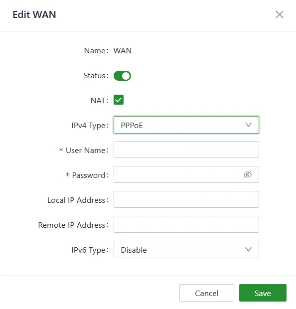

<strong>Fig. 4-15 Set the PPPoE Service</strong>

The Cellular interface supports three working modes of SIM cards. The SIM card working mode and other dial-up parameters can be configured in [Internet] → [Uplink Table] → [Cellular].

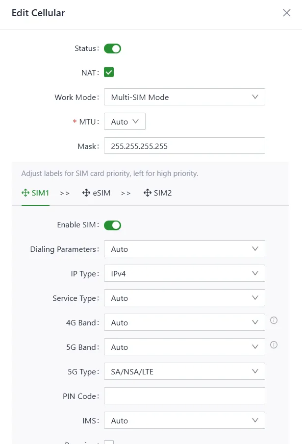

<strong>Fig. 4-16 Configure the Dial-up Parameters</strong>

#### 4.2.2 Uplink Settings

Link detection-related settings can be configured in the [Internet] → [Uplink Setting] feature, and the collaboration mode between various uplink interfaces can be configured.

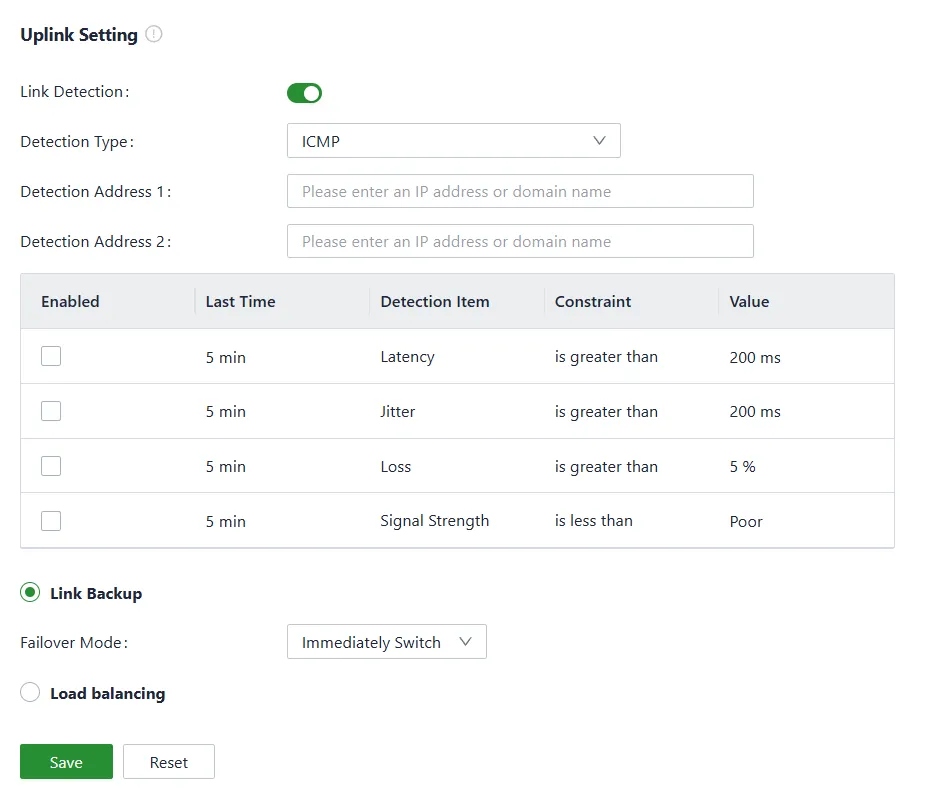

<strong>Fig. 4-17 Uplink Settings</strong>

"Link detection" is enabled by default. In a private network environment, manually configure the address in "Test Connectivity to" or disable the link detection function to prevent the cellular interface from malfunctioning.

**Cautions**:

If the detection is disabled, latency, jitter, loss, or signal strength will not be displayed in [Status].

When multiple upstream links are available on the device, the desired working mode for multi-link operation can be selected based on requirements:
- **Link Backup**: The device will monitor the enabled items and trigger a link switch when any item exceeds the threshold. If no item is enabled, the link switch will only be triggered based on priority.
- **Load Balancing**: The device will forward and distribute traffic to all operational upstream links.

### 4.3 Local Network

The LAN network of the device can be configured in [Local Network] → [Local Network List].

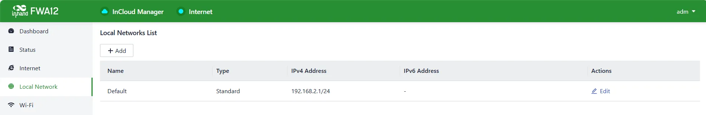

<strong>Fig. 4-18 Local Network Interface</strong>

The LAN network parameters can be set by clicking the "Edit" button.

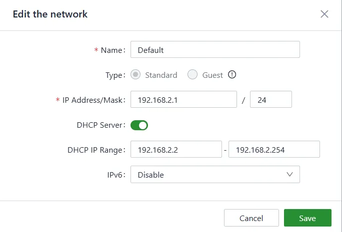

<strong>Fig. 4-19 Configure the LAN Network Parameters</strong>

### 4.4 Wi-Fi

Wi-Fi is a widely used wireless communication technology that allows computers, smartphones, tablets, and other devices to connect to the Internet or a local network. Wi-Fi technology enables devices to transmit data within a certain range using wireless signals, providing the convenience of accessing networks without physical connections.

The 5G FWA12 can function as an access point (AP) and provide multiple SSIDs for wireless network access, allowing different SSIDs to be customized for various purposes and configurations.

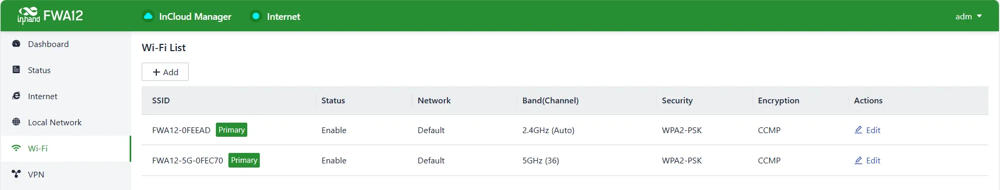

<strong>Fig. 4-20 Wi-Fi Interface</strong>

The parameters can be configured by clicking the "Edit" button.

<strong>Fig. 4-21 Set the SSID's Parameters</strong>

**Notes**:

1. The device comes with two default main SSIDs for 2.4 GHz and 5 GHz, and these main SSIDs cannot have their frequency bands modified or deleted.
2. Once an SSID is added, its frequency band cannot be modified, and the channel will automatically align with the channel of the corresponding main SSID.
3. The FWA12 series products only support AP mode and do not support Wi-Fi STA.

### 4.5 VPN

A VPN (Virtual Private Network) is designed to create a secure and private network within a public network, enabling encrypted communication. With a VPN router, remote access is made possible by encrypting data packets and modifying their destination addresses. VPN can be implemented using server-based, hardware-based, or software-based solutions. In comparison to traditional DDN private lines or frame relays, VPN offers a more secure and convenient remote access solution.

#### 4.5.1 IPSec VPN

IPsec (Internet Protocol Security) VPN is a protocol suite designed to enhance network communication security. Its primary purpose is to protect the transmission of data through encryption and authentication. It is widely used for establishing secure remote access, site-to-site connections, and virtual private networks (VPNs).

A new IPSec VPN item can be created by [VPN] → [IPSec VPN] → [Add], and the following parameters must be set correctly.

<strong>Fig. 4-22 Set the IPSec VPN's Parameters</strong>

1. **Name**: Specify the name of the IPSec VPN created on the device, which is used for local VPN management.
2. **IKE Version**: Specify the version of the IKE protocol used on this device. IKEv1 and IKEv2 are optional.
3. **Pre-Shared Key**: Specify the authentication key for IKE negotiation, which must be consistent on both sides.
4. **Uplink Interface**: Specify the local uplink interface used to establish the tunnel.
5. **Peer Address**: Specify the IP address of the peer device. The peer address must be set to 0.0.0.0 if the device works as an IPSec VPN server.
6. **Tunnel Mode**: Specify the IP packet encapsulation mode on the IPSec VPN tunnel. Tunnel mode and transmission mode are optional.
7. **Local Subnet**: Specify the IP address segment of the traffic to be sent out by the device through the IPSec VPN tunnel.
8. **Peer Subnet**: Specify the IP address segment used for communication on the remote client.
9. **IKE Policy**:
   1. **Encryption**: Specify the encryption algorithm for IKE.
   2. **DH Groups**: Specify the DH key exchange mode.
   3. **Lifetime**: Specify the lifetime of the IKE SA. 86400 is set by default.
10. **IPSec Policy**:
    1. **Security Protocol**: Specify the security protocol used for ESP.
    2. **Encryption**: Specify the encryption algorithm of the ESP protocol.
    3. **Authentication**: Specify the authentication algorithm for ESP.
    4. **PFS Groups**: Specify the Perfect Forward Secrecy (PFS) mode, which improves communication security through an additional key exchange in Phase 2 negotiation.
    5. **Lifetime**: Specify the lifetime of the IPSec SA. 86400 is set by default.

#### 4.5.2 L2TP VPN

The Layer 2 Tunneling Protocol (L2TP) is a Layer 2 VPN protocol designed to provide secure point-to-point or site-to-site virtual private network (VPN) connections. It is commonly used for remote access and branch office connectivity, establishing secure communication channels for users or networks, thus ensuring the privacy and integrity of data transmission.

A new L2TP VPN can be added or an existing one can be configured in [VPN] → [L2TP VPN].

**Server**

Typically, the L2TP server is strategically deployed at the enterprise's headquarters to facilitate remote access for employees. The server can be configured in [VPN] → [L2TP VPN] → [Server].

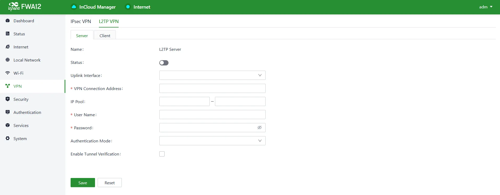

<strong>Fig. 4-23 L2TP VPN Interface</strong>

The following parameters must be configured based on actual network requirements:
- **Name**: The name of the L2TP server, which cannot be changed.
- **Status**: This L2TP server can be enabled or disabled by clicking the switch.
- **Uplink Interface**: Specify the uplink interface to establish a tunnel from the L2TP server.
- **VPN Connection Address**: Specify the gateway address for the L2TP VPN client.
- **IP Pool**: The system will assign an IP address to the L2TP client from the specified IP address pool.
- **Username/Password**: Specify the username and password for L2TP negotiation, which must be consistent on both ends of the tunnel.
- **Authentication Mode**: Specify the authentication mode for the L2TP tunnel.
- **Enable Tunnel Authentication**: Both ends of the tunnel must be configured with the same username and password for this option.

**Client**

The L2TP client parameters can be configured to establish a tunnel with a remote L2TP server in [VPN] → [L2TP VPN] → [Clients].

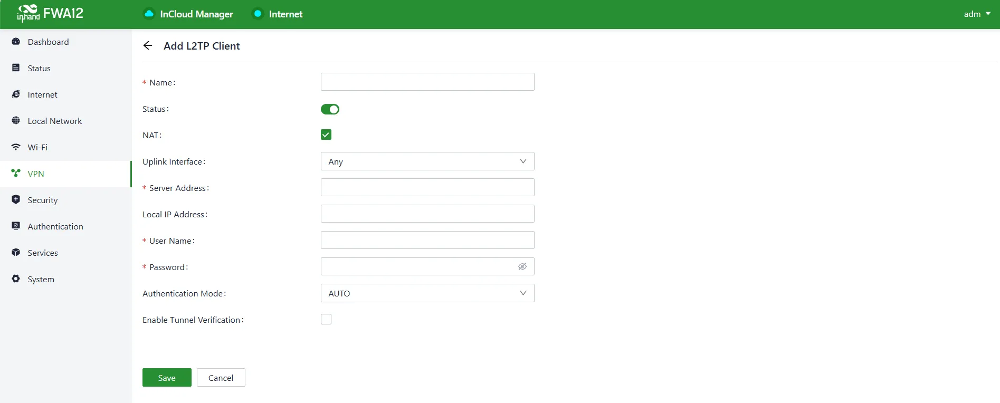

<strong>Fig. 4-24 L2TP VPN Client Interface</strong>

The following parameters must be configured based on actual network requirements:
- **Name**: Specify the local name of the L2TP client tunnel.
- **Status**: This L2TP client can be enabled or disabled by clicking the switch.
- **NAT**: The NAT function can be enabled or disabled by clicking the switch.
- **Uplink Interface**: Specify the uplink interface to establish a tunnel with a remote L2TP server.
- **Server Address**: Specify the IP address set by the remote L2TP server.
- **Username/Password**: Specify the username and password for L2TP negotiation, which must be consistent on both ends of the tunnel.
- **Authentication Mode**: Specify the authentication mode for the L2TP tunnel.
- **Enable Tunnel Verification**: Both ends of the tunnel must be configured with the same server's name and verification key as this option is enabled.

#### 4.5.3 VXLAN VPN

VXLAN (Virtual Extensible LAN) is essentially a tunneling technology that establishes a logical tunnel over an IP network between the source and destination network devices. It achieves data transmission and forwarding by encapsulating user-side packets in a specific manner.

Click the "Add" button under [VPN] → [VXLAN VPN] to create a new VXLAN VPN.
- **Name**: Set the name for this VXLAN VPN network.
- **Upstream Interface**: The outbound interface used to establish a VXLAN tunnel with other devices.
- **Peer Address**: Configure the IP address of the peer device with which this device needs to establish a VXLAN VPN network.
- **VNI (Virtual Network Identifier)**: An identifier for the VXLAN network; one VNI represents one tenant.
- **Local Subnet**: Define the address range acquired by local client devices when accessing the network.

### 4.6 Security

In the [Security] menu, advanced features related to firewalls, policy routing, and traffic shaping can be configured.

#### 4.6.1 Firewall

The firewall currently includes functions such as inbound rules, outbound rules, port forwarding, MAC address filtering, and more.

**1. Inbound Rules**

Traffic accessing the internal network from the outside will be restricted by configured inbound rules,which forbid all through by default. 

**2. Outbound Rules**

Traffic accessing the external network from the inside will be restricted by configured outbound rules, which allow all through by default.

Traffic entering and leaving can be controlled based on interfaces using the [Security] → [Firewall] → [Inbound Rules/Outbound Rules] feature. For example, if a large volume of attack traffic is experienced from a specific source IP address, inbound firewall rules can be used to limit the traffic data from that IP address.

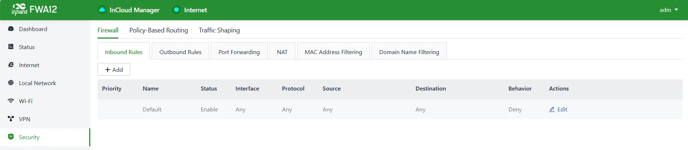

<strong>Fig. 4-25 Set the Inbound/Outbound Rules</strong>

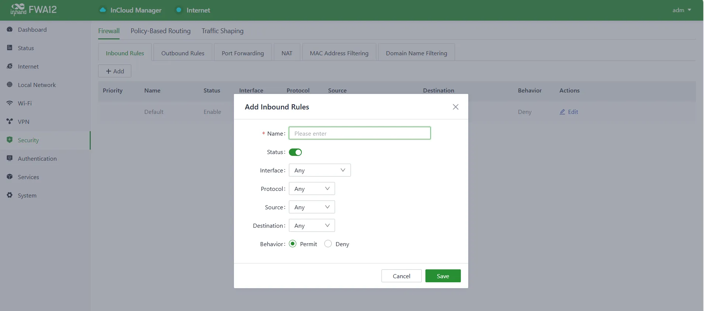

<strong>Fig. 4-26 Add an Inbound Rule</strong>

The following parameters must be configured properly:
1. **Name**: Set the local identifier of the inbound rule.
2. **Status**: This rule can be enabled or disabled by clicking the switch.
3. **Interface**: Set the forwarding interface for traffic. In the inbound direction, the outbound interface is generally the upstream interface of the device.
4. **Protocol**: Configure the protocol type of packets to be matched. Options: Any, UDP, TCP, ICMP, Custom.
5. **Source**: Set the source IP address of packets to be matched, supporting IP address or retaining the default option Any.
6. **Destination**: Set the destination IP address of the packets to be matched, supporting entering an IP address or retaining the default option Any.
7. **Behaviour**: Set the behaviour if the traffic matches the configured rules.

**3. Port Forwarding**

Port forwarding, also known as port mapping and port redirection, is the practice of redirecting network packets from one network port (or address) to another network port (or address). Port forwarding rules can be configured in [Security] → [Firewall] → [Port Forwarding]. When external traffic accesses a specific port on the router, the device forwards the data to the corresponding port on the internal client, enabling external access to servers within the router's network.

For example, after setting port forwarding rules as below, when users from the public network try to access the device's port 2000 on WAN, the system will transfer the request to 192.168.1.23:8080 in LAN.

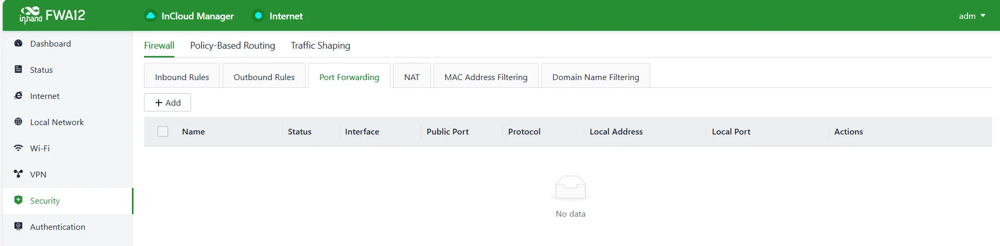

<strong>Fig. 4-27 Set the Port Forwarding Rules</strong>

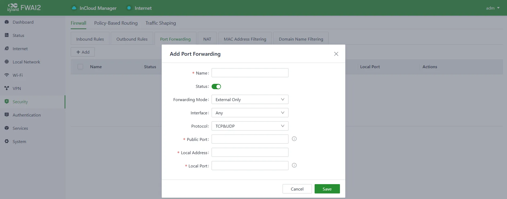

<strong>Fig. 4-28 Add a Port Forwarding Rule</strong>

The following parameters must be set properly:
1. **Name**: Set the local identifier of the port forwarding rule.
2. **Status**: This rule can be enabled or disabled by clicking the switch.
3. **Interface**: Set the uplink interface that provides port mapping for internal clients. This interface must be configured with a public IP address.
4. **Protocol**: Set the protocol of the port on which port mapping takes effect. It supports TCP, UDP, and TCP&UDP.
5. **Public Port**: Set the protocol port on the uplink interface to be mapped.
6. **Local Address**: Set the IP address of the target client that external users need to access.
7. **Local Port**: Set the protocol port that external users need to access on the target client.

**4. NAT**

**SNAT**: Source NAT refers to modifying the source IP address of a data packet. It is typically used when internal hosts access external networks, converting the private IP address of the internal host to a public IP address. This way, the external network will see the public IP address rather than the actual private IP address.

**Application scenario**:
- **Internal network accessing external network**: For example, when an internal host accesses the Internet through a NAT router, the source IP is changed to the router's public IP address.

**DNAT**: Destination NAT refers to modifying the destination IP address of a data packet. It is typically used to convert the destination address of a packet from an external network to the IP address of an internal device. This allows external networks to access services located within a private network.

**Application scenario**:
- **External access to internal servers**: For example, forwarding external requests to a specific service provided by an internal server. It is commonly used for web servers, FTP servers, remote desktop access, etc.

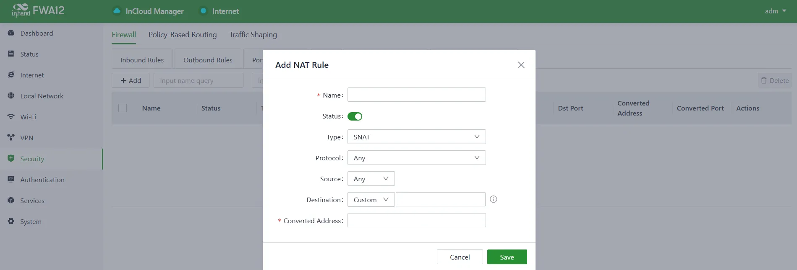

<strong>Fig. 4-29 Add a NAT Rule</strong>

1. **Name**: The name of the NAT rules.
2. **Status**: The on/off switch for the NAT function.
3. **Protocol**: The protocols affected by NAT conversion. Supports TCP, UDP, and TCP & UDP.
4. **Source**: The upstream interface that provides mapping functionality for internal clients. The upstream interface needs public IP address support.
5. **Public Port**: The port number on the upstream interface that provides mapping.
6. **Local Address**: The address of the target device located under the router that the external network needs to access.
7. **Local Port**: The port of the target device that the external network needs to access. It needs to be consistent with the public port input range.

**5. MAC Address Filter**

MAC address filtering refers to the practice of blocking or allowing devices to access the Internet based on a list of MAC addresses. This means that internet access requests from devices within the local network can be controlled using the MAC address filtering feature on the router. MAC address filtering rules can be configured in [Security] → [Firewall] → [MAC Address Filtering].

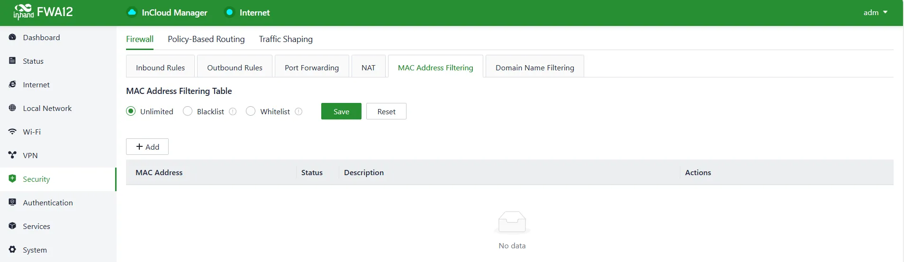

<strong>Fig. 4-30 Set the MAC Address Filter Rule</strong>

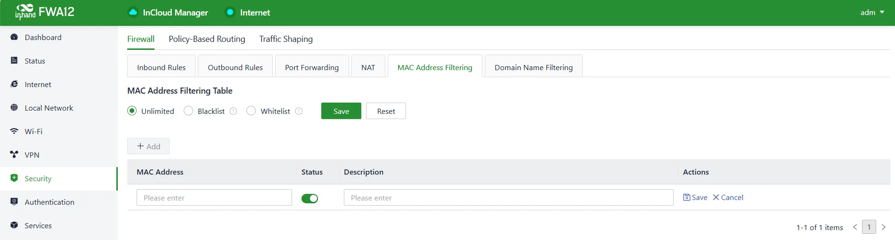

<strong>Fig. 4-31 Add a MAC Address Filter Rule</strong>

1. **Blacklist**: Devices in the blacklist will not be able to access the Internet.
2. **Whitelist**: Only devices in the whitelist are allowed to access the Internet.

**6. Domain Name Filtering**

In this feature, filtering rules for domain names can be set. By default, there are no restrictions.

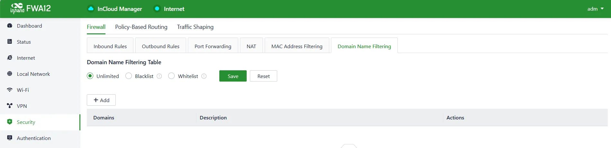

<strong>Fig. 4-32 Add a Domain Name Filter Rule</strong>

1. **Whitelist**: Only domains on the whitelist are allowed to be accessed.
2. **Blacklist**: Domain addresses on the blacklist will be blocked from access.

#### 4.6.2 Policy-Based Routing

Policy-based routing (PBR) allows the device to forward different data flows through different links based on configured policies. This feature enables flexible route selection and control, thus improving link utilization and reducing the operational cost of the enterprise.

The rules can be set in [Security] → [Policy-Based Routing] → [Add/Edit].

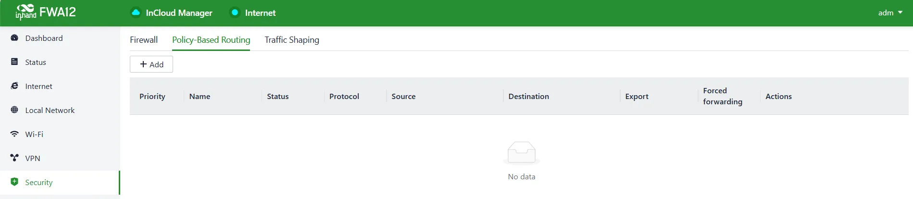

<strong>Fig. 4-33 Policy-Based Routing Interface</strong>

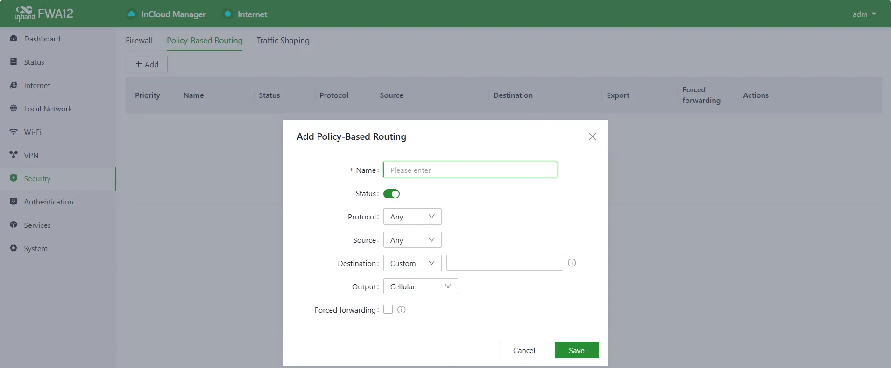

<strong>Fig. 4-34 Add a Policy-Based Routing</strong>

The following parameters must be set properly:
1. **Name**: Set the local identifier of the rule.
2. **Status**: This rule can be enabled or disabled by clicking the switch.
3. **Protocol**: Set the protocol of the port. It supports TCP, UDP, and TCP&UDP.
4. **Source**: Set the source IP address of packets to be matched, supporting IP address or retaining the default option Any.
5. **Destination**: Set the destination IP address of the packets to be matched, supporting entering an IP address or retaining the default option Any.
6. **Output**: Set the traffic egress interface. Optional: WAN port and cellular.

#### 4.6.3 Traffic Shaping

Create shaping policies to apply per-user controls on a per-protocol basis to optimize the network. This function can also reduce bandwidth for recreational traffic and prioritize bandwidth for critical business traffic.

Traffic Shaping rules can be configured in [Security] → [Traffic Shaping] → [Add/Edit].

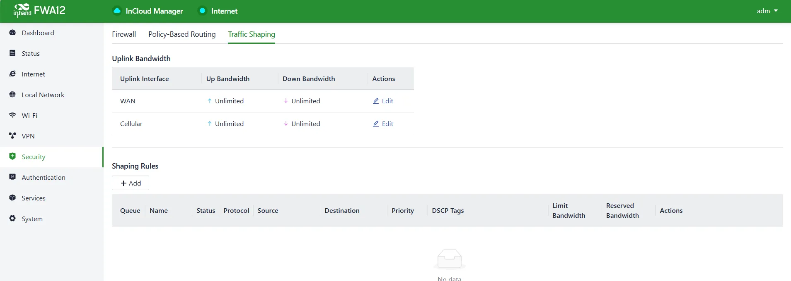

<strong>Fig. 4-35 Traffic Shaping Interface</strong>

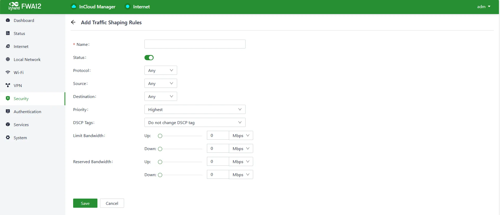

<strong>Fig. 4-36 Add a Traffic-Shaping Rule</strong>

Traffic shaping policies consist of a series of rules that are performed in order, which is similar to custom firewall rules. There are two main components to each rule: the type of traffic to be limited or shaped, and how that traffic should be limited or shaped.

**Notes**:

1. Traffic forwarding priority for unmatched rules is medium.
2. When Limit Bandwidth is set to 0, the system will not limit the bandwidth.
3. The value of Reserved Bandwidth should not be greater than the Limit Bandwidth.

### 4.7 Service

#### 4.7.1 Interface Management

The allowed local networks through a specified interface can be configured, and the interface's speed can be set in the [Services] → [Interface Management] function.

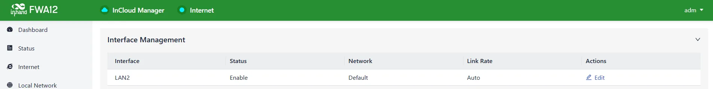

<strong>Fig. 4-37 Interface Panel</strong>

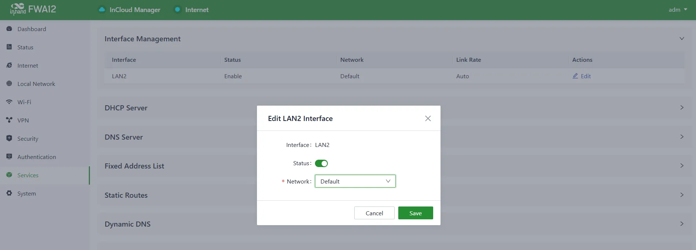

<strong>Fig. 4-38 Edit the Interface</strong>

#### 4.7.2 DHCP Server

The DHCP (Dynamic Host Configuration Protocol) service operates in a client/server communication mode, where clients request IP addresses from servers, and servers respond to these requests by assigning IP addresses dynamically to clients.

The DHCP server's IP address pool can be configured using the [Services] → [DHCP Server] feature.

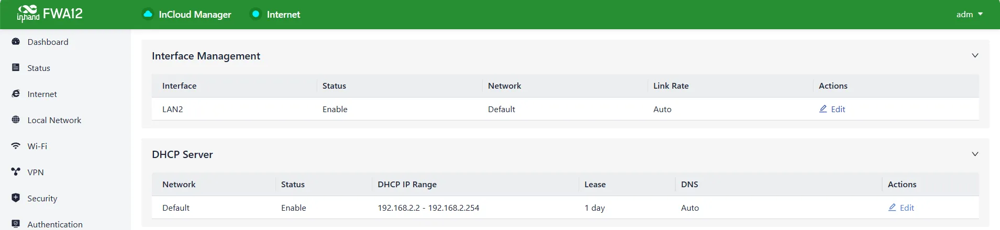

<strong>Fig. 4-39 DHCP Server Panel</strong>

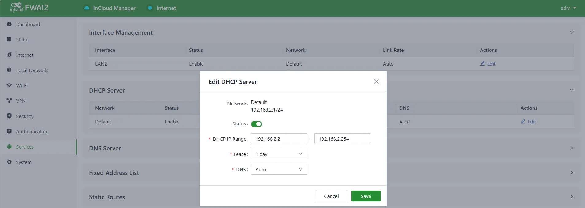

<strong>Fig. 4-40 Edit the DHCP Server</strong>

#### 4.7.3 DNS Server

DNS (Domain Name System) servers are a critical component of the network. They are responsible for translating human-readable domain names (e.g., www.example.com) into IP addresses that computers can understand (e.g., 192.168.1.1). DNS servers act as the Internet's address book, helping computers and devices locate the whereabouts of other devices and ensuring that information can be correctly transmitted on the network.

When no DNS server address is set in [Services] → [DNS Server], the device will use the DNS addresses obtained from the upstream interface for address resolution. Once DNS server addresses are configured, the specified DNS addresses will be used for address resolution.

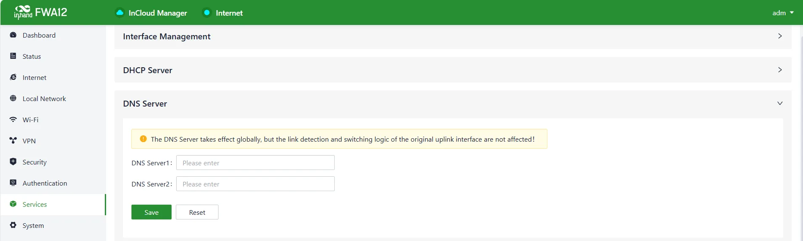

<strong>Fig. 4-41 DNS Server Panel</strong>

#### 4.7.4 Fixed Address List

A fixed IP address can be allocated to a device based on its MAC address using the [Services] → [Fixed Address List] feature. This ensures that the device receives the same IP address every time it connects to the 5G FWA12.

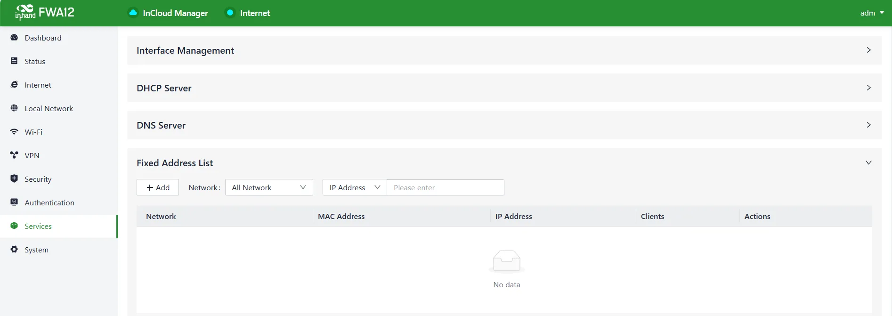

<strong>Fig. 4-42 Fixed Address Panel</strong>

**Cautions**:

1. The addresses available for allocation must fall within the address range of the IP-mode local network, or else the configuration will not take effect.
2. When a local network is deleted, all fixed address allocation rules within the address range of that local network will also be deleted.

#### 4.7.5 Static Routes

Static routing entries can be configured using the [Services] → [Static Routes] feature to manually define routes for data to be forwarded through specific paths and interfaces. The contents of the static routing table are created manually by users, and routes generated by other services, such as VPN functionality, will not appear in this table.

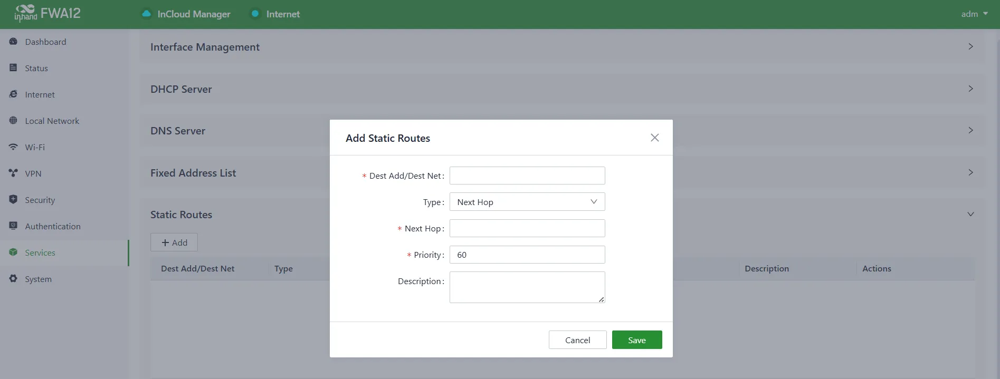

<strong>Fig. 4-43 Static Routes Interface</strong>

**Cautions**:

1. Static routes with the same destination address/network cannot have the same next-hop address, interface, or priority. Otherwise, it may lead to routing failures.
2. When WAN2, Wi-Fi (STA), or L2TP Client VPN is deleted, the corresponding static routes using those interfaces will also be removed.

#### 4.7.6 Dynamic DNS

Dynamic DNS (Dynamic Domain Name System) is used to automatically update the content of name servers in the Domain Name System. According to the rules of the Internet, domain names are usually associated with fixed IP addresses. Dynamic DNS technology provides fixed name servers for users with dynamic IP addresses, allowing external users to connect to users with dynamic IP addresses through regular updates of their URLs.

The Dynamic DNS server address can be manually configured under the [Services] → [Dynamic DNS] feature.

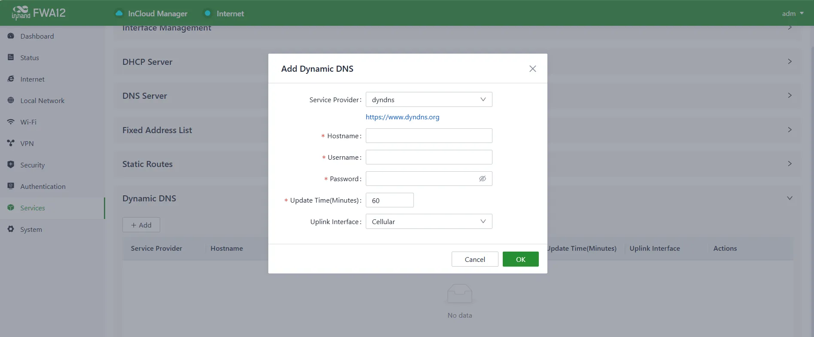

<strong>Fig. 4-44 Set the Dynamic DNS Address</strong>

1. **Service Provider**: Provided by the dynamic DNS service provider. Options include dyndns, 3322, oray, no-IP, or custom (requires a URL).
2. **Hostname**: Click on the URL below the service provider to register and obtain the hostname.
3. **Username**: Click on the URL below the service provider to register and obtain the username.
4. **Password**: The password set by the user during registration.

#### 4.7.7 Passthrough Settings

The IP Passthrough feature can be enabled in [Services] → [Passthrough Settings]. Once enabled, client devices can obtain the upstream interface address of the 5G FWA12.

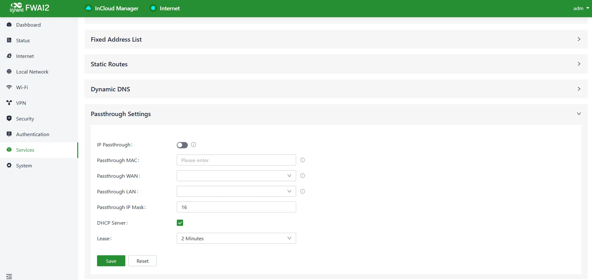

<strong>Fig. 4-45 Set the IP Passthrough Mode</strong>

**Passthrough MAC**: Only clients bound to this MAC can obtain the upstream interface address of the device.

**Cautions**:

1. Once the IP Passthrough mode is enabled, only one client can access the public network, and the following features are disabled: static routing, VPN, port forwarding, policy-based routing, SD-WAN Overlay, and cloud connectivity.
2. When accessing client devices, inbound rules need to be released.
3. The router can still be accessed via the default subnet's IP address.

### 4.8 System

#### 4.8.1 Cloud Management

**About InCloud Manager**

InCloud Manager (star.inhandcloud.com) is a cloud-based management platform developed by InHand Networks to simplify enterprise network deployment, operations, and user experience. Designed with a user-centric approach, it integrates zero-touch deployment, intelligent O&M, security protection, and an intuitive interface for streamlined network management. Once devices are connected to the platform, remote management, batch configuration, traffic monitoring, and other tasks can be performed centrally—making network administration more efficient and scalable.

**Cloud Management for 5G FWA12**

By default, the 5G FWA12 automatically registers with InCloud Manager once an Internet connection is established. If cloud management is not preferred, this feature can be disabled manually under [System] → [Cloud Management].

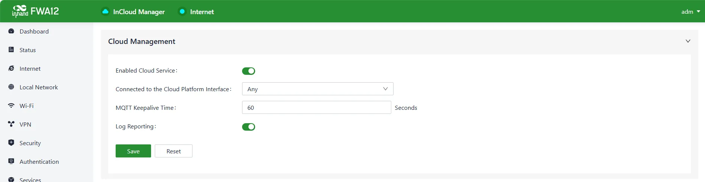

<strong>Fig. 4-46 Configure the Cloud Management Service</strong>

#### 4.8.2 Remote Access Control

Whether external access to the router's web configuration interface from the Internet is allowed can be controlled by configuring the [System] → [Remote Access Control] function. This feature also allows the service port for remote access to be set.

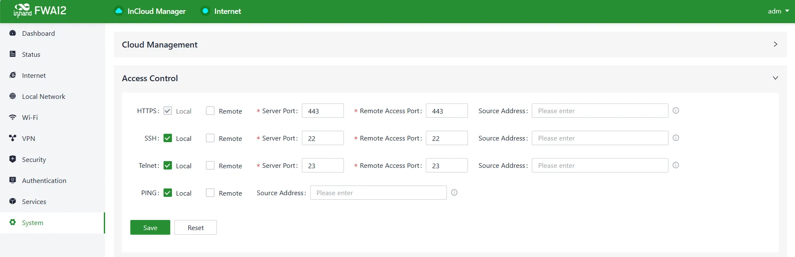

<strong>Fig. 4-47 Configure the Remote Access Control</strong>

1. **HTTPS**: When enabled, the router's web interface can be accessed remotely by entering the public IP address and port of the upstream interface in a web browser.
2. **SSH**: When enabled, the router's backend can be remotely logged in to by using remote tools like CRT, entering the public IP address and port of the device's upstream interface, along with a username and password.
3. **Ping**: When enabled, the upstream interface address allows external networks to initiate Ping requests.

#### 4.8.3 System Clock

In network functionality, the clock function refers to the capability used to coordinate and synchronize the time between network devices. Clock functionality within a network is crucial for data transmission, log recording, security, coordination, and troubleshooting. It ensures that various devices in the network are operating with synchronized times, which is essential for efficient and secure network operations.

The [System] → [Clock] function can be used to select the current time zone and configure NTP (Network Time Protocol) server addresses to synchronize the device's system time with an NTP server.

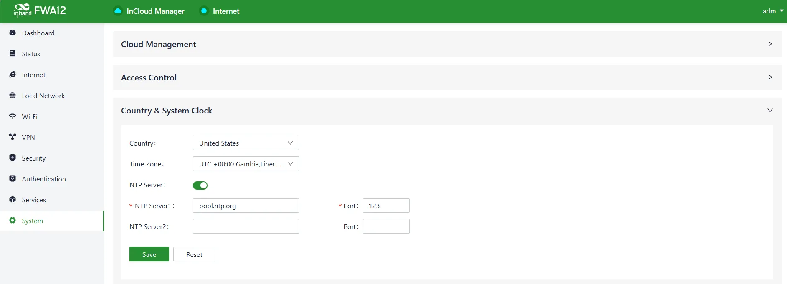

<strong>Fig. 4-48 Set the System Clock and NTP Server</strong>

#### 4.8.4 Device Options

In the [System] → [Device Options] section, various device operations such as rebooting, upgrading firmware, and restoring factory settings can be performed.

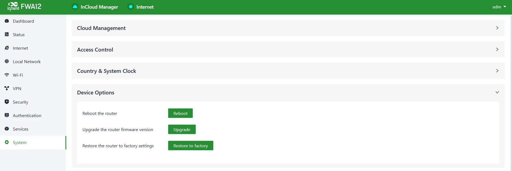

<strong>Fig. 4-49 Device Option Panel</strong>

**Cautions**:

1. When locally upgrading firmware, ensure that the firmware is obtained from a legitimate source to avoid rendering the device unusable due to incorrect firmware installation.
2. When a device is connected to the cloud platform, the platform will synchronize the previous configuration to the device again due to cloud-based configuration synchronization. The device will only clear historical data during the factory reset.

#### 4.8.5 Configuration Management

Configuring backups and backup recovery are critical tasks in network management and maintenance. They involve the process of preserving configuration information for network devices so that they can be quickly restored or migrated when needed. This practice ensures the resilience and reliability of network operations and simplifies the recovery process in case of system failures or configuration changes.

The device configuration can be exported to local storage in [System] → [Configuration Management]. This backup can be useful in cases where device configuration is lost or needs to be restored.

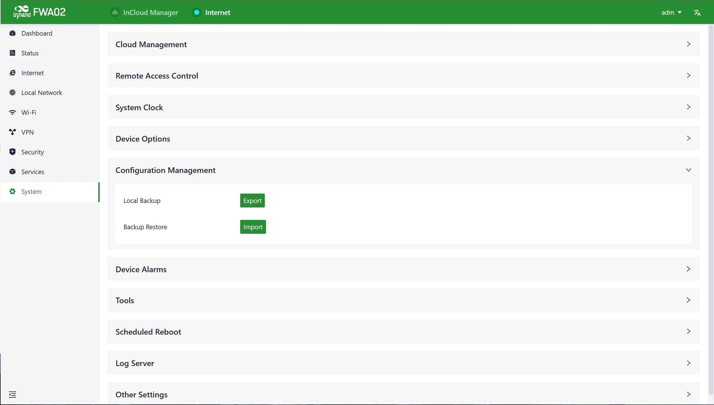

<strong>Fig. 4-50 Configuration Management Panel</strong>

#### 4.8.6 Device Alarms

When certain events that may occur on the device need to be paid special attention to, the corresponding alarm events can be checked and the email address to receive alarm notifications can be set in [System] → [Device Alarm]. Once an alarm event occurs, the device will automatically send the corresponding email notification. For alarm options that have not been checked, related alarm events will still be recorded in the device's local logs.

In the [System] → [Device Alarm] function, the alarm event types and the email address to receive alarm notifications can be set. This allows specification of which types of alarm events to be notified about via email and where those email notifications should be sent.

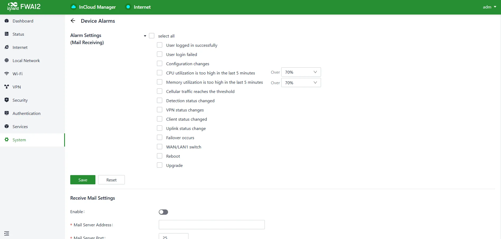

<strong>Fig. 4-51 Configure the Device Alarms</strong>

After configuring the outgoing email server address, port, username, and password, the device will use this email account to send alarm notifications. The "Send Test Email" option can be used to verify whether the outgoing email configuration is correct. This test email will help ensure that the device can successfully send alarm notifications to the specified email address.

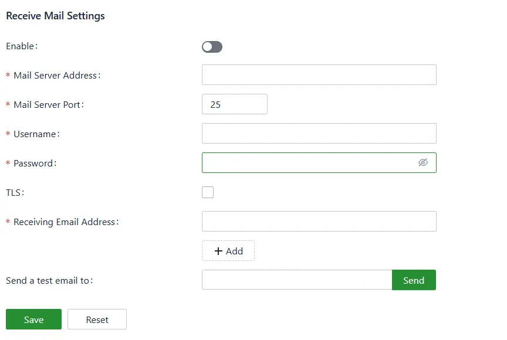

<strong>Fig. 4-52 Set the E-mail Address</strong>

#### 4.8.7 Tools

**Ping**

ICMP (Internet Control Message Protocol) can be used to check the device's external network connectivity. In the "Target" field, enter any domain name or IP address to test the device's connectivity to, and then click "Start" to check the connectivity status between the device and the specified target. This can help determine whether the device can reach the target over the Internet.

A network ping test on a target can be performed by going to [System] → [Tools] → [Ping]. This allows ICMP echo requests to be sent to the specified target IP address or domain name and ICMP echo replies to be received to check network connectivity and latency to that target.

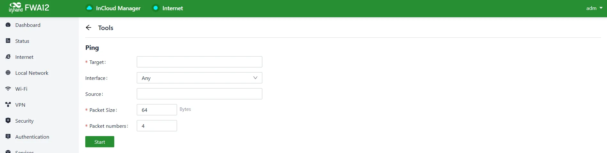

<strong>Fig. 4-53 Ping</strong>

**Traceroute**

The [System] → [Tools] → [Traceroute] function can be used to check the routing connectivity from the device to a target host. The target host's IP address or domain name can be input, the outbound interface for traffic can be selected, and "Start" can be clicked to trace the route from the device to the target IP, displaying each hop along the way. This can help diagnose network routing issues and identify the path taken by data packets to reach the destination.

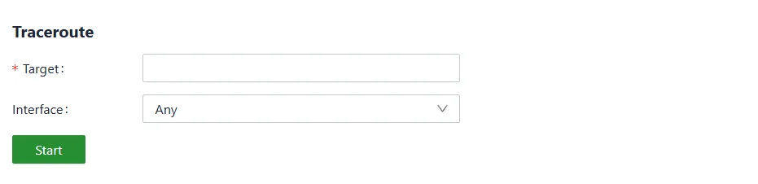

<strong>Fig. 4-54 Traceroute</strong>

**Capture**

The [System] → [Tools] → [Capture] function can be used to capture packets passing through a specific interface. By selecting the "Output" option, the captured data can be chosen to either display in the interface or export locally for further analysis. This feature is useful for network troubleshooting and analyzing network traffic.

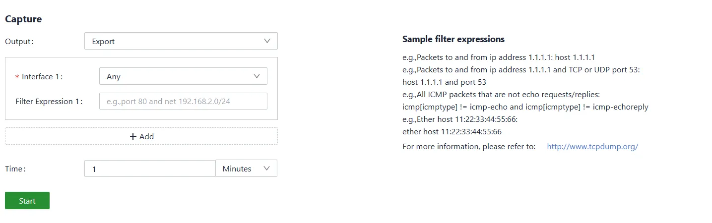

<strong>Fig. 4-55 Capture</strong>

**Iperf**

Iperf is a network performance measurement tool built into the router. It can be used to test bandwidth and throughput between devices, helping evaluate network performance under different conditions.

The Iperf tool supports both TCP and UDP traffic, allowing various network loads to be simulated and key metrics such as bandwidth, packet loss, and latency to be measured.

It operates in two main modes:
- **Server Mode**: Listens for incoming test traffic.
- **Client Mode**: Initiates traffic toward a server.

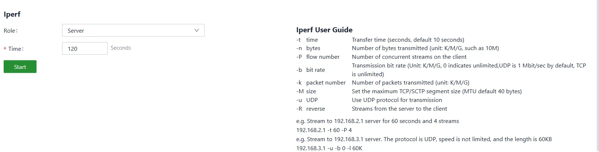

<strong>Fig. 4-56 Iperf</strong>

#### 4.8.8 Scheduled Reboot

Scheduled reboot is a strategy in network device management that allows administrators to automatically restart devices at specific times or under certain conditions to ensure their normal operation and performance.

In practical use, device scheduled restart times can be set up in the [System] → [Scheduled Reboot] function based on business needs. The device supports scheduled reboots at fixed times on a daily, weekly, or monthly basis.

For monthly reboots, when the selected reboot day is greater than the actual number of days in that month, the device will reboot on the last day of that month. For example, if the 31st is chosen in a month with only 30 days, the device will reboot on the 30th.

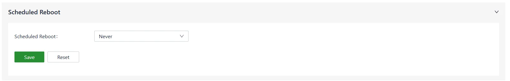

<strong>Fig. 4-57 Set the Scheduled Reboot Time</strong>

#### 4.8.9 Log Server

A remote log server can be set to receive the logs sent by this device through [System] → [Log Server].

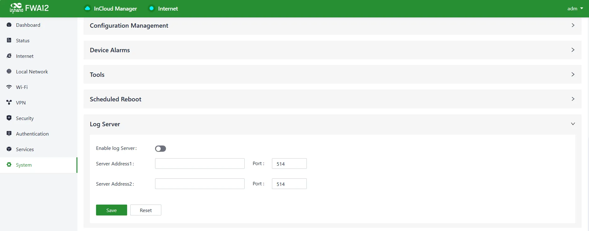

<strong>Fig. 4-58 Set the Log Server's Address</strong>

#### 4.8.10 Other Settings

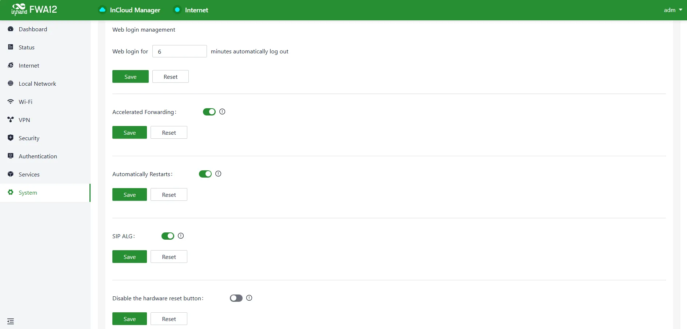

<strong>Fig. 4-59 Other Settings</strong>

**Web Login Management**

After a certain period of inactivity, when a user logs into the local interface of a device through a web interface, the system will automatically log them out or disconnect to ensure user privacy and security.

The logout time can be set in [System] → [Other Settings] → [Web Login Management]. Once the online time for a single login session on the device's web page exceeds the configured time, the system will automatically log out the user, and they will need to log in again to continue their operations.

**Accelerated Forwarding**

This feature can be used to accelerate packet forwarding and enhance network performance. It is turned off by default.

After enabling this feature in [System] → [Other Settings] → [Accelerated Forwarding], the device's cellular speed will significantly improve.

**Cautions**:

1. Enabling this feature will disable the normal functioning of IPSec VPN, traffic shaping, and other related features.

**Auto Reboot**

Edge routers are specifically designed with an automatic restart mechanism to help address situations where manual intervention is required to restore network connectivity on-site.

Enabling this feature in [System] → [Other Settings] → [Auto Reboot] will result in the device automatically rebooting if it loses network connectivity and remains disconnected for an hour after multiple retry attempts.

**SIP ALG**

It is typically used as a firewall and consists of two technologies: Session Initiation Protocol (SIP) and Application Layer Gateway (ALG). This protocol is typically used to assist in the management and processing of SIP communications (Session Initiation Protocol), which is used to establish and manage real-time communication sessions, such as voice and video calls.

This feature can be enabled in [System] → [Other Settings] → [SIP ALG]. Enabling this feature may impact VoIP telephone communication.

**Note**:

If the connected device needs to engage in VoIP (Voice over Internet Protocol) phone communication, it is recommended to disable this function.

**Disable Hardware Reset Button**

This security feature allows administrators to enable or disable the device's physical reset button with a single click through the management interface.

**Purpose**

The primary function is to prevent accidental or unauthorized factory resets of the device. When disabled, the physical button becomes inactive, safeguarding the current configuration and network stability. This is particularly useful in deployed or publicly accessible locations.

**Note**: Disabling the button does not affect remote software resets or configuration via the management interface. Only users with administrator privileges should be able to modify this setting.

---

## Chapter 5 Typical Applications

### Case 1: Enterprise Branch 5G Cloud-Managed Network

**Scenario Description**

A retail chain enterprise requires high-speed and secure Internet access for its branch stores, with centralized remote management and monitoring capabilities.

**Device Role**

The 5G FWA12 serves as the branch edge gateway, providing 5G cellular Internet access, local Wi-Fi coverage, and wired LAN connectivity. Combined with InCloud Manager, it enables centralized cloud-based management.

**Configuration Steps**

1. Install the SIM card and antennas, then power on the device.
2. Connect the PC to the LAN port and log in to the Web management interface at 192.168.2.1.
3. Navigate to [Internet] → [Uplink Table] → [Cellular], configure the APN parameters, and save.
4. Verify the Internet connection in [Dashboard] → [Interface Status].
5. (Optional) Register the device on InCloud Manager for remote management.

**Reference Chapters**

- [Scenario 1: Cellular Internet Access](#scenario-1-cellular-internet-access)
- [Cloud Management](#481-cloud-management)
- [Chapter 2: Installation and First Use](#chapter-2-installation-and-first-use)

---

## Appendix: Troubleshooting

### A.1 Network Connection Issues

| Phenomenon | Possible Cause | Troubleshooting Steps | Related Section |
|------------|---------------|----------------------|-----------------|
| Unable to connect to cellular network | SIM card not inserted or poorly contacted | 1. Check whether the SIM card is properly inserted 2. Re-insert the SIM card | [SIM Card and Antenna Installation](#221-sim-card-and-antenna-installation) |
| Unable to connect to cellular network | APN parameters configured incorrectly | 1. Verify APN parameters are correct 2. Contact the carrier for correct APN | [Scenario 1: Cellular Internet Access](#scenario-1-cellular-internet-access) |
| Unable to connect to cellular network | Weak or no signal | 1. Check whether antennas are connected 2. Adjust device position | [SIM Card and Antenna Installation](#221-sim-card-and-antenna-installation) |
| Unable to connect to cellular network | Data plan inactive or exceeded | 1. Verify the data plan is active 2. Check data usage balance | [Scenario 1: Cellular Internet Access](#scenario-1-cellular-internet-access) |
| Unable to connect to WAN network | Upstream DHCP server not enabled | 1. Confirm the upstream device has DHCP enabled 2. Try static IP or PPPoE mode | [Scenario 2: WAN Broadband Access](#scenario-2-wan-broadband-access) |
| Unable to connect to WAN network | Incorrect broadband account or password | 1. Verify PPPoE account and password 2. Re-enter credentials | [Scenario 2: WAN Broadband Access](#scenario-2-wan-broadband-access) |
| Unable to connect to WAN network | Firewall rules blocking traffic | 1. Check inbound and outbound rules 2. Check MAC address filtering | [Firewall](#461-firewall) |
| Slow or unstable speeds | Weak cellular signal | 1. Check signal strength 2. Reposition the device for better reception | [SIM Card and Antenna Installation](#221-sim-card-and-antenna-installation) |
| Slow or unstable speeds | Client connected to 2.4 GHz band | 1. Connect the client to the 5 GHz band | [Scenario 3: Wi-Fi Configuration](#scenario-3-wi-fi-configuration) |
| Slow or unstable speeds | Outdated firmware | 1. Update the router firmware to the latest version | [Device Options](#484-device-options) |

### A.2 Web Access Issues

| Phenomenon | Possible Cause | Troubleshooting Steps | Related Section |
|------------|---------------|----------------------|-----------------|
| Unable to open Web interface | Incorrect IP address | 1. Confirm the PC and device are on the same subnet 2. Check the device default IP | [PC Connection and Web Login](#223-pc-connection-and-web-login) |
| Unable to open Web interface | Browser compatibility issue | 1. Try a different browser (Chrome recommended) 2. Clear browser cache | [PC Connection and Web Login](#223-pc-connection-and-web-login) |

## Appendix: Safety Precautions

1. The provided original power adapter must be used to prevent any potential device damage resulting from using incompatible power adapters.

2. During installation, ensure the device is positioned away from areas with strong electromagnetic interference and maintains a safe distance from high-power equipment. After installation, verify that the device is securely mounted to prevent accidental falls and potential damage.

3. Ensure that the device operates within the temperature and humidity specifications outlined in the product manual based on its operating environment.

4. Conduct regular inspections of device cables, which include Ethernet cables and power adapter connections. Keep the cables clean and promptly replace any cables showing damage.

5. When cleaning the device, refrain from directly spraying chemical agents onto the device's surface to avoid potential harm to the housing or internal components. Utilize a soft cloth for cleaning purposes.

6. Do not attempt to disassemble, repair, or modify the device independently, as this may lead to safety risks and void warranty coverage.

7. Regularly update the device's software version to access the latest security patches and feature upgrades. Always acquire firmware versions from official and reputable sources to prevent potential data loss or device damage. Utilizing unofficial or unauthorized firmware can result in compatibility issues, instability, and security vulnerabilities.

8. Securely store the device's login password and avoid disclosing it to unauthorized individuals to mitigate security risks.

> **Warning**: Non-professionals should not open the device housing. Risk of electric shock.

## FAQ

### Question 1: Unable to Connect to 4G/5G Network?

1. **Physical Environment**: Check whether the SIM card is inserted into the correct slot and ensure all cellular antennas are properly installed.
2. **APN Settings**: Ensure that the APN configuration matches the information provided by the service provider.
3. **Check Device Connectivity**: Log in to the device's local interface and use the built-in ICMP tool to ping 8.8.8.8 to test connectivity. If it can connect, then check the connectivity between the client device (e.g., computer or smartphone) and the router.
4. **Check SIM Card**: Remove the SIM card and insert it into a phone to see if it can connect to the Internet.
5. **Restart**: Try powering off the router, wait a few seconds, and then reconnect the power to retry the network connection.
6. **Factory Reset**: Perform a factory reset on the router and then attempt to connect again.

If the issue cannot be resolved using the above steps or any other problems are encountered, contact InHand Networks immediately for technical support. More information can be found at [www.inhand.com](http://www.inhandnetworks.com).

### Question 2: Is the Cloud Platform Free of Charge?

InHand Networks is committed to providing high-quality network services for small and medium-sized chain organizations. When utilizing cloud platform services, licenses are required to be purchased for each device to access the extensive cloud-based features.

### Question 3: How to Add Devices to the Cloud Platform?

1. Register for an InCloud Manager login account at [https://star.inhandcloud.com/](https://star.inhandcloud.com/).
2. Log in to the cloud platform using the registered account. Under the device menu, click "Add," and follow the prompts to enter the device's serial number and MAC address. This will complete the device addition process. When a device is added for the first time, it comes with a complimentary 3-year free essential license. Licenses can be renewed as needed in the future.

### Question 4: Is It Possible to Use the Device Without the Cloud Platform?

Yes, it is possible. The majority of configuration tasks can be completed locally. However, for features like bulk configuration deployment, firmware upgrades, SD-WAN, Connector, and more, local device settings would need to be combined with the cloud platform.

If the issue cannot be resolved using the above steps or any other problems are encountered, contact InHand Networks for technical support. More information can be found at [www.inhand.com](http://www.inhandnetworks.com).
