# InGateway502 Quick Start Guide_V1.0

**Edge Gateway InGateway502**

**Quick Start Guide**

Version 1.0, August 2024

[www.inhand.com](https://www.inhand.com)

The software described in this manual is according to the license agreement, can only be used in accordance with the terms of the agreement.

**Copyright Notice**

© 2024 InHand Networks All rights reserved.

**Trademarks**

The InHand logo is a registered trademark of InHand Networks.

All other trademarks or registered trademarks in this manual belong to their respective manufacturers.

**Disclaimer**

The company reserves the right to change this manual, and the products are subject to subsequent changes without prior notice. 9. We shall not be responsible for any direct, indirect, intentional or unintentional damage or hidden trouble caused by improper installation or use.

## 1 Product Introduction

InGateway502 (IG502) is a cost-effective edge gateway for industrial IoT. IG502 is compact in size, rich in interfaces, and has convenient global cellular access. It supports users to use Python secondary development, can be built-in InHand DeviceSupervisor™Agent service, supports hundreds of data collection protocols, easily achieve device data collection, processing and cloud, and supports InHand DeviceLive cloud management, helping enterprises to accelerate the process of digitisation.

## 2 Packing List

- Standard Accessories

| **Number** | **Name** | **Quantity** | **note** |
| --- | --- | --- | --- |
| 1 | IG502 | 1 | IG502 Edge Computing Gateway |
| 2 | GPS Antenna | - | The number and type of antennas depends on the actual model |
| 3 | WLAN Antenna | - | |
| 4 | Cellular Antenna | - | |
| 5 | Rail Mounting Accessories | 1 | For fixing devices to rails |
| 6 | Industrial Terminals | 1 | 7-Pin Industrial Terminal |
| 7 | Network Cable | 1 | 1.5m network cable |

- Optional Accessories

| **Number** | **Name** | **Quantity** | **note** |
| --- | --- | --- | --- |
| 1 | Power Adapter | 1 | 12V 2A Power Adapter |
| 2 | Wall Mounting Kit | 1 | IG502 has 3 types of wall-mounting installation methods, you can choose the appropriate wall-mounting method according to the actual deployment scenarios, the corresponding accessory material number can be viewed in the "IG502 Series Edge Gateway Product Specification" in the "Dimension" section |

## 3 Product Appearance

The panel layout of the IG502 is shown below:

### 3.1 Front panel

IG502 is divided into models with IO interface and without IO interface, and their front panels are as follows

- IG502 with IO interface

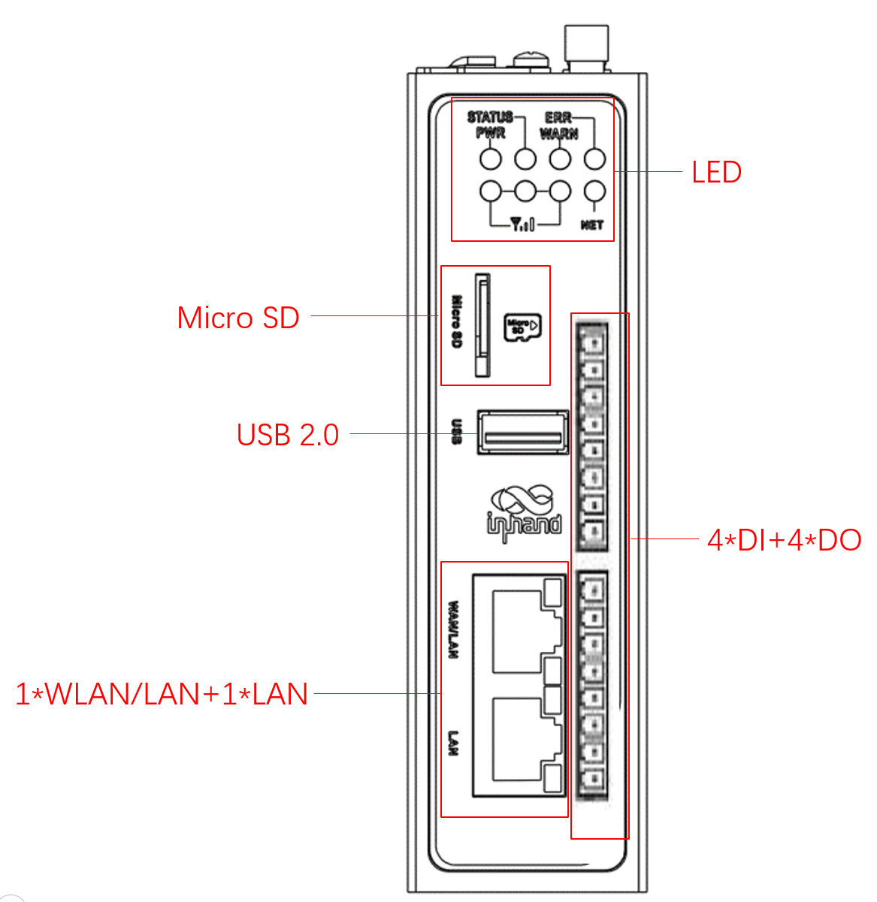

- IG502 without IO interface

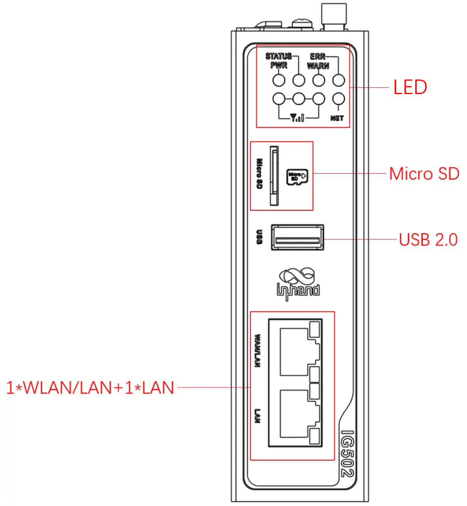

### 3.2 Upper panel

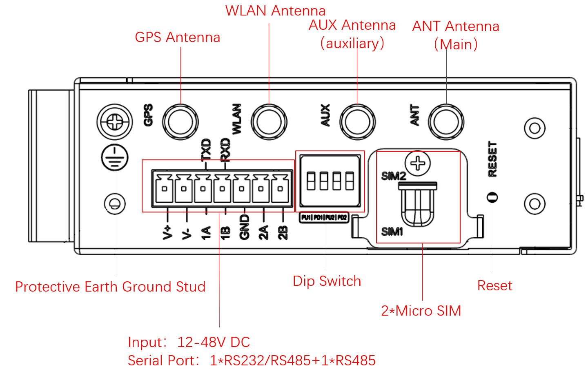

## 4 Indicator Description

- Description of operating status indicators

| **PWR** | **STATUS** | **WARN** | **ERR** | **NET (Internet)** | **Definition** |
| :---: | :---: | :---: | :---: | :---: | :---: |
| **Power indicator (red)** | **Status indicator (green)** | **Alarm indicator (yellow)** | **Error indicator (red)** | **Network indicator (green)** | |
| On | Off | Off | Off | Off | Booting |
| On | slow flash | Off | Off | Off | Boot up successfully |
| On | slow flash | Off | Off | Fast flash | Dialling |
| On | slow flash | Off | Off | On | Dialling successfully |
| On | slow flash | slow flash | slow flash | Off | Reset successfully |
| On | slow flash | Fast flash | Fast flash | Off | Upgrade |

Note:

1. On means always on, at least 3 seconds without flashing
2. Off means always off, at least 3 seconds without flashing
3. Slow flash means flashing frequency 1Hz
4. Fast flash means flashing frequency 5Hz

- Signal Status Indicator Description

| **Signal status indicator 1** **(green)** | **Signal status indicator 2** **(green)** | **Signal status indicator 3** **(green)** | **Definition** |
| :---: | :---: | :---: | --- |
| Off | Off | Off | No signal detected |
| On | Off | Off | Signal status 1 ≤ CSQ ≤ 9 (indicating that there is a problem with the signal condition, please check whether the antenna is properly installed, whether the SIM card is correctly recognised, and whether the signal condition is good in the area) |
| On | On | Off | Signal status 10≤CSQ≤19 (indicating that the signal status is basically normal and the equipment can be used normally) |
| On | On | On | Signal status 20 ≤ CSQ ≤ 31 (indicating good signal condition) |

## 5 Installing the IG502

### 5.1 DIN rail mounting and dismounting

### 5.1.1 DIN rail mounting

The DIN rail mounting plate is attached to the rear panel of the IG502 as shown below:

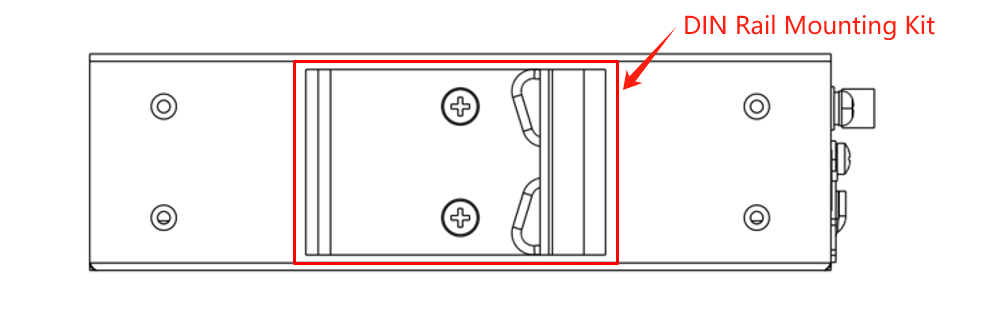

Installation steps are as follows:

1. Select the installation location of the equipment and ensure that there is enough space;

2. Snap the upper part of the DIN rail holder onto the DIN rail, and rotate the device at the lower end of the device with a little force upwards as shown in arrow 2 to snap the DIN rail holder onto the DIN rail, and confirm that the device is reliably mounted onto the DIN rail, as shown in the figure below:

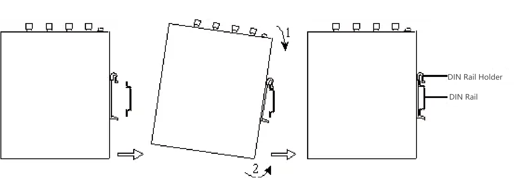

### 5.1.2 DIN rail dismounting

The method of dismounting the IG502:

1. As shown by arrow 1 in the figure below, press down on the device to give clearance at the lower end of the device to disengage from the DIN rail.

2. Turn the device in the direction of arrow 2 and move the lower end of the device outwards at the same time. Lift the device upwards after the lower end is detached from the DIN rail to remove the device from the DIN rail.

### 5.2 Wall mounting

The IG502 can be mounted using a wall mounting kit, which needs to be purchased separately. There are three wall mounting options and the steps are shown below for each:

**Wall mounting method 1: Mount the wall mounting kit on the upper and lower panels of the IG502 (lug mounting)**

Step 1: Fix the wall mounting kit to the upper and lower panels using the screws

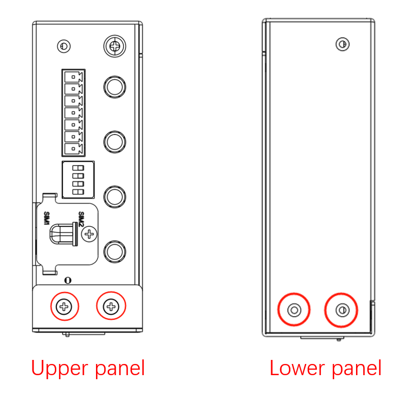

When the fixing is completed, it is shown in the figure below:

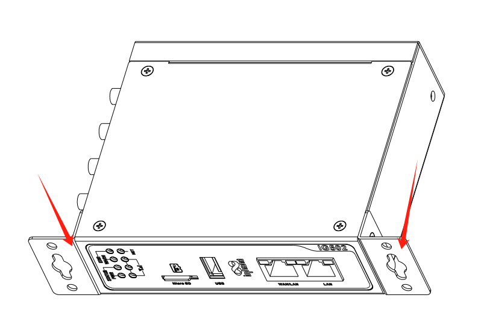

Step 2: Once the wall mounting kit is secured to the device, use screws to secure the device to the wall or cabinet

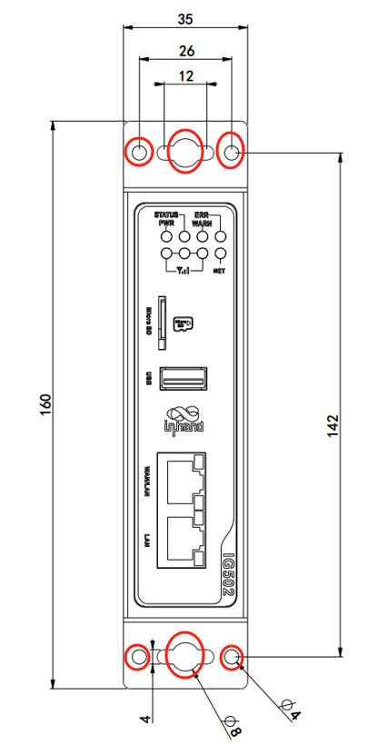

**Wall Mounting Method 2: Mount the wall mounting kit on the rear panel of the IG502 (back lugs)**

Step 1: Screw the wall mounting kit to the rear panel of the device

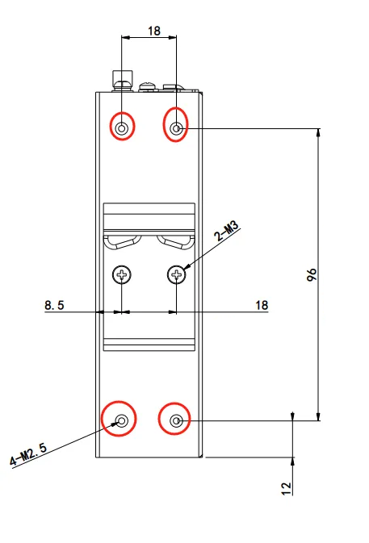

When the fixing is completed, it is shown in the figure below:

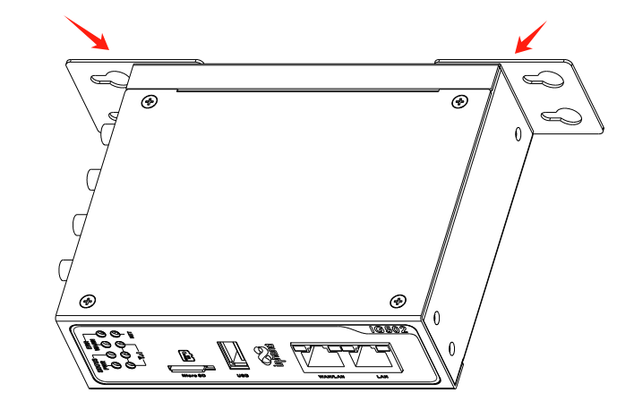

Step 2: Once the wall mounting kit is secured to the device, use screws to secure the device to the wall or cabinet

**Wall Mounting Method 3: Install the wall mounting kit on the upper and lower panels (large surface lugs) of the IG502**

Step 1: Screw the wall mounting kit to the top and lower panels of the device

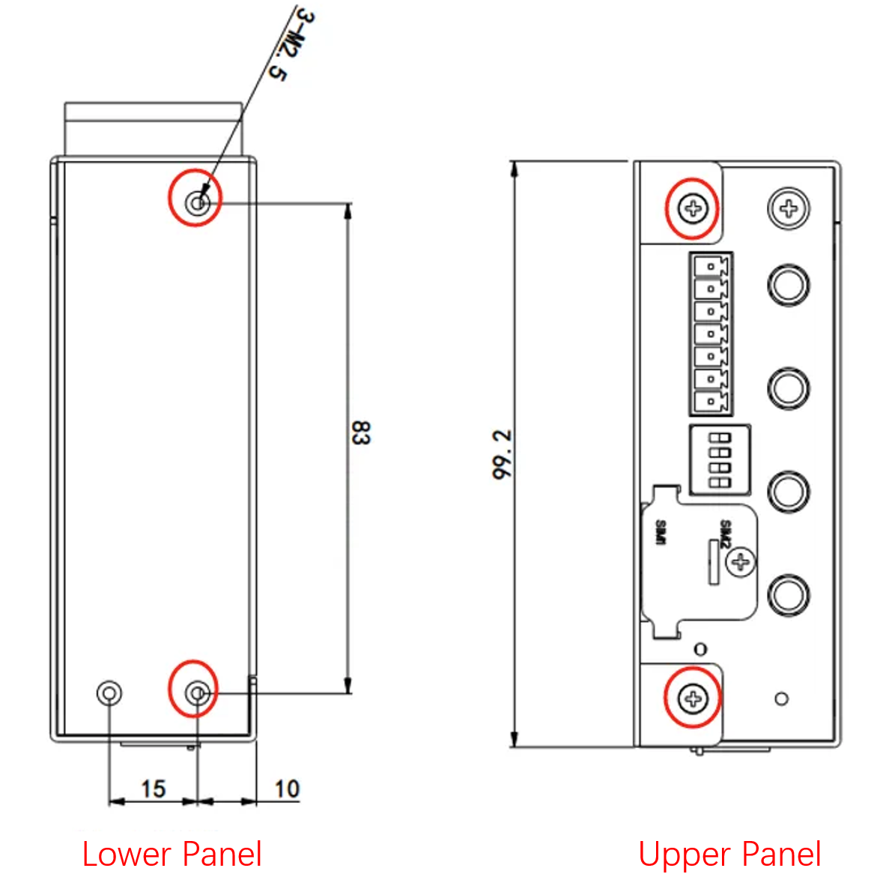

After the fixing is completed, it is shown in the following picture

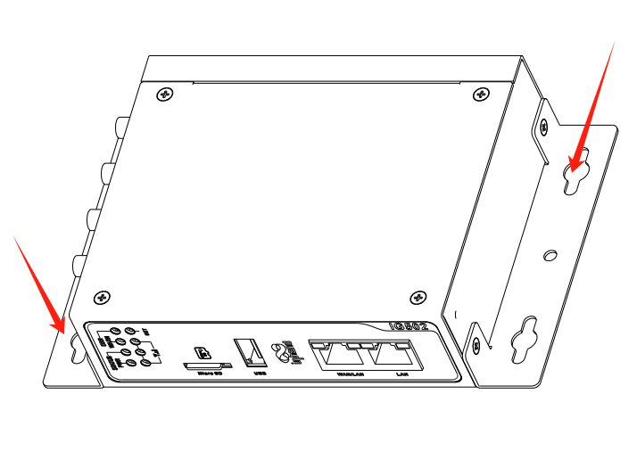

Step 2: Once the wall mounting kit is secured to the device, use screws to secure the device to the wall or cabinet.

## 6 Connector Description

### 6.1 Ethernet Interface

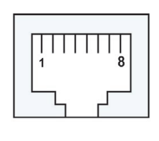

The IG502 has 2 RJ45 Ethernet ports that support 10M/100M adaptive rates.The RJ45 pins are described below:

| **Pin** | **10M/100M** |
| --- | --- |
| 1 | TX+ |
| 2 | TX- |
| 3 | RX+ |
| 4 | - |
| 5 | - |
| 6 | RX- |
| 7 | - |
| 8 | - |

### 6.2 DC Input/Serial Port

The IG502 supports 12-48V DC power supply. Plug the adapter terminal into the DC port of the IG502 and then connect the power adapter. When the PWR power indicator lights up long then it means the device has been powered up normally.

IG502 has 2 serial ports, one serial port supports RS485 and one serial port supports RS-232 or RS-485 mode.

**When the interface combination is RS232+RS485:**

Device node corresponding to RS232 serial port: /dev/ttyO1

Device node corresponding to RS485 serial port: /dev/ttyO3

**When the interface combination is RS485+RS485:**

Device node corresponding to RS485-1 serial port: /dev/ttyO1

Device node corresponding to RS485-2 serial port: /dev/ttyO3

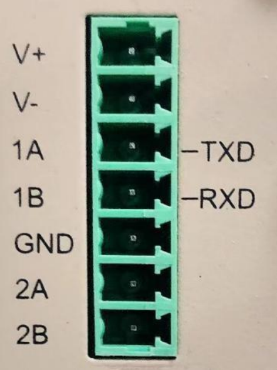

The power supply and serial port use 7PIN terminals, and the interface pins are described below:

| **PIN** | **Name** | **Definition** |
| --- | --- | --- |
| 1 | V+ | Power Positive |
| 2 | V- | Power Negative |
| 3 | TXD or 1A | Serial RS232 send or first RS485+ |
| 4 | RXD or 1B | Serial RS232 acceptance or first RS485- |
| 5 | GND | Serial RS232 signal ground |
| 6 | 2A | Second RS485+ |
| 7 | 2B | Second RS485- |

### 6.3 Digital Inputs

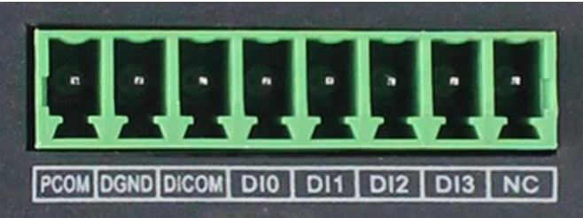

| **PIN Number** | **Name** | **Definition** | **Instruction** |
| --- | --- | --- | --- |
| 1 | PCOM | Dry contact access terminal | 4 digital/pulse inputs DI,  2 dry contact control interfaces.  Dry contact status "1": closed  Dry contact status "0": disconnected  Wet contact state "1": +10~+30V/-30~-10V DC Wet contact status "0": 0~+3V/-3~0V DC Isolated 3000VDC  Support pulse signal counter function.  Supports up to 100 Hz pulse signals (32-bit counter + 1-bit overflow flag)  |
| 2 | DGND | Dry contact grounding terminal. | |
| 3 | DICOM | Input common terminal | |
| 4 | DI0 | Digital/Pulse Input 0 Connector | |
| 5 | DI1 | Digital/Pulse Input 1 Connector | |
| 6 | DI2 | Digital/Pulse Input 2 Connector | |
| 7 | DI3 | Digital/Pulse Input 3 Connector | |
| 8 | NC | None | |

### 6.4 Digital outputs

| **PIN Number** | **Name** | **Definition** | **Instruction** |
| --- | --- | --- | --- |
| 1 | DO0 | Digital/Pulse Output 0 Connector | 3 digital/pulse outputs DO  1 digital output Isolated 3000VDC  |
| 2 | DGND | grounding terminal | |
| 3 | DO1 | Digital/Pulse Output 1 Connector | |
| 4 | DGND | grounding terminal | |
| 5 | DO2 | Digital/Pulse Output 2 Connector | |
| 6 | DGND | grounding terminal | |
| 7 | DO3 | Digital Output 3 Connector | |
| 8 | DGND | grounding terminal | |

### 6.5 USB interface

The IG502 provides a USB 2.0 Host interface, which is mainly used for expanding storage devices.

IG502 supports USB storage device hot-plugging. It will mount all the partitions automatically.IG502 will mount all the USB storage device partitions under the path /mnt/usb/sda1, and only the first partition of the USB storage device will be mounted.

**ATTENTION:**

**Before disconnecting the USB mass storage device, remember to enter the sync command to prevent data loss. When you disconnect the storage device, exit from the /mnt/usb/sda1 directory. If you remain in /mnt/usb/sda1, the automatic uninstall process will fail. If this happens, type umount /mnt/usb/sda1 to manually unmount the device!**

### 6.6 Micro SD

The IG502 has a Micro SD card. The SD card does not support hot plugging and needs to be operated when the power is off. It will automatically mount all partitions.

The IG502 will mount all partitions of the micro SD memory card to the /mnt/sd path. The naming format of the mounted folder is mmcblk0p`<num>`, where `<num>` is a number from 0 to 9.

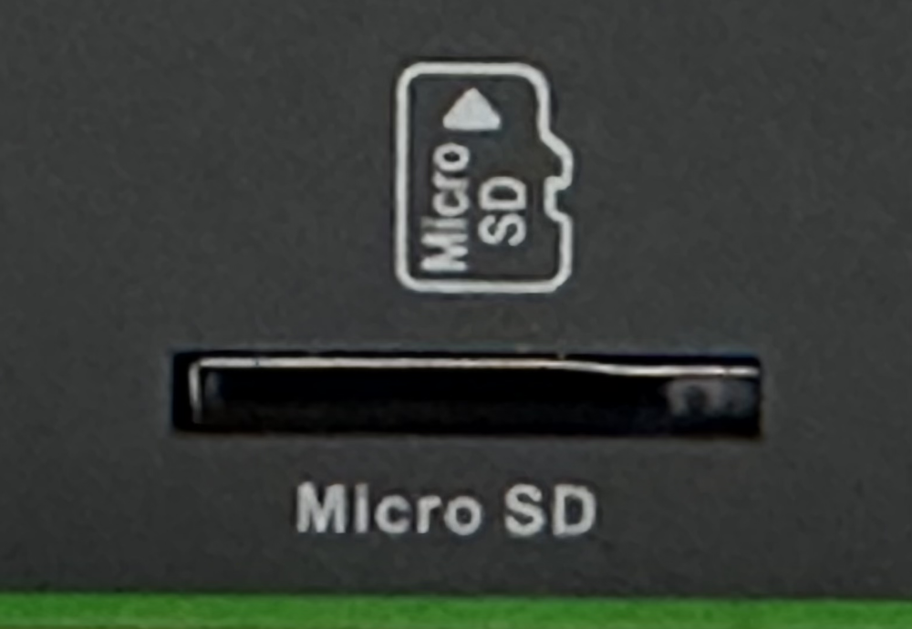

### 6.7 SIM card slot

The IG502 is equipped with two Micro SIM card holders for cellular communication, located on the upper panel. The SIM card installation does not support hot-plugging and needs to be operated when the power is off.

### 6.8 Antenna Interface

IG502 has 4 antenna interfaces, and different models are equipped with different numbers of antennas. The antenna support for specific models can be found in the "Ordering Guide" section of the IG502 Series Edge Gateway datasheet.

| **Identification** | **Name** |
| :---: | :---: |
| GPS | GPS antenna |
| WLAN | WAN Antenna |
| AUX | AUX Antenna (Auxiliary Antenna) |
| ANT | ANT (Main Antenna) |

The product model shown below is IG502-FQ58-IO-W-G, which supports three antenna interfaces. Screw the required antenna into the corresponding SMA antenna connector to complete the antenna installation, as shown in the following figure ANT.

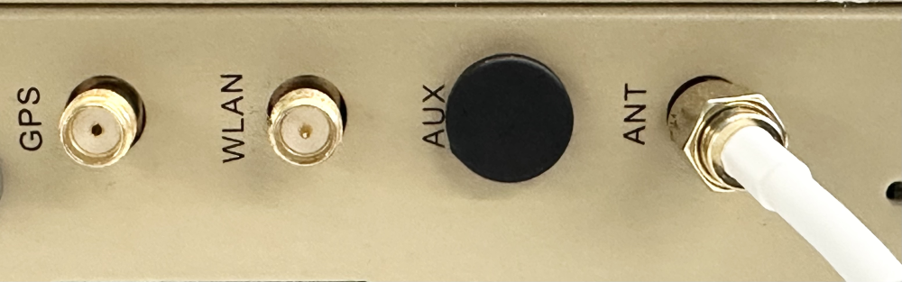

### 6.9 DIP switches

As shown in the above figure, the 4-digit dip switch can be used to realize the enable selection of the pull-up/down resistors of A/B of RS-485 interfaces COM1 and COM2 respectively. Enabling the pull-up/down resistors of A/B of the RS-485 interface can improve the anti-interference ability of the RS-485 bus and solve the problem of garbled characters caused by interface chip compatibility.

| **Identification** | **Description** |
| --- | --- |
| PU1 | ON: Enable pull-up resistor for COM1 RS-485 AOFF: Disable pull-up resistor for COM1 RS-485 A (default) |
| PD1 | ON: Enable pull-down resistor for COM1 RS-485 BOFF: Disable pull-down resistor for COM1 RS-485 B (default) |
| PU2 | ON: Enable pull-up resistor for COM2 RS-485 AOFF: Disable pull-up resistor for COM2 RS-485 A (default) |
| PD2 | ON: Enable pull-down resistor for COM2 RS-485 BOFF: Disable pull-down resistor for COM2 RS-485 B (default) |

Note: Enabling the RS-485 pull-up/down resistors, however, reduces the maximum number of access devices allowed on the RS-485 bus.

### 6.10 Factory Reset Button

There is a reset button for restoring the system to the factory, and the procedure for restoring the factory device using hardware is as follows:

- Step 1: Press and hold the RESET button for 10s after powering up the device;
- Step 2: When the ERR light turns red, release the RESET button;
- Step 3: After a few seconds when the ERR light goes out, press and hold the RESET button again without releasing it;
- Step 4: Release the RESET button when you see the ERR light blinking; wait for the ERR light to turn off, indicating that the factory settings have been restored successfully.

## 7 Power and Environmental Requirements

| **Input Voltage** | 12-48 VDC (dual pin terminals, V+, V -) |
| :---: | --- |
| **Operating Power Consumption** | 250mA@12V |
| **Operating Temperature** | -25-70°C (-13-158°F) |
| **Storage Temperature** | -40-85°C (-40-185°F) |
| **Environmental Humidity** | 5~ 95% (without frost) |

## 8 Access to IG502

Use the following default IP address to connect to the IG502.

| **Port** | **Default IP** |
| :---: | :---: |
| WAN/LAN | 192.168.1.1 |
| LAN | 192.168.2.1 |

**Step 1: Interconnect the IG502 to the PC**

Insert one end of the cable into any of the IG502's network ports as shown in the figure below, and the other end into the computer's network port, and set the computer's IP address to the same network segment address as the device interface.

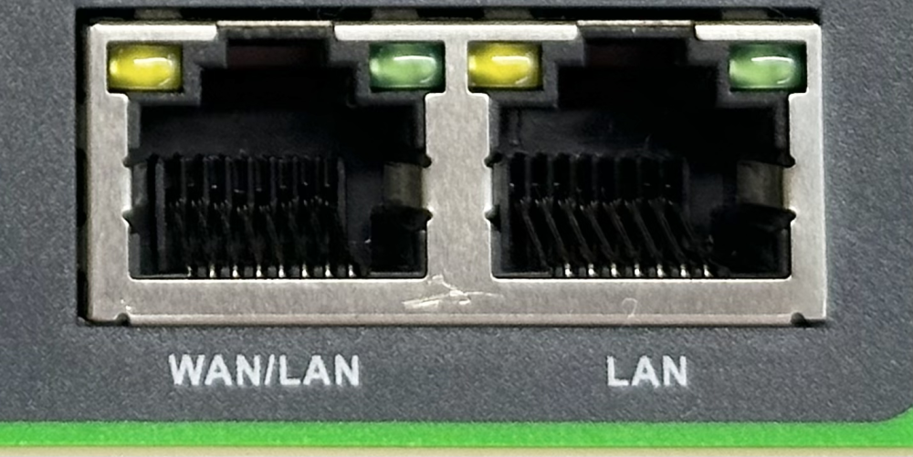

**Step 2: Network and system management of IG502 via web**

IG502 supports the WEB interface management based on IEOS, which is a set of network management and system management programmes developed by InHand and running on Linux system, and IEOS can provide web interface service. Taking the network cable network port inserted into the LAN port as an example, the device login information is as follows:

**Login:**[** https://192.168.2.1**](https://192.168.2.1)

**Initial login account: adm**

**Initial login password: check the nameplate on the device panel for the initial password information**

The following figure shows an example of using a WEB connection:

