# IG502 Quick Start Guide

# Part 1: Quick Installation

> **What you need to do first:** Unbox → Mount the device → Connect power and Ethernet → (If using cellular) **Power off** to install SIM and attach antennas → Power on → Set PC to same subnet → Open Web in browser.
> **Then:** Scroll down to **Part 2** for packing list, indicator meanings, wall mounting, pinouts, and more.

## Required Reading Summary

| Item | Requirement |
|------|-------------|
| Power | **12–48 V DC**, terminal **V+ / V−** (or matching adapter); **PWR solid red** means powered on. |
| SIM / Micro SD | **Must power off** to install or remove; **no hot-plugging**. |
| Cellular / WLAN / GPS Antennas | Tighten by **silkscreen label** on housing; quantity varies by model (see §2.8). |
| USB | Supports hot-plugging; run `sync` and exit the mount directory before disconnecting. |

## Step 1: Check the Panel and Interface Areas Against the Physical Unit

Take a moment to compare your device with the panel diagrams below. IG502 comes in two variants: with IO interface and without IO interface. Locate the power/serial terminal, Ethernet ports, USB port, Micro SD slot, SIM card slots, and antenna connectors.

IG502 with IO interface:

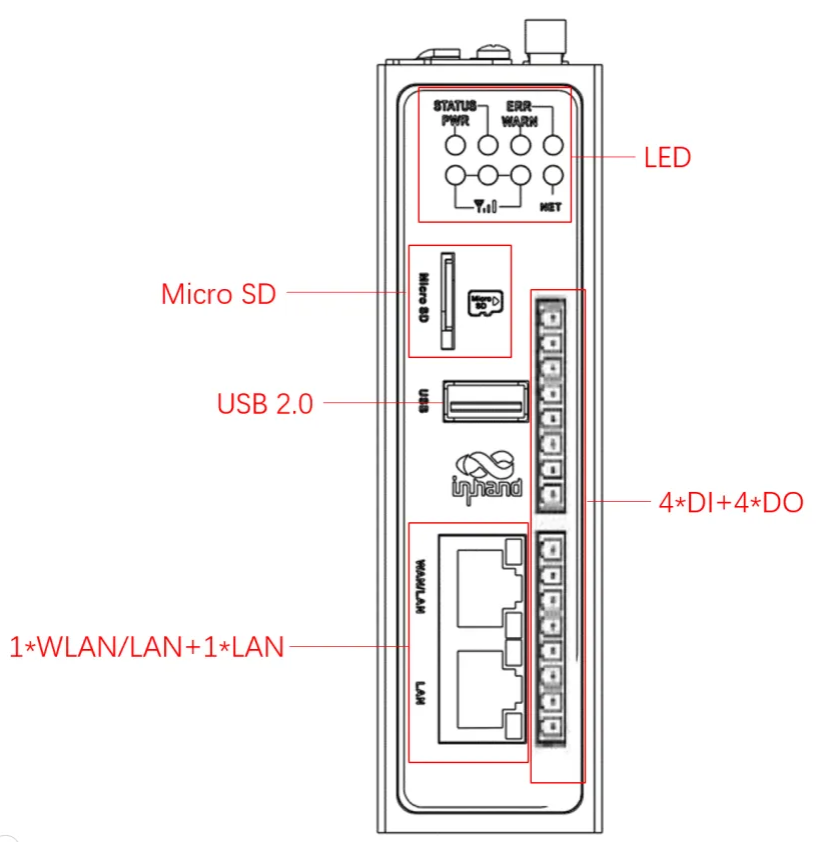

IG502 without IO interface:

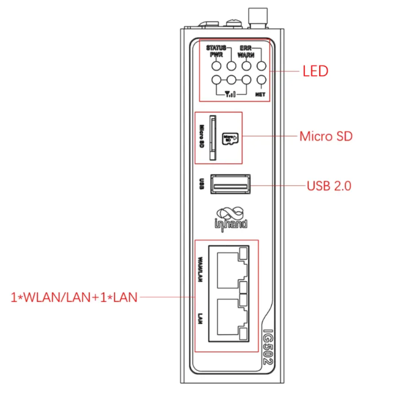

Upper panel (antenna and SIM area):

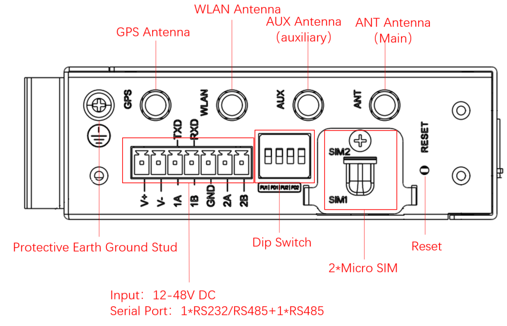

> Panel details and variant differences → see §2.2.

## Step 2: Mount the Device on a DIN Rail or in a Cabinet

Choose DIN rail mounting (default, using the rear mounting plate) or wall mounting (requires optional wall mounting kit). For DIN rail, hook the top of the holder onto the rail, then rotate the bottom upward to snap it in place.

> DIN rail install/remove steps and three wall-mount methods → see §2.4.

## Step 3: Connect Power and Ethernet

1. Wire the **7-pin industrial terminal**: connect **V+** to power positive and **V−** to power negative (**12–48 V DC**).
2. Plug one end of the network cable into either RJ45 port on the IG502, and the other end into your PC or switch.

> Pin definitions for the power/serial terminal and RJ45 → see §2.5.2 and §2.5.1.

## Step 4: (If Using Cellular) Power Off to Install SIM and Attach Antennas

**Power must be off** before installing or removing SIM cards.

1. Insert the Micro SIM card(s) into the card holder(s) on the upper panel.
2. Screw the required antennas into the SMA connectors by matching the **silkscreen labels** (ANT, AUX, WLAN, GPS). The number and type of antennas depend on your actual model.

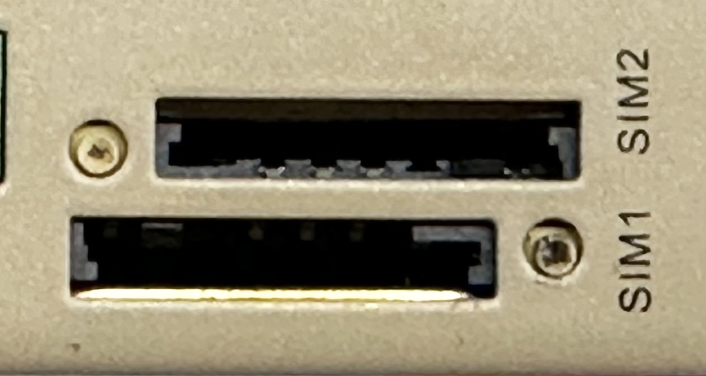

> SIM slot details, antenna silkscreen table, and model-specific antenna support → see §2.5.6.

## Step 5: Power On and Confirm the Device Is Ready

Apply power. When the **PWR indicator lights solid red**, the device is powered normally. After boot completes, the **STATUS indicator flashes slowly** (green), indicating the system is up.

| If you see | It means |
|------------|----------|
| PWR solid red, STATUS slow flash | Boot up successfully |
| PWR solid red, NET fast flash | Dialling (cellular connecting) |
| PWR solid red, NET on | Dialling successfully |

> Full indicator table and signal strength lights → see §2.3.

## Step 6: Log In from Your PC via Browser

1. Set your PC’s IP address to the same subnet as the IG502 port you are using.

| Port Role | Default IP |
| :-------: | :--------: |
| WAN/LAN | 192.168.1.1 |
| LAN | 192.168.2.1 |

2. Open a browser and navigate to the matching IP. Example for LAN port:

   `https://192.168.2.1`

3. Log in with the initial account:
   - **Username:** `adm`
   - **Password:** Check the nameplate on the device panel for the initial password.

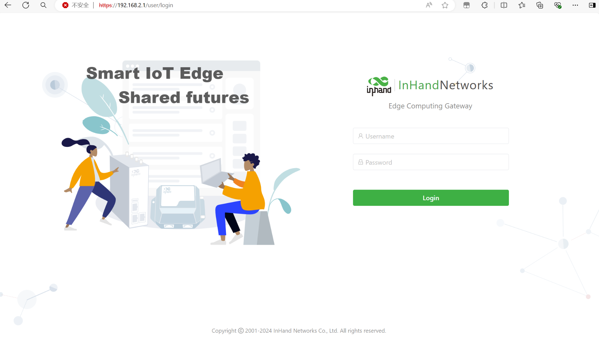

> Certificate warning, account details, and alternate access → see §2.7.

## Post-Installation Checklist

- ☐ Device is mounted securely (DIN rail or wall).  
- ☐ Power and Ethernet are connected; if using cellular, SIM and antennas are in place.  
- ☐ **PWR is solid red** and **STATUS is flashing slowly**.  
- ☐ Browser can open the Web login page and log in successfully.  

**If something is off:** Review §2.3 (indicators), §2.5 (wiring/pinouts), and §2.7 (login details). To restore factory settings, use the RESET button procedure in §2.7.

---

# Part 2: Detailed Information

## 2.1 Packing List

### Standard Accessories

| No. | Name | Qty | Unit | Note |
|-----|------|-----|------|------|
| 1 | IG502 | 1 | pcs | IG502 Edge Computing Gateway |
| 2 | GPS Antenna | - | pcs | Quantity and type depend on actual model |
| 3 | WLAN Antenna | - | pcs | Quantity and type depend on actual model |
| 4 | Cellular Antenna | - | pcs | Quantity and type depend on actual model |
| 5 | Rail Mounting Accessories | 1 | set | For fixing devices to rails |
| 6 | Industrial Terminals | 1 | pcs | 7-Pin Industrial Terminal |
| 7 | Network Cable | 1 | pcs | 1.5 m network cable |
| 8 | Product Information | 1 | pcs | QR code scanning to view quick start guide, user manual |
| 9 | Product Warranty Card | 1 | pcs | Warranty period is 1 year |
| 10 | Certificate of Conformity | 1 | pcs | IG502 Edge Computing Gateway Certificate of Compliance |

### Optional Accessories

| No. | Name | Qty | Unit | Note |
|-----|------|-----|------|------|
| 1 | Power Adapter | 1 | pcs | 12 V 2 A Power Adapter |
| 2 | Wall Mounting Kit | 1 | set | IG502 has 3 types of wall-mounting installation methods; choose according to actual deployment scenarios. Corresponding accessory part numbers can be viewed in the "Dimension" section of the *IG502 Series Edge Gateway Product Specification*. |

## 2.2 Product Structure and Identification

InGateway502 (IG502) is a cost-effective edge gateway for industrial IoT. IG502 is compact in size, rich in interfaces, and has convenient global cellular access. It supports users to use Python secondary development, can be built-in InHand DeviceSupervisor™ Agent service, supports hundreds of data collection protocols, easily achieves device data collection, processing and cloud, and supports InHand DeviceLive cloud management, helping enterprises to accelerate the process of digitisation.

### Front Panel

IG502 is divided into models with IO interface and without IO interface, and their front panels are as follows.

IG502 with IO interface:

IG502 without IO interface:

### Upper Panel

## 2.3 Indicators and Reset Button

### 2.3.1 Operating Status Indicators

| PWR | STATUS | WARN | ERR | NET (Internet) | Definition |
|-----|--------|------|-----|----------------|------------|
| Power indicator (red) | Status indicator (green) | Alarm indicator (yellow) | Error indicator (red) | Network indicator (green) | |
| On | Off | Off | Off | Off | Booting |
| On | slow flash | Off | Off | Off | Boot up successfully |
| On | slow flash | Off | Off | Fast flash | Dialling |
| On | slow flash | Off | Off | On | Dialling successfully |
| On | slow flash | slow flash | slow flash | Off | Reset successfully |
| On | slow flash | Fast flash | Fast flash | Off | Upgrade |

### 2.3.2 Signal Strength Indicators

| Signal 1 (green) | Signal 2 (green) | Signal 3 (green) | Definition |
|------------------|------------------|------------------|------------|
| Off | Off | Off | No signal detected |
| On | Off | Off | Signal status 1 ≤ CSQ ≤ 9 (indicating that there is a problem with the signal condition; please check whether the antenna is properly installed, whether the SIM card is correctly recognised, and whether the signal condition is good in the area) |
| On | On | Off | Signal status 10 ≤ CSQ ≤ 19 (indicating that the signal status is basically normal and the equipment can be used normally) |
| On | On | On | Signal status 20 ≤ CSQ ≤ 31 (indicating good signal condition) |

### 2.3.3 Reset Button

There is a reset button on the device for restoring the system to factory defaults. Its physical location is shown on the front panel in §2.2.

**Function:** Hardware factory reset.

**Procedure:** See §2.7 for the full step-by-step factory reset process, including timing and LED states.

## 2.4 Mechanical Installation

### 2.4.1 DIN Rail: Installation

The DIN rail mounting plate is attached to the rear panel of the IG502 as shown below:

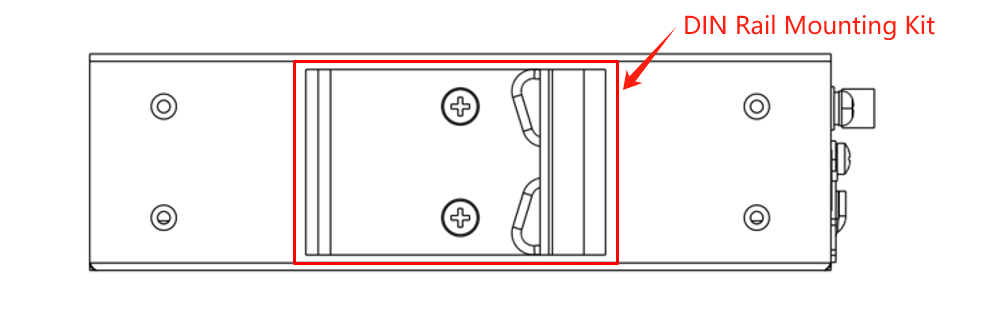

Installation steps are as follows:

1. Select the installation location of the equipment and ensure that there is enough space.
2. Snap the upper part of the DIN rail holder onto the DIN rail, and rotate the device at the lower end of the device with a little force upwards as shown in arrow 2 to snap the DIN rail holder onto the DIN rail, and confirm that the device is reliably mounted onto the DIN rail, as shown in the figure below:

### 2.4.2 DIN Rail: Dismounting

1. As shown by arrow 1 in the figure below, press down on the device to give clearance at the lower end of the device to disengage from the DIN rail.
2. Turn the device in the direction of arrow 2 and move the lower end of the device outwards at the same time. Lift the device upwards after the lower end is detached from the DIN rail to remove the device from the DIN rail.

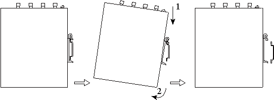

### 2.4.3 Wall Mounting

The IG502 can be mounted using a wall mounting kit, which needs to be purchased separately. There are three wall mounting options. The general method is: first fix the wall mounting kit to the device with screws, then use screws to secure the device to the wall or cabinet. To remove, reverse the sequence.

**Wall mounting method 1:** Mount the wall mounting kit on the upper and lower panels of the IG502 (lug mounting)

Step 1: Fix the wall mounting kit to the upper and lower panels using the screws.

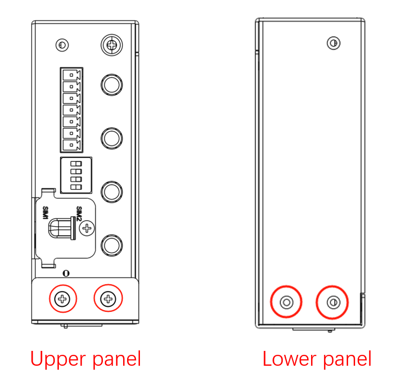

When the fixing is completed, it is shown in the figure below:

Step 2: Once the wall mounting kit is secured to the device, use screws to secure the device to the wall or cabinet.

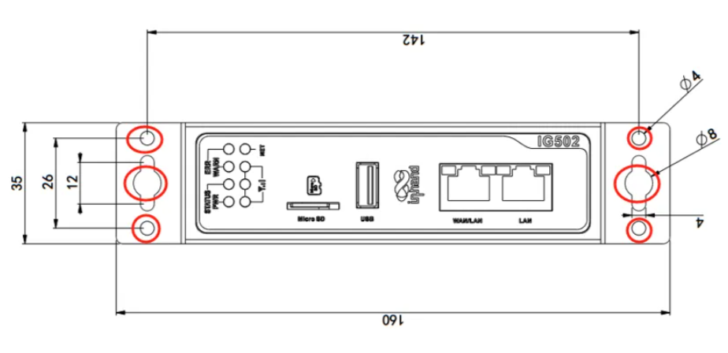

**Wall mounting method 2:** Mount the wall mounting kit on the rear panel of the IG502 (back lugs)

Step 1: Screw the wall mounting kit to the rear panel of the device.

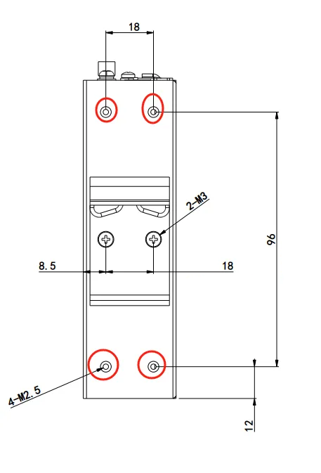

When the fixing is completed, it is shown in the figure below:

Step 2: Once the wall mounting kit is secured to the device, use screws to secure the device to the wall or cabinet.

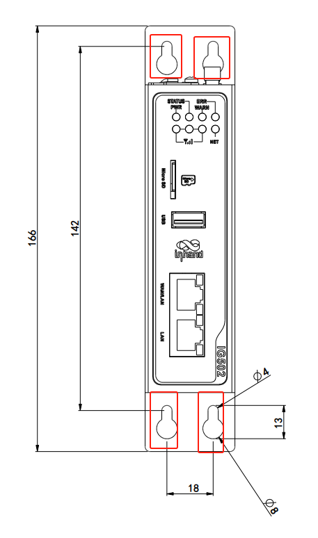

**Wall mounting method 3:** Install the wall mounting kit on the upper and lower panels (large surface lugs) of the IG502

Step 1: Screw the wall mounting kit to the top and lower panels of the device.

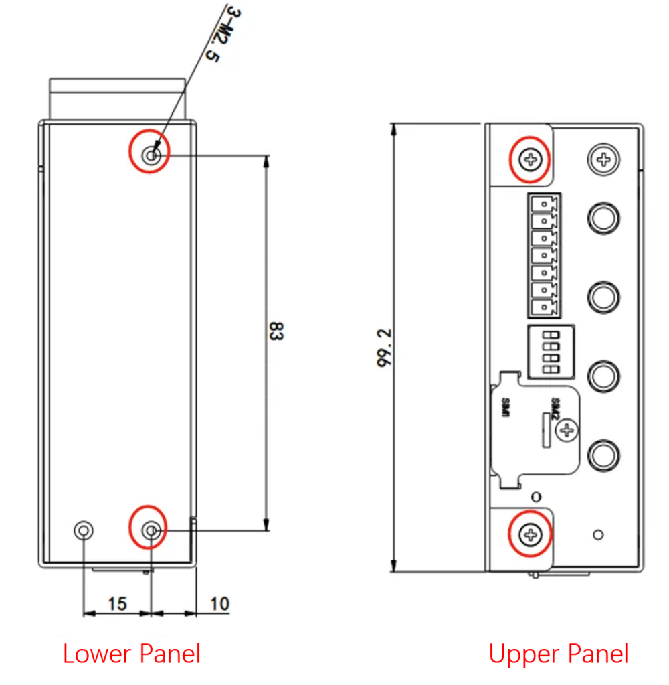

After the fixing is completed, it is shown in the following picture:

Step 2: Once the wall mounting kit is secured to the device, use screws to secure the device to the wall or cabinet.

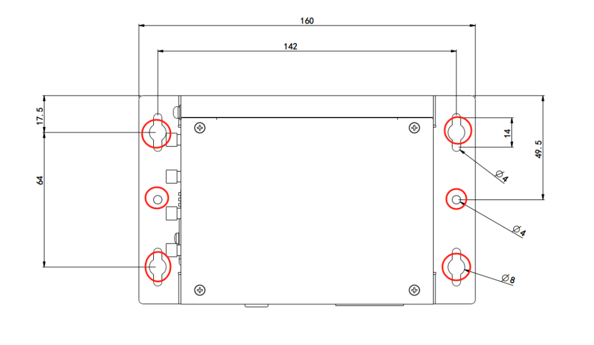

## 2.5 Connections and Cabling

### 2.5.1 Ethernet

The IG502 has 2 RJ45 Ethernet ports that support 10M/100M adaptive rates.

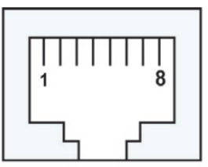

RJ45 pin description:

| Pin | 10M/100M |
|-----|----------|
| 1 | TX+ |
| 2 | TX- |
| 3 | RX+ |
| 4 | - |
| 5 | - |
| 6 | RX- |
| 7 | - |
| 8 | - |

### 2.5.2 Power and Serial Port

The IG502 supports **12–48 V DC** power supply. Plug the adapter terminal into the DC port of the IG502 and then connect the power adapter. When the PWR power indicator lights up long, it means the device has been powered up normally.

IG502 has 2 serial ports, one serial port supports RS485 and one serial port supports RS-232 or RS-485 mode.

- When the interface combination is RS232+RS485:
  - Device node corresponding to RS232 serial port: `/dev/ttyO1`
  - Device node corresponding to RS485 serial port: `/dev/ttyO3`
- When the interface combination is RS485+RS485:
  - Device node corresponding to RS485-1 serial port: `/dev/ttyO1`
  - Device node corresponding to RS485-2 serial port: `/dev/ttyO3`

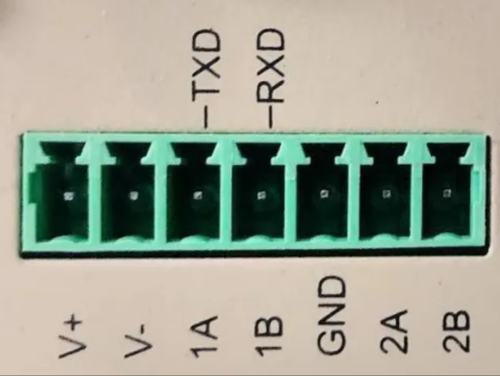

The power supply and serial port use 7-pin terminals. Interface pin description:

| PIN | Name | Definition |
|-----|------|------------|
| 1 | V+ | Power Positive |
| 2 | V- | Power Negative |
| 3 | TXD or 1A | Serial RS232 send or first RS485+ |
| 4 | RXD or 1B | Serial RS232 receive or first RS485- |
| 5 | GND | Serial RS232 signal ground |
| 6 | 2A | Second RS485+ |
| 7 | 2B | Second RS485- |

### 2.5.3 RS-485 DIP Switches

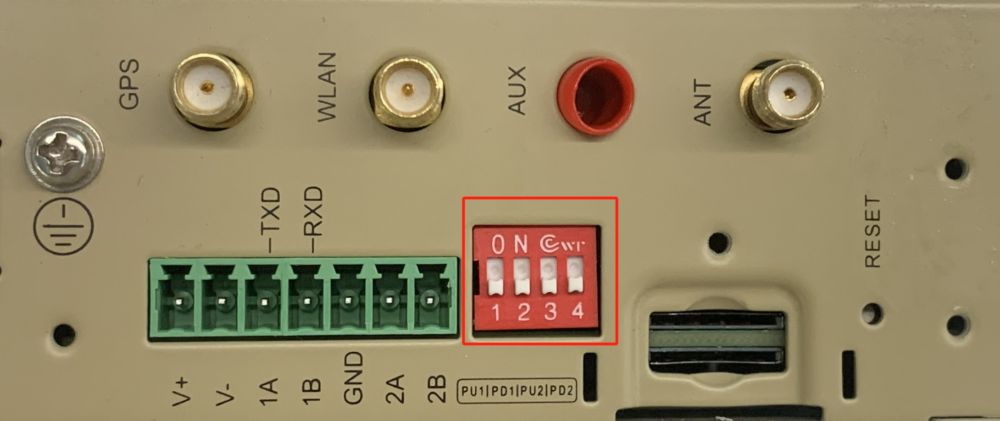

The 4-digit DIP switch enables or disables the pull-up/down resistors for A/B of RS-485 interfaces COM1 and COM2 respectively. Enabling the pull-up/down resistors of A/B of the RS-485 interface can improve the anti-interference ability of the RS-485 bus and solve the problem of garbled characters caused by interface chip compatibility.

| Identification | Description |
|----------------|-------------|
| PU1 | ON: Enable pull-up resistor for COM1 RS-485 A  
OFF: Disable pull-up resistor for COM1 RS-485 A (default) |
| PD1 | ON: Enable pull-down resistor for COM1 RS-485 B  
OFF: Disable pull-down resistor for COM1 RS-485 B (default) |
| PU2 | ON: Enable pull-up resistor for COM2 RS-485 A  
OFF: Disable pull-up resistor for COM2 RS-485 A (default) |
| PD2 | ON: Enable pull-down resistor for COM2 RS-485 B  
OFF: Disable pull-down resistor for COM2 RS-485 B (default) |

> **Note:** Enabling the RS-485 pull-up/down resistors reduces the maximum number of access devices allowed on the RS-485 bus.

### 2.5.4 Digital Inputs

| PIN Number | Name | Definition | Instruction |
|------------|------|------------|-------------|
| 1 | PCOM | Dry contact access terminal | 4 digital/pulse inputs DI, 2 dry contact control interfaces.  
Dry contact status "1": closed  
Dry contact status "0": disconnected  
Wet contact state "1": +10~+30 V / -30~-10 V DC  
Wet contact status "0": 0~+3 V / -3~0 V DC  
Isolated 3000 VDC  
Support pulse signal counter function.  
Supports up to 100 Hz pulse signals (32-bit counter + 1-bit overflow flag) |
| 2 | DGND | Dry contact grounding terminal | |
| 3 | DICOM | Input common terminal | |
| 4 | DI0 | Digital/Pulse Input 0 Connector | |
| 5 | DI1 | Digital/Pulse Input 1 Connector | |
| 6 | DI2 | Digital/Pulse Input 2 Connector | |
| 7 | DI3 | Digital/Pulse Input 3 Connector | |
| 8 | NC | None | |

### 2.5.5 Digital Outputs

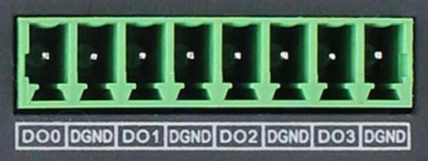

| PIN Number | Name | Definition | Instruction |
|------------|------|------------|-------------|
| 1 | DO0 | Digital/Pulse Output 0 Connector | 3 digital/pulse outputs DO, 1 digital output. Isolated 3000 VDC |
| 2 | DGND | Grounding terminal | |
| 3 | DO1 | Digital/Pulse Output 1 Connector | |
| 4 | DGND | Grounding terminal | |
| 5 | DO2 | Digital/Pulse Output 2 Connector | |
| 6 | DGND | Grounding terminal | |
| 7 | DO3 | Digital Output 3 Connector | |
| 8 | DGND | Grounding terminal | |

### 2.5.6 Cellular SIM and Antennas

**SIM Card Slot**

The IG502 is equipped with two Micro SIM card holders for cellular communication, located on the upper panel. The SIM card installation does not support hot-plugging and needs to be operated when the power is off.

**Antenna Interface**

IG502 has 4 antenna interfaces, and different models are equipped with different numbers of antennas. The antenna support for specific models can be found in the "Ordering Guide" section of the *IG502 Series Edge Gateway Product Specification*.

| Identification | Name |
|----------------|------|
| GPS | GPS antenna |
| WLAN | WLAN Antenna |
| AUX | AUX Antenna (Auxiliary Antenna) |
| ANT | ANT (Main Antenna) |

> **Note:** The original document listed "WAN Antenna" for the WLAN silkscreen; this has been corrected to **WLAN Antenna** to match the housing silkscreen.

The product model shown below is IG502-FQ58-IO-W-G, which supports three antenna interfaces. Screw the required antenna into the corresponding SMA antenna connector to complete the antenna installation, as shown in the following figure:

### 2.5.7 USB and Micro SD

**USB Interface**

The IG502 provides a USB 2.0 Host interface, which is mainly used for expanding storage devices.

IG502 supports USB storage device hot-plugging. It will mount all the partitions automatically. IG502 will mount all the USB storage device partitions under the path `/mnt/usb/sda1`, and only the first partition of the USB storage device will be mounted.

> **ATTENTION:** Before disconnecting the USB mass storage device, remember to enter the `sync` command to prevent data loss. When you disconnect the storage device, exit from the `/mnt/usb/sda1` directory. If you remain in `/mnt/usb/sda1`, the automatic uninstall process will fail. If this happens, type `umount /mnt/usb/sda1` to manually unmount the device!

**Micro SD**

The IG502 has a Micro SD card. The SD card does not support hot plugging and needs to be operated when the power is off. It will automatically mount all partitions.

The IG502 will mount all partitions of the micro SD memory card to the `/mnt/sd` path. The naming format of the mounted folder is `mmcblk0p<num>`, where `<num>` is a number from 0 to 9.

## 2.6 Power and Environmental Requirements

| Item | Specification |
|------|---------------|
| Input Voltage | 12–48 VDC (dual pin terminals, V+, V−) |
| Operating Power Consumption | 250 mA @ 12 V |
| Operating Temperature | −25–70°C (−13–158°F) |
| Storage Temperature | −40–85°C (−40–185°F) |
| Environmental Humidity | 5~95% (without frost) |

## 2.7 First Login and Factory Reset

### Web Login

Use the following default IP address to connect to the IG502:

| Port | Default IP |
|------|------------|
| WAN/LAN | 192.168.1.1 |
| LAN | 192.168.2.1 |

**Step 1:** Interconnect the IG502 to the PC.

Insert one end of the cable into any of the IG502's network ports, and the other end into the computer's network port, and set the computer's IP address to the same network segment address as the device interface.

**Step 2:** Network and system management of IG502 via web.

IG502 supports the WEB interface management based on IEOS, which is a set of network management and system management programmes developed by InHand and running on Linux system, and IEOS can provide web interface service. Taking the network cable network port inserted into the LAN port as an example, the device login information is as follows:

- Login: `https://192.168.2.1`
- Initial login account: `adm`
- Initial login password: check the nameplate on the device panel for the initial password information

The following figure shows an example of using a WEB connection:

### Factory Reset (RESET Button)

The RESET button for restoring the system to factory defaults is located on the device front panel (see §2.2). The procedure is as follows:

1. Press and hold the RESET button for 10 s after powering up the device.
2. When the ERR light turns red, release the RESET button.
3. After a few seconds when the ERR light goes out, press and hold the RESET button again without releasing it.
4. Release the RESET button when you see the ERR light blinking; wait for the ERR light to turn off, indicating that the factory settings have been restored successfully.

## 2.8 Related Documents

| Need | Destination |
|------|-------------|
| Product introduction, USB/SD details, configuration and troubleshooting | *IG502 User Manual* |
| Ordering information and antenna model numbers | *IG502 Series Edge Gateway Product Specification* |
| Software and announcements | [www.inhand.com](https://www.inhand.com) |

## 2.9 Legal Information

The software described in this manual is according to the license agreement, can only be used in accordance with the terms of the agreement.

**Copyright Notice**

© 2024 InHand Networks All rights reserved.

**Trademarks**

The InHand logo is a registered trademark of InHand Networks.

All other trademarks or registered trademarks in this manual belong to their respective manufacturers.

**Disclaimer**

The company reserves the right to change this manual, and the products are subject to subsequent changes without prior notice. We shall not be responsible for any direct, indirect, intentional or unintentional damage or hidden trouble caused by improper installation or use.
