# InGateway502 Edge Computing Gateway User Manual

**Edge Computing Gateway**

**User Manual**

Version 1.2, October 2024

---

<p align="center"></p>

---

## Front Matter

### Declaration

Thank you for choosing this product. Before use, read this user manual carefully and comply with the following declarations. This helps maintain intellectual property rights and legal compliance, and ensures that the user experience remains consistent with the latest product information. For any questions or to obtain written permission, contact the technical support team.

- **Copyright Notice**

This user manual contains copyright-protected content. Copyright belongs to Beijing InHand Networks Technology Co., Ltd. and its licensors. Without written permission, no entity or individual may excerpt, reproduce, or distribute any part or all of this manual in any form.

- **Disclaimer**

Due to continuous updates in product technology and specifications, the company cannot guarantee that the information in this user manual is completely identical to the actual product. Therefore, the company assumes no liability for any disputes arising from discrepancies between actual technical parameters and the user manual. Any product changes will not be notified in advance. The company reserves the right of final modification and interpretation.

- **Copyright Information**

The content of this user manual is protected by copyright law. Copyright belongs to Beijing InHand Networks Technology Co., Ltd. and its licensors. All rights reserved. Without written permission, no one may use, reproduce, or distribute the content of this manual.

### GUI Conventions

| Symbol | Meaning | Example |
|--------|---------|---------|
| `< >` | Indicates a variable or parameter to be replaced with an actual value | `<IP Address>` indicates a specific IP address needs to be entered |
| `" "` | Indicates text labels on the interface | Click the "Save" button |
| `→` | Indicates menu hierarchy or operation sequence | 【Network】→【Cellular】 |
| `【 】` | Indicates a menu or page name | Enter the 【System Settings】page |

### Technical Support
Email: support@inhandnetworks.com

URL: www.inhand.com

### How to Use This Manual

- First-time users: It is recommended to read "Knowing the Device" → "Installation and First Use" → "Common Scenario Configuration" → "Function Description and Parameter Reference" in sequence.
- Existing device users: Refer directly to "Function Description and Parameter Reference" or "Appendix: Troubleshooting".
- Cloud platform management users: Refer to the device remote management scenarios in "Common Scenario Configuration".

**Quick Jump by Task**

| Task | Chapter | Estimated Time |
|------|---------|----------------|
| Understand device appearance and interfaces | [Knowing the Device](#chapter-1-knowing-the-device) | Approx. 5 min |
| Install the device and log in for the first time | [Installation and First Use](#chapter-2-installation-and-first-use) | Approx. 15 min |
| Configure cellular network access | [Scenario 1: Cellular Networking](#scenario-1-cellular-networking) | Approx. 5 min |
| Configure VPN tunnel | [Scenario 4: VPN Configuration](#scenario-4-vpn-configuration) | Approx. 10 min |
| Troubleshoot network faults | [Appendix: Troubleshooting](#appendix-troubleshooting) | As needed |

---

## Chapter 1 Knowing the Device

### 1.1 Overview

InGateway502 (IG502) is a cost-effective edge computing gateway designed by InHand Networks for industrial IoT applications. The device features a compact form factor, rich interfaces, and convenient global cellular access. IG502 supports Python secondary development and can run the built-in InHand DeviceSupervisor™ Agent service, which supports hundreds of data collection protocols to facilitate device data acquisition, processing, and cloud transmission. The IG502 also supports InHand DeviceLive cloud management, helping enterprises accelerate digital transformation. IG502 is suitable for industrial automation, smart grid, environmental monitoring, intelligent transportation, and other industrial IoT application scenarios.

Applicable product models and firmware versions:

| Product Model | Firmware Version |
|---------------|------------------|
| IG502 | V2.1.23 and above |
| IG504 | — |
| IG532 | V2.1.9 and above |
| IG902 | V2.1.13 and above |
| IG974 | V2.0.6 and above |
| IG502-LITE | — |

### 1.2 Packing List

**Standard Accessories**

| No. | Item | Quantity | Unit | Description |
|-----|------|----------|------|-------------|
| 1 | IG502 | 1 | pcs | IG502 Edge Computing Gateway |
| 2 | GPS Antenna | — | pcs | Quantity and type depend on the actual model |
| 3 | WLAN Antenna | — | pcs | Quantity and type depend on the actual model |
| 4 | Cellular Antenna | — | pcs | Quantity and type depend on the actual model |
| 5 | DIN Rail Mounting Accessories | 1 | set | For fixing the gateway |
| 6 | Industrial Terminal | 1 | pcs | 7-pin industrial terminal |
| 7 | Network Cable | 1 | pcs | 1.5 m network cable |
| 8 | Product Warranty Card | 1 | pcs | Warranty period is 1 year |
| 9 | Certificate of Conformity | 1 | pcs | IG502 Edge Computing Gateway Certificate of Compliance |

**Optional Accessories**

| No. | Item | Quantity | Unit | Description |
|-----|------|----------|------|-------------|
| 1 | Power Adapter | 1 | pcs | 12 V / 2 A power adapter |
| 2 | Wall Mounting Kit | 1 | set | Three types of wall-mounting methods are available. For corresponding accessory part numbers, refer to the "Dimensions" section in the "IG502 Series Edge Gateway Product Specification" |

### 1.3 Appearance and Interfaces

The panel layout of the IG502 is shown below.

#### 1.3.1 Front Panel

IG502 is divided into models with IO interface and without IO interface. Their front panels are shown below.

- IG502 with IO interface

<p align="center">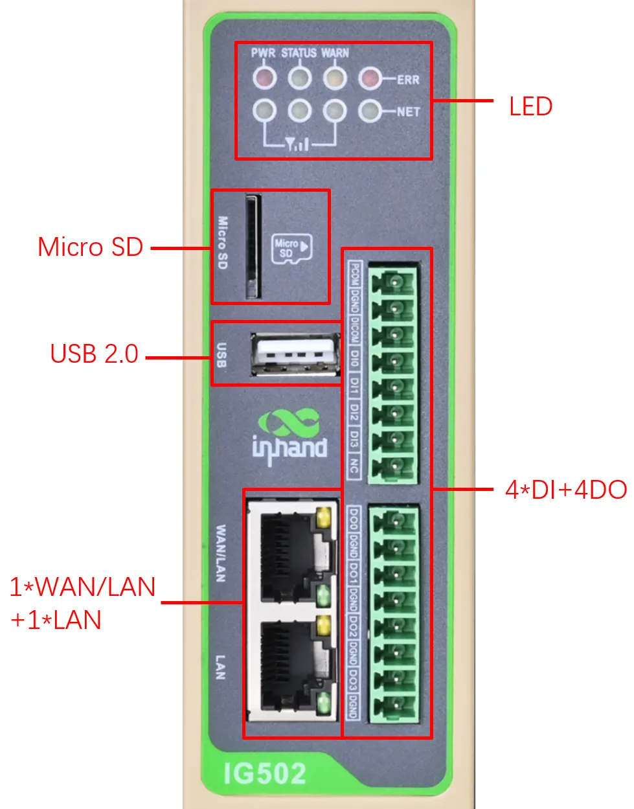</p>

<p align="center"><strong>Figure 1-1 IG502 Front Panel (with IO Interface)</strong></p>

- IG502 without IO interface

<p align="center">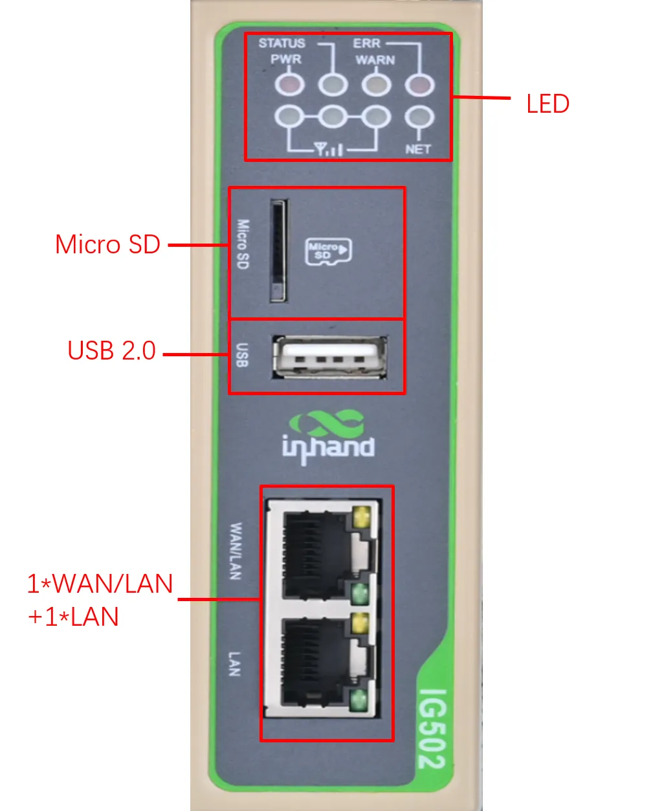</p>

<p align="center"><strong>Figure 1-2 IG502 Front Panel (without IO Interface)</strong></p>

#### 1.3.2 Upper Panel

<p align="center">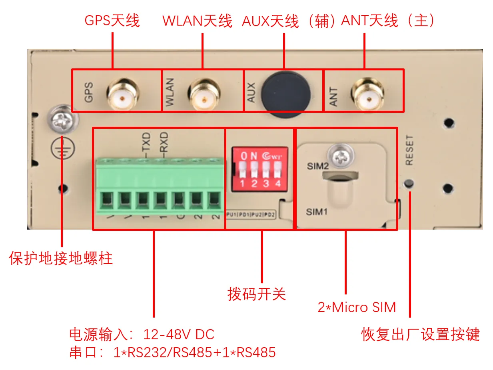</p>

<p align="center"><strong>Figure 1-3 IG502 Upper Panel</strong></p>

#### 1.3.3 Interface Description

| Interface | Position | Function Description |
|-----------|----------|----------------------|
| Ethernet Port | Front panel | 2 RJ45 Ethernet ports, supporting 10 M/100 M adaptive rates |
| Power/Serial Port | Front panel | 7-pin industrial terminal, supporting 12–48 VDC power input, 2 serial ports (RS-232/RS-485) |
| Digital Input | Front panel (IO models) | 4-channel digital/pulse input DI, 2 dry contact control interfaces, isolated 3000 VDC |
| Digital Output | Front panel (IO models) | 3-channel digital/pulse output DO, 1 digital output, isolated 3000 VDC |
| USB Port | Front panel | 1 USB 2.0 Host interface, for expanding storage devices |
| Micro SD Card Slot | Front panel | 1 Micro SD card slot, hot-plugging not supported |
| SIM Card Slot | Upper panel | 2 Micro SIM card holders for cellular communication, hot-plugging not supported |
| Antenna Interface | Upper panel | 4 antenna interfaces: GPS, WLAN, AUX, ANT |
| DIP Switch | Front panel | 4-digit DIP switch for RS-485 interface A/B pull-up/pull-down resistor enable selection |
| Factory Reset Button | Front panel | RESET button for hardware factory reset |

RJ45 pin description:

| RJ45 Pin | 10 M/100 M |
|----------|------------|
| 1 | TX+ |
| 2 | TX- |
| 3 | RX+ |
| 4 | — |
| 5 | — |
| 6 | RX- |
| 7 | — |
| 8 | — |

### 1.4 Indicator Description

#### 1.4.1 Operating Status Indicators

| Indicator | Status | Meaning |
|-----------|--------|---------|
| PWR (Power, red) | On | Device is powered on |
| STATUS (Status, green) | Off | Booting |
|  | Slow flash | Boot up successfully |
| WARN (Alarm, yellow) | Off | Normal |
|  | Slow flash | Reset successfully |
|  | Fast flash | Upgrade in progress |
| ERR (Error, red) | Off | Normal |
|  | Fast flash | Upgrade in progress |
| NET (Network, green) | Off | Not dialling |
|  | Fast flash | Dialling |
|  | On | Dialling successful |

> **Note**:
> - On means steady on, i.e., remaining lit for at least 3 seconds.
> - Off means steady off, i.e., remaining unlit for at least 3 seconds.
> - Slow flash means a blinking frequency of 1 Hz.
> - Fast flash means a blinking frequency of 5 Hz.

#### 1.4.2 Signal Status Indicators

| Indicator | Status | Meaning |
|-----------|--------|---------|
| Signal Status Indicator 1~3 (green) | All off | No signal detected |
|  | Indicator 1 on | Signal status 1 ≤ CSQ ≤ 9 (signal condition is poor; check antenna, SIM card, and local signal) |
|  | Indicators 1, 2 on | Signal status 10 ≤ CSQ ≤ 19 (signal status is basically normal; device can operate normally) |
|  | Indicators 1, 2, 3 on | Signal status 20 ≤ CSQ ≤ 31 (good signal condition) |

### 1.5 Restoring Factory Settings

IG502 supports restoring factory settings via hardware. The steps are as follows:

1. Within 10 seconds after the device is powered on, press and hold the RESET button.
2. When the ERR indicator turns red, release the RESET button.
3. After a few seconds, when the ERR indicator turns off, press and hold the RESET button again without releasing it.
4. When the ERR indicator starts blinking, release the RESET button. Wait for the ERR indicator to turn off, indicating that factory settings have been restored successfully.

### 1.6 Default Settings

| Parameter | Default Value |
|-----------|---------------|
| LAN port IP address | 192.168.2.1 |
| WAN/LAN port IP address | 192.168.1.1 |
| Web login username | adm |
| Web login password | Refer to the nameplate on the device panel for the initial password |
| SSH port | 22 |
| TELNET port | 23 |
| HTTPS port | 443 |
| Developer mode username | pyuser |
| Developer mode SSH port | 222 |

---

## Chapter 2 Installation and First Use

### 2.1 Before Installation

#### 2.1.1 Environmental Requirements

| Item | Specification |
|------|---------------|
| Input Voltage | 12–48 VDC (dual-pin terminal, V+, V−) |
| Operating Power Consumption | 250 mA @ 12 V |
| Operating Temperature | −25 °C to 70 °C (−13 °F to 158 °F) |
| Storage Temperature | −40 °C to 85 °C (−40 °F to 185 °F) |
| Environmental Humidity | 5% to 95% (non-condensing) |

#### 2.1.2 Tools Required

- DIN rail or wall mounting kit
- Phillips screwdriver
- Network cable
- Power adapter (12 V / 2 A, optional accessory)
- SIM card (if cellular networking is required)
- Antennas (configured according to the model)

> **Note**:
> - Before installation, verify that the supply voltage is within the 12–48 VDC range.
> - SIM cards and SD cards do not support hot-plugging; operate only when the device is powered off.
> - Before disconnecting a USB mass storage device, enter the `sync` command to prevent data loss.

### 2.2 Installation Guide

#### 2.2.1 DIN Rail Mounting

The DIN rail mounting plate is attached to the rear panel of the IG502.

<p align="center">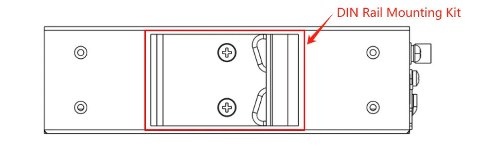</p>

<p align="center"><strong>Figure 2-1 DIN Rail Mounting Plate</strong></p>

Installation steps are as follows:

1. Select the installation location of the equipment and ensure that there is enough space.
2. Snap the upper part of the DIN rail holder onto the DIN rail, and rotate the device at the lower end upwards with slight force as shown by arrow 2 to snap the DIN rail holder onto the DIN rail. Confirm that the device is reliably mounted onto the DIN rail.

<p align="center">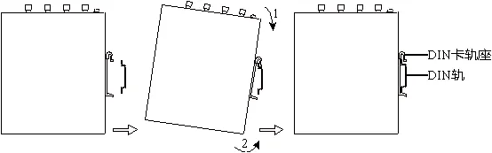</p>

<p align="center"><strong>Figure 2-2 DIN Rail Mounting Step</strong></p>

#### 2.2.2 DIN Rail Dismounting

The method of dismounting the IG502:

1. As shown by arrow 1 in the figure below, press down on the device to give clearance at the lower end of the device to disengage from the DIN rail.
2. Turn the device in the direction of arrow 2 and move the lower end of the device outwards at the same time. Lift the device upwards after the lower end is detached from the DIN rail to remove the device from the DIN rail.

<p align="center">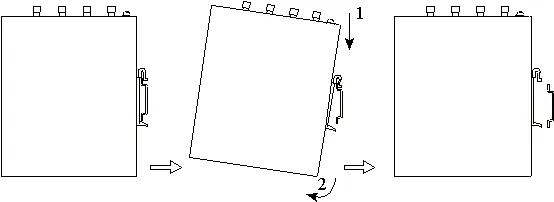</p>

<p align="center"><strong>Figure 2-3 DIN Rail Dismounting Step</strong></p>

#### 2.2.3 Wall Mounting

The IG502 can be mounted using a wall mounting kit, which needs to be purchased separately. There are three wall mounting options.

**Wall Mounting Method 1: Mount the wall mounting kit on the upper and lower panels (lug mounting)**

Step 1: Fix the wall mounting kit to the upper and lower panels using screws.

<p align="center">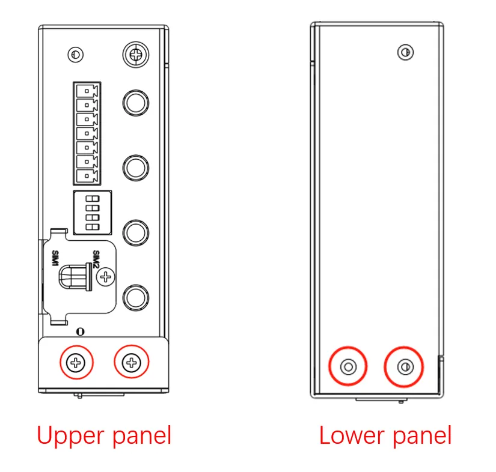</p>

<p align="center"><strong>Figure 2-4 Wall Mounting Method 1 (Step 1)</strong></p>

When the fixing is completed, it is shown in the figure below:

<p align="center">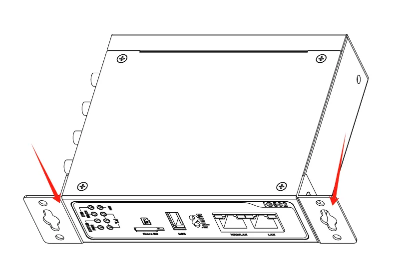</p>

<p align="center"><strong>Figure 2-5 Wall Mounting Method 1 (After Step 1)</strong></p>

Step 2: Once the wall mounting kit is secured to the device, use screws to secure the device to the wall or cabinet.

<p align="center">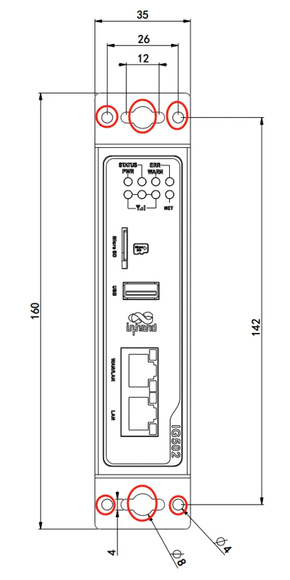</p>

<p align="center"><strong>Figure 2-6 Wall Mounting Method 1 (Fixed to Wall)</strong></p>

**Wall Mounting Method 2: Mount the wall mounting kit on the rear panel of the IG502 (back lugs)**

Step 1: Screw the wall mounting kit to the rear panel of the device.

<p align="center">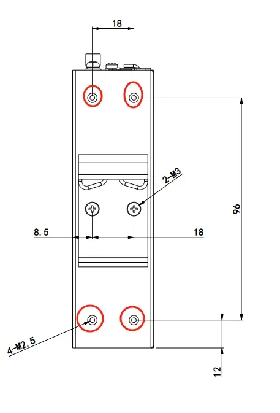</p>

<p align="center"><strong>Figure 2-7 Wall Mounting Method 2 (Step 1)</strong></p>

When the fixing is completed, it is shown in the figure below:

<p align="center">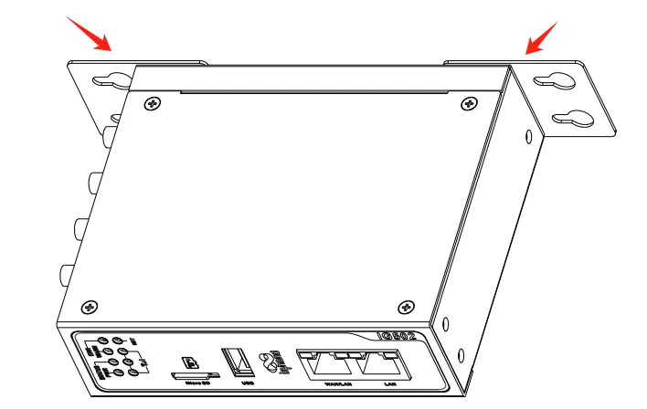</p>

<p align="center"><strong>Figure 2-8 Wall Mounting Method 2 (After Step 1)</strong></p>

Step 2: Once the wall mounting kit is secured to the device, use screws to secure the device to the wall or cabinet.

<p align="center">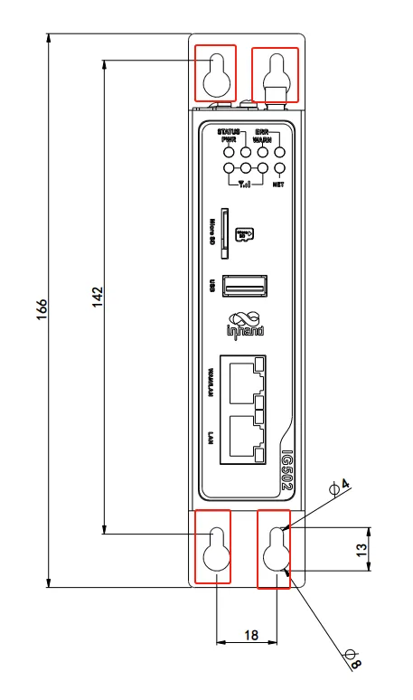</p>

<p align="center"><strong>Figure 2-9 Wall Mounting Method 2 (Fixed to Wall)</strong></p>

**Wall Mounting Method 3: Install the wall mounting kit on the upper and lower panels (large surface lugs)**

Step 1: Screw the wall mounting kit to the top and lower panels of the device.

<p align="center">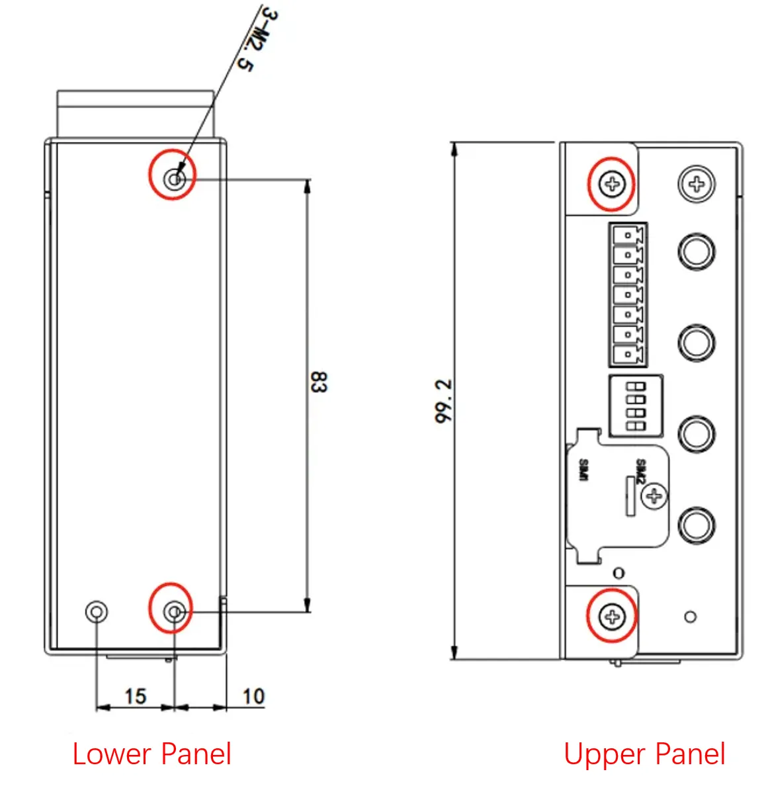</p>

<p align="center"><strong>Figure 2-10 Wall Mounting Method 3 (Step 1)</strong></p>

After the fixing is completed, it is shown in the following picture:

<p align="center">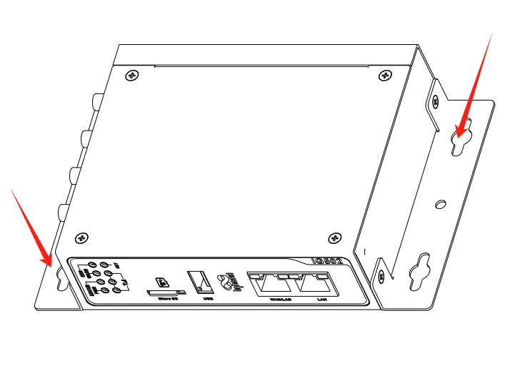</p>

<p align="center"><strong>Figure 2-11 Wall Mounting Method 3 (After Step 1)</strong></p>

Step 2: Once the wall mounting kit is secured to the device, use screws to secure the device to the wall or cabinet.

<p align="center">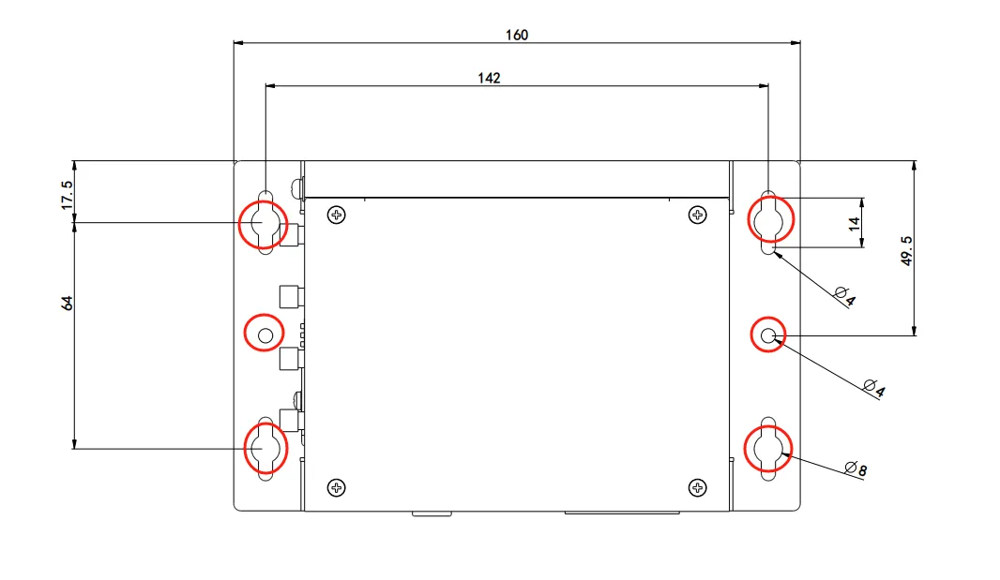</p>

<p align="center"><strong>Figure 2-12 Wall Mounting Method 3 (Fixed to Wall)</strong></p>

#### 2.2.4 Power Connection

The IG502 supports 12–48 VDC power supply. Plug the adapter terminal into the DC port of the IG502 and then connect the power adapter. When the PWR power indicator lights up, it means the device has been powered up normally.

<p align="center">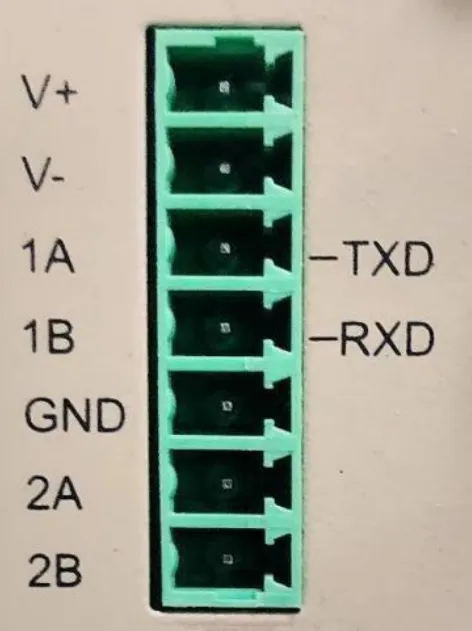</p>

<p align="center"><strong>Figure 2-13 Power/Serial Terminal</strong></p>

The power supply and serial port use a 7-pin terminal. The interface pin description is as follows:

| Pin | Name | Definition |
|-----|------|------------|
| 1 | V+ | Power Positive |
| 2 | V− | Power Negative |
| 3 | TXD or 1A | Serial RS-232 transmit or first RS-485+ |
| 4 | RXD or 1B | Serial RS-232 receive or first RS-485− |
| 5 | GND | Serial RS-232 signal ground |
| 6 | 2A | Second RS-485+ |
| 7 | 2B | Second RS-485− |

> **Note**: When the interface combination is RS-232 + RS-485, the device node corresponding to the RS-232 serial port is /dev/ttyO1, and the device node corresponding to the RS-485 serial port is /dev/ttyO3. When the interface combination is RS-485 + RS-485, the device node corresponding to RS-485-1 is /dev/ttyO1, and the device node corresponding to RS-485-2 is /dev/ttyO3.

#### 2.2.5 Connector Description

##### 2.2.5.1 Digital Input

<p align="center"></p>

<p align="center"><strong>Figure 2-14 Digital Input Interface</strong></p>

| Pin | Name | Definition | Description |
|-----|------|------------|-------------|
| 1 | PCOM | Dry contact access terminal | 4-channel digital/pulse input DI, 2 dry contact control interfaces. Dry contact status "1": closed; Dry contact status "0": disconnected. Wet contact status "1": +10~+30 V / −30~−10 V DC; Wet contact status "0": 0~+3 V / −3~0 V DC. Isolated 3000 VDC. Supports pulse signal counter function; supports up to 100 Hz pulse signals (32-bit counter + 1-bit overflow flag) |
| 2 | DGND | Dry contact ground terminal | |
| 3 | DICOM | Input common terminal | |
| 4 | DI0 | Digital/Pulse Input 0 Connector | |
| 5 | DI1 | Digital/Pulse Input 1 Connector | |
| 6 | DI2 | Digital/Pulse Input 2 Connector | |
| 7 | DI3 | Digital/Pulse Input 3 Connector | |
| 8 | NC | None | |

##### 2.2.5.2 Digital Output

<p align="center"></p>

<p align="center"><strong>Figure 2-15 Digital Output Interface</strong></p>

| Pin | Name | Definition | Description |
|-----|------|------------|-------------|
| 1 | DO0 | Digital/Pulse Output 0 Connector | 3-channel digital/pulse output DO, 1 digital output. Isolated 3000 VDC |
| 2 | DGND | Ground terminal | |
| 3 | DO1 | Digital/Pulse Output 1 Connector | |
| 4 | DGND | Ground terminal | |
| 5 | DO2 | Digital/Pulse Output 2 Connector | |
| 6 | DGND | Ground terminal | |
| 7 | DO3 | Digital Output 3 Connector | |
| 8 | DGND | Ground terminal | |

##### 2.2.5.3 USB Interface

The IG502 provides a USB 2.0 Host interface, which is mainly used for expanding storage devices. IG502 supports USB storage device hot-plugging. If a USB storage device has multiple partitions, IG502 can automatically mount the first 9 partitions; the remaining partitions need to be mounted manually. IG502 will mount all USB storage device partitions under the path /mnt/usb. The naming format of the mounted folder is sda_\<num\>, where \<num\> can be a number from 1 to 9.

<p align="center">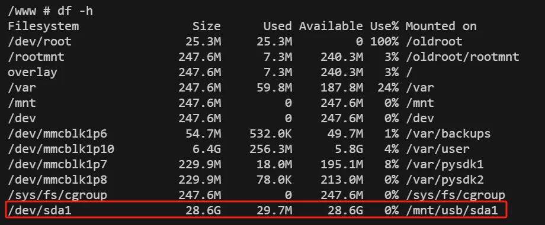</p>

<p align="center"><strong>Figure 2-16 USB Interface</strong></p>

> **Note**: Before disconnecting a USB mass storage device, enter the `sync` command to prevent data loss. When disconnecting the storage device, exit from the /mnt/usb/sda_\<num\> directory. If remaining in /mnt/usb/sda_\<num\>, the automatic unmount process will fail. If this happens, type `umount /mnt/usb/sda_<num>` to manually unmount the device.

##### 2.2.5.4 Micro SD Card Slot

The IG502 has a Micro SD card slot. The SD card does not support hot-plugging and needs to be operated when the power is off.

<p align="center"></p>

<p align="center"><strong>Figure 2-17 Micro SD Card Slot</strong></p>

If a Micro SD storage device has multiple partitions, IG502 can automatically mount the first 9 partitions; the remaining partitions need to be mounted manually. IG502 will mount all Micro SD storage device partitions to the /mnt/sd path. The naming format of the mounted folder is mmcblk0p\<num\>, where \<num\> can be a number from 1 to 9.

The Web Overview page only displays the capacity and usage of the first partition. To facilitate viewing SD card usage on the Web page, it is recommended to create only one partition and format it to the FAT32 file system.

- SD card capacity ≤ 32 GB: Insert the SD card into a card reader, then insert the card reader into a computer running Windows. Most Windows systems only support formatting SD cards smaller than 32 GB to FAT32; the system will automatically create one partition during formatting. It can also be formatted to FAT32 under Linux.
- SD card capacity > 32 GB: When the SD card capacity is greater than 32 GB, it needs to be formatted to FAT32 under Linux.
  1. Execute `fdisk -l` to view the device node corresponding to the SD card; in the example, it is /dev/sda.
  2. Execute `fdisk /dev/sda` to partition (`p` to view current partitions, `d` to delete existing partitions, `n` to create a new partition, `w` to save changes), creating partition /dev/sda1.
  3. Execute `sudo mkfs.vfat -F 32 /dev/sda1` to format the partition to FAT32.

##### 2.2.5.5 SIM Card Slot

The IG502 is equipped with two Micro SIM card holders for cellular communication, located on the upper panel. The SIM card installation does not support hot-plugging and needs to be operated when the power is off.

<p align="center">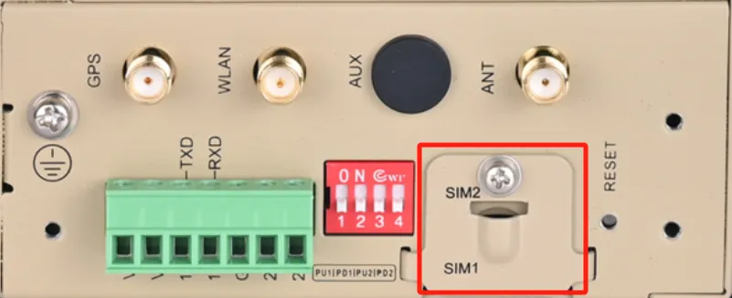</p>

<p align="center"><strong>Figure 2-18 SIM Card Slot</strong></p>

##### 2.2.5.6 Antenna Interface

<p align="center">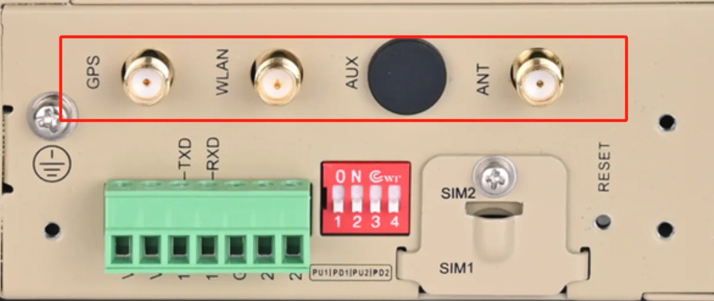</p>

<p align="center"><strong>Figure 2-19 Antenna Interface</strong></p>

The IG502 has 4 antenna interfaces. Different models are equipped with different numbers of antennas. The antenna support for specific models can be found in the "Ordering Information" section of the "IG502 Series Edge Gateway Product Specification".

| Identification | Name |
|----------------|------|
| GPS | GPS antenna |
| WLAN | WAN antenna |
| AUX | AUX antenna (auxiliary antenna) |
| ANT | ANT (main antenna) |

##### 2.2.5.7 DIP Switches

<p align="center">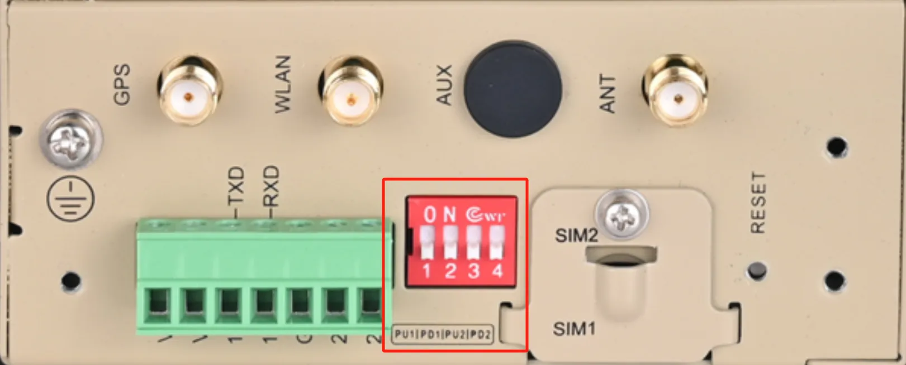</p>

<p align="center"><strong>Figure 2-20 DIP Switch</strong></p>

As shown in the above figure, the 4-digit DIP switch can be used to realize the enable selection of the pull-up/down resistors of A/B of RS-485 interfaces COM1 and COM2 respectively. Enabling the pull-up/down resistors of A/B of the RS-485 interface can improve the anti-interference ability of the RS-485 bus and solve the problem of garbled characters caused by interface chip compatibility.

| Identification | Description |
|----------------|-------------|
| PU1 | ON: Enable pull-up resistor for COM1 RS-485 A; OFF: Disable pull-up resistor for COM1 RS-485 A (default) |
| PD1 | ON: Enable pull-down resistor for COM1 RS-485 B; OFF: Disable pull-down resistor for COM1 RS-485 B (default) |
| PU2 | ON: Enable pull-up resistor for COM2 RS-485 A; OFF: Disable pull-up resistor for COM2 RS-485 A (default) |
| PD2 | ON: Enable pull-down resistor for COM2 RS-485 B; OFF: Disable pull-down resistor for COM2 RS-485 B (default) |

> **Note**: Enabling the RS-485 pull-up/down resistors reduces the maximum number of access devices allowed on the RS-485 bus.

#### 2.2.6 Network Connection and Web Login

Use the following default IP address to connect to the IG502:

| Port | Default IP |
|------|------------|
| WAN/LAN | 192.168.1.1 |
| LAN | 192.168.2.1 |

**Step 1: Interconnect the IG502 to the PC**

Insert one end of the cable into any of the IG502's network ports, and the other end into the computer's network port. Set the computer's IP address to the same network segment address as the device interface.

<p align="center">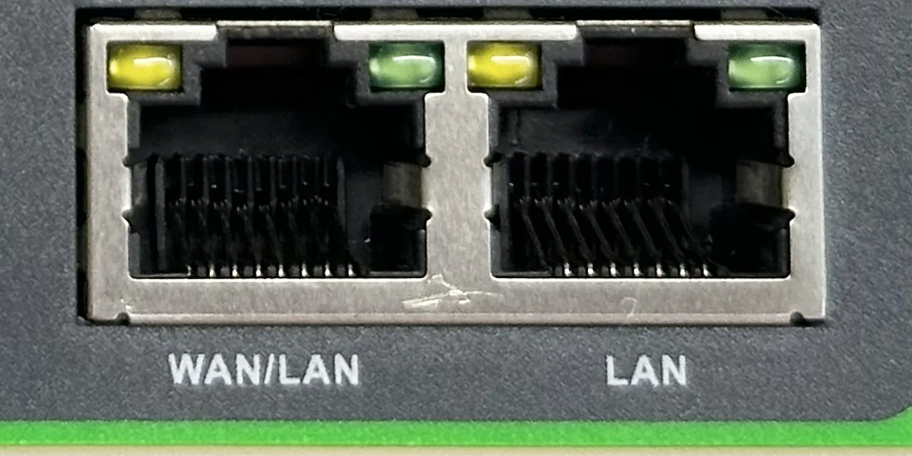</p>

<p align="center"><strong>Figure 2-21 IG502 Connected to PC</strong></p>

**Step 2: Network and system management of IG502 via Web**

IG502 supports Web interface management based on IEOS, which is a set of network management and system management programs developed by InHand and running on the Linux system. IEOS can provide Web interface services. Taking the network cable network port inserted into the LAN port as an example, the device login information is as follows:

- Login address: https://192.168.2.1
- Initial login account: adm
- Initial login password: Check the nameplate on the device panel for the initial password information

<p align="center">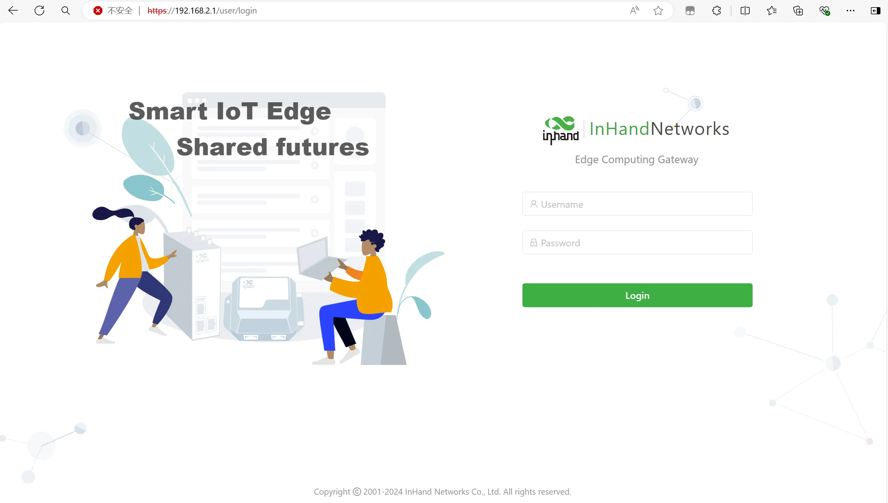</p>

<p align="center"><strong>Figure 2-22 Web Login Interface</strong></p>

After successful login, the Overview page is displayed.

### 2.3 Quick Check

After installation is complete, perform the following checks:

- [ ] The device is securely mounted on the DIN rail or wall.
- [ ] The power cable is correctly connected and the PWR indicator is on.
- [ ] The network cable is connected to the PC network port.
- [ ] The PC IP address is in the same network segment as the device.
- [ ] The Web management interface can be accessed via browser (https://192.168.2.1).
- [ ] Login is successful using the initial account adm and the nameplate password.

---

## Chapter 3 Common Scenario Configuration

### Scenario 1: Cellular Networking

**Objective**: Access the Internet via 4G/5G cellular network.

**Prerequisites**: SIM card has been inserted and antenna is installed; the device is powered on.

**Estimated Time**: Approx. 5 minutes.

**Operating Steps**:

1. Navigate to 【Network】→【Network Interface】→【Cellular】.
2. Click the "Enable Cellular" button.
3. Configure the dialling profile (APN, username, password, authentication method, etc.; dedicated network cards require configuration, while standard SIM cards usually use the default).
4. Select the network type (Auto / 2G / 3G / 4G / 5G).
5. If dual-SIM redundancy is required, enable the "Enable Dual SIM" function, and configure the primary card selection policy, maximum number of redials, minimum connection time, and other parameters.
6. Click "Save" and wait for the connection to establish.

**Verification Method**:

1. Check the NET indicator status to confirm that the network connection is normal (NET steady on indicates successful dialling).
2. On the Overview page, view the cellular network connection status to confirm that an IP address has been obtained.

**Common Issues**:

- Network connection failure: Check whether the SIM card is correctly inserted and whether the APN parameters are correct.
- Data transmission abnormality: Check signal strength and data balance.

### Scenario 2: Ethernet Networking

**Objective**: Access the LAN or Internet via the Ethernet interface.

**Prerequisites**: The network cable is connected to the upstream network device or router.

**Estimated Time**: Approx. 3 minutes.

**Operating Steps**:

1. Navigate to 【Network】→【Network Interface】→【Ethernet】.
2. Select the Ethernet interface to configure.
3. Select the network type:
   - Dynamic Address (DHCP): Automatically obtain the IP address and subnet mask.
   - Static IP: Manually configure the IP address, subnet mask, gateway, and DNS.
4. If a secondary IP address is required, add it in "Secondary IP Support" (up to 10).
5. Click "Submit" to apply the configuration.

**Verification Method**:

1. On the Ethernet configuration page, view the interface status to confirm that the IP address has been obtained or configured successfully.
2. In 【System Management】→【Tools】, use the Ping tool to test external network connectivity.

**Common Issues**:

- Unable to obtain IP address: Check whether the upstream network device DHCP service is normal, or confirm whether the static IP configuration is correct.
- Unable to access the Internet: Check whether the gateway and DNS configurations are correct.

### Scenario 3: WLAN Configuration

**Objective**: Configure WLAN as Access Point (AP) or Client mode.

**Prerequisites**: The device model supports WLAN functionality (refer to the product datasheet for specific support).

**Estimated Time**: Approx. 5 minutes.

**Operating Steps**:

1. Navigate to 【Network】→【Network Interface】→【WLAN】.
2. Enable Wi-Fi.
3. Select the interface type:
   - Access Point (AP): Configure SSID, authentication method, encryption method, WPA/WPA2 PSK key, channel, maximum number of clients, etc.
   - Client: Configure the SSID name to connect to, authentication method, encryption method, WPA/WPA2 PSK key, network type (static IP / DHCP).
4. Click "Save" to apply the configuration.

**Verification Method**:

1. AP mode: Use a wireless device to scan for the SSID and confirm that it can be found and connected.
2. Client mode: On the WLAN configuration page, view the connection status to confirm association with the target AP.

**Common Issues**:

- Wireless device cannot scan the SSID: Check whether SSID broadcast is enabled and whether the wireless band and channel configuration are correct.
- Client cannot connect to AP: Check whether the authentication method and key are consistent with the target AP.

### Scenario 4: VPN Configuration

**Objective**: Establish an IPsec or OpenVPN tunnel to achieve secure remote communication.

**Prerequisites**: The networks at both ends are reachable, and the peer IP address or domain name has been obtained.

**Estimated Time**: Approx. 10 minutes.

**Operating Steps (taking IPsec as an example)**:

1. Navigate to 【Advanced Functions】→【VPN】→【IPsec】.
2. Configure the IKEv1/IKEv2 policy: Select the encryption algorithm, hash algorithm, Diffie-Hellman key exchange group, and lifetime.
3. Configure the IPsec policy: Select the encapsulation mode (AH/ESP), encryption algorithm, authentication method, and IPsec mode (tunnel mode / transport mode).
4. Configure the IPsec tunnel:
   - Set the peer address, interface name, IKE version, and policy.
   - Select the authentication method (shared key / digital certificate).
   - Configure the local subnet address and peer subnet address.
5. Click "Save" and wait for the tunnel to establish.

**Verification Method**:

1. On the IPsec configuration page, view the tunnel status to confirm that the SA has been established.
2. In 【System Management】→【Tools】, use the Ping tool to test peer subnet connectivity.

**Common Issues**:

- Tunnel cannot be established: Check whether the encryption algorithms, hash algorithms, and authentication keys at both ends are consistent.
- Data transmission failure: Check whether the local subnet and peer subnet configurations are correct, and whether the ACL or firewall has allowed the relevant traffic.

### Scenario 5: Python Edge Computing

**Objective**: Enable the Python secondary development environment, deploy and run custom Apps.

**Prerequisites**: The device firmware version supports Python edge computing functionality.

**Estimated Time**: Approx. 10 minutes.

**Operating Steps**:

1. Navigate to 【Edge Computing】→【Python Edge Computing】.
2. Enable the Python edge computing engine.
3. Install / upgrade the Python SDK.
4. Enable debug mode.
5. In the App list, add an App, upload the App package, and configure startup parameters.
6. Start the App and view the runtime log.

**Verification Method**:

1. On the Python Edge Computing page, view the App status to confirm that the App status is "Running".
2. Click the "View" button to view the App runtime log and confirm that there are no error messages.

**Common Issues**:

- App cannot start: Check whether the App package format is correct and whether the startup parameters are configured correctly.
- Log has no output: Confirm that debug mode is enabled, and check the App code logic.

### Scenario 6: Device Cloud Platform Connection

**Objective**: Connect the IG502 to the InHand device cloud platform to achieve remote management and monitoring.

**Prerequisites**: An account has been registered on the cloud platform.

**Estimated Time**: Approx. 5 minutes.

**Operating Steps**:

1. Navigate to 【System Management】→【Device Cloud Platform】.
2. Select the platform to connect to (InHand Connect Service / Device Manager / iSCADA Cloud / Device Live Manager).
3. Enable the connection function.
4. Select or customize the server address.
5. Enter the cloud platform registered account name.
6. If a secure channel is required, enable "Enable Secure Channel" in Advanced Settings.
7. Click "Save" and wait for the device to come online.

**Verification Method**:

1. On the Device Cloud Platform page, view the connection status to confirm that the device is online.
2. Log in to the cloud platform Web interface and confirm that the device can be seen in the device list.

**Common Issues**:

- Device cannot come online: Check whether the server address and registered account are correct, and confirm that the device network can access the cloud platform server.
- Cloud platform cannot manage the device: Check whether the heartbeat interval and traffic reporting interval configurations are reasonable.

---

## Chapter 4 Function Description and Parameter Reference

### 4.1 Overview

This page summarizes the gateway system status, system performance, system storage, network connection, and network flow information. Through this page, the basic device situation can be quickly understood.

<p align="center">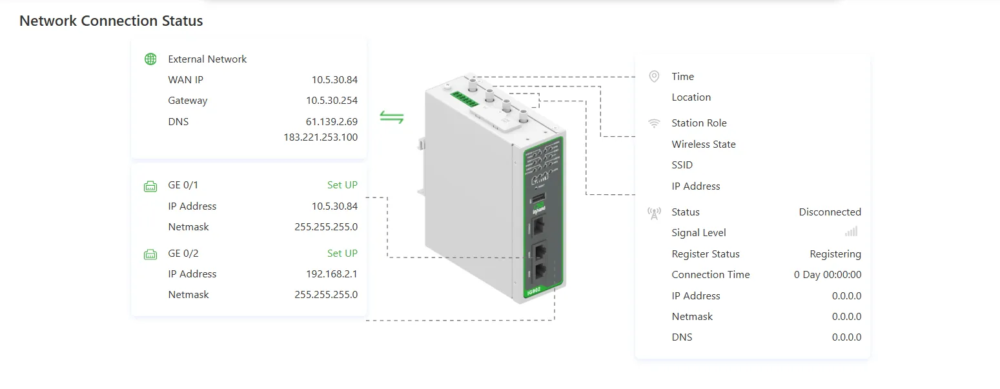</p>

<p align="center"><strong>Figure 4-1 Overview Page - Network Connection Status</strong></p>

- **Network Connection Status**: Displays the IG network connection status and network configuration.
  - External Network Status: To configure routing for data forwarding to an external network, click the Static Routing page.
  - Interface Network Status: To configure an interface, click the "Set Up" button after the interface to jump to the Ethernet page.

<p align="center">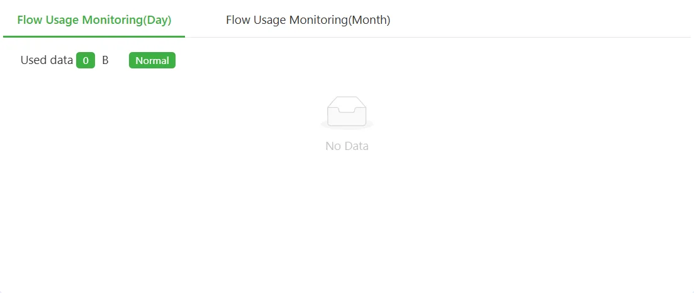</p>

<p align="center"><strong>Figure 4-2 Overview Page - Data Usage Monitoring</strong></p>

- **Data Usage Monitoring**: Displays flow usage in the last 24 hours and the last month, generating one data point per hour.

<p align="center">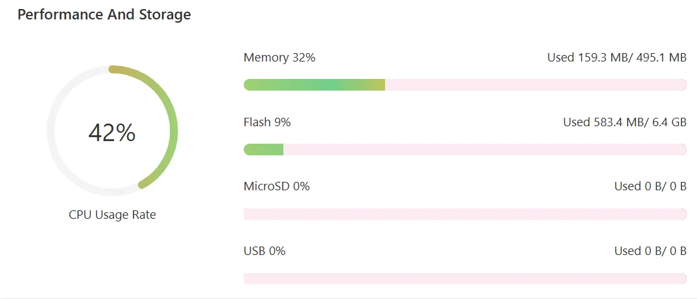</p>

<p align="center"><strong>Figure 4-3 Overview Page - Performance and Storage</strong></p>

- **Performance and Storage**: Displays the current CPU, memory, Flash, MicroSD, and USB usage.

<p align="center">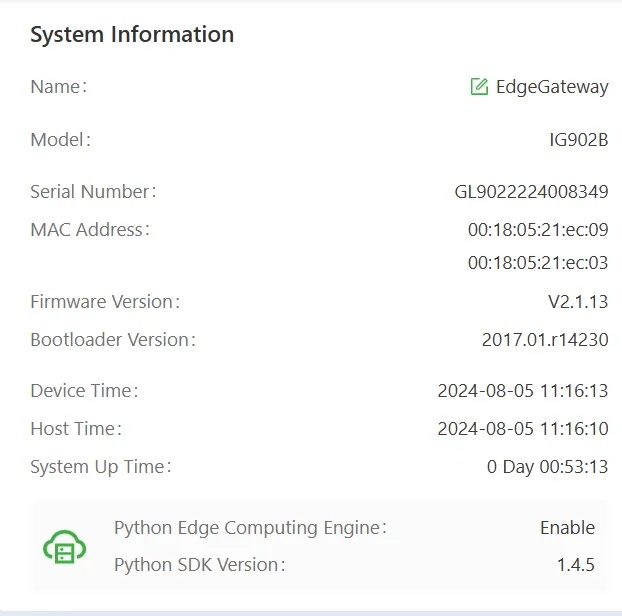</p>

<p align="center"><strong>Figure 4-4 Overview Page - System Information</strong></p>

- **System Information**: Click the "Edit" button to modify the IG device name.

### 4.2 Network

#### 4.2.1 Network Interface

##### 4.2.1.1 Cellular

This page displays the current cellular network status and configuration information of the gateway. Cellular network parameters can be configured via the "Enable Cellular" button.

<p align="center">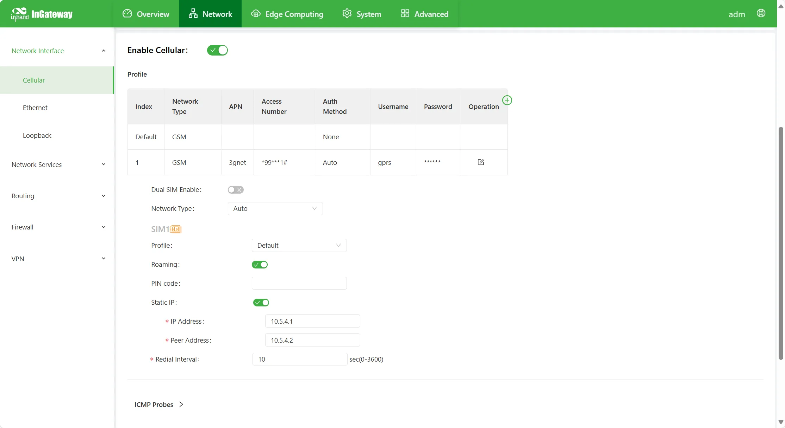</p>

<p align="center"><strong>Figure 4-5 Cellular Configuration</strong></p>

Cellular network parameter descriptions are as follows:

- **Enable Cellular**: Enable or disable the cellular network function.
- **Dialling Profile**: Used to configure APN, username, password, and authentication method when using a dedicated network card. If not a dedicated network card, modification is usually unnecessary. Up to 10 profiles can be added.
  - **Network Type**: Selects the mobile network type used by the device. Options include GSM and CDMA.
  - **APN (Access Point Name)**: APN is used to identify the service type of the WCDMA/LTE network. The WCDMA/LTE system provides corresponding services according to the APN through which the user connects to the WCDMA/LTE network. Provided by the operator (not required for CDMA2000 series).
  - **Dialling Number**: The dialling string used for dialling. The dialling string is provided by the operator.
    - When the 3G/LTE data card supports WCDMA or LTE standards, the default dialling string is `*99***1#`.
    - When the 3G data card supports CDMA2000 standards, the default dialling string is `#777`.
  - **Authentication Method**
    - Auto: Automatically select an authentication method.
    - PAP: Password Authentication Protocol, providing a simple plaintext authentication method through two-way handshake.
    - CHAP: Challenge Handshake Authentication Protocol, performing secure authentication by confirming digest information through three-way handshake.
    - MS-CHAP: Microsoft's CHAP standard.
    - MS-CHAPv2: Upgraded version of MS-CHAP, requiring bidirectional verification.
  - **Username**: Specifies the username of the user accessing the external PDN network. Provided by the operator. Default username is `gprs`.
  - **Password**: Specifies the password of the user accessing the external PDN network. Provided by the operator. Default password is `gprs`.

<p align="center">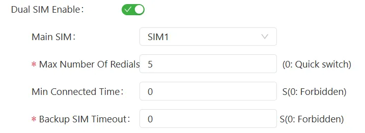</p>

<p align="center"><strong>Figure 4-6 Dialling Profile Configuration</strong></p>

- **Enable Dual SIM**: Enables the dual-SIM function. To improve network reliability, dual-SIM single-standby is supported. Two SIM cards need to be inserted into the device. Disabled by default.
  - **Select Primary Card**: Supports SIM1, SIM2, Random, and Sequence.
  - **Max Number of Redials**: When SIM1 fails to dial within the set maximum number of redials, the device switches to SIM2 for dialling.
  - **Min Connected Time**: When the device dial-up connection duration is less than the set minimum connection time, the device's dial count accumulates. When greater than the set minimum connection time, the device's dial count resets. 0 disables this function.
  - **Backup SIM Timeout**: If the currently used card is a backup SIM, after the backup SIM successfully dials and the set backup SIM timeout is reached, the device switches to the primary card for dialling.
- **Network Selection Mode**: Options include Auto, 2G, 3G, 4G, and 5G. (Note: Different devices support different network types; refer to the corresponding product datasheet for details.) The user can select a specific network mode or use Auto according to the device and SIM card used, and the device will automatically register to the applicable network mode.
- **Dialling Profile**: Dialling policy selection, corresponding to the dialling profile configuration index. If not a dedicated network card, select the default.
- **Enable Roaming**: When enabled, the device can dial normally in roaming status. When disabled, a roaming SIM card cannot dial to access the Internet. When using a local card, enabling or disabling roaming does not affect SIM card dialling.
- **PIN Code**: The PIN code is the personal identification password of the SIM card. If the PIN code is enabled, when no PIN code is set or an incorrect PIN code is set, the device fails to dial. When a correct PIN code is set, the device can dial normally.

<p align="center">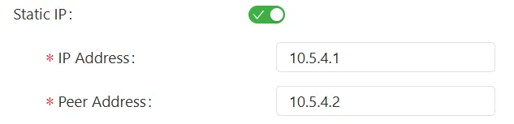</p>

<p align="center"><strong>Figure 4-7 static IP Configuration</strong></p>

- **Static IP**: Whether to use a static IP when dialling. The device IP address can be manually specified. The device obtains the configured static IP every time it dials.
- **Redial Interval**: The waiting time before redialling after each disconnection.

<p align="center">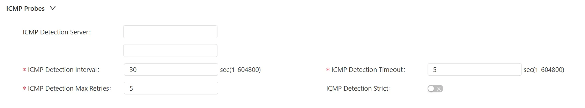</p>

<p align="center"><strong>Figure 4-8 Cellular ICMP Configuration</strong></p>

- **ICMP Probe**: Cellular networks sometimes exhibit a state where dialling succeeds and an IP address is obtained, but the Internet is unreachable. Usually redialling can resolve this issue. ICMP Probe can be used to detect whether the network is normal. Once the network is abnormal, it triggers redialling to resolve the network disconnection issue. This function is disabled by default. It is recommended to enable this function when deploying a cellular network.
  - **ICMP Probe Server**: The remote IP address or domain name to probe (when enabling two ICMP probe servers simultaneously, it is recommended to enter IP addresses or domain names simultaneously). The device supports two ICMP probe servers: primary and backup. When two servers are configured, the first server is detected first. Only when the first server reaches the maximum retry count does the system detect the second server. When both servers fail detection, the device redials and proceeds to the next round of ICMP probing.
  - **ICMP Probe Interval**: The time interval at which the device sends ICMP probe packets.
  - **ICMP Probe Timeout**: Within the set ICMP probe timeout, if no ICMP response packet is received, the ICMP probe is considered timed out.
  - **ICMP Probe Max Retries**: Sets the maximum retry count when ICMP probing fails (redialling is triggered when the maximum count is reached).
  - **ICMP Strict Detection**: When ICMP strict detection is disabled, if the dial-up interface has traffic, ICMP probes are not sent to save data. When ICMP strict detection is enabled, ICMP probe packets are sent regardless of whether the dial-up interface has traffic.

<p align="center">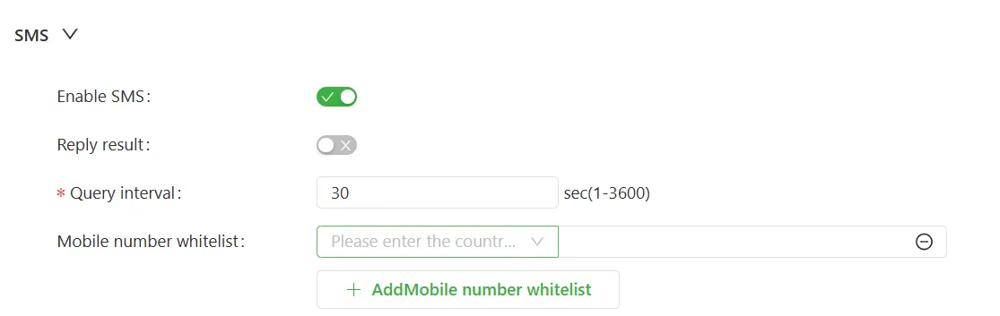</p>

<p align="center"><strong>Figure 4-9 SMS Configuration</strong></p>

- **SMS**: The SMS function is used to set cellular parameters, query cellular status, configure IO output, and restart the system.
  - **Enable SMS**: Enable or disable the SMS function.
  - **Reply Result**: When enabled, after the user configures cellular, IO, or restarts the system via SMS, the device replies with an SMS indicating whether the configuration was successful.
  - **Query Interval**: The device periodically queries received SMS at this interval.
  - **Mobile Number Whitelist**: Only mobile numbers in the whitelist can send SMS to set cellular parameters and other information.

**SMS Configuration Details:**

**1. Set Cellular Dialling Parameters via SMS**

SMS format:

```
code=xxx cellular slot=sim1 apn=hello username=xxx password=xxx network=4g dialnumber=*99*1 auth=pap
cellular slot=sim1 apn=hello username=xxx password=xxx network=4g dialnumber=*99*1 auth=pap
```

Cellular dialling parameter configuration description:

- `code`: The SMS password set on the page. If a password is set, it must start with `code`; this is mandatory. When no password is set, send the instruction in the second format.
- `cellular`: Indicates setting parameters related to the cellular service. The `cellular` keyword must be at the beginning of the SMS content; the content after `cellular` is the cellular configuration item.
- `slot`: Indicates which SIM card's dialling parameters are to be set. Settable values: `sim1`, `sim2`.
- Mandatory parameter `apn`: Configures APN information.
- Optional parameter `username`: Configures the username.
- Optional parameter `password`: Configures the password.
- Optional parameter `auth`: Authentication method; settable values: `none`, `auto`, `pap`, `chap`; case-sensitive.
- Optional parameter `network`: Configures the network standard; settable values: `2g`, `3g`, `4g`, `auto`; case-sensitive.
- Optional parameter `dialnumber`: Dialling number.

**Notes:**

1. Optional parameters require at least one item to be filled in. Except that `cellular` must be at the beginning of the SMS content, the order of other parameters is not required. Each parameter is separated by a space.
2. Parameter names and some parameter values are strictly case-sensitive.
3. If an unrecognized configuration item appears in the SMS content, e.g., `icmp_interval=10`, the configuration will fail.
4. The SMS content length must not exceed 140 characters.
5. Since the default parameter set does not allow modification, when sim1/sim2 uses the default parameter set, configuring dialling parameters via SMS will fail.

**2. Enable Dual SIM via SMS**

SMS format:

```
code=xxx cellular enable_dualsim=0
cellular enable_dualsim=1
```

- `enable_dualsim`: Whether to enable dual SIM; 0 means disabled, 1 means enabled.

**3. Switch SIM Card via SMS**

SMS format:

```
code=xxx cellular switch_to=sim1
cellular switch_to=sim2
```

- `switch_to`: Switch to the target card; `sim1` means switch to the sim1 slot, `sim2` means switch to the sim2 slot.

**4. Restart System via SMS**

SMS format:

```
code=xxx system command=reboot
system command=reboot
```

- `system`: Indicates executing system-related settings; the `system` keyword must be at the beginning of the SMS content.
- `command`: Indicates the command to be executed; settable value: `reboot`; mandatory parameter.

**5. Query Dialling Information via SMS**

SMS format:

```
code=xxx status object=cellular
status object=cellular
```

- `status`: Indicates executing a status query; the `status` keyword must be at the beginning of the SMS content.
- `object`: Indicates which service's status needs to be queried; settable value: `cellular`; mandatory parameter.

After sending the query SMS, an SMS with the following content will be received:

```
cellular_status signal=none network=4g hostname=EdgeGateway uptime=150 ip=10.48.104.247
```

Reply content parameter description:

1. `cellular_status`: Cellular status.
2. `signal`: Cellular signal quality; settable values: `none`, `poor`, `moderate`, `good`, `great`.
3. `network`: Network standard; settable values: `2g`, `3g`, `4g`, `unknown`.
4. `hostname`: Device hostname.
5. `ip`: Dial-up interface IP address.
6. `uptime`: Device uptime, unit: seconds.

**6. Set Digital Output DO via SMS**

SMS format:

```
code=xxx io do0=1 do1=1 do2=0 do3=0
io do0=1 do1=1 do2=0 do3=0
```

DO setting parameter description:

1. `io`: Indicates setting parameters related to the IO service; the `io` keyword must be at the beginning of the SMS content.
2. `do0`~`do3`: Configures the output of do0~do3. Multiple DOs can be configured; there is no order requirement between configuration items. For example: `io do0=1 do1=1 do3=0 do2=0`. Only one DO can also be configured, e.g., `io do0=1`. At least one DO must be configured. DO values can only be 0 or 1.

**7. Receive DI Change Notifications via SMS**

To use this function, configure the receiving mobile number on the IO page, and add that mobile number to the whitelist on the Cellular page.

<p align="center">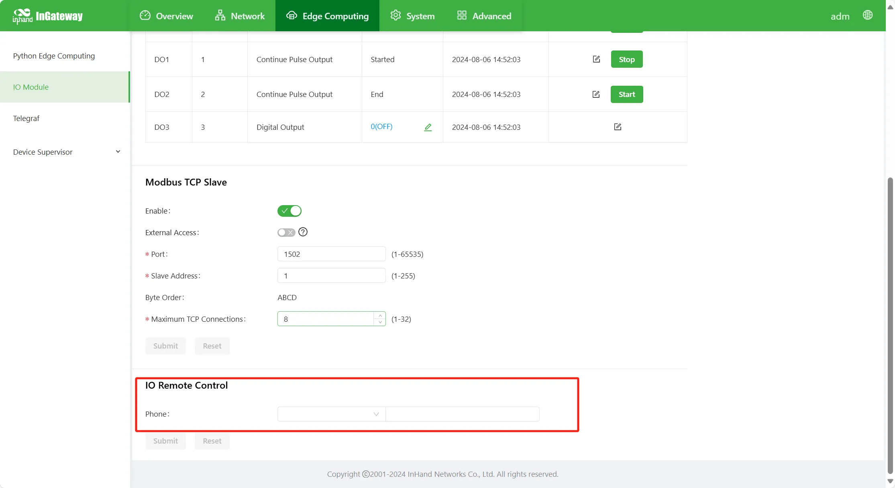</p>

<p align="center"><strong>Figure 4-10 IO Mobile Number Configuration</strong></p>

After the DI value changes, the user's mobile number will receive an SMS with the following content:

```
io_status sn=GL5022221013941 di0=0 timestamp=2024-05-15T10:03:12+0000
```

> **Note**: Currently, only basic models IG502-FF53 and IG502-FQ58 support the SMS function, e.g., IG502-FQ58-W-G, IG502-FF53-IO-W-G. For specific models, refer to the "Ordering Information" section in the product datasheet.

<p align="center">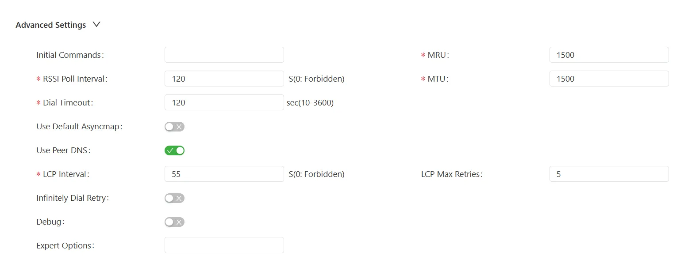</p>

<p align="center"><strong>Figure 4-11 Advanced Settings Configuration</strong></p>

- **Advanced Settings**
  - **Initial Commands**: Some AT commands can be configured to query module status.
  - **Signal Query Interval**: After the device successfully dials, it will periodically query signal status at the set query interval. For example, if the query interval is set to 60 s, after the device dials successfully, remove the device antenna; after 60 s, the device signal should decrease. Within 60 s, the device signal does not change. 0 means disabled.
  - **Dial Timeout**: Within the set timeout, if the device fails to dial, the dial is considered timed out, and the device re-detects the module and re-dials.
  - **MRU**: Maximum Receive Unit, in bytes.
  - **MTU**: Maximum Transmission Unit, in bytes.
  - **Enable Default Asyncmap**: Enable or disable the default Asyncmap.
  - **Use Assigned DNS Server**: When enabled, uses the DNS server assigned in the dial-up network connection.
  - **Connection Detection Interval**: Detects whether the dial-up connection is normal at the specified interval.
  - **Connection Detection Max Retries**: The retry count after detecting a disconnection.
  - **Infinitely Dial Retry**: When enabled, if dialling fails, unlimited redial attempts are performed.
  - **Enable Debug Mode**: After enabling debug mode, system logs will print more detailed information.
  - **Expert Options**: Corresponding command parameters can be configured in expert options.

##### 4.2.1.2 Ethernet

The "Ethernet" page displays the Ethernet interface configuration and status information of the device. The IG502 is equipped with 2 RJ45 Ethernet ports, supporting 10 M/100 M adaptive rates.

Steps to configure the Ethernet interface:

1. Select "Network > Network Interface > Ethernet/LAN/WAN" to enter the Ethernet interface configuration interface. (Different IG series models are equipped with different interface types and quantities, but the configuration method is consistent.)
2. Select the network type of the interface.
3. Select or enter each parameter in turn.
4. Click "Submit".

**Configure the interface with dynamic address acquisition (network type selected as DHCP), as shown in the figure below:**

<p align="center">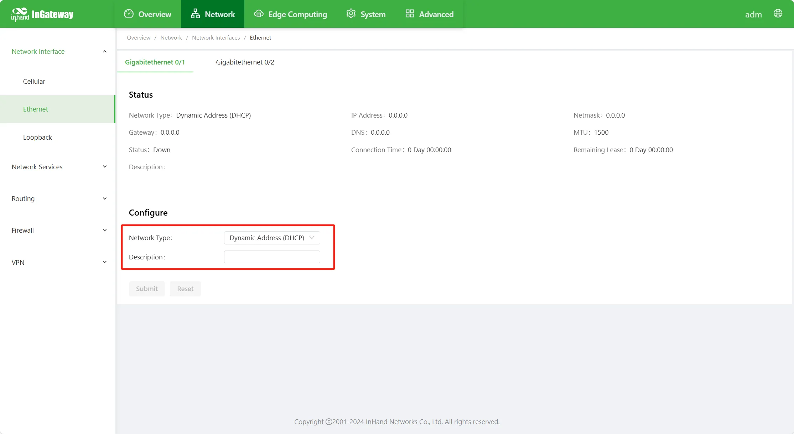</p>

<p align="center"><strong>Figure 4-12 Ethernet DHCP Configuration</strong></p>

- **Network Type**
  - Dynamic Address (DHCP): Configures the interface as a DHCP client, using DHCP to obtain the IP address and subnet mask.
- **Description**: Descriptive information of the Ethernet interface, for identification purposes.

**Configure the interface with static IP (network type selected as Static IP), as shown in the figure below:**

<p align="center">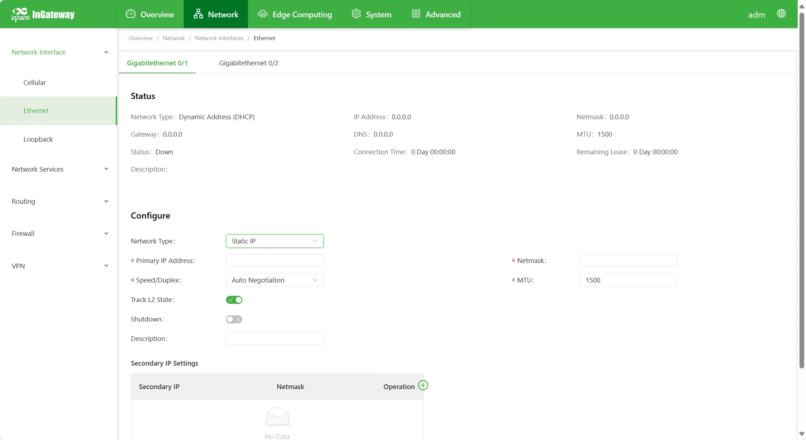</p>

<p align="center"><strong>Figure 4-13 Ethernet Static IP Configuration</strong></p>

- **Network Type** (default is Static IP)
  - Static IP: Manually configure the IP address and subnet mask for the Ethernet interface.
- **Primary IP**: IP address of the Ethernet interface; customizable.
- **Subnet Mask**: Subnet mask of the Ethernet interface.
- **MTU**: Maximum Transmission Unit, in bytes; default value is 1500.

<p align="center">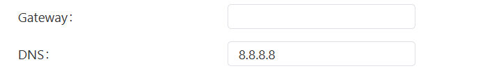</p>

<p align="center"><strong>Figure 4-14 DNS Configuration</strong></p>

If the interface type is WAN port, the gateway and DNS can also be set:

- **Gateway**: IP address of the device gateway.
- **DNS**: The DNS IP address can be manually specified.
- **Port Speed / Port Mode**
  - Auto Negotiation
  - 1000 M Full Duplex
  - 1000 M Half Duplex
  - 100 M Full Duplex
  - 100 M Half Duplex
  - 10 M Full Duplex
  - 10 M Half Duplex
- **Layer-2 Status Linkage**: When enabled, the port physical connection status is Down without physical connection and Up when physically connected. When disabled, the port displays Up regardless of physical connection.
- **Shutdown**: Disables the interface.
- **Description**: Descriptive information of the Ethernet interface, for identification purposes.
- **Secondary IP Support**: In addition to the primary IP, users can also configure secondary IP addresses; up to 10 can be configured.

##### 4.2.1.3 WLAN

The "WLAN" page displays the WLAN configuration and status information of the IG.

> **Note**: Not all IG series models support WLAN functionality. For specific support, refer to the official website resource center, enter the corresponding product list, and view the "Ordering Information" section in the product datasheet.

**Configure WLAN as Access Point, as shown in the figure below:**

<p align="center">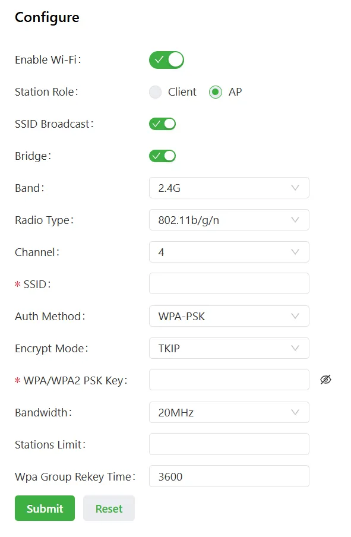</p>

<p align="center"><strong>Figure 4-15 WLAN Access Point Configuration</strong></p>

Parameters when configuring WLAN as Access Point:

- **Enable Wi-Fi**: Enable or disable the WLAN service. After enabling the WLAN service, basic wireless network parameters and security authentication options can be configured, allowing wireless access users to access the Internet.
- **Interface Type**: Select the WLAN operating mode; here select Access Point.
- **Access Point Mode**:
  - **SSID Broadcast**: After enabling SSID broadcast, wireless clients can scan this SSID. Disabling hides the SSID; after SSID hiding, the device sends beacon frames that do not contain SSID information, and access clients must manually configure the SSID identifier on the wireless client to access the device.
  - **Bridge**: Bridges the WLAN to the bridge interface when enabled.
  - **Band**: The wireless band of this AP. Different device models have different support; refer to the product datasheet for details.
  - **Radio Type**: Different wireless bands support different radio types. Refer to the product datasheet for details.
    - 802.11b: Operates in the 2.4 GHz band; maximum rate 11 Mbps.
    - 802.11g: Operates in the 2.4 GHz band; maximum rate 54 Mbps.
    - 802.11n: Operates in the 2.4 GHz band, or can operate in the 5 GHz band; theoretical maximum rate 300 Mbps.
  - **Channel**: The channel is a data signal transmission channel using wireless signals as transmission media. The 2.4 GHz band has 13 channels, each with a different carrier frequency.
    - Channel 1, center frequency 2.412 GHz; Channel 2, center frequency 2.417 GHz.
    - Channel 3, center frequency 2.422 GHz; Channel 4, center frequency 2.427 GHz.
    - Channel 5, center frequency 2.432 GHz; Channel 6, center frequency 2.437 GHz.
    - Channel 7, center frequency 2.442 GHz; Channel 8, center frequency 2.447 GHz.
    - Channel 9, center frequency 2.452 GHz; Channel 10, center frequency 2.457 GHz.
    - Channel 11, center frequency 2.462 GHz; Channel 12, center frequency 2.467 GHz.
    - Channel 13, center frequency 2.472 GHz.
  - **SSID**: Service Set Identifier. SSID technology can divide a wireless LAN into several sub-networks requiring different authentication. Each sub-network requires independent identity authentication; only users passing identity authentication can enter the corresponding sub-network, preventing unauthorized users from entering the network.
  - **Auth Method**: Five authentication methods are available: Open, Shared, WPA-PSK, WPA2-PSK, and WPAPSK/WPA2PSK. Encrypted authentication methods currently include three: WPA-PSK, WPA2-PSK, and WPAPSK/WPA2PSK.
  - **Encrypt Mode**: Supports TKIP and AES encryption.
  - **WPA/WPA2 PSK Key**: Authentication key; key length is 8–63.
  - **Bandwidth**: Specifies the channel bandwidth corresponding to this AP radio frequency, e.g., for the 2.4 GHz band, options include 20 MHz and 40 MHz.
  - **Max Clients**: The maximum number of clients the device can connect to at the same time (up to 128).
  - **Group Key Negotiation Time**: The time interval (unit: ms) required for identity authentication and key exchange when a client device attempts to access an encrypted network.

**Configure WLAN as Client, as shown in the figure below:**

<p align="center">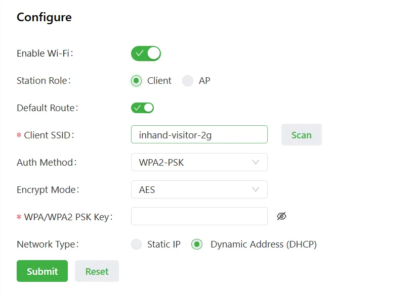</p>

<p align="center"><strong>Figure 4-16 WLAN Client Configuration</strong></p>

Parameters when configuring WLAN as Client:

- **Enable Wi-Fi**: Enable or disable the WLAN service. After enabling the WLAN service, basic wireless network parameters and security authentication options can be configured, allowing wireless access users to access the Internet.
- **Interface Type**: Select the WLAN operating mode; here select Client.
- **Client Mode**:
  - **Client SSID**: Fill in the SSID name that the gateway needs to connect to.
  - **Auth Method**: Consistent with the authentication method of the SSID to be connected.
  - **Encrypt Mode**: Consistent with the encryption method of the SSID to be connected.
  - **WPA/WPA2 PSK Key**: Consistent with the key of the SSID to be connected.
  - **Network Type**: Select the mode for the client to obtain the IP address. Options include Static IP and Dynamic Address (DHCP).

##### 4.2.1.4 Loopback Interface

A loopback interface is a logical, virtual interface on the device. After creation and configuration, its address can be pinged or telnetted, which can be used to test network connectivity.

<p align="center">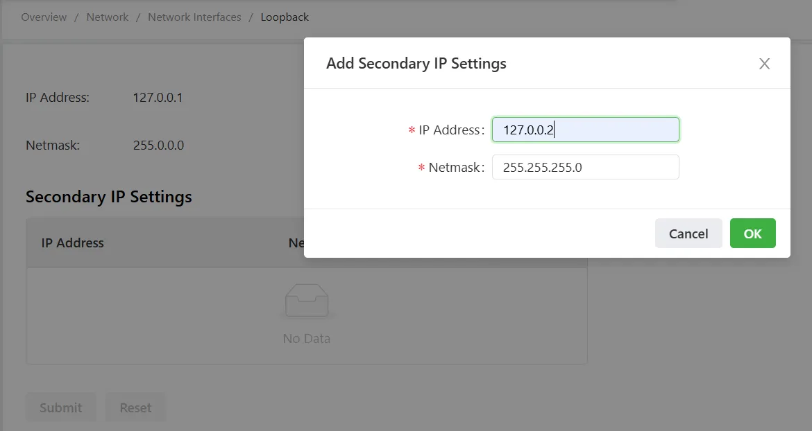</p>

<p align="center"><strong>Figure 4-17 Loopback Interface Configuration</strong></p>

- **IP Address**: IP address of the loopback interface.
- **Subnet Mask**: Subnet mask of the loopback interface IP address.

Note: A maximum of 10 secondary IP addresses can be configured.

#### 4.2.2 Network Services

##### 4.2.2.1 DHCP Service

DHCP uses a client/server communication model. The client sends an address allocation request to the server, and the server returns the assigned IP address and related information (such as lease period) to the client, enabling dynamic configuration of IP addresses.

<p align="center">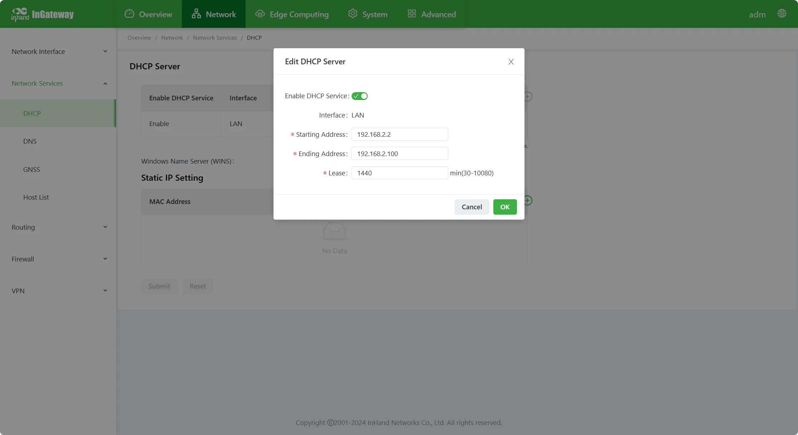</p>

<p align="center"><strong>Figure 4-18 DHCP Service Configuration</strong></p>

- DHCP server parameter descriptions:
  - **Enable DHCP Service**: Enable or disable the DHCP service.
  - **Interface**: Select the corresponding interface. Different devices support different interface types and quantities; select according to the actual situation.
  - **Starting Address**: Set the starting IP address in the address pool assigned to client devices.
  - **Ending Address**: Set the ending IP address in the address pool assigned to client devices.
  - **Lease**: Set the validity period of the assigned IP address. After expiration, the DHCP server reclaims the IP address assigned to the client and reassigns an IP address. Cannot be empty.
- **Windows Name Server (WINS)**: IP address of the WINS server.
- **Static IP Settings**: In some scenarios, some terminals require fixed IP addresses. The Static IP Setting function can be used to bind the terminal MAC address with an IP in the address pool. After binding, the terminal is assigned a fixed address every time it connects to the network.

<p align="center">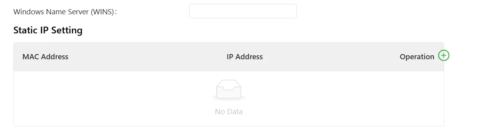</p>

<p align="center"><strong>Figure 4-19 DHCP Static IP Binding</strong></p>

##### 4.2.2.2 DNS Service

The Domain Name System (DNS) is a distributed database for TCP/IP applications that provides translation between domain names and IP addresses.

<p align="center">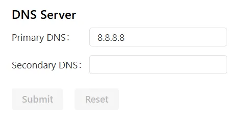</p>

<p align="center"><strong>Figure 4-20 DNS Server Configuration</strong></p>

Configure DNS servers; up to two domain name servers can be configured.

Configure DNS relay service, as shown in the figure below:

<p align="center">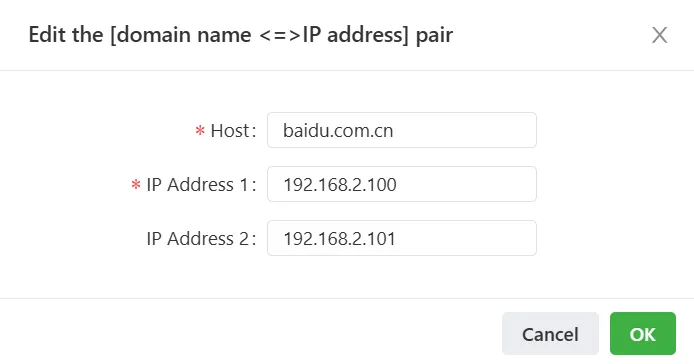</p>

<p align="center"><strong>Figure 4-21 DNS Relay Service Configuration</strong></p>

Note: When the DNS relay service is enabled and the DHCP server is enabled, the DNS relay service cannot be disabled.

##### 4.2.2.3 GNSS

GNSS stands for Global Navigation Satellite System. Common GNSS systems include GPS (Global Positioning System, United States), GLONASS (Russia), and BeiDou Satellite Navigation System (BDS, China).

> **Note**: Not all IG series models support GNSS functionality. For specific support, refer to the official website resource center, enter the corresponding product list, and view the "Ordering Information" section in the product datasheet.

**GNSS Configuration**

<p align="center">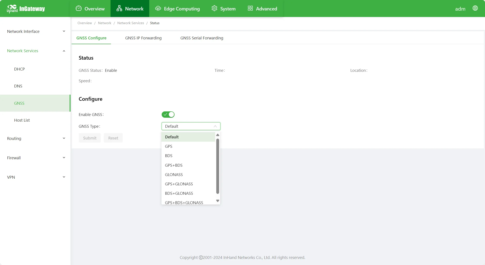</p>

<p align="center"><strong>Figure 4-22 GNSS Configuration</strong></p>

GNSS configuration page parameter descriptions:

- **Enable GNSS**: Enable or disable the GNSS function.
- **GNSS Type**: Select the appropriate satellite navigation system from the drop-down box.
  - GPS: Global Positioning System.
  - BDS: BeiDou Satellite Navigation System (China).
  - GLONASS: GLONASS Satellite Navigation System (Russia).

**GNSS IP Forwarding**

<p align="center">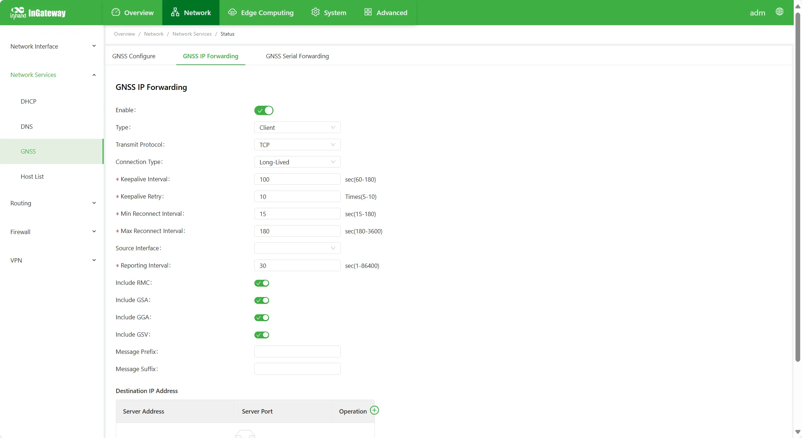</p>

<p align="center"><strong>Figure 4-23 GNSS IP Forwarding Configuration</strong></p>

GNSS IP forwarding parameter descriptions:

- **Enable**: Enable or disable GNSS IP forwarding.
- **Type**: GNSS IP forwarding type.
  - Client
    - **Transmit Protocol**: Two protocols are available: TCP and UDP.
    - **Connection Type**: Two types are available: Long-Lived and Short-Lived. Must be consistent with the server side.
    - **Keepalive Interval**: After the TCP connection is established, the time interval for heartbeat packet exchange between the device and the server to determine whether the connection status is normal.
    - **Keepalive Retry**: After heartbeat timeout, the number of times to continue sending heartbeats. When the set number is reached and the heartbeat is still timed out, the device disconnects the TCP connection.
    - **Min Reconnect Interval**: The connection time interval used when the device establishes a TCP connection, incrementing every 30 seconds until the max reconnect interval.
    - **Max Reconnect Interval**: The maximum reconnect interval time when the device establishes a TCP connection.
    - **Source Interface**: The address of the source interface used by the device as the source address to establish a TCP connection when connecting to the server.
    - **Reporting Interval**: The time interval at which the device reports GNSS information.
    - **Include RMC**: Whether to send RMC data of GNSS data.
    - **Include GSA**: Whether to send GSA data of GNSS data.
    - **Include GGA**: Whether to send GGA data of GNSS data.
    - **Include GSV**: Whether to send GSV data of GNSS data.
    - **Message Prefix**: User-defined header content of the message sent by the device.
    - **Message Suffix**: User-defined ending content of the message sent by the device.
    - **Destination IP Address**: Server IP and server port.

  - Server
    - **Connection Type**: Two types are available: Long-Lived and Short-Lived. Must be consistent with the client.
    - **Keepalive Interval**: After the TCP connection is established, the time interval for heartbeat packet exchange between the device and the client to determine whether the connection status is normal.
    - **Keepalive Retry**: After heartbeat timeout, the number of times to continue sending heartbeats. When the heartbeat timeout count reaches the set keepalive retry count, the device disconnects the TCP connection.
    - **Local Port**: The service port number when the device acts as TCP server.
    - **Reporting Interval**: The time interval at which the device reports GNSS information to the server.
    - **Include RMC**: Whether to send RMC data of GNSS data.
    - **Include GSA**: Whether to send GSA data of GNSS data.
    - **Include GGA**: Whether to send GGA data of GNSS data.
    - **Include GSV**: Whether to send GSV data of GNSS data.
    - **Message Prefix**: User-defined header content of the message sent by the device.
    - **Message Suffix**: User-defined ending content of the message sent by the device.

**GNSS Serial Forwarding**

<p align="center">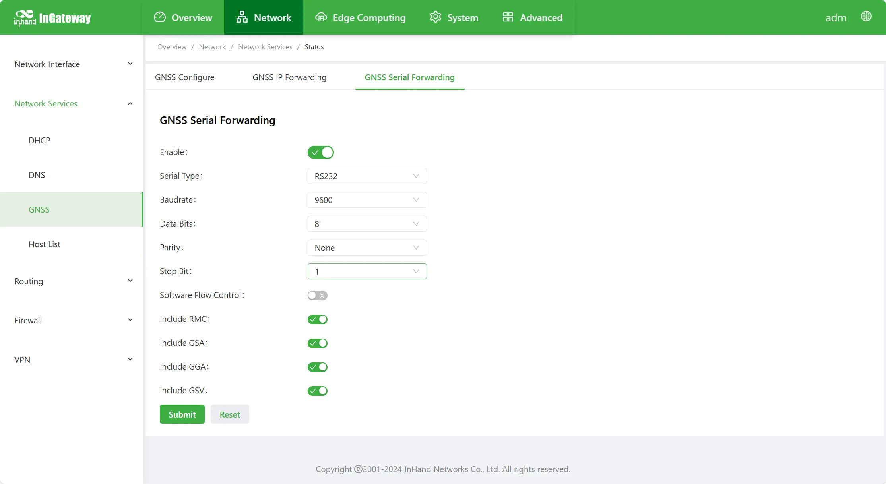</p>

<p align="center"><strong>Figure 4-24 GNSS Serial Forwarding Configuration</strong></p>

GNSS serial forwarding parameter descriptions:

- **Enable**: Enable or disable GNSS serial port forwarding.
- **Serial Port Type**: Consistent with the counterpart (RS-232/RS-485).
- **Baud Rate**: Consistent with the counterpart.
- **Data Bits**: Consistent with the counterpart.
- **Parity**: Consistent with the counterpart.
- **Stop Bit**: Consistent with the counterpart.
- **Software Flow Control**: Enable or disable software flow control.
- **Include RMC**: Whether to send RMC data of GNSS data.
- **Include GSA**: Whether to send GSA data of GNSS data.
- **Include GGA**: Whether to send GGA data of GNSS data.
- **Include GSV**: Whether to send GSV data of GNSS data.

##### 4.2.2.4 Host List

The "Host List" page displays information about hosts connected to the IG.

<p align="center">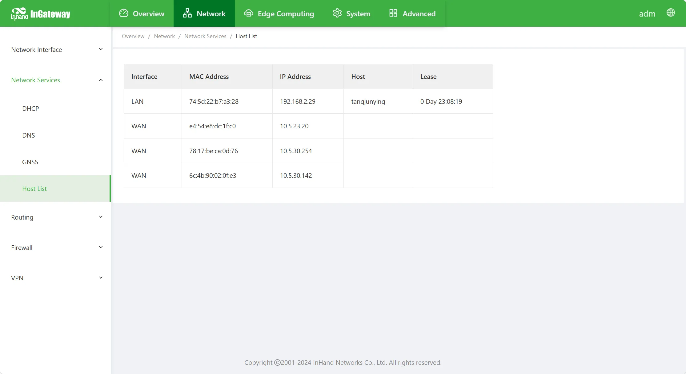</p>

<p align="center"><strong>Figure 4-25 Host List</strong></p>

#### 4.2.3 Routing

##### 4.2.3.1 Routing Status

Select "Network > Routing > Routing Status" to enter the "Routing Status" interface. Detailed route information can be viewed on this page.

<p align="center">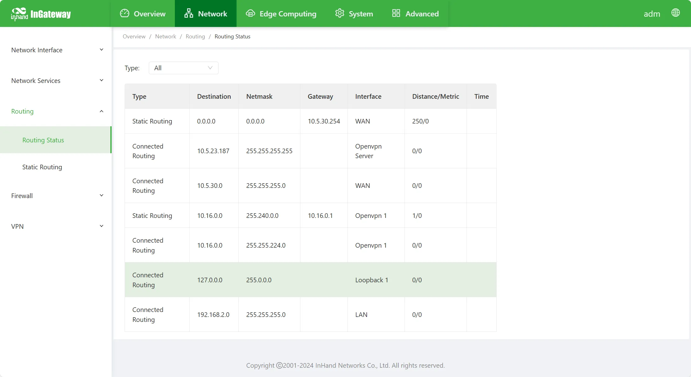</p>

<p align="center"><strong>Figure 4-26 Routing Status</strong></p>

##### 4.2.3.2 Static Routing

On the "Static Routing" page, static routes can be manually configured. After configuration, packets destined for the specified destination will be forwarded along the specified path.

<p align="center">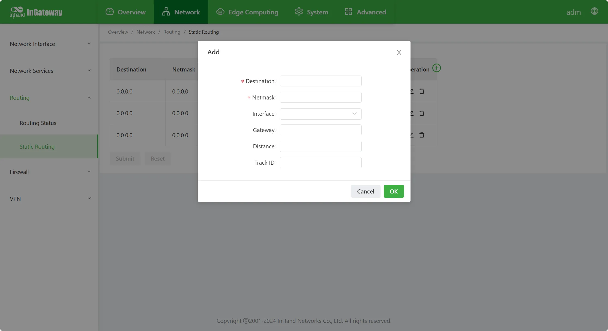</p>

<p align="center"><strong>Figure 4-27 Static Routing Configuration</strong></p>

Static routing parameter descriptions:

- **Destination Network**: The destination IP address or network segment that needs to be reached.
- **Subnet Mask**: The subnet mask of the destination address that needs to be reached.
- **Interface**: The outgoing interface through which data reaches the destination network.
- **Gateway**: The gateway corresponding to the IP of the device's outgoing interface.
- **Distance**: The overhead to the target network; smaller values have higher priority.
- **Track Identification**: The index or ID of the Track.

#### 4.2.4 Firewall

##### 4.2.4.1 Access Control List

An ACL (Access Control List) filters network interface data by configuring a series of matching rules to perform permit or deny operations on specified data streams (such as limited source IP addresses, accounts, etc.), achieving filtering of network interface data.

**Configure Standard Access Control Policy, as shown in the figure below:**

<p align="center">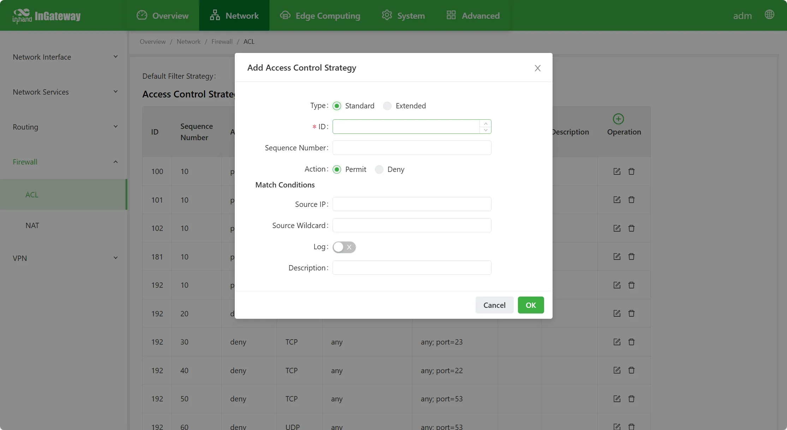</p>

<p align="center"><strong>Figure 4-28 Standard ACL Configuration</strong></p>

Standard access control policy parameter descriptions:

- **ID**: ACL rule ID, range 1–99, used to uniquely identify an access control policy.
- **Sequence Number**: ACL rule serial number; smaller values have higher priority.
- **Action**: Permit or deny packets.
- **Source IP Address**: The source address of packets matched by the ACL rule. Empty means any, i.e., all network segments.
- **Source Wildcard**: The source address wildcard of packets matched by the ACL rule. For example: if the source address network segment is 192.168.2.0, its mask is 255.255.255.0, then its wildcard is 0.0.0.255.
- **Log**: When enabled, the system records logs related to access control.
- **Description**: Used to describe the function of this ACL rule for easy identification.

**Configure Extended Access Control Policy, as shown in the figure below:**

<p align="center">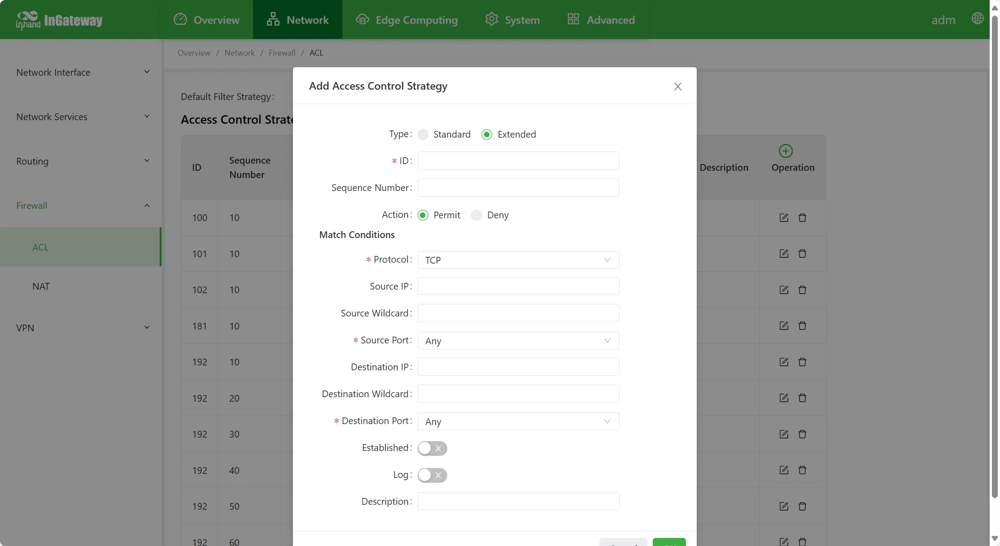</p>

<p align="center"><strong>Figure 4-29 Extended ACL Configuration</strong></p>

Extended access control policy parameter descriptions:

- **ID**: ACL rule ID, range 100–199.
- **Sequence Number**: ACL rule serial number; smaller values have higher priority.
- **Action**: Permit or block packets.
- **Protocol**: Access control protocol.
- **Source IP Address**: The source address of packets matched by the ACL rule. Empty means any, i.e., all networks.
- **Source Wildcard**: The source address wildcard of packets matched by the ACL rule.
- **Source Port**: Source port number; any means any source port of TCP/UDP packets matches. The source port number can only be specified when the protocol is TCP or UDP.
- **Destination IP Address**: The destination address of packets matched by the ACL rule. Empty means any, i.e., all networks.
- **Destination Wildcard**: The destination address wildcard of packets matched by the ACL rule.
- **Destination Port**: Destination port number; any means any destination port of TCP/UDP packets matches. The destination port number can only be specified when the protocol is TCP or UDP.
- **Established Connection**: When enabled, controls packets of established TCP connections; packets of unestablished TCP connections are not controlled. When disabled, controls packets of both established and unestablished TCP connections. This parameter can only be configured when the protocol is TCP.
- **Fragment**: Controls packets that are fragmented when sent out from the interface. (This item is only available when the protocol type is IP.)
- **Log**: When enabled, the system records logs related to access control.
- **Description**: Used to describe the function of this ACL rule for easy identification.

<p align="center">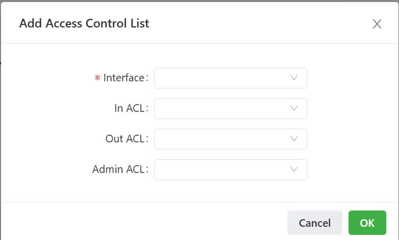</p>

<p align="center"><strong>Figure 4-30 ACL Interface Application</strong></p>

Access Control List parameter descriptions:

- **Interface Name**: The name of the interface that needs the access control policy applied.
- **Inbound Rule**: For packets entering from this interface and then forwarded by the device, select an ACL rule.
- **Outbound Rule**: For packets forwarded by the device and whose exit is this interface, select an ACL rule.
- **Management Rule**: For packets entering from this interface and whose destination address is the device itself, select an ACL control rule. Usually used to restrict access to the local machine.

##### 4.2.4.2 Network Address Translation

Network Address Translation (NAT) enables multiple hosts on a LAN to access the public network through one or more public IP addresses, i.e., using a small number of public IP addresses to represent a larger number of private IP addresses, saving public IP addresses.

<p align="center">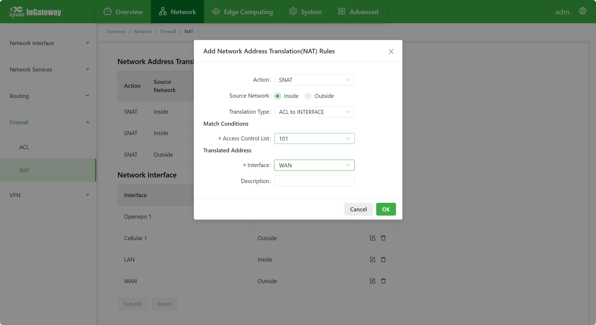</p>

<p align="center"><strong>Figure 4-31 NAT Configuration</strong></p>

Network Address Translation rule parameter descriptions:

- **Action**
  - SNAT: Source Address Translation, converting the source address of the IP packet to another address. Generally used for data sent from inside the gateway to the outside.
  - DNAT: Destination Address Translation, converting the destination address of the IP packet to another address. Generally used for data sent from outside the gateway to the inside.
  - 1:1 NAT: Simultaneously adds one SNAT and one DNAT.
- **Source Network** (supported when action is SNAT or DNAT):
  - Internal: Internal address.
  - External: External address.

<p align="center">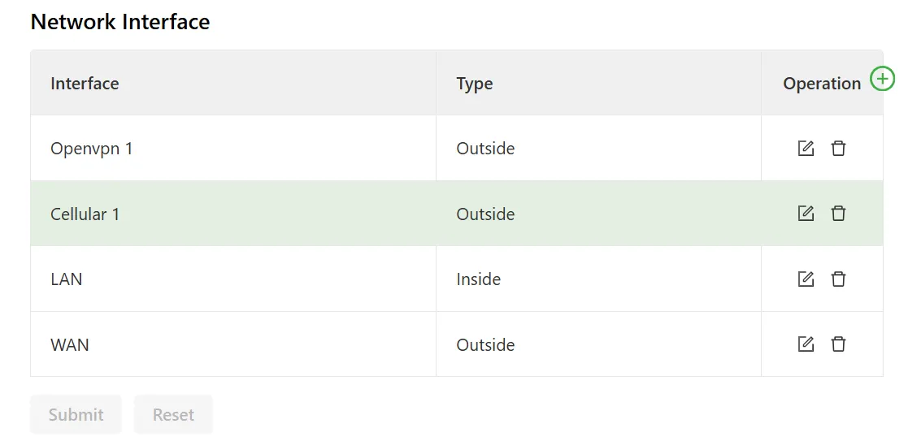</p>

<p align="center"><strong>Figure 4-32 NAT Source Network Configuration</strong></p>

- **Translation Type**
  - IP to IP
  - IP to INTERFACE
  - IP PORT to IP PORT
  - ACL to INTERFACE
  - ACL to IP
- **Match**:
  - **IP Address**: The IP address that needs conversion.
  - **Port**: The port number that needs conversion.
  - **Access Control List**: The access control list that needs conversion; pre-configured in "Access Control List".
- **Translated Address**:
  - **IP Address**: The IP address after conversion.
  - **Interface**: The interface to which data is converted for forwarding.
  - **Log**: When enabled, NAT-related logs are printed in the log. Disabled by default.
  - **Description**: Description of this NAT rule.

#### 4.2.5 VPN

Layer 2 Tunneling Protocol (L2TP) is a type of Virtual Private Dial-up Network (VPDN) tunneling protocol. It extends the application of Point-to-Point Protocol (PPP) and is an important VPN technology for remote dial-up users to access the enterprise headquarters network.

> **Note**: For detailed configuration of IPsec, GRE, and OpenVPN, refer to "Advanced Functions > VPN".

##### 4.2.5.1 L2TP

**L2TP Client**

<p align="center">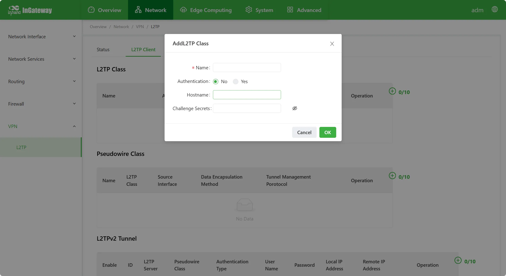</p>

<p align="center"><strong>Figure 4-33 L2TP Class Configuration</strong></p>

- **L2TP Class**
  - **Name**: Custom L2TP Class name.
  - **Authentication**: Select to enable; after enabling, network connection requires authentication of the peer.
  - **Hostname**: The hostname of the local end of the network connection; can be left unconfigured.
  - **Tunnel Authentication Key**: When authentication is selected to be enabled, the tunnel authentication key must be configured; otherwise, it does not need to be configured.

<p align="center">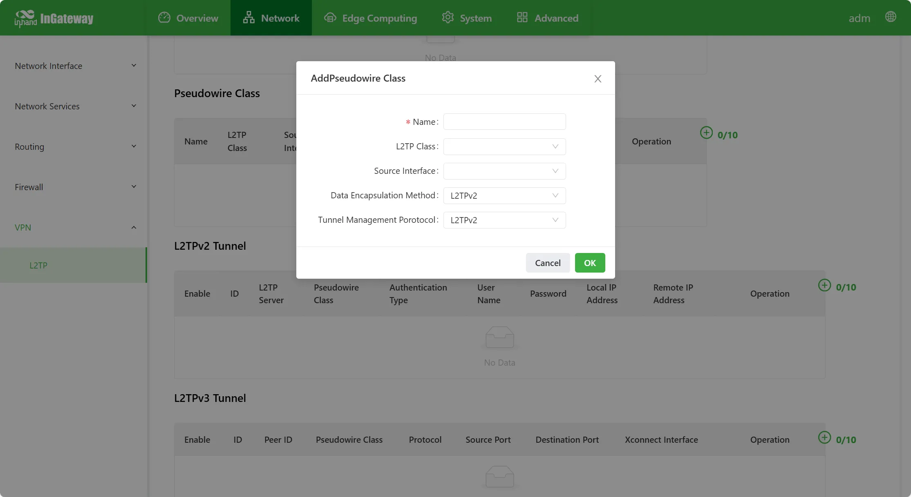</p>

<p align="center"><strong>Figure 4-34 Pseudowire Class Configuration</strong></p>

- **Pseudowire Class**
  - **Name**: Custom Pseudowire Class name.
  - **L2TP Class**: Defined L2TP Class name.
  - **Source Interface**: Select the source interface name.
  - **Data Encapsulation Protocol**: Options include L2TPv2 and L2TPv3.
  - **Tunnel Management Protocol**: Options include L2TPv2, L2TPv3, and NONE.

<p align="center">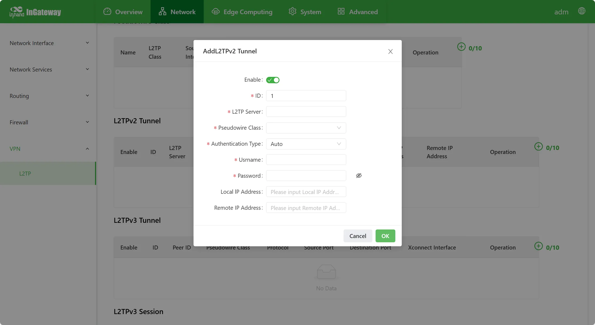</p>

<p align="center"><strong>Figure 4-35 L2TPv2 Tunnel Configuration</strong></p>

- **L2TPv2 Tunnel**
  - **Enable**: Enable or disable the L2TP tunnel.
  - **ID**: L2TP virtual interface identification number.
  - **L2TP Server**: Set the IP address or domain name of the L2TP server.
  - **Pseudowire Class**: Defined Pseudowire Class name.
  - **Auth Method**: Options include Auto, PAP, and CHAP.
  - **Username**: The legitimate username set by the peer server.
  - **Password**: The legitimate password set by the peer server.
  - **Local IP Address**: Set the IP address of the L2TP virtual interface address; can also be left unconfigured to allow the peer server to automatically assign.
  - **Remote IP Address**: The gateway of the server-side L2TP address pool; can also be left unconfigured.

<p align="center">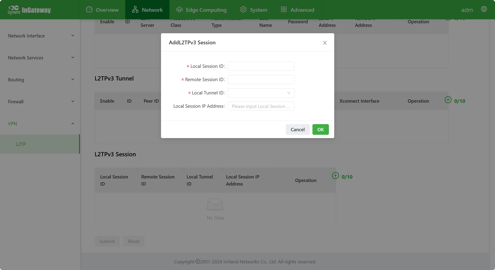</p>

<p align="center"><strong>Figure 4-36 L2TPv3 Tunnel Configuration</strong></p>

- **L2TPv3 Tunnel**
  - **Enable**: Enable or disable the L2TPv3 tunnel.
  - **ID**: L2TPv3 virtual interface identification number.
  - **L2TP Server**: Set the IP address or domain name of the L2TPv3 server.
  - **Pseudowire Class**: Defined Pseudowire Class name.
  - **Encapsulation Protocol**: Options include IP and UDP.
  - **Source Port**: The source port used when establishing L2TP using the UDP protocol.
  - **Destination Port**: The destination port used when establishing L2TP using the UDP protocol.
  - **Xconnect Interface**: L2TPv3 bridge port.

<p align="center">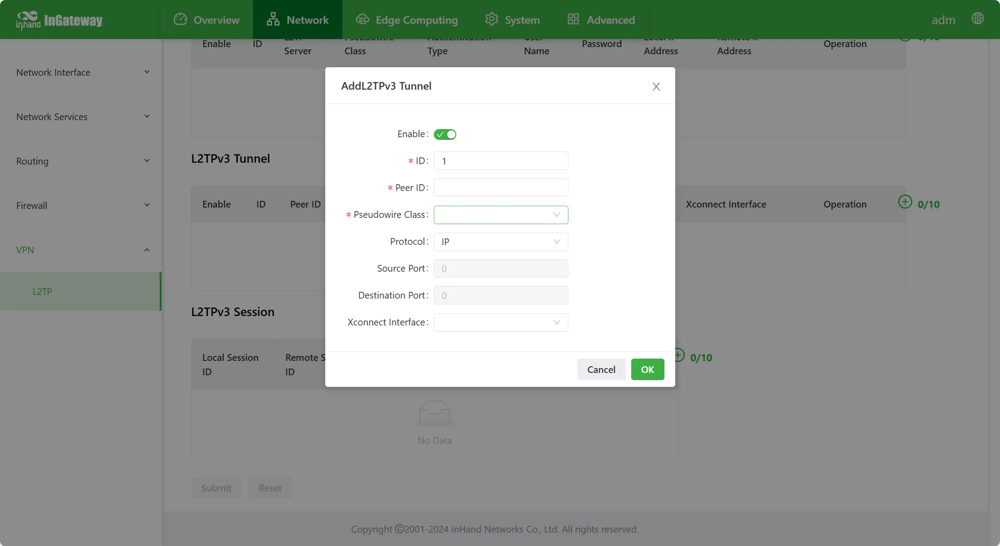</p>

<p align="center"><strong>Figure 4-37 L2TPv3 Session Configuration</strong></p>

- **L2TPv3 Session**
  - **Local Tunnel Session ID**: The local tunnel ID specified when statically configuring L2TPv3; range 1–65535.
  - **Remote Tunnel Session ID**: The remote tunnel ID specified when statically configuring L2TPv3; range 1–65535.
  - **Local Tunnel ID**: The L2TPv3 tunnel ID configured above.
  - **Local Session IP Address**: The address of the statically configured L2TPv3 virtual interface.

**L2TP Server**

<p align="center"></p>

<p align="center"><strong>Figure 4-38 L2TP Server Configuration</strong></p>

L2TP server parameter descriptions:

- **Enable L2TP Server**: Enable or disable the L2TP server.
- **Account**: The access account of the L2TP server.
- **Password**: The access password of the L2TP server.
- **Auth Type**: Options include Auto, PAP, and CHAP.
- **Local IP Address**: The virtual address of the L2TP server interface.
- **Client Starting IP Address**: The starting address of the L2TP server address pool.
- **Client Ending IP Address**: The ending address of the L2TP server address pool.
- **Connection Detection Interval**: After L2TP is established, the time interval for sending connection detection packets. Valid values: 0–32767, unit: seconds.
- **Connection Detection Max Failures**: After L2TP connection detection fails, when the maximum failure count is reached, L2TP re-establishes the connection. Valid values: 0–100.
- **Enable MPPE**: Enable or disable the MPPE data encryption scheme.
- **Enable Tunnel Authentication**
  - **Tunnel Authentication Key**: The tunnel key that needs to be verified when establishing L2TP; both ends must be consistent.
  - **Server Name**: The server name when establishing L2TP.
  - **Client Name**: Specifies the name of the accessing L2TP client.

<p align="center">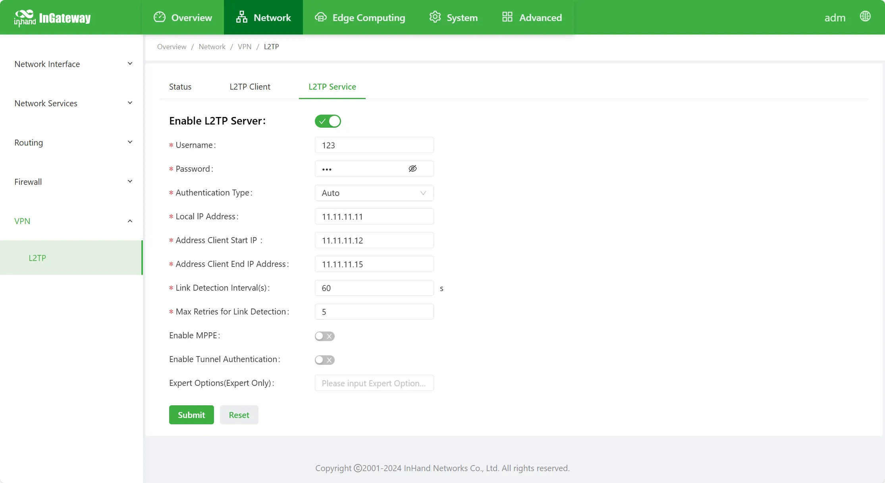</p>

<p align="center"><strong>Figure 4-39 L2TP Server Advanced Options</strong></p>

- **Expert Options** (recommended to leave blank): Parameters used for debugging L2TP.

### 4.3 Edge Computing

#### 4.3.1 Python Edge Computing

The "Python Edge Computing" page displays the IG Python secondary development environment information and the App configuration information and running status on the device. Through this page, customized Python Apps can be developed using the secondary development environment information, and App status can be configured and viewed.

<p align="center">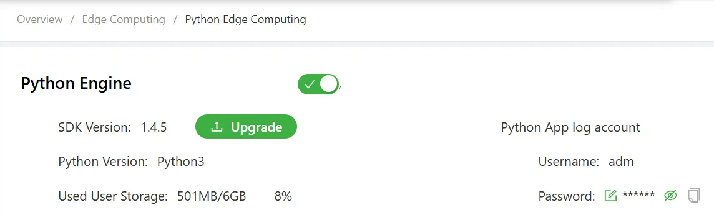</p>

<p align="center"><strong>Figure 4-40 Python Edge Computing</strong></p>

**Python environment configuration steps are as follows:**

1. Select "Edge Computing > Python Edge Computing" to enter the "Python Edge Computing" interface.
2. Enable the Python edge computing engine.
3. Install / upgrade the Python SDK.
4. Enable debug mode.

> **Reference**: For how to perform Python secondary development, refer to [Python Development Quick Start](http://sdk.ig.inhand.com.cn/zh_CN/latest/MobiusPi-Python-QuickStart-CN.html).

**App configuration steps are as follows:**

1. App installation, uninstallation, start, and stop.
2. App configuration import and export.
3. App log viewing.

<p align="center">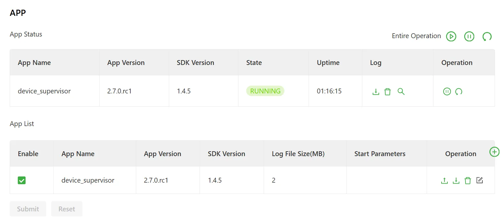</p>

<p align="center"><strong>Figure 4-41 App Configuration Page</strong></p>

<p align="center">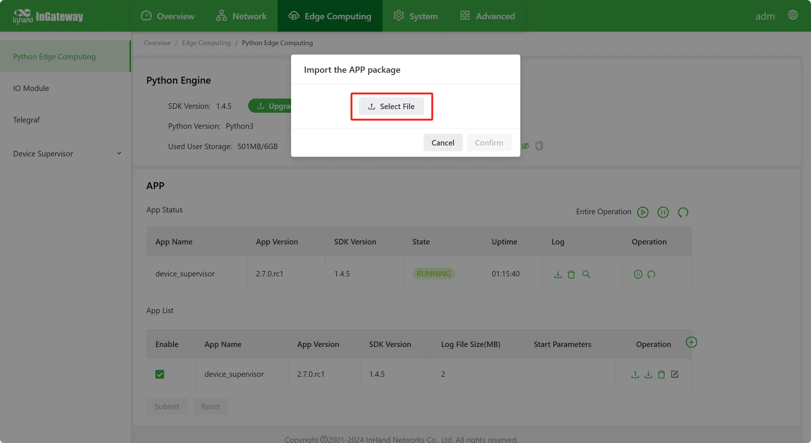</p>

<p align="center"><strong>Figure 4-42 App Configuration Page 2</strong></p>

App configuration function descriptions:

- **App Status**
  - **Start All**: Start all stopped Apps.
  - **Stop All**: Stop all enabled Apps.
  - **Restart All**: Restart all Apps in the list.
  - **Download**: Download the runtime log of the specified App.
  - **Delete**: Clear the runtime log of the specified App.
  - **View**: View the runtime log of the specified App.
  - **Stop**: Stop running the specified App.
  - **Restart**: Restart the specified App.
- **App List**
  - **Enable**: Enable the App; after enabling, the App will automatically run every time the device restarts.
  - **Startup Parameters**: The App's startup parameters can be configured here.
  - **Export Config**: Export the App configuration file.
  - **Import Config**: Import the App configuration file; after importing the configuration file and restarting the App, it will run according to the imported configuration file.
  - **Uninstall**: Uninstall the App.

<p align="center">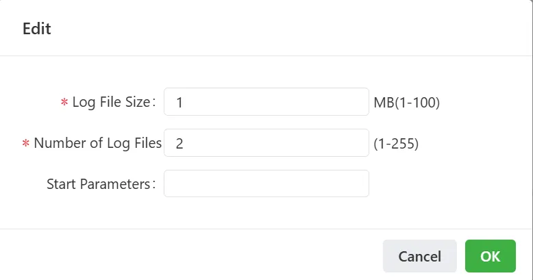</p>

<p align="center"><strong>Figure 4-43 App Log and Parameter Editing</strong></p>

- **Edit**: Edit the App log file size, quantity, and the App's startup parameters.
- **Add**: Add an App.

#### 4.3.2 Docker Management

The IG supports hosting Docker images. Docker images can be published to the IG to quickly deploy and run self-developed applications. Docker environment configuration steps are as follows:

1. Install the Docker SDK.
2. Enable the Docker Manager.
3. Enter the Docker management page (Portainer) to configure images and containers.

> **Note**: Only IG902 and IG974 support the Docker function.

<p align="center">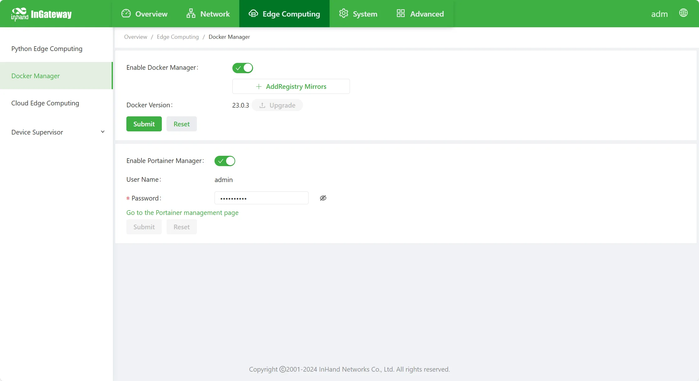</p>

<p align="center"><strong>Figure 4-44 Docker Management Configuration</strong></p>

Docker management page parameter descriptions:

- **Enable Docker Manager**: Enable or disable the Docker Manager.
- **Docker Version**: Install or upgrade the Docker version.
- **Enable Portainer Manager**: Enable or disable the Portainer Manager.
- **Username**: The username used to log in to Portainer.
- **Password**: The password used to log in to Portainer.
- **Image Repository**: Configure the Docker image repository address; up to 4 can be configured.

#### 4.3.3 Public Cloud Edge Computing

The gateway supports Azure IoT Edge and AWS IoT Greengrass edge computing components. They can be configured on the 【Edge Computing】→【Public Cloud Edge Computing】page.

> **Note**: Only IG902 supports the "Public Cloud Edge Computing" function.

**Azure IoT Edge**

<p align="center">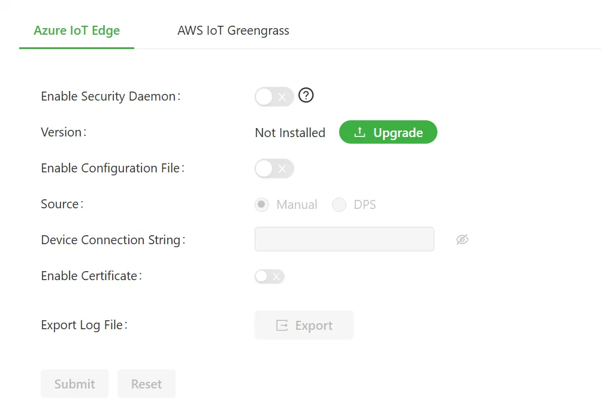</p>

<p align="center"><strong>Figure 4-45 Azure IoT Edge Configuration</strong></p>

Configuration steps:

1. Install / upgrade SDK: Click the upgrade button to install Azure IoT Edge V1.1.3.
2. Configure Azure IoT Edge: Divided into manual configuration and importing configuration files.
   - Manual configuration: When the source is selected as Manual, only one device connection string needs to be configured.
   - DPS: When the source is selected as DPS, the global endpoint, region ID, and method need to be configured, and certificate files need to be imported.
   - If there are terminal nodes under the gateway that need to connect to the gateway, click to enable the certificate and import the relevant certificate files.
3. Import configuration file: After using the enable configuration file button, the configuration file can be edited and imported into the device. If certificates are required in the configuration, certificates need to be imported first. The certificate path can be viewed by hovering the mouse over the "?" after the "Import" button.
4. View logs: On the export log file line, click the export button to export the Azure IoT Edge runtime log.

**AWS IoT Greengrass**

<p align="center">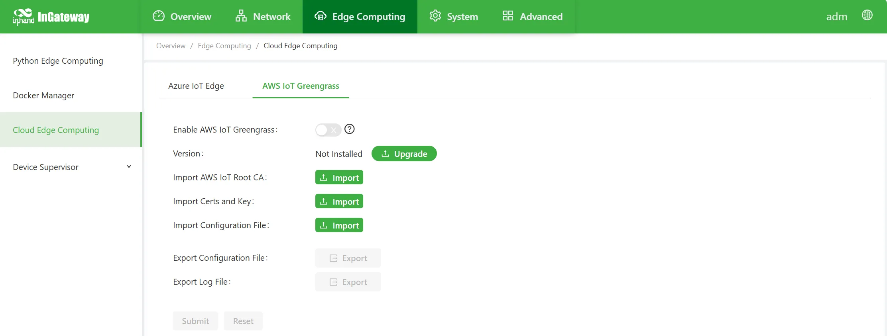</p>

<p align="center"><strong>Figure 4-46 AWS IoT Greengrass Configuration</strong></p>

Configuration steps:

1. Install / upgrade SDK: Click the upgrade button to install AWS IoT Greengrass V1.
2. Supports importing root CA, device certificate, device key, and configuration files, and also supports exporting configuration files and log files.

#### 4.3.4 IO Module

An I/O module (Input/Output Module) is a device or component used to realize input and output functions. It can input signals from external devices into the control system, and can also output signals from the control system to external devices, thereby realizing interaction between the system and the external environment.

Configure IO on the 【Edge Computing】→【IO】page. The gateway supports 4-channel input IO and 4-channel output IO.

> **Note**: Supported models are IG502 / IG504 / IG532 / IG902.

**Input IO:** The 4-channel input IO can be configured as "Digital Input" or "Pulse Count".

<p align="center">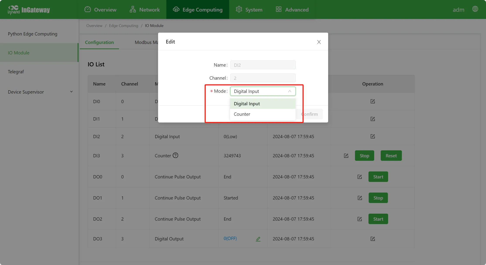</p>

<p align="center"><strong>Figure 4-47 Input IO Configuration</strong></p>

**Output IO:** The 4-channel output IO can be configured as "Digital Output", "Continuous Pulse Output", and "Quantitative Pulse Output".

<p align="center">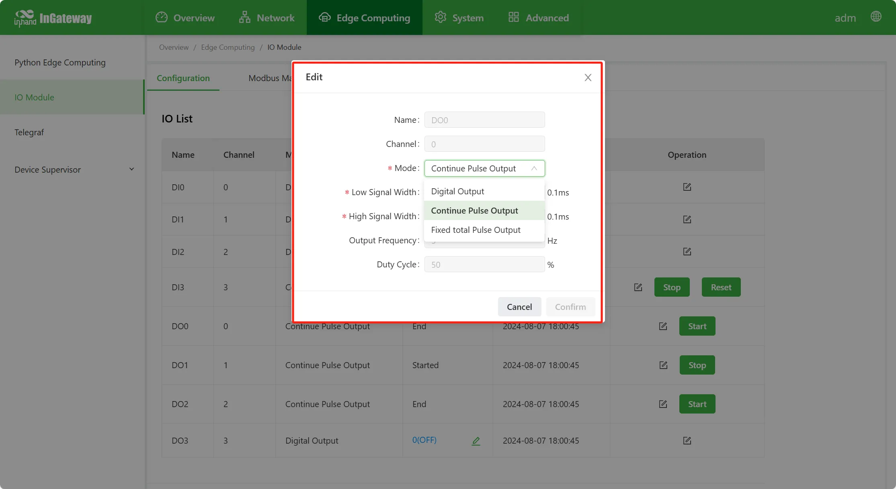</p>

<p align="center"><strong>Figure 4-48 Output IO Configuration</strong></p>

**After enabling the Modbus TCP Slave function, reading and writing IO data via the Modbus TCP protocol is supported.**

<p align="center">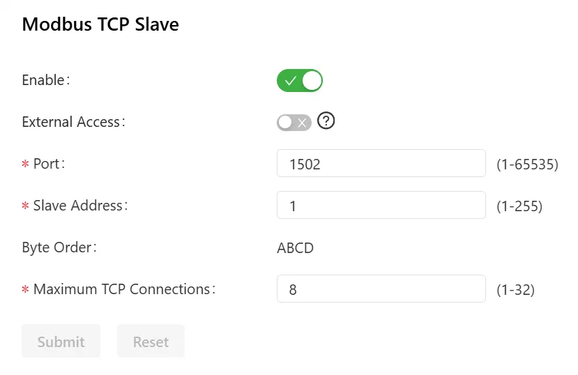</p>

<p align="center"><strong>Figure 4-49 Modbus TCP Slave Configuration</strong></p>

- **Enable**: Enable the Modbus TCP slave function.
- **External Access**: When disabled, only requests from inside the gateway are allowed; when configuring the Modbus slave IP address for internal access, it can only be 127.0.0.1. When enabled, external access is allowed; when configuring for external access, it is set to the corresponding Ethernet interface IP address.
- **Port**: Port information of the slave.
- **Station Address**: The unique identifier of the slave device.
- **Byte Order**: Default is ABCD byte order.
- **Max TCP Connections**: The maximum number of TCP connections; range: 1–32.

**The Modbus mapping table page can display Modbus coil status information and register information.**

<p align="center">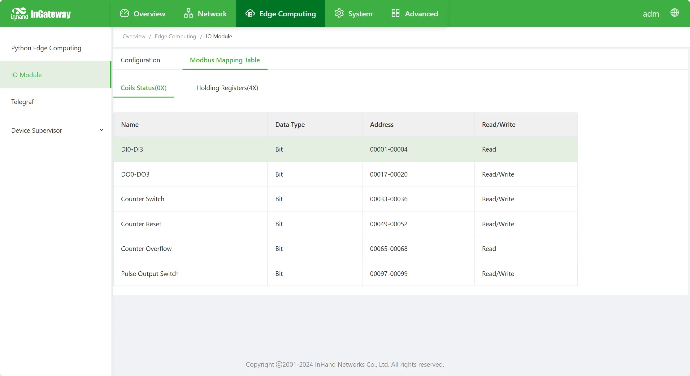</p>

<p align="center"><strong>Figure 4-50 Modbus Mapping Table</strong></p>

#### 4.3.5 Telegraf

Configure the Telegraf function on the 【Edge Computing】→【Telegraf】page. Supports installing the Telegraf SDK, importing and exporting configuration files, and exporting log files.

> **Note**: Only IG502 supports this function.

<p align="center">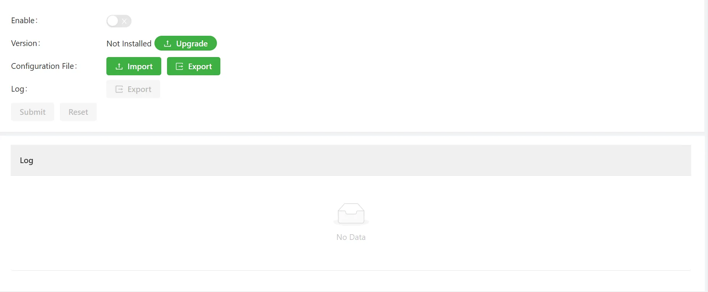</p>

<p align="center"><strong>Figure 4-51 Telegraf Configuration</strong></p>

### 4.4 System Management

#### 4.4.1 System Time

To enable better coordination between the IG and other devices, the system time needs to be accurately configured. Configuration methods and steps are as follows:

**Method 1: Configure system time using time zone**

1. Select "System Management > System Time" to enter the "System Time" interface.
2. In "System Time", select the gateway time zone in "Time Zone".
3. Click "Apply" after selection.

<p align="center">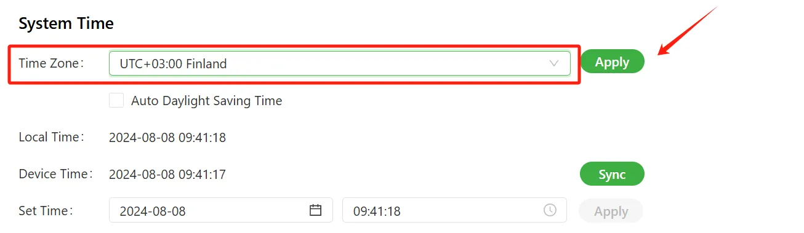</p>

<p align="center"><strong>Figure 4-52 System Time - Time Zone Configuration</strong></p>

**Method 2: Configure system time using PC local time**

1. Select "System Management > System Time" to enter the "System Time" interface.
2. The gateway automatically obtains the PC time as the local time.
3. Click "Synchronize" in Device Time; the device time will synchronize with the local time.

<p align="center">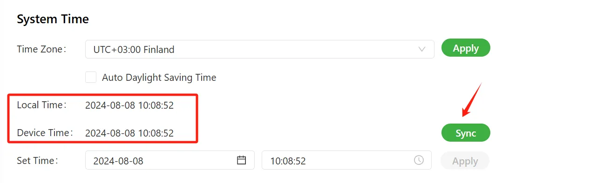</p>

<p align="center"><strong>Figure 4-53 System Time - PC Synchronization</strong></p>

**Method 3: Configure system time using manual setting**

1. Select "System Management > System Time" to enter the "System Time" interface.
2. In "Set Time", manually set the device time directly.
3. Click "Apply" after setting is complete.

<p align="center">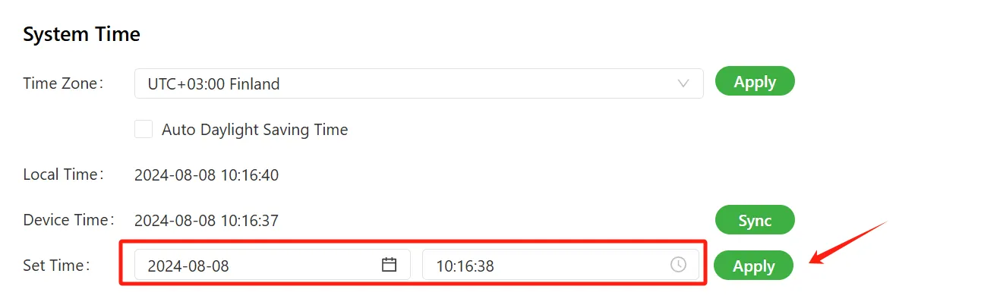</p>

<p align="center"><strong>Figure 4-54 System Time - Manual Setting</strong></p>

**Method 4: Configure system time using SNTP client**

1. Select "System Management > System Time" to enter the "System Time" interface.
2. Check "Enable SNTP Client".
3. Configure each parameter in turn.
4. Click "Submit" to apply the configuration.

<p align="center">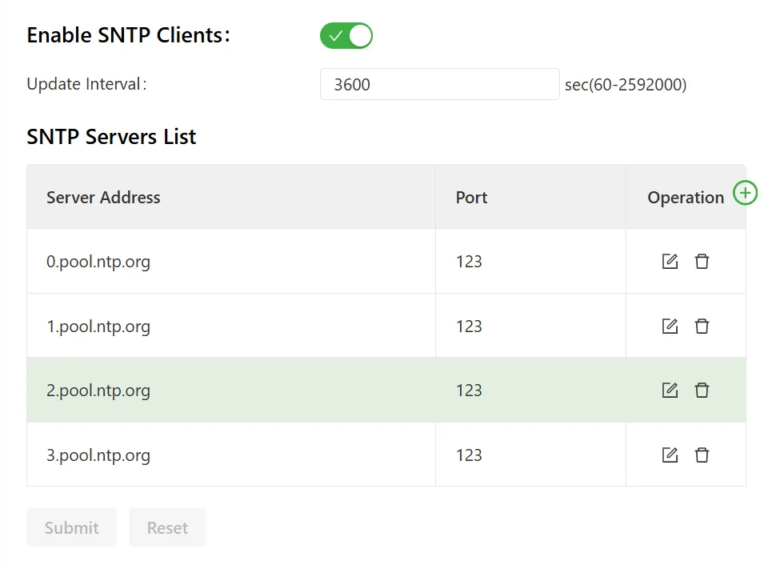</p>

<p align="center"><strong>Figure 4-55 System Time - SNTP Client</strong></p>

SNTP client parameter descriptions:

- **Enable SNTP Client**: Enable or disable the SNTP client.
- **Update Interval**: After enabling the SNTP client, synchronize device time with the server at the update interval.
- **SNTP Server List**
  - **Server Address**: SNTP server address (domain name/IP); up to 10 servers can be filled in. When multiple SNTP servers are set, the system polls all SNTP servers until an available one is found.
  - **Port**: SNTP service port of the SNTP server.

**The IG can also act as an NTP server to synchronize time for other devices. Specific steps are as follows:**

1. Select "System Management > System Time" to enter the "System Time" interface.
2. Check "Enable NTP Server".
3. Configure each parameter in turn.
4. Click "Submit" to apply the configuration.

<p align="center">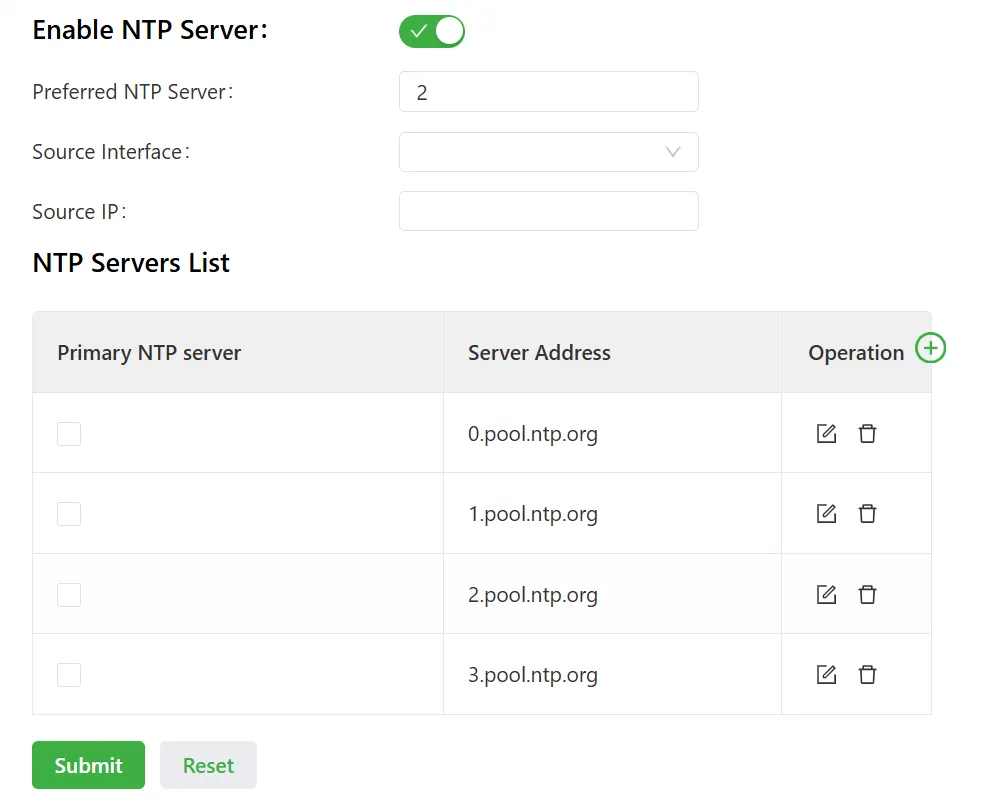</p>

<p align="center"><strong>Figure 4-56 System Time - NTP Server</strong></p>

NTP server parameter descriptions:

- **Enable NTP Server**: Enable or disable the NTP server.
- **NTP Server Stratum**: NTP uses a hierarchical synchronization method; generally, level n+1 synchronizes with level n clock source. NTP supports up to 16 layers of synchronization, i.e., 0–15. More than 16 layers cannot be synchronized.
- **Source Interface**: The interface from which the gateway sends NTP packets. The source interface and source address cannot be used simultaneously.
- **Source Address**: The source address carried in SNTP packets sent by the gateway. The source interface and source address cannot be used simultaneously.
- **NTP Server List**
  - **Primary NTP Server**: Set multiple NTP servers. When the primary NTP server is checked, it indicates that the device synchronizes time with this NTP server. When multiple are checked, all checked NTP servers are polled until an available one is found.
  - **Server Address**: NTP server address (domain name/IP); up to 10 servers can be filled in.

#### 4.4.2 System Log

Select "System Management > System Log" to enter the "System Log" page. This page contains a large amount of information about the network and the IG, including operating status and configuration changes.

<p align="center">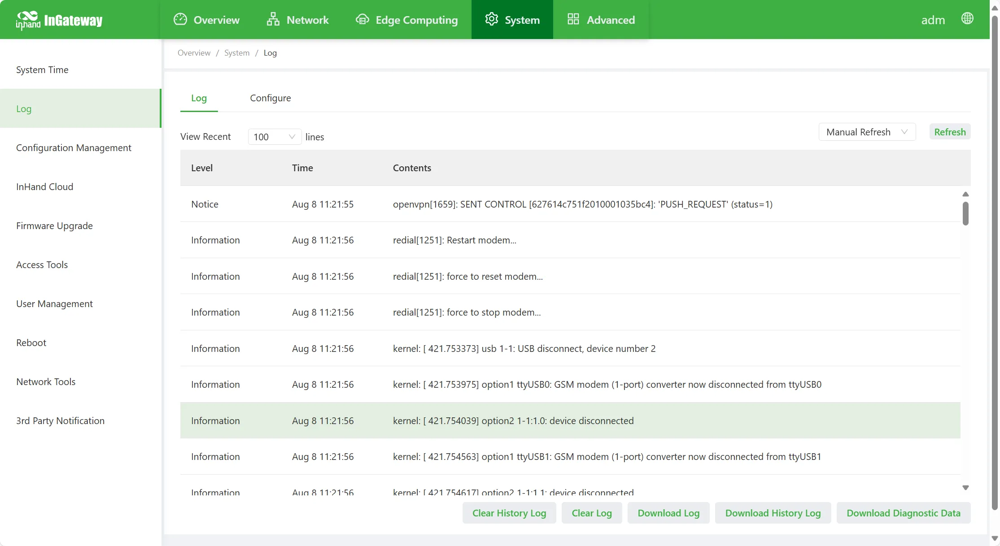</p>

<p align="center"><strong>Figure 4-57 System Log</strong></p>

On the "Configuration" page, the gateway can be configured to connect to a remote log server. After configuration, the gateway will upload all system logs to the remote log server. This requires cooperation with remote log software on the host (such as Kiwi Syslog Daemon).

<p align="center">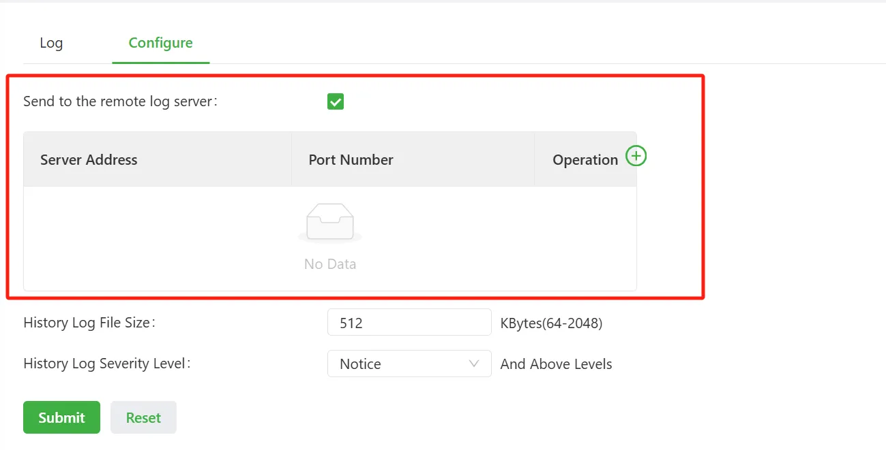</p>

<p align="center"><strong>Figure 4-58 Remote Log Server Configuration</strong></p>

- **Send to Remote Log Server**: Enable or disable the device connecting to a remote log server.
- **Server Address**: Address of the remote log server.
- **Port**: Port number of the remote log server.

When logs are stored locally, the log file size and log output level can be configured:

<p align="center">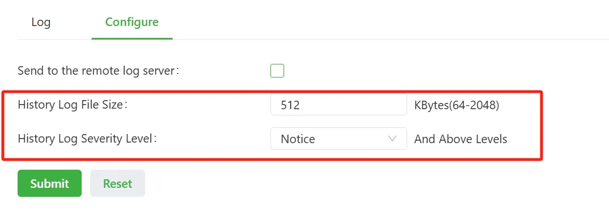</p>

<p align="center"><strong>Figure 4-59 Local Log Configuration</strong></p>

- **Historical Log File Size**: The space allocated on the host for storing logs.
- **Historical Log File Severity Level**: Device logs are sorted according to "Emergency > Alert > Critical > Error > Warning > Notice > Info > Debug". When the log level is set to "Notice" and above, the log file outputs "Notice" and logs with higher priority than "Notice".

#### 4.4.3 Configuration Management

Select "System Management > Configuration Management" to enter the "Configuration Management" interface. On this page, configuration parameters can be backed up; corresponding parameter configurations can be imported; and the IG can be restored to factory settings.

<p align="center">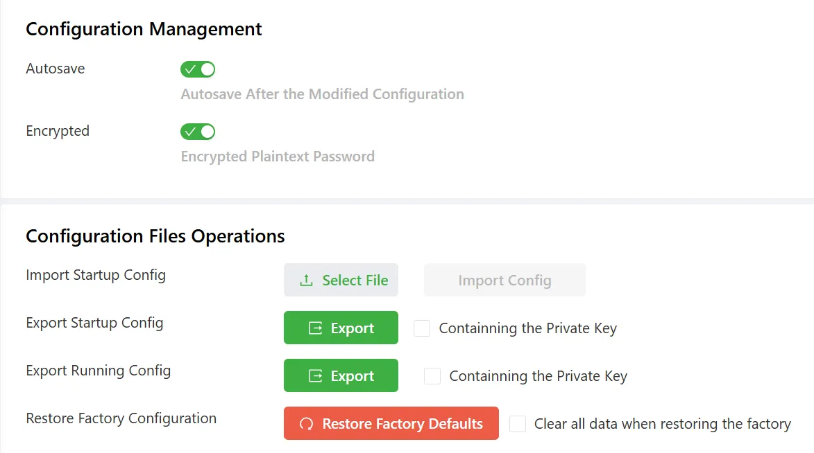</p>

<p align="center"><strong>Figure 4-60 Configuration Management</strong></p>

- **Configuration Management**
  - **Auto Save**: When checked, every configuration modification automatically synchronizes the configuration in running-config to startup-config, ensuring that the configuration is not lost after the device is powered off and restarted.
  - **Encryption**: When enabled, all password parameters configured by the IG on the Web are displayed in encrypted form in the configuration, improving password security.
- **Configuration File Operations**
  - **Import startup-config**: Import the configuration file into startup-config; after restarting, the imported configuration will be loaded. (Note: During this process, ensure the legality and orderliness of the imported configuration. When importing configuration, the IG filters out illegally formatted commands and stores the remaining correct configuration as startup-config. After the system restarts, the legal configuration is executed in order. If the imported configuration content is not arranged in a valid order, the system will not enter the expected configuration state.)
  - **Export startup-config**: Back up startup-config to the host; startup-config is the configuration when the gateway starts up.
  - **Export running-config**: Back up running-config to the host; running-config is the configuration currently running on the gateway.
  - **Restore Factory Settings**: Restore the IG to factory configuration; all gateway configurations are restored to default parameters. After restoring factory settings, the IG needs to be restarted to take effect.

#### 4.4.4 Device Cloud Platform

InHand-developed device cloud platforms support monitoring IG status, remotely maintaining field devices, remotely batch-issuing IG configurations, and batch-upgrading IGs, helping users manage IGs and field devices conveniently and efficiently. Currently, the IG supports connecting to the following InHand cloud platforms: InHand Connect Service, InHand Device Manager, InHand iSCADA Cloud, and InHand Device Live Manager.

**Configure IG connection to InHand Connect Service (InConnect) platform, as shown in the figure below:**

<p align="center">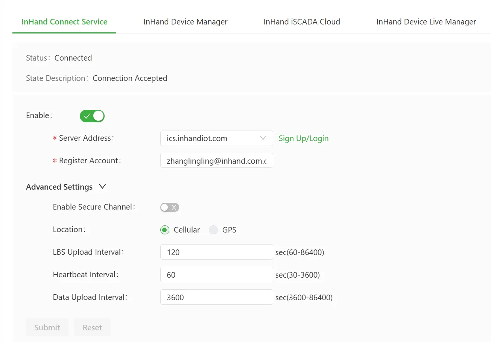</p>

<p align="center"><strong>Figure 4-61 InConnect Platform Configuration</strong></p>

Parameters for connecting to the InHand Connect Service platform:

- **Enable**: Enable or disable the device connecting to the InConnect platform.
- **Server Address**: Select the server address to connect to from the drop-down box, or select "Custom" to customize the server address.
- **Registered Account**: The account name already registered on the cloud platform.
- **Advanced Settings**
  - **Enable Secure Channel**: Enable or disable the secure channel. After this function is enabled, a dedicated, encrypted communication channel will be established to ensure the security, integrity, and confidentiality of data transmission during remote access to the device.
  - **Positioning Source**: Source of positioning information; options include Cellular or GPS.
  - **LBS Reporting Interval**: LBS information reporting time interval; valid values: 60–86400, unit: seconds.
  - **Heartbeat Interval**: Heartbeat interval with the cloud platform; valid values: 30–3600, unit: seconds.
  - **Traffic Reporting Interval**: Traffic information reporting time interval; valid values: 3600–86400, unit: seconds.

**Configure IG connection to InHand Device Manager (DM) platform, as shown in the figure below:**

<p align="center">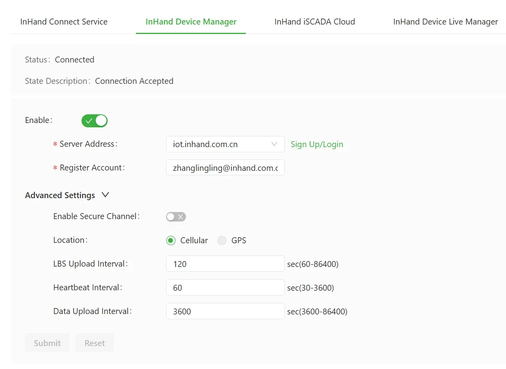</p>

<p align="center"><strong>Figure 4-62 DM Platform Configuration</strong></p>

Parameters for connecting to the InHand Device Manager platform:

- **Enable**: Enable or disable the device connecting to the DM platform.
- **Server Address**: Select the server address to connect to from the drop-down box, or select "Custom" to customize the server address.
- **Registered Account**: The account name already registered on the cloud platform.
- **Advanced Settings**
  - **Enable Secure Channel**: Enable or disable the secure channel. After this function is enabled, a dedicated, encrypted communication channel will be established to ensure the security, integrity, and confidentiality of data transmission during remote access to the device.
  - **Positioning Source**: Source of positioning information; options include Cellular or GPS.
  - **LBS Reporting Interval**: LBS information reporting time interval; valid values: 60–86400, unit: seconds.
  - **Heartbeat Interval**: Heartbeat interval with the cloud platform; valid values: 30–3600, unit: seconds.
  - **Traffic Reporting Interval**: Traffic information reporting time interval; valid values: 3600–86400, unit: seconds.

**Configure IG connection to InHand iSCADA Cloud platform, as shown in the figure below:**

<p align="center">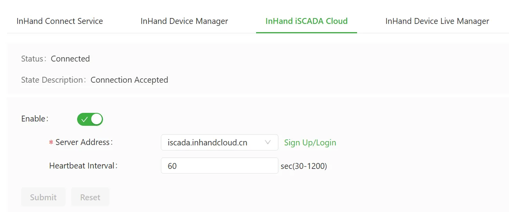</p>

<p align="center"><strong>Figure 4-63 iSCADA Cloud Platform Configuration</strong></p>

Parameters for connecting to the InHand iSCADA Cloud platform:

- **Enable**: Enable or disable the device connecting to the platform.
- **Server Address**: Select the server address to connect to from the drop-down box, or select "Custom" to customize the server address.
- **Heartbeat Interval**: Heartbeat interval with the cloud platform; valid values: 30–1200, unit: seconds.

**Configure IG connection to InHand Device Live Manager (DeviceLive) platform, as shown in the figure below:**

<p align="center">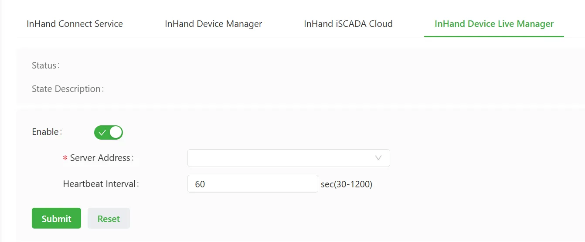</p>

<p align="center"><strong>Figure 4-64 DeviceLive Platform Configuration</strong></p>

Parameters for connecting to the InHand Device Live Manager platform:

- **Enable**: Enable or disable the device connecting to the platform.
- **Server Address**: Select the server address to connect to from the drop-down box.
- **Heartbeat Interval**: Heartbeat interval with the cloud platform; valid values: 30–1200, unit: seconds.

#### 4.4.5 Firmware Upgrade

The IG firmware version can be upgraded on the "Firmware Upgrade" page to support new functions or obtain a better experience. Firmware version upgrade steps are as follows:

1. Select "System Management > Firmware Upgrade" to enter the "Firmware Upgrade" interface.
2. Click "Select File" to select the IG firmware file.
3. Click "Start Upgrade" and "Confirm" to start the upgrade.
4. Wait for the upgrade to succeed. After the upgrade is successful, click the "Restart" button to restart the IG to complete the upgrade.

<p align="center">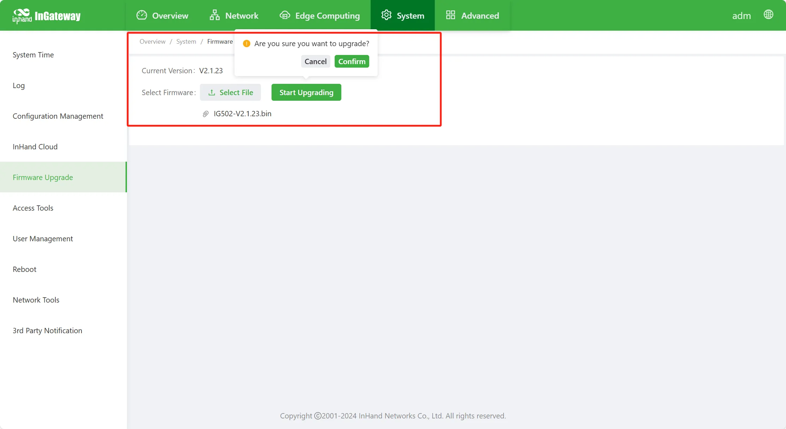</p>

<p align="center"><strong>Figure 4-65 Firmware Upgrade</strong></p>

<p align="center">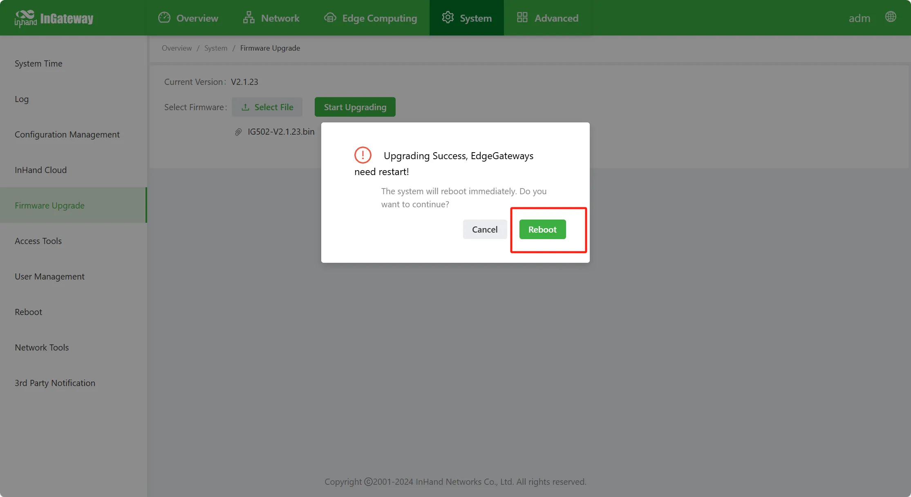</p>

<p align="center"><strong>Figure 4-66 Firmware Upgrade Successful</strong></p>

#### 4.4.6 Management Tools

To facilitate management and configuration of the IG, the management and access methods of the IG can be configured on the "Management Tools" page.

**Configure HTTPS**

<p align="center">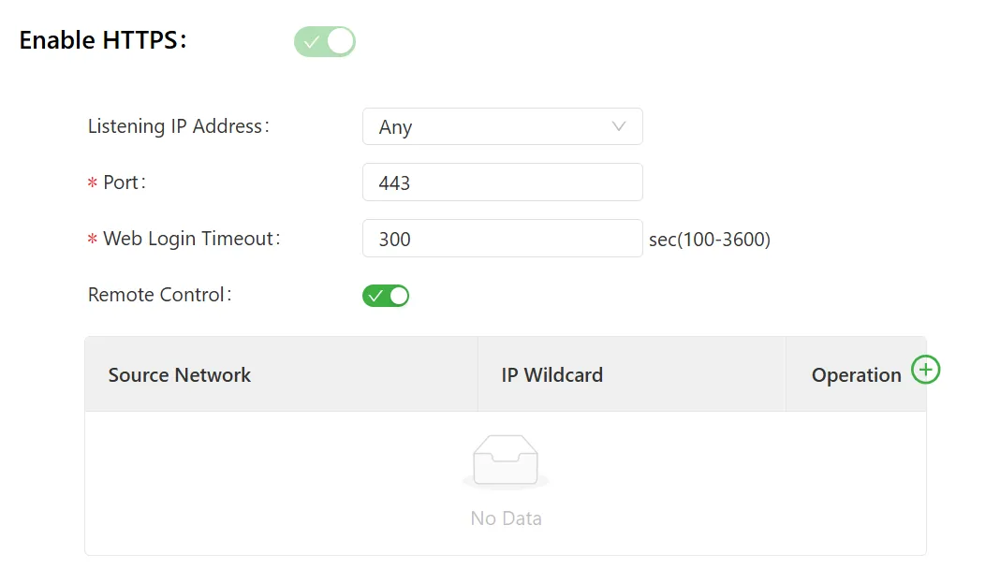</p>

<p align="center"><strong>Figure 4-67 HTTPS Configuration</strong></p>

HTTPS parameter descriptions:

1. **Listen Address**: Options include Any, 127.0.0.1, and other IP addresses. The default selection is Any, i.e., the device listens for HTTPS requests on any address.
2. **Port**: HTTPS access port number; the default is port 443.
3. **Web Login Timeout**: The timeout time for logging in to the Web page; the default is 300 s. When the Web idle time exceeds 300 s, the Web login will exit. The Web login timeout can also be manually changed; valid values: 100–3600, unit: seconds.
4. **Remote Control**: When enabled, the IG can be remotely accessed via HTTPS.
5. **Source Network**: The legitimate source address for accessing the device Web page. If not set, it means any address can connect to the IG via HTTPS.

**Configure TELNET**

<p align="center">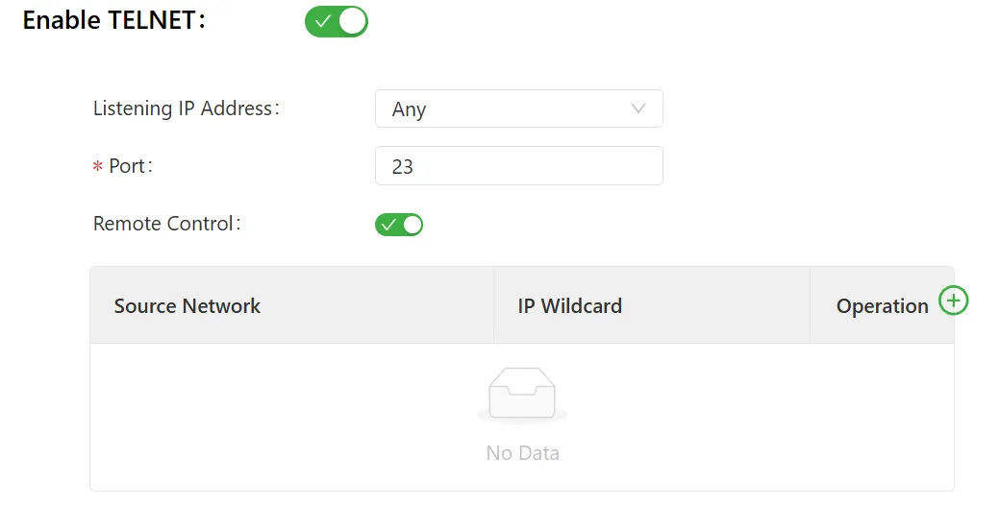</p>

<p align="center"><strong>Figure 4-68 TELNET Configuration</strong></p>

TELNET parameter descriptions:

1. **Listen Address**: Options include Any, 127.0.0.1, and other IP addresses. The default selection is Any, i.e., the device listens for TELNET requests on any address.
2. **Port**: TELNET access port number; the default is port 23.
3. **Remote Control**: When enabled, the IG can be remotely accessed via TELNET.
4. **Source Network**: The legitimate source address for accessing the device. If not set, it means any address can connect to the IG via TELNET.

**Configure SSH**

<p align="center">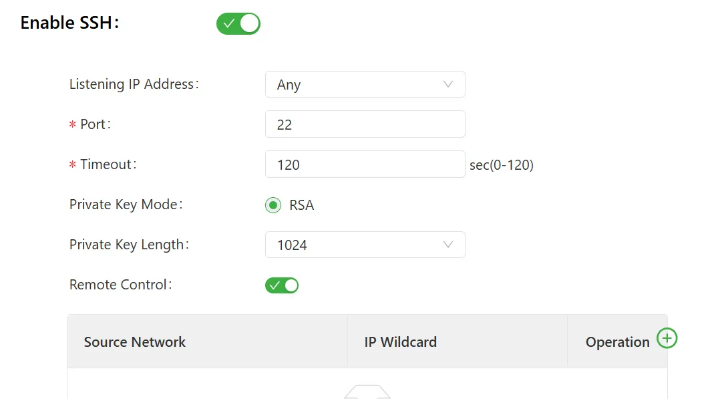</p>

<p align="center"><strong>Figure 4-69 SSH Configuration</strong></p>

SSH parameter descriptions:

1. **Listen Address**: Options include Any, 127.0.0.1, and other IP addresses. The default selection is Any, i.e., the device listens for SSH requests on any address.
2. **Port**: SSH access port number; the default is port 22.
3. **Timeout**: SSH timeout; valid values: 0–120. If SSH is not successfully connected within the timeout, the connection is considered failed.
4. **Key Mode**: SSH connections usually use asymmetric encryption algorithms to achieve secure communication, involving public and private keys. The common key mode is RSA mode.
5. **Key Length**: The RSA algorithm key length can be selected according to requirements. Generally, the longer the key length, the higher the security, but the computational resources required to generate and process the key will also increase. Options: 512/1024/2048/4096; default length is 1024.
6. **Remote Control**: When enabled, the IG can be remotely accessed via SSH.
7. **Source Network**: The legitimate source address for accessing the device. If not set, it means any address can connect to the IG via SSH.

**Configure Developer Mode**

<p align="center">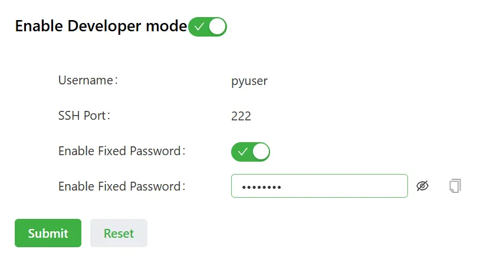</p>

<p align="center"><strong>Figure 4-70 Developer Mode Configuration</strong></p>

Developer mode parameter descriptions:

1. **Username**: The username for developer mode login; fixed as `pyuser`.
2. **SSH Port**: The port number for developer mode login; default is 222.
3. **Enable Fixed Password**: When enabled, a fixed password can be manually set to log in to the device; otherwise, the password is a randomly generated password by the device.

#### 4.4.7 User Management

A new user can be added or user account passwords and access permissions can be managed on the "User Management" page, achieving multi-user access and management of the IG.

#### 4.4.8 Reboot

On the "Reboot" page, the device can be set to reboot daily at a scheduled time or reboot immediately. When "Daily Scheduled Reboot" is enabled, the device will reboot at "00:00" every day. This function is disabled by default.

<p align="center">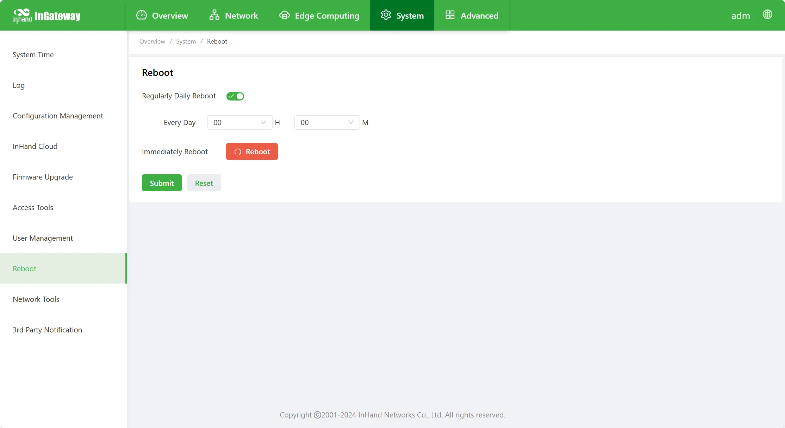</p>

<p align="center"><strong>Figure 4-71 Reboot Configuration</strong></p>

#### 4.4.9 Tools

Select "System Management > Tools" to enter the "Tools" page. On this page, IG network problems can be diagnosed. Expert options can input some extended options, e.g., in the Ping tool, the expert option `-s 100` means sending 100-byte packets.

Use the Ping tool to detect whether the network is reachable, as shown in the figure below:

<p align="center">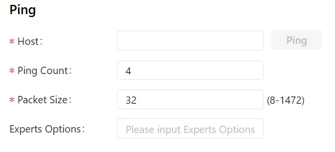</p>

<p align="center"><strong>Figure 4-72 Ping Tool</strong></p>

Use the route trace tool to determine the path taken by IP datagrams to access the target, as shown in the figure below:

<p align="center">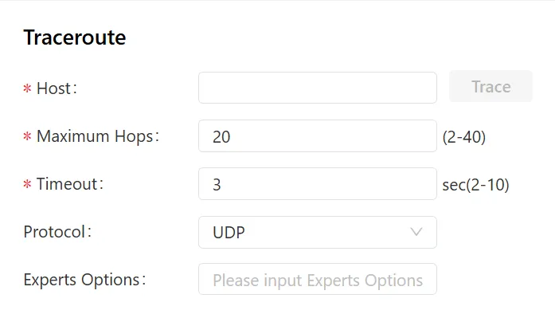</p>

<p align="center"><strong>Figure 4-73 Route Trace Tool</strong></p>

Use the network packet capture tool to capture data transmitted on the specified interface, as shown in the figure below:

<p align="center">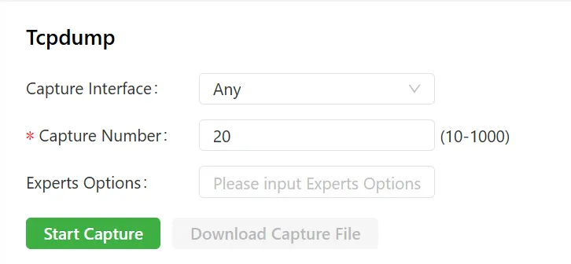</p>

<p align="center"><strong>Figure 4-74 Network Packet Capture Tool</strong></p>

#### 4.4.10 Third-Party Software Declaration

Select "System Management > Third-Party Software Declaration" to enter the third-party software declaration page. On this page, the IG software's third-party software declarations can be viewed.

<p align="center">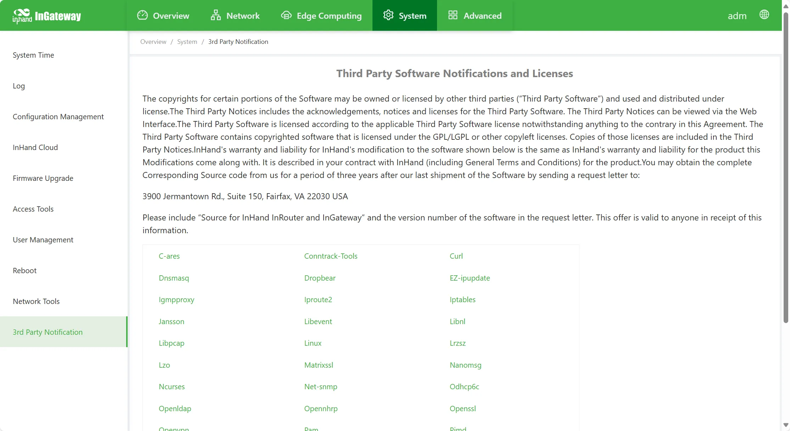</p>

<p align="center"><strong>Figure 4-75 Third-Party Software Declaration</strong></p>

### 4.5 Navigation Bar Operations

#### 4.5.1 Return to Home

On any Web interface of the gateway, click the InHand InGateway logo in the upper left corner to quickly jump to the "Overview" page.

<p align="center"></p>

<p align="center"><strong>Figure 4-76 Return to Home</strong></p>

#### 4.5.2 Logout

Click the username in the upper right corner to log out.

<p align="center"></p>

<p align="center"><strong>Figure 4-77 Logout</strong></p>

#### 4.5.3 Switch Language

Click "Language" in the upper right corner to switch the Web interface language display. The gateway supports Simplified Chinese and English.

<p align="center">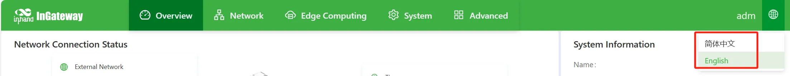</p>

<p align="center"><strong>Figure 4-78 Switch Language</strong></p>

### 4.6 Advanced Functions

#### 4.6.1 Management

##### 4.6.1.1 System

Here, system status and network status can be viewed. In the system status section, the device name, model, serial number, MAC address, version information, device time, device uptime, performance, and storage information can be viewed. The "Sync Time" button can also be clicked to set the system time. In the network status section, click "Set Up" after an interface to enter the corresponding interface configuration page.

<p align="center">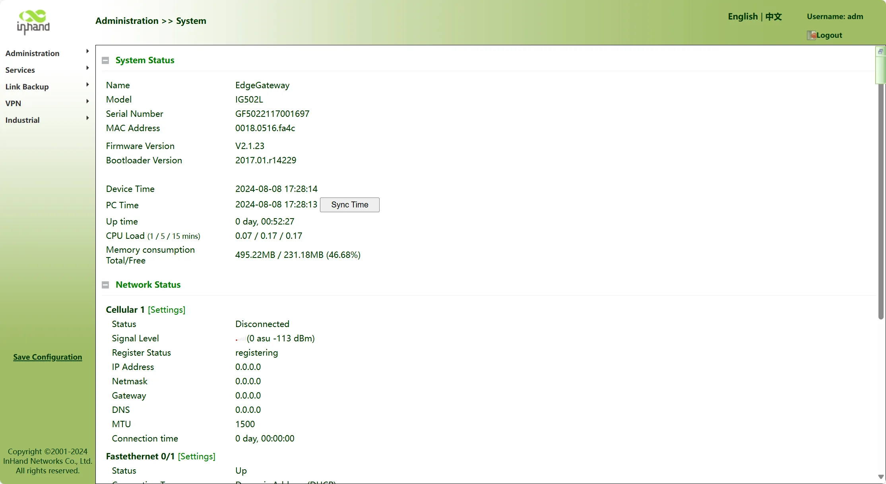</p>

<p align="center"><strong>Figure 4-79 System Status</strong></p>

##### 4.6.1.2 AAA

**Radius**

The RADIUS protocol adopts a client/server (C/S) working mode. The RADIUS protocol entity consists of three parts: user end, RADIUS client (NAS), and RADIUS server. The authentication process is shown in the figure below:

<p align="center">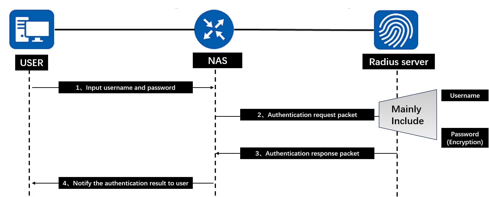</p>

<p align="center"><strong>Figure 4-80 RADIUS Authentication Process</strong></p>

Authentication steps:

1. When a user accesses the network, the user initiates a connection request and sends the username and password to the RADIUS client.
2. The RADIUS client sends an authentication request packet containing the username and password information to the RADIUS server. (The NAS and RADIUS server use a pre-shared key method; the user password is encrypted and hidden using this shared key through the MD5 encryption algorithm, increasing password security.)
3. The RADIUS server checks the legitimacy of the user identity:
   - If the user identity is legitimate, the RADIUS server returns an authentication accept packet to the RADIUS client, allowing the user to proceed to the next action. Since the RADIUS protocol merges the authentication and authorization processes, the authentication accept packet also contains the user's authorization information.
   - If the user identity is not legitimate, the RADIUS server returns an authentication reject packet to the RADIUS client, rejecting the user's access to the network.
4. The RADIUS client notifies the user whether the authentication was successful.

**RADIUS authentication configuration is shown in the figure below:**

<p align="center">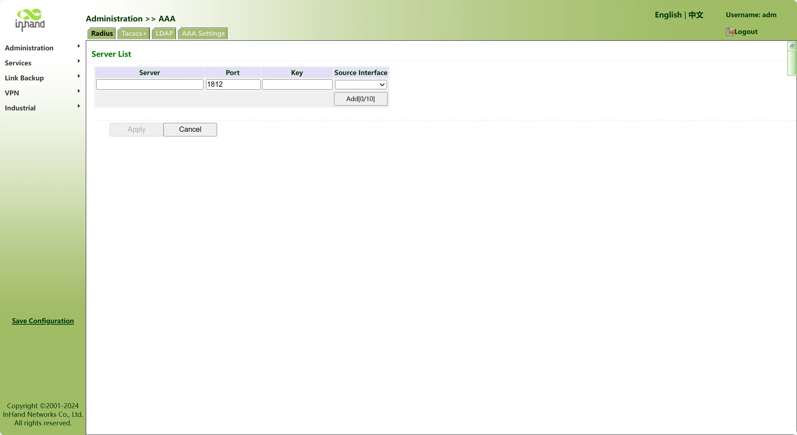</p>

<p align="center"><strong>Figure 4-81 RADIUS Authentication Configuration</strong></p>

RADIUS parameter descriptions:

- **RADIUS Server**: RADIUS server address (domain name/IP); up to 10 entries are supported.
- **Port**: RADIUS server service port number.
- **Authentication Key**: The authentication key required to establish a connection with the RADIUS server. Only when the authentication keys are consistent can a connection be established with the RADIUS server.
- **Source Interface**: RADIUS source interface.

**Tacacs+**

Tacacs+ (Terminal Access Controller Access Control System) is a security protocol with enhanced functions based on the Tacacs protocol. This protocol has similar functions to the RADIUS protocol and uses a client/server mode to achieve communication between the NAS and the TACACS+ server. TACACS+ supports independent Authentication, Authorization, and Accounting (AAA) functions. The authentication process is shown in the figure below:

<p align="center">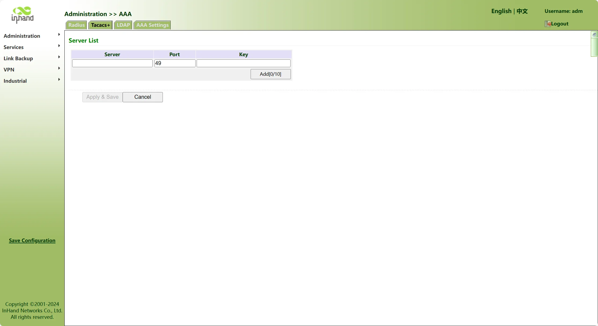</p>

<p align="center"><strong>Figure 4-82 Tacacs+ Authentication Process</strong></p>

Tacacs+ parameter descriptions:

- **Tacacs+ Server**: Tacacs+ server address (domain name/IP); up to 10 entries are supported.
- **Port**: Tacacs+ server service port number.
- **Authentication Key**: The authentication key required to establish a connection with the Tacacs+ server. Only when the authentication keys are consistent can a connection be established with the Tacacs+ server.

**LDAP**

The Lightweight Directory Access Protocol (LDAP) is a directory access protocol based on TCP/IP. It is mainly used to store infrequently changed data, such as email addresses and contact lists. LDAP defines multiple operations; through binding and query operations, user authentication and authorization functions can be achieved. LDAP is based on a Client/Server structure; directory information is stored on the server, and billing is not supported. The LDAP authentication process is shown in the figure below:

<p align="center">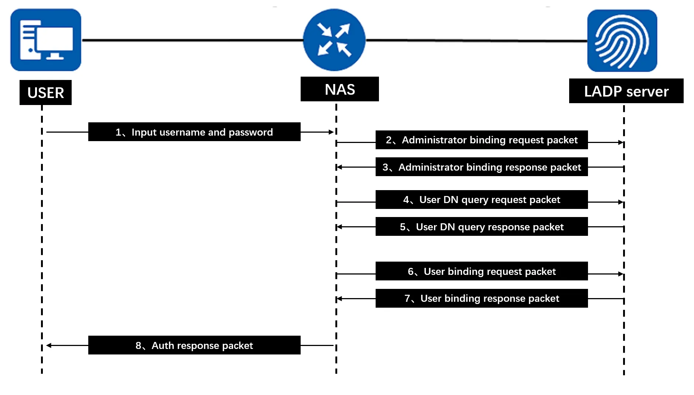</p>

<p align="center"><strong>Figure 4-83 LDAP Authentication Process</strong></p>

LDAP authentication description:

1. When a user needs to access the LDAP server, the user inputs the username and password and sends an authentication request to the device.
2. The device obtains the user's username and password, and sends an administrator bind request packet to the LDAP server using the administrator DN and administrator password as parameters to obtain query permissions.
3. After receiving the administrator bind request packet, the LDAP server verifies whether the administrator DN and administrator password are correct. If the administrator DN and administrator password are correct, the bind is successful, and the LDAP server sends an administrator bind response packet to the device.
4. After receiving the bind response packet, the device uses the username input by the user as a parameter to construct a filter condition, and sends a user DN query request packet to the LDAP server. For example: the constructed filter condition is CN=User2.
5. After receiving the user DN query request packet, the LDAP server searches for the user DN according to the query base, query scope, and filter condition in the packet. If the query is successful, it sends a query success response packet to the device. The queried user DN can be one or more.
6. The device uses the queried user DN and the password input by the user as parameters to send a user bind request packet to the LDAP server.
7. After receiving the user bind request packet, the LDAP server checks whether the password input by the user is correct.
   - If the password input by the user is correct, it sends a bind success response packet to the device.
   - If the password input by the user is incorrect, it sends a bind failure response packet to the device. The device uses the next queried user DN as a parameter to continue sending bind requests to the LDAP server until one DN binds successfully. If all user DNs fail to bind, the device notifies the user that authentication failed.
8. After successful authentication, the device notifies the user that login is successful.

**LDAP authentication configuration is shown in the figure below:**

<p align="center">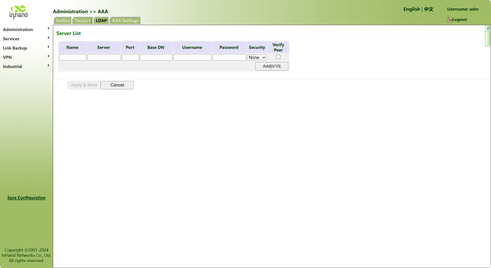</p>

<p align="center"><strong>Figure 4-84 LDAP Authentication Configuration</strong></p>

LDAP parameter descriptions:

- **Name**: User-defined server list name.
- **LDAP Server**: Server address (domain name/IP); up to 10 entries are supported.
- **Port**: Consistent with the server port.
- **Base DN**: The top of the LDAP directory tree.
- **Username**: The username for accessing the server.
- **Password**: The password for accessing the server.
- **Security**: Three encryption options: None, SSL, and StartTLS.
- **Verify Peer**: Select to enable.

**AAA Authentication**

<p align="center">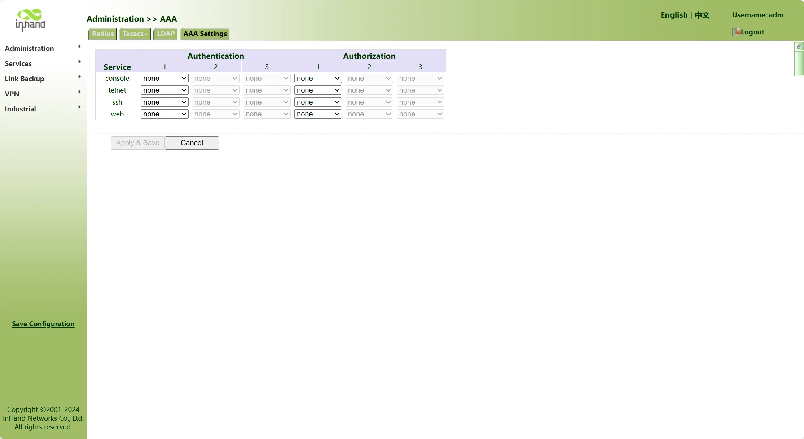</p>

<p align="center"><strong>Figure 4-85 AAA Authentication Configuration</strong></p>

**The following authentication methods are supported:**

- **None**: Very trusting of users, no legality check is performed. Generally, this method is not adopted.
- **Local**: User information is configured on the network access server. The advantage of local authentication is fast speed and reduced operating costs for operators. The disadvantage is that the amount of stored information is limited by device hardware conditions.
- **Remote (LDAP)**: User information is configured on the authentication server. Supports remote authentication via the Radius protocol, Tacacs+ protocol, and LDAP.

**The following authorization methods are supported:**

- **None**: No authorization processing is performed on users.
- **Local**: Authorization is performed according to the relevant attributes configured for the local user account on the network access server.
- **Tacacs+ Authorization**: Authorization is performed by the Tacacs+ server on users.
- **Radius Authorization After Authentication**: Authentication and authorization are bound together; Radius cannot be used alone for authorization.
- **LDAP Authorization**

Note: Authentication 1 and Authorization 1 must be set consistently; Authentication 2 and Authorization 2 must be set consistently; Authentication 3 and Authorization 3 must be set consistently.

#### 4.6.2 Services

##### 4.6.2.1 Dynamic Domain Name

Dynamic domain name is a service that binds dynamically assigned IP addresses with fixed domain names. In networks, in many cases, the IP address obtained by users when accessing the Internet is dynamically changing. If specific network services or devices need to be accessed via domain names, dynamic domain name services need to be used.

<p align="center">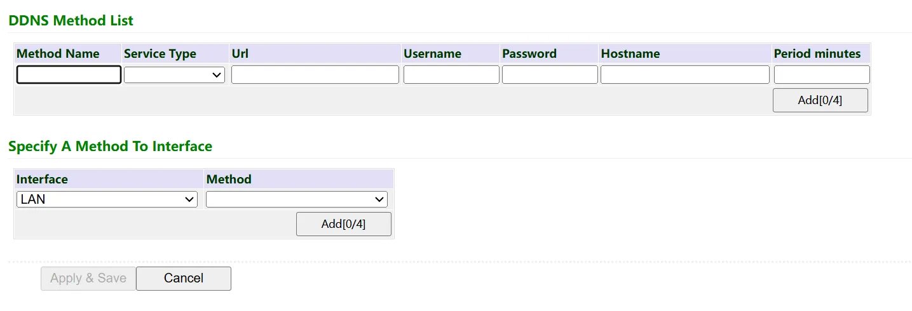</p>

<p align="center"><strong>Figure 4-86 Dynamic Domain Name Configuration</strong></p>

Dynamic domain name parameter descriptions:

**Dynamic Domain Name Update Method:**

- **Method Name**: Custom dynamic domain name update method name.
- **Service Type**: The service type is mainly determined by the dynamic domain name service provider. Different dynamic domain name service providers set different service types and functional characteristics. Users select from these service types according to their actual situation and needs.
  - Disable: Disables the dynamic domain name function.
  - DynAccess
  - QDNS(3322)-Dynamic
  - QDNS(3322)-Static
  - DynDNS-Dynamic
  - DynDNS-Static
  - NoIP
  - Custom: Allows configuration of other dynamic domain name services not listed according to special needs.
- **Username**: Username applied for on the dynamic domain name server.
- **Password**: Password configured on the dynamic domain name server.
- **Hostname**: Domain name applied for on the dynamic domain name server.
- **Update Interval (minutes)**: The time interval for the dynamic domain name server to synchronize the domain name and IP.

Note: Up to 4 dynamic domain name update methods can be configured.

**Specify Interface Update Method:**

- **Interface**: The interface that requires dynamic domain name resolution.
- **Method**: Select the configured dynamic domain name update method.

##### 4.6.2.2 Traffic Control

Traffic control is the process of managing and limiting network traffic to ensure network stability, performance, and reasonable resource allocation. The IG can set quotas for daily/monthly traffic. After traffic exceeds the set threshold, methods such as sending alarms only, stopping forwarding, or shutting down the interface can be set to remind users or disable traffic.

<p align="center">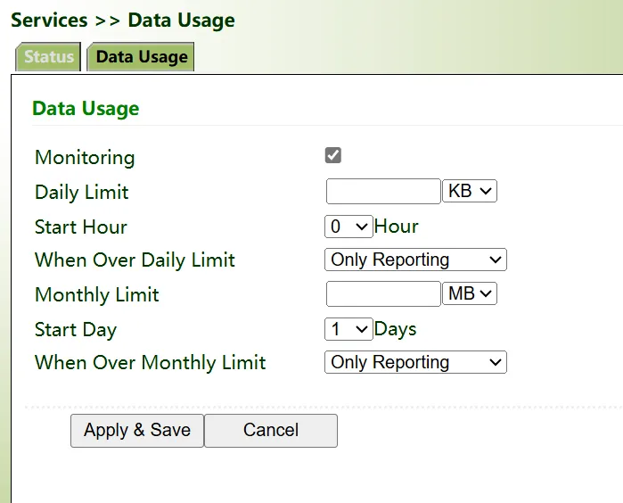</p>

<p align="center"><strong>Figure 4-87 Traffic Control Configuration</strong></p>

#### 4.6.3 Link Backup

To maintain network stability, in network environments composed of devices, backup connections are usually used to improve network robustness and stability. These backup connections are also called backup links or redundant links.

##### 4.6.3.1 SLA

InHand SLA basic principles: 1. Object tracking: tracks the reachability of specified objects. 2. SLA probe: the object tracking function can use InHand SLA to send different types of probes to objects. 3. Use static routing and tracking options. SLA configuration steps are as follows:

1. Define one or more SLA operations (probes).
2. Define one or more Track objects to track SLA operation status.
3. Define measures associated with Track objects.

<p align="center">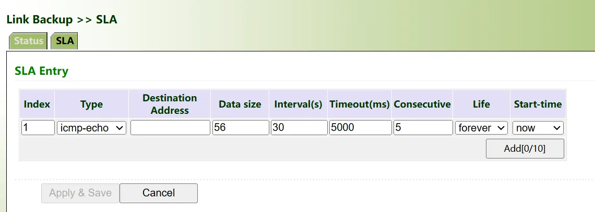</p>

<p align="center"><strong>Figure 4-88 SLA Configuration</strong></p>

SLA parameter descriptions:

- **ID**: SLA index or ID; can be user-defined or auto-generated. Up to 10 SLAs can be added.
- **Type**: Probe type; default is icmp-echo. By simply sending an ICMP-ECHO (Type 8) packet to the target host, if an ICMP-ECHO-Reply (ICMP type 0) packet is received, it indicates that the host is alive.
- **Destination Address**: The IP address to be probed.
- **Data Size**: User-defined probe packet size.
- **Probe Interval (seconds)**: The device sends ICMP probes at the set probe interval.
- **Timeout (milliseconds)**: After the device sends an ICMP probe, if no response packet is received within the configured timeout, the probe is considered failed, and the next probe is performed.
- **Count**: The number of probe failures considered as a link failure. When the configured probe count is reached, the SLA probe is considered failed, and the SLA status is DOWN.
- **Lifetime**: Default is forever (i.e., effective forever after configuration); users cannot change this.
- **Start Time**: Default is now (effective immediately after configuration).

##### 4.6.3.2 Track Module

The purpose of Track is to implement linkage functions. The linkage function consists of three parts: application module, Track module, and monitoring module. The Track module is located between the application module and the monitoring module. Its main function is to shield the differences between different monitoring modules and provide a unified interface for the application module.

<p align="center">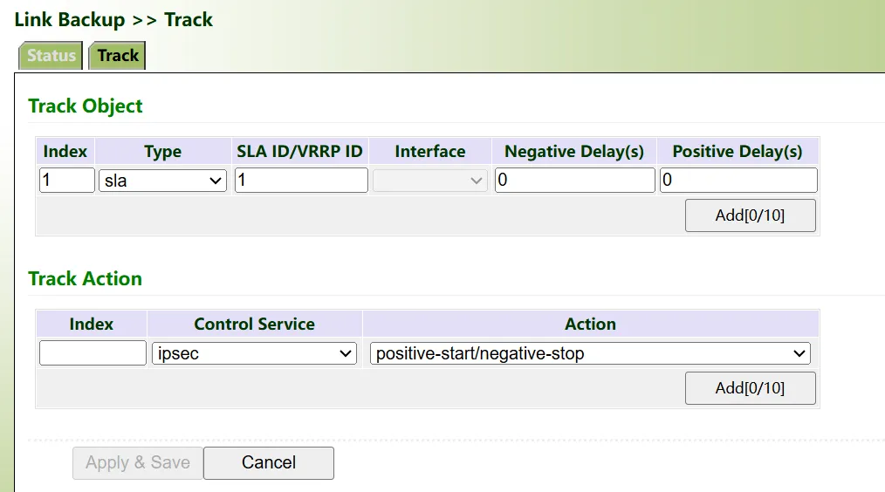</p>

<p align="center"><strong>Figure 4-89 Track Module Configuration</strong></p>

Track module parameter descriptions:

**Track Table:**

- **ID**: Track index or ID; can be user-defined or auto-generated. Up to 10 Tracks can be created.
- **Type**: Options include sla or interface.
- **SLA ID**: The index or ID of the defined SLA. When the type is selected as interface, this item is unavailable.
- **Interface**: When the type is selected as sla, this item is unavailable.
- **Abnormal State Delay**: When the interface or SLA status is DOWN, how long it takes for the Track to display an abnormality. 0 means immediately display; unit: seconds.
- **Normal State Delay**: When the fault recovers, switching can be delayed according to the set time (0 means immediate switch) instead of switching immediately.

**Track Control Table:**

- **ID**: Track index or ID; can be user-defined or auto-generated. Up to 10 Tracks can be created.
- **Control Service**: Default is ipsec, i.e., this Track is used to detect the IPSec connection establishment status.
- **Control Method**:
  - positive-start/negative-stop: When the IPSec-related probe or monitoring result is "positive" (IPSec tunnel status is normal), the corresponding operation or process is started; when the result is "negative" (IPSec tunnel status is abnormal), the corresponding operation or process is stopped.
  - positive-stop/negative-start: When the IPSec-related probe or monitoring result is "positive" (IPSec tunnel status is normal), the corresponding operation or process is stopped; when the result is "negative" (IPSec tunnel status is abnormal), the corresponding operation or process is started.

##### 4.6.3.3 Interface Backup

Interface backup refers to the formation of a primary-backup relationship between specified interfaces on the same device. When an interface fails or has insufficient bandwidth, causing business transmission to be unable to proceed normally, traffic can be quickly switched to the backup interface. The backup interface assumes business transmission or shares network traffic, thereby improving the reliability of data device communication.

<p align="center">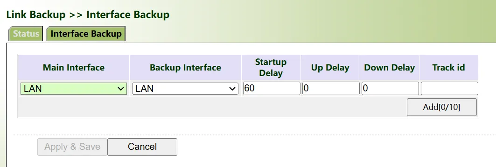</p>

<p align="center"><strong>Figure 4-90 Interface Backup Configuration</strong></p>

Interface backup parameter descriptions:

- **Primary Interface**: The interface currently in use.
- **Backup Interface**: The interface waiting to be switched.
- **Startup Delay**: Set the waiting time for the tracking probe policy to take effect.
- **Up Delay**: When the primary interface changes from probe failure to probe success, switching can be delayed according to the set time (0 means immediate switch) instead of switching immediately.
- **Down Delay**: When the primary interface changes from probe success to probe failure, switching can be delayed according to the set time (0 means immediate switch) instead of switching immediately.
- **Track ID**: Tracking probe; the index or ID of the defined Track.

#### 4.6.4 VPN

A VPN is a "virtual" private dedicated communication network built on a public network (such as the Internet). The term "virtual" means that, unlike traditional dedicated networks that have independent physical links and infrastructure, it establishes a logically isolated and dedicated communication channel on the public network through network technology, achieving functions and security similar to a dedicated network.

Through tunnel technology, encryption technology, and other means, users feel as if they are communicating in an independent, secure dedicated network when using a VPN. However, in reality, data is transmitted on the basis of the public network; it is just that dedicatedness and privacy are logically achieved.

##### 4.6.4.1 IPsec

IPsec is a set of open network security protocols formulated by the IETF. It performs authentication and encryption operations on data packets at the IP layer to ensure the integrity and security of communication data, reducing the risk of data leakage and eavesdropping, and safeguarding the security of user business data transmission.

*IPsec Policy Configuration*

<p align="center">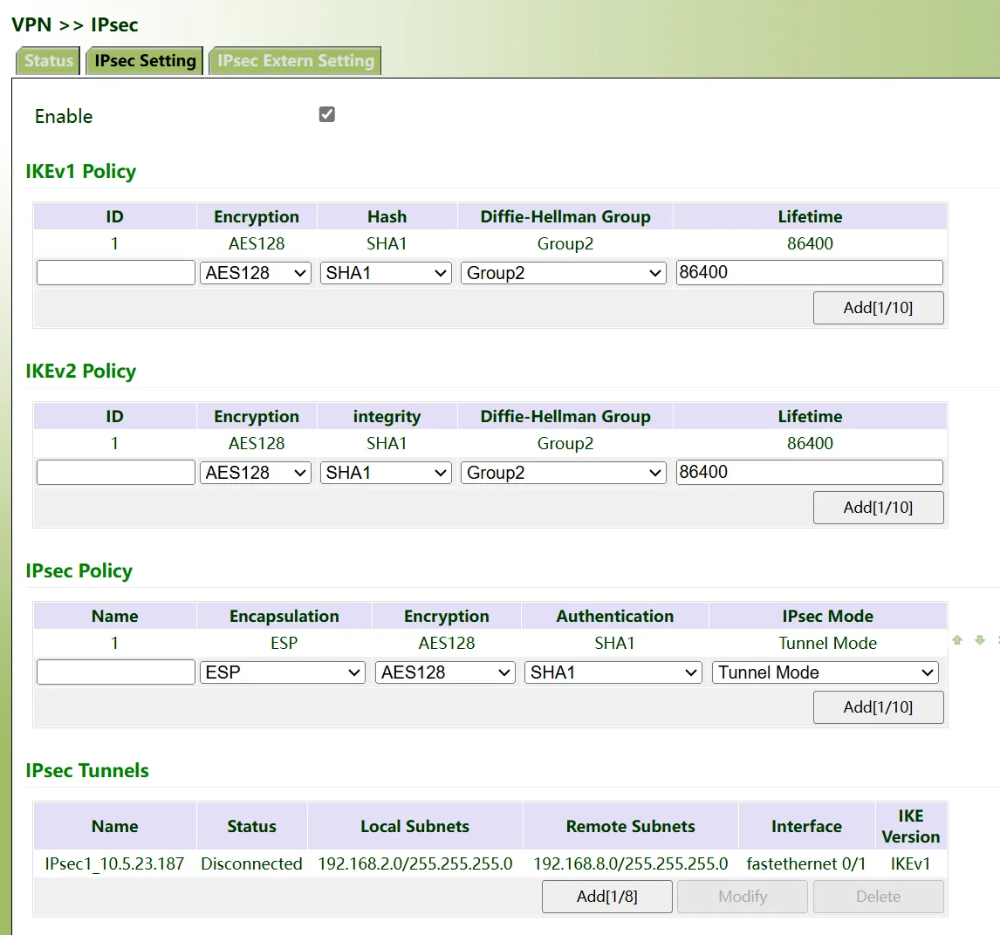</p>

<p align="center"><strong>Figure 4-91 IPsec Configuration</strong></p>

| Parameter                   | Description                                                  |
| --------------------------- | ------------------------------------------------------------ |
| IKEv1 Policy / IKEv2 Policy | Custom policy identifiers with encryption (3DES, DES, AES128, AES192, AES256), hash (MD5, SHA1, SHA2-256, SHA2-384, SHA2-512), Diffie-Hellman group, and lifetime settings. |
| IPsec Policy                | Name, encapsulation (AH or ESP), encryption, authentication, and mode (Tunnel or Transport). |

*IPsec Tunnel Configuration*

<p align="center">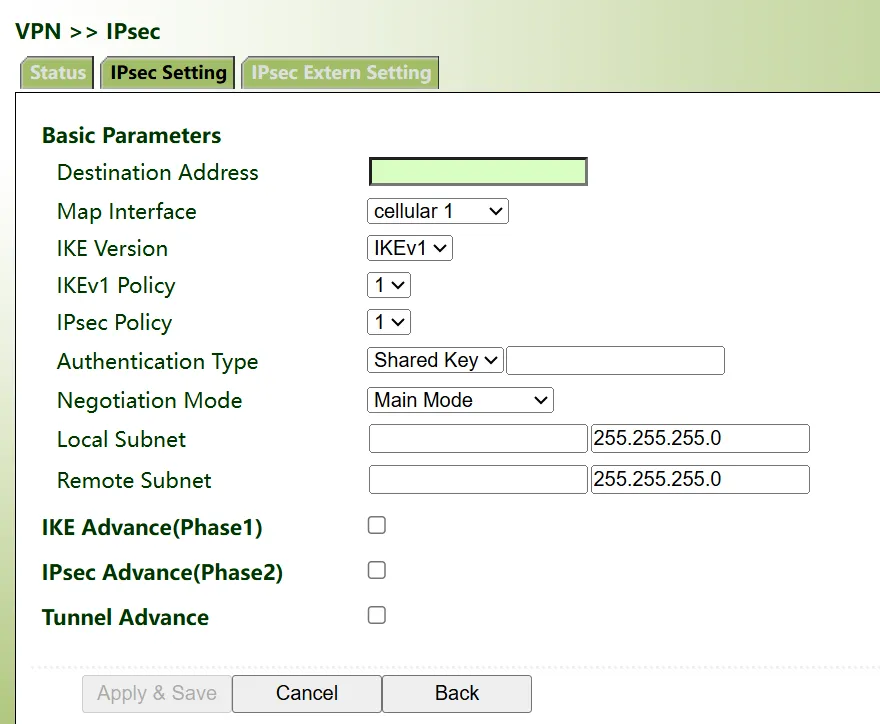</p>

<p align="center"><strong>Figure 4-92 IPsec Tunnel Configuration</strong></p>

| Parameter                    | Description                                                  |
| ---------------------------- | ------------------------------------------------------------ |
| Destination Address          | IP address or domain name of the peer IKE peer (0.0.0.0 when IG is server). |
| Map Interface                | Interface to which the IPsec policy is applied.              |
| IKE Version                  | IKEv1 or IKEv2.                                              |
| Authentication Type          | Shared key or digital certificate.                           |
| Negotiation Mode             | Main Mode (higher security) or Aggressive Mode.              |
| Local Subnet / Remote Subnet | Source and destination networks of interest.                 |

*IKE Advanced (Phase 1)*

<p align="center">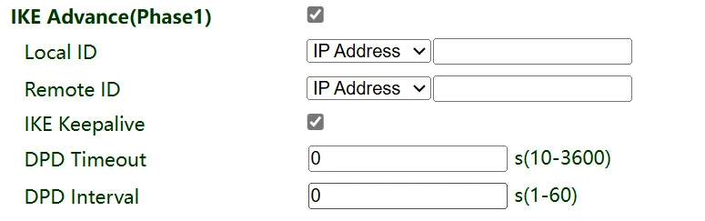</p>

<p align="center"><strong>Figure 4-93 IPsec IKE Advanced (Phase 1)</strong></p>

| Parameter            | Description                                                  |
| -------------------- | ------------------------------------------------------------ |
| Local ID / Remote ID | Identity type in IKE negotiation: IP Address, FQDN, or User FQDN. |
| IKE Keepalive        | Enables Peer Survival Detection (DPD).                       |
| DPD Timeout          | Timeout after which the ISAKMP profile is deleted if no response is received. |
| DPD Interval         | Interval for detecting IPSec neighbour status.               |

*IPsec Advanced (Phase 2)*

<p align="center"></p>

<p align="center"><strong>Figure 4-94 IPsec Advanced (Phase 2)</strong></p>

| Parameter                     | Description                                                  |
| ----------------------------- | ------------------------------------------------------------ |
| Perfect Forward Secrecy (PFS) | Secures Phase 2 keys by performing an additional DH exchange. |
| IPsec SA Lifetime             | Lifecycle of the IPsec SA.                                   |
| IPsec SA Idle Time            | When no data is transmitted within this idle time, the SA expires and a new SA is negotiated. |

*Tunnel Advanced Options*

<p align="center">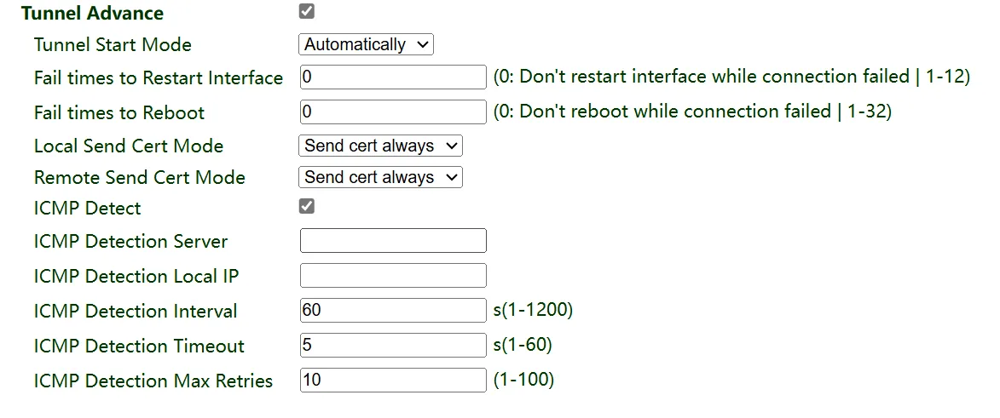</p>

<p align="center"><strong>Figure 4-95 IPsec Tunnel Advanced Options</strong></p>

| Parameter                       | Description                                                  |
| ------------------------------- | ------------------------------------------------------------ |
| Tunnel Start Mode               | Automatically, Respond Only, or On-demand.                   |
| Fail Times to Restart Interface | Restarts the physical interface after this number of failures. Default 0 (disabled). Value: 1–12. |
| Fail Times to Reboot            | Reboots the device after this number of failures. Default 0 (disabled). Value: 1–32. |
| Local/Remote Send Cert Mode     | Send cert always, send cert if asked, or no certificates sent. |
| ICMP Detect                     | Configures ICMP probe server, local IP, interval, timeout, and maximum retries for tunnel health detection. |

*IPsec External Setting*

<p align="center">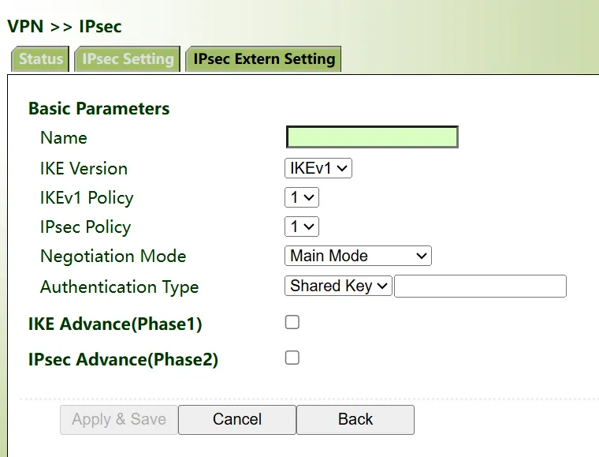</p>

<p align="center"><strong>Figure 4-96 IPsec External Setting</strong></p>

| Parameter              | Description                                                  |
| ---------------------- | ------------------------------------------------------------ |
| Name                   | Name of the IPsec profile.                                   |
| IKE Version            | IKEv1 or IKEv2.                                              |
| IKEv1 / IKEv2 Policy   | Policy identifier defined in the policy list.                |
| IPsec Policy           | Policy identifier defined in the IPsec policies list.        |
| Negotiation Mode       | Main Mode or Aggressive Mode.                                |
| Authentication Methods | Shared key or certificate.                                   |
| Local ID / Remote ID   | Local and remote identity types.                             |
| IKE Keepalive          | DPD timeout and interval settings.                           |
| IPsec Advanced         | PFS, SA lifetime, fail times to restart interface, and fail times to reboot. |

> **Note**: When the IG502 is used as an IPsec server, configure the peer address as 0.0.0.0. IPsec extensions are typically used with GRE to build DMVPN or GRE over IPsec networks.

##### 4.6.4.2 GRE

Generic Routing Encapsulation (GRE) defines a protocol for encapsulating any other network layer protocol on any network layer protocol. GRE can serve as a Layer 3 tunneling protocol for VPNs, providing a transparent transmission channel for VPN data. In simple terms, GRE is a tunneling technology that provides a path for encapsulated datagrams to be transmitted over this path. At both ends of the tunnel, datagrams are encapsulated and decapsulated respectively.

<p align="center">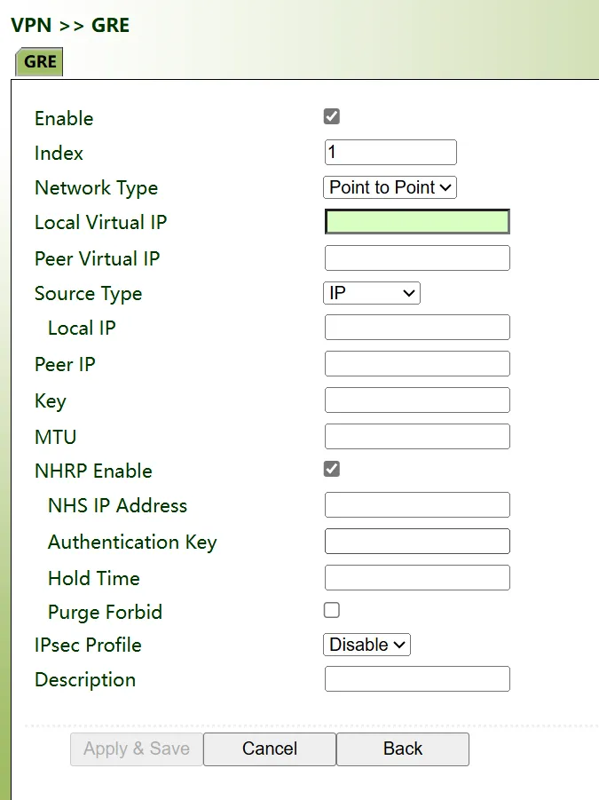</p>

<p align="center"><strong>Figure 4-97 GRE Configuration</strong></p>

GRE parameter descriptions:

- **Enable**: Enable or disable the GRE function.
- **Interface ID**: Sets the GRE tunnel name; range 1–100.
- **Network Type**: Selects the GRE network type.
- **Local Virtual IP**: Sets the local virtual IP address.
- **Peer Virtual IP**: Sets the peer virtual IP address; for subnet type, this item is the local subnet mask.
- **Source Address Type**: Selects the source address type and sets the corresponding type of IP address or interface name.
- **Local IP Address**: Configures the source address of the GRE tunnel.
- **Peer Address**: Configures the destination address of the GRE tunnel.
- **Key**: Sets the tunnel authentication key; both ends must be consistent.
- **MTU**: Sets the Maximum Transmission Unit of the GRE tunnel; unit: bytes.
- **Enable NHRP**: Next Hop Resolution Protocol, used for the source station connected to a Non-Broadcast Multi-Access (NBMA) subnet to determine the "NBMA next hop" internetwork layer address and NBMA subnet address between the source station and the destination station.
  - **NHS Address**: Peer NHS server address.
  - **Authentication Key**: NHRP authentication key.
  - **Holdtime**: Valid values: 1–65535.
  - **Disable NHRP Purge Messages**: Enable or disable.
- **IPsec Profile**: Disable; used in combination with IPsec extension.
- **Description**: GRE tunnel description information.

**Notes:**

- NHRP is only used for DMVPN networks; generally, GRE does not need to enable NHRP.
- GRE is generally used when both ends have fixed public network addresses.

##### 4.6.4.3 OpenVPN

In OpenVPN, if a user accesses a remote virtual address (belonging to the address series used by the virtual network adapter, different from the real address), the operating system sends the data packet (TUN mode) or data frame (TAP mode) to the virtual network adapter through the routing mechanism. The service program receives the data and performs corresponding processing, then sends it out from the external network via SOCKET. The remote service program receives data from the external network via SOCKET, performs corresponding processing, and sends it to the virtual network adapter, and the application software can receive it, completing a one-way transmission process. The reverse is also true.

**OpenVPN Client**

<p align="center">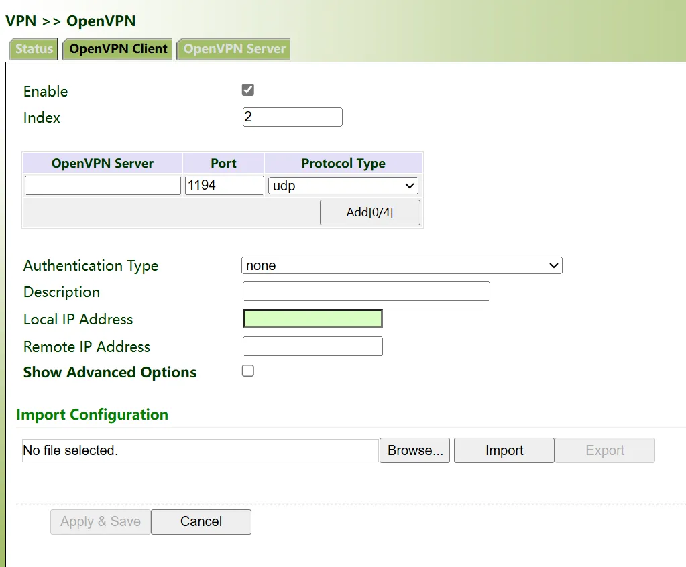</p>

<p align="center"><strong>Figure 4-98 OpenVPN Client Configuration</strong></p>

| Parameter           | Description                                                  |
| ------------------- | ------------------------------------------------------------ |
| Enable              | Enables or disables the OpenVPN client.                      |
| Index               | Tunnel ID.                                                   |
| OpenVPN Server      | IP address or domain name of the OpenVPN server.             |
| Port                | Port number used when establishing OpenVPN.                  |
| Protocol Type       | UDP or TCP.                                                  |
| Authentication Type | Select the authentication class and configure parameters accordingly. |
| Description         | Custom tunnel description.                                   |

**Advanced Options**

<p align="center">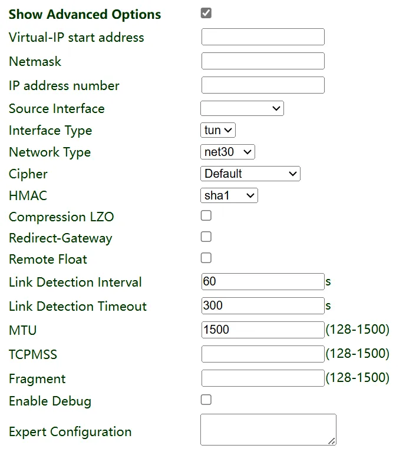</p>

<p align="center"><strong>Figure 4-99 OpenVPN Client Advanced Options</strong></p>

| Parameter                | Description                                                  |
| ------------------------ | ------------------------------------------------------------ |
| Virtual IP Start Address | Client virtual IP starting address, usually assigned by the server. |
| Netmask                  | Subnet mask of the virtual IP.                               |
| IP Address Number        | Number of virtual IPs assignable by the server.              |
| Source Interface         | Interface used to establish OpenVPN.                         |
| Interface Type           | tun (IP-based) or tap (full Ethernet frames).                |
| Network Type             | net30, p2p, or subnet (ignored when interface type is tap).  |
| Bridge Interface         | Connects multiple virtual machines or network devices on the same network (ignored in tun mode). |
| Cipher                   | Encryption protocol; must be consistent with the server.     |
| HMAC                     | Checksum method; must be consistent with the server.         |
| Compression LZO          | Compression form for OpenVPN data transmission.              |
| Redirect-Gateway         | Directs the client's default gateway through OpenVPN.        |
| Remote Float             | Allows the remote end to change its IP address/port.         |
| Link Detection Interval  | Time to send connection detection messages after OpenVPN is established. |
| Link Detection Timeout   | After timeout, re-establishes the connection when the maximum failure count is reached. |
| MTU                      | Maximum transmission unit of the OpenVPN interface, in bytes. |
| Enable Debug             | Prints detailed logs when enabled.                           |
| Expert Configuration     | Configures OpenVPN extended parameters.                      |
| Import Configuration     | Imports an OpenVPN configuration file.                       |

**OpenVPN Server**

<p align="center">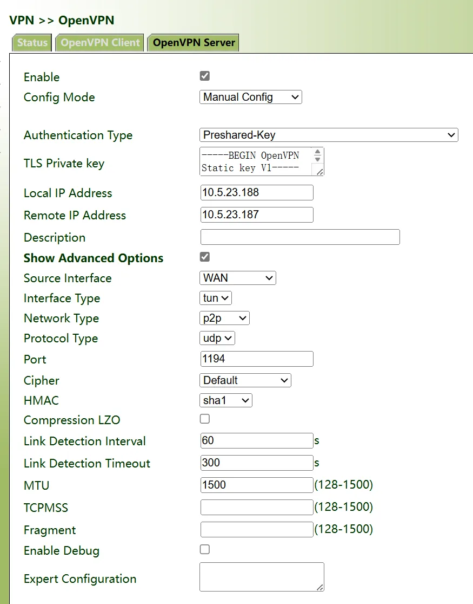</p>

<p align="center"><strong>Figure 4-100 OpenVPN Server Configuration</strong></p>

| Parameter                       | Description                                         |
| ------------------------------- | --------------------------------------------------- |
| Enable                          | Enables or disables the OpenVPN server.             |
| Config Mode                     | Manual config or import config file.                |
| Local IP Address                | Virtual IP address of the OpenVPN server interface. |
| Remote IP Address               | Virtual IP address of the OpenVPN client.           |
| Protocol Type                   | Consistent with the client.                         |
| Port                            | Port number used by the OpenVPN service.            |
| Cipher / HMAC / Compression LZO | Must be consistent with the client.                 |

<p align="center">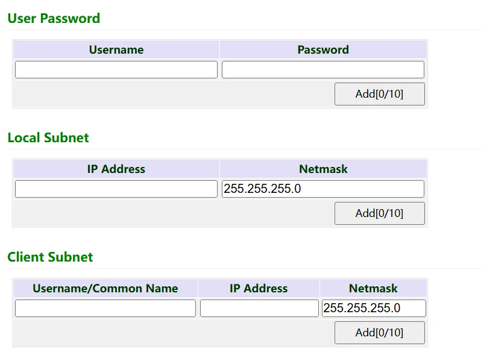</p>

<p align="center"><strong>Figure 4-101 OpenVPN Server User and Subnet</strong></p>

| Parameter     | Description                                                  |
| ------------- | ------------------------------------------------------------ |
| User Password | User/password configured when using user-password authentication. |
| Local Subnet  | Route from OpenVPN server to client; usually the client's actual communication subnet. |
| Client Subnet | Static route pushed to the client by the OpenVPN server.     |

##### 4.6.4.4 Certificate Management

SCEP (Simple Certificate Enrollment Protocol) is a communication protocol for device certificate management.

<p align="center">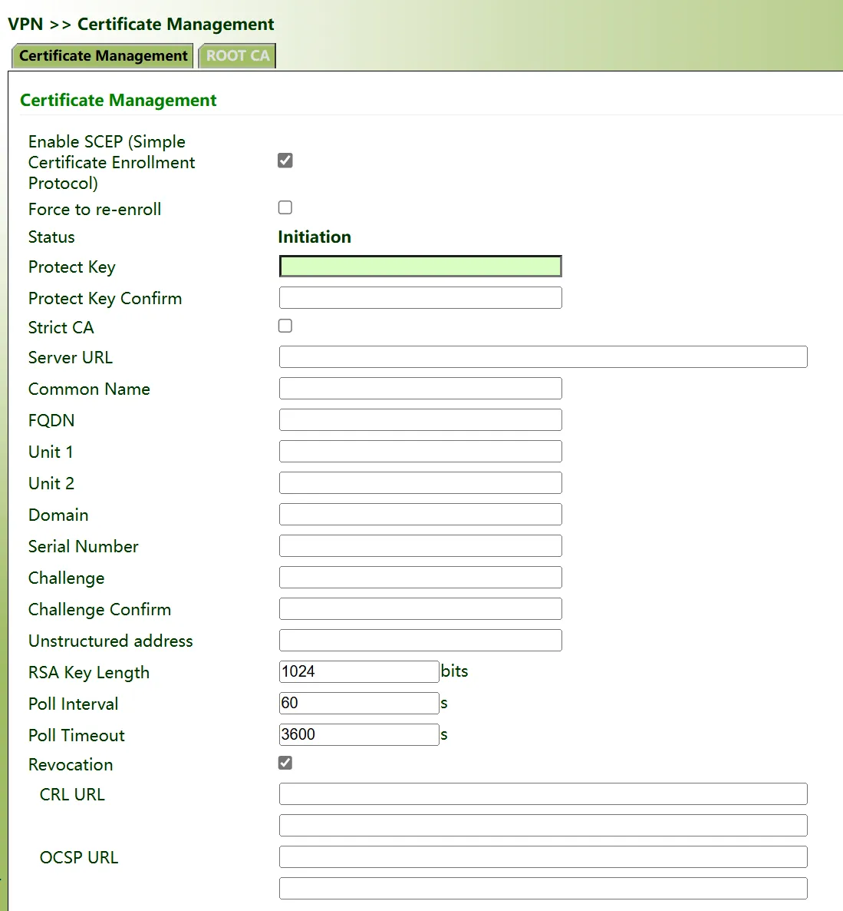</p>

<p align="center"><strong>Figure 4-102 Certificate Management Configuration</strong></p>

| Parameter           | Description                                                  |
| ------------------- | ------------------------------------------------------------ |
| Enable SCEP         | Enable or disable the certificate request protocol.          |
| Forced to Re-enroll | Restarts the certificate application service without checking current certificate status. |
| Status              | Current state: initialize, Enrolling, Re-Enrolling, or Complete. |
| Protect Key         | Certificate protection key for digital certificate encryption. |
| Strict CA           | Trusted CA identifier for certificate application, acquisition, revocation, and query. |
| Server URL          | URL address of the certificate server.                       |
| Common Name         | Name of the certificate to be applied for.                   |
| FQDN                | Fully Qualified Domain Name of the certificate.              |
| Challenge           | Challenge password for certificate application (used when revoking the certificate). |
| RSA Key Length      | Value: 128–2048 bits.                                        |
| Poll Interval       | Interval for querying certificate status. Value: 30–3600 seconds. |
| Poll Timeout        | Maximum time for querying certificate status. Value: 30–86400 seconds. |
| Revocation          | Enable or disable certificate revocation with CRL URL and OCSP URL. |

**Certificate Import**

<p align="center">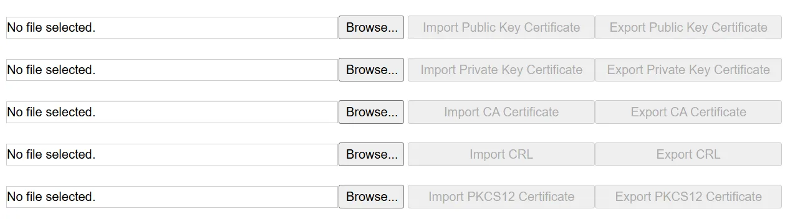</p>

<p align="center"><strong>图 4-52 Certificate Import</strong></p>

**Root CA Import**

<p align="center">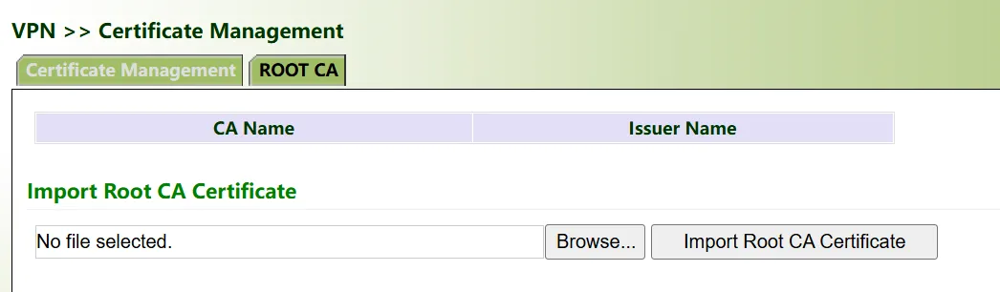</p>

<p align="center"><strong>Figure 4-103 Root CA Import</strong></p>

> **Note**: When using certificates, ensure that the device time is synchronized with the actual time.


#### 4.6.5 Industrial Interface

##### 4.6.5.1 DTU

**Serial Port Settings**

Set the serial port parameters of the IG according to the serial port parameters of the terminal device connected to the IG to achieve normal communication between the IG and the terminal device.

<p align="center">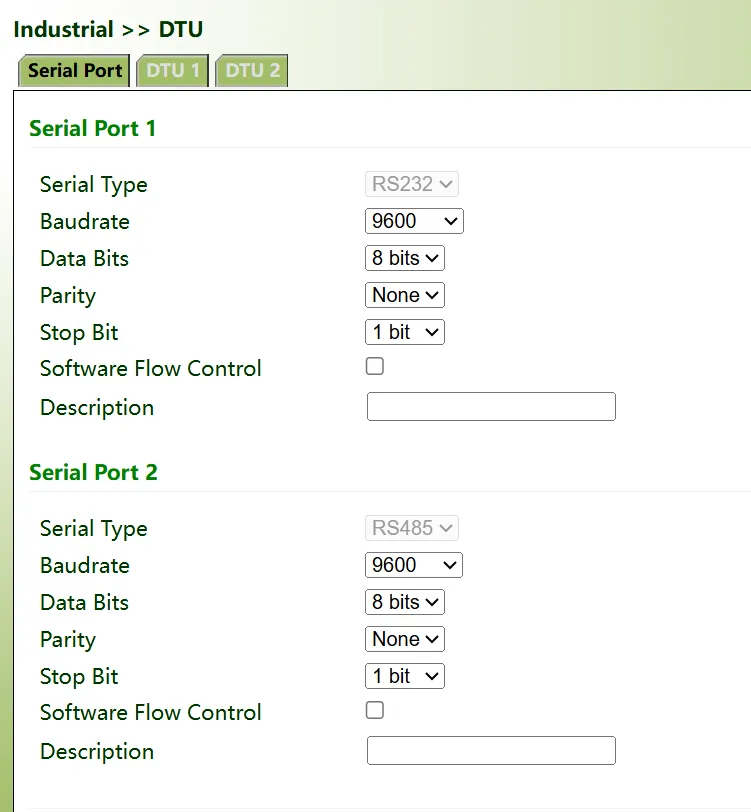</p>

<p align="center"><strong>Figure 4-104 Serial Port Settings</strong></p>

Serial port setting parameter descriptions:

- **Serial Port Type**: Different IG series have different serial port types and quantities; select according to the actual situation.
- **Baud Rate**: A parameter measuring symbol transmission rate. It represents the number of symbols transmitted per second.
- **Data Bits**: A parameter setting the actual data bits in communication.
- **Parity**: The error detection method in serial port communication; generally odd parity, even parity, or no parity.
- **Stop Bit**: Used to indicate the last bit of a single packet. Typical values are 1, 1.5, and 2 bits.
- **Software Flow Control**: Serial communication flow control provides a mechanism to block communication when communication cannot proceed for some reason. Flow control allows the data receiving device to notify the data sending device to stop sending when it cannot receive data.
- **Serial Port Description**: Custom description.

**Note:**

- The IG serial port parameters must be set consistently with the connected terminal device serial port parameters.
- The DTU function and the GNSS serial forwarding function cannot be enabled simultaneously.

**DTU 1**

<p align="center">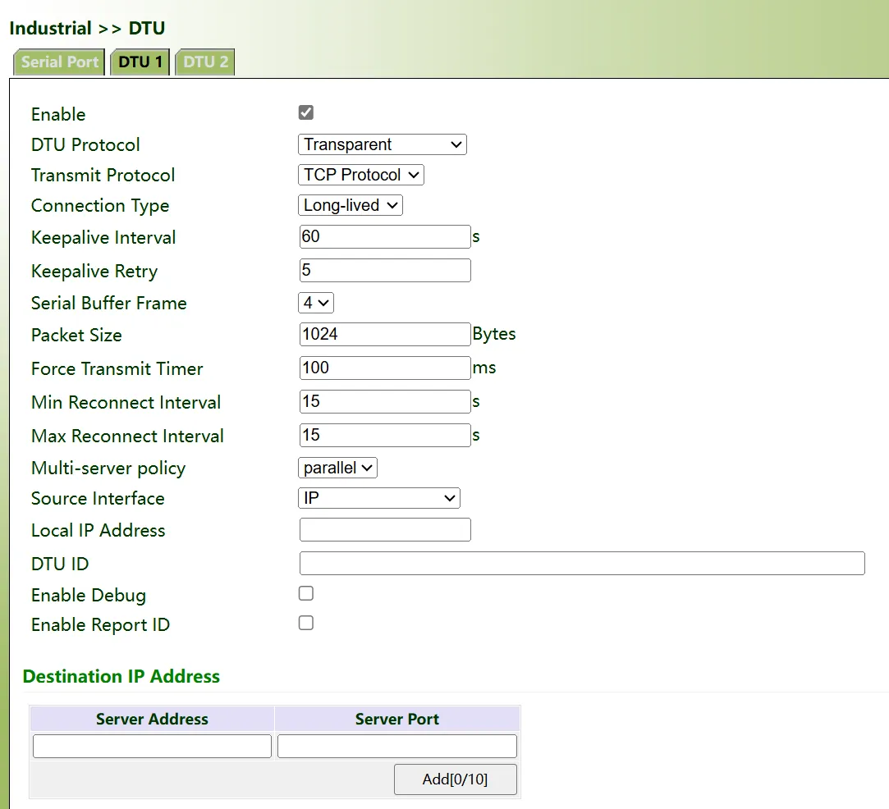</p>

<p align="center"><strong>Figure 4-105 DTU1 Configuration</strong></p>

DTU 1 parameter descriptions:

- **Enable**: Select to enable.
- **DTU Protocol**: Options include Transparent Transmission, TCP Server, RFC2217 Mode, IEC101 to 104, Modbus Bridge, and DC Protocol.
  - Transparent Transmission and TCP Server: If transparent transmission is selected, the device acts as the client; if TCP server is selected, the device acts as the server.
  - RFC2217 Mode: After selecting this mode, serial port configuration does not need to be set.
  - IEC101 to 104: Applicable to the power industry; function is similar to TCP.
- **Transmit Protocol**: Options include TCP and UDP.
- **Connection Type**: Options include Long-Lived and Short-Lived.
  - Long-Lived: After the TCP client and TCP server establish a connection, the TCP connection is maintained.
  - Short-Lived: After the TCP client and TCP server establish a connection, if there is no data transmission within the idle time, the TCP connection with the server is automatically disconnected.
- **Keepalive Interval**: After the TCP client and TCP server establish a connection, the time interval for periodically sending TCP keepalive packets to detect connectivity between the client and server.
- **Keepalive Retry**: After TCP keepalive timeout, the device resends TCP keepalive. When the set keepalive retry count is reached, the TCP connection is re-established.
- **Serial Port Cache Frame Count**: The serial port cache size set during serial port data reception and transmission; default is 4 K.
- **Serial Port Frame Length**: When the serial port sends data, the size of one frame of data is set. Transmission starts when the set value is reached. Valid values: 1–1024, unit: bytes.
- **Serial Port Frame Interval**: When the serial port sends data, if the sending interval exceeds the set frame interval, the device automatically splits frames for transmission. Valid values: 10–65535, unit: milliseconds.
- **Min Reconnect Interval**: User-defined minimum reconnect interval time. When the device starts a connection and fails, it reconnects at this minimum reconnect interval until the user-defined maximum reconnect interval is reached. Valid values: 15–60, unit: seconds.
- **Max Reconnect Interval**: User-defined maximum reconnect interval time. After the device starts a connection and the connection time reaches the maximum reconnect interval, it reconnects at this interval (i.e., the user-defined maximum reconnect interval). Valid values: 60–3600, unit: seconds.
- **Multi-Center Strategy**: Options include Concurrent and Polling.
  - Concurrent: Simultaneously connects to the centers in the destination IP address list.
  - Polling: First connects to the center at the front of the list; if connected, it no longer connects to the ones behind. If not connected, it connects in order from front to back until one center is connected.
- **Source Interface**: Generally, users do not need to select.
- **Local IP Address**: The device interface IP address corresponding to the source interface when the source interface selects IP. Generally, users do not need to configure this; it can be left empty.
- **DTU ID**: Custom; the DTU ID automatically sent to the server after successfully connecting to the server. It can also be left unconfigured, remaining empty.
- **Debug Log**: Select to enable; after enabling, DTU-related logs will be printed.
- **Enable ReportID**: Select to enable.
- **Keepalive Interval**: Enable ReportID to set this item. Valid values: 1–65535, unit: seconds.
- **Keepalive Content**: Enable ReportID to set this item.
- **Destination IP Address**
  - **Server Address**: Custom device server IP address to connect to.
  - **Server Port**: Custom device server port to connect to.

Note: Up to 10 destination IP addresses can be set.

**DTU 2**

Same as DTU 1.

---

## Chapter 5 Typical Applications

### Case 1: Industrial Remote Monitoring

**Scene Description**: In a factory environment, the IG502 acts as an edge gateway, collecting data from on-site PLCs, sensors, and other devices via cellular network or Ethernet and uploading it to the cloud platform, achieving remote monitoring and operation and maintenance management of devices.

**Network Topology**:

```
[On-site Devices: PLC/Sensors/Meters]
        |
        | RS232/RS485
        |
    [IG502] ----Cellular Network/Ethernet----> [InHand Device Live Cloud Platform]
        |
        | Web Management
        |
    [Operations PC]
```

**Device Role**: This device acts as an edge gateway, responsible for collecting on-site device data, protocol conversion, data preprocessing, and cloud transmission.

**Configuration Steps**:

1. Connect on-site devices to the IG502 serial port terminal via RS232/RS485.
2. Install the cellular antenna onto the IG502 antenna interface and insert the SIM card.
3. Configure IG502 cellular network parameters (refer to [Scenario 1: Cellular Networking](#scenario-1-cellular-networking)).
4. Configure the DTU function: set serial port parameters consistent with on-site devices, select transparent transmission or Modbus bridge mode, and configure the destination server address as the cloud platform address.
5. In 【System Management】→【Device Cloud Platform】, configure the connection to InHand Device Live Manager (refer to [Scenario 6: Device Cloud Platform Connection](#scenario-6-device-cloud-platform-connection)).
6. Log in to the InHand Device Live cloud platform, view the IG502 online status in the device list, and remotely access the device Web interface through the cloud platform.

**Reference Chapters**:

- [Cellular Network Configuration](#scenario-1-cellular-networking)
- [DTU Configuration](#4651-dtu)
- [Device Cloud Platform Connection](#scenario-6-device-cloud-platform-connection)

---

## Appendix: Troubleshooting

### 1 Network Connection Problems

| Phenomenon | Possible Cause | Troubleshooting Steps | Reference Chapter |
|------------|----------------|-----------------------|-------------------|
| Cannot connect to cellular network | SIM card not inserted or poor contact | 1. Check whether the SIM card is correctly inserted.<br>2. Reinsert the SIM card. | [SIM Card Slot](#2255-sim-card-slot) |
| Cannot connect to cellular network | APN parameter configuration error | 1. Verify whether APN parameters are correct.<br>2. Contact the operator to obtain the correct APN. | [Cellular Network Configuration](#4211-cellular) |
| Cannot connect to cellular network | Weak signal or no signal | 1. Check whether the antenna is connected.<br>2. Adjust the device position. | [Antenna Installation](#2256-antenna-interface) |
| Cannot obtain Ethernet IP | DHCP server failure | 1. Check whether the upstream network device DHCP service is normal.<br>2. Switch to static IP configuration. | [Ethernet Configuration](#4212-ethernet) |
| Cannot obtain Ethernet IP | Network cable connection fault | 1. Check whether the network cable is firmly inserted.<br>2. Replace the network cable for testing. | [Network Connection](#226-network-connection-and-web-login) |
| WLAN cannot connect | SSID or password error | 1. Verify the SSID name and password.<br>2. Confirm that the authentication method is consistent. | [WLAN Configuration](#scenario-3-wlan-configuration) |

### 2 Web Access Problems

| Phenomenon | Possible Cause | Troubleshooting Steps | Reference Chapter |
|------------|----------------|-----------------------|-------------------|
| Cannot open Web interface | IP address error | 1. Confirm that the computer and device are in the same network segment.<br>2. Check the device default IP. | [First Web Access](#226-network-connection-and-web-login) |
| Cannot open Web interface | Browser compatibility issue | 1. Change the browser (Chrome is recommended).<br>2. Clear the browser cache. | [First Web Access](#226-network-connection-and-web-login) |
| Login failure | Username or password error | 1. Confirm the username is adm.<br>2. Check the device nameplate to obtain the initial password. | [Default Settings](#16-default-settings) |
| Abnormal page after login | Browser cache issue | 1. Clear the browser cache.<br>2. Refresh the page or change the browser. | — |

### 3 VPN Connection Problems

| Phenomenon | Possible Cause | Troubleshooting Steps | Reference Chapter |
|------------|----------------|-----------------------|-------------------|
| IPsec tunnel cannot be established | Inconsistent encryption algorithms at both ends | 1. Verify IKE policies and IPsec policies at both ends.<br>2. Ensure encryption algorithms and hash algorithms are consistent. | [IPsec Configuration](#4641-ipsec) |
| IPsec tunnel cannot be established | Inconsistent shared key | 1. Verify the shared key at both ends.<br>2. Reconfigure and save. | [IPsec Configuration](#4641-ipsec) |
| OpenVPN connection failure | Server address unreachable | 1. Use the Ping tool to test server connectivity.<br>2. Check the network configuration. | [OpenVPN Configuration](#4643-openvpn) |
| OpenVPN connection failure | Authentication type mismatch | 1. Verify the authentication types of the client and server.<br>2. Ensure encryption algorithms and HMAC are consistent. | [OpenVPN Configuration](#4643-openvpn) |

### 4 Device Hardware Problems

| Phenomenon | Possible Cause | Troubleshooting Steps | Reference Chapter |
|------------|----------------|-----------------------|-------------------|
| PWR indicator not lit | Abnormal power connection | 1. Check whether the power cable is firmly inserted.<br>2. Confirm that the supply voltage is within the 12–48 VDC range.<br>3. Replace the power adapter for testing. | [Power Connection](#224-power-connection) |
| STATUS indicator not lit | Device did not start normally | 1. Check whether the power is normal.<br>2. Wait for the device to complete startup (approx. 1–2 minutes).<br>3. If it remains unlit for a long time, try restoring factory settings. | [Restore Factory Settings](#15-restoring-factory-settings) |
| ERR indicator steady on / blinking | System error or upgrading | 1. If upgrading, wait for the upgrade to complete.<br>2. If steady on for a long time, try restoring factory settings. | [Indicator Description](#14-indicator-description) |
| Cannot recognize SIM card | SIM card inserted incorrectly | 1. Confirm that the SIM card is inserted with the chip facing down.<br>2. Reinsert the SIM card.<br>3. Replace the SIM card for testing. | [SIM Card Slot](#2255-sim-card-slot) |

### 5 Cloud Platform Connection Problems

| Phenomenon | Possible Cause | Troubleshooting Steps | Reference Chapter |
|------------|----------------|-----------------------|-------------------|
| Device cannot come online | Server address error | 1. Verify the server address and registered account.<br>2. Confirm that the device network can access the cloud platform. | [Device Cloud Platform Connection](#scenario-6-device-cloud-platform-connection) |
| Device frequently drops offline | Heartbeat interval set too large | 1. Appropriately reduce the heartbeat interval.<br>2. Check network stability. | [Device Cloud Platform Connection](#scenario-6-device-cloud-platform-connection) |

---

## Appendix: Safety Precautions

1. The device should be used within the specified temperature and humidity ranges (operating temperature −25 °C to 70 °C, environmental humidity 5% to 95% non-condensing).
2. Do not use this device in explosive or flammable environments.
3. Before connecting power, verify that the voltage complies with the device specifications (12–48 VDC).
4. SIM cards and Micro SD cards do not support hot-plugging; power must be disconnected before operation.
5. Before disconnecting a USB mass storage device, enter the `sync` command to prevent data loss.
6. When disconnecting a storage device, exit from the /mnt/usb/sda_\<num\> directory; otherwise, the automatic unmount process will fail.

> **Warning**: Non-professionals should not open the device enclosure; there is a risk of electric shock.

---

## FAQ

### Q1: What is the difference between IG502 and other models (such as IG504, IG532)?

IG502, IG504, and IG532 are all InHand IG series edge computing gateways. The main differences lie in hardware interface configuration and performance. IG502 is a cost-effective model with a compact size; IG504/IG532 have expanded interfaces and performance. For specific specification differences, refer to each model's product datasheet.

### Q2: How to confirm the firmware version of the IG502?

After logging in to the Web management interface, the firmware version number can be viewed in the "System Information" area of the 【Overview】page. Detailed version information can also be viewed on the 【Advanced Functions】→【Management】→【System】page.

### Q3: What to do if the cellular network cannot dial successfully?

1. **Physical environment**: Check whether the SIM card is inserted into the correct card slot and whether cellular antennas are all installed.
2. **APN settings**: Ensure that the APN configuration information is consistent with that provided by the operator.
3. **Check signal status**: View the signal status indicator or the cellular signal strength on the Web interface.
4. **Check device connectivity**: Log in to the device local interface and use the system's built-in ICMP tool to ping 8.8.8.8 to test connectivity.
5. **Determine whether the SIM card is normal**: Remove the SIM card and install it in a mobile phone to check whether it can access the Internet normally.
6. **Restart**: Try powering off the device, wait a few seconds, then reconnect power and retry the network connection.
7. **Restore factory settings**: Restore the device to factory settings, then retry.

### Q4: What to do if the Web interface login password is forgotten?

The initial login password of the IG502 is the password on the device nameplate. If the password has been modified and forgotten, the device needs to be restored to factory settings via hardware (long press the RESET button). After restoration, the password will revert to the initial password on the nameplate. After restoring factory settings, all configurations will be cleared and need to be reconfigured.

### Q5: What environment is required for Python App development?

First, on the 【Edge Computing】→【Python Edge Computing】page, enable the Python engine and install the SDK. The development environment recommends using the Python SDK provided by InHand. For specific development guidelines, refer to [Python Development Quick Start](http://sdk.ig.inhand.com.cn/zh_CN/latest/MobiusPi-Python-QuickStart-CN.html).

### Q6: How to back up and restore device configurations?

On the 【System Management】→【Configuration Management】page, startup-config or running-config can be exported to the local machine for backup. When restoration is needed, click "Import startup-config", select the backup file to import, and restart the device to take effect. It is recommended to back up configurations regularly to prevent accidental loss.
