# Digital Factory Transformation Gateway Configuration Manual Template

## I. Document Information

- **Document Name**: Digital Factory Transformation Gateway Configuration Manual
- **Product Model**: IG502
- **Firmware Versions**: V2.4.0, DSA V3.4.0
- **Applicable Scenarios**: Electricity meter data acquisition, equipment networking, edge data collection to cloud
- **Writing Date**: March 20, 2026


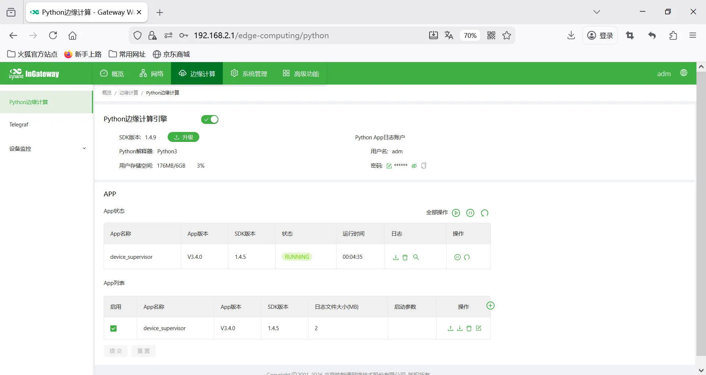 

## II. Gateway Overview

### 2.1 Product Introduction

This data acquisition gateway is used for data acquisition from equipment such as **PLCs, meters, sensors, frequency converters, servos** in industrial sites. It supports multi-protocol parsing, edge computing, data continuation after network interruption, remote management, and data cloud upload.

### 2.2 Main Functions

- Multi serial / network port acquisition
- Mainstream industrial protocol parsing
- MQTT/Modbus TCP data upload
- Edge computing, local caching
- Remote configuration, remote diagnosis, remote upgrade
- Wide temperature industrial-grade design

### 2.3 Typical Application Topology

Device → RS485 / Ethernet → Data acquisition gateway → 4G / Ethernet → Cloud platform / Host computer / SCADA

## III. Hardware Description

## 3.1 Appearance and Interfaces

- Power interface: DC 9–36V
- Serial ports: RS232 / RS485
- Network ports: LAN ×2 (WAN/LAN configurable)
- Wireless: 4G/5G/Wi-Fi (optional)
- Indicator lights: PWR, RUN, NET, signal strength
- Reset button: Restore factory settings

## 3.2 Wiring Instructions

#### 3.2.1 Power Wiring

- Positive: V+
- Negative: V-
- Note: Reverse polarity protection, lightning protection, grounding

#### 3.2.2 RS485 Wiring

- A → A
- B → B
- Shield layer single-ended grounding
- Termination resistor: 120Ω (required for long distances)

#### 3.2.3 Ethernet Wiring

Direct/crossover adaptive, recommends Cat5e or higher network cables.

## IV. Factory Default Parameters

- Default IP: 192.168.2.1
- Subnet mask: 255.255.255.0
- Web username: adm
- Web password: 123456
- Serial port default parameters: 9600,8,N,1


## V. Preliminary Preparation

1. Set computer to same network segment IP as gateway
2. Connect computer to gateway LAN port with network cable
3. Power on gateway, wait for RUN light to illuminate steadily
4. Enter gateway IP in browser to access configuration page

 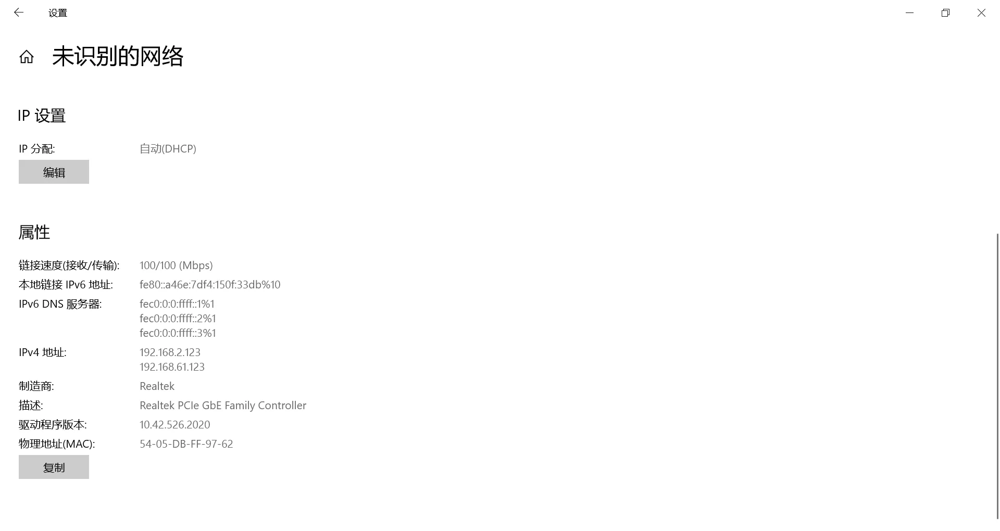

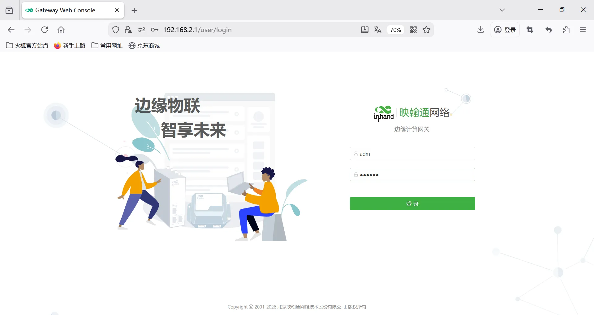

## VI. Network Configuration

1. Insert SIM card (supports NB-IoT/4G)

2. Enable mobile network

3. APN: Automatic / Manual entry

4. View signal strength

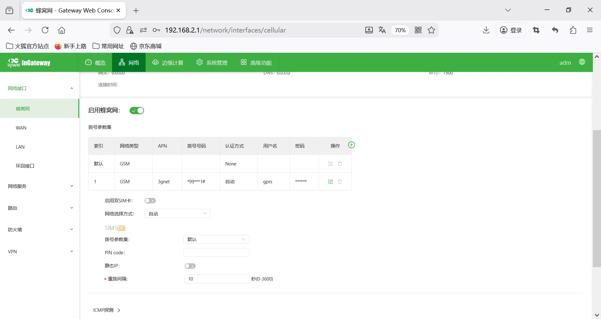

## VII. Serial Port Configuration

1. Enter [Serial Port Configuration] → [COM1/COM2…]
2. Mode selection: Acquisition mode
3. Baud rate: 9600
4. Data bits: 8
5. Parity: None
6. Stop bits: 1
7. Save to take effect

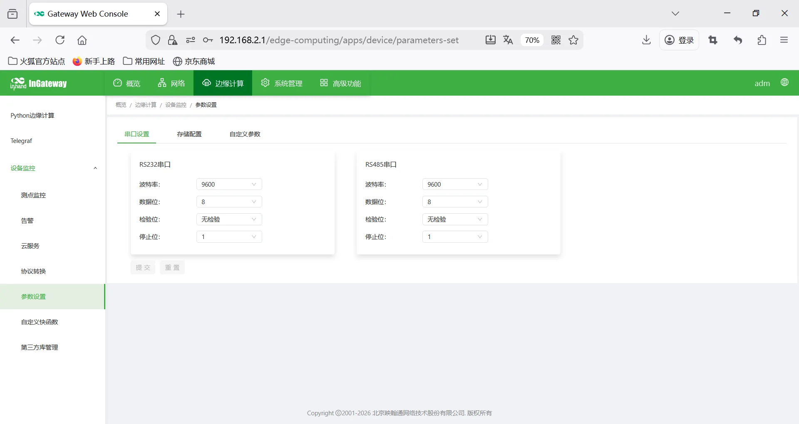 

## VIII. Equipment and Protocol Configuration

### 8.1 View Terminal Equipment Protocol Point Table Document (provided by manufacturer)

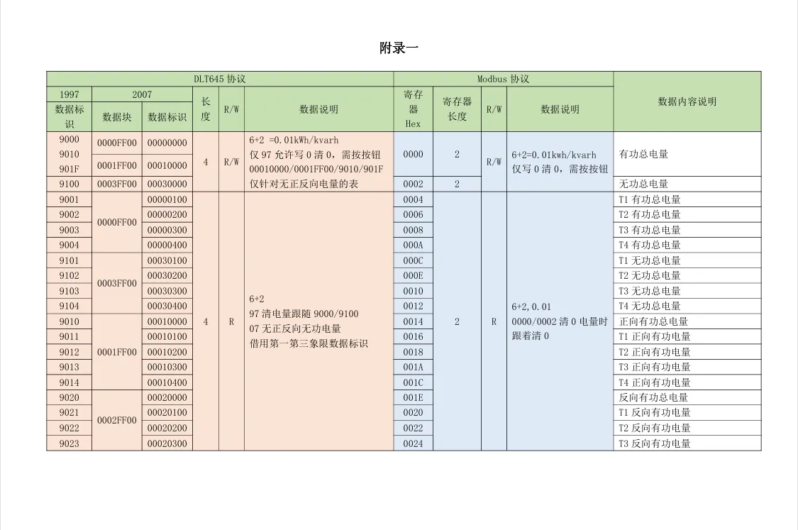

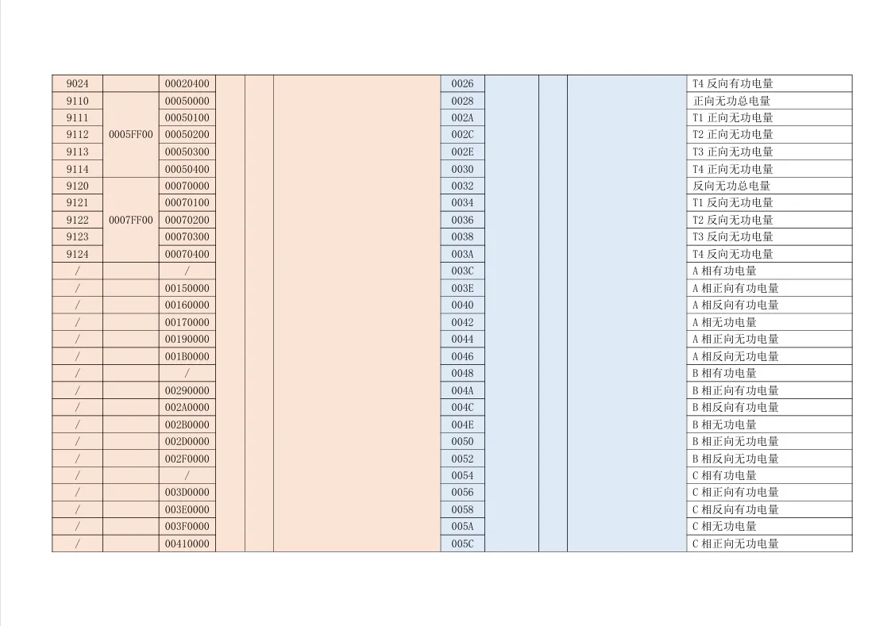


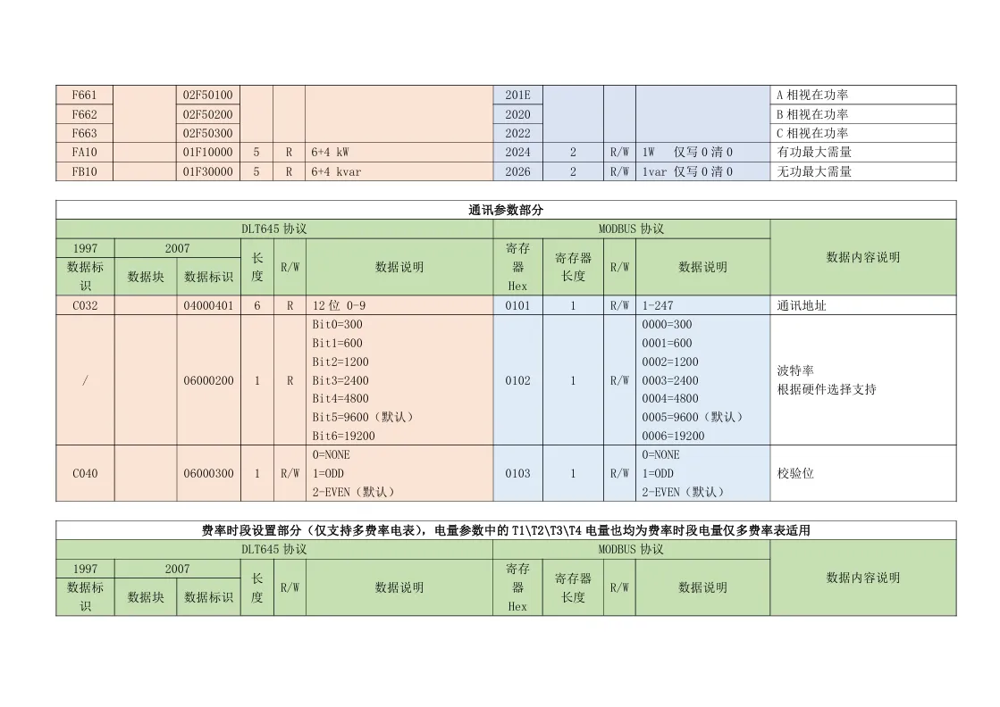

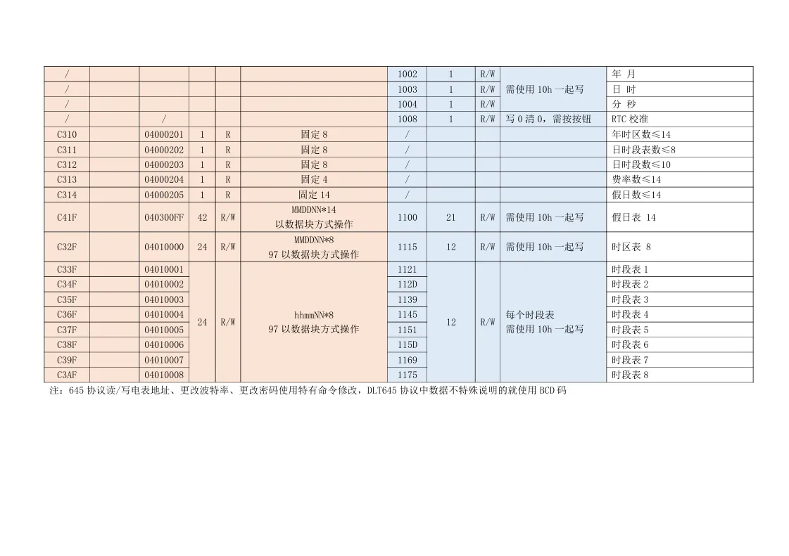

### 8.2 Add Acquisition Device

1. Enter [Data Acquisition Configuration] → [Add Device]
2. Select Modbus RTU
3. Select serial port
4. Set device address 1
5. Set timeout, retry count
6. Save

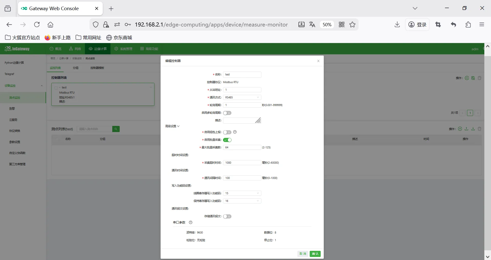

### 8.3 Add Acquisition Points

1. Enter [Point Configuration] → [Add Point]
2. Point name: Custom
3. Register function code: 03(4x)
4. Address offset: 0
5. Data type: int16/uint16/int32/float, etc.
6. Acquisition interval: 100ms
7. Coefficient, unit, range
8. Alarm upper/lower limits (optional)
9. Save


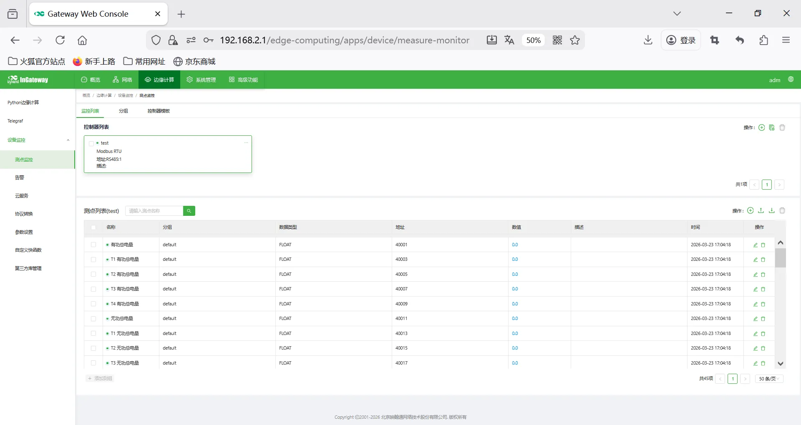

### 8.4 Point Table Import / Export

Supports Excel batch import, export and backup.

## IX. Data Upload Configuration

### HTTP Upload

Configure URL, request method, Header, Body template through code in custom quick functions.


Example Code

```python
# data=[{"name": "ED002092", "health": 1, "timestamp": 1773107297, "timestampMsec": 1773107297383, "measures": [{"name": "pl", "health": 1, "timestamp": 1773107293, "timestampMsec": 1773107293724, "value": 49.960000000000001}]}]

import json
import ssl
from common.Logger import logger
from quickfaas.measure import recall
from http.client import HTTPConnection
from http.client import HTTPException
from http.client import HTTPSConnection

def http(params, variables):
    paramsn=[]
    for i in params:
        dev={"name":i["name"],"health":i["health"],"timestamp":i["timestamp"],"measures":[]}
        for j in i["measures"]:
            dev["measures"].append({"name":j["name"],"health":j["health"],"timestamp":j["timestamp"],"value":j["value"]})
        paramsn.append(dev)
    logger.info(f'http request parameter:{paramsn}')
    try:
        url = variables["url"]
        port = variables["port"]
        h1 = HTTPSConnection(host=url, port=port, context=ssl.SSLContext(),timeout=3)
        if variables["schema"] == "http":
            h1 = HTTPConnection(host=url, port=port)
        body = json.dumps(paramsn)
        logger.info(f'Send HttpBody --> {body}')
        headers = {"Content-Type": "application/json", "x-api-key": variables["x-api-key"]}
        h1.request(method="POST", url=variables["path"], body=body, headers=headers)
        result = h1.getresponse().read()
        h1.close()
        logger.debug(f'http reponse is :{str(result, "UTF-8")}')
    except HTTPException as err:
        logger.error(f'http error:{err}')

def main():
    logger.info("Report measure to platform pass http start")
    variables = {
        "schema":       "http",
        "url":          "***.***.***.***",
        "port":         8080,
        "x-api-key":    "***************************",
        "path":         "dvcRep/reportingforjz"
    }
    measures = recall()
    if measures is None:
        logger.warn("No measures !")
        return
    http(measures, variables)
    logger.info(measures)
    logger.info("Report measure to platform pass http end")
```

## X. Import Gateway Configuration and DSA Configuration

Configuration files are in the config directory


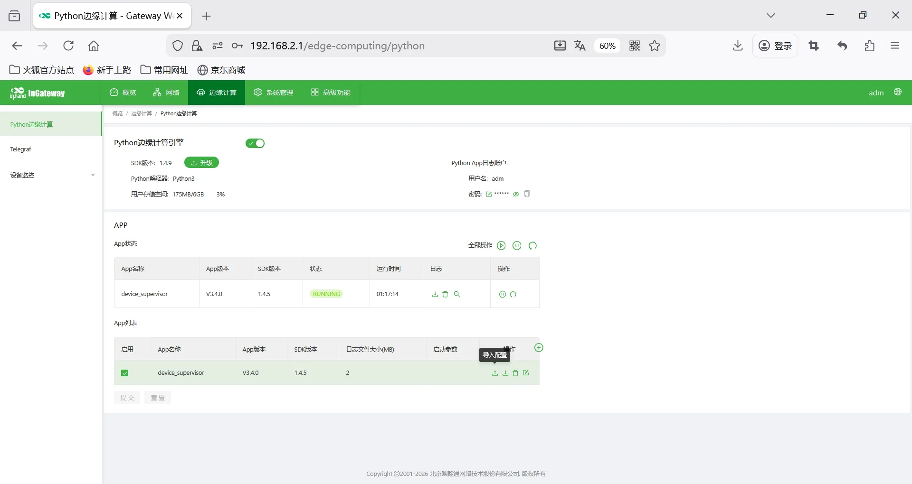
